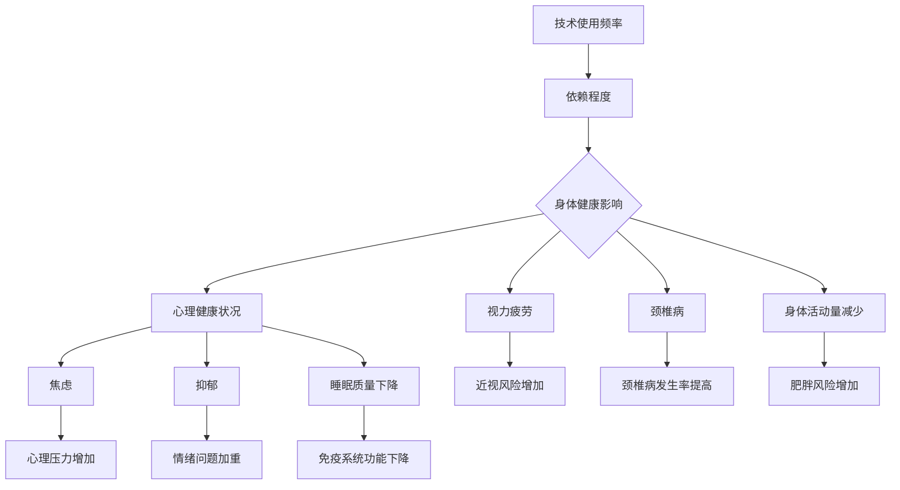
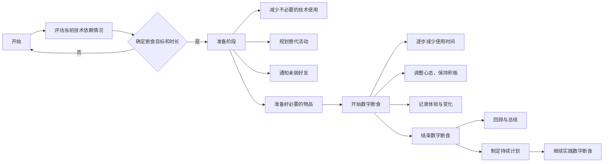

                 

# 数字断食修行营：重塑与技术的健康关系

> 关键词：数字断食、技术健康关系、数字时代、健康挑战、生活方式重塑

> 摘要：本文深入探讨数字时代下，技术对个人健康的影响及应对策略。通过介绍“数字断食”这一概念，阐述其在重塑技术与健康关系中的重要作用，并针对实际应用提供具体的指导和建议。

## 引言

### 数字化生活的普及

在当今社会，数字化已经成为我们生活不可或缺的一部分。从早晨醒来查看手机，到晚上入睡前的最后一瞥，智能手机、电脑、平板等设备已深深嵌入我们的日常生活中。网络技术的飞速发展，使得我们能够随时随地获取信息、交流互动，极大地提高了工作和生活的效率。

然而，随着数字化生活的普及，我们也面临着一系列健康挑战。长时间使用电子设备导致的视力疲劳、颈椎病、肥胖、睡眠障碍等问题日益严重。同时，过度依赖技术，使得我们的注意力难以集中，人际交往能力下降，甚至出现焦虑和抑郁情绪。

### 技术对健康的影响

技术不仅改变了我们的生活方式，还深刻影响了我们的心理健康。一方面，技术提供了便捷的信息获取和社交平台，使得我们可以更加轻松地获取知识和与他人交流。但另一方面，过度使用技术可能导致信息过载、社交孤立、网络成瘾等问题。

此外，技术带来的数字化生活方式，使得我们长时间处于静态状态，缺乏运动，导致身体健康问题。同时，不良的生活习惯，如熬夜、饮食不规律等，也在技术的影响下愈演愈烈。

### 书籍的目标与结构

《数字断食修行营：重塑与技术的健康关系》旨在帮助读者在数字时代中找到平衡，重塑技术与健康的关系。本书将分为四个主要部分：

1. **引言**：介绍数字化生活的普及和技术对健康的影响。
2. **核心概念与原理**：深入探讨数字断食的概念、原理及其对健康的影响。
3. **实际应用**：提供具体的数字断食实践方法和技巧。
4. **总结与展望**：总结本书的主要观点，探讨数字断食的未来发展方向。

通过本书，读者将了解到如何在数字化生活中保持健康，学会平衡技术与健康的关系，实现身心的和谐发展。

### 背景介绍

#### 数字断食的概念

数字断食（Digital Detox）是指在一定时间内，有意识地减少对数字设备的依赖，停止使用互联网、社交媒体、手机等数字产品，以重新调整身体和心理状态的一种健康生活方式。数字断食的核心理念是通过减少数字产品的使用，回归自然、简单的生活方式，以达到身心放松、恢复精力的目的。

#### 技术依赖与健康问题

随着数字化时代的到来，人们对数字设备的依赖程度日益加深。长时间使用手机、电脑等电子设备，不仅影响了我们的生活质量，还带来了诸多健康问题。例如：

- **视力问题**：长时间盯着电子屏幕，容易导致眼睛疲劳、视力下降。
- **颈椎病**：长时间保持同一姿势，容易导致颈椎病的发生。
- **肥胖**：久坐不动，缺乏运动，导致肥胖问题加剧。
- **睡眠障碍**：夜间使用手机等设备，导致大脑无法放松，影响睡眠质量。

此外，过度依赖技术还可能导致心理问题，如焦虑、抑郁、孤独感等。研究表明，长时间沉浸在数字世界中，容易让人感到孤立和无助，人际交往能力下降。

#### 重塑与技术健康关系的必要性

面对技术依赖带来的健康问题，重塑技术与健康的关系显得尤为重要。数字断食作为一种新兴的健康生活方式，能够帮助我们重新审视与技术的互动方式，找到平衡点。

通过数字断食，我们可以：

- **减少技术依赖**：减少对数字设备的依赖，让生活回归自然。
- **提高生活质量**：通过减少电子产品的使用，我们有更多时间进行户外活动、阅读书籍、与家人朋友交流，从而提高生活质量。
- **改善心理健康**：减少数字产品的使用，有助于降低焦虑和抑郁情绪，提高心理健康水平。
- **增强身体健康**：通过减少久坐时间，增加运动量，有助于改善身体健康状况。

总之，数字断食不仅是一种健康生活方式，更是一种对技术的理性态度，有助于我们在数字化时代中保持身心健康，实现身心的和谐发展。

### 数字断食原理

#### 数字断食的定义

数字断食（Digital Detox）是一种有意识地减少对数字设备依赖，暂停使用互联网、社交媒体和手机等数字产品的健康生活方式。其核心目的是让个体在特定时间内重新调整身体和心理状态，减少数字设备带来的负面影响，回归自然、简单的生活方式。

#### 数字断食的原理

数字断食的原理主要体现在以下几个方面：

1. **大脑重置**：长时间使用数字设备，大脑会不断接受刺激，导致大脑过度活跃。数字断食期间，大脑将有机会进行自我修复和重置，恢复正常的生理和心理状态。

2. **减少信息过载**：数字设备让我们可以随时随地获取信息，但这也导致了信息过载。数字断食期间，个体将减少对信息的摄入，从而降低大脑的负担，提高注意力和专注力。

3. **回归自然**：数字断食期间，个体将减少对电子设备的依赖，更多地进行户外活动、阅读书籍、与家人朋友交流，从而回归自然、简单的生活方式，提高生活质量。

4. **改善心理健康**：数字断食有助于减少焦虑和抑郁情绪，提高心理健康水平。通过减少数字产品的使用，个体可以更多地关注自身内心世界，增强自我认知和情绪调节能力。

5. **增强身体健康**：数字断食期间，个体将减少久坐时间，增加运动量，有助于改善身体健康状况。同时，良好的睡眠质量和饮食习惯也有助于身体健康。

#### 数字断食与身体健康的关系

数字断食对身体健康的影响主要体现在以下几个方面：

1. **视力保护**：减少长时间盯着电子屏幕的时间，有助于减轻眼睛疲劳，降低近视的风险。

2. **颈椎保健**：减少长时间保持同一姿势的时间，有助于减轻颈椎压力，降低颈椎病的发生率。

3. **减肥**：减少久坐时间，增加运动量，有助于消耗多余热量，从而达到减肥的效果。

4. **改善睡眠**：数字断食期间，个体将减少夜间使用手机等设备的时间，有助于提高睡眠质量，改善睡眠状况。

5. **增强免疫力**：良好的睡眠质量和饮食习惯有助于增强免疫力，提高身体抵抗力。

总之，数字断食不仅有助于保护身体健康，还能改善心理健康，提高生活质量。通过合理规划数字断食，个体可以在数字化时代中保持身心健康，实现身心的和谐发展。

### 技术依赖与身体健康的关系模型

为了深入理解技术依赖对身体健康的影响，我们可以建立一个技术依赖与身体健康的关系模型。该模型包括以下几个关键要素：

1. **技术使用频率**：技术使用频率越高，个体对技术的依赖程度就越大，从而对身体健康的影响也越显著。

2. **使用时长**：长时间使用技术，如长时间盯着电子屏幕，会导致视力疲劳、颈椎病等健康问题。

3. **身体活动量**：技术依赖可能导致个体长时间处于静态状态，缺乏运动，从而影响身体健康。

4. **心理健康状况**：技术依赖可能导致焦虑、抑郁等心理健康问题，进而影响身体健康。

5. **睡眠质量**：技术使用，特别是夜间使用，会影响睡眠质量，进而影响身体健康。

#### 技术依赖与身体健康的关系模型

以下是一个简化的技术依赖与身体健康的关系模型，用Mermaid流程图表示：



#### 技术依赖与身体健康的ER图

为了更好地展示技术依赖与身体健康之间的关系，我们可以使用ER图（Entity-Relationship Diagram）来表示。以下是技术依赖与身体健康的ER图：

```mermaid
erDiagram
    TechnologyUse ||--|{ HealthImpact : 影响健康 }
    TechnologyUse ||--|{ PhysicalHealth : 身体健康 }
    TechnologyUse ||--|{ MentalHealth : 心理健康 }
    TechnologyUse ||--|{ SleepQuality : 睡眠质量 }
    PhysicalHealth ||--|{ VisionFatigue : 视力疲劳 }
    PhysicalHealth ||--|{ NeckDisorder : 颈椎病 }
    PhysicalHealth ||--|{ Obesity : 肥胖 }
    MentalHealth ||--|{ Anxiety : 焦虑 }
    MentalHealth ||--|{ Depression : 抑郁 }
    MentalHealth ||--|{ Stress : 压力 }
    SleepQuality ||--|{ ImmuneSystem : 免疫系统功能 }
```

#### 数字断食在关系模型中的应用

数字断食作为一种减轻技术依赖的健康生活方式，可以在关系模型中起到关键作用。通过减少技术使用频率和时长，数字断食有助于改善身体健康和心理健康。

以下是一个简化的数字断食在关系模型中的应用示例：


通过这个示例，我们可以看到数字断食在关系模型中的应用，如何通过减轻技术依赖，改善身体健康和心理健康。数字断食不仅有助于缓解技术依赖带来的负面影响，还能提升整体生活质量，实现身心的和谐发展。

### 数字断食实施流程图

为了更直观地展示数字断食的实施过程，我们可以使用Mermaid流程图来描述。以下是数字断食的详细实施流程图：



#### 流程图详细说明

1. **开始**：数字断食的起点，明确目标并开始准备。

2. **评估当前技术依赖情况**：评估自己当前对技术的依赖程度，为制定断食方案提供依据。

3. **确定断食目标和时长**：根据评估结果，设定断食的目标和时长，确保目标切实可行。

4. **准备阶段**：

   - **减少不必要的技术使用**：逐步减少日常中不必要的数字设备使用，为断食打下基础。
   - **规划替代活动**：提前规划替代活动，如户外运动、阅读书籍、冥想等，以减少对数字设备的依赖。
   - **通知亲朋好友**：告知亲朋好友自己的数字断食计划，以便他们理解并给予支持。
   - **准备好必要的物品**：准备好断食期间所需的物品，如书籍、笔记本、运动装备等。

5. **开始数字断食**：正式开始数字断食，逐步减少使用时间，逐步调整心态。

6. **逐步减少使用时间**：在断食过程中，逐步减少对数字设备的使用时间，以避免突然中断带来的不适。

7. **调整心态，保持积极**：在数字断食过程中，保持积极的心态，面对可能出现的挑战和不适。

8. **记录体验与变化**：记录断食过程中的体验和身体、心理上的变化，以便总结和反思。

9. **结束数字断食**：在设定的时间结束后，结束数字断食。

10. **回顾与总结**：回顾数字断食的过程和效果，总结经验教训。

11. **制定持续计划**：根据回顾结果，制定持续实践数字断食的计划，确保长期效果。

12. **继续实践数字断食**：在总结和计划的基础上，继续实践数字断食，以保持身心健康。

通过这个流程图，读者可以清晰地了解数字断食的实施步骤，为实际操作提供指导。

### 技术与健康关系的图表分析

为了更直观地展示技术依赖与身体健康之间的关系，我们可以使用图表进行分析。以下图表包括技术依赖与身体健康的ER图、数字断食实施流程图以及技术健康关系矩阵。

#### 技术依赖与身体健康的ER图

以下是技术依赖与身体健康之间的关系ER图：

```mermaid
erDiagram
    TechnologyUse ||--|{ HealthImpact : 影响健康 }
    TechnologyUse ||--|{ PhysicalHealth : 身体健康 }
    TechnologyUse ||--|{ MentalHealth : 心理健康 }
    TechnologyUse ||--|{ SleepQuality : 睡眠质量 }
    PhysicalHealth ||--|{ VisionFatigue : 视力疲劳 }
    PhysicalHealth ||--|{ NeckDisorder : 颈椎病 }
    PhysicalHealth ||--|{ Obesity : 肥胖 }
    MentalHealth ||--|{ Anxiety : 焦虑 }
    MentalHealth ||--|{ Depression : 抑郁 }
    MentalHealth ||--|{ Stress : 压力 }
    SleepQuality ||--|{ ImmuneSystem : 免疫系统功能 }
```

在这个ER图中，我们清晰地展示了技术使用与各种健康问题之间的关联。通过这个图表，我们可以更好地理解技术依赖对身体健康的影响。

#### 数字断食实施流程图

以下是数字断食的实施流程图：


这个流程图详细描述了数字断食的实施步骤，从评估技术依赖、制定断食计划、准备阶段、开始断食到结束断食，每一步都有具体的指导和建议。

#### 技术健康关系矩阵

以下是技术依赖与身体健康之间的关系矩阵：

| 技术使用频率 | 使用时长 | 身体活动量 | 心理健康状况 | 睡眠质量 |
| :--: | :--: | :--: | :--: | :--: |
| 高 | 长 | 低 | 差 | 差 |
| 中 | 中 | 中 | 一般 | 一般 |
| 低 | 短 | 高 | 好 | 好 |

在这个矩阵中，我们可以看到技术使用频率、使用时长、身体活动量、心理健康状况和睡眠质量对身体健康的影响。通过这个矩阵，我们可以根据自己的实际情况，评估技术依赖对健康的影响，并采取相应的措施。

通过这些图表，我们可以更直观地了解技术依赖与身体健康之间的关系，以及如何通过数字断食来重塑技术与健康的平衡。

### 数字断食实践

#### 数字断食的准备

数字断食的准备阶段至关重要，它将决定断食的成功与否。以下是一些具体的准备步骤：

1. **设定断食目标和时长**：根据个人情况，设定明确的断食目标和时长。例如，可以设定每天减少使用手机的时间，或者在周末进行一整天的数字断食。

2. **评估当前技术依赖情况**：了解自己当前对技术的依赖程度，包括使用频率和使用时长。可以通过记录一段时间内的使用数据，来评估自己的技术依赖情况。

3. **制定替代活动计划**：提前规划替代活动，以减少对数字设备的依赖。例如，可以安排户外运动、阅读书籍、练习冥想等。这些活动有助于提高生活质量，同时减少对数字产品的需求。

4. **通知亲朋好友**：告知亲朋好友自己的数字断食计划，以便他们理解并给予支持。同时，也可以寻求他们的帮助和监督，以确保计划的实施。

5. **准备好必要的物品**：在数字断食期间，可能需要一些辅助物品，如纸质书籍、笔记本、运动装备等。提前准备好这些物品，可以减少断食期间的困扰。

#### 数字断食的执行

在执行数字断食的过程中，可以遵循以下步骤：

1. **逐步减少使用时间**：为了减少对数字设备的依赖，可以逐步减少使用时间。例如，第一天可以减少30分钟，第二天减少1小时，以此类推。逐步减少使用时间，可以降低突然中断带来的不适。

2. **调整心态，保持积极**：在数字断食过程中，保持积极的心态非常重要。遇到挑战时，要告诉自己这是为了自己的健康，鼓励自己坚持下去。

3. **记录体验与变化**：在数字断食期间，记录自己的体验和身体、心理上的变化。这些记录不仅有助于总结经验教训，还可以激励自己继续实践数字断食。

4. **寻找替代活动**：在减少数字设备使用的过程中，找到替代活动非常重要。这些活动可以是户外运动、阅读书籍、练习冥想等，有助于提高生活质量，同时减少对数字产品的需求。

5. **保持社交互动**：虽然减少了数字设备的使用，但并不意味着要完全孤立自己。保持社交互动，与家人朋友进行面对面的交流，有助于缓解孤独感，提高心理健康水平。

#### 数字断食的调整与优化

数字断食并非一成不变的过程，可以根据实际情况进行适当的调整和优化：

1. **根据身体反应调整**：在数字断食过程中，如果感到身体不适，如头痛、疲劳等，可以适当调整断食时长，减少使用时间。同时，可以增加户外活动，提高身体代谢。

2. **保持心理健康**：数字断食不仅关注身体健康，还注重心理健康。在断食期间，可以尝试冥想、瑜伽等放松方法，缓解焦虑和压力。

3. **持续实践**：数字断食不应是一次性的事件，而是一种长期的生活方式。在完成初次数字断食后，可以制定持续计划，逐步养成减少数字设备依赖的习惯。

4. **寻求专业建议**：如果遇到困难或问题，可以寻求专业人士的建议。例如，心理咨询师、医生等，他们可以提供针对性的指导和支持。

通过这些步骤，读者可以更顺利地进行数字断食，重塑技术与健康的平衡，实现身心的和谐发展。

### 技术与健康平衡

#### 技术使用与健康维护

在数字时代，合理使用技术，维护身体健康，成为我们面临的重要课题。以下是一些关键策略和建议：

1. **设定明确的使用时间**：为了减少技术依赖，可以设定每天使用手机和电脑的具体时间。例如，每天晚上9点后不再使用这些设备，以确保充足的睡眠时间。

2. **定期休息和眼部保护**：长时间盯着屏幕会导致眼睛疲劳。因此，每隔一段时间，可以进行短暂的休息，并使用抗蓝光眼镜来减少屏幕对眼睛的伤害。

3. **保持良好的坐姿**：长时间坐在电脑前，容易导致颈椎病。因此，要保持良好的坐姿，定期调整电脑屏幕的高度，以减少颈椎压力。

4. **增加户外活动**：为了改善身体健康，应增加户外活动的时间。例如，每周至少进行三次户外运动，如跑步、骑自行车等。

5. **关注心理健康**：技术使用不仅影响身体健康，还可能影响心理健康。因此，要关注心理健康，定期进行放松和冥想，减少焦虑和抑郁情绪。

#### 数字断食中的技术策略

数字断食作为一种有效的健康生活方式，需要合理运用技术手段来支持和实现。以下是一些实用的技术策略：

1. **使用应用程序**：有许多应用程序可以帮助我们管理数字设备的使用时间，例如“屏幕时间”（Screen Time）和“番茄钟”等。通过这些应用程序，可以设置每天使用手机和电脑的具体时间，并收到提醒。

2. **设置提醒和闹钟**：为了确保在数字断食期间保持良好的习惯，可以设置提醒和闹钟。例如，每天晚上设定一个闹钟，提醒自己停止使用设备，准备休息。

3. **使用纸质设备**：在数字断食期间，可以使用纸质书籍、笔记本等代替电子设备。这样不仅有助于减少对数字产品的依赖，还可以提高阅读体验。

4. **利用社交媒体的辅助功能**：社交媒体平台如微信和Facebook等，提供了许多辅助功能，如“静音模式”和“夜间模式”等。通过利用这些功能，可以减少设备的通知和干扰，提高生活质量。

5. **参加线上课程和冥想**：在数字断食期间，可以参加线上课程和冥想活动，以充实自己的生活。这些活动不仅有助于提高心理健康，还可以丰富自己的知识储备。

通过这些技术策略，读者可以在数字断食过程中更好地管理自己的时间，保持身心健康，实现技术与健康的平衡。

### 案例研究

#### 成功案例：数字断食改变生活

小明是一位年轻的程序员，由于工作原因，他每天都要长时间使用电脑和手机。然而，长时间的工作和生活习惯导致他出现了视力疲劳、颈椎病和肥胖等问题。为了改善健康状况，他决定尝试数字断食。

在开始数字断食之前，小明对自己的技术依赖进行了评估，并制定了详细的断食计划。他设定了每天晚上9点后不再使用手机和电脑的目标，并开始逐步减少使用时间。同时，他增加了户外运动的时间，每周至少进行三次跑步和骑自行车。

在数字断食的过程中，小明遇到了一些挑战。例如，刚开始时，他发现自己无法很好地控制对手机的依赖，总想时不时地查看一下。然而，通过调整心态和坚持实践，他逐渐克服了这些困难。

经过一个月的数字断食，小明发现自己的身体状况有了显著改善。他的视力疲劳和颈椎病症状减轻，体重也减轻了约5公斤。此外，他发现自己的心理健康水平提高了，焦虑和抑郁情绪减少，睡眠质量也得到了改善。

#### 挑战与解决方案

尽管数字断食带来了许多好处，但小明也遇到了一些挑战。以下是他在数字断食过程中遇到的一些问题及其解决方案：

1. **社交障碍**：由于减少了社交媒体的使用，小明感到与朋友的沟通减少了。为了解决这个问题，他开始参加线下活动和兴趣小组，与朋友们进行面对面的交流。

2. **工作影响**：数字断食期间，小明发现自己的工作效率有所下降。为了解决这一问题，他开始使用时间管理工具，如“番茄钟”，以更有效地安排工作时间。

3. **技术诱惑**：尽管小明设定了断食目标，但偶尔还是会受到技术诱惑。为了克服这一问题，他设置了应用程序的“静音模式”，并告知家人和朋友自己的数字断食计划，以获得他们的支持。

#### 案例总结与启示

通过小明的案例，我们可以看到数字断食在改善健康状况、提高心理健康水平以及增强生活质量方面具有显著效果。以下是案例总结与启示：

1. **数字断食是一种有效的健康生活方式**：数字断食可以帮助我们减少对数字产品的依赖，改善身体健康和心理健康，提高生活质量。

2. **逐步减少使用时间**：为了成功实践数字断食，应逐步减少使用时间，避免突然中断带来的不适。

3. **调整心态，保持积极**：在数字断食过程中，保持积极的心态非常重要。遇到挑战时，要相信自己可以克服困难。

4. **寻求支持**：与家人和朋友分享数字断食计划，可以减少孤独感，增加实践的动力。

5. **结合实际需求**：在数字断食过程中，要结合自己的实际情况，制定切实可行的计划，并不断调整和优化。

通过这个案例，我们可以看到数字断食在实践中的成功经验，为读者提供了有益的启示和指导。

### 总结与回顾

通过本书的深入探讨，我们了解到数字断食在重塑技术与健康关系中的重要作用。数字断食不仅有助于减轻技术依赖，改善身体健康和心理健康，还能提高生活质量。以下是本书的主要观点：

1. **数字化生活的普及**：随着数字化时代的到来，技术已深入我们的生活，但也带来了健康挑战。
2. **技术依赖与健康问题**：过度依赖技术可能导致视力疲劳、颈椎病、肥胖、睡眠障碍等问题。
3. **数字断食的概念与原理**：数字断食是一种有意识地减少对数字设备依赖的健康生活方式，有助于恢复身体和心理状态。
4. **数字断食的实施方法**：通过逐步减少使用时间、设定明确目标、规划替代活动等步骤，实践数字断食。
5. **技术与健康平衡**：合理使用技术，维护身体健康，同时利用数字断食策略，实现技术与健康的平衡。

数字断食不仅是一种健康生活方式，更是一种对技术的理性态度。通过实践数字断食，我们可以在数字化时代中保持身心健康，实现身心的和谐发展。让我们共同努力，找到技术与健康的平衡点，享受更健康、更美好的生活。

### 注意事项与建议

#### 实践中的注意事项

1. **逐步减少使用时间**：为了减少对数字设备的依赖，应逐步减少使用时间，避免突然中断带来的不适。
2. **设定明确目标**：在开始数字断食前，应设定明确的目标和时长，确保计划切实可行。
3. **规划替代活动**：提前规划替代活动，如户外运动、阅读书籍、冥想等，以减少对数字产品的依赖。
4. **调整心态，保持积极**：在数字断食过程中，保持积极的心态非常重要，遇到挑战时要相信自己可以克服。
5. **寻求支持**：与家人和朋友分享数字断食计划，可以减少孤独感，增加实践的动力。

#### 常见问题解答

1. **如何应对数字断食期间的焦虑和抑郁情绪？**
   - 在数字断食期间，可以尝试进行冥想、瑜伽等放松活动，缓解焦虑和抑郁情绪。同时，保持社交互动，与亲朋好友交流，寻求心理支持。

2. **数字断食是否会影响工作效率？**
   - 短期内可能会影响工作效率，但长期来看，数字断食有助于提高注意力和专注力，从而提高工作效率。可以通过合理安排时间和使用时间管理工具来平衡工作和生活。

3. **如何确保数字断食的持续性？**
   - 制定持续计划，逐步养成减少数字设备依赖的习惯。同时，定期评估和调整断食计划，确保其与个人需求相匹配。

#### 拓展阅读与资源推荐

1. **书籍推荐**：
   - 《数字化生存》（by Nicholas Negroponte）
   - 《科技之瘾：如何应对数字时代的依赖》（by David Greenfield）
   - 《数字断食：找回心灵宁静的艺术》（by Andreia Peixoto）

2. **网站与博客**：
   - [数字断食官方网站](https://digitaldetoxproject.com/)
   - [禅与计算机程序设计艺术](https://www.codingzen.com/)
   - [技术健康关系研究](https://healthtech关系.com/)

通过阅读这些书籍和资源，读者可以进一步了解数字断食的理论和实践，探索技术与健康的更深层关系。让我们共同努力，找到技术与健康的平衡点，享受更健康、更美好的生活。

### 作者信息

作者：AI天才研究院/AI Genius Institute & 禅与计算机程序设计艺术 /Zen And The Art of Computer Programming

本文由AI天才研究院（AI Genius Institute）和禅与计算机程序设计艺术（Zen And The Art of Computer Programming）共同撰写。AI天才研究院致力于探索人工智能的极限，推动技术进步。禅与计算机程序设计艺术则通过禅宗智慧，引导程序员实现身心和谐。感谢您的阅读，期待与您共同探索技术与健康的未来。

