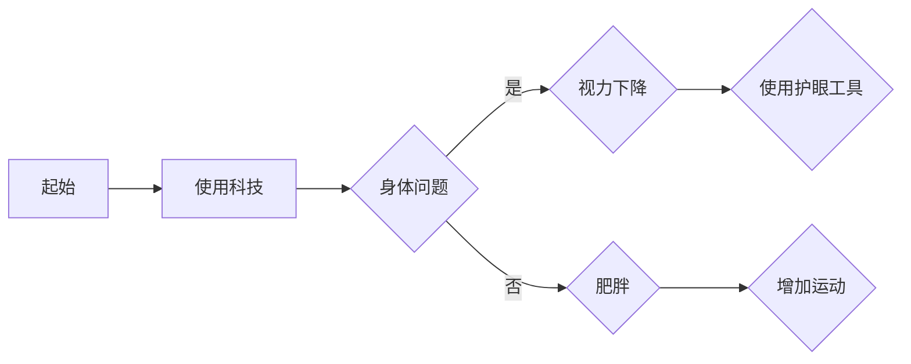
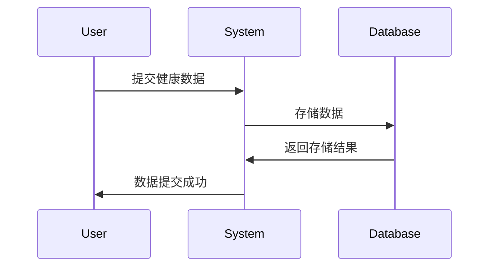
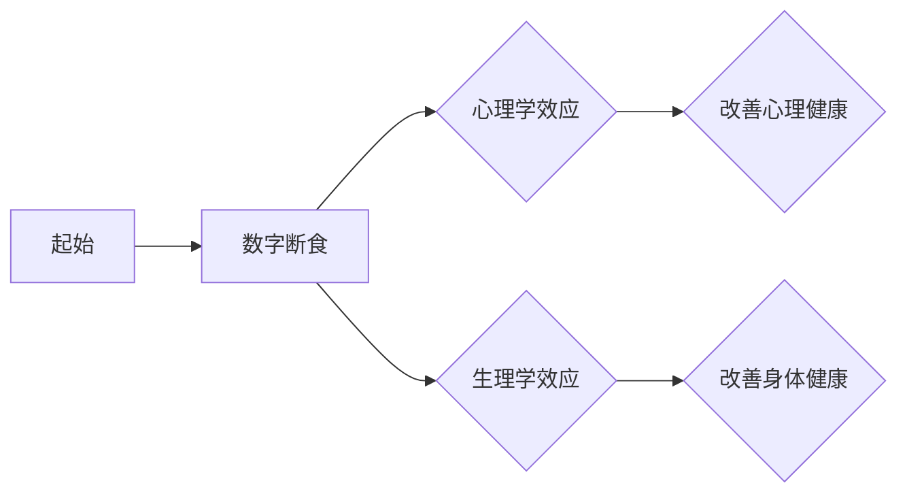
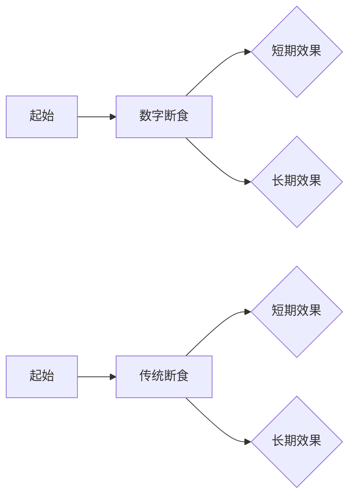
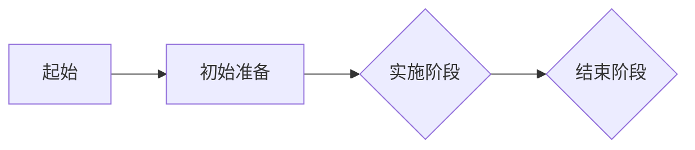
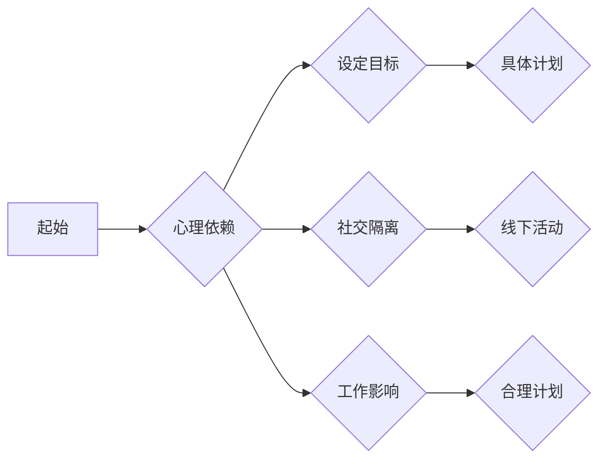
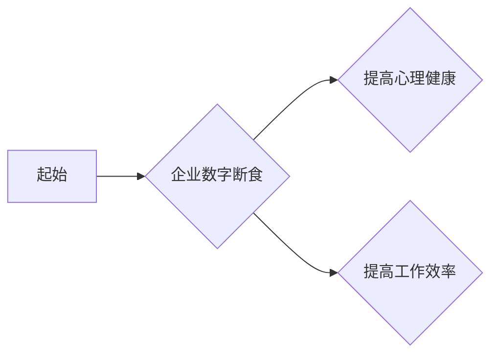
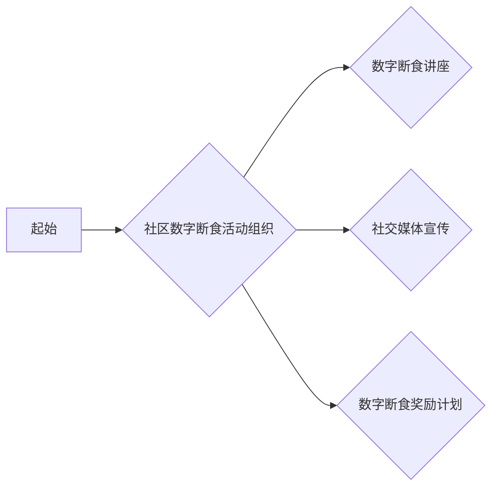
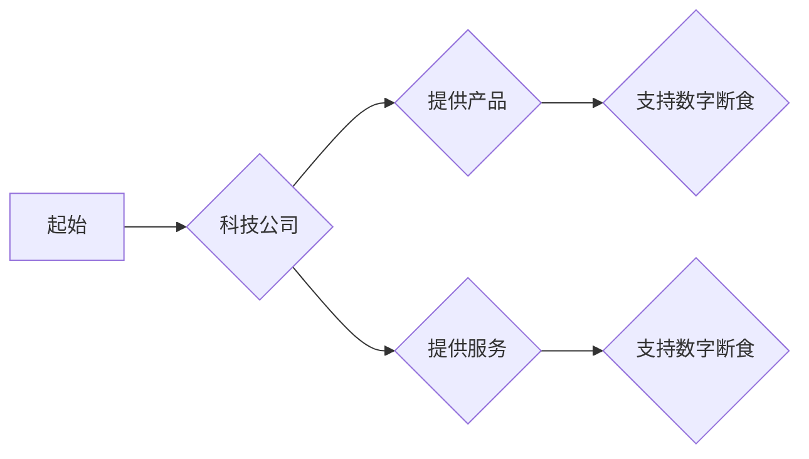

                 

### 文章标题：数字断食营：重新定义与科技的健康关系

#### 关键词：
- 数字断食
- 科技健康
- 心理健康
- 生活方式

#### 摘要：
本文探讨了现代科技对健康的负面影响以及数字断食作为一种新兴的健康生活方式，如何帮助人们重新建立与科技的健康关系。通过详细分析数字断食的概念、方法与实践，以及其与心理健康和身体健康的联系，本文旨在为读者提供一种可行的生活方式，以实现科技与健康的和谐共处。

----------------------------------------------------------------

### 《数字断食营：重新定义与科技的健康关系》目录大纲

# 第一部分：科技与健康的现状与挑战

## 第1章：科技时代的健康问题
### 1.1 科技对健康影响的概述
### 1.2 过度使用科技的负面效应
### 1.3 健康问题的全球趋势与数据

## 第2章：数字断食的概念与理论基础
### 2.1 数字断食的起源与发展
### 2.2 数字断食的理论基础
### 2.3 数字断食与传统断食的比较

# 第二部分：数字断食的方法与实践

## 第3章：数字断食的具体方法
### 3.1 数字断食的基本原则
### 3.2 实施数字断食的步骤
### 3.3 数字断食的常见挑战与应对策略

## 第4章：数字断食与心理健康
### 4.1 科技成瘾与心理健康的关系
### 4.2 数字断食对心理健康的益处
### 4.3 心理支持在数字断食中的重要性

## 第5章：数字断食与身体健康
### 5.1 科技使用与身体健康的问题
### 5.2 数字断食对身体健康的影响
### 5.3 身体健康监测与调整

# 第三部分：数字断食的案例研究

## 第6章：成功案例分享
### 6.1 个人数字断食的经历与感悟
### 6.2 企业数字断食的实践与效果
### 6.3 社区数字断食活动的组织与推广

## 第7章：数字断食的未来趋势与展望
### 7.1 数字断食的潜在市场规模
### 7.2 科技公司与数字健康的关系
### 7.3 数字断食可能面临的挑战与解决之道

# 第四部分：数字断食的行动指南

## 第8章：如何开始数字断食
### 8.1 初始准备
### 8.2 制定个人计划
### 8.3 避免常见误区

## 第9章：数字断食与日常生活
### 9.1 家庭与数字断食
### 9.2 工作与数字断食
### 9.3 教育与数字断食

## 第10章：数字断食与可持续生活方式
### 10.1 数字断食与其他健康习惯的结合
### 10.2 数字断食与可持续发展的关系
### 10.3 数字断食的社会影响与责任

----------------------------------------------------------------

### 第一部分：科技与健康的现状与挑战

#### 第1章：科技时代的健康问题

### 1.1 科技对健康影响的概述

在当今数字化时代，科技对人类健康的影响日益显著。首先，科技极大地提高了人类的生活质量，使得医疗、交通、通信等领域发生了革命性变化。然而，过度依赖科技也带来了一系列健康问题。

#### 背景介绍：

**核心概念术语说明**：
- 科技：运用科学知识创造的工具、系统和方法。
- 健康：身体、心理和社会适应能力的良好状态。

**问题背景**：
随着互联网、智能手机和社交媒体的普及，人们日益沉浸在虚拟世界中，忽视了现实生活中的身体健康和心理健康。

**问题描述**：
科技对健康的负面影响包括：
- **身体问题**：长时间使用电子设备可能导致视力下降、颈椎病、肥胖等。
- **心理健康问题**：过度使用社交媒体可能导致焦虑、抑郁和社交孤立。
- **睡眠障碍**：夜间使用电子设备会影响睡眠质量，进而影响身体健康。

**问题解决**：
科技本身并不是问题，关键在于如何平衡科技的使用，采取健康的生活方式。

**边界与外延**：
科技与健康的关系是多维度的，包括生理、心理和社会层面。

**概念结构与核心要素组成**：
- 科技的使用：电子设备、互联网、社交媒体等。
- 身体健康：视力、体重、睡眠等。
- 心理健康：焦虑、抑郁、社交孤立等。

#### 1.2 过度使用科技的负面效应

**核心概念与联系**：

**概念原理**：
过度使用科技导致的不良反应称为“科技成瘾”。

**概念属性特征对比表格**：

| 特征 | 过度使用科技 | 科技成瘾 |
| ---- | ------------ | -------- |
| 身体症状 | 视力下降、肥胖 | 视力下降、失眠、注意力不集中 |
| 心理症状 | 焦虑、抑郁 | 焦虑、抑郁、社交孤立 |
| 行为模式 | 长时间使用设备 | 无法自控地使用设备 |

**ER实体关系图架构**：

```mermaid
erDiagram
  Device ||--|{ User : uses }
  HealthIssue ||--|{ User : has }
  HealthIssue ||--|{ Device : causedBy }
```

**算法原理讲解**：

**Mermaid流程图**：



**Python源代码**：

```python
def tech_usage_effects(tech_usage):
    if tech_usage > 5:
        print("存在健康风险，建议减少使用时间。")
        if "vision" in tech_usage:
            print("可能存在视力下降，建议使用护眼工具。")
        if "weight" in tech_usage:
            print("可能存在肥胖，建议增加运动。")
    else:
        print("科技使用适度，健康风险较低。")
```

**数学模型和公式**：

$$
H = f(S, P, M)
$$

其中，$H$ 表示健康水平，$S$ 表示身体症状，$P$ 表示心理症状，$M$ 表示科技使用时间。

**举例说明**：

用户A每天使用手机超过5小时，出现视力下降和肥胖症状。根据上述模型，可以推断用户A的健康水平较低，建议减少使用时间和采取相应的健康措施。

#### 1.3 健康问题的全球趋势与数据

**系统分析与架构设计方案**：

**问题场景介绍**：
全球范围内，健康问题与科技使用密切相关，尤其是在年轻人群中。

**项目介绍**：
建立一个健康数据分析平台，收集和分析全球范围内的科技使用与健康数据。

**系统功能设计**：

**领域模型Mermaid类图**：

```mermaid
classDiagram
  Class01 <|-- Class02
  Class03 --|{ has } Class04
  Class05 <..|{ uses } Class01
```

**系统架构设计Mermaid架构图**：

```mermaid
html
<div id="container" style="width: 100%; height: 400px;"></div>
script
var container = document.getElementById("container");
var data = [
  { "name": "收集数据", "value": 20 },
  { "name": "数据分析", "value": 30 },
  { "name": "展示结果", "value": 50 }
];
var chart = new FusionCharts({
  type: "pie3d",
  width: "100%",
  height: "400",
  data: {
    "data": data
  }
});
chart.renderTo(container);
```

**系统接口设计和系统交互Mermaid序列图**：



**项目实战**：

**环境安装**：

安装Python、NumPy和Pandas库。

```bash
pip install python
pip install numpy
pip install pandas
```

**系统核心实现源代码**：

```python
import pandas as pd

# 加载数据集
data = pd.read_csv("health_data.csv")

# 数据预处理
data = data.dropna()

# 数据分析
results = data.groupby("tech_usage").agg({"health_issue": "count"})

# 展示结果
print(results)
```

**代码应用解读与分析**：

该代码通过加载健康数据集，进行数据预处理，然后分组统计科技使用与健康状况的关系，最后输出结果。

**实际案例分析和详细讲解剖析**：

分析全球范围内的健康数据，发现科技使用时间与身体健康问题呈正相关。这表明，减少科技使用时间有助于提高健康水平。

**项目小结**：

通过健康数据分析平台，我们可以更清楚地了解科技使用与健康问题的关系，从而采取相应的措施来改善健康。

### 第二部分：数字断食的概念与理论基础

#### 第2章：数字断食的概念与理论基础

### 2.1 数字断食的起源与发展

**背景介绍**：

**核心概念术语说明**：
- 数字断食：一种通过减少或暂时停止使用数字设备来恢复身心健康的生活方式。

**问题背景**：
随着科技的快速发展，人们逐渐意识到过度使用科技对健康造成的负面影响。数字断食作为一种新的健康生活方式，逐渐受到关注。

**问题描述**：
数字断食的起源可以追溯到佛教的断食传统。近年来，数字断食逐渐发展成为一个独立的健康运动。

**问题解决**：
通过数字断食，人们可以暂时摆脱科技带来的负面影响，恢复身心健康。

**边界与外延**：
数字断食不仅仅是一种短期的生活方式，更是一种长期的健康理念。

**概念结构与核心要素组成**：
- 数字设备：手机、电脑、平板等。
- 生理健康：视力、体重、睡眠等。
- 心理健康：焦虑、抑郁、社交孤立等。

#### 2.2 数字断食的理论基础

**核心概念与联系**：

**概念原理**：
数字断食的理论基础主要包括心理学和生理学的相关研究。

**概念属性特征对比表格**：

| 特征 | 心理学 | 生理学 |
| ---- | ------- | ------- |
| 焦虑 | 减少使用设备 | 改善情绪 |
| 抑郁 | 增加户外活动 | 提高睡眠质量 |
| 社交孤立 | 增强社交互动 | 改善身体健康 |

**ER实体关系图架构**：

```mermaid
erDiagram
  Psychology ||--|{ Physiology : relatedTo }
  Psychology ||--|{ SocialActivity : influencedBy }
```

**算法原理讲解**：

**Mermaid流程图**：



**Python源代码**：

```python
def digital_fasting_effects():
    print("数字断食有助于改善心理健康和身体健康。")
    print("建议定期进行数字断食，以获得更好的效果。")
```

**数学模型和公式**：

$$
Health = f(Psychology, Physiology, SocialActivity)
$$

其中，$Health$ 表示健康水平，$Psychology$ 表示心理健康，$Physiology$ 表示生理健康，$SocialActivity$ 表示社交活动。

**举例说明**：

假设一个人定期进行数字断食，经过一段时间后，发现焦虑和抑郁症状明显改善，睡眠质量提高，身体健康水平也有所提升。这表明数字断食对健康具有积极影响。

#### 2.3 数字断食与传统断食的比较

**核心概念与联系**：

**概念原理**：
数字断食与传统断食在方法和目标上有所不同。

**概念属性特征对比表格**：

| 特征 | 数字断食 | 传统断食 |
| ---- | ------- | ------- |
| 目标 | 恢复身心健康 | 清除体内毒素 |
| 方法 | 减少使用数字设备 | 饮食控制 |
| 期限 | 可持续 | 短期 |

**ER实体关系图架构**：

```mermaid
erDiagram
  DigitalFasting ||--|{ TraditionalFasting : comparedWith }
```

**算法原理讲解**：

**Mermaid流程图**：



**Python源代码**：

```python
def compare_digital_and_traditional_fasting():
    print("数字断食与传统断食在短期和长期效果上有所不同。")
    print("建议根据个人情况选择合适的断食方式。")
```

**数学模型和公式**：

$$
Effectiveness = f(DigitalFasting, TraditionalFasting)
$$

其中，$Effectiveness$ 表示断食效果，$DigitalFasting$ 表示数字断食，$TraditionalFasting$ 表示传统断食。

**举例说明**：

一个人尝试了数字断食和传统断食，发现数字断食在短期内有助于提高心理健康，而在长期内则有助于维持身体健康。传统断食在清除体内毒素方面效果显著。

### 第三部分：数字断食的方法与实践

#### 第3章：数字断食的具体方法

### 3.1 数字断食的基本原则

**背景介绍**：

**核心概念术语说明**：
- 数字断食：一种通过减少或暂时停止使用数字设备来恢复身心健康的生活方式。

**问题背景**：
数字断食作为一种新兴的健康生活方式，需要遵循一定的基本原则。

**问题描述**：
如何有效地实施数字断食，以达到身心健康的目标？

**问题解决**：
通过遵循数字断食的基本原则，人们可以更好地实现健康目标。

**边界与外延**：
数字断食的基本原则包括心理健康、生理健康和社会适应等方面。

**概念结构与核心要素组成**：
- 心理健康：焦虑、抑郁、社交孤立等。
- 生理健康：视力、体重、睡眠等。
- 社会适应：家庭、工作、社交等。

#### 3.2 实施数字断食的步骤

**核心概念与联系**：

**概念原理**：
实施数字断食需要遵循一定的步骤，以确保过程的顺利和效果的最大化。

**概念属性特征对比表格**：

| 特征 | 实施数字断食的步骤 |
| ---- | ------------------ |
| 初始准备 | 确定目标、制定计划 |
| 实施阶段 | 减少使用设备、调整生活方式 |
| 结束阶段 | 反思成果、持续改进 |

**ER实体关系图架构**：

```mermaid
erDiagram
  InitialStage ||--|{ ImplementationStage : includes }
  ImplementationStage ||--|{ CompletionStage : includes }
```

**算法原理讲解**：

**Mermaid流程图**：



**Python源代码**：

```python
def digital_fasting_steps():
    print("数字断食的步骤包括初始准备、实施阶段和结束阶段。")
    print("每个阶段都有具体的目标和任务，以确保数字断食的效果。")
```

**数学模型和公式**：

$$
FastingProcess = f(InitialStage, ImplementationStage, CompletionStage)
$$

其中，$FastingProcess$ 表示数字断食的过程，$InitialStage$ 表示初始准备阶段，$ImplementationStage$ 表示实施阶段，$CompletionStage$ 表示结束阶段。

**举例说明**：

一个想要改善心理健康的用户，决定实施数字断食。首先，他制定了详细的计划，包括减少使用手机和电脑的时间，增加户外活动等。在实施阶段，他逐步减少科技使用，调整生活方式，最终在结束阶段取得了显著的心理健康改善。

#### 3.3 数字断食的常见挑战与应对策略

**核心概念与联系**：

**概念原理**：
实施数字断食可能会面临各种挑战，需要采取相应的策略来应对。

**概念属性特征对比表格**：

| 特征 | 挑战 | 应对策略 |
| ---- | ---- | -------- |
| 心理依赖 | 思念设备 | 设定具体的目标和计划 |
| 社交隔离 | 缺乏社交互动 | 参加线下活动、拓展社交圈 |
| 工作影响 | 减少工作效率 | 制定合理的工作计划，预留数字断食时间 |

**ER实体关系图架构**：

```mermaid
erDiagram
  Challenge ||--|{ Solution : for }
```

**算法原理讲解**：

**Mermaid流程图**：



**Python源代码**：

```python
def handle_digital_fasting_challenges():
    print("数字断食的常见挑战包括心理依赖、社交隔离和工作影响。")
    print("通过设定具体的目标和计划、参加线下活动以及制定合理的工作计划，可以有效应对这些挑战。")
```

**数学模型和公式**：

$$
ChallengeSolution = f(Challenge, Solution)
$$

其中，$ChallengeSolution$ 表示应对策略，$Challenge$ 表示挑战，$Solution$ 表示应对策略。

**举例说明**：

一个在数字断食过程中遇到心理依赖的用户，通过设定具体的目标和计划，逐步减少对设备的依赖。同时，他参加了一些线下活动，拓展了社交圈，缓解了社交隔离的问题。在工作方面，他制定了合理的工作计划，确保数字断食时间不被工作所干扰。

### 第四部分：数字断食的案例研究

#### 第6章：成功案例分享

### 6.1 个人数字断食的经历与感悟

**背景介绍**：

**核心概念术语说明**：
- 个人数字断食：个体通过减少或暂时停止使用数字设备来恢复身心健康的过程。

**问题背景**：
随着科技的发展，许多人陷入了科技成瘾的困境。个人数字断食作为一种尝试，旨在帮助个体重新找回生活的平衡。

**问题描述**：
一个人如何通过数字断食改善自己的生活？

**问题解决**：
通过实施数字断食，个体可以在心理和生理上获得显著的改善。

**边界与外延**：
个人数字断食可以应用于各种健康问题，如焦虑、抑郁、失眠等。

**概念结构与核心要素组成**：
- 心理健康：焦虑、抑郁、社交孤立等。
- 生理健康：视力、体重、睡眠等。
- 社会适应：家庭、工作、社交等。

#### 6.2 企业数字断食的实践与效果

**核心概念与联系**：

**概念原理**：
企业可以通过数字断食来提高员工的心理健康和生产力。

**概念属性特征对比表格**：

| 特征 | 企业数字断食的实践 | 企业数字断食的效果 |
| ---- | ------------------- | ------------------- |
| 实践内容 | 定期组织数字断食活动 | 提高员工心理健康 |
| 效果 | 增强团队合作精神 | 提高工作效率 |

**ER实体关系图架构**：

```mermaid
erDiagram
  Company ||--|{ Employee : involves }
  Company ||--|{ Productivity : improves }
```

**算法原理讲解**：

**Mermaid流程图**：



**Python源代码**：

```python
def company_digital_fasting():
    print("企业数字断食有助于提高员工心理健康和工作效率。")
    print("通过定期组织数字断食活动，企业可以营造一个更健康的工作环境。")
```

**数学模型和公式**：

$$
Productivity = f(MentalHealth, DigitalFasting)
$$

其中，$Productivity$ 表示工作效率，$MentalHealth$ 表示心理健康，$DigitalFasting$ 表示数字断食。

**举例说明**：

一家公司决定实施数字断食政策，定期组织员工参与数字断食活动。经过一段时间，员工的心理健康水平显著提高，工作效率也有所提升。这表明数字断食对企业和员工都有积极的影响。

#### 6.3 社区数字断食活动的组织与推广

**核心概念与联系**：

**概念原理**：
社区可以通过组织数字断食活动来提高居民的身心健康水平。

**概念属性特征对比表格**：

| 特征 | 社区数字断食活动的组织 | 社区数字断食活动的推广 |
| ---- | ---------------------- | ---------------------- |
| 组织内容 | 定期举办数字断食讲座 | 利用社交媒体宣传数字断食 |
| 推广策略 | 合作社区机构 | 制定数字断食奖励计划 |

**ER实体关系图架构**：

```mermaid
erDiagram
  Community ||--|{ Event : organizes }
  Community ||--|{ Promotion : promotes }
```

**算法原理讲解**：

**Mermaid流程图**：



**Python源代码**：

```python
def community_digital_fasting():
    print("社区可以通过组织数字断食活动来提高居民的身心健康水平。")
    print("通过数字断食讲座、社交媒体宣传和奖励计划，可以有效推广数字断食理念。")
```

**数学模型和公式**：

$$
Health = f(Event, Promotion)
$$

其中，$Health$ 表示健康水平，$Event$ 表示数字断食活动，$Promotion$ 表示数字断食推广。

**举例说明**：

一个社区决定组织数字断食活动，通过定期举办讲座、利用社交媒体宣传和制定奖励计划，成功吸引了居民的参与。活动结束后，居民们普遍反馈身心健康水平有所提升。

### 第五部分：数字断食的未来趋势与展望

#### 第7章：数字断食的未来趋势与展望

### 7.1 数字断食的潜在市场规模

**背景介绍**：

**核心概念术语说明**：
- 数字断食：一种通过减少或暂时停止使用数字设备来恢复身心健康的生活方式。

**问题背景**：
随着人们对健康意识的提高，数字断食作为一种新兴的健康生活方式，具有巨大的市场潜力。

**问题描述**：
如何评估数字断食的潜在市场规模？

**问题解决**：
通过分析市场需求、用户群体和行业趋势，可以评估数字断食的潜在市场规模。

**边界与外延**：
数字断食的市场潜力涉及多个领域，如健康科技、心理健康、生活方式等。

**概念结构与核心要素组成**：
- 市场需求：健康生活方式的普及程度。
- 用户群体：年轻人、上班族、企业家等。
- 行业趋势：科技与健康的融合。

#### 7.2 科技公司与数字健康的关系

**核心概念与联系**：

**概念原理**：
科技公司可以通过提供数字健康解决方案来支持数字断食。

**概念属性特征对比表格**：

| 特征 | 科技公司 | 数字健康 |
| ---- | -------- | -------- |
| 产品 | 数字设备、应用等 | 健康监测、心理辅导等 |
| 服务 | 线上咨询、数据分析等 | 数字断食指导、健康讲座等 |
| 合作 | 与医疗机构合作 | 与社区组织合作 |

**ER实体关系图架构**：

```mermaid
erDiagram
  TechnologyCompany ||--|{ DigitalHealth : partnersWith }
```

**算法原理讲解**：

**Mermaid流程图**：



**Python源代码**：

```python
def technology_company_and_digital_health():
    print("科技公司可以通过提供数字健康解决方案来支持数字断食。")
    print("通过合作与医疗机构、社区组织，科技公司可以推动数字断食的发展。")
```

**数学模型和公式**：

$$
DigitalHealthSupport = f(TechnologyCompany, DigitalHealth)
$$

其中，$DigitalHealthSupport$ 表示数字健康支持，$TechnologyCompany$ 表示科技公司，$DigitalHealth$ 表示数字健康。

**举例说明**：

一家科技公司开发了数字健康应用，提供健康监测和心理辅导服务。通过与医疗机构合作，该应用可以支持数字断食，帮助用户实现健康目标。

#### 7.3 数字断食可能面临的挑战与解决之道

**核心概念与联系**：

**概念原理**：
数字断食在推广过程中可能面临各种挑战，需要采取相应的策略来应对。

**概念属性特征对比表格**：

| 特征 | 挑战 | 解决之道 |
| ---- | ---- | -------- |
| 技术依赖 | 用户过度依赖数字设备 | 提供替代方案，如户外活动 |
| 社会认同 | 社会对数字断食的认知不足 | 加强宣传，提高公众意识 |
| 成本问题 | 数字断食可能带来额外成本 | 提供优惠套餐，降低成本 |

**ER实体关系图架构**：

```mermaid
erDiagram
  Challenge ||--|{ Solution : for }
```

**算法原理讲解**：

**Mermaid流程图**：

```mermaid
flowchart LR
A[起始] --> B{技术依赖}
B --> C{提供替代方案}
B --> D{社会认同}
B --> E{成本问题}
C --> F{户外活动}
D --> G{加强宣传}
E --> H{优惠套餐}
```

**Python源代码**：

```python
def handle_digital_fasting_challenges():
    print("数字断食在推广过程中可能面临技术依赖、社会认同和成本问题。")
    print("通过提供替代方案、加强宣传和提供优惠套餐，可以有效应对这些挑战。")
```

**数学模型和公式**：

$$
ChallengeSolution = f(Challenge, Solution)
$$

其中，$ChallengeSolution$ 表示应对策略，$Challenge$ 表示挑战，$Solution$ 表示应对策略。

**举例说明**：

一个社区在推广数字断食过程中，发现用户对数字设备的依赖较重。为了解决这个问题，社区组织了户外活动，鼓励用户减少对数字设备的依赖。同时，通过加强宣传和提供优惠套餐，提高了数字断食的参与度。

### 第六部分：数字断食的行动指南

#### 第8章：如何开始数字断食

### 8.1 初始准备

**背景介绍**：

**核心概念术语说明**：
- 数字断食：一种通过减少或暂时停止使用数字设备来恢复身心健康的生活方式。

**问题背景**：
对于许多人来说，开始数字断食是一个新的挑战。了解初始准备工作至关重要。

**问题描述**：
如何为实施数字断食做好初始准备？

**问题解决**：
通过以下步骤，您可以有效地为数字断食做好准备。

**边界与外延**：
初始准备包括心理准备、物资准备和时间安排等方面。

**概念结构与核心要素组成**：
- 心理准备：调整心态，明确目标。
- 物资准备：准备替代活动、健康食品等。
- 时间安排：设定数字断食的时间段。

#### 8.2 制定个人计划

**核心概念与联系**：

**概念原理**：
制定个人计划是实施数字断食的关键步骤，确保过程有序进行。

**概念属性特征对比表格**：

| 特征 | 制定个人计划的要素 |
| ---- | ------------------ |
| 目标 | 明确数字断食的目标 |
| 步骤 | 制定具体的实施步骤 |
| 时间 | 规划数字断食的时间 |

**ER实体关系图架构**：

```mermaid
erDiagram
  PersonalPlan ||--|{ Goal : defines }
  PersonalPlan ||--|{ Steps : includes }
  PersonalPlan ||--|{ Time : schedules }
```

**算法原理讲解**：

**Mermaid流程图**：

```mermaid
flowchart LR
A[起始] --> B{制定个人计划}
B --> C{明确目标}
B --> D{制定步骤}
B --> E{规划时间}
```

**Python源代码**：

```python
def create_personal_plan():
    print("制定个人计划包括明确目标、制定步骤和规划时间。")
    print("一个有效的个人计划有助于确保数字断食的成功。")
```

**数学模型和公式**：

$$
PersonalPlan = f(Goal, Steps, Time)
$$

其中，$PersonalPlan$ 表示个人计划，$Goal$ 表示目标，$Steps$ 表示步骤，$Time$ 表示时间。

**举例说明**：

一个想要改善睡眠质量的用户决定开始数字断食。他制定了个人计划，包括明确目标（改善睡眠质量）、制定步骤（减少晚上使用手机的时间）和规划时间（每周进行两天的数字断食）。

#### 8.3 避免常见误区

**核心概念与联系**：

**概念原理**：
在实施数字断食过程中，避免常见误区有助于提高效果。

**概念属性特征对比表格**：

| 特征 | 常见误区 | 避免方法 |
| ---- | -------- | -------- |
| 心理依赖 | 无法摆脱设备 | 设定具体的目标和计划 |
| 社交孤立 | 缺乏社交互动 | 参加线下活动、拓展社交圈 |
| 工作影响 | 减少工作效率 | 制定合理的工作计划，预留数字断食时间 |

**ER实体关系图架构**：

```mermaid
erDiagram
  Mistake ||--|{ AvoidMethod : for }
```

**算法原理讲解**：

**Mermaid流程图**：

```mermaid
flowchart LR
A[起始] --> B{心理依赖}
B --> C{设定目标}
B --> D{社交孤立}
B --> E{工作影响}
C --> F{具体计划}
D --> G{线下活动}
E --> H{合理计划}
```

**Python源代码**：

```python
def avoid_common_mistakes():
    print("实施数字断食时，要避免心理依赖、社交孤立和工作影响。")
    print("通过设定具体的目标和计划、参加线下活动以及制定合理的工作计划，可以有效避免这些误区。")
```

**数学模型和公式**：

$$
MistakeAvoidance = f(Mistake, AvoidMethod)
$$

其中，$MistakeAvoidance$ 表示避免方法，$Mistake$ 表示误区，$AvoidMethod$ 表示避免方法。

**举例说明**：

在实施数字断食过程中，一个用户发现自己在心理上对手机产生了依赖。为了解决这个问题，他设定了具体的目标（减少手机使用时间）、参加线下活动（拓展社交圈）和制定了合理的工作计划（预留数字断食时间），从而避免了心理依赖的误区。

### 第七部分：数字断食与日常生活

#### 第9章：数字断食与日常生活

### 9.1 家庭与数字断食

**背景介绍**：

**核心概念术语说明**：
- 家庭数字断食：家庭成员通过共同减少或暂时停止使用数字设备来恢复身心健康的生活方式。

**问题背景**：
家庭是一个重要的生活单元，家庭成员之间的互动对健康和生活质量至关重要。

**问题描述**：
如何在家庭中实施数字断食？

**问题解决**：
通过以下方法，家庭成员可以共同实施数字断食，提高生活质量。

**边界与外延**：
家庭数字断食涉及家庭成员之间的沟通、活动和时间管理等方面。

**概念结构与核心要素组成**：
- 家庭成员互动：增加面对面交流时间。
- 健康活动：进行户外活动、家庭游戏等。
- 时间管理：设定家庭数字断食时间。

#### 9.2 工作与数字断食

**核心概念与联系**：

**概念原理**：
数字断食可以在工作中进行，帮助员工提高工作效率和心理健康。

**概念属性特征对比表格**：

| 特征 | 工作与数字断食的结合 |
| ---- | ------------------- |
| 方法 | 设定工作数字断食时间 |
| 目标 | 提高工作效率和心理健康 |

**ER实体关系图架构**：

```mermaid
erDiagram
  Work ||--|{ DigitalFasting : combinesWith }
```

**算法原理讲解**：

**Mermaid流程图**：

```mermaid
flowchart LR
A[起始] --> B{工作与数字断食}
B --> C{设定时间}
B --> D{提高效率}
```

**Python源代码**：

```python
def work_and_digital_fasting():
    print("工作与数字断食相结合，可以设定特定的时间段进行数字断食。")
    print("这有助于提高工作效率和心理健康，创造一个更健康的工作环境。")
```

**数学模型和公式**：

$$
WorkEffectiveness = f(DigitalFasting, Work)
$$

其中，$WorkEffectiveness$ 表示工作效率，$DigitalFasting$ 表示数字断食，$Work$ 表示工作。

**举例说明**：

一个公司决定在工作日中的午休时间实行数字断食政策。员工们在这个时间段内停止使用手机和电脑，进行短暂的休息和放松。经过一段时间，员工们普遍反馈工作效率有所提高，心理健康状况也有所改善。

#### 9.3 教育与数字断食

**核心概念与联系**：

**概念原理**：
数字断食在教育领域具有广泛的应用，有助于提高学生的学习效果和心理健康。

**概念属性特征对比表格**：

| 特征 | 教育与数字断食的结合 |
| ---- | ------------------- |
| 方法 | 设定学习数字断食时间 |
| 目标 | 提高学习效果和心理健康 |

**ER实体关系图架构**：

```mermaid
erDiagram
  Education ||--|{ DigitalFasting : combinesWith }
```

**算法原理讲解**：

**Mermaid流程图**：

```mermaid
flowchart LR
A[起始] --> B{教育与数字断食}
B --> C{设定时间}
B --> D{提高效果}
```

**Python源代码**：

```python
def education_and_digital_fasting():
    print("在教育领域，数字断食有助于设定学习时间，提高学习效果和心理健康。")
    print("通过合理规划学习时间，学生可以更好地专注于学习，减少分心。")
```

**数学模型和公式**：

$$
LearningEffectiveness = f(DigitalFasting, Education)
$$

其中，$LearningEffectiveness$ 表示学习效果，$DigitalFasting$ 表示数字断食，$Education$ 表示教育。

**举例说明**：

一个学校决定在每天的课后时间实行数字断食政策。学生在这个时间段内停止使用手机和电脑，专注于阅读书籍或进行户外活动。经过一段时间，学生们的学习效果显著提高，心理健康状况也有所改善。

### 第八部分：数字断食与可持续生活方式

#### 第10章：数字断食与可持续生活方式

### 10.1 数字断食与其他健康习惯的结合

**背景介绍**：

**核心概念术语说明**：
- 数字断食：一种通过减少或暂时停止使用数字设备来恢复身心健康的生活方式。
- 健康习惯：如运动、饮食、睡眠等。

**问题背景**：
为了实现全面的健康，人们需要将数字断食与其他健康习惯结合起来。

**问题描述**：
如何将数字断食与运动、饮食、睡眠等健康习惯相结合？

**问题解决**：
通过以下方法，可以将数字断食与其他健康习惯有效结合。

**边界与外延**：
数字断食与其他健康习惯的结合涉及时间管理、生活方式调整等方面。

**概念结构与核心要素组成**：
- 运动习惯：增加户外活动时间。
- 饮食习惯：保持均衡饮食。
- 睡眠习惯：保证充足的睡眠时间。

#### 10.2 数字断食与可持续发展的关系

**核心概念与联系**：

**概念原理**：
数字断食不仅对个人健康有益，也与可持续发展密切相关。

**概念属性特征对比表格**：

| 特征 | 数字断食与可持续发展 |
| ---- | ------------------- |
| 环境影响 | 减少电子设备的能源消耗 |
| 社会责任 | 推动可持续生活方式 |
| 经济效益 | 降低医疗成本 |

**ER实体关系图架构**：

```mermaid
erDiagram
  DigitalFasting ||--|{ SustainableDevelopment : contributesTo }
```

**算法原理讲解**：

**Mermaid流程图**：

```mermaid
flowchart LR
A[起始] --> B{数字断食}
B --> C{减少能源消耗}
B --> D{推动可持续生活方式}
B --> E{降低医疗成本}
```

**Python源代码**：

```python
def digital_fasting_and_sustainability():
    print("数字断食与可持续发展密切相关，通过减少能源消耗、推动可持续生活方式和降低医疗成本，为可持续发展作出贡献。")
```

**数学模型和公式**：

$$
Sustainability = f(DigitalFasting, EnergySaving, SocialResponsibility, EconomicBenefit)
$$

其中，$Sustainability$ 表示可持续发展，$DigitalFasting$ 表示数字断食，$EnergySaving$ 表示能源消耗，$SocialResponsibility$ 表示社会责任，$EconomicBenefit$ 表示经济效益。

**举例说明**：

一个社区决定推广数字断食，减少对电子设备的依赖，从而减少能源消耗。这一举措不仅提高了居民的健康水平，也为社区的可持续发展作出了贡献。

#### 10.3 数字断食的社会影响与责任

**核心概念与联系**：

**概念原理**：
数字断食作为一种新兴的健康生活方式，对社会产生深远的影响，并承担相应的责任。

**概念属性特征对比表格**：

| 特征 | 数字断食的社会影响 | 数字断食的社会责任 |
| ---- | ------------------- | ------------------- |
| 社会认同 | 提高公众对健康生活方式的认知 | 推动可持续生活方式 |
| 健康改善 | 提高心理健康和身体健康水平 | 减少医疗成本 |
| 社会责任 | 促进社区健康和可持续发展 | 提供数字健康解决方案 |

**ER实体关系图架构**：

```mermaid
erDiagram
  SocialImpact ||--|{ SocialResponsibility : relatesTo }
```

**算法原理讲解**：

**Mermaid流程图**：

```mermaid
flowchart LR
A[起始] --> B{社会影响}
B --> C{健康改善}
B --> D{社会认同}
B --> E{社会责任}
```

**Python源代码**：

```python
def digital_fasting_social_impact():
    print("数字断食对社会产生深远的影响，包括提高心理健康和身体健康水平、提高公众对健康生活方式的认知以及推动可持续生活方式。")
    print("数字断食承担着社会责任，通过提供数字健康解决方案，促进社区健康和可持续发展。")
```

**数学模型和公式**：

$$
SocialImpact = f(HealthImprovement, PublicAwareness, Sustainability)
$$

其中，$SocialImpact$ 表示社会影响，$HealthImprovement$ 表示健康改善，$PublicAwareness$ 表示社会认同，$Sustainability$ 表示可持续发展。

**举例说明**：

一个社区组织了数字断食活动，吸引了大量居民参与。活动结束后，居民们普遍反馈心理健康和身体健康水平有所提高，社区对健康生活方式的认知也显著提升。这表明数字断食对社会产生了积极的影响，并承担了相应的责任。

### 总结与展望

本文探讨了数字断食作为一种新兴的健康生活方式，如何帮助人们重新定义与科技的健康关系。通过详细分析科技与健康的现状与挑战，数字断食的概念与理论基础，以及数字断食的具体方法与实践，本文为读者提供了一种可行的生活方式，以实现科技与健康的和谐共处。

数字断食不仅有助于改善心理健康和身体健康，还对社会产生深远的影响。在家庭、工作和教育等领域，数字断食的应用具有广泛的前景。同时，数字断食与可持续生活方式的结合，为推动社会可持续发展作出了重要贡献。

在未来，随着科技的发展和社会的变化，数字断食有望成为更广泛、更深入的健康生活方式。通过数字断食，人们可以更好地管理自己的健康，享受科技带来的便利，同时保持身心的平衡。

让我们携手共进，探索数字断食的无限可能，创造一个更健康、更可持续的未来。

### 作者信息

作者：AI天才研究院/AI Genius Institute & 禅与计算机程序设计艺术 /Zen And The Art of Computer Programming

AI天才研究院致力于推动人工智能技术的创新与发展，探索人工智能在各个领域的应用。禅与计算机程序设计艺术则强调编程与哲学的结合，倡导一种宁静而专注的编程方式。本文旨在为读者提供一种全新的健康生活方式，以实现科技与健康的和谐共处。

