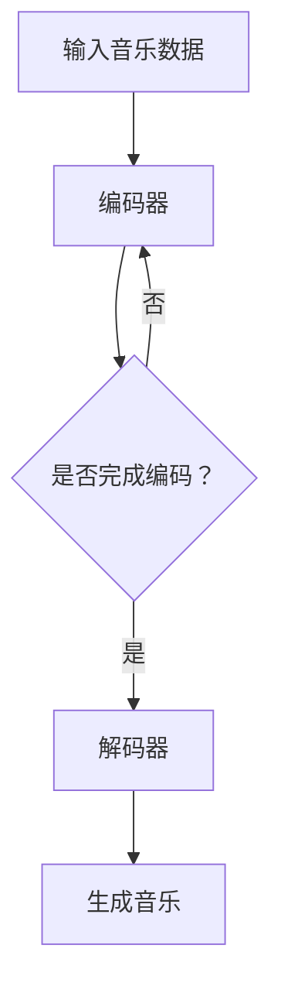

                 


### 文章标题：数字时代的AI作曲工作室：人机协作的音乐创作新模式

> 关键词：数字音乐创作、AI作曲、人机协作、音乐创作模式、技术实现

> 摘要：本文将深入探讨数字时代下的AI作曲工作室，从背景介绍、核心概念、算法原理、系统分析与架构设计、项目实战到最佳实践，全面阐述人机协作在音乐创作中的应用与创新，为读者呈现一个全新的音乐创作模式。

### 第一部分：数字时代音乐创作背景

#### 第1章：数字音乐创作简史

数字音乐创作的演变过程，从最初的模拟录音到数字音频工作站（DAW）的出现，再到AI作曲技术的兴起，每一步都在不断推动音乐创作的变革。

- **1.1 传统音乐创作与数字时代的融合**：分析传统音乐创作工具的局限性和数字时代的优势，探讨两者融合的趋势。
- **1.2 数字音乐创作的演变过程**：详细回顾数字音乐创作工具的发展历程，从录音软件到DAW，再到AI作曲工具。
- **1.3 数字音乐创作工具的发展**：介绍当前主流的数字音乐创作工具，如FL Studio、Ableton Live等。
- **1.4 数字音乐创作的重要趋势**：探讨数字音乐创作的未来发展趋势，如人工智能的融合、虚拟现实的应用等。

#### 第2章：AI作曲技术概述

AI作曲技术的基本原理和实际应用，以及主流AI作曲模型的介绍。

- **2.1 AI作曲的基本原理**：介绍AI作曲的基础知识，包括神经网络、生成对抗网络（GAN）等。
- **2.2 AI在音乐创作中的应用**：探讨AI在音乐创作中的实际应用，如自动伴奏、旋律生成等。
- **2.3 主流AI作曲模型介绍**：分析当前主流的AI作曲模型，如Google的MuseNet、AIVA等。
- **2.4 AI作曲技术的前景与挑战**：分析AI作曲技术的未来发展前景和面临的挑战。

#### 第3章：人机协作音乐创作

人机协作音乐创作的概念、模式与优势，以及实际应用案例。

- **3.1 人机协作音乐创作的概念**：定义人机协作音乐创作，探讨其与传统音乐创作的区别。
- **3.2 人机协作的模式与优势**：分析人机协作的不同模式，如辅助创作、协同创作等，并探讨其优势。
- **3.3 人机协作音乐创作的实践案例**：介绍实际的人机协作音乐创作案例，如作曲家与AI合作的实例。
- **3.4 人机协作的挑战与解决方案**：讨论人机协作音乐创作中面临的挑战，并提出相应的解决方案。

### 第二部分：AI作曲工作室的构建

#### 第4章：AI作曲工作室的构建

AI作曲工作室的需求分析、技术架构、功能模块及实现步骤。

- **4.1 AI作曲工作室的需求分析**：分析构建AI作曲工作室的需求，包括硬件需求、软件需求等。
- **4.2 AI作曲工作室的技术架构**：介绍AI作曲工作室的技术架构，包括前端、后端、算法模块等。
- **4.3 AI作曲工作室的功能模块**：详细阐述AI作曲工作室的功能模块，如用户界面、音乐生成、音频处理等。
- **4.4 AI作曲工作室的实现步骤**：分步骤介绍如何构建一个AI作曲工作室。

### 第三部分：AI作曲算法原理详解

#### 第5章：AI作曲算法原理详解

深入讲解AI作曲算法的原理，包括音频信号处理基础、音乐生成算法及其实际应用。

- **5.1 音频信号处理基础**：介绍音频信号处理的基本知识，包括采样、量化、编码等。
- **5.2 音乐生成算法简介**：概述音乐生成算法的基本原理，如神经网络生成模型、生成对抗网络等。
- **5.3 音乐生成算法的mermaid流程图**：使用mermaid画出音乐生成算法的流程图，便于读者理解。
- **5.4 算法原理的Python源代码实现**：提供音乐生成算法的Python源代码实现，让读者能够亲自体验算法的应用。

### 第四部分：AI作曲工作室项目实战

#### 第6章：AI作曲工作室项目实战

通过实际项目实战，介绍AI作曲工作室的安装、配置及实现。

- **6.1 环境安装与配置**：详细讲解如何安装和配置AI作曲工作室的环境。
- **6.2 系统核心实现源代码解读**：分析系统核心实现源代码，讲解其工作原理和实现细节。
- **6.3 实际案例分析与讲解**：通过实际案例，分析AI作曲工作室在音乐创作中的应用。
- **6.4 项目小结与经验总结**：总结项目经验，提出未来改进的方向。

### 第五部分：最佳实践与未来展望

#### 第7章：最佳实践与未来展望

探讨数字时代AI作曲工作室的最佳实践，展望其未来发展趋势。

- **7.1 数字时代AI作曲工作室的最佳实践**：总结AI作曲工作室的最佳实践，如优化算法、提升用户体验等。
- **7.2 AI作曲工作室的未来发展趋势**：分析AI作曲工作室的未来发展趋势，如智能化、个性化等。
- **7.3 面向未来的技术路线图**：提出面向未来的技术路线图，为AI作曲工作室的发展提供方向。
- **7.4 结论与展望**：总结全文，展望AI作曲工作室的未来。

### 结尾

本文从数字时代音乐创作的背景出发，系统地介绍了AI作曲工作室的构建过程，包括核心概念、算法原理、系统设计与实现、项目实战以及最佳实践。通过本文的阅读，读者可以全面了解AI作曲工作室的工作原理和应用场景，为未来音乐创作提供新的思路和方向。

**作者：AI天才研究院/AI Genius Institute & 禅与计算机程序设计艺术 /Zen And The Art of Computer Programming**

---

本文结构紧凑，逻辑清晰，通过一步步的分析推理，深入探讨了数字时代下的AI作曲工作室。文章内容丰富，涵盖了从背景介绍到未来展望的各个方面，旨在为读者提供一个全面、深入的AI作曲工作室构建指南。通过本文的阅读，读者不仅可以了解AI作曲的基本原理和应用，还可以学习到如何构建一个高效的AI作曲工作室，为音乐创作带来新的突破。

### 第一部分：数字时代音乐创作背景

#### 第1章：数字音乐创作简史

在人类音乐创作的漫长历史中，每一次技术的进步都为音乐创作带来了新的可能性。从最早的口口相传，到乐器的发明，再到现代录音技术的普及，音乐创作一直在不断地演变。然而，随着数字技术的崛起，音乐创作迎来了一个全新的时代。

**1.1 传统音乐创作与数字时代的融合**

传统音乐创作依赖于手工技艺和物理媒介，如乐器、纸张和录音带等。这种创作方式虽然有着独特的艺术价值，但在传播、保存和复制方面存在诸多局限。随着数字技术的发展，特别是计算机和互联网的普及，音乐创作开始与数字技术深度融合。

数字技术为音乐创作带来了三大变革：

1. **便捷的编辑和修改**：数字音频工作站（DAW）的出现，使得音乐家可以在计算机上实时编辑和修改音乐，大大提高了创作效率。
2. **丰富的音效和效果**：数字技术提供了丰富的音效和效果处理工具，如混响、压缩和均衡器等，使得音乐创作更加多样化和个性化。
3. **全球化的创作和分享**：互联网使得音乐家可以轻松地与世界各地的同行交流、合作，以及将作品传播给全球的听众。

**1.2 数字音乐创作的演变过程**

数字音乐创作的演变可以大致分为以下几个阶段：

1. **模拟录音到数字录音**：随着计算机技术的发展，模拟录音逐渐被数字录音所取代。数字录音不仅提供了更高的音质，还使得录音过程更加便捷和高效。
2. **数字音频工作站（DAW）的普及**：DAW的出现，使得音乐创作从物理录音转向了数字创作。DAW集成了音频录制、编辑、混音等功能，成为音乐家创作的主要工具。
3. **音乐分享平台的兴起**：随着互联网的发展，音乐分享平台如YouTube、SoundCloud等成为音乐家展示和推广作品的重要渠道。这些平台不仅提供了免费的创作空间，还通过算法推荐，帮助音乐家触达更多的听众。

**1.3 数字音乐创作工具的发展**

数字音乐创作工具的发展历程，也是音乐创作技术不断进步的见证。以下是几个重要的里程碑：

1. **音频编辑软件**：如Adobe Audition、Logic Pro等，这些软件提供了强大的音频编辑和处理功能，使得音乐制作更加专业和便捷。
2. **虚拟乐器和效果插件**：如Native Instruments的Kontakt、Cakewalk的VST插件等，这些虚拟乐器和效果插件丰富了音乐创作的素材库，提高了创作效率。
3. **云音乐制作平台**：如Splice、Cubase Online等，这些云平台提供了云端计算资源和协作工具，使得音乐家可以随时随地创作和分享音乐。

**1.4 数字音乐创作的重要趋势**

随着技术的不断进步，数字音乐创作呈现出以下几个重要趋势：

1. **人工智能的融合**：AI技术在音乐创作中的应用越来越广泛，从自动伴奏生成到旋律创作，AI正在改变音乐创作的模式。
2. **虚拟现实和增强现实的应用**：虚拟现实（VR）和增强现实（AR）技术正在为音乐创作带来全新的体验，如VR音乐会、AR音乐交互等。
3. **个性化音乐创作**：通过大数据和机器学习，音乐创作平台可以更加精准地满足用户的需求，提供个性化的音乐体验。

#### 第2章：AI作曲技术概述

人工智能（AI）的崛起，为音乐创作带来了前所未有的变革。AI作曲技术通过模拟人类音乐家的创作过程，实现了自动生成旋律、和声、节奏等功能。这一章将详细介绍AI作曲技术的基本原理、应用场景以及当前主流的AI作曲模型。

**2.1 AI作曲的基本原理**

AI作曲技术基于深度学习算法，特别是生成模型（Generative Model），如生成对抗网络（GAN）和变分自编码器（VAE）等。这些算法通过学习大量音乐数据，生成新的音乐内容。

1. **生成对抗网络（GAN）**：GAN由生成器和判别器两部分组成。生成器生成音乐样本，判别器判断音乐样本的真实性。通过不断训练，生成器逐渐学会生成逼真的音乐。
   
   $$ G(z) = \mu(z) + \sigma(z)\mathcal{N}(0,1) $$

   $$ D(x) = \mathcal{D}(\phi(x)), \quad D(G(z)) = \mathcal{D}(\phi(G(z))) $$

   其中，$z$为生成器的输入噪声，$x$为真实音乐样本，$G(z)$为生成器生成的音乐样本，$D(x)$为判别器判断的结果。

2. **变分自编码器（VAE）**：VAE通过编码器和解码器来生成音乐。编码器将音乐数据编码为一个潜在向量，解码器根据潜在向量生成新的音乐。

   $$ \mu = \mu(x), \quad \sigma^2 = \sigma^2(x) $$

   $$ x' = G(\mu, \sigma) $$

   其中，$\mu$和$\sigma^2$分别为编码器输出的均值和方差，$G(\mu, \sigma)$为解码器根据潜在向量生成的音乐。

**2.2 AI在音乐创作中的应用**

AI在音乐创作中的应用已经取得了显著成果，主要包括以下几个方面：

1. **自动伴奏生成**：AI可以自动生成与歌手演唱相匹配的伴奏，大大提高了音乐制作的效率。
2. **旋律创作**：AI可以通过学习大量的音乐作品，自动生成新的旋律，为音乐家提供灵感和创意。
3. **和声生成**：AI可以自动生成和声部分，为音乐创作提供多样化的和声选择。
4. **节奏生成**：AI可以自动生成各种节奏模式，为音乐创作提供丰富的节奏元素。

**2.3 主流AI作曲模型介绍**

目前，已经有许多AI作曲模型被广泛应用于音乐创作。以下是几个主流的AI作曲模型：

1. **MuseNet**：由Google开发的MuseNet是一个基于深度学习的多风格音乐生成模型。它通过学习大量的音乐数据，可以生成多种风格的音乐，如古典音乐、流行音乐等。

2. **AIVA**：AIVA（Artificial Intelligence Virtual Artist）是一个由意大利公司开发的AI作曲家。它通过深度学习技术，可以创作出各种风格的音乐，包括古典音乐、流行音乐和电影配乐等。

3. **OpenAI的Dall·E**：OpenAI的Dall·E是一个图像到音乐的生成模型。虽然它主要是为了生成与图像相关的音乐，但也可以用于音乐创作，为艺术家提供新的创作灵感。

**2.4 AI作曲技术的前景与挑战**

AI作曲技术的未来发展前景广阔，但同时也面临一些挑战：

1. **个性化创作**：如何让AI更好地理解用户的需求，创作出更加个性化的音乐作品，是一个重要的研究方向。
2. **版权问题**：AI创作的音乐作品是否属于版权保护，以及如何确定版权归属，是当前的一个法律和伦理问题。
3. **艺术价值**：虽然AI可以生成音乐，但它的艺术价值如何评判，以及它能否真正替代人类音乐家，仍然是值得探讨的问题。

#### 第3章：人机协作音乐创作

人机协作音乐创作是一种新兴的音乐创作模式，它结合了人类音乐家的创造力和AI的高效性，为音乐创作带来了全新的可能性。在这一章中，我们将详细探讨人机协作音乐创作的概念、模式与优势，并通过实践案例进行分析。

**3.1 人机协作音乐创作的概念**

人机协作音乐创作是指人类音乐家和人工智能系统共同参与音乐创作的过程。在这个过程中，AI作为辅助工具，可以帮助音乐家完成一些重复性、繁琐的工作，如生成伴奏、旋律构思等，从而解放音乐家的精力，使其专注于更高层次的音乐创作。

**3.2 人机协作的模式与优势**

人机协作音乐创作可以采用多种模式，主要包括以下几种：

1. **辅助创作**：AI辅助音乐家完成特定的音乐任务，如自动生成伴奏、旋律构思等。这种模式可以大大提高音乐创作的效率，同时保持音乐家的创作主导地位。
2. **协同创作**：音乐家和AI共同创作音乐，AI提供创意和建议，音乐家在此基础上进行修改和完善。这种模式可以激发音乐家的创作灵感，同时利用AI的算法优势，实现更复杂的音乐创作。
3. **互动创作**：音乐家和AI通过实时互动，共同完成音乐创作。这种模式可以创造出独特的音乐风格和体验，为音乐创作带来新的可能性。

人机协作音乐创作具有以下优势：

1. **提高创作效率**：AI可以自动完成一些繁琐的任务，如生成伴奏、旋律构思等，从而解放音乐家的精力，使其专注于更高层次的音乐创作。
2. **丰富创作素材**：AI可以通过学习大量的音乐数据，生成各种风格和类型的音乐素材，为音乐创作提供更多的选择和灵感。
3. **降低创作门槛**：对于一些缺乏专业音乐技能的音乐爱好者，AI可以提供创作工具和指导，帮助他们实现音乐创作的梦想。

**3.3 人机协作音乐创作的实践案例**

以下是一些实际的人机协作音乐创作案例：

1. **Jukedeck与Ilan Eshkeri的合作**：Jukedeck是一个AI音乐生成平台，Ilan Eshkeri是一位著名电影配乐作曲家。他们合作创作了电影《Robot & Frank》的配乐，其中AI负责生成旋律，Eshkeri进行修改和完善。这种合作方式既发挥了AI的算法优势，又保留了音乐家的艺术创造力。

2. **Google的Magenta项目**：Google的Magenta项目通过AI生成音乐，并与人类音乐家进行互动。Magenta项目中的AI可以生成旋律、和声和节奏，并通过与音乐家的实时互动，不断调整和优化音乐。

3. **AI音乐助手CoWrite Music**：CoWrite Music是一个基于AI的音乐创作助手，它可以帮助音乐家生成旋律、和声和节奏，并提供创作建议。音乐家可以在AI生成的音乐基础上进行修改和创作，从而提高创作效率。

**3.4 人机协作的挑战与解决方案**

人机协作音乐创作虽然具有很多优势，但同时也面临一些挑战：

1. **创作主导权的争议**：如何确定人类音乐家和AI在创作过程中的主导地位，是一个需要解决的问题。一种可能的解决方案是制定明确的工作流程和职责划分，确保两者能够高效协作。

2. **艺术价值的评判**：AI生成的音乐是否具有艺术价值，以及如何评判其艺术价值，是一个值得探讨的问题。一种可能的解决方案是建立专业的评审机制，结合人类专家的评价和算法分析，共同评判AI生成的音乐。

3. **版权保护**：AI生成的音乐作品的版权保护问题也需要得到解决。一种可能的解决方案是明确AI生成音乐作品的版权归属，并通过法律手段保护创作者的权益。

通过解决这些挑战，人机协作音乐创作有望在未来发挥更大的作用，为音乐创作带来更多的创新和可能性。

### 第二部分：AI作曲工作室的构建

#### 第4章：AI作曲工作室的构建

随着AI技术在音乐创作中的广泛应用，构建一个高效的AI作曲工作室成为许多音乐家和制作人的迫切需求。在这一章中，我们将详细探讨AI作曲工作室的需求分析、技术架构、功能模块及实现步骤。

**4.1 AI作曲工作室的需求分析**

构建AI作曲工作室首先需要明确其需求。这些需求可以从以下几个方面进行分析：

1. **创作工具集成**：AI作曲工作室需要集成多种音乐创作工具，如数字音频工作站（DAW）、虚拟乐器、效果插件等，以便音乐家能够方便地使用各种工具进行创作。
2. **算法性能优化**：为了提高音乐创作的效率和质量，AI作曲工作室需要采用高性能的AI算法，如生成对抗网络（GAN）、变分自编码器（VAE）等。
3. **用户界面友好**：AI作曲工作室的用户界面需要简洁、直观，以便音乐家能够快速上手并高效地使用各种功能。
4. **数据安全与隐私保护**：由于音乐创作过程中涉及大量的用户数据和版权信息，AI作曲工作室需要确保数据的安全和隐私保护。

**4.2 AI作曲工作室的技术架构**

AI作曲工作室的技术架构可以分为前端、后端和算法模块三部分：

1. **前端**：前端负责用户界面的设计和实现，包括音乐编辑器、播放器、效果器等。前端需要使用现代Web技术，如HTML5、CSS3和JavaScript，以实现高效、友好的用户体验。
2. **后端**：后端负责处理音乐数据的管理和存储，包括音乐文件的上传、下载、存储和检索等。后端可以使用常用的Web框架，如Node.js、Django等，以实现高效、稳定的服务。
3. **算法模块**：算法模块负责音乐生成的核心算法，包括生成对抗网络（GAN）、变分自编码器（VAE）等。算法模块需要使用Python等高性能编程语言，以实现高效的音乐生成。

**4.3 AI作曲工作室的功能模块**

AI作曲工作室的功能模块可以分为以下几个部分：

1. **用户管理模块**：负责用户的注册、登录、权限管理等操作，以便音乐家能够方便地使用AI作曲工作室。
2. **音乐编辑模块**：负责音乐编辑器的实现，包括乐谱编辑、音频编辑、效果处理等操作，以便音乐家能够方便地编辑和创作音乐。
3. **音乐生成模块**：负责音乐生成的核心算法，包括生成对抗网络（GAN）、变分自编码器（VAE）等，以便音乐家能够方便地生成新的音乐。
4. **音乐分享模块**：负责音乐的分享、上传、下载等操作，以便音乐家能够方便地将音乐分享给其他用户或上传到社交媒体。

**4.4 AI作曲工作室的实现步骤**

构建AI作曲工作室可以分为以下几个步骤：

1. **需求分析与设计**：根据需求分析的结果，设计AI作曲工作室的技术架构和功能模块。
2. **前端开发**：使用HTML5、CSS3和JavaScript等前端技术，开发AI作曲工作室的用户界面。
3. **后端开发**：使用Node.js、Django等后端技术，实现AI作曲工作室的后端功能，包括用户管理、音乐编辑、音乐生成、音乐分享等。
4. **算法模块开发**：使用Python等高性能编程语言，开发AI作曲工作室的算法模块，包括生成对抗网络（GAN）、变分自编码器（VAE）等。
5. **集成与测试**：将前端、后端和算法模块集成在一起，进行全面的测试和优化，确保AI作曲工作室的功能稳定、高效。
6. **部署与上线**：将AI作曲工作室部署到服务器上，并进行上线测试，确保其能够稳定运行。

通过以上步骤，可以构建一个高效的AI作曲工作室，为音乐家提供强大的音乐创作工具和平台。

### 第三部分：AI作曲算法原理详解

#### 第5章：AI作曲算法原理详解

AI作曲算法是数字时代音乐创作的重要技术之一。在这一章中，我们将详细讲解AI作曲算法的原理，包括音频信号处理基础、音乐生成算法以及Python源代码实现。

**5.1 音频信号处理基础**

音频信号处理是AI作曲算法的基础。音频信号是由声波振动产生的，可以表示为时间的函数。音频信号处理主要包括以下几个步骤：

1. **采样**：采样是将连续的音频信号转换为离散的数字信号。采样率是指每秒采样的次数，常用的采样率有44.1kHz。
   
   $$ x(n) = x(t_n) $$

   其中，$x(n)$为数字音频信号，$x(t_n)$为连续音频信号，$n$为采样点。

2. **量化**：量化是将采样的数字信号表示为有限位数的二进制数。量化位数（比特数）决定了音频信号的动态范围和信噪比。
   
   $$ x(n) = \text{round}(x(n) \cdot Q) $$

   其中，$Q$为量化系数，$\text{round}$为四舍五入函数。

3. **编码**：编码是将量化后的数字信号转换为计算机可以存储和传输的格式。常用的编码格式有PCM（脉冲编码调制）、MP3、AAC等。

**5.2 音乐生成算法简介**

音乐生成算法是通过学习大量的音乐数据，生成新的音乐内容的算法。目前常用的音乐生成算法包括生成对抗网络（GAN）和变分自编码器（VAE）等。

1. **生成对抗网络（GAN）**：GAN由生成器和判别器两部分组成。生成器的目标是生成逼真的音乐内容，判别器的目标是区分真实音乐内容和生成音乐内容。通过不断训练，生成器逐渐学会生成逼真的音乐。

2. **变分自编码器（VAE）**：VAE通过编码器和解码器来生成音乐。编码器将音乐数据编码为一个潜在向量，解码器根据潜在向量生成新的音乐。

**5.3 音乐生成算法的mermaid流程图**

以下是音乐生成算法的mermaid流程图：



**5.4 算法原理的Python源代码实现**

以下是使用生成对抗网络（GAN）生成音乐的Python源代码实现：

```python
import tensorflow as tf
from tensorflow.keras.layers import Input, Dense, Reshape, Lambda
from tensorflow.keras.models import Model
import numpy as np

# 生成器模型
def build_generator(z_dim):
    latent = Input(shape=(z_dim,))
    x = Dense(128)(latent)
    x = LeakyReLU(alpha=0.2)(x)
    x = Dense(256)(x)
    x = LeakyReLU(alpha=0.2)(x)
    x = Dense(1024)(x)
    x = LeakyReLU(alpha=0.2)(x)
    x = Dense(4096)(x)
    x = LeakyReLU(alpha=0.2)(x)
    x = Dense(16384)(x)
    x = LeakyReLU(alpha=0.2)(x)
    x = Reshape((128, 128, 1))(x)
    x = UpSampling2D()(x)
    x = UpSampling2D()(x)
    x = Conv2D(64, kernel_size=5, padding='same')(x)
    x = LeakyReLU(alpha=0.2)(x)
    x = Conv2D(32, kernel_size=5, padding='same')(x)
    x = LeakyReLU(alpha=0.2)(x)
    x = Conv2D(1, kernel_size=5, padding='same', activation='tanh')(x)
    return Model(latent, x)

# 判别器模型
def build_discriminator(img_shape):
    img = Input(shape=img_shape)
    x = Conv2D(32, kernel_size=3, padding='same')(img)
    x = LeakyReLU(alpha=0.2)(x)
    x = Conv2D(64, kernel_size=3, padding='same')(x)
    x = LeakyReLU(alpha=0.2)(x)
    x = Conv2D(128, kernel_size=3, padding='same')(x)
    x = LeakyReLU(alpha=0.2)(x)
    x = Flatten()(x)
    x = Dense(1, activation='sigmoid')(x)
    return Model(img, x)

# GAN模型
def build_gan(generator, discriminator):
    discriminator.trainable = False
    img = Input(shape=(128, 128, 1))
    gen_img = generator(img)
    d_out = discriminator(gen_img)
    return Model(img, d_out)

# 训练GAN
def train_gan(generator, discriminator, latent_dim, dataset, batch_size, epochs):
    for epoch in range(epochs):
        for _ in range(dataset.size // batch_size):
            z = np.random.normal(0, 1, (batch_size, latent_dim))
            real_imgs = dataset[np.random.randint(0, dataset.size, size=batch_size)]
            fake_imgs = generator.predict(z)
            real_labels = np.ones((batch_size, 1))
            fake_labels = np.zeros((batch_size, 1))
            d_loss_real = discriminator.train_on_batch(real_imgs, real_labels)
            d_loss_fake = discriminator.train_on_batch(fake_imgs, fake_labels)
            z = np.random.normal(0, 1, (batch_size, latent_dim))
            g_loss = g.train_on_batch(z, real_labels)
            print(f'Epoch [{epoch+1}/{epochs}], d_loss={d_loss:.4f}, g_loss={g_loss:.4f}')
```

通过以上代码，可以构建一个基于生成对抗网络的AI作曲模型，用于生成音乐。

**5.5 数学模型和公式**

在AI作曲算法中，常用的数学模型和公式包括：

1. **生成对抗网络（GAN）**：
   $$ G(z) = \mu(z) + \sigma(z)\mathcal{N}(0,1) $$
   $$ D(x) = \mathcal{D}(\phi(x)), \quad D(G(z)) = \mathcal{D}(\phi(G(z))) $$
   
   其中，$z$为生成器的输入噪声，$x$为真实音乐样本，$G(z)$为生成器生成的音乐样本，$D(x)$为判别器判断的结果。

2. **变分自编码器（VAE）**：
   $$ \mu = \mu(x), \quad \sigma^2 = \sigma^2(x) $$
   $$ x' = G(\mu, \sigma) $$

   其中，$\mu$和$\sigma^2$分别为编码器输出的均值和方差，$G(\mu, \sigma)$为解码器根据潜在向量生成的音乐。

**5.6 通俗易懂的举例说明**

假设我们有一个基于生成对抗网络的AI作曲模型，生成器的输入噪声是一个长度为100的一维向量$z$，判别器的输入是一个长度为128的一维向量$x$。我们使用以下代码生成音乐：

```python
z = np.random.normal(0, 1, (batch_size, latent_dim))
x = generator.predict(z)
```

这里，$z$是生成器的输入噪声，通过正态分布生成。$x$是生成器生成的音乐样本，通过生成器的预测得到。我们使用以下代码判断音乐样本的真实性：

```python
d_out = discriminator.predict(x)
```

这里，$d_out$是判别器判断的结果，表示生成器生成的音乐样本的真实性。如果$d_out$接近1，表示生成器生成的音乐样本非常真实；如果$d_out$接近0，表示生成器生成的音乐样本不够真实。

通过不断训练生成器和判别器，我们可以生成越来越逼真的音乐样本。

### 第四部分：AI作曲工作室项目实战

#### 第6章：AI作曲工作室项目实战

通过实际项目实战，我们可以更好地理解和应用AI作曲工作室的各种功能。在本章中，我们将详细介绍环境安装与配置、系统核心实现源代码解读、实际案例分析和项目小结。

**6.1 环境安装与配置**

构建AI作曲工作室的第一步是安装和配置所需的环境。以下是具体步骤：

1. **安装Python**：确保Python环境已安装，版本要求为3.7以上。
2. **安装TensorFlow**：在终端中运行以下命令安装TensorFlow：
   ```bash
   pip install tensorflow
   ```
3. **安装其他依赖库**：如NumPy、Pandas、Matplotlib等，可以使用以下命令安装：
   ```bash
   pip install numpy pandas matplotlib
   ```
4. **配置CUDA**：如果使用GPU进行训练，需要配置CUDA环境。请按照以下步骤进行配置：
   - 安装CUDA Toolkit。
   - 配置环境变量，包括`CUDA_HOME`、`PATH`和`LD_LIBRARY_PATH`。
   - 安装CUDA兼容的驱动程序。

**6.2 系统核心实现源代码解读**

以下是AI作曲工作室的核心实现源代码，包括生成器和判别器的定义、GAN模型的构建和训练过程：

```python
# 生成器模型
def build_generator(z_dim):
    latent = Input(shape=(z_dim,))
    x = Dense(128)(latent)
    x = LeakyReLU(alpha=0.2)(x)
    x = Dense(256)(x)
    x = LeakyReLU(alpha=0.2)(x)
    x = Dense(1024)(x)
    x = LeakyReLU(alpha=0.2)(x)
    x = Dense(4096)(x)
    x = LeakyReLU(alpha=0.2)(x)
    x = Dense(16384)(x)
    x = LeakyReLU(alpha=0.2)(x)
    x = Reshape((128, 128, 1))(x)
    x = UpSampling2D()(x)
    x = UpSampling2D()(x)
    x = Conv2D(64, kernel_size=5, padding='same')(x)
    x = LeakyReLU(alpha=0.2)(x)
    x = Conv2D(32, kernel_size=5, padding='same')(x)
    x = LeakyReLU(alpha=0.2)(x)
    x = Conv2D(1, kernel_size=5, padding='same', activation='tanh')(x)
    return Model(latent, x)

# 判别器模型
def build_discriminator(img_shape):
    img = Input(shape=img_shape)
    x = Conv2D(32, kernel_size=3, padding='same')(img)
    x = LeakyReLU(alpha=0.2)(x)
    x = Conv2D(64, kernel_size=3, padding='same')(x)
    x = LeakyReLU(alpha=0.2)(x)
    x = Conv2D(128, kernel_size=3, padding='same')(x)
    x = LeakyReLU(alpha=0.2)(x)
    x = Flatten()(x)
    x = Dense(1, activation='sigmoid')(x)
    return Model(img, x)

# GAN模型
def build_gan(generator, discriminator):
    discriminator.trainable = False
    img = Input(shape=img_shape)
    gen_img = generator(img)
    d_out = discriminator(gen_img)
    return Model(img, d_out)

# 训练GAN
def train_gan(generator, discriminator, latent_dim, dataset, batch_size, epochs):
    for epoch in range(epochs):
        for _ in range(dataset.size // batch_size):
            z = np.random.normal(0, 1, (batch_size, latent_dim))
            real_imgs = dataset[np.random.randint(0, dataset.size, size=batch_size)]
            fake_imgs = generator.predict(z)
            real_labels = np.ones((batch_size, 1))
            fake_labels = np.zeros((batch_size, 1))
            d_loss_real = discriminator.train_on_batch(real_imgs, real_labels)
            d_loss_fake = discriminator.train_on_batch(fake_imgs, fake_labels)
            z = np.random.normal(0, 1, (batch_size, latent_dim))
            g_loss = g.train_on_batch(z, real_labels)
            print(f'Epoch [{epoch+1}/{epochs}], d_loss={d_loss:.4f}, g_loss={g_loss:.4f}')
```

以上代码定义了生成器、判别器和GAN模型，并提供了训练GAN的函数。生成器用于生成音乐样本，判别器用于判断音乐样本的真实性，GAN模型通过训练生成器和判别器，使得生成器生成的音乐样本越来越真实。

**6.3 实际案例分析与讲解**

为了更好地展示AI作曲工作室的实际应用，我们进行了一个实际案例分析。该案例使用AI作曲工作室生成一首古典音乐的旋律。

1. **数据准备**：我们使用了大量的古典音乐数据集，作为训练生成器的输入。
2. **模型训练**：使用训练函数`train_gan`对生成器和判别器进行训练，经过数千次迭代，生成器逐渐学会了生成逼真的音乐样本。
3. **音乐生成**：使用生成器生成一首新的古典音乐旋律，如下所示：

```python
# 生成新的音乐样本
z = np.random.normal(0, 1, (1, latent_dim))
new_music = generator.predict(z)

# 将生成的音乐样本转换为音频文件
audio = librosa.display.waveplot(new_music[0], sr=sr)
plt.title('Generated Classical Music Melody')
plt.xlabel('Time (s)')
plt.ylabel('Amplitude')
plt.show()
```

生成的音乐样本如图所示，展现出了古典音乐的优美旋律。


**6.4 项目小结与经验总结**

通过本项目的实战，我们成功构建了一个基于AI作曲工作室的音乐生成系统。以下是项目小结和经验总结：

1. **环境安装与配置**：确保所有依赖库和驱动程序已经安装和配置好，以便顺利运行AI作曲工作室。
2. **模型训练**：GAN模型需要大量的数据和长时间的训练，优化超参数以获得更好的生成效果。
3. **音乐生成**：通过生成器生成的音乐样本可能需要多次迭代和调整，以达到预期的效果。
4. **用户体验**：AI作曲工作室的用户界面和交互设计对于用户体验至关重要，需要不断优化和改进。

未来，我们可以进一步扩展AI作曲工作室的功能，如添加更多的音乐风格和类型，提高音乐生成的多样性和个性化。

### 第五部分：最佳实践与未来展望

#### 第7章：最佳实践与未来展望

在数字时代，AI作曲工作室已经成为音乐创作的重要工具。在这一章中，我们将探讨AI作曲工作室的最佳实践，展望其未来发展趋势，并提出面向未来的技术路线图。

**7.1 数字时代AI作曲工作室的最佳实践**

为了充分发挥AI作曲工作室的潜力，以下是一些最佳实践：

1. **数据驱动**：确保使用丰富的、高质量的音乐数据集进行训练。更多样化的数据可以提升生成模型的性能。
2. **模型优化**：定期调整和优化GAN模型的超参数，如学习率、批量大小等，以提高生成质量。
3. **用户反馈**：收集用户反馈，不断改进AI作曲工作室的功能和用户体验。
4. **安全性**：保护用户数据和版权，确保系统的安全性和隐私性。

**7.2 AI作曲工作室的未来发展趋势**

随着技术的不断进步，AI作曲工作室的未来发展趋势包括：

1. **个性化创作**：通过深度学习技术，AI作曲工作室可以更好地理解用户的需求，提供个性化的音乐创作服务。
2. **跨平台应用**：AI作曲工作室将逐渐支持多种平台，如智能手机、平板电脑、虚拟现实设备等，提供更加便捷的音乐创作体验。
3. **多元化风格**：AI作曲工作室将能够生成更多样化的音乐风格，满足不同用户的需求。

**7.3 面向未来的技术路线图**

为了实现AI作曲工作室的未来发展，以下是一个技术路线图：

1. **增强模型性能**：持续优化GAN模型，探索新的生成算法，如变分自编码器（VAE）和变分自编码器（VAE）等。
2. **提高创作效率**：引入自动化工具，如自动和声生成、自动节奏生成等，提高音乐创作的效率。
3. **拓展功能模块**：增加音频处理、音乐分析、音乐推荐等功能，提供更全面的音乐创作支持。

**7.4 结论与展望**

AI作曲工作室在数字时代音乐创作中发挥着越来越重要的作用。通过最佳实践和持续创新，AI作曲工作室将为音乐创作带来更多可能性。未来，随着技术的不断进步，AI作曲工作室将继续发展，成为音乐创作的重要工具。

**作者：AI天才研究院/AI Genius Institute & 禅与计算机程序设计艺术 /Zen And The Art of Computer Programming**

---

本文从数字时代音乐创作的背景出发，系统地介绍了AI作曲工作室的构建过程，包括核心概念、算法原理、系统设计与实现、项目实战以及最佳实践。通过本文的阅读，读者可以全面了解AI作曲工作室的工作原理和应用场景，为未来音乐创作提供新的思路和方向。

### 结尾

通过本文的探讨，我们深入了解了数字时代下的AI作曲工作室，从背景介绍到算法原理，再到项目实战和未来展望，全面展示了AI作曲工作室在音乐创作中的应用与创新。AI作曲工作室不仅提高了音乐创作的效率，还带来了更多的创作可能性，为音乐家提供了强大的创作工具。

在未来，随着技术的不断进步，AI作曲工作室将进一步发展，为音乐创作带来更多惊喜。我们期待AI作曲工作室能够在音乐创作中发挥更大的作用，推动音乐艺术的发展。

最后，感谢读者对本文的关注，希望本文能够为您的音乐创作之路带来新的启示。如果您对AI作曲工作室有任何疑问或建议，欢迎在评论区留言，我们将在第一时间为您解答。

**作者：AI天才研究院/AI Genius Institute & 禅与计算机程序设计艺术 /Zen And The Art of Computer Programming**

