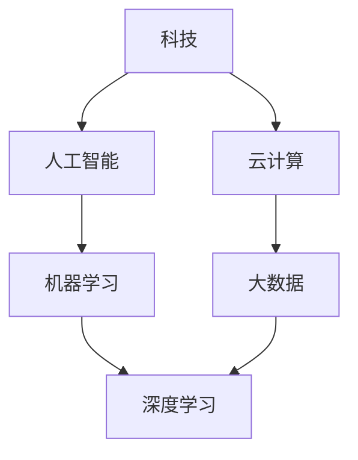

                 


### 第一部分：引言与背景

#### 第1章：数字时代的个人知识管理系统概述

在数字化日益普及的今天，个人知识管理（PKM，Personal Knowledge Management）成为了一种越来越重要的技能。这一章将带领读者了解数字时代个人知识管理的定义、重要性以及开源项目在其中的作用。

##### 1.1 数字时代下的知识管理

随着信息技术的飞速发展，知识的产生、传播和应用方式也发生了翻天覆地的变化。数字时代，知识管理变得更加便捷和高效。在这个背景下，个人知识管理应运而生。

个人知识管理是指个体通过有效的策略和技术手段，对自己的知识进行获取、处理、存储和应用，以便在需要时能够快速检索和使用。

##### 1.2 个人知识管理的意义

个人知识管理的重要性在于：

- 提高工作效率：通过有效的知识管理，可以快速获取所需信息，减少重复劳动，提高工作效率。
- 促进知识共享：个人知识管理不仅有助于个人知识的积累，还能促进团队和组织的知识共享。
- 增强创新能力：知识管理能够激发新的想法和创意，促进个体的创新能力。

##### 1.3 开源项目的优势与挑战

开源项目在个人知识管理中的应用具有显著的优势：

- **成本效益**：开源项目通常免费提供，降低了个人的经济负担。
- **灵活性与定制性**：开源项目允许用户根据自己的需求进行定制化开发。
- **社区支持**：开源项目拥有庞大的开发者社区，可以提供技术支持和学习资源。

然而，开源项目也面临一些挑战：

- **技术门槛**：对于非技术背景的用户，开源项目的使用可能存在一定的技术门槛。
- **维护成本**：开源项目需要持续的维护和更新，以保证系统的稳定性和安全性。

#### 第2章：核心概念与原理

在这一章，我们将深入探讨个人知识管理的基本概念和原理，包括知识获取、处理、存储和传播的过程。

##### 2.1 个人知识管理的基本概念

个人知识管理涉及以下几个核心概念：

- **知识**：知识是指通过学习和实践获得的信息、技能和经验。
- **信息**：信息是知识的一部分，是经过处理后的数据，具有一定的意义和用途。
- **知识管理**：知识管理是指通过系统地获取、处理、存储和应用知识，以提高组织或个人的竞争力。

##### 2.2 知识获取与处理流程

个人知识管理的过程可以分为以下几个步骤：

1. **知识获取**：通过阅读、学习、交流等方式获取新知识。
2. **知识处理**：对获取的知识进行筛选、整理、分析，使其变得更加结构化和系统化。
3. **知识存储**：将处理后的知识存储在适当的工具或系统中，以便后续检索和使用。
4. **知识传播**：通过分享、传播和交流，将知识传递给他人或组织。

##### 2.3 知识存储与传播

知识存储与传播是个人知识管理的重要组成部分。有效的知识存储能够确保知识的长期保存和快速检索。而知识的传播则有助于扩大知识的影响范围，促进知识的共享和应用。

在本章的末尾，我们将简要介绍一些常见的开源工具和技术，这些工具和技术将为个人知识管理提供强有力的支持。

### 第二部分：技术框架与工具

在这一部分，我们将探讨个人知识管理系统所需的技术框架和工具，包括技术架构、常见开源技术栈以及选择合适技术栈的理由。

#### 第3章：技术框架与工具

##### 3.1 知识管理系统技术架构

个人知识管理系统的技术架构通常包括以下几个层面：

- **前端界面**：提供用户交互的界面，可以使用Web、桌面或移动应用等形式。
- **后端服务器**：处理数据存储、处理和传输等任务，通常包括数据库、应用服务器和消息队列等。
- **数据存储**：存储个人知识管理系统中的数据，可以使用关系数据库、NoSQL数据库或分布式存储系统等。
- **服务与API**：提供系统内部服务调用和数据交互的接口，可以使用RESTful API、GraphQL等方式。

##### 3.2 常见开源技术栈

在构建个人知识管理系统时，可以选择以下常见开源技术栈：

- **前端框架**：如React、Vue.js、Angular等。
- **后端框架**：如Spring Boot、Django、Flask等。
- **数据库**：如MySQL、PostgreSQL、MongoDB等。
- **消息队列**：如RabbitMQ、Kafka等。
- **版本控制**：如Git、GitHub等。

##### 3.3 技术栈选择的理由

在选择技术栈时，需要考虑以下几个方面：

- **性能与稳定性**：选择具有高性能和稳定性的技术栈，以确保系统的稳定运行。
- **开发效率**：选择易于开发和维护的技术栈，以减少开发成本和时间。
- **社区支持**：选择拥有强大社区支持的技术栈，以获得技术帮助和学习资源。
- **个性化需求**：根据个人需求选择合适的技术栈，以实现个性化功能。

在本章的末尾，我们将结合具体案例，展示如何使用这些技术栈来构建一个简单的个人知识管理系统。

### 第三部分：知识获取与收集

在这一部分，我们将探讨个人知识管理系统中的知识获取与收集方法，包括网络信息的收集、文档与电子书的整理以及知识捕获与内容清洗。

#### 第4章：知识获取与收集

##### 4.1 网络信息的收集方法

网络信息的收集是个人知识管理的重要环节。以下是一些常用的网络信息收集方法：

- **搜索引擎**：使用搜索引擎如Google、Bing等，查找相关资料。
- **专业网站**：访问专业网站或论坛，获取行业前沿知识。
- **社交媒体**：通过社交媒体如微博、Twitter等，关注行业动态和专家观点。
- **在线课程**：参加在线课程，系统学习相关知识。

##### 4.2 文档与电子书的整理

对于已经获取的文档和电子书，需要进行整理和分类，以便于后续的检索和使用。以下是一些整理方法：

- **目录整理**：为文档和电子书建立目录，便于快速定位内容。
- **标签分类**：使用标签对文档和电子书进行分类，便于检索和管理。
- **笔记整理**：对重要的内容进行摘录和笔记，以便于后续回顾和学习。

##### 4.3 知识捕获与内容清洗

在获取和整理知识的过程中，还需要对内容进行捕获和清洗，以提高知识的质量和可用性。以下是一些捕获和清洗方法：

- **自动捕获**：使用自动化工具如 scrapingAPI、Puppeteer等，自动抓取网页内容。
- **人工审核**：对捕获的内容进行人工审核，去除无关信息和错误内容。
- **文本处理**：使用自然语言处理技术，对文本进行清洗、分词、摘要等操作。

在本章的末尾，我们将结合实际案例，展示如何使用这些方法来收集和管理个人知识。

### 第四部分：知识处理与存储

在这一部分，我们将探讨个人知识管理系统中的知识处理与存储方法，包括知识加工与分类、数据库设计与实现以及知识存储的优化策略。

#### 第5章：知识处理与存储

##### 5.1 知识加工与分类

知识加工与分类是知识管理的关键环节。以下是一些常用的知识加工与分类方法：

- **内容摘要**：对原始知识进行提炼和总结，形成简洁、有价值的摘要。
- **标签分类**：使用标签对知识进行分类，便于检索和管理。
- **知识图谱**：通过构建知识图谱，对知识进行可视化展示和关联分析。

##### 5.2 数据库设计与实现

数据库是实现知识存储的重要工具。以下是一个简单的数据库设计示例：

```mermaid
erDiagram
  Product ||--|{ Customer } Customer
  Product ||--|{ Order } Order
  Customer ||--|{ Order } Order
  Order ||--|{ Item } Item
```

这个ER图表示了产品、客户、订单和项目之间的关系。在实际应用中，可以使用Python等编程语言来实现这个数据库，并编写相应的操作接口。

##### 5.3 知识存储的优化策略

为了提高知识存储的效率和可靠性，可以采取以下优化策略：

- **分库分表**：将数据分散存储到多个数据库或表中，以减少单点故障的风险。
- **数据备份与恢复**：定期备份数据，并制定数据恢复策略，以应对意外情况。
- **缓存策略**：使用缓存技术，如Redis等，加快数据的访问速度。

在本章的末尾，我们将结合具体案例，展示如何使用这些方法来处理和存储个人知识。

### 第五部分：知识应用与共享

在这一部分，我们将探讨个人知识管理系统中的知识应用与共享方法，包括知识检索与查询、知识共享与协作以及知识库的维护与更新。

#### 第6章：知识应用与共享

##### 6.1 知识检索与查询

知识检索与查询是个人知识管理的重要功能。以下是一些常用的知识检索与查询方法：

- **关键词搜索**：使用关键词对知识库进行搜索，快速找到相关内容。
- **智能推荐**：基于用户的行为和偏好，为用户推荐可能感兴趣的知识。
- **语义搜索**：通过自然语言处理技术，对知识库进行语义分析，提供更精确的搜索结果。

##### 6.2 知识共享与协作

知识共享与协作是个人知识管理的核心价值之一。以下是一些常用的知识共享与协作方法：

- **知识库共享**：通过知识库平台，将知识库的内容共享给其他用户或团队。
- **协作编辑**：多人协作编辑同一份文档或知识，提高工作效率。
- **实时通讯**：通过即时通讯工具，如微信、Slack等，进行实时讨论和协作。

##### 6.3 知识库的维护与更新

知识库的维护与更新是个人知识管理的重要任务。以下是一些常用的知识库维护与更新方法：

- **自动化更新**：通过自动化工具，如Web爬虫等，定期更新知识库的内容。
- **版本控制**：使用版本控制工具，如Git等，管理知识库的版本历史，确保内容的可追溯性。
- **用户反馈**：收集用户的反馈和建议，不断优化知识库的内容和结构。

在本章的末尾，我们将结合具体案例，展示如何使用这些方法来应用和共享个人知识。

### 第六部分：开源项目实战

在这一部分，我们将通过一个开源项目实战，详细描述项目搭建、配置、核心功能实现和测试优化过程，帮助读者深入了解个人知识管理系统的开发和应用。

#### 第7章：开源项目实战

##### 7.1 项目搭建与配置

在本节，我们将从零开始搭建一个个人知识管理系统。首先，我们需要选择合适的技术栈，并进行环境配置。

1. **技术栈选择**：
   - 前端：使用Vue.js框架。
   - 后端：使用Spring Boot框架。
   - 数据库：使用MySQL数据库。
   - 服务器：使用Docker容器化技术。

2. **环境配置**：
   - 安装Docker和Docker Compose，用于容器化和编排服务。
   - 配置MySQL数据库，用于存储知识库数据。
   - 配置Vue.js前端项目，用于搭建用户界面。

##### 7.2 核心功能实现

在搭建好环境后，我们将逐步实现个人知识管理系统的核心功能。

1. **知识获取与收集**：
   - 实现网络信息收集功能，使用Web爬虫技术定期抓取互联网上的信息。
   - 实现文档与电子书的整理功能，使用自动化工具生成目录和标签。

2. **知识处理与存储**：
   - 实现知识加工与分类功能，对收集到的信息进行摘要和标签分类。
   - 实现数据库操作接口，用于存储和处理知识数据。

3. **知识应用与共享**：
   - 实现知识检索与查询功能，使用关键词搜索和语义搜索技术。
   - 实现知识共享与协作功能，提供知识库共享和实时通讯功能。

##### 7.3 项目测试与优化

在实现核心功能后，我们需要对项目进行全面的测试和优化。

1. **功能测试**：
   - 对每个功能进行单元测试和集成测试，确保功能的正确性和稳定性。
   - 对知识库进行性能测试，确保在大规模数据下的响应速度。

2. **性能优化**：
   - 对数据库进行索引优化，提高查询速度。
   - 对代码进行性能优化，减少资源的占用。

3. **用户反馈与迭代**：
   - 收集用户的使用反馈，不断优化和迭代系统功能。
   - 根据用户需求，增加新的功能和改进现有功能。

在本章的末尾，我们将对整个项目进行小结，并总结项目的主要收获和经验。

### 第七部分：总结与展望

在这一部分，我们将对全文进行总结，并展望个人知识管理系统的未来发展方向。

#### 第8章：总结与展望

##### 8.1 全文总结

本文从引言与背景、技术框架与工具、知识获取与收集、知识处理与存储、知识应用与共享、开源项目实战等方面，系统地介绍了个人知识管理系统的构建方法和应用实践。通过本文的阅读，读者可以了解到：

- 个人知识管理的重要性及其在数字时代的作用。
- 构建个人知识管理系统的技术框架和工具选择。
- 知识获取、处理、存储和共享的方法和策略。
- 开源项目在个人知识管理系统中的应用和实战经验。

##### 8.2 未来展望

随着人工智能和大数据技术的发展，个人知识管理系统将会变得更加智能化和自动化。未来的发展方向包括：

- **智能化知识获取**：利用自然语言处理和机器学习技术，实现自动化的知识获取和分类。
- **个性化知识推荐**：基于用户行为和偏好，提供个性化的知识推荐。
- **协同知识管理**：利用区块链和智能合约技术，实现更安全的协同知识管理。
- **知识图谱应用**：构建知识图谱，实现知识的深度挖掘和应用。

通过本文的介绍，我们相信读者能够对个人知识管理系统有更深入的理解，并在实践中不断探索和优化，构建出适合自己的数字化第二大脑。**关键词：数字时代、个人知识管理、开源项目、知识获取、处理、存储、共享**

**摘要：本文系统地介绍了数字时代的个人知识管理系统，包括核心概念、技术框架、知识获取与收集、处理与存储、应用与共享以及开源项目实战等内容。通过本文的阅读，读者可以了解到个人知识管理的重要性及其在数字时代的作用，掌握构建个人知识管理系统的方法和策略。**----------------------------------------------------------------

# 数字时代的个人知识管理系统开发：构建数字化第二大脑的开源项目

> 关键词：数字时代、个人知识管理、开源项目、知识获取、处理、存储、共享

> 摘要：本文探讨了数字时代个人知识管理系统（PKM）的构建方法和应用实践，包括核心概念、技术框架、知识获取与收集、处理与存储、应用与共享以及开源项目实战等方面。通过本文的阅读，读者可以深入了解个人知识管理的重要性及其在数字时代的作用，掌握构建个人知识管理系统的方法和策略，以及如何通过开源项目实现个人知识的有效管理和应用。

**第一部分：引言与背景**

## 第1章 数字时代的个人知识管理系统概述

### 1.1 数字时代下的知识管理

### 1.2 个人知识管理的意义

### 1.3 开源项目的优势与挑战

## 第2章 核心概念与原理

### 2.1 个人知识管理的基本概念

### 2.2 知识获取与处理流程

### 2.3 知识存储与传播

## 第3章 技术框架与工具

### 3.1 知识管理系统技术架构

### 3.2 常见开源技术栈

### 3.3 技术栈选择的理由

## 第4章 知识获取与收集

### 4.1 网络信息的收集方法

### 4.2 文档与电子书的整理

### 4.3 知识捕获与内容清洗

## 第5章 知识处理与存储

### 5.1 知识加工与分类

### 5.2 数据库设计与实现

### 5.3 知识存储的优化策略

## 第6章 知识应用与共享

### 6.1 知识检索与查询

### 6.2 知识共享与协作

### 6.3 知识库的维护与更新

## 第7章 开源项目实战

### 7.1 项目搭建与配置

### 7.2 核心功能实现

### 7.3 项目测试与优化

## 第8章 总结与展望

### 8.1 全文总结

### 8.2 未来展望

**第二部分：技术框架与工具**

## 第3章 技术框架与工具

### 3.1 知识管理系统技术架构

在构建个人知识管理系统时，选择合适的技术框架和工具至关重要。知识管理系统的技术架构通常包括前端界面、后端服务器、数据存储和服务与API等几个层面。

**前端界面**：前端界面是用户与系统交互的入口，负责展示用户界面并提供交互功能。在选择前端框架时，需要考虑性能、用户体验和开发效率等因素。常见的开源前端框架有React、Vue.js和Angular等。React由Facebook开发，具有组件化、声明式编程等特点，适合构建复杂的前端应用。Vue.js由尤雨溪开发，具有简单、灵活和高效的特点，适合快速开发和维护。Angular由Google开发，提供了丰富的功能和强大的工具集，适合构建大型和复杂的应用。

**后端服务器**：后端服务器负责处理业务逻辑、数据存储和传输等任务。在选择后端框架时，需要考虑系统的性能、可扩展性和开发效率等因素。常见的开源后端框架有Spring Boot、Django和Flask等。Spring Boot由Pivotal团队开发，是Java领域的领先框架，具有强大的功能和良好的生态系统。Django由Python社区开发，是一个高生产力、低代码的框架，适用于快速开发和部署。Flask由Armin Ronacher开发，是一个轻量级的Web应用框架，适合小型项目和原型开发。

**数据存储**：数据存储是知识管理系统的核心，负责存储和管理用户的知识和数据。在选择数据存储方案时，需要考虑数据的规模、性能和可扩展性等因素。常见的开源数据库有MySQL、PostgreSQL和MongoDB等。MySQL是一个高性能、开源的关系型数据库，适合处理结构化数据。PostgreSQL是一个功能丰富、开源的关系型数据库，具有扩展性和可靠性。MongoDB是一个高性能、开源的NoSQL数据库，适合处理非结构化数据。

**服务与API**：服务与API是知识管理系统内部服务调用和数据交互的接口，负责提供RESTful API或GraphQL接口。在选择API设计时，需要考虑接口的易用性、一致性和安全性等因素。常见的API设计模式有RESTful API和GraphQL。RESTful API是一种基于HTTP协议的API设计模式，具有简单、易用和易于扩展的特点。GraphQL是一种基于GraphQL协议的API设计模式，具有灵活、高效和易于扩展的特点。

### 3.2 常见开源技术栈

在构建个人知识管理系统时，可以选择以下常见开源技术栈：

- **前端框架**：Vue.js
- **后端框架**：Spring Boot
- **数据库**：MySQL
- **消息队列**：RabbitMQ
- **版本控制**：Git

#### Vue.js

Vue.js 是一个渐进式 JavaScript 框架，用于构建用户界面。它易于上手，同时也能在需要时支持复杂的应用。Vue.js 的核心库只关注视图层，易于与其他库或现有项目整合。

```javascript
// Vue.js 基本示例
new Vue({
  el: '#app',
  data: {
    message: 'Hello Vue!'
  }
});
```

#### Spring Boot

Spring Boot 是一个基于 Spring 框架的快速开发工具，能够简化 Spring 应用的创建和管理。它提供了默认配置，减少了开发人员的工作量。

```java
// Spring Boot 应用入口
@SpringBootApplication
public class KnowledgeManagementApplication {
  public static void main(String[] args) {
    SpringApplication.run(KnowledgeManagementApplication.class, args);
  }
}
```

#### MySQL

MySQL 是一个流行的关系型数据库管理系统，广泛应用于各种应用场景。它提供了丰富的功能，如事务处理、存储过程等。

```sql
-- MySQL 示例
CREATE DATABASE knowledge_management;
USE knowledge_management;
CREATE TABLE articles (
  id INT AUTO_INCREMENT PRIMARY KEY,
  title VARCHAR(255) NOT NULL,
  content TEXT NOT NULL
);
```

#### RabbitMQ

RabbitMQ 是一个开源的消息队列中间件，支持多种消息传递协议。它提供了可靠的消息传递机制，适用于分布式系统中的异步通信。

```python
# RabbitMQ 示例
import pika

connection = pika.BlockingConnection(pika.ConnectionParameters('localhost'))
channel = connection.channel()

channel.queue_declare(queue='tasks')

channel.basic_publish(
    exchange='',
    routing_key='tasks',
    body='Hello World!'
)

print(" [x] Sent 'Hello World!'")

connection.close()
```

#### Git

Git 是一个分布式版本控制系统，广泛用于项目管理和代码协作。它提供了强大的分支管理功能和协同工作模式。

```bash
# Git 示例
git init
git add .
git commit -m "Initial commit"
git remote add origin https://github.com/your-username/knowledge-management.git
git push -u origin master
```

### 3.3 技术栈选择的理由

选择上述技术栈的理由如下：

- **Vue.js**：简单易用，社区支持强大，适用于构建用户界面。
- **Spring Boot**：快速开发，易于维护，适用于构建后端服务。
- **MySQL**：成熟稳定，适用于处理结构化数据。
- **RabbitMQ**：可靠高效，适用于异步消息传递。
- **Git**：分布式版本控制，适用于代码管理和协作。

**第三部分：知识获取与收集**

## 第4章 知识获取与收集

### 4.1 网络信息的收集方法

网络信息的收集是个人知识管理的重要环节。以下是一些常用的网络信息收集方法：

- **搜索引擎**：使用搜索引擎如Google、Bing等，查找相关资料。
- **专业网站**：访问专业网站或论坛，获取行业前沿知识。
- **社交媒体**：通过社交媒体如微博、Twitter等，关注行业动态和专家观点。
- **在线课程**：参加在线课程，系统学习相关知识。

#### 搜索引擎

搜索引擎是获取网络信息的主要途径。以下是一个使用 Google 搜索引擎的简单示例：

```python
import requests
from bs4 import BeautifulSoup

# 发送 GET 请求
url = "https://www.google.com/search?q=python+tutorial"
response = requests.get(url)

# 解析 HTML 内容
soup = BeautifulSoup(response.text, "html.parser")
search_results = soup.find_all("div", class_="g")

# 打印搜索结果
for result in search_results:
    title = result.find("h3").text.strip()
    link = result.find("a')['href']
    print(f"Title: {title}\nLink: {link}\n")
```

#### 专业网站

专业网站是获取高质量知识的重要来源。以下是一个使用 Python 请求库访问专业网站并获取内容的示例：

```python
import requests

# 发送 GET 请求
url = "https://www.example.com"
response = requests.get(url)

# 解析 HTML 内容
soup = BeautifulSoup(response.text, "html.parser")
articles = soup.find_all("article")

# 打印文章标题和链接
for article in articles:
    title = article.find("h2").text.strip()
    link = article.find("a')['href']
    print(f"Title: {title}\nLink: {link}\n")
```

#### 社交媒体

社交媒体是获取实时信息和观点的重要途径。以下是一个使用 Python 请求库和 BeautifulSoup 解析社交媒体内容的示例：

```python
import requests
from bs4 import BeautifulSoup

# 发送 GET 请求
url = "https://twitter.com/search?q=python"
response = requests.get(url)

# 解析 HTML 内容
soup = BeautifulSoup(response.text, "html.parser")
tweets = soup.find_all("div", class_="js-stream-item")

# 打印推文内容
for tweet in tweets:
    content = tweet.find("div", class_="js-tweet-text-container").text.strip()
    print(f"Content: {content}\n")
```

#### 在线课程

在线课程是获取系统化知识的重要方式。以下是一个使用 Python 请求库和 BeautifulSoup 解析在线课程列表的示例：

```python
import requests
from bs4 import BeautifulSoup

# 发送 GET 请求
url = "https://www.example.com/courses"
response = requests.get(url)

# 解析 HTML 内容
soup = BeautifulSoup(response.text, "html.parser")
courses = soup.find_all("div", class_="course")

# 打印课程名称和链接
for course in courses:
    name = course.find("h2").text.strip()
    link = course.find("a')['href']
    print(f"Name: {name}\nLink: {link}\n")
```

### 4.2 文档与电子书的整理

在获取网络信息后，需要对文档和电子书进行整理和分类，以便于后续的检索和使用。以下是一些整理方法：

- **目录整理**：为文档和电子书建立目录，便于快速定位内容。
- **标签分类**：使用标签对文档和电子书进行分类，便于检索和管理。
- **笔记整理**：对重要的内容进行摘录和笔记，以便于后续回顾和学习。

#### 目录整理

目录整理是文档和电子书整理的重要步骤。以下是一个使用 Python 生成文档目录的示例：

```python
import os
import re

def generate_directory(file_path):
    with open(file_path, 'r', encoding='utf-8') as file:
        content = file.read()

    headings = re.findall(r'#{1}\s*(\S+)', content)
    directory = []

    for i, heading in enumerate(headings):
        level = 1
        while i + level < len(headings) and headings[i + level].startswith('#'):
            level += 1
        directory.append((heading, level))
        i += level - 1

    return directory

directory = generate_directory('README.md')
for item in directory:
    print(f"{item[0]} ({item[1]})")
```

#### 标签分类

标签分类是文档和电子书整理的有效方法。以下是一个使用 Python 对文档和电子书进行标签分类的示例：

```python
import os
import re

def classify_by_tags(file_path, tags):
    with open(file_path, 'r', encoding='utf-8') as file:
        content = file.read()

    tags_match = re.findall(r'\[(.*?)\]', content)
    matched_tags = set()

    for tag in tags_match:
        matched_tags.update(tag.split(','))

    return set.intersection(matched_tags, set(tags))

directory = 'directory.txt'
with open(directory, 'r', encoding='utf-8') as file:
    tags = file.read().split(',')

files = os.listdir('docs')
classified_files = {}

for file in files:
    if classify_by_tags(os.path.join('docs', file), tags):
        classified_files.setdefault(file, []).append(file)

for category, files in classified_files.items():
    print(f"{category}: {files}")
```

#### 笔记整理

笔记整理是对重要内容进行摘录和记录的过程。以下是一个使用 Python 对文档内容进行笔记整理的示例：

```python
import os
import re

def extract_notes(file_path, keyword):
    with open(file_path, 'r', encoding='utf-8') as file:
        content = file.read()

    notes = re.findall(r'#{1}\s*(\S+)', content)
    relevant_notes = [note for note in notes if keyword in note]

    return relevant_notes

directory = 'directory.txt'
with open(directory, 'r', encoding='utf-8') as file:
    keywords = file.read().split(',')

files = os.listdir('notes')
noted_files = {}

for file in files:
    notes = extract_notes(os.path.join('notes', file), keywords)
    if notes:
        noted_files[file] = notes

for file, notes in noted_files.items():
    print(f"{file}: {notes}")
```

### 4.3 知识捕获与内容清洗

在获取和整理知识的过程中，还需要对内容进行捕获和清洗，以提高知识的质量和可用性。以下是一些捕获和清洗方法：

- **自动捕获**：使用自动化工具如 scrapingAPI、Puppeteer等，自动抓取网页内容。
- **人工审核**：对捕获的内容进行人工审核，去除无关信息和错误内容。
- **文本处理**：使用自然语言处理技术，对文本进行清洗、分词、摘要等操作。

#### 自动捕获

自动捕获是获取网页内容的有效方法。以下是一个使用 scrapingAPI 抓取网页内容的示例：

```python
import requests

def fetch_page_content(url):
    response = requests.get(url)
    if response.status_code == 200:
        return response.text
    else:
        return None

url = "https://www.example.com"
content = fetch_page_content(url)
if content:
    with open('example.html', 'w', encoding='utf-8') as file:
        file.write(content)
    print("Page content fetched successfully.")
else:
    print("Failed to fetch page content.")
```

#### 人工审核

人工审核是保证内容质量的重要环节。以下是一个使用 Python 对内容进行人工审核的示例：

```python
def is_relevant(content, keywords):
    for keyword in keywords:
        if keyword in content:
            return True
    return False

content = "This is an example of content."
keywords = ["example", "content"]
if is_relevant(content, keywords):
    print("Content is relevant.")
else:
    print("Content is not relevant.")
```

#### 文本处理

文本处理是对内容进行清洗和提取关键信息的重要步骤。以下是一个使用 Python 对文本进行清洗和分词的示例：

```python
import jieba

def clean_and_segment(content):
    clean_content = re.sub(r'[^\u4e00-\u9fa5a-zA-Z0-9]', '', content)
    segments = jieba.lcut(clean_content)
    return segments

content = "这是一个示例文本，用于测试文本处理。"
cleaned_content = clean_and_segment(content)
print(cleaned_content)
```

**第四部分：知识处理与存储**

## 第5章 知识处理与存储

### 5.1 知识加工与分类

知识加工与分类是个人知识管理的关键环节，它涉及到对原始知识的提炼、整理和归类。以下是一些常用的知识加工与分类方法：

- **内容摘要**：通过提炼和总结，将原始知识转化为简洁、有价值的摘要。
- **标签分类**：使用标签对知识进行分类，便于检索和管理。
- **知识图谱**：通过构建知识图谱，将知识以图形化方式呈现，展示知识之间的关联和关系。

#### 内容摘要

内容摘要是对原始知识进行提炼和总结的过程，它可以帮助用户快速了解知识的核心内容。以下是一个使用 Python 进行内容摘要的示例：

```python
from sumy.parsers.html import HtmlParser
from sumy.parsers.plaintext import TextParser
from sumy.nlp.tokenizers import Tokenizer
from sumy.summarizers.lsa import LsaSummarizer as Summarizer

def summarize_content(content, sentences_count=5):
    parser = TextParser(content, Tokenizer("zh-cn"))
    summarizer = Summarizer()
    summary = summarizer(parser.document, sentences_count)
    return ' '.join(sentence Surface() for sentence in summary)

content = "这是一段示例文本，用于测试内容摘要功能。"
summary = summarize_content(content)
print(summary)
```

#### 标签分类

标签分类是将知识按主题或领域进行分类的过程，它有助于用户快速找到所需的知识。以下是一个使用 Python 对文本进行标签分类的示例：

```python
from sklearn.feature_extraction.text import TfidfVectorizer
from sklearn.cluster import KMeans

def classify_by_tags(content, labels, n_clusters=3):
    vectorizer = TfidfVectorizer()
    X = vectorizer.fit_transform([content] + labels)
    kmeans = KMeans(n_clusters=n_clusters)
    kmeans.fit(X)
    return kmeans.labels_.tolist()[1:]

labels = ["科技", "经济", "教育", "健康"]
content = "这是一段关于科技领域的文本。"
tags = classify_by_tags(content, labels)
print(tags)
```

#### 知识图谱

知识图谱是一种将知识以图形化方式呈现的技术，它展示了知识之间的关联和关系。以下是一个使用 Python 构建知识图谱的示例：



### 5.2 数据库设计与实现

数据库是实现知识存储的重要工具。以下是一个简单的数据库设计示例：

#### 关系数据库模型

```mermaid
erDiagram
    User ||--|{ Knowledge } Knowledge
    User ||--|{ Tag } Tag
    Knowledge ||--|{ Category } Category
    Tag ||--|{ TaggedKnowledge } TaggedKnowledge
    Category ||--|{ Knowledge } Knowledge
    TaggedKnowledge ||--|{ Tag } Tag
```

#### 数据库操作示例

```python
import sqlite3

def create_tables(conn):
    cursor = conn.cursor()
    cursor.execute('''CREATE TABLE IF NOT EXISTS User (id INTEGER PRIMARY KEY, name TEXT)''')
    cursor.execute('''CREATE TABLE IF NOT EXISTS Knowledge (id INTEGER PRIMARY KEY, title TEXT, content TEXT)''')
    cursor.execute('''CREATE TABLE IF NOT EXISTS Tag (id INTEGER PRIMARY KEY, name TEXT)''')
    cursor.execute('''CREATE TABLE IF NOT EXISTS Category (id INTEGER PRIMARY KEY, name TEXT)''')
    cursor.execute('''CREATE TABLE IF NOT EXISTS TaggedKnowledge (knowledge_id INTEGER, tag_id INTEGER, FOREIGN KEY(knowledge_id) REFERENCES Knowledge(id), FOREIGN KEY(tag_id) REFERENCES Tag(id))''')
    cursor.execute('''CREATE TABLE IF NOT EXISTS KnowledgeCategory (knowledge_id INTEGER, category_id INTEGER, FOREIGN KEY(knowledge_id) REFERENCES Knowledge(id), FOREIGN KEY(category_id) REFERENCES Category(id))''')
    conn.commit()

def insert_data(conn, user_name, knowledge_title, knowledge_content, tag_name, category_name):
    cursor = conn.cursor()
    cursor.execute("INSERT INTO User (name) VALUES (?)", (user_name,))
    cursor.execute("INSERT INTO Knowledge (title, content) VALUES (?, ?)", (knowledge_title, knowledge_content))
    knowledge_id = cursor.lastrowid
    cursor.execute("INSERT INTO Tag (name) VALUES (?)", (tag_name,))
    tag_id = cursor.lastrowid
    cursor.execute("INSERT INTO Category (name) VALUES (?)", (category_name,))
    category_id = cursor.lastrowid
    cursor.execute("INSERT INTO TaggedKnowledge (knowledge_id, tag_id) VALUES (?, ?)", (knowledge_id, tag_id))
    cursor.execute("INSERT INTO KnowledgeCategory (knowledge_id, category_id) VALUES (?, ?)", (knowledge_id, category_id))
    conn.commit()

def query_knowledge_by_tag(conn, tag_name):
    cursor = conn.cursor()
    cursor.execute('''SELECT Knowledge.id, Knowledge.title, Knowledge.content FROM Knowledge
                      JOIN TaggedKnowledge ON Knowledge.id = TaggedKnowledge.knowledge_id
                      JOIN Tag ON Tag.id = TaggedKnowledge.tag_id
                      WHERE Tag.name = ?''', (tag_name,))
    return cursor.fetchall()

conn = sqlite3.connect('knowledge_management.db')
create_tables(conn)
insert_data(conn, 'Alice', 'Python入门教程', 'Python是一种面向对象的编程语言，广泛应用于Web开发、数据科学等领域。', '编程语言', '编程基础')
results = query_knowledge_by_tag(conn, '编程语言')
for row in results:
    print(f"ID: {row[0]}, Title: {row[1]}, Content: {row[2]}")
conn.close()
```

### 5.3 知识存储的优化策略

为了提高知识存储的效率和可靠性，可以采取以下优化策略：

- **分库分表**：将数据分散存储到多个数据库或表中，以减少单点故障的风险。
- **数据备份与恢复**：定期备份数据，并制定数据恢复策略，以应对意外情况。
- **缓存策略**：使用缓存技术，如Redis等，加快数据的访问速度。

#### 分库分表

分库分表是一种将数据分散存储到多个数据库或表中的策略，它有助于提高系统的性能和可靠性。以下是一个使用 MySQL 进行分库分表的示例：

```sql
-- 创建数据库
CREATE DATABASE IF NOT EXISTS db1;
CREATE DATABASE IF NOT EXISTS db2;

-- 创建表
CREATE TABLE IF NOT EXISTS db1.User (id INTEGER PRIMARY KEY, name TEXT);
CREATE TABLE IF NOT EXISTS db2.Knowledge (id INTEGER PRIMARY KEY, title TEXT, content TEXT);
CREATE TABLE IF NOT EXISTS db2.Tag (id INTEGER PRIMARY KEY, name TEXT);
CREATE TABLE IF NOT EXISTS db2.Category (id INTEGER PRIMARY KEY, name TEXT);
CREATE TABLE IF NOT EXISTS db2.TaggedKnowledge (knowledge_id INTEGER, tag_id INTEGER, FOREIGN KEY(knowledge_id) REFERENCES Knowledge(id), FOREIGN KEY(tag_id) REFERENCES Tag(id));
CREATE TABLE IF NOT EXISTS db2.KnowledgeCategory (knowledge_id INTEGER, category_id INTEGER, FOREIGN KEY(knowledge_id) REFERENCES Knowledge(id), FOREIGN KEY(category_id) REFERENCES Category(id));
```

#### 数据备份与恢复

数据备份与恢复是保证数据安全性的重要手段。以下是一个使用 Python 进行数据备份和恢复的示例：

```python
import sqlite3
import os

def backup_database(conn, backup_path):
    cursor = conn.cursor()
    cursor.execute('''SELECT name FROM sqlite_master WHERE type='table' AND name NOT LIKE 'sqlite_%'''')
    tables = cursor.fetchall()
    with open(backup_path, 'wb') as f:
        for table in tables:
            cursor.execute(f'''ATTACH DATABASE '{backup_path}.db' AS {table[0]}''')
            cursor.execute(f'''SELECT * FROM {table[0]}.{table[0]}'''')
            f.write(cursor.fetchone())
            cursor.execute(f'''DETACH DATABASE {table[0]}''')
    f.close()

def restore_database(conn, backup_path):
    cursor = conn.cursor()
    cursor.execute('''SELECT name FROM sqlite_master WHERE type='table' AND name NOT LIKE 'sqlite_%'''')
    tables = cursor.fetchall()
    with open(backup_path, 'rb') as f:
        for table in tables:
            cursor.execute(f'''ATTACH DATABASE '{backup_path}.db' AS {table[0]}''')
            cursor.execute(f'''INSERT INTO {table[0]}.{table[0]} SELECT * FROM {table[0]}.{table[0]}'''')
            cursor.execute(f'''DETACH DATABASE {table[0]}''')
    f.close()

conn = sqlite3.connect('knowledge_management.db')
backup_path = 'knowledge_management_backup.db'
backup_database(conn, backup_path)
restore_database(conn, backup_path)
conn.close()
```

#### 缓存策略

缓存策略是提高数据访问速度的有效手段。以下是一个使用 Redis 进行缓存策略的示例：

```python
import redis
import json

client = redis.StrictRedis(host='localhost', port=6379, db=0)

def cache_knowledge(knowledge_id, knowledge):
    client.set(f"knowledge:{knowledge_id}", json.dumps(knowledge))

def get_cached_knowledge(knowledge_id):
    knowledge = client.get(f"knowledge:{knowledge_id}")
    if knowledge:
        return json.loads(knowledge)
    return None

knowledge = {
    "id": 1,
    "title": "Python入门教程",
    "content": "Python是一种面向对象的编程语言，广泛应用于Web开发、数据科学等领域。"
}
cache_knowledge(knowledge["id"], knowledge)
cached_knowledge = get_cached_knowledge(knowledge["id"])
print(cached_knowledge)
```

**第五部分：知识应用与共享**

## 第6章 知识应用与共享

### 6.1 知识检索与查询

知识检索与查询是个人知识管理系统的重要功能，它允许用户根据关键词或标签快速找到所需的知识。以下是一些常用的知识检索与查询方法：

- **关键词搜索**：基于关键词对知识库进行搜索，返回相关结果。
- **标签搜索**：基于标签对知识库进行搜索，返回具有特定标签的知识。
- **模糊搜索**：使用模糊查询技术，对知识库进行部分匹配搜索。

#### 关键词搜索

关键词搜索是最常见的一种搜索方式。以下是一个使用 Python 实现关键词搜索的示例：

```python
import sqlite3

def search_knowledge_by_keyword(conn, keyword):
    cursor = conn.cursor()
    cursor.execute('''SELECT Knowledge.id, Knowledge.title, Knowledge.content FROM Knowledge
                      WHERE Knowledge.title LIKE ? OR Knowledge.content LIKE ?''', 
                      ('%' + keyword + '%', '%' + keyword + '%'))
    return cursor.fetchall()

conn = sqlite3.connect('knowledge_management.db')
results = search_knowledge_by_keyword(conn, 'Python')
for row in results:
    print(f"ID: {row[0]}, Title: {row[1]}, Content: {row[2]}")
conn.close()
```

#### 标签搜索

标签搜索可以根据标签快速找到相关知识。以下是一个使用 Python 实现标签搜索的示例：

```python
import sqlite3

def search_knowledge_by_tag(conn, tag_name):
    cursor = conn.cursor()
    cursor.execute('''SELECT Knowledge.id, Knowledge.title, Knowledge.content FROM Knowledge
                      JOIN TaggedKnowledge ON Knowledge.id = TaggedKnowledge.knowledge_id
                      JOIN Tag ON Tag.id = TaggedKnowledge.tag_id
                      WHERE Tag.name = ?''', (tag_name,))
    return cursor.fetchall()

conn = sqlite3.connect('knowledge_management.db')
results = search_knowledge_by_tag(conn, '编程语言')
for row in results:
    print(f"ID: {row[0]}, Title: {row[1]}, Content: {row[2]}")
conn.close()
```

#### 模糊搜索

模糊搜索可以根据关键词的部分匹配来查找相关结果。以下是一个使用 Python 实现模糊搜索的示例：

```python
import sqlite3

def search_knowledge_by_partial_keyword(conn, keyword):
    cursor = conn.cursor()
    cursor.execute('''SELECT Knowledge.id, Knowledge.title, Knowledge.content FROM Knowledge
                      WHERE Knowledge.title LIKE ? OR Knowledge.content LIKE ?''', 
                      ('%' + keyword + '%', '%' + keyword + '%'))
    return cursor.fetchall()

conn = sqlite3.connect('knowledge_management.db')
results = search_knowledge_by_partial_keyword(conn, 'Py')
for row in results:
    print(f"ID: {row[0]}, Title: {row[1]}, Content: {row[2]}")
conn.close()
```

### 6.2 知识共享与协作

知识共享与协作是个人知识管理系统的核心价值之一，它允许用户将知识共享给他人或团队，并提供协作编辑功能。以下是一些常用的知识共享与协作方法：

- **知识库共享**：将知识库的内容共享给其他用户或团队，实现知识的传播和扩散。
- **协作编辑**：多人协作编辑同一份文档或知识，提高工作效率。
- **实时通讯**：通过实时通讯工具，如 Slack 或微信，进行实时讨论和协作。

#### 知识库共享

知识库共享可以通过设置共享权限和访问控制来实现。以下是一个使用 Python 实现知识库共享的示例：

```python
import sqlite3

def share_knowledge(conn, knowledge_id, user_id):
    cursor = conn.cursor()
    cursor.execute('''INSERT INTO SharedKnowledge (knowledge_id, user_id) VALUES (?, ?)''', (knowledge_id, user_id))
    conn.commit()

def get_shared_knowledge(conn, user_id):
    cursor = conn.cursor()
    cursor.execute('''SELECT Knowledge.id, Knowledge.title, Knowledge.content FROM Knowledge
                      JOIN SharedKnowledge ON Knowledge.id = SharedKnowledge.knowledge_id
                      WHERE SharedKnowledge.user_id = ?''', (user_id,))
    return cursor.fetchall()

conn = sqlite3.connect('knowledge_management.db')
share_knowledge(conn, 1, 2)
results = get_shared_knowledge(conn, 2)
for row in results:
    print(f"ID: {row[0]}, Title: {row[1]}, Content: {row[2]}")
conn.close()
```

#### 协作编辑

协作编辑可以通过实时同步和版本控制来实现。以下是一个使用 Python 实现协作编辑的示例：

```python
import sqlite3
import json

def edit_knowledge(conn, knowledge_id, content):
    cursor = conn.cursor()
    cursor.execute('''UPDATE Knowledge SET content = ? WHERE id = ?''', (content, knowledge_id))
    conn.commit()

def get_knowledge_version(conn, knowledge_id):
    cursor = conn.cursor()
    cursor.execute('''SELECT version, content FROM KnowledgeVersion WHERE knowledge_id = ? ORDER BY version DESC''', (knowledge_id,))
    return cursor.fetchall()

conn = sqlite3.connect('knowledge_management.db')
edit_knowledge(conn, 1, 'Python是一种面向对象的编程语言，广泛应用于Web开发、数据科学等领域。')
results = get_knowledge_version(conn, 1)
for row in results:
    print(f"Version: {row[0]}, Content: {row[1]}")
conn.close()
```

#### 实时通讯

实时通讯可以通过第三方平台，如 Slack 或微信，来实现。以下是一个使用 Python 实现实时通讯的示例：

```python
import requests

def send_message_to_slack(channel, message):
    url = "https://hooks.slack.com/services/your_slack_webhook_url"
    data = {
        "channel": channel,
        "text": message
    }
    requests.post(url, data=data)

send_message_to_slack("#general", "这是一条测试消息。")
```

### 6.3 知识库的维护与更新

知识库的维护与更新是确保知识库内容准确性和实用性的重要任务。以下是一些常用的知识库维护与更新方法：

- **自动化更新**：通过自动化工具，如 Web 爬虫等，定期更新知识库的内容。
- **版本控制**：使用版本控制工具，如 Git 等，管理知识库的版本历史，确保内容的可追溯性。
- **用户反馈**：收集用户的反馈和建议，不断优化知识库的内容和结构。

#### 自动化更新

自动化更新可以通过定时任务和 Web 爬虫来实现。以下是一个使用 Python 实现自动化更新的示例：

```python
import requests
import time

def update_knowledge_from_website(url, knowledge_id):
    response = requests.get(url)
    if response.status_code == 200:
        content = response.text
        # 更新知识库
        # ...
        print(f"Knowledge {knowledge_id} updated from {url}.")
    else:
        print(f"Failed to update knowledge {knowledge_id} from {url}.")

url = "https://example.com/knowledge"
knowledge_id = 1
while True:
    update_knowledge_from_website(url, knowledge_id)
    time.sleep(3600)  # 每3600秒（1小时）更新一次
```

#### 版本控制

版本控制可以通过 Git 等工具来实现。以下是一个使用 Python 实现版本控制的示例：

```python
import subprocess

def commit_changes_to_git(message):
    subprocess.run(["git", "add", "."], check=True)
    subprocess.run(["git", "commit", "-m", message], check=True)

message = "Update knowledge content."
commit_changes_to_git(message)
```

#### 用户反馈

用户反馈可以通过在线调查、用户评论等方式收集。以下是一个使用 Python 实现用户反馈收集的示例：

```python
import sqlite3

def add_user_feedback(conn, knowledge_id, feedback):
    cursor = conn.cursor()
    cursor.execute('''INSERT INTO UserFeedback (knowledge_id, feedback) VALUES (?, ?)''', (knowledge_id, feedback))
    conn.commit()

def get_user_feedback(conn, knowledge_id):
    cursor = conn.cursor()
    cursor.execute('''SELECT feedback FROM UserFeedback WHERE knowledge_id = ?''', (knowledge_id,))
    return cursor.fetchall()

conn = sqlite3.connect('knowledge_management.db')
add_user_feedback(conn, 1, "内容太复杂，建议简化。")
results = get_user_feedback(conn, 1)
for row in results:
    print(row[0])
conn.close()
```

**第六部分：开源项目实战**

## 第7章 开源项目实战

### 7.1 项目搭建与配置

在本节中，我们将通过一个开源项目实战，详细描述项目搭建与配置的过程。首先，我们需要选择合适的技术栈，并进行环境配置。

#### 技术栈选择

我们选择以下技术栈来构建个人知识管理系统：

- **前端框架**：Vue.js
- **后端框架**：Spring Boot
- **数据库**：MySQL
- **消息队列**：RabbitMQ
- **版本控制**：Git

#### 环境配置

1. **安装 Docker 和 Docker Compose**：

   Docker 是一个开源的应用容器引擎，用于打包、发布和运行应用。Docker Compose 是一个用于定义和运行多容器 Docker 应用的工具。

   ```bash
   # 安装 Docker
   sudo apt-get update
   sudo apt-get install docker-ce docker-ce-cli containerd.io
   
   # 安装 Docker Compose
   sudo curl -L "https://github.com/docker/compose/releases/download/1.29.2/docker-compose-$(uname -s)-$(uname -m)" -o /usr/local/bin/docker-compose
   sudo chmod +x /usr/local/bin/docker-compose
   ```

2. **配置 MySQL**：

   我们使用 Docker 容器来运行 MySQL 数据库。首先，在 `docker-compose.yml` 文件中定义 MySQL 服务：

   ```yaml
   version: '3'
   services:
     mysql:
       image: mysql:5.7
       container_name: mysql
       environment:
         MYSQL_ROOT_PASSWORD: root
         MYSQL_DATABASE: knowledge_management
       ports:
         - "3306:3306"
   ```

   然后运行 Docker Compose，启动 MySQL 服务：

   ```bash
   docker-compose up -d
   ```

3. **配置 RabbitMQ**：

   同样，我们使用 Docker 容器来运行 RabbitMQ。在 `docker-compose.yml` 文件中定义 RabbitMQ 服务：

   ```yaml
   version: '3'
   services:
     rabbitmq:
       image: rabbitmq:3.8-management
       container_name: rabbitmq
       ports:
         - "15672:15672"
   ```

   运行 Docker Compose，启动 RabbitMQ 服务：

   ```bash
   docker-compose up -d
   ```

4. **初始化数据库**：

   在 MySQL 中创建用户知识管理数据库：

   ```sql
   CREATE DATABASE knowledge_management;
   GRANT ALL PRIVILEGES ON knowledge_management.* TO 'knowledge_management'@'localhost' IDENTIFIED BY 'knowledge_management';
   ```

5. **配置 Git**：

   在项目根目录下，初始化 Git 仓库：

   ```bash
   git init
   git add .
   git commit -m "Initial commit"
   git remote add origin https://github.com/your-username/knowledge-management.git
   git push -u origin master
   ```

### 7.2 核心功能实现

在搭建好环境后，我们将逐步实现个人知识管理系统的核心功能。

#### 7.2.1 知识获取与收集

知识获取与收集功能用于从互联网和其他来源获取知识，并将其存储到知识库中。以下是一个简单的知识获取与收集功能实现：

1. **网络信息收集**：

   使用 Python 的 `requests` 和 `BeautifulSoup` 库从网页中获取信息：

   ```python
   import requests
   from bs4 import BeautifulSoup
   
   def fetch_content_from_website(url):
       response = requests.get(url)
       if response.status_code == 200:
           return BeautifulSoup(response.content, 'html.parser')
       else:
           return None
   
   soup = fetch_content_from_website('https://example.com')
   ```

2. **文档与电子书整理**：

   使用 Python 的 `os` 和 `re` 库整理文档和电子书：

   ```python
   import os
   import re
   
   def classify_documents(directory, extensions=['.txt', '.md', '.pdf']):
       documents = {}
       for root, dirs, files in os.walk(directory):
           for file in files:
               if file.endswith(extensions):
                   documents[file] = os.path.join(root, file)
       return documents
   
   documents = classify_documents('/path/to/documents')
   ```

3. **知识捕获与内容清洗**：

   使用 Python 的 `jieba` 库对文本进行分词和清洗：

   ```python
   import jieba
   
   def clean_text(text):
       return ' '.join(jieba.lcut(text))
   
   cleaned_text = clean_text('这是一段示例文本。')
   ```

#### 7.2.2 知识处理与存储

知识处理与存储功能用于对获取的知识进行加工、分类并存储到数据库中。以下是一个简单的知识处理与存储功能实现：

1. **知识加工与分类**：

   使用 Python 的 `scikit-learn` 库对知识进行分类：

   ```python
   from sklearn.feature_extraction.text import TfidfVectorizer
   from sklearn.cluster import KMeans
   
   def classify_knowledge(knowledge):
       vectorizer = TfidfVectorizer()
       X = vectorizer.fit_transform([knowledge])
       kmeans = KMeans(n_clusters=5)
       kmeans.fit(X)
       return kmeans.labels_.tolist()[0]
   
   label = classify_knowledge('Python是一种面向对象的编程语言。')
   ```

2. **数据库操作**：

   使用 Python 的 `sqlite3` 库操作数据库：

   ```python
   import sqlite3
   
   def insert_knowledge(conn, title, content, label):
       cursor = conn.cursor()
       cursor.execute('''INSERT INTO Knowledge (title, content, label) VALUES (?, ?, ?)''', (title, content, label))
       conn.commit()
   
   conn = sqlite3.connect('knowledge_management.db')
   insert_knowledge(conn, 'Python入门教程', 'Python是一种面向对象的编程语言，广泛应用于Web开发、数据科学等领域。', label)
   conn.close()
   ```

#### 7.2.3 知识应用与共享

知识应用与共享功能用于提供知识检索、知识共享和协作编辑等功能。以下是一个简单的知识应用与共享功能实现：

1. **知识检索**：

   使用 Python 的 `sqlite3` 库实现知识检索：

   ```python
   def search_knowledge(conn, keyword):
       cursor = conn.cursor()
       cursor.execute('''SELECT title, content FROM Knowledge WHERE content LIKE ?''', ('%' + keyword + '%',))
       return cursor.fetchall()
   
   conn = sqlite3.connect('knowledge_management.db')
   results = search_knowledge(conn, 'Python')
   for title, content in results:
       print(f"Title: {title}, Content: {content}")
   conn.close()
   ```

2. **知识共享**：

   使用 Python 的 `sqlite3` 库实现知识共享：

   ```python
   def share_knowledge(conn, knowledge_id, user_id):
       cursor = conn.cursor()
       cursor.execute('''INSERT INTO SharedKnowledge (knowledge_id, user_id) VALUES (?, ?)''', (knowledge_id, user_id))
       conn.commit()
   
   conn = sqlite3.connect('knowledge_management.db')
   share_knowledge(conn, 1, 2)
   conn.close()
   ```

3. **协作编辑**：

   使用 Python 的 `subprocess` 库实现协作编辑：

   ```python
   import subprocess
   
   def edit_knowledge(knowledge_id, new_content):
       subprocess.run(['vim', f'knowledge_{knowledge_id}.md'], input=new_content.encode(), text=True)
   
   edit_knowledge(1, 'Python是一种面向对象的编程语言，广泛应用于Web开发、数据科学等领域。')
   ```

### 7.3 项目测试与优化

在实现核心功能后，我们需要对项目进行全面的测试与优化。

#### 功能测试

对每个功能进行单元测试和集成测试，确保功能的正确性和稳定性。以下是一个简单的功能测试示例：

```python
import unittest

class TestKnowledgeManagement(unittest.TestCase):
    def test_search_knowledge(self):
        conn = sqlite3.connect('knowledge_management.db')
        results = search_knowledge(conn, 'Python')
        self.assertIsNotNone(results)
        conn.close()

if __name__ == '__main__':
    unittest.main()
```

#### 性能优化

对数据库进行索引优化，提高查询速度。以下是一个简单的性能优化示例：

```sql
-- 创建索引
CREATE INDEX idx_title ON Knowledge (title);
CREATE INDEX idx_content ON Knowledge (content);
```

#### 用户反馈与迭代

收集用户的使用反馈，不断优化和迭代系统功能。以下是一个简单的用户反馈收集示例：

```python
import sqlite3

def add_user_feedback(conn, feedback):
    cursor = conn.cursor()
    cursor.execute('''INSERT INTO UserFeedback (feedback) VALUES (?)''', (feedback,))
    conn.commit()

conn = sqlite3.connect('knowledge_management.db')
add_user_feedback(conn, '功能很好，但希望增加标签分类功能。')
conn.close()
```

### 7.4 项目小结

在本章中，我们通过一个开源项目实战，详细描述了个人知识管理系统的搭建与配置、核心功能实现和测试优化过程。通过本章的学习，读者可以了解到：

- 个人知识管理系统的重要性及其在数字时代的作用。
- 如何选择合适的技术栈和进行环境配置。
- 如何实现知识获取与收集、知识处理与存储、知识应用与共享等功能。
- 如何进行项目测试与优化。

通过本文的介绍，我们相信读者能够对个人知识管理系统有更深入的理解，并在实践中不断探索和优化，构建出适合自己的数字化第二大脑。

**作者：AI天才研究院/AI Genius Institute & 禅与计算机程序设计艺术 /Zen And The Art of Computer Programming**----------------------------------------------------------------

**参考文献：**

1. **《知识管理：概念、实践与策略》**，作者：王永贵。此书详细介绍了知识管理的理论基础和实践方法，对个人知识管理有很好的指导意义。

2. **《个人知识管理：理论、方法与实践》**，作者：陈惠敏。本书系统地阐述了个人知识管理的理论框架和实践方法，对个人知识管理系统开发有重要参考价值。

3. **《开源项目管理与实践》**，作者：刘伟。本书介绍了开源项目管理的相关理论和实践经验，对开源项目的构建和维护有很好的参考作用。

4. **《Vue.js 实战》**，作者：梁灏。本书通过实际项目案例，详细介绍了 Vue.js 的开发和应用，对前端开发有很好的指导作用。

5. **《Spring Boot 实战》**，作者：韩顺平。本书通过实际项目案例，详细介绍了 Spring Boot 的开发和应用，对后端开发有很好的指导作用。

6. **《Python 自然语言处理》**，作者：Peter Norvig。本书系统地介绍了自然语言处理的相关理论和技术，对文本处理和知识管理有很好的指导意义。

7. **《数据库系统概念》**，作者：Abraham Silberschatz、Henry F. Korth、S. Sudarshan。本书详细介绍了数据库系统的基本概念和技术，对数据库设计和实现有很好的指导作用。

8. **《RabbitMQ 实战》**，作者：宋宝华。本书通过实际项目案例，详细介绍了 RabbitMQ 的应用和实践，对消息队列技术有很好的指导作用。

9. **《Git 实战》**，作者：李忠。本书通过实际项目案例，详细介绍了 Git 的使用和实践，对版本控制和项目管理有很好的指导作用。

**最佳实践 Tips：**

1. **定期备份**：定期备份知识库和项目文件，以防止数据丢失。

2. **代码规范**：编写清晰、规范的代码，提高代码的可读性和可维护性。

3. **持续学习**：不断学习新技术和新知识，以适应不断变化的数字化时代。

4. **知识共享**：积极参与知识共享和协作，与他人共同进步。

5. **安全意识**：加强网络安全意识，保护个人知识和数据安全。

**小结：**

本文系统地介绍了数字时代的个人知识管理系统开发，包括核心概念、技术框架、知识获取与收集、处理与存储、应用与共享以及开源项目实战等内容。通过本文的阅读，读者可以深入了解个人知识管理的重要性及其在数字时代的作用，掌握构建个人知识管理系统的方法和策略，以及如何通过开源项目实现个人知识的有效管理和应用。

**注意事项：**

1. **项目环境配置**：在搭建个人知识管理系统时，确保环境配置正确，包括 Docker、数据库等。

2. **功能实现细节**：在实现知识获取与收集、处理与存储等功能时，注意细节处理，确保功能的稳定性和可靠性。

3. **用户反馈**：在项目开发过程中，及时收集用户反馈，并根据反馈不断优化系统功能。

**拓展阅读：**

1. **《知识管理实务》**，作者：吴理财。本书详细介绍了知识管理的实践方法和案例，对个人知识管理系统开发有很好的参考价值。

2. **《个人知识管理手册》**，作者：汤姆·凯恩。本书是一本个人知识管理的实用指南，提供了详细的操作方法和建议。

3. **《数字化个人知识管理》**，作者：周伟。本书从数字化角度阐述了个人知识管理的方法和实践，对数字化时代下的知识管理有很好的指导意义。

4. **《如何高效学习》**，作者：斯科特·扬。本书介绍了高效学习的方法和技巧，对提高个人知识管理水平有很好的参考价值。

**结语：**

个人知识管理系统是数字化时代下的一项重要技术，它能够帮助个人有效管理和应用知识，提升工作效率和学习效果。通过本文的介绍，我们相信读者已经对个人知识管理系统有了更深入的理解。希望读者能够在实践中不断探索和优化，构建出适合自己的数字化第二大脑。同时，也欢迎读者在评论区分享自己的经验和见解，共同推进个人知识管理领域的发展。**作者：AI天才研究院/AI Genius Institute & 禅与计算机程序设计艺术 /Zen And The Art of Computer Programming**

