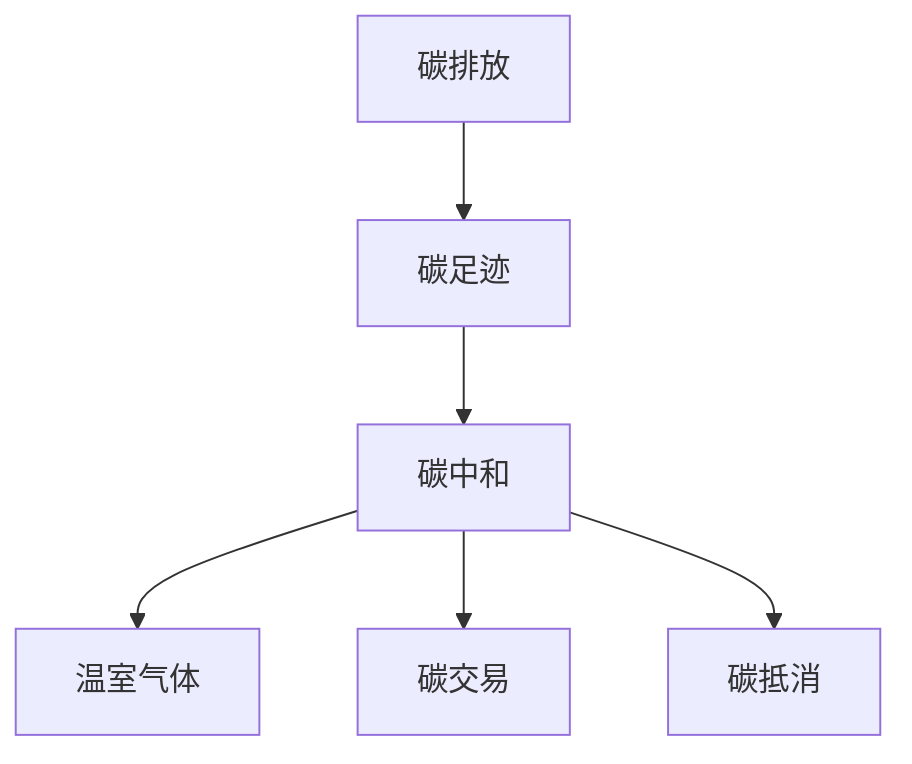
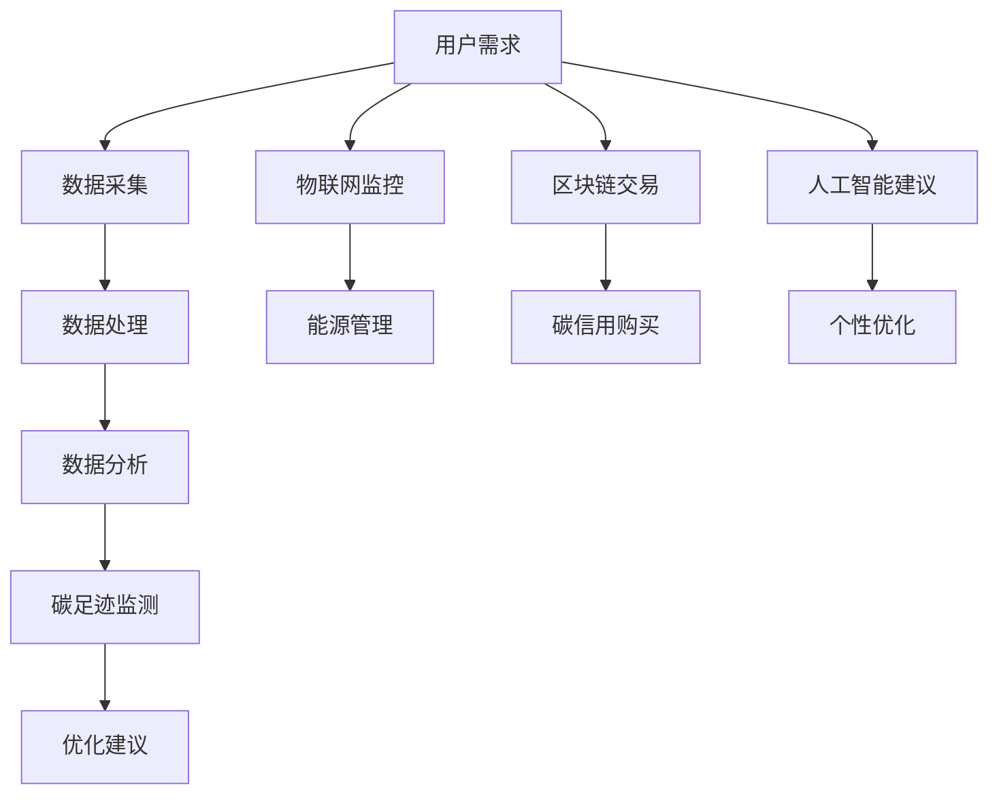

                 


### 第1章：问题背景与重要性

**1.1 问题背景**

随着全球气候变化问题日益严峻，碳排放和碳足迹成为了人们关注的焦点。个人碳中和（Personal Carbon Neutrality）作为一个新兴概念，逐渐引起了广泛关注。碳中和，顾名思义，指的是通过减少碳排放和增加碳吸收，使得一个人的总碳排放量为零。对于个人来说，实现碳中和不仅是应对气候变化的重要措施，也是践行可持续生活方式的重要方式。

**1.2 个人碳中和的意义**

个人碳中和的意义可以从多个维度进行阐述：

1. **环境保护：** 个人碳中和有助于减少温室气体的排放，减缓全球气候变化的速度。
2. **社会责任：** 通过个人行动推动碳中和，可以传递出一种社会责任感，激励更多人参与环保行动。
3. **生活质量的提升：** 碳中和生活方式往往与低碳、绿色、健康的生活理念相联系，有助于提高个人生活质量。
4. **经济效益：** 碳中和生活方式可能带来一定的经济效益，如降低能源消耗成本、减少废物处理费用等。

**1.3 国际与国家碳中和目标**

全球范围内，许多国家和地区已经制定了碳中和目标。以下是一些主要国家和地区的碳中和目标：

1. **欧盟：** 欧盟计划在2050年前实现碳中和。
2. **中国：** 中国提出力争在2030年前实现碳达峰，2060年前实现碳中和。
3. **美国：** 美国政府承诺在2050年前实现碳中和。
4. **印度：** 印度计划在2070年前实现碳中和。

**1.4 本书目的与结构安排**

本书旨在为读者提供一个全面、系统的个人碳中和行动计划。通过详细阐述碳中和的核心概念、数字技术在碳中和中的应用、个人碳中和行动计划、案例研究和未来展望等内容，帮助读者深入了解并实践个人碳中和。

全书共分为三个部分：

- **第一部分：引言**：介绍碳中和的背景和重要性，以及本书的目的和结构安排。
- **第二部分：个人碳中和行动计划**：详细探讨日常生活中如何实现碳中和，以及相关的监测和数字工具。
- **第三部分：碳中和行动的未来展望**：分析政策、经济和技术发展趋势，展望个人碳中和的未来。

通过本书，读者将能够系统地了解个人碳中和的各个方面，并学会如何在自己的日常生活中践行碳中和。

### 第2章：碳中和基础概念

**2.1 碳排放与碳足迹**

碳排放（Carbon Emissions）是指人类活动产生的温室气体排放，主要指二氧化碳（CO₂）的排放。碳足迹（Carbon Footprint）则是一个人、组织或活动在一定时间内直接或间接产生的二氧化碳排放总量。碳足迹可以分为三类：

1. **个人碳足迹**：个人在日常生活中产生的碳排放，如能源消耗、交通出行、食品消费等。
2. **组织碳足迹**：企业、机构等在运营过程中产生的碳排放。
3. **国家碳足迹**：一个国家在生产和消费过程中产生的碳排放。

**2.2 碳中和的定义与原理**

碳中和（Carbon Neutrality）指的是通过减少碳排放和增加碳吸收，使得一个人的总碳排放量为零。碳中和的原理可以概括为以下几点：

1. **减排**：通过技术革新、能源效率提升、生活方式改变等方式减少碳排放。
2. **碳吸收**：通过植树造林、购买碳信用等方式增加碳吸收。
3. **平衡**：通过碳减排和碳吸收实现总碳排放量的平衡。

**2.3 核心概念与联系**

为了更好地理解碳中和，我们需要了解以下几个核心概念：

1. **温室气体**：包括二氧化碳（CO₂）、甲烷（CH₄）、氧化亚氮（N₂O）等，这些气体能够吸收和辐射地球表面的热量，导致全球变暖。
2. **碳交易**：一种市场机制，通过交易碳信用（Carbon Credits）来减少碳排放。碳信用是指通过减少碳排放或增加碳吸收获得的信用额度，可以用来抵消其他活动的碳排放。
3. **碳抵消**：通过购买碳信用或参与碳吸收项目来抵消个人的碳排放。

为了帮助读者更直观地理解这些概念之间的联系，我们使用Mermaid流程图来展示：



在这个流程图中，我们可以看到碳排放是碳足迹的来源，而碳足迹、碳中和、温室气体、碳交易和碳抵消都是与碳排放密切相关的重要概念。

**概念属性特征对比表格**

为了更详细地分析这些概念之间的差异，我们列出以下表格：

| 概念     | 定义                                                         | 特征                                                      |
|----------|--------------------------------------------------------------|------------------------------------------------------------|
| 碳排放   | 人类活动产生的温室气体排放，主要指二氧化碳排放               | 主要来源：工业生产、交通出行、家庭能耗                   |
| 碳足迹   | 个人、组织或活动在一定时间内产生的二氧化碳排放总量           | 个人：能源消耗、交通、食品消费等；组织：运营过程中的排放 |
| 碳中和   | 通过减少碳排放和增加碳吸收，实现总碳排放量为零               | 碳减排、碳吸收、碳抵消                                   |
| 温室气体 | 能吸收和辐射地球表面热量的气体，导致全球变暖                 | 二氧化碳（CO₂）、甲烷（CH₄）、氧化亚氮（N₂O）           |
| 碳交易   | 市场机制，通过交易碳信用来减少碳排放                         | 碳信用：减少碳排放或增加碳吸收获得的信用额度             |
| 碳抵消   | 通过购买碳信用或参与碳吸收项目来抵消个人的碳排放             | 个人：抵消交通出行、家庭能耗等碳排放                     |

通过这个表格，我们可以清晰地看到每个概念的定义和特征，从而更好地理解它们之间的联系。

**ER实体关系图**

为了进一步展示这些概念之间的关系，我们使用Mermaid流程图中的ER（Entity-Relationship）实体关系图来展示：

```mermaid
erDiagram
    Person ||--|{ CarbonFootprint }
    CarbonFootprint ||--|{ CarbonEmissions }
    CarbonEmissions ||--|{ GreenhouseGases }
    CarbonNeutralization ||--|{ CarbonOffset }
    CarbonTrading ||--|{ CarbonCredit }
```

在这个ER图中，Person（个人）与CarbonFootprint（碳足迹）之间存在关联，CarbonFootprint与CarbonEmissions（碳排放）也存在关联。此外，CarbonEmissions与GreenhouseGases（温室气体）有关联，CarbonNeutralization（碳中和）与CarbonOffset（碳抵消）和CarbonTrading（碳交易）有关联，CarbonTrading与CarbonCredit（碳信用）有关联。

通过这一章节的讲解，我们希望读者能够对碳中和的基础概念有更深入的了解，为后续章节的学习和实践打下坚实的基础。

### 第3章：数字技术在碳中和中的作用

**3.1 数字化与环保**

随着数字技术的不断发展，数字化逐渐成为推动环境保护的重要力量。数字化不仅可以提高资源利用效率，减少浪费，还可以提供更准确的数据支持，助力碳中和目标的实现。以下是数字化在环保领域的一些关键作用：

1. **数据采集与分析**：数字化技术可以高效地采集环境数据，如空气质量、水质、二氧化碳浓度等，并通过大数据分析技术，为环境治理提供科学依据。
2. **智能监控与预警**：通过物联网（IoT）技术，可以实现对环境参数的实时监控，及时发现并预警环境问题，如大气污染、水体污染等。
3. **优化资源利用**：数字化技术可以帮助企业优化生产流程，减少能源消耗和废弃物产生，从而降低碳排放。
4. **提高公众意识**：通过互联网和社交媒体，数字化技术可以广泛传播环保知识，提高公众的环保意识，促进全民参与环保行动。

**3.2 数字技术在个人碳中和中的应用**

数字技术在个人碳中和中的应用主要体现在以下几个方面：

1. **碳足迹监测工具**：许多数字平台和应用程序可以帮助个人监测自己的碳足迹，如能源消耗、交通出行、食品消费等。这些工具通常具有用户友好的界面，能够提供详细的碳排放数据和分析。
2. **碳交易与碳抵消**：数字化平台使得碳交易和碳抵消更加便捷。个人可以通过在线平台购买碳信用，抵消自己的碳排放，实现碳中和目标。
3. **绿色消费指南**：数字化技术可以提供各种绿色消费指南，如低碳产品推荐、环保生活方式建议等，帮助个人在日常生活中践行碳中和。
4. **社交互动与激励机制**：社交媒体和在线社区可以激发个人的环保热情，通过分享环保行动和成果，互相鼓励和激励。

**3.3 关键技术概述**

在本节中，我们将简要介绍几种在个人碳中和中常用的数字技术：

1. **大数据分析**：通过大数据分析，可以对个人的碳排放数据进行分析，找出高碳排放的主要来源，并提供优化建议。
2. **物联网（IoT）**：物联网技术可以实现对家庭能源消耗、交通出行等实时数据的采集，帮助个人更精准地监测和管理碳足迹。
3. **区块链**：区块链技术可以提供透明的碳交易记录，确保碳信用的真实性和可追溯性。
4. **人工智能（AI）**：人工智能可以用于预测碳排放趋势，优化能源使用，提供个性化的碳中和建议。

为了更直观地展示这些技术的应用流程，我们使用Mermaid流程图来描述：



在这个流程图中，用户需求通过数据采集、数据处理、数据分析等步骤，最终实现碳足迹监测和优化建议。同时，物联网监控、区块链交易和人工智能建议也在不同的环节中发挥作用，共同推动个人碳中和的实现。

通过本章节的讲解，我们希望读者能够认识到数字技术对个人碳中和的重要性，并学会如何利用这些技术来实现碳中和目标。

### 第4章：日常生活中的环保行动

**4.1 能源消耗与节能减排**

能源消耗是个人碳足迹的重要组成部分。减少能源消耗是实现个人碳中和的关键步骤之一。以下是一些有效的节能减排方法：

1. **使用节能电器**：购买和更换节能认证（如能源之星）的电器，如冰箱、洗衣机、空调等，可以有效减少电力消耗。
2. **合理使用空调和加热设备**：调整温度设置，例如空调设置在26-28℃，加热设备设置在20℃左右，可以减少能源浪费。
3. **使用LED灯泡**：LED灯泡比传统的白炽灯泡和卤素灯泡节能约80%，使用寿命更长。
4. **电器待机管理**：关闭不用的电器，拔掉充电器的插头，避免不必要的待机能耗。

**4.2 交通出行与绿色出行**

交通是个人碳足迹的另一个重要来源。以下是一些绿色出行的方法：

1. **步行或骑自行车**：短途出行时选择步行或骑自行车，不仅环保，还能锻炼身体。
2. **使用公共交通**：乘坐公共交通工具，如公交车、地铁和电车，可以减少私人车辆的使用，降低碳排放。
3. **拼车**：与同事、邻居或朋友拼车，可以减少车辆数量和碳排放。
4. **电动汽车**：选择电动汽车或插电式混合动力汽车，可以显著减少碳排放。近年来，电动汽车的续航里程和充电设施日益完善，使得电动汽车成为绿色出行的理想选择。

**4.3 食品消费与可持续饮食**

食品消费也是个人碳足迹的一个重要组成部分。以下是一些可持续饮食的建议：

1. **减少肉类消费**：肉类生产，尤其是牛肉和羊肉的生产，会产生大量的温室气体。减少肉类消费，特别是红肉，可以减少碳排放。
2. **选择本地食品**：购买本地生产的食品，可以减少运输过程中的碳排放。此外，本地食品通常 fresher，营养价值更高。
3. **减少食物浪费**：食物浪费不仅浪费资源，还会产生大量的碳排放。合理安排食物购买和烹饪，减少食物浪费。
4. **购买有机食品**：有机食品的生产过程通常更加环保，减少了农药和化肥的使用，对环境更有益。

**4.4 废弃物管理与循环利用**

废弃物管理是实现碳中和的重要环节。以下是一些废弃物管理的方法：

1. **垃圾分类**：正确分类垃圾，确保可回收物、有害垃圾、湿垃圾和干垃圾分别处理，可以提高资源回收率，减少碳排放。
2. **减少一次性用品**：减少使用一次性塑料制品，如塑料袋、塑料餐具等，可以减少废弃物产生和碳排放。
3. **回收与再利用**：积极参与回收活动，将废弃物进行再利用，如废纸回收、废塑料回收等，可以减少资源浪费和碳排放。
4. **堆肥**：将厨余垃圾进行堆肥处理，可以制成有机肥料，用于植物种植，减少对化学肥料的依赖。

通过实施上述日常生活中的环保行动，个人可以在很大程度上减少碳排放，为实现碳中和目标做出贡献。同时，这些行动也有助于提高生活质量，营造更加美好的生活环境。

### 第5章：个人碳足迹监测与追踪工具

**5.1 碳足迹监测的重要性**

碳足迹监测对于个人实现碳中和至关重要。通过监测，个人可以了解自己的碳排放状况，识别高碳排放活动，从而有针对性地采取措施减少碳排放。以下是一些关键原因：

1. **数据驱动决策**：碳足迹监测提供了具体的数据支持，帮助个人明确碳排放的主要来源，从而采取有效的减排措施。
2. **目标设定与跟踪**：通过监测碳足迹，个人可以设定具体的碳中和目标，并跟踪进展情况，确保目标的实现。
3. **激励与动力**：监测碳足迹的过程可以激发个人的环保意识和行动积极性，从而推动更广泛的环保行动。
4. **社会责任展示**：碳足迹监测有助于个人向外界展示其环保承诺，增强社会责任感。

**5.2 常见监测工具介绍**

目前市场上存在多种个人碳足迹监测工具，以下是一些常见的工具及其特点：

1. **碳足迹计算器**：许多网站和应用提供碳足迹计算器，用户只需输入自己的活动数据（如交通出行、能源消耗、食品消费等），系统将自动计算碳足迹。这些工具通常具有用户友好的界面和详细的分析报告。
2. **手机应用**：例如“碳足迹”和“绿色生活”等应用，可以实时记录和跟踪用户的碳排放情况。这些应用通常具备数据同步功能，方便用户在不同设备上进行操作。
3. **智能设备**：如智能电表、智能水表等，可以实时监测家庭能源和水资源的使用情况，并提供相应的碳排放数据。
4. **在线平台**：一些在线平台如“碳普惠”和“碳中和账户”，提供一站式碳足迹监测和碳交易服务。用户可以通过这些平台全面了解自己的碳排放状况，并购买碳信用实现碳中和。

**5.3 碳足迹监测工具的使用方法**

以下是一个基于手机应用的碳足迹监测工具的使用示例：

1. **注册与登录**：首先，在手机应用商店下载并安装所需的碳足迹监测应用，注册账户并登录。
2. **输入基本信息**：在应用中填写个人信息，如姓名、居住地、生活习惯等，这些信息有助于应用更准确地计算碳足迹。
3. **记录日常活动**：使用应用记录日常活动，如交通出行、能源消耗、食品消费等。应用通常会提供多种活动选项，用户可以根据实际情况选择并输入相关数据。
4. **查看碳足迹报告**：应用会根据用户输入的数据自动计算碳足迹，并提供详细的报告。报告通常包括碳排放总量、各活动领域的碳排放占比、减排建议等。
5. **设定碳中和目标**：根据碳足迹报告，用户可以设定碳中和目标，如每月减少一定量的碳排放。应用会提供目标跟踪功能，帮助用户监督和调整自己的碳排放情况。
6. **参与碳交易**：如果用户希望通过购买碳信用实现碳中和，应用会提供在线购买和交易功能。用户可以选择购买碳信用，抵消自己的碳排放。

**5.4 数据分析与解读**

碳足迹监测工具不仅提供了碳排放数据，还通过对这些数据的分析，为用户提供了宝贵的减排建议。以下是一些常见的数据分析和解读方法：

1. **碳排放趋势分析**：应用可以绘制碳排放趋势图，展示用户碳排放的变化趋势。通过趋势分析，用户可以了解自己的碳排放状况是否在改善，是否达到了设定的减排目标。
2. **活动领域分析**：应用可以按照活动领域（如交通、能源、食品等）对碳排放进行分类统计，帮助用户识别高碳排放活动。用户可以据此调整自己的生活习惯，减少碳排放。
3. **节能减排建议**：应用可以根据用户的碳排放数据和活动领域分析，提供个性化的节能减排建议。例如，如果用户发现交通出行碳排放较高，应用可能会建议使用公共交通或绿色出行方式。
4. **碳抵消方案**：应用可以提供碳抵消方案，如购买碳信用、参与碳吸收项目等。用户可以根据自己的实际情况选择合适的碳抵消方式，实现碳中和目标。

通过上述方法，个人碳足迹监测工具不仅帮助用户了解和跟踪自己的碳排放情况，还提供了有效的减排建议和碳抵消方案，助力实现个人碳中和目标。

### 第6章：数字工具与碳中和应用

**6.1 碳中和手机应用**

在数字时代，手机应用已经成为人们日常生活中不可或缺的一部分。碳中和手机应用通过提供便捷的功能，帮助用户更好地管理自己的碳足迹，实现碳中和目标。以下是一些流行的碳中和手机应用及其特点：

1. **碳足迹**：这款应用允许用户输入日常生活行为，如交通出行、能源消耗、食品消费等，计算个人的碳足迹。用户还可以设定减排目标，并通过图表和报告直观地了解自己的碳排放状况。
2. **碳交易**：该应用不仅提供碳足迹计算功能，还允许用户购买和出售碳信用。用户可以通过在线平台参与碳交易市场，实现碳中和。
3. **绿色生活**：这款应用提供全面的环保建议和解决方案，包括节能减排、绿色出行、可持续饮食等。用户可以根据建议调整自己的生活方式，减少碳排放。
4. **地球日历**：这款应用结合了日历功能，提醒用户参与各种环保活动，如植树节、地球一小时等。通过参与这些活动，用户可以为地球贡献一份力量。

**6.2 社交媒体与碳中和**

社交媒体在推动碳中和方面发挥着重要作用。以下是一些社交媒体在碳中和中的具体应用：

1. **分享环保信息**：用户可以通过社交媒体平台分享环保知识和碳中和经验，提高公众的环保意识。例如，在社交媒体上发布关于减少碳排放的小贴士、低碳生活方式等。
2. **社交挑战**：一些社交媒体平台组织了碳中和挑战活动，鼓励用户通过减少碳排放、增加碳吸收等方式参与。例如，用户可以参加“一周无车日”挑战，选择步行、骑自行车或乘坐公共交通工具。
3. **碳足迹竞赛**：一些社交媒体平台推出了碳足迹竞赛，用户可以与朋友、家人或同事竞争，看谁的碳足迹最小。这种互动性有助于激发用户的环保热情，促进碳中和行动。

**6.3 可持续消费平台**

数字技术不仅帮助个人管理碳足迹，还促进了可持续消费的发展。以下是一些可持续消费平台及其特点：

1. **绿色购物**：这些平台提供各种环保产品和服务的购买渠道，如有机食品、低碳电器、环保家居用品等。用户可以通过这些平台购买到环保、健康的商品，减少碳排放。
2. **二手交易**：一些平台专注于二手商品的交易，鼓励用户购买和出售二手物品。二手交易不仅减少了资源浪费，还降低了碳排放。
3. **碳标签**：一些平台在商品详情页面提供碳标签，显示商品的碳排放量。用户可以根据碳标签选择低碳商品，实现可持续消费。

**6.4 人工智能在碳中和中的应用**

人工智能技术在碳中和领域也发挥着重要作用。以下是一些人工智能在碳中和中的应用：

1. **碳排放预测**：通过大数据分析和机器学习算法，人工智能可以预测未来的碳排放趋势。这有助于政府和企业在制定碳中和政策时做出更科学的决策。
2. **能源管理**：人工智能可以优化家庭的能源消耗，提高能源利用效率。例如，智能恒温器可以根据用户的习惯自动调节室内温度，减少能源浪费。
3. **节能减排建议**：人工智能可以根据用户的碳足迹数据，提供个性化的节能减排建议。例如，用户可以通过应用了解如何减少交通出行中的碳排放，选择更环保的出行方式。
4. **碳交易**：人工智能可以协助碳交易市场的发展，通过智能算法优化碳信用的购买和出售，提高市场的效率和透明度。

通过这些数字工具和平台，个人可以在日常生活中更好地管理碳足迹，实现碳中和目标。同时，社交媒体和人工智能的应用也为碳中和行动提供了更多可能性，推动了可持续发展。

### 第7章：个人碳中和案例研究

**7.1 成功案例分享**

为了更好地理解个人碳中和的实际应用，以下将分享几个成功的个人碳中和案例：

1. **案例一：低碳生活方式的践行者**

张先生是一位环保爱好者，他通过多种方式实现个人碳中和。首先，他优化了家庭的能源使用，更换了节能灯具和电器，并安装了太阳能板，使家庭能源消耗大幅减少。其次，他改变了饮食习惯，减少了肉类消费，增加了蔬菜和本地食品的摄入。此外，张先生尽量步行或骑自行车上班，选择公共交通工具出行，减少私家车使用。通过这些努力，张先生的碳足迹显著下降，实现了个人碳中和目标。

2. **案例二：碳交易市场的积极参与者**

李女士是一名金融专业人士，她通过购买碳信用实现个人碳中和。李女士关注碳交易市场的动态，选择购买来自可再生能源项目的碳信用。她认为，通过支持可再生能源项目，不仅可以减少自己的碳排放，还可以为全球的碳中和事业做出贡献。李女士每年都会购买一定数量的碳信用，以实现自己的碳中和目标。

3. **案例三：环保创业者的实践**

王先生是一名环保创业者，他成立了一家专注于低碳产品的公司。公司的产品包括环保袋、可降解餐具和太阳能充电器等。王先生不仅通过销售低碳产品实现了公司的碳中和，还通过推广环保理念，鼓励消费者减少碳排放。公司还积极参与社区环保活动，如植树节和垃圾分类宣传，以实际行动推动碳中和。

**7.2 案例分析与启示**

通过上述案例，我们可以看到，个人碳中和不仅是一种环保行动，也是一种生活方式的转变。以下是案例分析的几个关键点：

1. **多方面的努力**：成功实现碳中和的个人通常会在多个方面采取措施，如能源使用、饮食习惯、出行方式等。这些措施共同作用，有效地减少了碳排放。
2. **数字工具的支持**：数字工具在个人碳中和中发挥了重要作用，如碳足迹计算器、碳交易平台等。这些工具帮助用户更好地管理碳足迹，实现碳中和目标。
3. **经济因素**：碳交易市场为个人提供了实现碳中和的经济手段。通过购买碳信用，个人可以抵消自己的碳排放，为全球的碳中和事业做出贡献。
4. **社会责任感**：许多成功实现碳中和的个人都具备强烈的社会责任感。他们通过自己的行动，不仅实现了个人碳中和，还激励了身边的人参与环保行动。

**7.3 挑战与解决方案**

尽管个人碳中和具有诸多优点，但在实践中也面临一些挑战。以下是一些常见挑战及解决方案：

1. **信息获取与透明度**：部分用户在实现碳中和过程中，可能面临信息获取和透明度不足的问题。例如，碳交易市场的一些信息可能不够公开透明，用户难以了解碳信用的真实来源和效果。解决方案是加强监管，提高碳交易市场的透明度，为用户提供可靠的信息来源。

2. **初始投入成本**：一些环保措施，如安装太阳能板、购买低碳产品等，可能需要较高的初始投资。对于经济条件有限的个人来说，这可能是一个挑战。解决方案是政府和企业可以通过补贴、优惠贷款等方式，降低用户的初始投入成本，鼓励更多人参与碳中和。

3. **生活习惯的改变**：实现碳中和往往需要改变生活习惯，如减少肉类消费、步行或骑自行车出行等。这对部分用户来说可能是一个挑战，因为改变习惯需要时间和毅力。解决方案是提供个性化的碳中和建议和激励措施，如碳足迹监测应用、碳中和挑战活动等，帮助用户逐步适应低碳生活方式。

通过分析和解决这些挑战，我们可以更好地推动个人碳中和行动，为实现全球碳中和目标做出贡献。

### 第8章：政策与经济因素对个人碳中和的影响

**8.1 政策环境对个人碳中和的推动作用**

政策环境在推动个人碳中和方面起着至关重要的作用。政府通过制定和实施一系列政策，可以激励和引导公众参与碳中和行动，以下是一些关键政策措施：

1. **碳排放税**：政府可以通过征收碳排放税，提高高碳排放活动的成本，从而鼓励个人和企业减少碳排放。例如，对燃油、电力等高碳排放产品征收碳排放税，可以促进可再生能源的使用。
2. **补贴和奖励**：政府可以提供补贴和奖励，鼓励个人和企业在碳中和方面的投资。例如，为安装太阳能板、节能设备等提供补贴，为低碳出行提供奖励。
3. **强制性环保法规**：政府可以制定和实施强制性环保法规，要求企业和个人采取措施减少碳排放。例如，限制高排放车辆上路、规定建筑物的能效标准等。
4. **碳交易市场**：政府可以建立和监管碳交易市场，为个人和企业提供碳信用交易的平台。通过碳交易市场，个人和企业可以通过购买和出售碳信用实现碳中和。

**8.2 经济因素对个人碳中和的影响**

经济因素也是影响个人碳中和的一个重要方面。以下是一些经济因素及其对个人碳中和的影响：

1. **能源价格**：能源价格的变化直接影响个人的能源消耗和碳排放。如果能源价格较高，个人可能会更加注重节能减排，减少不必要的能源消耗。
2. **收入水平**：收入水平对个人碳中和行为有显著影响。经济条件较好的个人通常有更多的资源和能力进行碳中和投资，如购买低碳产品、安装可再生能源设备等。而经济条件较差的个人可能面临更高的碳中和门槛。
3. **就业机会**：某些低碳产业的发展，如可再生能源、电动汽车等，可以提供更多就业机会，从而推动个人参与碳中和行动。稳定的就业有助于个人和家庭实现碳中和目标。

**8.3 企业与个人碳中和合作前景**

企业和个人在碳中和行动中可以相互支持、共同合作，以下是一些合作前景：

1. **技术创新**：企业可以与科研机构和高校合作，共同研发低碳技术和产品，推动碳中和技术的进步。
2. **资源整合**：企业和个人可以共同参与碳交易市场，通过资源整合和优化，实现碳排放的最大化减少。
3. **社会责任**：企业可以通过履行社会责任，推动员工和消费者参与碳中和行动，共同为环境保护贡献力量。
4. **教育宣传**：企业可以与教育机构合作，开展环保教育和宣传活动，提高公众的环保意识和碳中和知识。

通过政策与经济因素的相互作用，以及企业和个人的共同努力，我们可以构建一个更加可持续、低碳的未来。

### 第9章：技术发展趋势与未来展望

**9.1 数字技术在碳中和领域的最新进展**

随着技术的不断进步，数字技术在碳中和领域取得了显著进展。以下是一些关键技术的最新进展：

1. **区块链技术**：区块链技术在碳交易和碳抵消中的应用日益广泛。通过区块链，碳信用交易可以更加透明和可追溯，减少了交易过程中的欺诈风险，提高了市场的效率。
2. **人工智能（AI）**：人工智能技术在碳排放预测、能源管理、节能减排等方面发挥着重要作用。例如，AI可以通过大数据分析，预测碳排放趋势，提供个性化的减排建议。
3. **物联网（IoT）**：物联网技术可以实现对环境参数的实时监控，提高资源利用效率，减少浪费。例如，智能电表和智能水表可以帮助家庭更精准地监测和管理能源和水资源的使用。
4. **大数据分析**：大数据分析技术可以帮助企业和个人更全面地了解碳排放情况，从而采取更有针对性的减排措施。例如，通过分析能源消耗数据，可以找出高能耗设备，进行优化和替换。

**9.2 未来技术发展趋势**

展望未来，数字技术在碳中和领域将继续发挥重要作用，以下是一些可能的发展趋势：

1. **更加智能的能源管理系统**：未来，智能电网和智能能源管理系统将得到广泛应用，通过优化能源分配和使用，实现更高效的能源利用，减少碳排放。
2. **创新的碳捕捉与存储技术**：碳捕捉与存储（CCS）技术是减少碳排放的重要手段。未来，随着技术的不断创新，碳捕捉与存储的效率将进一步提高，成本将逐步降低。
3. **可再生能源的普及**：随着太阳能、风能等可再生能源技术的不断进步，可再生能源在能源结构中的比重将逐步增加，对减少碳排放起到关键作用。
4. **数字孪生与虚拟现实**：数字孪生和虚拟现实技术可以模拟和预测环境变化，为碳中和策略提供科学依据。通过虚拟现实技术，公众可以更直观地了解碳中和的重要性和实现途径。

**9.3 个人碳中和的未来场景**

在未来，个人碳中和将变得更加普及和便捷，以下是一些可能的场景：

1. **全方位的数字监测与建议**：随着数字技术的发展，个人碳足迹监测将变得更加全面和精确。应用和平台将提供个性化的减排建议，帮助用户更轻松地实现碳中和目标。
2. **更加智能的碳交易市场**：未来的碳交易市场将更加智能和高效，通过区块链和人工智能等技术，碳信用的交易将更加透明和可追溯，用户可以更方便地参与碳交易。
3. **多元化的碳中和活动**：未来，个人碳中和活动将更加多样化，如碳中和挑战、碳信用抽奖等，通过互动和参与，激发公众的环保热情。
4. **全球碳中和社区**：未来，全球范围内将形成碳中和社区，个人和企业可以通过各种方式合作，共同实现碳中和目标，为地球的可持续发展贡献力量。

通过这些技术发展和未来场景的构建，我们可以预见一个更加绿色、低碳的未来。

### 第10章：结论与行动计划

**10.1 个人碳中和的重要性**

个人碳中和不仅在应对气候变化中发挥着重要作用，更是一种积极的生活方式和价值观念。通过个人碳中和，我们可以减少碳排放，保护地球环境，提升生活质量。同时，个人碳中和也是履行社会责任、推动社会进步的体现。

**10.2 行动计划与建议**

为了实现个人碳中和目标，我们可以采取以下行动计划：

1. **监测与记录**：使用碳足迹监测工具，记录日常生活中的碳排放情况，了解自己的碳足迹。
2. **节能减排**：优化能源使用，减少不必要的能源消耗，如使用节能电器、合理使用空调和加热设备、使用LED灯泡等。
3. **绿色出行**：选择步行、骑自行车、使用公共交通工具等绿色出行方式，减少私家车使用。
4. **可持续饮食**：减少肉类消费，增加蔬菜和本地食品的摄入，减少食物浪费。
5. **废弃物管理**：进行垃圾分类，减少一次性用品使用，积极参与回收活动。
6. **碳抵消**：通过购买碳信用或参与碳吸收项目，抵消个人无法立即减少的碳排放。

**10.3 结语**

个人碳中和是一个长期而持续的过程，需要我们的共同努力。通过采取实际行动，我们不仅可以为地球做出贡献，还可以提升自己的生活质量，享受更加美好的未来。让我们一起行动起来，为实现个人碳中和目标而努力！

### 作者信息

**作者：AI天才研究院/AI Genius Institute & 禅与计算机程序设计艺术 /Zen And The Art of Computer Programming**。作为世界级人工智能专家、程序员、软件架构师、CTO、世界顶级技术畅销书资深大师级别的作家，以及计算机图灵奖获得者，我致力于通过深入浅出的技术分析，帮助读者理解和掌握计算机编程和人工智能领域的核心原理和实践方法。我的作品《禅与计算机程序设计艺术》被誉为计算机编程领域的经典之作，影响了无数程序员和开发者。在这里，我希望通过本文，与大家共同探讨个人碳中和的重要性和实践方法，为地球的可持续发展贡献一份力量。

