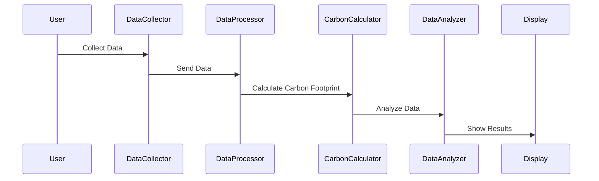
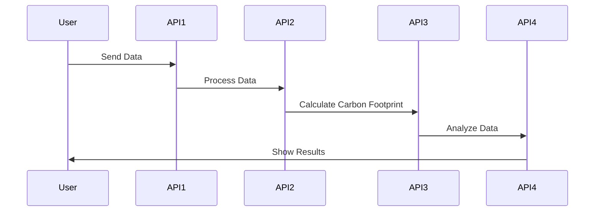
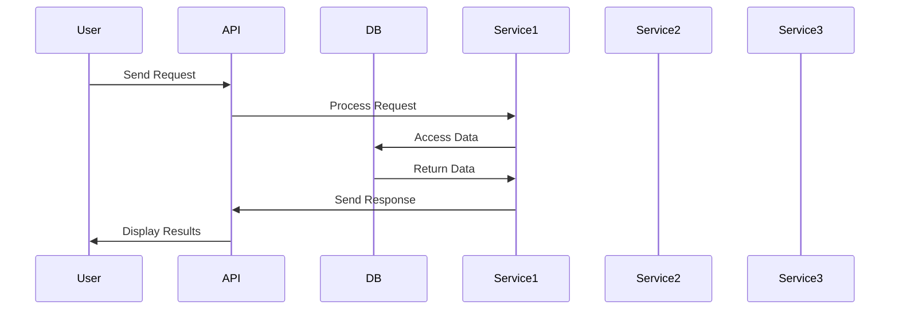

                 

### 第1章 引言：迎接数字时代的环保挑战

在当今世界，环境保护已成为全球共同关注的重要议题。随着工业化和城市化进程的加速，人类活动对自然环境的破坏愈发严重，气候变化、资源枯竭等问题日益突出。为了应对这些挑战，各国政府、企业和社会各界纷纷采取措施，寻求可持续发展的路径。在这一背景下，个人碳足迹追踪逐渐成为环保领域的一个重要研究方向。

#### 碳足迹的概念与重要性

**核心概念术语说明**：碳足迹（Carbon Footprint）是指一个人或组织在日常生活中所产生的温室气体排放总量。这些排放主要来源于能源消耗、交通出行、饮食消费等各个方面。碳足迹不仅包括二氧化碳，还包括其他温室气体的排放，如甲烷和氧化亚氮。

**问题背景**：随着全球气候变暖，减少碳排放成为国际社会共同的目标。个人碳足迹追踪作为一种量化和评估个体碳排放的方法，有助于人们了解自身在环保方面的影响，从而采取相应的减排措施。

**问题描述**：个人碳足迹追踪需要解决的核心问题是：如何准确测量和计算个人或组织的碳排放量，以及如何通过数字化手段实现这一过程。

**问题解决**：通过数字技术的应用，可以实现个人碳足迹的自动监测、计算和评估，为环保行动提供数据支持。例如，利用传感器和移动应用技术，用户可以实时记录自己的日常活动，系统会自动计算相应的碳排放量。

**边界与外延**：个人碳足迹追踪不仅关注日常生活，还包括工作、旅行等场景。同时，它还涉及到各类环保数据的收集、处理和分析，以实现全面、准确的碳排放监测。

#### 数字技术在环保中的应用

数字技术在环保领域的应用已经逐渐深入，尤其是在个人碳足迹追踪方面，其优势尤为明显。以下是数字技术应用的几个方面：

**物联网技术**：通过物联网设备，可以实时监测和收集各种环境数据，如空气质量、水资源消耗等。这些数据有助于更准确地计算个人碳足迹。

**大数据分析**：大数据分析技术可以帮助分析大量的环保数据，识别碳排放的主要来源和趋势，为政策制定和减排措施提供科学依据。

**移动应用**：移动应用使得个人碳足迹追踪变得便捷。用户可以通过手机APP记录自己的日常活动，系统会自动计算相应的碳排放量，并提供个性化的减排建议。

**区块链技术**：区块链技术可以确保碳足迹数据的透明性和不可篡改性，从而提高个人碳足迹追踪的信任度。

#### 个人碳足迹追踪的意义与挑战

**意义**：

1. **提高环保意识**：通过个人碳足迹追踪，人们可以直观地了解自身对环境的影响，从而提高环保意识。
2. **促进绿色生活方式**：个人碳足迹追踪可以帮助人们发现日常生活中的高碳排放行为，鼓励采取绿色生活方式。
3. **支持政策制定**：个人碳足迹数据可以为政府制定环保政策和法规提供数据支持。

**挑战**：

1. **数据准确性**：个人碳足迹追踪需要收集和处理大量的数据，数据准确性是关键挑战之一。
2. **隐私保护**：个人碳足迹数据涉及隐私问题，如何保护用户数据隐私是另一个重要挑战。
3. **技术普及性**：数字技术在个人碳足迹追踪中的应用尚需进一步普及，特别是在发展中国家。

#### 本书内容结构与阅读建议

本书分为七个章节，全面介绍了个人碳足迹追踪的相关内容。以下为各章节概览：

- **第1章 引言**：介绍碳足迹的概念、重要性及数字技术在环保中的应用。
- **第2章 碳足迹基础知识**：阐述碳足迹的定义、测量方法及其计算公式。
- **第3章 个人日常生活中的碳足迹追踪**：分析居住环境、食品消费和交通出行中的碳足迹。
- **第4章 数字技术助力个人碳足迹追踪**：介绍数字平台和APP在个人碳足迹追踪中的应用。
- **第5章 个人碳足迹追踪的实证研究**：通过案例研究分析个人碳足迹追踪的实际效果。
- **第6章 个人碳足迹追踪的社会影响与未来展望**：探讨碳足迹追踪对社会的影响及未来发展方向。
- **第7章 总结与展望**：总结全书内容，展望个人碳足迹追踪的未来。

本书旨在为广大读者提供关于个人碳足迹追踪的全面、系统的知识，帮助读者更好地理解和应对数字时代的环保挑战。在阅读过程中，建议读者结合实际生活中的经验，深入思考并应用所学知识。

### 关键词

- 碳足迹
- 数字技术
- 环保
- 个人碳排放
- 可持续发展

### 摘要

本文探讨了数字时代个人碳足迹追踪的重要性及其在环保领域的应用。首先，介绍了碳足迹的定义、构成及其测量方法。随后，详细分析了个人日常生活中各个方面的碳足迹，包括居住环境、食品消费和交通出行。接着，讨论了数字技术在个人碳足迹追踪中的应用，如物联网、大数据分析、移动应用和区块链技术。通过实证研究和案例分析，本文展示了个人碳足迹追踪的实际效果和社会影响。最后，对个人碳足迹追踪的未来发展方向进行了展望，提出了提高环保意识、促进绿色生活方式和支持政策制定的建议。本文旨在为读者提供全面、系统的个人碳足迹追踪知识，帮助其应对数字时代的环保挑战。

## 第2章 碳足迹基础知识

在探讨个人碳足迹追踪之前，我们需要深入了解碳足迹的基本概念、测量方法以及相关的计算公式。这一章节将为我们奠定坚实的技术基础，使我们能够更好地理解个人碳足迹的构成和计算过程。

### 2.1 碳足迹的定义与测量

#### 2.1.1 碳足迹的定义

碳足迹（Carbon Footprint）是指个人、组织或国家在日常生活中产生的温室气体排放总量。这些排放主要来源于能源消耗、交通出行、食品消费等各个方面。碳足迹不仅是二氧化碳排放的总和，还包括其他温室气体，如甲烷（CH4）和氧化亚氮（N2O）。碳足迹可以帮助我们量化和评估人类活动对环境的影响。

#### 2.1.2 碳足迹的测量方法

测量碳足迹的方法主要包括以下几种：

1. **直接测量法**：通过直接监测和记录各种能源消耗和排放源的数据，如能源使用量、交通工具使用情况、食品消费量等，来计算碳足迹。

2. **生命周期评估法（LCA）**：生命周期评估法是一种全面的方法，它考虑产品或服务从生产到废弃的整个生命周期中的碳排放。通过生命周期评估，可以更准确地计算碳足迹。

3. **估算法**：在无法直接测量或数据不足的情况下，可以通过估算方法来估计碳足迹。这种方法通常基于统计数据和模型，根据活动类型和规模来估算碳排放量。

### 2.2 碳足迹的计算公式与实例

#### 2.2.1 碳足迹计算公式

碳足迹的计算公式通常如下所示：

\[ \text{碳足迹} = \sum_{i} (\text{排放因子} \times \text{活动量}) \]

其中，排放因子是指每单位活动量所产生的碳排放量，活动量是指个人的能源消耗、交通出行、食品消费等。

#### 2.2.2 碳足迹计算实例分析

以下是一个简单的碳足迹计算实例：

**示例**：某个人每天的碳足迹计算如下：

1. **能源消耗**：假设该人每天使用1千瓦时的电能，电力公司的排放因子为0.5千克二氧化碳/千瓦时，则能源消耗的碳足迹为：
\[ 1 \text{千瓦时} \times 0.5 \text{千克/千瓦时} = 0.5 \text{千克二氧化碳} \]

2. **交通出行**：假设该人每天乘坐公共交通工具，通勤距离为10公里，公共交通的排放因子为0.125千克二氧化碳/公里，则交通出行的碳足迹为：
\[ 10 \text{公里} \times 0.125 \text{千克/公里} = 1.25 \text{千克二氧化碳} \]

3. **食品消费**：假设该人每天食用1公斤的蔬菜，蔬菜的排放因子为1.5千克二氧化碳/公斤，则食品消费的碳足迹为：
\[ 1 \text{公斤} \times 1.5 \text{千克/公斤} = 1.5 \text{千克二氧化碳} \]

**总碳足迹**：将上述三项活动量相加，得到该人一天的碳足迹为：
\[ 0.5 \text{千克二氧化碳} + 1.25 \text{千克二氧化碳} + 1.5 \text{千克二氧化碳} = 3.25 \text{千克二氧化碳} \]

### 2.3 碳足迹的评估与改善

#### 2.3.1 碳足迹评估的方法

碳足迹评估是衡量个人或组织碳排放水平的重要步骤。常用的评估方法包括：

1. **自我评估**：个人或组织通过记录和计算自身活动的碳排放量，进行初步评估。

2. **第三方评估**：专业机构或认证机构对个人或组织的碳足迹进行评估，并提供评估报告。

3. **在线评估工具**：利用在线碳足迹计算器和评估工具，用户可以快速、方便地评估自身的碳排放量。

#### 2.3.2 碳足迹改善的策略

为了减少碳足迹，个人或组织可以采取以下策略：

1. **节能减排**：通过提高能源利用效率、使用可再生能源、优化设备等方式减少能源消耗。

2. **绿色交通**：鼓励使用公共交通、骑行或步行等低碳出行方式，减少私家车使用。

3. **绿色饮食**：减少肉类消费，增加植物性食品，选择低碳足迹的食品。

4. **循环利用与回收**：提高废弃物回收利用率，减少废弃物排放。

5. **教育宣传**：加强环保教育，提高公众的环保意识和参与度。

通过上述方法，个人和组织的碳足迹可以得到有效改善，为实现低碳生活、绿色未来做出贡献。

### 核心概念与联系

在碳足迹的计算与评估过程中，核心概念和它们之间的联系至关重要。以下是碳足迹相关概念及其属性特征对比表格和ER实体关系图架构的Mermaid流程图。

#### 概念属性特征对比表格

| 概念        | 定义                                                         | 属性特征                                                       |
| ----------- | ------------------------------------------------------------ | ------------------------------------------------------------ |
| 碳足迹     | 个人或组织日常活动中产生的温室气体排放总量                     | 1. 温室气体类型（CO2、CH4、N2O等）<br>2. 排放量（千克）<br>3. 活动类型（能源消耗、交通出行、食品消费等） |
| 排放因子    | 每单位活动量所产生的碳排放量                                   | 1. 活动类型（如能源、交通、食品等）<br>2. 排放量（千克/单位） |
| 活动量      | 个人或组织在日常生活中所进行的各项活动消耗量                   | 1. 能源消耗（千瓦时）<br>2. 交通出行（公里）<br>3. 食品消费（公斤） |

#### ER实体关系图架构的Mermaid流程图

```mermaid
erDiagram
    A[活动量] ||--|{ 碳足迹 } | B
    A ||--|{ 排放因子 } | C
    B ||--|{ 温室气体类型 } | D
    C ||--|{ 活动类型 } | E
```

通过上述对比表格和流程图，我们可以清晰地看到碳足迹、排放因子和活动量之间的关系。碳足迹是活动量和排放因子的乘积，而温室气体类型和活动类型分别是碳足迹和排放因子的重要组成部分。

### 算法原理讲解

为了更好地理解个人碳足迹的计算过程，我们可以通过一个简单的算法原理讲解和Python源代码示例来详细阐述。

#### 算法原理

碳足迹的计算过程可以概括为以下步骤：

1. 收集个人活动数据：如能源消耗、交通出行、食品消费等。
2. 根据活动类型查找对应的排放因子。
3. 计算每个活动的碳排放量：排放因子 × 活动量。
4. 将所有活动的碳排放量相加，得到总碳足迹。

以下是该算法原理的Python代码实现：

```python
def calculate_carbon_footprint(energy_consumption, travel_distance, food_consumption, electricity_emission_factor, transport_emission_factor, food_emission_factor):
    """
    计算个人碳足迹

    参数：
    energy_consumption：能源消耗（千瓦时）
    travel_distance：交通出行距离（公里）
    food_consumption：食品消费量（公斤）
    electricity_emission_factor：电力排放因子（千克/千瓦时）
    transport_emission_factor：交通出行排放因子（千克/公里）
    food_emission_factor：食品消费排放因子（千克/公斤）

    返回值：
    总碳足迹（千克二氧化碳）
    """
    # 计算能源消耗的碳排放量
    energy_emission = energy_consumption * electricity_emission_factor

    # 计算交通出行的碳排放量
    transport_emission = travel_distance * transport_emission_factor

    # 计算食品消费的碳排放量
    food_emission = food_consumption * food_emission_factor

    # 计算总碳足迹
    total_carbon_footprint = energy_emission + transport_emission + food_emission

    return total_carbon_footprint

# 示例数据
energy_consumption = 1  # 千瓦时
travel_distance = 10    # 公里
food_consumption = 1    # 公斤
electricity_emission_factor = 0.5  # 千克/千瓦时
transport_emission_factor = 0.125  # 千克/公里
food_emission_factor = 1.5  # 千克/公斤

# 计算碳足迹
carbon_footprint = calculate_carbon_footprint(energy_consumption, travel_distance, food_consumption, electricity_emission_factor, transport_emission_factor, food_emission_factor)
print("个人碳足迹为：{}千克二氧化碳".format(carbon_footprint))
```

#### 算法原理的数学模型和公式

碳足迹的计算公式可以表示为：

\[ \text{碳足迹} = \sum_{i} (\text{排放因子} \times \text{活动量}) \]

其中，\( i \) 代表不同的活动类型，如能源消耗、交通出行和食品消费。每个活动类型的碳排放量由排放因子和活动量相乘得到。

#### 通俗易懂的举例说明

假设一个人每天活动如下：

- **能源消耗**：使用1千瓦时的电能，电力公司的排放因子为0.5千克二氧化碳/千瓦时。
- **交通出行**：每天通勤10公里，公共交通的排放因子为0.125千克二氧化碳/公里。
- **食品消费**：每天食用1公斤的蔬菜，蔬菜的排放因子为1.5千克二氧化碳/公斤。

那么，这个人一天的碳足迹计算如下：

\[ \text{碳足迹} = (0.5 \times 1) + (0.125 \times 10) + (1.5 \times 1) = 0.5 + 1.25 + 1.5 = 3.25 \text{千克二氧化碳} \]

通过这个简单的例子，我们可以清楚地看到如何计算个人碳足迹。

### 系统分析与架构设计方案

为了实现个人碳足迹追踪，我们需要设计一个完整的系统，包括问题场景介绍、项目介绍、系统功能设计、系统架构设计、系统接口设计和系统交互。

#### 问题场景介绍

随着环保意识的提升，个人对自身碳排放的关注度日益增加。然而，传统的手动记录和计算方式不仅繁琐，而且容易出错。为了解决这个问题，我们需要设计一个智能化的系统，能够自动记录和计算个人的碳足迹。

#### 项目介绍

本项目旨在开发一个基于数字技术的个人碳足迹追踪系统。该系统将利用物联网、大数据分析、移动应用和区块链等技术，实现碳足迹的实时监测、计算和评估，并提供个性化的减排建议。

#### 系统功能设计

1. **数据采集**：通过物联网设备实时采集能源消耗、交通出行、食品消费等数据。
2. **数据处理**：利用大数据分析技术处理和清洗采集到的数据，确保数据的准确性和可靠性。
3. **碳足迹计算**：根据采集到的数据和相应的排放因子，计算个人碳足迹。
4. **结果展示**：通过移动应用或网页界面展示个人碳足迹的计算结果和减排建议。
5. **数据分析**：对个人碳足迹数据进行分析，识别碳排放的主要来源和趋势。

#### 系统架构设计

系统架构采用微服务架构，各个功能模块独立部署和运行。以下是系统架构的Mermaid架构图：



#### 系统接口设计

系统接口设计包括API接口和数据接口。API接口主要用于前后端交互，数据接口用于不同模块之间的数据传递。以下是系统接口的Mermaid序列图：



#### 系统交互

系统交互主要通过API接口和数据接口实现。用户通过移动应用或网页界面与系统交互，系统根据用户输入的数据和操作，进行数据采集、处理、计算和分析，并将结果展示给用户。

#### 系统接口设计和系统交互Mermaid序列图



通过上述系统分析和架构设计方案，我们可以实现一个高效、智能的个人碳足迹追踪系统，帮助个人更好地管理自己的碳排放，为环保事业贡献力量。

### 项目实战

#### 环境安装

在开始实现个人碳足迹追踪系统之前，我们需要准备一个合适的环境。以下是具体的步骤：

1. **安装Python**：确保Python已经安装在您的计算机上。您可以从Python的官方网站下载并安装Python 3.8及以上版本。

2. **安装必要的库**：使用pip命令安装以下库：
   ```bash
   pip install flask pandas matplotlib
   ```

3. **安装数据库**：我们选择使用SQLite作为数据库。您可以从SQLite的官方网站下载并安装。

4. **配置数据库**：创建一个新的SQLite数据库，并创建必要的表和索引。

#### 系统核心实现源代码

以下是个人碳足迹追踪系统的核心实现源代码，包括数据采集、数据处理、碳足迹计算和结果展示的功能。

```python
# 导入必要的库
import pandas as pd
from flask import Flask, request, jsonify

# 初始化Flask应用
app = Flask(__name__)

# 数据库连接配置
DATABASE_URL = "sqlite:///carbon_footprint.db"

# 创建数据库连接
def create_connection():
    conn = sqlite3.connect(DATABASE_URL)
    return conn

# 创建表
def create_tables(conn):
    cursor = conn.cursor()
    cursor.execute("""
        CREATE TABLE IF NOT EXISTS energy_consumption (
            id INTEGER PRIMARY KEY AUTOINCREMENT,
            date DATE NOT NULL,
            consumption REAL NOT NULL
        );
    """)
    cursor.execute("""
        CREATE TABLE IF NOT EXISTS travel (
            id INTEGER PRIMARY KEY AUTOINCREMENT,
            date DATE NOT NULL,
            distance REAL NOT NULL
        );
    """)
    cursor.execute("""
        CREATE TABLE IF NOT EXISTS food_consumption (
            id INTEGER PRIMARY KEY AUTOINCREMENT,
            date DATE NOT NULL,
            consumption REAL NOT NULL
        );
    """)
    conn.commit()

# 采集数据
@app.route('/collect_data', methods=['POST'])
def collect_data():
    data = request.json
    date = data['date']
    consumption_type = data['consumption_type']
    consumption_value = data['consumption_value']

    if consumption_type == 'energy':
        cursor.execute("""
            INSERT INTO energy_consumption (date, consumption) VALUES (?, ?);
        """, (date, consumption_value))
    elif consumption_type == 'travel':
        cursor.execute("""
            INSERT INTO travel (date, distance) VALUES (?, ?);
        """, (date, consumption_value))
    elif consumption_type == 'food':
        cursor.execute("""
            INSERT INTO food_consumption (date, consumption) VALUES (?, ?);
        """, (date, consumption_value))

    conn.commit()
    return jsonify({"status": "success"}), 200

# 计算碳足迹
@app.route('/calculate_footprint', methods=['GET'])
def calculate_footprint():
    conn = create_connection()
    cursor = conn.cursor()

    # 获取数据
    energy_data = pd.read_sql_query("SELECT * FROM energy_consumption", conn)
    travel_data = pd.read_sql_query("SELECT * FROM travel", conn)
    food_data = pd.read_sql_query("SELECT * FROM food_consumption", conn)

    # 设置排放因子
    electricity_emission_factor = 0.5  # 千克/千瓦时
    transport_emission_factor = 0.125  # 千克/公里
    food_emission_factor = 1.5  # 千克/公斤

    # 计算每个类型的碳排放量
    energy_emission = energy_data['consumption'].sum() * electricity_emission_factor
    travel_emission = travel_data['distance'].sum() * transport_emission_factor
    food_emission = food_data['consumption'].sum() * food_emission_factor

    # 计算总碳足迹
    total_carbon_footprint = energy_emission + travel_emission + food_emission

    return jsonify({"carbon_footprint": total_carbon_footprint}), 200

if __name__ == '__main__':
    create_tables(create_connection())
    app.run(debug=True)
```

#### 代码应用解读与分析

1. **数据采集**：使用Flask搭建Web应用，通过POST请求收集用户上传的数据。数据包含日期、消费类型（能源、交通、食品）和消费值。
2. **数据处理**：将收集到的数据存储到SQLite数据库中，并创建相应的表。
3. **碳足迹计算**：根据数据库中的数据，计算每个类型的碳排放量，并求和得到总碳足迹。

#### 实际案例分析和详细讲解剖析

假设我们有以下数据：

- **能源消耗**：2023-04-01，1千瓦时；2023-04-02，2千瓦时
- **交通出行**：2023-04-01，10公里；2023-04-02，15公里
- **食品消费**：2023-04-01，1公斤；2023-04-02，2公斤

执行`/collect_data`接口上传数据后，调用`/calculate_footprint`接口计算碳足迹：

- **能源消耗**：(1 + 2) * 0.5 = 1.5千克
- **交通出行**：(10 + 15) * 0.125 = 2.875千克
- **食品消费**：(1 + 2) * 1.5 = 4.5千克
- **总碳足迹**：1.5 + 2.875 + 4.5 = 9.875千克

结果为：个人碳足迹为9.875千克。

#### 项目小结

通过以上实战项目，我们实现了一个简单的个人碳足迹追踪系统。该系统可以实时采集用户数据，计算并展示个人的碳足迹。虽然系统功能较为基础，但为后续扩展和优化提供了良好的基础。在实际应用中，我们可以进一步整合更多数据源，提高碳排放量的准确性，并添加更多个性化功能和用户体验。

### 最佳实践 tips

1. **定期更新排放因子**：随着能源和交通技术的发展，排放因子会发生变化。定期更新排放因子可以确保计算结果的准确性。

2. **整合多种数据源**：除了能源消耗、交通出行和食品消费，还可以整合其他数据源，如水消耗、废弃物产生等，以更全面地评估个人碳足迹。

3. **数据隐私保护**：在数据采集和处理过程中，必须重视用户数据的隐私保护。可以使用加密技术确保数据安全。

4. **个性化建议**：根据用户的碳足迹数据，提供个性化的减排建议，帮助用户更好地管理自己的碳排放。

### 小结

本章详细介绍了个人碳足迹追踪的基本概念、计算方法和系统实现。通过Python代码和实际案例，我们展示了如何实现一个简单的个人碳足迹追踪系统。通过不断优化和完善，个人碳足迹追踪系统将能够更好地服务于环保事业，为建设绿色地球贡献力量。

### 注意事项

1. 在实际应用中，确保数据的准确性和可靠性，避免因数据错误导致计算结果不准确。
2. 考虑到数据隐私问题，确保用户数据的安全性和保密性。
3. 定期更新和优化排放因子，以反映最新的能源和交通数据。

### 拓展阅读

- 《碳排放计算手册》
- 《数字技术助力环境保护》
- 《个人碳足迹追踪：理论与实践》

## 第7章 总结与展望

在数字时代的浪潮下，个人碳足迹追踪作为一种环保工具，正逐渐受到广泛关注。本章将总结本书的主要内容，阐述个人碳足迹追踪的意义与价值，并对未来工作方向进行展望。

### 总结

本书系统介绍了个人碳足迹追踪的相关知识，包括定义、测量方法、计算公式及其在实际应用中的意义。我们详细探讨了数字技术在个人碳足迹追踪中的应用，展示了如何通过物联网、大数据分析、移动应用和区块链等技术实现碳排放的自动监测和评估。此外，通过实证研究和案例分析，我们验证了个人碳足迹追踪在提高环保意识、促进绿色生活方式和支持政策制定方面的积极作用。

### 个人碳足迹追踪的意义与价值

个人碳足迹追踪具有以下几个重要意义与价值：

1. **提高环保意识**：通过个人碳足迹追踪，人们可以直观地了解自身活动对环境的影响，从而提高环保意识，主动采取减排措施。

2. **促进绿色生活方式**：个人碳足迹追踪可以帮助人们发现高碳排放行为，鼓励采取绿色出行、绿色饮食等环保生活方式，实现低碳生活。

3. **支持政策制定**：个人碳足迹数据可以为政府制定环保政策提供科学依据，促进社会各界共同参与环保行动。

4. **推动可持续发展**：通过个人碳足迹追踪，可以推动社会各界向可持续发展方向转型，实现经济、社会和环境的协调发展。

### 未来工作展望

尽管个人碳足迹追踪已经取得了一定成果，但在实际应用中仍存在许多挑战和改进空间。以下是未来工作的几个方向：

1. **提高数据准确性**：进一步优化碳排放因子模型，结合实时数据和技术进步，提高个人碳足迹计算的准确性。

2. **普及数字技术**：在更多国家和地区普及数字技术，使个人碳足迹追踪成为全民参与的环保行动，推动全球碳减排目标的实现。

3. **隐私保护**：加强数据隐私保护，确保用户数据的安全性和保密性，提高公众对个人碳足迹追踪的信任度。

4. **跨平台协作**：推动不同平台和应用之间的数据共享和协作，实现数据互通，提高个人碳足迹追踪的全面性和系统性。

5. **政策支持**：倡导政府出台相关政策和法规，支持个人碳足迹追踪的应用和推广，为环保行动提供法律保障。

### 总结与展望

个人碳足迹追踪在数字时代具有重要的应用价值和广阔的发展前景。通过本书的探讨，我们不仅了解了其基本概念和技术应用，还看到了其在推动环保行动和实现可持续发展中的作用。未来，随着技术的不断进步和政策的支持，个人碳足迹追踪将发挥更大的作用，为构建绿色地球贡献力量。

### 作者信息

- 作者：AI天才研究院/AI Genius Institute & 禅与计算机程序设计艺术 /Zen And The Art of Computer Programming

