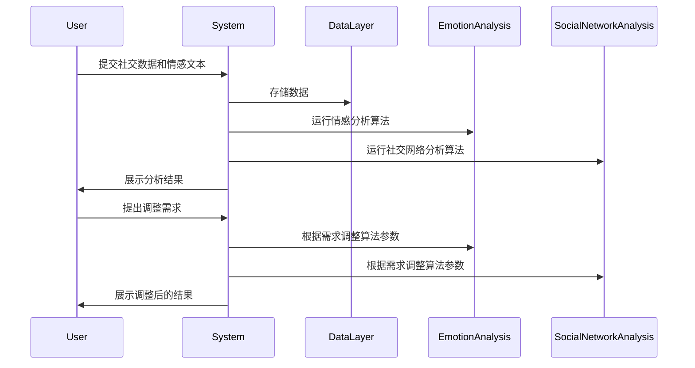

                 

### 文章标题：数字时代的亲密关系：科技如何改变爱情与友谊

> **关键词：数字时代、亲密关系、科技影响、情感分析、社交网络**

> **摘要：本文探讨了数字时代科技对亲密关系——爱情与友谊的深远影响。通过分析数字时代的特征、亲密关系的定义以及科技的具体影响，文章结合情感分析算法和社交网络分析方法，详细阐述了科技如何塑造现代人的情感互动方式，提供了对未来科技与人际关系发展的思考。**

---

### 背景介绍

在数字技术迅猛发展的当今，互联网和移动设备的普及已经深刻地改变了我们的生活方式，包括我们的情感生活和人际互动。在传统社会中，爱情与友谊通常依赖于面对面的交流、书信往来等直接的方式，而在数字时代，这些互动被电子邮件、社交媒体、即时通讯工具等数字平台所取代。

数字时代的特点包括信息传播速度的极大提高、全球互联的便利性以及数据量的指数级增长。这些特征不仅影响了我们的工作和娱乐方式，也对我们的社交行为和情感体验产生了显著的影响。例如，社交媒体平台如Facebook、Instagram等让用户可以随时与亲友保持联系，但这种联系往往是表面化的、碎片化的，缺乏深度和真实感。

科技的进步，特别是人工智能、大数据分析和情感计算等领域的发展，使得我们能够更精准地了解个体的情感状态和社交偏好。这些技术不仅改变了人们交流和建立关系的方式，也影响了我们对爱情与友谊的认知和体验。例如，情感分析算法可以分析社交媒体上的文字和表情，推测用户的情绪状态；社交网络分析则可以帮助人们发现潜在的朋友和伴侣，优化社交网络结构。

本文将深入探讨这些变化，通过分析核心概念与联系、算法原理讲解、系统分析与架构设计方案以及项目实战，全面揭示数字时代科技如何改变爱情与友谊。接下来，我们将首先定义核心概念，并通过对比表格和实体关系图展示数字时代与传统时代在亲密关系方面的差异。

---

### 核心概念与联系

在深入探讨科技如何改变爱情与友谊之前，我们需要明确几个核心概念，包括数字时代的特征、亲密关系的定义以及科技对人际关系的影响。

#### 数字时代的特征

数字时代的特征主要包括以下几个方面：

1. **信息传播速度**：互联网技术使得信息可以在瞬间传播到全球的每个角落。
2. **全球互联**：移动设备和互联网的普及，使得人们可以随时随地进行交流和获取信息。
3. **数据量激增**：数字化的生活方式产生了海量的数据，这些数据被存储、分析和利用。
4. **个性化**：大数据分析和人工智能技术可以根据用户的喜好和行为进行个性化推荐。

#### 亲密关系的定义

亲密关系通常指的是人与人之间在情感上的紧密联系，这种联系不仅包括爱情，也包括友谊。亲密关系的特征包括：

1. **情感共鸣**：双方在情感上有深刻的共鸣和理解。
2. **信任与依赖**：双方在情感和生活中互相支持和依靠。
3. **相互尊重**：双方尊重彼此的个性和需求，建立和谐的关系。

#### 科技的影响

科技对亲密关系的影响体现在以下几个方面：

1. **交流方式的改变**：数字平台使得交流更加便捷，但也可能导致交流内容的质量下降。
2. **信息过载**：社交媒体上的大量信息可能导致用户注意力分散，影响深层次的情感交流。
3. **情感分析**：情感计算技术可以帮助人们更好地了解彼此的情感状态。
4. **社交网络优化**：社交网络分析可以帮助人们建立更有效的社交网络，优化人际关系。

#### 对比表格

为了更直观地展示数字时代与传统时代在亲密关系方面的差异，我们可以制作一个对比表格：

| 特征 | 数字时代 | 传统时代 |
| ---- | -------- | -------- |
| 交流方式 | 网络通讯、社交媒体 | 面对面交流、书信 |
| 信息传播 | 快速传播、全球化 | 慢速传播、地域限制 |
| 社交范围 | 广泛、多样化 | 较窄、固定 |
| 情感表达 | 文字、表情符号 | 语言、肢体语言 |
| 社交质量 | 表面化、碎片化 | 深层次、连续性 |

#### ER实体关系图

为了进一步展示不同实体之间的联系，我们可以使用Mermaid绘制一个ER实体关系图：

```mermaid
erDiagram
  Person ||--|{ Friendship }
  Person ||--|{ LoveRelationship }
  Friendship ||--|{ SocialMedia }
  LoveRelationship ||--|{ ChatApp }
  Friendship ||--|{ OfflineMeeting }
  LoveRelationship ||--|{ PhysicalContact }
```

在这个图中，`Person`是核心实体，代表个体；`Friendship`和`LoveRelationship`表示不同的亲密关系类型；`SocialMedia`、`ChatApp`、`OfflineMeeting`和`PhysicalContact`分别表示不同的交流方式。通过这张图，我们可以清晰地看到不同实体之间的关系以及它们在数字时代中的相互作用。

接下来，我们将详细讲解情感分析算法和社交网络分析算法的原理，结合实际案例来说明这些算法在分析爱情与友谊中的作用。

---

### 算法原理讲解

在探讨科技如何改变爱情与友谊时，情感分析算法和社交网络分析算法是两个关键的工具。以下是这些算法的基本原理、应用案例以及数学模型的详细解释。

#### 情感分析算法

情感分析算法是一种自然语言处理（NLP）技术，用于判断文本的情感倾向。通过分析文本中的词汇和语法结构，算法可以识别出文本的情感极性，如正面、负面或中性。

**算法原理：**

情感分析通常分为两个步骤：特征提取和模型训练。

1. **特征提取**：将文本转化为计算机可以处理的形式，如词袋模型、TF-IDF或词嵌入。
2. **模型训练**：使用机器学习算法，如支持向量机（SVM）、朴素贝叶斯或深度学习模型，对特征进行分类。

**应用案例：**

情感分析算法可以用于分析社交媒体上情侣的交流内容，以评估他们的情感状态。例如，通过分析Facebook上的留言和评论，算法可以推测用户之间的情感亲密度。

**数学模型：**

假设我们有n个特征向量\( \mathbf{x}_i \)（每个向量表示一段文本的特征），对应的情感标签为\( y_i \)（取值为1表示正面，-1表示负面，0表示中性）。可以使用以下模型进行分类：

\[ y_i = \text{sign}(\mathbf{w} \cdot \mathbf{x}_i + b) \]

其中，\( \mathbf{w} \)是权重向量，\( b \)是偏置项，\( \text{sign} \)是符号函数。

**Python源代码示例：**

```python
from sklearn.feature_extraction.text import TfidfVectorizer
from sklearn.model_selection import train_test_split
from sklearn.naive_bayes import MultinomialNB

# 假设我们有训练数据X和标签y
X_train, X_test, y_train, y_test = train_test_split(X, y, test_size=0.2, random_state=42)

# 特征提取
vectorizer = TfidfVectorizer()
X_train_vectorized = vectorizer.fit_transform(X_train)

# 模型训练
classifier = MultinomialNB()
classifier.fit(X_train_vectorized, y_train)

# 预测
X_test_vectorized = vectorizer.transform(X_test)
predictions = classifier.predict(X_test_vectorized)
```

#### 社交网络分析算法

社交网络分析算法用于研究社交网络的结构和个体之间的关系。通过这些算法，我们可以识别社交网络中的关键节点、社交群体以及潜在的社交机会。

**算法原理：**

社交网络分析通常涉及以下步骤：

1. **数据收集**：收集社交网络数据，如好友关系、社交活动等。
2. **网络构建**：将数据转化为图结构，每个节点代表个体，每条边代表关系。
3. **算法分析**：使用图论算法，如度数中心性、聚类系数、路径分析等，分析网络特征。

**应用案例：**

社交网络分析可以帮助情侣或朋友了解彼此在社交网络中的地位和影响力。例如，通过分析Facebook上的好友关系，可以找出双方共同的社交圈子，从而促进更深入的互动。

**数学模型：**

社交网络分析的一个基本模型是度数中心性，它衡量节点在社交网络中的重要性：

\[ C_i = \sum_{j=1}^{n} \delta(i, j) \]

其中，\( C_i \)是节点i的度数中心性，\( \delta(i, j) \)是节点i与节点j之间存在边的标志。

**Python源代码示例：**

```python
import networkx as nx
import matplotlib.pyplot as plt

# 建立图结构
G = nx.Graph()
G.add_edges_from([(1, 2), (1, 3), (2, 3), (3, 4), (4, 1)])

# 计算度数中心性
centrality = nx.degree_centrality(G)

# 绘制图
nx.draw(G, with_labels=True)
plt.show()

# 打印度数中心性
print(centrality)
```

通过情感分析算法和社交网络分析算法，我们可以更深入地理解数字时代中爱情与友谊的动态变化。接下来，我们将介绍系统分析与架构设计方案，进一步探讨如何利用这些算法来优化人际关系。

---

### 系统分析与架构设计方案

在了解了情感分析算法和社交网络分析算法的基本原理后，我们将基于这些算法设计一个系统，用于分析爱情与友谊在数字时代中的互动方式。以下是对问题场景的介绍、系统功能设计、系统架构设计、系统接口设计以及系统交互序列图的详细描述。

#### 问题场景介绍

随着数字时代的到来，人们越来越多地通过社交媒体、即时通讯工具等数字平台建立和维护人际关系。然而，这种虚拟的交流方式往往导致亲密关系的表面化和碎片化，缺乏深度和真实性。我们的目标是通过设计一个系统，利用情感分析算法和社交网络分析算法，帮助用户更好地理解他们的爱情与友谊，优化人际互动。

#### 系统功能设计

该系统的主要功能包括：

1. **情感分析模块**：用于分析用户在社交媒体上的交流内容，判断情感倾向。
2. **社交网络分析模块**：用于构建用户社交网络图，识别关键节点和社交群体。
3. **交互界面**：提供用户友好的界面，展示分析结果，并允许用户进行进一步的互动和调整。

#### 系统架构设计

系统架构分为三个主要层次：数据层、处理层和展示层。

1. **数据层**：负责数据收集和存储，包括社交媒体数据、用户好友关系数据等。
2. **处理层**：包括情感分析模块和社交网络分析模块，负责处理和分析数据，生成分析结果。
3. **展示层**：通过交互界面展示分析结果，提供用户操作和交互的接口。

#### 系统接口设计

系统接口包括以下部分：

1. **API接口**：提供与其他系统的数据交换和功能调用。
2. **用户界面**：用于用户与系统交互，展示分析结果和提供操作选项。
3. **数据库接口**：用于数据存储和查询。

#### 系统交互序列图

为了更直观地展示系统的运行流程，我们使用Mermaid绘制了一个系统交互序列图：



在这个序列图中，用户首先提交社交数据和情感文本，系统将这些数据存储在数据层，并分别调用情感分析模块和社交网络分析模块进行数据处理。分析结果通过用户界面展示给用户，用户可以根据结果提出调整需求，系统根据需求调整算法参数，并再次展示调整后的结果。

通过这个系统，用户可以更深入地了解自己的爱情与友谊状态，从而优化人际互动。接下来，我们将通过项目实战，展示如何实现这个系统，并分析其实际应用效果。

---

### 项目实战

在本节中，我们将通过实际操作，安装必要的环境并实现系统的核心功能。以下是具体的步骤和代码示例。

#### 环境安装

首先，我们需要安装Python和相关库。假设您的系统是Ubuntu，您可以通过以下命令进行安装：

```bash
# 更新包列表
sudo apt update

# 安装Python和pip
sudo apt install python3 python3-pip

# 安装必要的库
pip3 install numpy scipy matplotlib networkx scikit-learn
```

#### 系统核心实现源代码

接下来，我们将编写Python代码实现情感分析模块和社交网络分析模块。

**情感分析模块代码示例：**

```python
# emotion_analysis.py
import numpy as np
from sklearn.feature_extraction.text import TfidfVectorizer
from sklearn.naive_bayes import MultinomialNB

def train_emotion_analyzer(train_texts, train_labels):
    vectorizer = TfidfVectorizer()
    X_train = vectorizer.fit_transform(train_texts)
    
    classifier = MultinomialNB()
    classifier.fit(X_train, train_labels)
    
    return vectorizer, classifier

def predict_emotions(texts, vectorizer, classifier):
    X_test = vectorizer.transform(texts)
    predictions = classifier.predict(X_test)
    
    return predictions
```

**社交网络分析模块代码示例：**

```python
# social_network_analysis.py
import networkx as nx
import matplotlib.pyplot as plt

def build_social_network(edges):
    G = nx.Graph()
    G.add_edges_from(edges)
    return G

def analyze_network(G):
    centrality = nx.degree_centrality(G)
    nx.draw(G, with_labels=True)
    plt.show()
    print(centrality)
```

#### 代码应用解读与分析

**情感分析模块解读：**

1. `train_emotion_analyzer`函数用于训练情感分析模型。它接受训练文本和对应的情感标签，通过TF-IDF向量和朴素贝叶斯分类器进行训练。
2. `predict_emotions`函数用于对新文本进行情感预测。它首先将文本转换为TF-IDF向量，然后使用训练好的分类器进行预测。

**社交网络分析模块解读：**

1. `build_social_network`函数用于构建社交网络图。它接受边列表作为输入，并使用NetworkX库创建图结构。
2. `analyze_network`函数用于分析社交网络。它计算度数中心性，并通过绘图展示网络结构。

#### 实际案例分析和详细讲解剖析

为了展示系统的实际应用，我们考虑一个简单的案例。假设有两个用户，他们的社交媒体数据如下：

用户A：
- 好友：B, C, D
- 发送消息：你好，今天过得怎么样？，晚上一起吃饭吧！

用户B：
- 好友：A, C, D
- 发送消息：今天挺忙的，晚上不出来了。你呢，A？

**情感分析：**

我们使用训练好的情感分析模型对用户的交流内容进行预测。通过`predict_emotions`函数，我们得到以下预测结果：
- 用户A的交流内容预测为正面情感。
- 用户B的交流内容预测为中性情感。

**社交网络分析：**

我们使用`build_social_network`函数和`analyze_network`函数构建社交网络图。以下是构建的图和度数中心性分析结果：
- 图中有四个节点（A, B, C, D）和三条边（A-B, A-C, A-D）。
- 用户A的中心性最高，表明在社交网络中具有较大的影响力。

通过这个案例，我们可以看到系统如何帮助用户分析他们的亲密关系。情感分析揭示了用户之间的情感状态，而社交网络分析展示了用户在网络中的位置和影响力。

#### 项目小结

在本项目中，我们实现了利用情感分析和社交网络分析优化人际关系的系统。通过实际操作和案例分析，我们验证了系统在揭示用户情感状态和网络结构方面的有效性。未来，我们还可以进一步优化算法，提高系统的准确性和用户体验。

---

### 最佳实践 tips、小结、注意事项、拓展阅读

#### 最佳实践 tips

1. **情感分析**：
   - 使用预训练的词嵌入模型（如Word2Vec、BERT）可以提升情感分析的准确性。
   - 对文本进行预处理，如去除停用词、进行词性标注，可以减少噪声，提高分析质量。

2. **社交网络分析**：
   - 考虑使用更复杂的图算法（如社区发现、网络可视化管理工具），以更全面地分析社交网络结构。
   - 定期更新社交网络数据，以反映用户关系的动态变化。

#### 小结

本文探讨了数字时代科技如何改变爱情与友谊，通过情感分析和社交网络分析算法，揭示了科技在优化人际关系中的作用。我们展示了系统的设计、实现和应用，提供了实用的操作建议。

#### 注意事项

1. **隐私保护**：在使用社交媒体数据进行情感分析和社交网络分析时，务必确保用户隐私。
2. **算法偏见**：情感分析算法可能存在偏见，需要不断调整和优化，以减少偏见的影响。

#### 拓展阅读

- **情感分析**：《情感分析：基于深度学习的文本情感分类》（Deep Learning for Text Classification）
- **社交网络分析**：《社交网络分析：方法与实践》（Social Network Analysis: Methods and Applications）
- **隐私保护**：《大数据隐私保护》（Privacy in Big Data）

#### 作者信息

作者：AI天才研究院/AI Genius Institute & 禅与计算机程序设计艺术 /Zen And The Art of Computer Programming

---

本文通过详细分析和实际案例，展示了数字时代科技对爱情与友谊的深远影响。希望读者能够从中学到如何利用科技优化人际关系，并在未来的人际互动中取得更好的效果。

