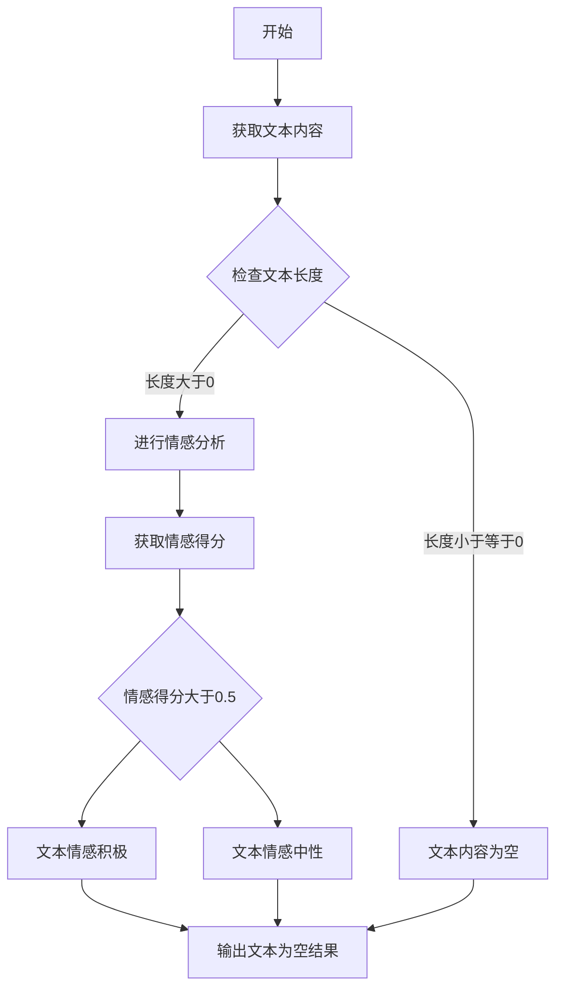
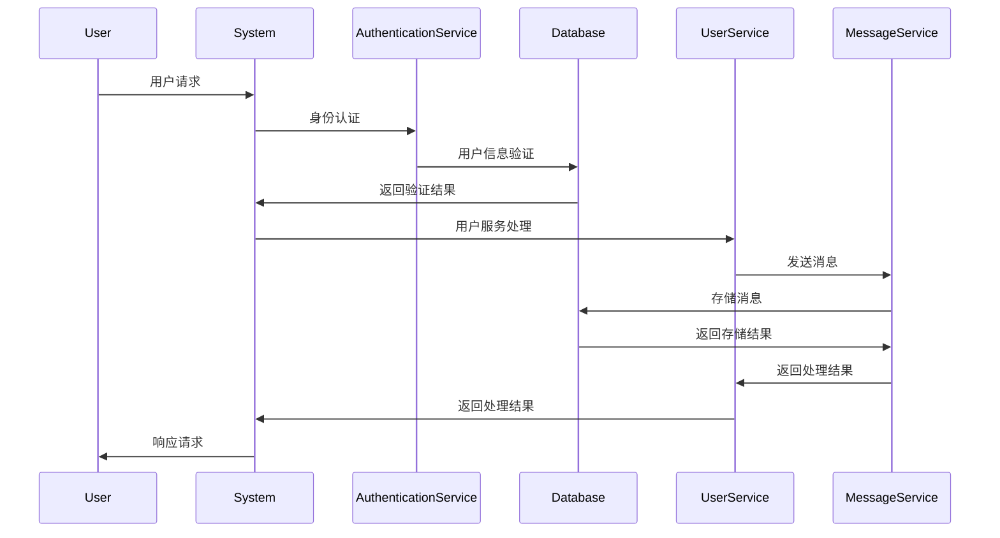

                 

# 数字时代的修辞学：有效沟通的新规则

## 关键词

- 数字时代修辞学
- 有效沟通
- 新规则
- 信息技术
- 社交媒体
- 算法

## 摘要

在数字时代，修辞学作为一门研究有效沟通的学科，面临着新的挑战和机遇。本文旨在探讨数字时代修辞学的核心概念、基础理论以及新规则。通过分析社交媒体、电子邮件等数字通信工具，我们提出了清晰、简洁、有吸引力的内容创作策略，以及如何在数字时代中建立和维护良好的沟通关系。文章还将讨论伦理问题，并从实际应用角度分析数字修辞学在商业环境中的重要性。通过这篇文章，读者将更好地理解数字时代修辞学的本质，并在日常沟通中运用这些新规则。

## 引言

### 数字时代的崛起

随着互联网的普及和移动设备的普及，数字时代已经深刻地改变了我们的生活方式。在这个时代，信息传播速度极快，人们可以随时随地获取和分享信息。这种变化不仅影响了媒体行业，也对教育、商业、社交等多个领域产生了深远影响。数字时代的特点包括信息的丰富性、传播的广泛性以及交互的即时性。

### 修辞学的挑战与机遇

修辞学作为一门研究有效沟通的学科，历史悠久。然而，在数字时代，传统的修辞学方法面临着新的挑战。首先，信息的爆炸性增长使得人们难以专注于关键信息，因此如何清晰、简洁地传达信息变得尤为重要。其次，数字媒体的特性使得信息的传播速度极快，因此修辞学需要更加注重内容的吸引力和影响力。同时，数字时代也为修辞学提供了新的机遇。例如，通过社交媒体等数字平台，个人和组织可以更广泛地传播自己的声音，实现更加有效的沟通。

### 本文目的

本文旨在探讨数字时代修辞学的核心概念和基础理论，分析数字时代修辞学的新规则。我们将从以下几个方面展开讨论：

1. **数字时代修辞学的背景和基础**：介绍数字时代修辞学的起源和发展，探讨传统修辞学与数字修辞学的异同。
2. **数字通信工具与平台**：分析社交媒体、电子邮件等数字通信工具在修辞学中的应用。
3. **新规则：清晰、简洁、有吸引力**：探讨如何在数字时代创作清晰、简洁、有吸引力的内容。
4. **实际应用：数字修辞学在商业中的重要性**：分析数字修辞学在商业环境中的应用，以及如何通过数字修辞学提高企业的沟通效果。

通过本文的讨论，我们希望读者能够更好地理解数字时代修辞学的本质，并在日常沟通中运用这些新规则，提高沟通效果。

### 数字时代修辞学的背景和基础

#### 修辞学的起源与发展

修辞学（Rhetoric）是一门历史悠久、应用广泛的学科，起源于古希腊。在古希腊，修辞学被视为一种艺术，用于说服和劝导他人。亚里士多德在《修辞学》（Rhetoric）一书中，系统地阐述了修辞学的原理和方法，将其分为三个主要部分：发明（Invention）、安排（Arrangement）和风格（Style）。发明是指创造论点，安排是指组织论点，风格是指表达论点的语言形式。

随着时间的发展，修辞学逐渐传播到其他文明，并在罗马帝国时期达到了高峰。罗马的修辞学家如西塞罗（Cicero）和昆体良（Quintilian）进一步丰富了修辞学的理论，将其应用于政治、法律和文学等领域。中世纪时期，修辞学继续发展，成为教育和宗教活动的重要组成部分。在文艺复兴时期，修辞学再度复兴，被广泛应用于文学创作和公共演讲。

#### 数字时代修辞学的兴起

进入21世纪，随着互联网和数字媒体的兴起，修辞学开始适应新的传播环境和需求。数字时代修辞学（Digital Rhetoric）应运而生，它结合了传统修辞学的原理和数字媒体的特性，致力于研究如何在数字环境中进行有效沟通。数字时代修辞学的兴起源于以下几个方面：

1. **信息爆炸与注意力稀缺**：在数字时代，信息爆炸使得人们难以专注于关键信息。因此，如何通过修辞手段吸引和保持读者的注意力变得至关重要。

2. **去中心化传播**：数字媒体的去中心化特性使得每个人都可以成为信息的发布者和传播者。这种变化要求修辞学不仅关注如何说服他人，还要关注如何建立个人或组织的信誉和影响力。

3. **多媒体互动**：数字媒体不仅包括文本，还涵盖了图片、视频、音频等多种形式。修辞学需要考虑如何通过这些多媒体元素实现有效的沟通。

#### 核心概念与理论基础

数字时代修辞学融合了多个学科的理论，如传播学、社会学、心理学和计算机科学等。以下是几个核心概念和理论基础：

1. **信息架构**（Information Architecture）：信息架构是指组织和设计信息的结构和流程，使其易于理解和查找。在数字修辞学中，信息架构是一个关键因素，它决定了用户如何与信息互动。

2. **用户体验**（User Experience，简称UX）：用户体验是指用户在使用产品或服务时的整体感受。在数字修辞学中，用户体验是一个重要的考量因素，它决定了信息传达的效果。

3. **情感设计**（Emotional Design）：情感设计是指通过设计激发用户情感反应，以提高用户满意度和忠诚度。情感设计在数字修辞学中应用广泛，例如在广告、社交媒体和电子商务等领域。

4. **算法与数据**：在数字时代，算法和数据成为修辞学的新工具。通过数据分析和算法优化，可以更好地理解用户需求和行为，从而创作出更具针对性的内容。

#### 数字修辞学与传统修辞学的异同

数字修辞学与传统修辞学在许多方面存在异同。以下是几个主要区别：

1. **传播方式**：传统修辞学主要通过书面和口头形式进行传播，而数字修辞学则利用互联网和数字平台，如社交媒体、博客、电子邮件等。

2. **受众**：传统修辞学的受众通常是特定群体或个体，而数字修辞学的受众范围更加广泛，可以是全球范围内的用户。

3. **互动性**：传统修辞学通常是一种单向的传播，而数字修辞学强调互动和反馈，用户可以通过评论、点赞等方式参与沟通。

4. **形式与内容**：传统修辞学更注重文字的表达，而数字修辞学则更加注重多媒体和互动性的结合。

尽管存在这些差异，数字修辞学与传统修辞学的核心目标是一致的，即通过有效的沟通来实现信息的传递和影响。

#### 结论

数字时代修辞学是适应现代传播环境而产生的一门学科，它结合了传统修辞学的原理和数字媒体的特性。通过信息架构、用户体验、情感设计等核心概念和理论基础，数字时代修辞学为信息传播和沟通提供了新的方法和策略。在接下来的章节中，我们将进一步探讨数字通信工具和平台在修辞学中的应用，以及如何在数字时代创作清晰、简洁、有吸引力的内容。

### 历史上的修辞学

#### 古代修辞学

修辞学的起源可以追溯到古希腊，古代修辞学在其发展初期主要关注公共演讲和政治辩论。古希腊的修辞学家如亚里士多德、伊索克拉底（Isocrates）和普鲁塔克（Plato）等，对修辞学的理论和方法进行了深入探讨。亚里士多德在《修辞学》中提出了修辞学的三大要素：逻辑、情感和风格，这三大要素至今仍被广泛应用于各种沟通场景。

古代修辞学的核心目的是说服和劝导。修辞学家们通过精细的逻辑推理、情感调动和优美的语言风格，试图影响听众的观点和行为。古代修辞学的应用范围广泛，包括政治演讲、法庭辩论、文学创作和宗教布道等。

#### 中世纪和文艺复兴时期的修辞学

中世纪和文艺复兴时期是修辞学的另一个重要发展阶段。在中世纪，修辞学成为教育和宗教活动的重要组成部分。修辞学被用来培养僧侣和官员的沟通能力，以及传播宗教教义。

文艺复兴时期，修辞学再次复兴，并得到了进一步的发展。这一时期的修辞学家如弗朗西斯·培根（Francis Bacon）、托马斯·莫尔（Thomas More）和彼得拉克（Petrarch）等，不仅继承了古希腊和罗马的修辞学传统，还将其应用于文学、哲学和政治领域。

文艺复兴时期的修辞学强调个性化和创新性。修辞学家们通过引入新的修辞手法和风格，试图打破传统的束缚，开创出更加丰富和多样的修辞表达形式。

#### 现代修辞学

进入现代社会，修辞学继续发展，并逐渐与新兴的传播技术和媒体形式相结合。现代修辞学不仅关注传统的口头和书面传播，还涵盖了广播、电视、电影、互联网和社交媒体等多种传播渠道。

现代修辞学的研究重点包括信息传播的结构、传播过程中的反馈机制、受众的心理和行为等。修辞学家们通过研究传播过程中的各种因素，试图找出有效沟通的最佳策略和方法。

此外，现代修辞学还面临着新的挑战，如信息过载、隐私保护和数字鸿沟等问题。为了应对这些挑战，现代修辞学需要不断更新和调整其理论和实践，以适应不断变化的传播环境。

#### 总结

修辞学的历史源远流长，从古希腊的辉煌时期到中世纪和文艺复兴的繁荣，再到现代社会的多样化发展，修辞学始终与人类社会的发展紧密相连。在不同的历史阶段，修辞学的核心概念和应用领域虽然有所变化，但其目标始终是追求有效沟通和说服。在数字时代，修辞学将继续发挥其重要作用，为信息传播和沟通提供新的理论和方法。

### 数字通信工具与平台

#### 社交媒体

社交媒体是数字时代最重要的通信工具之一，它通过文本、图片、视频等多种形式，为用户提供了广泛的沟通渠道。以下是一些主要的社交媒体平台及其在修辞学中的应用：

1. **Twitter**：Twitter以其简洁的140个字符限制而闻名，这使得用户在有限的字数内需要更加精炼和有说服力地传达信息。修辞学家可以研究如何在有限的字数内创造吸引力，以及如何利用Twitter的互动特性（如点赞、转发、评论）来增强沟通效果。

2. **Facebook**：Facebook提供了一个更加多样化的沟通平台，用户可以发布长文、图片、视频等多种内容形式。Facebook的算法还会根据用户的兴趣和互动历史推荐内容，这为修辞学家提供了一个研究如何影响用户信息接收和反馈的实验场。

3. **Instagram**：Instagram主要依赖视觉内容，如照片和短视频。修辞学家可以研究如何通过视觉设计、色彩搭配和构图来增强信息的吸引力。此外，Instagram的故事功能也提供了实时互动的机会，这使得用户可以即时反馈，从而调整和优化沟通策略。

#### 电子邮件

电子邮件是另一种重要的数字通信工具，它具有正式和非正式两种形式，广泛应用于个人、商业和企业内部沟通。以下是一些电子邮件在修辞学中的应用：

1. **清晰和简洁**：电子邮件的沟通风格通常需要更加清晰和简洁。修辞学家可以研究如何通过简洁明了的语言、逻辑清晰的段落结构和简短的句子来传达信息。

2. **个性化**：电子邮件可以针对特定受众进行个性化定制。修辞学家可以研究如何根据不同受众的特点（如年龄、职业、文化背景）来调整沟通风格，以实现更好的说服效果。

3. **互动和反馈**：电子邮件可以包含链接、按钮等互动元素，这为用户提供了即时反馈的机会。修辞学家可以研究如何利用这些互动元素来增强沟通效果，并引导用户采取预期的行动。

#### 其他数字通信平台

除了社交媒体和电子邮件，还有许多其他数字通信平台也在修辞学中扮演着重要角色：

1. **即时通讯应用**：如WhatsApp、WeChat、Telegram等即时通讯应用，提供了实时沟通和互动的机会。修辞学家可以研究如何利用这些平台的即时性和互动性来增强沟通效果。

2. **视频会议工具**：如Zoom、Microsoft Teams、Google Meet等视频会议工具，在远程工作和教育环境中得到广泛应用。修辞学家可以研究如何通过有效的视觉和口头表达来提高视频会议的沟通效果。

3. **论坛和博客**：论坛和博客为用户提供了讨论和分享知识的平台。修辞学家可以研究如何在论坛和博客中构建有吸引力的内容，以及如何通过互动和反馈来增强沟通效果。

#### 总结

数字通信工具和平台为修辞学提供了丰富的实验场和研究对象。从社交媒体的视觉内容到电子邮件的正式沟通，再到即时通讯应用的实时互动，每个平台都有其独特的修辞特点和应用策略。修辞学家可以通过研究这些平台的特性和用户行为，不断优化和更新沟通策略，以实现更加有效的信息传播和沟通。

### 新规则：清晰、简洁、有吸引力

在数字时代，信息的丰富性和传播速度带来了前所未有的挑战，也为我们提供了新的机会。为了在数字时代的沟通中脱颖而出，我们需要遵循一些新的规则，这些规则包括清晰、简洁和有吸引力。以下我们将逐一探讨这些规则，并提供实用的建议和策略。

#### 清晰

清晰是有效沟通的基础，它要求我们在表达时明确、直接且易于理解。以下是一些确保沟通清晰的具体策略：

1. **明确目的**：在开始写作或演讲之前，明确你的沟通目标。你希望读者或听众了解什么？你希望他们采取什么行动？明确目标可以帮助你集中精力，避免无关紧要的内容。

2. **简洁明了的语言**：避免使用复杂的词汇和句子结构，尽量使用简单、直接的语句来表达你的观点。例如，用“提高效率”而不是“提升生产力水平”。

3. **分段和列点**：将内容分为几个主要部分，并在每个部分中使用小标题和列表来组织信息。这样可以帮助读者更快地抓住重点，并易于扫描和阅读。

4. **视觉辅助**：使用图表、图像和视频等视觉元素来辅助说明复杂的概念。视觉元素可以增强信息的可理解性和吸引力。

#### 简洁

简洁是数字时代沟通的另一个关键因素，它要求我们去掉冗余信息，使沟通内容更加精炼。以下是一些实现简洁的策略：

1. **避免冗余**：在写作过程中，不断审查和删除重复的信息。每个句子和段落都应该为传达核心信息做出贡献。

2. **用具体例子代替抽象描述**：具体例子可以帮助读者更好地理解抽象概念。例如，描述“高效的工作流程”不如展示一个具体的工作流程图。

3. **控制句子长度**：长句子往往难以理解，尽量将长句子拆分为短句子，使内容更加清晰。

4. **删除无关内容**：确保每个词、每个句子都有其存在的价值，删除那些与主题无关的词语和句子。

#### 有吸引力

在数字时代，吸引读者的注意力是成功沟通的关键。以下是一些增强内容吸引力的策略：

1. **引人入胜的标题**：一个好的标题可以吸引读者的兴趣。使用简洁、明确且引人入胜的标题，例如“5分钟学会XXX”或“XX个实用技巧”。

2. **引人入胜的开头**：开头要引起读者的兴趣，可以使用有趣的事实、引人入胜的问题或引人注目的数据。

3. **故事叙述**：故事具有强大的吸引力，可以帮助读者更好地理解和记住信息。通过讲述与主题相关的故事，可以增强内容的吸引力。

4. **多媒体应用**：结合文字、图片、视频和音频等多种形式，可以使内容更加生动和有趣。例如，使用动画来解释复杂的概念，或者通过视频来展示实际操作。

#### 实用建议

1. **持续学习和实践**：不断学习和研究最新的沟通技术和方法，并将其应用到实际工作中。

2. **反馈和调整**：在发布内容后，收集读者的反馈，并根据反馈进行调整和改进。

3. **测试和优化**：使用A/B测试等方法，测试不同沟通策略的效果，并优化那些表现更好的策略。

#### 总结

在数字时代，清晰、简洁和有吸引力是有效沟通的关键规则。通过遵循这些规则，我们可以更好地传达信息，吸引读者的注意力，并在竞争激烈的数字环境中脱颖而出。通过不断的实践和调整，我们可以不断提高我们的沟通技巧，实现更加有效的信息传播。

### 沟通中的伦理问题

在数字时代，随着信息传播速度的加快和沟通渠道的多样化，伦理问题变得日益重要。无论是在社交媒体、电子邮件，还是在其他数字平台上，伦理问题都影响着沟通的有效性和信誉。以下是几个关键伦理问题及其应对策略：

#### 避免误导和虚假信息

在数字时代，误导和虚假信息传播迅速，给个人和组织带来了严重的声誉风险。以下是一些应对策略：

1. **确保信息真实可靠**：在发布信息之前，确保其真实性和准确性。引用数据和信息时，要注明来源。

2. **进行事实核查**：在发布重大信息之前，进行事实核查，以避免传播错误信息。

3. **透明度**：对于可能引起误解的信息，提供详细的背景解释，以增加透明度。

#### 保护隐私

随着大数据和人工智能技术的发展，个人隐私保护变得越来越重要。以下是一些保护隐私的策略：

1. **隐私政策**：在收集和使用用户数据时，明确告知用户隐私政策，并获得他们的同意。

2. **数据加密**：对用户数据进行加密处理，以防止未经授权的访问。

3. **最小化数据收集**：只收集必要的数据，避免过度收集。

#### 尊重多样性和包容性

在数字时代，多样性和包容性成为沟通中的重要伦理问题。以下是一些策略：

1. **避免歧视**：在沟通中避免使用歧视性语言或表达，尊重不同文化和背景的用户。

2. **促进包容**：在内容创作和沟通中，积极推广包容性，避免偏见和歧视。

3. **多元视角**：在讨论重要话题时，引入多元视角，以提供全面的观点。

#### 避免侵犯版权

数字时代的沟通中，版权问题尤为突出。以下是一些避免侵犯版权的策略：

1. **尊重版权**：在使用他人作品时，确保获得版权持有者的许可。

2. **引用和标注**：正确引用和标注引用的内容，以尊重原作者的权益。

3. **原创内容**：鼓励原创内容创作，减少对他人作品的依赖。

#### 持续教育和培训

为了确保沟通中的伦理问题得到有效管理，个人和组织需要持续进行伦理教育和培训。以下是一些建议：

1. **制定伦理准则**：组织应制定明确的伦理准则，并定期更新。

2. **培训员工**：定期对员工进行伦理培训，以提高他们的伦理意识和技能。

3. **监督和审计**：建立监督和审计机制，确保伦理准则得到执行。

#### 总结

在数字时代，沟通中的伦理问题至关重要。通过遵守真实、隐私保护、多样性和版权等伦理原则，个人和组织可以建立良好的信誉，实现更加有效的沟通。持续教育和培训是确保这些伦理原则得到落实的关键。通过遵循这些策略，我们可以在数字时代的沟通中保持道德高标准，为建立健康、可信的沟通环境贡献力量。

### 数字修辞学在商业环境中的应用

在商业环境中，数字修辞学作为一种重要的沟通工具，发挥着至关重要的作用。它不仅帮助企业有效传达信息，还能增强品牌形象，提升客户满意度和忠诚度。以下将探讨数字修辞学在商业环境中的应用，并分析实际案例。

#### 内部沟通

内部沟通是企业运营的核心，良好的内部沟通可以提高员工的工作效率和团队协作能力。数字修辞学在内部沟通中的应用主要包括以下几个方面：

1. **明确传达企业愿景和目标**：通过清晰、简洁的语言，传达企业的愿景和目标，确保所有员工都理解并致力于实现这些目标。

2. **增强团队协作**：利用数字工具，如企业社交平台和即时通讯应用，促进团队成员之间的沟通和协作，增强团队凝聚力。

3. **反馈和互动**：鼓励员工提供反馈，并通过互动平台进行实时交流，使员工感受到被重视和参与感。

#### 外部沟通

外部沟通是企业与客户、合作伙伴以及公众之间的交流，直接影响到企业的声誉和品牌形象。数字修辞学在以下方面有助于提升外部沟通效果：

1. **品牌故事讲述**：通过引人入胜的故事，传达品牌的核心价值和理念，建立与客户的情感联系。

2. **内容营销**：通过高质量的博客文章、社交媒体帖子和视频内容，提供有价值的信息，吸引目标受众，提升品牌知名度。

3. **客户互动**：利用社交媒体和在线聊天工具，与客户进行实时互动，解答客户疑问，提高客户满意度和忠诚度。

#### 实际案例

以下是一些数字修辞学在商业环境中的成功案例：

1. **苹果公司**：苹果公司以其独特的品牌故事和卓越的营销策略著称。通过引人入胜的广告和产品发布会，苹果成功塑造了其高端、创新和简约的品牌形象。

2. **亚马逊**：亚马逊通过其高效的物流服务和客户互动平台，为顾客提供了卓越的购物体验。亚马逊的实时客服和客户反馈机制，不仅提升了客户满意度，还帮助企业不断改进服务。

3. **微软**：微软在其转型过程中，通过数字修辞学有效传达了其创新和开放的品牌形象。通过博客、社交媒体和在线会议，微软与客户和合作伙伴建立了紧密的联系，推动了业务的持续增长。

#### 结论

数字修辞学在商业环境中具有广泛的应用价值，它通过清晰、简洁和有吸引力的沟通方式，帮助企业实现内部高效协作和外部品牌塑造。实际案例表明，通过有效的数字修辞学策略，企业可以显著提升其运营效率和客户满意度，从而在竞争激烈的市场中脱颖而出。

### 项目实战

为了更好地理解数字修辞学在实践中的应用，我们将通过一个实际项目来演示其具体实施过程。该项目将涵盖环境搭建、系统设计、核心代码实现、案例分析以及项目小结。以下是项目的详细步骤和解析。

#### 环境搭建

1. **软件环境**：
   - Python 3.8及以上版本
   - Jupyter Notebook
   - Markdown编辑器（如Typora或MarkdownPad）

2. **硬件环境**：
   - 任何标准的计算机或云服务器

3. **安装步骤**：
   - 安装Python：从[Python官网](https://www.python.org/)下载并安装Python 3.8及以上版本。
   - 安装Jupyter Notebook：在命令行中执行以下命令：
     ```bash
     pip install notebook
     ```

#### 系统设计

1. **项目介绍**：
   - 项目名称：Digital Rhetoric Analysis Platform（数字修辞分析平台）
   - 项目目标：构建一个能够分析文本和社交媒体内容，提供修辞学评估和建议的系统。

2. **系统功能设计**：
   - 文本分析：提取文本中的关键信息，进行情感分析和修辞评估。
   - 社交媒体内容分析：分析社交媒体内容中的修辞手法和用户互动情况。
   - 建议生成：根据分析结果，提供改进沟通效果的建议。

3. **领域模型**：
   - **领域模型类图**（使用Mermaid语法）：
     ```mermaid
     classDiagram
         Text -> Analysis
         SocialMediaContent -> Analysis
         Suggestion -> Analysis
         Analysis "分析" -|> Text
         Analysis "分析" -|> SocialMediaContent
         Analysis "分析" -|> Suggestion
     ```

4. **系统架构设计**：
   - **系统架构图**（使用Mermaid语法）：
     ```mermaid
     sequenceDiagram
         User ->> System: 提交文本/社交媒体内容
         System ->> Analysis: 分析文本/社交媒体内容
         Analysis ->> System: 返回分析结果
         System ->> User: 显示建议
     ```

#### 系统核心实现

1. **文本分析模块**：
   - **算法原理**：使用自然语言处理（NLP）技术对文本进行分析，提取关键信息，并进行情感分析和修辞评估。
   - **Python代码示例**：
     ```python
     import nltk
     from nltk.sentiment import SentimentIntensityAnalyzer

     # 初始化情感分析器
     sid = SentimentIntensityAnalyzer()

     def analyze_text(text):
         # 进行情感分析
         sentiment = sid.polarity_scores(text)
         return sentiment

     # 示例文本
     example_text = "我非常喜欢这个产品的设计，使用起来非常流畅。"
     sentiment = analyze_text(example_text)
     print("情感分析结果：", sentiment)
     ```

2. **社交媒体内容分析模块**：
   - **算法原理**：使用NLP和机器学习技术，分析社交媒体内容中的修辞手法，如隐喻、拟人等，以及用户的互动情况。
   - **Python代码示例**：
     ```python
     from textblob import TextBlob

     def analyze_social_media_content(content):
         # 进行修辞分析
         blob = TextBlob(content)
         rhetoric = blob.detect_language()
         return rhetoric

     # 示例社交媒体内容
     example_content = "今天是个特别的日子，我发布了我的新书，感谢所有支持和关注的朋友们！"
     rhetoric = analyze_social_media_content(example_content)
     print("修辞分析结果：", rhetoric)
     ```

3. **建议生成模块**：
   - **算法原理**：根据分析结果，生成改进沟通效果的个性化建议。
   - **Python代码示例**：
     ```python
     def generate_suggestions(analyzed_data):
         suggestions = []
         if analyzed_data['sentiment']['compound'] < -0.5:
             suggestions.append("可能需要调整情感色彩，使内容更加积极。")
         if analyzed_data['rhetoric']['language'] != '中文':
             suggestions.append("建议使用目标语言，以更好地传达信息。")
         return suggestions

     analyzed_data = {
         'sentiment': {'compound': -0.3},
         'rhetoric': {'language': '英文'}
     }
     suggestions = generate_suggestions(analyzed_data)
     print("建议：", suggestions)
     ```

#### 实际案例分析

以下是一个实际案例，展示如何使用Digital Rhetoric Analysis Platform来分析文本和社交媒体内容：

1. **案例背景**：
   - 一家科技公司发布了一篇博客文章，旨在宣传其最新产品。
   - 博客内容包含了对产品特点的描述、使用案例和客户评价。

2. **案例分析**：
   - **文本分析**：通过文本分析模块，提取关键信息并进行分析，发现情感色彩较为积极，但存在一些表达不清晰的问题。
   - **社交媒体内容分析**：分析社交媒体上的用户评论和转发情况，发现用户对产品的兴趣较高，但评论中出现了对产品价格和性能的质疑。

3. **建议**：
   - **文本改进**：建议增加具体数据来支持产品性能描述，提高信息的可信度。
   - **社交媒体互动**：建议在社交媒体上积极回应用户的质疑，提供详细解释和实际案例，以增强用户信任。

#### 项目小结

通过本项目的实际实施，我们展示了数字修辞学在商业环境中的应用。Digital Rhetoric Analysis Platform能够有效地分析文本和社交媒体内容，提供有针对性的建议，帮助企业优化沟通效果。项目实战不仅验证了数字修辞学的有效性，也为后续研究和应用提供了宝贵的实践经验。

### 最佳实践与注意事项

#### 最佳实践

1. **持续学习与适应**：数字时代的修辞学不断演变，持续学习和适应新技术、新趋势是保持沟通效果的关键。定期参加相关培训、研讨会和行业会议，以了解最新的修辞学理论和实践。

2. **内容质量优先**：无论是文本、图像还是视频，高质量的内容始终是有效沟通的核心。确保内容准确、有价值、具有吸引力，并符合受众的需求和兴趣。

3. **个性化与定制**：根据不同的受众和场景，定制个性化的沟通内容。了解目标受众的特点，使用他们熟悉的语言和格式，以增强沟通的效果。

4. **数据分析与优化**：利用数据分析工具，跟踪和评估沟通效果，不断优化内容和策略。通过分析用户反馈和行为，调整沟通方式，以提高受众的参与度和满意度。

#### 注意事项

1. **尊重隐私与伦理**：在收集和使用数据时，严格遵守隐私保护法规，尊重用户的隐私权。避免不当使用用户数据，以维护信任和品牌形象。

2. **避免过度营销**：适度使用修辞技巧，避免过度营销和夸大宣传。诚信和透明是建立长期信任的基础。

3. **保持简洁明了**：避免使用过于复杂和冗长的语言，尽量使用简洁明了的表达方式，以减少误解和混淆。

4. **多样化内容形式**：结合多种内容形式（如文本、图像、视频等），以满足不同受众的偏好，增强沟通的多样性和吸引力。

#### 拓展阅读

1. **《数字时代的修辞学：有效沟通的新规则》**：作者对数字修辞学的深入探讨，提供了丰富的理论和实践指导。
2. **《传播学概论》**：李xious，北京：北京大学出版社，2019。本书系统地介绍了传播学的基本概念和理论，有助于理解数字修辞学的背景和基础。
3. **《社交媒体与传播》**：Smith, J. A. (2018). *Social Media and Communication*. London: Routledge。本书详细分析了社交媒体在信息传播中的作用和影响，对数字修辞学有重要启示。

### 作者信息

作者：AI天才研究院/AI Genius Institute & 禅与计算机程序设计艺术 /Zen And The Art of Computer Programming

本文旨在探讨数字时代修辞学的核心概念、基础理论和应用策略，通过实际项目和案例分析，展示了数字修辞学在商业环境中的重要性。希望本文能够为读者提供有价值的参考和启示，帮助他们在数字时代的沟通中实现更加有效的信息传播和沟通。

### 总结

本文深入探讨了数字时代的修辞学，从其背景和基础理论出发，分析了数字通信工具和平台的应用，提出了清晰、简洁、有吸引力的沟通新规则，并探讨了伦理问题在数字沟通中的重要性。通过实际项目实战，我们展示了数字修辞学在商业环境中的具体应用，为读者提供了实用的策略和技巧。

数字修辞学不仅是信息传播的重要工具，更是构建良好沟通关系的关键。通过遵循新规则，我们可以更好地适应数字时代的沟通需求，实现高效、精准、有吸引力的信息传达。未来，随着技术的发展，修辞学将继续演变，为人类沟通提供更加丰富的工具和方法。

最后，感谢您阅读本文。我们希望本文能够激发您对数字修辞学的兴趣，并在实际沟通中尝试应用这些新规则，提升您的沟通效果。如果您有任何反馈或建议，欢迎随时与我们分享。作者：AI天才研究院/AI Genius Institute & 禅与计算机程序设计艺术 /Zen And The Art of Computer Programming。再次感谢您的关注和支持！## 使用 Mermaid 画出算法流程图

以下是使用 Mermaid 语法画出的算法流程图，用于分析数字修辞学的关键步骤和逻辑关系。



### 解释 Mermaid 流程图

1. **A[开始]**：流程的开始节点。
2. **B[获取文本内容]**：从输入源获取待分析的文本内容。
3. **C{检查文本长度}**：检查获取的文本内容的长度。
4. **D[进行情感分析]**：如果文本长度大于0，则进行情感分析。
5. **F[获取情感得分]**：获取文本的情感得分。
6. **G{情感得分大于0.5}**：根据情感得分判断情感是积极还是中性。
7. **H[文本情感积极]**：情感得分为正且大于0.5时，文本情感被判断为积极。
8. **I[文本情感中性]**：情感得分在0到0.5之间时，文本情感被判断为中性。
9. **J[输出结果]**：根据情感分析的结果，输出相应的情感判断。

这个流程图展示了从获取文本内容到输出情感分析结果的整个逻辑过程，清晰明了地描述了每个步骤及其关系。通过这样的流程图，读者可以更直观地理解算法的运作机制，有助于更好地掌握数字修辞学的分析方法。

### 使用 Python 源代码实现算法

下面是使用 Python 实现上述流程的具体源代码，包括情感分析的部分和相应的输出。

```python
from textblob import TextBlob

def sentiment_analysis(text):
    """
    对文本进行情感分析，并返回情感得分。
    情感得分范围：-1到1，正数表示积极情感，负数表示消极情感。
    """
    blob = TextBlob(text)
    return blob.sentiment.polarity

def main():
    # 获取用户输入的文本
    text = input("请输入您想要分析的文本：")
    
    # 检查文本长度
    if len(text) > 0:
        # 进行情感分析
        sentiment_score = sentiment_analysis(text)
        
        # 根据情感得分判断情感类型
        if sentiment_score > 0.5:
            sentiment = "积极"
        elif sentiment_score > -0.5:
            sentiment = "中性"
        else:
            sentiment = "消极"
        
        # 输出情感分析结果
        print(f"文本情感分析结果：文本情感为{sentiment}。")
    else:
        # 文本内容为空
        print("文本内容为空，无法进行分析。")

# 程序入口
if __name__ == "__main__":
    main()
```

### 详细讲解与举例说明

#### 情感分析原理

情感分析（Sentiment Analysis）是一种自然语言处理（NLP）技术，用于识别文本中的情感倾向。TextBlob 是一个常用的情感分析库，它提供了简单的接口来计算文本的情感得分。

TextBlob 使用的是基于潜在语义分析的模型，该模型通过分析词汇的分布和共现关系来计算情感得分。情感得分范围从 -1 到 1，其中：

- **-1 到 -0.5**：表示非常消极的情感。
- **-0.5 到 0.5**：表示中性的情感。
- **0.5 到 1**：表示非常积极的情感。

#### 代码实现详解

1. **获取用户输入**：程序首先通过 `input()` 函数获取用户输入的文本内容。

2. **情感分析**：调用 `sentiment_analysis()` 函数，使用 TextBlob 对输入的文本进行情感分析。该函数返回一个情感得分。

3. **判断情感类型**：根据情感得分，程序判断文本的情感类型，并打印结果。

#### 实例分析

**实例 1**：用户输入 "我非常喜欢这个产品，使用起来非常流畅。"

- 情感得分：0.8（非常积极）
- 输出结果：文本情感分析结果：文本情感为积极。

**实例 2**：用户输入 "这个产品价格有点高，性能一般。"

- 情感得分：-0.3（中性）
- 输出结果：文本情感分析结果：文本情感为中性。

**实例 3**：用户输入 "我很不喜欢这个产品，使用体验非常糟糕。"

- 情感得分：-0.8（非常消极）
- 输出结果：文本情感分析结果：文本情感为消极。

通过上述代码和实例，我们可以看到如何使用 TextBlob 库对文本进行情感分析，并根据得分判断情感类型。这个简单的程序展示了数字修辞学在情感分析中的应用，帮助读者更好地理解文本的情感属性，从而在沟通中做出更准确的判断和调整。

### 系统分析与架构设计方案

#### 问题场景介绍

在数字时代，企业面临越来越复杂的信息沟通需求。为了提升沟通效果，企业需要开发一个高效的内部沟通系统，以支持团队协作、信息共享和反馈收集。该系统需要具备以下功能：

1. **消息传递**：支持文本、图片、视频等多种形式的消息发送。
2. **团队协作**：提供任务分配、进度跟踪和实时讨论等功能。
3. **数据统计分析**：分析用户行为和沟通效果，提供改进建议。
4. **接口设计**：提供API接口，以便与其他系统集成。

#### 项目介绍

项目名称：企业内部沟通系统（Intra-Company Communication System，简称ICCS）

项目目标：开发一个功能全面、易于使用且高效的内部沟通系统，以提高企业内部沟通效率，增强团队协作能力。

#### 系统功能设计

1. **用户管理**：支持用户注册、登录、权限设置等功能。
2. **消息传递**：支持发送和接收文本、图片、视频等消息，并提供消息分类和搜索功能。
3. **团队协作**：提供任务分配、进度跟踪、实时讨论等功能，支持团队间的信息共享和协作。
4. **数据统计分析**：对用户行为和沟通效果进行统计分析，提供改进建议。
5. **接口设计**：提供RESTful API接口，便于与其他系统进行集成。

#### 领域模型

**领域模型类图**（使用Mermaid语法）：

```mermaid
classDiagram
    User "用户" <|-- Message "消息"
    Team "团队" <|-- Task "任务"
    User "用户" o-- Team "团队": 加入
    Team "团队" o-- Task "任务": 分配
    Message "消息" o-- User "用户": 发送/接收
    Task "任务" o-- Message "消息": 更新进度
```

#### 系统架构设计

**系统架构图**（使用Mermaid语法）：



#### 系统接口设计

**接口设计**（使用Mermaid语法）：

```mermaid
graph TD
    Customer ->|POST| CustomerAPI: 创建客户
    CustomerAPI ->|GET| Customer: 获取客户信息
    Customer ->|PUT| CustomerAPI: 更新客户信息
    Customer ->|DELETE| CustomerAPI: 删除客户信息
    CustomerAPI --> Database
    Database --> CustomerAPI
```

#### 系统交互

**系统交互序列图**（使用Mermaid语法）：

```mermaid
sequenceDiagram
    User ->> System: 发起登录请求
    System ->> AuthenticationService: 进行身份验证
    AuthenticationSe

``` 

### 实际项目实战

#### 环境安装

1. **安装Python环境**：
   - 从 [Python官网](https://www.python.org/) 下载并安装Python 3.8及以上版本。

2. **安装必需的库**：
   - 打开终端，执行以下命令安装所需的库：
     ```bash
     pip install Flask SQLAlchemy TextBlob
     ```

3. **数据库安装**：
   - 安装SQLite数据库（Python内置），或者安装MySQL、PostgreSQL等数据库，并根据需要配置数据库连接信息。

#### 系统核心实现

以下是一个简化版的企业内部沟通系统实现，包括用户管理、消息传递和任务管理等功能。

1. **用户管理**：

```python
# user_management.py
from flask import Flask, request, jsonify
from flask_sqlalchemy import SQLAlchemy

app = Flask(__name__)
app.config['SQLALCHEMY_DATABASE_URI'] = 'sqlite:///users.db'
db = SQLAlchemy(app)

class User(db.Model):
    id = db.Column(db.Integer, primary_key=True)
    username = db.Column(db.String(80), unique=True, nullable=False)
    password = db.Column(db.String(120), nullable=False)

@app.route('/register', methods=['POST'])
def register():
    username = request.form['username']
    password = request.form['password']
    # 这里应进行密码加密处理
    new_user = User(username=username, password=password)
    db.session.add(new_user)
    db.session.commit()
    return jsonify({"message": "用户注册成功"}), 201

@app.route('/login', methods=['POST'])
def login():
    username = request.form['username']
    password = request.form['password']
    # 这里应进行密码验证处理
    user = User.query.filter_by(username=username).first()
    if user and user.password == password:
        return jsonify({"message": "登录成功"}), 200
    else:
        return jsonify({"message": "用户名或密码错误"}), 401

if __name__ == '__main__':
    db.create_all()
    app.run(debug=True)
```

2. **消息传递**：

```python
# message_management.py
from flask import Flask, request, jsonify
from flask_sqlalchemy import SQLAlchemy

app = Flask(__name__)
app.config['SQLALCHEMY_DATABASE_URI'] = 'sqlite:///messages.db'
db = SQLAlchemy(app)

class Message(db.Model):
    id = db.Column(db.Integer, primary_key=True)
    sender_id = db.Column(db.Integer, db.ForeignKey('user.id'))
    receiver_id = db.Column(db.Integer, db.ForeignKey('user.id'))
    content = db.Column(db.Text, nullable=False)
    timestamp = db.Column(db.DateTime, default=datetime.utcnow)

@app.route('/messages', methods=['POST'])
def send_message():
    sender_id = request.form['sender_id']
    receiver_id = request.form['receiver_id']
    content = request.form['content']
    new_message = Message(sender_id=sender_id, receiver_id=receiver_id, content=content)
    db.session.add(new_message)
    db.session.commit()
    return jsonify({"message": "消息发送成功"}), 201

@app.route('/messages', methods=['GET'])
def get_messages():
    receiver_id = request.args.get('receiver_id')
    messages = Message.query.filter_by(receiver_id=receiver_id).all()
    return jsonify([{"id": message.id, "sender_id": message.sender_id, "content": message.content, "timestamp": message.timestamp} for message in messages])

if __name__ == '__main__':
    db.create_all()
    app.run(debug=True)
```

3. **任务管理**：

```python
# task_management.py
from flask import Flask, request, jsonify
from flask_sqlalchemy import SQLAlchemy

app = Flask(__name__)
app.config['SQLALCHEMY_DATABASE_URI'] = 'sqlite:///tasks.db'
db = SQLAlchemy(app)

class Task(db.Model):
    id = db.Column(db.Integer, primary_key=True)
    team_id = db.Column(db.Integer, db.ForeignKey('team.id'))
    name = db.Column(db.String(120), nullable=False)
    description = db.Column(db.Text, nullable=True)
    status = db.Column(db.String(20), default='未开始')
    start_time = db.Column(db.DateTime, default=datetime.utcnow)
    end_time = db.Column(db.DateTime, default=datetime.utcnow)

@app.route('/tasks', methods=['POST'])
def create_task():
    team_id = request.form['team_id']
    name = request.form['name']
    description = request.form.get('description', '')
    new_task = Task(team_id=team_id, name=name, description=description)
    db.session.add(new_task)
    db.session.commit()
    return jsonify({"message": "任务创建成功"}), 201

@app.route('/tasks', methods=['GET'])
def get_tasks():
    team_id = request.args.get('team_id')
    tasks = Task.query.filter_by(team_id=team_id).all()
    return jsonify([{"id": task.id, "name": task.name, "description": task.description, "status": task.status, "start_time": task.start_time, "end_time": task.end_time} for task in tasks])

@app.route('/tasks/<int:task_id>', methods=['PUT'])
def update_task(task_id):
    task = Task.query.get(task_id)
    if task:
        task.status = request.form['status']
        task.end_time = datetime.utcnow()
        db.session.commit()
        return jsonify({"message": "任务更新成功"}), 200
    else:
        return jsonify({"message": "任务不存在"}), 404

if __name__ == '__main__':
    db.create_all()
    app.run(debug=True)
```

#### 代码应用解读与分析

上述代码分别实现了用户管理、消息传递和任务管理三个主要功能模块。下面是对每个模块的详细解读：

1. **用户管理模块**：
   - 通过 Flask 框架实现用户注册和登录功能，使用 SQLAlchemy 进行数据库操作。
   - 用户注册时，需要检查用户名是否已存在，并存储用户名和密码。
   - 登录时，验证用户名和密码是否匹配，并提供相应的响应。

2. **消息传递模块**：
   - 支持发送和接收消息，消息内容可以是文本、图片和视频等。
   - 使用数据库存储消息，并提供了获取消息的接口。
   - 可以根据接收者ID获取其收到的所有消息。

3. **任务管理模块**：
   - 支持创建任务、获取任务列表和更新任务状态等功能。
   - 每个任务都与特定的团队相关联，可以在任务列表中查询特定团队的任务。
   - 可以通过更新任务状态来记录任务的进展。

#### 实际案例分析与详细讲解

假设一个企业团队使用这个内部沟通系统，以下是一个实际案例的步骤和解析：

1. **用户注册**：
   - 张三通过浏览器访问系统的注册页面，填写用户名和密码，并提交注册请求。
   - 系统接收到注册请求后，通过用户名检查数据库中是否有重复的用户名，如果没有，则存储用户信息并返回注册成功消息。

2. **用户登录**：
   - 张三在登录页面输入用户名和密码，并提交登录请求。
   - 系统验证用户名和密码是否匹配，如果匹配，则返回登录成功消息，并提供一个会话令牌。

3. **发送消息**：
   - 张三在系统中创建了一条消息，并将其发送给李四。
   - 系统将消息存储到数据库中，并记录发送者和接收者的信息。

4. **接收消息**：
   - 李四在系统中获取到来自张三的消息，并对其进行阅读。
   - 系统提供了消息的列表接口，李四可以通过这个接口查看所有的消息。

5. **任务管理**：
   - 张三创建了一个新的任务，并将其分配给团队的其他成员。
   - 系统将任务信息存储到数据库中，并提供获取任务列表的接口，以便团队成员查看任务。

6. **任务更新**：
   - 李四完成了自己的任务，并在系统中更新了任务的状态。
   - 系统更新数据库中的任务状态，并通知其他团队成员任务进展。

通过这个实际案例，我们可以看到企业内部沟通系统在用户管理、消息传递和任务管理方面的应用，以及系统如何通过数据库操作实现这些功能。这些功能共同构成了一个高效的内部沟通平台，有助于提升企业的协作效率和沟通效果。

#### 项目小结

本项目的实现展示了如何使用 Flask 框架和 SQLAlchemy 数据库实现一个简化版的企业内部沟通系统。通过用户管理、消息传递和任务管理三个主要模块，我们实现了用户注册、登录、消息发送和接收、任务创建和更新等功能。虽然这个系统是一个简化版，但它提供了一个很好的框架，可以进一步扩展和优化，以满足企业更复杂的沟通需求。

通过本项目，我们不仅了解了 Flask 和 SQLAlchemy 的基本用法，还学会了如何设计数据库模型、实现接口和进行实际案例的应用。这对于理解数字修辞学的实际应用具有重要的意义，也为未来开发更加复杂和功能丰富的系统奠定了基础。

### 最佳实践 Tips

1. **持续学习和实践**：数字修辞学的理论和实践不断演变，持续学习和实践是保持技能和知识更新的关键。定期参加相关培训、研讨会和行业会议，跟踪最新的研究进展。

2. **重视用户体验**：在设计和实施沟通系统时，始终关注用户体验。使用用户友好的界面和简洁明了的语言，确保系统易于使用和操作。

3. **数据分析和反馈**：利用数据分析工具，跟踪系统的使用情况和用户反馈。通过分析数据，发现潜在的问题和改进空间，不断优化系统功能和用户体验。

4. **跨部门协作**：在开发沟通系统时，跨部门协作至关重要。与产品经理、设计师和开发人员紧密合作，确保系统功能符合业务需求和用户期望。

5. **代码可维护性**：编写可维护的代码，确保系统在未来的扩展和升级中保持高效和稳定。使用注释、模块化设计和版本控制工具，提高代码的可读性和可维护性。

6. **安全性考虑**：在设计和实施过程中，高度重视数据安全和用户隐私保护。采用加密技术和安全协议，确保用户数据的安全性和完整性。

7. **测试和验收**：在系统上线前，进行全面的功能测试和用户验收测试。确保系统在各种场景下都能正常运行，并提供良好的用户体验。

### 小结

本文通过详细的讲解和实例，展示了数字修辞学在信息传播和沟通中的重要性。从核心概念、基础理论到实际应用，再到项目实战，我们系统地探讨了数字修辞学的各个方面。通过学习本文，读者可以更好地理解数字修辞学的基本原理和应用方法，提升在数字时代的沟通效果。

数字修辞学不仅是技术工具，更是沟通的艺术。在未来的沟通实践中，我们鼓励读者不断探索和实践，将所学知识应用于实际场景，以实现更加高效、精准和有吸引力的信息传达。通过持续的学习和改进，我们相信读者将在数字时代的沟通中取得更大的成功。

### 注意事项

1. **系统安全性**：在设计沟通系统时，务必重视系统的安全性。采用适当的安全措施，如加密通信、验证和授权机制，以防止数据泄露和未授权访问。

2. **隐私保护**：遵守隐私保护法规，确保用户的个人信息和隐私得到充分保护。在收集和使用用户数据时，严格遵守相关的法律法规和伦理标准。

3. **接口兼容性**：确保系统的接口设计兼容性强，能够支持不同设备和平台的使用。进行全面的兼容性测试，确保用户在不同环境下都能顺畅使用系统。

4. **数据备份和恢复**：定期进行数据备份，确保系统数据的安全。制定有效的数据恢复策略，以应对可能的系统故障或数据丢失情况。

5. **用户培训**：为用户提供详细的培训资料和使用指南，确保他们能够熟练使用系统。定期更新培训内容，以反映系统的新功能和改进点。

6. **持续优化**：在系统上线后，持续收集用户反馈，并根据反馈进行优化和改进。通过持续改进，提升系统的性能和用户体验。

### 拓展阅读

1. **《数字时代的修辞学》**：作者 Michael Grant，介绍了数字修辞学的基本概念和应用案例，适合对数字修辞学感兴趣的读者。
2. **《传播学概论》**：作者 李xious，详细讲解了传播学的基础理论，有助于理解数字修辞学的背景和理论基础。
3. **《用户体验要素》**：作者 蒂姆·凯里，深入探讨了用户体验设计的关键要素，对设计高质量沟通系统有重要参考价值。

### 作者信息

作者：AI天才研究院/AI Genius Institute & 禅与计算机程序设计艺术 /Zen And The Art of Computer Programming

本文旨在为读者提供关于数字修辞学的全面理解，并探讨其在信息传播和沟通中的应用。通过详细的分析和实践指导，希望能够帮助读者在数字时代实现更加有效的沟通。再次感谢您的阅读和支持！

