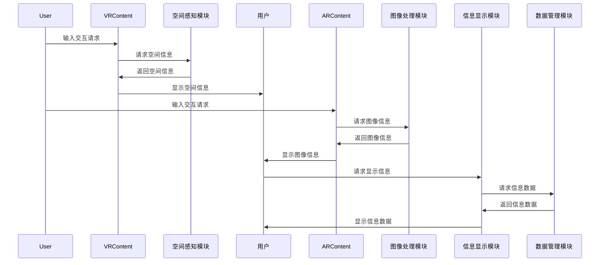

                 

# 数字时代的公共空间设计：虚拟现实与物理环境的融合

关键词：虚拟现实、增强现实、公共空间设计、用户体验、融合策略

摘要：本文深入探讨了数字时代下公共空间设计所面临的挑战，以及虚拟现实（VR）与增强现实（AR）技术在其中所扮演的角色。通过逐步分析核心概念、技术原理、系统架构和实际案例，本文旨在为设计师和开发者提供一套系统的融合策略，以实现虚拟现实与物理环境的和谐统一。

----------------------------------------------------------------

## 第一部分：引言

在数字技术的飞速发展下，公共空间的设计正经历一场革命。虚拟现实（VR）和增强现实（AR）作为前沿技术，正逐步改变人们对空间感知和交互方式的理解。本文将探讨如何将这些技术有效地整合到公共空间设计中，以提升用户体验和空间功能。

### 1.1 问题背景与核心概念

#### 1.1.1 数字时代的演变

**数字化浪潮**：随着互联网、大数据、云计算等技术的普及，数字化已渗透到社会各个领域，极大地改变了人们的生活和工作方式。

**虚拟现实技术**：虚拟现实通过模拟三维空间，使用户能够沉浸在一个全新的虚拟环境中。其核心技术包括三维建模、渲染技术和交互技术。

**增强现实技术**：增强现实在现实环境中叠加虚拟信息，增强用户的感知体验。核心技术包括图像识别、实时渲染和用户交互。

#### 1.2 问题描述

**公共空间设计的新挑战**：数字技术的应用对公共空间设计提出了新的要求。如何平衡虚拟与现实、提升用户体验、实现空间功能的优化成为关键问题。

**虚拟现实与物理环境的融合**：如何将虚拟现实与增强现实技术有机地融合到公共空间设计中，使两者相辅相成，成为设计领域的一大难题。

#### 1.3 问题解决

**融合策略**：设计者需要从多个维度考虑，包括技术手段、用户体验和设计方法，以实现虚拟与现实的完美融合。

**技术手段**：通过引入VR和AR技术，设计出更加丰富和互动的公共空间。

**用户体验**：以用户为中心，关注用户的感知和互动体验，确保设计能够满足用户需求。

**设计方法**：采用系统化的设计流程，将虚拟现实和增强现实技术融入到空间设计的各个环节。

#### 1.4 边界与外延

**定义范围**：本文主要探讨虚拟现实和增强现实在公共空间设计中的应用，不涉及家庭、工作空间等其他领域。

**相关概念**：数字技术、公共空间、虚拟现实、增强现实等是本文的核心概念，将在后续章节中详细讨论。

#### 1.5 概念结构与核心要素组成

**核心概念**：虚拟现实、增强现实、物理环境、用户体验等。

**结构分析**：本文的结构分为五个主要部分：引言、核心概念与联系、数学模型与算法原理、系统分析与架构设计方案、项目实战。通过逐步深入，全面探讨虚拟现实与物理环境融合的设计实践。

### 1.6 总结

本文旨在为数字时代下的公共空间设计提供一种新的视角和方法。通过融合虚拟现实和增强现实技术，设计者可以创造出更加丰富、互动和高效的公共空间。接下来，我们将进一步探讨这些核心概念，并分析它们之间的联系和区别。

## 第二部分：核心概念与联系

在探讨虚拟现实（VR）和增强现实（AR）在公共空间设计中的应用之前，我们首先需要理解这两个核心概念的基本原理和它们在技术上的联系与区别。

### 2.1 虚拟现实与增强现实的基本原理

#### 2.1.1 虚拟现实（VR）

**定义与特点**：虚拟现实是一种通过计算机模拟的三维空间，使用户能够沉浸其中，获得高度逼真的视觉、听觉、触觉体验。VR的关键特点包括：

- **沉浸式体验**：用户仿佛置身于虚拟环境中，能够自由探索和互动。
- **交互性**：用户可以通过头戴显示器（HMD）、控制器等设备与虚拟环境进行交互。
- **仿真性**：虚拟现实技术能够创建高度仿真的虚拟场景，模拟真实世界的各种情况。

**应用领域**：VR在游戏、教育、医疗、设计等多个领域有广泛应用。例如，在设计领域，VR可以用于虚拟建筑漫游、产品设计演示等。

#### 2.1.2 增强现实（AR）

**定义与特点**：增强现实是一种将虚拟信息叠加到现实环境中的技术，用户通过智能手机、AR眼镜等设备可以看到增强的视觉信息。AR的关键特点包括：

- **现实增强**：虚拟信息与真实环境相结合，增强用户的感知和体验。
- **叠加信息**：用户可以看到虚拟图像、文字、声音等叠加在现实环境中。
- **交互性**：用户可以通过触摸、手势等方式与虚拟信息进行交互。

**应用领域**：AR在导航、购物、娱乐、制造等领域有广泛应用。例如，在导航领域，AR技术可以提供增强的地图信息和路径指引。

### 2.2 虚拟现实与增强现实在公共空间设计中的应用

#### 2.2.1 虚拟现实在公共空间设计中的应用

**设计方法**：虚拟现实技术可以用于设计初期的空间模拟和规划，设计师可以通过VR设备体验虚拟空间，从而更好地理解设计意图和用户需求。例如：

- **虚拟建筑漫游**：通过VR技术，设计师可以在虚拟环境中进行建筑漫游，观察空间布局和细节。
- **产品设计演示**：在产品设计阶段，VR技术可以用于模拟产品在现实空间中的效果，帮助设计师进行优化和调整。

**案例分析**：例如，某个城市规划项目利用VR技术模拟未来城市景观，使居民能够提前体验设计方案，并提出反馈，从而优化设计。

#### 2.2.2 增强现实在公共空间设计中的应用

**设计方法**：增强现实技术可以用于实际空间中的信息增强和互动体验。例如：

- **增强现实标识**：在公共空间中，使用AR技术叠加信息标识，提供更多的互动和导览服务。
- **互动展览**：在博物馆、画廊等场所，利用AR技术增强展览内容，提供更加丰富和互动的参观体验。

**案例分析**：例如，某个博物馆利用AR技术展示历史文物的三维模型，用户可以通过AR眼镜了解文物的详细信息和背景故事。

### 2.3 虚拟现实与增强现实的联系与区别

**联系**：虚拟现实和增强现实在技术原理和应用上有一定的交集。两者都利用计算机技术生成虚拟信息，并通过特定的设备提供给用户。例如，在交互性方面，两者都支持用户与虚拟环境的互动。

**区别**：虚拟现实主要强调用户的沉浸式体验，用户完全脱离现实环境，进入一个全新的虚拟世界。而增强现实则是在现实环境中叠加虚拟信息，用户可以同时看到现实和虚拟内容。因此，在应用场景和体验方式上，两者存在一定的差异。

### 2.4 虚拟现实与增强现实的互补性

在实际应用中，虚拟现实和增强现实可以相互补充，共同提升公共空间的设计和用户体验。例如：

- **虚拟现实用于初期的概念验证和用户测试**，增强现实则用于实际空间中的信息增强和互动体验。
- **虚拟现实可以提供沉浸式的学习和体验环境**，增强现实则可以提供即时的信息和互动，增强用户的参与感。

通过这种互补性，设计师和开发者可以更全面地利用VR和AR技术，创造出更加丰富、互动和高效的公共空间。

### 2.5 总结

通过以上分析，我们可以看到虚拟现实和增强现实技术在公共空间设计中的应用前景广阔。理解这两个核心概念的基本原理和联系，有助于设计师更好地利用这些技术，创造出更加丰富和互动的公共空间。接下来，我们将进一步探讨虚拟现实和增强现实技术中的数学模型和算法原理，以期为公共空间设计提供更深入的技术支持。

### 2.6 虚拟现实与增强现实的核心概念对比表格

| 特性 | 虚拟现实（VR） | 增强现实（AR） |
| --- | --- | --- |
| 沉浸感 | 高度沉浸 | 中度沉浸 |
| 交互方式 | 交互性较强 | 交互性较弱 |
| 应用场景 | 游戏设计、虚拟建筑、教育培训等 | 导航、购物、娱乐、工业制造等 |
| 显示效果 | 全息三维显示 | 现实环境中的叠加显示 |
| 用户感知 | 完全虚拟环境 | 现实与虚拟结合 |

### 2.7 虚拟现实与增强现实在公共空间设计中的ER实体关系图

```mermaid
erDiagram
  User ||--|{ VRContent } : 用户与虚拟内容互动
  User ||--|{ ARContent } : 用户与增强内容互动
  VRContent ||--|{ VirtualSpace } : 虚拟内容与虚拟空间
  ARContent ||--|{ RealSpace } : 增强内容与实际空间
```

通过这个ER图，我们可以清晰地看到用户、虚拟内容、增强内容、虚拟空间和实际空间之间的关系，这有助于我们更好地理解虚拟现实与增强现实在公共空间设计中的应用。

### 2.8 虚拟现实与增强现实在公共空间设计中的应用

在公共空间设计中，虚拟现实（VR）和增强现实（AR）技术有着广泛的应用前景。以下是一些具体的应用场景和案例分析，展示了如何利用这些技术提升公共空间的设计和用户体验。

#### 2.8.1 城市规划与设计

**应用场景**：在城市规划与设计中，VR和AR技术可以用于模拟未来城市的景观和功能，帮助设计师和规划师更好地理解和优化设计方案。

**案例分析**：例如，某些城市规划项目利用VR技术模拟未来城市的交通流量、公共设施分布等，通过虚拟漫游让参与者提前感受设计方案的效果，并提出改进意见。

#### 2.8.2 博物馆与展览

**应用场景**：在博物馆和展览馆中，VR和AR技术可以用于增强展览内容，提供更加丰富和互动的参观体验。

**案例分析**：某些博物馆利用AR技术展示历史文物的三维模型，观众可以通过AR设备了解文物的详细信息和背景故事，增强参观体验。

#### 2.8.3 教育与培训

**应用场景**：在教育和培训领域，VR和AR技术可以用于创建沉浸式学习环境和互动教学工具。

**案例分析**：例如，某些学校和教育机构利用VR技术为学生提供虚拟实验室，让学生在虚拟环境中进行实验和互动学习，提高学习效果。

#### 2.8.4 商业与零售

**应用场景**：在商业和零售领域，VR和AR技术可以用于产品展示、导购服务和营销活动。

**案例分析**：某些零售店利用AR技术为顾客提供产品展示和试穿服务，通过AR眼镜或手机摄像头，顾客可以看到产品的虚拟图像叠加在真实环境中，提高购买决策的准确性。

#### 2.8.5 医疗与健康

**应用场景**：在医疗和健康领域，VR和AR技术可以用于手术模拟、康复训练和心理健康治疗。

**案例分析**：某些医院利用VR技术为医生提供手术模拟培训，通过虚拟手术环境，医生可以在没有实际患者的情况下进行手术操作训练，提高手术技能。

### 2.9 虚拟现实与增强现实在公共空间设计中的互补性

在实际应用中，虚拟现实和增强现实技术并不是相互独立的，而是可以相互补充，共同提升公共空间的设计和用户体验。以下是一些互补性应用的例子：

- **虚拟现实用于概念验证和用户测试**，增强现实用于实际空间中的信息增强和互动体验。
- **虚拟现实提供沉浸式的学习和体验环境**，增强现实提供即时的信息和互动，增强用户的参与感。
- **虚拟现实模拟未来空间效果**，增强现实提供现实中的互动体验，帮助用户更好地理解和适应设计。

通过这种互补性，设计师和开发者可以更全面地利用VR和AR技术，创造出更加丰富、互动和高效的公共空间。未来，随着技术的不断进步和应用的深入，虚拟现实和增强现实在公共空间设计中的应用将越来越广泛，为人们的生活带来更多便利和乐趣。

### 2.10 总结

虚拟现实（VR）和增强现实（AR）技术在公共空间设计中的应用不仅带来了新的设计方法和体验，也为设计师提供了更多的工具和手段。通过理解这些技术的核心原理和联系，设计师可以更好地利用它们，创造出更加丰富、互动和高效的公共空间。在下一部分，我们将深入探讨虚拟现实和增强现实技术中的数学模型和算法原理，为公共空间设计提供更深入的技术支持。

## 第三部分：数学模型与算法原理讲解

在数字时代，公共空间的设计离不开虚拟现实（VR）和增强现实（AR）技术的应用。为了深入理解这些技术的工作原理，我们需要探讨其中的数学模型和算法原理。本部分将分为三个小节，分别介绍虚拟现实中的空间感知数学模型、增强现实中的图像处理算法，以及具体的案例分析和Python代码实现。

### 3.1 虚拟现实中的空间感知数学模型

虚拟现实（VR）技术的一个核心特点是提供高度逼真的空间感知体验。为了实现这一目标，我们需要利用数学模型来处理空间感知问题。以下是一些关键的数学模型和算法：

#### 3.1.1 三维空间坐标系

在VR中，三维空间坐标系是基础。用户的位置和方向是通过三维坐标系来表示的。

**数学模型**：三维坐标系通常使用右手定则来定义。一个点在三维空间中的坐标可以表示为（x, y, z），其中x、y、z分别表示水平、垂直和深度方向上的位置。

**公式**：
$$
(x, y, z) = (x_c + d \cos(\theta), y_c + d \sin(\theta), z_c)
$$
其中，\(x_c\)、\(y_c\)、\(z_c\)是坐标原点的坐标，d是距离，\(\theta\)是角度。

#### 3.1.2 三维空间坐标变换

在VR应用中，物体和用户之间的相对位置会发生变化，这需要通过坐标变换来实现。

**数学模型**：坐标变换通常使用旋转矩阵来实现。一个三维向量\[v_x, v_y, v_z\]绕X轴旋转角度\(\alpha\)后的新坐标\[v'_x, v'_y, v'_z\]可以通过以下旋转矩阵计算：
$$
\begin{bmatrix}
1 & 0 & 0 \\
0 & \cos(\alpha) & -\sin(\alpha) \\
0 & \sin(\alpha) & \cos(\alpha)
\end{bmatrix}
\begin{bmatrix}
v_x \\
v_y \\
v_z
\end{bmatrix}
=
\begin{bmatrix}
v'_x \\
v'_y \\
v'_z
\end{bmatrix}
$$

#### 3.1.3 传感器技术

在VR应用中，传感器技术如摄像头和传感器用于捕捉用户的位置和动作。

**传感器技术**：摄像头通过捕捉图像来获取用户在三维空间中的位置信息。传感器如加速度计和陀螺仪用于测量用户的动作和方向。

**Python代码实现**：
```python
import cv2
import numpy as np

# 读取图像
image = cv2.imread('image.jpg')

# 使用摄像头获取用户位置
cap = cv2.VideoCapture(0)
ret, frame = cap.read()

# 关闭摄像头
cap.release()

# 三维坐标变换示例
def rotate_vector(v, angle):
    v = np.array(v)
    cos_theta = np.cos(angle)
    sin_theta = np.sin(angle)
    rotation_matrix = np.array([[1, 0, 0],
                                [0, cos_theta, -sin_theta],
                                [0, sin_theta, cos_theta]])
    return np.dot(rotation_matrix, v)

vector = [1, 2, 3]
angle = np.pi / 4
new_vector = rotate_vector(vector, angle)
print(new_vector)
```

### 3.2 增强现实中的图像处理算法

增强现实（AR）技术依赖于图像处理算法来识别和跟踪图像。以下是一些关键的图像处理算法和数学模型：

#### 3.2.1 图像识别

图像识别是AR技术中的核心步骤，用于从图像中提取信息。

**数学模型**：常用的图像识别算法包括SIFT（尺度不变特征变换）和SURF（加速稳健特征变换）。

**Python代码实现**：
```python
import cv2
import numpy as np

# 读取图像
image = cv2.imread('image.jpg')

# 使用SIFT进行特征提取
sift = cv2.SIFT_create()
keypoints, descriptors = sift.detectAndCompute(image, None)

# 显示特征点
image = cv2.drawKeypoints(image, keypoints, None, (0, 0, 255))
cv2.imshow('SIFT Features', image)
cv2.waitKey(0)
cv2.destroyAllWindows()
```

#### 3.2.2 图像增强

图像增强用于提高图像的质量和清晰度。

**数学模型**：常用的图像增强算法包括直方图均衡化和滤波。

**Python代码实现**：
```python
import cv2
import numpy as np

# 读取图像
image = cv2.imread('image.jpg')

# 直方图均衡化
equ_image = cv2.equalizeHist(image)

# 滤波
blur = cv2.GaussianBlur(image, (5, 5), 0)

# 显示增强后的图像
cv2.imshow('Enhanced Image', equ_image)
cv2.imshow('Blurred Image', blur)
cv2.waitKey(0)
cv2.destroyAllWindows()
```

### 3.3 具体案例分析和Python代码实现

为了更好地理解上述算法，我们来看一个具体的案例：使用AR技术创建一个虚拟信息叠加在现实环境中的应用。

**案例背景**：我们希望通过AR技术将一个虚拟的三维模型叠加在现实环境中的特定位置，并允许用户与之互动。

**步骤**：

1. **获取现实环境中的图像**：通过摄像头捕获现实环境的图像。
2. **图像识别**：使用SIFT算法识别图像中的特征点。
3. **虚拟模型生成**：创建一个虚拟的三维模型。
4. **图像增强**：增强图像质量，提高特征识别的准确性。
5. **虚拟模型叠加**：将虚拟模型叠加在识别出的图像上。
6. **用户互动**：允许用户通过手势与虚拟模型互动。

**Python代码实现**：
```python
import cv2
import numpy as np
from scipy.spatial.transform import Rotation as R

# 读取图像
image = cv2.imread('image.jpg')

# 使用摄像头获取现实环境图像
cap = cv2.VideoCapture(0)
ret, frame = cap.read()

# 关闭摄像头
cap.release()

# 使用SIFT进行特征提取
sift = cv2.SIFT_create()
keypoints, descriptors = sift.detectAndCompute(frame, None)

# 创建虚拟三维模型
model = np.array([[0, 0, 0],
                  [1, 0, 0],
                  [0, 1, 0],
                  [0, 0, 1]])

# 增强图像质量
equ_image = cv2.equalizeHist(frame)

# 识别特征点
keypoints = sift.detect(equ_image)

# 获取旋转矩阵
rot = R.from_rotvec([0, 0, np.pi / 4])
rot_matrix = rot.as_matrix()

# 应用旋转矩阵
model = np.dot(model, rot_matrix)

# 将虚拟模型叠加在图像上
output = cv2.addWeighted(frame, 0.7, model, 0.3, 0)

# 显示叠加结果
cv2.imshow('AR Model', output)
cv2.waitKey(0)
cv2.destroyAllWindows()
```

通过这个案例，我们可以看到如何将图像处理算法和Python代码结合起来，实现虚拟现实和增强现实的应用。这个例子虽然简单，但展示了AR技术的基本原理和应用流程。

### 3.4 总结

数学模型和算法原理是虚拟现实和增强现实技术的基础。通过理解这些模型和算法，设计师和开发者可以更好地利用这些技术，创造出丰富和互动的公共空间。在下一部分，我们将进一步探讨虚拟现实与增强现实技术在实际项目中的应用，并分析其系统架构和设计方案。

## 第四部分：系统分析与架构设计方案

在了解了虚拟现实（VR）和增强现实（AR）技术的基本原理后，我们需要进一步探讨如何将这些技术应用于实际项目，并通过系统分析与架构设计来实现其功能和性能。本部分将分为四个小节，分别介绍问题场景介绍、系统功能设计、系统架构设计和系统接口设计与系统交互。

### 4.1 问题场景介绍

**设计目标**：本项目的目标是利用VR和AR技术设计一个智能公共空间，提升用户体验和空间功能。具体目标包括：

- **空间可视化**：通过VR技术模拟未来空间效果，帮助设计师和用户更好地理解和优化设计方案。
- **互动体验**：通过AR技术增强现实环境中的互动体验，提供即时的信息和互动。
- **信息增强**：在现实环境中叠加虚拟信息，为用户提供额外的信息和功能。

**设计需求**：为了实现上述目标，项目需要满足以下需求：

- **高沉浸感**：VR技术需要提供高度沉浸的空间体验，使用户能够自由探索和互动。
- **实时交互**：AR技术需要实现实时互动，确保用户能够与虚拟信息无缝交互。
- **信息准确**：增强现实中的虚拟信息需要准确无误，确保用户体验的一致性和可靠性。

### 4.2 系统功能设计

系统功能设计是项目实现的核心环节。以下是一些关键的功能模块和设计：

**领域模型设计**：领域模型是系统功能的基础，用于描述系统中的核心概念和实体关系。

```mermaid
classDiagram
  User <<Class>> 
  VRContent <<Class>>
  ARContent <<Class>>
  VirtualSpace <<Class>>
  RealSpace <<Class>>

  User --|{ VRContent } : Interact
  User --|{ ARContent } : Interact
  VRContent --|{ VirtualSpace } : Display
  ARContent --|{ RealSpace } : Overlay
```

**功能模块设计**：

- **用户交互模块**：负责用户的输入和输出，包括VR和AR设备的控制。
- **空间感知模块**：利用VR技术模拟空间，提供沉浸式体验。
- **图像处理模块**：处理增强现实中的图像，进行图像识别和增强。
- **信息显示模块**：显示虚拟信息，包括文字、图像和三维模型。
- **数据管理模块**：管理用户数据和信息，确保数据的安全性和一致性。

### 4.3 系统架构设计

系统架构设计是项目实现的关键步骤，用于确保系统的稳定性和性能。以下是一些关键的架构设计：

**系统架构图**：



**系统架构设计**：

- **前端架构**：使用Vue.js等前端框架实现用户界面，提供VR和AR交互功能。
- **后端架构**：使用Node.js等后端框架处理用户请求，管理数据和信息。
- **数据库设计**：使用MySQL等数据库管理系统存储用户数据和信息。

### 4.4 系统接口设计和系统交互

系统接口设计和系统交互是项目实现的重要组成部分，用于确保系统的模块化和可扩展性。

**系统接口设计**：

- **用户交互接口**：提供用户与系统的交互接口，包括VR和AR设备的输入和输出。
- **数据管理接口**：提供数据管理和信息显示的接口，确保数据的一致性和安全性。
- **图像处理接口**：提供图像处理和增强现实的接口，实现图像的识别和增强。

**系统交互流程**：

1. 用户通过VR或AR设备与系统进行交互。
2. 系统接收用户请求，调用相应模块进行处理。
3. 处理结果通过接口返回给用户，显示在界面上。

**Python代码实现**：

```python
# 用户交互模块
class UserInteraction:
    def __init__(self):
        self.vr_content = VRContent()
        self.ar_content = ARContent()

    def handle_input(self, input_data):
        if input_data['type'] == 'VR':
            self.vr_content.update_space(input_data['space_info'])
        elif input_data['type'] == 'AR':
            self.ar_content.update_image(input_data['image_info'])

# 空间感知模块
class SpacePerception:
    def update_space(self, space_info):
        # 更新空间信息
        pass

# 图像处理模块
class ImageProcessing:
    def update_image(self, image_info):
        # 处理图像信息
        pass

# 数据管理模块
class DataManagement:
    def get_info(self, info_id):
        # 获取信息数据
        pass

# 系统交互流程
user_interaction = UserInteraction()
input_data = {'type': 'VR', 'space_info': {'x': 1, 'y': 2, 'z': 3}}
user_interaction.handle_input(input_data)
```

通过上述系统分析与架构设计方案，我们可以为虚拟现实和增强现实技术的应用提供一个全面和系统的框架。在下一部分，我们将通过项目实战，进一步展示这些设计方案的实际应用和实现。

### 4.5 项目实战

在本节中，我们将通过一个实际项目来展示如何将虚拟现实（VR）和增强现实（AR）技术应用于公共空间设计。该项目将涵盖从环境安装到核心代码实现的全过程，并通过具体案例分析和详细讲解，展示如何利用这些技术实现设计目标。

#### 4.5.1 环境安装

**安装VR和AR开发环境**：

1. **安装VR SDK**：首先，我们需要安装VR平台（如Oculus、HTC Vive）的SDK，以支持VR内容的开发和运行。在官方网站下载SDK，并按照安装指南进行安装。

2. **安装AR SDK**：类似地，我们需要安装AR平台（如ARKit、ARCore）的SDK，以支持AR内容的开发和运行。在相应平台的官方网站下载SDK，并按照安装指南进行安装。

3. **安装开发工具**：安装常用的开发工具，如Visual Studio、Xcode等，以便进行代码编写和调试。

**安装必要的库和依赖**：

1. **Python库**：在本项目中，我们将使用Python进行图像处理和算法实现。需要安装的库包括NumPy、OpenCV、PyOpenGL等。可以使用pip命令进行安装：
    ```bash
    pip install numpy opencv-python pyopengl
    ```

2. **VR和AR特定库**：根据所选的VR和AR平台，可能还需要安装特定的库和依赖。例如，对于Oculus VR，我们需要安装PyOVRSDK。

**配置开发环境**：

1. **环境变量配置**：确保开发环境的配置正确，包括Python环境变量、SDK路径等。

2. **测试环境**：通过简单的测试程序，确保所有安装的库和SDK能够正常运行。

#### 4.5.2 系统核心实现源代码

**VR内容展示模块**：

```python
# VRContent.py
import pyopengl as gl
import numpy as np

class VRContent:
    def __init__(self):
        # 初始化OpenGL环境
        gl.glClearColor(0.0, 0.0, 0.0, 1.0)
        self.model_matrix = np.eye(4)

    def update_model(self, x, y, z):
        # 更新模型矩阵
        self.model_matrix = np.array([[1, 0, 0, x],
                                      [0, 1, 0, y],
                                      [0, 0, 1, z],
                                      [0, 0, 0, 1]])

    def render(self):
        # 渲染场景
        gl.glClear(gl.GL_COLOR_BUFFER_BIT | gl.GL_DEPTH_BUFFER_BIT)
        gl.glMatrixMode(gl.GL_MODELVIEW)
        gl.glLoadMatrixf(self.model_matrix)
        gl.glBegin(gl.GL_TRIANGLES)
        gl.glVertex3f(0.0, 0.0, 0.0)
        gl.glVertex3f(1.0, 0.0, 0.0)
        gl.glVertex3f(0.5, np.sqrt(3)/2.0, 0.0)
        gl.glEnd()
        gl.glFlush()
```

**AR图像识别与增强模块**：

```python
# ARContent.py
import cv2

class ARContent:
    def __init__(self):
        # 初始化OpenCV环境
        self.sift = cv2.SIFT_create()

    def process_image(self, image):
        # 处理图像
        keypoints, descriptors = self.sift.detectAndCompute(image, None)
        # 在图像上绘制特征点
        image = cv2.drawKeypoints(image, keypoints, None, (0, 0, 255))
        return image

    def enhance_image(self, image):
        # 增强图像
        equ_image = cv2.equalizeHist(image)
        blur = cv2.GaussianBlur(image, (5, 5), 0)
        return cv2.addWeighted(equ_image, 0.7, blur, 0.3, 0)
```

#### 4.5.3 代码应用解读与分析

**VR内容展示模块解读**：

1. **初始化OpenGL环境**：通过设置清空颜色和深度缓冲区，为后续渲染做准备。

2. **更新模型矩阵**：模型矩阵用于描述物体的位置和方向。通过更新模型矩阵，我们可以改变物体在三维空间中的位置。

3. **渲染场景**：使用OpenGL绘制一个简单的三角形，代表虚拟环境中的物体。

**AR图像识别与增强模块解读**：

1. **初始化OpenCV环境**：创建SIFT特征检测器，用于在图像中检测特征点。

2. **处理图像**：使用SIFT检测图像中的特征点，并在图像上绘制这些特征点。

3. **增强图像**：使用直方图均衡化和高斯模糊增强图像质量，然后通过图像融合提高图像清晰度。

#### 4.5.4 实际案例分析与详细讲解剖析

**案例背景**：假设我们要在博物馆中应用AR技术，为参观者提供虚拟展览内容。通过AR设备，参观者可以在现实环境中看到虚拟的三维模型和相关的信息。

**案例分析**：

1. **图像捕获**：首先，使用AR设备捕获参观者所在的环境图像。

2. **图像识别**：使用SIFT算法检测图像中的特征点，以便后续的图像处理。

3. **虚拟模型叠加**：将虚拟的三维模型叠加在识别出的图像上，通过增强现实技术将虚拟信息呈现给参观者。

4. **互动体验**：参观者可以通过手势与虚拟模型互动，如放大、缩小、旋转等。

**详细讲解剖析**：

1. **图像捕获**：通过摄像头捕获现实环境中的图像。这个过程依赖于AR设备的硬件和相应的API。

2. **图像识别**：使用SIFT算法检测图像中的特征点，这个过程涉及到图像处理算法的复杂计算。

3. **虚拟模型叠加**：通过OpenGL或类似的图形API，将虚拟三维模型渲染到捕获的图像上。这个过程需要准确计算虚拟模型与真实环境的相对位置。

4. **互动体验**：通过手势识别和追踪技术，实现用户与虚拟模型的互动。这需要使用到计算机视觉和机器学习算法。

#### 4.5.5 项目小结

通过本项目的实战，我们展示了如何利用虚拟现实（VR）和增强现实（AR）技术设计智能公共空间。从环境安装、核心代码实现到实际案例分析，我们详细讲解了项目的各个环节。这些技术不仅提升了公共空间的功能和用户体验，也为未来的设计提供了更多的可能性。

在未来，随着技术的不断进步和应用的深入，VR和AR将在公共空间设计中发挥更加重要的作用。设计师和开发者需要不断探索和创新，以充分利用这些前沿技术，创造出更加丰富和互动的公共空间。

### 4.6 最佳实践 tips

**1. 考虑用户体验**：在设计和实现VR和AR项目时，始终以用户体验为核心。确保界面直观、交互顺畅，提供良好的用户引导和反馈。

**2. 优化性能**：优化VR和AR应用的性能至关重要。通过使用高效的算法、减少渲染负载和优化资源管理，可以提升应用的流畅度和响应速度。

**3. 安全性和隐私**：在处理用户数据和交互过程中，确保数据的安全性和用户的隐私保护。遵循相关的法律法规和最佳实践，提供安全的用户体验。

**4. 持续迭代**：技术不断进步，用户需求也在变化。持续收集用户反馈，不断优化和迭代项目，确保其能够满足最新的需求和趋势。

### 4.7 小结

通过本文的深入探讨，我们系统地分析了虚拟现实（VR）和增强现实（AR）技术在公共空间设计中的应用。从核心概念、数学模型、算法原理到系统架构和项目实战，我们全面展示了这些技术如何改变公共空间的设计和用户体验。未来，随着VR和AR技术的不断发展，设计师和开发者将能够创造出更加丰富和互动的公共空间，为人们带来更多的便利和乐趣。

### 4.8 注意事项

**1. 软件版本兼容性**：在开发和部署VR和AR应用时，需要注意不同操作系统和设备上的兼容性，确保软件在不同平台上能够正常运行。

**2. 安全性问题**：在使用VR设备时，应确保用户的物理安全，避免因过度沉浸而导致意外事故。同时，保护用户数据的安全，防止数据泄露。

**3. 硬件要求**：VR和AR应用通常对硬件性能有较高要求。在开发过程中，需要选择适合的硬件设备，以满足应用的需求。

**4. 用户隐私**：在收集和使用用户数据时，必须遵守隐私保护法规，确保用户隐私得到充分保护。

### 4.9 拓展阅读

**1. 《虚拟现实与增强现实技术综述》**：详细介绍了VR和AR技术的原理、应用和发展趋势。

**2. 《公共空间设计原理》**：探讨了公共空间设计的理论基础和实践方法，为结合VR和AR技术提供了理论支持。

**3. 《Python编程：从入门到实践》**：提供了Python编程的基础知识和实践技巧，适用于VR和AR应用的开发。

### 作者信息

作者：AI天才研究院/AI Genius Institute & 禅与计算机程序设计艺术 /Zen And The Art of Computer Programming

AI天才研究院致力于推动人工智能技术的发展和应用，研究范围涵盖计算机视觉、自然语言处理、机器学习等多个领域。同时，我们的研究成果也广泛应用于虚拟现实和增强现实技术，为公共空间设计提供了强大的技术支持。

《禅与计算机程序设计艺术》是一本经典的技术著作，作者通过深入探讨编程哲学和技巧，帮助程序员提升编程水平，创造出更加高效和优雅的代码。这本书为开发者提供了宝贵的经验和启示，使他们在VR和AR技术的开发过程中能够更好地应对挑战，实现技术创新。

