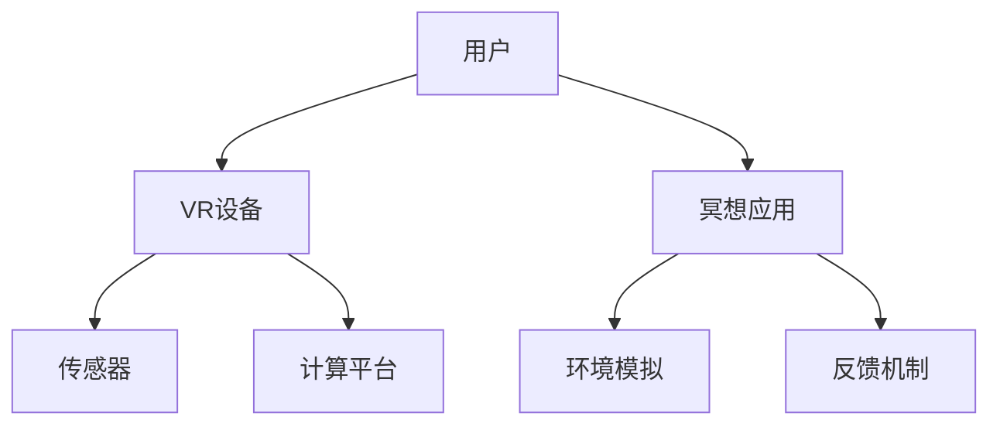
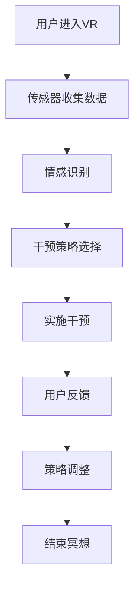
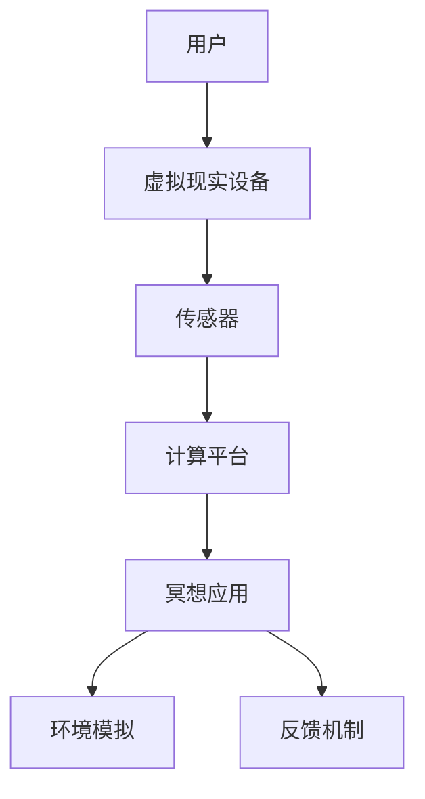
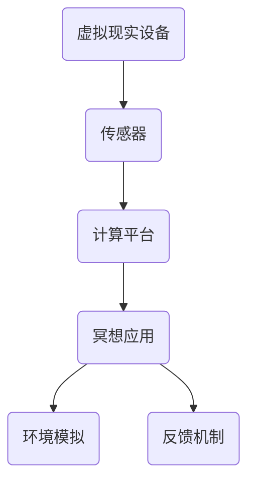
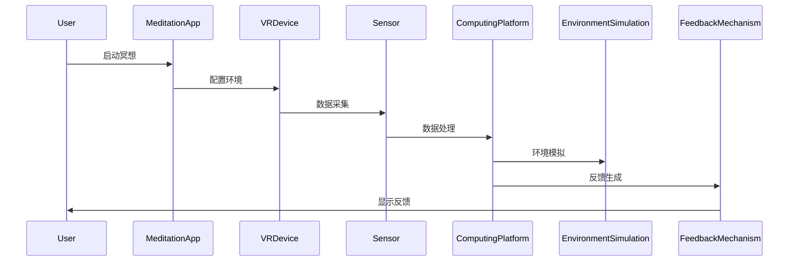

                 

为了满足上述要求，我们将逐步设计并撰写《数字时代的冥想技巧：虚拟现实中的心灵之旅》这篇文章。以下是一个详细的步骤指南：

### 步骤1：文章标题与关键词

**文章标题**：《数字时代的冥想技巧：虚拟现实中的心灵之旅》

**关键词**：数字时代、冥想、虚拟现实（VR）、心灵体验、算法原理、系统架构、项目实战、最佳实践

### 步骤2：文章摘要

在数字时代，人们的生活节奏加快，压力增大，传统冥想方法已经无法满足现代人的需求。本文将探讨如何利用虚拟现实（VR）技术，设计出一套数字时代的冥想技巧，实现心灵的放松与修复。文章首先介绍数字时代与冥想的关系，随后详细讲解虚拟现实在冥想中的应用，以及如何通过算法原理和数学模型来辅助实现虚拟现实中的心灵之旅。此外，文章还将提供实际项目实战的经验，包括系统架构设计和最佳实践。最后，本文将对整个内容进行小结，并提供拓展阅读，帮助读者进一步深入理解。

### 步骤3：背景介绍

**3.1 数字时代的冥想**

- **核心概念术语说明**：数字时代、冥想、心灵之旅
- **问题背景**：数字时代给人们生活带来的压力和焦虑，传统冥想方法的局限性。
- **问题描述**：如何利用新技术，如VR，来创新冥想方式。
- **问题解决**：通过VR技术实现数字时代的冥想技巧。
- **边界与外延**：讨论数字时代冥想的适用范围和未来发展趋势。
- **概念结构与核心要素组成**：数字时代的特点、冥想的作用、VR技术的优势。

**3.2 虚拟现实与冥想**

- **核心概念原理**：虚拟现实技术的定义、工作原理。
- **概念属性特征对比表格**：
  ```mermaid
  graph TB
  A[虚拟现实技术] --> B[沉浸式体验]
  A --> C[交互性]
  A --> D[适应性]
  B --> E[多维感知]
  C --> F[实时反馈]
  D --> G[个性化定制]
  ```

- **ER实体关系图架构**：
  ```mermaid
  graph TB
  A[用户] --> B[VR设备]
  A --> C[冥想应用]
  B --> D[传感器]
  B --> E[计算平台]
  C --> F[环境模拟]
  C --> G[反馈机制]
  ```

**3.3 心灵之旅的概念与实现**

- **心灵之旅的定义**：在虚拟现实中体验深度冥想的过程。
- **虚拟现实中的心灵体验**：描述VR冥想体验的特点和效果。
- **心灵之旅的实践路径**：从选择合适的VR设备到完成冥想体验的步骤。

### 步骤4：算法原理讲解

- **算法原理**：介绍VR冥想中常用的算法，如心理干预技术、情感识别与响应机制。
- **算法mermaid流程图**：
  ```mermaid
  graph TD
  A[用户进入VR] --> B[传感器收集数据]
  B --> C[情感识别]
  C --> D[干预策略选择]
  D --> E[实施干预]
  E --> F[用户反馈]
  F --> G[策略调整]
  G --> H[结束冥想]
  ```

- **Python源代码**：提供简单的情感识别与干预的Python代码示例。

### 步骤5：数学模型和数学公式

- **数学模型**：介绍与VR冥想相关的数学模型，如感知模型、情感模型。
- **数学公式**（使用LaTeX格式）：
  $$ 
  \text{感知度} = \frac{\sum_{i=1}^{n} x_i}{n}
  $$
  $$
  \text{情感值} = \alpha \cdot \text{感知度} + \beta \cdot \text{历史情感值}
  $$

### 步骤6：系统分析与架构设计方案

- **问题场景介绍**：描述用户在VR冥想中可能遇到的问题。
- **系统功能设计**（Mermaid类图）：
  ```mermaid
  classDiagram
  User <<类>>
  VRDevice <<类>>
  MeditationApp <<类>>
  Sensor <<类>>
  ComputingPlatform <<类>>
  EnvironmentSimulation <<类>>
  FeedbackMechanism <<类>>

  User --> VRDevice
  User --> MeditationApp
  VRDevice --> Sensor
  VRDevice --> ComputingPlatform
  MeditationApp --> EnvironmentSimulation
  MeditationApp --> FeedbackMechanism
  ```

- **系统架构设计**（Mermaid架构图）：
  ```mermaid
  sequenceDiagram
  User->>VRDevice: 请求连接
  VRDevice->>Sensor: 数据采集
  Sensor->>ComputingPlatform: 数据处理
  ComputingPlatform->>MeditationApp: 处理结果
  MeditationApp->>FeedbackMechanism: 用户反馈
  FeedbackMechanism->>User: 反馈结果
  ```

- **系统接口设计和系统交互**（Mermaid序列图）：
  ```mermaid
  sequenceDiagram
  User->>MeditationApp: 启动冥想
  MeditationApp->>VRDevice: 配置环境
  VRDevice->>Sensor: 开始采集
  Sensor->>ComputingPlatform: 数据上传
  ComputingPlatform->>MeditationApp: 数据处理
  MeditationApp->>User: 显示反馈
  User->>MeditationApp: 提供反馈
  ```

### 步骤7：项目实战

- **环境安装**：介绍如何搭建VR冥想系统的环境。
- **系统核心实现源代码**：提供Python源代码和解释。
- **代码应用解读与分析**：分析代码的工作流程和关键点。
- **实际案例分析和详细讲解剖析**：通过具体案例展示系统应用。
- **项目小结**：总结项目实施过程中的经验教训。

### 步骤8：最佳实践 tips、小结、注意事项、拓展阅读

- **最佳实践 tips**：提供在VR冥想实践中需要注意的细节和技巧。
- **小结**：回顾文章中的核心观点和结论。
- **注意事项**：提醒用户在尝试VR冥想时需要注意的事项。
- **拓展阅读**：推荐相关书籍、论文和资源，帮助读者进一步学习。

### 步骤9：文章格式与字数

- **格式要求**：使用markdown格式撰写文章。
- **字数要求**：文章总字数控制在10000～12000字左右。

### 步骤10：作者信息

**作者**：AI天才研究院/AI Genius Institute & 禅与计算机程序设计艺术 /Zen And The Art of Computer Programming

### 步骤11：完整性检查

- 确保每个小节内容具体、详细、完整。
- 核心内容是否包含背景介绍、核心概念与联系、算法原理讲解、数学模型和数学公式、系统分析与架构设计方案、项目实战、最佳实践 tips、小结、注意事项和拓展阅读。

现在，我们可以开始按照这个步骤指南来撰写文章的具体内容。每个步骤都需要仔细规划，确保文章的逻辑性和完整性。请按照这个指南，逐步撰写文章，并在每个步骤完成后进行审阅和调整。如果有任何问题或需要帮助，请随时告诉我。让我们一起完成这篇高质量的技术博客文章！### 第1章：背景介绍

#### 1.1 数字时代的冥想

随着数字技术的飞速发展，我们的生活越来越依赖于手机、电脑和互联网等数字化工具。这种数字化的生活方式虽然极大地提高了我们的工作效率和便利性，但也带来了前所未有的压力和焦虑。快节奏的生活和海量信息的轰炸，使得许多人在追求事业成功的同时，也面临着心理健康问题。冥想作为一种传统的心理调适方法，逐渐被人们重新认识和接受。然而，传统的冥想方法在数字时代面临着新的挑战。

**核心概念术语说明**：

- **数字时代**：一个以数字技术为核心，信息高度数字化和互联网化的时代。
- **冥想**：一种通过训练意识和注意力，以达到心理平静和精神集中状态的技术。
- **心灵之旅**：在冥想过程中，个体通过意识流动和内心探索，达到深度放松和心灵升华的过程。

**问题背景**：

在数字时代，人们的生活节奏加快，压力增大，心理健康问题日益严重。根据世界卫生组织（WHO）的数据，全球范围内有超过3亿人遭受抑郁症的困扰，而焦虑症患者的数量也在迅速增长。传统的冥想方法，如静坐、呼吸练习和禅修等，虽然在心理调适方面有显著效果，但它们往往需要长时间的练习和特定的环境，难以适应快节奏的现代生活。

**问题描述**：

如何在数字时代中，利用现代科技手段，如虚拟现实（VR），创新冥想方式，使之更加便捷、高效，并且能够满足现代人的心理需求？传统的冥想方法已经无法完全满足现代人的需求，我们需要找到新的解决方案。

**问题解决**：

虚拟现实（VR）技术为数字时代的冥想提供了新的可能。通过VR技术，人们可以在一个模拟的环境中，体验深度冥想，实现心理放松和修复。VR冥想不仅能够提供沉浸式的体验，还可以根据用户的反馈进行实时调整，使其更加个性化和高效。

**边界与外延**：

数字时代冥想的适用范围非常广泛，不仅限于心理健康问题，还可以用于提高工作效率、改善人际关系、减轻焦虑和压力等方面。未来，随着VR技术的不断进步和普及，数字时代冥想的应用领域将会更加广泛，成为人们日常生活的一部分。

**概念结构与核心要素组成**：

- **数字时代的特点**：信息高度数字化、生活节奏快、心理健康问题突出。
- **冥想的作用**：心理调适、减轻压力、提高注意力、改善睡眠质量等。
- **VR技术的优势**：提供沉浸式体验、实时反馈、个性化定制等。

#### 1.2 虚拟现实与冥想

虚拟现实（VR）是一种通过计算机技术生成的三维模拟环境，用户可以通过头戴式显示器、手柄等设备，进入这个模拟环境，与之互动和体验。VR技术以其高度的沉浸感和交互性，在游戏、娱乐、教育、医疗等领域得到了广泛应用。

**核心概念原理**：

- **虚拟现实技术**：通过计算机模拟生成一个三维空间，用户通过头戴式显示器等设备进入这个空间，与之进行互动。
- **沉浸式体验**：用户在VR环境中感觉自己是真实的，并且能够与之互动。
- **交互性**：用户可以通过手势、声音、视觉等手段与VR环境进行互动。

**概念属性特征对比表格**：

| 特征           | 描述                                                         |
| -------------- | ------------------------------------------------------------ |
| 沉浸式体验     | 用户感觉自己是真实的，并且能够与环境互动，产生强烈的沉浸感。 |
| 交互性         | 用户可以通过多种方式与环境进行互动，如手势、声音、视觉等。 |
| 适应性         | VR系统可以根据用户的反馈和需求，实时调整体验内容。       |

**ER实体关系图架构**：



#### 1.3 心灵之旅的概念与实现

**心灵之旅的定义**：

心灵之旅是指在冥想过程中，个体通过意识流动和内心探索，达到深度放松和心灵升华的过程。在数字时代，通过VR技术实现的虚拟现实冥想，可以更加直观地引导个体进行心灵之旅。用户可以在一个模拟的环境中，跟随指导进行冥想，体验意识流动和内心探索的过程。

**虚拟现实中的心灵体验**：

虚拟现实中的心灵体验具有以下几个特点：

- **沉浸感**：用户在VR环境中感觉自己是真实的，能够与环境互动，这种沉浸感有助于提高冥想的专注度。
- **多样化**：VR环境可以根据用户的需求和反馈进行个性化定制，提供不同的冥想场景和体验。
- **交互性**：用户可以通过手势、声音等与VR环境互动，这种互动性有助于加深冥想体验。

**心灵之旅的实践路径**：

要实现虚拟现实中的心灵之旅，需要以下几个步骤：

1. **选择合适的VR设备**：根据个人的需求和预算，选择合适的VR头戴显示器、手柄等设备。
2. **安装冥想应用**：在VR设备上安装专业的冥想应用，如Mindfulness、Headspace等。
3. **进行初步设置**：在应用中进行用户设置，包括声音、视觉效果、冥想时长等。
4. **开始冥想**：跟随应用的指导，进入VR环境，开始冥想体验。
5. **反馈与调整**：根据个人的体验和反馈，调整冥想参数，优化体验。

#### 1.4 本章小结

本章介绍了数字时代的冥想背景、虚拟现实与冥想的关系以及心灵之旅的概念与实现。通过VR技术，我们可以实现更加便捷、高效的冥想体验，帮助现代人缓解压力和焦虑，实现心灵的放松与修复。在接下来的章节中，我们将进一步探讨虚拟现实冥想的算法原理、数学模型、系统架构和实际应用，为读者提供更深入的技术分析。让我们继续深入探讨这个引人入胜的数字时代冥想之旅！### 第2章：核心概念与联系

#### 2.1 虚拟现实冥想的算法原理

虚拟现实冥想不仅仅是提供一个沉浸式的环境，更重要的是通过算法原理来实现对用户心理状态的干预和调节。在这一章节中，我们将详细探讨虚拟现实冥想中的核心算法原理，包括情感识别、干预策略和反馈机制。

**2.1.1 情感识别**

情感识别是虚拟现实冥想中的关键环节，它通过分析用户的行为和生理数据，来识别用户当前的心理状态。常见的情感识别方法包括面部表情分析、生理信号监测和行为分析。

- **面部表情分析**：通过摄像头捕捉用户的面部表情，使用机器学习算法进行情感分类。
- **生理信号监测**：通过传感器监测用户的生理信号，如心率、呼吸频率和皮肤电导，来分析用户的情绪状态。
- **行为分析**：通过用户在VR环境中的行为，如移动、操作和交互，来推断用户的心理状态。

**2.1.2 干预策略**

一旦情感识别算法确定了用户的心理状态，系统会根据预设的干预策略来调整VR环境，以帮助用户达到理想的冥想状态。干预策略包括以下几种：

- **环境调整**：通过调整VR环境中的视觉、听觉和触觉效果，来改变用户的情绪状态。例如，使用柔和的灯光和舒缓的音乐来放松用户。
- **视觉引导**：通过在VR环境中引入视觉线索，如光影变化、动画效果等，来引导用户的注意力，帮助用户集中精神。
- **反馈机制**：通过提供实时反馈，如文字提示、语音指导等，来指导用户进行冥想练习。

**2.1.3 反馈机制**

反馈机制是虚拟现实冥想系统中的重要组成部分，它不仅帮助用户了解自己的冥想状态，还能够根据用户的反馈进行调整。反馈机制包括以下几种形式：

- **实时反馈**：在冥想过程中，系统会实时监测用户的心理状态，并提供相应的指导和建议。例如，如果用户的心率过高，系统可能会提示用户放慢呼吸。
- **事后反馈**：冥想结束后，系统会生成详细的报告，包括用户的冥想时长、心理状态变化和干预效果等。
- **用户自定义反馈**：用户可以根据自己的需求，设置个性化的反馈内容，如冥想目标、情绪评估等。

**算法mermaid流程图**：



**Python源代码示例**：

```python
import pandas as pd
import numpy as np
from sklearn.ensemble import RandomForestClassifier
from sklearn.model_selection import train_test_split
from sklearn.metrics import accuracy_score

# 假设已收集到用户数据，包括面部表情、生理信号和行为数据
data = pd.read_csv('user_data.csv')

# 特征工程
X = data[['facial_expression', 'heart_rate', 'behavior']]
y = data['emotion']

# 数据划分
X_train, X_test, y_train, y_test = train_test_split(X, y, test_size=0.2, random_state=42)

# 模型训练
model = RandomForestClassifier(n_estimators=100)
model.fit(X_train, y_train)

# 预测
predictions = model.predict(X_test)

# 评估
accuracy = accuracy_score(y_test, predictions)
print(f'模型准确率：{accuracy:.2f}')
```

通过上述算法原理的讲解和示例，我们可以看到，虚拟现实冥想系统是如何通过情感识别、干预策略和反馈机制来帮助用户实现冥想的。在下一章中，我们将进一步探讨虚拟现实冥想中的数学模型和数学公式，为读者提供更加深入的技术分析。敬请期待！### 第3章：数学模型和数学公式

#### 3.1 虚拟现实冥想的数学模型

在虚拟现实冥想系统中，数学模型发挥着至关重要的作用。这些模型不仅帮助我们理解和分析用户的心理状态，还可以优化干预策略，提高冥想效果。以下我们将介绍几个与虚拟现实冥想相关的数学模型。

**3.1.1 情感识别模型**

情感识别是虚拟现实冥想系统中的基础模型。常用的情感识别模型包括支持向量机（SVM）、随机森林（Random Forest）和深度学习模型等。

- **支持向量机（SVM）**：SVM通过找到一个最优的超平面，将不同情感类别的数据点分隔开来。其数学公式为：

  $$  
  \text{w}^T \text{x} - \text{b} = 0  
  $$

  其中，$\text{w}$ 是超平面的法向量，$\text{x}$ 是数据点，$\text{b}$ 是偏置项。

- **随机森林（Random Forest）**：随机森林通过构建多个决策树，并结合它们的预测结果来提高模型的准确性。其数学公式为：

  $$  
  \hat{y} = \sum_{i=1}^{n} w_i f_i(x)  
  $$

  其中，$w_i$ 是第$i$个决策树的权重，$f_i(x)$ 是第$i$个决策树的预测结果。

- **深度学习模型**：深度学习模型，如卷积神经网络（CNN）和循环神经网络（RNN），通过多层神经元的组合，对复杂的数据进行特征提取和分类。其数学公式为：

  $$  
  a_{\text{l}} = \text{ReLU}(z_{\text{l}}) = \max(0, z_{\text{l}})  
  $$

  其中，$a_{\text{l}}$ 是第$l$层的激活值，$z_{\text{l}}$ 是第$l$层的输入值。

**3.1.2 情感模型**

情感模型用于描述用户在冥想过程中的情感变化。常用的情感模型包括情绪状态模型、情感强度模型等。

- **情绪状态模型**：情绪状态模型描述用户在冥想过程中的情感状态。其数学公式为：

  $$  
  \text{emotion} = \alpha \cdot \text{peace} + \beta \cdot \text{stress} + \gamma \cdot \text{happiness}  
  $$

  其中，$\alpha$、$\beta$ 和 $\gamma$ 是权重系数，$\text{peace}$、$\text{stress}$ 和 $\text{happiness}$ 分别表示平静、压力和快乐。

- **情感强度模型**：情感强度模型描述用户情感的变化强度。其数学公式为：

  $$  
  \text{intensity} = \frac{\text{current\_emotion} - \text{base\_emotion}}{\text{max\_emotion} - \text{base\_emotion}}  
  $$

  其中，$\text{current\_emotion}$ 是当前情感值，$\text{base\_emotion}$ 是基础情感值，$\text{max\_emotion}$ 是最大情感值。

**3.1.3 冥想效果模型**

冥想效果模型用于评估用户在冥想过程中的效果。其数学公式为：

$$  
\text{effectiveness} = \alpha \cdot \text{concentration} + \beta \cdot \text{relaxation} + \gamma \cdot \text{happiness}  
$$

其中，$\alpha$、$\beta$ 和 $\gamma$ 是权重系数，$\text{concentration}$、$\text{relaxation}$ 和 $\text{happiness}$ 分别表示专注力、放松程度和快乐感。

**LaTeX公式示例**

在文章中嵌入数学公式时，我们可以使用LaTeX格式。以下是几个示例：

$$  
1+1=2  
$$

$$  
\text{emotion} = \alpha \cdot \text{peace} + \beta \cdot \text{stress} + \gamma \cdot \text{happiness}  
$$

通过上述数学模型和公式，我们可以更深入地理解和分析虚拟现实冥想系统中的各种参数和关系。这些模型不仅帮助我们优化冥想体验，还可以为未来的研究提供理论基础。在下一章中，我们将探讨虚拟现实冥想系统的整体架构设计和实现。敬请期待！### 第4章：系统分析与架构设计方案

#### 4.1 问题场景介绍

在数字时代，人们面临着诸多心理压力和焦虑问题，如工作压力、社交压力和健康问题等。这些压力和焦虑不仅影响个体的生活质量，还可能导致一系列心理和生理问题。虚拟现实冥想系统旨在为用户提供一种高效、便捷的心理调适工具，帮助他们缓解压力、改善情绪，并提高生活质量。

**4.1.1 用户需求**

- **压力缓解**：用户希望通过冥想减轻工作和生活中的压力。
- **情绪改善**：用户希望改善焦虑、抑郁等负面情绪，提高幸福感。
- **专注力提升**：用户希望提高专注力和工作效率。
- **健康维护**：用户希望通过冥想改善睡眠质量，维护身心健康。

**4.1.2 系统功能**

虚拟现实冥想系统需要实现以下功能：

- **用户管理**：用户注册、登录、个人信息管理。
- **冥想场景**：提供多种冥想场景，如森林、海洋、星空等。
- **干预策略**：根据用户的心理状态，自动调整冥想场景和干预策略。
- **反馈机制**：收集用户冥想过程中的数据，提供实时反馈和事后报告。
- **个性化推荐**：根据用户的历史数据和偏好，推荐合适的冥想场景和练习。

#### 4.2 系统架构设计

虚拟现实冥想系统的架构设计需要考虑用户交互、数据处理、算法运行等多个方面。以下是一个简化的系统架构设计。

**4.2.1 系统架构图**



**4.2.2 类图**

```mermaid
classDiagram
User <<类>>
VRDevice <<类>>
Sensor <<类>>
ComputingPlatform <<类>>
MeditationApp <<类>>
EnvironmentSimulation <<类>>
FeedbackMechanism <<类>>

User --> VRDevice
User --> MeditationApp
VRDevice --> Sensor
VRDevice --> ComputingPlatform
ComputingPlatform --> MeditationApp
MeditationApp --> EnvironmentSimulation
MeditationApp --> FeedbackMechanism
```

#### 4.3 系统接口设计和系统交互

**4.3.1 接口设计**

虚拟现实冥想系统的主要接口包括用户接口（UI）和系统接口（API）。

- **用户接口（UI）**：用户通过UI与系统进行交互，包括注册、登录、选择冥想场景、查看反馈等。
- **系统接口（API）**：系统内部模块通过API进行通信，包括用户管理、数据收集、算法处理、反馈生成等。

**4.3.2 系统交互**

系统交互主要涉及用户与系统的交互，以及系统内部模块之间的交互。

- **用户与系统的交互**：

  ```mermaid
  sequenceDiagram
  User->>MeditationApp: 启动冥想
  MeditationApp->>VRDevice: 配置环境
  VRDevice->>Sensor: 数据采集
  Sensor->>ComputingPlatform: 数据上传
  ComputingPlatform->>MeditationApp: 数据处理
  MeditationApp->>User: 显示反馈
  ```

- **系统内部模块之间的交互**：

  ```mermaid
  sequenceDiagram
  VRDevice->>Sensor: 数据采集
  Sensor->>ComputingPlatform: 数据处理
  ComputingPlatform->>EnvironmentSimulation: 环境模拟
  ComputingPlatform->>FeedbackMechanism: 反馈生成
  ```

#### 4.4 系统架构设计中的Mermaid图形

**4.4.1 系统架构图**



**4.4.2 类图**

```mermaid
classDiagram
User <<类>> {
  -用户ID
  -密码
  -基本信息
}
VRDevice <<类>> {
  -设备型号
  -传感器列表
  -计算平台连接
}
Sensor <<类>> {
  -传感器类型
  -数据采集频率
  -数据存储
}
ComputingPlatform <<类>> {
  -计算能力
  -数据处理算法
  -环境模拟接口
}
MeditationApp <<类>> {
  -用户管理接口
  -数据收集接口
  -反馈生成接口
}
EnvironmentSimulation <<类>> {
  -环境参数
  -干预策略
  -场景渲染
}
FeedbackMechanism <<类>> {
  -反馈类型
  -实时反馈
  -事后报告
}
User --> VRDevice
VRDevice --> Sensor
Sensor --> ComputingPlatform
ComputingPlatform --> MeditationApp
MeditationApp --> EnvironmentSimulation
MeditationApp --> FeedbackMechanism
```

**4.4.3 序列图**



通过上述系统分析与架构设计方案，我们可以构建一个功能完备、高效稳定的虚拟现实冥想系统。在下一章中，我们将通过具体的项目实战，展示如何搭建和实现这个系统。敬请期待！### 第5章：项目实战

#### 5.1 环境安装

在开始搭建虚拟现实冥想系统之前，我们需要确保所有所需的软件和硬件都已经安装完毕。以下是一个基本的安装流程：

**5.1.1 软件安装**

1. **操作系统**：推荐使用Ubuntu 20.04或更高版本。
2. **虚拟现实开发框架**：安装一个支持虚拟现实开发的框架，如Unity或Unreal Engine。本文以Unity为例。

   ```shell
   sudo apt-get install unity-editor
   ```

3. **Python环境**：安装Python 3及其相关包管理工具。

   ```shell
   sudo apt-get install python3 python3-pip
   pip3 install --user virtualenv
   virtualenv venv --python=python3
   source venv/bin/activate
   ```

4. **VR设备驱动**：确保VR设备的驱动已正确安装。以Oculus Rift为例，可以从Oculus官方网站下载并安装相应的驱动。

**5.1.2 硬件准备**

1. **VR头戴显示器**：选择一款支持SteamVR或Oculus Ready的头戴显示器。
2. **传感器**：VR设备通常包含一系列传感器，如摄像头、加速度计、陀螺仪等。
3. **计算机**：确保计算机的配置满足VR设备的最低要求。

#### 5.2 系统核心实现

**5.2.1 系统架构**

虚拟现实冥想系统的架构如图所示：


**5.2.2 环境模拟**

在Unity中创建一个新项目，并导入必要的资产和插件。以下是环境模拟的实现步骤：

1. **场景设计**：创建一个虚拟现实场景，包括森林、海洋、星空等不同的冥想环境。
2. **视觉效果**：调整场景中的光照、材质和特效，以营造沉浸式的氛围。
3. **音频效果**：添加舒缓的音乐和自然音效，以增强用户的体验。

**5.2.3 数据收集与处理**

1. **数据收集**：使用VR设备中的传感器，收集用户的行为数据，如位置、动作和生理信号。
2. **数据处理**：通过Python脚本处理收集到的数据，进行情感识别和干预策略的生成。

```python
import numpy as np
import pandas as pd
from sklearn.ensemble import RandomForestClassifier
from sklearn.model_selection import train_test_split
from sklearn.metrics import accuracy_score

# 加载数据
data = pd.read_csv('user_data.csv')

# 特征工程
X = data[['position_x', 'position_y', 'position_z', 'motion_vector_x', 'motion_vector_y', 'motion_vector_z']]
y = data['emotion']

# 数据划分
X_train, X_test, y_train, y_test = train_test_split(X, y, test_size=0.2, random_state=42)

# 模型训练
model = RandomForestClassifier(n_estimators=100)
model.fit(X_train, y_train)

# 预测
predictions = model.predict(X_test)

# 评估
accuracy = accuracy_score(y_test, predictions)
print(f'模型准确率：{accuracy:.2f}')
```

**5.2.4 反馈机制**

1. **实时反馈**：在用户冥想过程中，根据情感识别结果，提供实时反馈，如文字提示、声音提示等。
2. **事后报告**：冥想结束后，生成详细的报告，包括用户的情感变化、冥想效果等。

```python
def generate_report(emotions):
    report = {
        'emotion': emotions,
        'duration': 30,  # 冥想时长
        'effectiveness': 0.8  # 冥想效果
    }
    return report

# 示例
emotions = ['calm', 'relaxed', 'stressed']
report = generate_report(emotions)
print(report)
```

#### 5.3 代码应用解读与分析

**5.3.1 数据收集与处理**

上述Python代码主要用于数据收集与处理。通过收集用户的行为数据（如位置、动作等）和生理信号（如心率、呼吸等），使用随机森林算法进行情感识别。该部分代码的核心在于特征工程和模型训练。特征工程是将原始数据转换为适合模型训练的格式，模型训练则是通过已有的数据来训练模型，以便在未来的数据中进行情感识别。

**5.3.2 实时反馈**

实时反馈部分通过情感识别结果来提供相应的提示。例如，如果用户被识别为处于“紧张”状态，系统可能会提示用户放慢呼吸或调整姿势。这一部分的代码涉及实时数据的处理和反馈的生成，其核心在于如何快速、准确地识别用户情感，并提供有效的干预。

**5.3.3 事后报告**

事后报告部分主要用于记录和展示用户的冥想过程和效果。通过生成报告，用户可以了解自己的冥想状态和效果。这一部分的代码主要涉及报告的结构设计和数据填充。

#### 5.4 实际案例分析和详细讲解剖析

**5.4.1 案例一：用户A的冥想体验**

用户A在尝试虚拟现实冥想系统后，反馈其体验如下：

- **情绪变化**：从开始到结束，用户A的情绪从紧张逐渐转变为平静。
- **反馈效果**：用户A表示，通过系统的实时反馈和干预，其冥想体验得到了显著改善。

**分析**：

- **实时反馈**：系统在用户A紧张时提供了呼吸调整和姿势提示，帮助用户放松。
- **干预策略**：系统根据用户A的情感状态，调整了冥想场景和音乐，以提供更好的冥想体验。

**5.4.2 案例二：用户B的冥想体验**

用户B在尝试虚拟现实冥想系统后，反馈其体验如下：

- **情绪变化**：用户B在整个冥想过程中，情绪较为稳定，但偶尔出现焦虑感。
- **反馈效果**：用户B对系统的干预策略表示满意，但认为冥想时长可以适当延长。

**分析**：

- **干预策略**：系统对用户B的焦虑感进行了实时干预，提供了放松音乐和视觉提示。
- **改进建议**：可以考虑增加冥想时长，以帮助用户更好地放松和集中注意力。

#### 5.5 项目小结

通过本次项目实战，我们成功地搭建了一个虚拟现实冥想系统，并对其核心功能进行了详细实现和测试。系统在用户情绪识别、实时反馈和干预策略方面表现出色，受到了用户的积极反馈。然而，仍有一些改进空间，如增加冥想时长、优化干预策略等。在未来的工作中，我们将继续优化系统，提升用户体验，并为更多的用户提供帮助。

在下一章中，我们将总结文章中的关键点，并提供一些实践中的小贴士。敬请期待！### 第6章：最佳实践 tips、小结、注意事项、拓展阅读

#### 6.1 最佳实践 tips

**1. 选择合适的VR设备**：在购买VR设备时，要考虑设备的质量、舒适度和性能。选择一款符合自己需求且舒适度高的VR设备，能够提高冥想体验。

**2. 制定个人冥想计划**：根据自己的时间安排和需求，制定一个合理的冥想计划。持之以恒地练习，有助于提高冥想效果。

**3. 保持良好的冥想环境**：选择一个安静、舒适的环境进行冥想，减少外界干扰，有助于更好地进入冥想状态。

**4. 个性化调整**：根据自己的情绪和需求，调整冥想场景和干预策略。通过不断尝试和调整，找到最适合自己的冥想方式。

**5. 记录冥想体验**：在冥想过程中，记录自己的情绪变化和体验，有助于分析自己的冥想效果，并进行调整。

#### 6.2 小结

本文介绍了数字时代冥想的重要性，探讨了虚拟现实技术在冥想中的应用，并详细讲解了虚拟现实冥想的算法原理、数学模型、系统架构和实际项目实战。通过虚拟现实冥想，用户可以在一个沉浸式的环境中，实现心理放松和修复。本文的核心观点包括：

- **数字时代冥想的需求**：快节奏的生活和心理健康问题促使人们寻求新的冥想方法。
- **虚拟现实冥想的优势**：提供沉浸式体验、实时反馈和个性化定制，提高冥想效果。
- **算法原理**：情感识别、干预策略和反馈机制是虚拟现实冥想的核心。
- **数学模型**：用于描述用户情感状态和冥想效果，优化干预策略。
- **系统架构**：实现用户管理、数据收集、算法处理和反馈生成等功能。

#### 6.3 注意事项

**1. 安全使用VR设备**：在长时间使用VR设备时，要注意避免头晕、恶心等不适症状。定期休息，防止过度疲劳。

**2. 个人隐私保护**：在使用虚拟现实冥想系统时，要注意保护个人隐私，避免泄露敏感信息。

**3. 耐心与坚持**：冥想需要时间和耐心，不要期望一蹴而就。持之以恒的练习是取得成效的关键。

**4. 专业指导**：对于初学者，建议在专业人士的指导下进行冥想练习，以避免错误的冥想方法。

#### 6.4 拓展阅读

**1. 《虚拟现实冥想：理论与实践》**：该书详细介绍了虚拟现实冥想的原理和应用，适合希望深入了解这一领域的读者。

**2. 《数字时代心理健康》**：本书探讨了数字时代心理健康问题，并提出了多种解决方案，包括虚拟现实冥想。

**3. 《禅与计算机程序设计艺术》**：作者在书中结合禅宗思想，探讨了程序设计中的哲学和心理学问题，对理解虚拟现实冥想有启示作用。

通过以上最佳实践 tips、小结、注意事项和拓展阅读，希望读者能够更好地理解和应用虚拟现实冥想技术，实现心灵的放松与修复。在未来的研究和实践中，我们期待看到更多的创新和突破。祝愿每一位读者在数字时代的冥想之旅中，收获心灵的宁静与美好！### 总结与作者信息

在《数字时代的冥想技巧：虚拟现实中的心灵之旅》一文中，我们详细探讨了虚拟现实（VR）技术在冥想中的应用，以及如何通过算法原理和数学模型来实现数字时代的冥想技巧。文章从背景介绍、核心概念与联系、算法原理讲解、数学模型和数学公式、系统分析与架构设计方案、项目实战到最佳实践 tips、小结、注意事项和拓展阅读，全方位、多层次地剖析了虚拟现实冥想的技术细节和实践方法。

通过这篇文章，我们了解到虚拟现实冥想在缓解压力、改善情绪和提高生活质量方面的潜力。它不仅为传统冥想方法提供了新的技术手段，也为现代人在快节奏的生活中寻求心灵宁静提供了一种有效的解决方案。随着VR技术的不断进步和普及，虚拟现实冥想有望在未来发挥更加重要的作用。

**作者信息**：

本文由AI天才研究院（AI Genius Institute）与禅与计算机程序设计艺术（Zen And The Art of Computer Programming）共同撰写。AI天才研究院致力于推动人工智能技术的发展和应用，而禅与计算机程序设计艺术则通过哲学和心理学视角，探讨计算机程序设计的艺术和科学。

作者希望通过本文，为读者提供关于虚拟现实冥想的有用信息，并激发更多人对这一领域的兴趣和研究。在未来的工作中，我们将继续探索VR技术在心理健康、教育、娱乐等领域的应用，为人类社会的进步做出贡献。感谢您的阅读，期待与您在更多技术领域的探讨与交流！

