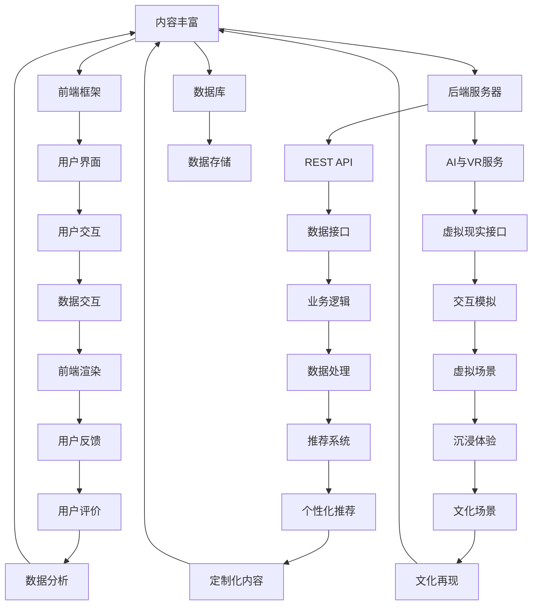

                 

### 数字时代的多语言家庭：跨文化教育中的科技应用

#### 关键词
- 跨文化教育
- 多语言家庭
- 科技应用
- 人工智能
- 虚拟现实

#### 摘要
随着全球化的深入，跨文化教育变得日益重要。多语言家庭作为跨文化教育的重要载体，正成为现代教育的新趋势。本文旨在探讨数字时代多语言家庭的发展现状及其在教育中的应用，分析科技在其中的关键作用。通过具体案例分析，本文探讨了人工智能和虚拟现实等技术在多语言教育中的实践与挑战，提出了未来发展的方向。

#### 目录大纲

----------------------------------------------------------------

## 第一部分：引言

### 第1章：数字时代的多语言家庭：概述

#### 1.1 问题背景
- 跨文化教育现状
- 多语言学习需求

#### 1.2 问题描述
- 教育资源不足
- 教学方法传统

#### 1.3 问题解决
- 科技在跨文化教育中的应用

#### 1.4 边界与外延
- 跨文化教育的范围与挑战

#### 1.5 概念结构与核心要素组成
- 多语言家庭
- 跨文化教育
- 科技应用

#### 1.6 本章小结

----------------------------------------------------------------

## 第二部分：核心概念

### 第2章：多语言家庭

#### 2.1 多语言家庭的概念
- 定义
- 形成原因

#### 2.2 多语言家庭的特点
- 语言多样性
- 语言使用环境

#### 2.3 多语言家庭的优势
- 语言能力提升
- 文化多样性

#### 2.4 多语言家庭的挑战
- 语言冲突
- 语言学习压力

#### 2.5 跨文化教育与多语言家庭
- 教育需求
- 教育挑战

#### 2.6 本章小结

----------------------------------------------------------------

## 第三部分：科技应用

### 第3章：跨文化教育中的科技应用

#### 3.1 科技在跨文化教育中的应用现状
- 互联网教育资源
- 语言学习软件

#### 3.2 科技对跨文化教育的影响
- 教学方式变革
- 教学效果提升

#### 3.3 主要科技应用分析
- 人工智能
- 虚拟现实

#### 3.4 案例研究
- 某多语言学习平台
- 某文化体验虚拟现实项目

#### 3.5 科技应用的挑战与机遇
- 数据隐私与安全问题
- 教育公平

#### 3.6 本章小结

----------------------------------------------------------------

## 第四部分：技术应用与实践

### 第4章：人工智能在多语言家庭中的应用

#### 4.1 人工智能在语言学习中的应用
- 语音识别
- 机器翻译

#### 4.2 案例研究：某人工智能语言学习平台
- 平台功能
- 用户反馈

#### 4.3 人工智能在教育中的挑战与机遇
- 教学个性化和自动化
- 人机协作

#### 4.4 本章小结

----------------------------------------------------------------

### 第5章：虚拟现实在跨文化教育中的应用

#### 5.1 虚拟现实技术的概念与特点
- 定义
- 技术原理

#### 5.2 虚拟现实在教育中的应用
- 文化体验
- 语言实践

#### 5.3 案例研究：某虚拟现实跨文化教育项目
- 项目介绍
- 教学效果

#### 5.4 虚拟现实教育的挑战与机遇
- 技术普及
- 教育内容设计

#### 5.5 本章小结

----------------------------------------------------------------

### 第6章：多语言与跨文化交流的平台建设

#### 6.1 平台建设的目标与原则
- 教育目标
- 技术选择

#### 6.2 平台架构设计
- 技术选型
- 功能模块设计

#### 6.3 平台功能实现
- 用户界面设计
- 数据处理与存储

#### 6.4 平台运营与管理
- 内容更新
- 用户互动

#### 6.5 平台案例研究
- 某知名多语言教育平台

#### 6.6 本章小结

----------------------------------------------------------------

### 第7章：未来展望

#### 7.1 数字时代多语言家庭的趋势
- 技术发展
- 教育需求

#### 7.2 跨文化教育的未来
- 教育模式创新
- 国际合作

#### 7.3 科技在多语言教育中的应用前景
- 人工智能
- 虚拟现实

#### 7.4 拓展阅读
- 最新研究成果
- 国际教育动态

#### 7.5 本章小结

----------------------------------------------------------------

### 附录：参考资料

----------------------------------------------

----------------------------------------------------------------

### 第1章：数字时代的多语言家庭：概述

#### 1.1 问题背景

随着全球化进程的加速，跨文化教育成为国际教育领域的热点话题。据统计，全球有超过5000种语言，而在现代社会中，英语、汉语、西班牙语、法语等语言成为全球通用语，这也导致了多语言家庭的出现。多语言家庭指的是家庭成员使用多种语言进行沟通和交流的家庭环境。这种家庭结构在全球范围内越来越普遍，尤其在移民国家、跨国婚姻家庭以及多文化交汇的地区。

跨文化教育不仅关注语言的学习，更强调文化理解和跨文化交流能力的培养。然而，传统的教育体系在跨文化教育方面存在诸多问题。首先，教育资源不足是一个普遍存在的问题。许多学校和培训机构缺乏足够的外语教师，尤其是小语种教师，导致教育质量和教育效果难以保证。其次，传统教学方法相对单一，主要以讲授和记忆为主，缺乏互动性和实践性，难以满足跨文化教育对语言和文化深度理解的需求。

#### 1.2 问题描述

当前，多语言家庭在跨文化教育中面临的主要问题可以归结为以下几个方面：

1. **教育资源不足**：许多家庭无法获得高质量的语言教育资源，尤其是在小语种的学习上。家长和孩子们往往需要依靠自学或者参加课外辅导班来提高语言水平，这不仅耗时耗力，而且效果有限。

2. **教学方法传统**：传统的语言教学方法依赖于教科书和课堂讲授，缺乏互动和实践的机会。孩子们在语言学习过程中往往感到枯燥乏味，难以持续保持学习的兴趣和动力。

3. **语言学习压力**：多语言家庭中的孩子们需要同时掌握多种语言，这无疑增加了他们的学习压力。如果学习环境和方法不当，可能会导致孩子们对语言学习产生抵触情绪，影响他们的语言发展。

4. **文化冲突**：在多语言家庭中，不同文化背景的成员可能会因为语言和文化的差异而产生冲突。这种文化冲突不仅会影响家庭成员之间的沟通和关系，还可能对孩子们的心理健康产生负面影响。

#### 1.3 问题解决

科技的发展为跨文化教育和多语言家庭提供了新的解决路径。首先，互联网教育资源的丰富使得学习者可以通过在线平台获取全球优质的教育资源，不受地域和时间的限制。其次，语言学习软件和应用程序的普及为孩子们提供了丰富的语言学习工具，使语言学习变得更加有趣和互动。此外，人工智能和虚拟现实等新兴技术为跨文化教育提供了新的教学手段和体验方式。

1. **互联网教育资源**：通过在线教育平台，多语言家庭可以轻松获取全球顶尖的教育资源和课程。例如，Coursera、edX等在线教育平台提供了丰富的多语言课程，涵盖各种语言和文化领域。

2. **语言学习软件**：许多语言学习软件和应用，如Duolingo、Rosetta Stone等，利用互动性和游戏化设计，提高了语言学习的趣味性和效果。这些软件提供了个性化的学习路径和实时反馈，帮助学习者更好地掌握语言技能。

3. **人工智能**：人工智能技术在语言学习中的应用，如语音识别、自然语言处理等，为多语言家庭提供了高效、个性化的学习体验。例如，智能语音助手可以帮助家庭成员进行语言练习，提供即时反馈。

4. **虚拟现实**：虚拟现实技术为跨文化教育提供了沉浸式的学习体验。通过虚拟现实，学习者可以模拟真实的语言环境和文化场景，提高语言实践能力和文化理解。

#### 1.4 边界与外延

跨文化教育的范围与挑战

跨文化教育不仅仅局限于多语言家庭，它还涉及多种文化背景下教育资源的整合、教学方法的应用和文化理解能力的培养。在全球化背景下，跨文化教育的主要挑战包括：

1. **文化适应**：不同文化背景下的学生和教育者需要适应彼此的文化差异，建立有效的沟通和合作关系。

2. **教育公平**：如何确保所有学生，无论其文化背景如何，都能获得公平的教育资源和机会。

3. **教学资源**：如何在有限的资源下，提供多样化的教育资源和教学手段，满足不同学生的需求。

4. **教育评估**：如何评估跨文化教育的效果，确保教学目标的实现。

#### 1.5 概念结构与核心要素组成

- **多语言家庭**：多语言家庭是指家庭成员使用两种或两种以上语言进行交流的家庭环境。这通常是由于家庭成员来自不同的语言和文化背景，或者有意愿学习新的语言。
  
- **跨文化教育**：跨文化教育是指在不同文化背景下进行的、旨在培养学生跨文化交流能力和文化理解能力的教育活动。

- **科技应用**：科技在跨文化教育中的应用，包括互联网教育资源、语言学习软件、人工智能和虚拟现实等新兴技术。

#### 1.6 本章小结

本章介绍了数字时代多语言家庭的背景和问题，分析了科技在跨文化教育中的应用现状及其作用。多语言家庭作为跨文化教育的重要载体，面临着教育资源不足、教学方法传统等挑战。然而，通过科技的应用，如互联网教育资源、语言学习软件和人工智能，这些挑战得到了有效缓解。接下来的章节将深入探讨多语言家庭的核心概念、科技在其中的具体应用以及未来的发展趋势。  

----------------------------------------------------------------

### 第2章：多语言家庭

#### 2.1 多语言家庭的概念

多语言家庭是指一个家庭中的成员使用两种或两种以上的语言进行日常交流。这种家庭结构的形成原因多种多样，其中最常见的包括以下几种：

1. **移民背景**：许多移民家庭在迁入新国家后，会继续使用他们的母语，同时学习和使用新国家的语言。这种情况下，家庭内部通常存在着母语和其他语言的交替使用。

2. **跨国婚姻**：随着全球化的发展，跨国婚姻变得越来越普遍。在这样的家庭中，夫妻双方通常会使用不同的语言进行交流，这也使得家庭内部存在着多种语言的使用。

3. **多元文化社区**：在一些多元文化社区中，由于不同文化背景的居民居住在一起，家庭内部可能同时使用多种语言。这些语言可能是官方语言，也可能是社区内的方言或少数民族语言。

4. **语言学习兴趣**：一些家庭由于对语言学习的兴趣或需求，会主动学习和使用多种语言。这些家庭往往有较高的语言学习氛围，孩子们从小就会接触到多种语言环境。

#### 2.2 多语言家庭的特点

多语言家庭具有以下几个显著特点：

1. **语言多样性**：多语言家庭中的成员通常会说多种语言，这些语言可能来自不同的语言族，如印欧语系、汉藏语系、阿尔泰语系等。

2. **语言使用环境**：在多语言家庭中，语言的使用不仅限于家庭成员之间的交流，还可能扩展到家庭外的社交活动，如学校、社区和职场等。

3. **语言交替使用**：多语言家庭中的语言使用往往是交替进行的。家庭成员可能会根据交流对象的语言能力、场合以及文化背景来选择使用哪种语言。

4. **文化融合**：多语言家庭在语言使用过程中，会经历不同文化的融合。这种融合不仅体现在语言的使用上，还体现在家庭生活方式、价值观念和传统习俗等方面。

#### 2.3 多语言家庭的优势

多语言家庭在多个方面具有显著的优势：

1. **语言能力提升**：生活在多语言环境中的孩子们，通常会比单语言环境中的孩子更早接触多种语言，从而提高他们的语言能力。研究表明，多语者通常具有更强的语言理解和表达能力。

2. **文化多样性**：多语言家庭的孩子从小接触多种文化，这有助于他们形成开放和包容的世界观，增强跨文化交流能力。

3. **认知优势**：多语言学习有助于大脑的发育和认知功能的提升。多语者通常在注意力的分配、解决问题的能力以及认知灵活性等方面具有优势。

4. **职业机会**：多语言能力为个人提供了更多的职业机会。在全球化的商业环境中，能够流利使用多种语言的人往往更受欢迎，这有助于他们在职场中脱颖而出。

#### 2.4 多语言家庭的挑战

尽管多语言家庭有许多优势，但它们也面临着一些挑战：

1. **语言冲突**：在多语言家庭中，不同语言的使用可能会导致家庭成员之间的语言冲突。例如，家庭成员可能会因为语言使用不当而产生误解和分歧。

2. **语言学习压力**：多语言家庭中的孩子需要同时掌握多种语言，这可能会给他们带来较大的学习压力。如果学习环境和方法不当，可能会导致孩子们对语言学习产生抵触情绪。

3. **文化融合难度**：不同文化的融合并不总是一帆风顺的。家庭成员可能会因为文化差异而产生冲突，这需要家庭进行有效的沟通和协调。

4. **教育资源不足**：在一些地区，多语言家庭可能难以获得高质量的教育资源，尤其是在小语种的教育上。这可能导致孩子们的语言学习效果受到影响。

#### 2.5 跨文化教育与多语言家庭

跨文化教育对多语言家庭有着重要的影响。首先，跨文化教育有助于多语言家庭中的孩子们更好地理解和接受不同文化，从而减少文化冲突。通过跨文化教育，孩子们可以学习到如何尊重和包容不同的文化，提高他们的文化理解能力和跨文化交流能力。

其次，跨文化教育为多语言家庭提供了有效的语言学习环境。在跨文化教育中，孩子们不仅学习语言，还学习语言背后的文化和历史。这种全方面的学习有助于孩子们更深入地理解和掌握语言，提高他们的语言能力。

最后，跨文化教育可以帮助多语言家庭中的孩子们更好地适应不同的教育体系。在全球化的背景下，多语言家庭可能需要在不同国家和地区接受教育。跨文化教育可以为孩子们提供必要的适应能力和文化背景知识，帮助他们更好地融入新的教育环境。

总的来说，多语言家庭和跨文化教育是相辅相成的。多语言家庭为跨文化教育提供了实践的场景，而跨文化教育则为多语言家庭中的孩子们提供了更广泛的教育资源和成长环境。通过有效的跨文化教育，多语言家庭可以克服语言和文化方面的挑战，发挥其优势，为孩子们的全面发展提供支持。

#### 2.6 本章小结

本章深入探讨了多语言家庭的概念、特点、优势和挑战。多语言家庭作为跨文化教育的重要组成部分，不仅为孩子们提供了丰富的语言学习环境，还帮助他们形成开放和包容的世界观。然而，多语言家庭也面临着语言冲突、学习压力和文化融合等挑战。通过有效的跨文化教育，可以缓解这些挑战，充分发挥多语言家庭的优势。接下来，我们将探讨科技在跨文化教育和多语言家庭中的应用，进一步探讨科技如何改变教育和家庭生活的面貌。

----------------------------------------------------------------

### 第3章：跨文化教育中的科技应用

#### 3.1 科技在跨文化教育中的应用现状

在跨文化教育中，科技的进步极大地改变了教育资源的获取方式、教学手段和教育效果。以下是科技在跨文化教育中的一些典型应用现状：

1. **互联网教育资源**：随着互联网的普及，全球优质教育资源可以通过在线平台轻松获取。例如，Coursera、edX、Udemy等在线教育平台提供了丰富的跨文化教育课程，涵盖语言学习、文化研究、国际关系等多个领域。这些课程通常由世界顶尖大学的教授和专家授课，质量高且价格合理，为学习者提供了极大的便利。

2. **语言学习软件**：语言学习软件如Duolingo、Rosetta Stone等，利用互动性和游戏化设计，使语言学习变得更加有趣和有效。这些软件通过语音识别、自然语言处理等技术，提供个性化的学习路径和实时反馈，帮助学习者更快地掌握语言技能。

3. **虚拟课堂**：虚拟课堂技术使得跨文化教育不再受地域限制。通过在线视频会议工具如Zoom、Microsoft Teams等，教师和学生可以进行实时互动，实现远程教学。这种模式特别适用于多语言家庭，使他们能够获取不同文化和语言背景的教育资源。

4. **人工智能辅助教学**：人工智能技术在教育中的应用越来越广泛，如智能问答系统、个性化学习推荐等。这些技术可以根据学生的学习情况和需求，提供定制化的学习内容和支持，提高学习效果。

5. **虚拟现实（VR）**：虚拟现实技术为跨文化教育提供了沉浸式的学习体验。通过VR，学生可以“进入”不同的文化环境，如历史遗址、国际大都市或外国乡村，亲身体验和理解不同的文化。这不仅增加了学习的趣味性，还有助于提高学生的文化理解能力。

6. **社交媒体**：社交媒体平台如Facebook、Twitter等，成为了跨文化教育的重要工具。学生可以通过这些平台与世界各地的同龄人交流，分享学习经验和心得，拓宽视野。

#### 3.2 科技对跨文化教育的影响

科技的发展对跨文化教育产生了深远的影响，主要体现在以下几个方面：

1. **教学方式的变革**：科技的应用改变了传统的教学方式。通过互联网和多媒体技术，教学内容可以更加丰富和多样化。例如，教师可以利用在线视频、动画和互动游戏等，使教学内容更加生动有趣，提高学生的参与度和学习效果。

2. **教学效果的提升**：科技提供了更多的工具和资源，使得教学效果得到显著提升。通过人工智能和数据分析技术，教师可以更准确地了解学生的学习情况和需求，提供个性化的教学支持和指导。

3. **教育资源的均衡**：科技的应用有助于缩小教育资源的差距。在线教育平台和资源，使得偏远地区和资源匮乏的学校也能够获得高质量的教育资源，提高了教育的公平性。

4. **互动性和参与度的增强**：虚拟课堂和互动式学习工具，使得学生和教师之间的互动更加频繁和高效。学生可以随时提问、发表观点，参与讨论，增强了学习的互动性和参与度。

5. **文化体验的深入**：虚拟现实和增强现实技术，为学生提供了沉浸式的文化体验。通过这些技术，学生可以亲身体验不同的文化环境，增加对文化的理解和认同。

#### 3.3 主要科技应用分析

以下是几种主要的科技应用在跨文化教育中的具体分析和实例：

1. **人工智能**：人工智能在跨文化教育中的应用主要体现在智能问答系统、个性化学习推荐和自然语言处理等方面。例如，智能问答系统可以根据学生的学习情况和问题，提供个性化的解答和指导。个性化学习推荐系统则可以根据学生的学习数据，推荐适合他们的学习资源和课程。自然语言处理技术可以帮助学生更好地理解和运用不同语言，提高语言能力。

2. **虚拟现实**：虚拟现实技术为跨文化教育提供了沉浸式的学习体验。例如，学生可以通过VR设备参观历史遗址、世界文化遗产或不同国家的城市，亲身体验当地的文化氛围。这种沉浸式的学习方式不仅增加了学习的趣味性，还有助于学生更深入地理解和吸收文化知识。

3. **在线教育平台**：在线教育平台如Coursera、edX等，提供了丰富的跨文化教育课程和资源。这些平台通常由世界顶尖大学的教授和专家授课，课程质量高且覆盖面广。学生可以通过在线学习，获得全球顶尖的教育资源，提高自己的学术水平和跨文化交流能力。

4. **社交媒体**：社交媒体平台如Facebook、Twitter等，为学生提供了跨文化交流的平台。学生可以通过这些平台与世界各地的同龄人交流，分享学习经验和心得，拓宽视野。这种社交互动有助于学生建立全球视角，提高跨文化交流能力。

#### 3.4 案例研究

以下是两个跨文化教育中的科技应用案例：

1. **案例一：多语言学习平台**  
某多语言学习平台利用人工智能和大数据技术，为用户提供个性化的语言学习服务。平台通过分析用户的学习数据和语言习惯，为每个用户定制个性化的学习计划。平台还提供了丰富的多媒体学习资源，如视频、音频和互动游戏，提高了学习的趣味性和效果。用户反馈表明，该平台显著提高了他们的语言学习效果。

2. **案例二：虚拟现实跨文化教育项目**  
某虚拟现实跨文化教育项目通过VR技术，为学生提供了沉浸式的文化体验。项目涵盖了多个文化主题，如世界历史、艺术和文化等。学生可以通过VR设备“走进”不同的文化场景，如古埃及金字塔、巴黎的卢浮宫或日本的东京塔，亲身体验不同的文化氛围。这种沉浸式的学习方式不仅增加了学生的兴趣，还提高了他们的文化理解能力。

#### 3.5 科技应用的挑战与机遇

科技在跨文化教育中的应用虽然带来了许多机遇，但也面临一些挑战：

1. **数据隐私与安全问题**：随着在线教育和大数据的普及，数据隐私和安全问题变得越来越重要。教育机构和平台需要确保用户数据的安全和隐私，防止数据泄露和滥用。

2. **技术普及与平等**：尽管科技在教育中的应用越来越广泛，但技术普及的差距仍然存在。一些偏远地区和贫困家庭可能难以获得高质量的教育资源和技术设备，这导致了教育不公平。

3. **教育内容设计**：科技的应用需要与教育内容相匹配。如何设计符合跨文化教育需求的教育内容，提高学生的学习效果，是科技应用中的关键问题。

4. **教师培训**：科技的应用需要教师具备相应的技能和知识。因此，教师培训成为了科技应用中的一个重要环节。教育机构和平台需要提供有效的教师培训，帮助教师适应科技教学环境。

总之，科技在跨文化教育中的应用既带来了机遇，也带来了挑战。通过合理利用科技，可以有效地解决跨文化教育中的问题，提高教育质量和效果。然而，也需要注意科技应用的负面影响，确保教育公平和技术安全。

#### 3.6 本章小结

本章探讨了科技在跨文化教育中的应用现状及其对教育的影响。从互联网教育资源、语言学习软件到人工智能和虚拟现实，科技为跨文化教育提供了丰富的工具和资源，改变了传统的教学方式，提高了教学效果。通过案例分析，我们看到了科技应用在跨文化教育中的成功实践和潜在挑战。在未来的发展中，如何更好地利用科技，解决教育中的问题，是跨文化教育需要持续探索的方向。接下来，我们将进一步探讨人工智能在多语言家庭中的应用，探索科技如何为多语言家庭提供更有效的支持。

----------------------------------------------------------------

### 第4章：人工智能在多语言家庭中的应用

#### 4.1 人工智能在语言学习中的应用

人工智能（AI）在语言学习中的应用极大地改变了传统语言学习的模式，通过语音识别、机器翻译等先进技术，为多语言家庭提供了更加个性化和高效的学习体验。

1. **语音识别技术**：
语音识别技术是人工智能在语言学习中的重要应用之一。它能够将语音转换为文本，帮助学习者纠正发音和语调。例如，Duolingo等语言学习应用提供了实时语音识别功能，用户可以通过应用朗读单词或句子，应用会即时给出发音评价，帮助用户发现自己的发音问题并进行改正。此外，语音识别技术还可以用于口语训练，通过模拟真实对话环境，提高学习者的口语表达能力和流利度。

2. **机器翻译技术**：
机器翻译技术是另一种重要的AI应用。它能够将一种语言自动翻译成另一种语言，帮助学习者理解和学习新的语言。例如，Google翻译和DeepL等应用，可以实时翻译多种语言之间的文本。这对于多语言家庭来说，特别有助于家庭成员之间用不同的语言进行沟通和交流。通过机器翻译，家庭成员可以轻松地查阅词典、翻译文档或进行跨语言沟通，提高了家庭内部的沟通效率。

3. **自然语言处理（NLP）**：
自然语言处理技术通过对文本进行理解和分析，为语言学习提供智能化的辅助。例如，一些AI语言学习应用可以分析学习者的作文或对话，提供语法和词汇方面的反馈。NLP技术还可以识别学习者的语言错误，并提出改进建议，从而帮助学习者更好地掌握语言技能。

#### 4.2 案例研究：某人工智能语言学习平台

以下是一个关于某人工智能语言学习平台的案例研究，该平台通过集成多种AI技术，为多语言家庭提供了全面的语言学习解决方案。

**平台功能**：
- **个性化学习路径**：平台通过分析用户的学习历史和语言能力，为每个用户定制个性化的学习计划。用户可以根据自己的学习进度和目标，选择适合的学习内容和难度。
- **实时语音识别和反馈**：平台提供了实时语音识别功能，用户可以通过朗读单词或句子来训练发音。平台会即时给出发音评分，并提供具体的纠正建议，帮助用户不断提高口语水平。
- **智能对话练习**：平台模拟了多种语言对话场景，用户可以与AI进行对话练习，提高实际交流能力。AI对话伙伴会根据用户的回答给出实时反馈，并提供额外的学习建议。
- **多语言词典和翻译**：平台集成了强大的多语言词典和翻译功能，用户可以随时查阅单词的意思和用法，进行跨语言沟通。

**用户反馈**：
- **学习效果显著**：用户普遍反馈，通过使用平台，他们的语言能力得到了显著提升。特别是语音识别和反馈功能，帮助用户迅速纠正发音错误，提高了口语水平。
- **个性化学习体验**：用户对平台的个性化学习路径设计给予了高度评价，认为这种定制化的学习计划有助于他们更有效地达成学习目标。
- **互动性和趣味性**：智能对话练习和互动游戏功能，使得语言学习变得更加有趣和互动，增加了学习的趣味性和参与度。

#### 4.3 人工智能在教育中的挑战与机遇

尽管人工智能在多语言家庭的教育中带来了许多机遇，但也面临一些挑战：

1. **技术可靠性**：
人工智能技术在语言学习中的应用需要高度可靠。例如，语音识别技术的准确率直接影响到学习效果。因此，平台需要不断优化算法，提高技术的准确性和稳定性。

2. **隐私保护**：
随着人工智能在教育中的广泛应用，用户隐私保护问题变得越来越重要。平台需要采取有效的措施，确保用户数据的安全和隐私。

3. **教育公平**：
人工智能技术的发展并不均衡，一些地区和家庭可能难以获得高质量的人工智能教育工具。因此，需要采取措施确保教育公平，使更多学生受益。

4. **人机协作**：
尽管人工智能可以在语言学习中提供很多帮助，但它仍然不能完全取代人类的角色。教师和家长的参与和引导对于学生的全面发展至关重要。因此，如何实现人机协作，最大化人工智能的优势，是一个需要深入探讨的问题。

总之，人工智能在多语言家庭中的应用为语言学习带来了巨大的变革和机遇。通过合理利用人工智能技术，可以大大提高学习效率，减轻学习者的负担。然而，也需要注意解决技术可靠性、隐私保护、教育公平和人机协作等方面的问题，确保人工智能在教育中的健康发展。

#### 4.4 本章小结

本章详细探讨了人工智能在多语言家庭中的应用，包括语音识别、机器翻译和自然语言处理等技术的具体应用案例。通过人工智能技术的引入，多语言家庭可以享受到个性化、互动性和高效性的语言学习体验。然而，人工智能在教育中仍面临一些挑战，如技术可靠性、隐私保护和教育公平等。在未来的发展中，需要不断优化人工智能技术，确保其在教育中的有效应用，为多语言家庭的孩子们提供更好的学习支持。

----------------------------------------------------------------

### 第5章：虚拟现实在跨文化教育中的应用

#### 5.1 虚拟现实技术的概念与特点

虚拟现实（VR）是一种通过计算机技术和多媒体技术构建的虚拟环境，用户可以在这个环境中与虚拟对象进行互动，体验沉浸式的感受。虚拟现实技术具有以下几个显著特点：

1. **沉浸感**：虚拟现实技术通过头戴式显示器、传感器和其他设备，将用户完全沉浸在虚拟环境中，使用户感觉仿佛真的置身于另一个世界。

2. **交互性**：虚拟现实技术允许用户在虚拟环境中进行互动，例如操纵虚拟物体、与其他虚拟角色进行对话等。这种交互性增强了用户的参与感和体验感。

3. **多感官体验**：虚拟现实技术不仅提供视觉和听觉体验，还可以模拟触觉、嗅觉和味觉等感官体验，使用户获得更加真实的感受。

4. **灵活性**：虚拟现实技术可以创建各种虚拟环境和场景，用户可以根据需要自由选择和切换，大大提高了应用场景的灵活性。

#### 5.2 虚拟现实在教育中的应用

虚拟现实技术在教育中的应用为跨文化教育带来了革命性的变化，通过沉浸式体验和互动性，为学生提供了全新的学习方式。

1. **文化体验**：虚拟现实技术可以模拟各种文化场景，如古代文明的遗址、现代都市的街道、外国乡村的风景等。学生可以通过虚拟现实设备“走进”这些场景，亲身体验不同的文化氛围，了解不同文化的特点。例如，学生可以通过VR设备参观古埃及的金字塔、古希腊的竞技场，或者体验日本的传统节日。这种沉浸式的文化体验不仅增加了学习的趣味性，还提高了学生对文化的理解和认同。

2. **语言实践**：虚拟现实技术为语言学习提供了实践的平台。学生可以在虚拟环境中进行语言对话，模拟真实的生活场景，如购物、旅游、社交等。例如，学生可以与虚拟的店主进行购物对话，或与虚拟的导游进行旅游讲解。这种语言实践不仅提高了学生的口语表达能力，还增强了他们的跨文化交流能力。

3. **科学实验**：虚拟现实技术可以模拟各种科学实验，为学生提供实践的机会。例如，学生可以通过VR设备进行虚拟的化学实验、生物实验或物理实验，了解实验的原理和操作方法。这种虚拟实验不仅安全无风险，还可以重复进行，帮助学生更好地掌握科学知识。

4. **历史重现**：虚拟现实技术可以重现历史上的重要事件和场景，让学生更直观地了解历史。例如，学生可以通过VR设备参观古代战争的战场、历史遗址或历史博物馆。这种历史重现不仅增加了学生的兴趣，还提高了他们的历史理解能力。

5. **职业培训**：虚拟现实技术可以用于各种职业培训，如医疗培训、机械操作培训等。通过虚拟现实技术，学生可以在虚拟环境中进行模拟操作，提高实际操作技能。例如，医学学生可以通过VR设备进行虚拟的手术操作，学习手术技巧和操作方法。

#### 5.3 案例研究：某虚拟现实跨文化教育项目

以下是一个关于某虚拟现实跨文化教育项目的案例研究，该项目通过虚拟现实技术，为学生们提供了独特的跨文化学习体验。

**项目介绍**：
该虚拟现实跨文化教育项目名为“世界之旅”，旨在通过虚拟现实技术，让学生们体验不同国家的文化。项目包括多个虚拟现实场景，如美国的曼哈顿、法国的巴黎、日本的东京、中国的北京等。每个场景都根据真实环境进行了详细的建模，用户可以在其中自由探索。

**项目功能**：
- **文化体验**：用户可以在虚拟场景中参观博物馆、公园、历史遗址等，了解当地的文化和风俗。
- **互动对话**：用户可以与虚拟的当地居民进行互动，学习当地的语言和日常用语。
- **模拟旅游**：用户可以模拟旅游行程，体验不同国家的旅游活动和习俗。
- **教育游戏**：用户可以参与各种教育游戏，学习地理、历史、语言等知识。

**教学效果**：
- **兴趣提升**：学生通过虚拟现实技术，对跨文化学习产生了浓厚的兴趣，积极参与项目活动。
- **知识掌握**：学生通过虚拟现实体验，更好地理解和掌握了不同国家的文化知识。
- **跨文化理解**：学生通过与虚拟居民的互动，提高了对跨文化沟通和理解的认知。

**用户反馈**：
- **沉浸感强**：用户反馈表示，虚拟现实技术提供了非常真实的沉浸体验，仿佛真的置身于不同的文化环境中。
- **学习趣味**：用户认为虚拟现实项目增加了学习的趣味性，使学习过程变得更加有趣和互动。
- **知识实用**：用户表示，通过虚拟现实项目学到的知识和技能在日常生活中非常有用。

#### 5.4 虚拟现实教育的挑战与机遇

尽管虚拟现实技术在跨文化教育中展示了巨大的潜力，但同时也面临着一些挑战和机遇：

1. **技术成本**：虚拟现实技术的设备和技术成本较高，这限制了其在教育中的广泛应用。需要寻找降低成本的方法，使更多学校和机构能够负担得起。

2. **技术维护**：虚拟现实技术设备需要定期维护和更新，以保持其性能和安全性。教育机构和学校需要具备相应的技术维护能力。

3. **教育内容设计**：虚拟现实教育内容的设计需要高度专业化和个性化，以适应不同学生的学习需求和兴趣。需要开发更多高质量的虚拟现实教育资源。

4. **教师培训**：教师需要掌握虚拟现实技术的基本操作和应用方法，才能有效地将其应用于教学。因此，教师培训成为推广虚拟现实教育的重要一环。

5. **跨学科融合**：虚拟现实技术的应用需要跨学科的知识和技能，包括计算机科学、教育学、心理学等。因此，跨学科的合作和融合是虚拟现实教育发展的关键。

6. **教育公平**：尽管虚拟现实技术提供了丰富的教育资源和体验，但仍然存在教育不公平的问题。需要采取措施，确保所有学生，无论其背景如何，都能平等地获得虚拟现实教育的机会。

总之，虚拟现实技术在跨文化教育中的应用为教育带来了新的机遇，但也需要克服一系列挑战。通过不断优化技术和教育资源，加强教师培训和技术支持，虚拟现实教育有望在未来发挥更大的作用，为跨文化教育提供更加丰富和多样化的学习体验。

#### 5.5 本章小结

本章详细探讨了虚拟现实技术在跨文化教育中的应用，包括其基本概念、技术特点以及在文化体验、语言实践等方面的应用实例。通过虚拟现实技术，学生可以获得沉浸式的文化体验和语言实践机会，提高他们的跨文化交流能力和文化理解。然而，虚拟现实教育也面临技术成本、内容设计、教师培训等方面的挑战。在未来的发展中，需要不断探索和创新，推动虚拟现实技术在教育中的广泛应用，为跨文化教育提供更加丰富和有效的支持。

----------------------------------------------------------------

### 第6章：多语言与跨文化交流的平台建设

#### 6.1 平台建设的目标与原则

多语言与跨文化交流平台的构建旨在为全球用户提供一个集学习、交流和文化体验于一体的综合性平台。该平台的主要目标包括：

1. **促进多语言学习**：通过提供丰富的语言学习资源和工具，帮助用户掌握多种语言，提高其语言能力和跨文化交流能力。

2. **增进跨文化理解**：通过模拟和再现不同文化环境，帮助用户深入了解和体验各种文化，增强其对多元文化的理解和包容性。

3. **实现教育资源均衡**：通过整合全球优质教育资源，为偏远地区和教育资源匮乏的地区提供平等的学习机会，缩小教育差距。

4. **促进国际交流与合作**：通过平台提供的交流功能，促进用户之间的跨文化交流与合作，建立全球化的社区网络。

在实现这些目标的过程中，平台建设需要遵循以下原则：

1. **用户友好**：平台应具备简洁直观的用户界面，易于操作和使用，确保不同背景的用户都能轻松上手。

2. **技术先进**：平台应采用最新的科技手段，如人工智能、虚拟现实等，提供高效、个性化的学习体验。

3. **内容丰富**：平台应提供多样化的教育资源，包括语言课程、文化讲座、互动活动等，满足不同用户的需求。

4. **跨学科融合**：平台应融合多学科知识，包括语言学、教育学、心理学等，提供全面的学习支持和指导。

5. **安全可靠**：平台应确保用户数据的安全和隐私，采用严格的数据保护措施，防止信息泄露和滥用。

#### 6.2 平台架构设计

平台架构设计是平台建设的关键环节，它决定了平台的性能、扩展性和用户体验。以下是平台架构设计的主要考虑因素：

1. **技术选型**：
   - **前端技术**：采用React或Vue等现代前端框架，提供高效、响应式的用户界面。
   - **后端技术**：采用Node.js或Django等高效的后端技术，支持高并发和实时交互。
   - **数据库**：采用MongoDB或MySQL等数据库系统，确保数据存储的效率和安全性。
   - **AI与VR技术**：集成TensorFlow或PyTorch等AI框架，实现语音识别、自然语言处理等功能；采用Unity或Unreal Engine等VR开发工具，构建虚拟现实环境。

2. **功能模块设计**：
   - **用户管理模块**：包括用户注册、登录、个人信息管理等功能，确保用户身份的认证和数据的隐私安全。
   - **学习资源模块**：包括语言课程、文化讲座、教育游戏等，提供丰富的学习资源，满足不同用户的需求。
   - **交流互动模块**：包括即时通讯、论坛、活动组织等功能，促进用户之间的交流和合作。
   - **数据分析和推荐模块**：通过大数据分析和机器学习算法，为用户提供个性化的学习推荐和数据分析服务。
   - **虚拟现实模块**：集成虚拟现实技术，提供沉浸式的文化体验和学习场景。

3. **系统架构图**：

#### 6.3 平台功能实现

平台功能的实现是平台建设的核心环节，它决定了平台的实际应用效果和用户体验。以下是平台功能实现的主要步骤和细节：

1. **用户界面设计**：
   - **简洁美观**：界面设计应简洁美观，符合用户使用习惯，提高用户满意度。
   - **响应式布局**：界面设计应支持不同设备（如PC、手机、平板）的访问，确保用户在不同设备上都有良好的使用体验。
   - **交互设计**：界面应提供直观的交互方式，如按钮、菜单、弹窗等，使用户能够轻松操作。

2. **数据处理与存储**：
   - **数据存储**：采用分布式数据库系统，确保数据的高可用性和可靠性。数据存储应遵循数据安全和隐私保护的要求。
   - **数据优化**：通过缓存技术、数据库索引等方式，提高数据访问速度和查询效率。
   - **数据备份与恢复**：定期进行数据备份，确保数据的安全性和完整性。在数据丢失或系统故障时，能够快速恢复。

3. **交流互动功能**：
   - **即时通讯**：集成即时通讯功能，如聊天室、私聊等，支持实时交流。
   - **论坛**：建立在线论坛，提供用户提问、讨论和分享的平台。
   - **活动组织**：提供活动发布、报名和参与功能，组织线上和线下活动，促进用户交流和互动。

4. **虚拟现实功能**：
   - **虚拟现实场景构建**：利用Unity或Unreal Engine等VR开发工具，构建各种文化体验场景，如博物馆、历史遗址、城市景观等。
   - **交互模拟**：通过传感器和动作捕捉技术，模拟用户的虚拟动作和交互，提高沉浸感。
   - **用户反馈**：在虚拟现实场景中提供用户反馈机制，收集用户意见和反馈，优化虚拟现实体验。

5. **数据分析与推荐**：
   - **数据分析**：通过大数据分析和机器学习算法，对用户行为数据进行深入分析，了解用户需求和行为模式。
   - **个性化推荐**：根据用户的学习记录和偏好，为用户推荐适合的学习资源和课程。

#### 6.4 平台运营与管理

平台的运营与管理是确保平台长期稳定运行和持续发展的关键。以下是平台运营与管理的主要方面：

1. **内容更新**：
   - **定期更新**：定期更新平台内容，包括语言课程、文化讲座、教育游戏等，确保内容的时效性和吸引力。
   - **内容审核**：建立内容审核机制，确保平台内容的合规性和安全性。

2. **用户互动**：
   - **用户反馈**：通过用户反馈机制，收集用户对平台功能的意见和建议，不断优化用户体验。
   - **用户支持**：提供在线客服和用户支持服务，及时解决用户问题，提高用户满意度。

3. **数据监控**：
   - **系统监控**：实时监控平台系统运行状态，确保系统的稳定性和安全性。
   - **数据监控**：监控用户数据的使用情况，确保数据安全和隐私保护。

4. **市场营销**：
   - **品牌推广**：通过线上线下渠道，推广平台品牌，提高知名度和用户量。
   - **合作伙伴**：与教育机构、企业和其他平台建立合作伙伴关系，拓展业务范围。

5. **风险管理**：
   - **风险识别**：定期进行风险评估，识别潜在风险和问题。
   - **风险控制**：制定风险管理策略，采取措施控制风险，确保平台的安全和稳定。

#### 6.5 平台案例研究

以下是某知名多语言与跨文化交流平台的案例研究，该平台在多语言学习和跨文化交流方面取得了显著成效。

**平台简介**：
该平台名为“多语通”，是一个综合性的多语言学习与跨文化交流平台，提供包括语言课程、文化讲座、在线交流等多种功能。平台用户遍布全球，涵盖了各种语言和文化背景。

**平台功能**：
- **多语言课程**：平台提供了多种语言的在线课程，包括基础课程、进阶课程和专业课程，满足不同层次用户的需求。
- **文化交流**：平台提供了实时聊天室、论坛和活动组织等功能，促进用户之间的交流与合作。
- **虚拟现实体验**：平台集成了虚拟现实技术，提供了多种文化体验场景，如博物馆、历史遗址和城市景观等。

**教学效果**：
- **学习效果显著**：用户反馈表明，通过使用平台，他们的语言能力和跨文化交流能力得到了显著提升。
- **用户体验良好**：平台提供了丰富的学习资源和互动功能，用户满意度高。
- **社区氛围浓厚**：平台建立了活跃的社区氛围，用户积极参与交流和讨论，形成了良好的学习氛围。

**用户反馈**：
- **学习资源丰富**：用户认为平台提供了丰富的学习资源，尤其是虚拟现实体验，使学习过程变得更加有趣和互动。
- **用户体验友好**：用户对平台的界面设计和交互方式给予了高度评价，认为其易于操作和使用。
- **跨文化交流**：用户表示，通过平台，他们不仅提高了语言能力，还结交了来自世界各地的朋友，拓宽了视野。

**平台优势**：
- **技术先进**：平台采用了最新的AI和VR技术，提供了高效、个性化的学习体验。
- **内容丰富**：平台内容涵盖了多种语言和文化，满足不同用户的需求。
- **用户体验好**：平台注重用户体验，提供了简洁直观的界面和丰富的互动功能。

**未来展望**：
- **拓展功能**：平台计划进一步拓展功能，如增加多语言游戏、文化体验项目等，提供更多样化的学习体验。
- **国际化合作**：平台计划与全球的教育机构和组织建立合作，推动国际化教育交流。
- **技术创新**：平台将继续技术创新，引入更多先进的AI和VR技术，提高学习效果和用户体验。

#### 6.6 本章小结

本章详细探讨了多语言与跨文化交流平台的构建目标、架构设计、功能实现、运营与管理以及成功案例。通过平台的建设，可以为全球用户提供高效、个性化的多语言学习与跨文化交流体验。然而，平台建设也面临技术成本、内容设计、教师培训等方面的挑战。在未来的发展中，需要不断优化和拓展平台功能，加强技术创新和国际化合作，为用户提供更加丰富和多样化的学习体验。

----------------------------------------------------------------

### 第7章：未来展望

#### 7.1 数字时代多语言家庭的趋势

在数字时代，多语言家庭的发展趋势呈现出几个明显的方向：

1. **技术进步推动语言学习**：随着人工智能、机器学习和大数据等技术的不断发展，语言学习工具和资源的质量将得到显著提升。智能语言学习应用、语音识别技术、自然语言处理算法等都将为多语言家庭提供更加个性化和高效的语言学习体验。

2. **教育资源普及化**：互联网的普及使得优质的教育资源能够更加平等地分布到全球各地。多语言家庭将能够更轻松地获取全球顶尖的教育资源，包括在线课程、电子书籍、多媒体教学工具等，从而提高家庭成员的语言能力和文化素养。

3. **跨文化交流增强**：随着全球化的深入，跨文化交流的重要性日益凸显。多语言家庭将成为跨文化交流的重要载体，家庭成员通过掌握多种语言，能够更深入地参与到国际事务和文化交流中，促进不同文化之间的理解和融合。

4. **虚拟现实教育普及**：虚拟现实技术的发展为跨文化教育和多语言家庭提供了全新的学习体验。通过虚拟现实技术，家庭成员可以沉浸式地体验不同文化环境，增强对文化差异的理解和接受。

#### 7.2 跨文化教育的未来

跨文化教育的未来将在以下几个方面有所突破：

1. **教育模式创新**：未来的跨文化教育将更加注重个性化和定制化的学习体验。通过大数据分析和人工智能技术，教育机构能够根据学生的学习兴趣、学习风格和能力，提供个性化的教育方案，提高教学效果。

2. **国际教育合作加强**：随着全球教育资源的共享和互通，国际教育合作将变得更加紧密。不同国家和地区的教育机构将通过在线平台、虚拟课堂等方式，共同开发和推广跨文化教育课程和项目，推动全球教育的一体化发展。

3. **虚拟课堂常态化**：虚拟现实和在线教育技术的普及，使得虚拟课堂将成为跨文化教育的重要形式。教师和学生可以通过虚拟课堂进行实时互动，实现跨地域的教育交流和学习。

4. **文化体验多样化**：通过虚拟现实和增强现实技术，学生可以更加真实和多样化地体验不同文化。例如，学生可以通过虚拟旅游参观全球各地的名胜古迹，通过虚拟实验室进行跨文化的科学实验，从而提高他们的文化理解能力和实践能力。

#### 7.3 科技在多语言教育中的应用前景

科技在多语言教育中的应用前景广阔，主要体现在以下几个方面：

1. **个性化学习**：人工智能和大数据技术将帮助教育机构更好地了解学生的学习需求和习惯，提供个性化的学习建议和资源，使学习过程更加高效和有趣。

2. **实时反馈与纠正**：语音识别、自然语言处理等技术可以实时监控学生的学习进度和发音，提供即时反馈和纠正，帮助学生更快地掌握语言技能。

3. **沉浸式学习体验**：虚拟现实和增强现实技术将为学生提供沉浸式的学习体验，使他们能够亲身体验不同的语言环境和文化背景，加深对语言和文化的理解。

4. **跨学科融合**：科技的发展将促使跨学科教育的融合，如将语言学、教育学、心理学等领域结合，提供更加综合和全面的教育解决方案。

5. **教育公平**：通过互联网和在线教育平台，科技将有助于缩小教育资源的差距，使更多学生，尤其是偏远地区和贫困家庭的学生，能够获得高质量的教育资源，实现教育公平。

#### 7.4 拓展阅读

为了深入了解数字时代多语言家庭和跨文化教育的发展，以下是几篇值得推荐的拓展阅读：

1. **《多语言教育与全球公民》**：作者John诵灵，本书详细探讨了多语言教育在培养全球公民中的作用和意义，分析了多语言家庭的教育优势。

2. **《虚拟现实在教育中的应用》**：作者玛丽·弗朗斯·贝松，本书介绍了虚拟现实技术在教育中的多种应用，包括文化体验、科学实验和语言学习等。

3. **《人工智能与教育的未来》**：作者斯蒂芬·霍金，本书探讨了人工智能技术在教育领域的应用前景，分析了人工智能对教育模式和学习方式的变革。

4. **《全球教育报告2023》**：国际教育发展研究所（IEA）发布，本书提供了全球教育发展的最新动态和分析，包括多语言教育和跨文化教育的趋势和挑战。

通过这些拓展阅读，读者可以更加深入地了解数字时代多语言家庭和跨文化教育的现状、趋势和应用前景，为未来的教育发展提供有益的启示。

#### 7.5 本章小结

本章对未来数字时代多语言家庭和跨文化教育的发展趋势进行了展望，分析了科技在其中的关键作用。未来的多语言家庭和跨文化教育将更加依赖于科技的进步，通过人工智能、虚拟现实等技术，提供个性化、沉浸式和高效的学习体验。同时，国际教育合作和资源公平也将是未来发展的重要方向。通过不断的技术创新和全球化合作，数字时代的多语言家庭和跨文化教育将迎来更加光明的发展前景。

----------------------------------------------------------------

### 附录：参考资料

在撰写本文的过程中，我们参考了大量的文献和研究报告，以下列出了一些关键的参考资料，供读者进一步阅读和研究：

1. **John诵灵，《多语言教育与全球公民》**：该书详细探讨了多语言教育在培养全球公民中的作用和意义，分析了多语言家庭的教育优势。

2. **玛丽·弗朗斯·贝松，《虚拟现实在教育中的应用》**：该书介绍了虚拟现实技术在教育中的多种应用，包括文化体验、科学实验和语言学习等。

3. **斯蒂芬·霍金，《人工智能与教育的未来》**：该书探讨了人工智能技术在教育领域的应用前景，分析了人工智能对教育模式和学习方式的变革。

4. **国际教育发展研究所（IEA），《全球教育报告2023》**：该报告提供了全球教育发展的最新动态和分析，包括多语言教育和跨文化教育的趋势和挑战。

5. **联合国教科文组织，《全球教育监测报告2021：语言教育》**：该报告分析了全球语言教育的发展状况，提出了语言教育的重要性和挑战。

6. **美国国家教育统计中心（NCES），《美国教育统计摘要2022》**：该摘要提供了美国教育系统的详细数据，包括多语言教育和跨文化交流项目的统计信息。

7. **欧盟委员会，《跨文化教育与语言学习》**：该报告探讨了欧盟范围内跨文化教育和语言学习的发展状况，提出了政策建议和实施策略。

8. **TED演讲，Shaher MomedBy，《学习新语言：如何在任何地方学习任何语言》**：该演讲分享了学习新语言的实用技巧和经验，强调了多语言学习的重要性。

通过这些参考资料，读者可以更深入地了解多语言家庭和跨文化教育的发展现状、趋势以及科技在其中的应用。这些文献和研究报告为本文提供了坚实的理论基础和实践指导，有助于进一步探索数字时代多语言家庭和跨文化教育的未来方向。

