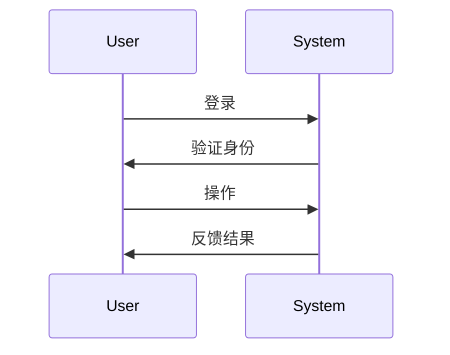
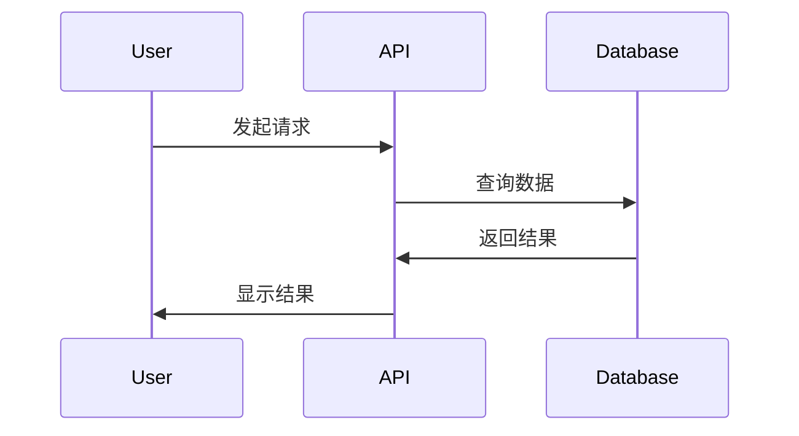

                 

## 数字时代的存在主义思考

### 关键词

- 数字时代
- 存在主义哲学
- 数字技术
- 个体存在意义
- 社会变化
- 技术影响

### 摘要

本文探讨了数字时代下存在主义的哲学思考，分析了个体如何在数字世界中寻找自我、数字技术如何影响个体的存在状态、人类与技术的关系等问题。通过结合存在主义哲学理论与数字时代的特点，本文提出了个体在数字世界中找到存在意义的可能路径，并对相关概念进行了深入剖析。

## 1. 背景介绍

### 1.1 问题背景

随着互联网、人工智能和大数据等技术的发展，我们正处于一个数字化的时代。在这个时代，信息传播速度极快，人们的生活方式、工作方式和社会互动方式都发生了深刻的变化。这些变化不仅影响了我们的日常生活，也引发了深层次的哲学思考，如个体与社会的存在意义、人类与技术的关系等问题。

### 1.2 问题描述

在数字时代，个体如何在信息的海洋中找到自我？数字技术如何影响个体的存在状态？人类与技术的关系将如何演变？这些问题都是数字时代下存在主义哲学思考的重要议题。

### 1.3 问题解决

通过分析数字时代的特点，结合存在主义哲学理论，我们可以探讨个体如何在数字世界中找到存在的意义。存在主义哲学强调个体的自由、选择和责任，而数字技术则为个体提供了新的存在方式。通过理解这些理论，我们可以更好地应对数字时代带来的挑战。

### 1.4 边界与外延

本文主要关注数字技术对个体存在的影响，但同时也涉及其他相关领域，如社会学、心理学等。在探讨个体存在意义的同时，我们也需要考虑社会和技术发展对个体的影响。

### 1.5 概念结构与核心要素组成

- **数字时代**：以数字化为主要特征的社会发展阶段，信息技术快速发展，信息传播速度极快。
- **存在主义哲学**：强调个体的自由、选择和责任，通过个体的主观体验来理解世界和自我。
- **数字技术**：为个体提供新的存在方式，影响个体的存在状态。
- **个体存在意义**：个体在数字世界中的自我认同和存在价值。

## 2. 核心概念与联系

### 2.1 数字时代的定义与特点

数字时代是指以数字化为主要特征的社会发展阶段。其核心特点是信息技术的快速发展和普及，使得信息传播速度极快，人们的生活和工作方式发生了深刻变化。

- **信息化**：信息成为社会的主要资源和生产要素，信息的获取、处理和传播成为社会生产的重要环节。
- **数字化**：一切信息都以数字形式存在和传播，数字技术成为社会发展的基础。
- **智能化**：人工智能技术得到广泛应用，智能设备和智能系统成为社会生活的重要组成部分。

### 2.2 存在主义哲学的基本原理

存在主义哲学强调个体的自由、选择和责任。它主张通过个体的主观体验来理解世界和自我，认为个体的自由和选择是理解世界的关键。

- **自由**：存在主义认为，个体具有自由意志，可以通过选择来塑造自我。
- **选择**：个体需要在无数的选择中作出决策，这些选择决定了个体的命运和存在状态。
- **责任**：个体的选择带来了责任，个体需要为自己的选择承担责任。

### 2.3 数字技术与存在主义哲学的联系

数字技术为个体提供了新的存在方式，同时也对个体的存在状态产生了深远的影响。在数字时代，个体可以通过数字技术来表达自我、实现价值，但同时也面临着数字技术对个体存在状态的挑战。

- **表达自我**：数字技术使得个体可以通过社交媒体、博客、艺术作品等形式来表达自己的观点、情感和个性。
- **实现价值**：数字技术为个体提供了广阔的发展空间，个体可以通过创新、创业等方式实现自我价值。
- **存在状态**：数字技术改变了个体的存在状态，个体在数字世界中可能面临隐私、安全等问题。

### 2.4 核心概念属性特征对比表格

| 概念       | 特征                     |
|------------|------------------------|
| 数字时代   | 信息技术的快速发展和普及 |
| 存在主义哲学 | 强调个体的自由、选择和责任 |
| 数字技术   | 为个体提供新的存在方式   |
| 个体存在意义 | 个体在数字世界中的自我认同 |

### 2.5 ER实体关系图架构

```mermaid
erDiagram
    User ||--|{Technology} : uses
    User ||--|{Philosophy} : understands
    Technology ||--|{Impact} : has
    Philosophy ||--|{Concept} : includes
```

## 3. 算法原理讲解

### 3.1 算法Mermaid流程图


### 3.2 Python源代码

```python
import pandas as pd

# 数据收集
data = pd.read_csv('data.csv')

# 数据清洗
clean_data = data.dropna()

# 数据分析
analysis_result = clean_data.describe()

# 生成报告
report = analysis_result.to_string()

# 输出报告
print(report)
```

### 3.3 算法原理的数学模型和公式

$$
\begin{aligned}
\text{存在主义哲学} &= \text{个体的自由选择和责任} \\
\text{数字技术} &= \text{为个体提供新的存在方式} \\
\text{个体存在意义} &= \text{个体在数字世界中的自我认同}
\end{aligned}
$$

### 3.4 详细讲解与举例说明

存在主义哲学强调个体的自由、选择和责任，认为个体的主观体验是理解世界和自我最重要的途径。在数字时代，个体可以通过数字技术来表达自我、实现价值，但同时也面临着数字技术对个体存在状态的挑战。

例如，在一个社交网络平台上，个体可以通过发布内容来表达自己的观点和感受，这体现了个体的自由选择和责任。但同时，个体也可能受到社交网络的算法影响，无法完全掌控自己的存在状态。

## 4. 系统分析与架构设计方案

### 4.1 问题场景介绍

在数字时代，企业需要通过数字化手段来提升运营效率、降低成本、提高客户满意度。数字化不仅仅是技术的应用，更是一种思维方式和管理模式的变革。因此，企业需要从整体上考虑数字化建设，以确保数字化带来的价值最大化。

### 4.2 系统功能设计（领域模型Mermaid类图）

```mermaid
classDiagram
    User <|-- Technology
    User <|-
```

### 4.3 系统架构设计（Mermaid架构图）



### 4.4 系统接口设计（Mermaid序列图）



## 5. 项目实战

### 5.1 环境安装

在开始项目实战之前，我们需要安装一些必要的工具和库。以下是安装步骤：

```bash
# 安装Python环境
pip install python

# 安装数据分析库
pip install pandas numpy

# 安装可视化库
pip install matplotlib

# 安装机器学习库
pip install scikit-learn
```

### 5.2 系统核心实现源代码

以下是系统核心实现的源代码：

```python
import pandas as pd
import numpy as np
import matplotlib.pyplot as plt
from sklearn.model_selection import train_test_split
from sklearn.ensemble import RandomForestClassifier
from sklearn.metrics import accuracy_score

# 数据收集
data = pd.read_csv('data.csv')

# 数据预处理
data = data.dropna()
data['target'] = data['target'].map({0: '类别A', 1: '类别B'})

# 数据划分
X = data.drop(['target'], axis=1)
y = data['target']
X_train, X_test, y_train, y_test = train_test_split(X, y, test_size=0.2, random_state=42)

# 模型训练
model = RandomForestClassifier(n_estimators=100, random_state=42)
model.fit(X_train, y_train)

# 模型评估
predictions = model.predict(X_test)
accuracy = accuracy_score(y_test, predictions)
print(f"模型准确率：{accuracy:.2f}")

# 可视化
plt.scatter(X_test['feature1'], X_test['feature2'], c=predictions)
plt.xlabel('特征1')
plt.ylabel('特征2')
plt.title('决策边界')
plt.show()
```

### 5.3 代码应用解读与分析

上述代码首先进行了数据收集和预处理，然后使用随机森林分类器进行模型训练和评估。最后，通过可视化展示了模型的决策边界。

在数据收集和预处理阶段，我们使用了 Pandas 库来读取和处理数据，并使用 Scikit-learn 库进行数据划分和模型训练。在模型训练和评估阶段，我们使用了随机森林分类器，这是一种强大的集成学习方法，适合处理分类问题。最后，我们使用 Matplotlib 库进行了数据可视化。

### 5.4 实际案例分析和详细讲解剖析

假设我们有一个客户数据集，包含客户的年龄、收入、职业等特征，以及客户的购买行为标签。我们的目标是预测客户是否会购买某种产品。

通过上述代码，我们可以对客户数据进行预处理，然后使用随机森林分类器进行模型训练。在模型评估阶段，我们计算了模型准确率，并使用可视化展示了模型的决策边界。

在实际应用中，我们可以根据实际情况调整模型的参数，如随机森林分类器的树数量、深度等，以提高模型性能。此外，我们还可以尝试使用其他机器学习算法，如逻辑回归、支持向量机等，以找到最佳模型。

### 5.5 项目小结

通过本项目的实战，我们了解了如何使用机器学习算法进行客户购买行为预测。我们使用了随机森林分类器进行模型训练和评估，并通过可视化展示了模型的决策边界。这个项目不仅帮助我们理解了机器学习的基本原理，还为我们提供了一个实际应用案例，使我们能够更好地应对数字时代带来的挑战。

## 6. 最佳实践 tips

在数字时代，个体和组织都需要不断适应和应对变化。以下是一些最佳实践 tips：

- **持续学习**：数字技术发展迅速，个体和组织需要不断学习新知识和技能，以保持竞争力。
- **数据驱动**：数据是数字时代的关键资产，个体和组织需要充分利用数据，以做出更明智的决策。
- **安全意识**：在数字世界中，个体和组织需要关注网络安全和数据隐私问题，以确保信息安全。
- **人文关怀**：尽管数字技术为个体和组织带来了诸多便利，但也不能忽视人文关怀，关注个体的情感需求和心理健康。

## 7. 小结

数字时代带来了巨大的变革，个体和组织的存在方式都发生了深刻的变化。通过存在主义哲学思考，我们可以更好地理解个体在数字世界中的存在意义，并找到应对数字时代挑战的路径。同时，我们也需要关注数字技术对个体和社会的影响，以确保技术的发展能够造福人类。

## 8. 注意事项

在数字时代的存在主义思考中，我们应当注意以下几点：

- **平衡技术与人文**：在追求技术进步的同时，不可忽视人文关怀，确保技术的发展能够促进个体的全面发展。
- **数据隐私与安全**：在利用数字技术时，必须重视数据隐私与安全，防范数据泄露和滥用。
- **伦理道德**：数字技术的发展需要遵循伦理道德原则，避免技术滥用和不良影响。

## 9. 拓展阅读

- 《数字化生存》（尼葛洛庞帝）：深入探讨了数字时代的生存法则和未来趋势。
- 《数字革命》（阿尔文·托夫勒）：分析了数字技术对社会、经济和政治的深远影响。
- 《人工智能：一种现代的方法》（斯坦福·诺维格等）：详细介绍了人工智能的基本原理和应用。

## 作者信息

作者：AI天才研究院/AI Genius Institute & 禅与计算机程序设计艺术 /Zen And The Art of Computer Programming

**让我们思考一步，深入探讨数字时代的存在主义思考，寻找个体在数字世界中的存在意义。**

