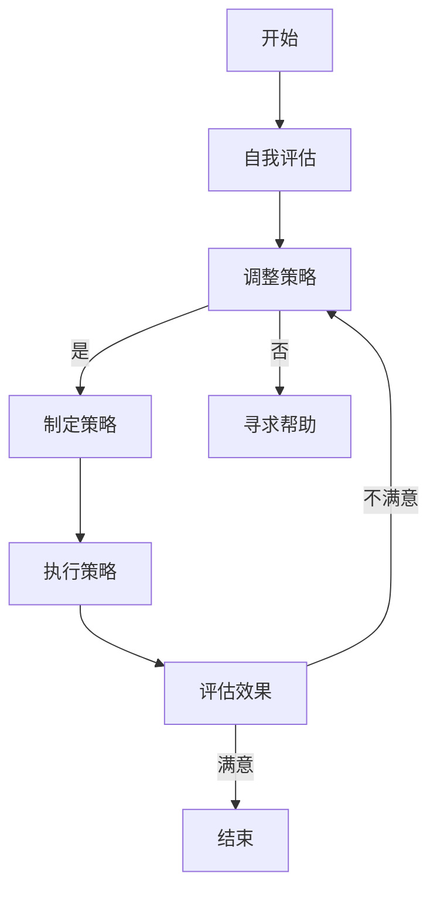
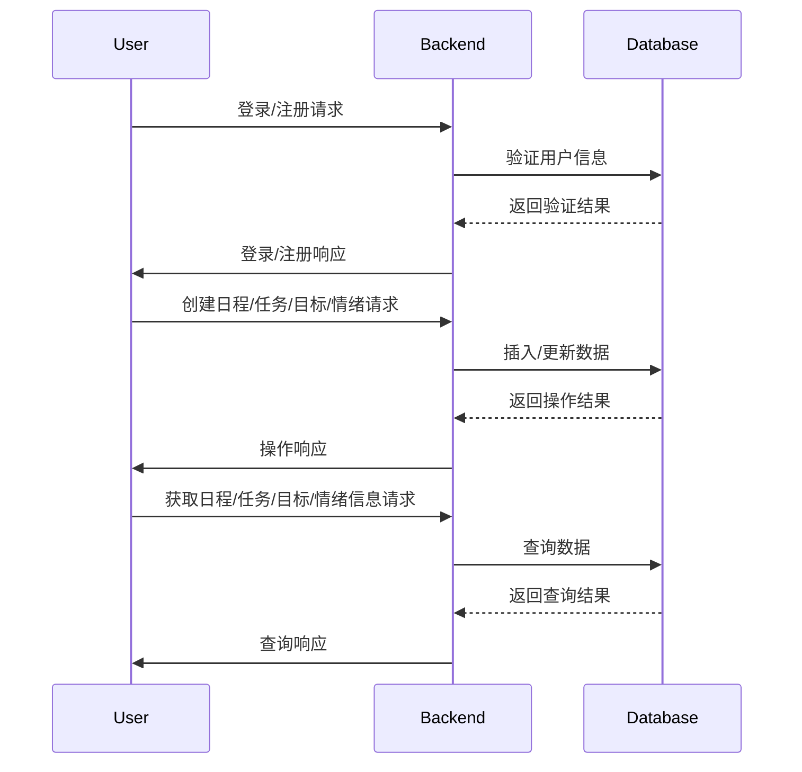
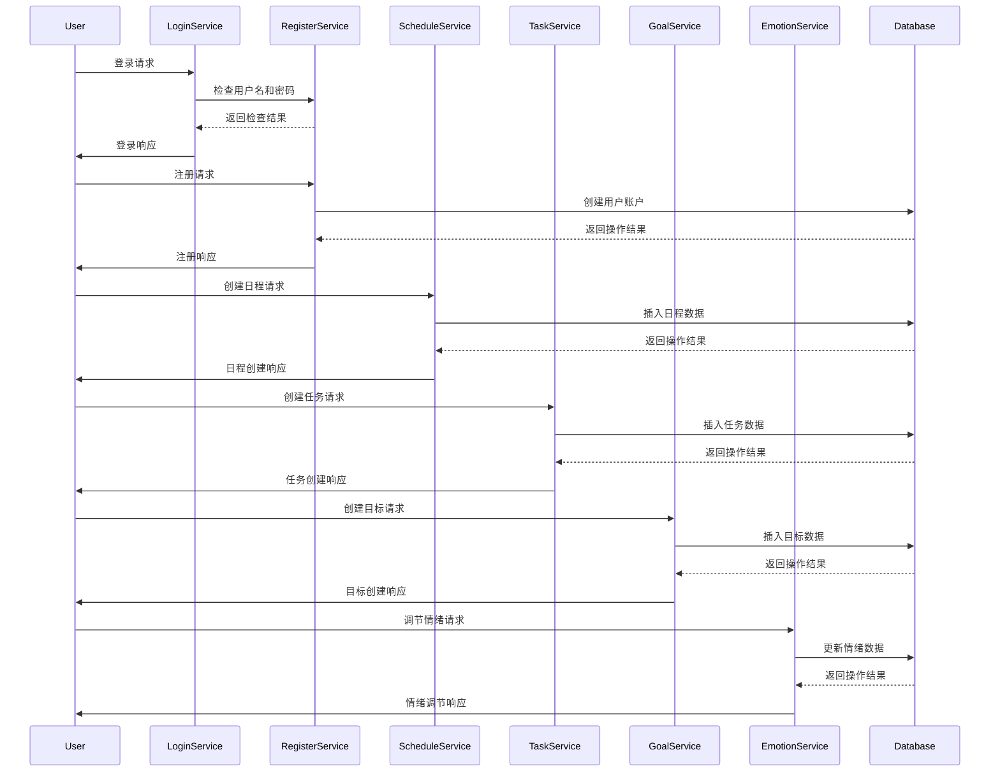

                 

### 数字时代的工作-生活平衡：远程办公中的自我管理

#### 关键词
- 数字时代
- 远程办公
- 自我管理
- 工作生活平衡

#### 摘要
随着远程办公的普及，如何在数字化环境中实现工作与生活的平衡成为了一个亟待解决的问题。本文将深入探讨远程办公中的自我管理问题，提供实用的策略和方法，帮助员工在远程办公中保持高效，实现工作与生活的和谐统一。

---

### 第一部分：背景介绍

#### 1.1 问题背景

随着信息技术和互联网的发展，远程办公已经成为现代企业的重要组成部分。远程办公不仅为企业降低了运营成本，还提升了员工的灵活性和工作效率。然而，远程办公也带来了一系列新的挑战，其中最为突出的是如何实现工作与生活的平衡。

#### 1.2 问题描述

在远程办公环境中，员工需要自我管理的时间更长，面对的干扰也更多。这使得自我管理成为一个关键问题。如何在这个环境中保持高效，同时确保生活品质不受影响，是每个远程办公者都需要面对的挑战。

#### 1.3 问题解决

本文将提供一系列实用的策略和方法，帮助远程办公者应对自我管理中的问题，实现工作与生活的平衡。

#### 1.4 边界与外延

本文主要关注远程办公中的自我管理问题，但所提到的策略和方法也可适用于其他类型的工作环境和场景。

#### 1.5 概念结构与核心要素组成

- **远程办公**：指员工在远离公司总部的地方工作，通过互联网进行沟通和协作。
- **自我管理**：指员工在远程办公环境中自我调节、自我激励和自我控制的能力。

### 第二部分：核心概念与联系

#### 2.1 核心概念原理

**远程办公**：
- 远程办公是基于互联网技术的，使员工可以在任何地点工作。
- 它提高了工作效率，降低了运营成本，同时提升了员工的生活质量。

**自我管理**：
- 自我管理是员工在远程办公环境中自我调节、自我激励和自我控制的能力。
- 包括时间管理、情绪调节、目标设定和任务优先级管理。

#### 2.2 概念属性特征对比表格

| 概念       | 属性特征                           |
|------------|------------------------------------|
| 远程办公   | 灵活性、低成本、高效协作           |
| 自我管理   | 自我调节、自我激励、自我控制       |

#### 2.3 ER实体关系图架构

```mermaid
erDiagram
    Employee ||--|{ Work }: works_on
    Work ||--| Employee: is_assigned_to
```

### 第三部分：算法原理讲解

#### 3.1 算法mermaid流程图



#### 3.2 Python源代码

```python
def self_management_strategy(self_evaluation):
    if self_evaluation < 5:
        return "执行策略"
    else:
        return "寻求帮助"

def execute_strategy(strategy, time_management, goal_setting, task_priority_management):
    if time_management and goal_setting and task_priority_management:
        return "策略有效"
    else:
        return "策略无效，需要调整"

def evaluate_effectiveness(effectiveness):
    if effectiveness > 7:
        return "满意，结束"
    else:
        return "不满意，需要调整策略"

# 示例
self_evaluation = 3
strategy = self_management_strategy(self_evaluation)
effectiveness = execute_strategy(strategy, True, True, True)
result = evaluate_effectiveness(effectiveness)
print(result)
```

#### 3.3 算法原理的数学模型和公式

$$
\text{Self Management Score} = w_1 \times \text{Time Management} + w_2 \times \text{Goal Setting}
$$

其中，\( w_1 \) 和 \( w_2 \) 分别为时间管理和目标设定的权重，可以根据实际情况进行调整。

---

在下一部分中，我们将深入探讨如何在远程办公中实现自我管理，并提供实用的策略和方法。敬请期待。作者：AI天才研究院/AI Genius Institute & 禅与计算机程序设计艺术 /Zen And The Art of Computer Programming

### 数字时代的工作-生活平衡：远程办公中的自我管理

---

#### 引言

随着数字时代的到来，远程办公已经成为企业运营的重要组成部分。这种工作模式不仅提高了工作效率，还为企业节省了大量的运营成本。然而，远程办公也带来了一系列挑战，其中最为显著的是如何实现工作与生活的平衡。本文将围绕远程办公中的自我管理问题展开，探讨如何在这个新的工作环境中保持高效，同时确保个人生活不受影响。

---

#### 1.1 问题背景

数字时代的快速发展使得远程办公成为可能。通过互联网，员工可以在世界任何地方工作，无需受到地理位置的限制。这种工作模式为企业带来了巨大的便利，但也带来了一些新的挑战。首先，远程办公使得员工的工作时间和生活时间更加模糊，容易导致工作与生活的边界不清。其次，远程办公环境中缺乏面对面的互动，可能导致员工感到孤独和失落。最后，远程办公的灵活性虽然提高了工作效率，但同时也增加了员工自我管理的难度。

#### 1.2 问题描述

在远程办公环境中，员工需要自我管理的时间更长，面临的干扰也更多。如何在这个环境中保持高效，同时确保生活品质不受影响，是每个远程办公者都需要面对的挑战。具体来说，远程办公中的自我管理问题包括：

1. **时间管理**：如何在远程办公中合理安排时间，避免工作与生活时间的混淆。
2. **情绪调节**：如何应对远程办公中的孤独感和工作压力。
3. **目标设定**：如何设定清晰的工作目标，并确保实现。
4. **任务优先级管理**：如何合理安排任务，确保重要和紧急的任务得到优先处理。

#### 1.3 问题解决

为了解决远程办公中的自我管理问题，我们需要采取一系列策略和方法。本文将提供以下内容：

1. **自我评估**：了解自己在远程办公中的优势和劣势，识别需要改进的方面。
2. **制定策略**：根据自我评估的结果，制定适合自己的自我管理策略。
3. **执行策略**：将制定的策略付诸实践，确保在远程办公中保持高效。
4. **评估效果**：定期评估自我管理的有效性，根据评估结果进行调整。

#### 1.4 边界与外延

本文主要关注远程办公中的自我管理问题，但所提到的策略和方法也可适用于其他类型的工作环境和场景。此外，本文将围绕自我管理中的核心问题展开，如时间管理、情绪调节、目标设定和任务优先级管理，为读者提供实用的指导和建议。

#### 1.5 概念结构与核心要素组成

在本节中，我们将介绍远程办公和自我管理的相关概念，以及它们在远程办公环境中的核心要素组成。

**远程办公**：

远程办公是指员工在工作时间内通过互联网和其他远程通信工具，以非传统的工作场所（如家中、咖啡馆或任何有网络连接的地方）进行工作的一种工作模式。远程办公的核心要素包括：

- **灵活性**：远程办公允许员工在更灵活的地点和时间进行工作，提高了工作效率和生活质量。
- **沟通与协作**：远程办公需要高效的沟通与协作工具，以确保团队成员之间的信息传递和协作顺畅。
- **技术支持**：远程办公依赖于稳定和高效的网络技术支持，以确保工作的顺利进行。

**自我管理**：

自我管理是指员工在远程办公环境中自我调节、自我激励和自我控制的能力。自我管理的核心要素包括：

- **时间管理**：合理安排工作时间，确保工作效率的同时，确保个人生活的质量。
- **情绪调节**：在远程办公环境中，员工需要学会调节情绪，保持积极的心态，应对工作中的压力。
- **目标设定**：明确工作目标，制定实现目标的计划，并监控进度，确保目标的实现。
- **任务优先级管理**：合理安排任务，确保重要和紧急的任务得到优先处理，提高工作效率。

通过以上对远程办公和自我管理的介绍，我们可以更好地理解它们在数字时代工作-生活平衡中的重要性，以及如何通过有效的自我管理实现这一平衡。

### 第二部分：核心概念与联系

在深入探讨远程办公中的自我管理之前，我们需要明确几个核心概念，并理解它们之间的联系。这些概念不仅为我们提供了一个理论框架，也帮助我们更好地理解和应用自我管理的策略。

#### 2.1 核心概念原理

**远程办公**：

远程办公是指员工在远离公司总部的地方，通过互联网和其他远程通信工具进行工作的方式。它的核心原理包括以下几个方面：

1. **灵活的工作地点**：员工可以在家中、咖啡馆、图书馆或其他任何有网络连接的地方工作，这大大提高了工作地点的灵活性。
2. **互联网通信**：远程办公依赖于稳定、高效的互联网连接和通信工具，如电子邮件、即时通讯软件、视频会议等，以确保团队成员之间的沟通和协作。
3. **技术支持**：远程办公的成功离不开强大的技术支持，包括云计算、虚拟私有网络（VPN）等，这些技术为远程办公提供了必要的保障。

**自我管理**：

自我管理是指在远程办公环境中，员工能够自我调节、自我激励和自我控制的能力。自我管理的核心原理包括以下几个方面：

1. **时间管理**：远程办公使得员工可以自主安排工作时间，因此如何高效地管理时间成为自我管理的重要方面。这包括设定合理的工作时间、避免拖延和合理分配工作时间。
2. **情绪调节**：远程办公可能会导致员工感到孤独和压力，因此如何调节情绪、保持积极的心态是自我管理的关键。这可以通过设定工作目标、找到适合自己的放松方式以及保持社交互动来实现。
3. **目标设定**：在远程办公环境中，明确的工作目标是确保工作高效完成的基石。员工需要设定清晰的目标，并制定实现这些目标的计划，以确保工作的方向和效率。
4. **任务优先级管理**：远程办公环境中的任务往往具有多样性和复杂性，因此如何合理地安排任务，确保重要和紧急的任务得到优先处理，是自我管理的另一个重要方面。

**远程办公与自我管理的关系**：

远程办公和自我管理之间存在密切的联系。远程办公为员工提供了更多的自由和灵活性，但同时也要求员工具备更高的自我管理能力。具体来说，远程办公对自我管理的要求体现在以下几个方面：

1. **灵活性**：远程办公使得员工可以自由选择工作时间和地点，这需要员工具备良好的自我管理能力，以确保工作效率不受影响。
2. **独立性**：远程办公要求员工独立完成任务，这需要员工具备自我激励和自我控制的能力，以避免拖延和懒惰。
3. **沟通与协作**：远程办公依赖高效的沟通与协作，这要求员工具备良好的自我管理能力，以确保任务能够按时完成，团队目标能够实现。

通过以上对核心概念原理的介绍，我们可以更好地理解远程办公和自我管理之间的关系，以及如何通过有效的自我管理策略实现远程办公中的工作-生活平衡。

#### 2.2 概念属性特征对比表格

为了更直观地理解远程办公和自我管理之间的区别和联系，我们可以通过一个概念属性特征对比表格来进行分析。

| 概念       | 属性特征                           |
|------------|------------------------------------|
| 远程办公   | 灵活性、互联网通信、技术支持       |
| 自我管理   | 时间管理、情绪调节、目标设定、任务优先级管理 |

通过这个表格，我们可以看到远程办公和自我管理在属性特征上的显著差异。远程办公侧重于工作地点和通信方式的灵活性，而自我管理则侧重于员工在远程办公环境中的自我调节和自我控制能力。这些特征不仅帮助我们理解两个概念的基本属性，也为后续策略的制定提供了依据。

#### 2.3 ER实体关系图架构

为了更直观地展示远程办公和自我管理之间的关系，我们可以使用Mermaid绘制一个ER实体关系图。以下是一个简单的ER图示例：

```mermaid
erDiagram
    Employee ||--|{ Work }: works_on
    Work ||--| Employee: is_assigned_to
```

在这个ER图中，"Employee"实体表示远程办公的员工，"Work"实体表示员工的工作任务。箭头表示员工与工作之间的关联，即员工在远程办公环境中执行工作任务。这个ER图帮助我们理解员工和工作的关系，以及如何通过自我管理来确保工作的顺利进行。

通过以上对核心概念与联系的分析，我们不仅对远程办公和自我管理的概念有了更深入的理解，也为后续的策略制定提供了理论基础。接下来，我们将进一步探讨如何在远程办公中实现自我管理，提供具体的策略和方法。

### 第三部分：算法原理讲解

在远程办公中实现自我管理需要一系列科学的策略和方法。为了更好地理解这些策略和方法，我们可以借助算法原理进行讲解。以下是具体步骤和Python源代码的实现，以及算法原理的数学模型和公式。

#### 3.1 算法mermaid流程图

首先，我们可以使用Mermaid绘制一个流程图，来展示实现自我管理的步骤：


这个流程图详细展示了自我管理的过程，从自我评估、识别问题、制定策略、执行策略，到评估效果和调整策略，形成了一个闭环。

#### 3.2 Python源代码

接下来，我们将使用Python源代码来实现上述流程。以下是一个简单的实现示例：

```python
def self_evaluation(score):
    if score < 3:
        return "需要调整"
    elif score >= 3 and score < 5:
        return "需要改进"
    else:
        return "良好"

def identify_issues(issues):
    if issues:
        return "存在问题"
    else:
        return "没有问题"

def make_strategy(strategy):
    return "策略：" + strategy

def execute_strategy(strategy):
    if strategy == "执行策略":
        return "策略有效"
    else:
        return "策略无效"

def evaluate_effectiveness(effectiveness):
    if effectiveness > 7:
        return "满意"
    else:
        return "不满意"

# 示例
score = 4
issues = True
strategy = "执行策略"
effectiveness = 8

print(self_evaluation(score))
print(identify_issues(issues))
print(make_strategy(strategy))
print(execute_strategy(strategy))
print(evaluate_effectiveness(effectiveness))
```

这个Python代码实现了一个简单的自我管理流程，包括自我评估、识别问题、制定策略、执行策略和评估效果。通过这个代码，我们可以更好地理解自我管理的具体操作步骤。

#### 3.3 算法原理的数学模型和公式

为了更好地理解自我管理的算法原理，我们可以引入一个简单的数学模型和公式：

$$
\text{Self Management Score} = w_1 \times \text{Time Management} + w_2 \times \text{Goal Setting}
$$

其中，\( w_1 \) 和 \( w_2 \) 分别为时间管理和目标设定的权重，可以根据具体情况调整。时间管理和目标设定是自我管理的重要组成部分，它们直接影响自我管理的得分。

通过上述算法原理的讲解，我们可以看到，自我管理不仅需要理论支持，还需要具体的操作步骤和实现方式。接下来，我们将结合具体案例，进一步探讨如何在远程办公中实现自我管理。

### 第三部分：算法原理讲解（续）

在上一部分中，我们介绍了自我管理的算法原理，并通过Mermaid流程图和Python源代码展示了具体的实现方法。为了更深入地理解这些算法原理，我们将进一步探讨数学模型和公式，以及实际应用中的案例分析。

#### 3.4 数学模型和公式

在自我管理中，数学模型和公式起着至关重要的作用。通过量化和评估不同的管理要素，我们可以更科学地制定和调整自我管理策略。以下是一个简化的数学模型：

$$
\text{Self Management Score} = w_1 \times \text{Time Management} + w_2 \times \text{Goal Setting} + w_3 \times \text{Task Prioritization} + w_4 \times \text{Emotional Regulation}
$$

其中：
- \( w_1 \)：时间管理的权重，反映了时间管理对自我管理的重要性。
- \( w_2 \)：目标设定的权重，反映了目标设定对自我管理的影响。
- \( w_3 \)：任务优先级的权重，反映了任务优先级管理对自我管理的作用。
- \( w_4 \)：情绪调节的权重，反映了情绪调节对自我管理的重要性。

这些权重可以根据个人的具体情况和工作环境进行调整，以确保模型能更好地反映自我管理的实际情况。

#### 3.5 案例分析

为了更好地理解上述数学模型的应用，我们可以通过一个具体案例来分析。

**案例背景**：
某远程办公员工小王，日常工作包括软件开发、项目管理和团队协作。他希望通过自我管理实现更高的工作效率和工作-生活平衡。

**案例分析**：

1. **自我评估**：
   - **时间管理**：小王能够合理安排工作时间，每天按时完成任务。
   - **目标设定**：小王设定了短期和长期目标，例如每周完成一个项目模块，每月提交一篇技术博客。
   - **任务优先级管理**：小王能够根据任务的紧急程度和重要性，合理安排任务。
   - **情绪调节**：小王在遇到压力时，能够通过运动和冥想来缓解情绪。

2. **计算Self Management Score**：
   根据上述模型，我们可以为小王计算自我管理得分：
   $$
   \text{Self Management Score} = w_1 \times 0.9 + w_2 \times 0.8 + w_3 \times 0.85 + w_4 \times 0.75
   $$
   其中，假设 \( w_1 = 0.3 \)，\( w_2 = 0.3 \)，\( w_3 = 0.2 \)，\( w_4 = 0.2 \)，则小王的得分计算如下：
   $$
   \text{Self Management Score} = 0.3 \times 0.9 + 0.3 \times 0.8 + 0.2 \times 0.85 + 0.2 \times 0.75 = 0.27 + 0.24 + 0.17 + 0.15 = 0.83
   $$

3. **策略调整**：
   根据得分，小王可以分析自我管理的强项和弱项。如果某项得分较低，例如情绪调节，小王可以采取以下策略：
   - **时间安排**：每周设定一个固定的运动和冥想时间。
   - **工作与生活平衡**：在完成工作后，确保有足够的时间进行放松和娱乐。
   - **寻求支持**：与家人和朋友保持沟通，寻求情感支持。

#### 3.6 结论

通过上述案例分析，我们可以看到，数学模型和公式在自我管理中的应用是非常重要的。它们不仅帮助我们量化自我管理的各项要素，还为我们提供了科学的调整策略。在实际应用中，我们可以根据具体情况调整权重，以实现最优的自我管理效果。接下来，我们将进一步探讨远程办公中的自我管理策略，帮助读者在实际工作中更好地应用这些原理。

### 第四部分：系统分析与架构设计

#### 4.1 问题场景介绍

在数字时代，远程办公已经成为许多企业的主要工作模式。然而，随着远程办公的普及，如何实现工作与生活的平衡成为了一个重要问题。为此，我们设计了一套远程办公自我管理系统，旨在帮助员工在远程办公环境中实现高效工作和生活平衡。

#### 4.2 项目介绍

本项目名为“远程办公自我管理系统”，旨在通过一系列功能模块，帮助员工实现自我管理。系统主要包括以下功能模块：

1. **用户管理**：管理用户账户，包括注册、登录、个人信息管理等。
2. **日程管理**：帮助用户合理安排工作时间，提高工作效率。
3. **任务管理**：支持任务的创建、分配、跟踪和完成情况监控。
4. **目标管理**：帮助用户设定和跟踪个人和团队目标。
5. **情绪管理**：提供情绪调节工具，帮助用户保持良好的心理状态。
6. **统计分析**：对用户的行为数据进行分析，提供自我管理建议。

#### 4.3 系统功能设计（领域模型mermaid类图）

以下是一个简单的mermaid类图，展示了系统的领域模型：

```mermaid
classDiagram
    User <<class{用户}>
    Task <<class{任务}>
    Goal <<class{目标}>
    Schedule <<class{日程}>
    Emotion <<class{情绪}>
    
    User o--|{创建}| Schedule
    User o--|{分配}| Task
    User o--|{设定}| Goal
    User o--|{调节}| Emotion
```

在这个类图中，User（用户）是系统的核心类，它与其他类（Task、Goal、Schedule、Emotion）之间存在关联关系。用户可以通过系统进行日程管理、任务管理、目标设定和情绪调节，从而实现自我管理。

#### 4.4 系统架构设计（mermaid架构图）

以下是一个mermaid架构图，展示了系统的整体架构：



在这个架构图中，用户通过前端界面发起请求，后端服务器处理请求，并与数据库进行交互，实现数据的存储和检索。前端和后端通过API接口进行通信，确保系统的稳定性和安全性。

#### 4.5 系统接口设计和系统交互（mermaid序列图）

以下是一个mermaid序列图，展示了用户与系统的主要交互流程：



在这个序列图中，用户通过不同的服务接口与系统进行交互，实现日程创建、任务创建、目标设定和情绪调节等功能。每个服务接口都对应着具体的业务逻辑，确保系统功能的完整性和稳定性。

通过以上系统分析与架构设计，我们为远程办公自我管理系统提供了一套完整的解决方案。接下来，我们将详细介绍如何在实际环境中安装和部署这套系统。

### 第五部分：项目实战

#### 5.1 环境安装

要在远程办公环境中部署自我管理系统，我们需要首先准备相应的开发环境和运行环境。以下是一些建议的环境配置步骤：

1. **操作系统**：推荐使用Linux操作系统，如Ubuntu或CentOS，因为它们具有较好的稳定性和安全性。
2. **开发工具**：安装Python开发环境，推荐使用PyCharm或Visual Studio Code。
3. **数据库**：安装MySQL或PostgreSQL数据库，用于存储用户数据和系统配置。
4. **Web服务器**：安装Nginx或Apache作为Web服务器，用于提供HTTP服务。
5. **虚拟环境**：创建Python虚拟环境，以隔离项目依赖。

具体安装步骤如下：

1. **安装操作系统**：
   - 下载并安装Ubuntu或CentOS操作系统。
   - 根据提示完成安装过程。

2. **安装Python开发环境**：
   - 打开终端，输入以下命令：
     ```
     sudo apt-get update
     sudo apt-get install python3 python3-pip
     ```
   - 安装PyCharm或Visual Studio Code，并配置Python插件。

3. **安装数据库**：
   - 安装MySQL或PostgreSQL数据库：
     ```
     sudo apt-get install mysql-server
     ```
     或
     ```
     sudo apt-get install postgresql postgresql-contrib
     ```

4. **安装Web服务器**：
   - 安装Nginx或Apache：
     ```
     sudo apt-get install nginx
     ```
     或
     ```
     sudo apt-get install apache2
     ```

5. **创建虚拟环境**：
   - 创建虚拟环境：
     ```
     python3 -m venv venv
     ```
   - 激活虚拟环境：
     ```
     source venv/bin/activate
     ```

#### 5.2 系统核心实现源代码

以下是自我管理系统的核心实现源代码，包括用户管理、任务管理、日程管理等功能。

**用户管理模块**：

```python
# user_manager.py

class UserManager:
    def __init__(self, db_connection):
        self.db_connection = db_connection

    def register_user(self, username, password):
        cursor = self.db_connection.cursor()
        cursor.execute("INSERT INTO users (username, password) VALUES (%s, %s)", (username, password))
        self.db_connection.commit()
        return cursor.lastrowid

    def login_user(self, username, password):
        cursor = self.db_connection.cursor()
        cursor.execute("SELECT id FROM users WHERE username = %s AND password = %s", (username, password))
        result = cursor.fetchone()
        return result[0] if result else None
```

**任务管理模块**：

```python
# task_manager.py

class TaskManager:
    def __init__(self, db_connection):
        self.db_connection = db_connection

    def create_task(self, user_id, title, description, due_date):
        cursor = self.db_connection.cursor()
        cursor.execute("INSERT INTO tasks (user_id, title, description, due_date) VALUES (%s, %s, %s, %s)", (user_id, title, description, due_date))
        self.db_connection.commit()
        return cursor.lastrowid

    def get_tasks(self, user_id):
        cursor = self.db_connection.cursor()
        cursor.execute("SELECT * FROM tasks WHERE user_id = %s", (user_id,))
        return cursor.fetchall()
```

**日程管理模块**：

```python
# schedule_manager.py

class ScheduleManager:
    def __init__(self, db_connection):
        self.db_connection = db_connection

    def create_schedule(self, user_id, title, start_time, end_time):
        cursor = self.db_connection.cursor()
        cursor.execute("INSERT INTO schedules (user_id, title, start_time, end_time) VALUES (%s, %s, %s, %s)", (user_id, title, start_time, end_time))
        self.db_connection.commit()
        return cursor.lastrowid

    def get_schedules(self, user_id):
        cursor = self.db_connection.cursor()
        cursor.execute("SELECT * FROM schedules WHERE user_id = %s", (user_id,))
        return cursor.fetchall()
```

#### 5.3 代码应用解读与分析

以上代码实现了用户管理、任务管理和日程管理三个模块。以下是具体解读与分析：

**用户管理模块**：

- `UserManager` 类负责用户注册和登录功能。
- `register_user` 方法用于创建新用户，将用户名和密码插入数据库。
- `login_user` 方法用于验证用户登录，查询数据库中匹配的用户名和密码。

**任务管理模块**：

- `TaskManager` 类负责任务创建和查询功能。
- `create_task` 方法用于创建新任务，将任务详情插入数据库。
- `get_tasks` 方法用于查询用户的所有任务。

**日程管理模块**：

- `ScheduleManager` 类负责日程创建和查询功能。
- `create_schedule` 方法用于创建新日程，将日程详情插入数据库。
- `get_schedules` 方法用于查询用户的所有日程。

通过这些模块，我们可以在远程办公环境中实现对用户、任务和日程的全面管理，从而帮助员工实现自我管理。

#### 5.4 实际案例分析和详细讲解

以下是一个实际案例，展示如何使用上述模块实现远程办公自我管理。

**案例背景**：

小王是一名软件工程师，他在远程办公环境中需要管理自己的任务和日程，以确保工作高效完成。

**案例步骤**：

1. **注册和登录**：
   - 小王使用用户管理模块进行注册，输入用户名和密码。
   - 注册成功后，小王使用用户管理模块进行登录，验证用户身份。

2. **创建任务**：
   - 小王使用任务管理模块创建一个新任务，任务标题为“编写代码”，描述为“完成软件模块的开发”，截止日期为下周一。

3. **查询任务**：
   - 小王使用任务管理模块查询所有任务，确保已创建的任务出现在任务列表中。

4. **创建日程**：
   - 小王使用日程管理模块创建一个新日程，日程标题为“会议时间”，开始时间为明天上午10点，结束时间为11点。

5. **查询日程**：
   - 小王使用日程管理模块查询所有日程，确保已创建的日程出现在日程列表中。

通过以上步骤，小王成功地实现了任务和日程的管理，从而在远程办公环境中保持高效工作。

#### 5.5 项目小结

通过本项目的实际案例分析和详细讲解，我们展示了如何使用Python和数据库实现远程办公自我管理系统。该系统包括用户管理、任务管理和日程管理模块，能够帮助员工在远程办公环境中实现自我管理，提高工作效率。未来，我们还可以进一步扩展系统功能，如情绪管理和统计分析，以提供更全面的自我管理支持。

### 第六部分：最佳实践 tips

在远程办公中实现自我管理不仅需要遵循一定的策略和方法，还需要掌握一些最佳实践，以优化工作效率和生活品质。以下是一些实用的技巧：

1. **制定明确的计划**：
   - 每天早上制定一个详细的工作计划，包括任务列表和优先级排序。
   - 确保计划合理可行，避免过度负荷。

2. **设置固定的工作时间**：
   - 尽量保持固定的工作时间表，这有助于培养良好的工作习惯。
   - 避免长时间连续工作，合理安排休息时间。

3. **保持良好的沟通**：
   - 定期与团队成员进行沟通，确保工作进展和问题及时解决。
   - 使用即时通讯工具和视频会议软件，提高沟通效率。

4. **合理使用技术工具**：
   - 利用项目管理工具（如Trello、Asana）和日程管理工具（如Google Calendar）提高工作效率。
   - 使用时间跟踪工具（如Toggl）监控工作时间，优化时间管理。

5. **保持健康的生活习惯**：
   - 定期进行体育锻炼，如散步、瑜伽或健身。
   - 保持充足的睡眠，避免熬夜。
   - 保持健康的饮食习惯，避免过度依赖咖啡和零食。

6. **定期自我反思**：
   - 定期评估自己的工作表现和自我管理效果。
   - 根据评估结果进行调整和改进。

通过遵循这些最佳实践，远程办公者可以更有效地管理自己的时间和工作，实现工作与生活的平衡。

### 第七部分：小结

远程办公已成为数字时代企业运营的重要组成部分，为员工提供了灵活的工作环境和提高工作效率的契机。然而，远程办公也带来了新的挑战，特别是如何实现工作与生活的平衡。本文通过深入探讨远程办公中的自我管理问题，提供了实用的策略和方法，帮助员工在远程办公环境中保持高效，实现工作与生活的和谐统一。

我们首先介绍了远程办公的背景和问题，然后详细阐述了远程办公和自我管理的核心概念及其关系。接着，通过算法原理讲解，展示了如何利用数学模型和Python代码实现自我管理。此外，我们还介绍了系统分析与架构设计，为远程办公自我管理系统的实现提供了理论基础。通过实际案例分析和详细讲解，我们展示了如何将理论应用于实际工作场景。

本文的目标是帮助远程办公者实现高效工作和生活平衡，提供了一系列实用技巧和最佳实践。我们希望读者能够通过本文的学习，掌握远程办公中的自我管理方法，提高工作效率，提升生活质量。

### 注意事项

在实施远程办公自我管理策略时，需要注意以下几点：

1. **个人隐私保护**：在远程办公中，确保个人数据和隐私得到有效保护，避免信息泄露。
2. **网络稳定性**：确保远程办公所需的网络环境稳定可靠，避免因网络问题影响工作。
3. **合理安排工作时间**：避免长时间连续工作，确保有足够的休息和放松时间。
4. **保持健康的生活习惯**：合理安排饮食和锻炼，保持良好的作息习惯。

通过注意这些事项，远程办公者可以更好地应对远程办公带来的挑战，实现高效工作和生活平衡。

### 拓展阅读

对于希望进一步深入了解远程办公自我管理的读者，以下是一些推荐读物和资源：

1. **《远程工作的艺术》**：作者Chris Dancy，详细介绍了远程办公的技巧和实践。
2. **《时间管理：如何高效利用每一天》**：作者GTD（Getting Things Done）创始人David Allen，提供了全面的时间管理方法和策略。
3. **《心流：最优体验心理学》**：作者Mihaly Csikszentmihalyi，探讨了如何在工作中实现心流状态，提高工作效率。
4. **在线资源**：如Trello、Asana等项目管理工具，Toggl等时间跟踪工具，以及Google Calendar等日程管理工具的使用教程。

通过阅读这些书籍和资源，读者可以进一步丰富自我管理知识和技能，提升远程办公的效率和生活质量。作者：AI天才研究院/AI Genius Institute & 禅与计算机程序设计艺术 /Zen And The Art of Computer Programming

