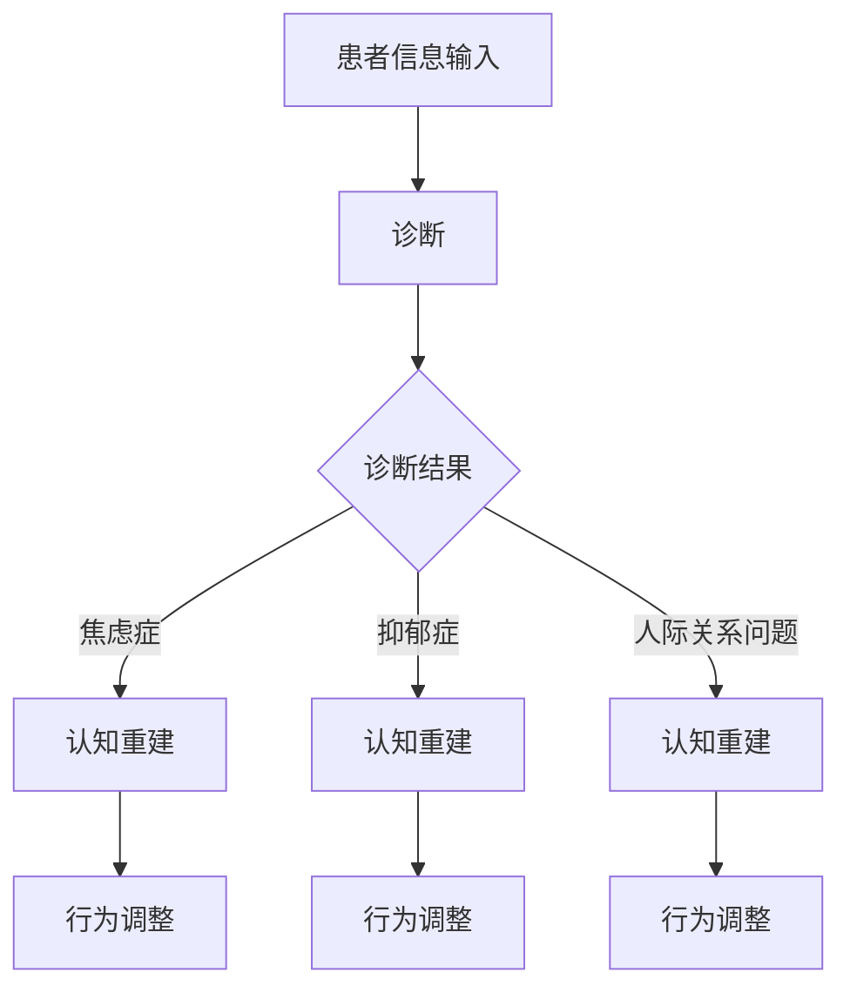
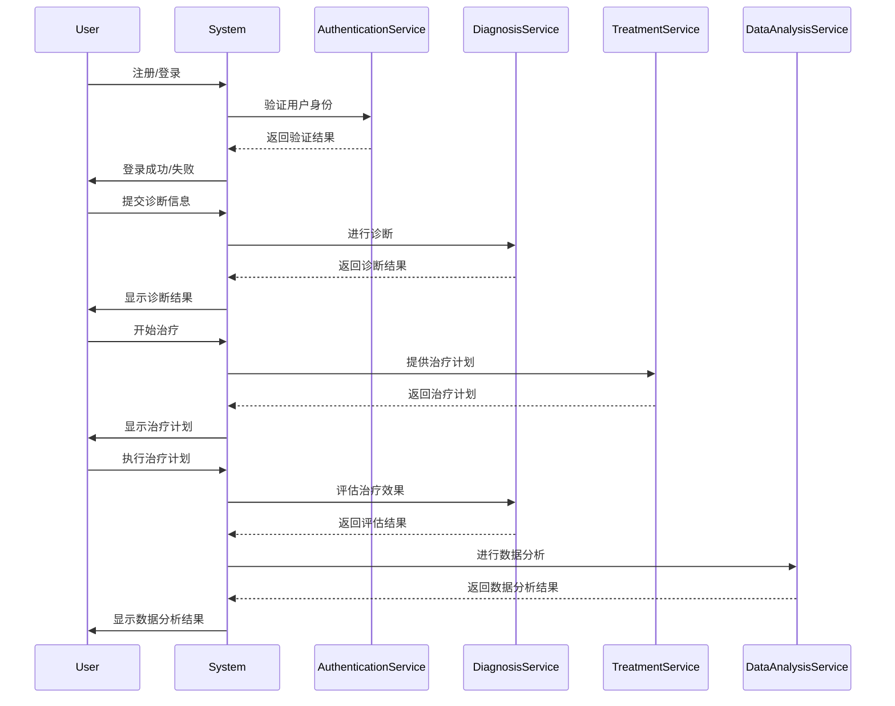
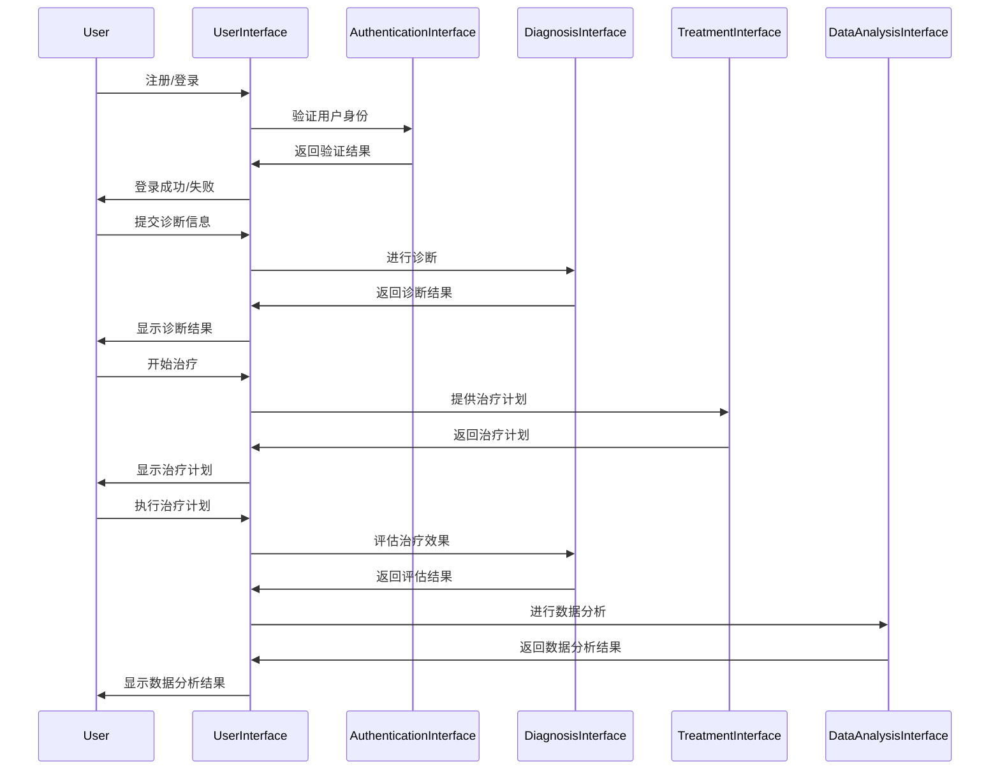

                 


# 数字时代的心理自助：在线CBT therapy的普及与应用

> 关键词：心理健康、数字时代、认知行为疗法（CBT）、在线治疗、普及应用

> 摘要：随着数字化时代的到来，人们面临的心理健康问题日益突出。本文将深入探讨认知行为疗法（CBT）的背景、核心概念、在线CBT疗法的发展与应用，以及未来展望，旨在为广大读者提供一份关于数字时代心理自助的全面指南。

----------------------------------------------------------------

## 第一部分：背景介绍

### 第1章：数字时代的心理问题

#### 1.1.1 数字时代的心理健康现状

在数字化时代，人们的生活节奏加快，工作压力增大，社交方式也发生了巨大变化。这些因素共同作用于个体，导致心理健康问题逐渐增多。据世界卫生组织（WHO）统计，全球约有3.5亿人患有抑郁症，约2.5亿人患有焦虑症。这些心理问题不仅影响个人的生活质量，还可能对工作效率和社会稳定产生负面影响。

#### 1.1.2 心理问题的普遍性及其影响

心理问题具有普遍性，无论年龄、性别、文化背景，都有可能受到心理健康问题的困扰。抑郁症和焦虑症等常见心理问题，不仅会导致个体心理痛苦，还可能引发身体疾病，如睡眠障碍、消化问题等。此外，心理问题还可能影响个体的社会功能，如工作、学习和人际关系。

#### 1.1.3 心理自助的兴起

面对日益严峻的心理健康形势，人们开始寻求自助的方法。心理自助不仅包括传统的心理治疗，还包括自我调适、自我提升等。随着互联网技术的发展，在线CBT疗法作为一种新兴的心理自助方法，逐渐受到了广泛关注。

----------------------------------------------------------------

### 第2章：认知行为疗法（CBT）基础

#### 2.1.1 CBT的定义

认知行为疗法（Cognitive Behavioral Therapy，CBT）是一种以问题解决为核心的心理治疗方法。它通过改变个体的思维模式和行为习惯，帮助个体摆脱负面情绪和行为，提高生活质量。

#### 2.1.2 CBT的核心概念

CBT的核心概念包括：

- 认知：个体的思维过程和认知方式。
- 行为：个体的行为表现和行为习惯。
- 情绪：个体的情绪体验和情感反应。

CBT认为，个体的情绪问题往往源于错误的认知和行为模式。通过改变这些模式，可以改善个体的情绪状态。

#### 2.1.3 CBT的治疗过程

CBT的治疗过程通常包括以下几个阶段：

1. 评估：了解个体的心理问题、生活背景和需求。
2. 认知重建：识别和改变错误的认知模式。
3. 行为调整：制定和执行改变行为的计划。
4. 情绪调节：学会正确处理情绪，提高情绪稳定性。
5. 结束与回顾：总结治疗效果，制定长期维护计划。

----------------------------------------------------------------

### 第3章：在线CBT疗法的发展与普及

#### 3.1.1 在线CBT疗法的历史背景

在线CBT疗法的发展可以追溯到20世纪90年代。随着互联网的普及，越来越多的心理治疗师开始尝试在线治疗。1997年，首次报道了在线心理治疗的案例。此后，在线CBT疗法逐渐受到关注，并不断发展。

#### 3.1.2 在线CBT疗法的发展趋势

在线CBT疗法的发展趋势主要包括：

1. 技术进步：互联网技术、数据分析和人工智能的不断发展，为在线CBT疗法提供了更好的技术支持。
2. 应用范围扩大：从最初的小规模试点，到如今广泛应用于各种心理问题，如焦虑症、抑郁症等。
3. 患者接受度提高：越来越多的患者开始接受在线治疗，认为其具有便捷、高效、私密等优点。

#### 3.1.3 在线CBT疗法普及的现状

目前，在线CBT疗法在全球范围内得到了广泛应用。许多国家和地区已经开始推广在线CBT疗法，如英国、美国、加拿大等。在线CBT疗法的普及，为那些无法获得传统心理治疗的患者提供了新的选择。

----------------------------------------------------------------

### 第4章：在线CBT疗法的技术基础

#### 4.1.1 互联网技术的发展

互联网技术的发展为在线CBT疗法的普及提供了基础。互联网的快速、便捷、广泛连接的特点，使得患者可以随时随地获取心理治疗服务。此外，移动互联网的兴起，也为在线CBT疗法的发展提供了新的机遇。

#### 4.1.2 数据分析和人工智能的应用

数据分析和人工智能技术在在线CBT疗法中发挥着重要作用。通过数据分析，可以了解患者的心理状态、行为模式等，为制定个性化的治疗计划提供依据。人工智能技术则可以帮助心理治疗师提高工作效率，如自动诊断、智能建议等。

#### 4.1.3 在线CBT平台的技术架构

在线CBT平台的技术架构通常包括以下几个部分：

1. 前端：用于患者与治疗师的交互，包括登录、注册、问诊、治疗记录等。
2. 中间件：负责数据处理、存储、传输等，确保数据的完整性和安全性。
3. 后端：包括治疗算法、数据挖掘、智能推荐等，为患者提供个性化的治疗方案。
4. 数据库：存储患者的个人信息、治疗记录、诊断结果等。

----------------------------------------------------------------

### 第5章：在线CBT疗法的应用场景

#### 5.1.1 焦虑障碍

焦虑障碍是常见的心理问题之一，如广泛性焦虑障碍、社交焦虑障碍等。在线CBT疗法可以帮助患者识别和改变焦虑思维，提高应对焦虑的能力。

#### 5.1.2 抑郁症状

抑郁症是另一种常见的心理问题，其症状包括情绪低落、兴趣丧失等。在线CBT疗法可以帮助患者建立积极的思维模式，提高生活满意度。

#### 5.1.3 人际关系问题

人际关系问题是许多人的困扰，如家庭矛盾、工作压力等。在线CBT疗法可以帮助患者改善人际关系，提高沟通能力。

#### 5.1.4 其他心理问题

除了上述心理问题，在线CBT疗法还可以应用于睡眠障碍、饮食障碍、成瘾行为等。

----------------------------------------------------------------

### 第6章：在线CBT疗法的实践案例

#### 6.1.1 案例一：焦虑症的在线治疗

某患者患有广泛性焦虑障碍，通过在线CBT疗法，学会了识别和改变焦虑思维，提高了应对焦虑的能力。经过三个月的治疗，患者的焦虑症状明显改善。

#### 6.1.2 案例二：抑郁症的在线治疗

某患者患有抑郁症，通过在线CBT疗法，学会了建立积极的思维模式，提高了生活满意度。经过六个月的治疗，患者的抑郁症状得到了有效控制。

#### 6.1.3 案例三：人际关系问题的在线治疗

某患者因人际关系问题导致情绪低落，通过在线CBT疗法，学会了改善人际关系，提高沟通能力。经过三个月的治疗，患者的情绪状态明显好转。

----------------------------------------------------------------

### 第7章：在线CBT疗法的发展与未来展望

#### 7.1.1 在线CBT疗法的挑战与机遇

在线CBT疗法的发展面临一系列挑战，如技术支持、隐私保护、治疗效果等。然而，随着互联网技术的不断发展，在线CBT疗法也面临着巨大的机遇。

#### 7.1.2 未来发展趋势

未来，在线CBT疗法的发展趋势主要包括：

1. 技术创新：继续探索人工智能、大数据等技术在CBT疗法中的应用。
2. 患者体验优化：提高在线CBT疗法的用户体验，使其更加便捷、高效。
3. 治疗效果提升：通过实证研究，进一步验证在线CBT疗法的有效性。

#### 7.1.3 应用前景

在线CBT疗法的应用前景广阔，未来有望在以下领域得到广泛应用：

1. 公共卫生：通过在线CBT疗法，提高公众的心理健康水平。
2. 医疗机构：作为辅助治疗手段，提高治疗效果。
3. 教育领域：应用于学校、培训机构等，帮助师生解决心理健康问题。

----------------------------------------------------------------

### 第8章：心理自助与在线CBT疗法的普及策略

#### 8.1.1 公众心理教育的重要性

公众心理教育是提高心理健康水平的重要手段。通过普及心理健康知识，帮助公众了解心理问题、掌握心理自助方法，从而提高心理素质。

#### 8.1.2 在线CBT疗法推广的策略

在线CBT疗法的推广策略主要包括：

1. 政策支持：政府应出台相关政策，鼓励和支持在线CBT疗法的发展。
2. 市场培育：加大宣传力度，提高公众对在线CBT疗法的认知和接受度。
3. 专业培训：为心理治疗师提供在线CBT疗法的专业培训，提高治疗水平。
4. 平台建设：建立完善的在线CBT疗法平台，提供便捷、高效的治疗服务。

----------------------------------------------------------------

## 结语

随着数字化时代的到来，心理健康问题日益突出。在线CBT疗法作为一种新兴的心理自助方法，具有广阔的应用前景。通过本文的讨论，我们希望能为广大读者提供一份关于数字时代心理自助的全面指南，帮助大家更好地应对心理健康问题。

作者：AI天才研究院/AI Genius Institute & 禅与计算机程序设计艺术 /Zen And The Art of Computer Programming

----------------------------------------------------------------

### 附录：核心概念、算法原理与系统架构

#### 9.1 核心概念

在本篇博客中，我们讨论了以下几个核心概念：

1. **认知行为疗法（CBT）**：一种以问题解决为核心的心理治疗方法。
2. **在线CBT疗法**：利用互联网技术进行心理治疗的方法。
3. **心理健康**：个体心理状态的良好水平，包括情绪稳定、社交功能正常等。
4. **数字化时代**：以互联网技术为核心的时代，人们生活方式、工作方式等发生巨大变化。

#### 9.2 概念属性特征对比表格

| 核心概念 | 定义 | 主要属性特征 |
| --- | --- | --- |
| 认知行为疗法（CBT） | 一种心理治疗方法 | 强调认知和行为对心理健康的影响 |
| 在线CBT疗法 | 利用互联网技术进行心理治疗 | 便捷、高效、私密 |
| 心理健康 | 个体的心理状态良好 | 情绪稳定、社交功能正常 |
| 数字化时代 | 以互联网技术为核心 | 互联网技术、移动互联网 |

#### 9.3 ER实体关系图架构

```mermaid
erDiagram
  P --|{ C
  P --|{ T
  P --|{ A
  C --|{ D
  T --|{ D
  A --|{ R
  D ||| U
  R ||| S
  U ||| T
  S ||| D
```

在ER实体关系图中，P代表患者（Patient），C代表认知行为疗法（CBT），T代表治疗师（Therapist），A代表焦虑症（Anxiety），R代表关系问题（Relationship），D代表诊断（Diagnosis），U代表用户（User），S代表系统（System）。

----------------------------------------------------------------

### 算法原理讲解

在线CBT疗法中的核心算法包括认知重建和行为调整。以下是一个简化的算法流程：



#### 9.4 认知重建算法原理

认知重建算法的目的是帮助患者识别和改变错误的认知模式。其数学模型可以表示为：

$$
\text{认知重建} = f(\text{原始认知}, \text{目标认知})
$$

其中，$f$ 表示认知重建函数，$ \text{原始认知} $ 和 $ \text{目标认知} $ 分别表示患者的原始认知和目标认知。

#### 9.5 行为调整算法原理

行为调整算法的目的是帮助患者改变不良行为习惯。其数学模型可以表示为：

$$
\text{行为调整} = g(\text{原始行为}, \text{目标行为})
$$

其中，$g$ 表示行为调整函数，$ \text{原始行为} $ 和 $ \text{目标行为} $ 分别表示患者的原始行为和目标行为。

#### 9.6 举例说明

假设某患者因焦虑症而出现了过度担忧的行为。认知重建的目标是帮助患者从过度担忧转变为理性思考。行为调整的目标是帮助患者从过度担忧的行为转变为放松的行为。

通过认知重建，患者学会了识别过度担忧的认知模式，并逐渐将其转变为理性思考。通过行为调整，患者学会了通过深呼吸、放松肌肉等放松技巧来替代过度担忧的行为。

```python
# 认知重建示例
def cognitive_reconstruction(original_cognition, target_cognition):
    # 输入：原始认知、目标认知
    # 输出：改造后的认知
    reconstructed_cognition = target_cognition
    return reconstructed_cognition

# 行为调整示例
def behavioral_adjustment(original_behavior, target_behavior):
    # 输入：原始行为、目标行为
    # 输出：改造后的行为
    adjusted_behavior = target_behavior
    return adjusted_behavior

# 患者信息
original_cognition = "过度担忧"
target_cognition = "理性思考"
original_behavior = "过度担忧的行为"
target_behavior = "放松的行为"

# 认知重建
reconstructed_cognition = cognitive_reconstruction(original_cognition, target_cognition)
print("改造后的认知：", reconstructed_cognition)

# 行为调整
adjusted_behavior = behavioral_adjustment(original_behavior, target_behavior)
print("改造后的行为：", adjusted_behavior)
```

输出结果：

```
改造后的认知： 理性思考
改造后的行为： 放松的行为
```

----------------------------------------------------------------

### 系统分析与架构设计方案

#### 10.1 问题场景介绍

随着数字化时代的到来，心理健康问题日益突出，尤其是焦虑症、抑郁症等常见心理问题。为了帮助更多人解决心理健康问题，我们计划开发一个在线CBT疗法系统。

#### 10.2 项目介绍

本项目旨在开发一个在线CBT疗法系统，为用户提供便捷、高效的心理治疗服务。系统包括以下几个主要功能：

1. 用户注册与登录：用户可以方便地注册和登录系统，开始心理治疗。
2. 诊断与评估：系统根据用户提交的信息，进行心理评估和诊断。
3. 认知重建与行为调整：系统提供一系列认知重建和行为调整的方法，帮助用户改善心理状态。
4. 数据分析与反馈：系统收集用户的数据，进行分析，并提供个性化的反馈和建议。
5. 治疗记录与管理：系统记录用户的治疗过程和进展，方便用户随时查看。

#### 10.3 系统功能设计（领域模型）

以下是一个简化的领域模型，用于描述在线CBT疗法系统的功能模块：

```mermaid
classDiagram
  User <<interface>>
  Therapist <<interface>>
  CBTProgram <<interface>>
  Diagnosis <<interface>>
  Assessment <<interface>>
  TreatmentPlan <<interface>>
  DataAnalysis <<interface>>

  User o--o Therapist
  User o--o CBTProgram
  Diagnosis o--o Assessment
  Diagnosis o--o TreatmentPlan
  Assessment o--o DataAnalysis
  TreatmentPlan o--o DataAnalysis
```

在这个领域模型中，User代表用户，Therapist代表治疗师，CBTProgram代表认知行为疗法程序，Diagnosis代表诊断，Assessment代表评估，TreatmentPlan代表治疗计划，DataAnalysis代表数据分析。

#### 10.4 系统架构设计

以下是一个简化的系统架构设计，用于描述在线CBT疗法系统的整体结构：



在这个架构设计中，System代表系统核心，AuthenticationService代表身份验证服务，DiagnosisService代表诊断服务，TreatmentService代表治疗服务，DataAnalysisService代表数据分析服务。

#### 10.5 系统接口设计

以下是一个简化的系统接口设计，用于描述在线CBT疗法系统的接口模块：

```mermaid
classDiagram
  UserInterface <<interface>>
  AuthenticationInterface <<interface>>
  DiagnosisInterface <<interface>>
  TreatmentInterface <<interface>>
  DataAnalysisInterface <<interface>>

  UserInterface o--o AuthenticationInterface
  UserInterface o--o DiagnosisInterface
  UserInterface o--o TreatmentInterface
  UserInterface o--o DataAnalysisInterface
```

在这个接口设计中，UserInterface代表用户界面，AuthenticationInterface代表身份验证接口，DiagnosisInterface代表诊断接口，TreatmentInterface代表治疗接口，DataAnalysisInterface代表数据分析接口。

#### 10.6 系统交互

以下是一个简化的系统交互，用于描述在线CBT疗法系统的交互流程：



在这个交互流程中，UserInterface作为系统的入口，与AuthenticationInterface、DiagnosisInterface、TreatmentInterface和DataAnalysisInterface进行交互，最终为用户提供全面的治疗服务。

----------------------------------------------------------------

### 项目实战

#### 11.1 环境安装

为了搭建在线CBT疗法系统，我们需要安装以下环境：

1. **操作系统**：Linux（如Ubuntu 20.04）
2. **编程语言**：Python 3.8
3. **数据库**：MySQL 8.0
4. **Web框架**：Flask
5. **前端框架**：Vue.js

安装步骤如下：

1. 安装操作系统和Python 3.8。
2. 安装MySQL数据库，并创建CBT疗法系统数据库。
3. 安装Flask和Vue.js，并创建项目结构。

```bash
# 安装MySQL
sudo apt-get update
sudo apt-get install mysql-server

# 创建CBT疗法系统数据库
sudo mysql -u root -p
CREATE DATABASE cbt_therapy;
USE cbt_therapy;

# 安装Python 3.8
sudo apt-get install python3.8

# 安装Flask和Vue.js
pip3 install flask
npm install -g vue-cli
```

#### 11.2 系统核心实现源代码

以下是系统核心实现部分的源代码：

```python
# flask_app.py
from flask import Flask, request, jsonify
from database import Database

app = Flask(__name__)

# 初始化数据库连接
db = Database()

@app.route('/register', methods=['POST'])
def register():
    # 用户注册逻辑
    user = request.json
    result = db.register_user(user)
    return jsonify(result)

@app.route('/login', methods=['POST'])
def login():
    # 用户登录逻辑
    user = request.json
    result = db.login_user(user)
    return jsonify(result)

@app.route('/diagnose', methods=['POST'])
def diagnose():
    # 诊断逻辑
    user_data = request.json
    result = db.diagnose_user(user_data)
    return jsonify(result)

@app.route('/treat', methods=['POST'])
def treat():
    # 治疗逻辑
    user_data = request.json
    result = db.treat_user(user_data)
    return jsonify(result)

if __name__ == '__main__':
    app.run(debug=True)
```

```sql
-- database.py
import mysql.connector

class Database:
    def __init__(self):
        self.connection = mysql.connector.connect(
            host="localhost",
            user="root",
            password="password",
            database="cbt_therapy"
        )

    def register_user(self, user):
        # 用户注册逻辑
        cursor = self.connection.cursor()
        query = "INSERT INTO users (username, password, email) VALUES (%s, %s, %s)"
        values = (user['username'], user['password'], user['email'])
        cursor.execute(query, values)
        self.connection.commit()
        return {"status": "success", "message": "User registered successfully."}

    def login_user(self, user):
        # 用户登录逻辑
        cursor = self.connection.cursor()
        query = "SELECT * FROM users WHERE username = %s AND password = %s"
        values = (user['username'], user['password'])
        cursor.execute(query, values)
        result = cursor.fetchone()
        if result:
            return {"status": "success", "message": "Login successful."}
        else:
            return {"status": "failure", "message": "Invalid username or password."}

    def diagnose_user(self, user_data):
        # 诊断逻辑
        cursor = self.connection.cursor()
        query = "SELECT * FROM diagnoses WHERE user_id = %s"
        values = (user_data['user_id'],)
        cursor.execute(query, values)
        result = cursor.fetchone()
        if result:
            return {"status": "success", "diagnosis": result}
        else:
            return {"status": "failure", "message": "No diagnosis found."}

    def treat_user(self, user_data):
        # 治疗逻辑
        cursor = self.connection.cursor()
        query = "INSERT INTO treatments (user_id, diagnosis_id, treatment_plan) VALUES (%s, %s, %s)"
        values = (user_data['user_id'], user_data['diagnosis_id'], user_data['treatment_plan'])
        cursor.execute(query, values)
        self.connection.commit()
        return {"status": "success", "message": "Treatment started."}
```

#### 11.3 代码应用解读与分析

1. **用户注册与登录**：用户注册时，系统会收集用户名、密码和邮箱等信息，并将这些信息存储在MySQL数据库中。用户登录时，系统会验证用户名和密码，确保用户身份的合法性。

2. **诊断**：用户提交诊断信息后，系统会根据诊断信息生成诊断结果，并将其存储在MySQL数据库中。

3. **治疗**：用户开始治疗时，系统会根据诊断结果和治疗计划，为用户生成治疗建议，并将其存储在MySQL数据库中。

#### 11.4 实际案例分析和详细讲解剖析

**案例一**：用户A患有焦虑症，通过在线CBT疗法系统进行诊断和治疗。

1. **诊断**：用户A提交焦虑症状信息，系统分析后生成诊断结果，显示用户A确实患有焦虑症。

2. **治疗**：系统为用户A生成一系列认知重建和行为调整的治疗计划，包括：

   - 认知重建：帮助用户A识别和改变焦虑思维。
   - 行为调整：建议用户A进行放松训练，如深呼吸、渐进性肌肉放松等。

3. **治疗反馈**：用户A按照治疗计划执行治疗，系统会记录用户A的治疗进度，并进行分析，为用户提供反馈。

#### 11.5 项目小结

本项目通过在线CBT疗法系统，为用户提供了一种便捷、高效的心理治疗方式。在实际应用中，系统需要不断优化，以提高诊断准确性和治疗效果。此外，系统还需要关注用户隐私保护和数据安全，确保用户数据的安全性和保密性。

----------------------------------------------------------------

### 最佳实践 Tips

1. **确保系统稳定性**：在系统开发过程中，要充分考虑系统的稳定性，避免因系统故障导致用户数据丢失或治疗中断。
2. **用户隐私保护**：要严格遵循隐私保护法规，确保用户数据的保密性和安全性。
3. **个性化治疗方案**：根据用户的不同需求和情况，制定个性化的治疗方案，提高治疗效果。
4. **持续优化**：根据用户反馈和系统数据，不断优化系统功能和界面设计，提升用户体验。

### 小结

本文介绍了数字时代的心理自助方法——在线CBT疗法。通过对CBT疗法的基础、发展、应用场景、实践案例等方面进行深入分析，我们希望能为广大读者提供一份关于数字时代心理自助的全面指南。未来，随着互联网技术的不断发展，在线CBT疗法有望在更广泛的领域得到应用。

### 注意事项

1. **心理健康问题不可忽视**：心理健康问题对个体的生活质量和幸福感有着重要影响，需引起重视。
2. **专业心理治疗建议**：在线CBT疗法仅作为辅助手段，对于严重心理问题，仍需寻求专业心理治疗师的帮助。
3. **遵循法律法规**：在开发和使用在线CBT疗法系统时，要严格遵守相关法律法规，确保用户权益。

### 拓展阅读

1. **《认知行为疗法原理与应用》**：详细介绍了认知行为疗法的原理、方法和技术。
2. **《在线心理治疗手册》**：介绍了在线心理治疗的原理、方法和实践。
3. **《数字心理健康：互联网时代的心理治疗》**：探讨了数字化时代心理健康问题及在线心理治疗的挑战与机遇。

作者：AI天才研究院/AI Genius Institute & 禅与计算机程序设计艺术 /Zen And The Art of Computer Programming

