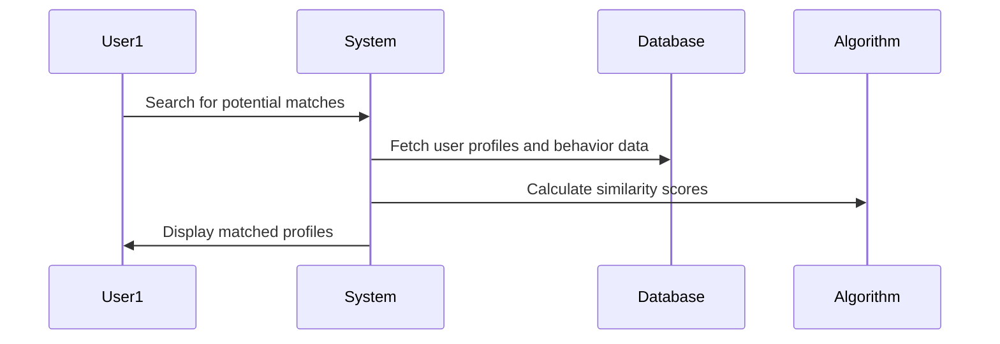

                 


# 数字时代的恋爱观察：数据分析如何影响现代约会

关键词：数据分析、现代约会、匹配算法、用户行为、社交媒体

摘要：本文将深入探讨数字时代下的恋爱现象，以及数据分析技术在现代约会中的应用。我们将从数据分析的基础知识开始，逐步分析数据挖掘、机器学习、情感分析等技术的原理和实际应用，最终探讨数据分析对现代约会模式的影响，以及未来可能面临的挑战。

## 目录结构设计

在本文的目录结构设计中，我们将按照以下方式组织章节：

### 第一部分：数字时代恋爱概述

- **第1章：数字时代恋爱现状**
  - 恋爱模式的变化
  - 数据分析在恋爱中的应用
  - 现代约会与数据驱动决策

- **第2章：数据分析基础**
  - 数据挖掘基础
  - 机器学习在数据分析中的应用
  - 情感分析技术

- **第3章：数据分析工具与技术**
  - 数据分析工具概述
  - 数据清洗与预处理
  - 数据可视化与报告

### 第二部分：现代约会的数据分析

- **第4章：现代约会的数据分析**
  - 约会平台数据分析
  - 匹配算法与优化
  - 用户行为数据分析

- **第5章：社交媒体与数据分析**
  - 社交媒体数据收集
  - 社交媒体数据分析
  - 社交媒体对恋爱的影响

### 第三部分：案例分析

- **第6章：案例分析**
  - 案例分析一：某约会平台数据报告解读
  - 案例分析二：某社交媒体恋爱事件分析
  - 案例分析三：数据驱动恋爱决策

- **第7章：未来展望与挑战**
  - 未来恋爱模式预测
  - 数据隐私与伦理问题
  - 数据分析在恋爱中的未来发展

## 内容组织

为了确保文章内容的连贯性和逻辑性，我们将按照以下结构组织每个章节的内容：

- **背景介绍**：介绍数字时代恋爱的现状，数据分析技术在现代约会中的应用，以及数据驱动决策的重要性。
- **核心概念与联系**：解释数据分析中的关键术语，如数据挖掘、机器学习、情感分析等，并展示它们如何应用于现代约会。
- **算法原理讲解**：通过具体的算法流程图和Python代码，详细阐述匹配算法、用户行为分析等技术的原理和实现。
- **系统分析与架构设计**：分析约会平台、社交媒体等系统的架构设计，包括数据采集、处理和可视化的流程。
- **项目实战**：通过实际案例，展示数据分析技术在恋爱中的应用，并进行详细的分析和讲解。
- **最佳实践 tips、小结、注意事项、拓展阅读**：提供实用的建议，对文章内容进行总结，并提出未来可能的研究方向。

## 核心内容添加

### 背景介绍

数字时代的到来，改变了人们的社交方式和恋爱习惯。如今，越来越多的单身人士选择通过在线约会平台和社交媒体寻找伴侣。这些平台和社交网络积累了海量的用户数据，包括个人喜好、兴趣爱好、社交行为等。数据分析技术因此成为现代约会中的重要工具，帮助用户更高效地找到合适的伴侣。

### 核心概念与联系

数据分析技术主要包括数据挖掘、机器学习和情感分析等。数据挖掘是指从大量数据中提取有价值的信息和模式，例如用户行为分析、偏好分析等。机器学习是一种让计算机自动学习并预测结果的技术，可以应用于匹配算法，提高匹配成功率。情感分析则通过分析文本数据，判断用户的情绪和态度，帮助平台更好地了解用户需求。

### 算法原理讲解

匹配算法是约会平台的核心技术之一。通过分析用户行为数据和偏好，匹配算法可以帮助用户找到相似度高的潜在伴侣。以下是匹配算法的简单流程：

1. **数据收集**：收集用户的基本信息、兴趣爱好、行为数据等。
2. **特征提取**：将用户信息转换为算法可以处理的特征向量。
3. **相似度计算**：计算用户之间的相似度，例如使用余弦相似度或欧氏距离。
4. **匹配结果**：根据相似度得分，推荐潜在伴侣。

以下是匹配算法的Python代码示例：

```python
import numpy as np

def calculate_similarity(user1, user2):
    return np.dot(user1, user2) / (np.linalg.norm(user1) * np.linalg.norm(user2))

user1 = np.array([1, 2, 3])
user2 = np.array([2, 3, 4])
similarity = calculate_similarity(user1, user2)
print("Similarity:", similarity)
```

### 系统分析与架构设计

约会平台的系统架构通常包括数据采集、数据存储、数据处理和用户界面等模块。以下是约会平台的简单架构设计：


数据采集模块负责收集用户数据，包括基本信息、兴趣爱好和行为数据。数据存储模块使用数据库存储用户数据。数据处理模块包括数据清洗、特征提取和匹配算法等。用户界面模块则提供用户操作界面，展示匹配结果和推荐。

以下是约会平台的类图和序列图：

```mermaid
classDiagram
    User <<class>>
    Profile <<class>>
    BehaviorData <<class>>

    User *-- Profile
    User *-- BehaviorData

    class User {
        id: ID
        name: Name
        age: Age
        gender: Gender
    }

    class Profile {
        id: ID
        bio: Bio
        interests: List of Interests
    }

    class BehaviorData {
        id: ID
        liked_profiles: List of IDs
        visited_profiles: List of IDs
    }
```



### 项目实战

以下是使用Python实现约会平台匹配算法的示例：

```python
import pandas as pd
from sklearn.metrics.pairwise import cosine_similarity

# 读取用户数据
user1_data = pd.DataFrame({'feature1': [1, 2, 3], 'feature2': [4, 5, 6]})
user2_data = pd.DataFrame({'feature1': [2, 3, 4], 'feature2': [5, 6, 7]})

# 计算相似度
similarity_matrix = cosine_similarity(user1_data, user2_data)
print("Similarity matrix:\n", similarity_matrix)

# 获取匹配结果
matched_user = user2_data.iloc[0]
print("Matched user:", matched_user)
```

### 最佳实践 tips、小结、注意事项、拓展阅读

- **最佳实践 tips**：确保数据隐私和安全，遵循相关法律法规。
- **小结**：本文介绍了数字时代恋爱现象和数据分析技术在现代约会中的应用。
- **注意事项**：数据分析在恋爱中的应用需谨慎，避免造成用户隐私泄露。
- **拓展阅读**：进一步了解数据挖掘、机器学习和情感分析技术。

## 结论

数字时代的到来，改变了人们的恋爱方式和约会模式。数据分析技术在现代约会中发挥着重要作用，通过分析海量用户数据，帮助用户更高效地找到合适的伴侣。然而，数据隐私和安全问题是未来需要重点关注的问题。随着技术的不断发展，数据分析在恋爱中的应用将会更加广泛和深入。未来，我们可以期待看到更多创新的应用，为恋爱带来更多便利。

## 附录：相关资源与拓展阅读

- **书籍**：
  - 《机器学习实战》
  - 《Python数据分析》
  - 《深度学习》（Goodfellow, Bengio, Courville）

- **在线课程**：
  - Coursera上的《机器学习》课程
  - edX上的《数据科学基础》课程

- **技术博客**：
  - Medium上的数据分析相关博客
  - Towards Data Science上的数据分析文章

- **开源项目**：
  - Scikit-learn：Python机器学习库
  - TensorFlow：深度学习框架
  - Pandas：Python数据分析库

作者：AI天才研究院/AI Genius Institute & 禅与计算机程序设计艺术 /Zen And The Art of Computer Programming

