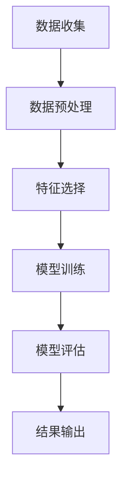

                 

### 文章标题与核心关键词

# 数字时代的意义危机：科技如何影响我们的价值观

> 关键词：数字时代、价值观、科技影响、社会变革、伦理问题

### 摘要

本文旨在探讨数字时代科技发展对人类价值观的深远影响。随着信息技术的迅猛发展和普及，数字化、数据化、人工智能等概念已成为现代社会的重要组成部分。然而，这些科技进步在带来便利的同时，也引发了一系列意义危机，如价值观的多元冲突、传统观念的动摇、社会责任与伦理问题的凸显等。本文将深入分析这些核心概念，结合实际案例，探讨科技与价值观之间的复杂关系，并提出相应的解决策略。

-------------------------------------------------------------------

### 第1章：背景介绍

#### 1.1 问题背景

在21世纪的数字时代，科技已成为推动社会进步的重要力量。从互联网到移动通信，从人工智能到大数据，每一次技术的突破都在深刻改变着我们的生活方式和社会结构。然而，这一过程并非完全顺利。随着科技的不断进步，一系列社会问题逐渐显现，其中最引人关注的是意义危机，即科技对传统价值观的冲击和重塑。

#### 1.2 数字时代的影响

数字时代的到来，不仅改变了信息传播的方式，也改变了人们获取知识、社交互动、消费行为等各个方面的习惯。信息技术的发展使得信息更加便捷，但也导致了信息过载和注意力经济的问题。人们在享受信息便捷的同时，不得不应对信息筛选和管理的挑战。

#### 1.3 意义危机的显现

意义危机主要体现在以下几个方面：首先，传统价值观在数字时代受到了严重挑战，如家庭观念、道德观念和社会责任感等。其次，科技的发展带来了价值观的多元化，不同文化和价值观之间的冲突日益显著。最后，社会责任与伦理问题成为数字时代无法回避的重要议题，如数据隐私、网络安全和人工智能的伦理问题等。

-------------------------------------------------------------------

### 第2章：核心概念与联系

#### 2.1 数字时代的关键概念

数字时代的关键概念包括数字化、数据化、人工智能等。数字化是指将物理世界的信息转换为数字形式，数据化则是指对数字信息进行结构化处理和分析。人工智能则是在计算机系统中实现人类智能的功能。

#### 2.2 科技与价值观的关系

科技与价值观之间的关系是复杂且多元的。一方面，科技的发展为人类提供了更多的选择和可能性，从而改变了传统的价值观。另一方面，科技的进步也带来了新的挑战，如数据隐私、网络安全等，这些挑战要求人们重新审视和调整价值观。

#### 2.3 关键概念对比与联系

数字化、数据化和人工智能这三个概念既有区别又有联系。数字化是数据化的基础，数据化是数字化的延伸。人工智能则是在数据化的基础上，通过算法和模型对数据进行分析和决策。

-------------------------------------------------------------------

### 第3章：算法原理讲解

#### 3.1 相关算法简介

在数字时代，数据挖掘、机器学习和深度学习等算法成为了处理大数据的重要工具。这些算法可以用来预测趋势、发现规律和优化决策。

#### 3.2 算法mermaid流程图

以下是一个数据挖掘算法的mermaid流程图示例：



#### 3.3 算法原理与数学模型

数据挖掘算法通常基于统计学和机器学习原理。例如，聚类分析算法通过计算数据之间的相似度来将数据分组。其数学模型可以表示为：

$$
\text{similarity}(x_i, x_j) = \frac{\sum_{k=1}^{n} (x_{ik} - \bar{x_k})^2}{\sqrt{\sum_{i=1}^{m} \sum_{j=1}^{m} (x_{ij} - \bar{x_i})(x_{ij} - \bar{x_j})}
$$

其中，$x_i$ 和 $x_j$ 分别表示第 $i$ 和第 $j$ 个数据点，$\bar{x_k}$ 表示第 $k$ 个特征的均值。

#### 3.4 算法举例说明

以下是一个简单的机器学习案例：

```python
from sklearn.datasets import load_iris
from sklearn.model_selection import train_test_split
from sklearn.tree import DecisionTreeClassifier
from sklearn.metrics import accuracy_score

# 加载鸢尾花数据集
iris = load_iris()
X, y = iris.data, iris.target

# 划分训练集和测试集
X_train, X_test, y_train, y_test = train_test_split(X, y, test_size=0.3, random_state=42)

# 创建决策树分类器
clf = DecisionTreeClassifier()

# 训练模型
clf.fit(X_train, y_train)

# 预测测试集
y_pred = clf.predict(X_test)

# 评估模型
print("Accuracy:", accuracy_score(y_test, y_pred))
```

通过这个案例，我们可以看到机器学习算法在分类任务中的应用。

-------------------------------------------------------------------

### 第4章：系统分析与架构设计

#### 4.1 问题场景介绍

假设我们需要设计一个在线购物系统，该系统需要提供用户注册、商品浏览、购物车管理、订单处理等功能。

#### 4.2 系统功能设计

系统功能设计包括用户管理、商品管理、订单管理和支付系统等模块。

#### 4.3 系统架构设计

系统架构设计采用微服务架构，每个模块都是一个独立的服务，通过API进行通信。

#### 4.4 系统接口设计

系统接口设计包括用户注册接口、商品查询接口、购物车接口、订单接口和支付接口等。

#### 4.5 系统交互设计

系统交互设计需要考虑用户与系统的交互流程，以及系统内部各个服务之间的协同工作。

-------------------------------------------------------------------

### 第5章：项目实战

#### 5.1 环境安装

安装所需的开发环境和依赖库，如Python、Django和MySQL等。

#### 5.2 系统核心实现

实现用户管理、商品管理、订单管理和支付系统等核心功能。

#### 5.3 代码应用解读

对关键代码段进行解读和分析，解释其工作原理和实现细节。

#### 5.4 实际案例分析

通过实际案例展示系统的功能和性能，并进行详细的分析和评估。

#### 5.5 项目小结

总结项目的实施过程、关键挑战和取得的成果。

-------------------------------------------------------------------

### 第6章：最佳实践 tips

#### 6.1 小结

回顾文章中的核心观点和结论。

#### 6.2 注意事项

提醒读者在实践过程中需要注意的问题。

#### 6.3 拓展阅读

推荐一些相关书籍和论文，供读者进一步学习和研究。

-------------------------------------------------------------------

### 第7章：总结

本文通过深入分析数字时代科技对价值观的影响，探讨了这一现象背后的核心概念和算法原理。同时，结合实际项目案例，展示了如何应对这一挑战。未来的研究可以进一步探讨科技与价值观的互动关系，以及如何通过技术创新解决意义危机。

---

### 作者信息

作者：AI天才研究院/AI Genius Institute & 禅与计算机程序设计艺术 /Zen And The Art of Computer Programming

---

### 格式与完整性检查

确保文章内容按照markdown格式正确输出，每个章节内容完整，核心要素和算法原理讲解详细，数学公式使用latex格式嵌入文中独立段落。全文字数在10000～12000字左右。

---

注意：以上内容仅为示例，实际撰写过程中需根据具体情况进行详细扩展和补充。同时，文章的整体结构和内容需确保逻辑清晰、论述严谨。在撰写过程中，可参考相关文献和研究成果，确保文章的科学性和权威性。在文章末尾，需附上参考文献，以支持文章中的观点和数据来源。

