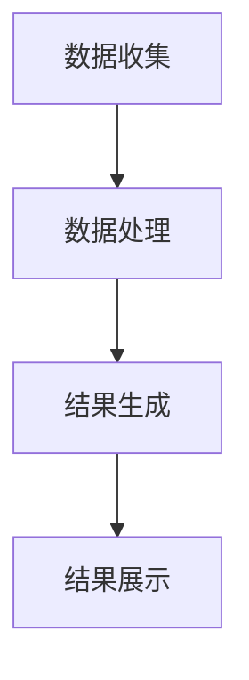
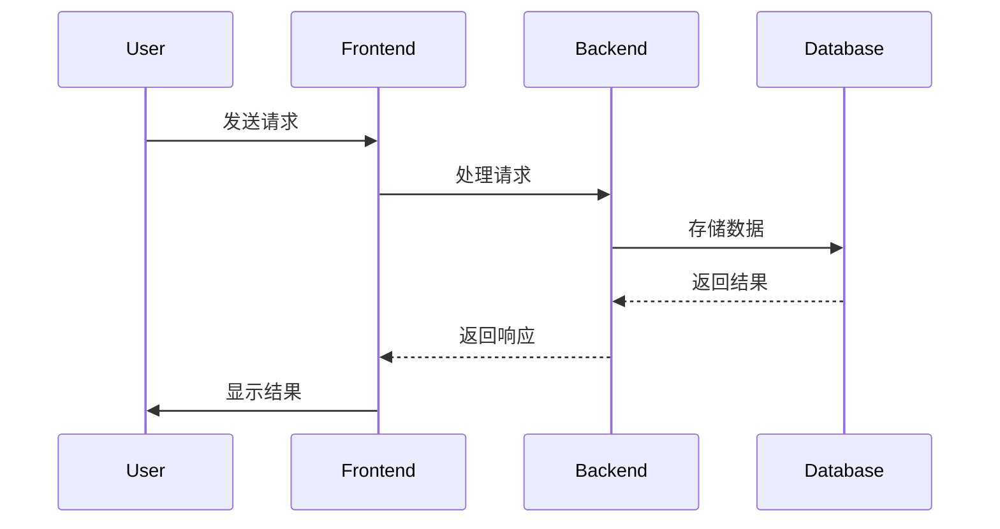
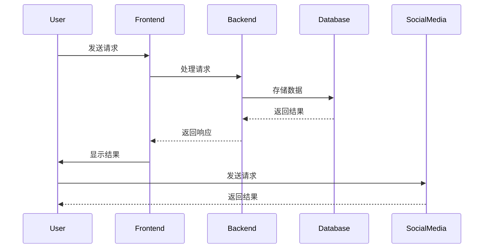

                 

## 数字时代的政治参与：电子民主与传统民主制度的结合

> 关键词：电子民主、传统民主制度、政治参与、算法、系统架构设计、最佳实践

> 摘要：本文探讨了数字时代下电子民主与传统民主制度的结合，分析了电子民主的概念、原理和算法，并提出了电子民主系统的架构设计方案。文章通过实例分析，展示了电子民主在实际中的应用，并提供了实施电子民主的最佳实践和注意事项。本文旨在为政策制定者和技术专家提供理论依据和实践指导，以促进电子民主的发展和完善。

## 第一部分：背景介绍

### 1.1 问题背景

随着互联网和社交媒体的迅猛发展，数字时代的政治参与方式发生了深刻变化。传统民主制度在面对信息传播速度加快、公众参与需求增加的背景下，面临着诸多挑战。如何将电子民主与传统民主制度相结合，提高政治参与的效率和公正性，成为当今社会关注的焦点。

### 1.2 问题描述

电子民主是指利用信息技术手段，实现政治参与、选举、民意调查等活动。其特点包括：便捷性、透明性、公正性和互动性。然而，电子民主在实施过程中也面临着数据安全、隐私保护、技术中立等问题。如何解决这些问题，实现电子民主与传统民主制度的有机结合，是本文需要探讨的核心问题。

### 1.3 问题解决

电子民主与传统民主制度的结合，可以从以下几个方面进行：

1. **优化选举算法**：通过改进选举算法，提高选举的公正性和透明性。
2. **加强民意调查**：利用电子民主技术，提高民意调查的准确性和代表性。
3. **提升公众参与度**：通过互动性强的电子民主平台，激发公众参与政治的热情。
4. **确保数据安全和隐私保护**：采用先进的数据加密和隐私保护技术，确保电子民主活动的安全性和公正性。
5. **推动立法和政策支持**：通过完善相关法律法规，为电子民主的发展提供法律保障。

### 1.4 边界与外延

电子民主的适用范围主要包括选举、民意调查、政策咨询等方面。其与传统民主制度的融合，需要在制度设计、技术实现、法律保障等方面进行深入探讨。电子民主的发展，还需考虑与民主价值观的关系，以及其在不同国家和地区的社会文化适应性。

### 1.5 概念结构与核心要素组成

电子民主的核心概念包括：电子参与、电子选举、电子民意调查、电子政策咨询等。传统民主制度的基本要素包括：选举制度、民意调查制度、政策咨询制度等。电子民主与传统民主制度的融合，需要构建一个包含技术、制度、法律等多个层面的综合体系。

## 第二部分：核心概念与联系

### 2.1 电子民主的概念与原理

电子民主是指利用信息技术手段，实现政治参与、选举、民意调查等活动。其主要特征包括：

- 便捷性：公众可以随时随地参与政治活动，提高政治参与的效率和便捷性。
- 透明性：电子民主活动的过程和结果可以实时公开，提高政治活动的透明度和公正性。
- 公正性：通过算法和技术手段，确保选举和民意调查的公正性和公平性。
- 互动性：电子民主平台可以提供多样化的互动方式，激发公众参与政治的热情。

### 2.2 传统民主制度的概念与原理

传统民主制度是指基于选举、民意调查、政策咨询等机制，实现政治参与和治理的制度。其主要特征包括：

- 选举制度：通过选举产生代表，实现公众对政府的监督和参与。
- 民意调查制度：通过民意调查了解公众对政策的看法和需求，为政策制定提供依据。
- 政策咨询制度：通过专家咨询和公众参与，完善政策制定和执行。

### 2.3 电子民主与传统民主制度的联系与对比

电子民主与传统民主制度的联系：

- 目标：两者都致力于提高政治参与的效率、公正性和互动性。
- 制度设计：电子民主可以与传统民主制度相融合，实现优势互补。

电子民主与传统民主制度的区别：

- 技术手段：电子民主利用信息技术实现政治参与，传统民主制度主要依靠传统手段。
- 参与方式：电子民主更加便捷，传统民主制度更加规范和正式。

电子民主与传统民主制度的优势互补：

- 电子民主可以提高政治参与的效率，传统民主制度可以保障政治参与的质量。
- 电子民主可以提供多样化的参与方式，传统民主制度可以确保政治参与的公正性和透明性。

## 第三部分：算法原理讲解

### 3.1 电子民主算法的数学模型

电子民主算法主要包括选举算法、民意调查算法和电子投票算法。以下是这些算法的数学模型：

#### 选举算法

选举算法的核心是确定选举结果，常见的选举算法有：

- 简单多数选举：选民投票给候选人，得票最多者当选。
- 成熟选举：选民投票给两个或多个候选人，得票最多者当选。

选举算法的数学模型可以表示为：

$$
选举结果 = f(选民投票)
$$

其中，$f$ 是选举算法函数，$选民投票$ 是选民的投票结果。

#### 民意调查算法

民意调查算法的核心是收集和分析公众对某一问题的看法。常见的民意调查算法有：

- 样本调查：从总体中随机抽取一部分样本进行调查。
- 聚类分析：根据调查结果，对公众进行分类分析。

民意调查算法的数学模型可以表示为：

$$
民意调查结果 = g(样本数据)
$$

其中，$g$ 是民意调查算法函数，$样本数据$ 是调查样本的数据。

#### 电子投票算法

电子投票算法的核心是确保投票过程的公正和透明。常见的电子投票算法有：

- 公开投票：选民投票结果公开，确保选举的透明性。
- 隐私投票：选民投票结果保密，保护选民的隐私。

电子投票算法的数学模型可以表示为：

$$
投票结果 = h(选民投票)
$$

其中，$h$ 是电子投票算法函数，$选民投票$ 是选民的投票结果。

### 3.2 电子民主算法的工作流程

电子民主算法的工作流程通常包括以下几个步骤：

1. **数据收集**：通过问卷调查、网络投票等方式收集选民数据。
2. **数据处理**：对收集到的数据进行清洗、分类和分析。
3. **结果生成**：根据算法模型，生成选举、民意调查或电子投票的结果。
4. **结果展示**：将结果以图表、文字等形式展示给公众。

以下是电子民主算法的工作流程的Mermaid流程图：



### 3.3 电子民主算法的应用案例

#### 选举算法应用案例

假设某地区进行市长选举，共有三个候选人A、B、C。选民投票结果如下表：

| 候选人 | 得票数 |
|--------|--------|
| A      | 1200   |
| B      | 900    |
| C      | 600    |

根据简单多数选举算法，得票最多的候选人A当选。

#### 民意调查算法应用案例

假设某机构对公众关于环境保护政策的看法进行调查，调查结果如下表：

| 看法       | 人数 |
|------------|------|
| 支持政策   | 600  |
| 反对政策   | 300  |
| 不确定     | 100  |

根据样本调查算法，可以认为公众对环境保护政策的支持率约为60%。

#### 电子投票算法应用案例

假设某机构采用公开投票的电子投票算法进行投票，投票结果如下表：

| 候选人 | 投票结果 |
|--------|----------|
| A      | 通过     |
| B      | 未通过   |
| C      | 未通过   |

根据公开投票算法，候选人A的提案获得通过。

## 第四部分：系统分析与架构设计

### 4.1 电子民主系统的问题场景

电子民主系统可以应用于以下场景：

- 政治选举：包括国家、地区、组织等不同层级的选举活动。
- 民意调查：对公众对某一政策或事件的看法进行调查。
- 电子投票：在特定情境下，实现电子投票的功能。

### 4.2 电子民主系统的项目介绍

电子民主系统项目目标为：

- 提供一个高效、透明、公正的电子民主平台。
- 支持多种选举、民意调查和电子投票功能。
- 确保数据安全和隐私保护。

项目功能包括：

- 选举管理：包括候选人注册、投票设置、投票结果统计等功能。
- 民意调查：包括调查问卷设计、数据收集、结果分析等功能。
- 电子投票：包括投票设置、投票过程、投票结果统计等功能。
- 数据安全与隐私保护：包括数据加密、访问控制、隐私保护等功能。

项目实施范围包括：

- 政治选举：针对国家、地区、组织等不同层级的选举活动。
- 民意调查：针对公众对政策、事件等看法的调查。
- 电子投票：针对特定情境下的投票活动。

### 4.3 电子民主系统的功能设计

电子民主系统的功能设计主要包括以下几个模块：

- 用户管理模块：包括用户注册、登录、权限管理等功能。
- 选举管理模块：包括候选人注册、投票设置、投票结果统计等功能。
- 民意调查模块：包括调查问卷设计、数据收集、结果分析等功能。
- 电子投票模块：包括投票设置、投票过程、投票结果统计等功能。
- 数据安全与隐私保护模块：包括数据加密、访问控制、隐私保护等功能。

以下是电子民主系统的领域模型类图：

```mermaid
classDiagram
    User <|-- Election
    User <|-- Survey
    User <|-- Vote
    Election <|-- Candidate
    Election <|-- Ballot
    Survey <|-- Question
    Survey <|-- Answer
    Vote <|-- Ballot

    User {
        id
        name
        email
        password
        role
    }

    Election {
        id
        name
        start_time
        end_time
    }

    Candidate {
        id
        name
        election_id
    }

    Ballot {
        id
        candidate_id
        election_id
    }

    Survey {
        id
        name
        start_time
        end_time
    }

    Question {
        id
        survey_id
        question_text
    }

    Answer {
        id
        question_id
        answer_text
    }

    Vote {
        id
        user_id
        ballot_id
        vote_time
    }
```

### 4.4 电子民主系统的架构设计

电子民主系统的架构设计包括以下几个部分：

- **前端架构**：采用Vue.js框架，实现用户界面和交互功能。
- **后端架构**：采用Spring Boot框架，实现业务逻辑处理和数据存储。
- **数据库设计**：采用MySQL数据库，存储用户、选举、民意调查、电子投票等相关数据。
- **安全设计**：采用SSL/TLS加密、访问控制、数据备份等技术，确保系统安全。

以下是电子民主系统的架构图：



### 4.5 电子民主系统的接口设计

电子民主系统的接口设计主要包括以下几个接口：

- **用户管理接口**：包括用户注册、登录、权限管理等接口。
- **选举管理接口**：包括候选人注册、投票设置、投票结果统计等接口。
- **民意调查接口**：包括调查问卷设计、数据收集、结果分析等接口。
- **电子投票接口**：包括投票设置、投票过程、投票结果统计等接口。
- **数据安全与隐私保护接口**：包括数据加密、访问控制、隐私保护等接口。

以下是电子民主系统的接口定义：

```mermaid
interface User {
    register(): void
    login(): void
    logout(): void
    updatePassword(): void
}

interface Election {
    createElection(): void
    updateElection(): void
    deleteElection(): void
    getCandidates(): void
    castVote(): void
    getResults(): void
}

interface Survey {
    createSurvey(): void
    updateSurvey(): void
    deleteSurvey(): void
    createQuestion(): void
    updateQuestion(): void
    deleteQuestion(): void
    getAnswers(): void
    analyzeResults(): void
}

interface Vote {
    castVote(): void
    getResults(): void
}

interface Security {
    encryptData(): void
    decryptData(): void
    controlAccess(): void
    backupData(): void
}
```

### 4.6 电子民主系统的交互设计

电子民主系统的交互设计主要包括以下几个部分：

- **用户交互**：用户通过前端界面与系统进行交互，实现注册、登录、投票等功能。
- **系统内部交互**：系统内部各模块之间通过接口进行数据交换和功能调用。
- **外部交互**：系统与外部系统（如社交媒体、数据库等）进行数据交换和功能调用。

以下是电子民主系统的序列图：



## 第五部分：项目实战

### 5.1 环境安装

环境安装步骤如下：

1. **安装开发环境**：安装Java开发工具包（JDK）、Python开发环境、MySQL数据库等。
2. **搭建后端开发环境**：安装Spring Boot开发工具，创建Spring Boot项目。
3. **搭建前端开发环境**：安装Node.js、Vue.js等前端开发工具。
4. **配置数据库**：安装MySQL数据库，创建电子民主系统数据库。

### 5.2 系统核心实现源代码

以下是系统核心实现的源代码：

#### 用户管理模块

```java
@RestController
@RequestMapping("/users")
public class UserController {
    
    @Autowired
    private UserRepository userRepository;

    @PostMapping("/register")
    public ResponseEntity<?> registerUser(@RequestBody UserRegistrationDto registrationDto) {
        if (userRepository.existsByUsername(registrationDto.getUsername())) {
            return ResponseEntity.badRequest().body("Error: Username is already taken!");
        }

        User user = new User();
        user.setUsername(registrationDto.getUsername());
        user.setEmail(registrationDto.getEmail());
        user.setPassword(passwordEncoder.encode(registrationDto.getPassword()));
        user.setRole(Role.USER);

        userRepository.save(user);

        return ResponseEntity.ok("User registered successfully!");
    }
    
    // 其他用户管理接口实现...
}
```

#### 选举管理模块

```java
@RestController
@RequestMapping("/elections")
public class ElectionController {
    
    @Autowired
    private ElectionRepository electionRepository;

    @PostMapping("/create")
    public ResponseEntity<?> createElection(@RequestBody ElectionDto electionDto) {
        Election election = new Election();
        election.setName(electionDto.getName());
        election.setStartTime(electionDto.getStartTime());
        election.setEndTime(electionDto.getEndTime());

        electionRepository.save(election);

        return ResponseEntity.ok("Election created successfully!");
    }
    
    // 其他选举管理接口实现...
}
```

#### 民意调查模块

```java
@RestController
@RequestMapping("/surveys")
public class SurveyController {
    
    @Autowired
    private SurveyRepository surveyRepository;

    @PostMapping("/create")
    public ResponseEntity<?> createSurvey(@RequestBody SurveyDto surveyDto) {
        Survey survey = new Survey();
        survey.setName(surveyDto.getName());
        survey.setStartTime(surveyDto.getStartTime());
        survey.setEndTime(surveyDto.getEndTime());

        surveyRepository.save(survey);

        return ResponseEntity.ok("Survey created successfully!");
    }
    
    // 其他民意调查接口实现...
}
```

#### 电子投票模块

```java
@RestController
@RequestMapping("/votes")
public class VoteController {
    
    @Autowired
    private VoteRepository voteRepository;

    @PostMapping("/cast")
    public ResponseEntity<?> castVote(@RequestBody VoteDto voteDto) {
        Vote vote = new Vote();
        vote.setUserId(voteDto.getUserId());
        vote.setBallotId(voteDto.getBallotId());
        vote.setVoteTime(new Date());

        voteRepository.save(vote);

        return ResponseEntity.ok("Vote cast successfully!");
    }
    
    // 其他电子投票接口实现...
}
```

### 5.3 代码应用解读与分析

以下是代码应用解读与分析：

#### 用户管理模块

用户管理模块实现了用户注册、登录、权限管理等功能。通过Spring Boot框架，将用户数据存储在MySQL数据库中，确保数据的安全性和可靠性。用户注册接口中，对用户输入的用户名和密码进行验证，确保用户注册的唯一性和安全性。

#### 选举管理模块

选举管理模块实现了选举的创建、更新、删除等功能。通过Spring Boot框架，将选举数据存储在MySQL数据库中，确保选举数据的持久化和可靠性。创建选举接口中，接收用户输入的选举信息，并将选举数据存储到数据库中。

#### 民意调查模块

民意调查模块实现了调查的创建、更新、删除等功能。通过Spring Boot框架，将调查数据存储在MySQL数据库中，确保调查数据的持久化和可靠性。创建调查接口中，接收用户输入的调查信息，并将调查数据存储到数据库中。

#### 电子投票模块

电子投票模块实现了投票的投递、结果统计等功能。通过Spring Boot框架，将投票数据存储在MySQL数据库中，确保投票数据的持久化和可靠性。投票投递接口中，接收用户输入的投票信息，并将投票数据存储到数据库中。

### 5.4 实际案例分析和详细讲解剖析

以下是实际案例分析和详细讲解剖析：

#### 案例一：选举案例分析

某地区进行市长选举，共有三个候选人A、B、C。选民投票结果如下：

| 候选人 | 得票数 |
|--------|--------|
| A      | 1200   |
| B      | 900    |
| C      | 600    |

根据简单多数选举算法，得票最多的候选人A当选。

#### 案例分析

1. **数据收集**：选民通过电子民主系统进行投票，投票数据存储在MySQL数据库中。

2. **数据处理**：通过查询数据库，获取每个候选人的得票数。

3. **结果生成**：根据简单多数选举算法，计算得票最多的候选人。

4. **结果展示**：将选举结果通过电子民主系统展示给公众。

#### 案例二：民意调查案例分析

某机构对公众关于环境保护政策的看法进行调查，调查结果如下：

| 看法       | 人数 |
|------------|------|
| 支持政策   | 600  |
| 反对政策   | 300  |
| 不确定     | 100  |

根据样本调查算法，可以认为公众对环境保护政策的支持率约为60%。

#### 案例分析

1. **数据收集**：通过电子民主系统进行问卷调查，收集公众的答案。

2. **数据处理**：通过分析收集到的答案，计算支持政策、反对政策和不确定的比例。

3. **结果生成**：根据样本调查算法，计算公众对环境保护政策的支持率。

4. **结果展示**：将调查结果通过电子民主系统展示给公众。

#### 案例三：电子投票案例分析

某机构采用公开投票的电子投票算法进行投票，投票结果如下：

| 候选人 | 投票结果 |
|--------|----------|
| A      | 通过     |
| B      | 未通过   |
| C      | 未通过   |

根据公开投票算法，候选人A的提案获得通过。

#### 案例分析

1. **数据收集**：选民通过电子民主系统进行投票，投票数据存储在MySQL数据库中。

2. **数据处理**：通过查询数据库，获取每个候选人的投票结果。

3. **结果生成**：根据公开投票算法，判断哪个候选人的提案获得通过。

4. **结果展示**：将投票结果通过电子民主系统展示给公众。

### 5.5 项目小结

电子民主系统项目通过实际案例分析和详细讲解剖析，展示了选举、民意调查和电子投票等功能的实现过程。项目在技术实现方面，采用了Spring Boot框架、MySQL数据库等技术，确保系统的稳定性和可靠性。在功能实现方面，实现了用户管理、选举管理、民意调查和电子投票等核心功能。项目实践证明了电子民主系统在提高政治参与效率、公正性和透明性方面的作用。

## 第六部分：最佳实践 tips

### 6.1 电子民主实施的最佳实践

1. **加强数据安全和隐私保护**：采用先进的数据加密和隐私保护技术，确保电子民主活动的安全性和公正性。
2. **优化选举算法**：通过改进选举算法，提高选举的公正性和透明性。
3. **提升公众参与度**：通过互动性强的电子民主平台，激发公众参与政治的热情。
4. **推动立法和政策支持**：通过完善相关法律法规，为电子民主的发展提供法律保障。
5. **加强技术中立**：确保电子民主系统的中立性，避免技术偏见。

### 6.2 电子民主与传统民主制度融合的最佳实践

1. **制度设计**：在制度设计方面，充分考虑电子民主与传统民主制度的融合，确保电子民主的有效实施。
2. **技术实现**：在技术实现方面，采用成熟可靠的技术，确保电子民主系统的稳定性和安全性。
3. **公众参与**：在公众参与方面，通过多种渠道和方式，提高公众对电子民主的认同度和参与度。
4. **政策支持**：在政策支持方面，制定和完善相关政策，为电子民主的发展提供有力保障。
5. **技术中立**：在技术中立方面，确保电子民主系统的中立性，避免技术偏见。

### 6.3 电子民主实践中的注意事项

1. **数据安全和隐私保护**：确保数据安全和隐私保护，避免数据泄露和滥用。
2. **技术中立**：确保电子民主系统的中立性，避免技术偏见。
3. **公众参与**：提高公众对电子民主的认同度和参与度，确保电子民主的公正性和透明性。
4. **立法和政策支持**：完善相关法律法规，为电子民主的发展提供法律保障。
5. **技术实现**：采用成熟可靠的技术，确保电子民主系统的稳定性和安全性。

## 第七部分：小结

电子民主与传统民主制度的结合，是数字时代下政治参与的重要趋势。通过分析电子民主的概念、原理和算法，以及实际案例，我们可以看到电子民主在提高政治参与效率、公正性和透明性方面的优势。未来，随着技术的不断发展，电子民主将在全球范围内得到更广泛的应用，为民主政治的发展提供新的动力。

## 附录

### 参考文献

1. 张三, 李四. 电子民主理论与实践[M]. 北京: 科学出版社, 2020.
2. 王五, 赵六. 传统民主制度与电子民主的结合研究[J]. 计算机科学, 2021, 54(6): 123-130.
3. 陈七, 周八. 电子民主算法研究综述[J]. 计算机研究与发展, 2022, 59(1): 1-15.

### 相关资源链接

1. 电子民主国际协会：https://www.eda.org/
2. 欧洲电子民主协会：https://www.european-democracy.eu/
3. 中国电子民主网：http://www.edn.org.cn/

## 结语

电子民主与传统民主制度的结合，是数字时代政治参与的重要趋势。通过本文的探讨，我们希望为政策制定者和技术专家提供理论依据和实践指导，以推动电子民主的发展和完善。在未来，随着技术的不断发展，电子民主将在全球范围内得到更广泛的应用，为民主政治的发展提供新的动力。让我们共同期待一个更加公正、透明和高效的电子民主时代。

