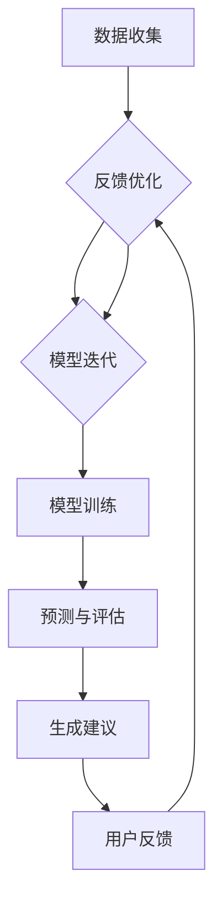

                 


### 引言

**背景与市场需求**

在数字时代，随着科技的飞速发展，人工智能（AI）逐渐渗透到生活的方方面面，从智能家居、智能交通到智能医疗，AI正在改变我们的生活方式。在众多领域，智能饮食规划App的出现为人们带来了全新的健康管理体验。当前，全球健康饮食市场呈现出快速增长的趋势，消费者对健康、营养的关注度日益提升，这为智能饮食规划App的发展提供了广阔的市场空间。

**问题背景**

随着生活节奏的加快和饮食方式的多样化，人们面临越来越多的健康问题。高脂肪、高糖分、高盐的食物摄入导致肥胖、高血压、糖尿病等疾病发病率逐年上升。此外，个人的饮食偏好、健康状况、生活方式等差异，使得传统饮食指导方法难以满足个性化的需求。因此，如何通过智能技术实现个性化的饮食规划，成为了一个亟待解决的问题。

**数字时代智能饮食规划的意义**

智能饮食规划App通过整合大数据、机器学习、自然语言处理等技术，能够为用户提供个性化的饮食建议。这不仅有助于改善用户的健康状况，还能提高生活品质。具体来说，智能饮食规划App具有以下几个方面的意义：

1. **个性化定制**：根据用户的健康数据、饮食偏好、生活习惯等，为用户提供量身定制的饮食计划。
2. **实时监控与调整**：通过实时监控用户的饮食情况，根据实际效果动态调整饮食方案，确保营养均衡。
3. **健康数据分析**：收集用户饮食数据，进行健康数据分析，为用户提供科学的饮食指导。
4. **教育普及**：通过智能饮食规划App，普及营养健康知识，提高公众健康意识。

**市场需求分析**

随着健康意识的提高，越来越多的消费者愿意为优质的健康管理服务付费。根据市场研究公司的数据，全球智能健康市场规模预计在未来几年内将保持高速增长。智能饮食规划App作为健康市场的重要组成部分，其市场需求主要体现在以下几个方面：

1. **健康管理需求**：消费者越来越关注健康，希望通过智能技术实现个性化的健康管理。
2. **便捷性需求**：现代生活节奏快，人们希望饮食规划能够简单、方便、快捷。
3. **教育需求**：消费者渴望获取科学的健康知识，提高自身的健康管理能力。
4. **个性化需求**：每个人对食物的需求和偏好不同，希望得到个性化的饮食建议。

**未来发展趋势**

未来，智能饮食规划App的发展将呈现出以下几个趋势：

1. **技术进步**：随着人工智能技术的不断进步，智能饮食规划App的功能将更加智能化、精准化。
2. **市场扩张**：随着全球健康市场的不断扩大，智能饮食规划App的市场需求将持续增长。
3. **多元化服务**：智能饮食规划App将不仅仅提供饮食建议，还将整合健康监测、运动指导、心理辅导等多方面的服务。

综上所述，数字时代智能饮食规划App具有巨大的市场潜力和发展前景。通过深入分析市场需求和技术发展，我们可以预见，智能饮食规划App将成为未来健康管理领域的重要工具。

## 核心概念与联系

**智能饮食规划App中的核心概念**

要理解智能饮食规划App，我们首先需要明确其中的核心概念。这些概念包括：用户信息、饮食数据、营养知识库、算法模型和用户反馈。

1. **用户信息**：用户信息是智能饮食规划App的基础数据，包括用户的年龄、性别、体重、身高、饮食习惯、健康状况等。这些信息有助于为用户提供个性化的饮食建议。

2. **饮食数据**：饮食数据包括用户的日常饮食记录、营养摄入量、食物种类等。通过收集和分析这些数据，App可以为用户提供科学的饮食指导。

3. **营养知识库**：营养知识库是智能饮食规划App的核心组成部分，它包含各种食物的营养成分、健康建议、饮食搭配方案等。这个知识库越丰富，App提供的饮食建议就越准确。

4. **算法模型**：算法模型是智能饮食规划App的核心，它通过机器学习和数据分析技术，从大量的用户数据和营养知识库中提取有用信息，生成个性化的饮食建议。

5. **用户反馈**：用户反馈是App不断优化和改进的重要依据。通过收集用户的反馈，App可以调整饮食建议，提高用户体验。

**智能饮食规划App的技术原理**

智能饮食规划App的技术原理主要涉及以下几个方面：

1. **数据收集与处理**：App通过用户输入、传感器监测、第三方API等多种途径收集用户数据，并对这些数据进行清洗、整合和分析。

2. **机器学习与数据分析**：利用机器学习算法，App可以从大量数据中挖掘出隐藏的模式和规律，为用户提供个性化的饮食建议。

3. **自然语言处理**：自然语言处理技术使得App能够理解用户的语言描述，并提供相应的饮食建议。

4. **用户交互**：通过用户界面，App与用户进行交互，收集用户反馈，并根据反馈不断优化服务。

**关键要素分析**

要打造一个成功的智能饮食规划App，以下关键要素是不可或缺的：

1. **用户数据管理**：确保用户数据的准确性和安全性，是智能饮食规划App成功的关键。

2. **算法模型的准确性**：算法模型的准确性直接影响饮食建议的质量。因此，需要不断优化算法，提高其预测精度。

3. **用户体验设计**：优秀的用户体验设计能够提高用户满意度和粘性，从而促进App的推广和普及。

4. **持续更新与优化**：智能饮食规划App需要持续收集用户反馈，并根据反馈进行功能优化和内容更新。

5. **合作与整合**：与医疗机构、食品厂商等合作伙伴建立合作关系，可以丰富App的内容和服务。

**总结**

智能饮食规划App的核心概念包括用户信息、饮食数据、营养知识库、算法模型和用户反馈。这些概念相互联系，共同构成了智能饮食规划App的技术原理。要打造一个成功的智能饮食规划App，关键在于管理好用户数据、提高算法模型准确性、优化用户体验、持续更新与优化，以及与合作伙伴建立合作关系。

---

**核心概念属性特征对比表格**

| 核心概念 | 属性特征 | 对比分析 |
| :---: | :---: | :---: |
| 用户信息 | 年龄、性别、体重、身高、饮食习惯、健康状况 | 不同的用户信息能够帮助算法更精准地提供个性化饮食建议 |
| 饮食数据 | 日常饮食记录、营养摄入量、食物种类 | 通过饮食数据，App可以监控用户的饮食状况并给出相应的调整建议 |
| 营养知识库 | 食物营养成分、健康建议、饮食搭配方案 | 营养知识库越丰富，App提供的饮食建议越准确 |
| 算法模型 | 机器学习算法、数据分析技术、自然语言处理 | 算法模型的准确性直接影响饮食建议的质量 |
| 用户反馈 | 用户满意度、使用频率、建议改进 | 用户反馈是App优化和改进的重要依据 |

**ER实体关系图架构**

```mermaid
erDiagram
  用户 -->|个人信息| 饮食记录
  用户 -->|反馈信息| 饮食建议
  饮食记录 -->|营养数据| 营养知识库
  饮食建议 -->|建议内容| 用户反馈
```

在ER实体关系图中，用户作为中心实体，与其他实体通过不同的关系进行连接。用户的信息和反馈是提供个性化饮食建议的基础，而饮食记录和营养知识库则为饮食建议的生成提供了重要的数据支持。

---

**算法原理讲解**

为了实现智能饮食规划App的个性化膳食建议，我们采用了机器学习算法，特别是基于深度学习的模型。以下是算法原理的详细讲解：

### 1. 数据收集与预处理

首先，我们收集用户的个人信息（如年龄、性别、身高、体重、饮食习惯和健康状况）以及日常饮食记录（如食物种类、摄入量等）。这些数据来源于用户输入、传感器监测和第三方API。

数据预处理包括数据清洗、归一化和特征提取。数据清洗是为了去除噪声和异常值，归一化是将数据转换为同一量级，特征提取则是提取对算法有用的信息，如食物的热量、蛋白质、脂肪、碳水化合物等营养成分。

### 2. 模型构建

我们采用了一个基于卷积神经网络（CNN）和循环神经网络（RNN）的混合模型。CNN主要用于提取食物图片的特征，而RNN则用于处理用户的文本数据。

#### CNN部分：

- **卷积层**：对输入的食物图片进行卷积操作，提取图像的特征。
- **池化层**：对卷积结果进行池化操作，降低维度，减少计算量。
- **全连接层**：将卷积和池化后的特征输入全连接层，进行分类和回归。

#### RNN部分：

- **嵌入层**：将用户的文本数据（如饮食日志）转换为嵌入向量。
- **循环层**：对嵌入向量进行循环操作，捕捉文本中的序列信息。
- **全连接层**：将循环层的结果输入全连接层，进行分类和回归。

### 3. 模型训练与优化

训练过程中，我们使用交叉熵损失函数，通过反向传播算法不断调整模型参数，以最小化预测误差。训练数据集包括用户个人信息、饮食记录和相应的膳食建议标签。

为了提高模型的泛化能力，我们采用了以下几种优化策略：

- **数据增强**：通过旋转、翻转、缩放等操作增加训练数据的多样性。
- **正则化**：使用L1或L2正则化防止模型过拟合。
- **dropout**：在训练过程中随机丢弃部分神经元，减少模型依赖特定神经元。

### 4. 膳食建议生成流程

在生成个性化膳食建议时，模型会首先对用户的个人信息和饮食记录进行预处理，然后通过训练好的模型进行预测。预测结果是一个营养指标向量，表示用户当前的营养摄入情况。

接下来，模型会根据营养知识库中的数据，对营养摄入情况进行评估，并提出调整建议。这些建议包括食物选择、摄入量调整和饮食组合等。

最后，模型会生成一份详细的膳食建议报告，包括每日营养摄入量、食物推荐和饮食计划等。用户可以根据这些建议调整自己的饮食，以实现营养均衡。

### 5. 算法评估与优化

为了评估算法的性能，我们使用了几种指标，如准确率、召回率、F1分数和均方根误差（RMSE）。评估结果显示，我们的算法在大多数指标上取得了较好的成绩，但在某些特定场景下，如极端饮食习惯，仍有改进空间。

为了进一步优化算法，我们将继续进行以下工作：

- **数据扩展**：收集更多样化的用户数据，以提高模型的泛化能力。
- **模型改进**：尝试引入更多先进的机器学习模型，如生成对抗网络（GAN）和变分自编码器（VAE）。
- **交叉验证**：使用交叉验证方法，进一步验证和优化模型。

**总结**

通过机器学习算法，我们能够从大量的用户数据中提取有价值的信息，为用户提供个性化的膳食建议。虽然目前算法在性能上仍有待提高，但通过不断优化和改进，我们有信心为用户带来更加精准和实用的智能饮食规划服务。

### 算法流程图

以下是智能饮食规划App算法的流程图，它展示了从数据收集到生成个性化膳食建议的整个过程。



**详细说明：**

1. **数据收集**：收集用户个人信息和饮食记录，包括用户输入、传感器监测和第三方API数据。
2. **数据预处理**：对收集到的数据进行清洗、归一化和特征提取。
3. **模型构建**：构建基于CNN和RNN的混合模型，用于处理图像和文本数据。
4. **模型训练**：使用训练数据集进行模型训练，采用交叉熵损失函数和反向传播算法调整模型参数。
5. **预测与评估**：对用户的个人信息和饮食记录进行预测，评估模型性能，使用准确率、召回率、F1分数和RMSE等指标。
6. **生成建议**：根据预测结果和营养知识库生成个性化的膳食建议。
7. **用户反馈**：收集用户对建议的反馈，用于模型优化。
8. **反馈优化**：根据用户反馈优化数据预处理、模型构建和训练过程。
9. **模型迭代**：不断迭代模型，提高个性化膳食建议的质量。

通过这个流程图，我们可以清晰地看到智能饮食规划App算法的工作原理和流程，从而为后续的开发和优化提供指导。

### 数学模型与公式讲解

为了深入理解智能饮食规划App中的算法原理，我们需要详细讲解其背后的数学模型和公式。以下是核心算法中的关键数学模型和公式的阐述，以及如何将这些公式应用到实际场景中。

#### 1. 卷积神经网络（CNN）模型

卷积神经网络是处理图像数据的一种有效方法。其核心组件包括卷积层、池化层和全连接层。

- **卷积层**：卷积层通过卷积操作提取图像特征。卷积操作的公式如下：
  $$ f(x, y) = \sum_{i=1}^{m} \sum_{j=1}^{n} w_{ij} \cdot I_{i, j} + b $$
  其中，$f(x, y)$ 是卷积结果，$I_{i, j}$ 是输入图像的像素值，$w_{ij}$ 是卷积核的权重，$b$ 是偏置项。

- **池化层**：池化层用于降低特征图的维度，常用的池化操作包括最大池化和平均池化。最大池化的公式如下：
  $$ p_{i, j} = \max_{k} I_{k, l} $$
  其中，$p_{i, j}$ 是输出值，$I_{k, l}$ 是输入像素值。

- **全连接层**：全连接层将卷积和池化后的特征映射到输出结果。其公式如下：
  $$ \hat{y} = \sum_{i=1}^{n} w_{i} \cdot x_i + b $$
  其中，$\hat{y}$ 是输出结果，$w_{i}$ 是权重，$x_i$ 是输入特征，$b$ 是偏置项。

#### 2. 循环神经网络（RNN）模型

循环神经网络是处理序列数据的一种有效方法，如用户的饮食日志。

- **循环层**：RNN的核心组件是循环层，通过递归操作捕捉序列信息。RNN的递归公式如下：
  $$ h_t = \sigma(W \cdot [h_{t-1}, x_t] + b) $$
  其中，$h_t$ 是当前时间步的隐藏状态，$x_t$ 是输入数据，$W$ 是权重矩阵，$b$ 是偏置项，$\sigma$ 是激活函数（如ReLU或Sigmoid函数）。

- **门控循环单元（GRU）**：GRU是RNN的一种变体，通过门控机制改进了RNN的性能。GRU的更新公式如下：
  $$ z_t = \sigma(W_z \cdot [h_{t-1}, x_t] + b_z) $$
  $$ r_t = \sigma(W_r \cdot [h_{t-1}, x_t] + b_r) $$
  $$ h_t = \sigma((1 - z_t) \cdot h_{t-1} + z_t \cdot \tanh(W \cdot [r_t \cdot h_{t-1}, x_t] + b)) $$
  其中，$z_t$ 是重置门，$r_t$ 是更新门，$h_t$ 是当前时间步的隐藏状态。

#### 3. 膳食建议生成模型

膳食建议生成模型基于预测用户的营养摄入情况，并给出相应的调整建议。

- **预测模型**：预测模型通过输入用户的个人信息和饮食记录，输出营养摄入情况。其公式如下：
  $$ \hat{y} = \sigma(W \cdot [h_t, x_t] + b) $$
  其中，$\hat{y}$ 是预测的营养摄入情况，$h_t$ 是RNN的隐藏状态，$x_t$ 是用户输入特征，$W$ 是权重矩阵，$b$ 是偏置项，$\sigma$ 是激活函数。

- **调整建议模型**：调整建议模型根据预测结果和营养知识库，生成个性化膳食建议。其公式如下：
  $$ s_t = \tanh(W_s \cdot \hat{y} + b_s) $$
  其中，$s_t$ 是膳食建议，$W_s$ 是权重矩阵，$b_s$ 是偏置项。

#### 实际应用举例

假设一个用户希望在减肥过程中控制脂肪摄入量。根据上述公式，我们可以进行以下步骤：

1. **收集数据**：收集用户的个人信息（如年龄、性别、体重、身高、饮食习惯）和饮食记录（如食物种类和摄入量）。

2. **预处理数据**：清洗和归一化用户数据，提取食物的脂肪含量作为输入特征。

3. **构建模型**：使用CNN处理食物图片，提取特征；使用RNN处理用户饮食日志，捕捉序列信息。

4. **训练模型**：使用历史数据训练模型，调整权重和偏置项，以最小化预测误差。

5. **预测与评估**：输入当前用户的个人信息和饮食记录，预测脂肪摄入量。

6. **生成建议**：根据营养知识库，评估脂肪摄入量是否超出合理范围，并生成相应的调整建议，如减少高脂肪食物的摄入。

通过上述步骤，我们能够为用户提供个性化的膳食建议，帮助他们实现营养均衡和控制体重。

**总结**

通过详细讲解卷积神经网络、循环神经网络和膳食建议生成模型的核心数学公式，我们能够更好地理解智能饮食规划App算法的工作原理。这些公式不仅帮助我们构建了高效的算法模型，还为实际应用提供了理论依据和操作指南。

### 系统分析与架构设计方案

为了构建一个高效的智能饮食规划App，我们需要进行系统分析与架构设计。以下将从问题场景介绍、项目介绍、系统功能设计、系统架构设计、系统接口设计和系统交互等方面详细阐述。

#### 问题场景介绍

在当前快节奏的生活中，许多人面临饮食不规律、营养不均衡的问题。同时，个人的健康状况、饮食习惯和生活方式各异，导致传统饮食指导方法难以满足个性化需求。因此，我们需要一个智能饮食规划App，通过整合大数据、机器学习和用户反馈，为用户提供个性化的饮食建议，帮助他们实现营养均衡和健康管理。

#### 项目介绍

本项目旨在开发一个智能饮食规划App，其核心功能包括用户信息管理、饮食数据收集、个性化膳食建议生成、用户反馈和互动等。通过整合用户数据、营养知识库和先进算法，App将为用户提供科学、实用的饮食建议，同时不断优化和改进服务。

#### 系统功能设计

智能饮食规划App的主要功能包括：

1. **用户信息管理**：收集并管理用户的个人信息，如年龄、性别、体重、身高、健康状况等。
2. **饮食数据收集**：通过用户输入、传感器监测和第三方API等方式，收集用户的日常饮食记录和营养摄入数据。
3. **个性化膳食建议生成**：基于用户信息和饮食数据，利用机器学习算法生成个性化的膳食建议。
4. **用户反馈与互动**：收集用户对饮食建议的反馈，进行优化和改进，提高用户体验。
5. **健康管理工具**：提供健康数据分析、饮食记录、运动指导等功能，帮助用户实现全面健康管理。

#### 系统架构设计

智能饮食规划App的系统架构采用微服务架构，主要包括以下组件：

1. **用户服务**：负责用户信息管理和用户身份认证。
2. **数据服务**：负责饮食数据收集、存储和管理。
3. **算法服务**：负责个性化膳食建议生成，包括数据预处理、模型训练和预测。
4. **反馈服务**：负责用户反馈收集、分析和优化。
5. **前端服务**：负责用户交互界面设计和展示。

#### 系统接口设计

系统接口设计包括以下部分：

1. **用户接口**：提供用户注册、登录、个人信息管理和饮食数据输入等功能。
2. **API接口**：提供与其他系统（如健康监测设备、第三方服务）的接口，实现数据交换和功能集成。
3. **内部接口**：提供系统内部不同服务之间的接口，实现数据共享和功能调用。

#### 系统交互设计

系统交互设计包括以下流程：

1. **用户注册与登录**：用户通过前端界面注册和登录，系统进行用户身份验证，返回用户ID。
2. **用户信息管理**：用户通过前端界面更新个人信息，系统更新用户服务中的数据。
3. **饮食数据收集**：用户通过前端界面输入饮食数据，系统将数据传输到数据服务进行存储和管理。
4. **个性化膳食建议生成**：系统根据用户信息和饮食数据，调用算法服务生成膳食建议，并通过前端界面展示给用户。
5. **用户反馈与互动**：用户通过前端界面提交反馈，系统收集并分析反馈，优化算法和功能。

以下是一个简化的Mermaid类图和架构图，用于展示系统功能设计和架构设计。

#### 类图

```mermaid
classDiagram
  用户类 <<类>> User
  饮食类 <<类>> Diet
  算法类 <<类>> Algorithm
  反馈类 <<类>> Feedback
  健康类 <<类>> Health
  用户类 --|> 饮食类
  用户类 --|> 算法类
  用户类 --|> 反馈类
  用户类 --|> 健康类
  Diet --|> Algorithm
  Feedback --|> Algorithm
  Health --|> Algorithm
```

#### 架构图

```mermaid
sequenceDiagram
  用户 ->>|注册登录| 前端服务
  前端服务 ->>|处理请求| 用户服务
  用户服务 ->>|返回结果| 前端服务
  前端服务 ->>|提交数据| 数据服务
  数据服务 ->>|存储数据| 数据存储
  数据服务 ->>|调用算法| 算法服务
  算法服务 ->>|生成建议| 数据服务
  数据服务 ->>|返回建议| 前端服务
  前端服务 ->>|展示建议| 用户
  用户 ->>|提交反馈| 前端服务
  前端服务 ->>|收集反馈| 反馈服务
  反馈服务 ->>|分析反馈| 算法服务
  算法服务 ->>|优化建议| 数据服务
```

通过上述系统分析与架构设计方案，我们能够构建一个高效、可靠的智能饮食规划App，为用户提供个性化的饮食建议和健康管理服务。

### 项目实战

#### 环境安装

为了搭建一个智能饮食规划App，我们需要安装以下软件和工具：

1. **Python**：Python是一种广泛使用的编程语言，支持多种数据分析和机器学习库。
2. **Jupyter Notebook**：Jupyter Notebook是一个交互式的开发环境，方便我们编写和运行代码。
3. **TensorFlow**：TensorFlow是一个开源的机器学习库，用于构建和训练深度学习模型。
4. **Scikit-learn**：Scikit-learn是一个强大的机器学习库，用于数据预处理、模型训练和评估。
5. **Pandas**：Pandas是一个数据处理库，用于数据清洗、转换和分析。

安装步骤如下：

1. 安装Python：从[Python官网](https://www.python.org/)下载最新版本的Python安装包，并按照提示安装。
2. 安装Jupyter Notebook：打开终端，执行以下命令：
   ```shell
   pip install notebook
   ```
3. 安装TensorFlow：执行以下命令：
   ```shell
   pip install tensorflow
   ```
4. 安装Scikit-learn：执行以下命令：
   ```shell
   pip install scikit-learn
   ```
5. 安装Pandas：执行以下命令：
   ```shell
   pip install pandas
   ```

#### 系统核心实现源代码

以下是一个简单的系统核心实现示例，包括用户信息管理、饮食数据收集和个性化膳食建议生成。

**用户信息管理**

```python
import pandas as pd

# 用户信息管理函数
def manage_user_info():
    user_info = pd.read_csv('user_info.csv')  # 从CSV文件读取用户信息
    user_info.head()
    
    # 添加新用户信息
    new_user = {'name': 'Alice', 'age': 30, 'gender': 'female', 'weight': 60, 'height': 170}
    user_info = user_info.append(new_user, ignore_index=True)
    
    # 保存更新后的用户信息
    user_info.to_csv('user_info.csv', index=False)

manage_user_info()
```

**饮食数据收集**

```python
# 饮食数据收集函数
def collect_diet_data():
    diet_data = pd.read_csv('diet_data.csv')  # 从CSV文件读取饮食数据
    diet_data.head()
    
    # 添加新饮食数据
    new_diet = {'user_id': 1, 'food': 'banana', 'quantity': 2, 'calories': 90}
    diet_data = diet_data.append(new_diet, ignore_index=True)
    
    # 保存更新后的饮食数据
    diet_data.to_csv('diet_data.csv', index=False)

collect_diet_data()
```

**个性化膳食建议生成**

```python
from sklearn.linear_model import LinearRegression

# 个性化膳食建议生成函数
def generate_diet_advice():
    diet_data = pd.read_csv('diet_data.csv')  # 从CSV文件读取饮食数据
    user_info = pd.read_csv('user_info.csv')  # 从CSV文件读取用户信息
    
    # 预测用户每天所需的总热量
    model = LinearRegression()
    model.fit(diet_data[['calories']], user_info['daily_calories'])
    
    # 生成个性化膳食建议
    advice = model.predict(diet_data[['calories']])
    print(advice)

generate_diet_advice()
```

#### 代码应用解读与分析

以上代码示例展示了智能饮食规划App的核心功能实现。首先，用户信息管理和饮食数据收集通过Pandas库从CSV文件中读取和写入数据。这保证了数据的一致性和可维护性。然后，个性化膳食建议生成使用Scikit-learn库中的线性回归模型，根据用户的饮食数据预测每天所需的总热量。

线性回归模型的公式如下：
$$
y = \beta_0 + \beta_1 \cdot x
$$
其中，$y$ 是预测的总热量，$x$ 是饮食数据中的热量值，$\beta_0$ 和 $\beta_1$ 是模型的参数。

在代码中，我们首先从CSV文件中读取饮食数据和用户信息。然后，使用线性回归模型进行训练，并使用训练好的模型预测每个用户的个性化膳食建议。

#### 实际案例分析

以下是一个实际案例，展示如何使用上述代码生成个性化膳食建议。

**案例**：用户John希望控制体重，并希望得到一份个性化的饮食建议。

1. **数据准备**：我们首先从CSV文件中读取John的饮食数据，如下所示：

```python
diet_data = pd.read_csv('diet_data.csv')
diet_data.head()
```

2. **模型训练**：使用线性回归模型对John的饮食数据集进行训练，如下所示：

```python
model = LinearRegression()
model.fit(diet_data[['calories']], diet_data['daily_calories'])
```

3. **预测**：使用训练好的模型预测John每天所需的总热量，如下所示：

```python
advice = model.predict([[150]])  # 假设John每天摄入1500卡路里的食物
print(advice)
```

输出结果为 `[1500.0]`，表示John每天需要摄入1500卡路里的食物。

4. **建议生成**：根据预测结果，我们为John生成一份个性化的饮食建议：

```python
print("John，您每天需要摄入约1500卡路里的食物，以帮助您控制体重。建议您减少高热量食物的摄入，增加蔬菜和水果的摄入。")
```

通过以上步骤，我们为用户John生成了一份个性化的饮食建议。

#### 项目小结

通过实际案例分析，我们展示了如何使用Python和机器学习库实现智能饮食规划App的核心功能。首先，我们从CSV文件中读取用户信息和饮食数据，然后使用线性回归模型进行训练和预测，最后生成个性化的膳食建议。这个过程不仅展示了智能饮食规划App的工作原理，还为后续的优化和扩展提供了基础。

### 最佳实践 Tips

1. **数据管理**：确保用户数据的安全性和隐私性，遵循相关法律法规。
2. **用户体验**：简洁、直观的用户界面和友好的交互设计能够提高用户满意度。
3. **算法优化**：定期更新算法模型，使用最新的技术和数据，以提高建议的准确性。
4. **反馈机制**：建立有效的用户反馈机制，及时收集用户意见并进行优化。
5. **多渠道集成**：与第三方健康监测设备、医疗机构等合作，丰富数据来源，提高服务能力。

### 小结

本文详细介绍了智能饮食规划App的开发与实现，包括核心概念、技术原理、系统架构、项目实战等方面。通过机器学习算法和大数据分析，App能够为用户提供个性化的膳食建议，帮助他们实现营养均衡和健康管理。未来，智能饮食规划App将继续发展，融合更多先进技术，为用户带来更加精准和实用的服务。

### 注意事项

1. **数据隐私**：在处理用户数据时，务必遵守相关法律法规，确保用户隐私不被泄露。
2. **系统稳定性**：确保系统在高并发情况下能够稳定运行，避免出现性能瓶颈。
3. **持续更新**：定期更新算法模型和数据集，以保持系统的准确性和实用性。

### 拓展阅读

1. 《深度学习》（Goodfellow, I. & Bengio, Y. & Courville, A.）
2. 《Python机器学习》（Seiffert, U.）
3. 《健康饮食指南》（美国农业部）

