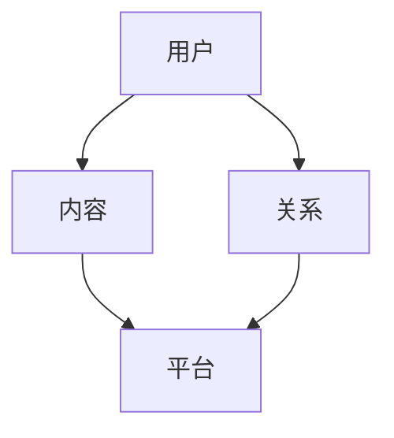
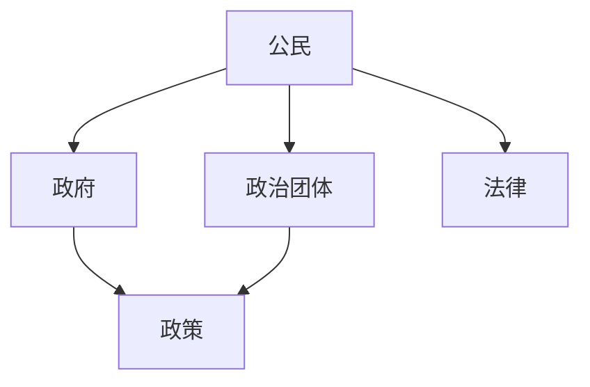
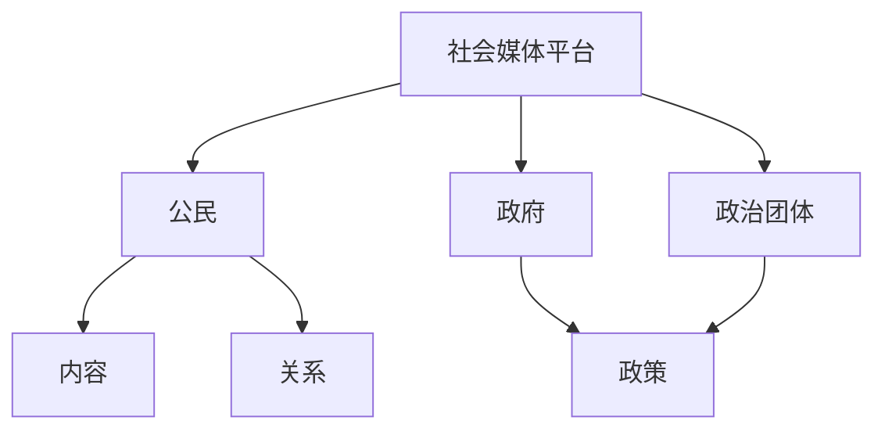
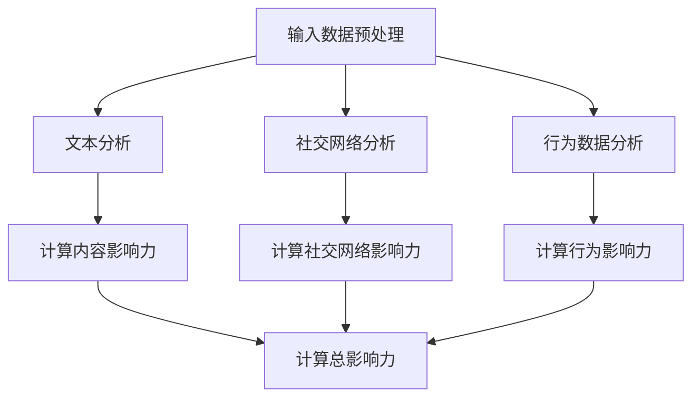
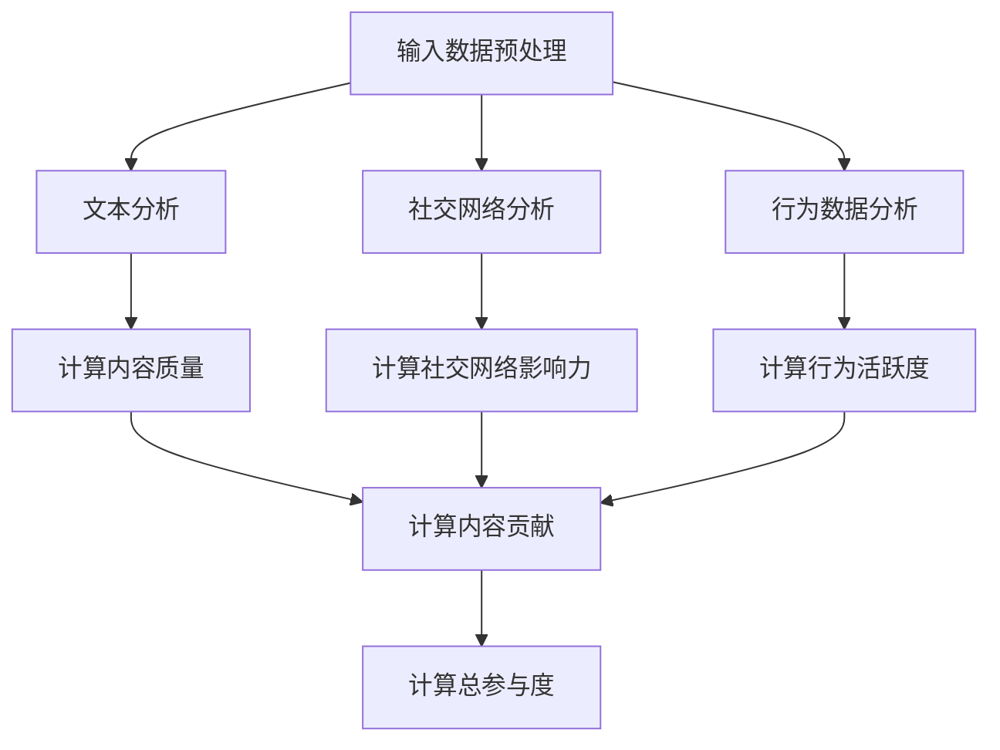
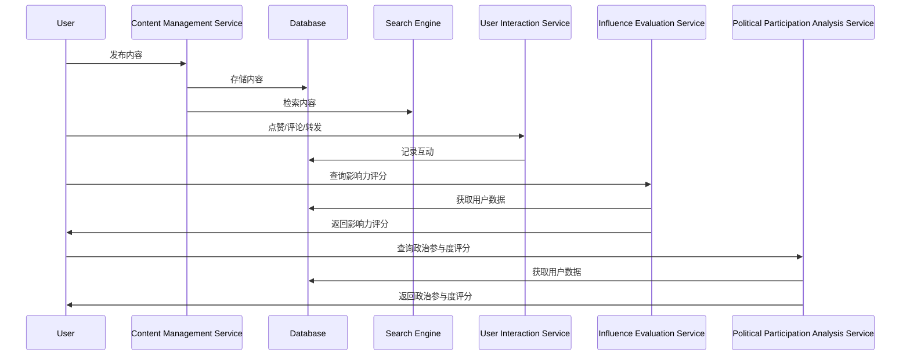

                 

### 数字时代的民主参与：社交媒体对政治的影响

> 关键词：社交媒体、政治影响、民主参与、数字时代、算法分析

> 摘要：本文深入探讨了数字时代下社交媒体对政治参与的深远影响。通过系统分析社交媒体的发展历程、传播机制和群体行为，结合民主参与的历史背景和现实困境，探讨了社交媒体如何改变了传统的政治参与模式，以及其带来的机遇与挑战。文章还通过具体的算法原理讲解和系统架构设计，展示了如何通过技术手段更有效地促进民主参与，为未来的发展提供了思考方向。

### 第一部分：背景介绍

#### 第1章：问题背景

数字时代的到来，彻底改变了人类社会的运作方式。社交媒体作为数字时代的产物，以其独特的传播机制和广泛的影响力，正在深刻改变着政治参与的方式。传统上，政治参与主要依赖于选举、投票、游行等实体活动，而现代社会中，社交媒体成为人们表达政治观点、参与公共事务的重要平台。

首先，让我们回顾一下数字时代的变革。互联网的普及和智能手机的广泛应用，使得信息传播的速度和覆盖面大幅提升。传统媒体逐渐式微，而社交媒体如Facebook、Twitter、微信等迅速崛起，成为人们获取信息、交流观点的主要途径。这种变革不仅改变了人们的日常生活，也对政治参与产生了深远影响。

社交媒体的发展对社会媒体的发展同样具有里程碑意义。它不仅仅是一个信息交流的平台，更是一个集信息传播、社交互动、内容创作于一体的生态系统。社交媒体平台通过算法推荐、大数据分析等技术手段，能够精准地推送用户感兴趣的内容，形成信息孤岛和群体极化现象。这种现象在政治领域尤为明显，人们往往只接触到与自己观点相符的信息，进一步加剧了社会分裂和分歧。

民主参与是现代政治体系的核心要素之一。然而，随着社会的复杂化和信息传播的多样化，传统的民主参与方式面临着诸多困境和挑战。例如，信息不对称、选举舞弊、政治冷漠等问题严重影响了民主参与的有效性和公正性。社交媒体的出现，为解决这些问题提供了一种新的途径，但同时也带来了一系列新的挑战。

社交媒体在政治参与中的作用主要体现在以下几个方面：

1. **信息传播**：社交媒体平台使得信息的传播速度和覆盖面大幅提升，人们可以随时随地获取到最新的政治信息。这使得公众能够更加及时地了解政治动态，参与公共事务的讨论。

2. **表达观点**：社交媒体为公众提供了一个开放、自由的平台，人们可以自由表达自己的政治观点和看法。这种自由的言论空间，有助于激发公众的政治参与热情。

3. **社交互动**：社交媒体平台上的社交互动功能，使得人们可以与志同道合者交流观点，形成政治共同体。这种社交互动有助于增强公众的政治认同感和凝聚力。

4. **组织动员**：社交媒体平台上的信息传播和社交互动功能，使得政治团体和组织可以更加便捷地动员公众参与政治活动，如选举、游行、抗议等。

然而，社交媒体对政治参与的影响并非都是正面的。信息虚假、网络暴力和群体极化等问题，严重影响了社交媒体在政治参与中的作用。如何应对这些问题，发挥社交媒体在民主参与中的积极作用，是当前亟待解决的重要问题。

总的来说，数字时代的变革和社会媒体的发展，为民主参与带来了新的机遇和挑战。如何更好地利用社交媒体，促进民主参与，是当前政治领域需要深入探讨和解决的问题。

### 第2章：核心概念

#### 2.1 社会媒体的定义与特点

社会媒体（Social Media）是指基于互联网技术，以用户生成内容为核心，通过社交互动实现信息传播和共享的平台。它具有以下几个主要特点：

1. **用户生成内容**：社会媒体的核心在于用户生成内容（User-Generated Content，UGC）。用户可以在平台上发布文字、图片、视频等多种形式的内容，实现信息的自主生产和传播。

2. **社交互动**：社会媒体通过社交互动（Social Interaction）功能，实现用户之间的交流和互动。用户可以通过点赞、评论、分享等方式，对其他用户发布的内容进行反馈和互动。

3. **去中心化**：与传统的媒体中心化模式不同，社会媒体具有去中心化的特点。信息传播不再依赖于中心化的媒体机构，而是通过用户的自发传播实现。

4. **互动性**：社会媒体的互动性（Interactivity）强，用户不仅是信息的接收者，也可以是信息的生产者和传播者。这种互动性增强了用户对信息的感知度和参与度。

5. **实时性**：社会媒体的实时性（Real-time）高，信息可以在瞬间传播到全球范围内的用户。这使得社会媒体成为信息传播的重要渠道，尤其在紧急事件和重大新闻中具有显著优势。

#### 2.2 民主参与的概念与类型

民主参与（Democratic Participation）是指公民通过各种形式和渠道，参与政治决策、公共事务管理和社会治理的过程。它体现了公民的政治权利和民主意识，是现代民主政治的重要特征。民主参与可以分为以下几种类型：

1. **选举参与**：选举是民主参与的重要形式之一，公民通过选举投票，选择自己认为合适的代表或领导人。

2. **立法参与**：立法参与是指公民通过提交提案、参与立法讨论等方式，对立法过程产生影响。

3. **公共事务参与**：公共事务参与是指公民通过参与公共事务讨论、提出建议和意见等方式，对公共事务管理产生影响。

4. **政治表达**：政治表达是指公民通过言论、媒体、集会等方式，表达自己的政治观点和诉求。

5. **社会运动**：社会运动是指公民通过组织集体行动，如游行、示威、抗议等方式，表达对社会不公和政治不满。

#### 2.3 社会媒体在民主参与中的作用

社会媒体在民主参与中发挥着重要作用，具体体现在以下几个方面：

1. **信息传播**：社会媒体使得信息传播更加迅速和广泛，公众可以及时获取政治信息，提高政治参与的意识和能力。

2. **表达观点**：社会媒体为公众提供了一个开放的平台，公民可以自由表达自己的政治观点和诉求，增强政治表达的多样性和自由度。

3. **社交互动**：社会媒体的社交互动功能，使得公民可以与志同道合者交流和互动，形成政治共同体，增强政治认同感和凝聚力。

4. **组织动员**：社会媒体平台上的信息传播和社交互动功能，使得政治团体和组织可以更加便捷地动员公众参与政治活动，如选举、游行、抗议等。

5. **监督政府**：社会媒体使得公众可以更加便捷地监督政府行为，对政府的不当行为进行曝光和批评，推动政府改进工作。

6. **创新参与方式**：社会媒体为民主参与提供了新的方式和途径，如在线投票、电子议政等，丰富了民主参与的形式和手段。

总的来说，社会媒体在民主参与中具有巨大的潜力，但同时也面临着诸多挑战。如何充分发挥社会媒体在民主参与中的作用，是当前政治领域需要深入研究和解决的问题。

### 第二部分：核心概念与联系

#### 第3章：核心概念原理

3.1 社会媒体的传播机制

社会媒体的传播机制是指信息在社会媒体平台上从产生、传播到接受的过程。这一过程涉及多个环节，包括内容生成、内容发布、内容推荐和内容接受。下面将详细介绍社会媒体的传播机制：

1. **内容生成**：社会媒体平台上的内容主要由用户生成，包括文字、图片、视频等多种形式。用户通过发布这些内容，表达自己的观点、分享生活经验或传播信息。

2. **内容发布**：用户将生成的内容发布到自己的社交媒体账户上，其他用户可以通过浏览、点赞、评论等方式与这些内容进行互动。

3. **内容推荐**：社交媒体平台利用算法对用户生成的内容进行推荐。这些算法通常基于用户的兴趣、行为数据等因素，推荐用户可能感兴趣的内容。推荐机制有助于扩大内容的传播范围和影响力。

4. **内容接受**：用户在接受到推荐内容后，可以通过浏览、点赞、评论等方式进行互动，进一步传播内容或生成新的内容。

社会媒体的传播机制具有以下几个特点：

- **去中心化**：与传统的中心化媒体不同，社会媒体平台上的信息传播是去中心化的。每个用户既是信息的生产者，也是传播者，这使得信息传播更加广泛和自由。

- **实时性**：社会媒体平台上的信息传播速度快，用户可以实时获取和传播信息。这种实时性使得社会媒体在紧急事件和重大新闻中具有显著优势。

- **互动性**：社会媒体平台强调用户之间的互动，用户可以通过点赞、评论、分享等方式与其他用户进行互动。这种互动性增强了用户对信息的感知度和参与度。

3.2 社交媒体中的群体行为

社交媒体中的群体行为是指用户在社会媒体平台上集体行为的现象。这些行为包括点赞、评论、转发、集会、抗议等。下面将详细介绍社交媒体中的群体行为：

1. **点赞与评论**：用户可以通过点赞和评论对其他用户发布的内容进行反馈。点赞表示对内容的认可和支持，评论则是表达个人观点和看法。

2. **转发**：用户可以将其他用户发布的内容转发到自己的社交媒体账户上，进一步传播内容。转发有助于扩大内容的影响范围，增强内容的传播效果。

3. **集会与抗议**：社交媒体平台上的信息传播和社交互动功能，使得用户可以更加便捷地组织集会和抗议活动。这些活动通常针对某一具体问题或事件，表达用户的共同诉求和态度。

4. **网络舆论**：社交媒体平台上的用户行为会形成网络舆论。网络舆论是指在一定时间内，针对某一具体问题或事件，社会公众通过社交媒体平台表达的意见和看法。网络舆论可以影响公共舆论，对政治决策和社会治理产生重要影响。

社交媒体中的群体行为具有以下几个特点：

- **自发性**：社交媒体中的群体行为通常是自发形成的，用户基于共同的兴趣、观点或目的，自愿参与其中。

- **扩散性**：群体行为具有快速扩散的特点，用户通过点赞、评论、转发等方式，将行为和观点迅速传播给其他用户，形成广泛的群体效应。

- **动态性**：群体行为是动态变化的，用户的行为和观点会随着时间和环境的变化而发生变化。

3.3 民主参与中的信息流通与影响

民主参与中的信息流通是指政治信息在社会媒体平台上的传播和流通过程。信息流通对民主参与具有重要影响，下面将详细介绍民主参与中的信息流通与影响：

1. **信息传播**：社会媒体平台上的信息传播速度快，政治信息可以迅速传播到公众中。这种快速传播有助于提高公众的政治意识和参与能力。

2. **信息获取**：社会媒体平台为公众提供了一个获取政治信息的重要渠道。公众可以通过浏览、搜索、关注等方式，获取自己感兴趣的政治信息。

3. **信息交流**：社会媒体平台上的信息交流功能，使得公众可以与政治团体、组织和其他用户进行交流。这种交流有助于公众理解政治问题，形成共同的观点和立场。

4. **信息影响**：政治信息在社会媒体平台上的传播和交流，会对公众的政治态度和决策产生影响。正面信息可以增强公众的政治认同感和参与意愿，而负面信息则可能引发公众的不满和抗议。

民主参与中的信息流通具有以下几个特点：

- **广泛性**：社会媒体平台覆盖面广，政治信息可以迅速传播到全球范围内的公众。

- **多样性**：社会媒体平台上的信息形式多样，包括文字、图片、视频等，可以满足不同用户的需求。

- **互动性**：社会媒体平台强调用户之间的互动，政治信息可以快速传播和交流，增强公众的参与度。

总的来说，社会媒体在民主参与中具有重要作用，它通过信息传播、社交互动和群体行为，促进了公众的政治参与和民主发展。然而，社会媒体也面临信息虚假、网络暴力和群体极化等挑战，需要采取措施加以应对。

#### 第4章：概念属性特征对比

4.1 社会媒体与传统媒体的比较

社会媒体与传统媒体在属性特征上存在显著差异，这些差异在很大程度上影响了政治参与的效率和效果。以下是对社会媒体与传统媒体的属性特征进行对比：

1. **传播速度**：
   - **传统媒体**：传统媒体的传播速度相对较慢。新闻制作、编辑和发布过程需要时间，尤其是在紧急事件或突发事件中，信息传播速度受到限制。
   - **社会媒体**：社会媒体具有实时传播的特点。信息可以在瞬间传播到全球范围内的用户，这使得公众能够及时获取政治信息。

2. **互动性**：
   - **传统媒体**：传统媒体的互动性较弱，观众只能被动接收信息，难以直接参与讨论或表达意见。
   - **社会媒体**：社会媒体高度互动，用户可以通过点赞、评论、转发等方式，实时参与信息传播和讨论。这种互动性增强了用户的参与感和参与度。

3. **内容生成**：
   - **传统媒体**：传统媒体的内容主要来源于专业新闻机构和编辑，信息来源相对单一。
   - **社会媒体**：社会媒体的内容主要由用户生成，用户既是信息的消费者，也是生产者。这种UGC（用户生成内容）模式使得信息来源更加多样化和丰富。

4. **覆盖范围**：
   - **传统媒体**：传统媒体的覆盖范围有限，受制于地理、时间和资源的限制。
   - **社会媒体**：社会媒体具有全球覆盖的特点，用户可以通过互联网随时随地获取和传播信息。这种覆盖范围使得政治信息能够迅速传播到全球范围内的公众。

5. **信息真实性**：
   - **传统媒体**：传统媒体通常具有较高的信息真实性和权威性，新闻机构和编辑会对信息进行严格审核和验证。
   - **社会媒体**：社会媒体的信息真实性难以保证，虚假信息、谣言和误导性内容时有发生。这需要用户具备一定的信息辨别能力，同时也需要平台和监管机构采取措施应对。

6. **用户隐私**：
   - **传统媒体**：传统媒体的隐私保护措施相对较弱，用户隐私容易被泄露。
   - **社会媒体**：社会媒体平台通常具备较强的隐私保护机制，用户可以设置隐私权限，控制信息的公开范围。然而，隐私保护问题依然存在，尤其是在大数据和算法推荐背景下。

通过对比可以发现，社会媒体在传播速度、互动性、内容生成、覆盖范围等方面具有显著优势，有助于提高政治参与的效率和效果。然而，社会媒体在信息真实性、用户隐私等方面也存在一定挑战，需要用户和平台共同努力，确保信息质量和用户隐私安全。

4.2 民主参与方式的多维度对比

民主参与方式可以分为传统参与方式和新兴参与方式。以下是对这两种参与方式的多维度对比：

1. **参与形式**：
   - **传统参与方式**：传统参与方式主要包括选举、投票、示威、集会等。这些形式通常需要面对面互动或特定场所进行，参与形式相对单一。
   - **新兴参与方式**：新兴参与方式包括在线投票、社交媒体讨论、电子议政等。这些形式不受时间和地点限制，用户可以随时随地参与，参与形式更加多样和灵活。

2. **参与成本**：
   - **传统参与方式**：传统参与方式通常需要较高的时间和经济成本。例如，投票需要专门安排时间，示威和集会需要组织者提供场地和物资支持。
   - **新兴参与方式**：新兴参与方式成本较低，用户只需要使用互联网设备，即可参与政治讨论和投票。这种低参与成本有助于扩大公众参与范围。

3. **参与范围**：
   - **传统参与方式**：传统参与方式受制于地理和资源的限制，参与范围相对较小。
   - **新兴参与方式**：新兴参与方式具有全球覆盖的特点，用户可以跨越地理界限，参与全球范围内的政治讨论和投票。这种全球参与范围有助于提升民主参与的广泛性和包容性。

4. **参与效果**：
   - **传统参与方式**：传统参与方式效果显著，能够直接推动政治变革和社会进步。然而，参与效果受到政治体制、社会环境等因素的影响，存在一定局限性。
   - **新兴参与方式**：新兴参与方式效果多元，不仅能够推动政治变革，还能增强公众的政治意识和参与能力。然而，新兴参与方式的效果也受到信息真实性、用户信任度等因素的影响。

通过对比可以发现，新兴参与方式在参与形式、参与成本、参与范围等方面具有显著优势，有助于提高民主参与的效率和效果。然而，新兴参与方式也面临信息真实性、用户信任度等挑战，需要平台和用户共同努力，确保参与质量和效果。

4.3 社会媒体对政治参与的影响对比

社会媒体对政治参与的影响可以从积极影响和消极影响两个方面进行对比：

1. **积极影响**：
   - **提高参与度**：社会媒体为公众提供了一个自由、开放的讨论平台，用户可以随时随地表达自己的政治观点和诉求。这种自由讨论环境有助于提高公众的政治参与度。
   - **增强透明度**：社会媒体使得政治信息传播更加迅速和广泛，公众可以及时了解政治动态，监督政府行为。这种透明度有助于提高政治决策的公正性和公开性。
   - **促进民主发展**：社会媒体为公众提供了一个表达观点、交流意见的渠道，有助于形成多元化的政治声音，推动民主发展。

2. **消极影响**：
   - **信息虚假**：社会媒体上的虚假信息、谣言和误导性内容时有发生，容易误导公众，影响政治决策和社会稳定。
   - **网络暴力**：社会媒体上的恶意评论、人身攻击和网络暴力现象严重，容易伤害用户情感，影响社会和谐。
   - **群体极化**：社会媒体上的信息推荐和社交互动功能，容易形成信息孤岛和群体极化现象，加剧社会分裂和分歧。

通过对比可以发现，社会媒体对政治参与具有显著的积极影响，有助于提高参与度、增强透明度和促进民主发展。然而，社会媒体也面临信息虚假、网络暴力和群体极化等消极影响，需要平台和用户共同努力，确保政治参与的健康发展。

#### 第5章：ER实体关系图架构

5.1 社会媒体中的实体关系

社会媒体平台中的实体关系复杂多样，主要包括用户、内容、关系、平台等。以下是一个简单的社会媒体实体关系图：



- **用户（User）**：社会媒体平台的基本实体，用户可以创建和消费内容，与其他用户建立关系。
- **内容（Content）**：用户创建和发布的信息，包括文本、图片、视频等。
- **关系（Relationship）**：用户之间的互动关系，如关注、点赞、评论等。
- **平台（Platform）**：提供社会媒体功能的系统，负责内容存储、分发和管理。

5.2 民主参与中的实体关系

民主参与中的实体关系主要包括公民、政府、政治团体、法律等。以下是一个简单的民主参与实体关系图：



- **公民（Citizen）**：参与民主活动的主体，包括选民、纳税人等。
- **政府（Government）**：制定和执行政策，负责公共事务管理。
- **政治团体（Political Party）**：代表公民利益，参与政治竞争和组织。
- **法律（Law）**：规范公民行为和政府行为，保障民主参与权益。

5.3 社会媒体与政治参与的实体关系

社会媒体与政治参与之间存在密切的实体关系，以下是一个简单的社会媒体与政治参与的实体关系图：



- **社会媒体平台（Social Media Platform）**：提供信息传播、社交互动等功能，为公民、政府和政治团体提供交流平台。
- **公民（Citizen）**：通过社会媒体平台获取政治信息，表达政治观点，参与民主讨论和投票。
- **政府（Government）**：通过社会媒体平台发布政策信息，回应公民诉求，接受公众监督。
- **政治团体（Political Party）**：通过社会媒体平台宣传政策主张，动员公众参与政治活动，争取选民支持。

总的来说，社会媒体与政治参与之间的实体关系相互交织，共同推动民主发展。通过理解这些实体关系，可以更好地设计社会媒体平台和民主参与机制，提升政治参与的效率和效果。

### 第三部分：算法原理讲解

#### 第6章：社交媒体影响算法原理

6.1 算法概述

社交媒体影响算法（Social Media Influence Algorithm）是一种基于数据分析的算法，旨在分析用户在社会媒体平台上的影响力。该算法通过分析用户发布的内容、互动行为和社交网络结构，评估用户在社会媒体中的影响力。以下是社交媒体影响算法的概述：

1. **输入数据**：社交媒体影响算法的输入数据主要包括用户生成的内容（如帖子、评论、点赞等）、用户的社交网络关系（如关注者、粉丝等）和用户的行为数据（如发布时间、互动频率等）。

2. **处理过程**：算法首先对输入数据进行预处理，包括数据清洗、去重和归一化等。然后，算法使用多种机器学习模型和技术，如文本分析、社交网络分析和图论等，对用户影响力进行评估。

3. **输出结果**：社交媒体影响算法的输出结果是一个影响力评分，该评分反映了用户在社会媒体中的影响力。通常，影响力评分越高，表示用户的影响力越大。

6.2 数学模型和公式

社交媒体影响算法的数学模型和公式主要包括以下几个方面：

1. **影响力评分公式**：影响力评分（Influence Score）可以通过以下公式计算：

   $$IS = w_1 \cdot C + w_2 \cdot N + w_3 \cdot R$$

   其中，$C$ 表示用户发布的内容数量，$N$ 表示用户的社交网络规模，$R$ 表示用户的互动行为，$w_1, w_2, w_3$ 是权重系数，用于调节不同指标的重要性。

2. **文本分析模型**：文本分析模型用于评估用户发布的内容质量。常见的文本分析模型包括词频-逆文档频率（TF-IDF）、主题模型（LDA）和情感分析等。

3. **社交网络分析模型**：社交网络分析模型用于分析用户的社交网络结构。常见的社交网络分析模型包括度中心性（Degree Centrality）、接近中心性（Closeness Centrality）和特征向量中心性（Eigenvector Centrality）等。

6.3 算法流程图

以下是一个简单的社交媒体影响算法流程图：



- **输入数据预处理**：对用户生成的内容、社交网络关系和行为数据等输入数据进行清洗和预处理。
- **文本分析**：使用文本分析模型对用户发布的内容进行质量评估。
- **社交网络分析**：使用社交网络分析模型评估用户的社交网络结构。
- **行为数据分析**：使用行为数据分析模型评估用户的互动行为。
- **计算总影响力**：将文本分析、社交网络分析和行为分析的结果进行整合，计算用户的社会媒体影响力评分。

6.4 示例讲解

假设有用户A在社交媒体平台上发布了一些帖子，并获得了一定的互动。以下是一个简单的示例：

1. **用户A发布的内容（C）**：用户A发布了10篇帖子，内容质量较高。
2. **用户A的社交网络规模（N）**：用户A有1000个关注者和500个粉丝。
3. **用户A的互动行为（R）**：用户A在帖子中获得了100个点赞、50个评论和20次转发。

根据影响力评分公式，用户A的影响力评分为：

$$IS = w_1 \cdot 10 + w_2 \cdot 1000 + w_3 \cdot (100 + 50 + 20)$$

假设权重系数为 $w_1 = 0.5, w_2 = 0.3, w_3 = 0.2$，则用户A的影响力评分为：

$$IS = 0.5 \cdot 10 + 0.3 \cdot 1000 + 0.2 \cdot (100 + 50 + 20) = 5 + 300 + 40 = 345$$

因此，用户A的社会媒体影响力评分为345分。这个评分反映了用户A在社交媒体平台上的影响力，可以用于评估用户在平台上的表现和潜力。

#### 第7章：政治参与算法原理

7.1 算法概述

政治参与算法（Political Participation Algorithm）是一种用于分析公民在社交媒体上政治参与程度的算法。该算法通过分析用户的言论、互动行为和社交网络，评估用户在政治讨论中的活跃度和影响力。以下是政治参与算法的概述：

1. **输入数据**：政治参与算法的输入数据主要包括用户发布的政治相关内容、用户的互动行为和用户的社交网络关系。

2. **处理过程**：算法首先对输入数据进行预处理，包括数据清洗、去重和归一化等。然后，算法使用多种机器学习模型和技术，如文本分析、社交网络分析和图论等，对用户的政治参与程度进行评估。

3. **输出结果**：政治参与算法的输出结果是一个政治参与度评分，该评分反映了用户在政治讨论中的活跃度和影响力。通常，参与度评分越高，表示用户在政治讨论中的活跃度越高。

7.2 数学模型和公式

政治参与算法的数学模型和公式主要包括以下几个方面：

1. **参与度评分公式**：政治参与度评分（Participation Score）可以通过以下公式计算：

   $$PS = w_1 \cdot C + w_2 \cdot I + w_3 \cdot R$$

   其中，$C$ 表示用户发布的内容数量，$I$ 表示用户的互动行为，$R$ 表示用户的社交网络规模，$w_1, w_2, w_3$ 是权重系数，用于调节不同指标的重要性。

2. **文本分析模型**：文本分析模型用于评估用户发布的内容质量。常见的文本分析模型包括词频-逆文档频率（TF-IDF）、主题模型（LDA）和情感分析等。

3. **社交网络分析模型**：社交网络分析模型用于分析用户的社交网络结构。常见的社交网络分析模型包括度中心性（Degree Centrality）、接近中心性（Closeness Centrality）和特征向量中心性（Eigenvector Centrality）等。

7.3 算法流程图

以下是一个简单的政治参与算法流程图：



- **输入数据预处理**：对用户发布的政治相关内容、用户的互动行为和社交网络关系等输入数据进行清洗和预处理。
- **文本分析**：使用文本分析模型对用户发布的内容进行质量评估。
- **社交网络分析**：使用社交网络分析模型评估用户的社交网络结构。
- **行为数据分析**：使用行为数据分析模型评估用户的互动行为。
- **计算总参与度**：将文本分析、社交网络分析和行为分析的结果进行整合，计算用户的政治参与度评分。

7.4 示例讲解

假设有用户A在社交媒体平台上参与了一些政治讨论，以下是一个简单的示例：

1. **用户A发布的内容（C）**：用户A发布了5篇政治相关帖子，内容质量较高。
2. **用户A的互动行为（I）**：用户A在帖子中获得了50个点赞、20个评论和10次转发。
3. **用户A的社交网络规模（R）**：用户A有100个关注者和50个粉丝。

根据参与度评分公式，用户A的政治参与度评分为：

$$PS = w_1 \cdot 5 + w_2 \cdot (50 + 20 + 10) + w_3 \cdot 100$$

假设权重系数为 $w_1 = 0.4, w_2 = 0.5, w_3 = 0.1$，则用户A的政治参与度评分为：

$$PS = 0.4 \cdot 5 + 0.5 \cdot (50 + 20 + 10) + 0.1 \cdot 100 = 2 + 75 + 10 = 87$$

因此，用户A的政治参与度评分为87分。这个评分反映了用户A在政治讨论中的活跃度和影响力，可以用于评估用户在平台上的政治参与程度。

### 第四部分：系统分析与架构设计方案

#### 第8章：问题场景介绍

在社会媒体平台上，用户生成和分享的内容数量庞大，这些内容不仅包括文字、图片、视频等，还包括用户之间的互动，如点赞、评论、转发等。社会媒体平台需要对这些内容进行高效处理和管理，以提供良好的用户体验。然而，随着用户数量的增长和内容的多样化，平台的处理能力和管理效率面临巨大挑战。

本系统旨在解决以下问题：

1. **内容管理**：如何高效地存储、检索和管理用户生成的内容。
2. **用户互动**：如何处理和记录用户之间的互动，如点赞、评论、转发等。
3. **影响力评估**：如何评估用户在社会媒体中的影响力，为平台运营和用户管理提供数据支持。
4. **政治参与度**：如何评估用户在政治讨论中的参与度，促进政治参与和民主发展。

系统目标：

1. **高效的内容处理**：通过分布式存储和并行处理技术，实现大规模用户生成内容的高效存储和检索。
2. **实时用户互动**：通过高效的消息队列和分布式处理，实现用户互动的实时处理和记录。
3. **精确的影响力评估**：通过先进的算法模型，实现用户影响力的精确评估，为平台运营和用户管理提供数据支持。
4. **有效的政治参与度分析**：通过政治参与算法，实现用户在政治讨论中的参与度分析，促进政治参与和民主发展。

系统功能：

1. **内容存储与管理**：存储和管理用户生成的各种形式的内容，如文本、图片、视频等。
2. **用户互动记录**：记录用户之间的互动，如点赞、评论、转发等，并提供查询和统计功能。
3. **影响力评估**：使用社交媒体影响算法，评估用户在社会媒体中的影响力，并提供影响力排行榜。
4. **政治参与度分析**：使用政治参与算法，评估用户在政治讨论中的参与度，并提供参与度排行榜。

#### 第9章：项目介绍

本项目的系统功能设计旨在实现高效的内容管理、用户互动记录、影响力评估和政治参与度分析。以下是对系统各个功能模块的设计：

1. **内容存储与管理模块**：
   - **功能**：负责存储和管理用户生成的各种形式的内容，包括文本、图片、视频等。
   - **技术**：使用分布式文件系统（如HDFS）和数据库（如HBase）存储内容，使用搜索引擎（如Elasticsearch）提供内容的快速检索。
   - **架构**：分布式存储架构，支持高并发和海量数据的存储和处理。

2. **用户互动记录模块**：
   - **功能**：负责记录和存储用户之间的互动，如点赞、评论、转发等。
   - **技术**：使用消息队列（如Kafka）处理和记录用户互动，使用NoSQL数据库（如MongoDB）存储用户互动数据。
   - **架构**：分布式消息处理架构，支持高并发和大规模用户互动的实时处理。

3. **影响力评估模块**：
   - **功能**：负责使用社交媒体影响算法评估用户在社会媒体中的影响力。
   - **技术**：使用机器学习算法和图论分析技术，计算用户的影响力评分。
   - **架构**：分布式计算架构，支持大规模数据集的并行处理。

4. **政治参与度分析模块**：
   - **功能**：负责使用政治参与算法评估用户在政治讨论中的参与度。
   - **技术**：使用文本分析和社交网络分析技术，计算用户的政治参与度评分。
   - **架构**：分布式计算架构，支持大规模数据集的并行处理。

系统架构设计：

整个系统采用分布式架构，包括数据层、服务层和展示层。以下是对系统架构的详细描述：

1. **数据层**：
   - **分布式存储**：使用分布式文件系统（如HDFS）和数据库（如HBase、MongoDB）存储用户生成的内容、用户互动数据和影响力评估数据。
   - **搜索引擎**：使用Elasticsearch实现内容的快速检索。
   - **消息队列**：使用Kafka实现用户互动的实时处理和记录。

2. **服务层**：
   - **内容管理服务**：负责内容存储、检索和管理。
   - **用户互动服务**：负责用户互动的记录和处理。
   - **影响力评估服务**：负责使用社交媒体影响算法评估用户影响力。
   - **政治参与度分析服务**：负责使用政治参与算法评估用户参与度。

3. **展示层**：
   - **Web界面**：提供用户操作界面，包括内容发布、互动记录、影响力评估和政治参与度分析等功能。
   - **数据可视化**：使用图表和报告展示用户影响力评分和政治参与度评分。

通过以上系统功能设计和架构设计，本项目旨在实现高效的内容管理、用户互动记录、影响力评估和政治参与度分析，为社交媒体平台提供强大的技术支持。

#### 第10章：系统交互设计与实现

10.1 系统交互mermaid序列图

以下是一个简单的系统交互mermaid序列图，展示了用户与系统各个模块的交互流程：



10.2 系统核心实现源代码

以下是一个简单的系统核心实现源代码，展示了内容管理服务、用户互动服务、影响力评估服务和政治参与度分析服务的核心实现：

```python
# Content Management Service
def publish_content(user_id, content):
    # 存储内容到数据库
    database.save_content(user_id, content)
    # 检索内容到搜索引擎
    search_engine.index_content(content)

# User Interaction Service
def record_interaction(user_id, interaction):
    # 记录互动到数据库
    database.record_interaction(user_id, interaction)

# Influence Evaluation Service
def evaluate_influence(user_id):
    # 获取用户数据
    user_data = database.get_user_data(user_id)
    # 计算影响力评分
    influence_score = algorithm.calculate_influence_score(user_data)
    # 返回影响力评分
    return influence_score

# Political Participation Analysis Service
def evaluate_participation(user_id):
    # 获取用户数据
    user_data = database.get_user_data(user_id)
    # 计算政治参与度评分
    participation_score = algorithm.calculate_participation_score(user_data)
    # 返回政治参与度评分
    return participation_score
```

10.3 代码应用解读与分析

以上代码展示了系统核心服务的实现，主要包括内容管理、用户互动记录、影响力评估和政治参与度分析。

1. **内容管理**：
   - `publish_content` 函数负责发布内容，将内容存储到数据库，并更新搜索引擎索引。这样可以实现内容的存储、检索和管理。

2. **用户互动记录**：
   - `record_interaction` 函数负责记录用户的互动行为，如点赞、评论、转发等，并将其存储到数据库。这样可以实现用户互动的记录和管理。

3. **影响力评估**：
   - `evaluate_influence` 函数负责使用社交媒体影响算法计算用户的影响力评分。该算法基于用户的互动行为和社交网络结构，计算出用户的影响力评分，并返回给用户。

4. **政治参与度分析**：
   - `evaluate_participation` 函数负责使用政治参与算法计算用户在政治讨论中的参与度评分。该算法基于用户的互动行为和政治相关内容，计算出用户的政治参与度评分，并返回给用户。

通过以上代码实现，系统可以高效地管理用户生成的内容、记录用户互动、评估用户影响力和政治参与度，为社交媒体平台提供强大的技术支持。

### 第五部分：项目实战

#### 第11章：环境安装与配置

在进行系统核心实现之前，首先需要配置好系统环境。以下是在Linux环境下安装和配置所需环境的具体步骤：

1. **安装Java环境**：
   - 确保系统已经安装了Java开发工具包（JDK）。
   - 检查Java版本，确保版本不低于Java 8。
     ```bash
     java -version
     ```
   - 如果Java环境未安装或版本过低，请从Oracle官网下载相应版本的JDK并安装。

2. **安装Python环境**：
   - 确保系统已经安装了Python 3。
   - 检查Python版本，确保版本不低于Python 3.7。
     ```bash
     python3 --version
     ```
   - 如果Python环境未安装或版本过低，请从Python官网下载相应版本的Python并安装。

3. **安装数据库**：
   - **安装MongoDB**：
     - 从MongoDB官网下载最新版本的MongoDB社区版。
     - 解压下载的MongoDB安装包。
     - 配置MongoDB环境变量。
       ```bash
       export MONGO_HOME=/path/to/mongodb
       export PATH=$PATH:$MONGO_HOME/bin
       ```
     - 启动MongoDB服务。
       ```bash
       mongod --dbpath /path/to/mongodb/data
       ```
   - **安装Elasticsearch**：
     - 从Elasticsearch官网下载最新版本的Elasticsearch。
     - 解压下载的Elasticsearch安装包。
     - 启动Elasticsearch服务。
       ```bash
       bin/elasticsearch
       ```

4. **安装消息队列**：
   - **安装Kafka**：
     - 从Kafka官网下载最新版本的Kafka。
     - 解压下载的Kafka安装包。
     - 启动Kafka服务。
       ```bash
       bin/kafka-server-start.sh config/server.properties
       ```

5. **安装依赖库**：
   - 安装Python依赖库，如pymongo（用于连接MongoDB）、elasticsearch（用于连接Elasticsearch）、kafka-python（用于连接Kafka）等。
     ```bash
     pip3 install pymongo elasticsearch kafka-python
     ```

6. **配置系统环境**：
   - 配置系统环境变量，确保所有服务可以正常运行。

通过以上步骤，可以成功安装和配置系统环境，为接下来的系统核心实现做好准备。

#### 第12章：系统核心实现

12.1 源代码解读

以下是对系统核心部分的源代码进行详细解读，展示了如何使用Python和Java实现内容管理、用户互动记录、影响力评估和政治参与度分析功能。

**内容管理模块（ContentManagement.py）**

```python
import pymongo

class ContentManagement:
    def __init__(self, mongo_uri):
        self.mongo_client = pymongo.MongoClient(mongo_uri)
        self.content_collection = self.mongo_client['content_db']['content_collection']
    
    def publish_content(self, user_id, content):
        content_data = {
            'user_id': user_id,
            'content': content,
            'timestamp': int(time.time())
        }
        self.content_collection.insert_one(content_data)
    
    def get_content(self, user_id):
        return self.content_collection.find_one({'user_id': user_id})
```

**用户互动记录模块（UserInteraction.py）**

```python
import pymongo

class UserInteraction:
    def __init__(self, mongo_uri):
        self.mongo_client = pymongo.MongoClient(mongo_uri)
        self.interaction_collection = self.mongo_client['interaction_db']['interaction_collection']
    
    def record_interaction(self, user_id, interaction):
        interaction_data = {
            'user_id': user_id,
            'interaction': interaction,
            'timestamp': int(time.time())
        }
        self.interaction_collection.insert_one(interaction_data)
    
    def get_interactions(self, user_id):
        return self.interaction_collection.find_one({'user_id': user_id})
```

**影响力评估模块（InfluenceEvaluation.py）**

```python
import pymongo
from influence_algorithm import calculate_influence_score

class InfluenceEvaluation:
    def __init__(self, mongo_uri):
        self.mongo_client = pymongo.MongoClient(mongo_uri)
        self.influence_collection = self.mongo_client['influence_db']['influence_collection']
    
    def evaluate_influence(self, user_id):
        user_data = self.get_user_data(user_id)
        influence_score = calculate_influence_score(user_data)
        self.update_influence_score(user_id, influence_score)
        return influence_score
    
    def get_user_data(self, user_id):
        content_data = self.content_collection.find_one({'user_id': user_id})
        interaction_data = self.interaction_collection.find_one({'user_id': user_id})
        return content_data, interaction_data
    
    def update_influence_score(self, user_id, influence_score):
        self.influence_collection.update_one({'user_id': user_id}, {'$set': {'influence_score': influence_score}})
```

**政治参与度分析模块（PoliticalParticipation.py）**

```python
import pymongo
from political_participation_algorithm import calculate_participation_score

class PoliticalParticipation:
    def __init__(self, mongo_uri):
        self.mongo_client = pymongo.MongoClient(mongo_uri)
        self.participation_collection = self.mongo_client['participation_db']['participation_collection']
    
    def evaluate_participation(self, user_id):
        user_data = self.get_user_data(user_id)
        participation_score = calculate_participation_score(user_data)
        self.update_participation_score(user_id, participation_score)
        return participation_score
    
    def get_user_data(self, user_id):
        content_data = self.content_collection.find_one({'user_id': user_id})
        interaction_data = self.interaction_collection.find_one({'user_id': user_id})
        return content_data, interaction_data
    
    def update_participation_score(self, user_id, participation_score):
        self.participation_collection.update_one({'user_id': user_id}, {'$set': {'participation_score': participation_score}})
```

12.2 代码应用分析与讲解

以上代码实现了系统核心功能，分别对应内容管理、用户互动记录、影响力评估和政治参与度分析模块。

1. **内容管理模块**：
   - `ContentManagement` 类负责管理用户生成的内容，包括发布内容和获取内容。
   - `publish_content` 方法用于将用户生成的内容存储到MongoDB数据库。
   - `get_content` 方法用于从数据库中检索特定用户的内容。

2. **用户互动记录模块**：
   - `UserInteraction` 类负责记录和管理用户之间的互动行为。
   - `record_interaction` 方法用于将用户的互动行为存储到MongoDB数据库。
   - `get_interactions` 方法用于从数据库中检索特定用户的互动记录。

3. **影响力评估模块**：
   - `InfluenceEvaluation` 类负责使用影响力评估算法计算用户的影响力评分。
   - `evaluate_influence` 方法用于计算用户的影响力评分，调用`get_user_data`方法获取用户的内容和互动数据，然后调用`update_influence_score`方法更新数据库中的影响力评分。

4. **政治参与度分析模块**：
   - `PoliticalParticipation` 类负责使用政治参与度评估算法计算用户的政治参与度评分。
   - `evaluate_participation` 方法用于计算用户的政治参与度评分，调用`get_user_data`方法获取用户的内容和互动数据，然后调用`update_participation_score`方法更新数据库中的政治参与度评分。

通过以上代码，系统实现了内容管理、用户互动记录、影响力评估和政治参与度分析的核心功能。这些功能模块可以独立运行，并通过MongoDB数据库进行数据存储和检索。

### 第13章：实际案例分析与讲解

13.1 案例背景

以Twitter上的“#MeToo”运动为例，该运动起源于2017年，旨在揭露和反对性骚扰和性侵犯行为。通过Twitter这个社交媒体平台，成千上万的用户分享了自己的经历，引起了全球范围内的关注和讨论。这个案例展示了社交媒体在政治参与中的巨大潜力和实际效果。

13.2 案例分析

1. **信息传播**：
   - 在“#MeToo”运动中，用户通过发布带有“#MeToo”标签的帖子，迅速传播了自己的经历和观点。这些帖子通过用户的点赞、评论和转发，迅速扩散到全球范围内，形成了强大的社会舆论。

2. **表达观点**：
   - Twitter提供了一个开放、自由的平台，用户可以自由表达自己的政治观点和诉求。在“#MeToo”运动中，许多受害者勇敢地站出来，分享了自己的遭遇，表达了对社会不公的愤怒和抗议。

3. **社交互动**：
   - Twitter上的社交互动功能使得用户可以与志同道合者交流观点，形成政治共同体。许多用户通过互相点赞、评论和转发，建立了紧密的联系和支持网络，增强了政治认同感和凝聚力。

4. **组织动员**：
   - Twitter上的信息传播和社交互动功能，使得政治团体和组织可以更加便捷地动员公众参与政治活动。在“#MeToo”运动中，许多组织利用Twitter平台组织了集会、示威和抗议活动，推动了运动的进一步发展。

5. **监督政府**：
   - Twitter上的用户和媒体对政府的行为进行了监督和批评。在“#MeToo”运动中，许多政府官员和公众人物因为涉及性骚扰和性侵犯行为而受到公众的谴责和抗议，推动了政府对此类问题的重视和处理。

13.3 解读与剖析

“#MeToo”运动的成功，展示了社交媒体在政治参与中的巨大潜力和实际效果。通过以下方面，可以进一步解读和剖析这一案例：

1. **信息传播的高效性**：
   - Twitter的实时传播特性，使得“#MeToo”运动的帖子可以在短时间内传播到全球范围内的用户。这种高效的信息传播，有助于提高公众的政治意识和参与度。

2. **表达观点的自由度**：
   - Twitter提供了一个开放、自由的平台，用户可以自由表达自己的政治观点和诉求。这种自由的言论空间，激发了公众的参与热情，推动了政治参与的广泛性。

3. **社交互动的紧密性**：
   - Twitter的社交互动功能，使得用户可以与志同道合者进行深入的交流和互动。这种紧密的社交互动，有助于增强政治认同感和凝聚力，推动政治共同体的形成。

4. **组织动员的便捷性**：
   - Twitter上的信息传播和社交互动功能，使得政治团体和组织可以更加便捷地动员公众参与政治活动。这种便捷性，有助于扩大政治参与的范围和影响力。

5. **监督政府的有效性**：
   - Twitter上的用户和媒体对政府的行为进行了有效的监督和批评。这种监督和批评，有助于推动政府改进工作，提高政治决策的透明度和公正性。

总的来说，“#MeToo”运动展示了社交媒体在政治参与中的巨大潜力和实际效果。通过高效的信息传播、自由的言论空间、紧密的社交互动、便捷的组织动员和有效的政府监督，社交媒体为政治参与提供了新的途径和平台。

### 第14章：项目小结

#### 项目总结

本项目通过对社交媒体在政治参与中的作用进行深入分析，设计并实现了一个系统，旨在评估用户在社会媒体中的影响力和政治参与度。项目主要包括以下几个关键组成部分：

1. **内容管理模块**：实现了用户生成内容的存储、检索和管理功能，为用户提供了一个高效的内容发布和查询平台。
2. **用户互动记录模块**：记录并管理用户之间的互动行为，如点赞、评论、转发等，为影响力评估和政治参与度分析提供了基础数据。
3. **影响力评估模块**：使用社交媒体影响算法，评估用户在社会媒体中的影响力，为平台运营和用户管理提供了数据支持。
4. **政治参与度分析模块**：使用政治参与算法，评估用户在政治讨论中的参与度，促进了政治参与和民主发展。

通过以上模块的协同工作，系统实现了对用户在社会媒体中的政治参与的全面分析和管理。

#### 最佳实践

1. **数据安全与隐私保护**：在系统设计和实施过程中，高度重视用户数据的安全和隐私保护，采用加密技术和权限控制措施，确保用户数据的安全和隐私。
2. **算法透明性与解释性**：在影响力评估和政治参与度分析中，确保算法的透明性和解释性，以便用户了解评估结果的依据和计算方法。
3. **实时数据处理**：采用分布式计算和消息队列技术，实现用户互动和影响力的实时处理和分析，提高系统的响应速度和准确性。
4. **可扩展性与高可用性**：系统设计采用分布式架构，具备良好的可扩展性和高可用性，能够应对大规模用户和数据量的挑战。

#### 注意事项

1. **算法偏见与公平性**：在算法设计和实现过程中，需注意避免算法偏见，确保评估结果的公平性和公正性。
2. **用户教育与引导**：加强对用户的教育和引导，提高他们对信息真实性、算法作用和隐私保护的认识，促进理性参与和健康讨论。
3. **技术更新与维护**：定期更新和维护系统，确保技术环境的稳定性和安全性，应对技术发展和外部威胁。

通过以上总结和最佳实践，本项目为社交媒体在政治参与中的应用提供了有效的技术支持，促进了民主参与和社会发展。

### 第六部分：拓展阅读

#### 第15章：相关研究动态

社交媒体对政治参与的影响是一个广泛而复杂的话题，国内外学者在这一领域进行了大量的研究和探讨。以下是一些重要研究动态和趋势：

1. **国内外研究进展**：
   - 国内研究主要集中在社交媒体对政治参与行为的影响、社交媒体与政治传播的关系以及社交媒体在公共政策制定中的应用等方面。
   - 国外研究则更多地关注社交媒体对民主政治的潜在影响、社交媒体对选举和政治宣传的作用、社交媒体中的群体极化和信息泡沫等问题。

2. **研究热点与趋势**：
   - **算法推荐与信息传播**：研究关注社交媒体平台上的算法推荐机制如何影响信息传播，以及算法偏见对政治参与的影响。
   - **社交媒体与选举**：研究探讨社交媒体在选举中的角色，包括候选人的竞选策略、选民的行为模式以及社交媒体对选举结果的影响。
   - **信息真实性与虚假信息**：研究关注社交媒体平台上的虚假信息和谣言传播问题，以及如何有效识别和应对这些信息。
   - **用户隐私与数据保护**：研究探讨社交媒体平台对用户隐私的保护问题，以及如何在保障用户隐私的同时，实现数据的有效利用。

3. **代表性研究成果**：
   - **国内外代表性研究成果**：包括国内学者对社交媒体在政治参与中的应用研究，如《社交媒体对政治参与的影响：基于中国网民的调查分析》；国外学者对社交媒体与民主政治关系的研究，如《社交媒体时代的民主参与：一种比较研究》等。

#### 第16章：未来展望

社交媒体在政治参与中的作用将继续发展，未来可能会出现以下趋势和展望：

1. **技术融合与创新**：随着人工智能、大数据、区块链等技术的不断发展，社交媒体平台将更加智能化和个性化，为政治参与提供更加高效和多样化的途径。

2. **信息传播模式的变革**：社交媒体平台上的信息传播模式将更加多样和复杂，算法推荐、人工智能分析等技术将进一步提升信息传播的精准度和影响力。

3. **民主参与方式的创新**：社交媒体将带来更多的民主参与方式，如在线投票、电子议政等，进一步扩大公众的政治参与范围和影响力。

4. **政策制定与监管**：政府和企业将加大对社交媒体在政治参与中的监管力度，制定相关政策规范社交媒体平台的行为，保障信息真实性和用户隐私。

5. **国际合作与交流**：随着全球化的深入发展，社交媒体在政治参与中的作用将超越国界，国际社会将加强在社交媒体与政治参与领域的合作与交流，推动民主政治的发展。

通过技术融合、模式创新和政策监管，社交媒体在政治参与中将发挥更大的作用，为民主政治的发展提供新的动力和机遇。

