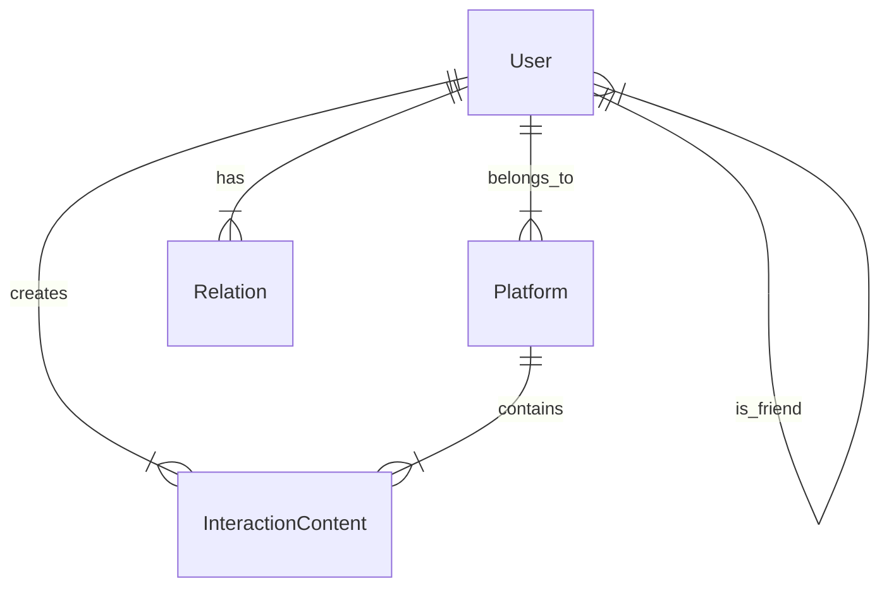

                 

### 第1章 引言

#### 1.1 问题背景

在数字时代，虚拟互动已经成为了人们日常交流的重要组成部分。无论是在社交媒体平台、即时通讯工具，还是在线会议和虚拟团队协作中，虚拟互动都极大地丰富了我们的沟通方式，提高了效率。然而，这种新型沟通方式也带来了一系列的挑战。首先，虚拟互动缺乏面对面的互动，使得情感表达变得困难，容易引发误解和冲突。其次，不同社交平台和沟通工具的规则不同，导致礼仪的复杂性和多样性。最后，随着全球化和跨文化的交流增加，如何在虚拟环境中尊重和适应不同文化背景的人，也成为了一个重要的问题。

#### 1.2 社交礼仪的重要性

社交礼仪在传统社交环境中起到了维护人际关系、促进社会和谐的重要作用。同样地，在数字时代，社交礼仪依然不可或缺。良好的社交礼仪能够提升个人形象，增强沟通效果，建立信任和尊重。同时，它也是组织文化和团队协作的重要组成部分。在虚拟互动中，礼仪的缺失可能会导致沟通障碍、关系紧张，甚至影响到工作和项目的进展。

#### 1.3 本书的目的与读者对象

本书旨在深入探讨数字时代社交礼仪的重要性，通过系统化的分析和实际案例，帮助读者理解和掌握在虚拟互动中维护人际关系的关键技巧。本书面向所有使用数字工具进行社交互动的个人和团队，无论是职场人士、社交媒体用户，还是在线教育者和远程工作者，都将从本书中受益。通过本书的学习，读者将能够更好地适应数字时代的社交环境，提升沟通效果，建立和谐的虚拟人际关系。

#### 1.4 核心概念与联系

**数字时代的社交概念**：这是一个涵盖了即时通讯、社交媒体、在线会议等多种形式的广阔领域。理解其特点，有助于更好地掌握虚拟互动的规则。

**社交礼仪的定义与演变**：社交礼仪是一种行为规范，随着社会和技术的变迁，其表现形式也在不断演变。研究其演变，有助于我们更好地理解当前虚拟社交礼仪的成因和特点。

**虚拟社交礼仪的特有要素**：包括虚拟环境中的礼貌用语、非言语沟通技巧、跨文化适应等。掌握这些要素，是成功进行虚拟互动的关键。

#### 1.5 ER实体关系图架构

**虚拟社交场景实体定义**：识别并定义虚拟社交场景中的关键实体，如用户、平台、互动内容等。

**实体关系与交互模型**：通过实体关系图，展示各实体之间的互动关系和交互模式。这有助于我们更清晰地理解虚拟社交的流程和规则。

#### 1.6 本书结构安排

**目录概述**：本书分为五大部分，分别从不同角度探讨虚拟社交礼仪的核心原则、行为规范、维护策略和实战技巧。

**各章节内容安排**：每章都有明确的结构和内容，旨在逐步引导读者深入理解和掌握虚拟社交礼仪的关键技巧。

**阅读建议**：本书适合分阶段阅读，首先了解整体框架，再逐步深入各章节内容。通过实践和反思，读者将能够更好地应用到实际工作中。

#### 1.7 本章小结

本章作为引言，为后续内容奠定了基础。通过介绍数字时代虚拟互动的背景和重要性，明确了本书的目的和结构安排。在理解了核心概念和实体关系后，读者将能够更系统地掌握虚拟社交礼仪的关键技巧，从而提升虚拟互动的效果。

### 1.1.1 虚拟互动的普及与挑战

虚拟互动的普及是数字时代的一个显著特征。随着互联网技术的飞速发展，人们不再局限于面对面交流，各种在线工具和平台如雨后春笋般涌现，为沟通提供了便捷和多样性。从即时通讯软件如微信、WhatsApp，到社交媒体平台如Facebook、微博，再到虚拟会议工具如Zoom、Microsoft Teams，虚拟互动已经深入到我们的日常生活和工作中。

然而，虚拟互动的普及也带来了一系列的挑战。首先，由于缺乏面对面的交流，非言语沟通（如肢体语言、面部表情等）的缺失使得信息传递变得模糊和容易误解。例如，在电子邮件或即时消息中，一句话的含义可能因为缺乏语气和表情而完全改变。这种信息传递的不确定性增加了沟通的复杂性，使得误解和冲突更容易发生。

其次，虚拟互动的平台和工具繁多，每个平台都有自己的规则和文化。例如，微信更适合私人交流，而LinkedIn则更适合职业网络构建。如果不了解这些平台的特定礼仪，可能会在无意中违反社交规则，导致社交尴尬或职业形象受损。这种多样性和复杂性要求用户具备更广泛的社交知识和适应能力。

此外，虚拟互动的匿名性和距离感也带来了一些潜在问题。在虚拟环境中，人们更容易隐藏自己的真实身份和情感，这使得社交互动变得不透明。例如，在论坛或评论区，匿名用户可能发表不恰当的言论，导致网络暴力和恶意攻击。此外，距离感使得情感联系减弱，人们可能更难以建立深厚的社交关系，尤其是在远程工作和在线教育环境中。

面对这些挑战，了解和掌握虚拟互动中的社交礼仪变得尤为重要。良好的社交礼仪不仅能够提升沟通效果，减少误解和冲突，还能帮助建立信任和尊重，促进人际关系的和谐发展。因此，在数字时代，虚拟互动的社交礼仪不仅是一种个人修养，更是社会和谐与职场成功的基石。

### 1.1.2 社交礼仪的重要性

社交礼仪是一种行为规范，旨在维护人际关系的和谐与稳定。在传统社交环境中，礼仪的作用不言而喻。它不仅是个人素养的体现，也是社会秩序的重要组成部分。例如，在商务场合，遵循礼仪可以展示专业形象，促进业务合作；在私人社交中，尊重他人的礼仪有助于建立深厚的友谊。

在数字时代，社交礼仪的重要性依然不可忽视。首先，良好的社交礼仪能够提升个人形象。在虚拟互动中，礼貌用词、恰当的表达方式会给人留下良好的印象，增强个人信誉。例如，在社交媒体上，一句简单的感谢或认可可以迅速拉近与他人的距离，形成积极的人际关系。

其次，社交礼仪有助于提高沟通效果。在虚拟环境中，信息传递的不确定性较大，容易引发误解和冲突。通过遵循礼仪，如使用礼貌用语、清晰表达观点，可以有效减少误解，增强沟通的清晰度和准确性。例如，在虚拟团队协作中，良好的礼仪能够促进团队成员之间的合作，提高项目效率。

此外，社交礼仪也是建立信任和尊重的基础。在数字时代，人们更倾向于与那些表现得礼貌、尊重他人的人建立长期关系。无论是职场中的同事，还是社交平台上的朋友，礼仪都是建立信任的重要手段。通过尊重他人的观点和隐私，我们能够赢得他人的信任，形成稳固的社交网络。

最后，社交礼仪有助于营造一个和谐的社会环境。在虚拟互动中，如果不遵循礼仪，可能会导致冲突和矛盾，甚至引发网络暴力和恶意攻击。通过普及和遵循社交礼仪，我们可以减少这些不良现象，促进网络环境的和谐发展。

综上所述，社交礼仪在数字时代依然扮演着重要角色。它不仅关乎个人的形象和沟通效果，更是建立信任、促进和谐的重要工具。理解和掌握虚拟互动中的社交礼仪，对于每个数字时代的参与者来说，都是必不可少的。

#### 1.1.3 本书的目的与读者对象

本书的编写旨在深入探讨数字时代社交礼仪的重要性，并通过系统化的分析和实例研究，帮助读者掌握在虚拟互动中维护人际关系的技巧。具体而言，本书的目的包括以下几个方面：

1. **普及社交礼仪知识**：通过详细的讲解和案例分析，帮助读者了解社交礼仪的基本原则和在虚拟互动中的具体应用，使读者能够认识到礼仪在数字时代的重要性。

2. **提升沟通技巧**：本书不仅介绍了社交礼仪的理论知识，还提供了大量实际操作建议和技巧，帮助读者在虚拟互动中更加自如地表达自己，减少误解和冲突。

3. **促进人际关系和谐**：通过理解和遵循社交礼仪，读者将能够更好地与他人建立信任和尊重，促进虚拟人际关系的和谐发展，从而在工作和生活中获得更多的支持和帮助。

4. **适应数字时代需求**：随着数字技术的不断进步，虚拟互动将成为更加普遍的沟通方式。本书旨在帮助读者适应这一变化，提升在虚拟环境中的社交能力，使其能够在数字时代中更好地展现自我，实现个人和职业的发展。

本书的读者对象主要包括以下几类：

1. **职场人士**：无论是企业员工还是自由职业者，虚拟互动已经成为职场沟通的重要方式。本书将帮助职场人士提升沟通技巧，建立良好的职业形象，提高工作效率。

2. **社交媒体用户**：随着社交媒体的普及，越来越多的人通过网络平台进行社交。本书提供了详细的礼仪指南，帮助社交媒体用户在网络世界中建立积极的人际关系，避免社交尴尬。

3. **在线教育者和远程工作者**：在线教育和远程工作使人们的社交环境发生了巨大变化。本书为在线教育者和远程工作者提供了实用的礼仪技巧，帮助他们在虚拟环境中与学生或同事建立有效的沟通和合作关系。

4. **跨文化工作者**：全球化趋势使得跨文化沟通越来越普遍。本书通过探讨跨文化社交礼仪，帮助读者更好地理解不同文化背景的人，建立和谐的国际人际关系。

通过本书的学习，读者将能够更加自信地应对数字时代的社交挑战，提升自己在虚拟互动中的表现，建立更加稳固和有意义的人际关系。

### 1.2 核心概念与联系

#### 1.2.1 数字时代的社交概念

数字时代的社交概念是一个广泛而复杂的话题，涵盖了多种形式的互动和交流。首先，我们需要明确几个核心概念：

**社交媒体**：这是数字时代最为普遍的社交形式，包括平台如Facebook、微博、微信等。这些平台允许用户发布内容、评论、点赞和分享，从而建立和扩展社交网络。

**即时通讯工具**：如微信、WhatsApp、Slack等，这些工具提供了实时、点对点的沟通方式，使得个人和团队之间的交流更加便捷和高效。

**虚拟会议**：如Zoom、Microsoft Teams等，这些工具为远程协作和会议提供了技术支持，使得团队成员可以在不同的地点进行面对面的交流。

**在线论坛和社区**：这些平台如Reddit、Stack Overflow等，为特定兴趣或领域的人们提供了一个交流和分享知识的环境。

在理解这些核心概念后，我们需要探讨它们之间的联系。例如，社交媒体和即时通讯工具之间的互动可以看作是用户在网络空间中建立和维持社交关系的基础。虚拟会议则进一步扩展了这种互动，使得跨地区、跨时区的团队合作成为可能。而在线论坛和社区则为用户提供了分享知识和经验的空间，促进了特定领域的社交互动。

#### 1.2.2 社交礼仪的定义与演变

社交礼仪是一种行为规范，旨在维护人际关系的和谐与稳定。其定义可以追溯到古代社会的礼节和规范，但随着社会的变迁和技术的发展，其表现形式也在不断演变。

在传统社交环境中，社交礼仪主要涉及面对面的互动，如问候、敬语、礼节性的身体接触等。这些礼仪在某种程度上反映了社会等级和地位，但随着时间的推移，它们逐渐演变成一种普遍的行为规范，旨在提升人际关系的质量。

进入数字时代，社交礼仪的定义和表现形式发生了显著变化。首先，由于缺乏面对面的互动，虚拟环境中的礼仪更加依赖于文字和符号。例如，在网络交流中，礼貌用语、适当的表情符号和语气表达变得尤为重要。其次，虚拟环境中的匿名性和距离感使得礼仪变得更加复杂。在匿名社交平台上，用户可能会采取不恰当的行为，因此，如何在尊重隐私和匿名性的同时，保持良好的社交礼仪，成为了一个新的挑战。

此外，随着社交媒体和即时通讯工具的普及，社交礼仪也在这些平台上得到了具体的应用和演变。例如，社交媒体平台上的点赞、评论和分享，可以被视为一种虚拟的“社交礼貌”，而即时通讯工具中的礼貌用语和表情符号，则成为表达尊重和关心的重要手段。

总之，社交礼仪的定义与演变是随着社会和技术的发展不断调整的。在数字时代，理解并遵循虚拟环境中的社交礼仪，不仅有助于提升个人形象和沟通效果，还能促进虚拟社交环境的和谐发展。

#### 1.2.3 虚拟社交礼仪的特有要素

在数字时代，虚拟社交礼仪具有其独特的特有要素，这些要素决定了虚拟互动的规则和行为准则。以下是对几个关键要素的详细分析：

**1. 语言表达的规范化**

在虚拟互动中，语言表达的规范化至关重要。由于缺乏面对面的交流，文字成为主要的沟通工具。因此，清晰、准确、礼貌的语言表达变得尤为重要。例如，在电子邮件和即时消息中，避免使用缩写和俚语，可以减少误解。同时，适当的语气词和礼貌用语，如“请”、“谢谢”等，能够增强沟通的亲和力和专业性。

**2. 非言语沟通的数字化**

非言语沟通在传统社交中扮演着重要角色，如肢体语言、面部表情、眼神交流等。在虚拟环境中，这些非言语沟通需要通过数字化手段来替代。例如，表情符号、图标和视频通话中的姿态和表情，可以部分弥补文字交流的不足。了解和正确使用这些数字化工具，能够增强虚拟互动的丰富性和准确性。

**3. 跨文化适应**

全球化和数字技术的发展使得跨文化交流日益频繁。在虚拟社交中，尊重和适应不同文化的礼仪和习惯变得至关重要。例如，一些文化中可能对直接的眼神接触有不同的看法，或者某些表情符号在不同文化中的含义可能完全不同。因此，了解和尊重这些文化差异，能够避免误解和冲突，促进和谐的跨文化互动。

**4. 网络隐私和匿名性**

虚拟环境的匿名性使得社交互动更加复杂。一方面，匿名性提供了自由和隐私，使得用户可以更自由地表达意见和观点。另一方面，匿名性也可能导致网络暴力和恶意攻击。因此，在虚拟社交中，维护网络隐私、尊重他人的隐私权，是重要的礼仪原则。同时，了解如何在匿名环境中保持自我保护和尊重他人，是每个虚拟社交参与者需要掌握的技能。

**5. 虚拟平台的特定礼仪**

不同的虚拟平台（如社交媒体、即时通讯工具、在线论坛等）有其特定的礼仪和规则。了解并遵循这些规则，能够避免社交尴尬和冲突。例如，在社交媒体上，避免过度分享个人信息或隐私，以及在评论和私信中保持礼貌和尊重。在即时通讯工具中，适时使用群组功能和聊天室，避免打扰他人。

**6. 情感表达的技巧**

在虚拟环境中，情感表达变得更加困难。因此，掌握情感表达的技巧尤为重要。例如，在文字交流中，通过选择适当的词汇、语气和表情符号，来表达情感和意图。此外，适时使用视频通话和语音消息，可以增强情感的传达和互动的深度。

通过理解并遵循这些虚拟社交礼仪的特有要素，用户能够更好地适应数字时代，提升虚拟互动的质量和效果。这些要素不仅关乎个人的形象和沟通技巧，更是维护和谐虚拟社交环境的重要保障。

#### 1.3 ER实体关系图架构

为了更好地理解和分析虚拟社交场景中的互动关系，我们可以借助ER（Entity-Relationship）实体关系图来描述各实体及其相互关系。以下是一个简单的ER实体关系图架构，用于展示虚拟社交场景中的关键实体和其交互模型。

**1. 实体定义**

- **用户（User）**：虚拟社交平台上的主要参与者，拥有账号和身份信息。
- **平台（Platform）**：提供社交互动的虚拟环境，如社交媒体、即时通讯工具、虚拟会议系统等。
- **互动内容（Interaction Content）**：用户在平台上的所有互动信息，包括文字、图片、视频、音频等。
- **关系（Relation）**：用户与用户之间、用户与平台之间的互动和关联。

**2. 实体关系与交互模型**

- **用户-平台**：每个用户属于一个或多个平台，用户通过平台进行互动和分享内容。
- **用户-互动内容**：用户创建和发布互动内容，其他用户可以查看、评论和分享这些内容。
- **用户-用户**：用户之间通过互动内容建立社交关系，可以是好友、同事、关注者等。
- **用户-关系**：用户可以维护和调整与他人的关系，如添加好友、删除联系人等。

**ER实体关系图示例（Mermaid 格式）**：

通过这个ER实体关系图，我们可以清晰地看到虚拟社交场景中的主要实体及其相互关系。每个实体都扮演着特定的角色，并通过各种交互模型进行信息传递和社交互动。这种架构不仅帮助我们理解虚拟社交的整体结构，也为后续章节的深入分析提供了基础。

#### 1.4 本书结构安排

**1.4.1 目录概述**

本书分为五个主要部分，每个部分都针对虚拟社交礼仪的不同方面进行深入探讨。第一部分为引言，介绍虚拟互动的背景和重要性，以及本书的目的和结构。第二部分探讨虚拟社交礼仪的基础原则，包括礼仪的定义、核心原则和在虚拟环境中的应用。第三部分分析虚拟互动中的行为规范，包括礼貌用语、会议礼仪和团队合作中的礼仪。第四部分提供维护虚拟社交关系的策略，包括有效的沟通技巧和跨文化沟通的方法。第五部分通过案例分析和实战技巧，帮助读者将所学知识应用到实际场景中。

**1.4.2 各章节内容安排**

- **第1章 引言**：介绍虚拟互动的普及与挑战，社交礼仪的重要性，以及本书的目的和结构。
- **第2章 虚拟社交礼仪的核心原则**：探讨社交礼仪的定义、核心原则和在虚拟环境中的应用。
- **第3章 虚拟互动中的礼貌用语**：分析虚拟互动中的礼貌用语，包括问候、感谢、道歉和请求的表达方式。
- **第4章 虚拟会议中的礼仪**：详细讨论虚拟会议中的礼仪，包括会议前准备、会议中互动和会议后反馈。
- **第5章 社交媒体互动的礼仪**：探讨社交媒体平台上的特定礼仪，包括评论、私信和活动参与。
- **第6章 虚拟团队合作中的礼仪**：分析虚拟团队合作中的礼仪，包括团队沟通、项目管理和跨文化协作。
- **第7章 跨文化虚拟沟通**：探讨跨文化虚拟沟通的特点、挑战和策略。
- **第8章 处理沟通冲突**：讨论虚拟互动中的沟通冲突，包括冲突类型、处理原则和解决方法。
- **第9章 维护虚拟社交关系的策略**：提供维护虚拟社交关系的具体策略和技巧。
- **第10章 案例分析与实战技巧**：通过案例分析，帮助读者将所学知识应用到实际场景中。

**1.4.3 阅读建议**

本书适合分阶段阅读，首先了解整体框架，再逐步深入各章节内容。在阅读过程中，读者可以结合实际场景进行思考和反思，将所学知识应用到自己的虚拟互动中。同时，建议读者在阅读各章节后，通过练习和实际操作来巩固所学内容。通过不断地实践和反思，读者将能够更好地掌握虚拟社交礼仪，提升虚拟互动的效果和人际关系的质量。

#### 1.4.4 本章小结

本章作为引言，为本书的整体结构和内容奠定了基础。通过介绍虚拟互动的普及与挑战、社交礼仪的重要性，以及本书的目的和结构安排，读者对本书的核心内容和目标有了初步了解。在理解了虚拟社交礼仪的基本概念和核心原则后，读者将能够在后续章节中深入学习，逐步掌握在虚拟互动中维护人际关系的技巧。通过本书的学习，读者将能够更好地适应数字时代的社交环境，提升自己的沟通能力和人际关系质量。

### 1.5 本章小结

本章作为引言，首先介绍了数字时代虚拟互动的普及背景及其带来的挑战，强调了社交礼仪在维护人际关系中的重要性。接着，明确了本书的目的和读者对象，帮助读者理解本书的结构安排。通过核心概念的分析，如数字时代社交概念、社交礼仪的定义与演变，以及虚拟社交礼仪的特有要素，读者对虚拟互动中的礼仪有了更深的认识。同时，本章还介绍了ER实体关系图架构，为后续内容提供了理论支持。本章小结旨在帮助读者对全书内容有一个整体把握，为后续章节的学习打下坚实的基础。

### 第2章 虚拟社交礼仪的核心原则

#### 2.1 礼仪的本质

礼仪是一种行为规范，旨在维护人际关系的和谐与稳定。其本质在于通过共同遵守的行为准则，促进个体之间的相互尊重和信任。在传统社交环境中，礼仪表现为一系列的礼节和仪式，如问候、敬语、礼节性身体接触等。这些行为规范不仅体现了个人的教养和修养，也反映了社会文化和价值观。

随着数字时代的到来，社交环境发生了巨大变化。虚拟互动缺乏面对面的交流，传统的礼仪形式难以完全适用。因此，虚拟社交礼仪在传统礼仪的基础上，进行了适应和演变。虚拟社交礼仪的核心原则仍然在于尊重和信任，但表现形式和实现方式有所不同。

首先，虚拟社交礼仪需要通过文字、符号和表情等数字化手段来表达。例如，在电子邮件和即时消息中，清晰、礼貌的语言表达至关重要。此外，表情符号和语气的使用，可以部分弥补非言语沟通的缺失，增强互动的亲和力和准确性。

其次，虚拟社交礼仪需要考虑匿名性和距离感带来的挑战。在匿名社交平台上，用户更容易隐藏身份和情感，这可能导致不恰当的行为和冲突。因此，维护网络隐私、尊重他人隐私权，成为虚拟社交礼仪的重要原则。

此外，虚拟社交礼仪还需要适应全球化背景下的跨文化沟通。不同文化对礼仪有不同的理解和表达方式，因此，在虚拟互动中，了解和尊重文化差异，是建立和谐人际关系的关键。

总之，虚拟社交礼仪的本质在于通过共同的行为准则，促进个体之间的相互尊重和信任。在数字化环境中，这一本质通过新的形式和手段得以实现。理解礼仪的本质，是掌握虚拟社交礼仪的基础。

#### 2.2 虚拟社交中的礼仪

虚拟社交中的礼仪与传统社交礼仪有所不同，其特点主要体现在以下几个方面：

**1. 语言表达的规范化**

在虚拟社交中，语言表达的规范化至关重要。由于缺乏面对面的交流，文字成为主要的沟通工具。因此，清晰、准确、礼貌的语言表达变得尤为重要。例如，在电子邮件和即时消息中，避免使用缩写和俚语，可以减少误解。同时，适当的语气词和礼貌用语，如“请”、“谢谢”等，能够增强沟通的亲和力和专业性。

**2. 非言语沟通的数字化**

非言语沟通在传统社交中扮演着重要角色，如肢体语言、面部表情、眼神交流等。在虚拟环境中，这些非言语沟通需要通过数字化手段来替代。例如，表情符号、图标和视频通话中的姿态和表情，可以部分弥补文字交流的不足。了解和正确使用这些数字化工具，能够增强虚拟互动的丰富性和准确性。

**3. 跨文化适应**

全球化和数字技术的发展使得跨文化交流日益频繁。在虚拟社交中，尊重和适应不同文化的礼仪和习惯变得至关重要。例如，一些文化中可能对直接的眼神接触有不同的看法，或者某些表情符号在不同文化中的含义可能完全不同。因此，了解和尊重这些文化差异，能够避免误解和冲突，促进和谐的跨文化互动。

**4. 网络隐私和匿名性**

虚拟环境的匿名性使得社交互动更加复杂。一方面，匿名性提供了自由和隐私，使得用户可以更自由地表达意见和观点。另一方面，匿名性也可能导致网络暴力和恶意攻击。因此，在虚拟社交中，维护网络隐私、尊重他人的隐私权，是重要的礼仪原则。同时，了解如何在匿名环境中保持自我保护和尊重他人，是每个虚拟社交参与者需要掌握的技能。

**5. 虚拟平台的特定礼仪**

不同的虚拟平台（如社交媒体、即时通讯工具、在线论坛等）有其特定的礼仪和规则。了解并遵循这些规则，能够避免社交尴尬和冲突。例如，在社交媒体上，避免过度分享个人信息或隐私，以及在评论和私信中保持礼貌和尊重。在即时通讯工具中，适时使用群组功能和聊天室，避免打扰他人。

**6. 情感表达的技巧**

在虚拟环境中，情感表达变得更加困难。因此，掌握情感表达的技巧尤为重要。例如，在文字交流中，通过选择适当的词汇、语气和表情符号，来表达情感和意图。此外，适时使用视频通话和语音消息，可以增强情感的传达和互动的深度。

总之，虚拟社交中的礼仪需要适应数字时代的特性，通过规范化的语言表达、数字化手段补充非言语沟通、尊重跨文化差异、维护网络隐私和遵循虚拟平台的特定礼仪，来提升虚拟互动的质量。掌握这些礼仪原则，有助于建立和谐的虚拟社交环境，促进人际关系的和谐发展。

#### 2.3 虚拟社交礼仪的应用场景

虚拟社交礼仪在多种应用场景中发挥着重要作用，以下是几个典型场景的具体礼仪要求和实际操作：

**1. 网络会议**

网络会议是远程工作中的一个重要组成部分。在会议中，礼仪的重要性尤为突出：

- **会议前的准备**：准时参加会议，确保设备正常运行，提前测试网络连接和麦克风。
- **会议中的互动**：保持安静，避免打断他人发言，适时使用聊天功能提问或发表意见。
- **会议后的反馈**：感谢组织者和参与者，总结会议内容和下一步行动计划。

**2. 社交媒体互动**

社交媒体平台如Facebook、微博等，为用户提供了广泛的社交互动空间。以下是一些常见的礼仪要求：

- **礼貌用词**：评论和私信中使用礼貌用语，避免使用侮辱性语言。
- **内容分享**：分享有价值的内容，避免发布无关或有害信息。
- **尊重他人**：尊重他人的观点和隐私，避免恶意攻击和诽谤。

**3. 虚拟团队合作**

虚拟团队合作要求团队成员之间有良好的沟通和协作：

- **沟通规范**：定期召开团队会议，明确任务分工和目标，使用统一的沟通工具。
- **协作技巧**：合理利用协作工具，如项目管理软件和文档共享平台，提高工作效率。
- **团队文化**：建立积极向上的团队文化，鼓励成员之间的相互支持和合作。

**4. 跨文化沟通**

在全球化的背景下，跨文化沟通成为虚拟互动中的一个重要方面。以下是一些礼仪建议：

- **文化差异认识**：了解不同文化背景下的社交习惯和礼仪规范，避免误解和冲突。
- **尊重多样性**：尊重不同文化中的习俗和价值观，避免文化偏见和歧视。
- **灵活适应**：根据不同文化背景调整沟通方式和表达方式，以达到更好的沟通效果。

通过在多种虚拟互动场景中遵循这些礼仪要求，用户能够提升沟通效果，减少误解和冲突，建立和谐的人际关系。无论是个体用户还是团队协作，良好的虚拟社交礼仪都是成功互动的重要保障。

#### 2.4 礼仪意识的培养

培养良好的礼仪意识是虚拟社交中不可或缺的一环。以下是一些实用的建议和方法，帮助用户提升礼仪意识和实践技巧：

**1. 自我反思**

自我反思是培养礼仪意识的第一步。用户可以通过定期回顾自己的社交行为，识别自己在沟通中可能存在的不足和问题。例如，在写邮件或发送即时消息时，反思自己是否使用了适当的礼貌用语，是否清晰传达了意图。通过自我反思，用户能够逐步改进自己的行为，提升礼仪水平。

**2. 礼仪教育的重要性**

礼仪教育在培养良好礼仪意识中扮演着关键角色。无论是个人还是组织，都应该重视礼仪教育。对于个人而言，可以通过阅读相关书籍、参加培训课程、观看教学视频等方式，系统地学习社交礼仪的知识和技巧。对于组织而言，可以制定内部礼仪规范，开展定期的培训和交流活动，帮助员工提升礼仪素养。

**3. 良好网络礼仪习惯的养成**

良好的网络礼仪习惯有助于在虚拟社交中保持礼貌和尊重。以下是一些具体建议：

- **礼貌用语**：在日常交流中，坚持使用礼貌用语，如“请”、“谢谢”、“对不起”等。
- **避免侮辱性语言**：避免使用侮辱性、攻击性或歧视性的语言，尊重他人的观点和感受。
- **适当的表情符号**：使用表情符号和语气温和表达情感，但避免过度使用，以免显得不专业或不真诚。
- **尊重他人隐私**：在社交媒体上，避免分享他人的隐私信息，尊重他人的隐私权。

**4. 践行礼仪原则**

将礼仪原则应用到实际社交互动中，是培养良好礼仪意识的关键。以下是一些具体实践方法：

- **积极参与社交互动**：在社交媒体和论坛上，积极参与讨论，分享见解和经验，但保持礼貌和尊重。
- **合理使用沟通工具**：根据不同的社交场景和沟通目的，选择合适的沟通工具，如电子邮件、即时通讯工具或视频通话等。
- **处理冲突**：遇到冲突时，保持冷静和理性，通过沟通和协商解决问题，避免恶意攻击和负面情绪的蔓延。

通过以上方法，用户能够逐步培养良好的礼仪意识，提升虚拟社交互动的质量和效果。礼仪不仅是个人素养的体现，更是维护和谐社交环境的重要工具。在数字时代，良好的礼仪意识对于建立稳固的人际关系和职业发展至关重要。

#### 2.5 本章小结

本章深入探讨了虚拟社交礼仪的核心原则，从礼仪的本质、虚拟社交中的具体礼仪要求，到礼仪的应用场景和培养方法，进行了全面的阐述。通过理解礼仪的本质，我们认识到尊重和信任是礼仪的核心。在虚拟环境中，通过规范化的语言表达、数字化手段补充非言语沟通、尊重跨文化差异、维护网络隐私和遵循虚拟平台的特定礼仪，用户能够提升沟通效果和互动质量。在多个应用场景中，良好的礼仪意识有助于减少误解和冲突，建立和谐的虚拟社交环境。通过自我反思、礼仪教育和良好习惯的养成，用户能够不断提升礼仪素养，从而在数字时代中更加自如地维护人际关系。本章的内容为后续章节的深入探讨提供了坚实的理论基础。

### 第3章 虚拟互动中的礼貌用语

#### 3.1 沟通中的礼貌表达

礼貌用语在虚拟互动中至关重要，它们不仅能够传达尊重和友好，还能减少误解和冲突，提升沟通效果。以下是一些关键礼貌用语及其应用场景：

**1. 问候**

问候是每次沟通的开始，能够营造亲切和尊重的氛围。例如：

- “早上好！”（适合早晨的问候）
- “晚上好！”（适合晚上的问候）
- “你好！”（简洁而常见的问候）

**2. 感谢**

感谢是一种重要的礼貌表达，能够增进人际关系的和谐。例如：

- “非常感谢你的帮助！”
- “谢谢你的建议，很有价值。”
- “辛苦了，感谢你的付出。”

**3. 道歉**

道歉是解决冲突和恢复关系的重要手段。以下是一些常见的道歉用语：

- “很抱歉给你带来了不便。”
- “对不起，我误解了你的意思。”
- “我不该那么说，真的很抱歉。”

**4. 请求**

礼貌地提出请求能够提高对方接受的可能性。例如：

- “可以请你帮我一个忙吗？”
- “能否麻烦你帮我查看一下这个报告？”
- “如果方便的话，能请你提供一下相关信息吗？”

**5. 肯定和鼓励**

积极的肯定和鼓励能够增强对方的自信心和动力。例如：

- “你做得很好！”
- “你的创意真的很棒。”
- “你的工作态度让我很佩服。”

**6. 询问和回应**

在互动中，礼貌的询问和回应能够促进双向沟通。例如：

- “你对这个问题有什么看法？”
- “你的意见呢？”
- “好的，我会考虑你的建议。”

通过这些礼貌用语，用户能够更好地表达自己的意图，增强互动的亲和力和专业性，从而提升虚拟互动的整体质量。

#### 3.2 虚拟会议中的礼仪

虚拟会议已经成为现代工作中不可或缺的一部分，其礼仪对于会议的顺利进行和高效沟通至关重要。以下是虚拟会议中应遵循的礼仪要求：

**1. 会议前的准备**

- **提前通知**：确保所有参会者提前收到会议通知，包括会议主题、议程和所需材料。
- **技术测试**：确保网络连接和设备正常运行，提前测试麦克风和摄像头。
- **准时开始**：尽量准时参加会议，以示对会议的重视。

**2. 会议中的互动**

- **保持专注**：在会议期间，保持专注，避免分心和做其他事情。
- **礼貌参与**：在别人发言时，保持安静，不要打断，适时使用聊天功能提问或发表意见。
- **注意语速和音量**：确保自己的语音清晰，语速适中，避免过于快速或过于缓慢。
- **使用表情符号和肢体语言**：适当使用表情符号和肢体语言，如点头、微笑等，以表达理解和认同。

**3. 会议后的反馈**

- **总结和跟进**：会议结束后，及时总结会议内容和决定事项，确保所有参会者了解下一步行动计划。
- **感谢参与**：向所有参会者表示感谢，表达对大家时间和努力的尊重。

通过遵循这些礼仪要求，用户能够提升虚拟会议的效率和质量，建立和谐的会议氛围。

#### 3.3 社交媒体互动的礼仪

社交媒体平台如微信、微博等已成为人们日常交流的重要工具。以下是一些社交媒体互动中应遵循的礼仪要求：

**1. 微博**

- **内容分享**：分享有价值、有趣的内容，避免发布无关或有害信息。
- **互动礼貌**：在评论和私信中，使用礼貌用语，尊重他人的观点。
- **隐私保护**：避免过度分享个人信息和隐私，尊重他人的隐私权。

**2. 微信**

- **群组礼仪**：在微信群组中，遵守群规，避免发广告或无关内容。
- **聊天室礼仪**：在聊天室中，适时参与讨论，避免长时间霸占聊天空间，打扰他人。

**3. 社交礼仪**

- **尊重多样性**：尊重不同文化和背景的人，避免歧视和偏见。
- **积极互动**：参与社交媒体活动，如点赞、评论和分享，但保持适度，避免过度热情或冷漠。

通过遵循这些礼仪要求，用户能够建立积极的社交媒体形象，提升互动的质量。

#### 3.4 虚拟团队合作中的礼仪

在虚拟团队合作中，良好的礼仪是保证团队协作顺利进行的关键。以下是一些虚拟团队合作中的礼仪要求：

**1. 沟通规范**

- **定期会议**：定期召开团队会议，明确任务分工和目标，确保团队成员的信息同步。
- **清晰表达**：在沟通中，尽量使用简洁明了的语言，避免使用模糊或歧义的表述。
- **及时反馈**：在完成任务或遇到问题时，及时与团队成员沟通，确保信息的及时传递和问题的快速解决。

**2. 协作技巧**

- **合理利用工具**：利用项目管理软件和文档共享平台，提高协作效率，确保信息的及时更新和共享。
- **分工明确**：根据团队成员的特长和任务需求，明确分工，确保每个成员都有明确的职责和任务。
- **相互支持**：在团队工作中，相互支持和鼓励，共同应对挑战，提高团队的整体执行力。

**3. 团队文化**

- **积极向上**：建立积极向上的团队文化，鼓励成员之间的相互支持和合作。
- **尊重差异**：尊重团队成员的不同观点和背景，促进团队的多样性和创新。

通过遵循这些礼仪要求，虚拟团队能够更好地协作，提高工作效率和项目质量。

#### 3.5 本章小结

本章详细探讨了虚拟互动中的礼貌用语及其应用，包括沟通中的礼貌表达、虚拟会议中的礼仪、社交媒体互动的礼仪和虚拟团队合作中的礼仪。通过学习这些礼仪要求，用户能够在各种虚拟互动场景中更加自如地表达自己，减少误解和冲突，提升互动的整体质量。良好的礼仪不仅关乎个人的形象和沟通技巧，更是维护和谐虚拟社交环境的重要工具。希望读者通过本章的学习，能够提升自己的礼仪素养，建立更加积极、有效的虚拟互动关系。

### 4.1 虚拟沟通的特点

虚拟沟通在现代社交和工作中扮演着重要角色，其特点在很大程度上影响了沟通效果和人际关系。以下是对虚拟沟通特点的详细探讨：

**1. 语言表达**

在虚拟沟通中，语言表达主要依赖于文字、图片、视频和音频等形式。与面对面的交流相比，文字交流缺乏语气、语调和面部表情等非言语信息，这使得信息传递更加直接和简洁，但也增加了误解的风险。例如，一句简单的文字信息可能会因为缺乏语气而完全改变其含义，导致沟通障碍。

**2. 情感表达**

情感表达在虚拟沟通中尤为困难。在面对面交流中，通过面部表情、肢体语言和语调变化，人们可以直观地感受到对方的情感状态。然而，在虚拟环境中，这些情感线索往往被缺失，使得情感传达变得模糊和难以捉摸。例如，在文字聊天中，一个简单的表情符号或符号串（如“:）”或“;-)”）可能不足以准确地表达复杂的情感。

**3. 沟通效果**

虚拟沟通的效果受多种因素影响，包括信息传递的清晰度、互动的及时性和参与者的理解能力。由于缺乏面对面的互动，信息传递的清晰度可能会降低，导致误解和混淆。此外，虚拟沟通中的实时性较差，尤其是跨时区或跨地域的交流，可能存在延迟，影响沟通效率和协作效果。

**4. 社交礼仪**

虚拟沟通中的社交礼仪与面对面交流有所不同，需要适应数字化环境的特性。礼貌用词、适当的表情符号和语气表达变得尤为重要，以弥补非言语沟通的不足。例如，在电子邮件中，清晰、礼貌的语言表达可以帮助减少误解，增强沟通的亲和力和专业性。

**5. 匿名性和隐私**

虚拟沟通的匿名性和隐私性也是其重要特点之一。在许多虚拟平台和社交媒体上，用户可以选择匿名发言或隐藏身份，这提供了自由和隐私，但也可能导致网络暴力和恶意攻击。因此，维护网络隐私、尊重他人隐私权成为虚拟沟通中的关键礼仪原则。

**6. 跨文化差异**

全球化和数字技术的发展使得跨文化交流日益频繁。不同文化背景的人在虚拟沟通中的表达方式和礼仪规范可能存在差异，这需要参与者具备跨文化适应能力。例如，某些文化中可能对直接的眼神接触有不同的看法，或者某些表情符号在不同文化中的含义可能完全不同。

通过了解虚拟沟通的这些特点，用户能够更好地适应数字时代的社交环境，提升沟通效果和互动质量。掌握适当的礼仪技巧和策略，有助于减少误解和冲突，建立和谐的虚拟人际关系。

#### 4.2 提升虚拟沟通效果

在虚拟沟通中，提升沟通效果是确保信息准确传递、减少误解和冲突的关键。以下是一些实用的技巧和方法，帮助用户在虚拟互动中更有效地表达自己：

**1. 语言表达的技巧**

- **清晰明确**：使用简单、直接的语言，避免使用复杂或含糊不清的表达方式。例如，在写邮件或即时消息时，尽量用简单的词汇和句子来表达观点。
- **准确简洁**：确保信息准确无误，避免模糊和歧义的表述。例如，在提及具体任务或目标时，明确具体的细节和期望。
- **礼貌用语**：使用礼貌用语，如“请”、“谢谢”、“对不起”等，以增强沟通的亲和力和专业性。例如，在请求帮助时，可以说“请问能否请你帮我检查一下这个报告？”

**2. 情感表达的策略**

- **使用表情符号**：在文字交流中，适当使用表情符号和图标，如“:）”、“;-)”等，可以传达情感和意图。例如，在收到对方回复时，可以回复一个笑脸表情，以表达理解和认可。
- **适时使用视频通话**：在可能的情况下，使用视频通话或语音消息，可以增强情感的传达和互动的深度。例如，在讨论敏感或重要议题时，通过视频通话可以更好地观察对方的表情和反应。
- **注意语调**：即使使用文字交流，也可以通过调整语调来传达情感。例如，在发送邮件时，可以适当提高语调的音量，使邮件显得更加亲切和友好。

**3. 沟通反馈的重要性**

- **及时反馈**：在沟通过程中，及时给予反馈，可以帮助确认对方是否理解了你的意图。例如，在发送重要信息后，可以询问对方“你明白我的意思吗？”或“这个解决方案可以吗？”
- **明确期望**：在沟通中，明确表达期望和目标，可以帮助双方更好地理解任务和目标。例如，在分配任务时，可以明确任务的完成时间和质量要求。
- **主动澄清**：在出现误解或不确定的情况下，主动澄清问题，以避免进一步的误解和冲突。例如，如果不确定对方的回复是否意味着同意，可以再次确认“你是同意这个方案吗？”

通过掌握这些技巧和方法，用户能够提升虚拟沟通的效果，确保信息的准确传递和理解，建立更加和谐和有效的虚拟互动关系。

#### 4.3 跨文化虚拟沟通

随着全球化和数字化的发展，跨文化虚拟沟通变得越来越普遍。然而，不同文化背景下的沟通习惯和礼仪差异，使得跨文化沟通面临一系列挑战。以下是对跨文化虚拟沟通特点、挑战及其策略的详细探讨：

**1. 跨文化虚拟沟通的特点**

- **语言差异**：不同文化使用不同的语言或语言变体，这可能导致沟通障碍。例如，英语在不同国家和地区可能有不同的拼写和用法。
- **非言语沟通的差异**：不同文化对肢体语言、面部表情和语调的解读可能有所不同。例如，某些文化中，直视对方可能被视为不礼貌，而在其他文化中则是尊重的表示。
- **时间观念的差异**：不同文化对时间的管理和重视程度不同。例如，某些文化可能更注重准时，而其他文化可能对时间的灵活性有更高的容忍度。
- **价值观的差异**：不同文化对权力、地位、个人主义和集体主义的价值观可能有所不同，这影响沟通的方式和内容。例如，一些文化可能更强调集体荣誉，而其他文化可能更注重个人成就。

**2. 跨文化虚拟沟通的挑战**

- **误解和冲突**：由于文化差异，相同的行为或言辞在不同文化中可能被解读为不礼貌或冒犯。例如，一个文化中的礼貌问候在另一个文化中可能被视为过于亲密。
- **沟通效率的降低**：不同文化的沟通方式和节奏可能不同，这可能导致沟通效率降低。例如，一个文化中快速决策和行动可能被视为高效，而在另一个文化中可能被视为不慎重。
- **信任的建立**：跨文化沟通中，信任的建立可能更加困难，因为文化差异可能导致对对方的意图和能力的怀疑。例如，一个文化中可能更重视口头承诺，而在另一个文化中可能更重视书面合同。

**3. 跨文化虚拟沟通的策略**

- **文化敏感性和尊重**：了解并尊重不同文化的沟通习惯和礼仪，避免无意中冒犯对方。例如，在交流中注意文化差异，使用适当的问候和礼貌用语。
- **明确和简洁的表达**：在跨文化沟通中，使用清晰、简洁的语言，避免使用模糊或含糊不清的表述，以减少误解。例如，在讨论复杂议题时，明确表达自己的观点和期望。
- **主动询问和澄清**：在沟通中，主动询问对方的意见和需求，并及时澄清任何可能的误解。例如，在会议中，可以询问“这个方案在你的文化中是否可行？”或“这个表达方式在你的文化中是否有不同的含义？”
- **建立信任和关系**：通过建立信任和友好关系，可以缓解跨文化沟通中的紧张和不确定性。例如，通过分享个人经历和文化背景，建立共同的理解和信任。

通过理解和应用这些策略，用户能够在跨文化虚拟沟通中更加自如地表达自己，减少误解和冲突，建立和谐的人际关系。

#### 4.4 处理沟通冲突

在虚拟互动中，沟通冲突是不可避免的现象。有效的沟通冲突处理不仅能解决当前的问题，还能促进关系的和谐发展。以下是对沟通冲突的类型、处理原则和解决方法的详细探讨：

**1. 沟通冲突的类型**

- **误解导致的冲突**：由于信息传递不准确或模糊，导致双方对同一问题有不同理解而产生的冲突。
- **价值观和立场冲突**：由于个人或组织价值观的差异，双方在决策或行动上产生分歧。
- **资源分配冲突**：在有限的资源下，各方对资源的分配和使用产生争议。
- **情感和情绪冲突**：由于个人情感和情绪的影响，导致沟通双方产生对立和争执。

**2. 处理沟通冲突的原则**

- **尊重和理解**：在处理冲突时，首先要尊重对方的观点和感受，试图理解对方的立场和需求。
- **公正和客观**：在分析冲突时，保持公正和客观，避免偏袒任何一方。
- **沟通和协商**：通过积极的沟通和协商，寻找双方都能接受的解决方案。
- **寻求共识**：在冲突中，尽量寻求双方的共识，以达成互利共赢的解决方案。

**3. 解决沟通冲突的方法**

- **直接对话**：面对面的对话是解决冲突最直接有效的方式。通过直接的沟通，双方可以清晰地表达自己的观点和需求，减少误解。
- **第三方调解**：当双方难以达成共识时，可以寻求第三方的帮助，如调解人或顾问，以提供中立的视角和解决方案。
- **妥协和让步**：在冲突中，适度的妥协和让步有助于缓解紧张局势，找到双方都能接受的折中方案。
- **建立规则和制度**：通过建立明确的沟通规则和制度，可以预防冲突的发生，确保沟通的公正和透明。

通过遵循这些原则和方法，用户能够在虚拟互动中有效地处理沟通冲突，维护和谐的人际关系，提升整体沟通效果。

#### 4.5 本章小结

本章深入探讨了虚拟沟通的特点、提升沟通效果的技巧、跨文化虚拟沟通的策略以及处理沟通冲突的方法。通过理解虚拟沟通的语言表达和情感表达特点，用户能够更有效地进行信息传递。提升虚拟沟通效果的关键在于清晰明确的语言表达、有效的情感表达策略和及时反馈。跨文化虚拟沟通需要用户具备文化敏感性和尊重，以减少误解和冲突。处理沟通冲突的原则和方法，则帮助用户在冲突发生时保持冷静和理性，找到双方都能接受的解决方案。通过本章的学习，用户将能够提升虚拟沟通的整体质量，建立更加和谐和有效的虚拟互动关系。

### 5.1 虚拟社交礼仪案例分析：成功案例

在虚拟社交礼仪的实践中，有许多成功的案例展示了良好的礼仪如何促进人际关系的建立和维护。以下将介绍几个具有代表性的成功案例，并通过具体实例分析这些案例中的关键礼仪要素。

#### 案例一：网络公益活动

某知名社交媒体平台上的一个公益活动，通过精心策划和良好的虚拟社交礼仪，成功地吸引了大量参与者。活动组织者在活动中遵循了以下礼仪原则：

1. **清晰的活动通知**：活动前，组织者通过详细的活动通知，包括活动主题、时间、参与方式等，确保参与者明确了解活动信息。
2. **礼貌的互动**：活动过程中，组织者通过礼貌的互动方式，如感谢参与者、及时回复问题和反馈，增强了参与者的积极性和归属感。
3. **尊重多样性**：活动鼓励多元文化参与，组织者通过展示不同文化的特色和成就，尊重并促进了文化多样性。

**分析**：这个案例展示了良好的虚拟社交礼仪如何增强活动的吸引力，提高参与度。清晰的公告和礼貌的互动帮助参与者更好地理解活动内容和目标，而尊重多样性则促进了不同文化背景的参与者之间的理解和和谐。

#### 案例二：企业内部社交平台应用

某大型企业在内部社交平台上实施了良好的虚拟社交礼仪，有效提升了员工之间的沟通效率和团队协作能力。以下是一些关键礼仪要素：

1. **明确平台规则**：企业制定了详细的平台使用规则，包括互动礼仪、隐私保护等，确保员工了解并遵守这些规则。
2. **鼓励积极互动**：企业通过定期举办线上交流活动，如团队分享、知识竞赛等，鼓励员工积极参与平台互动。
3. **尊重个人隐私**：在平台互动中，员工尊重彼此的隐私，避免过度分享个人信息。

**分析**：这个案例展示了良好的虚拟社交礼仪如何促进企业内部沟通和协作。明确的规则和积极的互动氛围，使得员工能够更轻松、高效地进行沟通，而尊重隐私则保障了员工之间的信任和安全感。

#### 案例三：虚拟团队协作经验

在远程工作中，一个跨国虚拟团队通过良好的虚拟社交礼仪，克服了地域和文化差异，实现了高效协作。以下是一些关键礼仪要素：

1. **跨文化适应**：团队中的每个成员都了解和尊重不同文化的沟通习惯和礼仪，通过适时的文化敏感性和尊重，减少了误解和冲突。
2. **定期沟通**：团队通过定期召开视频会议和即时通讯工具的互动，确保信息同步和沟通畅通。
3. **分工明确**：团队成员根据各自的特长和任务需求，明确分工和责任，提高了协作效率。

**分析**：这个案例展示了良好的虚拟社交礼仪如何促进跨国虚拟团队的高效协作。跨文化适应和定期沟通，确保了团队成员之间的理解和信任，而分工明确则提高了团队的整体执行力。

通过这些成功案例的分析，我们可以看到，良好的虚拟社交礼仪在提升沟通效果、促进人际关系和谐方面具有重要作用。这些案例不仅为虚拟社交礼仪的实践提供了具体指导，也为其他组织和个人提供了宝贵的经验借鉴。

### 5.2 虚拟社交礼仪案例分析：失败案例

尽管良好的虚拟社交礼仪能够显著提升沟通效果和人际关系质量，但礼仪的缺失也可能导致严重的问题，甚至对个人和组织的形象产生负面影响。以下将介绍几个典型的失败案例，并分析其背后的礼仪缺失及其负面影响。

#### 案例一：社交媒体网络暴力

在一个社交媒体平台上，某用户因发表了一些具有争议性的言论，引发了一系列的恶意攻击和谩骂。以下是案例中礼仪缺失的表现及其影响：

**礼仪缺失表现**：
1. **匿名攻击**：许多恶意评论者选择匿名发布攻击性言论，避免承担责任。
2. **侮辱性语言**：部分评论者使用侮辱性、攻击性的语言，对受害者进行人身攻击。
3. **缺乏有效沟通**：双方没有通过文明和理性的方式解决分歧，而是选择互相攻击。

**负面影响**：
1. **形象受损**：恶意攻击不仅损害了受害者的形象，也使平台形象受到质疑，可能导致用户流失。
2. **信任危机**：这种负面互动破坏了社区内的信任基础，使其他用户对平台的信任度降低。
3. **社会影响**：网络暴力事件可能引发更广泛的公众关注，导致负面社会舆论。

**改进建议**：
1. **建立举报和监管机制**：平台应建立有效的举报和监管机制，及时处理恶意言论和攻击。
2. **用户教育**：通过社区公告和培训，教育用户遵守社交礼仪，尊重他人观点。
3. **鼓励理性讨论**：平台可以鼓励用户通过理性讨论和辩论解决分歧，避免情绪化的攻击。

#### 案例二：企业内部沟通失误

某企业在内部沟通中因礼仪缺失，导致项目失败和团队内部矛盾。以下是案例中礼仪缺失的表现及其影响：

**礼仪缺失表现**：
1. **沟通不畅**：管理层未能及时、清晰地传达项目目标和要求，导致员工对任务理解不一。
2. **缺乏反馈机制**：员工在完成任务后，未得到及时的反馈，导致问题未能及时发现和解决。
3. **不尊重个人意见**：管理层在决策过程中，未充分听取员工意见，导致员工不满和抵触。

**负面影响**：
1. **项目延误**：由于沟通不畅和任务理解不一，项目进度严重延误，影响了整体交付时间。
2. **团队矛盾**：缺乏反馈和尊重个人意见，导致员工对管理层的不满，影响团队士气和工作效率。
3. **组织形象受损**：项目失败和内部矛盾，影响了企业的整体形象，可能导致客户和合作伙伴的信任度下降。

**改进建议**：
1. **加强沟通**：建立定期的项目会议和沟通渠道，确保管理层和员工之间的信息同步。
2. **建立反馈机制**：鼓励员工提出意见和反馈，管理层应积极回应和解决问题。
3. **尊重员工意见**：在决策过程中，充分听取员工意见，尊重其专业判断，增强团队凝聚力。

#### 案例三：跨文化沟通失误

一个跨国公司在全球市场扩张过程中，因跨文化沟通失误，导致产品在多个市场上反响不佳。以下是案例中礼仪缺失的表现及其影响：

**礼仪缺失表现**：
1. **文化不敏感**：公司在产品宣传中，未考虑不同文化背景下的消费习惯和偏好。
2. **语言不准确**：部分产品宣传文案在翻译过程中，未能准确传达品牌意图，导致误解。
3. **忽视本地化**：公司在市场推广中，未能针对当地文化进行本地化调整。

**负面影响**：
1. **市场份额下降**：由于文化不敏感和语言不准确，产品在多个市场上反响不佳，导致市场份额下降。
2. **品牌形象受损**：不当的跨文化沟通，影响了品牌形象，导致消费者对品牌的信任度降低。
3. **国际关系紧张**：跨文化沟通失误，可能引发当地公众对公司的负面评价，影响国际关系。

**改进建议**：
1. **文化调研**：在进入新市场前，进行深入的文化调研，了解当地文化背景和消费习惯。
2. **本地化调整**：针对不同市场，进行产品宣传和推广的本地化调整，确保文化适宜性和语言准确性。
3. **跨文化培训**：为员工提供跨文化沟通培训，提高其文化敏感性和沟通技巧。

通过这些失败案例的分析，我们可以看到，虚拟社交礼仪的缺失可能导致沟通障碍、关系紧张和负面社会影响。理解这些案例，有助于我们认识到遵循虚拟社交礼仪的重要性，从而在实际操作中更加注重礼仪，提升沟通效果和人际关系质量。

### 第5章小结

本章通过成功和失败两个角度的案例分析，深入探讨了虚拟社交礼仪的实际应用和重要性。成功案例展示了良好的虚拟社交礼仪如何促进人际关系的建立和维护，如网络公益活动、企业内部社交平台应用和跨国虚拟团队协作经验。这些案例表明，清晰的活动通知、礼貌的互动、尊重多样性和明确的规则是成功的关键要素。而失败案例则揭示了礼仪缺失可能导致沟通障碍、关系紧张和负面影响的严重后果，如社交媒体网络暴力、企业内部沟通失误和跨文化沟通失误。通过本章的学习，读者将更好地理解虚拟社交礼仪的实际应用，并意识到在虚拟互动中遵循礼仪的重要性，从而提升沟通效果和人际关系的质量。希望读者能够从这些案例中汲取经验，将虚拟社交礼仪应用到实际场景中，实现更加和谐和有效的虚拟互动。

