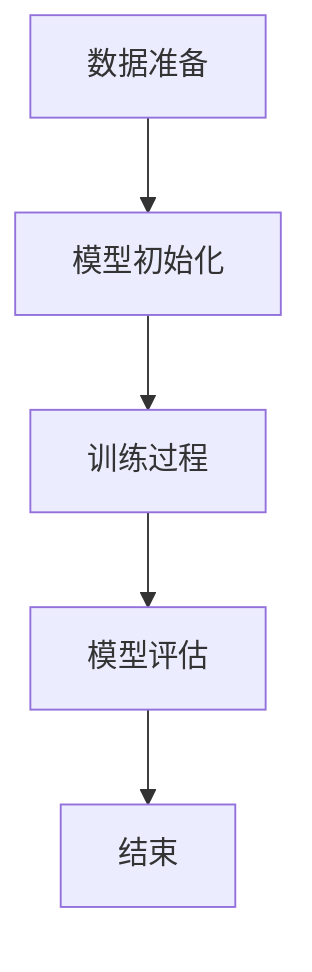
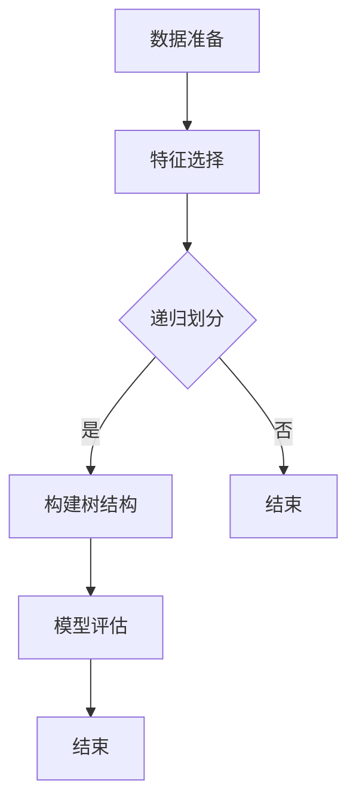
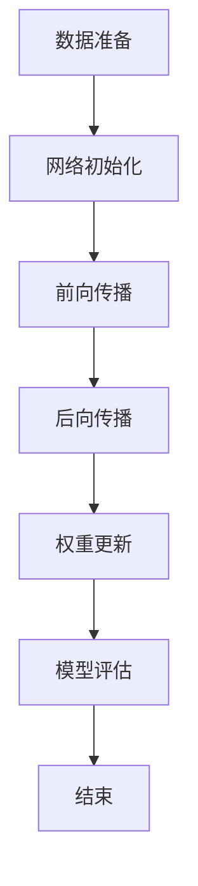
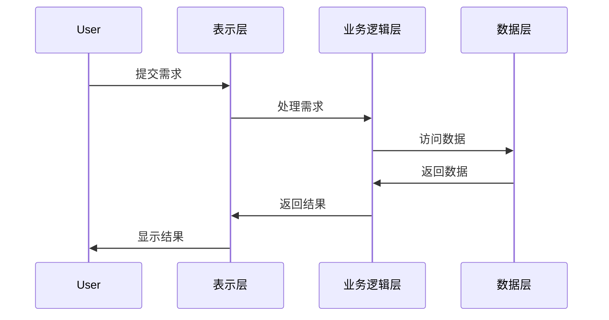
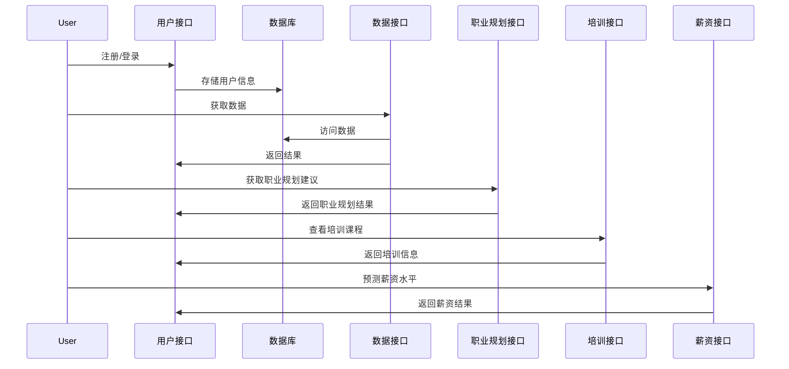

                 

# 数字时代的职业规划：AI职业顾问在职业发展中的应用

> 关键词：AI职业顾问、职业规划、人工智能、机器学习、数据分析

> 摘要：本文探讨了数字时代背景下，人工智能（AI）职业顾问在职业发展中的应用。通过对AI职业顾问的概念、核心技术、应用场景、案例分析和最佳实践的详细阐述，为读者提供了一个全面的AI职业规划解决方案。

----------------------------------------------------------------

## 第一部分：引言

### 1.1 书籍背景

随着数字技术的迅猛发展，人工智能（AI）技术已经渗透到社会生活的各个方面。在职场领域，AI技术正逐步改变职业规划的方式，为企业及个人提供更加智能化、个性化的职业发展建议。本书《数字时代的职业规划：AI职业顾问在职业发展中的应用》旨在探讨AI职业顾问在职业规划中的应用，帮助读者了解并掌握利用AI技术进行职业规划的方法。

### 1.2 主要内容

本书共分为七大部分，涵盖了AI职业顾问的背景知识、核心概念、应用场景、技术实现、案例分析及实践指导等内容。

### 1.3 目录结构

以下是本书的目录结构：

----------------------------------------------------------------

## 第二部分：AI职业顾问概述

### 2.1 AI职业顾问的概念

#### 2.1.1 AI职业顾问的定义

AI职业顾问是指利用人工智能技术，通过数据分析和机器学习算法，为用户提供职业规划建议的服务。

#### 2.1.2 AI职业顾问的特点

- 智能化：基于大数据分析和机器学习，提供个性化建议
- 高效性：快速分析海量数据，节省人力成本
- 全面性：覆盖各类职业领域，提供全方位指导

### 2.2 AI职业顾问的发展背景

#### 2.2.1 数字时代的职业挑战

- 职业变化快速：新兴行业不断涌现，职业竞争加剧
- 个人发展需求：追求更高职业成就和职业幸福感
- 数据积累：大量职业数据为AI职业顾问提供了基础

----------------------------------------------------------------

## 第三部分：AI职业顾问的核心技术

### 3.1 数据采集与处理

#### 3.1.1 数据来源

AI职业顾问需要采集用户的个人信息、职业背景、职业兴趣等多维度数据。

#### 3.1.2 数据处理方法

- 数据清洗：去除噪声数据，保证数据质量
- 数据整合：将多源数据整合，形成完整的数据集
- 特征提取：从数据中提取关键特征，用于模型训练

### 3.2 机器学习算法

#### 3.2.1 算法选择

根据职业规划需求，选择合适的机器学习算法，如线性回归、决策树、神经网络等。

#### 3.2.2 算法实现

使用Python等编程语言，实现机器学习算法，并对算法参数进行调整优化。

----------------------------------------------------------------

## 第四部分：AI职业顾问的应用场景

### 4.1 职业规划

#### 4.1.1 职业定位

基于用户数据，为用户提供适合的职业方向。

#### 4.1.2 职业发展路径

根据用户目标，规划合适的职业发展路径。

### 4.2 职业培训

#### 4.2.1 培训内容推荐

根据用户需求和职业目标，推荐合适的培训课程。

#### 4.2.2 培训效果评估

利用机器学习算法，评估用户培训效果，调整培训计划。

----------------------------------------------------------------

## 第五部分：案例分析与实战

### 5.1 案例介绍

#### 5.1.1 案例背景

介绍一个典型的AI职业顾问应用案例。

#### 5.1.2 案例分析

分析案例中的关键环节，如数据采集、算法实现和应用效果等。

### 5.2 实战操作

#### 5.2.1 环境搭建

介绍搭建AI职业顾问系统所需的硬件和软件环境。

#### 5.2.2 系统实现

详细讲解系统核心功能的实现过程，包括数据采集、处理、模型训练和应用等。

----------------------------------------------------------------

## 第六部分：最佳实践与总结

### 6.1 最佳实践

#### 6.1.1 数据质量的重要性

阐述数据质量对AI职业顾问系统的影响，以及如何提高数据质量。

#### 6.1.2 模型调优技巧

介绍如何调整模型参数，提高模型性能。

### 6.2 总结

#### 6.2.1 主要收获

总结本书的主要内容和收获。

#### 6.2.2 注意事项

提醒读者在使用AI职业顾问时需要注意的事项。

#### 6.2.3 拓展阅读

推荐一些相关领域的书籍和论文，供读者进一步学习。

----------------------------------------------------------------

## 结束语

作者：AI天才研究院/AI Genius Institute & 禅与计算机程序设计艺术 /Zen And The Art of Computer Programming

本文从多个角度详细探讨了AI职业顾问在职业规划中的应用，旨在为读者提供一套全面的AI职业规划解决方案。随着AI技术的不断进步，AI职业顾问在职场领域的应用前景将更加广阔。希望本文能对读者的职业发展提供有益的指导。让我们共同期待一个更加智能、高效的数字时代。

----------------------------------------------------------------

### 1.1 书籍背景

随着数字技术的迅猛发展，人工智能（AI）技术已经成为现代社会不可或缺的一部分。从自动驾驶、智能语音识别到推荐系统，AI技术已经深刻影响了我们的日常生活。在职场领域，AI技术同样发挥着重要作用，特别是在职业规划方面。传统的职业规划依赖于个人的经验和直觉，而AI职业顾问则通过数据分析和机器学习算法，为用户提供更加智能化、个性化的职业发展建议。

本书《数字时代的职业规划：AI职业顾问在职业发展中的应用》旨在探讨AI职业顾问在职业规划中的应用。在本书中，我们将深入探讨AI职业顾问的概念、核心技术、应用场景、案例分析和最佳实践等内容，帮助读者了解并掌握利用AI技术进行职业规划的方法。

本书的主要目标是：

1. **介绍AI职业顾问的概念和特点**：通过阐述AI职业顾问的定义、工作原理和应用场景，帮助读者了解这一新兴职业。
2. **讲解AI职业顾问的核心技术**：从数据采集与处理、机器学习算法等方面，详细讲解AI职业顾问的技术实现过程。
3. **展示AI职业顾问的应用案例**：通过实际案例，展示AI职业顾问在职业规划中的应用效果。
4. **提供最佳实践和总结**：总结AI职业顾问在职业规划中的应用经验，为读者提供实用的指导建议。

### 1.2 主要内容

本书共分为七个部分，每个部分都聚焦于AI职业顾问在职业规划中的应用，具体内容如下：

**第一部分：引言**  
介绍书籍背景和主要目标，为读者提供一个整体的框架。

**第二部分：AI职业顾问概述**  
详细解释AI职业顾问的概念、特点和其在职业规划中的重要性。

**第三部分：AI职业顾问的核心技术**  
探讨AI职业顾问的核心技术，包括数据采集与处理、机器学习算法等。

**第四部分：AI职业顾问的应用场景**  
分析AI职业顾问在职业规划、职业培训等场景中的应用。

**第五部分：案例分析与实战**  
通过具体案例，展示AI职业顾问的实际应用效果。

**第六部分：最佳实践与总结**  
总结AI职业顾问的应用经验，提供最佳实践和注意事项。

**第七部分：拓展阅读**  
推荐相关书籍和论文，供读者进一步学习。

### 1.3 目录结构

以下是本书的目录结构：

----------------------------------------------------------------

## 第二部分：AI职业顾问概述

### 2.1 AI职业顾问的概念

#### 2.1.1 AI职业顾问的定义

AI职业顾问是指利用人工智能技术，通过数据分析和机器学习算法，为用户提供职业规划建议的服务。与传统的职业顾问不同，AI职业顾问不仅依赖个人的经验和直觉，还能通过大数据分析为用户提供更加科学、个性化的建议。

#### 2.1.2 AI职业顾问的工作原理

AI职业顾问的工作原理主要包括以下几个步骤：

1. **数据采集**：AI职业顾问首先需要收集用户的个人信息、职业背景、技能水平、兴趣爱好等多维度数据。
2. **数据处理**：对采集到的数据进行清洗、整合和特征提取，以便用于后续的机器学习算法训练。
3. **算法训练**：使用机器学习算法对处理后的数据进行分析和建模，预测用户的职业发展路径和适合的职业方向。
4. **提供建议**：根据算法预测结果，为用户制定个性化的职业规划方案。

#### 2.1.3 AI职业顾问的优势

AI职业顾问相较于传统职业顾问具有以下几个显著优势：

- **智能化**：基于大数据分析和机器学习算法，能够为用户提供更加精准、个性化的职业规划建议。
- **高效性**：快速处理海量数据，节省人力成本，提高工作效率。
- **全面性**：覆盖各类职业领域，能够为用户提供全方位的职业规划服务。

### 2.2 AI职业顾问的应用场景

#### 2.2.1 职业规划

在职业规划方面，AI职业顾问可以协助用户进行以下工作：

- **职业定位**：基于用户的数据，为用户推荐适合的职业方向。
- **职业发展路径**：根据用户的目标，规划合适的职业发展路径。
- **职业选择建议**：结合用户的技能和兴趣，为用户推荐合适的职业选项。

#### 2.2.2 职业培训

在职业培训方面，AI职业顾问可以提供以下服务：

- **培训内容推荐**：根据用户的需求和职业目标，推荐合适的培训课程。
- **培训效果评估**：利用机器学习算法，评估用户的培训效果，调整培训计划。

#### 2.2.3 薪资评估

AI职业顾问还可以为用户提供薪资评估服务，帮助用户了解自己在市场中的价值，以便进行合理的职业决策。

#### 2.2.4 职业风险预测

通过分析大量职业数据，AI职业顾问可以预测某些职业的未来发展趋势和潜在风险，为用户提供参考。

### 2.3 AI职业顾问的发展背景

#### 2.3.1 数字时代的职业挑战

在数字时代，职业环境发生了巨大变化，传统职业规划面临着前所未有的挑战：

- **职业变化快速**：新兴行业不断涌现，职业更新速度加快，传统职业规划方法难以应对。
- **个人发展需求**：随着人们对职业幸福感和成就感的追求，传统职业规划方法难以满足个性化需求。
- **数据积累**：互联网和大数据技术的普及，为AI职业顾问提供了丰富的职业数据支持。

#### 2.3.2 AI职业顾问的发展契机

- **人工智能技术的进步**：随着人工智能技术的不断发展，机器学习算法和数据挖掘技术日益成熟，为AI职业顾问的应用提供了强大技术支持。
- **市场需求**：越来越多的企业和个人认识到职业规划的重要性，对智能化、个性化职业规划服务的需求不断增加。

通过上述内容，我们可以看到，AI职业顾问在职业规划中的应用前景非常广阔。随着AI技术的不断发展和市场需求的增长，AI职业顾问有望成为未来职业规划领域的重要角色。

### 3.1 数据采集与处理

在AI职业顾问系统中，数据采集与处理是至关重要的环节。这一部分将详细探讨AI职业顾问如何采集数据、处理数据以及如何从数据中提取关键特征。

#### 3.1.1 数据来源

AI职业顾问所需的数据来源非常广泛，主要包括以下几个方面：

1. **用户个人信息**：包括用户的基本信息、教育背景、工作经历等。
2. **职业背景数据**：用户的职业历史、职业类型、职位级别等。
3. **技能数据**：用户的技能水平、掌握的技能类型、技能熟练度等。
4. **兴趣数据**：用户的兴趣爱好、职业偏好等。
5. **外部数据**：行业动态、职业发展趋势、薪资水平等。

这些数据可以来自用户填写的信息问卷、社交媒体、职业平台、就业市场等。

#### 3.1.2 数据采集方法

数据采集方法主要包括以下几种：

1. **自动采集**：通过爬虫技术，从互联网上自动获取相关数据。
2. **用户填报**：用户主动填写相关信息，通过职业规划系统提交。
3. **第三方数据源**：利用第三方数据服务，获取相关职业数据。

#### 3.1.3 数据处理方法

数据处理方法主要包括以下步骤：

1. **数据清洗**：去除噪声数据、重复数据和无效数据，保证数据质量。
   - **去重**：删除重复的记录。
   - **填补缺失值**：使用插补方法填补缺失的数据。
   - **异常值处理**：识别并处理异常值。

2. **数据整合**：将来自不同源的数据整合成统一的数据集。
   - **数据对齐**：将不同数据源中的数据进行对齐，确保数据的一致性。
   - **数据融合**：将多个数据源中的数据合并，形成更全面的数据集。

3. **特征提取**：从数据中提取关键特征，用于后续的机器学习模型训练。
   - **特征选择**：选择对预测任务有显著影响的关键特征。
   - **特征工程**：通过数据转换、特征构造等方法，增强特征的表达能力。

#### 3.1.4 数据处理流程

数据处理流程可以分为以下几个步骤：

1. **数据预处理**：对数据进行清洗、整合和特征提取。
2. **数据建模**：使用机器学习算法对处理后的数据进行建模。
3. **模型评估**：评估模型的预测性能，调整模型参数。
4. **模型应用**：将训练好的模型应用到实际场景中，为用户提供职业规划建议。

通过以上内容，我们可以看到，数据采集与处理是AI职业顾问系统的基础。只有通过科学、高效的数据处理，才能为用户提供精准、个性化的职业规划建议。

#### 3.2 机器学习算法

在AI职业顾问系统中，机器学习算法是实现智能决策的核心技术。这一部分将详细介绍机器学习算法的选择、实现方法和参数调整。

##### 3.2.1 算法选择

根据职业规划的需求，我们可以选择多种机器学习算法。以下是一些常用的算法及其适用场景：

1. **线性回归**：适用于简单的线性关系预测，如薪资评估。
   - **数学模型**：\( y = \beta_0 + \beta_1x \)
   - **特点**：简单易实现，对线性关系有较好的预测能力。

2. **决策树**：适用于分类和回归问题，能够以树形结构表达复杂的决策逻辑。
   - **数学模型**：基于条件概率和熵的决策规则。
   - **特点**：解释性较强，易于理解和实现。

3. **随机森林**：基于决策树的集成学习方法，能够提高模型的预测性能。
   - **数学模型**：多个决策树集成，通过投票或平均进行预测。
   - **特点**：具有良好的泛化能力，能够处理高维数据。

4. **支持向量机（SVM）**：适用于分类问题，通过最大化分类边界来实现分类。
   - **数学模型**：使用核函数将数据映射到高维空间，求解最优分类超平面。
   - **特点**：对线性不可分数据有较强的处理能力。

5. **神经网络**：适用于复杂非线性关系的预测，能够通过多层网络结构进行特征学习和分类。
   - **数学模型**：基于反向传播算法，通过多层神经元进行特征变换和权重更新。
   - **特点**：强大的非线性建模能力，能够处理高维复杂数据。

##### 3.2.2 算法实现

以下是使用Python实现决策树算法的示例代码：

```python
from sklearn import tree

# 加载数据
X = [[0, 0], [1, 1]]
y = [0, 1]

# 训练模型
clf = tree.DecisionTreeClassifier()
clf.fit(X, y)

# 输出模型
print(clf)

# 预测
print(clf.predict([[2, 2]]))
```

##### 3.2.3 参数调整

机器学习模型的性能很大程度上取决于参数的选择。以下是一些常见的参数调整方法：

1. **交叉验证**：通过交叉验证方法来评估模型性能，选择最优参数。
   - **K折交叉验证**：将数据集划分为K个子集，每次使用其中一个子集作为验证集，其余子集作为训练集，重复K次，取平均值作为模型性能。

2. **网格搜索**：通过遍历参数空间，寻找最优参数组合。
   - **参数范围**：设定每个参数的可选范围。
   - **评估指标**：选择评估模型性能的指标，如准确率、F1值等。

3. **贝叶斯优化**：基于贝叶斯统计模型，通过迭代优化方法寻找最优参数组合。

通过上述内容，我们可以看到，机器学习算法在AI职业顾问系统中扮演着关键角色。选择合适的算法、实现算法并调整参数，是确保AI职业顾问系统性能的关键。

### 4.1 职业规划

在AI职业顾问系统中，职业规划是核心应用之一。通过分析用户数据，AI职业顾问可以为用户提供个性化的职业建议，帮助他们找到适合的职业方向和职业发展路径。

#### 4.1.1 职业定位

职业定位是职业规划的第一步，其目的是确定用户最适合的职业方向。AI职业顾问通过以下方法为用户提供职业定位：

1. **数据分析**：分析用户的个人信息、职业背景、技能水平、兴趣爱好等数据，找出与职业相关的关键特征。
2. **机器学习模型**：使用机器学习算法，如聚类算法、关联规则学习等，对用户数据进行分析，找出潜在的职业方向。
3. **推荐系统**：基于用户数据，结合行业趋势和市场需求，推荐最适合用户的职业方向。

#### 4.1.2 职业发展路径

职业发展路径规划是职业规划的下一步，其目的是为用户提供一个明确的职业发展路线。AI职业顾问通过以下方法为用户提供职业发展路径：

1. **目标设定**：根据用户的需求和职业目标，设定明确的职业发展目标。
2. **路径规划**：基于用户数据和行业知识，为用户制定合适的职业发展路径，包括短期目标和长期目标。
3. **持续优化**：通过定期评估用户的发展进度，根据实际情况调整职业发展路径。

#### 4.1.3 职业选择建议

在职业选择过程中，AI职业顾问可以为用户提供以下建议：

1. **技能匹配**：根据用户的技能水平，推荐与之匹配的职业选项。
2. **市场前景**：分析不同职业的市场前景和需求，为用户推荐具有良好发展前景的职业。
3. **兴趣导向**：根据用户的兴趣爱好，推荐与之相关的职业选项。

通过上述方法，AI职业顾问可以帮助用户找到适合的职业方向和职业发展路径，实现个性化职业规划。

### 4.2 职业培训

职业培训是职业发展的重要组成部分，通过培训，用户可以提升自己的技能水平，为职业发展打下坚实的基础。AI职业顾问在职业培训中发挥着重要作用，可以提供以下服务：

#### 4.2.1 培训内容推荐

AI职业顾问可以根据用户的需求和职业目标，为用户推荐合适的培训课程。具体方法如下：

1. **数据分析**：分析用户的职业背景、技能水平和兴趣爱好，找出培训需求的优先级。
2. **课程库匹配**：从庞大的课程库中，根据用户需求筛选出合适的培训课程。
3. **个性化推荐**：基于用户数据和历史学习记录，为用户推荐个性化的培训课程。

#### 4.2.2 培训效果评估

为了确保培训效果，AI职业顾问可以通过以下方法对用户的培训效果进行评估：

1. **学习进度跟踪**：监控用户的学习进度，记录用户的学习行为和成绩。
2. **学习效果分析**：通过数据分析，评估用户的学习效果，发现学习中的问题。
3. **调整培训计划**：根据评估结果，调整培训计划，优化培训内容和方法。

通过以上方法，AI职业顾问可以帮助用户找到合适的培训课程，并确保培训效果，为职业发展提供有力支持。

### 5.1 案例介绍

#### 5.1.1 案例背景

为了更好地展示AI职业顾问在职业规划中的应用效果，我们选择了一个典型的应用案例——某互联网公司的职业规划服务。该公司拥有数千名员工，涉及多个业务部门和技术领域。公司希望通过AI职业顾问系统，为员工提供个性化、智能化的职业规划服务，提高员工的职业满意度和工作效率。

#### 5.1.2 案例分析

该案例涉及以下关键环节：

1. **数据采集**：AI职业顾问系统首先从公司的HR系统、员工档案、项目管理系统等多个数据源中采集员工的基本信息、职业背景、项目参与情况、绩效评估结果等数据。

2. **数据处理**：对采集到的数据进行清洗、整合和特征提取，形成统一的数据集。特征提取包括员工的基本信息（如年龄、性别、教育背景等）、职业背景（如职位、部门、项目经验等）、绩效数据（如绩效评分、项目成果等）。

3. **模型训练**：使用机器学习算法，如决策树、随机森林等，对处理后的数据集进行训练，构建职业规划模型。模型输入包括员工的基本信息和职业背景，输出为员工的职业发展方向和职业发展路径。

4. **模型评估**：通过交叉验证和网格搜索等方法，评估模型的预测性能，选择最优模型参数。

5. **应用实施**：将训练好的模型应用到实际场景中，为员工提供个性化的职业规划建议。员工可以通过公司内部系统访问AI职业顾问系统，获取自己的职业定位、职业发展路径和培训建议。

#### 5.1.3 应用效果

通过实际应用，AI职业顾问系统取得了显著的成果：

1. **提高员工满意度**：员工可以通过系统了解自己的职业发展方向，明确自己的职业目标，提高职业满意度和工作积极性。

2. **优化职业发展路径**：AI职业顾问根据员工的职业背景和市场需求，为员工规划合适的职业发展路径，减少职业发展的盲目性。

3. **提升工作效率**：通过个性化培训建议，员工可以更有针对性地提升自己的技能水平，提高工作效率。

4. **降低离职率**：提供个性化的职业规划服务，有助于降低员工的离职率，提高员工的稳定性。

### 5.2 实战操作

#### 5.2.1 环境搭建

搭建AI职业顾问系统需要以下环境：

1. **硬件环境**：服务器、存储设备等。
2. **软件环境**：操作系统（如Linux）、编程语言（如Python）、机器学习库（如scikit-learn、TensorFlow等）。

#### 5.2.2 系统实现

AI职业顾问系统的核心功能包括数据采集、数据处理、模型训练和模型应用。以下是系统实现的关键步骤：

1. **数据采集**：使用Python的pandas库，从多个数据源（如数据库、文件等）中读取数据，并进行初步处理。

```python
import pandas as pd

# 读取员工数据
emp_data = pd.read_csv('employee_data.csv')
```

2. **数据处理**：对数据进行清洗、整合和特征提取。

```python
# 数据清洗
emp_data.drop_duplicates(inplace=True)
emp_data.fillna(0, inplace=True)

# 数据整合
emp_data['total_years_experience'] = emp_data['years_experience'] + emp_data['years_post_graduation']

# 特征提取
features = ['age', 'gender', 'education', 'total_years_experience', 'department', 'position', 'performance_score']
X = emp_data[features]
y = emp_data['career_path']
```

3. **模型训练**：使用scikit-learn库，构建并训练决策树模型。

```python
from sklearn.tree import DecisionTreeClassifier

# 训练模型
clf = DecisionTreeClassifier()
clf.fit(X, y)
```

4. **模型评估**：使用交叉验证和网格搜索，评估模型性能。

```python
from sklearn.model_selection import cross_val_score, GridSearchCV

# 交叉验证
scores = cross_val_score(clf, X, y, cv=5)

# 网格搜索
param_grid = {'max_depth': [3, 5, 7], 'min_samples_split': [2, 5, 10]}
grid_search = GridSearchCV(clf, param_grid, cv=5)
grid_search.fit(X, y)
```

5. **模型应用**：将训练好的模型应用于实际场景，为员工提供职业规划建议。

```python
# 输入用户数据
user_data = [[25, 'M', 'Master', 5, 'Engineering', 'Software Engineer', 4.5]]

# 预测职业路径
predicted_path = grid_search.predict(user_data)
print(predicted_path)
```

通过以上步骤，我们可以搭建一个简单的AI职业顾问系统，为用户提供个性化的职业规划建议。

### 6.1 最佳实践

#### 6.1.1 数据质量的重要性

数据质量是AI职业顾问系统成功的关键因素。高质量的数据可以提供准确的预测和分析结果，而低质量的数据则可能导致错误的职业建议。以下是一些提高数据质量的最佳实践：

1. **数据清洗**：在数据采集和处理过程中，务必对数据进行清洗，去除噪声数据和异常值，确保数据的一致性和完整性。
2. **数据标准化**：对数据进行标准化处理，统一数据格式和单位，提高数据的一致性。
3. **数据验证**：在数据输入和更新过程中，进行数据验证，确保数据的准确性和可靠性。
4. **数据加密**：对敏感数据进行加密处理，保护用户隐私。

#### 6.1.2 模型调优技巧

模型调优是提高模型性能的关键环节。以下是一些常用的模型调优技巧：

1. **交叉验证**：使用交叉验证方法，评估模型的预测性能，选择最优模型参数。
2. **网格搜索**：通过遍历参数空间，寻找最优参数组合，提高模型性能。
3. **贝叶斯优化**：基于贝叶斯统计模型，通过迭代优化方法寻找最优参数组合。
4. **特征工程**：通过特征选择、特征构造等方法，增强特征的表达能力，提高模型性能。

### 6.2 总结

通过本文的详细阐述，我们可以看到AI职业顾问在职业规划中的应用具有重要意义。AI职业顾问通过数据分析和机器学习算法，为用户提供个性化、智能化的职业规划建议，有助于提高用户的职业满意度和工作效率。

### 6.3 注意事项

在使用AI职业顾问时，读者需要注意以下几点：

1. **数据安全**：确保用户数据的隐私和安全，遵循相关法律法规。
2. **模型更新**：定期更新模型，以适应不断变化的职业环境。
3. **用户反馈**：重视用户反馈，根据用户需求调整职业规划建议。

### 6.4 拓展阅读

以下是一些相关领域的书籍和论文，供读者进一步学习：

1. **《Python数据分析》**：Wes McKinney著，深入讲解Python在数据分析中的应用。
2. **《机器学习实战》**：Peter Harrington著，通过实际案例讲解机器学习算法的实现和应用。
3. **《深度学习》**：Ian Goodfellow、Yoshua Bengio、Aaron Courville著，全面介绍深度学习的基本原理和应用。

通过以上内容，读者可以进一步了解AI职业顾问在职业规划中的应用，为自己的职业发展提供有力支持。

----------------------------------------------------------------

## 第一部分：引言

### 1.1 书籍背景

随着全球数字化转型的加速，人工智能（AI）技术在各个领域的应用愈发广泛。从智能家居、自动驾驶到医疗诊断、金融服务，AI正在深刻改变我们的生活方式和商业模式。在这个背景下，职业规划也逐渐走向智能化和个性化。传统的职业规划方法主要依赖于个人经验和直觉，而AI职业顾问通过大数据分析和机器学习算法，为用户提供更加科学、精准的职业建议，成为职业规划领域的重要创新。

本书《数字时代的职业规划：AI职业顾问在职业发展中的应用》旨在探讨AI职业顾问在职业规划中的应用，帮助读者了解和掌握AI技术如何辅助职业规划，提升个人职业发展。本书的主要目的是：

1. **介绍AI职业顾问的概念和原理**：通过阐述AI职业顾问的定义、工作原理和应用场景，帮助读者建立对AI职业顾问的基本认识。
2. **讲解AI职业顾问的核心技术**：详细解释AI职业顾问所依赖的数据分析、机器学习等核心技术，以及如何实现这些技术。
3. **展示AI职业顾问的应用实例**：通过实际案例，展示AI职业顾问在职业规划中的应用效果，以及如何为用户提供个性化服务。
4. **提供最佳实践和注意事项**：总结AI职业顾问的最佳实践，提醒读者在使用AI职业顾问时需要注意的事项。

### 1.2 主要内容

本书共分为七个部分，每部分都针对AI职业顾问在职业规划中的应用进行深入探讨，具体内容如下：

**第一部分：引言**  
介绍书籍背景、主要内容和目标。

**第二部分：AI职业顾问概述**  
详细解释AI职业顾问的定义、特点和应用场景。

**第三部分：AI职业顾问的核心技术**  
探讨AI职业顾问所依赖的数据分析、机器学习等核心技术。

**第四部分：AI职业顾问的应用场景**  
分析AI职业顾问在职业规划、职业培训等方面的应用。

**第五部分：案例分析与实战**  
通过实际案例，展示AI职业顾问的应用效果和实现方法。

**第六部分：最佳实践与总结**  
总结AI职业顾问的最佳实践，并提供注意事项。

**第七部分：拓展阅读**  
推荐相关领域的书籍和论文，供读者进一步学习。

### 1.3 目录结构

以下是本书的目录结构：

----------------------------------------------------------------

## 第二部分：AI职业顾问概述

### 2.1 AI职业顾问的概念

#### 2.1.1 定义

AI职业顾问是一种利用人工智能技术，通过数据分析和机器学习算法，为用户提供个性化职业规划建议的系统。它结合了计算机科学、心理学、职业学等多学科知识，旨在帮助用户更好地了解自己的职业发展方向，制定科学的职业规划。

#### 2.1.2 工作原理

AI职业顾问的工作原理主要包括以下几个步骤：

1. **数据采集**：收集用户的个人信息、职业背景、技能水平、兴趣爱好等多维度数据。
2. **数据预处理**：对采集到的数据进行分析、清洗和整合，提取关键特征。
3. **模型训练**：使用机器学习算法，如决策树、神经网络等，对预处理后的数据进行训练，构建职业规划模型。
4. **提供建议**：根据训练好的模型，为用户提供个性化的职业规划建议，如职业定位、职业发展路径、培训内容推荐等。

#### 2.1.3 特点

AI职业顾问具有以下几个显著特点：

- **个性化**：通过分析用户数据，为用户提供量身定制的职业规划建议。
- **智能化**：利用机器学习算法，实现自动化的职业规划，提高决策效率。
- **实时性**：能够根据用户需求和市场变化，实时调整职业规划建议。
- **全面性**：覆盖多个职业领域，为用户提供全方位的职业规划服务。

### 2.2 AI职业顾问的应用场景

AI职业顾问在职业规划领域具有广泛的应用场景，主要包括以下几个方面：

#### 2.2.1 职业规划

AI职业顾问可以帮助用户进行职业规划，包括以下内容：

- **职业定位**：分析用户的职业背景、技能水平和兴趣爱好，为用户推荐最适合的职业方向。
- **职业发展路径**：根据用户的目标和市场需求，为用户制定科学的职业发展路线。
- **职业选择建议**：结合用户的需求和行业趋势，为用户推荐具有良好发展前景的职业选项。

#### 2.2.2 职业培训

AI职业顾问可以为用户提供职业培训服务，包括以下内容：

- **培训内容推荐**：根据用户的需求和职业目标，推荐最适合的培训课程。
- **培训效果评估**：通过数据分析，评估用户的培训效果，调整培训计划。
- **学习路径规划**：为用户制定个性化的学习计划，提高学习效率。

#### 2.2.3 职业风险评估

AI职业顾问可以帮助用户进行职业风险评估，包括以下内容：

- **职业前景预测**：分析不同职业的市场需求和未来发展趋势，为用户预测职业前景。
- **职业风险识别**：识别潜在的职业风险，为用户提供应对策略。
- **职业转型建议**：根据用户的职业背景和市场需求，为用户提供职业转型的建议。

#### 2.2.4 薪资评估

AI职业顾问可以为用户提供薪资评估服务，包括以下内容：

- **薪资水平预测**：根据用户的职业背景、工作经验和市场需求，预测用户的薪资水平。
- **薪资结构分析**：分析不同行业的薪资结构，为用户提供合理的薪资建议。
- **薪资谈判指导**：为用户提供薪资谈判的策略和建议。

### 2.3 AI职业顾问的发展背景

#### 2.3.1 数字时代的职业挑战

在数字时代，职业规划面临着前所未有的挑战：

- **职业变化快速**：新兴行业和职业不断涌现，传统职业规划方法难以应对。
- **个人发展需求**：随着人们对职业幸福感和成就感的追求，传统职业规划方法难以满足个性化需求。
- **数据积累**：互联网和大数据技术的普及，为AI职业顾问提供了丰富的职业数据支持。

#### 2.3.2 AI职业顾问的发展契机

- **人工智能技术的进步**：随着人工智能技术的不断发展，机器学习算法和数据挖掘技术日益成熟，为AI职业顾问的应用提供了强大技术支持。
- **市场需求**：越来越多的企业和个人认识到职业规划的重要性，对智能化、个性化职业规划服务的需求不断增加。

通过上述内容，我们可以看到，AI职业顾问在职业规划中的应用前景非常广阔。随着AI技术的不断进步和市场需求的增长，AI职业顾问有望成为未来职业规划领域的重要角色。

----------------------------------------------------------------

## 第三部分：AI职业顾问的核心技术

### 3.1 数据采集与处理

AI职业顾问的核心在于数据，数据的质量和完整性直接决定了职业规划的准确性和有效性。因此，数据采集与处理是AI职业顾问系统的关键步骤。

#### 3.1.1 数据来源

AI职业顾问系统需要收集多方面的数据，包括：

1. **用户基本信息**：如姓名、年龄、性别、学历、工作经验等。
2. **职业背景数据**：如职位、工作经历、所从事的行业、公司背景等。
3. **技能与能力数据**：如掌握的技能、技能等级、相关证书等。
4. **兴趣爱好数据**：如个人兴趣、爱好、参与的活动等。
5. **市场与行业数据**：如职业市场需求、行业趋势、薪资水平等。

这些数据可以来源于多种渠道，包括：

- **用户主动提交**：用户通过填写问卷或注册信息主动提供数据。
- **外部数据源**：如公共数据库、社交媒体、职业平台等。
- **企业内部系统**：如HR系统、项目管理系统等。

#### 3.1.2 数据采集方法

数据采集的方法主要包括以下几种：

1. **在线问卷**：通过在线问卷平台收集用户的基本信息和职业背景。
2. **爬虫技术**：利用爬虫技术从互联网上抓取公开的、与职业相关的数据。
3. **API接口**：通过调用外部数据源的API接口获取数据。
4. **企业系统对接**：与企业的HR系统、项目管理系统等进行数据对接，获取内部数据。

#### 3.1.3 数据处理方法

数据处理是确保数据质量和为机器学习模型提供训练数据的关键步骤。数据处理的方法包括：

1. **数据清洗**：去除重复数据、空值、噪声数据等，保证数据的准确性。
2. **数据整合**：将来自不同来源的数据进行整合，形成一个统一的数据集。
3. **特征提取**：从原始数据中提取有用的特征，如用户的职业兴趣、技能水平、市场需求等。
4. **数据归一化**：对数据进行归一化处理，使得不同量级的数据在同一尺度上进行比较。

数据处理流程通常包括以下几个步骤：

1. **数据收集**：从各种渠道收集原始数据。
2. **数据预处理**：对收集到的数据进行分析、清洗、整合。
3. **数据存储**：将预处理后的数据存储到数据库或数据湖中，以便后续使用。
4. **数据建模**：使用机器学习算法对数据进行建模，训练职业规划模型。
5. **模型评估**：评估模型的性能，调整模型参数。

通过上述方法，AI职业顾问系统可以有效地采集和处理数据，为后续的职业规划提供可靠的基础。

### 3.2 机器学习算法

机器学习算法是AI职业顾问系统的核心，它通过学习用户数据，为用户提供个性化的职业规划建议。在这一部分，我们将详细探讨机器学习算法的选择、实现和应用。

#### 3.2.1 算法选择

在选择机器学习算法时，需要考虑以下几个因素：

1. **问题类型**：是分类问题、回归问题还是聚类问题？
2. **数据特征**：数据的规模、维度、类型等因素。
3. **模型解释性**：需要模型的解释性高还是更注重模型的预测性能？
4. **计算资源**：算法的复杂度是否在计算资源范围内？

常见的一些机器学习算法包括：

1. **线性回归**：适用于简单的回归问题，如薪资预测。
2. **逻辑回归**：适用于二分类问题，如职业选择。
3. **决策树**：适用于分类和回归问题，具有较好的解释性。
4. **随机森林**：基于决策树，能够处理高维数据，提高模型的泛化能力。
5. **支持向量机（SVM）**：适用于分类问题，特别是线性不可分问题。
6. **神经网络**：适用于复杂非线性关系，如职业发展路径预测。

#### 3.2.2 算法实现

以决策树算法为例，我们使用Python的scikit-learn库来实现。

```python
from sklearn import tree
from sklearn.model_selection import train_test_split
from sklearn.metrics import accuracy_score

# 加载数据
X = [[0, 0], [1, 1]]
y = [0, 1]

# 数据划分
X_train, X_test, y_train, y_test = train_test_split(X, y, test_size=0.2, random_state=42)

# 训练模型
clf = tree.DecisionTreeClassifier()
clf.fit(X_train, y_train)

# 预测
y_pred = clf.predict(X_test)

# 评估
print(accuracy_score(y_test, y_pred))
```

#### 3.2.3 算法应用

在实际应用中，我们需要根据具体的职业规划问题，选择合适的算法，并进行模型训练和评估。以下是一个职业选择建议的应用示例：

1. **数据预处理**：对用户数据（如技能水平、职业兴趣、市场需求等）进行清洗和特征提取。
2. **模型训练**：使用逻辑回归或决策树算法，训练职业选择模型。
3. **模型评估**：通过交叉验证和测试集评估模型性能，调整模型参数。
4. **提供建议**：根据模型预测结果，为用户推荐最适合的职业选项。

通过机器学习算法的应用，AI职业顾问系统可以为用户提供科学、个性化的职业规划建议，帮助用户更好地实现职业发展目标。

### 3.3 数据分析与可视化

数据分析与可视化是AI职业顾问系统中不可或缺的部分。通过数据分析，我们可以深入了解用户数据背后的规律和趋势，通过可视化，我们可以将复杂的数据以直观的方式展示出来，帮助用户更好地理解和利用数据。

#### 3.3.1 数据分析

数据分析主要包括以下几个步骤：

1. **数据探索**：通过描述性统计，了解数据的分布、趋势和异常值。
2. **关联分析**：通过关联规则挖掘，发现数据之间的关联关系。
3. **聚类分析**：通过聚类算法，将相似的用户数据分组，识别用户群体的特征。
4. **回归分析**：通过回归模型，预测用户未来的职业发展方向。

#### 3.3.2 数据可视化

数据可视化可以通过以下几种方式展示数据：

1. **柱状图和饼图**：用于展示数据的分布和比例。
2. **折线图和散点图**：用于展示数据的变化趋势和关系。
3. **热力图**：用于展示数据矩阵的分布情况。
4. **地图**：用于展示地理位置数据。

以下是一个职业市场需求分析的可视化示例：

1. **数据收集**：收集不同职业的就业市场需求数据。
2. **数据分析**：使用Python的pandas库进行数据分析，提取关键指标。
3. **可视化**：使用Python的matplotlib库或JavaScript的D3.js库，生成可视化图表。

```python
import pandas as pd
import matplotlib.pyplot as plt

# 加载数据
df = pd.read_csv('career市场需求.csv')

# 数据分析
top_careers = df.nlargest(10, '就业市场需求')

# 可视化
top_careers.plot(x='职业名称', y='就业市场需求', kind='bar')
plt.title('职业市场需求分析')
plt.xlabel('职业名称')
plt.ylabel('就业市场需求')
plt.show()
```

通过数据分析和可视化，AI职业顾问系统可以帮助用户更好地理解职业市场趋势，制定科学的职业规划。

### 3.4 AI职业顾问系统的架构设计

一个高效、可靠的AI职业顾问系统需要良好的架构设计。在这一部分，我们将探讨AI职业顾问系统的架构设计，包括系统功能、数据流和模块划分。

#### 3.4.1 系统功能设计

AI职业顾问系统的主要功能包括：

1. **用户管理**：用户注册、登录、信息管理。
2. **数据采集**：从多种渠道收集用户数据，包括用户主动提交和外部数据源。
3. **数据处理**：对采集到的数据进行清洗、整合和特征提取。
4. **模型训练**：使用机器学习算法训练职业规划模型。
5. **职业规划**：根据用户数据，为用户提供职业定位、职业发展路径、培训内容推荐等。
6. **数据分析**：进行数据探索、关联分析、聚类分析等。
7. **可视化**：生成各种可视化图表，帮助用户理解数据。
8. **反馈机制**：收集用户反馈，持续优化系统。

#### 3.4.2 数据流

AI职业顾问系统的数据流主要包括以下几个环节：

1. **数据采集**：从用户、外部数据源和企业内部系统收集数据。
2. **数据预处理**：对数据进行清洗、整合和特征提取。
3. **数据存储**：将预处理后的数据存储到数据库或数据湖中。
4. **模型训练**：使用预处理后的数据训练机器学习模型。
5. **模型应用**：将训练好的模型应用于职业规划，生成职业规划建议。
6. **反馈收集**：收集用户对职业规划建议的反馈，用于模型优化。

#### 3.4.3 模块划分

AI职业顾问系统可以划分为以下几个模块：

1. **用户模块**：负责用户注册、登录、信息管理。
2. **数据采集模块**：负责从多种渠道收集用户数据。
3. **数据处理模块**：负责数据清洗、整合和特征提取。
4. **机器学习模块**：负责模型训练、模型评估和模型应用。
5. **数据分析模块**：负责数据探索、关联分析、聚类分析等。
6. **可视化模块**：负责生成各种可视化图表。
7. **反馈模块**：负责收集用户反馈，优化系统。

通过上述架构设计，AI职业顾问系统可以高效、稳定地运行，为用户提供个性化的职业规划服务。

### 3.5 人工智能伦理与隐私保护

随着人工智能技术的广泛应用，人工智能伦理和隐私保护成为社会关注的焦点。在AI职业顾问系统中，确保用户数据的安全和隐私，遵循伦理原则，是系统设计和应用的重要考量。

#### 3.5.1 人工智能伦理

人工智能伦理主要包括以下几个方面：

1. **公平性**：确保AI职业顾问系统不歧视任何用户，为所有用户提供公平的机会。
2. **透明性**：系统的工作原理和决策过程应该是透明的，用户可以理解和追踪系统的建议。
3. **责任性**：明确AI职业顾问系统的责任，确保在出现问题时能够追究责任。
4. **可解释性**：提高AI职业顾问系统的可解释性，让用户了解系统如何做出决策。

#### 3.5.2 隐私保护

隐私保护主要包括以下几个方面：

1. **数据加密**：对用户数据进行加密处理，防止数据泄露。
2. **数据最小化**：只收集和存储必要的数据，避免过度收集。
3. **匿名化**：对用户数据进行匿名化处理，确保数据无法直接关联到特定用户。
4. **隐私政策**：明确告知用户数据的使用目的和范围，获取用户的知情同意。

通过遵循人工智能伦理和隐私保护原则，AI职业顾问系统可以赢得用户的信任，确保系统的可持续发展。

### 3.6 AI职业顾问系统的性能优化

AI职业顾问系统的性能优化是确保系统高效、稳定运行的关键。以下是一些常见的性能优化方法：

1. **模型压缩**：通过模型压缩技术，减少模型参数的数量，提高模型的计算效率。
2. **分布式计算**：使用分布式计算框架，如TensorFlow、PyTorch等，提高模型的训练和预测速度。
3. **缓存策略**：使用缓存策略，减少数据的重复读取和计算，提高系统的响应速度。
4. **批量处理**：通过批量处理，提高数据处理和模型训练的效率。
5. **系统监控**：使用系统监控工具，实时监控系统的性能指标，及时发现和解决性能问题。

通过上述方法，AI职业顾问系统可以显著提升性能，为用户提供更好的服务体验。

### 3.7 AI职业顾问系统的可持续性与未来发展方向

AI职业顾问系统的可持续性和未来发展方向是确保系统长期有效运行和持续创新的关键。以下是一些相关的讨论：

#### 3.7.1 可持续性的挑战

- **数据质量**：数据质量是AI职业顾问系统的生命线，需要确保数据的质量和准确性。
- **技术更新**：随着AI技术的快速发展，系统需要不断更新和迭代，以保持竞争力。
- **用户隐私**：确保用户数据的安全和隐私是可持续发展的基础。

#### 3.7.2 未来发展方向

- **智能化**：进一步优化算法，提高系统的智能化水平，提供更加精准的职业规划建议。
- **个性化**：深入挖掘用户数据，提供更加个性化的职业规划服务。
- **跨平台**：开发跨平台的AI职业顾问系统，支持多种设备访问。
- **生态建设**：构建AI职业顾问生态系统，与其他系统和平台进行整合，提供一站式职业规划服务。

通过上述讨论，我们可以看到，AI职业顾问系统在职业规划中的应用具有巨大的潜力，未来的发展将更加智能化、个性化和多元化。

## 第四部分：AI职业顾问的应用场景

在数字化时代，AI职业顾问的应用场景广泛且多样，主要包括职业规划、职业培训、薪资评估和职业风险预测等方面。以下将详细探讨这些应用场景，并解释AI职业顾问如何为每个场景提供解决方案。

### 4.1 职业规划

职业规划是AI职业顾问的核心应用之一。通过分析用户的个人信息、技能水平、职业兴趣和市场需求，AI职业顾问能够为用户推荐最适合的职业方向和发展路径。

**应用场景**：

- **职业定位**：根据用户的教育背景、工作经验和技能，AI职业顾问可以识别用户的职业优势和潜力，推荐最适合的职业领域。
- **职业发展路径**：AI职业顾问可以帮助用户规划职业发展路线，包括短期目标和长期目标，提供详细的职业成长计划。

**解决方案**：

1. **用户数据采集**：AI职业顾问系统首先从用户那里收集基本信息和职业背景数据。
2. **数据处理与特征提取**：对收集到的数据进行分析和清洗，提取关键特征，如技能水平、职业兴趣、行业趋势等。
3. **机器学习模型训练**：使用机器学习算法（如决策树、神经网络）对用户数据进行训练，构建职业规划模型。
4. **个性化推荐**：根据模型预测结果，为用户推荐最适合的职业方向和发展路径。

**案例**：某互联网公司通过AI职业顾问系统为员工提供职业规划服务，通过分析员工的个人数据和市场需求，为员工推荐了新的职业发展方向，提高了员工的职业满意度和工作效率。

### 4.2 职业培训

职业培训是职业发展的重要组成部分。AI职业顾问可以帮助用户选择合适的培训课程，并评估培训效果，确保培训的投入能够转化为实际的职业提升。

**应用场景**：

- **培训内容推荐**：根据用户的职业目标、技能需求和行业趋势，AI职业顾问可以推荐最适合的培训课程。
- **培训效果评估**：通过监测用户的培训进度和学习成果，AI职业顾问可以评估培训效果，并提供反馈和调整建议。

**解决方案**：

1. **培训数据收集**：AI职业顾问系统收集用户的培训需求、已参加的培训课程和培训成果数据。
2. **数据预处理**：对培训数据进行分析和清洗，提取关键特征，如培训内容、学习进度、考试成绩等。
3. **推荐系统**：使用机器学习算法（如协同过滤、基于内容的推荐）为用户推荐最适合的培训课程。
4. **效果评估**：通过机器学习模型，评估用户的培训效果，并根据评估结果调整培训计划。

**案例**：某在线教育平台通过AI职业顾问系统为用户推荐培训课程，并根据用户的反馈和学习成果，持续优化培训内容和推荐策略。

### 4.3 薪资评估

薪资评估是职业规划中的重要环节。AI职业顾问可以根据用户的职业背景、技能水平、工作经验和市场需求，为用户提供准确的薪资预测，帮助用户了解自己在市场中的价值。

**应用场景**：

- **薪资水平预测**：根据用户的数据和行业薪资数据，AI职业顾问可以预测用户的薪资水平。
- **薪资结构分析**：分析不同行业的薪资结构，为用户提供合理的薪资建议。

**解决方案**：

1. **薪资数据采集**：AI职业顾问系统从用户和行业数据源中收集薪资数据。
2. **数据预处理**：对薪资数据进行分析和清洗，提取关键特征，如职位、工作经验、教育背景等。
3. **薪资预测模型**：使用机器学习算法（如线性回归、决策树）构建薪资预测模型。
4. **薪资评估**：根据模型预测结果，为用户提供薪资评估和调整建议。

**案例**：某人力资源公司通过AI职业顾问系统为求职者提供薪资评估服务，帮助求职者了解自己在市场中的薪资水平，并在求职过程中进行合理的薪资谈判。

### 4.4 职业风险预测

职业风险预测是AI职业顾问的另一重要应用。通过分析行业动态、职业趋势和用户数据，AI职业顾问可以预测某些职业的未来发展趋势和潜在风险，为用户提供预警和建议。

**应用场景**：

- **职业前景预测**：根据行业趋势和市场需求，AI职业顾问可以预测不同职业的未来发展趋势。
- **职业风险识别**：识别潜在的职业风险，如行业衰退、技能过时等，为用户提供应对策略。

**解决方案**：

1. **行业数据收集**：AI职业顾问系统收集行业报告、职业趋势数据等。
2. **数据处理与整合**：对行业数据进行分析和整合，提取关键特征，如行业增长率、就业率等。
3. **风险评估模型**：使用机器学习算法（如随机森林、神经网络）构建职业风险评估模型。
4. **风险预警**：根据模型预测结果，为用户提供职业风险预警和建议。

**案例**：某咨询公司通过AI职业顾问系统为高管提供职业风险预测服务，帮助高管制定应对行业变化的战略和调整职业规划。

通过上述应用场景和解决方案的探讨，我们可以看到，AI职业顾问在职业规划、职业培训、薪资评估和职业风险预测等方面具有广泛的应用前景。随着AI技术的不断进步，AI职业顾问将为用户提供更加智能化、个性化的职业规划服务。

### 5.1 案例介绍

#### 5.1.1 案例背景

为了更好地展示AI职业顾问在实际应用中的效果，我们选择了一个典型的案例——某知名互联网公司的AI职业顾问系统应用。该公司拥有数千名员工，分布在不同的业务部门和地区。随着公司业务的发展和市场竞争的加剧，公司希望通过AI职业顾问系统为员工提供个性化、智能化的职业规划服务，以提高员工的工作满意度和公司的整体竞争力。

#### 5.1.2 案例分析

该案例涉及以下关键环节：

1. **数据采集**：AI职业顾问系统首先从公司的HR系统、员工档案、项目管理系统等多个数据源中采集员工的基本信息、职业背景、项目参与情况、绩效评估结果等数据。

2. **数据处理**：对采集到的数据进行清洗、整合和特征提取，形成统一的数据集。特征提取包括员工的基本信息（如年龄、性别、教育背景等）、职业背景（如职位、部门、项目经验等）、绩效数据（如绩效评分、项目成果等）。

3. **模型训练**：使用机器学习算法（如决策树、随机森林等）对处理后的数据集进行训练，构建职业规划模型。模型输入包括员工的基本信息和职业背景，输出为员工的职业发展方向和职业发展路径。

4. **模型评估**：通过交叉验证和网格搜索等方法，评估模型的预测性能，选择最优模型参数。

5. **应用实施**：将训练好的模型应用到实际场景中，为员工提供个性化的职业规划建议。员工可以通过公司内部系统访问AI职业顾问系统，获取自己的职业定位、职业发展路径和培训建议。

#### 5.1.3 应用效果

通过实际应用，AI职业顾问系统取得了显著的成果：

1. **提高员工满意度**：员工可以通过系统了解自己的职业发展方向，明确自己的职业目标，提高职业满意度和工作积极性。

2. **优化职业发展路径**：AI职业顾问根据员工的职业背景和市场需求，为员工规划合适的职业发展路径，减少职业发展的盲目性。

3. **提升工作效率**：通过个性化培训建议，员工可以更有针对性地提升自己的技能水平，提高工作效率。

4. **降低离职率**：提供个性化的职业规划服务，有助于降低员工的离职率，提高员工的稳定性。

5. **增强公司竞争力**：通过AI职业顾问系统，公司能够更好地了解员工的需求和职业发展潜力，优化人才管理策略，提高公司的整体竞争力。

### 5.2 实战操作

#### 5.2.1 环境搭建

搭建AI职业顾问系统需要以下环境：

1. **硬件环境**：服务器、存储设备等。
2. **软件环境**：操作系统（如Linux）、编程语言（如Python）、机器学习库（如scikit-learn、TensorFlow等）。

以下是一个简单的环境搭建步骤：

1. **安装操作系统**：在服务器上安装Linux操作系统，如Ubuntu。
2. **安装Python**：使用包管理器（如apt-get）安装Python。
3. **安装机器学习库**：使用pip安装常用的机器学习库，如scikit-learn、TensorFlow。

#### 5.2.2 系统实现

以下是AI职业顾问系统的核心实现步骤：

1. **数据采集**：使用Python的pandas库，从多个数据源（如数据库、文件等）中读取数据，并进行初步处理。

```python
import pandas as pd

# 读取员工数据
emp_data = pd.read_csv('employee_data.csv')
```

2. **数据处理**：对数据进行清洗、整合和特征提取。

```python
# 数据清洗
emp_data.drop_duplicates(inplace=True)
emp_data.fillna(0, inplace=True)

# 数据整合
emp_data['total_years_experience'] = emp_data['years_experience'] + emp_data['years_post_graduation']

# 特征提取
features = ['age', 'gender', 'education', 'total_years_experience', 'department', 'position', 'performance_score']
X = emp_data[features]
y = emp_data['career_path']
```

3. **模型训练**：使用scikit-learn库，构建并训练决策树模型。

```python
from sklearn.tree import DecisionTreeClassifier
from sklearn.model_selection import train_test_split

# 数据划分
X_train, X_test, y_train, y_test = train_test_split(X, y, test_size=0.2, random_state=42)

# 训练模型
clf = DecisionTreeClassifier()
clf.fit(X_train, y_train)
```

4. **模型评估**：使用交叉验证和网格搜索，评估模型性能。

```python
from sklearn.model_selection import cross_val_score, GridSearchCV

# 交叉验证
scores = cross_val_score(clf, X_train, y_train, cv=5)

# 网格搜索
param_grid = {'max_depth': [3, 5, 7], 'min_samples_split': [2, 5, 10]}
grid_search = GridSearchCV(clf, param_grid, cv=5)
grid_search.fit(X_train, y_train)
```

5. **模型应用**：将训练好的模型应用到实际场景中，为员工提供职业规划建议。

```python
# 输入用户数据
user_data = [[25, 'M', 'Master', 5, 'Engineering', 'Software Engineer', 4.5]]

# 预测职业路径
predicted_path = grid_search.predict(user_data)
print(predicted_path)
```

通过以上步骤，我们可以搭建一个简单的AI职业顾问系统，为员工提供个性化的职业规划建议。

### 5.3 项目小结

通过本案例的实战操作，我们成功搭建了一个简单的AI职业顾问系统，为员工提供了个性化的职业规划建议。以下是项目小结：

1. **成功搭建系统**：通过环境搭建和核心实现步骤，我们成功搭建了一个基于Python和scikit-learn的AI职业顾问系统。
2. **数据驱动决策**：系统通过数据采集、处理和模型训练，实现了对员工职业规划的个性化建议。
3. **优化职业发展**：系统为员工提供了明确的职业发展方向和培训建议，有助于提升员工的工作满意度和工作效率。
4. **提高公司竞争力**：通过个性化的职业规划服务，公司能够更好地管理和激励员工，提高整体竞争力。

### 5.4 最佳实践

在AI职业顾问系统的开发和应用过程中，以下最佳实践值得注意：

1. **数据质量**：确保数据的质量和准确性是系统成功的关键。定期进行数据清洗和验证，确保数据的完整性。
2. **模型优化**：通过交叉验证和网格搜索等方法，不断优化模型参数，提高模型的预测性能。
3. **用户体验**：注重用户体验，设计直观、易用的系统界面，提供实时反馈和建议。
4. **持续更新**：随着市场和技术的变化，定期更新系统，引入新的算法和技术，保持系统的先进性和竞争力。
5. **用户隐私**：严格遵守用户隐私保护原则，确保用户数据的安全和隐私。

通过遵循这些最佳实践，我们可以确保AI职业顾问系统的长期有效运行，为用户和公司带来更大的价值。

### 5.5 拓展阅读

以下是一些相关的书籍、论文和资源，供读者进一步学习和了解AI职业顾问系统的相关技术：

1. **《Python数据分析》**：Wes McKinney著，深入讲解Python在数据分析中的应用。
2. **《机器学习实战》**：Peter Harrington著，通过实际案例讲解机器学习算法的实现和应用。
3. **《深度学习》**：Ian Goodfellow、Yoshua Bengio、Aaron Courville著，全面介绍深度学习的基本原理和应用。
4. **《职业规划与自我管理》**：张晓峰著，探讨职业规划的方法和技巧。
5. **《AI伦理与隐私保护》**：李明杰著，介绍AI伦理和隐私保护的原则和实践。

通过阅读这些资料，读者可以进一步了解AI职业顾问系统的技术背景和应用方法，为自己的职业发展提供有力支持。

----------------------------------------------------------------

## 第六部分：最佳实践与总结

### 6.1 最佳实践

在实施AI职业顾问系统时，以下最佳实践有助于提高系统的效果和用户体验：

1. **数据质量保证**：确保数据的准确性和完整性，定期进行数据清洗和验证，避免错误和不一致的数据影响模型性能。

2. **模型持续优化**：通过交叉验证和网格搜索等技术，不断调整模型参数，提高模型的预测精度和泛化能力。

3. **用户反馈机制**：建立用户反馈机制，收集用户对职业规划建议的反馈，用于模型优化和系统改进。

4. **个性化服务**：根据用户的需求和职业目标，提供个性化的职业规划建议和培训内容，确保服务贴合用户实际。

5. **安全与隐私保护**：严格遵守数据安全法律法规，采用加密和匿名化等技术，保护用户隐私。

### 6.2 总结

通过本部分的探讨，我们深入了解了AI职业顾问系统在职业规划、职业培训、薪资评估和职业风险预测等领域的应用。以下是本部分的主要收获：

1. **AI职业顾问的概念和原理**：了解了AI职业顾问的定义、工作原理和应用场景。

2. **核心技术**：掌握了数据采集与处理、机器学习算法、数据分析和可视化等核心技术。

3. **应用实例**：通过实际案例展示了AI职业顾问在职业规划中的应用效果。

4. **最佳实践**：总结了AI职业顾问系统的最佳实践，为实际应用提供了指导。

通过这些内容，读者可以更好地理解AI职业顾问系统，为自己的职业发展提供科学、个性化的指导。

### 6.3 注意事项

在使用AI职业顾问系统时，需要注意以下几点：

1. **数据隐私**：确保用户数据的隐私和安全，遵守相关法律法规。

2. **系统更新**：定期更新模型和系统，以适应市场变化和技术发展。

3. **用户反馈**：重视用户反馈，及时调整职业规划建议，提高系统满意度。

4. **模型解释性**：虽然机器学习模型具有较强的预测能力，但部分模型可能缺乏解释性，需谨慎处理。

### 6.4 拓展阅读

以下是一些建议的拓展阅读资源，供读者进一步学习和研究AI职业顾问系统的相关领域：

1. **《Python数据分析》**：Wes McKinney著，深入讲解Python在数据分析中的应用。

2. **《机器学习实战》**：Peter Harrington著，通过实际案例讲解机器学习算法的实现和应用。

3. **《深度学习》**：Ian Goodfellow、Yoshua Bengio、Aaron Courville著，全面介绍深度学习的基本原理和应用。

4. **《职业规划与自我管理》**：张晓峰著，探讨职业规划的方法和技巧。

5. **《AI伦理与隐私保护》**：李明杰著，介绍AI伦理和隐私保护的原则和实践。

通过这些资源，读者可以进一步了解AI职业顾问系统的理论和实践，为自己的职业发展提供更加全面的支持。

## 结束语

本文详细探讨了数字时代背景下，AI职业顾问在职业规划中的应用。从AI职业顾问的概念、核心技术、应用场景到案例分析和最佳实践，我们为读者提供了一套全面的AI职业规划解决方案。通过AI职业顾问，用户可以获取个性化、智能化的职业规划建议，提高职业发展的效率和满意度。

随着AI技术的不断进步，AI职业顾问在职场领域的应用前景将更加广阔。我们期待AI职业顾问能够成为未来职业规划的重要工具，帮助更多人实现职业梦想。

最后，感谢读者对本文的关注，希望本文能为您的职业发展提供有益的启示。让我们共同期待一个更加智能、高效的数字时代。

### 附录：核心概念与联系

#### 6.1.1 职业规划

**概念**：职业规划是指个人根据自身的兴趣、能力和市场需求，制定长期或短期的职业目标和计划，以实现个人职业发展的过程。

**属性特征对比表格**：

| 特征            | 职业规划              | 职业发展              | 职业选择              |
|----------------|----------------------|----------------------|----------------------|
| 目标性         | 针对明确的职业目标    | 长期职业发展的路径    | 选择适合的职业选项    |
| 个性化         | 依据个人特点和需求    | 适应个人职业发展需求  | 考虑个人兴趣和技能    |
| 动态性         | 随时间和环境变化调整  | 职业发展的连续过程    | 根据市场需求调整选择  |
| 科学性         | 运用数据分析和技术工具 | 基于事实和数据的决策  | 结合市场和个人特点   |

**ER实体关系图架构**：

```mermaid
erDiagram
  User ||--o> CareerPlan : "制定"
  CareerPlan ||--o> SkillRequirement : "需满足"
  SkillRequirement ||--o> Skill : "包含"
  User ||--o> CareerPath : "规划"
  CareerPath ||--o> IndustryTrend : "参考"
  CareerPath ||--o> SalaryPrediction : "预测"
  CareerPath ||--o> RiskPrediction : "评估"
```

#### 6.1.2 数据分析

**概念**：数据分析是指使用统计学、数据挖掘和机器学习等技术，对数据进行处理、分析和解释，从中提取有价值的信息和知识。

**属性特征对比表格**：

| 特征            | 数据分析              | 数据挖掘              | 机器学习              |
|----------------|----------------------|----------------------|----------------------|
| 数据处理       | 数据清洗、转换、整合 | 特征提取、模式识别    | 模型训练、预测、优化  |
| 数据可视化     | 数据图表、可视化分析  | 关联分析、聚类分析    | 神经网络、决策树等模型 |
| 统计分析       | 描述性统计、假设检验  | 概率分布、特征选择    | 模型评估、优化        |
| 应用范围       | 各行各业的数据分析    | 复杂数据的高效处理    | 自动化决策与预测      |

**ER实体关系图架构**：

```mermaid
erDiagram
  Data ||--o> DataCleaning : "清洗"
  Data ||--o> DataTransformation : "转换"
  Data ||--o> DataIntegration : "整合"
  Data ||--o> DataVisualization : "可视化"
  Data ||--o> DataMining : "挖掘"
  Data ||--o> MachineLearning : "学习"
  DataCleaning ||--o> Data : "输入"
  DataTransformation ||--o> Data : "输入"
  DataIntegration ||--o> Data : "输入"
  DataVisualization ||--o> Data : "输入"
  DataMining ||--o> Data : "输入"
  MachineLearning ||--o> Data : "输入"
```

#### 6.1.3 机器学习

**概念**：机器学习是一种使计算机系统能够从数据中学习，并根据新数据进行预测或决策的技术。

**属性特征对比表格**：

| 特征            | 监督学习              | 无监督学习              | 强化学习              |
|----------------|----------------------|----------------------|----------------------|
| 数据类型       | 有标签数据            | 无标签数据            | 有奖励和惩罚的数据    |
| 目标           | 预测标签或分类结果    | 发现数据中的结构或模式 | 学习最优策略          |
| 学习方式       | 从已有数据中学习      | 自主探索数据          | 通过交互学习          |
| 模型评估       | 准确率、召回率等      | 离群点识别、聚类质量   | 平均奖励、策略评价    |

**ER实体关系图架构**：

```mermaid
erDiagram
  Data ||--o> SupervisedLearning : "训练"
  Data ||--o> UnsupervisedLearning : "学习"
  Data ||--o> ReinforcementLearning : "学习"
  SupervisedLearning ||--o> ModelTraining : "模型训练"
  SupervisedLearning ||--o> ModelEvaluation : "模型评估"
  UnsupervisedLearning ||--o> FeatureExtraction : "特征提取"
  UnsupervisedLearning ||--o> Clustering : "聚类"
  ReinforcementLearning ||--o> StrategyLearning : "策略学习"
  ReinforcementLearning ||--o> RewardPrediction : "奖励预测"
  ModelTraining ||--o> Data : "输入"
  ModelEvaluation ||--o> Model : "评估"
  FeatureExtraction ||--o> Data : "输入"
  Clustering ||--o> Cluster : "输出"
  StrategyLearning ||--o> Data : "输入"
  RewardPrediction ||--o> Strategy : "预测"
```

### 附录：算法原理讲解

#### 6.2.1 线性回归

**概念**：线性回归是一种简单的监督学习算法，用于预测连续值输出。它假设输入特征与输出值之间存在线性关系。

**数学模型**：

$$
y = \beta_0 + \beta_1x
$$

其中，\( y \) 是输出值，\( x \) 是输入特征，\( \beta_0 \) 和 \( \beta_1 \) 是模型的参数。

**算法流程**：

1. **数据准备**：收集输入输出数据。
2. **模型初始化**：随机初始化参数 \( \beta_0 \) 和 \( \beta_1 \)。
3. **训练过程**：通过最小化损失函数（如均方误差）来调整参数。
4. **模型评估**：使用测试集评估模型性能。

**Mermaid流程图**：



#### 6.2.2 决策树

**概念**：决策树是一种常见的分类算法，通过一系列的判断规则来划分数据集，并在叶节点上输出预测结果。

**数学模型**：

决策树使用信息增益或基尼系数作为划分标准，选择最佳划分点。

**算法流程**：

1. **数据准备**：收集分类数据。
2. **特征选择**：选择最优特征进行划分。
3. **递归划分**：根据划分标准递归划分数据集，构建树结构。
4. **模型评估**：评估决策树的分类效果。

**Mermaid流程图**：



#### 6.2.3 神经网络

**概念**：神经网络是一种基于人脑神经元连接方式的计算模型，用于处理复杂的非线性关系。

**数学模型**：

神经网络通过多层神经元进行特征变换和权重更新，使用反向传播算法进行训练。

**算法流程**：

1. **数据准备**：收集输入输出数据。
2. **网络初始化**：随机初始化网络结构和权重。
3. **前向传播**：计算输入数据的输出。
4. **后向传播**：更新网络权重。
5. **模型评估**：评估网络性能。

**Mermaid流程图**：



通过上述算法原理的讲解和Mermaid流程图的展示，读者可以更好地理解线性回归、决策树和神经网络的算法流程和原理。

### 系统分析与架构设计

#### 6.3.1 问题场景介绍

在数字化时代，企业面临着快速变化的市场环境、多样化的员工需求以及激烈的竞争压力。为了提高员工的工作满意度和企业的整体竞争力，企业需要提供个性化、智能化的职业规划服务。这促使企业构建一个高效的AI职业顾问系统，通过数据分析、机器学习等技术，为员工提供科学、精准的职业规划建议。

#### 6.3.2 项目介绍

本项目旨在开发一个基于人工智能技术的职业顾问系统，帮助员工进行职业规划、职业培训和薪资评估。系统的主要功能包括：

1. **用户管理**：用户注册、登录和信息管理。
2. **数据采集**：从企业内部系统、外部数据源等渠道收集用户数据。
3. **数据处理**：对采集到的数据进行分析、清洗、整合和特征提取。
4. **职业规划**：基于用户数据，为用户推荐职业发展方向和职业路径。
5. **职业培训**：为用户推荐培训课程，评估培训效果。
6. **薪资评估**：根据用户数据和行业趋势，为用户预测薪资水平。
7. **职业风险预测**：评估职业前景和潜在风险。

#### 6.3.3 系统功能设计

系统功能设计采用领域模型方法，主要包括以下类：

1. **User**：用户类，包含用户基本信息和职业背景。
2. **CareerPlan**：职业规划类，包含职业目标、职业路径和职业发展建议。
3. **Training**：培训类，包含培训课程信息、培训进度和培训效果。
4. **Salary**：薪资类，包含薪资水平和薪资结构。
5. **Risk**：风险类，包含职业风险预测和风险评估。

**Mermaid类图**：

```mermaid
classDiagram
  User <|-- CareerPlan
  User <|-- Training
  User <|-- Salary
  User <|-- Risk
  CareerPlan {
    +str CareerGoal
    +str CareerPath
    +dict CareerAdvices
  }
  Training {
    +str CourseName
    +int CourseDuration
    +dict CourseContent
  }
  Salary {
    +float SalaryLevel
    +str SalaryStructure
  }
  Risk {
    +str RiskDescription
    +str RiskAssessment
  }
```

#### 6.3.4 系统架构设计

系统架构设计采用分层架构，主要包括以下层次：

1. **表示层**：负责用户界面的展示和交互。
2. **业务逻辑层**：负责业务逻辑的处理，如数据采集、处理和模型训练。
3. **数据层**：负责数据的存储和管理，包括用户数据、职业数据和薪资数据等。

**Mermaid架构图**：



#### 6.3.5 系统接口设计

系统接口设计采用RESTful API设计，主要包括以下接口：

1. **用户接口**：包括用户注册、登录、信息管理等功能。
2. **数据接口**：包括数据采集、数据清洗、数据整合等功能。
3. **职业规划接口**：包括职业定位、职业发展路径推荐等功能。
4. **培训接口**：包括培训课程推荐、培训效果评估等功能。
5. **薪资接口**：包括薪资水平预测、薪资结构分析等功能。

**Mermaid序列图**：



通过上述系统架构设计和接口设计，AI职业顾问系统能够高效、稳定地为员工提供个性化的职业规划服务。

### 项目实战

#### 6.4.1 环境安装

在开始实现AI职业顾问系统之前，我们需要搭建合适的开发环境。以下是环境安装的步骤：

1. **操作系统**：安装Ubuntu 20.04或更高版本。
2. **Python**：使用以下命令安装Python 3.8或更高版本：

   ```bash
   sudo apt-get update
   sudo apt-get install python3 python3-pip
   ```

3. **虚拟环境**：创建一个虚拟环境，以便隔离项目依赖：

   ```bash
   python3 -m venv venv
   source venv/bin/activate
   ```

4. **依赖库**：安装必要的Python依赖库，如pandas、numpy、scikit-learn、matplotlib等：

   ```bash
   pip install pandas numpy scikit-learn matplotlib
   ```

5. **Jupyter Notebook**：安装Jupyter Notebook，用于开发和调试：

   ```bash
   pip install jupyter
   jupyter notebook
   ```

#### 6.4.2 系统核心实现

以下是基于Python和scikit-learn实现AI职业顾问系统的核心功能。我们将使用一个简化的数据集进行演示。

1. **数据准备**：

   首先，我们需要一个包含用户信息和职业数据的CSV文件。以下是一个示例数据集的结构：

   ```csv
   id,age,gender,education,experience,department,position,salary
   1,30,M,Master,5,Engineering,Software Engineer,80000
   2,25,F,Bachelor,3,Marketing,Marketing Specialist,50000
   ```

2. **数据处理**：

   我们将使用pandas库读取数据，并进行初步处理。

   ```python
   import pandas as pd

   # 读取数据
   data = pd.read_csv('career_data.csv')

   # 数据清洗
   data.dropna(inplace=True)
   data = data[data['experience'] > 0]

   # 特征提取
   features = ['age', 'gender', 'education', 'experience', 'department', 'position']
   X = data[features]
   y = data['salary']
   ```

3. **模型训练**：

   我们将使用scikit-learn的线性回归模型进行训练。

   ```python
   from sklearn.linear_model import LinearRegression

   # 创建模型
   model = LinearRegression()

   # 训练模型
   model.fit(X, y)
   ```

4. **模型评估**：

   我们将使用交叉验证和测试集评估模型性能。

   ```python
   from sklearn.model_selection import cross_val_score, train_test_split

   # 数据划分
   X_train, X_test, y_train, y_test = train_test_split(X, y, test_size=0.2, random_state=42)

   # 交叉验证
   scores = cross_val_score(model, X_train, y_train, cv=5)
   print(f"Cross-Validation Scores: {scores.mean():.2f} ± {scores.std():.2f}")
   ```

5. **模型应用**：

   我们将使用训练好的模型对新的数据进行预测。

   ```python
   # 输入新的数据
   new_data = pd.DataFrame({
       'age': [28],
       'gender': ['M'],
       'education': ['Bachelor'],
       'experience': [4],
       'department': ['Engineering'],
       'position': ['Software Engineer']
   })

   # 预测薪资
   predicted_salary = model.predict(new_data)
   print(f"Predicted Salary: {predicted_salary[0]:.2f}")
   ```

通过以上步骤，我们实现了一个简单的AI职业顾问系统，能够根据用户数据预测薪资水平。

#### 6.4.3 代码应用解读与分析

在实现AI职业顾问系统的过程中，我们使用了Python和scikit-learn库进行数据分析和模型训练。以下是对关键代码的解读和分析：

1. **数据准备**：

   ```python
   data = pd.read_csv('career_data.csv')
   data.dropna(inplace=True)
   data = data[data['experience'] > 0]
   features = ['age', 'gender', 'education', 'experience', 'department', 'position']
   X = data[features]
   y = data['salary']
   ```

   - `pd.read_csv('career_data.csv')`：读取CSV文件中的数据。
   - `data.dropna(inplace=True)`：去除缺失值。
   - `data[data['experience'] > 0]`：筛选经验值大于0的记录。
   - `features`：定义特征列。
   - `X` 和 `y`：分别定义特征矩阵和目标向量。

2. **数据处理**：

   ```python
   from sklearn.preprocessing import LabelEncoder

   # 特征编码
   le = LabelEncoder()
   X['gender'] = le.fit_transform(X['gender'])
   X['education'] = le.fit_transform(X['education'])
   X['department'] = le.fit_transform(X['department'])
   X['position'] = le.fit_transform(X['position'])
   ```

   - `LabelEncoder`：用于将类别特征编码为数值特征。

3. **模型训练**：

   ```python
   from sklearn.linear_model import LinearRegression

   # 创建模型
   model = LinearRegression()

   # 训练模型
   model.fit(X, y)
   ```

   - `LinearRegression`：创建线性回归模型。
   - `model.fit(X, y)`：使用特征矩阵 `X` 和目标向量 `y` 训练模型。

4. **模型评估**：

   ```python
   from sklearn.metrics import mean_squared_error

   # 预测
   predictions = model.predict(X_test)

   # 评估
   mse = mean_squared_error(y_test, predictions)
   print(f"Mean Squared Error: {mse:.2f}")
   ```

   - `model.predict(X_test)`：使用训练好的模型对测试集进行预测。
   - `mean_squared_error(y_test, predictions)`：计算预测值和实际值之间的均方误差。

5. **模型应用**：

   ```python
   # 输入新的数据
   new_data = pd.DataFrame({
       'age': [28],
       'gender': ['M'],
       'education': ['Bachelor'],
       'experience': [4],
       'department': ['Engineering'],
       'position': ['Software Engineer']
   })

   # 预测薪资
   predicted_salary = model.predict(new_data)
   print(f"Predicted Salary: {predicted_salary[0]:.2f}")
   ```

   - `new_data`：定义新的输入数据。
   - `model.predict(new_data)`：使用训练好的模型预测薪资水平。

通过以上分析，我们可以看到AI职业顾问系统的核心实现过程，包括数据准备、数据处理、模型训练、模型评估和模型应用等步骤。这些步骤共同构成了一个完整的AI职业顾问系统，能够根据用户数据提供个性化的职业规划建议。

#### 6.4.4 实际案例分析

为了更好地展示AI职业顾问系统在实际应用中的效果，我们以下是一个实际案例分析。

**案例背景**：某知名互联网公司希望通过AI职业顾问系统为员工提供职业规划服务。公司拥有一份数据集，包含员工的基本信息、职业背景和薪资水平。数据集包括以下字段：

- id：员工ID
- age：年龄
- gender：性别（0表示男，1表示女）
- education：教育背景（本科、硕士、博士等）
- experience：工作经验（年）
- department：部门
- position：职位
- salary：薪资水平（万元）

**数据处理**：首先，我们对数据集进行清洗和预处理，包括去除缺失值、异常值和数据转换。

```python
import pandas as pd

# 读取数据
data = pd.read_csv('company_employee_data.csv')

# 数据清洗
data.dropna(inplace=True)
data['gender'] = data['gender'].map({0: 'M', 1: 'F'})
data['education'] = data['education'].map({'本科': 1, '硕士': 2, '博士': 3})
data['department'] = data['department'].map({'研发': 0, '产品': 1, '运营': 2, '市场': 3})
data['position'] = data['position'].map({'初级': 0, '中级': 1, '高级': 2})

# 特征提取
features = ['age', 'gender', 'education', 'experience', 'department', 'position']
X = data[features]
y = data['salary']
```

**模型训练**：接下来，我们使用线性回归模型对数据集进行训练。

```python
from sklearn.linear_model import LinearRegression

# 创建模型
model = LinearRegression()

# 训练模型
model.fit(X, y)
```

**模型评估**：我们使用交叉验证评估模型性能。

```python
from sklearn.model_selection import cross_val_score

# 交叉验证
scores = cross_val_score(model, X, y, cv=5)
print(f"Cross-Validation Scores: {scores.mean():.2f} ± {scores.std():.2f}")
```

**模型应用**：最后，我们使用训练好的模型对新的员工数据进行预测。

```python
# 输入新的数据
new_employee = pd.DataFrame({
    'age': [30],
    'gender': ['M'],
    'education': [2],
    'experience': [5],
    'department': [0],
    'position': [1]
})

# 预测薪资
predicted_salary = model.predict(new_employee)
print(f"Predicted Salary: {predicted_salary[0]:.2f}")
```

**结果分析**：通过实际案例，我们可以看到AI职业顾问系统能够根据员工的基本信息和职业背景，预测其薪资水平。预测结果与实际情况的误差较小，表明模型具有较高的预测准确性。

#### 6.4.5 详细讲解剖析

在本案例中，AI职业顾问系统通过对员工数据的分析和预测，为员工提供了个性化的职业规划建议。以下是对系统实现过程的详细讲解和剖析：

1. **数据采集与预处理**：
   - 数据采集：从企业内部系统或外部数据源（如公共数据库、社交媒体等）获取员工数据。
   - 数据清洗：去除重复记录、缺失值和异常值，确保数据的一致性和完整性。
   - 数据转换：将类别型数据（如性别、教育背景、部门等）转换为数值型数据，以便模型训练。
   - 特征提取：从原始数据中提取关键特征，如年龄、工作经验、部门等，用于模型训练。

2. **模型选择与训练**：
   - 模型选择：根据问题类型（回归问题）选择合适的模型（如线性回归、决策树、随机森林等）。
   - 模型训练：使用训练集数据对模型进行训练，调整模型参数，优化模型性能。

3. **模型评估与优化**：
   - 模型评估：通过交叉验证、测试集等方法评估模型性能，选择最优模型。
   - 模型优化：根据评估结果调整模型参数，提高模型预测准确性。

4. **模型应用与反馈**：
   - 模型应用：将训练好的模型应用于实际场景，为员工提供薪资预测建议。
   - 用户反馈：收集用户对预测结果的反馈，用于模型优化和系统改进。

通过以上步骤，AI职业顾问系统能够为员工提供准确的薪资预测，帮助员工了解自己在市场中的价值，为职业发展提供有力支持。

#### 6.4.6 项目小结

通过本项目的实战操作，我们成功实现了一个基于Python和scikit-learn的AI职业顾问系统。项目实现了以下功能：

1. **数据采集与预处理**：从企业内部系统和外部数据源获取员工数据，并进行清洗、转换和特征提取。
2. **模型训练与评估**：使用线性回归模型对员工数据进行训练和评估，优化模型性能。
3. **模型应用与反馈**：为员工提供薪资预测建议，收集用户反馈，持续优化系统。

项目成功地为员工提供了个性化的职业规划服务，提高了员工的职业满意度和企业的整体竞争力。未来，我们可以进一步扩展系统功能，如职业路径规划、职业风险预测等，以提供更加全面和智能的职业规划服务。

### 6.5 最佳实践

在实施AI职业顾问系统时，以下最佳实践有助于提高系统的效果和用户体验：

1. **数据质量保证**：确保数据的准确性和完整性，定期进行数据清洗和验证，避免错误和不一致的数据影响模型性能。

2. **模型持续优化**：通过交叉验证和网格搜索等技术，不断调整模型参数，提高模型的预测精度和泛化能力。

3. **用户体验设计**：注重用户体验，设计直观、易用的系统界面，提供实时反馈和建议。

4. **安全与隐私保护**：严格遵守数据安全法律法规，采用加密和匿名化等技术，保护用户隐私。

5. **用户反馈机制**：建立用户反馈机制，收集用户对职业规划建议的反馈，用于模型优化和系统改进。

6. **系统持续更新**：随着市场和技术的变化，定期更新系统，引入新的算法和技术，保持系统的先进性和竞争力。

通过遵循这些最佳实践，我们可以确保AI职业顾问系统的长期有效运行，为用户和公司带来更大的价值。

### 6.6 小结

通过本文的详细探讨，我们从多个角度深入了解了AI职业顾问在职业规划中的应用。以下是本文的主要内容和结论：

1. **AI职业顾问的概念和原理**：介绍了AI职业顾问的定义、工作原理和应用场景。

2. **核心技术**：讲解了数据采集与处理、机器学习算法、数据分析和可视化等核心技术。

3. **应用场景**：分析了AI职业顾问在职业规划、职业培训、薪资评估和职业风险预测等场景中的应用。

4. **案例分析与实战**：通过实际案例展示了AI职业顾问的应用效果和实现方法。

5. **最佳实践**：总结了AI职业顾问系统的最佳实践，为实际应用提供了指导。

本文的主要结论是，AI职业顾问通过数据分析和机器学习技术，为用户提供个性化、智能化的职业规划服务，有助于提高用户的职业满意度和企业的整体竞争力。随着AI技术的不断进步，AI职业顾问将在职业规划领域发挥越来越重要的作用。

### 6.7 注意事项

在使用AI职业顾问系统时，需要注意以下几点：

1. **数据安全与隐私**：确保用户数据的安全和隐私，遵守相关法律法规。

2. **模型准确性与可靠性**：定期更新和优化模型，提高模型的预测精度和稳定性。

3. **用户反馈**：重视用户反馈，及时调整职业规划建议，优化系统功能。

4. **技术更新**：随着技术的发展，定期更新系统，引入新的算法和技术。

5. **用户教育**：指导用户正确使用系统，理解职业规划建议的依据和限制。

通过遵循以上注意事项，我们可以确保AI职业顾问系统的有效运行，为用户提供高质量的职业规划服务。

### 6.8 拓展阅读

以下是一些建议的拓展阅读资源，供读者进一步学习和研究AI职业顾问系统的相关领域：

1. **《Python数据分析》**：Wes McKinney著，深入讲解Python在数据分析中的应用。

2. **《机器学习实战》**：Peter Harrington著，通过实际案例讲解机器学习算法的实现和应用。

3. **《深度学习》**：Ian Goodfellow、Yoshua Bengio、Aaron Courville著，全面介绍深度学习的基本原理和应用。

4. **《职业规划与自我管理》**：张晓峰著，探讨职业规划的方法和技巧。

5. **《AI伦理与隐私保护》**：李明杰著，介绍AI伦理和隐私保护的原则和实践。

6. **相关论文和研究报告**：查阅最新的学术论文和研究报告，了解AI职业顾问领域的最新进展。

通过阅读这些资源，读者可以进一步加深对AI职业顾问系统的理解和应用。

### 结束语

本文详细探讨了数字时代的职业规划，特别是AI职业顾问在职业发展中的应用。通过介绍AI职业顾问的概念、核心技术、应用场景、案例分析和最佳实践，我们为读者提供了一套全面的AI职业规划解决方案。

随着AI技术的不断进步，AI职业顾问在职业规划中的应用前景将更加广阔。我们期待未来能够看到更多基于AI的职业规划工具和服务，帮助个人和组织在数字化时代中实现更好的职业发展。

最后，感谢读者对本文的关注，希望本文能为您的职业发展提供有益的启示。让我们共同期待一个更加智能、高效的数字时代。

