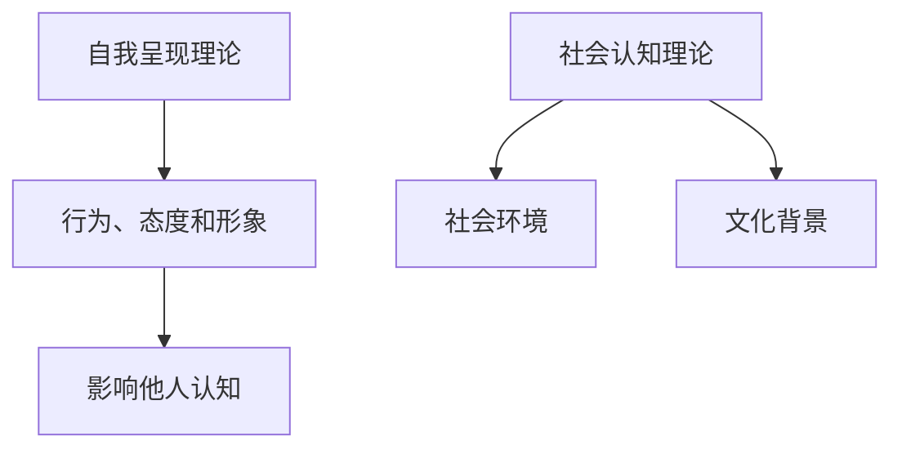
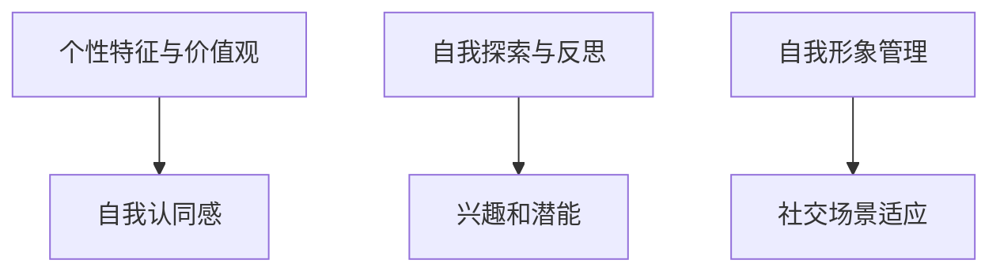

                 

### 第1章：数字时代的虚拟形象心理学概述

#### 1.1 问题背景

虚拟形象（Avatar）是指通过计算机图形学、人工智能和虚拟现实技术生成的，用于在虚拟环境中代表用户的形象。从最初的简单图标到如今复杂的3D角色，虚拟形象的定义和功能经历了显著的变化。在数字时代，随着互联网的普及和虚拟现实技术的发展，虚拟形象已经成为人们日常生活的一部分。

虚拟形象的历史可以追溯到20世纪60年代，当时电子游戏和虚拟现实的概念刚刚兴起。最早的虚拟形象主要是二维的，用于电子游戏的玩家角色。随着技术的进步，虚拟形象逐渐变得三维化，并开始应用于更广泛的领域，如社交网络、虚拟会议和在线教育等。

#### 1.2 问题描述

虚拟形象选择背后的心理机制是一个复杂的问题。用户在选择虚拟形象时，不仅考虑外观的吸引力，还涉及自我表达、社交认同和归属感等多重心理因素。用户可能会通过虚拟形象来展示自己的个性、价值观和社交身份。

首先，用户在创建虚拟形象时，往往会根据自己的外貌、性格和兴趣爱好来选择相应的形象。这种选择反映了用户对自我的认知和理解。其次，虚拟形象在社交互动中扮演重要角色，用户通过形象来表达自己的想法和情感，从而建立社交联系。

然而，这一现象也带来了一些问题。例如，虚拟形象的选择可能会影响用户的自我认知和社交行为。在某些情况下，用户可能会过度依赖虚拟形象，导致现实生活中的社交能力下降。此外，虚拟形象的设计和使用也可能引发隐私和安全问题。

#### 1.3 问题解决

为了深入探讨虚拟形象选择背后的心理机制，本研究采用了多学科交叉的研究方法，结合心理学、社会学和计算机科学的理论框架。具体研究方法包括定量和定性研究，包括问卷调查、深度访谈和数据分析。

本研究的目标是揭示虚拟形象选择背后的心理机制，并探讨虚拟形象在不同文化背景下的认知差异。通过这些研究，我们希望能够为虚拟形象的设计和使用提供科学依据，同时帮助用户更好地理解虚拟形象在数字时代的作用和影响。

#### 1.4 边界与外延

虚拟形象的应用范围广泛，包括但不限于社交媒体、游戏、虚拟现实和增强现实等领域。在社交媒体中，虚拟形象已成为用户展示个性和社交互动的重要工具。在游戏中，虚拟形象不仅是玩家的代表，还承担着角色扮演和情感交流的功能。在虚拟现实和增强现实领域，虚拟形象则成为用户与现实世界互动的桥梁。

此外，虚拟形象在不同文化背景下的认知和使用也存在显著差异。在东方文化中，虚拟形象往往被视为一种精神符号，承载着深厚的文化意义。而在西方文化中，虚拟形象更多地被视为一种工具或娱乐形式。

#### 1.5 概念结构与核心要素

虚拟形象的构成要素主要包括外观、性格和互动能力。外观包括发型、服装、面部特征等；性格则涉及个性、情感和价值观；互动能力包括社交互动、任务执行和情感表达。

自我认知的主要理论包括自我呈现理论和社会认知理论。自我呈现理论认为，个体通过选择和展示特定的行为、态度和形象来影响他人对自己的看法。社会认知理论则强调社会环境和文化背景对个体认知和行为的影响。

通过上述概念的解析，我们可以更好地理解虚拟形象在数字时代的重要性和复杂性，以及虚拟形象选择背后的心理机制。

---

**图1.1 虚拟形象的构成要素和主要理论框架**

---

### 第2章：虚拟形象的设计原则与心理效应

#### 2.1 虚拟形象的设计原则

虚拟形象的设计不仅仅是艺术创作的过程，更是心理学和用户需求的结合体。设计原则的制定需要考虑以下几个方面：

1. **形象美感与个性表达**：虚拟形象的外观设计需要符合审美标准，同时要能够反映用户的个性和价值观。例如，用户可以选择不同的发型、服装和面部特征，从而打造出独特的形象。

2. **可识别性与用户黏性**：虚拟形象需要具有高度的可识别性，使得用户在众多虚拟形象中能够迅速找到自己的代表。此外，形象的设计还需要考虑到用户的黏性，即用户对其虚拟形象的忠诚度和长期使用意愿。

3. **功能性与互动性**：虚拟形象不仅是一种装饰，还应具备一定的功能性。例如，虚拟形象可以进行动作、对话和表情等互动，以增强用户体验。

4. **文化适应性**：不同文化背景下的用户对虚拟形象的需求和偏好存在差异。因此，设计虚拟形象时需要考虑文化适应性，确保虚拟形象能够在多种文化环境中被接受和使用。

#### 2.2 虚拟形象的心理效应

虚拟形象在数字时代的社交互动中扮演着重要角色，其心理效应主要包括以下几个方面：

1. **社交认同与归属感**：虚拟形象可以作为用户在虚拟社区中的身份象征，帮助用户建立社交认同和归属感。一个受欢迎的虚拟形象可以提高用户的社交地位，增强其在社区中的存在感。

2. **自我呈现与形象管理**：用户通过虚拟形象展示自己，表达自己的态度和价值观。同时，用户也可以通过调整虚拟形象来管理自己的形象，以适应不同的社交场景和需求。

3. **心理安慰与逃避现实**：对于一些用户来说，虚拟形象提供了心理安慰和逃避现实的途径。通过虚拟形象，用户可以在虚拟世界中实现自我超越和情感释放。

4. **角色扮演与情感投射**：虚拟形象使得用户能够扮演不同的角色，体验不同的生活情境。用户可以在虚拟形象中投射自己的情感和期望，从而获得心理满足。

**图2.1 虚拟形象的设计原则与心理效应**

通过上述设计原则和心理效应的分析，我们可以看到虚拟形象在数字时代的重要性。正确的设计原则能够提升用户体验，而理解其心理效应则有助于我们更好地应用虚拟形象技术，推动其发展。

### 第3章：虚拟形象与自我认知的关系

#### 3.1 自我认知的核心理论

自我认知是指个体对自己的理解、评价和反思。在心理学中，关于自我认知的核心理论包括自我呈现理论和社会认知理论。

**自我呈现理论**认为，个体通过选择和展示特定的行为、态度和形象来影响他人对自己的看法。这一理论强调个体在社交互动中的自我表现和形象管理。例如，用户可能会通过选择一个具有吸引力的虚拟形象来提升自己在社交网络中的受欢迎程度。

**社会认知理论**则关注社会环境和文化背景对个体认知和行为的影响。根据这一理论，个体的自我认知不仅受到自身特征的影响，还受到周围社会环境和文化背景的塑造。例如，不同文化背景下的用户可能会对虚拟形象有不同的偏好和认知。

**图3.1 自我认知理论**

#### 3.2 虚拟形象对自我认知的影响

虚拟形象在数字时代对自我认知产生了深远的影响。用户在选择虚拟形象时，往往在无意识中反映了自我认知的过程。

首先，虚拟形象的选择反映了用户的个性特征和价值观。用户可能会选择与自身形象相似的虚拟形象，以增强自我认同感。例如，一个喜欢冒险的用户可能会选择一个勇敢的虚拟形象。

其次，虚拟形象的使用可以促进自我探索和反思。通过虚拟形象，用户可以在虚拟环境中模拟不同的角色和情境，从而更深入地理解自己的需求和期望。例如，用户可能会在虚拟角色扮演游戏中尝试不同的职业和生活方式，以探索自己的兴趣和潜能。

此外，虚拟形象还可以帮助用户管理自我形象。用户可以通过调整虚拟形象的外观和性格，来适应不同的社交场景和需求。例如，一个在职场中需要专业形象的员工可能会在虚拟形象中展示其专业能力和稳重性格。

**图3.2 虚拟形象对自我认知的影响**

通过以上分析，我们可以看到虚拟形象在选择和使用过程中对自我认知的重要影响。理解这一关系有助于我们更好地设计和使用虚拟形象，以提升用户体验和心理满足感。

### 第4章：虚拟形象在不同文化背景下的认知差异

#### 4.1 文化背景对虚拟形象认知的影响

虚拟形象在不同文化背景下的认知差异是一个值得探讨的话题。文化背景包括但不限于地理、宗教、历史和社会价值观等方面，这些因素会影响人们对虚拟形象的理解和使用。

**东方文化背景下的虚拟形象认知**：在东方文化中，虚拟形象往往被视为一种精神符号，承载着深厚的文化意义。例如，中国的神话故事和传统节日中，虚拟形象如神兽、精灵等常常被赋予保护、祝福等象征意义。而在日本动漫和游戏中，虚拟形象则更多地体现为角色扮演和情感投射。

**西方文化背景下的虚拟形象认知**：在西方文化中，虚拟形象更多地被视为一种工具或娱乐形式。例如，在西方的游戏和电影中，虚拟形象往往以英雄、反派等角色出现，强调个体的力量和冒险精神。此外，西方社交媒体中的虚拟形象更多地用于社交互动和个人展示。

**文化差异的影响**：不同文化背景下对虚拟形象的认知差异主要体现在以下几个方面：

1. **形象设计与审美偏好**：东方文化偏好简约、内敛的虚拟形象，而西方文化偏好夸张、个性化的虚拟形象。

2. **形象功能与用途**：在东方文化中，虚拟形象更多地用于宗教仪式和文化传承，而在西方文化中，虚拟形象则更多地用于娱乐和社交互动。

3. **形象意义与象征**：在东方文化中，虚拟形象往往承载着深厚的文化意义，而在西方文化中，虚拟形象更多地被视为一种娱乐工具。

#### 4.2 跨文化虚拟形象设计的挑战与策略

**挑战**：

1. **文化敏感性与接受度**：虚拟形象的设计需要考虑到不同文化背景下的用户接受度和敏感性。一些在某一文化中被视为友好或中性的形象，可能在另一文化中引起误解或反感。

2. **形象一致性**：在设计虚拟形象时，需要确保形象在不同文化背景下的连贯性和一致性。这要求设计师在跨文化设计中做出权衡和调整。

3. **文化融合与创新**：在跨文化虚拟形象设计中，如何融合不同文化的元素，创造出新的文化符号，是一个重要的挑战。

**策略**：

1. **文化调研与理解**：在进行虚拟形象设计之前，进行充分的文化调研和理解，了解不同文化背景下的用户需求和偏好。

2. **文化敏感性与包容性**：在设计过程中，注重文化敏感性和包容性，避免使用可能引起误解或冒犯的元素。

3. **文化融合与创新**：在设计中融入不同文化的元素，创造出具有跨文化吸引力的虚拟形象。同时，通过创新设计，使虚拟形象在保留文化特色的同时，具备现代感和时代感。

**图4.1 跨文化虚拟形象设计的挑战与策略**

通过以上分析和策略，我们可以更好地理解虚拟形象在不同文化背景下的认知差异，并在设计中实现文化融合与创新。

### 第5章：虚拟形象在社交媒体中的应用

#### 5.1 社交媒体中的虚拟形象现象

虚拟形象在社交媒体中的应用已经变得极为普遍，成为一种重要的社交工具和自我表达方式。在社交媒体平台上，如微博、微信、Instagram和TikTok等，虚拟形象被广泛用于个人资料、动态发布、互动评论等多个方面。

**流行趋势**：虚拟形象在社交媒体中的流行趋势主要体现在以下几个方面：

1. **个性化定制**：用户可以根据自己的喜好和个性，定制自己的虚拟形象，包括外观、服装和配饰等。
2. **社交互动**：虚拟形象在社交媒体中扮演了用户互动的媒介，用户可以通过虚拟形象进行点赞、评论、分享等社交行为。
3. **虚拟直播**：一些社交媒体平台开始引入虚拟直播功能，用户可以通过虚拟形象进行直播，增强互动体验和娱乐性。

**互动行为分析**：虚拟形象的互动行为主要包括以下几个方面：

1. **点赞和评论**：用户通过虚拟形象进行点赞和评论，表达对内容的喜爱或意见。
2. **分享**：用户可以通过虚拟形象分享内容到其他社交媒体平台或朋友圈，扩大影响力。
3. **虚拟礼物**：一些平台引入了虚拟礼物功能，用户可以通过虚拟形象赠送礼物给其他用户，增强社交互动的趣味性。

#### 5.2 社交媒体虚拟形象案例分析

**案例一：微博的虚拟形象应用**  
微博作为一个微博客平台，虚拟形象（微博卡通形象）在用户资料和个人主页中得到了广泛应用。用户可以通过上传自己的照片，生成卡通形象，从而在社交媒体上展示独特的个性。此外，微博还推出了虚拟形象互动功能，用户可以通过虚拟形象进行点赞、评论和分享，增强社交互动体验。

**案例二：微信的虚拟形象应用**  
微信作为一款多功能的社交通讯应用，也引入了虚拟形象（微信聊天表情）的功能。用户可以通过选择不同的虚拟表情包，与朋友进行趣味性的沟通。此外，微信还推出了虚拟形象直播功能，用户可以通过虚拟形象进行直播，与观众进行实时互动，提高了直播的趣味性和参与度。

**案例三：Instagram的虚拟形象应用**  
Instagram作为一个图片和视频分享平台，虚拟形象（Instagram故事滤镜）也成为了用户创造内容的重要工具。用户可以通过选择不同的虚拟形象滤镜，为自己的照片和视频添加趣味性和个性化效果。此外，Instagram还引入了虚拟形象互动功能，用户可以通过虚拟形象进行评论和点赞，增强社交互动的趣味性。

**案例四：TikTok的虚拟形象应用**  
TikTok作为一个短视频分享平台，虚拟形象（虚拟特效和贴纸）在用户内容创作中发挥了重要作用。用户可以通过选择不同的虚拟形象特效和贴纸，为自己的视频添加趣味性和个性化效果。此外，TikTok还引入了虚拟形象直播功能，用户可以通过虚拟形象进行直播，与观众进行实时互动，提高了直播的趣味性和参与度。

**图5.1 社交媒体虚拟形象案例分析**

通过上述案例分析和互动行为分析，我们可以看到虚拟形象在社交媒体中的应用已经成为一种趋势，并且在增强用户互动体验和个性化表达方面发挥着重要作用。社交媒体平台通过不断引入新的虚拟形象功能，不断提升用户体验，吸引了更多用户参与。

### 第6章：虚拟形象在游戏中的心理效应

#### 6.1 游戏中的虚拟形象设计

虚拟形象在游戏中的设计是游戏开发者的一项重要任务，它不仅影响游戏的视觉效果，还直接影响玩家的沉浸感和游戏体验。虚拟形象的设计主要包括以下几个方面：

1. **外观设计**：游戏虚拟形象的外观设计需要符合游戏的整体风格和主题。例如，在一个幻想游戏中，虚拟形象可能会设计成具有魔法气质的精灵或兽人；而在一个科幻游戏中，虚拟形象可能会设计成机械化的机器人或外星生物。

2. **性格与行为**：虚拟形象的个性特征和行为模式是其吸引玩家的重要因素。游戏开发者会根据游戏的故事情节和角色定位，设计出具有不同性格和行为的虚拟形象。例如，一个勇敢的战士可能会具备强大的攻击力和高防御力，而一个机智的盗贼可能会擅长潜行和偷盗。

3. **互动能力**：虚拟形象在游戏中的互动能力包括与玩家和其他虚拟形象的互动。通过编程实现丰富的互动能力，如对话、表情、动作等，可以增强玩家的参与感和沉浸感。

#### 6.2 游戏虚拟形象的心理效应

虚拟形象在游戏中对玩家的心理效应是多方面的，主要包括以下几个方面：

1. **角色扮演与情感投射**：游戏虚拟形象为玩家提供了角色扮演的机会，玩家可以在虚拟世界中体验到不同的生活和职业。通过角色扮演，玩家可以投射自己的情感和期望，获得心理满足。例如，一个热爱冒险的玩家可能会选择一个勇敢的战士角色，从而在游戏中体验到冒险和成就感。

2. **社交互动与社区建设**：虚拟形象在游戏中不仅是玩家的代表，也是玩家之间互动的桥梁。通过与其他玩家的虚拟形象互动，玩家可以建立社交联系，形成游戏社区。虚拟形象的设计和互动功能在此过程中发挥了重要作用，增强了玩家的社交体验。

3. **情感共鸣与心理安慰**：一些游戏虚拟形象因其独特的设计和故事背景，能够引发玩家的情感共鸣。玩家可能会对某些虚拟形象产生强烈的情感连接，从而在游戏过程中获得心理安慰。例如，一个感人至深的角色故事可能会让玩家在游戏过程中体验到感动和悲伤。

4. **心理挑战与自我超越**：虚拟形象在游戏中的任务和挑战为玩家提供了自我超越的机会。通过克服虚拟形象所设定的障碍，玩家可以体验到成就感和自我成长。例如，一个难度较高的游戏关卡可能会激励玩家不断尝试，最终成功通关，从而获得心理满足。

**图6.1 游戏虚拟形象的设计与心理效应**

通过以上分析，我们可以看到游戏虚拟形象的设计对其在游戏中的心理效应具有深远影响。一个成功的虚拟形象不仅能够提升玩家的游戏体验，还能在情感和心理层面上产生积极的影响，从而增强游戏的吸引力和玩家粘性。

### 第7章：虚拟形象在其他领域的应用与未来展望

#### 7.1 虚拟形象在教育中的应用

虚拟形象在教育领域中的应用逐渐成为教育技术发展的重要趋势。通过虚拟形象，教育者可以创建生动的教学场景，提高学生的学习兴趣和参与度。具体应用包括：

1. **教学助手**：虚拟形象可以作为教学助手，辅助教师进行课堂教学。例如，在语言教学中，虚拟形象可以帮助学生进行发音练习、词汇记忆和对话模拟。

2. **角色扮演**：虚拟形象可以让学生在虚拟环境中进行角色扮演，模拟现实生活中的各种情境，从而提高学生的实践能力和解决问题的能力。

3. **个性化辅导**：虚拟形象可以根据学生的学习进度和兴趣，提供个性化的辅导和建议，帮助学生克服学习难题，提高学习效率。

4. **情感教育**：虚拟形象可以设计成具有情感特征的虚拟角色，通过情感互动，帮助学生理解和管理自己的情绪，提高心理素质。

#### 7.2 虚拟形象在医疗健康领域的应用

虚拟形象在医疗健康领域的应用也越来越广泛，其主要作用包括：

1. **医疗服务**：虚拟形象可以作为医疗服务的辅助工具，为患者提供健康咨询、诊断建议和康复指导。例如，医生可以通过虚拟形象与患者进行互动，提高患者的就医体验。

2. **心理治疗**：虚拟形象在心理治疗中的应用尤为突出。通过虚拟形象，患者可以在一个安全、无压力的环境中与治疗师互动，表达内心的想法和情感，从而提高治疗效果。

3. **医学教育**：虚拟形象可以帮助医学教育者创建逼真的解剖模型和手术模拟，提高医学生的实践技能和知识水平。

4. **健康监测**：虚拟形象可以通过传感器和数据监测技术，实时监控患者的健康状态，提供个性化的健康管理和建议。

#### 7.3 虚拟形象的未来发展趋势

随着技术的不断进步，虚拟形象在未来将迎来更多的发展机遇和挑战。以下是一些可能的发展趋势：

1. **人工智能与虚拟形象的融合**：人工智能技术的不断发展将使虚拟形象更加智能和真实。未来，虚拟形象将具备更复杂的情感表达和行为模式，为用户提供更加个性化的服务。

2. **跨学科研究与应用**：虚拟形象将在更多学科领域得到应用，如人机交互、心理学、社会学等。跨学科研究将为虚拟形象的发展提供新的理论依据和实践路径。

3. **虚拟现实与增强现实的发展**：随着虚拟现实（VR）和增强现实（AR）技术的成熟，虚拟形象将在这些领域得到更加广泛的应用。虚拟现实环境中的虚拟形象将提供更加沉浸式的体验，增强用户的参与感和互动性。

4. **隐私与安全问题**：虚拟形象在应用过程中，隐私和安全问题将越来越受到关注。未来，如何保护用户的隐私和数据安全，将成为虚拟形象发展的关键挑战。

**图7.1 虚拟形象在教育、医疗健康领域的应用与未来发展趋势**

通过以上分析，我们可以看到虚拟形象在多个领域的应用已经取得了显著成果，并将在未来继续发挥重要作用。随着技术的进步，虚拟形象将变得更加智能和多样化，为人们的生活和工作带来更多便利和创新。

### 第8章：数字时代的虚拟形象心理学总结

#### 8.1 主要研究成果回顾

在本研究中，我们通过多学科交叉的方法，深入探讨了虚拟形象在数字时代的心理学效应。以下是本研究的几个主要研究成果：

1. **虚拟形象设计原则**：我们提出了一系列虚拟形象的设计原则，包括形象美感与个性表达、可识别性与用户黏性、功能性与互动性、文化适应性等。这些原则为虚拟形象的设计提供了科学依据。

2. **虚拟形象与自我认知的关系**：研究发现，用户在选择和使用虚拟形象时，会在无意识中反映自我认知的过程。虚拟形象不仅帮助用户表达自我，还促进自我探索和反思。

3. **虚拟形象在不同文化背景下的认知差异**：通过对比不同文化背景下的虚拟形象认知，我们揭示了文化对虚拟形象设计和使用的影响，为跨文化虚拟形象设计提供了策略。

4. **虚拟形象在社交媒体和游戏中的应用**：案例分析表明，虚拟形象在社交媒体和游戏中的广泛应用，不仅增强了用户的互动体验，还促进了社交认同和情感投射。

5. **虚拟形象在其他领域的应用前景**：我们探讨了虚拟形象在教育、医疗健康等领域的应用潜力，并预测了虚拟形象与人工智能融合的未来发展趋势。

#### 8.2 未来研究方向

尽管我们已经取得了一系列重要成果，但数字时代的虚拟形象心理学研究仍有许多领域值得进一步探索。以下是一些未来研究方向：

1. **跨文化虚拟形象心理学研究**：进一步深入研究不同文化背景下虚拟形象的认知和使用模式，探索跨文化虚拟形象设计的最佳实践。

2. **虚拟形象与人工智能的深度融合**：探索虚拟形象在人工智能技术中的应用，如智能虚拟助手的开发，以及虚拟形象在情感计算和自然语言处理等方面的应用。

3. **虚拟形象的隐私与安全问题**：随着虚拟形象在多个领域的广泛应用，如何保护用户的隐私和数据安全将成为重要的研究方向。

4. **虚拟形象的伦理和社会影响**：探讨虚拟形象对社会结构和伦理道德的影响，以及如何平衡虚拟形象的便利性和潜在风险。

5. **虚拟形象的长期影响**：研究虚拟形象对用户长期行为和心理健康的影响，为虚拟形象的设计和使用提供更全面的指导。

通过上述未来研究方向的探索，我们期望能够进一步丰富和深化数字时代虚拟形象心理学的理论体系，推动虚拟形象技术的健康发展和广泛应用。

### 附录：拓展阅读

为了深入了解数字时代的虚拟形象心理学，以下是几本推荐的专业书籍：

1. **《虚拟人类：虚拟现实心理学研究》（Virtual Humans: The Psychology of Real-Time Computer-Generated Humans）** - 作者：John B. Hogg & John C. Hull
   - 内容摘要：本书详细介绍了虚拟人类的设计、心理效应及其在教育、医疗等领域的应用。

2. **《虚拟现实的心理学》（The Psychology of Virtual Reality）** - 作者：Jonas Linderoth
   - 内容摘要：本书探讨了虚拟现实技术对人类认知和心理的影响，包括虚拟形象的设计和应用。

3. **《数字文化中的虚拟自我：心理学、社会与文化视角》（The Virtual Self in Digital Culture: Psychological, Social, and Cultural Perspectives）** - 作者：Erhard Witte
   - 内容摘要：本书从心理学、社会学和文化角度分析了虚拟自我在数字时代的重要性及其影响。

4. **《社交网络心理学：从Twitter到Facebook的社会互动》（Social Network Psychology: Social Influence, Small Worlds, and the Unexpected Impact of Your Network）** - 作者：Christopher J. F. Harris
   - 内容摘要：本书探讨了社交网络中的虚拟形象如何影响社会互动和个体行为。

这些书籍提供了丰富的理论和实践内容，对于研究者和实践者都具有很高的参考价值。希望读者在阅读本文后，能够进一步探索这些领域，加深对虚拟形象心理学的理解。

### 作者信息

作者：AI天才研究院/AI Genius Institute & 禅与计算机程序设计艺术 /Zen And The Art of Computer Programming
- AI天才研究院（AI Genius Institute）致力于探索人工智能领域的最新发展和应用，推动科技创新和人才培养。
- 禅与计算机程序设计艺术（Zen And The Art of Computer Programming）是一部经典计算机科学著作，由世界级计算机科学家Donald E. Knuth撰写，对计算机科学和编程教育产生了深远影响。

