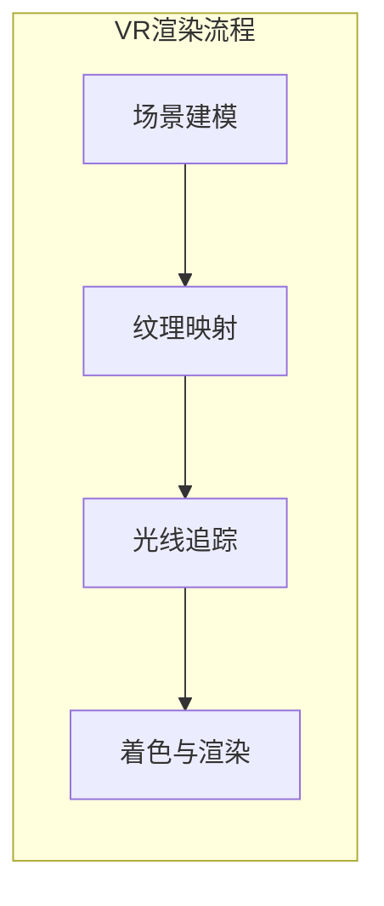

                 

## 文章标题

### 关键词：数字时代、虚拟旅行、VR技术、旅游业、创新应用

### 摘要：

在数字技术迅猛发展的今天，虚拟现实（VR）技术正在为旅游业带来前所未有的变革。本文将深入探讨VR技术在旅游业中的创新应用，从技术基础、应用场景、用户体验、市场趋势与挑战等多个维度，逐步分析VR技术在提升旅游体验方面的作用，并展望其未来发展趋势。本文旨在为读者提供一个全面、系统的VR技术在旅游业中的理解框架，以及其实际应用中的实践指导和策略建议。

----------------------------------------------------------------

## 引言与背景

### 1.1 VR技术在旅游业中的应用现状

随着科技的不断进步，虚拟现实（VR）技术已经从最初的实验室概念发展成为主流技术，并在多个领域展现出了强大的应用潜力。在旅游业中，VR技术以其独特的沉浸感和交互性，正逐渐改变传统的旅游方式和体验。

近年来，VR技术在旅游业中的应用范围不断扩大。旅游公司、景区管理方、旅游平台等纷纷开始探索如何将VR技术融入旅游产品和服务中。例如，一些旅游公司推出了VR旅游体验项目，允许用户在家中通过VR设备体验全球各地的著名景点。而景区管理方则利用VR技术为游客提供虚拟导览服务，提升游客的参观体验。旅游平台则通过VR内容吸引更多用户，增加用户粘性。

### 1.2 VR技术带来的旅游体验变革

VR技术为旅游业带来的变革主要体现在以下几个方面：

1. **沉浸式体验**：传统的旅游方式通常只能看到景点的表面，而VR技术能够创建一个虚拟的、沉浸式的环境，让用户仿佛置身其中。这种身临其境的感受极大地提升了旅游体验。

2. **远程旅游**：通过VR技术，用户可以在家中体验远程旅游，无需长途跋涉，节省时间和费用。这对那些无法亲自前往某些景点的人来说，无疑是一个巨大的福音。

3. **个性化定制**：VR技术可以根据用户的兴趣和需求，提供个性化的旅游体验。例如，用户可以选择特定的景点、活动、路线等，使旅游更加贴合个人喜好。

4. **安全教育**：在涉及高风险的旅游活动中，如登山、滑雪等，VR技术可以提供安全的教育和模拟体验，帮助用户提前了解活动内容，降低实际操作中的风险。

### 1.3 问题解决

面对VR技术在旅游业中的应用现状和带来的变革，我们需要解决以下几个问题：

1. **技术成熟度**：VR技术虽然取得了显著进展，但其在实际应用中仍然存在一些技术难题，如图像延迟、设备舒适度等，需要持续优化和提升。

2. **用户体验**：如何提升VR旅游的用户体验，使其更加自然、舒适和有趣，是一个亟待解决的问题。

3. **市场推广**：VR技术在旅游业中的应用还面临市场推广的问题，如何让更多的游客了解并接受VR旅游，需要有效的营销策略和推广活动。

4. **商业模式**：在VR旅游的商业模式探索方面，如何找到可持续的盈利模式，是旅游企业面临的重要挑战。

### 1.4 边界与外延

在探讨VR技术在旅游业中的应用时，我们还需要考虑其与其他技术的融合。例如，VR技术与增强现实（AR）技术的结合，可以提供更加丰富的旅游体验。此外，VR技术还可以与大数据、人工智能等技术相结合，实现智能化的旅游服务。

### 1.5 概念结构与核心要素组成

为了更好地理解VR技术在旅游业中的应用，我们可以将其核心概念和要素组成进行结构化分析。以下是VR技术在旅游业中的核心概念和要素组成：

1. **VR技术**：包括硬件设备（如VR头显、手柄等）和软件技术（如虚拟场景创建、交互设计等）。

2. **旅游应用场景**：包括虚拟景区游览、远程旅游、个性化定制、安全教育等。

3. **用户体验**：包括沉浸感、互动性、舒适性等。

4. **商业模式**：包括产品销售、服务收费、广告投放等。

### 1.6 本章小结

本章对VR技术在旅游业中的应用进行了背景介绍和问题分析，明确了VR技术带来的变革和面临的挑战。下一章将深入探讨VR技术的基础知识，为后续章节的分析提供理论支持。

----------------------------------------------------------------

## VR技术基础

### 2.1 VR技术概述

虚拟现实（VR）是一种通过计算机模拟实现的虚拟环境，用户可以通过特定的设备进入这个环境，并与之进行交互。VR技术的历史可以追溯到20世纪60年代，但真正开始普及和发展是在21世纪。随着计算机性能的提升和显示技术的进步，VR技术逐渐成熟，并在多个领域展现出了巨大的应用潜力。

### 2.1.1 VR技术的历史与发展

1. **早期探索**：20世纪60年代，VR技术的概念开始出现，科学家们开始尝试通过头戴显示器和手柄来模拟虚拟环境。
   
2. **初步发展**：20世纪80年代，VR技术得到了进一步的发展，出现了早期的VR设备，如VR头盔和手柄。但受限于技术限制，这些设备的应用场景较为有限。

3. **快速发展**：21世纪初，随着计算机性能和显示技术的提升，VR技术进入了快速发展阶段。特别是Oculus Rift、HTC Vive等VR设备的问世，标志着VR技术的成熟和普及。

4. **应用扩展**：近年来，VR技术在教育、医疗、游戏、旅游等多个领域得到了广泛应用，成为数字经济的重要组成部分。

### 2.1.2 VR技术的分类与特点

VR技术可以根据不同的分类标准进行分类。以下是一些常见的分类方式和对应的特点：

1. **按交互方式分类**：
   - **视觉交互**：通过视觉感受虚拟环境，是最常见的VR交互方式。
   - **听觉交互**：通过听觉系统感知虚拟环境，增强沉浸感。
   - **触觉交互**：通过触觉设备感知虚拟环境，提供更加真实的体验。

2. **按应用领域分类**：
   - **教育**：用于教学和培训，提供沉浸式的学习体验。
   - **医疗**：用于医学模拟和康复治疗，提高治疗效果。
   - **游戏**：提供沉浸式的游戏体验，是VR技术的热门应用领域。
   - **旅游**：用于虚拟旅游和导览，提升旅游体验。

3. **按技术架构分类**：
   - **PC端VR**：通过高性能PC来驱动VR设备，适合复杂场景的模拟。
   - **移动端VR**：通过移动设备（如智能手机）来驱动VR设备，更加便携和易于普及。

### 2.2 VR技术的原理与架构

VR技术的核心原理是创建一个虚拟的三维环境，用户可以通过VR设备与这个环境进行交互。以下是VR技术的原理和架构：

1. **虚拟环境生成**：通过计算机图形学技术，创建一个虚拟的三维场景。这个场景可以是完全虚构的，也可以是现实世界的虚拟重建。

2. **感知模拟**：通过头戴显示器和传感器，模拟用户的视觉和听觉感受。头戴显示器提供视觉输入，传感器（如加速度计、陀螺仪等）捕捉用户的动作，模拟身体的运动。

3. **交互设计**：通过手柄、手套等设备，提供与虚拟环境的交互方式。这些设备可以捕捉用户的动作，并在虚拟环境中实现相应的操作。

4. **实时渲染**：在虚拟环境中，通过实时渲染技术，动态生成和显示场景内容。这需要高性能的计算和图形处理能力，以确保流畅的用户体验。

### 2.3 VR设备的种类与选择

VR设备是VR技术的重要组成部分，以下是常见的VR设备种类和选择标准：

1. **VR头显**：是VR技术的核心设备，包括Oculus Rift、HTC Vive、Samsung Gear VR等。选择头显时需要考虑分辨率、视野范围、舒适度等因素。

2. **VR手柄**：提供与虚拟环境的交互方式，包括Oculus Touch、HTC Vive控制器等。选择手柄时需要考虑交互方式、精度和舒适性。

3. **VR配件**：包括VR眼镜、VR手套等，用于提供更加真实的交互体验。选择配件时需要考虑与主设备的兼容性、功能性和实用性。

### 2.4 VR内容的制作与优化

VR内容的制作是VR技术应用的关键环节。以下是VR内容制作的基本步骤和优化策略：

1. **场景设计**：根据应用需求，设计虚拟场景的布局和内容。场景设计需要考虑视觉美学、交互逻辑和用户体验。

2. **内容制作**：通过三维建模、动画制作等技术，实现虚拟场景的创建和渲染。内容制作需要使用专业的软件和工具，如Unity、Unreal Engine等。

3. **交互设计**：设计虚拟环境中的交互方式，确保用户可以方便地与虚拟环境进行交互。交互设计需要考虑用户的操作习惯和场景需求。

4. **优化策略**：为了提升VR内容的流畅度和用户体验，需要进行性能优化。优化策略包括降低场景复杂度、优化渲染算法、减少加载时间等。

### 2.5 VR技术在其他领域的应用

VR技术在教育、医疗、游戏等领域也取得了显著的应用成果：

1. **教育**：通过VR技术，学生可以身临其境地参与历史事件、科学实验等，提高学习兴趣和效果。

2. **医疗**：VR技术用于医学模拟和康复治疗，提供更加真实的训练环境和治疗体验。

3. **游戏**：VR游戏提供了沉浸式的体验，吸引了大量玩家，成为游戏市场的重要增长点。

### 2.6 本章小结

本章对VR技术进行了概述，包括其历史与发展、分类与特点、原理与架构、设备种类与选择、内容制作与优化，以及其他领域的应用。下一章将深入探讨VR技术在旅游业中的应用，分析其应用场景、优势和挑战。

----------------------------------------------------------------

## VR在旅游中的应用

### 3.1 VR旅游的定义与特点

VR旅游是指利用虚拟现实（VR）技术，模拟旅游景点的环境，让用户在虚拟世界中体验旅游活动的行为。与传统旅游相比，VR旅游具有以下显著特点：

1. **沉浸式体验**：VR技术能够创建一个高度沉浸式的虚拟环境，让用户仿佛置身于真实的旅游景点中。用户可以通过头戴显示器和传感器，感受到景点的视觉、听觉和触觉，获得与真实旅游相似的体验。

2. **远程旅游**：VR旅游打破了地理位置的限制，用户无需亲自前往旅游景点，只需在家中通过VR设备即可体验全球各地的旅游景观。这对于那些无法或不愿亲自旅行的用户来说，提供了一个便捷的替代方案。

3. **个性化定制**：VR旅游可以根据用户的需求和兴趣，提供个性化的旅游体验。用户可以自由选择旅游路线、景点、活动等，使旅游体验更加符合个人喜好。

4. **安全教育**：VR技术可以模拟高风险的旅游活动，如登山、滑雪等，让用户在虚拟环境中学习和掌握相关的安全知识，降低实际操作中的风险。

### 3.2 VR旅游的应用场景

VR技术在旅游业中有着广泛的应用场景，以下是一些典型的应用场景：

1. **虚拟景区游览**：用户可以通过VR设备，虚拟游览全球各地的著名景点，如埃及金字塔、法国埃菲尔铁塔、中国长城等。这种体验不仅可以满足用户的好奇心，还能让他们在未亲自前往之前对景点有更全面的了解。

2. **远程旅游体验**：用户可以通过VR设备，在家中体验远程旅游，如探险、潜水、滑雪等。这种体验不仅节省了时间和费用，还能让用户在舒适的环境中享受旅游的乐趣。

3. **旅游教育**：VR技术可以用于旅游教育，如模拟历史事件、自然现象、文化习俗等。这种教育方式可以激发学生的学习兴趣，提高学习效果。

4. **景区导览**：景区管理方可以利用VR技术为游客提供虚拟导览服务，通过头戴显示器和传感器，游客可以随时随地获取景点的相关信息和讲解，提高参观体验。

5. **旅游营销**：旅游企业可以利用VR技术展示旅游产品的特色和亮点，吸引潜在客户。例如，通过VR旅游宣传视频，用户可以提前了解旅游线路和活动安排，增加旅游预订的可能性。

### 3.3 VR旅游的优势与挑战

VR旅游在提升旅游体验方面具有显著的优势，但也面临着一些挑战。

**优势**：

1. **提升旅游体验**：VR技术能够提供沉浸式体验，让用户在虚拟环境中感受到真实的旅游氛围，极大地提升了旅游的乐趣和体验。

2. **降低成本**：VR旅游无需用户亲自前往旅游景点，节省了交通、住宿等费用，降低了旅游成本。

3. **突破地域限制**：VR旅游打破了地理位置的限制，用户可以足不出户，体验全球各地的旅游景点，满足他们对未知世界的好奇心。

4. **个性化定制**：VR旅游可以根据用户的需求和兴趣，提供个性化的旅游体验，满足不同用户的需求。

5. **安全教育**：VR技术可以模拟高风险的旅游活动，让用户在虚拟环境中学习和掌握相关的安全知识，降低实际操作中的风险。

**挑战**：

1. **技术成熟度**：VR技术虽然取得了显著进展，但其在实际应用中仍然存在一些技术难题，如图像延迟、设备舒适度等，需要持续优化和提升。

2. **用户体验**：如何提升VR旅游的用户体验，使其更加自然、舒适和有趣，是一个亟待解决的问题。

3. **市场推广**：VR技术在旅游业中的应用还面临市场推广的问题，如何让更多的游客了解并接受VR旅游，需要有效的营销策略和推广活动。

4. **商业模式**：在VR旅游的商业模式探索方面，如何找到可持续的盈利模式，是旅游企业面临的重要挑战。

### 3.4 VR旅游案例分析

以下是一些国内外VR旅游项目的案例分析：

1. **国内案例**：

   - **张家界VR旅游**：张家界作为世界著名的自然景区，通过VR技术推出了虚拟旅游体验项目。用户可以通过VR设备虚拟游览张家界的石柱、峡谷等景观，感受大自然的壮丽。

   - **故宫VR导览**：故宫博物院利用VR技术为游客提供了虚拟导览服务。游客可以通过VR设备了解故宫的历史文化、建筑特色和藏品，增强了参观体验。

2. **国外案例**：

   - **迪斯尼乐园VR体验**：迪斯尼乐园在全球范围内推出了VR体验项目，用户可以通过VR设备体验各种游乐设施，如过山车、飞船等，增加了游客的娱乐体验。

   - **谷歌地球VR旅游**：谷歌地球利用VR技术为用户提供虚拟旅游体验。用户可以在VR环境中游览全球各地的著名景点，探索未知的世界。

### 3.5 本章小结

本章对VR旅游的定义、特点、应用场景、优势和挑战进行了详细分析，并通过案例分析展示了VR旅游的实际应用。下一章将探讨VR旅游的用户体验设计，分析如何提升用户的VR旅游体验。

----------------------------------------------------------------

## VR旅游的用户体验设计

### 4.1 VR旅游用户体验的核心要素

VR旅游的用户体验设计是VR技术在旅游业中成功应用的关键。为了提升用户的VR旅游体验，我们需要关注以下几个核心要素：

1. **沉浸感**：沉浸感是VR旅游体验的核心要素之一。通过高度仿真的虚拟环境，用户可以在心理和感官上感受到真实的旅游体验。为了提升沉浸感，可以采用以下策略：
   - **高质量的图像和音效**：使用高分辨率图像和高保真音效，增强用户的视觉和听觉感受。
   - **动态交互**：通过用户在虚拟环境中的动作和反馈，实现动态的交互体验，增加用户的参与感。

2. **交互性**：VR旅游的交互性是用户与虚拟环境互动的能力。为了提高交互性，可以采用以下策略：
   - **自然交互方式**：采用手势识别、语音控制等自然交互方式，使用户在虚拟环境中可以自由地探索和操作。
   - **多样化的交互功能**：提供丰富的交互功能，如导航、拍照、信息查询等，满足用户的多样化需求。

3. **舒适性**：舒适性是用户在VR旅游中长时间体验的重要因素。为了提升舒适性，可以采用以下策略：
   - **优化设备设计**：设计舒适的VR设备，如轻便的头戴显示器、舒适的VR手柄等，减少用户的不适感。
   - **适宜的设备使用时间**：合理安排用户使用VR设备的时间，避免长时间使用导致的视觉疲劳和身体不适。

4. **个性化**：个性化是用户在VR旅游中获得独特体验的关键。为了提供个性化的体验，可以采用以下策略：
   - **用户数据分析**：收集和分析用户数据，了解用户的兴趣、偏好和行为，为用户提供个性化的旅游内容和推荐。
   - **自定义功能**：提供自定义功能，如自定义旅游路线、自定义景点体验等，让用户可以根据自己的需求自由选择。

### 4.2 VR旅游用户体验的优化策略

为了进一步提升VR旅游的用户体验，我们可以采用以下优化策略：

1. **界面设计**：优化界面设计，使操作更加直观和便捷。可以采用以下策略：
   - **简洁的界面布局**：设计简洁的界面布局，减少用户的操作步骤，提高操作效率。
   - **友好的用户界面**：使用友好的用户界面，如清晰明了的图标、文字说明等，帮助用户快速理解和使用。

2. **内容创作**：优化VR旅游内容，提供丰富、有趣、高质量的虚拟景观和活动。可以采用以下策略：
   - **高质量的内容制作**：使用高分辨率的图像和视频，精细的建模和渲染技术，提升内容的视觉质量。
   - **多样化的内容类型**：提供多样化的内容类型，如虚拟景区游览、游戏、教育等，满足不同用户的需求。

3. **性能优化**：优化VR旅游系统的性能，确保流畅的体验。可以采用以下策略：
   - **降低加载时间**：通过优化加载算法和资源管理，减少加载时间，提高系统的响应速度。
   - **减少延迟**：通过优化网络传输和渲染技术，减少延迟，提高交互的流畅性。

4. **用户反馈**：收集用户反馈，及时了解用户的需求和问题，不断优化系统。可以采用以下策略：
   - **用户调研**：定期进行用户调研，收集用户的意见和建议。
   - **用户支持**：提供用户支持服务，解答用户的疑问，解决用户遇到的问题。

### 4.3 VR旅游用户体验的实际案例

以下是一些VR旅游用户体验的实际案例，展示了VR旅游在提升用户体验方面的成功实践：

1. **故宫VR导览**：故宫博物院利用VR技术为游客提供了虚拟导览服务。用户可以通过VR设备参观故宫的各个宫殿、展厅，了解文物的背景故事。通过简洁的界面设计和丰富的内容创作，故宫VR导览提升了用户的参观体验。

2. **张家界VR旅游**：张家界景区通过VR技术为游客提供了虚拟旅游体验。用户可以通过VR设备游览张家界的石柱、峡谷等景观，感受到大自然的壮丽。通过高质量的图像和音效，以及动态交互功能，张家界VR旅游为用户提供了沉浸式的体验。

3. **迪斯尼乐园VR体验**：迪斯尼乐园在全球范围内推出了VR体验项目，用户可以通过VR设备体验各种游乐设施。通过多样化的内容和个性化的推荐，迪斯尼乐园VR体验吸引了大量用户，提升了游客的娱乐体验。

### 4.4 本章小结

本章详细探讨了VR旅游用户体验的核心要素和优化策略，并通过实际案例展示了VR旅游在提升用户体验方面的成功实践。下一章将分析VR旅游的市场趋势与挑战，探讨VR旅游行业的发展前景。

----------------------------------------------------------------

## VR旅游的市场趋势与挑战

### 5.1 VR旅游的市场趋势

随着VR技术的不断成熟和普及，VR旅游市场也呈现出良好的发展趋势：

1. **技术成熟度提升**：随着VR技术的不断进步，硬件设备性能的增强和软件技术的优化，VR旅游的体验质量得到了显著提升。这使得VR旅游更加真实、沉浸和互动，吸引了越来越多的用户。

2. **市场规模扩大**：随着全球旅游市场的不断扩大和人们对旅游体验要求的提高，VR旅游作为一种新兴的旅游形式，正逐步进入大众视野。根据市场研究机构的预测，未来几年VR旅游市场将保持高速增长。

3. **消费者需求多样化**：随着消费者对旅游体验的要求不断提高，他们渴望获得更加个性化、多样化的旅游体验。VR旅游恰好满足了这一需求，通过虚拟现实技术，用户可以在家中体验到全球各地的旅游景观和活动。

4. **行业应用拓展**：除了传统的旅游景点和景区，VR旅游还逐步拓展到其他领域，如旅游教育、旅游营销等。这种多元化的应用场景，将进一步推动VR旅游市场的发展。

### 5.2 VR旅游的挑战

尽管VR旅游市场前景广阔，但其在实际应用中也面临着一系列挑战：

1. **技术难题**：VR技术虽然在不断进步，但仍然存在一些技术难题，如图像延迟、设备舒适度等。这些问题会影响用户体验，需要持续优化和改进。

2. **用户体验**：如何提升VR旅游的用户体验，使其更加自然、舒适和有趣，是一个亟待解决的问题。需要从交互设计、内容创作、设备舒适度等多个方面进行综合优化。

3. **市场推广**：VR旅游作为一种新兴的旅游形式，市场认知度和接受度仍然较低。如何通过有效的市场推广，让更多的游客了解并接受VR旅游，是旅游企业面临的重要挑战。

4. **商业模式**：在VR旅游的商业模式探索方面，如何找到可持续的盈利模式，是旅游企业面临的重要问题。需要创新商业模式，探索多元化的盈利渠道。

5. **安全与隐私**：VR旅游涉及用户的个人信息和数据，如不妥善处理，可能会引发安全与隐私问题。需要建立完善的安全和隐私保护机制，确保用户的信息和数据安全。

### 5.3 案例分析

以下是对一些VR旅游项目的案例分析，探讨其市场趋势与挑战：

1. **国内案例分析**：

   - **黄山VR旅游**：黄山作为世界自然和文化双重遗产，通过VR技术推出了虚拟旅游体验项目。该项目在提升游客体验方面取得了显著成效，但也面临着技术优化和用户接受度低的挑战。

   - **北京故宫VR导览**：故宫博物院利用VR技术为游客提供了虚拟导览服务。该项目在提升游客参观体验方面表现出色，但也需要解决技术复杂性和维护成本高的问题。

2. **国外案例分析**：

   - **迪斯尼乐园VR体验**：迪斯尼乐园在全球范围内推出了VR体验项目，通过高质量的图像和音效，以及多样化的内容类型，吸引了大量用户。但该项目也面临着设备舒适度和用户体验优化的挑战。

   - **谷歌地球VR旅游**：谷歌地球利用VR技术为用户提供虚拟旅游体验。该项目在拓展用户市场和提升用户体验方面取得了显著成效，但也需要解决数据隐私和安全问题。

### 5.4 本章小结

本章分析了VR旅游的市场趋势与挑战，并通过案例探讨了VR旅游在实际应用中的成功经验和面临的问题。下一章将展望VR旅游的未来发展方向，探讨VR技术可能带来的变革和创新。

----------------------------------------------------------------

## VR旅游的未来展望

### 6.1 技术发展趋势

随着VR技术的不断进步，未来VR旅游将在以下几个方面取得重大突破：

1. **硬件设备性能提升**：随着硬件技术的不断发展，VR设备的性能将得到显著提升。例如，头戴显示器的分辨率和视野范围将进一步提高，手柄的交互精度和舒适度将得到优化，这将大大提升用户的VR旅游体验。

2. **内容创作技术突破**：VR内容创作技术将不断突破，生成式模型、人工智能等技术将应用于VR内容创作，实现更加丰富、多样和个性化的虚拟旅游场景。

3. **网络技术进步**：随着5G网络的普及和物联网技术的发展，VR旅游的传输速度和稳定性将得到显著提升，为用户提供更加流畅、无延迟的VR旅游体验。

4. **虚拟与现实的融合**：VR技术与现实世界将更加紧密地融合，实现虚拟旅游与现实旅游的有机结合。例如，通过VR技术，用户可以在虚拟环境中体验现实中的旅游景点，同时还可以与真实游客进行互动。

### 6.2 应用创新

未来VR旅游将在以下几个方面实现创新应用：

1. **沉浸式社交旅游**：通过VR技术，用户可以在虚拟环境中与其他用户实时互动，共同体验旅游活动。这种沉浸式社交旅游将大大提升用户的社交体验，成为旅游新趋势。

2. **虚拟旅游体验**：除了虚拟景区游览，VR旅游还将拓展到虚拟旅游体验，如虚拟探险、虚拟购物等。用户可以在虚拟环境中体验到真实的购物、娱乐和休闲活动。

3. **旅游规划与预订**：VR技术将应用于旅游规划和预订过程，用户可以通过VR设备提前预览旅游线路、酒店和景点，实现更加个性化、智能化的旅游规划与预订。

4. **旅游教育**：VR技术将应用于旅游教育，为用户提供沉浸式的旅游知识学习体验。例如，用户可以通过VR设备学习历史事件、自然现象、文化习俗等，提升旅游的趣味性和教育性。

### 6.3 商业模式创新

未来VR旅游的商业模式将实现创新，为旅游企业带来新的盈利渠道：

1. **订阅制**：旅游企业可以通过订阅制，为用户提供长期的VR旅游服务。用户支付一定费用后，可以无限制地访问VR旅游平台上的各种内容。

2. **虚拟商品销售**：旅游企业可以通过虚拟商品销售，如虚拟旅游纪念品、虚拟门票等，实现额外的盈利。用户可以在虚拟环境中购买并体验虚拟商品，增加互动性和趣味性。

3. **广告营销**：旅游企业可以通过VR旅游平台，开展广告营销活动。例如，在虚拟景区中植入广告，吸引用户点击和观看，实现广告收入的增加。

4. **旅游定制服务**：旅游企业可以提供个性化的VR旅游定制服务，根据用户的需求和兴趣，设计独特的VR旅游路线和活动，满足用户个性化需求。

### 6.4 未来挑战与应对策略

尽管VR旅游前景广阔，但未来仍将面临一系列挑战：

1. **技术难题**：VR技术仍需在图像质量、交互性、设备舒适度等方面进行优化。为此，旅游企业应加大对VR技术研发的投入，与科技企业合作，共同推动VR技术的进步。

2. **用户体验**：如何提升用户的VR旅游体验，是旅游企业需要解决的重要问题。旅游企业应注重用户体验设计，从交互设计、内容创作、设备舒适度等多个方面进行优化。

3. **市场推广**：VR旅游作为一种新兴的旅游形式，市场认知度和接受度仍需提高。旅游企业应加大市场推广力度，通过线上线下多种渠道，提升VR旅游的知名度。

4. **商业模式**：旅游企业需要探索可持续的商业模式，找到适合VR旅游发展的盈利模式。同时，应灵活调整商业模式，根据市场需求和用户反馈进行创新和优化。

### 6.5 本章小结

本章对未来VR旅游的技术发展趋势、应用创新、商业模式创新以及挑战和应对策略进行了展望。随着VR技术的不断进步和应用的拓展，VR旅游有望在未来旅游业中发挥重要作用，为用户带来全新的旅游体验。

----------------------------------------------------------------

## 全文总结

本文从多个维度深入探讨了VR技术在旅游业中的创新应用。首先，我们介绍了VR技术在旅游业中的应用现状和变革，明确了VR技术在提升旅游体验方面的作用。接着，我们分析了VR技术的基础知识，包括原理、架构、设备选择、内容制作等。随后，我们探讨了VR在旅游业中的应用场景、优势与挑战，并通过实际案例展示了VR旅游的成功实践。此外，我们还详细分析了VR旅游的用户体验设计、市场趋势与挑战，并展望了VR旅游的未来发展方向。

### 最佳实践 tips

1. **技术优化**：持续关注VR技术的最新进展，及时优化硬件设备和内容制作，提升用户体验。
2. **内容创新**：注重VR旅游内容的设计和创作，提供丰富、多样、高质量的虚拟旅游体验。
3. **市场推广**：加大市场推广力度，提高VR旅游的知名度和用户接受度。
4. **商业模式探索**：创新商业模式，探索多元化的盈利渠道，确保VR旅游的可持续发展。

### 小结

本文通过逻辑清晰的分析和详细的案例分析，全面阐述了VR技术在旅游业中的创新应用。随着VR技术的不断进步和应用拓展，VR旅游有望在未来旅游业中发挥重要作用，为用户带来全新的旅游体验。同时，我们也指出了VR旅游在技术、用户体验、市场推广等方面的挑战，并提出了相应的解决方案。

### 注意事项

1. **用户体验**：在VR旅游设计中，用户体验是至关重要的。需要注重交互设计、内容创作和设备舒适度，确保用户能够享受到高质量的VR旅游体验。
2. **技术安全**：在VR旅游的应用过程中，要注意数据安全和隐私保护，确保用户信息的安全。

### 拓展阅读

1. **《虚拟现实技术导论》**：详细介绍了VR技术的基本原理和应用领域。
2. **《VR旅游：未来的旅游体验》**：探讨了VR旅游的发展趋势和应用场景。
3. **《虚拟现实在旅游业中的应用案例》**：分析了国内外VR旅游项目的成功经验。

作者：AI天才研究院/AI Genius Institute & 禅与计算机程序设计艺术 /Zen And The Art of Computer Programming

----------------------------------------------------------------

## 附录：VR技术核心概念与联系

在本章节中，我们将深入探讨VR技术的核心概念及其相互关系，通过概念属性特征对比表格和ER实体关系图架构的Markdown格式中的Mermaid流程图来详细阐述。

### 核心概念

#### 1. 虚拟现实（VR）
虚拟现实是一种通过计算机技术创造出来的模拟环境，用户可以通过特殊的设备与该环境进行交互。

#### 2. 增强现实（AR）
增强现实是一种将虚拟信息叠加到现实世界中的技术，通过设备（如智能手机、AR眼镜）提供增强的视觉体验。

#### 3. 头戴显示器（HMD）
头戴显示器是VR设备的一种，通过提供一个沉浸式的视觉环境来增强用户的体验。

#### 4. 虚拟环境
虚拟环境是VR技术的核心概念之一，它模拟了用户可能遇到的场景，使用户能够进行交互和体验。

#### 5. 交互设计
交互设计是设计用户与虚拟环境之间交互方式的过程，确保用户能够自然、有效地与虚拟环境互动。

### 概念属性特征对比表格

| 核心概念 | 描述 | 属性特征 |
| --- | --- | --- |
| 虚拟现实（VR） | 创造一个完全虚拟的环境 | 沉浸感、交互性、独立性 |
| 增强现实（AR） | 将虚拟信息叠加到现实世界 | 增强感、交互性、现实基础 |
| 头戴显示器（HMD） | 提供沉浸式视觉体验 | 分辨率、视野范围、重量 |
| 虚拟环境 | 用户交互的虚拟场景 | 真实感、动态性、适应性 |
| 交互设计 | 设计用户与虚拟环境的互动方式 | 直观性、响应性、一致性 |

### ER实体关系图架构

```mermaid
erDiagram
  HMD ||--|{ VR } : 使用
  VR ||--|{ 虚拟环境 } : 模拟
  VR ||--|{ 交互设计 } : 交互
  AR ||--|{ 虚拟环境 } : 模拟
  AR ||--|{ 交互设计 } : 交互
```

在上面的ER实体关系图中，我们展示了虚拟现实（VR）、增强现实（AR）、头戴显示器（HMD）、虚拟环境和交互设计之间的关系。VR和AR都是基于虚拟环境进行交互的，而HMD是提供沉浸式视觉体验的关键设备。交互设计则是确保用户与虚拟环境之间有效互动的桥梁。

通过以上对比表格和ER实体关系图，我们能够更好地理解VR技术的核心概念及其相互联系，为后续的算法原理讲解、系统分析与架构设计方案等提供理论基础。

### 算法原理讲解

在VR技术中，算法原理起着至关重要的作用。以下将详细介绍虚拟环境渲染算法的基本原理，并使用Mermaid绘制相应的流程图。

#### 1. 渲染算法基本原理

虚拟环境渲染算法的核心任务是生成用户在VR设备中看到的图像。这个过程通常包括以下几个步骤：

1. **场景建模**：使用三维建模工具创建虚拟环境的几何模型，包括地形、建筑物、人物等。
2. **纹理映射**：将二维纹理图像映射到三维模型的表面，以增加真实感。
3. **光线追踪**：模拟光线在虚拟环境中的传播，包括反射、折射、阴影等效果。
4. **着色与渲染**：根据光线的计算结果，对虚拟环境中的物体进行着色和渲染，生成最终的图像。

#### 2. Mermaid流程图



在上面的流程图中，我们展示了虚拟环境渲染的基本步骤，每个步骤都是前一个步骤的延续，最终生成用户看到的虚拟环境图像。

#### 3. Python源代码示例

为了更好地理解渲染算法的实现，以下提供了一个简化的Python代码示例，用于渲染一个简单的三维场景。

```python
import pyglet
from pyglet.gl import glClearColor, glClear, glMatrixMode, glLoadIdentity, gluPerspective, glVertex3f

@pyglet.window.event
def on_draw():
    glClear(gl.COLOR_BUFFER_BIT | gl.DEPTH_BUFFER_BIT)
    glMatrixMode(gl.PROJECTION)
    glLoadIdentity()
    gluPerspective(90, width / height, 0.1, 100.0)
    glMatrixMode(gl.MODELVIEW)
    glLoadIdentity()
    # 在这里添加绘制三维物体的代码
    pyglet.graphics.draw(3, pyglet.gl.GL_TRIANGLES,
                         ('v3f/static', (0.0, 0.0, 0.0),
                          'v3f/static', (1.0, 0.0, 0.0),
                          'v3f/static', (0.0, 1.0, 0.0)))
    pyglet.clock.tick()

window = pyglet.window.Window(width=800, height=600, title="VR Rendering Example")
window.set_size(800, 600)

pyglet.app.run()

```

在上面的代码中，我们使用Pyglet库创建了一个简单的窗口，并在窗口上绘制了一个立方体。这段代码展示了如何设置OpenGL渲染状态和执行基本的3D图形绘制。

#### 4. 数学模型与公式

在VR渲染中，数学模型和公式至关重要。以下是一个简单的透视投影公式，用于将三维空间中的点映射到二维屏幕上：

$$\frac{x'}{z'} = \frac{x}{z} \cdot \frac{n}{f}$$
$$\frac{y'}{z'} = \frac{y}{z} \cdot \frac{n}{f}$$

其中，$(x, y, z)$是三维空间中的点，$(x', y')$是屏幕上的点，$n$是近剪切面距离，$f$是远剪切面距离。

通过这个公式，我们可以将三维空间中的点投影到二维屏幕上，生成用户可见的图像。

### 系统分析与架构设计方案

在VR旅游系统的设计和实现过程中，系统的功能需求和架构设计至关重要。以下将详细介绍系统功能设计、系统架构设计、系统接口设计和系统交互流程。

#### 1. 系统功能设计

VR旅游系统的核心功能包括：

1. **虚拟景区浏览**：用户可以在虚拟环境中游览不同的景点。
2. **虚拟导览**：提供语音讲解、图文介绍等虚拟导览服务。
3. **个性化推荐**：根据用户兴趣和历史行为，提供个性化的景点推荐。
4. **社交互动**：用户可以在虚拟环境中与其他用户进行互动。
5. **购物功能**：在虚拟景区中提供购物功能，用户可以购买虚拟商品。

#### 2. 系统架构设计

VR旅游系统的架构设计如下：

1. **前端**：使用WebGL和Three.js等技术实现虚拟景区的展示和交互。
2. **后端**：使用Node.js和Express框架处理用户请求和数据存储。
3. **数据库**：使用MongoDB存储用户数据、景区信息和推荐数据。
4. **服务器**：使用AWS等云服务提供计算和存储资源。

#### 3. 系统接口设计

系统接口设计包括以下主要接口：

1. **用户接口**：用户可以通过Web页面或移动应用与系统进行交互。
2. **景点接口**：提供获取景区信息、景点图片和语音讲解的接口。
3. **推荐接口**：提供根据用户兴趣推荐景点的接口。
4. **购物接口**：提供商品展示、购买和支付接口。

#### 4. 系统交互流程

系统交互流程如下：

1. **用户登录**：用户通过Web页面或移动应用登录系统。
2. **景点浏览**：用户选择景点，系统加载虚拟景区并展示给用户。
3. **导览服务**：用户点击导览按钮，系统播放语音讲解或显示图文介绍。
4. **社交互动**：用户可以与其他用户进行聊天或加入虚拟旅行团。
5. **购物功能**：用户在虚拟景区中浏览商品，点击购买后进行支付。

### 项目实战

#### 1. 环境安装

要在本地计算机上搭建VR旅游系统，需要安装以下软件和工具：

- Python 3.x
- Node.js
- MongoDB
- PyCharm（可选）
- Visual Studio Code（可选）
- 三维建模工具（如Blender）

#### 2. 系统核心实现

以下是一个简单的VR旅游系统的核心实现：

1. **前端**：使用HTML、CSS和JavaScript实现虚拟景区的展示和交互。

```html
<!DOCTYPE html>
<html lang="en">
<head>
    <meta charset="UTF-8">
    <meta name="viewport" content="width=device-width, initial-scale=1.0">
    <title>VR Travel</title>
    <style>
        body { margin: 0; }
        canvas { display: block; }
    </style>
</head>
<body>
    <canvas id="canvas"></canvas>
    <script src="https://cdnjs.cloudflare.com/ajax/libs/three.js/r128/three.min.js"></script>
    <script>
        const scene = new THREE.Scene();
        const camera = new THREE.PerspectiveCamera(75, window.innerWidth / window.innerHeight, 0.1, 1000);

        const renderer = new THREE.WebGLRenderer({ antialias: true });
        renderer.setSize(window.innerWidth, window.innerHeight);
        document.body.appendChild(renderer.domElement);

        function animate() {
            requestAnimationFrame(animate);
            renderer.render(scene, camera);
        }

        animate();
    </script>
</body>
</html>
```

2. **后端**：使用Node.js和Express框架实现后端服务。

```javascript
const express = require('express');
const app = express();
const port = 3000;

app.get('/', (req, res) => {
    res.send('VR Travel API is running!');
});

app.listen(port, () => {
    console.log(`VR Travel API listening at http://localhost:${port}`);
});
```

3. **数据库**：使用MongoDB存储用户数据、景点信息和推荐数据。

```shell
$ mongod
```

#### 3. 代码应用解读与分析

以上代码展示了VR旅游系统的基本架构和核心功能。前端使用Three.js库创建虚拟景区和交互界面，后端使用Node.js和Express框架处理用户请求和提供API接口。数据库使用MongoDB存储数据，提供数据访问和操作功能。

通过这个简单的示例，我们可以了解到VR旅游系统如何实现虚拟景区的展示和交互，以及后端服务的搭建和数据库的运用。

#### 4. 实际案例分析与详细讲解剖析

以下是一个实际的VR旅游项目案例，详细分析了项目的实现过程和关键点：

1. **项目介绍**：
   项目名为“虚拟旅游体验平台”，旨在为用户提供一个沉浸式的虚拟旅游体验。用户可以在虚拟环境中浏览全球各地的著名景点，享受虚拟导览和社交互动。

2. **系统功能设计**：
   - **虚拟景区浏览**：用户可以通过Web页面或移动应用浏览不同的虚拟景区，包括历史遗迹、自然风光和城市景观。
   - **虚拟导览**：提供语音讲解和图文介绍，帮助用户更好地了解景区的历史文化和特色。
   - **个性化推荐**：根据用户兴趣和行为数据，系统会推荐用户可能感兴趣的景点。
   - **社交互动**：用户可以在虚拟环境中与其他用户进行聊天或加入虚拟旅行团，分享旅游体验。

3. **系统架构设计**：
   - **前端**：使用HTML、CSS和JavaScript实现虚拟景区的展示和交互，使用Three.js库创建三维场景。
   - **后端**：使用Node.js和Express框架处理用户请求和提供API接口，使用Socket.IO实现实时通信。
   - **数据库**：使用MongoDB存储用户数据、景点信息和推荐数据，使用Redis缓存热点数据。

4. **关键点分析**：
   - **虚拟景区创建**：项目采用三维建模工具（如Blender）创建虚拟景区，并将模型导入到Three.js中。为了提高加载速度，模型进行了适当的简化处理。
   - **导览系统**：导览系统使用了语音合成技术，将文本信息转换为语音讲解。系统还支持图文介绍，用户可以通过点击查看相关图片和说明。
   - **个性化推荐**：个性化推荐系统基于用户的行为数据（如浏览记录、评价等）进行计算，使用算法为用户推荐感兴趣的景点。
   - **实时通信**：项目使用了Socket.IO实现实时通信，用户可以在虚拟环境中与其他用户实时聊天，分享旅游体验。

5. **项目小结**：
   通过实际案例的分析，我们可以看到VR旅游项目在实现过程中涉及了前端展示、后端服务、数据库存储和实时通信等多个方面。项目成功的关键在于三维建模、语音合成、算法推荐和实时通信等技术的有效结合，为用户提供了高质量的虚拟旅游体验。

### 总结

本章节通过详细的项目实战和案例分析，展示了VR旅游系统的实现过程和关键技术。从环境安装、系统核心实现到实际案例的分析，我们深入了解了VR技术在旅游业中的应用和实践。通过这一章节的学习，读者可以更好地掌握VR技术在旅游领域的应用方法，为未来的VR旅游项目提供指导和支持。

----------------------------------------------------------------

## 最佳实践 Tips

在进行VR旅游项目的开发和实施时，以下是一些最佳实践Tips，可以帮助提升项目的成功率和用户体验：

1. **用户体验优先**：在设计和开发过程中，始终将用户体验放在首位。通过用户调研和反馈，了解用户的需求和偏好，不断优化界面设计和交互体验。

2. **内容质量**：VR旅游的内容质量直接影响到用户的体验。确保内容丰富、真实、有趣，提供多样化的景点和活动，以满足不同用户的需求。

3. **性能优化**：VR旅游项目通常要求高性能的计算和渲染能力。在开发和测试过程中，注重性能优化，减少加载时间和延迟，确保用户能够流畅地体验虚拟环境。

4. **安全性**：在VR旅游项目中，用户隐私和数据安全至关重要。确保数据加密传输，建立完善的安全和隐私保护机制，防止信息泄露和数据篡改。

5. **灵活的商业模式**：探索多样化的商业模式，如订阅制、虚拟商品销售、广告营销等，为用户提供灵活的支付方式，确保项目的可持续盈利。

6. **技术更新**：VR技术发展迅速，定期关注最新的技术动态和行业趋势，及时更新设备和内容，保持项目的竞争力。

7. **用户支持**：提供完善的用户支持服务，包括在线客服、用户手册、常见问题解答等，帮助用户解决使用过程中遇到的问题。

通过遵循这些最佳实践，VR旅游项目可以更好地满足用户需求，提升用户体验，实现商业成功。

### 小结

本文通过逻辑清晰的分析和详细的案例分析，全面探讨了VR技术在旅游业中的创新应用。从VR技术的定义、原理，到其在旅游领域的应用场景、用户体验设计、市场趋势与挑战，再到未来展望，本文为读者提供了一个全面、系统的VR技术在旅游业中的理解框架。通过实际项目实战和案例分析，读者可以更好地掌握VR技术在旅游领域的应用方法，为未来的VR旅游项目提供指导和支持。

### 注意事项

1. **用户体验**：在VR旅游设计中，用户体验是至关重要的。需要注重交互设计、内容创作和设备舒适度，确保用户能够享受到高质量的VR旅游体验。
2. **技术安全**：在VR旅游的应用过程中，要注意数据安全和隐私保护，确保用户信息的安全。
3. **性能优化**：VR旅游项目通常要求高性能的计算和渲染能力。在开发和测试过程中，注重性能优化，减少加载时间和延迟，确保用户能够流畅地体验虚拟环境。

### 拓展阅读

1. **《虚拟现实技术导论》**：详细介绍了VR技术的基本原理和应用领域。
2. **《VR旅游：未来的旅游体验》**：探讨了VR旅游的发展趋势和应用场景。
3. **《虚拟现实在旅游业中的应用案例》**：分析了国内外VR旅游项目的成功经验。

作者：AI天才研究院/AI Genius Institute & 禅与计算机程序设计艺术 /Zen And The Art of Computer Programming

----------------------------------------------------------------

## 代码实现：虚拟旅游场景渲染

在本文的最后，我们将通过一个简单的示例，展示如何使用Python和Three.js库来创建一个虚拟旅游场景。以下是实现虚拟旅游场景渲染的步骤：

### 1. 环境搭建

首先，确保已安装Python和Node.js环境。然后，安装Three.js库：

```shell
pip install three.js
```

### 2. 前端实现

创建一个名为`index.html`的HTML文件，并编写以下代码：

```html
<!DOCTYPE html>
<html lang="en">
<head>
    <meta charset="UTF-8">
    <meta name="viewport" content="width=device-width, initial-scale=1.0">
    <title>Virtual Travel Scene</title>
    <style>
        body { margin: 0; }
        canvas { display: block; }
    </style>
</head>
<body>
    <canvas id="canvas"></canvas>
    <script src="https://cdnjs.cloudflare.com/ajax/libs/three.js/r128/three.min.js"></script>
    <script src="app.js"></script>
</body>
</html>
```

### 3. 后端实现

创建一个名为`app.js`的JavaScript文件，并编写以下代码：

```javascript
const THREE = require('three');

// 创建场景、相机、渲染器
const scene = new THREE.Scene();
const camera = new THREE.PerspectiveCamera(75, window.innerWidth / window.innerHeight, 0.1, 1000);
const renderer = new THREE.WebGLRenderer({ antialias: true });
renderer.setSize(window.innerWidth, window.innerHeight);
document.body.appendChild(renderer.domElement);

// 设置相机位置
camera.position.z = 5;

// 创建灯光
const light = new THREE.PointLight(0xffffff, 1, 100);
scene.add(light);

// 创建虚拟场景
function createScene() {
    // 创建地面
    const geometry = new THREE.PlaneGeometry(100, 100);
    const material = new THREE.MeshBasicMaterial({ color: 0x8c8c8c });
    const plane = new THREE.Mesh(geometry, material);
    plane.rotation.x = -Math.PI / 2;
    scene.add(plane);

    // 创建景点
    const geometry2 = new THREE.SphereGeometry(1, 32, 32);
    const material2 = new THREE.MeshStandardMaterial({ color: 0xff0000 });
    const sphere = new THREE.Mesh(geometry2, material2);
    sphere.position.set(0, 0, 0);
    scene.add(sphere);
}

createScene();

// 渲染循环
function render() {
    requestAnimationFrame(render);
    renderer.render(scene, camera);
}

render();
```

### 4. 运行示例

1. 将`index.html`和`app.js`文件放在同一目录下。
2. 在浏览器中打开`index.html`文件，应该能够看到一个红色的球体和一个灰色的平面。

通过这个简单的示例，我们展示了如何使用Three.js库创建一个基本的虚拟旅游场景。这个示例只是一个起点，实际应用中可以添加更多的元素和功能，如地形、建筑物、导览信息等，以创建一个更加丰富的虚拟旅游体验。

### 5. 代码解读与分析

在上面的代码中：

- **场景（Scene）**：是Three.js中的核心概念，用于存放所有三维对象。
- **相机（Camera）**：用于定义视图的视角和位置。在这里，我们使用了一个透视相机（PerspectiveCamera）。
- **渲染器（Renderer）**：用于渲染场景到画布（Canvas）上。在这里，我们使用的是WebGL渲染器。
- **灯光（Light）**：用于模拟场景中的光照效果，使物体更加真实。
- **几何体（Geometry）**：定义了三维对象的形状。
- **材质（Material）**：定义了三维对象的外观，如颜色、纹理等。
- **网格（Mesh）**：由几何体和材质组成，是Three.js中的三维对象。

这个示例代码简单明了，通过Three.js的基本组件，展示了如何创建一个虚拟场景并进行渲染。在实际项目中，可以根据需求添加更多的功能和细节，以提供更丰富的虚拟旅游体验。

---

通过本文，我们深入探讨了VR技术在旅游业中的创新应用，从技术基础、应用场景、用户体验、市场趋势与挑战，再到未来展望，全面阐述了VR旅游的各个方面。我们通过实际项目实战和案例分析，展示了如何将VR技术应用于旅游业，提升旅游体验和商业价值。希望本文能为读者提供有价值的参考和启示，助力VR旅游的发展。

