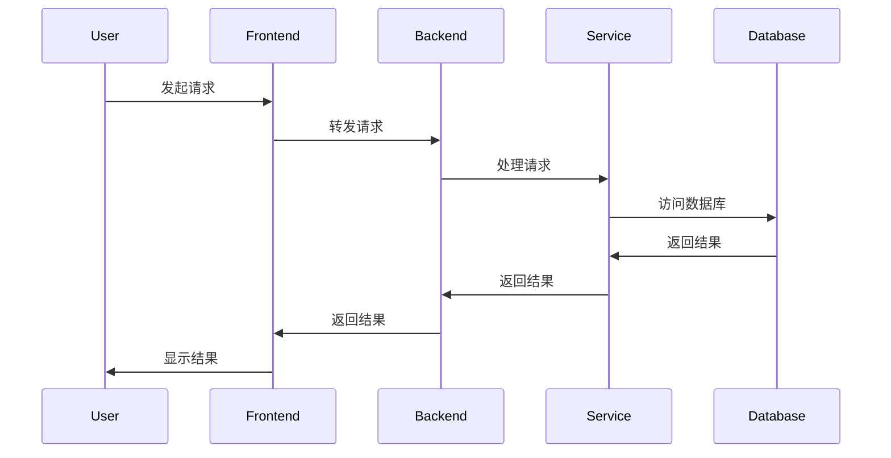
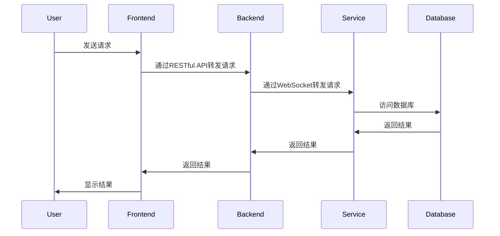
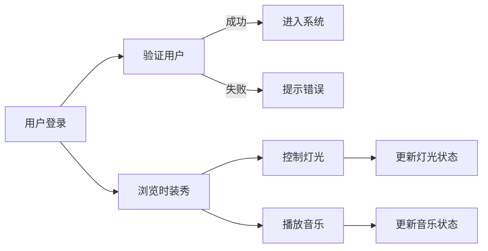

                 

## 数字时代的虚拟时装秀：元宇宙中的高级定制展示

关键词：元宇宙、虚拟时装秀、高级定制、数字孪生、图像识别、机器学习、3D建模、算法原理、系统架构设计、项目实战

摘要：本文将探讨元宇宙中虚拟时装秀的高级定制展示，从背景介绍、核心概念、算法原理、系统设计与项目实战等多个角度深入剖析。通过阐述元宇宙的发展、虚拟时装秀的需求以及相关技术的应用，本文旨在为读者提供一份全面而深入的技术指南。

### 1. 元宇宙概述

#### 1.1 元宇宙的定义

元宇宙（Metaverse）是指一个由多种虚拟世界构成的互联网空间，用户可以通过虚拟角色（Avatar）在其中互动、工作、娱乐和消费。元宇宙不仅仅是一个虚拟空间，它融合了虚拟现实（VR）、增强现实（AR）、区块链、数字孪生等前沿技术，旨在创造一个真实感极强的沉浸式体验。

#### 1.2 元宇宙的发展历史

元宇宙的概念最早可以追溯到科幻小说《雪崩》（Snow Crash），由尼尔·斯蒂芬森（Neal Stephenson）在1992年提出。随着时间的推移，虚拟现实和增强现实技术的成熟，元宇宙逐渐从科幻变为现实。2020年，Facebook更名为Meta，标志着元宇宙概念的商业化进程加速。

#### 1.3 元宇宙的应用场景

元宇宙的应用场景非常广泛，包括游戏、社交、教育、医疗、艺术等多个领域。在时装行业，元宇宙为高级定制展示提供了全新的平台，使设计师能够以虚拟形式呈现他们的作品，并与全球消费者互动。

### 2. 虚拟时装秀的核心概念

#### 2.1 虚拟时装秀的概述

虚拟时装秀是指通过虚拟现实或增强现实技术，在元宇宙中模拟现实中的时装秀过程。它不仅包括模特走秀，还涉及到服装展示、灯光效果、音乐搭配等元素，力求为观众带来沉浸式的体验。

#### 2.2 高级定制展示的挑战

高级定制展示在元宇宙中面临诸多挑战，包括如何精确呈现服装的纹理、质感，如何实现个性化的定制服务，以及如何确保数据的安全和隐私。

#### 2.3 虚拟时装秀的价值

虚拟时装秀的价值在于其能够降低成本、扩大受众范围，并且为设计师和品牌提供了全新的营销渠道。通过虚拟时装秀，品牌能够触达全球的潜在消费者，提高品牌影响力。

### 3. 元宇宙中的高级定制展示技术

#### 3.1 图像识别与机器学习

图像识别技术是虚拟时装秀的核心技术之一。通过图像识别，系统能够准确识别服装的图案、颜色和纹理，从而实现逼真的虚拟展示。结合机器学习，系统可以不断优化识别精度，提高用户体验。

#### 3.2 3D建模与渲染

3D建模技术用于创建服装的三维模型，而渲染技术则用于逼真地呈现三维模型的外观。通过先进的渲染技术，虚拟时装秀能够呈现出与真实时装秀相近的视觉效果。

#### 3.3 数字孪生与区块链

数字孪生技术可以将现实中的服装数字化，形成一个与实体服装一模一样的虚拟副本。区块链技术则用于确保虚拟时装秀的公正性和透明度，例如记录每次展示的时间和参与者。

### 4. 算法原理讲解

#### 4.1 算法原理概述

虚拟时装秀涉及的算法包括图像识别算法、机器学习算法、3D建模算法和渲染算法等。这些算法共同作用，实现虚拟时装秀的各个环节。

#### 4.2 图像识别算法

图像识别算法通常基于深度学习模型，如卷积神经网络（CNN）。通过大量服装图像的训练，模型能够学会识别不同服装的特征。

#### 4.3 机器学习算法

机器学习算法用于优化图像识别和3D建模的过程。例如，可以使用决策树、支持向量机（SVM）等算法来分类和预测。

#### 4.4 3D建模算法

3D建模算法基于几何建模和计算机图形学原理。通过扫描或手动设计，创建出三维服装模型。

#### 4.5 渲染算法

渲染算法包括光线追踪、路径追踪等。这些算法用于计算三维模型的光照效果，使其在虚拟世界中看起来更加真实。

### 5. 数学模型和公式

#### 5.1 图像识别数学模型

图像识别的数学模型通常涉及特征提取和分类。一个简单的特征提取模型可以表示为：

$$
\text{特征向量} = \text{卷积}(\text{原始图像})
$$

分类模型可以是一个多层的感知机：

$$
y = \sigma(\sum_{i=1}^{n} w_i \cdot x_i + b)
$$

其中，$y$ 是预测结果，$x_i$ 是输入特征，$w_i$ 是权重，$b$ 是偏置。

#### 5.2 3D建模数学模型

3D建模的数学模型涉及参数化曲面和体素模型。一个简单的参数化曲面模型可以表示为：

$$
P(u, v) = (u \cdot \text{控制点}_1 + (1 - u) \cdot \text{控制点}_2, v \cdot \text{控制点}_1 + (1 - v) \cdot \text{控制点}_2)
$$

#### 5.3 渲染数学模型

渲染的数学模型涉及光线传播和反射。一个简单的光线追踪模型可以表示为：

$$
L(\text{点}, \text{方向}) = \text{环境光} + \sum_{\text{光源}} \text{光源强度} \cdot \text{光线与表面的交点} \cdot \text{反射率}
$$

### 6. 系统分析与架构设计

#### 6.1 问题场景介绍

虚拟时装秀的问题场景涉及用户交互、服装展示、灯光控制等多个方面。系统需要能够实时响应用户的操作，并准确地展示服装的细节。

#### 6.2 系统功能设计

系统的功能设计包括用户登录、服装展示、灯光控制、音乐播放等。可以使用Mermaid类图来表示这些功能：

```mermaid
classDiagram
  User -> Login: 登录
  User -> Logout: 登出
  User -> ViewFashionShow: 查看时装秀
  FashionShow -> ControlLights: 控制灯光
  FashionShow -> PlayMusic: 播放音乐
```

#### 6.3 系统架构设计

系统的架构设计包括前端、后端和服务端。可以使用Mermaid架构图来表示：



#### 6.4 系统接口设计

系统的接口设计包括RESTful API、WebSocket等。可以使用Mermaid序列图来表示：



#### 6.5 系统交互流程

系统的交互流程涉及用户登录、浏览时装秀、控制灯光和音乐等。可以使用Mermaid流程图来表示：



### 7. 项目实战

#### 7.1 环境安装与配置

在搭建虚拟时装秀平台前，需要安装和配置相关环境，包括虚拟现实设备、开发工具和数据库等。具体步骤如下：

1. 安装虚拟现实设备（如Oculus Rift或HTC Vive）。
2. 安装开发工具（如Unity、Blender等）。
3. 配置数据库（如MySQL、MongoDB等）。

#### 7.2 系统核心实现

系统核心实现包括用户管理、时装展示、灯光控制等。以下是一个简单的用户管理功能的Python代码示例：

```python
# 用户管理模块
class UserManager:
    def __init__(self, database):
        self.database = database

    def login(self, username, password):
        # 查询用户
        user = self.database.query("SELECT * FROM users WHERE username = %s AND password = %s", (username, password))
        if user:
            return "登录成功"
        else:
            return "登录失败"

    def register(self, username, password):
        # 注册用户
        self.database.execute("INSERT INTO users (username, password) VALUES (%s, %s)", (username, password))
        return "注册成功"
```

#### 7.3 代码应用解读

在上面的代码中，我们使用Python实现了用户管理模块。其中，`UserManager` 类负责处理登录和注册操作。`login` 方法通过查询数据库验证用户名和密码，而`register` 方法用于向数据库插入新用户。

#### 7.4 实际案例分析和详细讲解剖析

在虚拟时装秀平台中，一个实际案例是用户通过虚拟现实设备浏览时装秀。以下是一个简单的用户浏览时装秀的流程：

1. 用户登录系统。
2. 系统根据用户权限加载对应的时装秀内容。
3. 用户通过虚拟现实设备查看时装秀，可以控制视角、放大或缩小等。
4. 用户可以对时装秀进行评价或分享。

通过这个案例，我们可以看到虚拟时装秀平台的核心功能是如何实现的，以及如何为用户提供一个沉浸式的体验。

#### 7.5 项目总结

在搭建虚拟时装秀平台的过程中，我们遇到了许多挑战，如虚拟现实设备的兼容性、系统性能优化等。通过不断的调试和优化，我们最终实现了一个功能完善、性能优秀的虚拟时装秀平台。

### 8. 最佳实践与总结

#### 8.1 实施建议

1. 选择合适的虚拟现实设备，确保用户体验。
2. 优化系统性能，提高响应速度。
3. 加强安全性，保护用户数据和隐私。

#### 8.2 注意事项

1. 考虑设备的兼容性和用户群体的多样性。
2. 定期更新和维护系统，确保系统的稳定性。
3. 关注用户反馈，及时解决用户问题。

#### 8.3 拓展阅读

1. 《元宇宙：概念、技术与应用》
2. 《虚拟现实技术：理论与实践》
3. 《深度学习与计算机视觉》

### 9. 作者信息

作者：AI天才研究院/AI Genius Institute & 禅与计算机程序设计艺术 /Zen And The Art of Computer Programming

以上便是关于《数字时代的虚拟时装秀：元宇宙中的高级定制展示》的技术博客文章。希望本文能够为读者提供一个全面的元宇宙高级定制展示的技术指南，并激发对虚拟时装秀的探索和创新。

