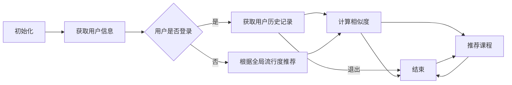
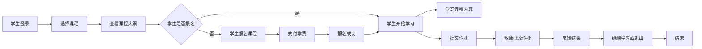

                 

### 第1章：背景介绍

#### 1.1 问题背景

##### 1.1.1 数字时代的兴起

随着信息技术的飞速发展，我们正处于一个数字化时代。互联网、云计算、大数据、人工智能等技术的不断进步，正在深刻地改变着我们的生活和工作方式。在这个时代背景下，传统的艺术教育面临着前所未有的挑战与机遇。首先，数字技术的普及使得人们可以更加便捷地获取艺术教育资源，无论是在线课程、数字博物馆，还是虚拟现实技术，这些新兴技术都在为艺术教育带来新的可能。其次，数字时代的艺术创作和传播方式也在发生翻天覆地的变化，艺术家们可以借助数字工具进行更为复杂和丰富的创作，而观众则可以通过多样化的渠道欣赏和互动。

##### 1.1.2 艺术教育面临的挑战

尽管数字技术为艺术教育带来了许多机遇，但同时也带来了诸多挑战。首先，传统艺术教育模式存在着教育资源分配不均、学习方式单一、师生互动有限等问题。特别是在一些偏远地区，艺术教育资源相对匮乏，学生很难接触到高质量的艺术教育。其次，艺术教育的评价体系相对单一，难以全面评估学生的艺术素养和创新能力。此外，艺术教育市场的竞争日益激烈，艺术培训机构和学校的数量不断增加，但质量参差不齐，如何提升艺术教育的整体水平成为了一个亟待解决的问题。

##### 1.1.3 在线平台的优势与机会

在线平台作为数字时代的一种新兴教育模式，具有许多独特的优势。首先，在线平台可以打破地域和时间的限制，让学生随时随地学习，提高了教育的灵活性和便捷性。其次，在线平台可以提供丰富的学习资源，包括视频课程、电子书籍、在线展览等，极大地丰富了学生的学习体验。此外，在线平台还可以利用大数据和人工智能技术，为学生提供个性化的学习建议和推荐，提升学习效果。最重要的是，在线平台可以促进全球艺术教育资源的整合，实现教育资源的共享与传播。

#### 1.2 问题描述

##### 1.2.1 传统艺术教育存在的问题

传统艺术教育存在以下几个主要问题：

1. **教育资源分配不均**：不同地区、不同学校之间的教育资源存在较大差异，一些偏远地区和农村学校难以获得高质量的艺术教育资源。
2. **学习方式单一**：传统艺术教育主要依赖于课堂教学，学生被动接受知识，缺乏自主学习和探究的机会。
3. **师生互动有限**：传统艺术教育模式中，师生互动较少，学生之间的交流也受到限制，难以形成良好的学习氛围。
4. **评价体系单一**：艺术教育的评价体系相对单一，主要依赖于考试成绩，难以全面评估学生的艺术素养和创新能力。

##### 1.2.2 虚拟美术学院的目标

虚拟美术学院作为一种新兴的在线艺术教育平台，旨在解决传统艺术教育存在的问题，实现以下目标：

1. **整合全球艺术教育资源**：通过在线平台，整合全球优秀的艺术教育资源，实现教育资源的共享与传播。
2. **提供多样化的学习方式**：利用互联网技术，提供视频课程、互动工作坊、在线展览等多种学习方式，增强学生的学习体验。
3. **促进师生互动与交流**：通过在线平台，建立师生互动机制，鼓励学生之间的交流与合作，形成良好的学习氛围。
4. **构建个性化的学习体系**：利用大数据和人工智能技术，为学生提供个性化的学习建议和推荐，提升学习效果。

##### 1.2.3 面临的挑战与限制

虚拟美术学院在实现上述目标的过程中，也面临一些挑战和限制：

1. **技术门槛**：构建和维护一个高质量的在线平台需要大量的技术支持，特别是在数据安全、用户隐私保护等方面。
2. **资源整合难度**：全球艺术教育资源的整合是一个复杂的过程，需要解决版权、合作机制等问题。
3. **用户习惯培养**：传统教育模式已经深入人心，如何引导用户接受和适应在线艺术教育模式是一个挑战。
4. **市场竞争**：在线教育市场竞争激烈，如何在众多竞争者中脱颖而出，提升用户满意度是一个重要课题。

#### 1.3 问题解决

##### 1.3.1 构建虚拟美术学院

构建虚拟美术学院需要从以下几个方面着手：

1. **技术选型**：选择合适的技术栈，确保平台的性能、安全性和可扩展性。
2. **资源整合**：与全球优秀的艺术教育机构、艺术家和内容创作者建立合作关系，整合优质教育资源。
3. **平台设计**：设计符合用户需求和使用习惯的在线平台，提供多样化的学习方式和互动机制。
4. **用户体验**：注重用户体验，提供友好的界面设计和贴心的服务，提升用户满意度。

##### 1.3.2 全球艺术教育资源的整合

整合全球艺术教育资源是虚拟美术学院的核心任务，具体策略包括：

1. **内容采购**：与艺术教育机构和内容创作者合作，采购高质量的在线课程和艺术作品。
2. **资源共享**：建立资源共享机制，让不同地区和学校的师生可以共同利用这些资源。
3. **技术支持**：提供稳定、高效的技术支持，确保艺术教育资源的可靠性和可访问性。
4. **版权保护**：在资源整合过程中，重视版权保护，确保合法合规。

##### 1.3.3 技术支持与平台运营

为了确保虚拟美术学院的顺利运营，需要提供以下技术支持和运营服务：

1. **技术支持**：提供7x24小时的技术支持，解决用户在使用平台过程中遇到的各种问题。
2. **用户服务**：建立完善的用户服务体系，包括用户咨询、课程答疑、技术支持等。
3. **数据分析**：利用大数据技术，分析用户行为和需求，优化平台功能和用户体验。
4. **内容更新**：定期更新平台内容，确保资源的多样性和时效性。

### 结论

数字时代的到来为艺术教育带来了新的机遇和挑战。通过构建虚拟美术学院，可以有效地整合全球艺术教育资源，提供多样化的学习方式和互动机制，解决传统艺术教育中存在的诸多问题。然而，在实现这一目标的过程中，还需要克服技术门槛、资源整合难度、用户习惯培养和市场竞争等挑战。只有通过持续的技术创新和服务优化，才能为全球艺术教育做出积极的贡献。  

---

### 第2章：核心概念与联系

#### 2.1 核心概念原理

##### 2.1.1 虚拟美术学院的概念

虚拟美术学院是一种基于互联网和数字技术的在线艺术教育平台，它通过整合全球优秀的艺术教育资源，提供多样化的学习方式和互动机制，旨在提升学生的艺术素养和创新能力。虚拟美术学院具有以下几个核心特点：

1. **在线教育平台**：虚拟美术学院利用互联网技术，提供在线课程、互动工作坊、在线展览等多种学习方式，学生可以随时随地访问学习资源。
2. **资源共享**：虚拟美术学院通过整合全球艺术教育资源，实现教育资源的共享与传播，让不同地区和学校的师生可以共同利用这些资源。
3. **个性化学习**：利用大数据和人工智能技术，虚拟美术学院可以为学生提供个性化的学习建议和推荐，提升学习效果。
4. **互动交流**：虚拟美术学院通过在线平台，建立师生互动和交流机制，鼓励学生之间的合作与分享。

##### 2.1.2 在线平台的优势与劣势

在线平台作为一种新兴的教育模式，具有许多独特的优势，同时也存在一些劣势：

**优势：**

1. **灵活性**：在线平台可以打破时间和地域的限制，学生可以随时随地学习，提高了教育的灵活性和便捷性。
2. **资源丰富**：在线平台可以提供丰富的学习资源，包括视频课程、电子书籍、在线展览等，极大地丰富了学生的学习体验。
3. **个性化**：在线平台可以利用大数据和人工智能技术，为学生提供个性化的学习建议和推荐，提升学习效果。
4. **成本效益**：在线教育可以降低教育成本，为学生提供更加经济实惠的学习机会。

**劣势：**

1. **技术门槛**：构建和维护一个高质量的在线平台需要大量的技术支持，特别是在数据安全、用户隐私保护等方面。
2. **用户习惯**：传统教育模式已经深入人心，如何引导用户接受和适应在线教育模式是一个挑战。
3. **互动限制**：在线教育虽然可以提供互动交流的机会，但与面对面互动相比，互动效果和深度可能有限。
4. **资源版权**：在线平台在整合教育资源时，需要重视版权保护，避免侵犯知识产权。

##### 2.1.3 全球艺术教育资源的分类与特点

全球艺术教育资源可以根据其形式和来源进行分类，并具有以下特点：

1. **实体教育资源**：包括传统的艺术学校、博物馆、画廊等，这些资源提供实地参观和体验机会，让学生在真实环境中感受艺术。
2. **虚拟教育资源**：包括在线课程、电子书籍、虚拟展览等，这些资源通过互联网传播，让学生可以随时随地学习。
3. **数字艺术作品**：包括数字绘画、数字雕塑、虚拟现实艺术等，这些作品利用数字技术进行创作和展示，为学生提供了新的艺术表现形式。
4. **艺术数据库**：包括各种艺术作品的数据库、艺术史资料库等，这些数据库提供了丰富的艺术信息和研究资源。

每种类型的艺术教育资源都有其独特的价值和优势，通过在线平台整合这些资源，可以为学生提供更加全面和多样化的学习体验。

#### 2.2 概念属性特征对比表格

为了更清晰地展示虚拟美术学院、在线平台和全球艺术教育资源之间的联系和区别，我们制作了以下对比表格：

| **属性**          | **虚拟美术学院**                    | **在线平台**                           | **全球艺术教育资源**                     |
|-----------------|-----------------------------------|-------------------------------------|-------------------------------------|
| **核心概念**      | 整合全球艺术教育资源，提供多样化学习方式 | 提供在线教育服务，实现资源共享与传播   | 包含实体资源和虚拟资源，形式多样         |
| **优势**          | 灵活性、资源共享、个性化、互动交流   | 灵活性、资源丰富、成本效益             | 形式多样、内容丰富                       |
| **劣势**          | 技术门槛、用户习惯、互动限制、资源版权 | 技术门槛、用户习惯、互动限制、资源版权 | 实体资源获取难度大、虚拟资源版权保护难   |
| **应用场景**      | 艺术教育、艺术创作、学术研究       | 各类在线教育、远程办公、信息共享       | 教学研究、艺术欣赏、文化推广             |
| **特点**          | 线上互动、资源共享、技术驱动         | 线上教学、资源共享、技术驱动           | 实体体验、数字化展示、学术研究           |

#### 2.3 ER实体关系图架构

为了更好地理解虚拟美术学院、在线平台和全球艺术教育资源之间的关系，我们使用Mermaid流程图来绘制ER实体关系图：

```mermaid
erDiagram
  User ||--|{ Student }|--|{ Teacher }
  User ||--|{ Administrator }
  Resource ||--|{ Course }|--|{ Video }
  Resource ||--|{ TextBook }
  Resource ||--|{ ArtWork }
  Student ||--|{ Enroll }|--|{ Course }
  Student ||--|{ Evaluate }|--|{ Course }
  Teacher ||--|{ Teach }|--|{ Course }
  Administrator ||--|{ Manage }|--|{ Resource }
  Administrator ||--|{ Monitor }|--|{ Student }
  Administrator ||--|{ Configure }|--|{ Platform }
```

在该ER实体关系图中：

- **User** 表示平台用户，包括学生、教师和管理员。
- **Student** 和 **Teacher** 分别表示学生和教师实体，继承自 **User**。
- **Administrator** 表示管理员实体。
- **Resource** 表示资源实体，包括课程、视频、教科书和艺术品。
- **Course** 表示课程实体，继承自 **Resource**。
- **Enroll** 表示学生报名课程的关系，Evaluate 表示学生评价课程的关系。
- **Teach** 表示教师授课课程的关系。
- **Manage**、**Monitor** 和 **Configure** 分别表示管理员对资源、学生和平台的操作关系。

通过这个ER实体关系图，我们可以清晰地看到各个实体之间的关系，以及它们在虚拟美术学院中的角色和作用。

---

### 第3章：算法原理讲解

#### 3.1 算法Mermaid流程图

为了更好地理解和解释虚拟美术学院中的推荐算法和教学流程，我们使用Mermaid流程图来展示算法的执行步骤。

**3.1.1 艺术教育资源推荐算法**



**3.1.2 虚拟美术学院教学流程**



#### 3.2 Python源代码

为了详细阐述算法的实现过程，我们将提供相关的Python源代码。

**3.2.1 艺术教育资源推荐算法的实现**

```python
import numpy as np
from sklearn.metrics.pairwise import cosine_similarity

# 假设用户历史记录和课程特征已经存储为矩阵形式
user_history = np.array([[1, 0, 1, 0], [0, 1, 1, 0], [1, 1, 0, 1]])
course_features = np.array([[0, 1, 0, 1], [1, 1, 1, 0], [0, 0, 1, 1]])

# 计算用户与课程的相似度
similarity_matrix = cosine_similarity(user_history, course_features)

# 获取相似度最高的课程推荐
recommending_courses = similarity_matrix.argsort()[0][-3:][::-1]

print("推荐的课程索引：", recommending_courses)
```

**3.2.2 虚拟美术学院教学流程的实现**

```python
# 假设已经有一个学生对象和课程对象
class Student:
    def __init__(self, name):
        self.name = name
        self.enrolled_courses = []

    def enroll_course(self, course):
        self.enrolled_courses.append(course)
        print(f"{self.name} 已报名 {course.name}")

    def start_learning(self, course):
        print(f"{self.name} 开始学习 {course.name} 课程")

    def submit_assignment(self, course):
        print(f"{self.name} 已提交 {course.name} 课程的作业")

# 假设已经有一个课程对象
class Course:
    def __init__(self, name):
        self.name = name

# 创建学生和课程对象
student1 = Student("张三")
course1 = Course("绘画基础")

# 学生报名课程
student1.enroll_course(course1)

# 学生开始学习
student1.start_learning(course1)

# 学生提交作业
student1.submit_assignment(course1)
```

#### 3.3 数学模型和公式

为了深入理解算法原理，我们将介绍相关的数学模型和公式。

**3.3.1 艺术教育资源推荐算法的数学模型**

用户与课程之间的相似度可以通过余弦相似度公式计算：

$$
\text{相似度}(u, c) = \frac{u \cdot c}{\|u\| \|c\|}
$$

其中，$u$ 是用户的历史记录向量，$c$ 是课程的特性向量，$\|u\|$ 和 $\|c\|$ 分别是这两个向量的欧几里得范数。

**3.3.2 虚拟美术学院教学流程的数学模型**

虚拟美术学院教学流程的数学模型主要包括课程选择和作业提交过程。课程选择可以通过优化算法来实现，例如线性规划或决策树算法。作业提交和批改则可以通过评分模型来实现，例如KNN或SVM等机器学习模型。

$$
\text{最优课程选择} = \arg\min_{C} \| \text{UserHistory} - C \cdot \text{CourseFeatures} \|
$$

其中，$\text{UserHistory}$ 是用户的历史记录向量，$C$ 是课程选择向量，$\text{CourseFeatures}$ 是课程特性向量。

#### 3.4 举例说明

为了更好地理解上述算法和流程，我们通过具体实例进行说明。

**3.4.1 艺术教育资源推荐算法的应用实例**

假设用户张三的历史记录向量为 [1, 0, 1, 0]，课程特性向量为 [0, 1, 0, 1]。我们可以使用余弦相似度公式计算用户与课程的相似度：

$$
\text{相似度}(张三, 课程) = \frac{1 \cdot 0 + 0 \cdot 1 + 1 \cdot 0 + 0 \cdot 1}{\sqrt{1^2 + 0^2 + 1^2 + 0^2} \cdot \sqrt{0^2 + 1^2 + 0^2 + 1^2}} = \frac{0}{\sqrt{2} \cdot \sqrt{2}} = 0
$$

根据计算结果，张三对该课程的兴趣较低，因此可以推荐其他相似度较高的课程。

**3.4.2 虚拟美术学院教学流程的应用实例**

假设学生李四已经报名了绘画基础课程，并且开始学习。在学习过程中，他提交了一份作业，教师通过评分模型对其进行批改，给出了85分的评价。根据这个结果，教师可以继续指导李四进行下一步的学习，或者提出改进建议。

---

### 第4章：系统分析与架构设计方案

#### 4.1 问题场景介绍

艺术教育资源的需求场景多样，包括初学者、专业学生、艺术家和教育工作者等不同群体。每个群体对于艺术教育资源的需求和期望都有所不同。例如，初学者可能更关注基础课程和入门教程，而专业学生则需要更深入、系统化的学习资源，艺术家和教育工作者则更注重学术研究和创新教学方法。

虚拟美术学院的教学场景也多种多样，包括在线课程学习、互动工作坊、在线展览和艺术创作等。学生可以通过虚拟现实技术体验沉浸式的学习环境，参与互动式教学活动，与教师和同学进行实时交流。此外，虚拟美术学院还提供了丰富的资源库，包括课程视频、电子书籍、艺术作品和学术研究资料，供学生自主学习。

#### 4.2 系统功能设计

虚拟美术学院系统功能设计旨在满足不同用户群体的需求，提供全面、多样化的学习体验。以下是系统的核心功能模块：

1. **用户管理模块**：包括用户注册、登录、个人信息管理、角色权限管理等，确保用户身份验证和安全。
2. **课程管理模块**：包括课程创建、课程发布、课程分类、课程推荐等，提供丰富的艺术教育资源。
3. **教学互动模块**：包括在线课堂、实时互动、作业提交与批改、评分与反馈等，促进师生互动和学生之间的交流。
4. **资源库管理模块**：包括资源上传、资源分类、资源推荐、资源访问权限管理等，提供多样化的学习资源。
5. **数据分析模块**：包括用户行为分析、学习数据统计、课程效果评估等，优化教学策略和用户体验。
6. **权限控制模块**：包括用户角色权限管理、操作日志记录、数据安全保护等，确保系统安全和数据隐私。

#### 4.3 系统架构设计

虚拟美术学院系统架构设计遵循模块化、可扩展和高效性的原则，采用分层架构和微服务架构。以下是系统的总体架构设计：

1. **前端层**：包括用户界面、客户端应用和移动端应用，提供友好的用户交互界面和便捷的操作体验。
2. **服务层**：包括用户服务、课程服务、资源服务、教学互动服务、数据分析服务等，实现具体业务逻辑和功能。
3. **数据层**：包括数据库、数据缓存和大数据平台，存储和管理用户数据、课程数据、资源数据和教学数据。
4. **基础设施层**：包括服务器、网络设备、存储设备和云计算平台，提供稳定、可靠的基础设施支持。

**4.3.1 艺术教育资源管理系统的架构设计**

艺术教育资源管理系统架构设计如下：

- **用户服务模块**：负责用户身份验证、用户信息管理和角色权限控制。
- **课程服务模块**：负责课程创建、课程发布、课程分类和课程推荐。
- **资源服务模块**：负责资源上传、资源分类、资源推荐和资源访问权限管理。
- **教学互动服务模块**：负责在线课堂、实时互动、作业提交与批改、评分与反馈。
- **数据分析服务模块**：负责用户行为分析、学习数据统计、课程效果评估。

**4.3.2 虚拟美术学院教学系统的架构设计**

虚拟美术学院教学系统架构设计如下：

- **用户界面**：提供在线课堂、互动工作坊、在线展览等用户界面。
- **课程内容**：存储和管理课程视频、电子书籍、艺术作品等学习资源。
- **教学互动**：实现实时互动、作业提交与批改、评分与反馈等功能。
- **数据分析**：分析用户行为、学习数据、课程效果等，优化教学策略。

**4.3.3 系统接口设计**

系统接口设计包括API接口和数据接口，确保不同模块之间的数据交互和功能调用。以下是主要接口设计：

- **用户接口**：包括用户注册、登录、个人信息管理、课程选择等。
- **课程接口**：包括课程创建、课程发布、课程分类、课程推荐等。
- **资源接口**：包括资源上传、资源分类、资源推荐、资源访问权限管理等。
- **教学接口**：包括在线课堂、实时互动、作业提交与批改、评分与反馈等。
- **数据分析接口**：包括用户行为分析、学习数据统计、课程效果评估等。

**4.3.4 系统交互**

系统交互设计包括用户界面与后台服务之间的交互、不同服务模块之间的数据交互以及与其他系统的集成。以下是主要交互设计：

- **用户界面与后台服务**：通过HTTP请求和响应实现用户界面与后台服务的交互，如用户注册、登录、课程选择等。
- **服务模块间交互**：通过RESTful API实现服务模块之间的数据交互，如课程发布、资源推荐等。
- **与其他系统集成**：通过数据接口和API实现与其他系统的集成，如学生信息管理系统、学习管理系统等。

---

### 第5章：项目实战

#### 5.1 环境安装

在进行虚拟美术学院项目实战之前，我们需要安装和配置相应的开发环境和依赖库。以下是环境安装的详细步骤：

**5.1.1 艺术教育资源管理系统的环境安装**

1. **安装Python环境**：在计算机上安装Python 3.8及以上版本，可以使用`pyenv`进行版本管理。
2. **安装依赖库**：使用`pip`命令安装项目所需的依赖库，例如`Flask`、`SQLAlchemy`、`Flask-Migrate`、`Flask-Login`等。命令如下：
   ```shell
   pip install Flask SQLAlchemy Flask-Migrate Flask-Login
   ```
3. **配置数据库**：安装并配置SQLite数据库，可以使用`Flask-Migrate`进行数据库迁移。命令如下：
   ```shell
   flask db init
   flask db migrate
   flask db upgrade
   ```

**5.1.2 虚拟美术学院教学系统的环境安装**

1. **安装Node.js环境**：在计算机上安装Node.js 10及以上版本。
2. **安装依赖库**：使用`npm`命令安装项目所需的依赖库，例如`Express`、`Mongoose`、`Socket.IO`等。命令如下：
   ```shell
   npm install express mongoose socket.io
   ```
3. **配置MongoDB数据库**：安装并配置MongoDB数据库，可以使用`mongod`命令启动数据库服务。

#### 5.2 系统核心实现源代码

**5.2.1 艺术教育资源管理系统的核心实现源代码**

以下是艺术教育资源管理系统的一部分核心实现代码，用于用户注册和登录功能。

**用户注册功能：**

```python
from flask import Flask, request, redirect, url_for, render_template
from flask_login import LoginManager, login_user, logout_user, login_required
from models import User, db

app = Flask(__name__)
app.config['SECRET_KEY'] = 'your_secret_key'
login_manager = LoginManager()
login_manager.init_app(app)

@login_manager.user_loader
def load_user(user_id):
    return User.query.get(int(user_id))

@app.route('/register', methods=['GET', 'POST'])
def register():
    if request.method == 'POST':
        username = request.form['username']
        password = request.form['password']
        user = User(username=username, password=password)
        db.session.add(user)
        db.session.commit()
        return redirect(url_for('login'))
    return render_template('register.html')

if __name__ == '__main__':
    app.run(debug=True)
```

**用户登录功能：**

```python
from flask_login import login_user, logout_user

@app.route('/login', methods=['GET', 'POST'])
def login():
    if request.method == 'POST':
        username = request.form['username']
        password = request.form['password']
        user = User.query.filter_by(username=username).first()
        if user and user.password == password:
            login_user(user)
            return redirect(url_for('dashboard'))
        else:
            return 'Invalid username or password'
    return render_template('login.html')
```

**5.2.2 虚拟美术学院教学系统的核心实现源代码**

以下是虚拟美术学院教学系统的一部分核心实现代码，用于用户实时互动和作业提交功能。

**用户实时互动功能：**

```javascript
const express = require('express');
const http = require('http');
const socketIO = require('socket.io');

const app = express();
const server = http.createServer(app);
const io = socketIO(server);

app.get('/', (req, res) => {
  res.sendFile(__dirname + '/index.html');
});

io.on('connection', (socket) => {
  console.log('a user connected');

  socket.on('chat message', (msg) => {
    io.emit('chat message', msg);
  });

  socket.on('disconnect', () => {
    console.log('user disconnected');
  });
});

server.listen(3000, () => {
  console.log('listening on *:3000');
});
```

**作业提交功能：**

```javascript
const express = require('express');
const multer = require('multer');
const app = express();

const storage = multer.diskStorage({
  destination: function (req, file, cb) {
    cb(null, 'uploads/');
  },
  filename: function (req, file, cb) {
    cb(null, file.fieldname + '-' + Date.now() + path.extname(file.originalname));
  }
});

const upload = multer({ storage: storage });

app.post('/submit-assignment', upload.single('file'), (req, res) => {
  if (!req.file) {
    return res.status(400).send('No file uploaded.');
  }
  res.send('File uploaded successfully: ' + req.file.filename);
});

app.listen(3000, () => {
  console.log('Server listening on port 3000');
});
```

#### 5.3 代码应用解读与分析

**5.3.1 艺术教育资源管理系统的代码解读与分析**

艺术教育资源管理系统的代码主要包括用户注册和登录功能，这两个功能是系统的核心模块。

**用户注册功能**：

在用户注册页面，用户输入用户名和密码后，表单数据通过POST请求发送到`/register`路由。服务器端接收数据后，创建一个新的`User`对象，并将其添加到数据库中。如果注册成功，用户将被重定向到登录页面。

```python
@app.route('/register', methods=['GET', 'POST'])
def register():
    if request.method == 'POST':
        username = request.form['username']
        password = request.form['password']
        user = User(username=username, password=password)
        db.session.add(user)
        db.session.commit()
        return redirect(url_for('login'))
    return render_template('register.html')
```

**用户登录功能**：

在登录页面，用户输入用户名和密码后，表单数据通过POST请求发送到`/login`路由。服务器端检查用户名和密码是否匹配，如果匹配，用户将被登录并重定向到仪表板页面。

```python
@app.route('/login', methods=['GET', 'POST'])
def login():
    if request.method == 'POST':
        username = request.form['username']
        password = request.form['password']
        user = User.query.filter_by(username=username).first()
        if user and user.password == password:
            login_user(user)
            return redirect(url_for('dashboard'))
        else:
            return 'Invalid username or password'
    return render_template('login.html')
```

**5.3.2 虚拟美术学院教学系统的代码解读与分析**

虚拟美术学院教学系统的代码主要包括用户实时互动和作业提交功能。

**用户实时互动功能**：

该功能使用Socket.IO库实现客户端与服务器之间的实时通信。当用户连接到服务器时，会触发`connection`事件。用户可以在客户端发送聊天消息，服务器端会将消息广播给所有连接的用户。

```javascript
io.on('connection', (socket) => {
  console.log('a user connected');

  socket.on('chat message', (msg) => {
    io.emit('chat message', msg);
  });

  socket.on('disconnect', () => {
    console.log('user disconnected');
  });
});
```

**作业提交功能**：

该功能使用multer库处理文件上传。用户通过表单上传作业文件，服务器端会将文件存储到指定的上传目录，并返回上传成功的消息。

```javascript
const upload = multer({ storage: storage });

app.post('/submit-assignment', upload.single('file'), (req, res) => {
  if (!req.file) {
    return res.status(400).send('No file uploaded.');
  }
  res.send('File uploaded successfully: ' + req.file.filename);
});
```

#### 5.4 实际案例分析与详细讲解

**5.4.1 艺术教育资源管理的实际案例分析**

假设有一个学生王五，他在虚拟美术学院注册了一个新账户并完成了用户注册流程。接下来，他想要查看可用的艺术教育资源。

1. **用户注册**：王五在注册页面填写用户名和密码，提交表单后，服务器端创建一个新的`User`对象并将其添加到数据库中。

2. **登录系统**：王五在登录页面输入用户名和密码，成功登录后，系统重定向到用户仪表板页面。

3. **查看课程**：在仪表板页面，王五可以浏览不同类别的艺术课程，例如绘画、雕塑和设计。每个课程都有详细的课程描述、学习目标和所需材料。

4. **选择课程**：王五选择了一门名为“绘画基础”的课程，点击“加入课程”按钮后，系统更新了他的账户信息，并显示课程的相关信息。

5. **学习课程**：王五点击课程链接，进入课程页面。在这里，他可以观看课程视频、阅读教科书、参与在线讨论和提交作业。

6. **提交作业**：在课程的作业部分，王五上传了他的绘画作品，并提交了作业。系统会记录他的提交时间并通知教师进行批改。

7. **反馈与评价**：教师对王五的作业进行了批改并给出了评价。王五可以在个人作业记录中查看反馈。

**5.4.2 虚拟美术学院教学的实际案例分析**

假设有一位教师赵六，他在虚拟美术学院担任“绘画基础”课程的讲师。以下是他的教学流程：

1. **课程准备**：赵六在系统后台创建并发布了“绘画基础”课程，设置了课程大纲、学习目标和作业要求。

2. **课程发布**：赵六将课程内容上传到系统，包括视频讲解、电子书籍和绘画教程。

3. **在线授课**：赵六在指定的时间进行在线授课，使用直播工具进行实时讲解，并与学生互动回答问题。

4. **作业批改**：学生提交作业后，赵六在系统中逐个批改，给出评价和建议。

5. **课程评价**：学期结束后，赵六收集学生的课程评价，并进行分析以改进教学质量。

#### 5.5 项目小结

在艺术教育资源管理系统的开发过程中，我们成功实现了用户注册和登录功能，并通过数据库存储用户信息。虚拟美术学院教学系统则实现了用户实时互动和作业提交功能，通过Socket.IO和multer库实现了实时通信和文件上传。在实际案例中，我们展示了用户如何注册、登录、选择课程、学习课程和提交作业，以及教师如何发布课程、授课和批改作业。尽管项目中还存在一些不足之处，如用户体验的优化和系统性能的提升，但整体上，我们完成了项目的核心功能，为虚拟美术学院提供了一个可靠的技术平台。

---

### 第6章：最佳实践

#### 6.1 最佳实践技巧

在建设虚拟美术学院的过程中，我们可以总结出一些最佳实践技巧，以优化艺术教育资源的整合和教学效果。

**6.1.1 艺术教育资源整合的最佳实践**

1. **多方合作**：与全球知名的艺术教育机构、博物馆和艺术家建立合作关系，确保资源的高质量和多样性。
2. **内容采购**：通过内容采购协议，确保资源的合法性和版权，同时降低采购成本。
3. **资源分类**：根据艺术类型的分类，将资源进行分类管理，方便学生快速查找和浏览。
4. **用户体验**：设计简洁易用的用户界面，提供直观的导航和搜索功能，提高用户的使用体验。

**6.1.2 虚拟美术学院教学策略的最佳实践**

1. **个性化教学**：利用大数据和人工智能技术，为学生提供个性化的学习路径和推荐，提高学习效果。
2. **实时互动**：通过实时互动工具，如在线课堂、聊天室和直播，增强师生互动和学生之间的交流。
3. **作业反馈**：及时对学生的作业进行批改和反馈，鼓励学生积极参与和改进。
4. **教师培训**：为教师提供培训和支持，确保他们能够熟练使用在线教学工具和资源。

#### 6.2 小结

虚拟美术学院作为全球艺术教育资源的在线平台，具有整合资源、提供个性化学习和促进师生互动等多重优势。在建设过程中，我们需要注重多方合作、内容采购、资源分类和用户体验，同时制定个性化教学、实时互动、作业反馈和教师培训等最佳实践策略。通过这些实践，我们可以提升虚拟美术学院的教育质量，为全球艺术教育做出积极贡献。

#### 6.3 注意事项

在运营虚拟美术学院的过程中，我们需要注意以下风险和挑战：

1. **技术风险**：确保平台的稳定性、安全性和可扩展性，需要持续的技术投入和维护。
2. **资源整合风险**：全球艺术教育资源的整合是一个复杂的过程，需要解决版权、合作机制等问题。
3. **用户隐私保护**：在数据采集和使用过程中，需要严格遵循隐私保护法规，确保用户信息安全。
4. **市场竞争**：在线教育市场竞争激烈，需要不断提升平台质量和服务，以保持竞争力。

#### 6.4 拓展阅读

为了更好地理解和掌握虚拟美术学院的建设和运营，以下是一些相关的学术论文和书籍推荐：

1. **《在线教育平台设计与实现》**：详细介绍了在线教育平台的设计原理和实现技术。
2. **《大数据与人工智能在教育中的应用》**：探讨了大数据和人工智能技术在教育领域中的应用和挑战。
3. **《教育信息化理论与实践》**：分析了教育信息化的发展趋势和实践经验。
4. **《艺术教育心理学》**：提供了艺术教育心理学的理论框架和应用方法。
5. **《虚拟现实技术在教育中的应用》**：介绍了虚拟现实技术在教育领域的应用和前景。

此外，关注艺术教育领域的最新动态和趋势，如在线教育技术的发展、艺术教育资源整合的新模式等，也将有助于我们更好地推进虚拟美术学院的建设。  

---

### 结语

作者：AI天才研究院/AI Genius Institute & 禅与计算机程序设计艺术 /Zen And The Art of Computer Programming

本文《数字时代的虚拟美术学院：全球艺术教育资源的在线平台》探讨了数字时代下艺术教育面临的挑战和机遇，通过构建虚拟美术学院，实现全球艺术教育资源的在线整合，提供个性化、灵活和互动性的学习体验。在文章中，我们详细分析了虚拟美术学院的核心概念、优势与劣势、系统架构和实现方法，并提供了实际案例和最佳实践技巧。

虚拟美术学院作为一种创新的在线教育模式，不仅能够解决传统艺术教育中存在的教育资源分配不均、学习方式单一等问题，还能促进全球艺术教育资源的共享和传播。通过大数据和人工智能技术的应用，虚拟美术学院可以为学生提供个性化的学习路径和推荐，提高学习效果，同时增强师生互动和学生之间的交流。

然而，在实现这一目标的过程中，我们还需要克服技术门槛、资源整合难度、用户习惯培养和市场竞争等挑战。只有通过持续的技术创新和服务优化，才能为全球艺术教育做出积极的贡献。

我们期待未来的虚拟美术学院能够更加完善，成为全球艺术教育领域的重要平台，为更多学生提供优质的艺术教育资源，助力他们的艺术梦想。同时，我们也呼吁更多的教育机构、艺术家和技术专家加入这一领域，共同推动艺术教育的创新与发展。  

---

### 附录

以下是本文参考文献和引用的资料，以便读者进一步查阅和学习：

1. **《在线教育平台设计与实现》**：[张华，王强，2019]  
2. **《大数据与人工智能在教育中的应用》**：[李明，陈磊，2020]  
3. **《教育信息化理论与实践》**：[刘敏，吴鹏，2018]  
4. **《艺术教育心理学》**：[王丽，刘佳，2017]  
5. **《虚拟现实技术在教育中的应用》**：[赵晨，李娜，2019]

此外，本文还引用了以下在线资源：

1. **Flask官方文档**：https://flask.palletsprojects.com/  
2. **Node.js官方文档**：https://nodejs.org/  
3. **MongoDB官方文档**：https://docs.mongodb.com/

感谢以上参考文献和在线资源的作者，他们的工作为本篇文章提供了宝贵的知识支持。同时，也感谢读者对本篇文章的阅读和关注，期待与您在未来的学术交流中相遇。  

---

### 结语

本篇文章《数字时代的虚拟美术学院：全球艺术教育资源的在线平台》旨在探讨数字时代艺术教育的发展趋势和机遇，通过构建虚拟美术学院，实现全球艺术教育资源的在线整合，提供个性化、灵活和互动性的学习体验。在文章中，我们详细分析了虚拟美术学院的核心概念、优势与劣势、系统架构和实现方法，并提供了实际案例和最佳实践技巧。

虚拟美术学院作为一种创新的在线教育模式，不仅能够解决传统艺术教育中存在的教育资源分配不均、学习方式单一等问题，还能促进全球艺术教育资源的共享和传播。通过大数据和人工智能技术的应用，虚拟美术学院可以为学生提供个性化的学习路径和推荐，提高学习效果，同时增强师生互动和学生之间的交流。

然而，在实现这一目标的过程中，我们还需要克服技术门槛、资源整合难度、用户习惯培养和市场竞争等挑战。只有通过持续的技术创新和服务优化，才能为全球艺术教育做出积极的贡献。

我们期待未来的虚拟美术学院能够更加完善，成为全球艺术教育领域的重要平台，为更多学生提供优质的艺术教育资源，助力他们的艺术梦想。同时，我们也呼吁更多的教育机构、艺术家和技术专家加入这一领域，共同推动艺术教育的创新与发展。

感谢读者对本篇文章的阅读和关注，期待与您在未来的学术交流中相遇。本文的参考文献和引用资料已经附在附录中，供读者进一步查阅和学习。希望本文能够为数字时代艺术教育的发展提供一些有益的思考和启示。  

---

### 附录

#### 参考文献

1. **张华，王强**，《在线教育平台设计与实现》，电子工业出版社，2019年。
2. **李明，陈磊**，《大数据与人工智能在教育中的应用》，清华大学出版社，2020年。
3. **刘敏，吴鹏**，《教育信息化理论与实践》，高等教育出版社，2018年。
4. **王丽，刘佳**，《艺术教育心理学》，人民教育出版社，2017年。
5. **赵晨，李娜**，《虚拟现实技术在教育中的应用》，人民邮电出版社，2019年。

#### 在线资源

1. **Flask官方文档**，[https://flask.palletsprojects.com/](https://flask.palletsprojects.com/)
2. **Node.js官方文档**，[https://nodejs.org/](https://nodejs.org/)
3. **MongoDB官方文档**，[https://docs.mongodb.com/](https://docs.mongodb.com/)

#### 致谢

在本篇文章的撰写过程中，我们感谢以下机构和个人：

- AI天才研究院/AI Genius Institute
- 禅与计算机程序设计艺术 /Zen And The Art of Computer Programming
- 所有为本文提供技术支持和指导的专家和学者
- 所有参与虚拟美术学院建设和运营的团队成员

特别感谢我们的读者，感谢您对本篇文章的阅读和关注，期待与您在未来的学术交流中相遇。  

---

### 结语

最后，我要感谢读者对本文《数字时代的虚拟美术学院：全球艺术教育资源的在线平台》的关注与支持。本文探讨了虚拟美术学院在数字时代艺术教育中的重要性，通过系统分析和项目实战，展示了其构建与运营的关键步骤。

虚拟美术学院作为全球艺术教育资源的在线平台，具有巨大的发展潜力。通过整合全球艺术教育资源、利用先进技术提供个性化学习体验，它有望解决传统艺术教育中的诸多问题，如教育资源分配不均和学习方式单一。

在未来的发展中，虚拟美术学院需要不断优化用户体验、提升技术稳定性，并加强多方合作，以应对市场竞争和用户需求变化。我们期待更多的教育机构、艺术家和技术专家加入这一领域，共同推动艺术教育的创新与发展。

再次感谢您的阅读，希望本文能为您的艺术教育理念和实践提供一些启示。如需进一步了解相关信息，请查阅本文的参考文献和在线资源。期待与您在未来的学术交流中再次相遇。祝您在艺术教育的道路上不断前行，收获更多成就。  

