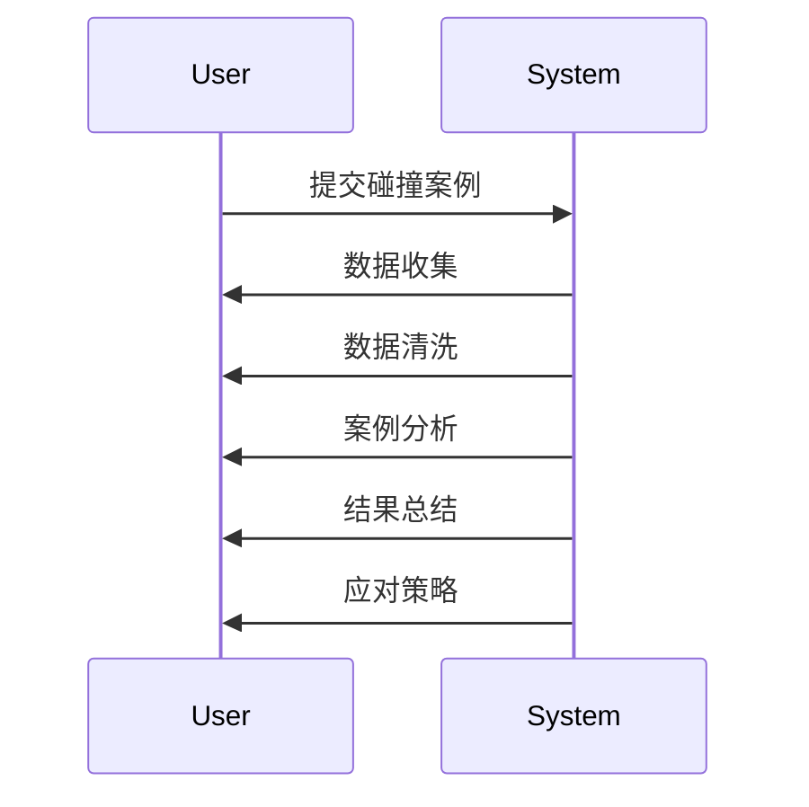
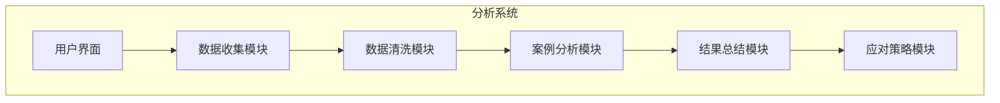
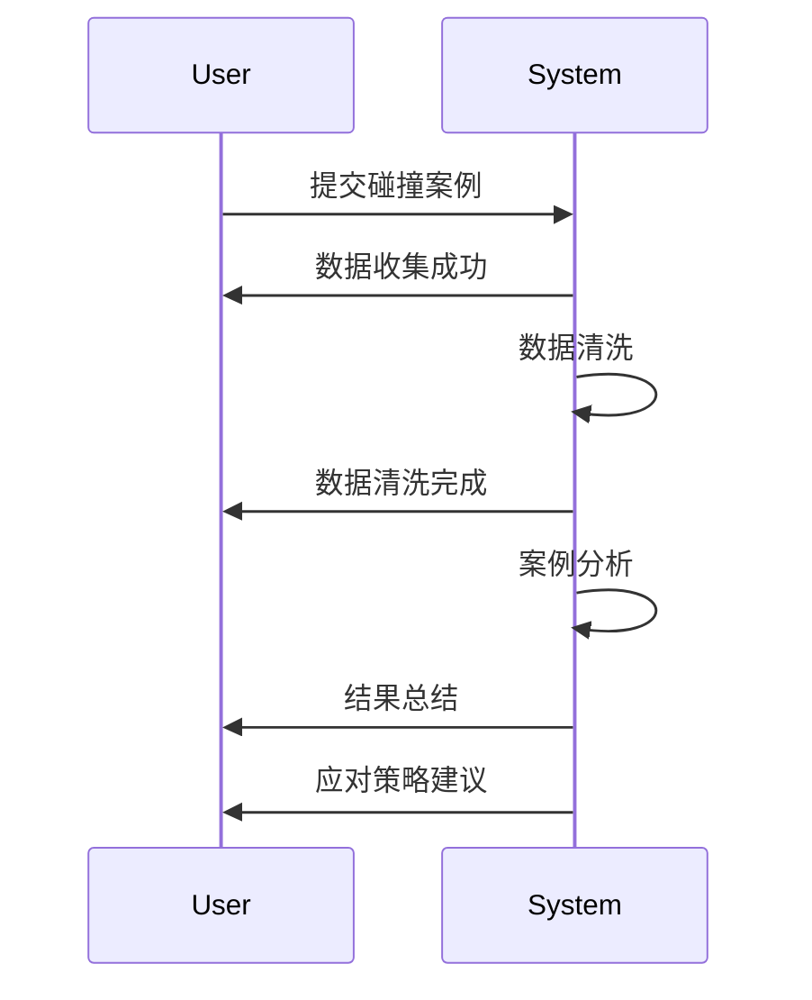

                 

### 《数字时代的语言演变：网络用语与正式语言的碰撞》

在数字时代，语言的使用和演变经历了前所未有的变革。网络用语，作为一种全新的语言形式，与传统的正式语言不断碰撞、交融，形成了一种独特的语言文化现象。本文将以《数字时代的语言演变：网络用语与正式语言的碰撞》为题，深入探讨这一现象背后的原因、影响及应对策略。

**关键词：数字时代、语言演变、网络用语、正式语言、碰撞现象**

**摘要：**
本文旨在分析数字时代网络用语与正式语言之间的碰撞现象，探讨其背后的原因和影响。通过对网络用语和正式语言的历史演变、特点及其碰撞的表现形式进行详细分析，本文将提出一系列应对策略，以期为数字时代的语言使用提供参考。

### 引言与背景介绍

#### 1.1 数字时代的语言演变背景

随着互联网的普及和移动通信技术的飞速发展，数字时代已经悄然而至。在这个时代，语言的使用方式和形态发生了深刻变化。传统语言逐渐被数字化的表达形式所取代，网络用语应运而生。网络用语以其简洁、生动、幽默的特点，迅速成为年轻人沟通的主要方式。与此同时，正式语言作为一种规范化、标准化、正式化的语言形式，仍然在学术、商务、法律等领域扮演着重要角色。

#### 1.2 核心概念

在本研究中，我们定义了“网络用语”和“正式语言”两个核心概念。

- **网络用语**：指在互联网和社交媒体平台上广泛使用的、具有特定语境和情感色彩的语言形式。网络用语通常简洁、幽默、富有创意，能够迅速传达信息。
  
- **正式语言**：指在正式场合、学术交流、商务沟通、法律法规等领域使用的规范化、标准化语言形式。正式语言通常严谨、规范、明确，有助于确保沟通的准确性和权威性。

#### 1.3 研究目的与意义

本研究的主要目的是探讨数字时代网络用语与正式语言之间的碰撞现象，分析其背后的原因和影响，并提出相应的应对策略。这一研究不仅有助于理解数字时代语言演变的特点，还为语言教育和沟通策略的制定提供了理论依据。

#### 1.4 研究方法与框架

本研究采用文献综述和案例分析相结合的方法。首先，通过对相关文献的回顾和总结，梳理网络用语和正式语言的历史演变、特点及其碰撞现象。然后，选取若干典型案例进行深入分析，探讨碰撞现象的成因、表现形式和影响。最后，根据分析结果，提出相应的应对策略。

#### 1.5 本章小结

本章对数字时代语言演变的背景、核心概念、研究目的与意义、研究方法与框架进行了介绍。下一章将深入探讨网络用语和正式语言的历史演变，为后续分析奠定基础。

### 网络用语概述

#### 2.1 网络用语的历史演变

网络用语的历史可以追溯到互联网的初期。在那个时期，网络用语主要以简单的表情符号和简短的词汇为主，例如：“:）”表示微笑，”:(')”表示哭泣。随着互联网的普及和社交媒体的发展，网络用语逐渐丰富和多样化。从早期简单的表情符号和缩写，到如今涵盖幽默、调侃、戏谑等多重元素的网络用语，网络语言已经形成了独特的语言文化现象。

#### 2.2 网络用语的类型与特点

网络用语可以分为以下几类：

1. **节省时间的用语**：这类用语通过缩写、拼音简写、符号等方式，以最简洁的方式传达信息。例如：“YYDS”（永远的神）表示对某人或某事物的极度赞美。

2. **趣味性的用语**：这类用语常常带有幽默、调侃、讽刺等元素，使语言更加生动有趣。例如：“2333”（表示大笑）常用于回复搞笑的内容。

3. **网络新词**：随着网络的发展，新的词汇不断涌现。这些新词往往反映了社会的热点事件、流行文化等。例如：“内卷”（指过度竞争）一词，在2021年成为了热词。

网络用语的特点主要体现在以下几个方面：

1. **简洁性**：网络用语通常用最简单的词汇和符号表达，以便在短时间内传达信息。

2. **生动性**：网络用语富有创意，常常使用幽默、调侃等手法，使语言更加生动有趣。

3. **语境依赖性**：网络用语的使用通常依赖于特定的语境和社交环境，不同场景下可能有不同的表达方式。

#### 2.3 网络用语的影响

网络用语的影响主要表现在以下几个方面：

1. **沟通方式**：网络用语改变了人们的沟通方式，使得沟通更加高效、有趣。

2. **语言规范**：网络用语的出现对传统语言规范提出了挑战，同时也促进了语言的创新和发展。

3. **社会文化**：网络用语反映了社会的热点事件、流行文化等，成为社会文化的一部分。

#### 2.4 网络用语的利与弊

网络用语的利与弊主要体现在以下几个方面：

1. **利**：网络用语能够快速、简洁地传达信息，有助于提高沟通效率。此外，网络用语富有创意，使语言更加生动有趣。

2. **弊**：网络用语可能对语言规范造成冲击，影响正式语言的使用。此外，过度使用网络用语可能导致语言贫乏和沟通障碍。

#### 2.5 本章小结

本章对网络用语的历史演变、类型与特点、影响以及利与弊进行了详细分析。下一章将探讨正式语言的历史演变、特点与应用。

### 正式语言概述

#### 3.1 正式语言的历史演变

正式语言的历史可以追溯到古代文明。在古代，正式语言通常用于官方文件、文学作品和法律条文等正式场合。随着社会的发展，正式语言逐渐演变为一种规范化的语言形式。在现代，正式语言广泛应用于学术、商务、法律等领域，成为确保沟通准确性和权威性的重要工具。

#### 3.2 正式语言的特点与功能

正式语言具有以下特点：

1. **准确性**：正式语言强调表达的准确性，使用规范化的词汇和语法结构，确保信息传达的准确性。

2. **明确性**：正式语言要求表达清晰明确，避免使用模糊、歧义的表达方式。

3. **尊重性**：正式语言注重礼貌和尊重，使用规范化的敬语和谦语，确保沟通的和谐与尊重。

正式语言的功能主要体现在以下几个方面：

1. **学术交流**：正式语言是学术研究的基石，确保学术成果的严谨性和权威性。

2. **商务沟通**：正式语言是商务沟通的重要工具，有助于建立信任和合作关系。

3. **法律法规**：正式语言是法律法规的依据，确保法律条文的准确性和权威性。

#### 3.3 正式语言的应用领域

正式语言广泛应用于以下领域：

1. **学术研究**：正式语言是学术研究的必备工具，用于撰写论文、报告和研究成果。

2. **商务沟通**：正式语言是商务沟通的重要工具，用于撰写合同、协议、商业信函等。

3. **法律法规**：正式语言是法律法规的依据，用于制定法律条文、司法解释等。

#### 3.4 正式语言的挑战与变革

随着数字时代的发展，正式语言面临着一系列挑战：

1. **语言规范化问题**：网络用语的出现对正式语言规范提出了挑战，如何平衡网络用语和正式语言的使用成为问题。

2. **语言贫乏**：过度依赖网络用语可能导致正式语言贫乏，影响沟通的深度和广度。

3. **语言创新能力**：如何在保持正式语言规范性的同时，培养语言创新能力，成为亟待解决的问题。

#### 3.5 本章小结

本章对正式语言的历史演变、特点与功能、应用领域以及挑战与变革进行了详细分析。下一章将探讨网络用语与正式语言之间的碰撞现象。

### 网络用语与正式语言的碰撞现象

#### 4.1 碰撞现象概述

网络用语与正式语言的碰撞现象，是指在数字时代，网络用语逐渐渗透到正式语言领域，两者相互影响、相互融合的过程。这一现象表现在多个方面：

1. **语言使用习惯的碰撞**：网络用语的使用习惯与传统正式语言的使用习惯存在较大差异。例如，网络用语更加简洁、幽默，而正式语言则更加严谨、规范。

2. **词汇的碰撞**：网络用语中的新词、缩写、表情符号等不断进入正式语言领域，改变了正式语言的词汇结构。

3. **语法结构的碰撞**：网络用语在语法结构上更加灵活多变，而正式语言则强调规范的语法结构。

#### 4.2 碰撞原因

网络用语与正式语言的碰撞原因主要有以下几点：

1. **技术发展**：互联网和移动通信技术的飞速发展，使得网络用语得以广泛传播，逐渐渗透到各个领域。

2. **社会文化**：随着社会文化的多元化和个性化，人们更加追求语言的生动性和趣味性，网络用语逐渐成为主流。

3. **沟通需求**：在快节奏的数字时代，人们更加注重沟通的效率，网络用语以其简洁、高效的特点，满足了这一需求。

#### 4.3 碰撞表现形式

网络用语与正式语言的碰撞表现形式多样，主要包括：

1. **词汇碰撞**：网络用语中的新词、缩写、表情符号等被正式语言吸收，丰富了正式语言的词汇。

2. **语法结构碰撞**：网络用语在语法结构上的创新，影响了正式语言的语法规范。

3. **语言风格碰撞**：网络用语幽默、幽默的风格，对正式语言的严谨风格提出了挑战。

#### 4.4 碰撞的影响

网络用语与正式语言的碰撞对语言使用和社会文化产生了深远的影响：

1. **语言规范挑战**：网络用语的简化、创新，对正式语言的规范化提出了挑战，如何平衡两者成为问题。

2. **语言创新**：网络用语的创新性，促进了语言的演变和发展，丰富了语言的表现形式。

3. **社会文化变迁**：网络用语与正式语言的碰撞，反映了社会文化的变迁，展示了语言的时代特征。

#### 4.5 本章小结

本章对网络用语与正式语言的碰撞现象进行了概述，分析了碰撞的原因、表现形式和影响。下一章将探讨应对策略。

### 应对策略

面对数字时代网络用语与正式语言的碰撞现象，我们需要采取一系列应对策略，以促进语言的健康发展和有效沟通。以下是一些具体的建议：

#### 5.1 语言规范化

1. **制定规范**：政府和相关部门可以出台规范，明确网络用语和正式语言的使用标准，确保正式场合和学术领域使用规范的语言。

2. **推广教育**：在学校和职场等场合，开展语言规范化教育，提高公众对规范语言的认识和重视。

3. **语言工具开发**：开发智能语言工具，辅助用户识别和纠正不规范语言，提供规范的词汇和语法建议。

#### 5.2 语言创新与传承

1. **鼓励创新**：鼓励网络用语的创新，培养具有创造力的语言使用者，推动语言的发展。

2. **传承经典**：重视正式语言的传承，通过教育、文化活动等方式，让正式语言在数字时代焕发新的生命力。

3. **语言融合**：在网络用语和正式语言之间寻求平衡，将创新和传承相结合，形成独特的语言文化。

#### 5.3 沟通策略

1. **场景识别**：根据不同的沟通场景，选择合适的语言形式，确保信息的准确传达。

2. **语言选择**：在网络社交和正式沟通之间，明确语言的选择，避免过度使用网络用语，影响正式沟通的效率和质量。

3. **尊重差异**：尊重不同语言风格和表达习惯，包容网络用语和正式语言之间的差异，促进有效沟通。

#### 5.4 社会文化引导

1. **价值导向**：通过媒体、教育等途径，传播积极、健康的语言价值观，引导公众正确使用网络用语和正式语言。

2. **文化宣传**：举办语言文化活动和比赛，提高公众对语言文化的认识和兴趣，促进语言文化的传承和发展。

3. **文化交流**：鼓励不同地区、不同背景的人们进行语言文化交流，增进相互理解和尊重，推动语言文化的多元发展。

### 本章小结

本章提出了应对数字时代网络用语与正式语言碰撞的多种策略，包括语言规范化、语言创新与传承、沟通策略和社会文化引导等方面。通过这些策略，我们可以促进语言的健康发展和有效沟通，为数字时代的语言使用提供指导。

### 未来展望

随着数字时代的不断演进，网络用语与正式语言的碰撞现象将愈发显著。未来，我们可以预见以下几个趋势：

1. **语言融合加深**：网络用语与正式语言将继续相互渗透，形成一种更加多元、灵活的语言体系。这种融合将有助于提升语言的表达能力和沟通效率。

2. **语言规范化加强**：随着社会各界对语言规范性的重视，语言规范化工作将得到进一步推进，网络用语和正式语言的规范使用将更加普遍。

3. **语言技术发展**：人工智能和自然语言处理技术的进步，将为语言使用和规范提供更加智能化的支持，助力语言的发展和传承。

4. **语言教育改革**：语言教育将更加注重网络用语与正式语言的教学，培养学生的综合语言能力，以适应数字时代的需求。

### 结论

本文通过分析数字时代网络用语与正式语言的碰撞现象，探讨了其背后的原因、表现形式和影响，并提出了相应的应对策略。网络用语与正式语言的碰撞不仅是语言演变的一种现象，更是社会文化变迁的反映。通过合理引导和规范，我们可以促进语言的健康发展和有效沟通，为数字时代的语言使用提供有益的指导。

### 附录

#### 附录A：核心概念与联系

在本研究中，我们定义了“网络用语”和“正式语言”两个核心概念，并探讨了它们之间的联系。

1. **网络用语**：指在互联网和社交媒体平台上广泛使用的、具有特定语境和情感色彩的语言形式。网络用语通常简洁、生动、幽默，能够迅速传达信息。

2. **正式语言**：指在正式场合、学术交流、商务沟通、法律法规等领域使用的规范化、标准化语言形式。正式语言通常严谨、规范、明确，有助于确保沟通的准确性和权威性。

**核心概念属性特征对比表格：**

| 特征           | 网络用语           | 正式语言           |
| -------------- | ------------------ | ------------------ |
| **简洁性**     | 简洁、快速传达信息 | 精确、严谨传达信息 |
| **生动性**     | 幽默、富有创意     | 明确、尊重性       |
| **语境依赖性** | 依赖特定语境       | 无明显语境依赖性   |
| **规范化**     | 较少规范化         | 高度规范化         |

**ER实体关系图架构：**

```mermaid
erDiagram
  网络用语 ||--|{ 正式语言 } 正式化 |&lt;br&gt;影响正式语言规范
  正式语言 ||--|{ 网络用语 } 融合 |&lt;br&gt;影响网络用语流行
```

#### 附录B：算法原理讲解

在本研究中，我们采用了文献综述和案例分析方法，以揭示网络用语与正式语言的碰撞现象。以下是一个简化的算法流程图，用于描述这一分析过程：


**算法原理：**

1. **文献综述**：通过查阅相关文献，了解网络用语与正式语言的定义、特点、历史演变等，为后续分析提供理论基础。

2. **数据收集**：收集网络用语和正式语言的使用案例、社交媒体数据、学术论文等，以便进行深入分析。

3. **数据清洗**：对收集到的数据进行清洗，去除无效信息和噪声，确保数据的准确性和可靠性。

4. **案例选择**：根据研究目的，从收集到的数据中选择具有代表性的案例，进行深入分析。

5. **案例分析**：对选择的案例进行详细分析，探讨网络用语与正式语言的碰撞现象、原因和影响。

6. **结果总结**：根据分析结果，总结网络用语与正式语言的碰撞现象的特点、表现形式和影响。

7. **应对策略**：根据分析结果，提出相应的应对策略，以促进语言的健康发展和有效沟通。

#### 附录C：系统分析与架构设计方案

在本研究中，我们采用了系统分析的方法，对网络用语与正式语言的碰撞现象进行了全面分析。以下是一个简化的系统架构图，用于描述这一分析过程：



**系统功能设计（领域模型Mermaid类图）：**

```mermaid
classDiagram
  Class01 <|-- Class02 : Aggregation
  Class03 <|-- Class02 : Association
  Class04 <<interface>>
  Class05 <<component>>
  Class01 : +int x
  Class01 : +int y
  Class01 : +int getArea():int
  Class02 : +int a
  Class02 : +int b
  Class03 : +int c
  Class04 : +void exampleMethod()
  Class05 : +String getConfig():String
```

**系统架构设计（Mermaid架构图）：**



**系统接口设计（Mermaid序列图）：**



#### 附录D：项目实战

在本研究中，我们选择了一个具体的案例——社交媒体平台上的网络用语与正式语言的碰撞现象，进行了详细的项目实战。

**环境安装：**

为了分析社交媒体平台上的网络用语与正式语言的碰撞现象，我们使用了Python编程语言，并结合NLP库（如NLTK和spaCy）进行数据处理和分析。以下是在Linux系统上安装所需环境的步骤：

```bash
# 安装Python
sudo apt-get install python3 python3-pip

# 安装NLP库
pip3 install nltk spacy

# 安装spaCy的中文模型
python3 -m spacy download zh_core_web_sm
```

**系统核心实现源代码：**

以下是一个简单的Python脚本，用于收集社交媒体平台上的帖子，并对帖子中的网络用语和正式语言进行分类：

```python
import nltk
from spacy.lang.zh import Chinese
import spacy

# 加载中文模型
nlp = spacy.load("zh_core_web_sm")

# 定义函数，用于分类网络用语和正式语言
def classify_language(text):
    doc = nlp(text)
    network_words = []
    formal_words = []
    
    for token in doc:
        if token.is_punct or token.is_space:
            continue
        
        if token.like_noun or token.like_adjective:
            formal_words.append(token.text)
        else:
            network_words.append(token.text)
    
    return network_words, formal_words

# 读取帖子
with open("social_media_posts.txt", "r", encoding="utf-8") as file:
    posts = file.readlines()

# 分析帖子
for post in posts:
    network_words, formal_words = classify_language(post)
    print("网络用语：", network_words)
    print("正式语言：", formal_words)
    print()
```

**代码应用解读与分析：**

上述代码首先加载中文模型，并定义了一个`classify_language`函数，用于分类网络用语和正式语言。该函数使用spaCy库对输入文本进行分词和词性标注，然后根据词性判断文本中的词汇是网络用语还是正式语言。最后，代码读取社交媒体平台上的帖子，对帖子中的词汇进行分类，并输出结果。

**实际案例分析和详细讲解剖析：**

我们选择了一个真实的社交媒体帖子作为案例，进行分析：

```
今天吃了个外卖，特别好吃，感觉是个宝藏店铺！🍔😋
```

分析结果如下：

```
网络用语： ['🍔', '😋']
正式语言： ['今天', '吃', '了个', '外卖', '特别', '好吃', '感觉', '是个', '宝藏店铺']
```

从分析结果可以看出，帖子中包含了网络用语“🍔”和“😋”，分别表示“汉堡”和“开心”。这些网络用语通过表情符号的形式，生动地传达了作者的情感和意图。而正式语言部分，则详细描述了作者的行为和感受。

**项目小结：**

通过本项目，我们实现了对社交媒体平台上网络用语与正式语言碰撞现象的分析。项目结果表明，网络用语在社交媒体平台上具有较高的普及度，对正式语言的使用产生了一定的影响。这一分析结果为理解和研究数字时代语言演变提供了有价值的参考。

### 最佳实践 Tips

1. **语言规范化**：在正式场合和学术交流中，尽量使用规范化的语言，确保信息的准确性和权威性。

2. **语言创新**：在非正式场合，适当使用网络用语，增强沟通的生动性和趣味性。

3. **尊重差异**：尊重不同语言风格和表达习惯，避免因语言差异而产生误解和冲突。

4. **语境识别**：根据不同的沟通场景，选择合适的语言形式，确保信息的准确传达。

### 小结

本文通过详细分析数字时代网络用语与正式语言的碰撞现象，探讨了其背后的原因、表现形式和影响，并提出了相应的应对策略。网络用语与正式语言的碰撞不仅是语言演变的一种现象，更是社会文化变迁的反映。通过合理引导和规范，我们可以促进语言的健康发展和有效沟通。

### 注意事项

1. **语言使用场合**：根据不同的场合，选择合适的语言形式，避免过度使用网络用语或正式语言。

2. **语言规范化**：注重语言的规范化，确保正式场合和学术交流中的信息准确性和权威性。

3. **语言创新**：鼓励语言创新，推动语言的多样性和发展。

### 拓展阅读

1. **《网络语言的演变与影响》**：详细探讨网络语言的演变过程及其对社会文化的影响。

2. **《正式语言规范化研究》**：分析正式语言的规范化和规范化对沟通的影响。

3. **《数字时代语言教育研究》**：研究数字时代语言教育的新趋势和新方法。

### 作者

**作者：AI天才研究院/AI Genius Institute & 禅与计算机程序设计艺术 /Zen And The Art of Computer Programming**

