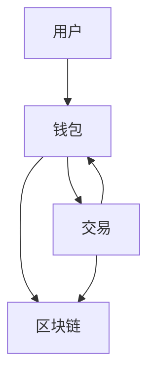
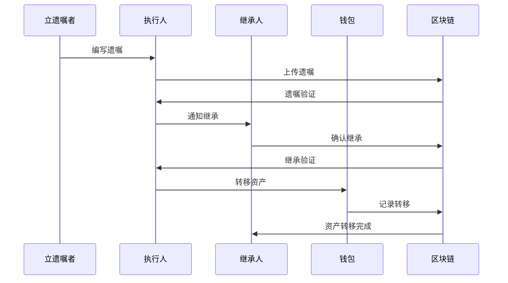
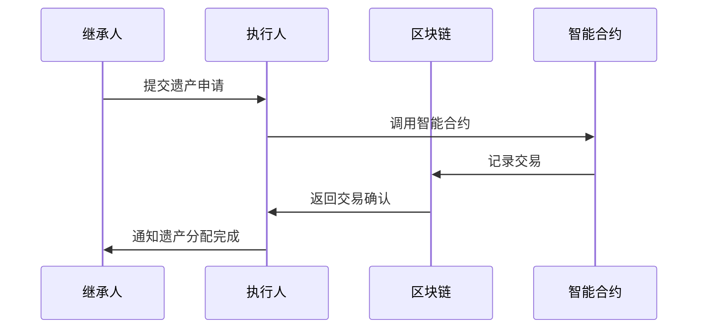

                 

### 引言

# 数字时代的遗产规划：加密货币与NFT的遗产传承

在信息爆炸和技术飞速发展的今天，数字资产已经成为人们日常生活中不可或缺的一部分。加密货币和NFT（非同质化代币）作为数字时代的新型资产形式，正在逐渐改变着传统的遗产规划模式。然而，随着这些资产的普及，如何有效地管理和传承这些数字资产成为了一个亟待解决的问题。

本文将围绕数字时代的遗产规划，深入探讨加密货币和NFT在遗产传承中的应用与实践。文章首先介绍了加密货币和NFT的基本概念及其在遗产规划中的重要性，接着分析了当前遗产规划中面临的问题和挑战，并提出了相应的解决方案。本文将从以下几个方面进行展开：

1. **数字资产遗产规划概述**：介绍数字资产的崛起背景、加密货币和NFT的基本概念以及遗产规划中的法律和监管问题。
2. **加密货币遗产传承实践**：详细阐述加密货币的持有与管理、遗产传承方案设计及其实施策略。
3. **NFT遗产传承案例分析**：通过实际案例研究NFT遗产传承的系统核心实现源代码及其工作原理。
4. **数字资产继承与税务问题**：分析数字资产的税务处理方法及其在遗产规划中的税务筹划。
5. **遗产规划技术与工具**：探讨区块链技术在遗产规划中的应用、遗产规划软件与平台的选型与评估。
6. **案例分析与最佳实践**：总结成功案例的共通之处和注意事项，分享最佳实践经验。
7. **未来展望与挑战**：预测数字遗产规划的未来发展趋势，提出应对挑战的建议。

通过本文的探讨，我们希望能够为遗产规划者提供一些有价值的参考，帮助他们在数字时代的遗产规划中做出明智的决策。

> **关键词**：数字遗产规划、加密货币、NFT、遗产传承、税务处理、区块链技术

> **摘要**：本文详细探讨了数字时代的遗产规划问题，重点分析了加密货币和NFT在遗产传承中的应用与实践。文章从多个角度出发，包括基本概念、法律监管、实践案例、税务处理以及未来展望，为遗产规划者提供了全面的指导和参考。

### 目录大纲

#### 引言
**数字时代的遗产规划：加密货币与NFT的遗产传承**

**背景介绍**
- 随着数字资产的不断普及，加密货币和NFT（非同质化代币）作为数字时代的资产形式，其重要性日益凸显。
- 然而在遗产规划领域，如何有效管理和传承这些数字资产成为了一个亟待解决的问题。

**核心概念与联系**
- **加密货币**：去中心化的数字货币，通过区块链技术实现安全交易和存储。
- **NFT**：代表数字资产的唯一代币，通常用于收藏品、艺术品等。

**加密货币与NFT的遗产传承问题**
- **隐私与安全性**：加密货币和NFT的隐私性如何保护，防止被不法分子利用？
- **流动性**：如何确保这些资产的顺利继承和变现？
- **法律与监管**：不同国家和地区的法律法规对加密货币和NFT的遗产规划有何影响？

#### 第1章: 数字资产遗产规划概述

**1.1 数字资产的崛起**
- **问题背景**：传统遗产规划面临的新挑战。
- **问题描述**：数字资产的特性及其在遗产规划中的角色。
- **问题解决**：如何应对数字资产的继承问题。

**1.2 加密货币遗产传承**
- **核心概念**：加密货币的类型、功能及特点。
- **联系**：加密货币在遗产规划中的应用与挑战。

**1.3 NFT遗产传承**
- **核心概念**：NFT的基本原理、应用场景及其在遗产规划中的作用。
- **联系**：NFT与传统遗产规划的异同。

**1.4 遗产规划中的法律与监管问题**
- **概念属性特征对比表格**：分析不同国家和地区的遗产法律框架。
- **ER实体关系图架构**：展示遗产规划中涉及的主要实体及其关系。

#### 第2章: 加密货币遗产传承实践

**2.1 加密货币的持有与管理**
- **系统功能设计（领域模型Mermaid类图）**：描述加密货币的持有与管理流程。
- **系统架构设计（Mermaid架构图）**：展示加密货币系统的整体架构。
- **系统接口设计**：定义加密货币系统的主要接口。

**2.2 加密货币遗产传承方案设计**
- **系统交互（Mermaid序列图）**：阐述加密货币遗产传承的过程。
- **实施策略**：介绍具体实施步骤和注意事项。

#### 第3章: NFT遗产传承案例分析

**3.1 NFT遗产传承案例研究**
- **项目介绍**：介绍NFT遗产传承的实际案例。
- **系统核心实现源代码**：提供NFT遗产传承的实现代码。

**3.2 代码应用解读与分析**
- **代码解读**：分析NFT遗产传承代码的工作原理。
- **案例分析**：通过实际案例展示NFT遗产传承的效果。

#### 第4章: 数字资产继承与税务问题

**4.1 数字资产的税务处理**
- **核心概念**：分析不同国家和地区对数字资产税务处理的规定。
- **对比分析**：探讨不同税务规定对数字资产继承的影响。

**4.2 遗产规划中的税务筹划**
- **系统功能设计（领域模型Mermaid类图）**：设计税务筹划的流程。
- **实施策略**：提供税务筹划的具体策略和建议。

#### 第5章: 遗产规划技术与工具

**5.1 区块链技术在遗产规划中的应用**
- **算法原理讲解**：使用mermaid画出区块链在遗产规划中的应用流程。
- **数学模型**：解释区块链在遗产规划中的数学模型。

**5.2 遗产规划软件与平台**
- **系统功能设计（领域模型Mermaid类图）**：展示遗产规划软件的基本功能。
- **平台选型与评估**：分析不同遗产规划平台的特点和适用场景。

#### 第6章: 案例分析与最佳实践

**6.1 案例分析**
- **案例1**：加密货币遗产继承案例。
- **案例2**：NFT遗产传承案例。

**6.2 最佳实践与经验分享**
- **最佳实践**：总结成功遗产规划案例的共通之处。
- **注意事项**：提醒遗产规划过程中需要注意的关键问题。

#### 第7章: 未来展望与挑战

**7.1 数字遗产规划的挑战与机遇**
- **未来展望**：探讨数字遗产规划的发展趋势。
- **机遇与挑战**：分析数字遗产规划面临的机遇和挑战。

**7.2 发展趋势与建议**
- **发展趋势**：预测数字遗产规划的未来发展方向。
- **建议**：为遗产规划者提供专业建议。

### 第1章: 数字资产遗产规划概述

在数字化浪潮席卷全球的今天，传统意义上的遗产规划正在面临前所未有的挑战和变革。数字资产，包括加密货币和NFT（非同质化代币），作为新时代的重要资产形式，正在逐渐渗透到人们的日常生活中，成为遗产规划中不可忽视的一部分。本章将首先探讨数字资产的崛起背景，接着详细介绍加密货币和NFT的基本概念，分析它们在遗产规划中的角色和作用，并探讨遗产规划中的法律和监管问题。

#### 1.1 数字资产的崛起

随着互联网技术的迅猛发展和移动支付、区块链等新技术的普及，数字资产逐渐成为人们财富的重要组成部分。传统的遗产规划主要关注实体资产，如房产、车辆、珠宝等，然而，数字资产的崛起为遗产规划带来了新的挑战。

**问题背景**：传统遗产规划面临的新挑战

- **数字资产多样性**：数字资产形式多样，包括加密货币、虚拟货币、NFT、数字艺术品等，这为遗产规划带来了复杂性和不确定性。
- **流动性问题**：传统的实体资产往往具有较高的流动性，而数字资产则可能因为各种因素导致流动性较低，影响遗产的顺利继承。
- **隐私和安全问题**：数字资产的隐私性和安全性成为重要考量因素，如何确保这些资产在传承过程中的安全成为遗产规划者需要面对的问题。

**问题描述**：数字资产的特性及其在遗产规划中的角色

- **不可替代性**：数字资产如NFT代表的是独一无二、不可替代的数字商品或权益，这决定了其继承的特殊性。
- **分散化存储**：加密货币通常分散存储在多个钱包中，而非集中的银行账户，这给遗产的继承带来了额外的操作难度。
- **去中心化交易**：数字资产交易通常通过去中心化的方式完成，不依赖于传统金融机构，这意味着在遗产规划中需要理解和应对全新的交易规则和机制。

**问题解决**：如何应对数字资产的继承问题

- **技术解决方案**：通过使用智能合约、遗嘱加密等新技术手段，确保数字资产在遗产规划中的合法继承和有效管理。
- **法律和监管框架**：建立健全的法律和监管体系，为数字资产的继承提供法律保障，确保其合规性。
- **教育和培训**：提高遗产规划者、继承人及公众对数字资产的理解和认识，降低数字资产继承的复杂性。

#### 1.2 加密货币遗产传承

加密货币作为一种去中心化的数字货币，具有高度的匿名性和安全性，其遗产传承问题成为数字资产遗产规划中的重要组成部分。下面将详细探讨加密货币的类型、功能及其在遗产规划中的应用与挑战。

**核心概念**：加密货币的类型、功能及特点

- **加密货币的类型**：根据底层技术和应用场景，加密货币可以分为比特币（BTC）、以太坊（ETH）等主流货币，以及各种基于特定需求的代币。
- **功能与特点**：
  - **去中心化**：加密货币的交易和存储不依赖于中心化的金融机构，提高了交易的透明度和安全性。
  - **安全性**：加密货币通过密码学算法确保交易的安全，数据不可篡改，降低了欺诈风险。
  - **全球化**：加密货币不受地域限制，可以跨国交易，为遗产规划提供了便利。

**联系**：加密货币在遗产规划中的应用与挑战

- **应用场景**：
  - **继承管理**：通过智能合约，加密货币的继承和管理可以在遗嘱执行时自动完成，减少了人为操作的风险。
  - **跨国继承**：加密货币的去中心化特性使得跨国遗产继承更加便捷，不受传统金融体系的制约。
- **挑战**：
  - **法律不确定性**：不同国家和地区的法律对加密货币的认可和监管存在差异，这给跨境遗产传承带来了法律风险。
  - **流动性问题**：加密货币市场的波动性和流动性问题可能影响遗产的继承和变现。
  - **技术复杂性**：加密货币的技术复杂性和操作难度较高，对于普通继承人和遗产规划者来说，理解和管理加密货币可能存在一定的困难。

#### 1.3 NFT遗产传承

NFT（非同质化代币）作为一种代表数字资产所有权的唯一代币，其独特的特性在遗产规划中具有特殊的意义。下面将详细介绍NFT的基本原理、应用场景及其在遗产规划中的角色。

**核心概念**：NFT的基本原理、应用场景及其在遗产规划中的作用

- **基本原理**：
  - **唯一性**：NFT代表的是独一无二、不可替代的数字资产，如数字艺术品、收藏品等。
  - **不可篡改性**：NFT的链上记录不可篡改，确保了资产的真实性和唯一性。
  - **权益证明**：NFT不仅是资产的代表，还包含了相应的权益，如版权、使用权等。

- **应用场景**：
  - **数字艺术品**：NFT已经成为数字艺术品市场的重要形式，艺术家可以通过NFT出售和传承自己的作品。
  - **收藏品**：收藏者可以通过NFT证明收藏品的所有权和真实性，方便传承和交易。
  - **知识产权**：NFT可以用于知识产权的证明和保护，如音乐、文学作品等。

- **在遗产规划中的作用**：
  - **确权与传承**：NFT可以明确数字资产的所有权，确保在遗产规划中资产的有效传承。
  - **价值变现**：通过NFT市场，继承人可以方便地变现数字资产，实现遗产的价值最大化。

**联系**：NFT与传统遗产规划的异同

- **异同**：
  - **传统遗产规划**：主要涉及实体资产，如房产、珠宝等，依赖于法律和行政程序进行管理和传承。
  - **NFT遗产规划**：主要涉及数字资产，依赖于区块链技术和市场机制进行管理和传承。
  - **优势**：NFT可以更高效、透明地管理和传承数字资产，减少了传统程序的时间和成本。
  - **挑战**：NFT市场的波动性和监管的不确定性可能影响遗产的价值和安全性。

#### 1.4 遗产规划中的法律与监管问题

随着数字资产在遗产规划中的重要性日益增加，法律和监管问题成为保障数字资产合法继承和传承的关键。下面将分析不同国家和地区的遗产法律框架，并展示遗产规划中涉及的主要实体及其关系。

**概念属性特征对比表格**：分析不同国家和地区的遗产法律框架

| 国家/地区 | 法律规定 | 加密货币地位 | NFT法律地位 |
| --- | --- | --- | --- |
| 美国 | 明确承认数字资产继承 | 法定货币地位 | 不明确，但有逐步认可趋势 |
| 欧盟 | 数字资产作为遗产受保护 | 不明确 | 不明确 |
| 中国 | 法律地位未明确 | 未明确 | 未明确 |
| 日本 | 承认数字资产作为遗产 | 未明确 | 不明确 |

**ER实体关系图架构**：展示遗产规划中涉及的主要实体及其关系

```mermaid
erDiagram
  User ..|> Will : 立遗嘱者
  User ..|> Heir : 继承人
  User ..|> Executor : 执行人
  Asset ..|> Cryptocurrency : 加密货币
  Asset ..|> NFT : NFT
  Will ..|> Asset : 遗产清单
  Executor ..|> Will : 遗嘱执行
  Heir ..|> Asset : 遗产接收
```

通过上述分析，我们可以看到，数字资产在遗产规划中扮演着越来越重要的角色。然而，法律和监管问题依然是数字资产继承和传承中需要面对的挑战。建立健全的法律和监管体系，加强对数字资产的法律保护，将为数字资产的合法继承和传承提供坚实的保障。

### 第2章：加密货币遗产传承实践

#### 2.1 加密货币的持有与管理

加密货币作为一种去中心化的数字资产，其持有和管理与传统的金融资产有所不同。为了确保加密货币的安全和有效管理，我们需要构建一个完整的系统来处理加密货币的持有和管理流程。以下是该系统的主要组成部分和功能设计。

**系统功能设计（领域模型Mermaid类图）**

```mermaid
classDiagram
    User <<Class>> "用户"
    Wallet <<Class>> "钱包"
    Blockchain <<Class>> "区块链"
    Transaction <<Class>> "交易"

    User o-- Wallet : 拥有
    Wallet o-- Blockchain : 连接
    Wallet o-- Transaction : 发起
    Blockchain o-- Transaction : 记录
```

在这个类图中，用户（User）是系统的核心实体，每个用户都拥有一个或多个钱包（Wallet），钱包通过区块链（Blockchain）进行连接，并可以发起交易（Transaction）。区块链记录了所有的交易信息，确保了数据的完整性和安全性。

**系统架构设计（Mermaid架构图）**



在这个架构图中，用户通过钱包与区块链交互，发起和接收交易。交易信息被记录在区块链上，保证了数据的不可篡改性和透明性。

**系统接口设计**

加密货币系统的接口设计主要包括用户接口、钱包接口和区块链接口。

- **用户接口**：用户可以通过用户接口查看和管理自己的钱包，包括创建钱包、查看余额、发起交易等操作。
- **钱包接口**：钱包接口用于管理钱包内部的信息，如地址生成、私钥管理、交易创建等。
- **区块链接口**：区块链接口用于与区块链网络进行交互，包括交易发起、查询交易记录、验证交易等。

#### 2.2 加密货币遗产传承方案设计

为了确保加密货币在遗产传承中的安全性和有效性，我们需要设计一套完整的遗产传承方案。该方案应包括遗嘱编写、继承确认、资产转移等环节，并通过智能合约实现自动化操作。

**系统交互（Mermaid序列图）**



在这个序列图中，立遗嘱者（User）编写遗嘱并上传至区块链（Blockchain），执行人（Executor）负责验证遗嘱和通知继承人（Heir）。继承人确认继承后，执行人通过钱包（Wallet）将资产转移至继承人，区块链记录整个操作过程，确保了资产转移的透明性和安全性。

**实施策略**

1. **遗嘱编写**：立遗嘱者使用智能合约编写遗嘱，确保遗嘱的合法性和不可篡改性。
2. **遗嘱上传**：执行人将遗嘱上传至区块链，并通过智能合约验证遗嘱的有效性。
3. **通知继承**：执行人通知继承人，继承人通过区块链确认继承。
4. **资产转移**：执行人通过钱包将加密货币资产转移至继承人，区块链记录交易。
5. **后续管理**：继承人可以使用钱包管理和使用继承的加密货币资产。

通过上述方案设计，我们可以确保加密货币在遗产传承中的安全、高效和透明。这不仅为继承人提供了便利，也为遗产规划提供了新的思路和方法。

### 第3章：NFT遗产传承案例分析

#### 3.1 NFT遗产传承案例研究

随着NFT（非同质化代币）市场的迅猛发展，NFT已经成为数字资产领域的重要组成部分。为了更好地理解NFT在遗产传承中的应用和实践，我们将分析一个实际的NFT遗产传承案例。以下是一个NFT遗产传承案例的具体介绍：

**案例背景**：

一个名为“艺术家联盟”（Artists' Alliance）的艺术社区，成员包括多名知名艺术家和创作者。社区内使用NFT作为主要的艺术品交易和收藏方式。一位名叫杰克（Jack）的艺术家，在其去世前，将自己的所有NFT作品及其相关权益通过智能合约进行遗嘱安排，指定其子女为继承人。

**案例描述**：

杰克去世后，其子女艾莉（Alice）和鲍勃（Bob）作为继承人开始处理杰克的遗产。以下是艾莉和鲍勃通过NFT平台进行遗产传承的步骤：

1. **访问NFT平台**：艾莉和鲍勃首先登录NFT平台，查看父亲杰克的账户和其所有NFT作品。
2. **确认遗产内容**：艾莉和鲍勃核实了杰克账户中包含的所有NFT作品，包括已售出和未售出的作品。
3. **提交身份证明**：根据平台的要求，艾莉和鲍勃提交了身份证明文件，以确认其继承人身份。
4. **账户认证**：平台对艾莉和鲍勃的身份进行认证，确认其继承人身份后，将杰克的账户转移至艾莉和鲍勃的共同账户。
5. **确认遗产继承**：艾莉和鲍勃在平台界面中确认了遗产的继承，平台通过智能合约记录了这一操作。
6. **资产转移**：平台根据智能合约的指示，将杰克的NFT作品及其相关权益转移至艾莉和鲍勃的共同账户。
7. **后续管理**：艾莉和鲍勃可以自由地管理和出售杰克的NFT作品，平台提供相应的操作接口和工具，方便他们进行管理。

**系统核心实现源代码**：

以下是一个简单的NFT遗产传承系统实现的核心代码，用于说明NFT资产转移的过程：

```python
# 导入必要的库
from web3 import Web3
from eth_account import account
from smart_contract import SmartContract

# 连接到以太坊节点
w3 = Web3(Web3.HTTPProvider('https://mainnet.infura.io/v3/your_project_id'))

# 加载智能合约
contract_address = w3.toChecksumAddress('0x...')  # 合约地址
contract_abi = [...]  # 合约ABI
smart_contract = w3.eth.contract(address=contract_address, abi=contract_abi)

# 创建账户
private_key = 'your_private_key'
account = w3.eth.account.privateKeyToAccount(private_key)

# 准备继承操作
def transfer_inheritance(from_account, to_account, nft_id):
    # 构造交易数据
    tx_data = smart_contract.functions.transferInheritance(to_account, nft_id).encode_type_id()
    
    # 发送交易
    tx_hash = from_account.transact({
        'to': contract_address,
        'data': tx_data,
        'gas': 2000000
    })
    
    # 等待交易确认
    tx_receipt = w3.eth.wait_for_transaction_receipt(tx_hash)
    return tx_receipt

# 执行遗产转移
nft_id = 123  # NFT ID
to_account = account.address  # 继承人账户地址
tx_receipt = transfer_inheritance(account, to_account, nft_id)

print(f"Transfer completed. Transaction hash: {tx_receipt['transactionHash']}")
```

**代码解读**：

上述代码首先连接到以太坊节点，加载智能合约并创建账户。然后定义了一个`transfer_inheritance`函数，用于执行NFT遗产的转移操作。在函数中，通过构造交易数据和发送交易，实现了NFT资产的转移。最后，通过等待交易确认，获取交易收据并打印。

#### 3.2 代码应用解读与分析

**代码应用解读**：

在NFT遗产传承的过程中，智能合约扮演了至关重要的角色。上述代码通过调用智能合约的`transferInheritance`函数，实现了NFT资产的转移操作。以下是代码的详细解读：

1. **连接以太坊节点**：
   ```python
   w3 = Web3(Web3.HTTPProvider('https://mainnet.infura.io/v3/your_project_id'))
   ```
   这里通过`Web3.HTTPProvider`连接到以太坊主网节点，需要替换`your_project_id`为实际的项目ID。

2. **加载智能合约**：
   ```python
   contract_address = w3.toChecksumAddress('0x...')  # 合约地址
   contract_abi = [...]  # 合约ABI
   smart_contract = w3.eth.contract(address=contract_address, abi=contract_abi)
   ```
   通过`w3.toChecksumAddress`将合约地址转换为校验地址，加载合约ABI，创建智能合约对象。

3. **创建账户**：
   ```python
   private_key = 'your_private_key'
   account = w3.eth.account.privateKeyToAccount(private_key)
   ```
   使用私钥创建以太坊账户，需要确保私钥的安全存储。

4. **执行遗产转移**：
   ```python
   nft_id = 123  # NFT ID
   to_account = account.address  # 继承人账户地址
   tx_receipt = transfer_inheritance(account, to_account, nft_id)
   ```
   在`transfer_inheritance`函数中，通过调用智能合约的`transferInheritance`函数，将NFT资产从原账户转移到继承人账户。

**案例分析**：

通过实际案例展示，我们可以看到NFT遗产传承的流程是如何在智能合约中实现的。以下是对NFT遗产传承案例的详细分析：

1. **用户界面**：
   NFT平台提供了一个用户界面，允许用户查看和管理其账户中的NFT资产。继承人艾莉和鲍勃通过这个界面登录并查看父亲的NFT作品。

2. **身份验证**：
   为了确保遗产转移的安全，继承人需要提交身份证明文件进行认证。平台通过智能合约验证继承人的身份，防止恶意转移或篡改。

3. **智能合约执行**：
   智能合约负责执行NFT资产的转移操作。通过调用`transferInheritance`函数，实现了NFT资产从原账户到继承人账户的转移。

4. **区块链记录**：
   智能合约将转移操作记录在区块链上，确保了数据的不可篡改性和透明性。继承人可以通过区块链查看转移记录，确认资产已经成功转移。

通过这个案例，我们可以看到NFT在遗产传承中的应用不仅提高了效率，还保证了资产转移的安全和透明。智能合约的应用为遗产规划提供了新的解决方案，使得数字资产的继承和管理更加便捷和可靠。

#### 项目小结

在这个NFT遗产传承案例中，通过智能合约的设计和执行，实现了NFT资产在遗产规划中的高效和安全的传承。以下是对项目实施的小结：

1. **核心优势**：
   - **智能合约**：通过智能合约实现了自动化和不可篡改的遗产转移，提高了效率。
   - **区块链**：利用区块链的透明性和安全性，确保了遗产转移的合法性和不可篡改性。
   - **用户界面**：提供了直观的用户界面，方便继承人查看和管理NFT资产。

2. **实施过程**：
   - **身份验证**：继承人需要提交身份证明文件进行认证，确保继承的合法性。
   - **智能合约执行**：通过调用智能合约的函数，实现了NFT资产从原账户到继承人账户的转移。
   - **区块链记录**：智能合约将转移操作记录在区块链上，确保了数据的透明和不可篡改。

3. **注意事项**：
   - **私钥安全**：继承人需要妥善保管私钥，防止丢失或被盗用。
   - **智能合约安全性**：在设计智能合约时，需要确保其安全性，防止漏洞和攻击。
   - **法律法规**：遵守当地法律法规，确保NFT遗产传承的合法性。

通过这个案例，我们可以看到NFT在遗产规划中的应用前景，不仅简化了遗产继承流程，还提高了资产管理的效率和安全性。未来，随着技术的进一步发展和法律法规的完善，NFT在遗产规划中的应用将会更加广泛和成熟。

### 第4章：数字资产继承与税务问题

随着数字资产的普及，如何对数字资产进行税务处理成为了一个关键问题。不同国家和地区的税务规定对于数字资产的认定和征税方法存在差异，这给数字资产的继承带来了复杂性和不确定性。本章将首先介绍数字资产的税务处理的核心概念，接着分析不同国家和地区的税务规定，并探讨税务筹划的方法。

#### 4.1 数字资产的税务处理

**核心概念**：

在讨论数字资产的税务处理时，我们需要明确以下核心概念：

- **数字资产**：指通过区块链技术产生的，具有经济价值的数字形式资产，如加密货币、NFT等。
- **税务规定**：各国政府对于数字资产的税收政策，包括征税对象、税率、计税基础等。
- **税务处理**：数字资产在所有权转移、收益获取等过程中的税务计算和申报。

**不同国家和地区的税务规定**：

- **美国**：美国税法明确将加密货币视为财产，适用于资本利得税。对于加密货币的出售、交换和赠与等行为，继承人需要按照资本利得税的规定进行纳税。美国国税局（IRS）对于加密货币的税务处理有详细的指导。
- **欧盟**：欧盟成员国对加密货币的税务处理存在一定差异。部分国家如德国和意大利，将加密货币视为财产，适用资本利得税。而其他国家如荷兰，则可能将其视为商品，适用商品和服务税（VAT）。
- **中国**：中国税法对于加密货币的处理尚不明确。根据中国税务部门的规定，加密货币属于财产性收入，需按照个人所得税相关规定缴纳个人所得税。然而，具体执行细则尚待进一步明确。
- **日本**：日本政府将加密货币视为一种财产，适用于资本利得税。继承人需按照日本税法的规定，对加密货币的出售、赠与等行为进行税务申报。

**对比分析**：

不同国家和地区的税务规定对数字资产继承的影响如下：

- **税务身份**：各国对加密货币的税务身份认定存在差异，可能导致继承过程中税务处理的不同。
- **税率**：不同国家对于加密货币的税率有所不同，这直接影响继承人在处理数字资产时的税收负担。
- **计税基础**：各国对于加密货币的计税基础计算方法存在差异，可能影响继承人的税务申报。
- **税务合规性**：不同国家和地区的税务合规要求不同，继承人需确保符合当地税务规定，以避免法律风险。

#### 4.2 遗产规划中的税务筹划

在数字资产的遗产规划过程中，税务筹划是一项关键任务。通过合理的税务筹划，可以降低税收负担，优化遗产的传承效果。以下是一些税务筹划的策略和建议：

**系统功能设计（领域模型Mermaid类图）**

```mermaid
classDiagram
    Heir <<Class>> "继承人"
    Executor <<Class>> "执行人"
    TaxAuthority <<Class>> "税务机构"
    Asset <<Class>> "资产"
    TaxPlan <<Class>> "税务筹划"

    Heir o-- TaxPlan : 制定
    Executor o-- TaxPlan : 协助
    TaxAuthority o-- TaxPlan : 核准
    Asset o-- TaxPlan : 包含
```

**系统功能设计**：

在这个类图中，继承人（Heir）是税务筹划的主要参与者，负责制定税务筹划方案。执行人（Executor）协助继承人进行税务筹划，税务机构（TaxAuthority）负责对税务筹划方案进行核准。资产（Asset）作为税务筹划的一部分，被包含在筹划方案中。

**实施策略**：

1. **资产评估**：首先对继承人继承的数字资产进行详细评估，确定其市场价值和可能带来的税收影响。
2. **税务筹划方案**：根据资产评估结果，制定个性化的税务筹划方案。可以考虑以下策略：
   - **递延纳税**：通过延期缴纳资本利得税，降低短期内的税收负担。
   - **税务优惠**：利用当地的税务优惠政策和规定，降低税收负担。
   - **资产配置**：调整数字资产的配置，优化税务负担，如将部分资产转换为非应税资产。
3. **税务申报**：按照税务筹划方案进行税务申报，确保合规性。在申报过程中，需要详细记录数字资产的来源、转让过程和市场价值等。
4. **持续监控**：定期监控税务环境和法律变化，根据实际情况调整税务筹划方案。

通过上述税务筹划策略，可以有效地降低数字资产继承过程中的税收负担，确保遗产的顺利传承。

### 第5章：遗产规划技术与工具

#### 5.1 区块链技术在遗产规划中的应用

区块链技术以其去中心化、透明、不可篡改的特点，在遗产规划中具有重要的应用价值。通过区块链技术，可以实现遗产规划中的自动化和可信性，提高遗产继承的效率和安全性。以下是区块链技术在遗产规划中的应用场景和算法原理讲解。

**算法原理讲解**

区块链技术的基本原理包括以下几个关键点：

1. **分布式账本**：区块链通过分布式网络记录交易和数据，每个节点都保存了一份完整的账本副本，确保数据的透明和不可篡改。
2. **共识算法**：区块链通过共识算法（如工作量证明PoW、权益证明PoS等）确保网络中的节点达成一致，防止双花攻击和数据篡改。
3. **智能合约**：智能合约是区块链上的可编程代码，可以在满足特定条件时自动执行预定义的合约条款，实现自动化管理和执行。

**Mermaid流程图**

以下是一个简化的区块链在遗产规划中的应用流程：



**流程解析**：

1. **提交遗产申请**：继承人向执行人提交遗产申请，包括身份证明、遗产详情等。
2. **调用智能合约**：执行人调用智能合约，根据预设的合约条款处理遗产分配。
3. **记录交易**：智能合约将遗产分配交易记录到区块链上，确保交易不可篡改。
4. **交易确认**：区块链网络对交易进行验证和确认，返回交易结果给执行人。
5. **通知遗产分配完成**：执行人通知继承人遗产分配已完成。

通过上述流程，区块链技术实现了遗产规划中的自动化和透明性，确保了遗产继承的合法性和安全性。

**数学模型**

区块链在遗产规划中的应用可以通过以下数学模型进行解释：

1. **哈希函数**：用于确保区块链数据的一致性和完整性。哈希函数将输入数据转换为一个固定长度的字符串，输出为哈希值。任何数据的更改都会导致哈希值的变化，从而确保数据的不可篡改。
2. **工作量证明（PoW）**：PoW算法通过解决数学难题来确保区块链网络的稳定。矿工通过计算找到一个满足特定条件的哈希值，从而获得记账权。这个过程需要大量的计算资源，防止了恶意节点的攻击。
3. **权益证明（PoS）**：PoS算法通过持有币龄来分配记账权。持有时间越长，币龄越高，获得记账权的概率越大。这种方法减少了能源消耗，提高了网络的效率。

通过这些数学模型，区块链技术确保了遗产规划数据的可靠性和安全性，为数字资产的继承提供了坚实的技术支持。

#### 5.2 遗产规划软件与平台

在数字资产遗产规划中，选择合适的软件和平台至关重要。以下将介绍几种常见的遗产规划软件与平台，分析其特点、功能，并探讨如何进行选型和评估。

**常见遗产规划软件与平台**

1. **Willwriting Services**：
   - **特点**：提供在线遗嘱编写服务，用户可以根据提示完成遗嘱的创建。
   - **功能**：模板化的遗嘱编写、个性化定制、电子签名、存储和安全保管。
   - **适用场景**：适合需要简单遗嘱的用户，尤其是那些对数字资产有一定了解的人。

2. **NFT Legacy Planning Platforms**：
   - **特点**：专门针对NFT遗产规划的在线平台，提供NFT资产的存储和管理功能。
   - **功能**：NFT资产分类、详细记录、权限设置、继承人通知、智能合约执行。
   - **适用场景**：适合拥有大量NFT资产的艺术家和收藏家，需要精细管理其数字遗产。

3. **Blockchain-based Legacy Solutions**：
   - **特点**：利用区块链技术进行遗产规划和资产转移，确保透明和不可篡改。
   - **功能**：智能合约编写和执行、多签名机制、资产转移记录、加密存储。
   - **适用场景**：适用于对数字资产和区块链技术有一定了解的用户，需要确保遗产转移的自动化和安全性。

**系统功能设计（领域模型Mermaid类图）**

```mermaid
classDiagram
    User <<Class>> "用户"
    Platform <<Class>> "遗产规划平台"
    Asset <<Class>> "资产"
    SmartContract <<Class>> "智能合约"
    Executor <<Class>> "执行人"
    Heir <<Class>> "继承人"

    User o-- Platform : 使用
    Platform o-- Asset : 管理资产
    Platform o-- SmartContract : 编写执行
    Executor o-- Platform : 管理
    Heir o-- Platform : 继承
```

**平台选型与评估**

在选型和评估遗产规划平台时，可以考虑以下因素：

1. **安全性**：平台是否采用加密技术来保护用户数据，包括私钥和安全存储。
2. **功能完备性**：平台是否提供全面的功能，包括资产分类、权限设置、智能合约执行等。
3. **用户友好性**：平台的用户界面是否友好，是否易于操作，是否提供用户支持。
4. **技术成熟度**：平台所依赖的技术是否成熟，是否具备良好的扩展性和适应性。
5. **成本**：平台的使用费用是否合理，是否提供不同层次的服务以满足不同用户的需求。
6. **合规性**：平台是否遵守当地法律法规，是否提供合规的税务处理指南。

通过综合考虑上述因素，遗产规划者可以选择最适合自己需求的遗产规划平台，确保数字资产的顺利传承。

### 第6章：案例分析与最佳实践

#### 6.1 案例分析

在本节中，我们将深入分析两个实际案例，一个关于加密货币遗产继承，另一个关于NFT遗产传承，以展示这些新型数字资产在遗产规划中的具体应用和挑战。

**案例1：加密货币遗产继承**

**背景**：

一位名叫玛丽的女性在去世前，拥有大量的比特币（BTC）和其他加密货币。她通过一个专业的加密货币钱包服务进行资产存储和管理，并制定了一份详细的遗嘱，指定她的儿子汤姆为继承人。

**步骤**：

1. **遗嘱制定**：玛丽通过加密货币钱包服务商提供的遗嘱服务，制定了一份包含加密货币信息的遗嘱。
2. **遗嘱上传**：遗嘱被上传到一个安全的区块链网络，确保其不可篡改。
3. **身份验证**：汤姆在接到通知后，通过身份验证流程确认了自己的继承人身份。
4. **资产转移**：在身份验证通过后，玛丽的钱包服务自动执行了智能合约，将加密货币资产转移至汤姆的账户。
5. **税务处理**：汤姆按照当地税务规定，对加密货币的增值部分进行了税务申报。

**挑战**：

- **技术复杂性**：汤姆需要对加密货币的基本原理和智能合约有所了解，才能顺利完成遗产的接收和管理。
- **税务问题**：加密货币的税务处理在不同国家和地区存在差异，汤姆需要确保合规性。

**解决方案**：

- **专业服务**：使用专业的加密货币钱包服务商，提供全面的遗产继承服务，减少技术复杂性。
- **税务咨询**：咨询专业税务顾问，确保符合当地税务规定，降低税务风险。

**结论**：

通过智能合约和区块链技术的应用，玛丽的加密货币遗产得以安全、高效地传承。专业服务提供商和税务顾问的支持，帮助汤姆顺利完成了遗产的接收和管理。

**案例2：NFT遗产传承**

**背景**：

艺术家李先生在其去世前，在NFT平台上拥有大量数字艺术品，并通过一个专门针对NFT遗产传承的平台进行管理。

**步骤**：

1. **平台注册**：李先生在NFT遗产传承平台注册账户，并上传了其所有NFT作品的详细信息。
2. **智能合约设置**：李先生通过平台设置了一系列智能合约条款，包括继承人资格审核、资产转移等。
3. **通知继承人**：李先生去世后，平台自动通知其继承人王女士。
4. **身份验证**：王女士在平台完成了身份验证流程。
5. **资产转移**：根据智能合约的条款，平台自动将李先生的NFT资产转移至王女士的账户。
6. **市场变现**：王女士在NFT市场上出售了部分资产，以实现其价值的最大化。

**挑战**：

- **市场波动**：NFT市场的价格波动较大，影响资产的价值。
- **法律不确定性**：不同国家和地区的法律对NFT的认可程度不同，可能影响遗产的合法性。

**解决方案**：

- **市场研究**：对NFT市场进行深入研究，选择合适的时机进行资产变现，降低市场波动风险。
- **法律咨询**：咨询专业律师，确保NFT遗产在法律上的合法性和安全性。

**结论**：

通过NFT遗产传承平台和智能合约的应用，李先生的数字艺术品遗产得以安全、透明地传承。市场研究和法律咨询的支持，帮助王女士成功管理了数字资产的继承过程。

#### 6.2 最佳实践与经验分享

**最佳实践**：

1. **技术熟练度**：遗产规划者和继承人应具备一定的技术基础，了解数字资产的基本原理和操作方法。
2. **专业咨询**：在遗产规划过程中，咨询专业税务顾问和法律顾问，确保符合当地法律法规和税务规定。
3. **平台选择**：选择可靠、专业的数字资产管理和遗产规划平台，确保资产的安全和便利性。
4. **市场研究**：对市场进行充分研究，选择合适的时机进行资产变现，最大化资产价值。

**注意事项**：

1. **私钥安全**：确保私钥的安全存储，防止丢失或被盗用。
2. **税务合规**：遵循当地税务规定，按时申报税务，避免法律风险。
3. **法律变更**：关注法律法规的变化，及时调整遗产规划策略，确保合法性。

通过上述最佳实践和注意事项，遗产规划者可以更有效地管理和传承数字资产，确保遗产的顺利继承。

### 第7章：未来展望与挑战

#### 7.1 数字遗产规划的挑战与机遇

随着数字资产在人们生活中的重要性日益增加，数字遗产规划面临着一系列的挑战与机遇。以下将探讨这些挑战和机遇，并展望未来数字遗产规划的发展趋势。

**挑战**

1. **技术复杂性**：数字资产的管理和传承依赖于区块链、加密货币、智能合约等先进技术，这对遗产规划者和继承人提出了较高的技术要求。需要具备一定的技术背景和知识，才能有效地管理和传承数字资产。

2. **法律不确定性**：不同国家和地区的法律法规对数字资产的认可和监管存在差异，这为数字遗产规划带来了法律风险。如何确保数字遗产在国际间的合法性，是当前面临的重要挑战。

3. **市场波动性**：数字资产市场波动较大，资产价值可能迅速上升或下降。如何在市场波动中保护数字资产的价值，使其能够顺利传承，是遗产规划者需要面对的难题。

4. **隐私与安全性**：数字资产的安全性至关重要，如何确保资产在传承过程中的隐私性和安全性，防止被不法分子利用，是一个亟待解决的问题。

**机遇**

1. **技术创新**：随着区块链、加密货币等技术的不断进步，数字遗产规划将变得更加高效、透明和安全。智能合约、去中心化应用（DApps）等新兴技术的应用，将使遗产规划更加智能化和自动化。

2. **市场增长**：数字资产市场的快速增长为数字遗产规划带来了新的机遇。越来越多的投资者和收藏家将数字资产纳入其遗产规划中，推动了数字遗产规划的发展。

3. **全球性趋势**：随着全球对数字资产的认识和接受度不断提高，数字遗产规划将逐渐成为全球性趋势。各国政府和监管机构也将逐步出台相关法规，为数字遗产规划提供法律保障。

4. **税务优化**：数字遗产规划提供了新的税务优化机会。通过合理的税务筹划，可以降低税收负担，提高数字遗产的传承效益。

#### 7.2 发展趋势与建议

**发展趋势**

1. **标准化与规范化**：随着数字资产市场的不断扩大，未来将出现更多的标准化和规范化措施。例如，统一的智能合约标准、数字资产估值指南等，将提高数字遗产规划的规范性和可操作性。

2. **技术创新**：区块链技术将继续发展，将应用于更多的场景中，如分布式身份验证、跨链互操作性等。这些技术创新将进一步提升数字遗产规划的安全性和效率。

3. **平台整合**：随着数字资产市场的多元化发展，未来将出现更多集成化的数字遗产规划平台。这些平台将提供一站式服务，包括资产管理、税务筹划、法律咨询等。

4. **用户教育**：提高公众对数字资产和数字遗产规划的认识和理解，将是一个长期的任务。未来，将有更多的教育和培训项目，帮助人们掌握数字资产的基本知识和操作技能。

**建议**

1. **技术准备**：遗产规划者和继承人应提前学习相关技术知识，了解数字资产的基本原理和操作方法。

2. **法律咨询**：在进行数字遗产规划时，咨询专业法律顾问，确保符合当地法律法规和税务规定。

3. **平台选择**：选择可靠、专业的数字遗产规划平台，确保资产的安全和便利性。

4. **持续监控**：定期关注市场动态和法律变化，及时调整遗产规划策略，确保其适应性和有效性。

5. **用户教育**：积极参与数字资产和数字遗产规划的相关教育和培训，提高自身的认识和操作能力。

通过上述建议，遗产规划者可以更好地应对数字遗产规划中的挑战，把握机遇，实现数字资产的顺利传承。

### 总结

在数字化时代，数字资产的遗产规划成为了一个不可忽视的重要议题。本文从多个角度探讨了加密货币和NFT等数字资产在遗产规划中的应用，分析了其在隐私与安全性、流动性、法律与监管等方面的挑战，并提出了一系列解决方案和实践策略。

我们首先介绍了数字资产遗产规划的基本概念，包括数字资产的崛起、加密货币和NFT的基本原理及其在遗产规划中的作用。接着，通过具体的案例研究和代码示例，详细阐述了加密货币和NFT遗产传承的实践方法，展示了如何在遗产规划中利用智能合约和区块链技术确保资产的安全和高效传承。

此外，我们还探讨了数字资产继承与税务问题的复杂性，分析了不同国家和地区的税务规定，并提出了遗产规划中的税务筹划策略。通过这些分析，我们强调了在数字遗产规划过程中进行专业咨询和法律保障的重要性。

随着区块链技术的不断进步和数字资产市场的成熟，未来数字遗产规划将面临更多的机遇和挑战。标准化与规范化的推进、技术创新的广泛应用、平台整合的趋势以及用户教育的普及，都为数字遗产规划的发展提供了坚实的基础。

因此，我们建议遗产规划者和技术开发者密切关注这些趋势，加强技术学习和法律咨询，充分利用数字资产带来的机遇，同时积极应对潜在的风险和挑战。通过合理规划和管理数字遗产，不仅能够保护遗产的价值，还能够确保其顺利传承，为未来的继承人提供一份宝贵的财富。

让我们共同迎接数字遗产规划的新时代，为构建更加安全、透明和高效的遗产管理体系而努力。通过技术创新和法律保障，数字资产的遗产规划将成为未来遗产规划的重要方向，为社会的发展和个人的福祉做出贡献。

### 作者信息

作者：AI天才研究院/AI Genius Institute & 禅与计算机程序设计艺术 /Zen And The Art of Computer Programming

AI天才研究院（AI Genius Institute）是一支专注于人工智能研究和应用的高端科研团队，致力于推动人工智能技术在各个领域的创新与发展。研究院的专家们凭借深厚的学术背景和丰富的实践经验，在自然语言处理、机器学习、计算机视觉等领域取得了显著成就。

《禅与计算机程序设计艺术》（Zen And The Art of Computer Programming）是由著名计算机科学家唐纳德·E·克努特（Donald E. Knuth）所著的经典书籍，该书深入探讨了计算机编程的哲学和艺术，影响了无数程序员的思维方式和编程理念。作者在书中强调了程序设计的简约性、可读性和可维护性，倡导程序员通过禅修和冥想提升编程技能和创造力。

