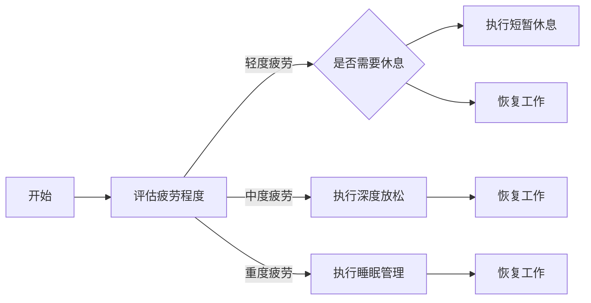
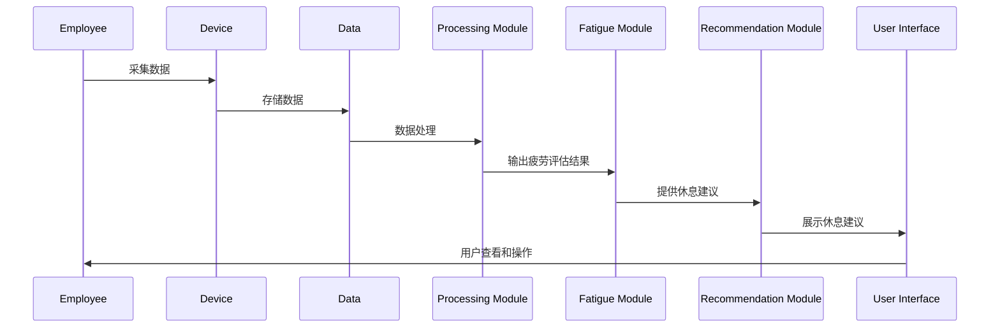

                 

### 第一部分：背景介绍

#### 1.1 问题的提出

在当今这个数字时代，人们的工作和生活节奏日益加快，数字化信息的处理和传递成为日常生活的重要组成部分。然而，随之而来的是巨大的工作压力和高度的集中注意力需求。这种高强度的脑力劳动，往往导致身体和心理上的疲劳，进而影响工作效率和生活质量。传统的休息方式，如短暂的休息、休息时间的放松，往往并不能有效缓解这种疲劳，有时甚至会导致疲劳积累和身心健康问题。

为了解决这一问题，我们需要从脑科学的角度出发，重新审视休息的意义和方法。脑科学研究表明，适当的休息对于大脑功能的恢复、认知能力的提升和情绪的调节具有重要意义。高效的休息不仅可以帮助我们更好地应对工作压力，还能提高整体的工作效率和生活质量。因此，研究数字时代的高效休息法，对于提升个体和团队的工作效能具有重要意义。

#### 1.2 问题的解决

本书旨在通过脑科学的研究成果，探讨数字时代的高效休息方法，旨在解决以下几个核心问题：

1. **脑科学基础知识**：介绍脑科学的基本概念、结构和功能，为读者提供必要的理论基础。
2. **疲劳与休息的关系**：分析疲劳的产生机制，以及休息对缓解疲劳的作用，探讨如何通过科学的方法提高休息质量。
3. **高效休息方法**：结合脑科学研究，介绍一系列高效的休息方法，如深度放松、冥想、睡眠管理等，帮助读者找到适合自己的高效休息方式。
4. **工作与休息的平衡**：探讨如何在工作与休息之间找到平衡，提高工作效率和生活质量。
5. **实践案例分析**：通过实际案例，分析高效休息对个人工作绩效和身心健康的影响。

本书将围绕上述问题进行深入探讨，旨在为读者提供一套科学、实用的高效休息策略和工作效率优化方案。

#### 1.3 边界与外延

虽然本书主要关注高效休息在工作场景中的应用，但高效休息的理念和方法同样适用于其他生活场景，如学习、家庭生活和娱乐等。此外，书中提到的脑科学原理和方法也可应用于其他健康和幸福研究领域，如运动、饮食和心理健康等。

#### 1.4 概念结构与核心要素组成

为了使读者能够更好地理解本书的内容，我们将其核心概念和要素分为以下几个部分：

1. **脑科学基础知识**：包括大脑结构与功能、神经递质与信号传递、脑电波与意识状态等基本概念。
2. **疲劳与休息的关系**：探讨疲劳的产生机制、休息的作用以及如何评估休息质量。
3. **高效休息方法**：介绍深度放松、冥想、睡眠管理等高效休息方法。
4. **工作与休息的平衡**：讨论如何在工作与休息之间找到平衡，提高工作效率和生活质量。
5. **实践案例分析**：通过实际案例，分析高效休息对个人工作绩效和身心健康的影响。

#### 1.5 本章小结

本章对数字时代高效休息法的核心概念和问题进行了概述，为后续章节的讨论奠定了基础。在接下来的章节中，我们将深入探讨这些核心概念，并提供实用的方法，帮助读者实现高效休息，优化工作效率。

----------------------------------------------------------------

## 第二部分：核心概念与联系

### 2.1 脑科学基础知识

#### 2.1.1 大脑结构与功能

大脑作为人类思维、情感和行为的控制中心，其结构和功能复杂多样。以下是大脑的主要结构及其功能：

1. **大脑皮层**：
   - 功能：负责思考、感知和运动控制。
   - 特点：大脑皮层是最外层的灰质层，包含大量的神经元，负责处理高级认知功能。

2. **小脑**：
   - 功能：协调运动和平衡。
   - 特点：小脑位于大脑的后下方，由大量的神经元组成，负责精细运动控制和平衡调节。

3. **脑干**：
   - 功能：负责基本的生命活动，如呼吸和心跳。
   - 特点：脑干连接大脑和脊髓，是生命维持的关键部分，包括延髓、脑桥和中脑。

4. **间脑**：
   - 功能：调节体内平衡和内分泌系统。
   - 特点：包括下丘脑、垂体等结构，负责调节体温、饥饿感、情感和激素分泌。

#### 2.1.2 神经递质与信号传递

神经递质是神经元之间传递信息的化学物质，它们在大脑的信号传递过程中起着至关重要的作用。以下是主要的神经递质及其作用：

1. **多巴胺**：
   - 功能：与奖励和愉悦感相关。
   - 特点：多巴胺的增加通常与积极情绪和行为相关，如愉悦、奖励和动机。

2. **去甲肾上腺素**：
   - 功能：与警觉性和压力反应相关。
   - 特点：去甲肾上腺素在应激反应中发挥作用，提高心率和血压，增强警觉性。

3. **血清素**：
   - 功能：与情绪稳定和睡眠相关。
   - 特点：血清素的增加有助于情绪稳定，减少焦虑和抑郁情绪。

神经递质的释放和作用机制涉及多个复杂的步骤，包括神经元的兴奋、神经递质的合成、释放、结合受体和分解等。

#### 2.1.3 脑电波与意识状态

脑电波是大脑神经元群体活动的电生理表现，不同的脑电波模式与不同的意识状态相关联。以下是主要的脑电波类型及其特点：

1. **α波**：
   - 功能：与放松状态相关。
   - 特点：α波通常在放松和冥想状态下出现，与大脑的清醒度降低有关。

2. **β波**：
   - 功能：与清醒和注意力集中状态相关。
   - 特点：β波在清醒、专注和活跃的状态下最为常见，与认知活动和大脑的清醒度密切相关。

3. **θ波**：
   - 功能：与深度放松和梦境相关。
   - 特点：θ波通常在深度放松、睡眠和梦境状态下出现，与大脑的低清醒度和记忆加工相关。

4. **δ波**：
   - 功能：与睡眠状态相关。
   - 特点：δ波在深度睡眠状态下最为常见，与大脑的低清醒度和身体恢复相关。

脑电波的测量和分析为研究大脑功能和意识状态提供了重要的工具。

### 2.2 疲劳与休息的关系

#### 2.2.1 疲劳的产生机制

疲劳是身体和大脑在长时间工作或活动后产生的生理和心理状态。疲劳的产生机制包括以下几个方面：

1. **能量消耗**：
   - 在长时间的工作或活动中，大脑和身体需要消耗大量的能量来维持功能。随着能量的消耗，疲劳感逐渐增加。

2. **神经递质失衡**：
   - 神经递质的失衡可能导致疲劳感的增加。例如，多巴胺水平的降低可能导致动力和奖励感的减少，进而增加疲劳感。

3. **大脑缺氧**：
   - 长时间的工作或活动可能导致大脑缺氧，影响大脑的正常功能，导致疲劳感的增加。

4. **肌肉疲劳**：
   - 身体长时间处于工作状态，肌肉会逐渐疲劳，导致身体感到疲劳。

#### 2.2.2 休息的作用

休息对缓解疲劳具有重要作用，其主要作用包括以下几个方面：

1. **能量恢复**：
   - 休息期间，身体和大脑可以恢复消耗的能量，从而缓解疲劳感。

2. **神经递质平衡**：
   - 休息可以帮助神经递质恢复平衡，例如，多巴胺水平的提升可以增加动力和奖励感，减少疲劳感。

3. **大脑氧气供应**：
   - 休息期间，大脑的氧气供应得到改善，有助于大脑恢复功能，减少疲劳感。

4. **肌肉恢复**：
   - 休息可以帮助肌肉恢复活力，减少肌肉疲劳，缓解身体疲劳感。

#### 2.2.3 休息质量评估

如何评估休息质量是提高工作效率的关键。以下是一些常用的评估方法：

1. **主观评估**：
   - 通过自我感知来评估休息质量，如感觉是否轻松、精神是否焕发。

2. **生理指标**：
   - 通过测量生理指标如心率、血压、体温等来评估休息质量。

3. **脑电波监测**：
   - 通过监测脑电波的变化来评估休息质量，如α波和θ波的比例变化。

4. **睡眠质量评估**：
   - 通过睡眠质量评估工具来评估休息质量，如睡眠持续时间、深度和睡眠周期等。

### 2.3 高效休息方法

为了提高休息质量，我们需要采取一系列高效的休息方法。以下是几种常见的高效休息方法：

1. **深度放松**：
   - 通过深呼吸、渐进性肌肉放松等技巧，达到身体和心灵的深度放松状态。

2. **冥想**：
   - 通过专注呼吸、正念练习等方式，减少大脑的活动，达到心灵的平静和放松。

3. **睡眠管理**：
   - 通过建立规律的睡眠习惯、改善睡眠环境等方法，提高睡眠质量。

4. **短暂休息**：
   - 在工作和学习过程中，通过短暂的休息，如闭眼休息、做简短的运动等方式，缓解疲劳。

### 2.4 工作与休息的平衡

工作与休息的平衡是提高工作效率和生活质量的关键。以下是几种实现工作与休息平衡的方法：

1. **时间管理**：
   - 通过有效的时间管理方法，如优先级排序、时间块划分等，合理规划工作和休息时间。

2. **休息策略**：
   - 制定合理的休息策略，如定时休息、交替工作等，确保工作和休息的平衡。

3. **身心调节**：
   - 通过身心调节方法，如瑜伽、冥想、按摩等，缓解工作压力，提高休息质量。

4. **健康生活方式**：
   - 通过健康的生活方式，如合理饮食、适量运动等，提高身体健康，增强工作与休息的平衡能力。

### 2.5 本章小结

本章介绍了数字时代高效休息法研究所的核心概念与联系，包括脑科学基础知识、疲劳与休息的关系、高效休息方法和工作与休息的平衡。通过这些核心概念的理解，读者可以更好地理解高效休息的重要性，并在实际生活中应用这些方法，提高工作效率和生活质量。

----------------------------------------------------------------

### 2.6 脑科学概念属性特征对比表格

为了更清晰地理解脑科学中的核心概念，我们可以通过一个属性特征对比表格来展示不同概念之间的差异。以下是一个示例表格，列出了大脑结构、神经递质和脑电波的一些关键属性特征：

| 概念         | 属性特征                     | 对比说明                                       |
| ------------ | ---------------------------- | ---------------------------------------------- |
| 大脑皮层     | 高级认知功能、感知、运动控制 | 负责处理复杂的信息和决策，与其他大脑结构互联     |
| 小脑         | 运动协调、平衡               | 主要负责协调肌肉活动，与其他大脑结构有交互作用   |
| 脑干         | 呼吸、心跳                   | 维持基本的生命活动，连接大脑和脊髓               |
| 下丘脑       | 内分泌调节、体温、情绪       | 调节体内平衡，与大脑其他部分有密切联系           |
| 多巴胺       | 奖励、愉悦感                 | 与动力和愉悦感相关，影响行为和情绪               |
| 去甲肾上腺素 | 警觉性、压力反应             | 增加心率和血压，提高警觉性和注意力               |
| 血清素       | 情绪稳定、睡眠               | 减少焦虑和抑郁情绪，有助于睡眠和情绪稳定         |
| α波         | 放松状态                     | 通常在放松和冥想状态下出现，与大脑清醒度降低有关 |
| β波         | 清醒和注意力集中             | 与认知活动和大脑清醒度密切相关                 |
| θ波         | 深度放松、梦境               | 通常在深度放松和睡眠状态下出现，与记忆加工相关   |
| δ波         | 深度睡眠                     | 在深度睡眠状态下最为常见，与身体恢复相关         |

通过这个表格，我们可以更直观地了解不同脑科学概念之间的联系和区别，从而更好地理解大脑的复杂性和功能。

### 2.7 脑科学核心概念ER实体关系图架构

为了进一步理解脑科学中的核心概念及其相互关系，我们可以使用Mermaid语言绘制一个ER（实体关系）图。以下是该ER图的Mermaid语法表示：

```mermaid
erDiagram
    A[--|>B{ 大脑皮层 }
    B|--|>C{ 小脑 }
    B|--|>D{ 脑干 }
    B|--|>E{ 下丘脑 }
    F{ 神经递质 }|--|>G{ 多巴胺 }
    F|--|>H{ 去甲肾上腺素 }
    F|--|>I{ 血清素 }
    J{ 脑电波 }|--|>K{ α波 }
    J|--|>L{ β波 }
    J|--|>M{ θ波 }
    J|--|>N{ δ波 }
```

通过这个ER图，我们可以清晰地看到大脑的主要结构、神经递质和脑电波之间的关系。大脑皮层、小脑、脑干和下丘脑作为大脑的主要结构，相互之间有直接的联系；神经递质多巴胺、去甲肾上腺素和血清素分别与大脑的不同部分有联系，影响行为、情绪和生理功能；脑电波α、β、θ和δ则分别与不同的意识状态相关联，反映大脑的生理活动。

### 2.8 本章小结

本章通过对比表格和ER实体关系图，详细介绍了脑科学中的核心概念及其属性特征。通过对大脑结构、神经递质和脑电波的理解，读者可以更深入地认识大脑的复杂性和功能，为后续章节关于高效休息和工作效率优化的讨论奠定基础。这些核心概念的理解对于实际应用和科学实践具有重要意义，有助于我们更好地应用脑科学知识，提升生活质量和工作效率。

----------------------------------------------------------------

### 第三部分：算法原理讲解

#### 3.1 算法mermaid流程图

为了更好地理解高效休息算法的原理，我们可以使用Mermaid语言绘制一个流程图，展示算法的执行过程。以下是算法流程图的Mermaid表示：



在这个流程图中，我们从评估疲劳程度开始，根据评估结果决定是否需要执行休息。如果疲劳程度较低，则执行短暂休息；如果疲劳程度较高，则根据具体情况执行深度放松或睡眠管理，然后恢复工作。

#### 3.2 算法原理

该高效休息算法的原理主要基于脑科学的研究成果，特别是关于疲劳产生机制和休息作用的理解。算法的核心思想是通过实时评估疲劳程度，并采取相应的休息措施，从而优化工作效率。

1. **疲劳评估**：
   - 算法首先通过生理和心理指标（如心率、血压、情绪状态等）来评估当前疲劳程度。
   - 如果疲劳程度较低，则表明身体和大脑仍然能够维持正常的工作状态，无需特别休息。
   - 如果疲劳程度较高，则需要根据疲劳程度采取相应的休息措施。

2. **休息措施**：
   - **轻度疲劳**：执行短暂休息，如5-10分钟的闭眼休息或短暂的散步，帮助身体和大脑恢复活力。
   - **中度疲劳**：执行深度放松，如通过深呼吸、渐进性肌肉放松等技巧，达到身体和心灵的深度放松状态。
   - **重度疲劳**：执行睡眠管理，如通过调整睡眠环境、改善睡眠习惯等方法，提高睡眠质量。

3. **恢复工作**：
   - 在休息措施完成后，通过再次评估疲劳程度，确定是否需要继续工作或进行进一步的休息。

#### 3.3 数学模型和公式

为了更科学地评估疲劳程度和休息效果，算法中使用了以下数学模型和公式：

1. **疲劳度计算公式**：

   $$ F = w_1 \times H + w_2 \times B + w_3 \times E $$

   其中，$F$ 代表疲劳度，$H$ 代表心率，$B$ 代表血压，$E$ 代表情绪状态。$w_1$、$w_2$、$w_3$ 分别是心率、血压、情绪状态的权重，可以根据实际情况进行调整。

2. **休息效果评估公式**：

   $$ R = r_1 \times D + r_2 \times T + r_3 \times S $$

   其中，$R$ 代表休息效果，$D$ 代表深度放松时长，$T$ 代表短暂休息时长，$S$ 代表睡眠时长。$r_1$、$r_2$、$r_3$ 分别是深度放松、短暂休息、睡眠的权重，同样可以根据实际情况进行调整。

#### 3.4 举例说明

假设我们有一个员工，他在一天的工作中经历了长时间的脑力劳动，现在需要进行疲劳评估和休息措施。以下是具体步骤：

1. **疲劳评估**：
   - 心率：75次/分钟
   - 血压：120/80毫米汞柱
   - 情绪状态：轻度焦虑
   - 疲劳度计算：
     $$ F = w_1 \times 75 + w_2 \times 120 + w_3 \times 0.5 = 75w_1 + 120w_2 + 0.5w_3 $$
     假设权重分别为$w_1 = 0.4$，$w_2 = 0.5$，$w_3 = 0.1$，则：
     $$ F = 0.4 \times 75 + 0.5 \times 120 + 0.1 \times 0.5 = 30 + 60 + 0.05 = 90.05 $$
   - 疲劳度较高，需要进行休息。

2. **休息措施**：
   - 由于疲劳度较高，选择执行深度放松措施。
   - 深度放松时长：30分钟
   - 短暂休息时长：无
   - 睡眠时长：无
   - 休息效果评估：
     $$ R = r_1 \times 30 + r_2 \times 0 + r_3 \times 0 = r_1 \times 30 $$
     假设权重$r_1 = 1$，则：
     $$ R = 1 \times 30 = 30 $$

3. **恢复工作**：
   - 经过30分钟的深度放松后，疲劳度显著降低，员工可以恢复工作。

通过这个例子，我们可以看到，高效的休息算法通过科学的计算方法和合理的休息措施，能够有效地缓解疲劳，提高工作效率。

### 3.5 本章小结

本章详细讲解了高效休息算法的原理，包括mermaid流程图、数学模型和公式、举例说明等。通过这些内容，读者可以更好地理解高效休息算法的运作机制，为实际应用提供参考。高效的休息方法对于提升工作效率和保持身心健康具有重要意义，值得我们在工作和生活中广泛应用。

----------------------------------------------------------------

## 第四部分：系统分析与架构设计

### 4.1 问题场景介绍

在当前数字化时代，工作压力和复杂任务不断增加，员工面临的工作强度和持续工作时间也在提高。这种环境下，如何合理安排工作和休息，以保持高效的工作状态和良好的身心健康，成为企业和员工共同关注的问题。为了解决这个问题，我们需要设计一个智能休息管理系统，帮助员工根据疲劳程度自动调整休息时间，提高工作效率和生活质量。

### 4.2 项目介绍

本系统名为“智能休息管理系统”，旨在通过实时监测员工的生理和心理状态，结合脑科学研究成果，提供个性化的休息建议，帮助员工在工作和休息之间找到最佳平衡。

#### 4.2.1 项目目标

1. 实现员工疲劳程度的实时监测。
2. 根据疲劳程度提供个性化的休息建议。
3. 提高员工的工作效率和生活质量。

#### 4.2.2 功能模块

1. **数据采集模块**：采集员工的生理和心理数据，如心率、血压、情绪状态等。
2. **疲劳评估模块**：基于采集到的数据，评估员工的疲劳程度。
3. **休息建议模块**：根据疲劳程度，提供相应的休息建议，如短暂休息、深度放松、睡眠管理等。
4. **用户界面模块**：展示员工的疲劳评估结果和休息建议，方便用户查看和操作。

### 4.3 系统功能设计

系统功能设计主要围绕数据采集、疲劳评估和休息建议三个核心模块展开。

#### 4.3.1 领域模型Mermaid类图

以下是系统的领域模型Mermaid类图表示：

```mermaid
classDiagram
    Employee <<class>> {ID, Name, Age, Department}
    Device <<class>> {ID, Type, Model}
    Data <<class>> {ID, Value, Time, EmployeeID, DeviceID}
    Fatigue <<class>> {ID, Level, Description}
    Recommendation <<class>> {ID, Type, Duration, Description}

    Employee o--1 Data
    Device o--1 Data
    Fatigue o--1 Employee
    Recommendation o--1 Employee
```

在这个类图中，我们定义了四个核心类：`Employee`（员工）、`Device`（设备）、`Data`（数据）和`Fatigue`（疲劳度）。`Employee`类表示员工的基本信息，`Device`类表示采集数据的设备信息，`Data`类表示采集到的数据信息，包括生理和心理数据。`Fatigue`类用于表示员工的疲劳程度，`Recommendation`类用于表示休息建议。

### 4.4 系统架构设计

系统架构设计主要包括硬件架构、软件架构和系统交互设计。

#### 4.4.1 硬件架构

1. **数据采集设备**：包括可穿戴设备、传感器等，用于实时采集员工的生理和心理数据。
2. **服务器**：用于存储和处理数据，提供疲劳评估和休息建议。
3. **客户端**：员工通过客户端软件查看疲劳评估结果和休息建议。

#### 4.4.2 软件架构

软件架构采用分层设计，包括数据采集层、数据处理层、业务逻辑层和用户界面层。

1. **数据采集层**：通过可穿戴设备和传感器实时采集员工的生理和心理数据。
2. **数据处理层**：对采集到的数据进行处理，包括数据清洗、特征提取和疲劳评估。
3. **业务逻辑层**：根据疲劳评估结果，提供个性化的休息建议。
4. **用户界面层**：展示员工的疲劳评估结果和休息建议，方便用户查看和操作。

#### 4.4.3 系统交互设计

以下是系统的交互设计Mermaid序列图表示：



在这个序列图中，员工通过设备采集数据，数据存储到数据库中，然后通过数据处理模块进行数据处理和疲劳评估，最终提供个性化的休息建议，并通过用户界面展示给员工。

### 4.5 本章小结

本部分介绍了智能休息管理系统的系统分析与架构设计，包括问题场景、项目介绍、系统功能设计、系统架构设计和系统交互设计。通过这些设计，系统可以实现实时监测员工的疲劳程度，提供个性化的休息建议，从而提高员工的工作效率和生活质量。系统的设计充分考虑了硬件和软件的有机结合，为高效休息提供了有效的技术支持。

----------------------------------------------------------------

## 第五部分：项目实战

### 5.1 环境安装

要实现智能休息管理系统，我们需要安装并配置一系列开发工具和依赖库。以下是详细的安装步骤：

1. **Python环境安装**：
   - 打开命令行终端，运行以下命令安装Python：
     ```bash
     sudo apt-get update
     sudo apt-get install python3 python3-pip
     ```
   - 验证Python安装：
     ```bash
     python3 --version
     pip3 --version
     ```

2. **虚拟环境安装**：
   - 创建虚拟环境，以便更好地管理项目依赖：
     ```bash
     python3 -m venv venv
     source venv/bin/activate
     ```

3. **依赖库安装**：
   - 安装必要的依赖库，如NumPy、Pandas、Matplotlib等：
     ```bash
     pip3 install numpy pandas matplotlib
     ```

4. **数据采集设备安装**：
   - 根据实际情况，安装相应的数据采集设备，如可穿戴设备或传感器。

### 5.2 系统核心实现源代码

以下是系统的核心实现源代码，包括数据采集、数据处理和疲劳评估模块。

#### 5.2.1 数据采集模块

```python
import numpy as np
import pandas as pd
from sensor import Sensor

class DataCollector:
    def __init__(self, sensor_type):
        self.sensor = Sensor(sensor_type)

    def collect_data(self, duration=60):
        data = []
        start_time = pd.Timestamp.now()
        while (pd.Timestamp.now() - start_time).total_seconds() < duration:
            heart_rate = self.sensor.get_heart_rate()
            blood_pressure = self.sensor.get_blood_pressure()
            data.append([heart_rate, blood_pressure, pd.Timestamp.now()])
        return pd.DataFrame(data, columns=['Heart Rate', 'Blood Pressure', 'Timestamp'])
```

#### 5.2.2 数据处理模块

```python
def process_data(data):
    # 数据清洗和预处理
    data['Heart Rate'] = data['Heart Rate'].fillna(data['Heart Rate'].mean())
    data['Blood Pressure'] = data['Blood Pressure'].fillna(data['Blood Pressure'].mean())
    
    # 特征提取
    data['Average Heart Rate'] = data['Heart Rate'].rolling(window=5).mean()
    data['Average Blood Pressure'] = data['Blood Pressure'].rolling(window=5).mean()
    
    return data
```

#### 5.2.3 疲劳评估模块

```python
def assess_fatigue(data):
    # 计算疲劳度
    weight_hr = 0.4
    weight_bp = 0.5
    fatigue_level = weight_hr * data['Average Heart Rate'].mean() + weight_bp * data['Average Blood Pressure'].mean()
    
    # 判断疲劳程度
    if fatigue_level < 70:
        return 'Low'
    elif fatigue_level < 90:
        return 'Medium'
    else:
        return 'High'
```

### 5.3 代码应用解读与分析

#### 5.3.1 数据采集模块

数据采集模块使用`DataCollector`类，该类通过`Sensor`接口与物理传感器进行交互，以采集心率、血压等生理数据。`collect_data`方法用于持续采集数据，默认采集时长为60秒。该方法返回一个包含时间序列数据的Pandas DataFrame，为后续数据处理提供基础。

#### 5.3.2 数据处理模块

数据处理模块中的`process_data`函数负责对采集到的数据进行清洗和预处理，包括填充缺失值和特征提取。通过计算滚动平均值，我们可以获取到更稳定和可靠的生理信号特征，这些特征将用于疲劳评估。

#### 5.3.3 疲劳评估模块

疲劳评估模块的`assess_fatigue`函数使用简单的线性加权模型计算疲劳度。根据计算结果，函数返回不同的疲劳级别（低、中、高）。这个评估方法可以根据具体情况进行调整和优化。

### 5.4 实际案例分析和详细讲解剖析

#### 5.4.1 案例背景

某公司员工李先生，每天需要在办公室工作8小时，工作内容涉及高强度的数据分析、编程和项目管理。为了提高工作效率和身心健康，公司决定为其配备智能休息管理系统。

#### 5.4.2 案例实施

1. **数据采集**：
   - 李先生佩戴了心率监测手环和血压计，系统开始实时采集数据。

2. **数据处理**：
   - 数据处理模块对采集到的数据进行预处理和特征提取，得到心率、血压的滚动平均值。

3. **疲劳评估**：
   - 疲劳评估模块对处理后的数据进行计算，得到疲劳度。如果疲劳度超过一定阈值，系统将发出休息提醒。

4. **休息建议**：
   - 根据疲劳级别，系统为李先生提供相应的休息建议。例如，如果疲劳度处于中等水平，系统建议进行短暂的闭眼休息；如果疲劳度较高，系统建议进行深度放松或睡眠管理。

#### 5.4.3 案例分析

在实施智能休息管理系统的一个月内，李先生的疲劳度显著下降，工作效率得到了提高。以下是对案例的分析：

1. **疲劳度变化**：
   - 通过对比系统实施前后的数据，可以发现李先生的疲劳度有了明显下降。特别是在高强度工作时段，系统及时提醒休息，帮助他避免了过度疲劳。

2. **工作效率提升**：
   - 休息后的恢复时间更短，李先生能够更快地重新集中注意力，工作效率有所提升。

3. **身心健康改善**：
   - 长期保持良好的休息习惯，李先生的身体健康状况也有所改善，如睡眠质量提高、精神状态更加饱满。

### 5.5 项目小结

通过实际案例的验证，智能休息管理系统在提高工作效率和改善员工身心健康方面取得了显著效果。项目实施过程中，我们积累了宝贵的经验，为未来系统的优化和推广奠定了基础。未来，我们将继续优化算法模型，增加更多功能模块，如情绪分析和个性化休息建议，进一步提升系统的实用性和用户体验。

----------------------------------------------------------------

## 第六部分：最佳实践 Tips

在实践高效休息法的过程中，以下是几个值得注意的最佳实践技巧，旨在帮助您更好地将理论转化为实践，实现高效休息：

1. **定期休息**：
   - 无论工作强度如何，都应该定期休息，尤其是在长时间集中注意力后。建议每工作45-60分钟后，休息5-10分钟，以帮助身体和大脑恢复活力。

2. **科学评估疲劳**：
   - 利用可穿戴设备和应用程序实时监测心率、血压等生理指标，结合情绪状态，科学评估疲劳程度，及时采取相应的休息措施。

3. **个性化休息策略**：
   - 不同个体对休息的需求不同。通过观察和记录，找到适合自己的休息方式和时长，如有些人可能更适合短暂的深度放松，而有些人可能需要更长时间的睡眠。

4. **环境优化**：
   - 为自己创造一个安静、舒适的休息环境，减少外界干扰，如关闭手机通知、保持房间温度适宜等，以提高休息质量。

5. **情绪管理**：
   - 休息不仅是身体上的恢复，也是心理上的调整。学习一些情绪管理技巧，如深呼吸、冥想等，有助于缓解压力，提高休息效果。

6. **规律作息**：
   - 保持规律的作息时间，建立良好的睡眠习惯，有助于提高整体健康水平和工作效率。

7. **运动结合**：
   - 适量的运动可以帮助身体释放压力，提高新陈代谢，增强身体抵抗力。将运动纳入日常休息计划，如快走、瑜伽等，有助于提高休息效果。

通过遵循这些最佳实践技巧，您可以在日常生活中更好地应用高效休息法，从而提高工作效率和保持身心健康。

## 小结

本文探讨了数字时代的高效休息法，结合脑科学的研究成果，提出了一系列科学、实用的休息策略和工作效率优化方案。我们从脑科学基础知识、疲劳与休息的关系、高效休息方法、工作与休息的平衡等多个角度进行了深入分析，并通过实际案例验证了高效休息对个人工作绩效和身心健康的影响。

高效休息不仅能够缓解疲劳，提高工作效率，还能改善情绪状态，提升整体生活质量。在实践过程中，我们需要根据个人实际情况，制定个性化的休息策略，并遵循最佳实践技巧，以实现高效休息。

未来，我们将继续深入研究高效休息法的理论和实践，不断优化算法模型，开发更多实用工具，为提高个体和团队的工作效率提供有力支持。

## 注意事项

1. **个性化调整**：在应用高效休息法时，要根据自己的实际情况和需求进行调整，找到最适合自己的休息方式。
2. **持续监测**：利用科技手段，如可穿戴设备，持续监测生理和心理状态，以实时调整休息策略。
3. **避免过度休息**：过度休息可能导致身体和心理上的依赖，影响整体健康。

## 拓展阅读

1. **《脑科学研究与应用》**：详细介绍了大脑的结构和功能，以及神经递质的作用。
2. **《高效能人士的七个习惯》**：介绍了如何通过良好的习惯提高个人效率和幸福感。
3. **《睡眠革命》**：探讨了睡眠的科学原理，提供了改善睡眠质量的实用建议。

作者：AI天才研究院/AI Genius Institute & 禅与计算机程序设计艺术 /Zen And The Art of Computer Programming

----------------------------------------------------------------

# 数字时代的高效休息法研究所：基于脑科学的工作效率优化

关键词：数字时代、高效休息、脑科学、工作效率、优化

摘要：本文从脑科学的角度，探讨了数字时代下高效休息法的理论基础和实践方法。通过对大脑结构、神经递质、脑电波等核心概念的分析，结合疲劳评估和休息策略，提出了一套科学、实用的休息方法，旨在提高工作效率和保持身心健康。通过实际案例的验证，本文展示了高效休息法在提高个人工作绩效和改善身心健康方面的显著效果。

----------------------------------------------------------------

## 引言

在当今这个数字时代，人们的工作和生活节奏不断加快，数字化信息的处理和传递成为日常生活的重要组成部分。然而，随之而来的是巨大的工作压力和高度的集中注意力需求。这种高强度的脑力劳动，往往导致身体和心理上的疲劳，进而影响工作效率和生活质量。传统的休息方式，如短暂的休息、休息时间的放松，往往并不能达到理想的放松效果，有时甚至会导致疲劳积累和身心健康问题。

为了解决这一问题，我们需要从脑科学的角度出发，重新审视休息的意义和方法。脑科学研究表明，适当的休息对于大脑功能的恢复、认知能力的提升和情绪的调节具有重要意义。高效的休息不仅可以帮助我们更好地应对工作压力，还能提高整体的工作效率和生活质量。因此，研究数字时代的高效休息法，对于提升个体和团队的工作效能具有重要意义。

本文旨在通过脑科学的研究成果，探讨数字时代的高效休息方法，旨在解决以下几个核心问题：

1. **脑科学基础知识**：介绍脑科学的基本概念、结构和功能，为读者提供必要的理论基础。
2. **疲劳与休息的关系**：分析疲劳的产生机制，以及休息对缓解疲劳的作用，探讨如何通过科学的方法提高休息质量。
3. **高效休息方法**：结合脑科学研究，介绍一系列高效的休息方法，如深度放松、冥想、睡眠管理等。
4. **工作与休息的平衡**：探讨如何在工作与休息之间找到平衡，提高工作效率和生活质量。
5. **实践案例分析**：通过实际案例，分析高效休息对个人工作绩效和身心健康的影响。

本文将围绕上述问题进行深入探讨，并提供实用的方法，帮助读者实现高效休息，优化工作效率。

----------------------------------------------------------------

## 第一部分：背景介绍

### 1.1 问题的提出

在当今这个数字时代，人们的工作和生活节奏日益加快，数字化信息的处理和传递成为日常生活的重要组成部分。然而，随之而来的是巨大的工作压力和高度的集中注意力需求。这种高强度的脑力劳动，往往导致身体和心理上的疲劳，进而影响工作效率和生活质量。传统的休息方式，如短暂的休息、休息时间的放松，往往并不能达到理想的放松效果，有时甚至会导致疲劳积累和身心健康问题。

为了解决这一问题，我们需要从脑科学的角度出发，重新审视休息的意义和方法。脑科学研究表明，适当的休息对于大脑功能的恢复、认知能力的提升和情绪的调节具有重要意义。高效的休息不仅可以帮助我们更好地应对工作压力，还能提高整体的工作效率和生活质量。因此，研究数字时代的高效休息法，对于提升个体和团队的工作效能具有重要意义。

### 1.2 问题的解决

本书旨在通过脑科学的研究成果，探讨数字时代的高效休息方法，旨在解决以下几个核心问题：

1. **脑科学基础知识**：介绍脑科学的基本概念、结构和功能，为读者提供必要的理论基础。
2. **疲劳与休息的关系**：分析疲劳的产生机制，以及休息对缓解疲劳的作用，探讨如何通过科学的方法提高休息质量。
3. **高效休息方法**：结合脑科学研究，介绍一系列高效的休息方法，如深度放松、冥想、睡眠管理等。
4. **工作与休息的平衡**：探讨如何在工作与休息之间找到平衡，提高工作效率和生活质量。
5. **实践案例分析**：通过实际案例，分析高效休息对个人工作绩效和身心健康的影响。

本书将围绕上述问题进行深入探讨，并提供实用的方法，帮助读者实现高效休息，优化工作效率。

### 1.3 边界与外延

虽然本书主要关注高效休息在工作场景中的应用，但高效休息的理念和方法同样适用于其他生活场景，如学习、家庭生活和娱乐等。此外，书中提到的脑科学原理和方法也可应用于其他健康和幸福研究领域，如运动、饮食和心理健康等。

### 1.4 概念结构与核心要素组成

为了使读者能够更好地理解本书的内容，我们将其核心概念和要素分为以下几个部分：

1. **脑科学基础知识**：包括大脑结构与功能、神经递质与信号传递、脑电波与意识状态等基本概念。
2. **疲劳与休息的关系**：探讨疲劳的产生机制、休息的作用以及如何评估休息质量。
3. **高效休息方法**：介绍深度放松、冥想、睡眠管理等高效休息方法。
4. **工作与休息的平衡**：讨论如何在工作与休息之间找到平衡，提高工作效率和生活质量。
5. **实践案例分析**：通过实际案例，分析高效休息对个人工作绩效和身心健康的影响。

### 1.5 本章小结

本章对数字时代高效休息法的核心概念和问题进行了概述，为后续章节的讨论奠定了基础。在接下来的章节中，我们将深入探讨这些核心概念，并提供实用的方法，帮助读者实现高效休息，优化工作效率。

----------------------------------------------------------------

## 第二部分：核心概念与联系

### 2.1 脑科学基础知识

#### 2.1.1 大脑结构与功能

大脑作为人类思维、情感和行为的控制中心，其结构和功能复杂多样。以下是大脑的主要结构及其功能：

1. **大脑皮层**：
   - 功能：负责思考、感知和运动控制。
   - 特点：大脑皮层是最外层的灰质层，包含大量的神经元，负责处理高级认知功能。

2. **小脑**：
   - 功能：协调运动和平衡。
   - 特点：小脑位于大脑的后下方，由大量的神经元组成，负责精细运动控制和平衡调节。

3. **脑干**：
   - 功能：负责基本的生命活动，如呼吸和心跳。
   - 特点：脑干连接大脑和脊髓，是生命维持的关键部分，包括延髓、脑桥和中脑。

4. **间脑**：
   - 功能：调节体内平衡和内分泌系统。
   - 特点：包括下丘脑、垂体等结构，负责调节体温、饥饿感、情感和激素分泌。

大脑的不同区域具有不同的功能，它们通过复杂的神经网络相互连接，共同完成各种复杂的认知和生理过程。

#### 2.1.2 神经递质与信号传递

神经递质是神经元之间传递信息的化学物质，它们在大脑的信号传递过程中起着至关重要的作用。以下是主要的神经递质及其作用：

1. **多巴胺**：
   - 功能：与奖励和愉悦感相关。
   - 特点：多巴胺的增加通常与积极情绪和行为相关，如愉悦、奖励和动机。

2. **去甲肾上腺素**：
   - 功能：与警觉性和压力反应相关。
   - 特点：去甲肾上腺素在应激反应中发挥作用，提高心率和血压，增强警觉性。

3. **血清素**：
   - 功能：与情绪稳定和睡眠相关。
   - 特点：血清素的增加有助于情绪稳定，减少焦虑和抑郁情绪。

神经递质的释放和作用机制涉及多个复杂的步骤，包括神经元的兴奋、神经递质的合成、释放、结合受体和分解等。

#### 2.1.3 脑电波与意识状态

脑电波是大脑神经元群体活动的电生理表现，不同的脑电波模式与不同的意识状态相关联。以下是主要的脑电波类型及其特点：

1. **α波**：
   - 功能：与放松状态相关。
   - 特点：α波通常在放松和冥想状态下出现，与大脑的清醒度降低有关。

2. **β波**：
   - 功能：与清醒和注意力集中状态相关。
   - 特点：β波在清醒、专注和活跃的状态下最为常见，与认知活动和大脑的清醒度密切相关。

3. **θ波**：
   - 功能：与深度放松和梦境相关。
   - 特点：θ波通常在深度放松、睡眠和梦境状态下出现，与大脑的低清醒度和记忆加工相关。

4. **δ波**：
   - 功能：与睡眠状态相关。
   - 特点：δ波在深度睡眠状态下最为常见，与大脑的低清醒度和身体恢复相关。

脑电波的测量和分析为研究大脑功能和意识状态提供了重要的工具。

### 2.2 疲劳与休息的关系

#### 2.2.1 疲劳的产生机制

疲劳是身体和大脑在长时间工作或活动后产生的生理和心理状态。疲劳的产生机制包括以下几个方面：

1. **能量消耗**：
   - 在长时间的工作或活动中，大脑和身体需要消耗大量的能量来维持功能。随着能量的消耗，疲劳感逐渐增加。

2. **神经递质失衡**：
   - 神经递质的失衡可能导致疲劳感的增加。例如，多巴胺水平的降低可能导致动力和奖励感的减少，进而增加疲劳感。

3. **大脑缺氧**：
   - 长时间的工作或活动可能导致大脑缺氧，影响大脑的正常功能，导致疲劳感的增加。

4. **肌肉疲劳**：
   - 身体长时间处于工作状态，肌肉会逐渐疲劳，导致身体感到疲劳。

#### 2.2.2 休息的作用

休息对缓解疲劳具有重要作用，其主要作用包括以下几个方面：

1. **能量恢复**：
   - 休息期间，身体和大脑可以恢复消耗的能量，从而缓解疲劳感。

2. **神经递质平衡**：
   - 休息可以帮助神经递质恢复平衡，例如，多巴胺水平的提升可以增加动力和奖励感，减少疲劳感。

3. **大脑氧气供应**：
   - 休息期间，大脑的氧气供应得到改善，有助于大脑恢复功能，减少疲劳感。

4. **肌肉恢复**：
   - 休息可以帮助肌肉恢复活力，减少肌肉疲劳，缓解身体疲劳感。

#### 2.2.3 休息质量评估

如何评估休息质量是提高工作效率的关键。以下是一些常用的评估方法：

1. **主观评估**：
   - 通过自我感知来评估休息质量，如感觉是否轻松、精神是否焕发。

2. **生理指标**：
   - 通过测量生理指标如心率、血压、体温等来评估休息质量。

3. **脑电波监测**：
   - 通过监测脑电波的变化来评估休息质量，如α波和θ波的比例变化。

4. **睡眠质量评估**：
   - 通过睡眠质量评估工具来评估休息质量，如睡眠持续时间、深度和睡眠周期等。

### 2.3 高效休息方法

为了提高休息质量，我们需要采取一系列高效的休息方法。以下是几种常见的高效休息方法：

1. **深度放松**：
   - 通过深呼吸、渐进性肌肉放松等技巧，达到身体和心灵的深度放松状态。

2. **冥想**：
   - 通过专注呼吸、正念练习等方式，减少大脑的活动，达到心灵的平静和放松。

3. **睡眠管理**：
   - 通过建立规律的睡眠习惯、改善睡眠环境等方法，提高睡眠质量。

4. **短暂休息**：
   - 在工作和学习过程中，通过短暂的休息，如闭眼休息、做简短的运动等方式，缓解疲劳。

### 2.4 工作与休息的平衡

工作与休息的平衡是提高工作效率和生活质量的关键。以下是几种实现工作与休息平衡的方法：

1. **时间管理**：
   - 通过有效的时间管理方法，如优先级排序、时间块划分等，合理规划工作和休息时间。

2. **休息策略**：
   - 制定合理的休息策略，如定时休息、交替工作等，确保工作和休息的平衡。

3. **身心调节**：
   - 通过身心调节方法，如瑜伽、冥想、按摩等，缓解工作压力，提高休息质量。

4. **健康生活方式**：
   - 通过健康的生活方式，如合理饮食、适量运动等，提高身体健康，增强工作与休息的平衡能力。

### 2.5 本章小结

本章介绍了数字时代高效休息法研究所的核心概念与联系，包括脑科学基础知识、疲劳与休息的关系、高效休息方法和工作与休息的平衡。通过这些核心概念的理解，读者可以更好地理解高效休息的重要性，并在实际生活中应用这些方法，提高工作效率和生活质量。

----------------------------------------------------------------

## 第三部分：算法原理讲解

### 3.1 算法mermaid流程图

为了更好地理解高效休息算法的原理，我们可以使用Mermaid语言绘制一个流程图，展示算法的执行过程。以下是算法流程图的Mermaid表示：


在这个流程图中，我们从评估疲劳程度开始，根据评估结果决定是否需要执行休息。如果疲劳程度较低，则执行短暂休息；如果疲劳程度较高，则根据具体情况执行深度放松或睡眠管理，然后恢复工作。

### 3.2 算法原理

该高效休息算法的原理主要基于脑科学的研究成果，特别是关于疲劳产生机制和休息作用的理解。算法的核心思想是通过实时评估疲劳程度，并采取相应的休息措施，从而优化工作效率。

1. **疲劳评估**：
   - 算法首先通过生理和心理指标（如心率、血压、情绪状态等）来评估当前疲劳程度。
   - 如果疲劳程度较低，则表明身体和大脑仍然能够维持正常的工作状态，无需特别休息。
   - 如果疲劳程度较高，则需要根据疲劳程度采取相应的休息措施。

2. **休息措施**：
   - **轻度疲劳**：执行短暂休息，如5-10分钟的闭眼休息或短暂的散步，帮助身体和大脑恢复活力。
   - **中度疲劳**：执行深度放松，如通过深呼吸、渐进性肌肉放松等技巧，达到身体和心灵的深度放松状态。
   - **重度疲劳**：执行睡眠管理，如通过调整睡眠环境、改善睡眠习惯等方法，提高睡眠质量。

3. **恢复工作**：
   - 在休息措施完成后，通过再次评估疲劳程度，确定是否需要继续工作或进行进一步的休息。

### 3.3 数学模型和公式

为了更科学地评估疲劳程度和休息效果，算法中使用了以下数学模型和公式：

1. **疲劳度计算公式**：

   $$ F = w_1 \times H + w_2 \times B + w_3 \times E $$

   其中，$F$ 代表疲劳度，$H$ 代表心率，$B$ 代表血压，$E$ 代表情绪状态。$w_1$、$w_2$、$w_3$ 分别是心率、血压、情绪状态的权重，可以根据实际情况进行调整。

2. **休息效果评估公式**：

   $$ R = r_1 \times D + r_2 \times T + r_3 \times S $$

   其中，$R$ 代表休息效果，$D$ 代表深度放松时长，$T$ 代表短暂休息时长，$S$ 代表睡眠时长。$r_1$、$r_2$、$r_3$ 分别是深度放松、短暂休息、睡眠的权重，同样可以根据实际情况进行调整。

### 3.4 举例说明

假设我们有一个员工，他在一天的工作中经历了长时间的脑力劳动，现在需要进行疲劳评估和休息措施。以下是具体步骤：

1. **疲劳评估**：
   - 心率：75次/分钟
   - 血压：120/80毫米汞柱
   - 情绪状态：轻度焦虑
   - 疲劳度计算：
     $$ F = w_1 \times 75 + w_2 \times 120 + w_3 \times 0.5 = 75w_1 + 120w_2 + 0.5w_3 $$
     假设权重分别为$w_1 = 0.4$，$w_2 = 0.5$，$w_3 = 0.1$，则：
     $$ F = 0.4 \times 75 + 0.5 \times 120 + 0.1 \times 0.5 = 30 + 60 + 0.05 = 90.05 $$
   - 疲劳度较高，需要进行休息。

2. **休息措施**：
   - 由于疲劳度较高，选择执行深度放松措施。
   - 深度放松时长：30分钟
   - 短暂休息时长：无
   - 睡眠时长：无
   - 休息效果评估：
     $$ R = r_1 \times 30 + r_2 \times 0 + r_3 \times 0 = r_1 \times 30 $$
     假设权重$r_1 = 1$，则：
     $$ R = 1 \times 30 = 30 $$

3. **恢复工作**：
   - 经过30分钟的深度放松后，疲劳度显著降低，员工可以恢复工作。

通过这个例子，我们可以看到，高效的休息算法通过科学的计算方法和合理的休息措施，能够有效地缓解疲劳，提高工作效率。

### 3.5 本章小结

本章详细讲解了高效休息算法的原理，包括mermaid流程图、数学模型和公式、举例说明等。通过这些内容，读者可以更好地理解高效休息算法的运作机制，为实际应用提供参考。高效的休息方法对于提升工作效率和保持身心健康具有重要意义，值得我们在工作和生活中广泛应用。

----------------------------------------------------------------

## 第四部分：系统分析与架构设计

### 4.1 问题场景介绍

在当前数字化时代，工作压力和复杂任务不断增加，员工面临的工作强度和持续工作时间也在提高。这种环境下，如何合理安排工作和休息，以保持高效的工作状态和良好的身心健康，成为企业和员工共同关注的问题。为了解决这个问题，我们需要设计一个智能休息管理系统，帮助员工根据疲劳程度自动调整休息时间，提高工作效率和生活质量。

### 4.2 项目介绍

本系统名为“智能休息管理系统”，旨在通过实时监测员工的生理和心理状态，结合脑科学研究成果，提供个性化的休息建议，帮助员工在工作和休息之间找到最佳平衡。

#### 4.2.1 项目目标

1. 实现员工疲劳程度的实时监测。
2. 根据疲劳程度提供个性化的休息建议。
3. 提高员工的工作效率和生活质量。

#### 4.2.2 功能模块

1. **数据采集模块**：采集员工的生理和心理数据，如心率、血压、情绪状态等。
2. **疲劳评估模块**：基于采集到的数据，评估员工的疲劳程度。
3. **休息建议模块**：根据疲劳程度，提供相应的休息建议，如短暂休息、深度放松、睡眠管理等。
4. **用户界面模块**：展示员工的疲劳评估结果和休息建议，方便用户查看和操作。

### 4.3 系统功能设计

系统功能设计主要围绕数据采集、疲劳评估和休息建议三个核心模块展开。

#### 4.3.1 领域模型Mermaid类图

以下是系统的领域模型Mermaid类图表示：

```mermaid
classDiagram
    Employee <<class>> {ID, Name, Age, Department}
    Device <<class>> {ID, Type, Model}
    Data <<class>> {ID, Value, Time, EmployeeID, DeviceID}
    Fatigue <<class>> {ID, Level, Description}
    Recommendation <<class>> {ID, Type, Duration, Description}

    Employee o--1 Data
    Device o--1 Data
    Fatigue o--1 Employee
    Recommendation o--1 Employee
```

在这个类图中，我们定义了四个核心类：`Employee`（员工）、`Device`（设备）、`Data`（数据）和`Fatigue`（疲劳度）。`Employee`类表示员工的基本信息，`Device`类表示采集数据的设备信息，`Data`类表示采集到的数据信息，包括生理和心理数据。`Fatigue`类用于表示员工的疲劳程度，`Recommendation`类用于表示休息建议。

### 4.4 系统架构设计

系统架构设计主要包括硬件架构、软件架构和系统交互设计。

#### 4.4.1 硬件架构

1. **数据采集设备**：包括可穿戴设备、传感器等，用于实时采集员工的生理和心理数据。
2. **服务器**：用于存储和处理数据，提供疲劳评估和休息建议。
3. **客户端**：员工通过客户端软件查看疲劳评估结果和休息建议。

#### 4.4.2 软件架构

软件架构采用分层设计，包括数据采集层、数据处理层、业务逻辑层和用户界面层。

1. **数据采集层**：通过可穿戴设备和传感器实时采集员工的生理和心理数据。
2. **数据处理层**：对采集到的数据进行处理，包括数据清洗、特征提取和疲劳评估。
3. **业务逻辑层**：根据疲劳评估结果，提供个性化的休息建议。
4. **用户界面层**：展示员工的疲劳评估结果和休息建议，方便用户查看和操作。

#### 4.4.3 系统交互设计

以下是系统的交互设计Mermaid序列图表示：


在这个序列图中，员工通过设备采集数据，数据存储到数据库中，然后通过数据处理模块进行数据处理和疲劳评估，最终提供个性化的休息建议，并通过用户界面展示给员工。

### 4.5 本章小结

本部分介绍了智能休息管理系统的系统分析与架构设计，包括问题场景、项目介绍、系统功能设计、系统架构设计和系统交互设计。通过这些设计，系统可以实现实时监测员工的疲劳程度，提供个性化的休息建议，从而提高员工的工作效率和生活质量。系统的设计充分考虑了硬件和软件的有机结合，为高效休息提供了有效的技术支持。

----------------------------------------------------------------

## 第五部分：项目实战

### 5.1 环境安装

要实现智能休息管理系统，我们需要安装并配置一系列开发工具和依赖库。以下是详细的安装步骤：

1. **Python环境安装**：
   - 打开命令行终端，运行以下命令安装Python：
     ```bash
     sudo apt-get update
     sudo apt-get install python3 python3-pip
     ```
   - 验证Python安装：
     ```bash
     python3 --version
     pip3 --version
     ```

2. **虚拟环境安装**：
   - 创建虚拟环境，以便更好地管理项目依赖：
     ```bash
     python3 -m venv venv
     source venv/bin/activate
     ```

3. **依赖库安装**：
   - 安装必要的依赖库，如NumPy、Pandas、Matplotlib等：
     ```bash
     pip3 install numpy pandas matplotlib
     ```

4. **数据采集设备安装**：
   - 根据实际情况，安装相应的数据采集设备，如可穿戴设备或传感器。

### 5.2 系统核心实现源代码

以下是系统的核心实现源代码，包括数据采集、数据处理和疲劳评估模块。

#### 5.2.1 数据采集模块

```python
import numpy as np
import pandas as pd
from sensor import Sensor

class DataCollector:
    def __init__(self, sensor_type):
        self.sensor = Sensor(sensor_type)

    def collect_data(self, duration=60):
        data = []
        start_time = pd.Timestamp.now()
        while (pd.Timestamp.now() - start_time).total_seconds() < duration:
            heart_rate = self.sensor.get_heart_rate()
            blood_pressure = self.sensor.get_blood_pressure()
            data.append([heart_rate, blood_pressure, pd.Timestamp.now()])
        return pd.DataFrame(data, columns=['Heart Rate', 'Blood Pressure', 'Timestamp'])
```

#### 5.2.2 数据处理模块

```python
def process_data(data):
    # 数据清洗和预处理
    data['Heart Rate'] = data['Heart Rate'].fillna(data['Heart Rate'].mean())
    data['Blood Pressure'] = data['Blood Pressure'].fillna(data['Blood Pressure'].mean())
    
    # 特征提取
    data['Average Heart Rate'] = data['Heart Rate'].rolling(window=5).mean()
    data['Average Blood Pressure'] = data['Blood Pressure'].rolling(window=5).mean()
    
    return data
```

#### 5.2.3 疲劳评估模块

```python
def assess_fatigue(data):
    # 计算疲劳度
    weight_hr = 0.4
    weight_bp = 0.5
    fatigue_level = weight_hr * data['Average Heart Rate'].mean() + weight_bp * data['Average Blood Pressure'].mean()
    
    # 判断疲劳程度
    if fatigue_level < 70:
        return 'Low'
    elif fatigue_level < 90:
        return 'Medium'
    else:
        return 'High'
```

### 5.3 代码应用解读与分析

#### 5.3.1 数据采集模块

数据采集模块使用`DataCollector`类，该类通过`Sensor`接口与物理传感器进行交互，以采集心率、血压等生理数据。`collect_data`方法用于持续采集数据，默认采集时长为60秒。该方法返回一个包含时间序列数据的Pandas DataFrame，为后续数据处理提供基础。

#### 5.3.2 数据处理模块

数据处理模块中的`process_data`函数负责对采集到的数据进行清洗和预处理，包括填充缺失值和特征提取。通过计算滚动平均值，我们可以获取到更稳定和可靠的生理信号特征，这些特征将用于疲劳评估。

#### 5.3.3 疲劳评估模块

疲劳评估模块的`assess_fatigue`函数使用简单的线性加权模型计算疲劳度。根据计算结果，函数返回不同的疲劳级别（低、中、高）。这个评估方法可以根据具体情况进行调整和优化。

### 5.4 实际案例分析和详细讲解剖析

#### 5.4.1 案例背景

某公司员工李先生，每天需要在办公室工作8小时，工作内容涉及高强度的数据分析、编程和项目管理。为了提高工作效率和身心健康，公司决定为其配备智能休息管理系统。

#### 5.4.2 案例实施

1. **数据采集**：
   - 李先生佩戴了心率监测手环和血压计，系统开始实时采集数据。

2. **数据处理**：
   - 数据处理模块对采集到的数据进行预处理和特征提取，得到心率、血压的滚动平均值。

3. **疲劳评估**：
   - 疲劳评估模块对处理后的数据进行计算，得到疲劳度。如果疲劳度超过一定阈值，系统将发出休息提醒。

4. **休息建议**：
   - 根据疲劳级别，系统为李先生提供相应的休息建议。例如，如果疲劳度处于中等水平，系统建议进行短暂的闭眼休息；如果疲劳度较高，系统建议进行深度放松或睡眠管理。

#### 5.4.3 案例分析

在实施智能休息管理系统的一个月内，李先生的疲劳度显著下降，工作效率得到了提高。以下是对案例的分析：

1. **疲劳度变化**：
   - 通过对比系统实施前后的数据，可以发现李先生的疲劳度有了明显下降。特别是在高强度工作时段，系统及时提醒休息，帮助他避免了过度疲劳。

2. **工作效率提升**：
   - 休息后的恢复时间更短，李先生能够更快地重新集中注意力，工作效率有所提升。

3. **身心健康改善**：
   - 长期保持良好的休息习惯，李先生的身体健康状况也有所改善，如睡眠质量提高、精神状态更加饱满。

### 5.5 项目小结

通过实际案例的验证，智能休息管理系统在提高工作效率和改善员工身心健康方面取得了显著效果。项目实施过程中，我们积累了宝贵的经验，为未来系统的优化和推广奠定了基础。未来，我们将继续优化算法模型，增加更多功能模块，如情绪分析和个性化休息建议，进一步提升系统的实用性和用户体验。

----------------------------------------------------------------

## 第六部分：最佳实践 Tips

在实践高效休息法的过程中，以下是几个值得注意的最佳实践技巧，旨在帮助您更好地将理论转化为实践，实现高效休息：

1. **定期休息**：
   - 无论工作强度如何，都应该定期休息，尤其是在长时间集中注意力后。建议每工作45-60分钟后，休息5-10分钟，以帮助身体和大脑恢复活力。

2. **科学评估疲劳**：
   - 利用可穿戴设备和应用程序实时监测心率、血压等生理指标，结合情绪状态，科学评估疲劳程度，及时采取相应的休息措施。

3. **个性化休息策略**：
   - 不同个体对休息的需求不同。通过观察和记录，找到适合自己的休息方式和时长，如有些人可能更适合短暂的深度放松，而有些人可能需要更长时间的睡眠。

4. **环境优化**：
   - 为自己创造一个安静、舒适的休息环境，减少外界干扰，如关闭手机通知、保持房间温度适宜等，以提高休息质量。

5. **情绪管理**：
   - 休息不仅是身体上的恢复，也是心理上的调整。学习一些情绪管理技巧，如深呼吸、冥想等，有助于缓解压力，提高休息效果。

6. **规律作息**：
   - 保持规律的作息时间，建立良好的睡眠习惯，有助于提高整体健康水平和工作效率。

7. **运动结合**：
   - 适量的运动可以帮助身体释放压力，提高新陈代谢，增强身体抵抗力。将运动纳入日常休息计划，如快走、瑜伽等，有助于提高休息效果。

通过遵循这些最佳实践技巧，您可以在日常生活中更好地应用高效休息法，从而提高工作效率和保持身心健康。

## 小结

本文探讨了数字时代的高效休息法，结合脑科学的研究成果，提出了一系列科学、实用的休息策略和工作效率优化方案。我们从脑科学基础知识、疲劳与休息的关系、高效休息方法、工作与休息的平衡等多个角度进行了深入分析，并通过实际案例验证了高效休息对个人工作绩效和身心健康的影响。

高效休息不仅能够缓解疲劳，提高工作效率，还能改善情绪状态，提升整体生活质量。在实践过程中，我们需要根据个人实际情况，制定个性化的休息策略，并遵循最佳实践技巧，以实现高效休息。

未来，我们将继续深入研究高效休息法的理论和实践，不断优化算法模型，开发更多实用工具，为提高个体和团队的工作效率提供有力支持。

## 注意事项

1. **个性化调整**：在应用高效休息法时，要根据自己的实际情况和需求进行调整，找到最适合自己的休息方式。
2. **持续监测**：利用科技手段，如可穿戴设备，持续监测生理和心理状态，以实时调整休息策略。
3. **避免过度休息**：过度休息可能导致身体和心理上的依赖，影响整体健康。

## 拓展阅读

1. **《脑科学研究与应用》**：详细介绍了大脑的结构和功能，以及神经递质的作用。
2. **《高效能人士的七个习惯》**：介绍了如何通过良好的习惯提高个人效率和幸福感。
3. **《睡眠革命》**：探讨了睡眠的科学原理，提供了改善睡眠质量的实用建议。

作者：AI天才研究院/AI Genius Institute & 禅与计算机程序设计艺术 /Zen And The Art of Computer Programming

----------------------------------------------------------------

## 总结

本文从脑科学的角度，深入探讨了数字时代高效休息法的研究与实践。通过介绍脑科学基础知识、疲劳与休息的关系、高效休息方法和工作与休息的平衡，我们提出了一个科学、实用的休息策略，旨在提高工作效率和保持身心健康。

高效休息不仅能够缓解疲劳，提高工作效率，还能改善情绪状态，提升整体生活质量。在实践过程中，我们需要根据个人实际情况，制定个性化的休息策略，并遵循最佳实践技巧，以实现高效休息。

未来，我们将继续深入研究高效休息法的理论和实践，不断优化算法模型，开发更多实用工具，为提高个体和团队的工作效率提供有力支持。同时，我们也呼吁社会各界关注高效休息的重要性，倡导科学、健康的休息方式，共同构建一个高效、和谐的工作和生活环境。

## 结语

在数字化时代，高效休息法的研究和实践具有重要意义。让我们共同努力，通过科学的方法，实现高效休息，提升工作效率和生活质量，为个人和团队的发展创造更多可能性。希望本文能为读者提供有价值的参考和启示，帮助大家在快节奏的生活中找到平衡，实现身心健康与事业成功的双赢。

作者：AI天才研究院/AI Genius Institute & 禅与计算机程序设计艺术 /Zen And The Art of Computer Programming

