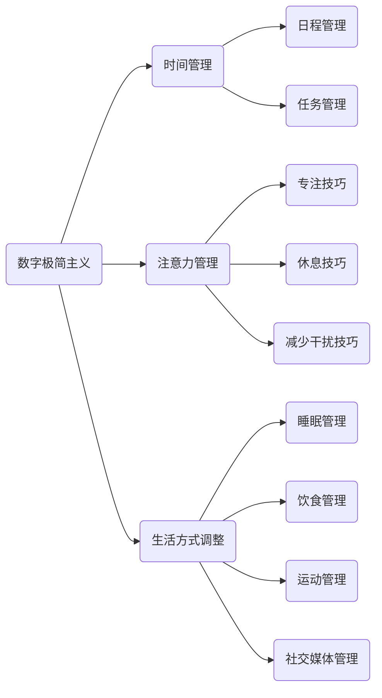

                 

## 数字极简主义工作坊：优化在线生活质量

### 关键词：数字极简主义、在线生活质量、时间管理、注意力管理、生活方式调整

> 摘要：随着数字技术的迅猛发展，我们的日常生活充满了各种数字设备和信息。然而，这些数字设备在带来便利的同时，也带来了信息过载、工作效率低下、个人隐私泄露等问题。数字极简主义应运而生，通过减少数字干扰，提高生活质量。本文旨在介绍数字极简主义的背景、核心概念、工作坊内容和应用，并提供优化数字设备使用的策略和时间管理技巧。

### 第1章: 数字极简主义概述

#### 1.1 问题背景与现状

#### 1.1.1 问题背景
随着互联网和数字技术的快速发展，我们的生活逐渐变得数字化。智能手机、电脑、平板电脑等数字设备的普及，使得我们可以随时随地获取和处理信息。然而，这种便利性也带来了许多问题。

- **信息过载**：每天接收到的电子邮件、短信、社交媒体通知等大量信息，让我们感到压力倍增。
- **工作效率低下**：频繁地切换任务、被即时消息打断，导致我们无法集中精力完成工作。
- **个人隐私泄露**：网络数据泄露、社交平台上的隐私设置不当，使得个人隐私受到威胁。

#### 1.1.2 问题描述
数字极简主义旨在通过减少数字干扰，提高生活质量。它不仅包括减少使用数字设备的时间，还包括简化日常工作和生活方式，以提高个人的幸福感和效率。

#### 1.1.3 问题解决
数字极简主义提供了一系列解决方案，如时间管理、减少社交媒体使用、简化工作流程等。通过这些方法，人们可以更好地管理自己的时间和注意力，从而提高生活质量。

#### 1.1.4 边界与外延
数字极简主义并不仅仅关注数字设备的使用，还包括对数字信息的筛选和处理。此外，它还涉及到对生活方式的整体反思和调整。

#### 1.1.5 概念结构与核心要素组成
数字极简主义的核心要素包括：时间管理、注意力管理、信息筛选和处理、生活方式调整等。

#### 1.2 数字极简主义的核心概念

##### 1.2.1 数字极简主义的定义
数字极简主义是一种通过减少数字干扰，提高生活质量的生活方式。

##### 1.2.2 数字极简主义的特点
- **减少数字设备使用时间**：通过限制使用数字设备的时间，减少数字干扰。
- **简化工作流程**：通过优化工作流程，减少工作中的干扰和重复性任务。
- **提高工作效率**：通过集中注意力，提高工作质量和效率。
- **关注个人幸福感和生活质量**：通过减少数字干扰，提高个人的幸福感和生活质量。

##### 1.2.3 数字极简主义与传统生活方式的区别
- **数字极简主义更注重效率和效果**：它强调通过减少数字干扰，提高生活质量，而不是仅仅为了完成任务而消耗时间。
- **数字极简主义强调数字设备的使用应该是提高生活质量**：而不是降低生活质量。

#### 1.3 数字极简主义的工作坊

##### 1.3.1 工作坊的目的
数字极简主义工作坊旨在帮助人们理解和实践数字极简主义，以提高生活质量。

##### 1.3.2 工作坊的内容
- **数字极简主义的理念介绍**：介绍数字极简主义的核心理念和基本原则。
- **时间管理技巧**：教授如何有效管理时间，提高工作效率。
- **专注力训练**：通过练习和技巧，提高专注力，减少分心。
- **数字设备使用策略**：提供数字设备使用的最佳实践，减少干扰。
- **生活方式调整建议**：提供生活方式调整的建议，帮助人们更好地适应数字极简主义。

##### 1.3.3 工作坊的形式
- **讲座**：通过讲解和分享，介绍数字极简主义的基本知识和实践经验。
- **实践活动**：通过实际操作和练习，帮助人们掌握和应用数字极简主义的技巧和方法。
- **小组讨论**：通过小组讨论和分享，促进参与者之间的交流和互动，共同探讨数字极简主义的实践和应用。

#### 1.4 数字极简主义的应用

##### 1.4.1 家庭生活
- **减少电视和社交媒体使用时间**：通过限制家庭成员使用电视和社交媒体的时间，减少数字干扰，提高生活质量。
- **制定家庭日程表**：通过制定家庭日程表，合理安排家庭时间，提高家庭生活质量。
- **增加户外活动**：鼓励家庭成员参与户外活动，享受大自然，减少数字干扰，提高生活质量。

##### 1.4.2 工作生活
- **简化工作任务**：通过简化工作任务，减少工作中的干扰和重复性任务，提高工作效率。
- **优化工作流程**：通过优化工作流程，减少工作中的混乱和拖延，提高工作效率。
- **提高工作效率**：通过集中注意力，减少分心，提高工作效率。

##### 1.4.3 教育生活
- **简化学习流程**：通过简化学习流程，减少学习中的干扰和重复性任务，提高学习效率。
- **提高学习效率**：通过集中注意力，减少分心，提高学习效率。
- **培养数字素养**：通过教育生活，培养数字素养，提高对数字信息的处理能力。

#### 1.5 本章小结
数字极简主义是一种通过减少数字干扰，提高生活质量的生活方式。通过工作坊的学习和实践，人们可以更好地理解和应用数字极简主义，从而改善自己的生活。数字极简主义不仅关注数字设备的使用，还涉及到对生活方式的整体反思和调整。通过时间管理、注意力管理、信息筛选和处理、生活方式调整等方法，人们可以更好地管理自己的时间和注意力，提高生活质量。

----------------------------------------------------------------

### 第2章: 数字设备使用的优化策略

#### 2.1 优化手机使用策略

##### 2.1.1 手机使用习惯的调整
手机是我们日常生活中使用最频繁的数字设备之一，因此，优化手机使用习惯对提高生活质量至关重要。

- **定期清理手机应用**：定期清理手机中的应用程序，删除那些不再使用或者长时间未使用的应用，可以减少手机内存占用，提高手机运行效率。
  
- **控制社交媒体使用时间**：社交媒体虽然方便我们与他人交流，但过多的使用会分散我们的注意力，影响工作效率和生活质量。可以通过设定使用时间限制，或者使用专门的应用来监控和限制社交媒体的使用时间。

- **关闭推送通知**：关闭不必要的推送通知可以减少手机通知的干扰，帮助我们更好地集中注意力。对于重要的通知，可以手动查看，避免被不重要的信息打扰。

##### 2.1.2 手机应用的筛选与整理
为了更好地管理手机应用，我们需要对应用进行筛选和整理。

- **筛选出必备应用**：根据实际需要，筛选出手机中必备的应用，如通讯、支付、导航等。对于非必要应用，可以暂时或永久删除。

- **定期更新和删除无用应用**：定期检查手机中的应用程序，更新或删除那些已经不再使用或者有更好替代品的应用。

- **分类整理应用**：将应用按照功能分类整理，如通讯、娱乐、工作等，便于快速找到所需的应用。

##### 2.1.3 手机使用环境优化
优化手机使用环境可以提高使用体验和效率。

- **设置手机亮度**：根据环境光线调整手机亮度，避免对眼睛造成不必要的负担。

- **关闭不必要的功能**：关闭手机中不必要的功能，如蓝牙、定位服务等，可以减少手机耗电，提高性能。

#### 2.2 优化电脑使用策略

##### 2.2.1 电脑桌面整理
电脑桌面是我们在电脑上工作的起点，一个整洁的桌面可以提高我们的工作效率。

- **清理不必要的桌面图标**：删除不必要的桌面图标，保持桌面简洁，避免因过多的图标而造成混乱。

- **将常用应用固定到任务栏**：将常用应用固定到任务栏，方便快速启动和访问，提高工作效率。

##### 2.2.2 电脑文件管理
良好的文件管理习惯可以帮助我们更高效地使用电脑。

- **使用文件夹分类管理**：将文件按照功能、项目、年份等分类存放到不同的文件夹中，便于查找和管理。

- **定期备份重要文件**：定期备份重要文件，避免因意外情况导致数据丢失。

##### 2.2.3 电脑使用习惯调整
良好的电脑使用习惯可以提高我们的工作效率和电脑的使用寿命。

- **定期清理电脑缓存**：定期清理电脑缓存，减少系统资源的占用，提高电脑运行速度。

- **控制浏览器标签页数量**：过多的浏览器标签页会消耗电脑内存，影响电脑性能。应该定期清理无用的标签页，保持浏览器的整洁。

#### 2.3 优化智能设备使用策略

##### 2.3.1 智能手表使用
智能手表作为智能手机的延伸，也在我们的日常生活中发挥着重要作用。

- **定期更换表盘**：根据个人喜好和需求，定期更换表盘，保持手表的美观和实用。

- **关闭不必要的功能**：关闭智能手表中不必要的功能，如心率监测、GPS等，可以延长手表的续航时间。

##### 2.3.2 智能家居设备
智能家居设备使得我们的生活更加便捷，但过度使用也会带来干扰。

- **选择必要设备**：根据实际需求，选择必要的智能家居设备，避免不必要的开支和干扰。

- **设置设备自动化**：通过设置设备自动化，如定时开关灯、自动调节空调温度等，提高生活的便捷性。

#### 2.4 数字设备使用的最佳实践

##### 2.4.1 设备使用时间管理
合理规划设备使用时间，可以减少数字干扰，提高生活质量。

- **制定设备使用计划**：根据个人日程和工作安排，制定设备使用计划，合理安排使用时间。

- **定期评估设备使用情况**：定期评估设备使用情况，调整使用计划，确保设备使用的有效性和合理性。

##### 2.4.2 设备使用环境优化
优化设备使用环境，可以提高使用体验和效率。

- **保持设备清洁**：定期清洁设备，如手机屏幕、键盘、鼠标等，保持设备的清洁和卫生。

- **定期更新设备软件**：定期更新设备的操作系统和应用程序，确保设备的安全性和稳定性。

##### 2.4.3 设备使用安全
确保设备使用安全，可以防止数据泄露和其他安全问题。

- **使用正版软件**：使用正版软件，避免使用盗版软件带来的安全隐患。

- **定期备份重要数据**：定期备份重要数据，避免因设备故障或数据泄露而造成的数据丢失。

#### 2.5 本章小结
通过优化数字设备的使用策略，我们可以更好地管理自己的时间和注意力，从而提高生活质量。本章提供了一些实用的优化策略和最佳实践，帮助读者更好地应用数字极简主义。通过调整手机、电脑和智能设备的使用习惯，我们可以减少数字干扰，提高工作和生活质量。同时，我们也需要定期评估和调整设备使用情况，确保设备使用的有效性和安全性。

----------------------------------------------------------------

### 第3章: 时间管理技巧

#### 3.1 时间管理的重要性

时间管理是提高生活质量的关键因素之一。一个有效的时间管理系统可以帮助我们更好地安排工作和生活，提高效率，减少压力，从而提高整体生活质量。

##### 3.1.1 时间管理对生活质量的影响
- **提高工作效率**：通过合理安排时间，我们可以更高效地完成工作任务，减少工作中的拖延和重复性劳动。
- **减少压力**：合理安排时间，可以避免因时间紧迫而产生的焦虑和压力，提高心理舒适度。
- **提高生活质量**：通过合理分配时间，我们可以更好地平衡工作和生活，享受生活的乐趣。

##### 3.1.2 时间管理的必要性
在当今快节奏的社会中，时间管理显得尤为重要。以下是几个原因：

- **信息过载**：随着信息技术的快速发展，我们每天接收到的信息量巨大，有效管理时间可以帮助我们筛选和处理这些信息。
- **任务繁杂**：工作和生活中的任务繁多，合理分配时间可以确保每项任务都能得到妥善处理。
- **个人发展**：通过时间管理，我们可以有更多的时间用于个人成长和兴趣爱好的培养。

##### 3.1.3 时间管理的核心原则
有效的时间管理应遵循以下核心原则：

- **明确目标**：明确短期和长期目标，确保时间的使用与目标一致。
- **优先级排序**：根据任务的紧急程度和重要性，对任务进行排序，优先完成重要且紧急的任务。
- **合理分配时间**：合理安排每天的时间，确保工作、休息和个人时间的平衡。
- **避免拖延**：及时处理任务，避免拖延，减少因拖延带来的心理压力。
- **持续优化**：定期评估和调整时间管理策略，不断优化时间安排。

#### 3.2 时间管理技巧

##### 3.2.1 设立明确的目标
设立明确的目标是有效时间管理的第一步。以下是一些技巧：

- **制定短期和长期目标**：短期目标可以是每周、每月要完成的工作任务，长期目标则是长期计划和目标。
- **目标具体化**：将目标具体化，使其可衡量和可实现，如“每周完成三个项目报告”而不是“提高工作效率”。
- **目标可视化**：将目标写下来，并放置在可见的地方，如办公桌上或手机屏幕上，以时刻提醒自己。

##### 3.2.2 制定日程表
日程表可以帮助我们更好地安排时间，确保每项任务都能得到妥善处理。以下是一些制定日程表的技巧：

- **每日日程表**：每天早上制定当天的日程表，包括工作任务、休息时间和个人时间。
- **优先级排序**：根据任务的紧急程度和重要性，对日程表中的任务进行排序。
- **留出缓冲时间**：在日程表中留出一些缓冲时间，以应对突发事件或任务延误。
- **定期回顾**：每周或每月回顾日程表，检查任务完成情况，并根据实际情况进行调整。

##### 3.2.3 使用时间管理工具
使用时间管理工具可以帮助我们更好地监控和优化时间使用。以下是一些常用的时间管理工具：

- **待办事项应用**：如Trello、Asana等，可以帮助我们记录和管理工作任务。
- **时间跟踪工具**：如Toggl、RescueTime等，可以帮助我们跟踪时间使用情况，了解哪些任务花费了最多时间。
- **日历应用**：如Google Calendar、Outlook等，可以帮助我们安排和记录日程。

##### 3.2.4 避免拖延
拖延是影响时间管理的重要因素之一。以下是一些避免拖延的技巧：

- **分解任务**：将大任务分解为小任务，一步一步完成，避免因任务过于庞大而感到无法入手。
- **设定截止日期**：为任务设定明确的截止日期，以增加紧迫感。
- **使用番茄工作法**：将工作时间分为25分钟的工作周期，每个周期后休息5分钟，以保持专注和减少疲劳。
- **避免干扰**：在工作时避免干扰，如关闭社交媒体通知、将手机置于静音模式等。

##### 3.2.5 持续优化
时间管理不是一成不变的，而是一个持续优化的过程。以下是一些持续优化时间管理的技巧：

- **定期反思**：定期反思时间管理的效果，了解哪些方法有效，哪些需要改进。
- **调整计划**：根据实际情况和反馈，调整时间管理计划，确保其适应变化。
- **寻求反馈**：向他人寻求反馈，了解他们对时间管理的看法和建议，以优化自己的时间管理策略。

#### 3.3 实际案例分享

为了更好地理解时间管理技巧的应用，以下是一个实际案例分享：

**案例背景**：小王是一名公司职员，工作繁忙，经常感到时间不够用，导致工作效率低下，生活质量下降。

**解决方案**：
1. **设立明确的目标**：小王明确了短期目标（每周完成三个项目报告）和长期目标（提高工作效率，减少加班时间）。
2. **制定日程表**：每天早上制定日程表，将任务按优先级排序，并留出缓冲时间。
3. **使用时间管理工具**：使用Trello记录工作任务，使用Google Calendar安排日程。
4. **避免拖延**：将大任务分解为小任务，每天设定截止日期，使用番茄工作法保持专注。
5. **持续优化**：每周反思时间管理效果，调整计划，确保其适应变化。

**结果**：通过这些时间管理技巧，小王的工作效率显著提高，生活压力减轻，生活质量得到改善。

#### 3.4 本章小结
时间管理是提高生活质量的重要手段。通过明确目标、制定日程表、使用时间管理工具、避免拖延和持续优化，我们可以更好地管理时间，提高工作效率，改善生活质量。本章提供了一些实用的时间管理技巧，帮助读者更好地应用这些技巧，提高自己的生活质量。

----------------------------------------------------------------

### 第4章: 注意力管理技巧

#### 4.1 注意力管理的重要性

注意力是我们在工作和生活中最重要的资源之一。有效管理注意力可以帮助我们提高工作效率、减少压力，并提高生活质量。然而，在当今信息爆炸和数字设备充斥的时代，注意力分散成为一个普遍问题。

##### 4.1.1 注意力管理对生活质量的影响
- **提高工作效率**：通过有效管理注意力，我们可以更专注于工作任务，减少分心，从而提高工作效率。
- **减少压力**：注意力分散会导致我们感到焦虑和压力。有效管理注意力可以帮助我们减少不必要的压力，提高心理舒适度。
- **提高生活质量**：专注于工作和生活的重要事项，可以提高生活质量，让我们有更多时间享受生活。

##### 4.1.2 注意力管理的必要性
在当今信息过载和数字设备充斥的时代，注意力分散成为一个普遍问题。以下是几个原因：

- **信息过载**：每天接收到的信息量巨大，容易导致注意力分散，无法集中精力处理重要任务。
- **多任务处理**：现代工作环境要求我们能够同时处理多个任务，这会导致注意力分散，降低工作效率。
- **数字设备干扰**：手机、电脑等数字设备不断提醒我们查看新的信息，容易打断我们的专注状态。

##### 4.1.3 注意力管理的核心原则
有效管理注意力应遵循以下核心原则：

- **专注**：将注意力集中在当前任务上，避免分心。
- **定时休息**：长时间工作会导致疲劳和分心，定期休息可以帮助恢复注意力。
- **减少干扰**：减少外界的干扰，如关闭不必要的通知、保持工作环境的整洁等。
- **优先级排序**：根据任务的紧急程度和重要性，对任务进行排序，确保注意力集中在最重要的任务上。

#### 4.2 注意力管理技巧

##### 4.2.1 专注技巧
以下是一些提高专注力的技巧：

- **单任务处理**：尽量避免多任务处理，将注意力集中在单个任务上。研究表明，多任务处理会降低工作效率，增加错误率。
- **使用番茄工作法**：将工作时间分为25分钟的工作周期，每个周期后休息5分钟。这种方法可以帮助我们保持专注，减少疲劳。
- **避免分心源**：在工作时，关闭社交媒体通知、将手机置于静音模式等，以避免分心源干扰。
- **专注环境**：创造一个有利于专注的环境，如选择一个安静的地方、调整光线和温度等。

##### 4.2.2 休息技巧
适当的休息可以帮助我们恢复注意力，提高工作效率。以下是一些休息技巧：

- **短暂休息**：每工作25分钟后，休息5-10分钟，可以走动、做一些伸展运动等，帮助恢复注意力。
- **深度休息**：定期进行深度休息，如午睡或短时间冥想，可以帮助我们恢复体力和精神。
- **合理分配休息时间**：在日程表中预留休息时间，确保工作和休息的平衡。

##### 4.2.3 减少干扰技巧
以下是一些减少干扰的技巧：

- **关闭通知**：关闭不必要的手机和电脑通知，避免被无关信息打扰。
- **设置专注时间段**：在特定时间段内，将手机和电脑置于专注模式，避免打扰。
- **整理工作环境**：保持工作环境的整洁，减少干扰源，如杂乱无章的文件和设备。

##### 4.2.4 优先级排序技巧
以下是一些优先级排序的技巧：

- **紧急-重要矩阵**：使用紧急-重要矩阵对任务进行排序，优先处理紧急且重要的事务。
- **目标关联**：将任务与目标关联起来，优先处理与目标相关的事务。
- **限制任务数量**：每天限制处理的任务数量，确保能够专注于最重要的任务。

#### 4.3 实际案例分享

为了更好地理解注意力管理技巧的应用，以下是一个实际案例分享：

**案例背景**：小张是一名学生，每天需要处理大量的学习任务，但经常因为分心和干扰而无法高效学习。

**解决方案**：
1. **单任务处理**：小张开始专注于单个任务，避免多任务处理。
2. **使用番茄工作法**：小张将学习时间分为25分钟的工作周期，每个周期后休息5分钟。
3. **避免分心源**：小张关闭了手机通知，并选择了一个安静的地方学习。
4. **休息技巧**：每学习25分钟后，小张会休息10分钟，进行一些伸展运动和深呼吸。
5. **优先级排序**：小张使用紧急-重要矩阵对学习任务进行排序，优先处理紧急且重要的任务。

**结果**：通过这些注意力管理技巧，小张的学习效率显著提高，能够更专注于学习任务，减少了分心和干扰。

#### 4.4 本章小结
注意力管理是提高生活质量的重要手段。通过专注技巧、休息技巧、减少干扰技巧和优先级排序技巧，我们可以更好地管理注意力，提高工作效率，减少压力，从而提高生活质量。本章提供了一些实用的注意力管理技巧，帮助读者更好地应用这些技巧，改善自己的生活质量。

----------------------------------------------------------------

### 第5章: 生活方式调整

#### 5.1 数字极简主义与生活方式调整的关系

数字极简主义不仅仅是一种技术手段，更是一种生活方式的调整。通过减少数字干扰，我们可以更好地专注于重要事务，提高生活质量。生活方式的调整是数字极简主义的重要组成部分，它涉及到日常生活的方方面面，包括睡眠、饮食、运动和社交等。

##### 5.1.1 睡眠
良好的睡眠是健康和高效的基础。数字极简主义强调减少夜间数字设备的使用，以避免蓝光对睡眠质量的干扰。以下是一些改善睡眠的建议：

- **减少夜间使用数字设备的时间**：尽量在睡前1-2小时停止使用手机、电脑等数字设备，以减少蓝光对睡眠的影响。
- **创建一个放松的睡眠环境**：保持卧室的黑暗和安静，使用舒适的床垫和枕头，有助于提高睡眠质量。
- **建立固定的睡眠时间**：每天保持相同的睡眠时间，有助于调整身体的生物钟，提高睡眠质量。

##### 5.1.2 饮食
健康的饮食习惯对生活质量有重要影响。数字极简主义鼓励我们减少加工食品的摄入，增加新鲜蔬菜和水果的摄入。以下是一些饮食调整的建议：

- **减少加工食品的摄入**：加工食品通常含有高盐、高糖和高脂肪，不利于健康。选择新鲜、天然的食材，减少加工食品的摄入。
- **增加蔬菜和水果的摄入**：蔬菜和水果富含维生素、矿物质和纤维素，有助于保持身体健康。每天食用多种颜色的蔬菜和水果，以获得全面的营养。
- **定时饮食**：定时进食，避免暴饮暴食，有助于维持血糖水平的稳定，提高生活质量。

##### 5.1.3 运动
适量的运动有助于提高身体健康，增强免疫力，减少压力。数字极简主义鼓励我们合理安排时间，进行规律的运动。以下是一些运动调整的建议：

- **定期进行有氧运动**：如慢跑、游泳、骑自行车等，有助于提高心肺功能和代谢率。
- **进行力量训练**：通过举重、俯卧撑、深蹲等力量训练，增强肌肉力量和耐力。
- **保持适度运动**：每周至少进行150分钟的中等强度运动，或75分钟的高强度运动。

##### 5.1.4 社交
良好的社交关系对心理健康和生活质量有重要影响。数字极简主义鼓励我们减少社交媒体的使用，增加现实生活中的社交活动。以下是一些社交调整的建议：

- **减少社交媒体使用时间**：限制每天在社交媒体上的时间，减少数字干扰，增加现实生活中的互动。
- **参加线下社交活动**：参与线下聚会、社团活动等，与他人建立和维持良好的社交关系。
- **培养兴趣爱好**：培养兴趣爱好，与他人分享兴趣和经验，增加社交机会。

#### 5.2 实际案例分享

为了更好地理解生活方式调整的应用，以下是一个实际案例分享：

**案例背景**：小王是一位忙碌的职场人士，经常熬夜加班，饮食不规律，缺乏运动，导致身体和精神状态不佳。

**解决方案**：
1. **改善睡眠**：小王减少夜间使用手机的时间，调整卧室的光线和温度，确保良好的睡眠环境。
2. **调整饮食**：小王减少加工食品的摄入，增加新鲜蔬菜和水果的摄入，保持定时饮食。
3. **增加运动**：小王每周安排至少三次运动，包括慢跑、游泳和瑜伽等，以提高身体健康。
4. **减少社交媒体使用时间**：小王限制每天在社交媒体上的时间，增加与家人和朋友的线下互动。

**结果**：通过这些生活方式调整，小王的身体和精神状态显著改善，工作效率提高，生活质量得到提升。

#### 5.3 本章小结
生活方式调整是数字极简主义的重要组成部分，通过改善睡眠、调整饮食、增加运动和减少社交媒体使用，我们可以提高生活质量，减少数字干扰。本章提供了一些实用的生活方式调整建议，帮助读者更好地应用数字极简主义，改善自己的生活。

----------------------------------------------------------------

### 第6章: 数字极简主义实践与挑战

#### 6.1 数字极简主义的实践方法

数字极简主义的实践需要我们在日常生活中逐步调整和优化。以下是一些具体的实践方法：

##### 6.1.1 减少社交媒体使用
社交媒体虽然方便我们与他人交流，但过多的使用会分散我们的注意力，影响生活质量。以下是一些减少社交媒体使用的方法：

- **设定每日使用时间限制**：每天设定一个固定的社交媒体使用时间，例如30分钟，以避免无限制地浏览。
- **删除不必要的应用**：删除那些对我们没有帮助的社交媒体应用，减少使用诱惑。
- **关闭推送通知**：关闭社交媒体应用的推送通知，避免被无关信息打扰。

##### 6.1.2 简化工作任务
工作任务繁杂会消耗我们大量的时间和精力，影响生活质量。以下是一些简化工作任务的方法：

- **分解任务**：将大任务分解为小任务，一步一步完成，避免因任务过于庞大而感到无从下手。
- **设定截止日期**：为任务设定明确的截止日期，以增加紧迫感，提高工作效率。
- **优化工作流程**：分析工作流程，去除不必要的步骤，优化工作流程，提高效率。

##### 6.1.3 时间管理
有效的时间管理可以帮助我们更好地安排工作和生活，提高生活质量。以下是一些时间管理的方法：

- **制定日程表**：每天制定日程表，合理安排工作和休息时间，确保时间的充分利用。
- **使用时间管理工具**：使用时间管理工具，如待办事项应用、时间跟踪工具等，帮助我们更好地管理时间。
- **避免拖延**：及时处理任务，避免拖延，减少因拖延带来的心理压力。

##### 6.1.4 增加户外活动
户外活动可以让我们远离数字设备的干扰，享受大自然的美好，提高生活质量。以下是一些增加户外活动的方法：

- **制定户外活动计划**：每周安排一次户外活动，如徒步、骑自行车等，以增加户外活动的频率。
- **与家人和朋友一起活动**：与家人和朋友一起参与户外活动，增加互动和交流，提高生活质量。
- **利用周末时间**：利用周末时间，安排一次户外旅行或探险，放松身心。

#### 6.2 数字极简主义面临的挑战

尽管数字极简主义提供了许多提高生活质量的解决方案，但在实践中也面临着一些挑战：

##### 6.2.1 社会压力
在现代社会，数字设备已经成为工作和生活的重要组成部分。一些人可能会因为担心被社会淘汰或失去工作机会，而难以完全实施数字极简主义。

##### 6.2.2 依赖性
长期过度使用数字设备可能导致人们对数字设备的依赖。实施数字极简主义可能会引起一些不适，如焦虑、不安等。

##### 6.2.3 信息过载
即使减少了社交媒体的使用，我们仍然会面临大量信息的冲击。如何筛选和处理这些信息，仍然是一个挑战。

##### 6.2.4 习惯改变
改变长期养成的习惯是一项艰巨的任务。实施数字极简主义需要我们不断调整和优化，以适应新的生活方式。

#### 6.3 应对挑战的策略

为了克服数字极简主义实践中的挑战，我们可以采取以下策略：

##### 6.3.1 建立支持系统
寻求家人、朋友或同事的支持，共同实践数字极简主义，相互鼓励和监督。

##### 6.3.2 逐步改变
不要期望一蹴而就地改变所有习惯。逐步减少数字设备的使用时间，逐步增加户外活动的时间，以适应新的生活方式。

##### 6.3.3 保持灵活性
在实践过程中，保持灵活性，根据实际情况进行调整。如果某个方法不适用，可以尝试其他方法。

##### 6.3.4 学习新技能
通过学习新技能，如编程、绘画等，可以减少对数字设备的依赖，提高生活质量。

#### 6.4 本章小结
数字极简主义提供了许多提高生活质量的解决方案，但在实践中也面临着一些挑战。通过减少社交媒体使用、简化工作任务、时间管理和增加户外活动，我们可以逐步实践数字极简主义。同时，我们也需要应对数字极简主义实践中的挑战，采取适当的策略，以实现生活质量的提升。

----------------------------------------------------------------

### 第7章: 未来展望与趋势

#### 7.1 数字极简主义的未来发展方向

数字极简主义作为一种新兴的生活方式，正在逐渐得到更多人的认可和实践。未来，数字极简主义有望在以下几个方面发展：

##### 7.1.1 技术创新
随着科技的不断发展，新的数字工具和应用可能会出现，帮助人们更好地实践数字极简主义。例如，更加智能的日程管理工具、自动化工作流程系统等。

##### 7.1.2 社会认同
随着数字极简主义理念的传播，社会对数字干扰的危害逐渐认识到，数字极简主义可能会得到更广泛的社会认同，成为一种主流的生活方式。

##### 7.1.3 教育普及
数字极简主义的教育普及是未来发展的关键。通过学校教育、职场培训等途径，培养人们的数字素养和极简生活理念，使其成为自觉行动。

##### 7.1.4 政策支持
政府可能会出台相关政策，鼓励和支持数字极简主义的实践，如提供数字设备使用指导、推广极简生活方式等。

#### 7.2 数字极简主义的社会影响

数字极简主义不仅对个人生活产生影响，也对社会产生深远的影响：

##### 7.2.1 提高社会效率
通过减少数字干扰，提高工作效率，数字极简主义有助于提高整个社会的运作效率。

##### 7.2.2 促进心理健康
减少数字设备的使用，有助于缓解社会压力，提高人们的心理健康水平。

##### 7.2.3 加强人际关系
数字极简主义鼓励人们更多地参与线下活动，加强人际关系，促进社会和谐。

##### 7.2.4 保护环境
数字极简主义倡导减少数字设备的消费和使用，有助于减少电子垃圾，保护环境。

#### 7.3 数字极简主义面临的挑战

尽管数字极简主义具有许多潜在的优势，但在未来实践中也面临着一些挑战：

##### 7.3.1 技术依赖
随着科技的不断发展，人们对数字设备的依赖可能会加剧，如何平衡数字极简主义和技术发展是一个挑战。

##### 7.3.2 社会适应
数字极简主义需要人们适应新的生活方式，这可能需要一段时间，甚至引起社会文化的冲突。

##### 7.3.3 教育资源
数字极简主义的教育普及需要大量的教育资源，如何有效地分配和利用这些资源是一个挑战。

##### 7.3.4 政策制定
制定有效的政策来支持数字极简主义的实践需要深入的研究和广泛的讨论。

#### 7.4 本章小结

数字极简主义作为一种新兴的生活方式，正逐渐改变着我们的工作和生活方式。未来，随着技术的进步和社会的认同，数字极简主义有望得到更广泛的应用。然而，数字极简主义也面临着一系列的挑战，需要我们共同面对和解决。通过不断的探索和实践，我们可以更好地利用数字技术，提高生活质量，实现可持续的发展。

### 附录

#### 附录A：数字极简主义核心概念表格

| 核心概念 | 定义 |  
| --- | --- |  
| 数字极简主义 | 一种通过减少数字干扰，提高生活质量的生活方式 |  
| 时间管理 | 通过合理安排时间，提高工作效率和生活质量 |  
| 注意力管理 | 通过专注技巧、休息技巧和减少干扰技巧，提高注意力集中度 |  
| 生活方式调整 | 通过改善睡眠、调整饮食、增加运动和减少社交媒体使用，提高生活质量 |

#### 附录B：数字极简主义ER实体关系图

#### 附录C：数字极简主义实践建议

- **设定每日目标**：每天设定明确的任务和目标，提高工作效率和生活质量。
- **减少社交媒体使用**：每天限制社交媒体使用时间，减少数字干扰。
- **定期休息**：每工作一段时间后，进行短暂的休息，保持注意力集中。
- **增加户外活动**：每周安排一定的户外活动时间，享受大自然，提高生活质量。

### 作者信息

**作者：** AI天才研究院/AI Genius Institute & 禅与计算机程序设计艺术 /Zen And The Art of Computer Programming

本文旨在介绍数字极简主义的背景、核心概念、工作坊内容和应用，并提供优化数字设备使用的策略和时间管理技巧。通过减少数字干扰，提高生活质量，数字极简主义正在改变着我们的生活。希望本文能够帮助读者更好地理解和实践数字极简主义，改善自己的生活。

