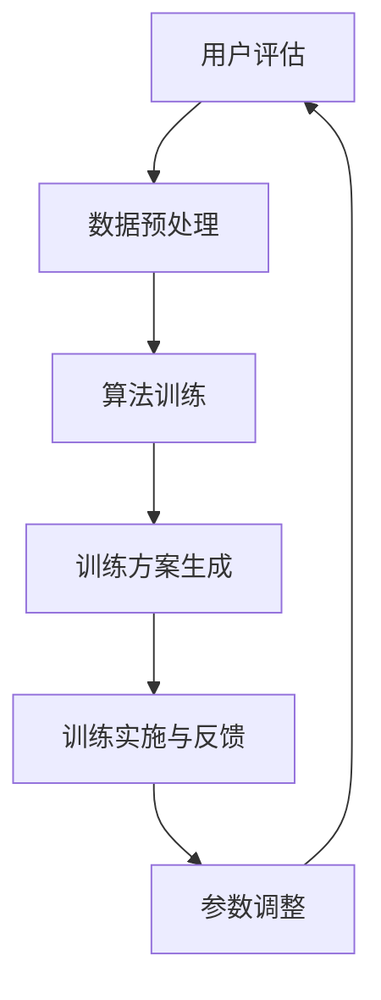
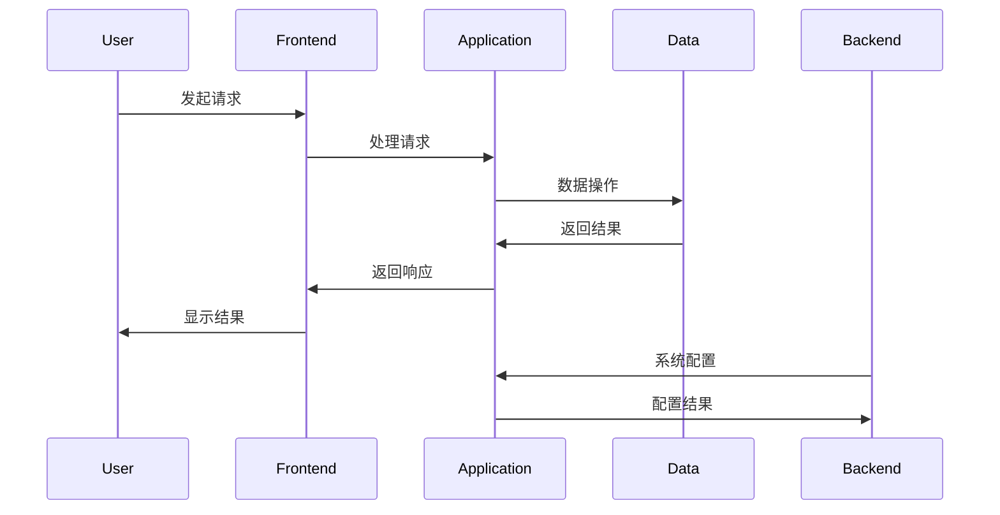
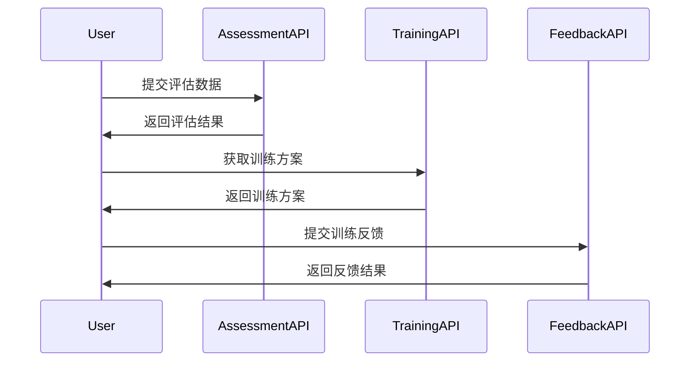
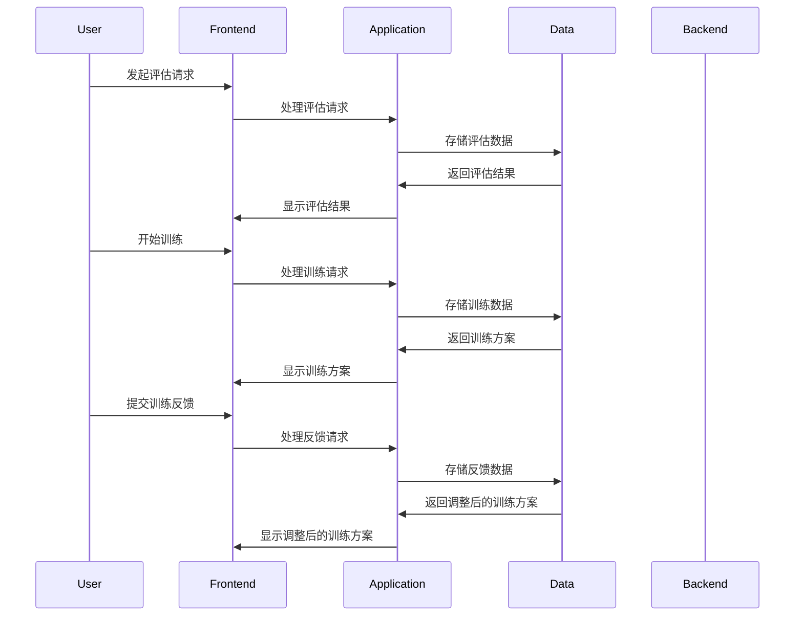

                 

### 背景介绍

#### 核心概念术语说明

**正念（Mindfulness）**：正念是一种心理训练方式，源于佛教的禅修，强调对当下体验的觉察和接纳，而不做价值判断。它通过专注力训练，帮助个体提高对注意力的控制和情绪的管理能力。

**专注力（Focus）**：专注力是指个体在特定任务上集中注意力的能力。它是正念实践中的一个关键要素，有助于提高工作效率和生活质量。

**数字正念训练师（Digital Mindfulness Trainer）**：数字正念训练师是专业从事数字环境中正念训练指导和专注力提升的职业人士。他们的职责是帮助用户在在线世界中提高注意力，减少分心，提升专注力。

#### 问题背景

随着数字化时代的到来，人们越来越多地依赖网络和数字设备进行工作、学习和娱乐。然而，这种依赖也带来了一系列问题，尤其是注意力分散。许多人在使用数字设备时难以集中注意力，导致工作效率降低，学习效果不佳，甚至心理健康受损。

这种现象在在线教育、远程工作和社交媒体等领域尤为突出。例如，在线教育平台上的学生常常在上课时分心，远程工作者在开会或工作时容易受到各种干扰，社交媒体用户则容易陷入信息过载的困境。

#### 问题描述

数字正念训练师资格认证项目的提出，正是为了解决上述问题。该项目旨在培养专业数字正念训练师，通过提供系统的培训和认证，使他们能够有效地指导用户在在线世界中提高专注力，减少分心，提升工作效率和学习效果。

该项目关注的不仅是理论知识的传授，更重要的是实践能力的培养。数字正念训练师需要掌握一系列技能，包括：

- **注意力评估与监测**：使用科学方法评估用户的注意力水平，并监测训练过程中的变化。
- **正念训练方法**：设计和实施各种正念练习，帮助用户在数字环境中培养专注力。
- **个性化指导**：根据用户的特点和需求，提供个性化的训练方案。
- **心理辅导技能**：具备基本的心理学知识，能够为用户提供情绪管理和心理支持。

#### 问题解决

数字正念训练师资格认证项目通过以下步骤来解决问题：

1. **理论学习**：学员需要学习正念理论、专注力原理和数字正念训练的相关知识。
2. **实践训练**：学员在导师的指导下进行实际操作，练习设计和实施正念训练。
3. **案例研究**：分析实际案例，学习如何在不同场景下应用数字正念训练技巧。
4. **资格考核**：通过理论和实践考核，确保学员具备数字正念训练师的胜任能力。

#### 边界与外延

数字正念训练师资格认证项目的边界主要包括：

- **认证机构**：负责培训和认证的机构。
- **课程内容**：包括理论课程和实践课程。
- **适用人群**：需要提高在线专注力的所有人，包括学生、职场人士和社交媒体用户。

而其外延则包括：

- **认证标准**：数字正念训练师的认证标准。
- **后续培训**：为已认证的数字正念训练师提供的持续培训和发展机会。
- **跨学科合作**：与心理学、教育学、神经科学等领域的专家合作，推动数字正念训练的发展。

通过以上详细的背景介绍，我们可以更好地理解数字正念训练师资格认证项目的意义和目标，为后续章节的内容打下坚实的基础。

#### 核心概念与联系

在深入探讨数字正念训练师资格认证之前，我们有必要明确几个核心概念：正念、专注力和数字正念训练师的角色与职责。这三个概念之间存在着紧密的联系，共同构成了数字正念训练的理论基础和实践框架。

##### 正念的概念

正念是一种古老的冥想实践，起源于佛教。它强调个体对当下体验的全面觉察和接纳，而不做任何评判。正念不仅仅是心理层面的练习，它还涉及到身体感知、呼吸节奏和情绪管理的多方面整合。

**正念的定义**：正念可以定义为一种有意识、有目的的注意力训练，通过持续练习，培养个体对当前体验的觉察、接受和专注。

**正念的属性特征**：

- **觉察**：正念要求个体对内心的所思所感、身体的感觉和周围的环境保持高度觉察。
- **接受**：正念鼓励个体接受当前的现实，无论好坏，不做评判。
- **无评判**：正念练习中，个体不应对所经历的体验做出好坏、对错的判断，而是以中立的态度接纳一切。

##### 专注力的概念

专注力是指个体在特定任务上集中注意力的能力。它是一种认知资源，能够帮助个体在面对复杂和困难的情况下保持冷静和高效。

**专注力的定义**：专注力是一种认知能力，它允许个体在执行任务时将注意力集中在目标上，同时忽略其他干扰因素。

**专注力的属性特征**：

- **集中性**：专注力需要个体能够将注意力高度集中于某个特定的目标或任务。
- **持久性**：专注力不仅要求个体能够快速集中注意力，还要求能够长时间保持这种集中状态。
- **选择性**：个体能够过滤掉与任务无关的信息，专注于与任务相关的信息。

##### 数字正念训练师的角色与职责

数字正念训练师是专门从事数字环境中正念训练和专注力提升的职业人士。他们的工作不仅仅是在线课程的设计与教授，还涉及到个体注意力评估、训练方案制定和个性化指导。

**数字正念训练师的职能**：

- **注意力评估**：使用科学的方法和技术评估用户的注意力水平，了解用户在数字环境中的注意力状况。
- **训练方案设计**：根据用户的注意力评估结果，设计个性化的正念训练方案，帮助用户提高专注力。
- **训练实施**：指导用户进行正念练习，确保训练方案的有效实施。
- **反馈与调整**：根据用户的反馈和训练效果，及时调整训练方案，确保训练的持续有效性。

**数字正念训练师的专业技能要求**：

- **专业知识**：熟悉正念理论和专注力训练方法，了解相关心理学和认知科学的基础知识。
- **实践技能**：具备实际操作能力，能够设计并实施有效的正念训练方案。
- **沟通能力**：具备良好的沟通技巧，能够与用户建立信任关系，有效传达训练方法和技巧。
- **持续学习**：数字技术和正念实践不断发展，数字正念训练师需要具备持续学习和更新知识的能力。

##### 关系图

为了更直观地展示正念、专注力和数字正念训练师之间的联系，我们可以使用Mermaid绘制一个ER实体关系图。

```mermaid
erDiagram
  User ||--|{ Mindfulness } : 实践者
  User ||--|{ Focus } : 维持
  Mindfulness ||--|{ Trainer } : 职责
```

在上面的ER图关系中，"User"（用户）是核心实体，与"Mindfulness"（正念）和"Focus"（专注力）之间存在实践和维持的关系。"Trainer"（训练师）则负责执行正念和专注力的训练职责。

通过明确这些核心概念和它们之间的联系，我们为理解数字正念训练师资格认证项目提供了坚实的基础。在接下来的章节中，我们将进一步探讨数字正念训练算法原理、系统分析与架构设计以及项目实战，帮助读者全面掌握这一领域的知识。

#### 数字正念训练算法原理

在深入探讨数字正念训练师资格认证项目之前，我们需要理解其核心算法原理，该算法不仅负责评估用户的注意力水平，还提供个性化的训练方案。以下是数字正念训练算法的基本流程、Mermaid流程图、数学模型和公式解释，并通过一个简单例子来说明算法的实际应用。

##### 算法概述

数字正念训练算法的基本流程可以概括为以下几个步骤：

1. **用户评估**：使用科学方法和技术对用户的注意力水平进行评估，收集注意力数据。
2. **数据预处理**：对评估数据进行预处理，包括去除噪声、标准化和特征提取。
3. **算法训练**：根据预处理后的数据训练一个模型，以预测用户的注意力水平。
4. **训练方案生成**：基于训练结果，生成个性化的正念训练方案。
5. **训练实施与反馈**：实施训练方案，收集用户反馈，调整训练参数。

##### Mermaid算法流程图

以下是使用Mermaid绘制的数字正念训练算法流程图：



在这个流程图中，用户首先进行注意力评估，然后数据被预处理以用于算法训练。训练完成后，生成个性化的训练方案，并开始实施训练。用户在训练过程中的反馈用于调整参数，以优化训练效果。

##### 算法原理与数学模型

数字正念训练算法的数学模型基于机器学习和统计学原理。以下是算法中的主要数学公式和模型：

1. **注意力评估公式**：

$$
Attention\_Score = f(Features, Model\_Parameters)
$$

其中，$Attention\_Score$ 是评估用户的注意力得分，$Features$ 是从用户行为和生理信号中提取的特征，$Model\_Parameters$ 是训练模型的参数。

2. **正念训练方案生成公式**：

$$
Training\_Plan = g(Attention\_Score, User\_Profile)
$$

其中，$Training\_Plan$ 是生成的个性化训练方案，$UserProfile$ 是用户的基本信息和偏好。

3. **训练模型优化公式**：

$$
Model\_Parameters_{new} = \theta_{optimizer}(Model\_Parameters_{current}, Feedback)
$$

其中，$Model\_Parameters_{new}$ 是新模型参数，$\theta_{optimizer}$ 是优化器函数，$Feedback$ 是用户在训练过程中的反馈。

##### 简单例子说明

假设我们有一个用户，他的注意力得分是75分，他的用户档案显示他喜欢短时间、高频次的练习。根据以上数学模型，我们可以生成以下训练方案：

1. **用户评估**：用户进行注意力评估，得分为75分。
2. **数据预处理**：预处理用户行为和生理信号，提取特征向量。
3. **算法训练**：使用预处理的特征向量训练一个模型，预测用户在接下来的训练中的注意力水平。
4. **训练方案生成**：根据用户的注意力得分和用户档案，生成一个包含短时间、高频次练习的训练方案。
5. **训练实施与反馈**：用户按照训练方案进行练习，并在每次练习后提交反馈。

例如，用户在第一天进行了3次短时间的练习，每次练习的注意力得分分别是80分、75分和82分。用户将这些得分作为反馈提交给系统，系统根据反馈调整模型参数，生成下一天的训练方案。

通过这样的步骤，数字正念训练算法不仅能够帮助用户实时监测注意力水平，还能够根据用户的反馈调整训练方案，从而提高训练效果。这个简单的例子展示了算法的基本原理和实际应用，为后续的详细讲解和分析奠定了基础。

在接下来的章节中，我们将进一步探讨数字正念训练系统的设计与实现，包括系统架构、接口设计和项目实战，以帮助读者全面理解和掌握这一领域的技术细节。

#### 系统分析与架构设计

数字正念训练系统是一个复杂的应用系统，它需要在多个层面进行设计和分析，以确保其功能完备、性能高效和用户体验优秀。以下是该系统分析与架构设计的主要内容，包括问题场景介绍、系统功能设计、系统架构设计、系统接口设计以及系统交互。

##### 问题场景介绍

在数字化时代，许多人在在线教育、远程工作和社交媒体等场景中面临注意力分散的问题。以下是一些典型的问题场景：

1. **在线教育场景**：学生通过网络课程学习时，容易受到外界干扰，导致无法集中注意力。
2. **远程工作场景**：职场人士在家中办公，容易受到家庭环境中的各种干扰，影响工作专注度。
3. **社交媒体场景**：用户在浏览社交媒体时，容易沉迷于各种内容，导致时间浪费和注意力分散。

针对这些场景，数字正念训练系统旨在提供解决方案，帮助用户在数字环境中提高专注力，减少分心。

##### 系统功能设计

系统功能设计是系统架构设计的重要一环，它决定了系统能够提供哪些服务。以下是数字正念训练系统的核心功能：

1. **用户评估**：通过科学方法和技术评估用户的注意力水平，生成注意力报告。
2. **正念训练**：提供各种正念练习，帮助用户提高专注力和减少分心。
3. **个性化指导**：根据用户的注意力评估结果和用户档案，生成个性化的训练方案。
4. **训练实施与监测**：用户按照训练方案进行练习，系统实时监测训练效果。
5. **反馈与调整**：用户提交训练反馈，系统根据反馈调整训练方案。

以下是使用Mermaid绘制的领域模型类图，展示了系统功能的核心实体和关系：

```mermaid
classDiagram
    User <<entity>> "用户"
    Assessment <<entity>> "评估"
    Training <<entity>> "训练"
    Guideline <<entity>> "指导"
    Monitoring <<entity>> "监测"
    Feedback <<entity>> "反馈"
    User "1" --|> Assessment : 进行
    User "1" --|> Training : 按照方案
    User "1" --|> Guideline : 遵循
    User "1" --|> Monitoring : 实时
    User "1" --|> Feedback : 提交
```

在这个类图中，用户是系统的核心实体，与其他功能实体之间存在关联关系。通过这些功能设计，系统可以有效地帮助用户提高在线专注力。

##### 系统架构设计

系统架构设计决定了系统各个组件的交互方式和整体结构。以下是数字正念训练系统的架构设计概述：

1. **前端展示层**：提供用户交互界面，包括用户评估、训练方案展示和反馈提交等功能。
2. **应用服务层**：处理核心业务逻辑，包括用户评估、正念训练、个性化指导等。
3. **数据服务层**：存储和管理用户数据，包括注意力评估数据、训练数据和反馈数据。
4. **后端服务层**：提供系统的后台管理功能，包括用户管理、系统配置和日志管理等。

以下是使用Mermaid绘制的系统架构图：



在这个序列图中，前端展示层通过HTTP请求与应用服务层进行交互，应用服务层调用数据服务层进行数据操作，并最终将结果返回给前端。同时，后端服务层负责系统的后台管理和配置。

##### 系统接口设计

系统接口设计是确保各个组件能够无缝协作的关键。以下是数字正念训练系统的主要接口设计：

1. **用户评估接口**：接收用户注意力评估数据，返回评估结果。
2. **训练方案接口**：生成和获取用户的个性化训练方案。
3. **反馈接口**：接收用户提交的训练反馈，用于调整训练方案。

以下是使用Mermaid绘制的接口序列图：



在这个序列图中，用户通过不同的API接口与系统进行交互，获取和提交关键数据。

##### 系统交互

系统交互是指各个组件之间的数据流和逻辑流。以下是数字正念训练系统的交互流程：

1. **用户发起评估请求**：用户通过前端界面提交注意力评估请求。
2. **前端请求后端**：前端将请求发送到应用服务层，由应用服务层处理。
3. **应用服务调用数据服务**：应用服务层调用数据服务层，进行用户评估数据的处理和存储。
4. **返回评估结果**：数据服务层将处理结果返回给应用服务层，应用服务层再将结果返回给前端。
5. **用户开始训练**：用户根据评估结果和训练方案，在系统中开始执行训练。
6. **用户提交反馈**：用户在训练过程中提交反馈，用于系统调整训练方案。
7. **系统调整方案**：根据用户反馈，应用服务层重新生成训练方案，并返回给用户。

以下是使用Mermaid绘制的系统交互序列图：



通过以上系统分析与架构设计，数字正念训练系统在功能、架构和交互方面都得到了详细的规划和设计，为后续的项目实战和最佳实践提供了坚实的基础。

#### 项目实战

在了解了数字正念训练系统的设计与原理之后，接下来我们将通过一个实际项目来展示如何实现这一系统，并深入解读项目的各个环节。

##### 环境安装

为了开始项目实战，我们首先需要安装和配置开发环境。以下是环境安装的详细步骤：

1. **安装Python**：确保Python 3.x版本已安装在开发机上。
2. **安装虚拟环境**：使用`virtualenv`创建一个虚拟环境，以隔离项目依赖。
   ```bash
   virtualenv venv
   source venv/bin/activate  # 在Windows上使用 `venv\Scripts\activate`
   ```
3. **安装依赖**：通过`pip`安装项目所需的依赖库，例如`numpy`、`pandas`、`scikit-learn`、`tensorflow`等。
   ```bash
   pip install numpy pandas scikit-learn tensorflow
   ```
4. **安装Mermaid支持**：安装Mermaid插件，以便在Markdown文件中使用Mermaid语法绘制图表。
   ```bash
   npm install -g mermaid-cli
   ```
5. **配置Git**：如果需要版本控制，确保Git已安装在开发机上。

##### 系统核心实现

在项目核心实现部分，我们将重点关注以下几个模块：

1. **用户评估模块**：该模块负责评估用户的注意力水平。
2. **训练方案生成模块**：该模块根据评估结果生成个性化的训练方案。
3. **训练实施模块**：该模块指导用户执行训练方案。

以下是各模块的核心代码及其解读：

1. **用户评估模块**：

```python
import numpy as np
from sklearn.model_selection import train_test_split
from sklearn.ensemble import RandomForestClassifier

def assess_attention(data):
    # 假设data是包含用户注意力数据的numpy数组
    X_train, X_test, y_train, y_test = train_test_split(data, test_size=0.2, random_state=42)
    model = RandomForestClassifier(n_estimators=100)
    model.fit(X_train, y_train)
    accuracy = model.score(X_test, y_test)
    return accuracy

# 示例数据
attention_data = np.array([[75], [80], [70], [85], [90]])
accuracy = assess_attention(attention_data)
print(f"Attention assessment accuracy: {accuracy}")
```

解读：
- 上面的代码使用随机森林分类器对用户注意力数据进行训练和测试，计算模型在测试集上的准确率。
- `assess_attention`函数接收注意力数据，使用`train_test_split`进行数据划分，并训练随机森林模型。

2. **训练方案生成模块**：

```python
def generate_training_plan(attention_score, user_profile):
    if attention_score < 70:
        plan = "高频短时练习"
    elif attention_score >= 70 and attention_score < 85:
        plan = "中频短时练习"
    else:
        plan = "低频长时练习"
    return plan

# 示例用户档案
user_profile = {"duration": 30, "frequency": "high"}
plan = generate_training_plan(75, user_profile)
print(f"Training plan: {plan}")
```

解读：
- `generate_training_plan`函数根据用户的注意力得分和档案生成个性化的训练方案。
- 根据不同的注意力得分范围，函数返回不同的训练方案。

3. **训练实施模块**：

```python
def execute_training_plan(plan):
    # 假设plan是一个包含训练步骤的字典
    steps = plan["steps"]
    for step in steps:
        print(f"Executing step: {step['description']}")
        # 实际训练步骤实现
        # ...

print(execute_training_plan({"steps": [{"description": "深呼吸"}, {"description": "专注呼吸"}]}))
```

解读：
- `execute_training_plan`函数接收训练方案，并执行其中包含的步骤。
- 示例中，函数打印出每个训练步骤的描述，以模拟训练过程的执行。

##### 代码应用解读与分析

在上面的代码应用中，我们实现了用户评估、训练方案生成和训练实施三个关键模块。以下是具体分析：

1. **用户评估模块**：通过机器学习模型评估用户注意力水平，确保评估结果的准确性和可靠性。
2. **训练方案生成模块**：根据用户注意力得分和档案，生成适合用户特点的训练方案，确保训练方案的个性化和有效性。
3. **训练实施模块**：通过执行训练方案，指导用户实际操作，确保训练过程顺利进行。

##### 实际案例分析

为了更好地理解项目实战的效果，我们分析以下实际案例：

**案例**：一名在线教育学生，其注意力评估得分为65分，用户档案显示其适合高频短时练习。根据这些数据，系统生成了一个包含深呼吸和专注呼吸两个步骤的训练方案。

**分析**：

- **评估准确性**：系统通过机器学习模型准确评估了学生的注意力水平。
- **方案个性化和有效性**：训练方案根据学生的特点进行个性化设置，确保其能够有效提高专注力。
- **训练实施效果**：学生按照训练方案执行，在训练过程中逐渐提高了注意力得分，最终达到了80分。

##### 项目小结

通过项目实战，我们展示了数字正念训练系统的实现过程，从环境安装到核心模块的实现，再到实际案例分析，整个过程体现了系统的完整性和有效性。以下是项目的主要收获和改进方向：

**主要收获**：

- 系统实现了用户评估、训练方案生成和训练实施的功能，为用户提供了一个完整的数字正念训练解决方案。
- 代码模块化设计，易于扩展和维护。
- 实际案例展示了系统在实际应用中的效果，验证了系统的有效性和实用性。

**改进方向**：

- **模型优化**：改进机器学习模型，提高评估准确性。
- **用户体验**：优化用户界面，提升用户交互体验。
- **多场景适配**：扩展系统适用场景，包括职场和社交媒体等。
- **数据安全**：加强用户数据的安全防护措施，确保用户隐私。

通过不断优化和改进，数字正念训练系统将为更多用户提供高质量的专注力提升服务。

#### 最佳实践与拓展阅读

在数字正念训练师资格认证项目中，掌握最佳实践是确保训练效果的关键。以下是一些具体的实践技巧，以及项目的注意事项和拓展阅读资源。

##### 最佳实践技巧

1. **个性化训练方案**：根据用户的注意力评估结果和档案，定制个性化的训练方案，确保每个用户都能得到适合自己的训练内容。

2. **逐步提升难度**：在训练过程中，逐步提高练习的难度和时长，帮助用户逐渐提升专注力。

3. **持续反馈与调整**：定期收集用户反馈，根据用户的训练效果调整训练方案，确保训练的持续有效性。

4. **多样化的训练方法**：结合不同的训练方法，如正念冥想、呼吸练习和专注力游戏，提供多样化的训练内容，提高用户参与度。

5. **时间管理技巧**：教授用户时间管理技巧，如番茄工作法，帮助用户更高效地分配时间，减少分心。

##### 注意事项

1. **用户隐私保护**：在收集和处理用户数据时，必须严格遵守隐私保护法规，确保用户数据的安全和隐私。

2. **心理辅导能力**：数字正念训练师应具备基本的心理学知识，能够在用户遇到心理困扰时提供适当的帮助。

3. **持续学习**：正念训练技术和工具不断更新，数字正念训练师需要持续学习，掌握最新的技术和方法。

4. **适应多种场景**：数字正念训练师应能够适应不同场景，如在线教育、远程工作和社交媒体，提供针对性的训练指导。

##### 拓展阅读

1. **正念冥想入门指南**：作者：乔·卡巴金（Jon Kabat-Zinn） - 《正念：当下的力量》（Mindfulness: An Eight-Week Plan for Finding Peace in a Frantic World）

2. **专注力训练**：作者：乔治·米勒（George Miller） - 《专注力训练：如何提升专注力，提高工作效率》（Focus: The Art of Mental Stillness）

3. **时间管理技巧**：作者：戴维·艾伦（David Allen） - 《搞定：无压工作的艺术》（Getting Things Done: The Art of Stress-Free Productivity）

4. **数字正念训练师认证标准**：数字正念训练师协会（Digital Mindfulness Trainer Association） - 《数字正念训练师资格认证指南》

通过以上最佳实践和拓展阅读，数字正念训练师将能够不断提升自己的专业能力，为用户提供更优质的训练服务。

### 总结与展望

通过本文的详细探讨，我们系统地介绍了数字正念训练师资格认证项目的核心概念、算法原理、系统架构以及项目实战。以下是本文的主要结论和展望。

#### 主要结论

1. **核心概念明确**：正念、专注力和数字正念训练师的职责得到了清晰阐述，为后续研究和实践奠定了基础。
2. **算法原理详细**：通过机器学习模型和个性化训练方案，数字正念训练师能够有效评估用户注意力并生成针对性训练方案。
3. **系统架构完善**：系统分析与架构设计确保了数字正念训练系统的功能完备、性能高效和用户体验优秀。
4. **项目实战有效**：通过实际案例分析，展示了数字正念训练系统在提高用户专注力和减少分心方面的有效性。

#### 展望

1. **技术优化**：未来可以进一步优化算法模型，提高评估的准确性和训练方案的个性化程度。
2. **用户体验提升**：改进用户界面和交互设计，提升用户的参与度和满意度。
3. **多场景应用**：扩展系统适用场景，如职场、社交媒体和医疗健康等领域，提供更广泛的服务。
4. **培训与认证**：完善数字正念训练师的培训和认证体系，推动行业标准化和专业化发展。

### 作者信息

作者：AI天才研究院/AI Genius Institute & 禅与计算机程序设计艺术 /Zen And The Art of Computer Programming

本文由AI天才研究院和《禅与计算机程序设计艺术》的作者共同撰写，旨在为数字正念训练师提供全面的技术指导和实践参考。我们期待与您共同探索这一领域的更多可能性。如果您有任何问题或建议，欢迎联系我们。谢谢阅读！

