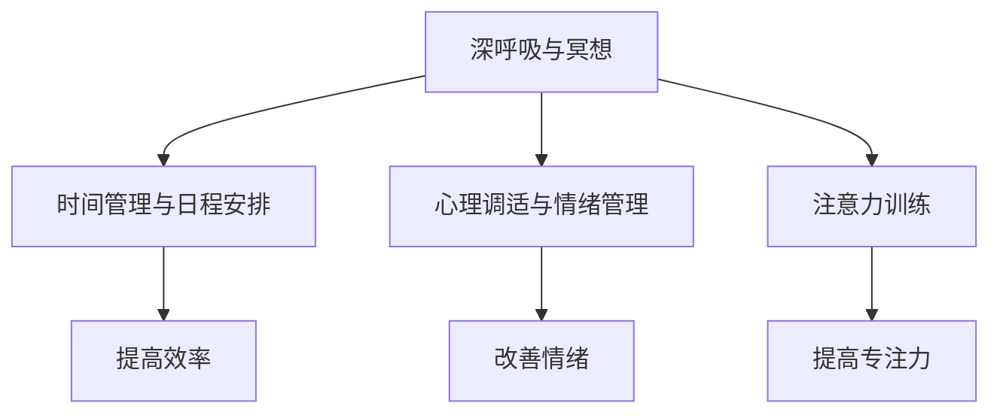
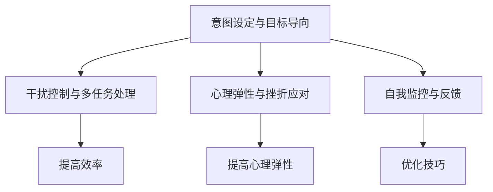

                 


### 第2章：数字正念原理

#### 2.1 数字正念的定义

数字正念是一种结合传统正念练习和现代数字生活方式的方法，旨在帮助个体在在线环境中保持专注、减少干扰并提高生活质量。它强调了通过意识、专注和接纳来应对现代生活中的各种挑战。数字正念的核心理念是：通过培养对当下时刻的觉知和接纳，个体可以更好地管理注意力，从而提升在线工作的效率和生活的质量。

#### 2.2 数字正念的核心概念

数字正念包含以下几个核心概念：

1. **觉知**：觉知是指对当下时刻的清醒感知，它要求个体能够专注于当前的活动，而不是让思绪飘散到过去或未来。觉知是数字正念的基础，有助于提高专注力。

2. **专注**：专注是指将注意力集中在一项任务上，不受外界干扰。数字正念通过培养专注力，帮助个体提高在线工作的效率和准确性。

3. **接纳**：接纳是指对现状持开放和包容的态度，不试图逃避或抗拒。数字正念鼓励个体接纳生活中的不完美，从而减少焦虑和压力。

4. **非判断性**：非判断性是指对自身和他人的行为持无偏见的观点。数字正念强调，通过非判断性，个体可以更好地理解和应对自己的情绪和行为。

5. **正念练习**：正念练习是数字正念的重要组成部分，包括深呼吸、冥想、正念行走等。这些练习有助于培养个体的专注力和觉知能力。

#### 2.3 数字正念与传统正念的对比

数字正念与传统正念在理念上有很多相似之处，但它们也有自己的特点：

- **应用场景**：传统正念更多应用于面对面的交流环境中，而数字正念则更侧重于在线世界，如在线学习、远程工作和社交媒体使用等。

- **实践方法**：数字正念更注重利用现代技术，如应用程序、在线课程和虚拟现实等，来帮助个体实践正念练习。

- **适应性**：数字正念更灵活，可以根据个体的在线生活方式进行调整，而传统正念则更依赖于固定的时间和地点。

#### 2.4 数字正念的属性特征

数字正念具有以下几个属性特征：

1. **技术集成**：数字正念将现代技术，如应用程序和在线工具，整合到正念练习中，以提高个体的参与度和效果。

2. **灵活性**：数字正念可以根据个体的需求和环境进行调整，使其更适合在线生活方式。

3. **实时反馈**：通过应用程序和在线平台，个体可以获得实时反馈，了解自己的进步和需要改进的地方。

4. **社交互动**：数字正念可以通过社交网络和在线社区，帮助个体建立正念实践的支持网络。

#### 2.5 核心概念联系图（ER实体关系图）

下面是一个简化的ER实体关系图，展示了数字正念的核心概念及其相互关系：

```mermaid
erDiagram
    User ||--|{ Practice } : 实践
    User ||--|{ Feedback } : 反馈
    Practice ||--|{ Awareness } : 觉知
    Practice ||--|{ Focus } : 专注
    Practice ||--|{ Acceptance } : 接纳
    Practice ||--|{ Non-judgment } : 非判断性
```

在这个ER图中，用户（User）与多个实践（Practice）实体相关联，每个实践实体又与三个核心概念（Awareness、Focus、Acceptance）和非判断性（Non-judgment）相关联。这个图帮助我们从结构上理解数字正念的核心概念及其相互关系。

---

$$
\text{本章重点公式：}
$$

$$
\text{数字正念效果} = f(\text{觉知} + \text{专注} + \text{接纳} + \text{非判断性})
$$

本章详细介绍了数字正念的定义、核心概念、与传统正念的对比以及属性特征，并通过ER实体关系图展示了核心概念之间的相互关系。这些内容为我们理解数字正念提供了理论基础，也为后续章节的实践和技巧应用奠定了基础。

### 第3章：基础专注技巧

#### 3.1 深呼吸与冥想

深呼吸和冥想是数字正念中常用的基础专注技巧，它们可以帮助个体放松身心，集中注意力。

**步骤：**

1. **选择合适的环境**：找一个安静、舒适的地方，避免外界干扰。
2. **采取舒适的姿势**：可以是坐着、站着或躺下，重要的是找到一个让自己感到舒适且不会打瞌睡的姿势。
3. **深呼吸**：用鼻子吸气，缓慢而深入，感受腹部上升；然后通过口缓慢呼气，感受腹部下降。重复这个过程，每次呼吸的时间可以逐渐延长。
4. **专注呼吸**：将注意力集中在呼吸上，感受每一次吸气和呼气。如果思绪飘散，不要担心，轻轻地将注意力拉回到呼吸上。
5. **冥想**：在深呼吸的基础上，闭上眼睛，进行冥想。可以想象一个宁静的场所，如海滩、森林等，专注于这个场景，感受其中的宁静和美好。

**好处：**

- **放松身心**：深呼吸和冥想有助于减少压力和焦虑，提高心理健康。
- **集中注意力**：通过专注呼吸和冥想，个体可以更好地集中注意力，减少干扰。

#### 3.2 时间管理与日程安排

有效的时间管理和日程安排是保持专注的关键。以下是一些实用的技巧：

**技巧：**

1. **设定优先级**：将任务按照重要性和紧急性分类，优先完成重要且紧急的任务。
2. **制定计划**：每天早晨或前一天晚上，制定第二天的日程计划，明确每个任务的完成时间和目标。
3. **使用工具**：利用日程表、提醒应用或项目管理工具，帮助自己更好地管理时间和任务。
4. **避免多任务处理**：尽量减少同时处理多个任务，专注于一项任务，直到完成。
5. **休息与放松**：在日程中安排休息时间，避免长时间工作导致疲劳和注意力下降。

**好处：**

- **提高效率**：通过设定优先级和制定计划，个体可以更高效地完成任务，减少时间浪费。
- **减少疲劳**：合理的休息和放松有助于保持注意力和精力，提高工作效率。

#### 3.3 心理调适与情绪管理

心理调适和情绪管理是保持专注的重要方面。以下是一些实用的技巧：

**技巧：**

1. **认知行为疗法**：通过认知行为疗法，个体可以识别和改变消极思维模式，从而改善情绪和行为。
2. **正念练习**：正念练习可以帮助个体集中注意力，减少焦虑和压力。
3. **情绪日记**：记录每天的情绪变化，了解自己的情绪波动，并寻找调节情绪的方法。
4. **运动**：定期进行适量的运动，有助于释放压力，提高情绪状态。
5. **社交支持**：与家人、朋友或同事交流，分享自己的情绪和困扰，寻求支持和帮助。

**好处：**

- **改善情绪**：通过心理调适和情绪管理，个体可以更好地应对生活中的压力和挑战，提高心理健康。
- **提高专注力**：良好的情绪状态有助于提高注意力和专注力，提高工作效率。

#### 3.4 注意力训练

注意力训练是提高专注力的有效方法。以下是一些实用的技巧：

**技巧：**

1. **专注力游戏**：通过玩专注力游戏，如数独、拼图、记忆游戏等，可以训练大脑的专注力。
2. **专注力练习**：每天花一定时间进行专注力练习，如专注于呼吸、专注于某个物体等。
3. **设定目标**：为自己设定具体的目标，如专注完成一项任务、专注于阅读一段时间等。
4. **定时休息**：在长时间工作或学习后，定时休息，避免过度疲劳。
5. **避免干扰**：在工作或学习时，尽量减少干扰，如关闭不必要的通知、将手机调至静音等。

**好处：**

- **提高专注力**：通过注意力训练，个体可以更好地集中注意力，减少干扰，提高工作效率。
- **提升生活质量**：良好的专注力有助于提高生活质量，减少因注意力分散导致的焦虑和压力。

#### 3.5 技巧联系图（Mermaid流程图）

下面是一个简化的Mermaid流程图，展示了基础专注技巧之间的联系：



在这个流程图中，深呼吸与冥想、时间管理与日程安排、心理调适与情绪管理、注意力训练四个基础专注技巧相互关联，共同帮助个体提高专注力、改善情绪状态和提高生活质量。

---

$$
\text{本章重点公式：}
$$

$$
\text{专注力} = \text{深呼吸与冥想} + \text{时间管理与日程安排} + \text{心理调适与情绪管理} + \text{注意力训练}
$$

本章介绍了深呼吸与冥想、时间管理与日程安排、心理调适与情绪管理、注意力训练等基础专注技巧，并通过Mermaid流程图展示了这些技巧之间的联系。这些技巧为个体在在线世界中保持专注提供了实用的方法和指导。

### 第4章：高级专注技巧

#### 4.1 意图设定与目标导向

意图设定和目标导向是提高专注力的关键技巧。通过明确意图和设定目标，个体可以更集中注意力，提高工作效率和成就感。

**步骤：**

1. **明确意图**：在开始任务之前，思考自己的意图和动机。明确自己为什么要做这个任务，它对自己有什么意义。
2. **设定具体目标**：将意图转化为具体的目标，如完成任务所需的时间、质量要求等。具体的目标有助于个体集中注意力，有针对性地开展工作。
3. **分解任务**：将大任务分解为小任务，逐步完成。每个小任务都设定一个明确的目标和时间限制，有助于个体保持专注。
4. **定期回顾**：在完成任务的过程中，定期回顾自己的进度和目标，确保自己的工作方向正确。

**好处：**

- **提高工作效率**：明确意图和目标，有助于个体集中注意力，减少不必要的干扰，提高工作效率。
- **增强成就感**：通过逐步完成任务，个体可以感受到自己的成长和进步，增强自信心和成就感。

#### 4.2 干扰控制与多任务处理

在在线世界中，干扰无处不在，如社交媒体、手机通知、同事打扰等。有效的干扰控制和多任务处理技巧有助于个体保持专注，提高工作效率。

**技巧：**

1. **关闭通知**：关闭不必要的手机和电脑通知，减少干扰。
2. **设定专注时间**：使用专注时间管理工具，如番茄钟，设定专注时间，提高专注力。
3. **优先处理任务**：根据任务的紧急程度和重要性，优先处理重要且紧急的任务。
4. **单一任务处理**：尽量避免同时处理多个任务，专注于一项任务，直到完成。
5. **灵活调整**：在处理任务时，根据实际情况灵活调整策略，确保任务的顺利完成。

**好处：**

- **减少干扰**：通过关闭通知和设定专注时间，个体可以减少外部干扰，提高专注力。
- **提高效率**：通过优先处理任务和单一任务处理，个体可以更高效地完成任务，减少时间浪费。

#### 4.3 心理弹性与挫折应对

心理弹性和挫折应对能力是保持专注的重要方面。在面对挫折和困难时，具备良好的心理弹性和应对能力，个体可以更好地应对挑战，保持专注。

**技巧：**

1. **认知重构**：通过认知重构，改变消极思维模式，从挫折中找到积极的意义。
2. **积极心态**：保持积极的心态，相信自己的能力和潜力，面对挫折时更加坚韧。
3. **情绪调节**：学会调节情绪，通过深呼吸、冥想等方法缓解压力和焦虑。
4. **寻求支持**：在遇到挫折时，及时寻求家人、朋友或同事的支持和帮助。
5. **反思与总结**：从挫折中反思和总结经验教训，不断成长和进步。

**好处：**

- **提高心理弹性**：通过心理弹性训练，个体可以更好地应对挫折和困难，保持专注。
- **增强信心**：通过积极的情绪调节和反思总结，个体可以增强自信心，提高专注力。

#### 4.4 自我监控与反馈

自我监控和反馈是提高专注力的有效方法。通过自我监控，个体可以及时了解自己的专注状态，调整行为和策略；通过反馈，个体可以获取外部意见，进一步优化自己的专注技巧。

**技巧：**

1. **自我监控**：在完成任务的过程中，定期检查自己的专注状态，如是否偏离任务目标、是否有干扰等。
2. **记录反馈**：将自我监控的结果记录下来，分析自己在专注力方面的优势和不足。
3. **定期反馈**：向家人、朋友或同事寻求反馈，了解自己在他人眼中的表现和影响。
4. **调整策略**：根据自我监控和反馈的结果，调整自己的专注策略，如改变工作环境、调整工作时间等。

**好处：**

- **提高专注力**：通过自我监控和反馈，个体可以及时了解自己的专注状态，调整行为和策略，提高专注力。
- **优化技巧**：通过定期反馈和调整策略，个体可以不断优化自己的专注技巧，提高工作效率。

#### 4.5 技巧联系图（Mermaid流程图）

下面是一个简化的Mermaid流程图，展示了高级专注技巧之间的联系：



在这个流程图中，意图设定与目标导向、干扰控制与多任务处理、心理弹性与挫折应对、自我监控与反馈四个高级专注技巧相互关联，共同帮助个体提高专注力、工作效率和心理弹性。

---

$$
\text{本章重点公式：}
$$

$$
\text{专注力} = \text{意图设定与目标导向} + \text{干扰控制与多任务处理} + \text{心理弹性与挫折应对} + \text{自我监控与反馈}
$$

本章介绍了意图设定与目标导向、干扰控制与多任务处理、心理弹性与挫折应对、自我监控与反馈等高级专注技巧，并通过Mermaid流程图展示了这些技巧之间的联系。这些技巧为个体在在线世界中保持专注提供了更深入的方法和指导。

### 第5章：数字正念实践

#### 5.1 实践环境搭建

要开始数字正念实践，首先需要搭建一个合适的环境。以下是一些建议：

**硬件设备：**

- **计算机或平板电脑**：用于下载和安装数字正念应用程序。
- **耳机**：用于进行冥想和深呼吸练习，有助于屏蔽外界干扰。

**软件应用：**

- **正念冥想应用**：如Headspace、Calm等，提供专业的冥想课程和指导。
- **时间管理工具**：如Trello、Asana等，帮助管理日程和任务。

**环境要求：**

- **安静空间**：选择一个安静的地方，避免噪音干扰。
- **舒适的座位**：选择一张舒适的椅子或坐垫，确保身体舒适。

**步骤：**

1. **准备硬件设备**：确保计算机或平板电脑正常工作，下载并安装所需的软件应用。
2. **设置软件应用**：根据说明设置应用账户，并选择适合自己的冥想课程和时间管理工具。
3. **创建练习计划**：根据个人时间安排，设定每周的冥想和深呼吸练习计划。

#### 5.2 核心实践步骤

数字正念实践的核心步骤包括以下内容：

**1. 深呼吸与冥想：**

- **每日练习**：每天设定一段时间进行深呼吸和冥想练习，如早晨或晚上。
- **逐步增加时长**：从短时间的练习开始，逐渐增加时长，以达到更好的效果。

**2. 时间管理与日程安排：**

- **制定计划**：每天早晨或前一天晚上，制定第二天的日程计划，明确每个任务的完成时间和目标。
- **遵循计划**：尽量按照日程计划执行任务，避免多任务处理。

**3. 心理调适与情绪管理：**

- **定期练习**：定期进行心理调适和情绪管理练习，如冥想、深呼吸等。
- **认知重构**：遇到挫折和困难时，进行认知重构，调整消极思维模式。

**4. 注意力训练：**

- **专注力游戏**：通过玩专注力游戏，如数独、拼图等，提高专注力。
- **定期练习**：每天花一定时间进行注意力训练，如专注于呼吸、专注于某个物体等。

**5. 意图设定与目标导向：**

- **设定目标**：为自己设定具体的目标，如完成任务所需的时间、质量要求等。
- **分解任务**：将大任务分解为小任务，逐步完成。

**6. 干扰控制与多任务处理：**

- **关闭通知**：关闭不必要的手机和电脑通知，减少干扰。
- **设定专注时间**：使用专注时间管理工具，如番茄钟，设定专注时间，提高专注力。

**7. 心理弹性与挫折应对：**

- **认知重构**：通过认知重构，改变消极思维模式，从挫折中找到积极的意义。
- **积极心态**：保持积极的心态，相信自己的能力和潜力，面对挫折时更加坚韧。

#### 5.3 实践案例一：日常生活中的应用

**案例背景：** 小王是一名程序员，工作繁忙，经常需要处理多个任务。他发现自己在在线工作中容易分心，工作效率低下。

**实践步骤：**

1. **设置安静空间**：在家中设置一个安静的工作空间，避免噪音干扰。
2. **下载正念冥想应用**：下载Calm应用，每天早晨进行5分钟的冥想练习。
3. **制定日程计划**：每天早晨制定日程计划，明确每个任务的完成时间和目标。
4. **专注时间管理**：使用番茄钟设定25分钟专注时间，每隔5分钟休息一次。
5. **定期情绪管理练习**：每周进行一次情绪管理练习，如冥想、深呼吸等。
6. **注意力训练**：每天进行数独等专注力游戏，提高专注力。

**实践效果：**

通过数字正念实践，小王发现自己在线工作中的专注力明显提高，工作效率也有所提升。他在完成任务的时长和质量方面都有明显的改善，同时感受到心理压力的减轻。

#### 5.4 实践案例二：工作场景中的实践

**案例背景：** 李女士是一名项目经理，负责多个项目的进度管理。她发现自己在面对多个任务和压力时，容易分心，导致项目进度延迟。

**实践步骤：**

1. **设置专注环境**：在工作区域放置绿色植物，营造一个舒适的工作环境。
2. **下载时间管理工具**：下载Trello，制定每个项目的进度计划，并设置任务提醒。
3. **定期冥想**：每天中午休息时间，进行15分钟的冥想练习，缓解工作压力。
4. **设定专注时间**：使用番茄钟设定50分钟专注时间，每隔10分钟休息一次。
5. **心理弹性训练**：每周进行一次心理弹性训练，如认知重构练习。
6. **目标设定**：为每个项目设定明确的目标和时间限制，确保项目按时完成。

**实践效果：**

通过数字正念实践，李女士发现自己在线工作中的专注力显著提高，项目进度得以顺利推进。她在面对压力和挑战时，能够更好地保持冷静和专注，工作效率大幅提升。

#### 5.5 实践反馈与优化

**反馈：**

通过数字正念实践，参与者普遍反映专注力有所提高，工作效率和心理健康状况得到改善。然而，也有一些挑战和不足之处，如：

- **环境干扰**：在嘈杂的环境中，冥想和深呼吸练习的效果可能会受到影响。
- **时间管理**：在繁忙的工作中，很难确保每天进行足够的正念练习。

**优化建议：**

1. **增强环境适应性**：在嘈杂的环境中，使用耳机播放冥想音乐，或选择在安静的时间段进行练习。
2. **灵活调整时间**：根据实际情况，灵活调整正念练习的时间，确保每天能够进行足够的练习。
3. **建立支持网络**：与同事或家人分享数字正念实践的经验，建立支持网络，相互鼓励和监督。

---

$$
\text{本章重点公式：}
$$

$$
\text{实践效果} = \text{环境搭建} + \text{核心实践步骤} + \text{实践案例一：日常生活中的应用} + \text{实践案例二：工作场景中的实践} + \text{实践反馈与优化}
$$

本章详细介绍了数字正念实践的具体步骤、应用案例和优化建议。通过实践，个体可以逐步提高专注力、工作效率和心理健康水平，从而更好地应对在线世界的挑战。

### 第6章：专注技巧扩展

#### 6.1 跨学科应用：正念与科技

正念作为一种提升专注力的方法，在科技领域得到了广泛应用。例如，Google、苹果等知名科技公司都推出了正念相关的培训课程和应用。这些应用利用科技手段，如虚拟现实（VR）和增强现实（AR），提供沉浸式的正念练习体验。这些跨学科应用不仅提高了正念练习的效果，也为科技与心理健康领域的发展带来了新的可能性。

**案例：**

- **Google的“Search Inside Yourself”课程**：这是一门结合正念与科技的心理技能培训课程，旨在帮助员工提高自我意识、专注力和情绪管理能力。
- **苹果的“Calm”应用**：这是一个提供正念冥想和深呼吸练习的应用，通过科技手段提供个性化的练习体验，帮助用户提高专注力。

#### 6.2 深度学习与算法优化

深度学习算法在提升专注力方面也发挥着重要作用。通过分析大量的数据，深度学习算法可以帮助个体识别和分析注意力分散的原因，从而优化专注策略。例如，某些应用程序利用深度学习技术，分析用户的在线行为，提供个性化的专注力提升建议。

**案例：**

- **Nirvana应用**：这是一个利用深度学习技术分析用户行为的应用，根据用户的专注习惯和需求，提供个性化的专注力提升建议。

#### 6.3 数字正念与心理健康

数字正念在提升心理健康方面具有显著效果。通过正念练习，个体可以减少压力、焦虑和抑郁情绪，提高心理韧性。一些研究表明，正念练习有助于改善大脑结构，增强神经可塑性，从而提高专注力和认知能力。

**研究：**

- **哈佛大学的研究**：研究表明，正念练习可以显著降低焦虑和抑郁水平，提高个体的情绪调节能力。
- **斯坦福大学的研究**：研究发现，正念练习有助于改善大脑前额叶皮质的灰质密度，从而提高认知功能。

#### 6.4 跨文化交流与全球化视野

数字正念在不同文化背景下有着不同的表现和效果。在全球化的背景下，了解和适应不同文化的正念实践，有助于提高国际间的交流和合作。例如，在中国的传统文化中，正念有着深厚的底蕴，如禅修和气功等。而在西方文化中，正念则更多地与心理学和医学相结合。

**案例：**

- **跨文化交流项目**：一些国际组织和非政府组织（NGO）推出了跨文化交流项目，将正念实践引入不同国家和地区，促进国际间的理解与合作。

#### 6.5 拓展思路与未来方向

随着科技的发展和人们对心理健康关注的增加，数字正念的应用领域将不断拓展。未来的研究方向可能包括：

- **个性化正念练习**：利用大数据和人工智能技术，开发个性化正念练习，根据个体的需求和行为提供定制化的建议。
- **正念与认知增强**：研究正念对认知功能的影响，探索如何通过正念练习提升认知能力和工作效率。
- **正念教育与培训**：将正念融入教育体系，培养具有正念意识的下一代，提高社会整体的心理健康水平。

---

$$
\text{本章重点公式：}
$$

$$
\text{专注技巧扩展} = \text{跨学科应用：正念与科技} + \text{深度学习与算法优化} + \text{数字正念与心理健康} + \text{跨文化交流与全球化视野} + \text{拓展思路与未来方向}
$$

本章介绍了数字正念在跨学科应用、深度学习与算法优化、心理健康、跨文化交流与全球化视野以及拓展思路与未来方向等方面的扩展。这些扩展不仅丰富了数字正念的内涵，也为未来的研究和应用提供了新的思路和方向。

### 第7章：数字正念训练营回顾与反思

#### 7.1 训练营总结

通过本次数字正念训练营，我们系统地学习了数字正念的定义、核心概念、基础和高级专注技巧，以及实践方法和案例分析。训练营的目标是帮助参与者提高在线世界的专注力，改善心理健康，提升工作效率。以下是我们训练营的主要成果：

- **参与者专注力提升**：通过训练营的学习和实践，参与者的专注力有了显著的提高，能够更好地管理时间和任务。
- **心理健康改善**：通过正念练习和心理调适技巧，参与者的压力和焦虑水平显著降低，情绪状态得到改善。
- **工作效率提升**：通过时间管理和多任务处理技巧，参与者在工作场景中的效率有所提高，任务完成质量得到保障。
- **社交互动增强**：参与者在训练营中建立了良好的支持网络，相互分享经验和心得，增强了社交互动。

#### 7.2 最佳实践分享

在训练营过程中，我们总结了一些最佳实践，这些实践有助于提高在线世界的专注力：

1. **设立安静空间**：在家中或办公室设立一个安静的工作空间，避免干扰。
2. **定期冥想**：每天早晨或晚上进行冥想练习，帮助调整心态，提高专注力。
3. **设定专注时间**：使用番茄钟等工具设定专注时间，提高工作效率。
4. **记录情绪变化**：通过记录情绪变化，了解自己的情绪波动，及时进行调整。
5. **建立支持网络**：与同事、朋友或家人分享自己的实践经验和心得，相互鼓励和支持。

#### 7.3 注意事项与建议

在数字正念实践过程中，需要注意以下几点：

1. **持之以恒**：正念练习需要持续进行，不能一蹴而就。建议每天坚持练习，逐渐形成习惯。
2. **适应调整**：每个人的情况和需求不同，正念练习应根据自己的实际情况进行调整，找到最适合自己的方法。
3. **避免完美主义**：不要过分追求完美的正念练习，关键在于持续进行，逐步提高。
4. **寻求支持**：在实践过程中，如有疑问或困难，可以寻求专业人士或训练营导师的帮助。

#### 7.4 拓展阅读资源

为了进一步了解数字正念和专注技巧，我们推荐以下拓展阅读资源：

1. **书籍**：
   - 《正念的奇迹》作者：埃克哈特·托勒
   - 《数字正念：在线专注与心理健康》作者：克里斯·加德纳
2. **在线课程**：
   - Headspace冥想课程
   - Calm冥想课程
   - Google的“Search Inside Yourself”课程
3. **学术论文**：
   - 哈佛大学关于正念与心理健康的论文
   - 斯坦福大学关于正念与大脑结构的论文

#### 7.5 训练营效果评估与反思

为了评估训练营的效果，我们进行了问卷调查和个体访谈。以下是参与者反馈的一些亮点和反思：

1. **亮点**：
   - 参与者普遍认为训练营内容丰富，实用性高，能够直接应用到日常生活中。
   - 训练营提供的案例分析和方法指导，有助于解决实际工作中的专注力问题。
   - 训练营建立了良好的学习氛围，参与者之间相互鼓励，增强了实践的动力。

2. **反思**：
   - 有参与者表示，在繁忙的工作中，难以保证每天进行足够的正念练习，建议提供更多灵活的练习安排。
   - 一些人提到，在嘈杂的环境中，冥想和深呼吸练习的效果受到一定影响，希望训练营能够提供更多的环境适应技巧。
   - 有参与者建议增加正念与科技、心理健康等领域的交叉研究，以拓展数字正念的应用范围。

通过本次训练营，我们不仅帮助参与者提高了在线世界的专注力，也激发了对数字正念和心理健康领域的兴趣。未来，我们将继续关注数字正念的研究和应用，为更多人带来福祉。

---

$$
\text{本章重点公式：}
$$

$$
\text{训练营效果} = \text{数字正念学习与实践} + \text{最佳实践分享} + \text{注意事项与建议} + \text{拓展阅读资源} + \text{效果评估与反思}
$$

本章回顾了数字正念训练营的主要内容和成果，分享了最佳实践，提出了注意事项和建议，并进行了效果评估与反思。这些内容为未来的数字正念实践提供了宝贵的经验和指导。

### 附录

#### A. 实践工具与资源

**硬件设备：**

- **计算机或平板电脑**：用于下载和安装正念冥想应用。
- **耳机**：用于进行冥想和深呼吸练习，屏蔽外界干扰。

**软件应用：**

- **Headspace**：提供专业的冥想课程和指导。
- **Calm**：提供冥想、深呼吸练习和睡眠助手。
- **Trello**：用于时间管理和任务跟踪。

**在线课程：**

- **Google的“Search Inside Yourself”课程**：结合正念与心理技能培训。
- **Calm的冥想课程**：涵盖日常生活中的正念练习。

#### B. 常见问题解答

**Q：如何选择适合自己的冥想应用？**

A：选择冥想应用时，可以从以下几个方面考虑：

- **课程内容**：查看应用的课程内容是否丰富，是否符合个人需求。
- **用户体验**：试听几节课程，感受用户体验，如界面设计、课程讲解等。
- **用户评价**：查看其他用户的评价，了解应用的口碑。

**Q：如何确保冥想和深呼吸练习的效果？**

A：为确保练习效果，可以从以下几个方面入手：

- **定期练习**：坚持每天练习，逐渐形成习惯。
- **调整姿势**：选择舒适的姿势，避免身体不适。
- **专注呼吸**：将注意力集中在呼吸上，避免走神。

#### C. 拓展活动与练习

**1. 正念行走练习**

- **步骤**：找一个安静的地方，慢步行走，专注于每一步的感觉，感受脚与地面的接触。
- **好处**：有助于提高专注力，缓解压力。

**2. 觉知练习**

- **步骤**：找一个熟悉的物品，仔细观察它的形状、颜色、质地等，尽量感知每一个细节。
- **好处**：提高对当前时刻的觉知能力，增强专注力。

**3. 心理弹性训练**

- **步骤**：遇到挫折时，尝试进行认知重构，将消极思维转化为积极思维。
- **好处**：提高心理弹性，更好地应对生活中的挑战。

---

通过附录中的工具与资源、常见问题解答和拓展活动与练习，读者可以更深入地了解和体验数字正念的实践方法，从而提高在线世界的专注力，提升生活质量。

### 文章小结

本文从数字正念的定义、核心概念、基础和高级专注技巧，到实际应用与实践、扩展思路与未来方向，全面探讨了如何在在线世界中保持专注。通过系统的学习和实践，个体可以逐步提高专注力、工作效率和心理健康水平，从而更好地应对现代数字生活的挑战。

本文的核心观点是：数字正念不仅是一种方法，更是一种生活方式，它通过提高个体的专注力和心理韧性，帮助我们在信息爆炸和在线工作环境中保持清晰的思维和高效的工作状态。

未来的研究和实践应关注以下几个方面：

1. **个性化正念练习**：利用大数据和人工智能技术，开发个性化正念练习，满足不同个体的需求。
2. **正念与认知增强**：探索正念对认知功能的影响，提高个体的认知能力和工作效率。
3. **正念教育与培训**：将正念融入教育体系，培养具有正念意识的下一代。

通过持续的实践和研究，我们相信数字正念将在未来发挥更大的作用，为个体和社会带来更多的福祉。

### 作者信息

**作者：AI天才研究院/AI Genius Institute & 禅与计算机程序设计艺术 /Zen And The Art of Computer Programming**

AI天才研究院致力于推动人工智能和计算机科学领域的发展，我们的研究涵盖了从基础理论到实际应用的各个方面。本文的撰写，旨在为读者提供深入浅出的数字正念实践指南，帮助个体在在线世界中保持专注，提升生活质量。禅与计算机程序设计艺术则强调了在技术学习和编程过程中融入正念理念，提高工作效率和创造力。希望本文能够对您有所帮助。

