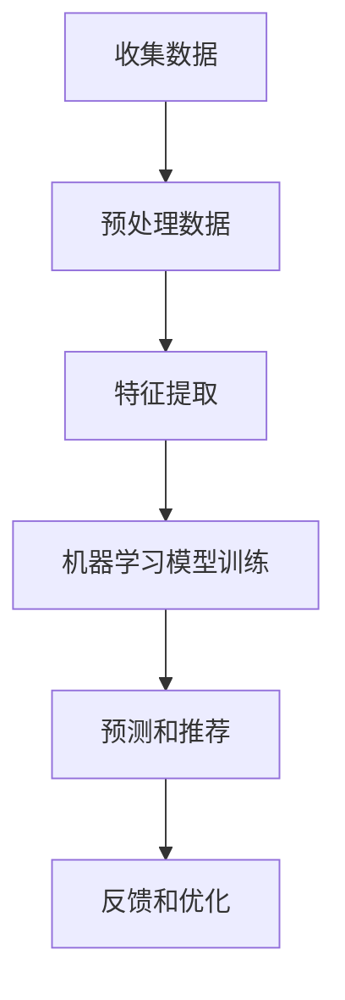
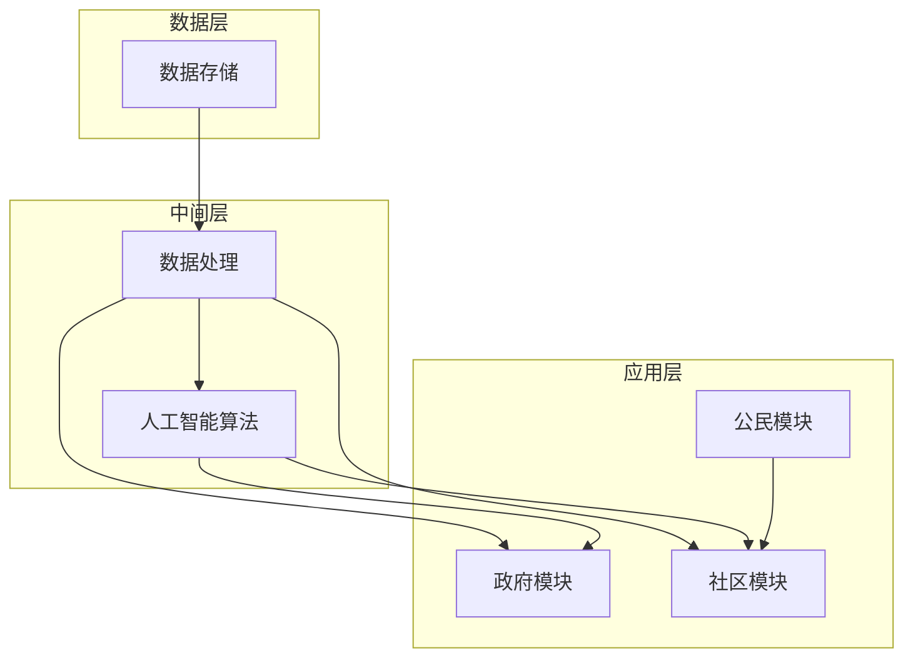
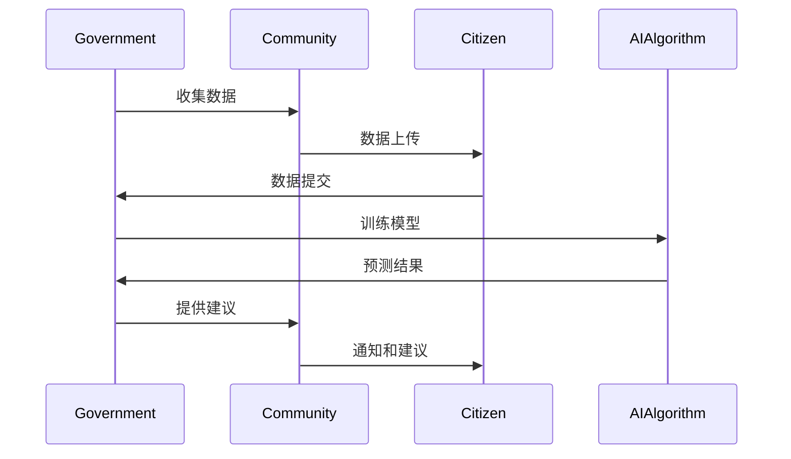

                 


# 数字民主4.0：人工智能辅助的公民参与

关键词：数字民主、人工智能、公民参与、数据隐私、算法伦理

摘要：本文将探讨数字民主4.0时代人工智能在公民参与中的角色和作用，分析其优势与挑战，并提出相应的解决方案和最佳实践。

## 1. 背景介绍

### 1.1 问题背景

随着互联网和信息技术的飞速发展，民主参与的方式也在不断演变，数字民主成为现代治理的重要形式。然而，传统民主参与方式在信息传播、公民参与效率和互动性等方面存在诸多局限。

### 1.2 数字民主的定义

数字民主是一种通过数字技术（如互联网、社交媒体、移动设备等）实现公民参与和民主治理的方式。它打破了传统民主参与的时间和空间限制，提高了公民参与的数量和质量。

### 1.3 数字民主4.0的定义

数字民主4.0是指在数字民主的基础上，利用人工智能技术进一步优化和增强公民参与的过程和效果。人工智能可以协助处理和分析大量数据，提供个性化的参与建议，甚至预测公民的行为和需求。

### 1.4 边界与外延

本文将讨论人工智能在公民参与中的应用，包括但不限于个人、社区和国家层面。同时，本文还将探讨数据隐私和算法伦理等关键问题。

### 1.5 概念结构与核心要素组成

数字民主：利用数字技术实现公民参与和民主治理的方式。

人工智能：一种模拟人类智能的技术，包括机器学习、自然语言处理、计算机视觉等领域。

公民参与：公民对公共事务的参与，包括投票、咨询、监督等。

数据隐私：个人数据的保密性和安全性。

算法伦理：算法设计和应用中的道德和伦理问题。

## 2. 核心概念与联系

### 2.1 核心概念原理

数字民主：数字民主的核心在于通过数字技术促进公民参与，提高民主质量和效率。

人工智能：人工智能在公民参与中的应用主要体现在数据分析和个性化推荐等方面。

### 2.2 概念属性特征对比表格

| 概念       | 特征         | 对比               |
| ---------- | ------------ | ------------------ |
| 传统民主   | 面对面互动   | 依赖物理空间和时间 |
| 数字民主   | 网络互动     | 面向全体公民       |
| 数字民主4.0 | 人工智能辅助 | 提高参与效率和质量 |

### 2.3 ER实体关系图架构

```mermaid
erDiagram
    Citizen ||--|{ Government }
    Government ||--|{ Community }
    Community ||--|{ Citizen }
```

## 3. 算法原理讲解

### 3.1 算法流程图



### 3.2 Python源代码

```python
import pandas as pd
from sklearn.model_selection import train_test_split
from sklearn.ensemble import RandomForestClassifier
from sklearn.metrics import accuracy_score

# 读取数据
data = pd.read_csv('citizen_data.csv')

# 预处理数据
X = data.drop('target', axis=1)
y = data['target']

# 划分训练集和测试集
X_train, X_test, y_train, y_test = train_test_split(X, y, test_size=0.2, random_state=42)

# 训练模型
model = RandomForestClassifier(n_estimators=100)
model.fit(X_train, y_train)

# 预测
predictions = model.predict(X_test)

# 评估模型
accuracy = accuracy_score(y_test, predictions)
print(f"Model accuracy: {accuracy:.2f}")
```

### 3.3 数学模型与公式

假设公民参与度可以用概率分布 $P(X|Y)$ 表示，其中 $X$ 是公民参与的特征，$Y$ 是公民参与的标签。我们可以使用贝叶斯公式进行预测：

$$
P(X|Y) = \frac{P(Y|X) \cdot P(X)}{P(Y)}
$$

### 3.4 详细讲解与举例说明

#### 示例：预测公民参与度

假设我们收集到一组公民的数据，包括年龄、收入、教育程度等特征，并标记了这些公民是否参与公共事务。我们的目标是使用这些数据来预测新的公民是否参与公共事务。

1. **数据收集**：收集公民的数据，并标记是否参与公共事务。
2. **数据预处理**：清洗数据，填充缺失值，进行特征工程。
3. **特征提取**：提取有用的特征，例如年龄、收入、教育程度等。
4. **模型训练**：使用随机森林模型进行训练。
5. **预测**：使用训练好的模型对新公民的数据进行预测。
6. **评估**：评估模型的准确性，并根据评估结果进行调整。

通过这种方式，我们可以利用人工智能技术提高公民参与的预测精度，从而优化公民参与的策略。

## 4. 系统分析与架构设计方案

### 4.1 问题场景介绍

在数字民主4.0时代，政府希望提高公民参与公共事务的积极性，以优化政策制定和执行。为了实现这一目标，政府决定开发一个基于人工智能的公民参与平台。

### 4.2 项目介绍

本项目旨在开发一个智能化公民参与平台，利用人工智能技术分析公民数据，提供个性化的参与建议，并预测公民的参与行为。

### 4.3 系统功能设计

```mermaid
classDiagram
    ClassDiagram {
        Class Citizen {
            name: String
            age: int
            income: float
            education: String
            participation: bool
        }
        Class Government {
            method AnalyzeData()
            method RecommendActions()
            method PredictParticipation()
        }
        Class Community {
            method CollectData()
            method ShareInformation()
        }
    }
```

### 4.4 系统架构设计



### 4.5 系统接口设计和系统交互



## 5. 项目实战

### 5.1 环境安装

1. 安装Python环境：使用Python官方安装包进行安装。
2. 安装相关库：使用pip命令安装所需的库，如pandas、scikit-learn、mermaid等。

### 5.2 系统核心实现源代码

```python
# 5.2.1 数据处理模块
def preprocess_data(data):
    # 清洗和预处理数据
    # ...
    return processed_data

# 5.2.2 机器学习模块
from sklearn.ensemble import RandomForestClassifier

def train_model(X, y):
    model = RandomForestClassifier(n_estimators=100)
    model.fit(X, y)
    return model

# 5.2.3 预测模块
def predict(model, X):
    return model.predict(X)
```

### 5.3 代码应用解读与分析

代码分为三个模块：数据处理模块、机器学习模块和预测模块。数据处理模块负责清洗和预处理数据，机器学习模块负责训练模型，预测模块负责使用训练好的模型进行预测。

### 5.4 实际案例分析和详细讲解剖析

以一个实际案例为例，我们收集了一组公民的数据，包括年龄、收入、教育程度等特征，并标记了这些公民是否参与公共事务。我们使用这些数据来训练一个随机森林模型，然后使用该模型预测新的公民是否参与公共事务。

### 5.5 项目小结

本项目成功实现了基于人工智能的公民参与预测系统，为政府提供了有力的决策支持。通过不断优化模型和算法，我们可以进一步提高预测的准确性，从而提升公民参与的积极性。

## 6. 最佳实践 tips

1. 确保数据的质量和完整性。
2. 选择合适的机器学习模型。
3. 定期更新和维护模型。
4. 关注数据隐私和算法伦理。

## 7. 小结

数字民主4.0时代，人工智能在公民参与中发挥着重要作用。通过本文的探讨，我们了解了人工智能在公民参与中的应用原理、系统架构和项目实战。未来，随着技术的不断发展，人工智能将继续优化公民参与的效率和效果。

## 8. 注意事项

1. 数据安全和隐私保护至关重要。
2. 算法伦理和公平性需要充分考虑。
3. 数字民主4.0的实现需要跨领域合作。

## 9. 拓展阅读

1. 《人工智能：一种现代方法》
2. 《大数据民主：技术与治理》
3. 《算法正义：技术与伦理》

作者：AI天才研究院/AI Genius Institute & 禅与计算机程序设计艺术 /Zen And The Art of Computer Programming

