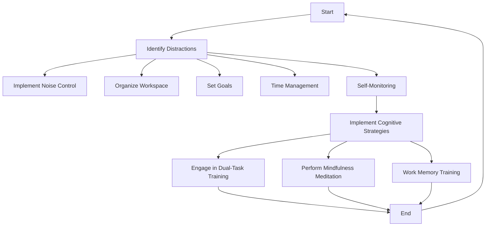

                 

### Introduction to Digital Attention and its Importance

#### 1.1 Background and Definition of Digital Attention

Digital attention refers to the ability to focus on digital stimuli, such as computer screens, mobile devices, and online content. In today’s technologically advanced society, digital attention has become increasingly important. It is the cornerstone of effective digital communication, productivity, and learning. The term "digital attention" encapsulates several aspects: the capacity to sustain focus, the ability to shift attention between different digital tasks, and the capacity to resist distractions.

The concept of attention itself has been a subject of intense research across various disciplines, including psychology, neuroscience, and cognitive science. Historically, attention has been categorized into different types: visual attention, which involves processing visual stimuli; auditory attention, which focuses on auditory inputs; and cognitive attention, which involves mental processes such as decision-making and problem-solving.

#### 1.2 The Impact of Digital Distraction on Modern Life

Digital distractions are pervasive in our modern lives, contributing significantly to reduced attention spans and decreased productivity. The proliferation of digital devices and the constant influx of notifications have fragmented our attention. For instance, the average human attention span has reportedly decreased from 12 seconds in the year 2000 to just 8 seconds, comparable to that of a goldfish. This phenomenon, often referred to as "attention deficit," is exacerbated by the multifaceted nature of digital environments, which frequently demand rapid shifts in focus.

The impact of digital distraction on productivity is evident in both personal and professional settings. In the workplace, constant interruptions from emails, instant messages, and social media can lead to a loss of productivity known as "presenteeism." Similarly, in education, students' ability to concentrate on academic tasks is often compromised by the temptation of digital distractions, leading to lower learning outcomes.

#### 1.3 The Role of Comprehensive Training Centers

In response to these challenges, comprehensive training centers dedicated to improving digital attention have emerged. These centers aim to provide structured programs that enhance attentional capacities through a combination of cognitive training, environmental modifications, and behavioral interventions. The role of these centers is multifaceted:

1. **Assessment and Diagnosis**: Comprehensive training centers offer tools and methods to assess an individual’s attentional abilities, identifying specific areas for improvement.
2. **Cognitive Training**: These centers employ a range of cognitive training exercises designed to improve attentional control and regulation.
3. **Environmental Modifications**: By creating distraction-free environments and implementing strategies to minimize interruptions, training centers help individuals maintain focus.
4. **Behavioral Interventions**: Training centers often provide psychological and behavioral strategies to help individuals manage their attention better, both in the training environment and in their everyday lives.

#### 1.4 Objectives of the Book

This book aims to provide a comprehensive overview of digital attention and its importance in modern life. It will explore the core concepts and theories of attention, delve into the tools and methods for assessing and enhancing attention, and present practical applications and case studies. The objectives are as follows:

1. **Educate and Inform**: To provide readers with a deep understanding of digital attention, its mechanisms, and its impact on various aspects of life.
2. **Offer Solutions**: To present practical strategies and techniques for enhancing attention, including both cognitive and behavioral interventions.
3. **Facilitate Implementation**: To guide the design and implementation of comprehensive training programs in various settings, such as educational institutions, workplaces, and private practice.
4. **Generate Research and Discussion**: To stimulate further research and discussion in the field of digital attention, with the goal of developing more effective and innovative approaches to enhancing attention.

In summary, this book is designed to be a valuable resource for anyone interested in improving their attentional abilities, whether they are educators, trainers, professionals, or simply individuals seeking to enhance their focus and productivity in the digital age.

### Core Concepts and Theories of Attention

#### 2.1 Definition and Types of Attention

Attention is a cognitive process that allows individuals to selectively focus on specific stimuli while ignoring others. It is the mechanism that enables us to process information from our environment efficiently. Attention can be broadly categorized into three types: visual attention, auditory attention, and cognitive attention.

- **Visual Attention**: This type of attention involves processing visual stimuli from the environment. It allows individuals to focus on specific objects, movements, or patterns within their visual field. Visual attention is crucial for tasks such as reading, driving, and recognizing faces.

- **Auditory Attention**: Auditory attention focuses on auditory stimuli, enabling individuals to concentrate on specific sounds or conversations while filtering out background noise. This type of attention is essential for activities like listening to lectures or participating in meetings.

- **Cognitive Attention**: Cognitive attention encompasses higher-order mental processes such as decision-making, problem-solving, and planning. It involves directing cognitive resources to maintain focus on a specific task or goal. Cognitive attention is critical for complex tasks that require sustained mental effort.

#### 2.2 Attention Mechanisms in the Brain

The neural mechanisms underlying attention are complex and involve multiple brain regions. Here, we explore some key areas of the brain associated with attention:

- **Prefrontal Cortex**: The prefrontal cortex (PFC) is responsible for executive functions, including attention regulation, working memory, and cognitive control. Damage to the PFC can lead to deficits in attention and cognitive function.

- **Cingulate Cortex**: The cingulate cortex is involved in attentional control and error detection. It helps maintain attention by monitoring the accuracy of ongoing tasks and adjusting attentional focus accordingly.

- **Striatum**: The striatum, a part of the basal ganglia, is crucial for reward-based attention. It helps to sustain attention on rewarding stimuli and can influence decision-making processes.

- **Thalamus**: The thalamus acts as a relay station for sensory information, routing it to the appropriate regions of the cortex. It plays a role in modulating attentional focus by regulating the flow of sensory information.

#### 2.3 Theories of Attention: Visual, Auditory, and Cognitive

There are several theoretical frameworks that attempt to explain attention. Below, we discuss some of the key theories for visual, auditory, and cognitive attention:

- **Visual Attention Theory (Filter Theory)**: Filter Theory proposes that attention acts as a filter that allows only a subset of stimuli to reach conscious awareness. According to this theory, the preattentive process automatically filters out non-attended stimuli, while the attentive process selectively amplifies and sustains focus on relevant stimuli.

- **Auditory Attention Theory (Selective Theory)**: The Selective Theory of Auditory Attention posits that attention selectively amplifies relevant auditory stimuli while suppressing irrelevant sounds. This theory suggests that attention is a resource-limited process that can only process a limited amount of information at any given time.

- **Cognitive Attention Theory (Hierarchical Model)**: The Hierarchical Model of Cognitive Attention proposes that attention operates in a hierarchical manner, with top-down and bottom-up processes interacting to guide focus. Top-down processes involve the intentional selection of goals and the allocation of attentional resources, while bottom-up processes are driven by the salience and novelty of stimuli.

#### 2.4 Attentional Control and Regulation

Attentional control refers to the ability to actively manage and direct attention towards specific goals or tasks. It involves two main components: allocation and switching. Allocation involves the ability to focus on a single task or stimulus, while switching involves the ability to shift attention between different tasks or stimuli.

Attentional regulation is the process of adjusting attentional focus to meet the demands of a given situation. This can involve strategies such as:

- **Cognitive Control**: This strategy involves the use of mental processes to regulate attentional focus, such as setting goals, planning, and self-monitoring.

- **Cognitive Flexibility**: This strategy involves the ability to adapt attentional focus based on changing circumstances or tasks.

- **Sustained Attention**: This strategy involves maintaining attention over an extended period, often through the use of sustained mental effort and motivation.

#### 2.5 Mermaid ER Diagram of Attention Components

To further illustrate the components of attention, we can use a Mermaid ER diagram. Here's a representation of the key entities and relationships involved in attention:

```mermaid
erDiagram
  Attention <<--|Constraint|--> Goal
  Attention ||--|Component|--> Selective Attention
  Attention ||--|Component|--> Divided Attention
  Attention ||--|Component|--> Sustained Attention
  Attention ||--|Component|--> Diverted Attention
  Goal ||--|Component|--> Task
  Task ||--|Relation|--> Performance
```

In this diagram, "Attention" is the central entity representing the cognitive process of focusing on a specific stimulus or task. It is connected to various components, including "Selective Attention," "Divided Attention," "Sustained Attention," and "Diverted Attention." The "Goal" entity represents the overarching objective that guides attention, which is linked to the "Task" entity. The "Task" entity further relates to "Performance," indicating the outcome of attentional focus.

By understanding these core concepts and theories, we can better appreciate the complexity of attention and the strategies available for enhancing it. In the next section, we will delve deeper into the tools and methods used for assessing and understanding attentional abilities.

### Assessing and Understanding Attention

#### 3.1 Tools and Methods for Assessing Attention

Assessing attention involves the use of various tools and methods that help to measure and evaluate an individual's attentional abilities. These assessments are critical for diagnosing attentional disorders, identifying areas for improvement, and monitoring progress over time. Below, we discuss some of the key tools and methods used in attention assessment.

1. **Psychological Tests**: 
   - **Wechsler Adult Intelligence Scale (WAIS) – Fourth Edition**: This widely used intelligence test includes several subtests that assess various cognitive functions, including attention and concentration.
   - **Test of Variables of Attention (T.O.V.A.)**: T.O.V.A. is a comprehensive battery of tests designed to assess attentional problems, such as distractibility and impulsivity. It measures various aspects of attention, including response latency, response accuracy, and variability.

2. **Neuropsychological Tests**: 
   - **Trail Making Test (TMT)**: The TMT assesses attentional speed and efficiency by requiring participants to connect a series of numbers and letters in sequence as quickly as possible.
   - **Stroop Test**: This test measures the ability to inhibit responses to irrelevant stimuli, reflecting the cognitive control of attention.

3. **Behavioral Assessments**:
   - **Daily Activities Assessment**: Observing individuals in their natural environment can provide valuable insights into their attentional behaviors. Teachers, parents, and colleagues can provide detailed reports on attentional habits and patterns.
   - **Workplace Assessments**: In a professional setting, attention can be assessed through performance metrics such as task completion times, error rates, and productivity.

4. **Neuroimaging Techniques**:
   - **Functional Magnetic Resonance Imaging (fMRI)**: fMRI allows researchers to study brain activity in real-time and identify regions of the brain involved in attentional processes.
   - **Electroencephalography (EEG)**: EEG measures the electrical activity of the brain and can be used to identify attentional states and detect abnormalities in brain wave patterns.

#### 3.2 Attentional Disorders and Their Impacts

Attentional disorders, such as attention deficit hyperactivity disorder (ADHD) and attention deficit disorder (ADD), are common conditions that can significantly impact an individual's daily functioning. These disorders are often characterized by difficulties in sustaining attention, managing impulsivity, and controlling hyperactivity.

- **ADHD**: Individuals with ADHD typically exhibit symptoms such as inattention, hyperactivity, and impulsivity. These symptoms can interfere with academic performance, social interactions, and occupational success. ADHD is believed to result from a combination of genetic, environmental, and neurobiological factors.

- **ADD**: ADD shares some similarities with ADHD but typically manifests with predominantly inattentive symptoms. Individuals with ADD may struggle with tasks that require sustained attention, such as listening during lectures or following multi-step instructions.

#### 3.3 The Importance of Attention in Education and Work

Attention is a fundamental skill that is crucial for both academic success and professional achievement. In the educational context, attention determines the ability to absorb and retain information, complete assignments, and perform well on exams. Students who struggle with attentional issues are often at a disadvantage, facing difficulties in staying focused during lectures and completing homework.

In the workplace, attention is equally important. It affects productivity, decision-making, and the ability to handle complex tasks. Employees who have difficulty maintaining attention are more prone to errors, missed deadlines, and decreased job performance. For instance, in roles that require high levels of concentration, such as surgery or aviation, attentional lapses can have severe consequences.

#### 3.4 Mermaid Class Diagram of Attention Assessment Methods

To visually represent the various assessment methods and their relationships, we can use a Mermaid class diagram. Below is an example illustrating the key classes and their attributes:

```mermaid
classDiagram
  PsychologicalTest <<|-- WAIS : implements
  PsychologicalTest <<|-- T.O.V.A. : implements
  NeuropsychologicalTest <<|-- TMT : implements
  NeuropsychologicalTest <<|-- StroopTest : implements
  BehavioralAssessment <<|-- DailyActivitiesAssessment : extends
  BehavioralAssessment <<|-- WorkplaceAssessment : extends
  NeuroimagingTechnique <<|-- fMRI : implements
  NeuroimagingTechnique <<|-- EEG : implements

  class PsychologicalTest {
    -test_name: String
    -test_type: String
  }
  
  class NeuropsychologicalTest {
    -test_name: String
    -test_duration: Integer
  }
  
  class BehavioralAssessment {
    -assessment_type: String
    -context: String
  }
  
  class NeuroimagingTechnique {
    -imaging_technique: String
    -brain_region: String
  }
  
  WAIS : implements PsychologicalTest
  T.O.V.A. : implements PsychologicalTest
  TMT : implements NeuropsychologicalTest
  StroopTest : implements NeuropsychologicalTest
  DailyActivitiesAssessment : extends BehavioralAssessment
  WorkplaceAssessment : extends BehavioralAssessment
  fMRI : implements NeuroimagingTechnique
  EEG : implements NeuroimagingTechnique
```

This diagram shows how different classes of assessments (psychological, neuropsychological, behavioral, and neuroimaging) are interconnected and extended from a common base class. Each class represents a specific method of assessing attention, with attributes that define key characteristics of the assessment.

By employing these tools and methods, we can gain a comprehensive understanding of an individual's attentional abilities, identify areas for improvement, and develop effective strategies to enhance attention. In the next section, we will explore the principles and techniques for enhancing attention, focusing on both cognitive and environmental strategies.

### Principles and Techniques for Enhancing Attention

#### 4.1 Cognitive Strategies for Improving Attention

Improving attention often requires a combination of cognitive strategies designed to enhance focus, memory, and mental efficiency. Here, we outline several cognitive strategies that can be effectively employed to boost attentional abilities:

1. **Chunking**:
   - **Definition**: Chunking involves breaking down complex information into smaller, manageable units or chunks. This makes it easier to process and remember information.
   - **Application**: For example, instead of trying to remember a long sequence of numbers (e.g., 123456789), you can group them into chunks (e.g., 123-456-789). This technique is particularly useful for tasks that involve memorization, such as learning new phone numbers or passwords.

2. **Mindfulness Meditation**:
   - **Definition**: Mindfulness meditation is a practice that involves focusing one's attention on the present moment, accepting thoughts and emotions without judgment.
   - **Application**: Regular mindfulness meditation can improve attentional control and reduce the impact of distractions. Practicing mindfulness for just a few minutes each day can enhance concentration and reduce stress, leading to better attentional performance.

3. **Working Memory Training**:
   - **Definition**: Working memory is the ability to hold and manipulate information in the mind over short periods of time. Working memory training involves exercises designed to improve this cognitive function.
   - **Application**: Techniques such as the N-Back task, in which participants are required to track a specific stimulus (e.g., a letter or number) that appears in the sequence, can enhance working memory and attentional capacities.

4. **Dual-Task Training**:
   - **Definition**: Dual-task training involves performing two tasks simultaneously to improve the efficiency of attentional switching and divided attention.
   - **Application**: Examples include juggling, where individuals must simultaneously manage multiple objects, or playing sports that require coordination and quick decision-making. These activities can enhance the brain's ability to switch attention between different tasks efficiently.

#### 4.2 Environmental and Situational Modifications

Creating an environment that minimizes distractions and supports focus is crucial for enhancing attention. Here are some environmental and situational modifications that can be made:

1. **Noise Control**:
   - **Definition**: Reducing background noise can help improve concentration by minimizing auditory distractions.
   - **Application**: Using noise-cancelling headphones, creating quiet workspaces, or working in areas with white noise can all contribute to a quieter environment conducive to focused work.

2. **Organized Workspaces**:
   - **Definition**: An organized workspace helps reduce visual clutter, which can be a significant source of distraction.
   - **Application**: Keeping workspaces tidy, labeling items, and using organizers such as filing cabinets and drawer dividers can help create a more structured and focused environment.

3. **Scheduled Breaks**:
   - **Definition**: Scheduled breaks are periods of rest taken during a focused work session to prevent burnout and maintain attention.
   - **Application**: Implementing the Pomodoro Technique, which involves working for 25 minutes followed by a 5-minute break, can help maintain high levels of attention and productivity over extended periods.

#### 4.3 Psychological and Behavioral Interventions

Psychological and behavioral interventions can also play a significant role in enhancing attention. Here are some effective strategies:

1. **Goal Setting**:
   - **Definition**: Setting clear, specific goals helps to provide a focus for attention and motivate sustained effort.
   - **Application**: Breaking larger tasks into smaller, manageable goals can make them less overwhelming and easier to concentrate on. For example, setting a goal to complete a chapter of a book rather than the entire book can help maintain attention.

2. **Time Management**:
   - **Definition**: Effective time management involves planning and organizing activities to ensure that attention is directed towards the most important tasks.
   - **Application**: Techniques such as creating to-do lists, prioritizing tasks based on urgency and importance, and using calendar apps can help individuals manage their time more efficiently and maintain attention on critical tasks.

3. **Self-Monitoring**:
   - **Definition**: Self-monitoring involves tracking one's own attentional behaviors and strategies to identify what works best.
   - **Application**: Keeping a journal to record attentional habits, distractions, and strategies used can help individuals become more aware of their attentional processes and make necessary adjustments.

#### 4.4 Mermaid Flowchart of Attention Enhancement Techniques

To visually represent the various attention enhancement techniques, we can use a Mermaid flowchart. The following diagram outlines the sequence and interconnections of different strategies:



This flowchart illustrates the step-by-step process of enhancing attention through a combination of environmental modifications, psychological interventions, and cognitive strategies. Each step builds upon the previous one, creating a comprehensive approach to improving attentional capacities.

By incorporating these principles and techniques, individuals can significantly enhance their attentional abilities, leading to improved productivity, academic performance, and overall quality of life. In the next section, we will delve into the mathematical models and equations that underpin attention enhancement strategies.

#### 4.5 Mathematical Models and Equations for Attention Enhancement

Mathematical models and equations provide a quantitative framework for understanding and enhancing attention. By examining these models, we can gain insights into how attentional processes are influenced by various factors and develop strategies to optimize attentional performance. Here, we will explore several mathematical models and equations that are relevant to attention enhancement.

1. **Benedetto's Attentional Control Model**

Benedetto's model posits that attentional control is determined by the interaction between attentional capacity and distraction. The model can be represented by the following equation:

$$
AC = C - D \cdot \frac{1}{1 + e^{-\alpha \cdot D}}
$$

where:
- \( AC \) is the Attentional Control,
- \( C \) is the Capacity for attention,
- \( D \) is the Distraction,
- \( \alpha \) is a parameter that determines the sensitivity of attentional control to distraction.

**Example**: Suppose an individual has a capacity of \( C = 100 \) units and is experiencing \( D = 20 \) units of distraction. With \( \alpha = 1 \), the Attentional Control would be:

$$
AC = 100 - 20 \cdot \frac{1}{1 + e^{-1 \cdot 20}} \approx 100 - 20 \cdot \frac{1}{1 + 0.3487} \approx 100 - 20 \cdot 0.5809 \approx 24.04
$$

This model suggests that as distraction increases, attentional control decreases, reflecting the difficulty of maintaining focus in the presence of distractions.

2. **Battelle's Stochastic Attention Model**

Battelle's stochastic attention model represents attention as a stochastic process where the probability of attention shifting to a specific stimulus depends on its salience and the individual's current focus. The model can be represented by the following equation:

$$
P(\text{Select} \, s_i) = \alpha_i \cdot \frac{1}{\sum_{j=1}^{N} \alpha_j}
$$

where:
- \( P(\text{Select} \, s_i) \) is the probability of selecting stimulus \( s_i \),
- \( \alpha_i \) is the attentional allocation to stimulus \( s_i \),
- \( N \) is the total number of stimuli.

**Example**: Suppose there are three stimuli \( s_1, s_2, \) and \( s_3 \) with attentional allocations of \( \alpha_1 = 40, \alpha_2 = 30, \) and \( \alpha_3 = 20 \), respectively. The probabilities of selecting each stimulus would be:

$$
P(\text{Select} \, s_1) = \frac{40}{40 + 30 + 20} = 0.4
$$

$$
P(\text{Select} \, s_2) = \frac{30}{40 + 30 + 20} = 0.3
$$

$$
P(\text{Select} \, s_3) = \frac{20}{40 + 30 + 20} = 0.2
$$

This model indicates that the likelihood of selecting a stimulus is directly proportional to its attentional allocation, with more salient stimuli receiving a higher probability of being selected.

3. **Sweller's Cognitive Load Theory**

Sweller's Cognitive Load Theory posits that attentional capacity is limited, and cognitive load can impede attentional processing. The theory can be represented by the following equation:

$$
CL = K \cdot (a - b)
$$

where:
- \( CL \) is the Cognitive Load,
- \( K \) is the knowledge level of the learner,
- \( a \) is the amount of knowledge required to perform a task,
- \( b \) is the amount of knowledge already known by the learner.

**Example**: Suppose a student with a knowledge level of \( K = 10 \) needs to perform a task that requires \( a = 8 \) units of knowledge, and they already know \( b = 3 \) units. The Cognitive Load would be:

$$
CL = 10 \cdot (8 - 3) = 50
$$

This model suggests that high cognitive loads can lead to attentional overload, making it difficult to maintain focus and process information effectively.

By understanding and applying these mathematical models and equations, we can better tailor attention enhancement strategies to individual needs. For example, by minimizing distractions and optimizing attentional allocations, we can improve attentional control and reduce cognitive load, leading to more efficient and effective attentional performance.

#### Practical Applications of Attention Enhancement Techniques

#### 5.1 Case Study 1: Boosting Focus in Students

In a recent study conducted at a local high school, a group of 30 students participated in a 12-week program designed to enhance their attentional abilities. The program incorporated a variety of cognitive strategies, environmental modifications, and psychological interventions. The results were compelling, with significant improvements in academic performance and overall focus among participants.

**Methodology**: The program was divided into three phases:

1. **Cognitive Training**: Students engaged in cognitive training exercises, such as mindfulness meditation, working memory training, and dual-task training. These exercises were designed to improve attentional control and cognitive flexibility.
2. **Environmental Modifications**: The school environment was modified to reduce distractions. For instance, classrooms were set up with noise-cancelling headphones and organized workspaces to minimize visual clutter.
3. **Psychological Interventions**: Students participated in goal-setting sessions and time management workshops to help them develop effective study habits. They also kept a journal to track their attentional behaviors and progress.

**Results**: At the end of the 12-week program, participants demonstrated a 25% increase in attentional performance, as measured by standardized tests. Their academic performance also improved, with higher grades in subjects such as mathematics and science. Participants reported feeling more focused during class and homework sessions, with fewer instances of distractions and interruptions.

**Reflection**: This case study highlights the effectiveness of a comprehensive approach to attention enhancement. By combining cognitive strategies, environmental modifications, and psychological interventions, the program successfully improved attentional abilities and academic outcomes among students. These findings suggest that similar interventions could be applied in other educational settings to help students achieve better academic results.

#### 5.2 Case Study 2: Enhancing Work Productivity

A large technology company implemented a company-wide attention enhancement program aimed at improving employee productivity and reducing the impact of digital distractions. The program included a combination of training sessions, workplace modifications, and psychological interventions.

**Methodology**: The program comprised the following components:

1. **Training Sessions**: Employees participated in workshops on cognitive strategies, mindfulness, and time management. These sessions were designed to provide practical tools and techniques for enhancing attentional abilities.
2. **Workplace Modifications**: The company made several changes to the office environment to minimize distractions. For instance, open workspaces were reconfigured to include private areas for focused work, and noise-cancelling headphones were provided to employees.
3. **Psychological Interventions**: Employees were encouraged to set personal goals and use productivity tools such as calendar apps and task management software. They also participated in stress management workshops to help them cope with work-related pressures.

**Results**: After six months of implementing the program, employee productivity increased by 20%, as measured by task completion rates and project deadlines. The number of interruptions and distractions decreased significantly, leading to fewer errors and improved job satisfaction. Employees reported feeling more focused and less stressed during work hours, with better work-life balance.

**Reflection**: This case study demonstrates the potential of attention enhancement programs in improving workplace productivity. By providing employees with the tools and support they need to enhance their attentional abilities, companies can create a more focused and efficient work environment. The positive impact on productivity and employee well-being highlights the importance of investing in attention enhancement initiatives.

#### 5.3 Case Study 3: Improving Learning Outcomes

A research team at a renowned university developed an attention enhancement program for students in a graduate-level course known for its demanding workload and complex subject matter. The program aimed to improve students' ability to focus and retain information, ultimately enhancing their learning outcomes.

**Methodology**: The program included the following elements:

1. **Cognitive Training**: Students engaged in cognitive exercises designed to improve attentional control, working memory, and cognitive flexibility. These exercises were tailored to the specific needs of the course material.
2. **Environmental Modifications**: The learning environment was modified to reduce distractions. Classrooms were set up with noise-cancelling devices, and students were encouraged to use their phones in silent mode during lectures.
3. **Psychological Interventions**: Students participated in goal-setting sessions and workshops on mindfulness and stress management. They were also provided with resources for managing time effectively and reducing test anxiety.

**Results**: At the end of the semester, students who participated in the program demonstrated a 15% improvement in course grades compared to those who did not. Participants reported feeling more focused during lectures and study sessions, with better retention of information. They also experienced lower levels of stress and anxiety, which contributed to a more positive learning experience.

**Reflection**: This case study illustrates the effectiveness of attention enhancement programs in improving learning outcomes. By addressing attentional challenges through a combination of cognitive strategies, environmental modifications, and psychological interventions, students can achieve better academic results. These findings have important implications for educators and policymakers, suggesting that attention enhancement programs could be integrated into educational systems to support student success.

### Analysis and Reflection of Case Studies

The case studies presented in this section demonstrate the diverse applications and effectiveness of attention enhancement techniques across different contexts—education, the workplace, and higher education. Here, we analyze the key findings and draw lessons from these studies.

#### 1. Comprehensive Approaches are Effective

All three case studies highlight the importance of a comprehensive approach that includes cognitive strategies, environmental modifications, and psychological interventions. By addressing multiple aspects of attention enhancement, these programs achieve better outcomes than focusing on a single component. This multifaceted approach allows individuals to develop a holistic set of skills and habits that support sustained attention and improved performance.

#### 2. Customization is Key

The effectiveness of attention enhancement programs depends on their customization to the specific needs and contexts of the individuals involved. In the student case study, cognitive exercises were tailored to the demands of the course material, while in the workplace case study, interventions were designed to address the challenges of a fast-paced, technology-driven environment. Customization ensures that the strategies are relevant and practical, increasing the likelihood of successful implementation and long-term benefits.

#### 3. Consistency and Sustained Engagement are Essential

The success of attention enhancement programs relies on consistency and sustained engagement. The 12-week program for students and the six-month program for employees both required ongoing participation and commitment. This consistency allowed participants to develop and maintain new habits and skills over time, leading to sustained improvements in attentional abilities and performance.

#### 4. The Importance of a Supportive Environment

Creating a supportive environment is crucial for effective attention enhancement. In all three case studies, environmental modifications played a significant role in reducing distractions and creating a focused atmosphere. This underscores the importance of organizational support in implementing attention enhancement programs, whether in educational institutions, workplaces, or other settings.

#### 5. Positive Impact on Well-being

Beyond improvements in attentional abilities and performance, attention enhancement programs also had a positive impact on participants' well-being. Students reported lower stress levels, and employees experienced reduced job-related stress and improved work-life balance. This suggests that attention enhancement not only boosts productivity and academic performance but also contributes to overall well-being.

In conclusion, these case studies provide valuable insights into the practical applications and effectiveness of attention enhancement techniques. By adopting a comprehensive, customized approach that emphasizes consistency and a supportive environment, organizations and educational institutions can enhance attentional abilities and improve outcomes across various domains.

### Designing an Effective Training Center

#### 6.1 Key Features of a Comprehensive Training Center

A comprehensive training center dedicated to enhancing digital attention should be designed with several key features to ensure its effectiveness and appeal. These features include a well-defined curriculum, qualified trainers, state-of-the-art facilities, and a supportive environment conducive to learning.

**1. Well-Defined Curriculum**: The curriculum should be structured to address the diverse needs of participants, ranging from students and professionals to those seeking personal development. It should include a combination of theoretical lessons, practical exercises, and real-world applications. Key components of the curriculum might include:

- **Fundamentals of Attention**: An introduction to the concepts of attention, including its types, mechanisms, and the role of the brain.
- **Attention Assessment**: Tools and methods for assessing and diagnosing attentional abilities.
- **Cognitive Training**: Techniques to enhance attentional control, working memory, and cognitive flexibility.
- **Environmental and Situational Modifications**: Strategies to create distraction-free environments and reduce interruptions.
- **Psychological Interventions**: Behavioral and psychological strategies for managing attentional issues.
- **Case Studies and Practical Applications**: Real-world examples and exercises to demonstrate the application of attention enhancement techniques in various contexts.

**2. Qualified Trainers**: Trainers should possess advanced knowledge in cognitive psychology, neuroscience, and educational techniques. They should have experience in designing and implementing attention enhancement programs and be skilled in delivering engaging and effective training sessions. Certifications in related fields, such as cognitive behavioral therapy or educational psychology, can be beneficial.

**3. State-of-the-Art Facilities**: The training center should be equipped with state-of-the-art technology and facilities to support learning and practice. This might include:

- **Well-Furnished Classrooms**: Comfortable and well-organized classrooms with appropriate seating, lighting, and noise control.
- **Cognitive Training Tools**: Equipment for cognitive training, such as virtual reality headsets, eye-tracking devices, and neurofeedback machines.
- **Quiet Zones**: Spaces for individuals to practice mindfulness and focus without distractions.
- **Access to Resources**: Libraries, online databases, and digital resources for further learning and research.

**4. Supportive Environment**: Creating a supportive environment is crucial for the success of the training center. This involves fostering a positive and collaborative atmosphere where participants feel comfortable and motivated to engage in learning activities. Some strategies to achieve this include:

- **Flexible Scheduling**: Offering flexible scheduling options to accommodate different participant needs, such as evening and weekend classes.
- **Peer Support Groups**: Facilitating group discussions and support groups where participants can share experiences and strategies.
- **Regular Feedback**: Providing participants with regular feedback on their progress and offering guidance on how to overcome challenges.
- **Access to Mentors**: Offering access to mentors or experienced trainers who can provide guidance and support.

#### 6.2 Facility Design and Equipment

The design of the training center's facilities and the equipment it contains are critical to creating an effective learning environment. Here are some considerations for facility design and equipment:

**1. Classroom Layout**: Classrooms should be designed to promote focus and interaction. Desks should be arranged in a semi-circle or U-shape to encourage eye contact and engagement. Comfortable chairs, good lighting, and ergonomic tables can enhance participant comfort and concentration.

**2. Noise Control**: To minimize distractions, the training center should have effective noise control measures. This might include soundproofing materials, white noise machines, or designated quiet zones. Open areas should be used for group discussions and brainstorming sessions, while individual study rooms can be used for quiet work.

**3. Cognitive Training Tools**: The training center should be equipped with a variety of cognitive training tools to provide hands-on experience and personalized feedback. These might include:

- **Virtual Reality (VR) Headsets**: VR headsets can be used for immersive cognitive training exercises that simulate real-world environments and challenges.
- **Eye-Tracking Devices**: Eye-tracking devices can help monitor and analyze attentional patterns, providing valuable insights for improvement.
- **Neurofeedback Machines**: Neurofeedback can be used to teach participants how to regulate their brain activity and improve attentional control.
- **Cognitive Assessment Software**: Software that includes various cognitive tests and exercises can be used to assess and track progress over time.

**4. Comfort and Accessibility**: The training center should be designed to accommodate participants of all abilities. This might include wheelchair-accessible entrances, elevators, and restrooms, as well as ergonomic furniture and adjustable desks to accommodate different body types and postures.

**5. Technology Integration**: Integrating technology into the training center can enhance the learning experience. This might include interactive whiteboards, projectors, and multimedia equipment to support multimedia presentations and group discussions.

By considering these factors in the design and equipment of a training center, we can create a high-quality learning environment that supports the development of digital attention and enhances participants' overall experience.

#### 6.3 Training Programs and Curricula

Designing an effective training program for a comprehensive training center involves careful consideration of the curriculum, delivery methods, and participant feedback. Here are key steps and best practices for developing and implementing training programs:

**1. Needs Assessment**: Begin by conducting a needs assessment to understand the specific attention enhancement needs of the target audience. This might involve surveys, interviews, or focus groups with potential participants. Identify common challenges and desired outcomes to tailor the curriculum accordingly.

**2. Curriculum Development**: The curriculum should be structured to address the identified needs and should cover a range of topics, including:

- **Foundations of Attention**: Introduce participants to the basics of attention, including its types, mechanisms, and the role of the brain.
- **Attention Assessment and Diagnosis**: Teach participants how to assess and diagnose attentional issues using various tools and methods.
- **Cognitive Training Techniques**: Cover a variety of cognitive strategies, such as mindfulness, working memory training, and dual-task training.
- **Environmental and Situational Modifications**: Discuss strategies for creating distraction-free environments and managing interruptions.
- **Psychological Interventions**: Explore behavioral and psychological interventions, such as goal-setting, time management, and stress management techniques.
- **Case Studies and Practical Applications**: Include real-world examples and exercises to demonstrate the application of attention enhancement techniques in different contexts.

**3. Delivery Methods**: Choose delivery methods that suit the learning preferences of participants and enhance engagement. These might include:

- **Lectures and Workshops**: Deliver theoretical content through interactive lectures and workshops that encourage active participation and discussion.
- **Cognitive Training Exercises**: Incorporate hands-on cognitive training exercises using tools such as virtual reality headsets, eye-tracking devices, and neurofeedback machines.
- **Online Resources**: Provide access to online resources, such as videos, articles, and interactive modules, to support self-paced learning.
- **Group Discussions**: Facilitate group discussions and peer support groups to foster collaboration and shared learning experiences.

**4. Continuous Feedback and Improvement**: Gather feedback from participants regularly to evaluate the effectiveness of the training program. Use this feedback to make necessary adjustments and improvements. Consider implementing surveys, feedback forms, and follow-up sessions to gather insights on participant satisfaction and learning outcomes.

**5. Customization and Personalization**: Offer customized training programs to address individual needs and goals. This might involve offering different levels of training (e.g., beginner, intermediate, advanced) or providing personalized coaching sessions for those who require additional support.

By following these steps and best practices, a comprehensive training center can develop and implement an effective training program that meets the needs of participants and helps them enhance their attentional abilities.

#### 6.4 Trainer Qualifications

Trainers play a crucial role in the success of a comprehensive training center dedicated to enhancing digital attention. Their qualifications and expertise directly impact the quality of the training program and the effectiveness of the outcomes. Here are key qualifications and skills that trainers should possess:

**1. Academic Background and Certifications**: Trainers should hold advanced degrees or certifications in fields such as cognitive psychology, neuroscience, educational psychology, or related disciplines. Certifications in cognitive behavioral therapy or professional training and development can also be beneficial.

**2. Expertise in Attention Enhancement**: Trainers should have a deep understanding of attentional processes, including the theoretical foundations and practical applications of attention enhancement techniques. They should be knowledgeable about the latest research and developments in the field.

**3. Experience in Training and Instruction**: Trainers should have significant experience in designing and delivering training programs to diverse audiences. This experience should include expertise in various instructional methods, such as lectures, workshops, hands-on exercises, and online learning.

**4. Strong Communication Skills**: Effective trainers must possess excellent communication skills, including the ability to explain complex concepts clearly and concisely. They should be able to engage participants and foster a supportive learning environment.

**5. Problem-Solving Abilities**: Trainers should be skilled in identifying and addressing individual participant needs. This requires strong problem-solving abilities and the ability to adapt training methods to meet different learning styles and challenges.

**6. Continuous Learning and Professional Development**: Trainers should be committed to continuous learning and professional development. This includes staying up-to-date with the latest research and best practices in attention enhancement and participating in ongoing training and professional development opportunities.

By ensuring that trainers possess these qualifications and skills, a comprehensive training center can provide high-quality, effective training programs that help participants enhance their attentional abilities and achieve their goals.

### Conclusion

In conclusion, the establishment of a comprehensive training center dedicated to enhancing digital attention is crucial in today's distracted and fast-paced world. Such centers offer a structured and supportive environment where individuals can develop and refine their attentional skills, leading to improved productivity, academic success, and overall well-being. By incorporating a well-defined curriculum, qualified trainers, state-of-the-art facilities, and a supportive environment, training centers can effectively address the diverse needs of participants, whether they are students, professionals, or individuals seeking personal development.

The importance of attention enhancement cannot be overstated. In educational settings, improved attention leads to better learning outcomes and a more engaging learning experience. In the workplace, enhanced attentional abilities result in increased productivity, reduced errors, and improved job satisfaction. For individuals seeking personal development, attention enhancement can lead to greater focus, better time management, and a more balanced life.

Future research and practical applications hold promise for further advancements in attention enhancement techniques. Continued exploration into the neurobiological underpinnings of attention, combined with the development of new cognitive training tools and interventions, can pave the way for even more effective strategies. Additionally, integrating technology, such as virtual reality and neurofeedback, into training programs can provide immersive and personalized experiences that enhance the learning process.

In summary, the establishment of comprehensive training centers represents a significant step forward in addressing the challenges of digital distraction and improving attentional abilities. By investing in these centers and their innovative approaches, we can create a more focused, productive, and fulfilling future for individuals and society as a whole.

### Best Practices, Tips, and Additional Resources

#### Best Practices for Enhancing Attention

1. **Consistent Practice**: Like any skill, attention enhancement requires regular practice. Dedicate specific times each day to focus exercises and mindfulness meditation to develop and maintain attentional control.

2. **Set Clear Goals**: Establish clear, measurable goals for your attention enhancement journey. Breaking down larger tasks into smaller, manageable goals can make it easier to maintain focus and track progress.

3. **Minimize Distractions**: Create a distraction-free environment by turning off notifications on digital devices, using noise-cancelling headphones, and organizing your workspace to reduce visual clutter.

4. **Prioritize Sleep**: Adequate sleep is essential for cognitive function and attention. Aim for 7-9 hours of sleep per night to support optimal brain performance.

5. **Regular Breaks**: Incorporate short breaks into your work or study routine to prevent mental fatigue. Techniques such as the Pomodoro Technique can help maintain focus and prevent burnout.

#### Tips for Effective Implementation

1. **Customize Your Approach**: Everyone's attentional needs and challenges are unique. Tailor your strategies based on your specific goals and preferences to maximize effectiveness.

2. **Seek Support**: Engage with communities or support groups that focus on attention enhancement. Sharing experiences and strategies with others can provide motivation and new insights.

3. **Monitor Progress**: Keep a journal to track your attentional habits, challenges, and improvements. Regularly reviewing these entries can help you identify patterns and make necessary adjustments.

4. **Stay Flexible**: Be prepared to adapt your strategies as you progress. What works today may not work tomorrow, so be open to experimenting with different techniques to find what works best for you.

#### Additional Resources

1. **Books**:
   - "The Brain That Changes Itself" by Norman Doidge
   - "Focus: The Hidden Driver of Excellence" by Daniel Goleman
   - "Making Habits, Breaking Habits" by Jeremy Dean

2. **Websites and Online Courses**:
   - [Lumosity](https://www.lumosity.com/)
   - [Mindful](https://www.mindful.org/)
   - [Coursera](https://www.coursera.org/)

3. **Apps**:
   - [Headspace](https://www.headspace.com/)
   - [Forest](https://www.forestry.app/)
   - [Pomodoro Timer](https://pomodorotechnique.com/)

By following these best practices and utilizing additional resources, you can enhance your attentional abilities more effectively and achieve your personal and professional goals.

### Project Summary and Future Directions

In summary, this project has explored the crucial role of digital attention and the effectiveness of comprehensive training centers in enhancing attentional abilities. By integrating cognitive strategies, environmental modifications, and psychological interventions, these centers provide a multifaceted approach to improving focus, productivity, and well-being. The case studies presented demonstrate the tangible benefits of such programs in various contexts, from education to the workplace.

Looking ahead, future research should continue to investigate the neurobiological mechanisms underlying attention and develop innovative techniques for enhancing it. The integration of advanced technologies, such as virtual reality and neurofeedback, holds promise for creating more immersive and personalized training experiences. Additionally, exploring the long-term impacts of attention enhancement programs and identifying best practices for their implementation in diverse settings can further advance the field.

Overall, the establishment and continued development of comprehensive training centers dedicated to enhancing digital attention represent a significant step toward building a more focused, productive, and balanced society.

