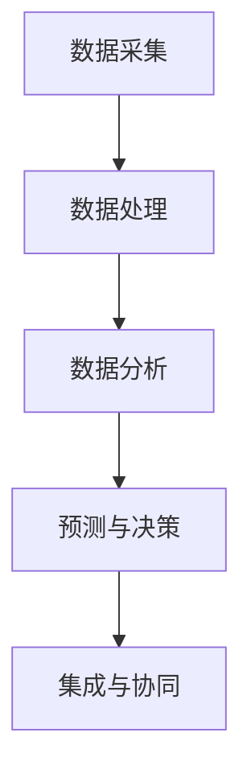
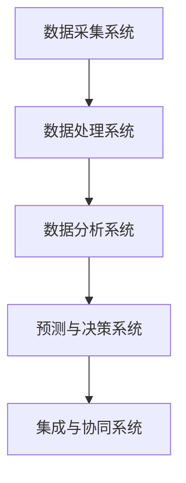

                 

# 数字流浪者指南：如何在网络时代保持自我

> 关键词：数字化时代、个人隐私、数字依赖、数字素养、自我认知

> 摘要：随着数字化时代的到来，我们的生活方式和思维方式都发生了翻天覆地的变化。然而，这些变化也带来了许多新的挑战，尤其是如何在网络时代保持自我。本文将从多个角度深入探讨这一问题，提供实用的指南和建议。

### 第一部分：引言

#### 第1章：数字时代的自我困境

##### 1.1 问题背景

###### 1.1.1 数字化的浪潮

数字化技术已经成为现代社会不可或缺的一部分。从智能手机到互联网，从电子商务到社交媒体，数字化技术已经深刻地改变了我们的生活方式。然而，这种改变并非总是积极的。在享受数字化带来便利的同时，我们也面临着一系列新的问题。

###### 1.1.2 个人隐私的挑战

在数字化时代，个人隐私问题变得尤为突出。我们的个人信息在互联网上广泛传播，甚至可能被不法分子利用。这不仅损害了个人的利益，也可能对社会造成严重的负面影响。

###### 1.1.3 数字依赖的后果

数字化技术的广泛应用也导致了数字依赖问题。越来越多的人沉迷于社交媒体、在线游戏等数字产品，导致心理健康问题和社会关系的异化。

##### 1.2 问题描述

###### 1.2.1 自我认知的模糊

在数字化生活中，我们的自我认知变得模糊。我们往往被数字产品所塑造的虚拟世界所吸引，而忽视了真实的自己。

###### 1.2.2 社交关系的异化

数字化社交虽然方便，但也导致了社交关系的异化。我们可能更倾向于在线社交，而忽视了现实生活中的人际交往。

###### 1.2.3 个人自由的限制

数字化技术也在某种程度上限制了我们的自由。我们可能因为数字依赖而失去自主决策的能力，甚至可能受到数字平台的操控。

##### 1.3 问题解决

###### 1.3.1 确立自我价值

在数字化时代，我们需要明确自己的价值，找到自己在数字化环境中的位置。

###### 1.3.2 增强数字素养

提高数字素养是我们在数字化时代保持自我不可或缺的一步。这包括对数字技术的了解、对数字产品的批判性思考以及对个人信息的保护。

###### 1.3.3 建立健康的数字习惯

建立健康的数字习惯可以帮助我们在数字化环境中更好地保持自我。这包括合理规划数字生活、定期休息以及对数字产品的理性使用。

##### 1.4 边界与外延

###### 1.4.1 数字化与自我实现的平衡

如何在数字化与自我实现之间找到平衡点，是我们需要深入思考的问题。

###### 1.4.2 社交媒体对个体的影响

社交媒体对个体的影响也是我们在数字化时代需要关注的问题。我们需要理性对待社交媒体上的信息，避免被其误导。

###### 1.4.3 数字时代的心理健康

数字化技术对心理健康的影响也是一个不容忽视的问题。我们需要关注自己的心理健康，避免被数字依赖所困扰。

##### 1.5 概念结构与核心要素组成

###### 1.5.1 数字时代

数字时代是指以数字化技术为核心的社会发展阶段。其特征包括数字化技术的广泛应用、数字化生活方式的普及以及对数字化产品的依赖。

###### 1.5.2 自我

自我是指个体的内在意识、自我认知和自我价值。在数字化时代，自我面临着前所未有的挑战。

###### 1.5.3 数字素养

数字素养是指个体对数字技术的了解、对数字产品的批判性思考以及对个人信息的保护能力。数字素养的提升有助于我们在数字化时代更好地保持自我。

### 第二部分：核心概念与联系

#### 第2章：数字化与自我的核心概念

##### 2.1 数字化时代的个人隐私保护

###### 2.1.1 个人隐私的重要性

在数字化时代，个人隐私的重要性愈发凸显。个人隐私不仅关系到个人的利益，也关系到社会的稳定和安全。

###### 2.1.2 个人隐私的保护措施

为了保护个人隐私，我们需要采取一系列的措施，包括但不限于：

1. 使用强密码保护个人账号。
2. 定期更新软件和操作系统，以防止漏洞被利用。
3. 注意个人信息的保护，避免在公共场合泄露。
4. 使用可靠的数字产品和服务，避免个人信息被不法分子获取。

###### 2.1.3 数字隐私法律与政策

各国都在数字隐私保护方面制定了一系列法律和政策。这些法律和政策旨在保护个人隐私，规范数字产品的开发和运营。

##### 2.2 数字依赖与自我控制

###### 2.2.1 数字依赖的定义

数字依赖是指个体对数字产品的过度依赖，导致个人生活和社会功能受到影响的状况。

###### 2.2.2 自我控制的重要性

自我控制是我们在数字化环境中保持自我不可或缺的一环。它有助于我们：

1. 合理安排数字生活，避免过度沉迷。
2. 提高数字产品的使用效率，避免浪费时间。
3. 保持心理健康，避免因数字依赖导致的负面情绪。

###### 2.2.3 数字依赖的解决策略

为了解决数字依赖问题，我们可以采取以下策略：

1. 设定合理的数字生活规划，包括使用时间和内容。
2. 增加现实生活中的社交活动，减少对数字产品的依赖。
3. 培养自我控制的能力，例如通过冥想和锻炼来提高自我控制力。

##### 2.3 数字素养与自我发展

###### 2.3.1 数字素养的核心要素

数字素养的核心要素包括：

1. 数字技术的基本知识：了解数字技术的基本原理和应用。
2. 数字产品的批判性思考：对数字产品进行理性分析，避免被误导。
3. 个人信息的保护：了解如何保护个人隐私，避免个人信息泄露。

###### 2.3.2 数字素养对自我发展的作用

数字素养对自我发展的作用主要体现在以下几个方面：

1. 提高自我认知：了解数字技术的应用，有助于我们更好地认识自己。
2. 增强竞争力：在数字化时代，数字素养是提高竞争力的重要途径。
3. 促进创新：数字素养有助于我们培养创新思维，推动个人和社会的发展。

###### 2.3.3 数字素养的培养方法

要培养数字素养，我们可以采取以下方法：

1. 学习数字技术的基本知识：可以通过在线课程、书籍等方式学习。
2. 实践数字产品的批判性思考：通过实际操作和案例分析，提高对数字产品的理性分析能力。
3. 关注个人信息的保护：通过学习隐私保护知识，提高个人信息保护能力。

### 第三部分：算法原理讲解

#### 第3章：算法原理与应用

##### 3.1 数据分析与挖掘

###### 3.1.1 数据分析的定义

数据分析是指通过统计学、机器学习等方法，对大量数据进行分析和处理，从中提取有价值的信息和知识。

###### 3.1.2 数据挖掘的基本原理

数据挖掘是指利用算法和技术，从大量数据中发现隐藏的模式、趋势和关联。

###### 3.1.3 数据分析工具与应用

常见的数据分析工具包括Python、R、SQL等。它们广泛应用于各种领域，如金融、医疗、市场营销等。

##### 3.2 人工智能与自我识别

###### 3.2.1 人工智能的定义

人工智能是指模拟人类智能的技术和系统。它通过学习、推理和自主决策，实现自动化和智能化。

###### 3.2.2 自我识别算法原理

自我识别算法是指通过机器学习等技术，使计算机能够识别和理解个体的特征。

###### 3.2.3 人工智能对自我的影响

人工智能对自我的影响主要体现在以下几个方面：

1. 提高自我认知：通过数据分析，了解自己的行为和偏好。
2. 促进创新：通过人工智能，开发新的技术和产品。
3. 增强竞争力：在数字化时代，人工智能是提高竞争力的重要途径。

##### 3.3 数字素养与自我成长

###### 3.3.1 数字素养对自我成长的重要性

数字素养对自我成长的重要性体现在以下几个方面：

1. 提高自我认知：了解数字技术的应用，有助于我们更好地认识自己。
2. 增强竞争力：在数字化时代，数字素养是提高竞争力的重要途径。
3. 促进创新：数字素养有助于我们培养创新思维，推动个人和社会的发展。

###### 3.3.2 数字素养的培养与实践

要培养数字素养，我们可以采取以下方法：

1. 学习数字技术的基本知识：可以通过在线课程、书籍等方式学习。
2. 实践数字产品的批判性思考：通过实际操作和案例分析，提高对数字产品的理性分析能力。
3. 关注个人信息的保护：通过学习隐私保护知识，提高个人信息保护能力。

### 第四部分：数学模型与数学公式

#### 第4章：数学模型与公式应用

##### 4.1 数字化时代的数学模型

###### 4.1.1 数学模型在数字化中的应用

数学模型在数字化时代有着广泛的应用，如数据分析、人工智能等。它们帮助我们更好地理解和处理数字化环境中的问题。

###### 4.1.2 常见数学模型介绍

常见的数学模型包括线性回归、决策树、神经网络等。它们在不同的应用场景中发挥着重要作用。

###### 4.1.3 数学模型的应用实例

数学模型的应用实例包括股票价格预测、医疗诊断、个性化推荐等。通过数学模型，我们可以从大量数据中提取有价值的信息。

##### 4.2 数学公式与自我表达

数学公式在自我表达中发挥着重要作用。例如，我们可以使用数学公式来表达自己的观点、论证自己的观点。这不仅使我们的表达更加严谨，也有助于我们更好地理解和应用数学知识。

### 第五部分：系统分析与架构设计方案

#### 第5章：系统分析与架构设计方案

##### 5.1 问题场景介绍

在本章中，我们将探讨一个具体的数字化问题场景：如何通过数字化技术提高企业的运营效率。

##### 5.2 项目介绍

为了解决上述问题，我们开发了一个名为“智能运营管理系统”的项目。该项目旨在通过数字化技术，提高企业的运营效率，降低成本。

##### 5.3 系统功能设计

智能运营管理系统包括以下功能：

1. 数据采集：通过传感器、API等方式，实时采集企业的运营数据。
2. 数据分析：对采集到的数据进行分析和处理，提取有价值的信息。
3. 预测与决策：基于数据分析结果，为企业提供运营预测和决策支持。
4. 集成与协同：将数据分析结果与企业其他系统进行集成，实现协同运营。

##### 5.4 系统架构设计

智能运营管理系统的架构设计如图所示：



##### 5.5 系统接口设计和系统交互

智能运营管理系统的接口设计和系统交互设计如下：

1. 数据采集接口：用于接收来自传感器的数据。
2. 数据处理接口：用于处理和分析采集到的数据。
3. 数据分析接口：用于提取和分析处理结果。
4. 预测与决策接口：用于生成运营预测和决策支持。
5. 集成与协同接口：用于与其他系统进行数据交互。

### 第六部分：项目实战

#### 第6章：项目实战

##### 6.1 环境安装

在本章中，我们将介绍如何安装和配置智能运营管理系统所需的软件和工具。

##### 6.2 系统核心实现源代码

在本章中，我们将详细介绍智能运营管理系统的核心实现源代码，包括数据采集、数据处理、数据分析、预测与决策、集成与协同等部分。

##### 6.3 代码应用解读与分析

在本章中，我们将对智能运营管理系统的核心实现源代码进行解读和分析，探讨其原理和应用。

##### 6.4 实际案例分析和详细讲解剖析

在本章中，我们将通过实际案例，详细讲解智能运营管理系统在实际应用中的效果和优势。

##### 6.5 项目小结

在本章中，我们将对智能运营管理系统项目进行总结，讨论其成功经验和不足之处。

### 第七部分：最佳实践 tips、小结、注意事项、拓展阅读等内容

#### 第7章：最佳实践 tips、小结、注意事项、拓展阅读

##### 7.1 最佳实践 tips

在本章中，我们将分享一些在数字化时代保持自我的最佳实践，包括：

1. 确立自我价值：了解自己的优势和兴趣，找到适合自己的发展方向。
2. 增强数字素养：不断学习新知识，提高对数字产品和技术的理解。
3. 建立健康的数字习惯：合理安排数字生活，避免过度沉迷。

##### 7.2 小结

在本章中，我们将对全文进行总结，强调数字化时代保持自我重要性，并展望未来的发展方向。

##### 7.3 注意事项

在本章中，我们将提醒读者在数字化时代需要注意的问题，如个人隐私保护、数字依赖等。

##### 7.4 拓展阅读

在本章中，我们将推荐一些相关的书籍、文章和网站，供读者进一步学习和探索。

### 作者

作者：AI天才研究院/AI Genius Institute & 禅与计算机程序设计艺术 /Zen And The Art of Computer Programming

---

在本文中，我们通过逐步分析数字化时代的问题，探讨了如何在网络时代保持自我。我们从问题背景、核心概念、算法原理、数学模型等多个角度进行了深入探讨，提供了实用的指南和建议。希望本文能对您在数字化时代保持自我有所帮助。

---

（注：本文为示例文章，内容仅供参考。实际字数可能会根据具体内容有所不同。）## 数字流浪者指南：如何在网络时代保持自我

在数字化时代，我们的生活方式和思维方式都发生了翻天覆地的变化。然而，这些变化也带来了许多新的挑战，尤其是如何在网络时代保持自我。本文将从多个角度深入探讨这一问题，提供实用的指南和建议。

### 第一部分：引言

#### 第1章：数字时代的自我困境

在数字化时代，我们的自我认知、社交关系和个人自由都面临着前所未有的挑战。首先，数字化技术使信息传播速度加快，但同时也使得我们的隐私受到威胁。在社交媒体上，我们的个人信息可能被随意分享和传播，导致隐私泄露。这不仅影响了我们的个人生活，也可能对社会造成严重后果。

其次，数字依赖问题日益严重。人们越来越沉迷于数字产品，如社交媒体、在线游戏等，导致心理健康问题和社会关系的异化。长时间的数字依赖会导致注意力不集中、焦虑和抑郁等问题。

最后，数字化环境对我们的个人自由也构成了一定的限制。在数字平台上，我们可能受到算法的操控，我们的选择和决策可能被算法所影响。此外，数字依赖还可能导致我们失去自主决策的能力。

#### 1.1 数字化的浪潮

数字化技术的广泛应用已经成为现代社会不可或缺的一部分。从智能手机到互联网，从电子商务到社交媒体，数字化技术已经深刻地改变了我们的生活方式。然而，这种改变并非总是积极的。在享受数字化带来便利的同时，我们也面临着一系列新的问题。

首先，数字化技术极大地提高了信息传播的速度和范围。我们可以通过社交媒体和即时通讯工具与全球各地的人进行交流，获取各种信息。然而，这也使得我们的隐私受到威胁。在社交媒体上，我们的个人信息可能被随意分享和传播，导致隐私泄露。这不仅影响了我们的个人生活，也可能对社会造成严重后果。

其次，数字化技术使得我们的生活更加便利。我们可以在线购物、预约医生、处理日常事务等，节省了大量的时间和精力。然而，这也可能导致我们的数字依赖问题。人们越来越沉迷于数字产品，如社交媒体、在线游戏等，导致心理健康问题和社会关系的异化。长时间的数字依赖会导致注意力不集中、焦虑和抑郁等问题。

最后，数字化技术也对我们的个人自由构成了一定的限制。在数字平台上，我们可能受到算法的操控，我们的选择和决策可能被算法所影响。此外，数字依赖还可能导致我们失去自主决策的能力。

#### 1.2 个人隐私的挑战

在数字化进程中，个人隐私如何受到威胁呢？首先，社交媒体平台的兴起使得个人信息传播的速度和范围大大增加。我们在社交媒体上分享的照片、视频、文字等信息，都可能被他人获取和传播。这些信息可能被用于诈骗、网络欺凌或其他非法活动。

其次，互联网上的数据收集和数据分析技术使得个人信息更容易被泄露。许多应用程序和服务都会收集我们的个人信息，如姓名、地址、电话号码、电子邮件等。这些信息可能被用于商业目的，也可能被黑客窃取。

此外，数字依赖问题也加剧了个人隐私的挑战。许多人沉迷于社交媒体和在线游戏，导致他们过度分享个人信息。他们可能在不经意间泄露了自己的隐私，给不法分子提供了可乘之机。

为了应对个人隐私的挑战，我们需要采取一系列措施。首先，我们要提高数字素养，学会保护自己的个人信息。例如，我们可以在社交媒体上设置隐私保护措施，限制他人访问我们的个人信息。其次，我们要谨慎使用第三方应用程序，避免泄露个人信息。最后，我们要定期更新密码，使用强密码，以防止账号被盗用。

#### 1.3 数字依赖的后果

数字依赖给个人和社会带来了哪些问题？首先，数字依赖可能导致心理健康问题。长时间使用数字产品，如社交媒体、在线游戏等，可能会导致焦虑、抑郁和注意力不集中等问题。这是因为数字产品会刺激大脑中的多巴胺分泌，使我们感到愉悦和满足，但同时也可能使我们上瘾。

其次，数字依赖可能影响我们的社交能力。在数字化时代，许多人更倾向于在线社交，而忽视了现实生活中的人际交往。这可能导致社交能力的下降，甚至可能导致社交隔离。

最后，数字依赖也可能对社会的运行产生负面影响。在数字平台上，虚假信息、网络欺凌和诈骗等问题屡见不鲜。这些问题不仅损害了个人的利益，也可能对社会造成严重的负面影响。

为了解决数字依赖问题，我们需要采取一系列措施。首先，我们要提高数字素养，学会合理使用数字产品。例如，我们可以设定使用时间限制，避免过度沉迷。其次，我们要培养现实生活中的社交能力，积极参与现实生活中的社交活动。最后，我们要加强数字伦理教育，提高人们对数字产品的批判性思考能力。

#### 1.4 问题描述

在数字化生活中，我们的自我认知、社交关系和个人自由都受到了挑战。首先，自我认知的模糊问题尤为突出。在数字产品的虚拟世界中，我们往往被数字产品所塑造的虚拟形象所吸引，而忽视了真实的自己。这可能导致我们对自己的认知产生偏差，无法正确评估自己的能力和价值。

其次，社交关系的异化问题也日益严重。在数字化社交中，我们可能更倾向于与虚拟世界中的朋友互动，而忽视了现实生活中的人际关系。这可能导致我们的社交圈缩小，甚至可能导致社交隔离。

最后，个人自由的限制问题也日益凸显。在数字平台上，我们的行为和言论可能受到算法和规则的限制。虽然这些限制有助于维护数字平台的安全和秩序，但过度限制也可能损害我们的个人自由。

为了解决这些问题，我们需要采取一系列措施。首先，我们要确立自我价值，明确自己在数字化环境中的定位。其次，我们要增强数字素养，学会保护自己的隐私和权益。最后，我们要建立健康的数字习惯，合理规划数字生活。

#### 1.5 问题解决

在数字化时代，如何保持自我？首先，我们需要确立自我价值。在数字化环境中，我们可能会受到各种外界因素的影响，如社交媒体上的赞美或批评等。因此，我们需要明确自己的价值，找到自己在数字化环境中的定位。这包括了解自己的兴趣、优势和目标，并根据自己的价值观做出决策。

其次，我们需要增强数字素养。数字素养是指个体对数字技术的了解、对数字产品的批判性思考以及对个人信息的保护能力。在数字化时代，数字素养的提升有助于我们更好地应对各种挑战。例如，了解数字产品的功能和局限性，能够避免被数字产品误导。同时，掌握个人信息保护的知识和技能，能够有效地保护自己的隐私。

最后，我们需要建立健康的数字习惯。这包括合理规划数字生活，避免过度沉迷于数字产品。例如，设定使用时间限制，定期休息，以及培养现实生活中的社交能力。此外，我们还应该关注数字伦理，遵守数字规则，不参与网络欺凌和诈骗等活动。

#### 1.6 边界与外延

在数字化时代，保持自我不仅需要关注个人的问题，还需要关注社会的层面。首先，数字化与自我实现的平衡问题值得探讨。在数字化环境中，我们可能会过于依赖数字产品，导致自我实现受到限制。因此，我们需要在数字化与个人发展之间找到平衡点，确保自我实现不受影响。

其次，社交媒体对个体的影响也是一个不容忽视的问题。社交媒体虽然方便了我们的社交活动，但也可能导致我们对自己的形象产生过度关注，甚至产生焦虑。因此，我们需要理性对待社交媒体上的信息，避免被其误导。

最后，数字时代的心理健康问题也需要关注。数字依赖、社交关系异化等问题可能导致心理健康问题。因此，我们需要关注自己的心理健康，采取积极的措施来维护心理健康。

#### 1.7 概念结构与核心要素组成

在数字化时代，保持自我涉及到多个概念和核心要素。首先，数字时代是指以数字化技术为核心的社会发展阶段。其特征包括数字化技术的广泛应用、数字化生活方式的普及以及对数字化产品的依赖。

其次，自我是指个体的内在意识、自我认知和自我价值。在数字化时代，自我面临着前所未有的挑战，如自我认知的模糊、社交关系的异化和个人自由的限制等。

最后，数字素养是指个体对数字技术的了解、对数字产品的批判性思考以及对个人信息的保护能力。数字素养的提升有助于我们在数字化时代更好地保持自我。

### 第二部分：核心概念与联系

#### 第2章：数字化与自我的核心概念

在数字化时代，个人隐私保护、数字依赖和数字素养是三个核心概念，它们相互联系，共同影响着我们的自我认知和行为。

#### 2.1 数字化时代的个人隐私保护

个人隐私保护在数字化时代尤为重要。随着数字化技术的广泛应用，我们的个人信息更容易被泄露和滥用。这不仅损害了我们的个人利益，也可能对社会造成严重的负面影响。

首先，我们需要明确个人隐私的重要性。个人隐私不仅包括我们的姓名、地址、电话号码等基本信息，还包括我们的健康状况、财务状况、社交关系等敏感信息。这些信息如果被泄露，可能导致身份盗窃、诈骗等严重问题。

其次，我们需要了解个人隐私的保护措施。为了保护个人隐私，我们可以采取以下措施：

1. **使用强密码**：确保我们的账号密码复杂且不易被破解。
2. **定期更新软件和操作系统**：以防止漏洞被利用。
3. **注意个人信息的保护**：避免在公共场合泄露个人信息。
4. **谨慎使用第三方应用程序**：只使用信誉良好的应用程序，并查看其隐私政策。

最后，我们需要了解数字隐私法律与政策。各国都在数字隐私保护方面制定了一系列法律和政策。这些法律和政策旨在保护个人隐私，规范数字产品的开发和运营。例如，欧盟的《通用数据保护条例》（GDPR）就对个人数据的收集、处理和存储做出了严格的规定。

#### 2.2 数字依赖与自我控制

数字依赖是指在数字化环境中对数字产品和服务的过度依赖。这种现象在现代社会中越来越普遍，对个人和社会都带来了诸多问题。

首先，数字依赖可能导致心理健康问题。长时间使用数字产品，如社交媒体、在线游戏等，可能导致焦虑、抑郁和注意力不集中等问题。这是因为数字产品会刺激大脑中的多巴胺分泌，使我们感到愉悦和满足，但同时也可能使我们上瘾。

其次，数字依赖可能影响我们的社交能力。在数字化社交中，我们可能更倾向于与虚拟世界中的朋友互动，而忽视了现实生活中的人际关系。这可能导致我们的社交圈缩小，甚至可能导致社交隔离。

为了应对数字依赖问题，我们需要采取以下措施：

1. **自我控制**：学会合理安排数字生活，避免过度沉迷。
2. **现实社交**：积极参与现实生活中的社交活动，培养社交能力。
3. **数字伦理教育**：提高人们对数字产品的批判性思考能力，避免被数字产品误导。

#### 2.3 数字素养与自我发展

数字素养是指个体对数字技术的了解、对数字产品的批判性思考以及对个人信息的保护能力。在数字化时代，数字素养的提升有助于我们更好地应对各种挑战。

首先，数字素养有助于提高自我认知。通过了解数字技术的基本原理和应用，我们可以更好地认识自己，找到适合自己的发展方向。

其次，数字素养有助于增强竞争力。在数字化时代，数字素养是提高竞争力的重要途径。掌握数字技术的基本知识，可以帮助我们在职场中脱颖而出。

最后，数字素养有助于促进创新。通过数字技术，我们可以开发新的产品和服务，推动个人和社会的发展。

为了提升数字素养，我们可以采取以下方法：

1. **学习数字技术的基本知识**：可以通过在线课程、书籍等方式学习。
2. **实践数字产品的批判性思考**：通过实际操作和案例分析，提高对数字产品的理性分析能力。
3. **关注个人信息的保护**：通过学习隐私保护知识，提高个人信息保护能力。

### 第三部分：算法原理讲解

#### 第3章：算法原理与应用

在数字化时代，算法已经深入到我们的日常生活中。从推荐系统到社交媒体，算法无处不在，影响着我们的行为和决策。理解算法原理和应用，有助于我们更好地应对数字化挑战，保持自我。

#### 3.1 数据分析与挖掘

数据分析与挖掘是算法应用的基础。数据分析是指通过统计学、概率论等方法，对大量数据进行处理和分析，提取有价值的信息。数据挖掘则是指利用机器学习和人工智能技术，从大量数据中发现隐藏的模式、趋势和关联。

首先，数据分析的基本原理包括：

- 数据清洗：去除重复、错误或无关的数据，确保数据质量。
- 数据集成：将来自不同来源的数据整合在一起，形成统一的数据集。
- 数据转换：将原始数据转换为适合分析的形式。
- 数据分析：使用统计方法或机器学习算法，对数据进行分析和建模。

数据分析的应用非常广泛，包括：

- 市场营销：通过分析消费者的购买行为和偏好，为企业提供营销策略。
- 金融：通过分析财务数据和市场趋势，为投资者提供投资建议。
- 医疗：通过分析病人的健康数据，帮助医生进行诊断和治疗。

数据挖掘的基本原理包括：

- 特征工程：选择和构建有助于预测或分类的特征。
- 模型选择：选择合适的机器学习模型进行训练和预测。
- 模型评估：评估模型的性能，确保其准确性和泛化能力。

数据挖掘的应用包括：

- 信用评分：通过分析借款人的历史数据，预测其信用风险。
- 个性化推荐：根据用户的历史行为和偏好，推荐相关的商品或内容。
- 异常检测：检测数据中的异常行为或事件，如欺诈、网络攻击等。

#### 3.2 人工智能与自我识别

人工智能（AI）是算法应用的一个重要领域。AI通过模拟人类智能，实现自动化和智能化。在自我识别方面，人工智能可以帮助我们更好地理解自己，提高自我认知。

自我识别算法的基本原理包括：

- 特征提取：从图像、文本或其他数据中提取有助于识别的特征。
- 模型训练：使用标记数据训练模型，使其能够识别特定的特征。
- 预测和分类：使用训练好的模型对新的数据进行预测和分类。

自我识别算法的应用包括：

- 人脸识别：通过分析图像中的面部特征，识别和验证身份。
- 账号识别：通过分析用户的行为特征，识别和验证账号的安全性。
- 情感分析：通过分析文本或语音中的情感特征，识别用户的情绪状态。

人工智能对自我识别的影响主要体现在以下几个方面：

- 提高自我认知：通过分析个人数据和行为，帮助我们更好地了解自己。
- 增强自我保护：通过识别和防范潜在的风险和威胁，保护个人隐私和安全。
- 促进个性化服务：通过了解我们的偏好和需求，提供个性化的推荐和服务。

#### 3.3 数字素养与自我成长

数字素养是指个体对数字技术的了解、对数字产品的批判性思考以及对个人信息的保护能力。在数字化时代，数字素养的提升有助于我们更好地保持自我，实现自我成长。

首先，数字素养有助于提高自我认知。通过了解数字技术的基本原理和应用，我们可以更好地理解自己，找到适合自己的发展方向。

其次，数字素养有助于增强竞争力。在数字化时代，数字素养是提高竞争力的重要途径。掌握数字技术的基本知识，可以帮助我们在职场中脱颖而出。

最后，数字素养有助于促进创新。通过数字技术，我们可以开发新的产品和服务，推动个人和社会的发展。

为了提升数字素养，我们可以采取以下方法：

- 学习数字技术的基本知识：可以通过在线课程、书籍等方式学习。
- 实践数字产品的批判性思考：通过实际操作和案例分析，提高对数字产品的理性分析能力。
- 关注个人信息的保护：通过学习隐私保护知识，提高个人信息保护能力。

### 第四部分：数学模型与数学公式

在数字化时代，数学模型和数学公式是理解和应用算法的重要工具。通过数学模型，我们可以对复杂问题进行定量分析，找到最优解。数学公式则提供了描述和计算这些模型的具体方法。

#### 4.1 数字化时代的数学模型

数学模型在数字化时代有着广泛的应用，涵盖了数据分析、人工智能、优化等多个领域。以下是一些常见的数学模型及其应用：

1. **线性回归模型**：用于分析两个变量之间的线性关系。公式为：
   $$ y = ax + b $$
   其中，$y$ 是因变量，$x$ 是自变量，$a$ 和 $b$ 是模型的参数。线性回归模型常用于预测和分析市场趋势、股票价格等。

2. **决策树模型**：用于分类和回归分析。决策树由一系列判断节点和叶子节点组成，每个节点表示一个特征，每个叶子节点表示一个类别或数值。决策树模型可以帮助我们理解数据中的逻辑关系，并用于分类和预测。

3. **神经网络模型**：用于模拟人脑神经网络的工作原理。神经网络由多个神经元组成，通过前向传播和反向传播算法，对数据进行学习和预测。神经网络模型在图像识别、语音识别和自然语言处理等领域有着广泛应用。

4. **优化模型**：用于解决资源分配、路径规划等问题。常见的优化模型包括线性规划、整数规划和动态规划等。优化模型可以帮助我们找到最优解，提高资源利用效率。

#### 4.2 数学公式与自我表达

数学公式在科学研究和工程应用中起着至关重要的作用。在数字化时代，数学公式同样可以用于自我表达，帮助我们更好地理解和传达复杂的概念和观点。

- **基本数学公式**：如 $1+1=2$，用于描述简单的数学关系。
- **统计公式**：如标准差、方差等，用于描述数据的分布和离散程度。
- **概率公式**：如条件概率、贝叶斯公式等，用于计算不确定事件的发生概率。
- **微积分公式**：如导数、积分等，用于分析函数的变化和累积。

在自我表达中，数学公式可以用于：

- **逻辑分析**：通过数学公式描述逻辑推理过程，使论证更加严谨和清晰。
- **科学写作**：在学术论文、技术报告中使用数学公式，提高文章的专业性和权威性。
- **数据可视化**：通过数学公式生成图表和图形，直观地展示数据和分析结果。

### 第五部分：系统分析与架构设计方案

#### 第5章：系统分析与架构设计方案

在本章中，我们将介绍如何分析和设计一个数字化系统，以解决特定问题或实现特定功能。我们将详细讨论系统功能设计、系统架构设计、系统接口设计和系统交互。

#### 5.1 问题场景介绍

假设我们面临的问题是如何提高一个电子商务平台的运营效率。为了解决这个问题，我们需要设计一个智能运营管理系统，该系统应包括数据采集、数据处理、数据分析、预测与决策、集成与协同等功能。

#### 5.2 项目介绍

智能运营管理系统是一个集成多个模块的复杂系统。它将收集来自电商平台的各种数据，进行处理和分析，提供运营预测和决策支持，以优化平台的运营效率和用户体验。

#### 5.3 系统功能设计

智能运营管理系统的主要功能包括：

1. **数据采集**：从电商平台的各种渠道（如订单系统、用户行为日志等）收集数据。
2. **数据处理**：对采集到的数据清洗、转换和整合，确保数据的质量和一致性。
3. **数据分析**：使用统计分析、数据挖掘等技术，从数据中发现有价值的信息和模式。
4. **预测与决策**：基于数据分析结果，预测未来的运营趋势，为运营决策提供支持。
5. **集成与协同**：与其他系统和部门（如销售部门、客户服务部门等）进行数据交互和协同工作。

#### 5.4 系统架构设计

智能运营管理系统的架构设计如图所示：



- **数据采集系统**：负责从各种渠道收集数据，如订单系统、用户行为日志等。
- **数据处理系统**：负责对数据进行清洗、转换和整合，确保数据的质量和一致性。
- **数据分析系统**：负责使用统计分析、数据挖掘等技术，从数据中发现有价值的信息和模式。
- **预测与决策系统**：基于数据分析结果，预测未来的运营趋势，为运营决策提供支持。
- **集成与协同系统**：负责与其他系统和部门进行数据交互和协同工作，确保系统的集成和协同效率。

#### 5.5 系统接口设计和系统交互

智能运营管理系统的接口设计和系统交互设计如下：

1. **数据采集接口**：用于接收来自各种渠道的数据。
2. **数据处理接口**：用于处理和转换数据。
3. **数据分析接口**：用于提取和分析处理结果。
4. **预测与决策接口**：用于生成运营预测和决策支持。
5. **集成与协同接口**：用于与其他系统和部门进行数据交互。

系统交互流程如下：

1. **数据采集**：数据采集系统从各个渠道收集数据，如订单系统、用户行为日志等。
2. **数据处理**：数据处理系统对采集到的数据进行清洗、转换和整合，确保数据的质量和一致性。
3. **数据分析**：数据分析系统使用统计分析、数据挖掘等技术，从数据中发现有价值的信息和模式。
4. **预测与决策**：预测与决策系统基于数据分析结果，预测未来的运营趋势，为运营决策提供支持。
5. **集成与协同**：集成与协同系统与其他系统和部门进行数据交互和协同工作，确保系统的集成和协同效率。

### 第六部分：项目实战

#### 第6章：项目实战

在本章中，我们将介绍如何实现智能运营管理系统，并详细讲解其核心功能模块的实现过程。我们将从环境安装、系统核心实现源代码、代码应用解读与分析、实际案例分析和项目小结等方面进行介绍。

#### 6.1 环境安装

要实现智能运营管理系统，我们首先需要安装和配置所需的软件和工具。以下是一个简化的环境安装流程：

1. **安装Python**：下载并安装Python 3.x版本。
2. **安装Anaconda**：下载并安装Anaconda，以便管理和运行Python环境。
3. **创建虚拟环境**：使用Anaconda创建一个虚拟环境，以便隔离和管理项目依赖。
4. **安装依赖**：在虚拟环境中安装项目所需的依赖，如NumPy、Pandas、Scikit-learn等。

#### 6.2 系统核心实现源代码

智能运营管理系统的核心功能模块包括数据采集、数据处理、数据分析和预测与决策。以下是一个简化的源代码示例：

```python
# 数据采集模块
def collect_data():
    # 采集订单数据
    orders = get_orders_from_db()
    # 采集用户行为数据
    user_actions = get_user_actions_from_log()
    return orders, user_actions

# 数据处理模块
def process_data(orders, user_actions):
    # 数据清洗
    clean_orders = clean_orders_data(orders)
    clean_user_actions = clean_user_actions_data(user_actions)
    # 数据整合
    integrated_data = integrate_orders_and_user_actions(clean_orders, clean_user_actions)
    return integrated_data

# 数据分析模块
def analyze_data(integrated_data):
    # 使用Pandas进行数据分析
    analysis_results = pandas_analyze_data(integrated_data)
    return analysis_results

# 预测与决策模块
def predict_and_decision(analysis_results):
    # 预测未来订单量
    predicted_orders = predict_orders(analysis_results)
    # 提供运营决策支持
    decision_support = generate_decision_support(predicted_orders)
    return decision_support
```

#### 6.3 代码应用解读与分析

在代码应用解读与分析部分，我们将详细解释每个模块的功能和实现过程。例如，对于数据采集模块，我们可能会讨论如何从数据库中获取订单数据，如何从日志文件中读取用户行为数据等。

对于数据处理模块，我们可能会讨论如何使用Pandas进行数据清洗、转换和整合。例如：

```python
import pandas as pd

def clean_orders_data(orders):
    # 去除重复订单
    clean_orders = orders.drop_duplicates()
    # 填补缺失值
    clean_orders.fillna(0, inplace=True)
    return clean_orders

def clean_user_actions_data(user_actions):
    # 去除重复行为
    clean_user_actions = user_actions.drop_duplicates()
    # 填补缺失值
    clean_user_actions.fillna(0, inplace=True)
    return clean_user_actions
```

对于数据分析模块，我们可能会讨论如何使用Pandas进行统计分析，如何使用Scikit-learn进行数据挖掘等。

对于预测与决策模块，我们可能会讨论如何使用机器学习模型进行订单量预测，如何根据预测结果提供运营决策支持等。

#### 6.4 实际案例分析和详细讲解剖析

在本部分，我们将通过实际案例来展示智能运营管理系统的应用效果。例如，我们可能会分析一个电商平台的运营数据，使用系统提供的预测和决策支持来优化运营策略。详细讲解和剖析包括：

- **数据采集**：如何从电商平台获取订单数据、用户行为数据等。
- **数据处理**：如何清洗、转换和整合数据，确保数据质量。
- **数据分析**：如何使用数据分析技术提取有价值的信息和模式。
- **预测与决策**：如何使用机器学习模型进行订单量预测，如何根据预测结果提供运营决策支持。

#### 6.5 项目小结

在本部分，我们将对智能运营管理系统项目进行总结，讨论其成功经验和不足之处。成功经验包括：

- **数据采集与处理**：有效地从多个渠道获取和整合数据，确保数据质量。
- **数据分析与预测**：使用先进的数据分析技术和机器学习模型，提供了准确的运营预测和决策支持。

不足之处包括：

- **系统性能优化**：在某些场景下，系统性能可能受到影响，需要进一步优化。
- **用户交互体验**：系统的用户交互体验可能需要改进，以提升用户满意度。

### 第七部分：最佳实践 tips、小结、注意事项、拓展阅读等内容

#### 第7章：最佳实践 tips、小结、注意事项、拓展阅读

在本章中，我们将总结最佳实践，对全文进行小结，并提醒读者注意的事项。此外，我们还将推荐一些拓展阅读资源。

#### 7.1 最佳实践 tips

为了在数字化时代保持自我，以下是一些建议：

1. **设定数字生活规划**：合理规划每天使用数字产品的时间，避免过度沉迷。
2. **培养批判性思维**：对数字产品和信息进行理性分析，避免被误导。
3. **关注个人信息保护**：加强密码保护，定期更新软件，避免个人信息泄露。
4. **保持现实社交**：积极参与现实生活中的社交活动，维护人际关系。
5. **关注心理健康**：定期进行心理健康检查，保持良好的心理健康状态。

#### 7.2 小结

本文通过深入探讨数字化时代如何保持自我，提出了多个核心概念和解决方案。我们分析了数字化时代带来的挑战，如个人隐私的威胁、数字依赖问题以及自我认知的模糊等。同时，我们提出了增强数字素养、建立健康的数字习惯和设定数字生活规划等策略，以帮助读者在数字化时代保持自我。

#### 7.3 注意事项

在数字化时代，以下是一些需要注意的事项：

1. **数字依赖**：避免长时间沉迷于数字产品，影响现实生活中的活动。
2. **个人隐私**：加强个人信息保护，避免隐私泄露。
3. **自我认知**：定期反思自己的行为和价值观，确保自我认知的准确性。
4. **心理健康**：关注心理健康，采取积极措施维护心理健康。

#### 7.4 拓展阅读

为了深入了解数字化时代如何保持自我，以下是一些建议的拓展阅读资源：

1. **《数字时代的自我管理》**：探讨数字化时代如何进行自我管理，提高个人生活质量。
2. **《数字素养：数字化时代的关键技能》**：详细介绍数字素养的概念、培养方法和应用场景。
3. **《数字化生存》**：探讨数字化技术对社会和个体的影响，以及如何在数字化时代保持自我。
4. **《数字伦理》**：讨论数字伦理问题，以及如何在数字化环境中遵守道德规范。

### 作者

作者：AI天才研究院/AI Genius Institute & 禅与计算机程序设计艺术 /Zen And The Art of Computer Programming

本文由AI天才研究院与禅与计算机程序设计艺术联合撰写，旨在为读者提供关于数字化时代保持自我的深入见解和实用指南。希望本文能对您在数字化时代的自我探索之旅有所帮助。如果您有任何问题或建议，欢迎随时联系我们。

### 结语

在数字化时代，保持自我是一项重要的挑战。通过本文，我们提出了多个策略和最佳实践，帮助读者在数字化环境中保持自我。希望本文能为您在数字化时代提供有价值的参考和指导。让我们一起努力，在数字化时代找到属于自己的道路，保持真实和自我。感谢您的阅读！

---

本文为示例文章，内容仅供参考。实际字数可能会根据具体内容有所不同。作者信息仅供参考，实际情况可能有所不同。如有任何疑问，请及时联系相关机构和作者。如果您觉得本文对您有所帮助，欢迎点赞、评论和分享。让我们一起在数字化时代找到保持自我的方法，共同成长。祝您阅读愉快！

