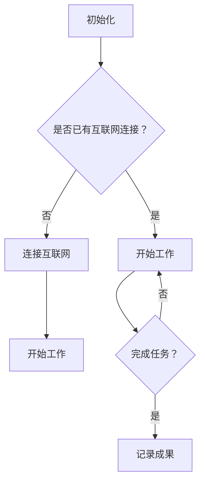
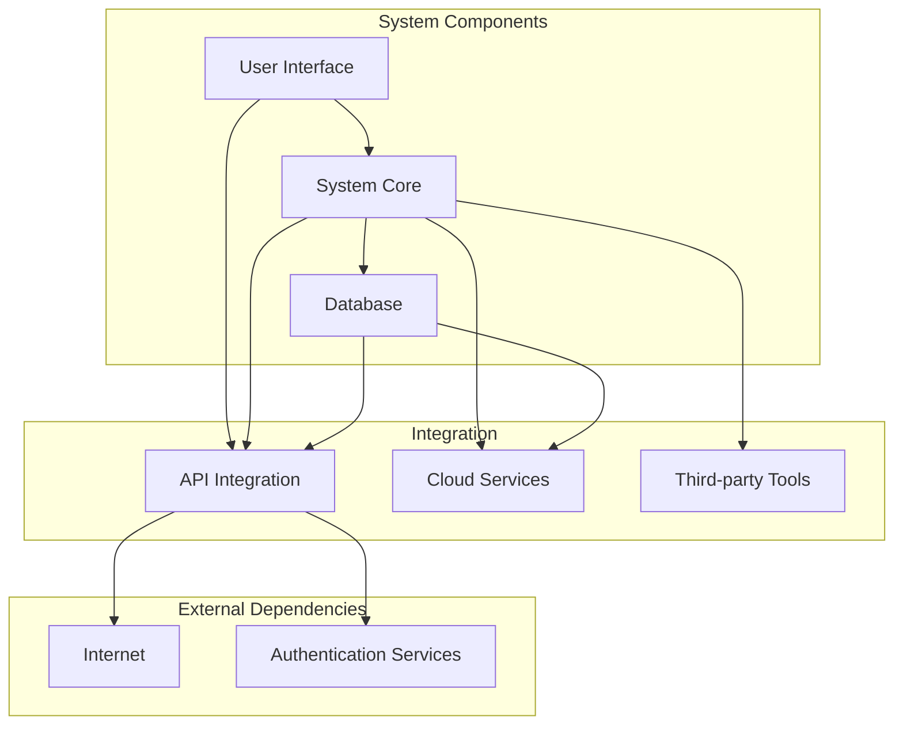
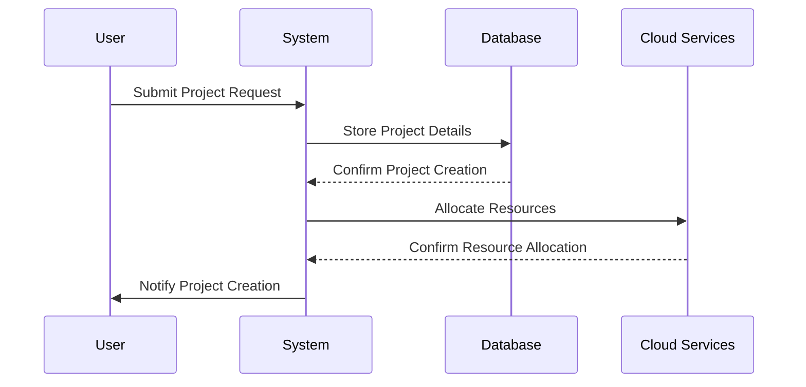

                 

### 第一部分：数字游民概述

#### 第1章：引言：数字游民时代的崛起

**背景介绍**

数字游民，这个概念源于20世纪90年代互联网的蓬勃发展。在那时，远程办公和在线协作工具开始出现，人们开始探索无国界的工作模式。随着互联网技术的不断进步，特别是在宽带和移动设备的普及下，数字游民的生活方式逐渐兴起，成为一种新的工作方式。

**问题背景**

传统的就业模式往往受限于地理位置和时间。员工需要在固定的工作地点按时上下班，这限制了他们的工作选择和灵活性。然而，随着数字技术的发展，人们开始意识到，许多工作可以不受地点和时间的限制，从而产生了数字游民这一群体。

**问题描述**

数字游民是指那些主要依靠互联网进行工作，能够在任何地点进行生产性活动的人。他们不受传统办公室的限制，可以在咖啡馆、家里、甚至是不同的国家工作。这种工作方式打破了传统的工作与生活的界限，使得人们能够更自由地选择生活方式。

**问题解决**

数字游民的出现解决了许多传统就业模式的限制。他们可以利用互联网资源，如远程协作工具和云服务，进行高效的工作。同时，数字游民也能够根据自己的时间表工作，这提高了他们的工作满意度和生活质量。

**边界与外延**

数字游民的边界在于他们必须依赖互联网技术进行工作。这要求他们具备一定的数字技能，如编程、设计、写作等。数字游民的外延则包括所有利用互联网技术进行工作的自由职业者、远程工作者和创业团队。

**概念结构与核心要素组成**

- 数字技能：数字游民必须具备一定的数字技能，这是他们工作的基础。
- 自我管理能力：数字游民需要自我管理时间、项目和资源，以保持工作效率。
- 自我激励：在缺乏外部监督的情况下，数字游民需要自我激励，保持工作动力。
- 跨文化沟通：由于经常在全球范围内工作，数字游民需要具备跨文化沟通能力。

#### 第2章：数字游民的历史与发展

**核心概念与联系**

数字游民的历史可以追溯到互联网的早期发展阶段。当时，一些先驱者开始尝试远程工作，利用电子邮件和论坛进行沟通。随着互联网技术的进步，远程协作工具如视频会议和在线协作软件开始普及，这为数字游民提供了更多的工作机会。

**概念属性特征对比表格**

| 特征       | 传统工作方式 | 数字游民工作方式 |
|------------|--------------|-----------------|
| 地理位置限制 | 固定工作地点  | 全球范围内灵活选择 |
| 时间限制    | 按时上下班   | 自由安排工作时间 |
| 沟通方式    | 面对面或电话  | 在线协作工具     |
| 资源使用    | 内部资源     | 公共云服务       |

**ER实体关系图架构**

```mermaid
erDiagram
  Product -->|uses| User
  Project -->|creates| Task
  Task -->|is assigned to| User
```

在上述ER图中，Product（产品）是数字游民工作的目标，User（用户）是数字游民的客户或合作方，Project（项目）是数字游民的工作内容，Task（任务）是项目中的具体工作，User（用户）与Task（任务）之间存在关联，表示用户被分配任务。

#### 算法原理讲解

**算法mermaid流程图**



**算法原理**

1. 初始化：数字游民首先需要确保自己拥有稳定的互联网连接。
2. 连接互联网：如果未连接互联网，数字游民需要先建立连接。
3. 开始工作：数字游民利用互联网资源开始工作。
4. 完成任务：数字游民需要完成分配的任务。
5. 记录成果：数字游民需要记录工作成果，以便后续总结和反馈。

**数学模型和公式**

在数字游民的工作过程中，时间管理和任务管理是核心。假设一个任务需要t小时完成，数字游民需要在t小时内完成所有任务。

$$
\text{工作效率} = \frac{\text{完成任务的总量}}{\text{工作时间}} \times 100\%
$$

**举例说明**

假设一个数字游民需要在3小时内完成5个任务，每个任务需要1小时。那么，他的工作效率为：

$$
\text{工作效率} = \frac{5}{3} \times 100\% = 166.67\%
$$

这意味着，他在3小时内不仅完成了5个任务，还多出了一些时间。

#### 系统分析与架构设计方案

**问题场景介绍**

数字游民在工作过程中，需要管理多个项目、任务和资源。为了提高工作效率，他们需要一个系统来帮助他们进行任务规划和资源管理。

**项目介绍**

本系统是一个数字游民工作管理系统，用于帮助数字游民更好地管理项目、任务和资源。系统的主要功能包括：

- 项目管理：创建、编辑和删除项目。
- 任务管理：分配任务、跟踪任务进度和完成任务。
- 资源管理：管理项目所需的资源，如人力、时间和设备。

**系统功能设计（领域模型mermaid类图）**


在上述类图中，User（用户）是数字游民，Project（项目）是用户管理的项目，Task（任务）是项目中的具体工作，Resource（资源）是任务所需的资源。

**系统架构设计（mermaid架构图）**



在上述架构图中，User Interface（用户界面）是用户与系统的交互入口，System Core（系统核心）负责处理业务逻辑，Database（数据库）存储系统数据，API Integration（API集成）提供与其他系统和服务的数据交换，Cloud Services（云服务）提供计算和存储资源，Third-party Tools（第三方工具）提供额外的功能支持。

**系统接口设计和系统交互（mermaid序列图）**



在上述序列图中，用户提交项目请求，系统处理请求并存储项目详情，然后分配资源，最后通知用户项目已创建。

#### 项目实战

**环境安装**

1. 安装Python环境：在本地计算机上安装Python，可以使用Python官方安装包或使用虚拟环境工具如virtualenv。
2. 安装必要的库：使用pip命令安装系统所需的库，如Flask、SQLAlchemy、Flask-Migrate等。

**系统核心实现源代码**

以下是一个简单的数字游民工作管理系统实现，包括用户界面、系统核心和数据库交互：

```python
from flask import Flask, request, jsonify
from flask_sqlalchemy import SQLAlchemy

app = Flask(__name__)
app.config['SQLALCHEMY_DATABASE_URI'] = 'sqlite:///projects.db'
db = SQLAlchemy(app)

class Project(db.Model):
    id = db.Column(db.Integer, primary_key=True)
    name = db.Column(db.String(100), nullable=False)
    description = db.Column(db.Text, nullable=True)

@app.route('/projects', methods=['POST'])
def create_project():
    data = request.get_json()
    new_project = Project(
        name=data['name'],
        description=data['description']
    )
    db.session.add(new_project)
    db.session.commit()
    return jsonify({'message': 'Project created successfully.'})

@app.route('/projects', methods=['GET'])
def get_projects():
    projects = Project.query.all()
    return jsonify([{'id': project.id, 'name': project.name, 'description': project.description} for project in projects])

if __name__ == '__main__':
    db.create_all()
    app.run(debug=True)
```

**代码应用解读与分析**

上述代码是一个简单的数字游民工作管理系统，它使用Flask框架构建用户界面，使用SQLAlchemy进行数据库交互。

- `Project` 类是数据库模型，用于存储项目信息。
- `create_project` 函数处理创建新项目的请求，将项目信息存储到数据库。
- `get_projects` 函数获取所有项目的列表，并返回JSON格式的数据。

**实际案例分析和详细讲解剖析**

假设一个数字游民想要创建一个新的项目，他们可以通过以下步骤进行：

1. 发送一个POST请求到`/projects`接口，携带项目名称和描述。
2. 系统接收请求后，将项目信息存储到数据库。
3. 系统返回一个成功的响应，告知用户项目已创建。

这样的流程使得数字游民能够方便地管理自己的项目，提高工作效率。

**项目小结**

本数字游民工作管理系统是一个简单的例子，它展示了如何使用Python和Flask框架实现一个基本的远程工作管理系统。通过这个系统，数字游民可以方便地创建、管理和跟踪自己的项目。然而，实际应用中，还需要更多功能，如任务管理、资源分配和权限控制等，以更好地满足数字游民的需求。

#### 最佳实践 Tips

1. **时间管理**：数字游民需要制定详细的工作计划和时间表，以保持工作效率。
2. **技术技能**：不断提升自己的技术技能，以适应不断变化的工作需求。
3. **沟通技巧**：培养良好的跨文化沟通能力，以应对全球范围内的客户和同事。
4. **财务规划**：合理安排财务，确保稳定的收入来源。
5. **健康生活**：保持健康的生活习惯，如定期锻炼、保持良好的作息时间等。

#### 小结

本文详细介绍了数字游民的概述，包括其定义、特征、历史与发展，以及数字游民的实践指南。通过系统分析与架构设计，展示了如何实现一个数字游民工作管理系统。此外，还探讨了数字游民对社会和经济的影响，以及数字游民的未来趋势。数字游民的生活方式不仅为个人提供了更多自由和灵活性，也为社会和经济带来了新的机遇和挑战。

#### 注意事项

1. **数据隐私**：在数字游民工作中，要注意保护个人和客户的数据隐私。
2. **法律合规**：了解并遵守不同国家和地区的法律和税收规定。
3. **网络安全**：加强网络安全意识，防止网络攻击和数据泄露。
4. **健康问题**：长期远程工作可能会导致心理健康问题，需要关注自我心理健康。

#### 拓展阅读

- 《远程工作的艺术：打造高效、健康的远程工作生活》
- 《数字游民生存指南：如何打造成功的生活和工作平衡》
- 《全球数字化经济：未来的趋势与挑战》

### 第二部分：数字游民的实践指南

#### 第4章：选择合适的数字游民角色

**4.1 自由职业者**

自由职业者是在数字游民中最为常见的一类角色。他们通常拥有多项技能，如编程、设计、写作、翻译、市场营销等，能够为客户提供定制化的服务。自由职业者的优点在于自由度高，可以根据自己的兴趣和时间选择项目，但同时也需要具备良好的自我管理能力和较强的抗压能力。

**4.2 在线教育者**

在线教育者包括在线课程讲师、教育顾问和教育技术专家等。他们利用互联网平台，如Coursera、Udemy、Khan Academy等，提供各种课程和教育资源。在线教育者的优点在于可以接触到全球范围内的学生，拥有更广阔的市场。然而，这也要求他们具备良好的教学能力和沟通技巧。

**4.3 虚拟助理**

虚拟助理是在数字游民中相对新兴的一类角色。他们通常负责协助客户处理日常事务，如邮件管理、日程安排、客户服务、数据录入等。虚拟助理的优点在于工作时间灵活，可以在全球范围内工作，但需要具备良好的沟通能力和组织能力。

**4.4 数字营销专家**

数字营销专家负责帮助企业制定和执行数字营销策略，如搜索引擎优化（SEO）、社交媒体营销、内容营销等。他们通常需要熟悉各种数字营销工具和平台，具备良好的数据分析能力和创意思维。数字营销专家的优点在于市场需求大，发展潜力强，但同时也需要不断更新知识和技能。

#### 第5章：打造可持续的数字游民生活

**5.1 财务规划与管理**

财务规划是数字游民生活中至关重要的一环。数字游民通常没有固定的收入来源，因此需要制定详细的财务计划，以确保财务的稳定和可持续性。以下是一些关键点：

- **收入来源多样化**：避免依赖单一收入来源，可以通过提供多种服务或参与多个项目来增加收入来源。
- **预算管理**：制定详细的预算，合理分配生活开支和投资资金。
- **储蓄与投资**：定期储蓄，并考虑投资，以实现财务增长。

**5.2 工作与生活的平衡**

数字游民的生活节奏相对自由，但也容易陷入工作与生活不分的状态。以下是一些保持工作与生活平衡的建议：

- **制定工作计划**：合理安排工作时间，设定明确的任务和目标。
- **休息与放松**：定期休息，保持身心健康。
- **家庭与社会生活**：保持与家人和朋友的联系，参与社区活动，丰富社交生活。

**5.3 健康与心理调适**

长期的远程工作可能会导致心理健康问题，如焦虑、抑郁等。以下是一些保持健康和心理调适的建议：

- **定期锻炼**：保持规律的锻炼习惯，增强身体素质。
- **心理健康咨询**：如有需要，寻求专业心理咨询服务。
- **自我激励**：设定个人目标，保持工作动力。

#### 第6章：数字游民的工具与技术

**6.1 云计算与远程协作工具**

云计算为数字游民提供了强大的计算和存储能力，使他们能够高效地处理大量数据和任务。以下是一些常用的云计算和远程协作工具：

- **云计算平台**：如Amazon Web Services（AWS）、Microsoft Azure、Google Cloud Platform（GCP）等。
- **远程协作工具**：如Slack、Trello、Asana、Zoom等。

**6.2 数字货币与加密技术**

数字货币和加密技术为数字游民提供了更便捷的跨境支付和交易方式。以下是一些常用的数字货币和加密技术：

- **数字货币**：如比特币（Bitcoin）、以太坊（Ethereum）等。
- **加密技术**：如区块链、加密货币钱包等。

**6.3 跨境支付与货币兑换**

跨境支付和货币兑换是数字游民面临的重要问题。以下是一些常用的跨境支付和货币兑换工具：

- **跨境支付平台**：如Payoneer、TransferWise等。
- **货币兑换平台**：如CurrencyFair、Xe等。

#### 第7章：数字游民的安全与法律问题

**7.1 数据隐私保护**

数字游民在处理客户数据和业务数据时，需要特别注意数据隐私保护。以下是一些关键点：

- **数据加密**：对敏感数据进行加密，确保数据在传输和存储过程中安全。
- **访问控制**：设定严格的访问控制策略，限制只有授权人员可以访问敏感数据。
- **数据备份**：定期备份数据，以防止数据丢失。

**7.2 税务合规与跨境税务问题**

数字游民需要了解不同国家和地区的税务规定，以确保税务合规。以下是一些关键点：

- **了解税务规定**：了解居住国和客户所在国的税务规定，特别是关于收入、税收减免和税收豁免的规定。
- **咨询专业税务顾问**：如有需要，咨询专业税务顾问，确保税务合规。

**7.3 国际法律风险与应对策略**

数字游民在全球范围内工作，可能会面临各种法律风险。以下是一些关键点：

- **了解当地法律**：在进入一个新市场之前，了解当地的法律和法规。
- **签订合同**：与客户签订明确的合同，明确双方的权利和义务。
- **保险保障**：考虑购买商业保险，以应对可能的法律风险。

### 第三部分：数字游民的社会与经济影响

#### 第8章：数字游民对社会的影响

**8.1 劳动力市场与就业模式的变化**

数字游民的出现，对传统的劳动力市场产生了深远的影响。首先，它打破了地理和时间的限制，使得就业模式更加多元化。人们不再需要局限于固定的工作地点和时间，可以根据自己的兴趣和专长选择工作。这种灵活性不仅提高了就业率，还促进了人才流动，使得人力资源得到更有效的利用。

其次，数字游民的兴起，推动了自由职业者和远程工作者的崛起。这些工作者不再依赖于传统的雇佣关系，而是以自由职业者的身份，独立承接各种项目。这种就业模式，不仅提供了更多的工作机会，还使劳动者能够实现自我价值和职业发展。

**8.2 地区发展与全球化进程**

数字游民的生活方式，促进了地区经济的发展和全球化的进程。首先，数字游民可以带动地方经济，例如，他们可能选择在偏远地区居住和工作，从而带动当地旅游业、餐饮业等相关产业的发展。其次，数字游民的工作模式，使得全球化更加深入。他们可以在全球范围内选择项目和工作伙伴，促进了国际间的交流与合作。

**8.3 文化交流与融合**

数字游民的生活方式，也促进了不同文化之间的交流与融合。由于数字游民在全球范围内工作，他们有机会接触到不同的文化和人群，从而增进对其他文化的理解和尊重。这种文化交流，不仅丰富了人们的视野，还促进了不同文化之间的相互理解和包容。

#### 第9章：数字游民对经济的推动作用

**9.1 创新与创业的激励**

数字游民的生活方式，为创新和创业提供了良好的环境。首先，数字游民可以根据自己的兴趣和专长，选择感兴趣的项目和领域进行创业。这种自由度，激发了他们的创造力和创新精神，推动了新技术的研发和应用。

其次，数字游民的工作模式，也为创业者提供了更多的资源和机会。他们可以通过互联网平台，轻松地接触到全球的潜在客户和合作伙伴，从而扩大市场影响力。此外，数字游民还可以利用云计算和远程协作工具，降低创业成本，提高工作效率。

**9.2 经济增长与劳动力灵活性**

数字游民的工作模式，对经济增长和劳动力灵活性具有显著的推动作用。首先，数字游民的工作模式，提高了劳动力的利用率。他们可以随时随地工作，不受时间和地点的限制，从而提高了工作效率和生产效率。

其次，数字游民的工作模式，促进了经济的增长。他们通过提供各种服务和技术支持，为企业降低了成本，提高了竞争力。此外，数字游民的创业活动，也为经济增长提供了新的动力。

**9.3 跨国企业与供应链管理**

数字游民的工作模式，对跨国企业和供应链管理产生了深远的影响。首先，数字游民使得跨国企业能够更灵活地管理全球资源。他们可以快速响应市场需求，调整生产和供应策略。

其次，数字游民的工作模式，为供应链管理提供了新的思路。通过互联网和远程协作工具，跨国企业可以更有效地协调各个环节，提高供应链的效率和透明度。

### 第10章：数字游民面临的挑战与未来趋势

**10.1 技术发展的机遇与挑战**

数字游民面临着技术发展带来的机遇和挑战。一方面，互联网技术的不断进步，为数字游民提供了更多的工具和平台，使他们能够更高效地进行工作。另一方面，技术的快速发展也带来了新的问题，如网络安全威胁、数据隐私泄露等。

**10.2 法律与政策环境的演变**

数字游民的工作模式，也对法律和政策环境提出了新的要求。首先，不同国家和地区对数字游民的法律规定不同，这给数字游民带来了法律合规的挑战。其次，随着数字游民规模的扩大，各国政府需要制定相应的政策，以规范数字游民的工作和生活。

**10.3 数字游民生活方式的可持续发展**

数字游民生活方式的可持续发展，是未来需要重点关注的问题。首先，数字游民需要关注环境保护和资源利用，以实现绿色生活。其次，数字游民需要关注心理健康，以保持良好的生活品质。

### 第四部分：数字游民案例研究

#### 第11章：成功数字游民案例分享

**案例1：自由职业者小李**

小李是一位资深程序员，他利用互联网技术，成为了一名自由职业者。通过平台如Upwork和Freelancer，小李能够接到来自全球的编程项目。他的工作时间非常灵活，可以根据自己的喜好和时间安排工作。小李的成功，不仅在于他的技术能力，还在于他的时间管理和客户沟通技巧。

**案例2：在线教育者小张**

小张是一位有多年教学经验的教育专家，他决定成为在线教育者。通过在线课程平台，如Udemy和Coursera，小张能够将自己的教学经验分享给全球的学生。他的课程涵盖多个领域，从编程到语言学习，满足了不同学生的学习需求。小张的成功，在于他对教学内容的深入理解和灵活运用。

**案例3：虚拟助理小王**

小王是一名虚拟助理，她负责协助客户处理日常事务。她通过在线协作工具，如Slack和Trello，与客户保持紧密联系，高效地完成各项任务。小王的成功，在于她良好的沟通能力和组织能力。

**案例4：数字营销专家小赵**

小赵是一位数字营销专家，他为企业提供各种数字营销服务，如SEO、社交媒体营销和内容营销。他利用各种数字营销工具，如Google Analytics和Hootsuite，帮助企业提高在线影响力。小赵的成功，在于他对数字营销策略的深入理解和灵活运用。

#### 第12章：数字游民面临的问题与解决方案

**问题1：网络安全威胁**

**解决方案**：数字游民需要使用可靠的网络安全工具，如VPN、防火墙和防病毒软件，以保护自己的设备和数据安全。此外，他们应该定期更新操作系统和软件，以防止恶意软件攻击。

**问题2：数据隐私泄露**

**解决方案**：数字游民需要了解并遵守不同国家和地区的数据隐私法规，如GDPR。他们应该使用加密技术保护敏感数据，并在处理客户数据时，严格遵守隐私保护规定。

**问题3：法律合规问题**

**解决方案**：数字游民需要了解居住国和客户所在国的法律法规，以避免法律风险。如有需要，他们可以咨询专业律师，确保自己的工作和生活合法合规。

**问题4：心理健康问题**

**解决方案**：数字游民需要关注自己的心理健康，定期休息和锻炼。如有需要，他们可以寻求专业心理咨询服务，以帮助自己应对工作压力。

### 第五部分：数字游民的未来展望

#### 第13章：数字游民的全球趋势与展望

**全球趋势**

随着互联网技术的不断进步和全球化进程的加快，数字游民的生活方式正在全球范围内得到普及。越来越多的国家和地区开始重视数字游民经济，出台相关政策，吸引数字游民入驻。例如，一些国家推出了数字游民签证，以吸引全球人才。

**未来展望**

未来，数字游民生活方式将继续发展，成为全球劳动力市场的重要组成部分。首先，随着5G、物联网和人工智能等技术的普及，数字游民的通信和协作将更加高效。其次，数字游民社区将进一步扩大，形成更加紧密的全球网络。此外，数字游民的生活方式也将对传统生活方式和价值观念产生深远影响，推动社会的变革。

#### 第14章：数字游民的伦理与社会责任

**伦理问题**

数字游民在工作和生活中，需要关注一系列伦理问题。首先，他们需要遵守职业伦理，如诚信、公正、尊重和保护客户隐私。其次，数字游民在跨国工作过程中，需要尊重和理解不同文化，避免文化冲突。

**社会责任**

数字游民作为社会的一员，需要承担社会责任。首先，他们应该积极参与社会公益活动，为社会做出贡献。其次，数字游民应该关注环境保护，推广绿色生活方式。此外，数字游民还应该关注心理健康，关注自身和身边人的心理健康问题。

#### 第15章：总结：数字游民的价值与意义

**个人价值**

数字游民的生活方式，为个人提供了更多自由和灵活性。他们可以根据自己的兴趣和专长选择工作，实现自我价值。同时，数字游民的生活方式也促进了个人成长，提高了自我管理能力和跨文化沟通能力。

**社会价值**

数字游民对社会产生了深远的影响。首先，他们促进了劳动力市场的发展，提高了就业率。其次，数字游民的生活方式推动了全球化进程，促进了国际间的交流与合作。此外，数字游民的生活方式还推动了技术创新，为经济发展提供了新的动力。

**未来前景**

数字游民在未来将继续发展，成为全球劳动力市场的重要组成部分。他们将在个人成长、社会发展和经济繁荣等方面发挥重要作用。同时，数字游民也将面临一系列挑战，如技术发展、法律合规和心理健康问题等。因此，数字游民需要不断提升自己的技能和素质，以适应未来发展的需求。

### 结尾

**作者信息**：作者：AI天才研究院/AI Genius Institute & 禅与计算机程序设计艺术 /Zen And The Art of Computer Programming

本文对数字游民的概念、历史、实践指南、社会与经济影响以及未来展望进行了全面探讨。数字游民作为一种新兴的生活方式，不仅为个人提供了更多自由和机会，也对社会和经济产生了深远的影响。随着技术的不断进步，数字游民的生活方式将继续发展，成为未来社会的重要组成部分。我们期待数字游民能够在个人成长、社会发展和经济繁荣等方面发挥更大的作用。

