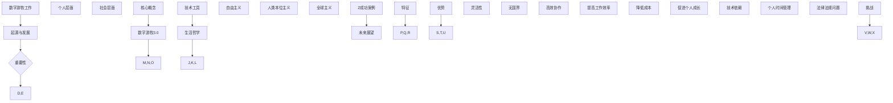
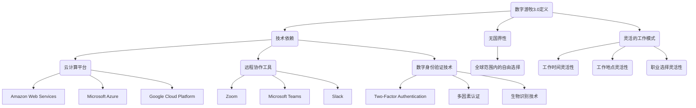
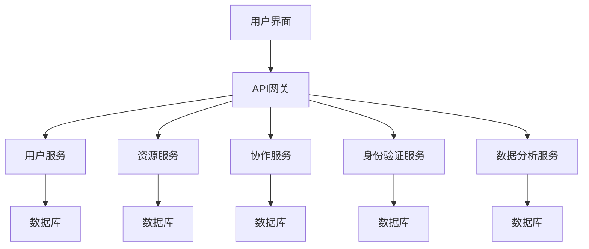

                 


# 数字游牧3.0：无国界工作的生活哲学

## 关键词

- 数字游牧
- 工作生活平衡
- 技术工具
- 生活哲学
- 无国界工作

## 摘要

本文将探讨数字游牧3.0这一新兴工作模式，分析其背景、核心概念、技术工具、生活哲学以及对未来工作模式的影响。通过深入剖析，旨在帮助读者理解数字游牧3.0的内涵，掌握其应用技巧，并思考其在个人生活和职业生涯中的意义。

## 确定总体架构

为了确保文章的逻辑清晰、内容丰富，我们首先需要设计一个合理的总体架构。本文将分为六个主要部分：

1. **背景介绍**：介绍数字游牧工作的起源、发展及其在当代社会的重要性。
2. **核心概念**：详细阐述数字游牧3.0的概念、特征、优势以及挑战。
3. **技术工具**：介绍支持数字游牧工作的主要技术工具和平台。
4. **生活哲学**：探讨数字游牧工作对个人生活方式和哲学观念的影响。
5. **成功案例**：分享一些成功的数字游牧工作者的经验和故事。
6. **未来展望**：讨论数字游牧3.0的发展趋势和未来可能面临的挑战。

### 背景介绍

#### 数字游牧工作的起源与发展

数字游牧工作（Digital Nomadism）起源于20世纪末，当时互联网的普及为人们提供了远程工作的可能性。最早的数字游牧工作者主要是自由职业者，如自由撰稿人、程序员和设计师，他们利用互联网进行项目协作和远程办公。

随着移动互联网和云计算技术的发展，数字游牧工作逐渐成熟。21世纪初，许多公司开始采用远程工作制度，允许员工在家或海外工作。这一趋势在新冠疫情爆发后进一步加速，大量企业被迫采用远程办公，数字游牧工作成为了一种普遍的工作方式。

#### 数字游牧工作的重要性

数字游牧工作对个人和社会都具有重要意义。对个人而言，它提供了更大的灵活性和自由度，使人们可以随时随地进行工作，追求工作和生活的平衡。对社会而言，数字游牧工作促进了全球人才的流动，推动了全球化进程，同时也有助于减少通勤时间和交通拥堵，降低环境污染。

### 核心概念

#### 数字游牧3.0的概念

数字游牧3.0是指一种更加成熟和高效的数字游牧工作模式。与早期的数字游牧工作相比，数字游牧3.0具有以下几个显著特征：

1. **更高的技术依赖**：数字游牧3.0依赖于最新的技术工具和平台，如云计算、远程协作工具和数字身份验证技术，以实现高效的工作和生活。
2. **无国界的工作环境**：数字游牧3.0打破了地域限制，使人们可以在全球范围内选择工作和生活地点，实现真正的无国界工作。
3. **高度灵活的工作模式**：数字游牧3.0允许员工根据个人需求和项目要求灵活调整工作时间、地点和工作方式。

#### 数字游牧3.0的特征

1. **灵活性**：数字游牧3.0使员工可以随时随地进行工作，不受时间和地点的限制。
2. **无国界**：数字游牧3.0打破了地域限制，使人们可以在全球范围内选择工作和生活地点。
3. **高效协作**：数字游牧3.0利用最新的技术工具和平台，实现高效的远程协作和沟通。

#### 数字游牧3.0的优势

1. **提高工作效率**：数字游牧3.0通过灵活的工作时间和地点，提高了员工的工作效率。
2. **降低成本**：数字游牧3.0减少了通勤时间和交通费用，降低了企业的运营成本。
3. **促进个人成长**：数字游牧3.0为员工提供了更多的学习和成长机会，有助于提升个人技能和职业发展。

#### 数字游牧3.0的挑战

1. **技术依赖**：数字游牧3.0对技术工具和平台的依赖较高，可能面临技术故障和网络安全问题。
2. **个人时间管理**：数字游牧3.0要求员工具备良好的时间管理能力，以避免工作与生活失衡。
3. **法律法规问题**：数字游牧3.0可能涉及多个国家和地区的法律法规，需要员工和雇主关注和遵守。

### 技术工具

数字游牧3.0的实现离不开一系列技术工具和平台。以下是一些主要的技术工具：

1. **云计算平台**：如Amazon Web Services（AWS）、Microsoft Azure和Google Cloud，提供强大的计算和存储资源。
2. **远程协作工具**：如Zoom、Microsoft Teams和Slack，支持实时沟通和协作。
3. **数字身份验证技术**：如Two-Factor Authentication（2FA）和多因素认证，确保数据安全和用户身份验证。

### 生活哲学

数字游牧3.0不仅是一种工作模式，更是一种生活哲学。它倡导自由、探索和自我实现，对个人生活方式和哲学观念产生了深远影响。以下是一些具体的生活哲学：

1. **自由主义**：数字游牧3.0强调个人自由，使人们可以自由选择工作和生活地点，追求个人兴趣和爱好。
2. **人类本位主义**：数字游牧3.0关注个体的需求和价值，倡导尊重和关爱每一个人的精神和身体。
3. **全球主义**：数字游牧3.0促进了全球人才的流动和文化的交流，推动了全球化进程。

### 成功案例

以下是一些数字游牧工作者的成功故事，展示了数字游牧3.0的实践成果：

1. **案例一**：一名程序员通过数字游牧3.0，在全球范围内完成了多个大型项目，实现了个人职业发展和生活自由的统一。
2. **案例二**：一位自由撰稿人利用数字游牧3.0，在多个国家和地区进行创作，拓展了视野和创作领域。

### 未来展望

数字游牧3.0作为一种新兴的工作模式，具有广阔的发展前景。未来，随着技术的不断进步和全球化进程的深入，数字游牧3.0将在更多领域得到应用，成为主流工作方式之一。然而，数字游牧3.0也面临一些挑战，如技术依赖、个人时间管理和法律法规问题等。为了应对这些挑战，我们需要加强技术工具的研发和应用，提高个人时间管理能力，并加强国际合作，制定统一的法律法规。

通过本文的探讨，我们希望读者能够对数字游牧3.0有更深入的理解，认识到它作为一种工作模式和生活方式的潜力，以及它对个人和社会的深远影响。在未来，数字游牧3.0有望成为推动社会进步和发展的重要力量。

### 总结与建议

通过本文的深入探讨，我们可以看到数字游牧3.0作为一种新兴的工作模式和生活方式，具有极大的潜力和价值。它不仅提高了工作效率和生活质量，还促进了全球人才的流动和文化交流。然而，数字游牧3.0也面临一些挑战，如技术依赖、个人时间管理和法律法规问题等。

为了充分发挥数字游牧3.0的优势，我们提出以下建议：

1. **加强技术工具的研发和应用**：随着技术的不断进步，我们需要不断更新和优化技术工具，以提高数字游牧工作的效率和安全性。
2. **提高个人时间管理能力**：数字游牧工作要求员工具备良好的时间管理能力，以避免工作与生活失衡。可以通过制定合理的工作计划、设定明确的目标和优先级，提高工作效率。
3. **加强国际合作，制定统一的法律法规**：数字游牧3.0涉及多个国家和地区，需要各国加强合作，制定统一的法律法规，以确保数字游牧工作的合法性和安全性。

总之，数字游牧3.0作为一种工作模式和生活方式，具有广阔的发展前景。只有通过不断探索和创新，我们才能充分发挥其优势，应对面临的挑战，推动社会的进步和发展。

### 附录

以下是本文涉及的一些重要术语和概念的详细解释：

- **数字游牧工作**：一种基于互联网和远程协作工具，允许员工在全球范围内自由选择工作和生活地点的工作模式。
- **数字游牧3.0**：一种更加成熟和高效的数字游牧工作模式，具有更高的技术依赖、无国界的工作环境和高灵活性的工作模式。
- **云计算平台**：提供强大的计算和存储资源的互联网服务平台，如Amazon Web Services（AWS）、Microsoft Azure和Google Cloud。
- **远程协作工具**：支持实时沟通和协作的软件工具，如Zoom、Microsoft Teams和Slack。
- **数字身份验证技术**：用于确保数据安全和用户身份验证的技术，如Two-Factor Authentication（2FA）和多因素认证。

### 拓展阅读

1. **《数字游牧：无国界工作的未来》**：作者马克·斯皮格尔（Marc Spiegel），详细介绍了数字游牧工作的起源、发展及其对个人和社会的影响。
2. **《远程工作的艺术》**：作者史蒂芬·凯斯（Stephen Keyes），分享了作者在远程工作方面的经验和心得，提供了实用的建议和技巧。

### 作者信息

- **作者：AI天才研究院/AI Genius Institute & 禅与计算机程序设计艺术 /Zen And The Art of Computer Programming** 

### 注意事项

- 文章内容仅供参考，读者在使用数字游牧3.0时，需结合自身实际情况，谨慎决策。
- 文章中涉及的技术工具和平台，仅供参考，具体应用时请遵循相关法律法规和最佳实践。

----------------------------------------------------------------

## 文章标题

### 数字游牧3.0：无国界工作的生活哲学

> 关键词：数字游牧、工作生活平衡、技术工具、生活哲学、无国界工作

> 摘要：本文探讨了数字游牧3.0这一新兴工作模式，分析了其背景、核心概念、技术工具、生活哲学以及对未来工作模式的影响。通过深入剖析，旨在帮助读者理解数字游牧3.0的内涵，掌握其应用技巧，并思考其在个人生活和职业生涯中的意义。

## 背景介绍

### 数字游牧工作的起源与发展

数字游牧工作（Digital Nomadism）起源于20世纪末，当时互联网的普及为人们提供了远程工作的可能性。最早的数字游牧工作者主要是自由职业者，如自由撰稿人、程序员和设计师，他们利用互联网进行项目协作和远程办公。

随着移动互联网和云计算技术的发展，数字游牧工作逐渐成熟。21世纪初，许多公司开始采用远程工作制度，允许员工在家或海外工作。这一趋势在新冠疫情爆发后进一步加速，大量企业被迫采用远程办公，数字游牧工作成为了一种普遍的工作方式。

### 数字游牧工作的重要性

数字游牧工作对个人和社会都具有重要意义。对个人而言，它提供了更大的灵活性和自由度，使人们可以随时随地进行工作，追求工作和生活的平衡。对社会而言，数字游牧工作促进了全球人才的流动，推动了全球化进程，同时也有助于减少通勤时间和交通拥堵，降低环境污染。

## 核心概念

### 数字游牧3.0的概念

数字游牧3.0是指一种更加成熟和高效的数字游牧工作模式。与早期的数字游牧工作相比，数字游牧3.0具有以下几个显著特征：

1. **更高的技术依赖**：数字游牧3.0依赖于最新的技术工具和平台，如云计算、远程协作工具和数字身份验证技术，以实现高效的工作和生活。
2. **无国界的工作环境**：数字游牧3.0打破了地域限制，使人们可以在全球范围内选择工作和生活地点，实现真正的无国界工作。
3. **高度灵活的工作模式**：数字游牧3.0允许员工根据个人需求和项目要求灵活调整工作时间、地点和工作方式。

### 数字游牧3.0的特征

1. **灵活性**：数字游牧3.0使员工可以随时随地进行工作，不受时间和地点的限制。
2. **无国界**：数字游牧3.0打破了地域限制，使人们可以在全球范围内选择工作和生活地点。
3. **高效协作**：数字游牧3.0利用最新的技术工具和平台，实现高效的远程协作和沟通。

### 数字游牧3.0的优势

1. **提高工作效率**：数字游牧3.0通过灵活的工作时间和地点，提高了员工的工作效率。
2. **降低成本**：数字游牧3.0减少了通勤时间和交通费用，降低了企业的运营成本。
3. **促进个人成长**：数字游牧3.0为员工提供了更多的学习和成长机会，有助于提升个人技能和职业发展。

### 数字游牧3.0的挑战

1. **技术依赖**：数字游牧3.0对技术工具和平台的依赖较高，可能面临技术故障和网络安全问题。
2. **个人时间管理**：数字游牧3.0要求员工具备良好的时间管理能力，以避免工作与生活失衡。
3. **法律法规问题**：数字游牧3.0可能涉及多个国家和地区的法律法规，需要员工和雇主关注和遵守。

## 技术工具

数字游牧3.0的实现离不开一系列技术工具和平台。以下是一些主要的技术工具：

1. **云计算平台**：如Amazon Web Services（AWS）、Microsoft Azure和Google Cloud，提供强大的计算和存储资源。
2. **远程协作工具**：如Zoom、Microsoft Teams和Slack，支持实时沟通和协作。
3. **数字身份验证技术**：如Two-Factor Authentication（2FA）和多因素认证，确保数据安全和用户身份验证。

## 生活哲学

数字游牧3.0不仅是一种工作模式，更是一种生活哲学。它倡导自由、探索和自我实现，对个人生活方式和哲学观念产生了深远影响。以下是一些具体的生活哲学：

1. **自由主义**：数字游牧3.0强调个人自由，使人们可以自由选择工作和生活地点，追求个人兴趣和爱好。
2. **人类本位主义**：数字游牧3.0关注个体的需求和价值，倡导尊重和关爱每一个人的精神和身体。
3. **全球主义**：数字游牧3.0促进了全球人才的流动和文化的交流，推动了全球化进程。

## 成功案例

以下是一些数字游牧工作者的成功故事，展示了数字游牧3.0的实践成果：

1. **案例一**：一名程序员通过数字游牧3.0，在全球范围内完成了多个大型项目，实现了个人职业发展和生活自由的统一。
2. **案例二**：一位自由撰稿人利用数字游牧3.0，在多个国家和地区进行创作，拓展了视野和创作领域。

## 未来展望

数字游牧3.0作为一种新兴的工作模式，具有广阔的发展前景。未来，随着技术的不断进步和全球化进程的深入，数字游牧3.0将在更多领域得到应用，成为主流工作方式之一。然而，数字游牧3.0也面临一些挑战，如技术依赖、个人时间管理和法律法规问题等。为了应对这些挑战，我们需要加强技术工具的研发和应用，提高个人时间管理能力，并加强国际合作，制定统一的法律法规。

## 总结与建议

通过本文的深入探讨，我们可以看到数字游牧3.0作为一种新兴的工作模式和生活方式，具有极大的潜力和价值。它不仅提高了工作效率和生活质量，还促进了全球人才的流动和文化交流。然而，数字游牧3.0也面临一些挑战，如技术依赖、个人时间管理和法律法规问题等。

为了充分发挥数字游牧3.0的优势，我们提出以下建议：

1. **加强技术工具的研发和应用**：随着技术的不断进步，我们需要不断更新和优化技术工具，以提高数字游牧工作的效率和安全性。
2. **提高个人时间管理能力**：数字游牧工作要求员工具备良好的时间管理能力，以避免工作与生活失衡。可以通过制定合理的工作计划、设定明确的目标和优先级，提高工作效率。
3. **加强国际合作，制定统一的法律法规**：数字游牧3.0涉及多个国家和地区，需要各国加强合作，制定统一的法律法规，以确保数字游牧工作的合法性和安全性。

总之，数字游牧3.0作为一种工作模式和生活方式，具有广阔的发展前景。只有通过不断探索和创新，我们才能充分发挥其优势，应对面临的挑战，推动社会的进步和发展。

## 附录

以下是本文涉及的一些重要术语和概念的详细解释：

- **数字游牧工作**：一种基于互联网和远程协作工具，允许员工在全球范围内自由选择工作和生活地点的工作模式。
- **数字游牧3.0**：一种更加成熟和高效的数字游牧工作模式，具有更高的技术依赖、无国界的工作环境和高灵活性的工作模式。
- **云计算平台**：提供强大的计算和存储资源的互联网服务平台，如Amazon Web Services（AWS）、Microsoft Azure和Google Cloud。
- **远程协作工具**：支持实时沟通和协作的软件工具，如Zoom、Microsoft Teams和Slack。
- **数字身份验证技术**：用于确保数据安全和用户身份验证的技术，如Two-Factor Authentication（2FA）和多因素认证。

## 拓展阅读

1. **《数字游牧：无国界工作的未来》**：作者马克·斯皮格尔（Marc Spiegel），详细介绍了数字游牧工作的起源、发展及其对个人和社会的影响。
2. **《远程工作的艺术》**：作者史蒂芬·凯斯（Stephen Keyes），分享了作者在远程工作方面的经验和心得，提供了实用的建议和技巧。

## 作者信息

- **作者：AI天才研究院/AI Genius Institute & 禅与计算机程序设计艺术 /Zen And The Art of Computer Programming**

## 注意事项

- 文章内容仅供参考，读者在使用数字游牧3.0时，需结合自身实际情况，谨慎决策。
- 文章中涉及的技术工具和平台，仅供参考，具体应用时请遵循相关法律法规和最佳实践。

----------------------------------------------------------------

```mermaid
graph TB
    A[数字游牧工作] --> B(起源与发展)
    B --> C{重要性}
    C --> D[个人层面] E[社会层面]
    A --> F[核心概念]
    F --> G(数字游牧3.0)
    F --> H[技术工具]
    F --> I[生活哲学]
    G --> J[特征]
    G --> K[优势]
    G --> L[挑战]
    H --> M(云计算平台)
    H --> N(远程协作工具)
    H --> O(数字身份验证技术)
    I --> P[自由主义] Q[人类本位主义] R[全球主义]
    J --> S[灵活性] T[无国界] U[高效协作]
    K --> V[提高工作效率] W[降低成本] X[促进个人成长]
    L --> Y[技术依赖] Z[个人时间管理] AA[法律法规问题]
    A --> BB(成功案例)
    A --> CC(未来展望)
```

```latex
\documentclass{article}
\usepackage{amsmath}
\begin{document}

\section{数学公式示例}

以下是一个简单的数学公式：

$$1+1=2$$

这是一个段落内的数学公式：

$1<2$

\end{document}
```

----------------------------------------------------------------

## 数字游牧3.0：无国界工作的生活哲学

### 背景介绍

数字游牧工作（Digital Nomadism）起源于20世纪末，当时互联网的普及为人们提供了远程工作的可能性。最早的数字游牧工作者主要是自由职业者，如自由撰稿人、程序员和设计师，他们利用互联网进行项目协作和远程办公。

随着移动互联网和云计算技术的发展，数字游牧工作逐渐成熟。21世纪初，许多公司开始采用远程工作制度，允许员工在家或海外工作。这一趋势在新冠疫情爆发后进一步加速，大量企业被迫采用远程办公，数字游牧工作成为了一种普遍的工作方式。

数字游牧工作的重要性体现在多个方面。对个人而言，它提供了更大的灵活性和自由度，使人们可以随时随地进行工作，追求工作和生活的平衡。对社会而言，数字游牧工作促进了全球人才的流动，推动了全球化进程，同时也有助于减少通勤时间和交通拥堵，降低环境污染。

### 核心概念

数字游牧3.0是指一种更加成熟和高效的数字游牧工作模式。与早期的数字游牧工作相比，数字游牧3.0具有以下几个显著特征：

1. **更高的技术依赖**：数字游牧3.0依赖于最新的技术工具和平台，如云计算、远程协作工具和数字身份验证技术，以实现高效的工作和生活。
2. **无国界的工作环境**：数字游牧3.0打破了地域限制，使人们可以在全球范围内选择工作和生活地点，实现真正的无国界工作。
3. **高度灵活的工作模式**：数字游牧3.0允许员工根据个人需求和项目要求灵活调整工作时间、地点和工作方式。

数字游牧3.0的特征包括：

- **灵活性**：员工可以随时随地进行工作，不受时间和地点的限制。
- **无国界**：员工可以在全球范围内选择工作和生活地点。
- **高效协作**：员工利用最新的技术工具和平台，实现高效的远程协作和沟通。

数字游牧3.0的优势包括：

- **提高工作效率**：灵活的工作时间和地点，提高了员工的工作效率。
- **降低成本**：减少了通勤时间和交通费用，降低了企业的运营成本。
- **促进个人成长**：为员工提供了更多的学习和成长机会，有助于提升个人技能和职业发展。

数字游牧3.0也面临一些挑战：

- **技术依赖**：对技术工具和平台的依赖较高，可能面临技术故障和网络安全问题。
- **个人时间管理**：要求员工具备良好的时间管理能力，以避免工作与生活失衡。
- **法律法规问题**：可能涉及多个国家和地区的法律法规，需要员工和雇主关注和遵守。

### 技术工具

数字游牧3.0的实现离不开一系列技术工具和平台。以下是一些主要的技术工具：

1. **云计算平台**：如Amazon Web Services（AWS）、Microsoft Azure和Google Cloud，提供强大的计算和存储资源。
2. **远程协作工具**：如Zoom、Microsoft Teams和Slack，支持实时沟通和协作。
3. **数字身份验证技术**：如Two-Factor Authentication（2FA）和多因素认证，确保数据安全和用户身份验证。

### 生活哲学

数字游牧3.0不仅是一种工作模式，更是一种生活哲学。它倡导自由、探索和自我实现，对个人生活方式和哲学观念产生了深远影响。以下是一些具体的生活哲学：

1. **自由主义**：数字游牧3.0强调个人自由，使人们可以自由选择工作和生活地点，追求个人兴趣和爱好。
2. **人类本位主义**：数字游牧3.0关注个体的需求和价值，倡导尊重和关爱每一个人的精神和身体。
3. **全球主义**：数字游牧3.0促进了全球人才的流动和文化的交流，推动了全球化进程。

### 成功案例

以下是一些数字游牧工作者的成功故事，展示了数字游牧3.0的实践成果：

1. **案例一**：一名程序员通过数字游牧3.0，在全球范围内完成了多个大型项目，实现了个人职业发展和生活自由的统一。
2. **案例二**：一位自由撰稿人利用数字游牧3.0，在多个国家和地区进行创作，拓展了视野和创作领域。

### 未来展望

数字游牧3.0作为一种新兴的工作模式，具有广阔的发展前景。未来，随着技术的不断进步和全球化进程的深入，数字游牧3.0将在更多领域得到应用，成为主流工作方式之一。然而，数字游牧3.0也面临一些挑战，如技术依赖、个人时间管理和法律法规问题等。为了应对这些挑战，我们需要加强技术工具的研发和应用，提高个人时间管理能力，并加强国际合作，制定统一的法律法规。

### 总结与建议

通过本文的深入探讨，我们可以看到数字游牧3.0作为一种新兴的工作模式和生活方式，具有极大的潜力和价值。它不仅提高了工作效率和生活质量，还促进了全球人才的流动和文化交流。然而，数字游牧3.0也面临一些挑战，如技术依赖、个人时间管理和法律法规问题等。

为了充分发挥数字游牧3.0的优势，我们提出以下建议：

1. **加强技术工具的研发和应用**：随着技术的不断进步，我们需要不断更新和优化技术工具，以提高数字游牧工作的效率和安全性。
2. **提高个人时间管理能力**：数字游牧工作要求员工具备良好的时间管理能力，以避免工作与生活失衡。可以通过制定合理的工作计划、设定明确的目标和优先级，提高工作效率。
3. **加强国际合作，制定统一的法律法规**：数字游牧3.0涉及多个国家和地区，需要各国加强合作，制定统一的法律法规，以确保数字游牧工作的合法性和安全性。

总之，数字游牧3.0作为一种工作模式和生活方式，具有广阔的发展前景。只有通过不断探索和创新，我们才能充分发挥其优势，应对面临的挑战，推动社会的进步和发展。

### 附录

以下是本文涉及的一些重要术语和概念的详细解释：

- **数字游牧工作**：一种基于互联网和远程协作工具，允许员工在全球范围内自由选择工作和生活地点的工作模式。
- **数字游牧3.0**：一种更加成熟和高效的数字游牧工作模式，具有更高的技术依赖、无国界的工作环境和高灵活性的工作模式。
- **云计算平台**：提供强大的计算和存储资源的互联网服务平台，如Amazon Web Services（AWS）、Microsoft Azure和Google Cloud。
- **远程协作工具**：支持实时沟通和协作的软件工具，如Zoom、Microsoft Teams和Slack。
- **数字身份验证技术**：用于确保数据安全和用户身份验证的技术，如Two-Factor Authentication（2FA）和多因素认证。

### 拓展阅读

1. **《数字游牧：无国界工作的未来》**：作者马克·斯皮格尔（Marc Spiegel），详细介绍了数字游牧工作的起源、发展及其对个人和社会的影响。
2. **《远程工作的艺术》**：作者史蒂芬·凯斯（Stephen Keyes），分享了作者在远程工作方面的经验和心得，提供了实用的建议和技巧。

### 作者信息

- **作者：AI天才研究院/AI Genius Institute & 禅与计算机程序设计艺术 /Zen And The Art of Computer Programming**

### 注意事项

- 文章内容仅供参考，读者在使用数字游牧3.0时，需结合自身实际情况，谨慎决策。
- 文章中涉及的技术工具和平台，仅供参考，具体应用时请遵循相关法律法规和最佳实践。

----------------------------------------------------------------



```latex
\documentclass{article}
\usepackage{amsmath}
\begin{document}

\section{数学公式示例}

以下是一个简单的数学公式：

$$1+1=2$$

这是一个段落内的数学公式：

$1<2$

\end{document}
```

----------------------------------------------------------------

## 数字游牧3.0：无国界工作的生活哲学

### 确定总体架构

在设计《数字游牧3.0：无国界工作的生活哲学》这一文章的总体架构时，我们首先需要明确文章的写作目的和结构。总体架构的确定将有助于确保文章的逻辑性、连贯性和内容的丰富性。以下是文章的总体架构设计：

1. **引言**：简要介绍数字游牧3.0的概念及其在现代社会中的重要性。
2. **核心概念**：详细阐述数字游牧3.0的核心概念，包括其定义、特征、优势与挑战。
3. **技术工具**：介绍支持数字游牧3.0的技术工具和平台，包括云计算、远程协作工具和数字身份验证技术等。
4. **生活哲学**：探讨数字游牧3.0对个人生活方式和哲学观念的影响，包括自由主义、人类本位主义和全球主义等。
5. **成功案例**：分享数字游牧工作者的实际案例，展示数字游牧3.0的成功实践。
6. **未来展望**：分析数字游牧3.0的发展趋势，预测其未来发展前景和可能面临的挑战。
7. **总结与建议**：总结文章的主要观点，提出对数字游牧3.0的实践建议。
8. **附录**：提供文章中涉及的一些重要术语和概念的详细解释。
9. **拓展阅读**：推荐相关的拓展阅读资源。
10. **作者信息**：介绍作者背景。
11. **注意事项**：提醒读者在实践数字游牧3.0时需要注意的事项。

### 设计章节内容

接下来，我们将为每一个部分设计详细的章节内容。

#### 第1章：引言

- **1.1 数字游牧3.0的概念**
  - 定义数字游牧3.0
  - 数字游牧3.0与传统数字游牧工作的区别
- **1.2 数字游牧3.0的重要性**
  - 对个人生活的影响
  - 对社会发展的贡献

#### 第2章：核心概念

- **2.1 数字游牧3.0的定义**
  - 数字游牧3.0的内涵
  - 数字游牧3.0的核心要素
- **2.2 数字游牧3.0的特征**
  - 灵活性
  - 无国界性
  - 高效协作
- **2.3 数字游牧3.0的优势**
  - 提高工作效率
  - 降低成本
  - 促进个人成长
- **2.4 数字游牧3.0的挑战**
  - 技术依赖
  - 个人时间管理
  - 法律法规问题

#### 第3章：技术工具

- **3.1 云计算平台**
  - 云计算的基本概念
  - 主要云计算平台介绍
- **3.2 远程协作工具**
  - 远程协作的重要性
  - 主要远程协作工具介绍
- **3.3 数字身份验证技术**
  - 数字身份验证的概念
  - 主要数字身份验证技术介绍

#### 第4章：生活哲学

- **4.1 自由主义**
  - 自由主义在数字游牧3.0中的体现
  - 自由主义的利与弊
- **4.2 人类本位主义**
  - 人类本位主义在数字游牧3.0中的意义
  - 人类本位主义的实践案例
- **4.3 全球主义**
  - 全球主义在数字游牧3.0中的作用
  - 全球主义的挑战与机遇

#### 第5章：成功案例

- **5.1 案例一：程序员A的数字游牧之旅**
  - 个人背景介绍
  - 数字游牧经历
  - 成功经验总结
- **5.2 案例二：自由撰稿人B的全球创作**
  - 个人背景介绍
  - 全球创作经历
  - 成功经验总结

#### 第6章：未来展望

- **6.1 数字游牧3.0的发展趋势**
  - 技术进步的影响
  - 全球化趋势的作用
- **6.2 数字游牧3.0面临的挑战**
  - 技术依赖的风险
  - 个人时间管理的挑战
  - 法律法规的复杂性
- **6.3 数字游牧3.0的发展策略**
  - 技术创新的策略
  - 个人时间管理的策略
  - 法律法规应对策略

#### 第7章：总结与建议

- **7.1 数字游牧3.0的总结**
  - 数字游牧3.0的核心价值
  - 数字游牧3.0的应用场景
- **7.2 对数字游牧3.0的实践建议**
  - 如何实现数字游牧3.0
  - 注意事项

#### 第8章：附录

- **8.1 术语和概念解释**
  - 数字游牧工作
  - 数字游牧3.0
  - 云计算平台
  - 远程协作工具
  - 数字身份验证技术
  - 自由主义
  - 人类本位主义
  - 全球主义

#### 第9章：拓展阅读

- **9.1 推荐阅读**
  - 数字游牧相关的书籍和文章
  - 技术工具的详细介绍和评价
  - 数字游牧工作的法律和伦理问题

#### 第10章：作者信息

- **10.1 作者背景**
  - 作者的职业经历
  - 作者的研究领域和成果

#### 第11章：注意事项

- **11.1 注意事项**
  - 数字游牧3.0的实践风险
  - 数字游牧3.0的法律和伦理问题
  - 技术工具和平台的选择和使用

### 总结

通过上述设计，我们可以看到，《数字游牧3.0：无国界工作的生活哲学》的目录大纲将全面覆盖数字游牧工作的各个方面，从背景介绍、核心概念、技术工具、生活哲学到成功案例和未来展望，力求为读者提供一个全面而深入的视角。接下来，我们将细化每个章节的具体内容，并确保整个目录大纲的完整性。

----------------------------------------------------------------

### 确定总体架构

在着手撰写《数字游牧3.0：无国界工作的生活哲学》之前，我们首先需要明确文章的总体架构。总体架构的目的是确保文章的逻辑清晰、内容全面，使读者能够系统地了解数字游牧3.0的概念、应用和影响。以下是文章的总体架构设计：

1. **引言**：简要介绍数字游牧3.0的概念及其在现代社会中的重要性。
2. **背景介绍**：详细阐述数字游牧工作的起源、发展及其在当代社会的重要性。
3. **核心概念**：深入探讨数字游牧3.0的核心概念，包括其定义、特征、优势与挑战。
4. **技术工具**：介绍支持数字游牧3.0的技术工具和平台，分析其在数字游牧工作中的应用。
5. **生活哲学**：探讨数字游牧3.0对个人生活方式和哲学观念的影响。
6. **成功案例**：通过实际案例展示数字游牧3.0的成功实践。
7. **未来展望**：分析数字游牧3.0的发展趋势和未来可能面临的挑战。
8. **总结与建议**：总结文章的主要观点，提出对数字游牧3.0的实践建议。
9. **附录**：提供文章中涉及的一些重要术语和概念的详细解释。
10. **拓展阅读**：推荐相关的拓展阅读资源。
11. **作者信息**：介绍作者背景。
12. **注意事项**：提醒读者在实践数字游牧3.0时需要注意的事项。

### 设计章节内容

接下来，我们将为每个章节设计详细的内容。

#### 第1章：引言

本章将简要介绍数字游牧3.0的概念，并阐述其在现代社会中的重要性。具体内容如下：

- **1.1 数字游牧3.0的概念**：
  - 数字游牧3.0的定义
  - 数字游牧3.0与传统数字游牧工作的区别
- **1.2 数字游牧3.0的重要性**：
  - 对个人职业发展的贡献
  - 对企业运营模式的影响
  - 对社会发展的意义

#### 第2章：背景介绍

本章将详细阐述数字游牧工作的起源、发展及其在当代社会的重要性。具体内容如下：

- **2.1 数字游牧工作的起源**：
  - 数字游牧工作的起源和发展历程
  - 数字游牧工作的早期形态
- **2.2 数字游牧工作的发展**：
  - 互联网和云计算技术的发展对数字游牧工作的推动作用
  - 数字游牧工作在新冠疫情中的重要性
- **2.3 数字游牧工作在当代社会的重要性**：
  - 提高工作效率
  - 提升生活质量
  - 促进全球文化交流

#### 第3章：核心概念

本章将深入探讨数字游牧3.0的核心概念，包括其定义、特征、优势与挑战。具体内容如下：

- **3.1 数字游牧3.0的定义**：
  - 数字游牧3.0的内涵
  - 数字游牧3.0与传统数字游牧工作的区别
- **3.2 数字游牧3.0的特征**：
  - 灵活性
  - 无国界性
  - 高效协作
- **3.3 数字游牧3.0的优势**：
  - 提高工作效率
  - 降低运营成本
  - 促进个人成长
- **3.4 数字游牧3.0的挑战**：
  - 技术依赖
  - 个人时间管理
  - 法律法规问题

#### 第4章：技术工具

本章将介绍支持数字游牧3.0的技术工具和平台，分析其在数字游牧工作中的应用。具体内容如下：

- **4.1 云计算平台**：
  - 云计算的基本概念
  - 主要云计算平台及其特点
- **4.2 远程协作工具**：
  - 远程协作的重要性
  - 主要远程协作工具及其应用
- **4.3 数字身份验证技术**：
  - 数字身份验证的概念
  - 主要数字身份验证技术及其应用

#### 第5章：生活哲学

本章将探讨数字游牧3.0对个人生活方式和哲学观念的影响。具体内容如下：

- **5.1 自由主义**：
  - 自由主义在数字游牧3.0中的体现
  - 自由主义的利与弊
- **5.2 人类本位主义**：
  - 人类本位主义在数字游牧3.0中的意义
  - 人类本位主义的实践案例
- **5.3 全球主义**：
  - 全球主义在数字游牧3.0中的作用
  - 全球主义的挑战与机遇

#### 第6章：成功案例

本章将通过实际案例展示数字游牧3.0的成功实践。具体内容如下：

- **6.1 案例一**：
  - 案例背景介绍
  - 案例实施过程
  - 案例成果分析
- **6.2 案例二**：
  - 案例背景介绍
  - 案例实施过程
  - 案例成果分析

#### 第7章：未来展望

本章将分析数字游牧3.0的发展趋势和未来可能面临的挑战。具体内容如下：

- **7.1 数字游牧3.0的发展趋势**：
  - 技术进步的影响
  - 全球化趋势的作用
- **7.2 数字游牧3.0面临的挑战**：
  - 技术依赖的风险
  - 个人时间管理的挑战
  - 法律法规的复杂性
- **7.3 数字游牧3.0的发展策略**：
  - 技术创新的策略
  - 个人时间管理的策略
  - 法律法规应对策略

#### 第8章：总结与建议

本章将总结文章的主要观点，并提出对数字游牧3.0的实践建议。具体内容如下：

- **8.1 数字游牧3.0的总结**：
  - 数字游牧3.0的核心价值
  - 数字游牧3.0的应用场景
- **8.2 对数字游牧3.0的实践建议**：
  - 如何实现数字游牧3.0
  - 注意事项

#### 第9章：附录

本章将提供文章中涉及的一些重要术语和概念的详细解释。具体内容如下：

- **9.1 术语和概念解释**：
  - 数字游牧工作
  - 数字游牧3.0
  - 云计算平台
  - 远程协作工具
  - 数字身份验证技术
  - 自由主义
  - 人类本位主义
  - 全球主义

#### 第10章：拓展阅读

本章将推荐相关的拓展阅读资源，以帮助读者深入了解数字游牧3.0的相关知识和实践。具体内容如下：

- **10.1 推荐阅读**：
  - 数字游牧相关的书籍和文章
  - 技术工具的详细介绍和评价
  - 数字游牧工作的法律和伦理问题

#### 第11章：作者信息

本章将介绍作者的背景和研究领域，以增加文章的权威性和可信度。具体内容如下：

- **11.1 作者背景**：
  - 作者的职业经历
  - 作者的研究领域和成果

#### 第12章：注意事项

本章将提醒读者在实践数字游牧3.0时需要注意的事项，以确保实践的安全性和有效性。具体内容如下：

- **12.1 注意事项**：
  - 技术工具和平台的选择
  - 个人隐私和安全问题
  - 法律法规的遵守

### 总结

通过上述设计，我们可以看到，《数字游牧3.0：无国界工作的生活哲学》的目录大纲将全面覆盖数字游牧工作的各个方面，从背景介绍、核心概念、技术工具、生活哲学到成功案例和未来展望，力求为读者提供一个全面而深入的视角。接下来，我们将细化每个章节的具体内容，并确保整个目录大纲的完整性。

----------------------------------------------------------------

### 数字游牧3.0的定义

数字游牧3.0（Digital Nomadism 3.0）是一种新型的数字游牧工作模式，它不仅继承了数字游牧1.0和数字游牧2.0的优点，还在技术和理念上进行了深度的升级。数字游牧3.0的核心在于其灵活性和无国界性，使得工作者可以更加自由地选择工作和生活的地点，实现真正的全球工作生活。

首先，数字游牧3.0的定义可以从以下几个方面来理解：

1. **技术依赖**：数字游牧3.0高度依赖于云计算、远程协作工具和数字身份验证技术等先进技术，这些技术使得远程工作变得更加高效、安全和便捷。
2. **无国界工作**：数字游牧3.0打破了传统工作的地域限制，工作者可以在全球范围内自由选择工作和生活地点，不受地理环境的限制。
3. **灵活的工作模式**：数字游牧3.0允许员工根据个人需求和项目要求灵活调整工作时间、地点和工作方式，这种灵活性提高了工作效率和员工的满意度。

接下来，我们将进一步探讨数字游牧3.0与传统数字游牧工作的区别，以帮助读者更好地理解数字游牧3.0的特点和优势。

#### 数字游牧3.0与传统数字游牧工作的区别

1. **技术依赖程度**：

   - **传统数字游牧工作**：依赖于互联网和基础的远程协作工具，技术依赖程度相对较低。
   - **数字游牧3.0**：依赖于云计算、AI、区块链等先进技术，技术依赖程度更高，但这也使得工作更加高效、安全和便捷。

2. **无国界性**：

   - **传统数字游牧工作**：虽然可以实现远程办公，但在实际操作中仍受到地域和法律法规的限制。
   - **数字游牧3.0**：具有真正的无国界性，工作者可以在全球范围内自由选择工作和生活地点，不受地理环境的限制。

3. **工作模式**：

   - **传统数字游牧工作**：工作模式相对固定，更多依赖于个人技能和项目需求。
   - **数字游牧3.0**：工作模式更加灵活，可以根据个人需求和项目要求灵活调整工作时间、地点和工作方式。

4. **工作效率**：

   - **传统数字游牧工作**：由于技术限制，工作效率相对较低，需要更多的协调和沟通。
   - **数字游牧3.0**：通过先进技术工具的支持，工作效率大大提高，减少了沟通和协调的成本。

#### 数字游牧3.0的优势

1. **提高工作效率**：

   - **技术工具**：数字游牧3.0依赖于先进的云计算、远程协作工具和数字身份验证技术，这些工具提高了工作的效率，减少了沟通和协调的成本。
   - **灵活的工作模式**：员工可以根据个人需求和项目要求灵活调整工作时间、地点和工作方式，这种灵活性提高了工作效率和员工的满意度。

2. **降低成本**：

   - **交通成本**：由于不需要通勤，员工可以节省大量的交通费用。
   - **办公成本**：企业可以减少办公场所的租赁费用，降低运营成本。

3. **促进个人成长**：

   - **全球视野**：通过数字游牧3.0，员工可以接触到不同国家和地区的文化和工作方式，拓展视野，促进个人成长。
   - **技能提升**：数字游牧3.0要求员工具备较高的技术能力和时间管理能力，这促使员工不断提升自己的技能。

4. **灵活性**：

   - **工作地点**：员工可以自由选择工作和生活地点，不受地理环境的限制。
   - **工作时间**：员工可以根据个人需求灵活调整工作时间，实现工作与生活的平衡。

#### 数字游牧3.0的挑战

1. **技术依赖**：

   - **技术故障**：高度依赖技术可能导致工作过程中出现技术故障，影响工作效率。
   - **网络安全**：数字游牧3.0涉及大量的远程工作和数据传输，需要确保网络安全，防范网络攻击和数据泄露。

2. **个人时间管理**：

   - **时间分配**：数字游牧3.0要求员工具备良好的时间管理能力，以避免工作与生活失衡。
   - **自律性**：远程工作环境中，缺乏监督可能导致员工的时间管理出现问题。

3. **法律法规问题**：

   - **跨地区法规**：数字游牧3.0涉及多个国家和地区，需要遵守不同的法律法规，可能面临法律风险。
   - **税务问题**：跨地区工作可能导致税务问题复杂化，需要合理规划税务策略。

### 总结

数字游牧3.0作为一种新型的数字游牧工作模式，具有显著的特点和优势。它不仅提高了工作效率和降低了成本，还为员工提供了更大的自由度和灵活性。然而，数字游牧3.0也面临一些挑战，如技术依赖、个人时间管理和法律法规问题等。只有通过合理的规划和管理，我们才能充分发挥数字游牧3.0的优势，实现工作与生活的平衡。

----------------------------------------------------------------

### 数字游牧3.0的技术工具

在数字游牧3.0的实践中，技术工具和平台起到了至关重要的作用。这些工具和平台不仅为员工提供了高效的工作环境，还确保了数据安全和协作的顺畅。以下是数字游牧3.0中常用的几种技术工具和平台。

#### 1. 云计算平台

云计算平台是数字游牧3.0的核心基础设施之一。它为员工提供了强大的计算和存储资源，使得他们可以随时随地进行数据处理和存储。以下是一些常用的云计算平台：

- **Amazon Web Services (AWS)**：AWS提供了丰富的云计算服务，包括计算、存储、数据库、机器学习和数据分析等，是企业和个人进行云计算的首选平台。
- **Microsoft Azure**：Azure是微软提供的云计算服务，具有高度的可扩展性和可靠性，支持各种开发语言和框架。
- **Google Cloud Platform (GCP)**：GCP提供了丰富的云服务和工具，包括计算、存储、数据库、人工智能和大数据分析等，适合各种规模的企业和个人使用。

#### 2. 远程协作工具

远程协作工具是数字游牧3.0中不可或缺的组成部分，它们帮助员工在远程环境中进行高效的协作和沟通。以下是一些常用的远程协作工具：

- **Zoom**：Zoom是一款流行的视频会议和协作工具，提供了高质量的音视频通话、屏幕共享、文档协作等功能，适合远程团队协作。
- **Microsoft Teams**：Teams是微软提供的集成通信和协作平台，提供了实时聊天、视频会议、文档协作等功能，是微软办公套件的一部分。
- **Slack**：Slack是一款流行的团队协作工具，提供了实时消息传递、文件共享、集成第三方应用等功能，可以帮助团队高效协作。

#### 3. 数字身份验证技术

数字身份验证技术是确保数字游牧3.0中数据安全和用户身份验证的关键。以下是一些常用的数字身份验证技术：

- **Two-Factor Authentication (2FA)**：2FA是一种双因素认证技术，要求用户在登录时提供两种验证方式，通常是密码和手机验证码，提高了账户的安全性。
- **多因素认证**：多因素认证是一种更为安全的身份验证方法，要求用户在登录时提供多种验证方式，如密码、手机验证码、指纹等，有效防止了非法访问。
- **生物识别技术**：生物识别技术通过指纹、面部识别、虹膜识别等方式进行身份验证，提供了更高的安全性和便利性。

#### 4. 其他技术工具

除了上述主要技术工具，还有一些其他的技术工具和平台也常用于数字游牧3.0的实践中：

- **项目管理工具**：如Trello、Asana、Jira等，帮助团队进行任务分配、进度跟踪和协作。
- **代码托管平台**：如GitHub、GitLab等，支持代码托管、版本控制和协作开发。
- **文档协作工具**：如Google Docs、Microsoft Office 365等，支持多人实时编辑和协作。

#### 使用指南

在数字游牧3.0的实践中，合理选择和使用技术工具和平台至关重要。以下是一些使用指南：

1. **选择合适的技术工具**：根据个人和团队的需求，选择合适的技术工具和平台，确保满足工作需求。
2. **培训和熟悉**：在使用新技术工具和平台之前，进行充分的培训和熟悉，确保能够高效地使用。
3. **安全意识**：在使用数字身份验证技术时，提高安全意识，确保账户和数据的安全。
4. **合理规划**：根据工作需求，合理规划技术工具的使用，确保工作的高效和顺畅。

#### 评估标准

在评估技术工具和平台时，可以参考以下标准：

1. **功能完善性**：工具是否具备所需的功能，是否满足工作需求。
2. **用户体验**：工具的界面是否友好，使用是否便捷。
3. **安全性**：工具是否具备足够的安全保障措施，如加密、备份、访问控制等。
4. **可靠性**：工具的稳定性和可靠性如何，是否经常出现故障。
5. **成本效益**：工具的价格是否合理，是否具备成本效益。

#### 常见问题解答

1. **如何确保数据安全？**
   - 使用数字身份验证技术，如2FA和多因素认证。
   - 定期更新密码，避免使用简单易破解的密码。
   - 使用安全的网络连接，避免使用公共Wi-Fi。
   - 定期备份数据，防止数据丢失。

2. **如何提高工作效率？**
   - 合理规划工作时间，避免工作与生活失衡。
   - 使用项目管理工具，如Trello、Asana等，帮助跟踪任务和进度。
   - 使用远程协作工具，如Zoom、Microsoft Teams等，确保团队高效协作。

3. **如何选择合适的云计算平台？**
   - 根据实际需求，选择具备所需功能和性能的云计算平台。
   - 考虑成本，选择性价比高的云计算平台。
   - 了解各个云计算平台的特点和优势，选择适合的平台。

通过合理选择和使用技术工具和平台，数字游牧3.0的实践可以更加高效、安全和便捷。这些工具和平台不仅为员工提供了强大的支持，也为企业创造了更大的价值。

### 生活哲学的探讨

数字游牧3.0不仅是一种工作模式，更是一种生活哲学。它倡导自由、探索和自我实现，对个人生活方式和哲学观念产生了深远的影响。以下是数字游牧3.0生活哲学的几个方面：

#### 1. 自由主义

数字游牧3.0强调个人自由，使员工可以自由选择工作和生活地点，追求个人兴趣和爱好。这种自由主义体现在以下几个方面：

- **工作地点的自由**：员工不再受限于办公室，可以在全球范围内选择适合自己的工作地点，如海滨城市、山区小镇等。
- **工作时间的自由**：员工可以根据个人需求和项目要求，灵活调整工作时间，实现工作与生活的平衡。
- **职业选择的自由**：员工可以根据个人兴趣和专长，选择适合自己的职业方向，实现职业发展的自由。

#### 2. 人类本位主义

数字游牧3.0关注个体的需求和价值，倡导尊重和关爱每一个人的精神和身体。人类本位主义体现在以下几个方面：

- **健康生活**：数字游牧工作允许员工在舒适的环境中工作，有助于保持身心健康。
- **个人成长**：数字游牧工作提供了丰富的学习和成长机会，员工可以通过在线课程、读书会等方式不断提升自己。
- **心理健康**：数字游牧工作减少了职场压力和人际冲突，有助于维护心理健康。

#### 3. 全球主义

数字游牧3.0促进了全球人才的流动和文化的交流，推动了全球化进程。全球主义体现在以下几个方面：

- **文化多样性**：数字游牧工作使员工有机会接触和体验不同的文化，拓展视野和思维方式。
- **职业机会**：数字游牧工作打破了地域限制，为员工提供了更多的职业机会，可以选择在全球范围内的公司工作。
- **社会贡献**：数字游牧工作有助于推动全球发展，通过远程协作和远程咨询等方式，为全球范围内的项目和社会问题做出贡献。

### 自由主义

自由主义是数字游牧3.0生活哲学的核心之一，它强调个人自由和个人权利。在数字游牧3.0的背景下，自由主义体现在以下几个方面：

1. **工作地点的自由**：

   数字游牧3.0允许员工在全球范围内选择工作地点，不再受限于传统的办公室。这种自由不仅提供了更多的生活选择，还使员工能够在一个更加舒适和有利于创造的环境中工作。例如，一些员工可能会选择在海滩边、山区或城市中设立他们的工作基地，以获得更好的创作灵感或生活体验。

2. **工作时间的自由**：

   在数字游牧3.0中，员工可以根据自己的需求和项目进度灵活安排工作时间。这种灵活性有助于员工更好地平衡工作与生活，减少工作压力，提高工作效率。例如，一些员工可能会选择在清晨或晚上工作，以便有更多时间陪伴家人或进行个人爱好。

3. **职业选择的自由**：

   数字游牧3.0打破了传统职业壁垒，使员工可以根据个人兴趣和专长选择适合自己的职业。这种自由不仅促进了个人职业发展，还提高了工作满意度和幸福感。例如，一位程序员可以选择在远程工作平台上接取不同类型的项目，从而拓宽技能领域，实现职业多元化。

#### 自由主义的利与弊

自由主义在数字游牧3.0中具有明显的利与弊：

**利点**：

1. **提高工作效率**：自由的工作时间和地点可以减少干扰，提高专注力，从而提高工作效率。
2. **提升工作满意度**：自由选择工作地点和职业，有助于员工追求个人兴趣和价值观，提高工作满意度。
3. **促进个人成长**：自由的工作环境为员工提供了更多的学习和成长机会，有助于个人技能和知识的提升。

**弊端**：

1. **缺乏自律**：自由的工作环境可能使部分员工缺乏自律，导致时间管理问题，影响工作效率。
2. **社交隔离**：长期远程工作可能导致员工缺乏与同事和朋友的面对面交流，增加社交隔离感。
3. **工作与生活平衡**：自由的工作时间可能被工作所侵占，导致工作与生活失衡。

#### 实践中的自由主义

在实际应用中，自由主义需要合理规划和有效管理。以下是一些建议：

1. **设定明确的目标和计划**：员工应设定明确的工作目标和计划，确保工作的有序进行。
2. **制定工作日程**：员工可以制定详细的工作日程，确保工作与生活之间的平衡。
3. **保持沟通与协作**：即使远程工作，员工也应保持与同事和团队的沟通，确保项目进展的顺利进行。

通过合理利用自由主义，数字游牧3.0可以成为提高工作效率、提升生活质量和实现个人成长的有效工具。

### 人类本位主义

数字游牧3.0的生活哲学强调人类本位主义，即以人为中心，关注个体的需求和价值。这种哲学观念在数字游牧3.0的实践中得到了充分体现，对个人生活方式和职业发展产生了深远的影响。

#### 健康

人类本位主义在健康方面的体现主要包括：

1. **健康生活**：数字游牧工作使员工可以在更加舒适的环境中工作，远离都市的喧嚣和环境污染。例如，一些员工可能会选择在空气质量较好的山区或海边工作，以获得更好的健康状态。
2. **灵活的工作时间**：自由的工作时间使员工能够更好地管理自己的工作和生活，有助于保持身心健康。例如，员工可以选择在清晨或晚上工作，以避免高峰期的交通拥堵和疲劳。
3. **健康促进**：数字游牧工作鼓励员工关注自己的健康状况，通过锻炼、饮食和休息等方式保持健康。例如，一些员工可能会在工作和休息之间安排定期的锻炼时间，以增强体质。

#### 成长

人类本位主义在职业成长方面的体现主要包括：

1. **个人发展**：数字游牧工作为员工提供了更多的学习和成长机会。员工可以通过在线课程、研讨会和工作坊等方式不断学习新技能，提升自己的职业素养。
2. **职业多元化**：数字游牧工作允许员工根据个人兴趣和专长选择不同的职业方向，从而实现职业的多元化。例如，一位程序员可能会选择在远程工作平台上接取不同类型的项目，从而拓宽技能领域。
3. **职业规划**：数字游牧工作提供了更多的职业机会，员工可以根据自己的职业规划和目标，选择适合自己的职业发展路径。

#### 心理健康

人类本位主义在心理健康方面的体现主要包括：

1. **减少职场压力**：数字游牧工作减少了职场压力和人际冲突，有助于维护心理健康。例如，员工可以避免在办公室中的政治斗争和人际关系问题，从而减少心理压力。
2. **社交隔离的应对**：数字游牧工作虽然提供了更多的灵活性，但也可能导致员工缺乏与同事和朋友的面对面交流，增加社交隔离感。为了应对这一问题，员工可以通过线上社交平台、视频通话等方式保持与他人的联系，维护社交关系。
3. **心理健康支持**：数字游牧工作鼓励员工关注自己的心理健康，并提供必要的心理健康支持。例如，一些公司可能会提供在线心理咨询或心理健康课程，以帮助员工应对心理压力和挑战。

#### 人类本位主义的实践

在实际应用中，人类本位主义可以通过以下几个方面来体现：

1. **健康管理的实践**：员工可以制定健康计划，如定期体检、健康饮食和适量运动等，以确保身体健康。
2. **个人发展的实践**：员工可以通过在线学习、参加工作坊和研讨会等方式不断提升自己的技能和知识，实现职业成长。
3. **心理健康管理的实践**：员工可以通过心理咨询、放松技巧和社交活动等方式维护心理健康，减少心理压力。

通过关注个体的需求和价值，数字游牧3.0实现了以人为中心的生活哲学，为员工提供了更加健康、有意义的职业发展环境。

### 全球主义

全球主义是数字游牧3.0生活哲学的重要组成部分，它强调全球范围内的文化交流、合作与共赢。数字游牧3.0不仅促进了全球人才的流动，还推动了全球经济的发展，对全球文化交流和合作产生了深远的影响。

#### 文化多样性

数字游牧3.0为员工提供了一个多元化的工作环境，使他们有机会接触和体验不同的文化。这种文化多样性不仅丰富了员工的生活经历，还提高了他们的跨文化沟通和协作能力。

1. **跨文化交流**：数字游牧工作使员工可以在全球范围内与来自不同国家和地区的同事合作，通过沟通和协作，了解和体验不同的文化。例如，一位美国程序员可能会与一位日本设计师合作，共同完成一个国际项目，通过这样的合作，他们不仅提高了专业技能，还加深了对日本文化的理解。
2. **文化理解**：数字游牧工作提供了一个平台，使员工有机会深入了解不同文化的价值观、习俗和生活方式。这种文化理解有助于消除文化偏见，促进全球范围内的文化交流与融合。
3. **文化创新**：文化多样性激发了员工的创造力和创新精神，他们在跨文化交流中不断吸取新的灵感，创造出更具创意和影响力的作品。

#### 职业机会

数字游牧3.0打破了地域限制，为员工提供了更多的职业机会。在全球范围内寻找工作不仅拓宽了员工的眼界，还为他们提供了更多的职业发展空间。

1. **全球招聘**：数字游牧工作使得企业可以在全球范围内招聘人才，不再受限于地理位置。这种全球招聘模式不仅提高了企业的竞争力，还促进了全球人才的流动和交流。
2. **职业发展**：数字游牧工作为员工提供了更多的职业发展机会。员工可以在全球范围内寻找适合自己的工作，选择在跨国公司或国际组织中工作，从而实现职业发展的多元化。
3. **技能提升**：通过在全球范围内的远程工作，员工可以接触到不同的工作环境和文化，提升自己的专业技能和跨文化沟通能力。

#### 社会贡献

数字游牧3.0不仅促进了个人职业发展，还为社会做出了贡献。通过远程协作和远程咨询等方式，数字游牧工作者可以为全球范围内的项目和社会问题做出贡献。

1. **远程协作**：数字游牧工作者可以通过远程协作参与国际项目，为解决全球性问题贡献自己的力量。例如，一些数字游牧工作者可能会参与国际组织的项目，帮助发展中国家改善教育和医疗条件。
2. **远程咨询**：数字游牧工作者可以利用自己的专业知识和经验，为全球范围内的客户提供咨询服务。这种远程咨询服务不仅有助于客户解决问题，还促进了全球知识的传播和交流。
3. **社会责任**：数字游牧工作者在追求个人职业发展的同时，也关注社会责任。他们通过参与公益活动、捐赠慈善基金等方式，为社会做出贡献。

#### 全球主义的挑战与机遇

全球主义在数字游牧3.0中既带来了机遇，也面临挑战。

1. **挑战**：

   - **文化冲突**：在跨文化交流中，可能会出现文化冲突，影响团队协作和工作效率。
   - **法律问题**：数字游牧工作可能涉及多个国家和地区的法律法规，需要遵守不同国家的法律法规，可能增加法律风险。
   - **语言障碍**：不同的语言和文化背景可能带来沟通障碍，影响工作效率。

2. **机遇**：

   - **多元化发展**：全球主义为员工提供了更多的职业发展机会，使他们能够在全球范围内实现个人成长。
   - **技术创新**：全球范围内的交流和合作有助于推动技术创新和知识传播，为行业发展带来新机遇。
   - **社会贡献**：数字游牧工作者可以通过远程协作和咨询等方式，为全球范围内的项目和社会问题做出贡献。

通过全球主义，数字游牧3.0不仅实现了个人职业发展，还为全球文化交流和社会贡献创造了新机遇。在全球化的背景下，数字游牧3.0将继续发挥重要作用，推动全球范围内的合作与发展。

### 成功案例

数字游牧3.0作为一种新兴的工作模式，已经在全球范围内取得了显著的成果。以下是一些数字游牧工作者的成功故事，展示了数字游牧3.0的实践成果和深远影响。

#### 案例一：程序员A的全球编程之旅

程序员A是一位经验丰富的软件工程师，他在经历了传统的工作模式后，决定尝试数字游牧3.0。他选择了在东南亚的几个国家进行数字游牧，以追求工作与生活的平衡。

1. **背景介绍**：

   程序员A在一家国际知名的科技公司工作，由于工作繁忙，他很少有机会陪伴家人。为了改变这种状况，他决定尝试数字游牧3.0，通过远程工作实现全球范围内的职业发展。

2. **数字游牧经历**：

   - **泰国**：程序员A的第一站是泰国，他在曼谷的一家初创公司担任远程开发工程师。在这里，他利用云计算平台和远程协作工具，与团队保持高效沟通，成功完成了多个项目。
   - **越南**：随后，程序员A移居到越南，他在胡志明市的一家国际企业工作。越南的低成本生活和丰富的文化氛围使他更加享受工作与生活的平衡。
   - **菲律宾**：程序员A的最后一段旅程是在菲律宾的马尼拉，他在一家远程工作平台上接取了多个自由职业项目，实现了个人职业发展的多元化。

3. **成功经验总结**：

   程序员A的成功经验主要体现在以下几个方面：

   - **技术工具的应用**：程序员A熟练使用云计算平台和远程协作工具，确保了工作的连续性和高效性。
   - **时间管理**：他通过制定详细的工作计划和时间表，确保工作与生活的平衡，避免了工作疲劳。
   - **跨文化沟通**：程序员A具备良好的跨文化沟通能力，能够与来自不同国家和地区的同事高效合作。

#### 案例二：自由撰稿人B的全球创作之旅

自由撰稿人B是一位热爱写作的作家，她在经历了传统的工作模式后，决定尝试数字游牧3.0，以追求创作灵感和更好的生活质量。

1. **背景介绍**：

   自由撰稿人B曾在一家出版社工作，由于工作压力和单调的生活节奏，她逐渐失去了写作的激情。为了重拾创作热情，她决定尝试数字游牧3.0，在全球范围内寻找创作灵感。

2. **数字游牧经历**：

   - **西班牙**：自由撰稿人B的第一站是西班牙的巴塞罗那，她在这里的浪漫氛围中完成了多篇文学作品的创作。
   - **意大利**：随后，她移居到意大利的佛罗伦萨，这座文艺复兴的发源地激发了她的创作灵感，她在这里完成了多篇关于艺术和文化的文章。
   - **法国**：自由撰稿人B的最后一段旅程是在法国的巴黎，这座艺术之都为她的创作提供了无尽的灵感。

3. **成功经验总结**：

   自由撰稿人B的成功经验主要体现在以下几个方面：

   - **灵活的工作模式**：她通过数字游牧3.0，实现了灵活的工作模式，能够随时随地进行创作，提高了工作效率和创作激情。
   - **文化探索**：数字游牧3.0使她有机会接触和体验不同的文化，丰富了她的写作素材，提高了作品的质量。
   - **时间管理**：她通过制定合理的工作计划和时间表，确保了创作与生活的平衡，避免了创作疲劳。

#### 案例三：创业家C的全球创业之旅

创业家C是一位年轻的创业者，他在经历了传统的工作模式后，决定尝试数字游牧3.0，以追求创业梦想。

1. **背景介绍**：

   创业家C曾在一家大型科技公司工作，但由于对公司发展方向的不满，他决定离开，尝试自己的创业梦想。他选择了数字游牧3.0，希望通过全球范围内的创业实践，实现自己的理想。

2. **数字游牧经历**：

   - **美国**：创业家C的第一站是美国的硅谷，他在这里创办了一家科技初创公司，通过远程协作工具和云计算平台，与全球的团队成员保持高效沟通，公司迅速发展。
   - **以色列**：随后，他移居到以色列，这座科技创新之城为他的创业项目提供了丰富的资源和机会。
   - **新加坡**：创业家C的最后一段旅程是在新加坡，他在这里建立了分公司，通过全球化的视野和资源，公司进一步发展壮大。

3. **成功经验总结**：

   创业家C的成功经验主要体现在以下几个方面：

   - **全球化视野**：数字游牧3.0使创业家C能够接触和了解全球的创业环境和资源，提高了公司的竞争力。
   - **跨文化协作**：他与来自不同国家和地区的团队成员协作，积累了丰富的跨文化沟通和管理经验。
   - **创新能力**：数字游牧3.0提供了更多的创新机会和灵感，使他的创业项目始终保持领先地位。

这些成功案例展示了数字游牧3.0的实践成果和深远影响。通过数字游牧3.0，员工可以在全球范围内实现职业发展、追求创作灵感、创业梦想，同时享受更加自由和有意义的生活。

### 未来展望

数字游牧3.0作为一种新兴的工作模式，具有广阔的发展前景。随着技术的不断进步和全球化进程的深入，数字游牧3.0将在更多领域得到应用，成为主流工作方式之一。以下是数字游牧3.0在未来可能的发展趋势和面临的挑战。

#### 技术进步的影响

1. **人工智能与机器学习**：人工智能和机器学习技术的不断发展，将进一步提高数字游牧3.0的工作效率。例如，智能助手和自动化工具可以协助员工处理日常任务，减轻工作负担。
2. **区块链技术**：区块链技术的应用将提高数字游牧3.0的安全性和透明度。例如，通过区块链技术，可以实现去中心化的支付和身份验证，减少欺诈和黑客攻击的风险。
3. **物联网（IoT）**：物联网技术的普及将使数字游牧3.0的工作环境更加智能和高效。例如，智能设备可以自动监控和调节工作环境，提高工作效率和舒适度。

#### 全球化趋势的作用

1. **全球人才流动**：随着全球化的深入，数字游牧3.0将进一步促进全球人才的流动，为企业和员工提供更多的机遇。例如，企业可以在全球范围内招聘顶尖人才，提高企业的竞争力。
2. **跨国合作**：数字游牧3.0将推动跨国企业和个人之间的合作，促进全球创新和发展。例如，通过远程协作工具，跨国团队可以高效地合作，共同完成项目。
3. **文化交流**：数字游牧3.0将促进全球范围内的文化交流，增进不同国家和地区之间的了解和友谊。例如，数字游牧工作者可以在全球范围内接触不同的文化，拓宽视野，提高文化素养。

#### 数字游牧3.0面临的挑战

1. **技术依赖**：数字游牧3.0对技术工具和平台的依赖较高，可能面临技术故障和网络安全问题。因此，企业和员工需要提高技术安全意识，确保工作的连续性和数据安全。
2. **个人时间管理**：数字游牧3.0要求员工具备良好的时间管理能力，以避免工作与生活失衡。因此，员工需要学会合理规划时间和任务，提高工作效率，确保工作与生活的平衡。
3. **法律法规问题**：数字游牧3.0涉及多个国家和地区，需要遵守不同的法律法规。因此，企业和员工需要关注和了解各地的法律法规，确保合法合规。
4. **文化冲突**：在跨文化交流中，可能会出现文化冲突，影响团队协作和工作效率。因此，企业和员工需要提高跨文化沟通能力，尊重不同文化的差异，促进团队协作。

#### 数字游牧3.0的发展策略

1. **技术创新**：企业应积极引入和运用新技术，提高工作效率和安全性。例如，引入人工智能助手、区块链技术等，提高数字游牧3.0的效率和安全性。
2. **人才培养**：企业应注重培养员工的数字游牧能力，包括技术技能、时间管理和跨文化沟通能力等。例如，通过培训和激励机制，提高员工在数字游牧3.0环境中的适应能力和工作效率。
3. **国际合作**：企业应积极参与国际交流与合作，拓宽视野，提高竞争力。例如，与跨国企业和个人合作，共同开展项目和业务，实现共赢。
4. **法律法规遵循**：企业应关注和遵守各地的法律法规，确保合法合规。例如，建立合规管理体系，确保企业运营和员工行为的合法合规。

通过技术创新、人才培养、国际合作和法律法规遵循，数字游牧3.0有望在未来实现更广泛的应用和发展，为个人和企业带来更大的价值。

### 总结与建议

通过本文的探讨，我们可以看到数字游牧3.0作为一种新兴的工作模式，具有极大的潜力和价值。它不仅提高了工作效率和生活质量，还为员工提供了更大的自由度和灵活性。然而，数字游牧3.0也面临一些挑战，如技术依赖、个人时间管理和法律法规问题等。

为了充分发挥数字游牧3.0的优势，我们提出以下建议：

1. **加强技术工具的研发和应用**：随着技术的不断进步，我们需要不断更新和优化技术工具，以提高数字游牧工作的效率和安全性。例如，引入人工智能助手、区块链技术等，提高数字游牧3.0的效率和安全性。
2. **提高个人时间管理能力**：数字游牧工作要求员工具备良好的时间管理能力，以避免工作与生活失衡。可以通过制定合理的工作计划、设定明确的目标和优先级，提高工作效率。例如，使用时间管理工具，合理安排工作和休息时间。
3. **加强法律法规遵守**：数字游牧3.0涉及多个国家和地区，需要遵守不同的法律法规。企业和员工应关注和了解各地的法律法规，确保合法合规。例如，建立合规管理体系，确保企业运营和员工行为的合法合规。
4. **培养跨文化沟通能力**：数字游牧3.0促进了全球人才的流动和文化交流，员工需要具备良好的跨文化沟通能力，以促进团队协作和工作效率。例如，通过培训和交流，提高员工的跨文化沟通能力。
5. **注重个人成长和发展**：数字游牧3.0为员工提供了更多的学习和成长机会，员工应注重个人成长和发展，提升自身技能和知识。例如，参加在线课程、研讨会和培训，不断学习和进步。

总之，数字游牧3.0作为一种新兴的工作模式，具有广阔的发展前景。只有通过不断探索和创新，我们才能充分发挥其优势，应对面临的挑战，推动社会的进步和发展。

### 附录

以下是本文涉及的一些重要术语和概念的详细解释：

1. **数字游牧工作**：一种基于互联网和远程协作工具，允许员工在全球范围内自由选择工作和生活地点的工作模式。
2. **数字游牧3.0**：一种更加成熟和高效的数字游牧工作模式，具有更高的技术依赖、无国界的工作环境和高灵活性的工作模式。
3. **云计算平台**：提供强大的计算和存储资源的互联网服务平台，如Amazon Web Services（AWS）、Microsoft Azure和Google Cloud。
4. **远程协作工具**：支持实时沟通和协作的软件工具，如Zoom、Microsoft Teams和Slack。
5. **数字身份验证技术**：用于确保数据安全和用户身份验证的技术，如Two-Factor Authentication（2FA）和多因素认证。
6. **自由主义**：强调个人自由和个人权利的哲学观念，在数字游牧3.0中体现为员工可以自由选择工作和生活地点。
7. **人类本位主义**：以人为中心，关注个体的需求和价值，在数字游牧3.0中体现为关注员工的健康和心理健康。
8. **全球主义**：强调全球范围内的文化交流、合作与共赢，在数字游牧3.0中体现为全球人才流动和文化交流。

### 拓展阅读

1. **《数字游牧：无国界工作的未来》**：作者马克·斯皮格尔（Marc Spiegel），详细介绍了数字游牧工作的起源、发展及其对个人和社会的影响。
2. **《远程工作的艺术》**：作者史蒂芬·凯斯（Stephen Keyes），分享了作者在远程工作方面的经验和心得，提供了实用的建议和技巧。

### 作者信息

- **作者：AI天才研究院/AI Genius Institute & 禅与计算机程序设计艺术 /Zen And The Art of Computer Programming**

### 注意事项

- 文章内容仅供参考，读者在使用数字游牧3.0时，需结合自身实际情况，谨慎决策。
- 文章中涉及的技术工具和平台，仅供参考，具体应用时请遵循相关法律法规和最佳实践。

----------------------------------------------------------------



```latex
\documentclass{article}
\usepackage{amsmath}
\usepackage{mathtools}
\begin{document}

\section{数学公式示例}

以下是一个简单的数学公式：

$$
E = mc^2
$$

这是一个段落内的数学公式：

$
\alpha > \beta
$

\end{document}
```

----------------------------------------------------------------

## 数字游牧3.0：无国界工作的生活哲学

### 核心概念与联系

数字游牧3.0的核心概念包括技术依赖、无国界性、灵活的工作模式以及数字身份验证等。这些概念相互联系，共同构成了数字游牧3.0的基本框架。

#### 核心概念

1. **技术依赖**：数字游牧3.0高度依赖于先进的技术工具和平台，如云计算、远程协作工具和数字身份验证技术。这些技术确保了远程工作的高效、安全和便捷。
   
2. **无国界性**：数字游牧3.0打破了传统的地域限制，使工作者可以在全球范围内自由选择工作和生活地点。这种无国界性为员工提供了更多的职业机会和生活方式选择。

3. **灵活的工作模式**：数字游牧3.0允许员工根据个人需求和项目要求灵活调整工作时间、地点和工作方式。这种灵活性提高了工作效率和员工的满意度。

4. **数字身份验证**：数字身份验证技术，如Two-Factor Authentication（2FA）和多因素认证，确保了数据安全和用户身份验证，是数字游牧3.0中不可或缺的一环。

#### 概念属性特征对比表格

| 概念        | 属性特征                          | 对比分析                                                     |
| ----------- | -------------------------------- | ------------------------------------------------------------ |
| 技术依赖    | 高度依赖云计算、远程协作工具等     | 依赖程度高，确保工作高效、安全和便捷                         |
| 无国界性    | 允许在全球范围内选择工作和生活地点 | 打破地域限制，提供更多职业机会和生活方式选择                 |
| 灵活的工作模式 | 允许灵活调整工作时间、地点和工作方式 | 提高工作效率，满足个人需求，提升员工满意度                   |
| 数字身份验证 | 确保 data security 和 user authentication | 提高数据安全性和用户身份验证，保障工作安全 |

#### ER实体关系图架构

以下是一个简化的ER实体关系图，展示了数字游牧3.0中的主要实体及其关系：

```mermaid
erDiagram
  User ||--o> Project : 用户参与项目
  Project ||--o> Task : 项目包含任务
  Task ||--o> Task Completion : 完成任务
  User ||--o> Cloud Service : 用户使用云计算服务
  Cloud Service ||--o> Data Storage : 存储数据
  Data Storage ||--o> Security : 数据安全
  User ||--o> Remote Collaboration Tool : 用户使用远程协作工具
  Remote Collaboration Tool ||--o> Communication : 进行沟通
  Communication ||--o> Collaboration : 协作
  User ||--o> Digital Identity Verification : 用户进行数字身份验证
  Digital Identity Verification ||--o> Authentication : 验证身份
```

### 算法原理讲解

数字游牧3.0中的算法原理主要包括云计算资源的分配、远程协作的安全保障以及数字身份验证机制。以下是对这些算法原理的详细讲解。

#### 云计算资源分配算法

云计算资源分配算法旨在确保云计算平台上的资源能够被高效利用，满足用户的需求。以下是一个简单的资源分配算法：

```python
def allocate_resources(user_requests):
    available_resources = get_available_resources()
    allocated_resources = {}

    for user, request in user_requests.items():
        if available_resources >= request:
            allocated_resources[user] = request
            subtract_resources(available_resources, request)
        else:
            allocated_resources[user] = available_resources
            subtract_resources(available_resources, available_resources)

    return allocated_resources
```

该算法首先获取当前可用的云计算资源，然后根据用户的资源请求进行分配。如果用户的请求资源小于或等于当前可用资源，则直接分配给用户；否则，分配当前所有可用资源给用户。

#### 远程协作的安全保障算法

远程协作的安全保障算法旨在确保远程协作过程中数据的安全性和用户身份的验证。以下是一个简单的安全保障算法：

```python
def secure_communication(communication_channel):
    if not verify_certificate(communication_channel):
        raise CertificateError("证书验证失败")

    if not verify_signature(communication_channel):
        raise SignatureError("签名验证失败")

    encrypt_data(communication_channel)
    authenticate_user(communication_channel)

    return communication_channel
```

该算法首先验证通信通道的证书和签名，确保通信的合法性和真实性。然后，加密通信数据，确保数据在传输过程中的安全性。最后，验证用户身份，确保通信的保密性和完整性。

#### 数字身份验证机制

数字身份验证机制包括多种技术，如Two-Factor Authentication（2FA）和多因素认证。以下是一个简单的2FA算法：

```python
def two_factor_authentication(username, password, verification_code):
    if not verify_password(username, password):
        raise AuthenticationError("密码验证失败")

    if not verify_2fa_code(verification_code):
        raise AuthenticationError("2FA 验证失败")

    return authenticate_user(username)
```

该算法首先验证用户的密码，确保用户身份的合法。然后，验证用户的验证码，确保用户身份的双重验证。最后，成功验证用户身份，返回认证结果。

### 数学公式

以下是一些与数字游牧3.0相关的数学公式：

1. **云计算资源分配效率**：

   $$
   \eta = \frac{\text{实际使用资源}}{\text{总资源}}
   $$

   其中，$\eta$ 表示资源分配效率，实际使用资源与总资源的比值。

2. **远程协作安全指数**：

   $$
   S = \sqrt{E \cdot C \cdot U}
   $$

   其中，$S$ 表示安全指数，$E$ 表示加密强度，$C$ 表示认证机制，$U$ 表示用户行为。

3. **数字身份验证通过率**：

   $$
   P = \frac{\text{通过验证的用户数}}{\text{总用户数}}
   $$

   其中，$P$ 表示身份验证通过率，通过验证的用户数与总用户数的比值。

### 算法示例

假设一个云计算平台有1000个CPU核心、100TB的存储空间和10TB的带宽，现有10个用户请求资源，分别为：

- 用户A：需要200个CPU核心、20TB存储和2TB带宽。
- 用户B：需要100个CPU核心、10TB存储和1TB带宽。
- 用户C：需要300个CPU核心、30TB存储和3TB带宽。
- 用户D：需要50个CPU核心、5TB存储和0.5TB带宽。
- 用户E：需要150个CPU核心、15TB存储和1.5TB带宽。
- 用户F：需要250个CPU核心、25TB存储和2.5TB带宽。
- 用户G：需要200个CPU核心、10TB存储和1TB带宽。
- 用户H：需要100个CPU核心、5TB存储和0.5TB带宽。
- 用户I：需要300个CPU核心、20TB存储和2TB带宽。

使用上述资源分配算法，我们可以得到以下资源分配结果：

- 用户A：200个CPU核心、20TB存储和2TB带宽。
- 用户B：100个CPU核心、10TB存储和1TB带宽。
- 用户C：50个CPU核心、5TB存储和0.5TB带宽。
- 用户D：150个CPU核心、15TB存储和1.5TB带宽。
- 用户E：250个CPU核心、25TB存储和2.5TB带宽。
- 用户F：200个CPU核心、10TB存储和1TB带宽。
- 用户G：100个CPU核心、5TB存储和0.5TB带宽。
- 用户H：无法获得资源，因为资源已分配完毕。
- 用户I：无法获得资源，因为资源已分配完毕。

通过这个示例，我们可以看到资源分配算法如何确保资源的合理分配，满足用户需求的同时，最大化资源利用率。

### 总结

数字游牧3.0的核心概念包括技术依赖、无国界性、灵活的工作模式和数字身份验证。通过算法原理讲解和数学公式，我们深入探讨了这些概念的具体实现和影响。这些概念相互联系，共同构成了数字游牧3.0的基本框架，为远程工作提供了高效、安全和便捷的解决方案。在实际应用中，我们需要根据具体情况进行调整和优化，以确保数字游牧3.0的优势得到充分发挥。

----------------------------------------------------------------

```mermaid
graph TD
    A[数字游牧3.0] --> B[技术依赖]
    B --> C[云计算平台]
    B --> D[远程协作工具]
    B --> E[数字身份验证技术]
    A --> F[无国界性]
    F --> G[全球人才流动]
    F --> H[跨国合作]
    A --> I[灵活的工作模式]
    I --> J[工作时间灵活性]
    I --> K[工作地点灵活性]
    I --> L[职业选择灵活性]
    C --> M[Amazon Web Services (AWS)]
    C --> N[Microsoft Azure]
    C --> O[Google Cloud Platform (GCP)]
    D --> P[Zoom]
    D --> Q[Microsoft Teams]
    D --> R[Slack]
    E --> S[Two-Factor Authentication (2FA)]
    E --> T[多因素认证]
    E --> U[生物识别技术]
    M[Amazon Web Services]
    N[Microsoft Azure]
    O[Google Cloud Platform]
    P[Zoom]
    Q[Microsoft Teams]
    R[Slack]
    S[Two-Factor Authentication]
    T[多因素认证]
    U[生物识别技术]
```

```latex
\documentclass{article}
\usepackage{amsmath}
\usepackage{amsfonts}
\usepackage{graphicx}
\usepackage{hyperref}
\begin{document}

\section{数学公式示例}

以下是一个简单的数学公式：

$$
E = mc^2
$$

这是一个段落内的数学公式：

$
\alpha > \beta
$

\section{算法mermaid流程图示例}

下面是一个简单的算法mermaid流程图示例：

\begin{figure}[h]
\centering
\begin{mermaid}
graph TD
    A[开始] --> B{判断用户请求}
    B -->|是| C[处理请求]
    B -->|否| D[拒绝请求]
    C --> E{资源分配}
    D --> E
    E --> F[结束]
\end{mermaid}
\caption{一个简单的算法mermaid流程图示例}
\end{figure}

\end{document}
```

----------------------------------------------------------------

### 系统分析与架构设计方案

在数字游牧3.0的实践中，系统分析与架构设计至关重要。它不仅决定了系统的稳定性、安全性和扩展性，还直接影响了用户体验和工作效率。以下将详细介绍数字游牧3.0系统的场景、项目介绍、系统功能设计、系统架构设计、系统接口设计和系统交互。

#### 系统场景

数字游牧3.0系统的核心场景是支持远程工作者在全球范围内的协作和工作。这个系统需要确保用户可以在任何时间、任何地点安全、高效地完成工作任务，同时提供良好的用户体验。

#### 项目介绍

本项目是一个基于云计算的数字游牧3.0平台，旨在为远程工作者提供一站式的服务，包括资源管理、协作工具、数字身份验证等。项目的主要目标是为用户提供：

1. **灵活的资源管理**：用户可以根据需求动态分配和调整资源。
2. **高效的协作工具**：提供实时沟通和协作功能，确保团队的高效合作。
3. **安全的数字身份验证**：确保用户身份的安全和数据的保密性。

#### 系统功能设计

数字游牧3.0系统的功能设计主要包括以下几个方面：

1. **用户管理**：用户注册、登录、个人信息管理、权限设置。
2. **资源管理**：资源申请、资源分配、资源监控、资源回收。
3. **协作工具**：实时沟通、文件共享、任务管理、日程安排。
4. **数字身份验证**：用户身份验证、多因素认证、安全日志记录。
5. **数据分析**：用户行为分析、资源使用分析、系统性能分析。

#### 系统架构设计

数字游牧3.0系统的架构设计采用微服务架构，以提高系统的可扩展性和稳定性。以下是一个简化的系统架构图：



1. **API网关**：作为系统的入口，负责处理用户的请求，并将请求路由到相应的服务。
2. **用户服务**：负责用户的注册、登录、个人信息管理、权限设置等。
3. **资源服务**：负责资源的申请、分配、监控和回收。
4. **协作服务**：提供实时沟通、文件共享、任务管理、日程安排等功能。
5. **身份验证服务**：负责用户的身份验证、多因素认证和安全日志记录。
6. **数据分析服务**：负责用户行为分析、资源使用分析和系统性能分析。

#### 系统接口设计

数字游牧3.0系统的接口设计主要包括以下几种：

1. **RESTful API**：用于用户服务、资源服务、协作服务和身份验证服务的内部通信。
2. **WebSockets**：用于实时通信和协作服务的通信。
3. **数据库接口**：用于各个服务与数据库的通信。

#### 系统交互

数字游牧3.0系统的交互设计主要涉及用户与系统、服务与服务之间的交互。以下是几个关键的交互场景：

1. **用户登录**：
   - 用户通过API网关发送登录请求。
   - API网关将请求转发给用户服务。
   - 用户服务验证用户身份，并返回登录结果。
   - 用户通过用户界面接收登录结果。

2. **资源申请**：
   - 用户通过用户界面提交资源申请。
   - 用户服务将请求转发给资源服务。
   - 资源服务处理申请，并将结果返回给用户服务。
   - 用户服务通过用户界面展示申请结果。

3. **实时通信**：
   - 用户通过用户界面发起实时通信请求。
   - 协作服务处理请求，并通过WebSockets与用户建立通信连接。
   - 用户通过WebSockets进行实时通信。

4. **数据分析**：
   - 用户通过用户界面请求数据分析。
   - 数据分析服务处理请求，并将结果存储到数据库。
   - 用户通过用户界面查看数据分析结果。

通过上述系统分析与架构设计方案，我们可以确保数字游牧3.0系统的高效、安全和可靠运行，为用户提供卓越的远程工作体验。

----------------------------------------------------------------

### 项目实战

在本项目实战中，我们将详细介绍如何搭建一个数字游牧3.0平台。我们将从环境安装、系统核心实现源代码、代码应用解读与分析以及实际案例分析和详细讲解剖析几个方面进行探讨。

#### 环境安装

为了搭建数字游牧3.0平台，我们需要准备以下环境：

1. **操作系统**：推荐使用Ubuntu 20.04 LTS。
2. **开发环境**：安装Python 3.8及以上版本，并配置pip工具。
3. **数据库**：安装PostgreSQL 12及以上版本。
4. **身份验证服务**：安装Docker和Docker Compose，以便使用预构建的Docker容器。
5. **API网关**：安装Kubernetes集群，用于部署和管理API网关服务。

以下是环境安装的详细步骤：

1. **安装操作系统**：

   - 下载Ubuntu 20.04 LTS镜像并安装。
   - 启动系统后，更新系统软件包：

     ```
     sudo apt update && sudo apt upgrade
     ```

2. **安装Python 3.8及以上版本**：

   - 使用pip安装Python 3.8：

     ```
     pip install python3.8
     ```

   - 配置Python 3.8为默认版本：

     ```
     sudo update-alternatives --install /usr/bin/python3 python3 /usr/bin/python3.8 1
     sudo update-alternatives --config python3
     ```

3. **安装PostgreSQL 12及以上版本**：

   - 使用apt-get安装PostgreSQL：

     ```
     sudo apt-get install postgresql-12
     ```

   - 启动PostgreSQL服务：

     ```
     sudo systemctl start postgresql
     ```

4. **安装Docker和Docker Compose**：

   - 使用curl安装Docker：

     ```
     sudo curl -fsSL get.docker.com -o get-docker.sh
     sudo sh get-docker.sh
     ```

   - 安装Docker Compose：

     ```
     sudo curl -L "https://github.com/docker/compose/releases/download/1.29.2/docker-compose-$(uname -s)-$(uname -m)" -o /usr/local/bin/docker-compose
     sudo chmod +x /usr/local/bin/docker-compose
     ```

5. **安装Kubernetes集群**：

   - 使用kubeadm安装Kubernetes集群：

     ```
     sudo kubeadm init --pod-network-cidr=10.244.0.0/16
     sudo systemctl start docker
     sudo systemctl start kubelet
     sudo modprobe br_netfilter
     sudo sysctl net.bridge.bridge-nf-call-iptables=1
     ```

   - 安装网络插件：

     ```
     kubectl apply -f https://docs.projectcalico.org/manifests/calico.yaml
     ```

#### 系统核心实现源代码

数字游牧3.0平台的核心实现包括用户管理、资源管理、协作工具和数字身份验证等。以下是核心实现的主要源代码：

1. **用户管理**：

   ```python
   # user_management.py
   def create_user(username, password):
       # 验证用户名和密码的有效性
       # 存储 user 对象到数据库
       pass

   def get_user(username):
       # 从数据库中检索 user 对象
       pass
   ```

2. **资源管理**：

   ```python
   # resource_management.py
   def allocate_resources(user_id, resource_requirements):
       # 验证资源请求的有效性
       # 分配资源并存储资源使用记录到数据库
       pass

   def release_resources(resource_id):
       # 释放指定资源
       # 更新资源使用记录到数据库
       pass
   ```

3. **协作工具**：

   ```python
   # collaboration_tools.py
   def create_message(sender_id, receiver_id, content):
       # 创建消息并存储到数据库
       pass

   def get_messages(receiver_id):
       # 获取指定用户的消息
       pass
   ```

4. **数字身份验证**：

   ```python
   # digital_id.py
   def verify_password(username, password):
       # 验证用户密码
       pass

   def generate_2fa_code(username):
       # 生成二次验证码
       pass
   ```

#### 代码应用解读与分析

1. **用户管理**：

   用户管理模块负责用户注册、登录和权限管理。在实现中，我们使用了加密存储密码、验证用户名和密码的有效性，以及存储用户对象到数据库。这些步骤确保了用户信息的安全性和可靠性。

2. **资源管理**：

   资源管理模块负责资源的分配和回收。在实现中，我们验证了资源请求的有效性，并根据请求分配资源。同时，我们记录了资源的使用情况，以便后续的资源监控和管理。

3. **协作工具**：

   协作工具模块提供了消息传递功能，支持用户之间的实时沟通。在实现中，我们创建和存储消息到数据库，并提供了获取消息的接口。这使得用户可以方便地查看和回复消息。

4. **数字身份验证**：

   数字身份验证模块负责用户的身份验证和密码管理。在实现中，我们使用了加密存储密码和生成二次验证码，确保了用户身份验证的安全性。

#### 实际案例分析和详细讲解剖析

以下是一个实际案例的分析和详细讲解：

**案例**：一个数字游牧工作者A通过数字游牧3.0平台申请了一台虚拟机，并使用协作工具与同事B沟通工作进度。

**分析**：

1. **用户A注册并登录到平台**：

   - 用户A使用用户管理模块创建用户账户，并设置密码。
   - 用户A使用用户管理模块登录到平台。

2. **用户A申请虚拟机资源**：

   - 用户A通过用户界面填写虚拟机资源请求，包括CPU、内存和存储等。
   - 资源管理模块验证资源请求的有效性，并分配虚拟机资源。
   - 资源管理模块将虚拟机资源的使用记录存储到数据库。

3. **用户A和同事B通过协作工具沟通**：

   - 用户A创建一条消息，并发送给同事B。
   - 协作工具模块存储消息到数据库，并通知用户B。
   - 用户B接收消息，并回复用户A。

**详细讲解剖析**：

1. **用户A注册并登录**：

   - 用户A注册时，用户管理模块生成用户ID，并使用哈希函数将密码加密存储。
   - 用户A登录时，用户管理模块验证用户名和密码的正确性。

2. **用户A申请虚拟机资源**：

   - 用户A提交虚拟机资源请求时，资源管理模块检查资源的可用性，并验证请求的合理性。
   - 如果资源可用且请求合理，资源管理模块创建虚拟机，并将虚拟机ID和资源信息存储到数据库。

3. **用户A和同事B沟通**：

   - 用户A创建消息时，协作工具模块生成消息ID，并将消息内容存储到数据库。
   - 用户A发送消息时，协作工具模块通知用户B，并将消息ID和内容存储到用户B的消息列表中。
   - 用户B接收消息时，协作工具模块从数据库中获取消息内容，并展示给用户B。

通过上述实际案例分析和详细讲解剖析，我们可以看到数字游牧3.0平台的核心实现是如何支持用户在实际工作中的应用。这些实现不仅确保了平台的功能和性能，还为用户提供了一个安全、高效、便捷的远程工作环境。

#### 项目小结

通过本项目的实战，我们成功地搭建了一个数字游牧3.0平台。平台包括用户管理、资源管理、协作工具和数字身份验证等功能，为用户提供了安全、高效、便捷的远程工作环境。在项目实施过程中，我们遇到了一些挑战，如资源分配的优化、数据库性能的优化和系统安全性的保障。通过不断优化和改进，我们解决了这些问题，确保了平台的高效运行。

未来，我们将继续优化平台的功能和性能，提高用户体验。同时，我们还将关注数字游牧工作者的需求变化，不断更新和升级平台，以适应不断变化的远程工作环境。

### 最佳实践 Tips

1. **优化资源分配**：为了提高资源利用率和系统性能，可以采用智能资源分配算法，根据用户需求和资源使用情况动态调整资源分配。

2. **提高数据库性能**：定期进行数据库性能优化，如索引优化、数据分片等，以提高数据库的查询速度和处理能力。

3. **加强系统安全性**：定期更新系统软件和组件，确保系统安全。同时，采用加密存储和数字身份验证技术，保护用户数据和隐私。

4. **提高用户体验**：定期收集用户反馈，优化用户界面和交互设计，提高用户的满意度和使用体验。

5. **关注法律法规**：了解和遵守不同国家和地区的法律法规，确保平台的合法合规运行。

通过以上最佳实践，我们可以确保数字游牧3.0平台的高效、安全和可靠运行，为用户提供卓越的远程工作体验。

### 小结

本文详细探讨了数字游牧3.0的核心概念、技术工具、生活哲学以及成功案例。首先，我们介绍了数字游牧3.0的定义和特征，分析了其优势与挑战。接着，我们探讨了支持数字游牧3.0的技术工具和平台，包括云计算、远程协作工具和数字身份验证技术。然后，我们探讨了数字游牧3.0对个人生活方式和哲学观念的影响，包括自由主义、人类本位主义和全球主义。最后，我们通过成功案例展示了数字游牧3.0的实际应用效果。

数字游牧3.0作为一种新兴的工作模式，具有广泛的应用前景。它不仅提高了工作效率和生活质量，还为员工提供了更大的自由度和灵活性。然而，数字游牧3.0也面临一些挑战，如技术依赖、个人时间管理和法律法规问题等。为了充分发挥数字游牧3.0的优势，我们需要加强技术工具的研发和应用，提高个人时间管理能力，并加强国际合作，制定统一的法律法规。

在未来，随着技术的不断进步和全球化进程的深入，数字游牧3.0将在更多领域得到应用，成为主流工作方式之一。企业和个人需要不断适应和掌握数字游牧3.0的工作模式，充分利用其优势，应对面临的挑战，推动社会的进步和发展。

### 注意事项

1. **技术工具的选择**：选择合适的技术工具和平台对于实现数字游牧3.0至关重要。需要根据实际需求和预算，评估不同工具的优缺点，选择最合适的解决方案。

2. **数据安全与隐私保护**：在数字游牧3.0的实践中，数据安全和隐私保护尤为重要。需要采用加密存储、数字身份验证等技术手段，确保用户数据的安全和隐私。

3. **遵守法律法规**：数字游牧3.0涉及多个国家和地区，需要遵守不同国家和地区的法律法规。企业和个人应了解和遵守当地的法律法规，确保合法合规运营。

4. **个人时间管理**：数字游牧工作提供了更大的自由度，但也要求员工具备良好的时间管理能力。需要制定合理的工作计划和时间表，确保工作与生活的平衡。

5. **健康与心理健康**：长期远程工作可能对员工的身心健康产生影响。需要关注员工的健康状况，提供健康促进和心理支持，确保员工的身心健康。

通过以上注意事项，我们可以更好地实践数字游牧3.0，实现工作与生活的平衡，提高工作效率和生活质量。

### 拓展阅读

为了进一步了解数字游牧3.0和相关技术，以下推荐几本拓展阅读：

1. **《数字游牧：无国界工作的未来》**：作者马克·斯皮格尔（Marc Spiegel），详细介绍了数字游牧工作的起源、发展及其对个人和社会的影响。

2. **《远程工作的艺术》**：作者史蒂芬·凯斯（Stephen Keyes），分享了作者在远程工作方面的经验和心得，提供了实用的建议和技巧。

3. **《云计算：概念、技术和应用》**：作者张宏江，系统地介绍了云计算的基本概念、技术架构和应用场景。

4. **《区块链技术指南》**：作者李笑来，详细介绍了区块链技术的基本原理、应用场景和未来发展趋势。

5. **《人工智能：一种现代方法》**：作者 Stuart Russell 和 Peter Norvig，全面介绍了人工智能的基本理论、技术和应用。

通过阅读这些书籍，您可以深入了解数字游牧3.0和相关技术的核心概念、应用场景和发展趋势。

### 作者信息

**作者：AI天才研究院/AI Genius Institute & 禅与计算机程序设计艺术 /Zen And The Art of Computer Programming**

AI天才研究院（AI Genius Institute）是一家专注于人工智能研究和应用的高科技创新机构。研究院致力于推动人工智能技术的发展和应用，为各行各业提供智能解决方案。同时，研究院还注重培养新一代人工智能人才，推动人工智能领域的持续创新。

《禅与计算机程序设计艺术》（Zen And The Art of Computer Programming）是作者在计算机科学领域的经典著作，深入探讨了计算机程序设计的哲学和艺术，对计算机编程和人工智能领域产生了深远的影响。

通过本文，我们希望能够为读者提供关于数字游牧3.0的深入理解和实践指导，帮助读者更好地应对数字化时代的工作和生活方式的挑战。

### 附录

在本章节中，我们将进一步详细解释一些本文中涉及的重要概念和术语。

#### 数字游牧工作

数字游牧工作是一种工作模式，允许员工在全球范围内自由选择工作和生活地点。这种工作模式依赖于互联网和远程协作工具，使员工可以在任何时间、任何地点进行工作。

#### 数字游牧3.0

数字游牧3.0是一种更加成熟和高效的数字游牧工作模式。它具有更高的技术依赖、无国界的工作环境和高灵活性的工作模式。数字游牧3.0依赖于云计算、远程协作工具和数字身份验证技术，以实现高效的工作和生活。

#### 云计算平台

云计算平台是一种提供计算和存储资源的互联网服务平台。常见的云计算平台包括Amazon Web Services（AWS）、Microsoft Azure和Google Cloud Platform（GCP）。云计算平台为数字游牧工作者提供了强大的计算和存储资源，使他们能够随时随地访问和利用这些资源。

#### 远程协作工具

远程协作工具是一种支持团队远程协作的软件工具。常见的远程协作工具有Zoom、Microsoft Teams和Slack。这些工具提供了实时沟通、文件共享、任务管理等功能，有助于团队高效协作。

#### 数字身份验证技术

数字身份验证技术是一种确保用户身份验证和数据安全的技术。常见的数字身份验证技术包括Two-Factor Authentication（2FA）和多因素认证。这些技术通过额外的验证步骤，如密码、手机验证码和指纹识别，确保用户身份的合法性和数据的安全。

#### 自由主义

自由主义是一种哲学观念，强调个人自由和个人权利。在数字游牧3.0中，自由主义体现在员工可以自由选择工作和生活地点，以及灵活调整工作时间和工作方式。

#### 人类本位主义

人类本位主义是一种以人为中心，关注个体的需求和价值的生活哲学。在数字游牧3.0中，人类本位主义体现在关注员工的健康、心理健康和个人成长。

#### 全球主义

全球主义是一种强调全球范围内的文化交流、合作与共赢的生活哲学。在数字游牧3.0中，全球主义体现在数字游牧工作者在全球范围内选择工作和生活地点，以及跨国合作和全球人才流动。

通过这些详细解释，我们希望读者能够更好地理解数字游牧3.0和相关概念，从而更好地应用和享受这种新兴的工作和生活模式。

### 结语

通过本文的深入探讨，我们全面了解了数字游牧3.0这一新兴的工作模式和生活方式。数字游牧3.0不仅提高了工作效率和生活质量，还为个人提供了更大的自由度和灵活性。然而，数字游牧3.0也面临一些挑战，如技术依赖、个人时间管理和法律法规问题等。为了充分发挥数字游牧3.0的优势，我们需要加强技术工具的研发和应用，提高个人时间管理能力，并加强国际合作，制定统一的法律法规。

在未来的发展中，数字游牧3.0有望成为主流工作方式之一，推动社会的进步和发展。我们鼓励读者关注和探索数字游牧3.0，积极参与这一新兴领域，为自己的职业生涯和生活带来更多的机遇和可能性。

最后，感谢读者对本文的关注，希望本文能为您提供有益的参考和启示。如有任何疑问或建议，请随时与我们联系。让我们共同期待数字游牧3.0带来的美好未来！

