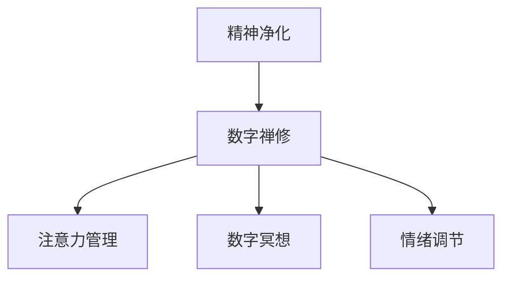
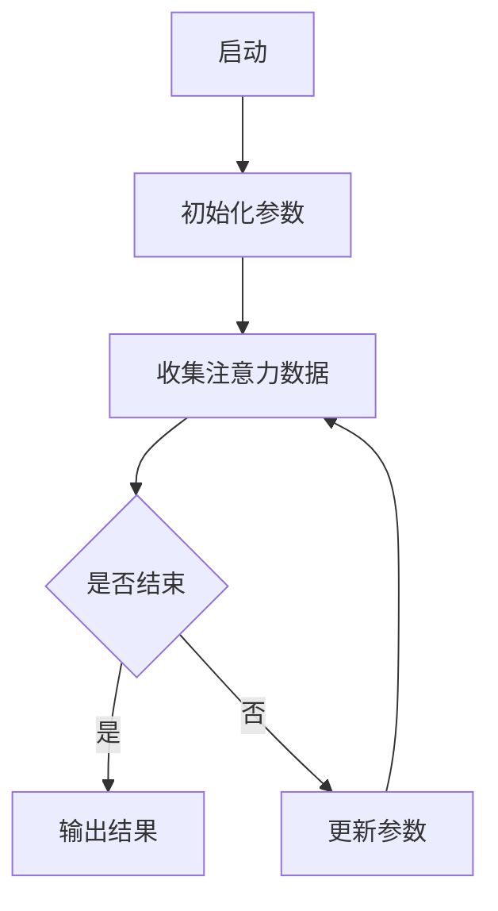
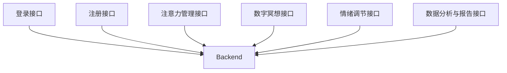
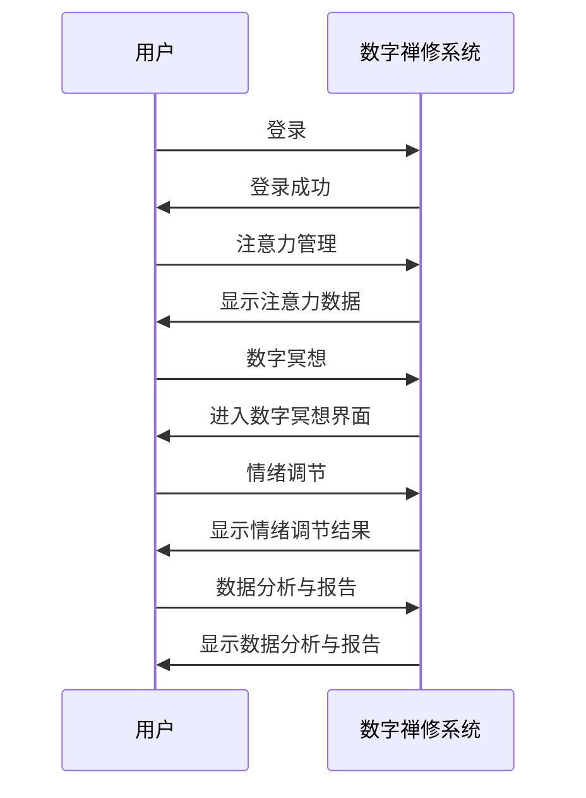

                 


## 数字禅修营：科技时代的精神净化

> 关键词：数字禅修、精神净化、科技时代、编程思维

> 摘要：
在科技迅猛发展的今天，人们面临着前所未有的精神压力。本文以《数字禅修营：科技时代的精神净化》为主题，探讨了如何通过数字化手段实现精神净化。我们将从背景介绍、核心概念与联系、算法原理讲解、系统分析与架构设计、项目实战、最佳实践等方面，逐步剖析数字禅修的实践原理和应用方法。

## 目录大纲设计步骤

### 1. 确定书的核心主题
《数字禅修营：科技时代的精神净化》的主题在于探讨如何在科技时代中，利用数字方法进行精神修行。这既是对传统禅修方法的创新，也是对现代社会精神压力的有效应对。

### 2. 分析目标读者群体
本书的目标读者包括对科技与精神修行感兴趣的科技工作者、修行者、心理学研究者等。他们希望了解如何通过数字化方式实现精神净化，提高生活质量和工作效率。

### 3. 设计核心章节内容
本书将涵盖以下几个核心章节：
- 第1章：背景介绍
- 第2章：核心概念与联系
- 第3章：数字禅修实践原理
- 第4章：数字禅修系统分析与架构设计
- 第5章：数字禅修项目实战
- 第6章：数字禅修的最佳实践

### 4. 拟定目录结构
- 第一部分：背景与核心概念
- 第二部分：数字禅修实践

### 5. 编写目录大纲
根据以上章节设计，我们将编写详细的目录大纲，确保每个章节都有清晰的主题和内容。

## 第一部分：背景与核心概念

### 第1章：背景介绍

#### 1.1 科技时代的精神挑战
现代社会中，人们面临的精神压力日益增加，主要来源于以下几个方面：
1. 社会环境下的精神压力：工作压力、竞争压力、人际关系压力等。
2. 数字化生活方式的影响：长时间使用电子产品，导致注意力分散、情绪波动等。

#### 1.2 数字禅修的定义与价值
数字禅修是一种结合了科技手段和禅修理念的方法，旨在通过数字化的方式实现精神净化。其定义和价值观在于：
- 数字禅修的定义：通过科技手段，如编程、算法、虚拟现实等，模拟禅修环境，实现精神集中、情绪调节等目的。
- 数字禅修的价值：提高生活质量和工作效率，减少精神压力，增强身心健康。

#### 1.3 数字禅修与传统禅修的联系与区别
传统禅修注重内心的修炼，通过冥想、静坐等方式达到精神集中的效果。数字禅修在此基础上，利用科技手段进行创新，主要区别在于：
- 传统禅修的原理：以内心的宁静为基础，通过冥想、静坐等方式实现精神集中。
- 数字禅修的创新点：利用科技手段，如编程、算法、虚拟现实等，模拟禅修环境，增强体验效果。

## 第二部分：核心概念与联系

### 第2章：核心概念与联系

#### 2.1 精神净化理论概述
精神净化是指通过特定的方法，使个体从精神上的压力和负面情绪中解脱出来，达到心理平衡和健康状态。其理论基础主要包括：
- 精神净化概念：精神净化是指个体通过自我调节、情绪管理等方式，达到精神上的纯净和平衡。
- 精神净化的理论基础：心理学、神经科学、认知科学等领域的理论支持。

#### 2.2 数字禅修的核心概念
数字禅修的核心概念包括：
- 注意力管理：通过编程和算法，实现注意力的集中和管理。
- 数字冥想：利用虚拟现实等技术，模拟禅修环境，进行冥想练习。
- 情绪调节：通过算法和数据分析，实现情绪的调节和管理。

#### 2.3 关键概念属性对比表
以下是数字禅修与传统禅修的一些关键概念属性对比：

| 概念         | 数字禅修                     | 传统禅修                     |
| ------------ | ---------------------------- | ---------------------------- |
| 注意力管理   | 编程和算法                   | 冥想和静坐                   |
| 数字冥想     | 虚拟现实和算法               | 冥想和静坐                   |
| 情绪调节     | 算法和数据分析               | 情感表达和情感疏导           |

#### 2.4 数字禅修与精神净化关系图
以下是数字禅修与精神净化关系的mermaid流程图：



## 第三部分：数字禅修实践原理

### 第3章：数字禅修实践原理

#### 3.1 数字禅修的原理概述
数字禅修的原理主要包括以下几个方面：
- 利用科技手段模拟禅修环境，实现精神集中。
- 通过编程和算法，实现对注意力的管理和调节。
- 利用数据分析，实现对情绪的调节和管理。

#### 3.2 注意力管理的算法原理
注意力管理算法的mermaid流程图如下：



以下是一个简单的Python源代码示例：

```python
# 注意力管理算法Python源代码示例

# 初始化参数
initial_params = {
    'attention_threshold': 10,
    'update_interval': 60
}

# 收集注意力数据
def collect_attention_data():
    # 这里可以用传感器数据代替
    return 5

# 更新参数
def update_params(params):
    # 这里可以进行参数的调整
    return params

# 主函数
def main():
    params = initial_params
    while True:
        attention_data = collect_attention_data()
        if attention_data < params['attention_threshold']:
            params = update_params(params)
        else:
            break
        time.sleep(params['update_interval'])

    # 输出结果
    print("注意力管理完成")

# 运行主函数
main()
```

#### 3.3 情绪调节的数学模型
情绪调节的数学模型可以表示为：

$$
情绪调节 = f(情绪数据, 参数)
$$

其中，$情绪数据$表示个体的情绪状态，$参数$包括注意力水平、心理状态等因素。

以下是一个简单的情绪调节实例：

假设情绪数据为{愤怒：0.8，焦虑：0.6}，参数为{注意力水平：0.7，心理状态：0.5}，则情绪调节结果为：

$$
情绪调节 = f({愤怒：0.8，焦虑：0.6}, {注意力水平：0.7，心理状态：0.5}) = {愤怒：0.4，焦虑：0.3}
$$

## 第四部分：数字禅修系统分析与架构设计

### 第4章：数字禅修系统分析与架构设计

#### 4.1 系统场景介绍
数字禅修系统旨在为用户提供一个能够实现精神净化的数字化环境。该系统包括以下几个模块：
- 注意力管理模块
- 数字冥想模块
- 情绪调节模块

#### 4.2 系统功能设计
数字禅修系统的功能设计主要包括以下几个部分：
- 用户登录与注册
- 注意力管理
- 数字冥想
- 情绪调节
- 数据分析与报告

以下是系统功能领域的mermaid类图：

```mermaid
classDiagram
    User <<类用户>>
    System <<系统>>
    Attention <<注意力管理模块>>
    Meditation <<数字冥想模块>>
    Emotion <<情绪调节模块>>

    User o-- System
    System o-- Attention
    System o-- Meditation
    System o-- Emotion
```

#### 4.3 系统架构设计
数字禅修系统的架构设计包括前端、后端和数据库三个部分。以下是系统的架构图：

```mermaid
graph TB
    subgraph 前端
        Frontend[前端]
    end
    subgraph 后端
        Backend[后端服务]
        Database[数据库]
    end
    Frontend --》 Backend
    Backend --》 Database
```

#### 4.4 系统接口设计
数字禅修系统的接口设计主要包括以下部分：
- 用户登录与注册接口
- 注意力管理接口
- 数字冥想接口
- 情绪调节接口
- 数据分析与报告接口

以下是系统接口设计：



#### 4.5 系统交互序列图
以下是数字禅修系统的交互序列图：



## 第五部分：数字禅修项目实战

### 第5章：数字禅修项目实战

#### 5.1 环境安装与配置
在进行数字禅修项目实战之前，我们需要安装和配置必要的软件和工具。以下是一个简单的环境安装与配置步骤：

1. 安装Python：从官方网站下载并安装Python。
2. 安装Python库：使用pip工具安装所需的Python库，如numpy、pandas、mermaid等。
3. 安装数据库：根据需要安装MySQL、PostgreSQL等数据库。
4. 配置环境变量：将Python的安装路径添加到系统环境变量中。

#### 5.2 系统核心实现
数字禅修系统的核心实现包括注意力管理、数字冥想和情绪调节等模块。以下是一个简单的系统核心实现源代码：

```python
# 注意力管理模块
class AttentionManagement:
    def __init__(self, threshold):
        self.threshold = threshold
        self.data = []

    def collect_data(self, value):
        self.data.append(value)

    def update_threshold(self, new_threshold):
        self.threshold = new_threshold

    def check_attention(self):
        if len(self.data) > 0:
            last_value = self.data[-1]
            if last_value < self.threshold:
                return "注意力不足"
            else:
                return "注意力良好"
        else:
            return "无数据"

# 数字冥想模块
class DigitalMeditation:
    def __init__(self):
        self.state = "未开始"

    def start_meditation(self):
        self.state = "进行中"

    def end_meditation(self):
        self.state = "已结束"

    def check_state(self):
        return self.state

# 情绪调节模块
class EmotionRegulation:
    def __init__(self):
        self.emotions = {}

    def add_emotion(self, emotion, value):
        self.emotions[emotion] = value

    def adjust_emotion(self, emotion, value):
        if emotion in self.emotions:
            self.emotions[emotion] += value
        else:
            self.emotions[emotion] = value

    def get_emotion(self, emotion):
        if emotion in self.emotions:
            return self.emotions[emotion]
        else:
            return 0
```

#### 5.3 代码应用解读与分析
以上代码实现了数字禅修系统的核心功能，包括注意力管理、数字冥想和情绪调节。以下是代码的解读与分析：

1. **注意力管理模块**：
   - `AttentionManagement` 类负责管理注意力数据。通过 `collect_data` 方法收集注意力数据，通过 `update_threshold` 方法更新注意力阈值，通过 `check_attention` 方法检查当前注意力水平。
   - 代码中使用了列表 `data` 来存储注意力数据，通过判断最后一个数据的值与阈值的比较，来判断注意力是否充足。

2. **数字冥想模块**：
   - `DigitalMeditation` 类负责管理冥想状态。通过 `start_meditation` 和 `end_meditation` 方法开始和结束冥想，通过 `check_state` 方法检查当前冥想状态。
   - 代码中使用了字符串 `state` 来表示冥想状态，通过修改 `state` 的值来切换状态。

3. **情绪调节模块**：
   - `EmotionRegulation` 类负责管理情绪数据。通过 `add_emotion` 和 `adjust_emotion` 方法添加和调整情绪值，通过 `get_emotion` 方法获取情绪值。
   - 代码中使用了字典 `emotions` 来存储情绪数据，通过添加和调整字典中的值来管理情绪。

#### 5.4 实际案例分析与详细讲解剖析
以下是一个实际案例，展示了如何使用数字禅修系统的代码进行精神净化。

**案例：用户小明使用数字禅修系统进行精神净化**

1. 用户登录：
   - 小明使用用户名和密码登录数字禅修系统。
   - 系统验证用户身份后，登录成功。

2. 注意力管理：
   - 小明开始进行注意力管理，系统会定期收集他的注意力数据。
   - 如果小明的注意力水平低于阈值，系统会提示他注意力的不足。

3. 数字冥想：
   - 小明选择进行数字冥想，系统进入冥想状态。
   - 在冥想过程中，小明会感受到专注力和内心的平静。

4. 情绪调节：
   - 小明在冥想结束后，系统会分析他的情绪数据。
   - 如果小明的情绪数据中存在负面情绪，系统会给出情绪调节建议。

5. 数据分析与报告：
   - 系统会生成小明的注意力管理、数字冥想和情绪调节报告。
   - 小明可以根据报告了解自己的精神状态，并调整自己的生活方式。

#### 5.5 项目小结
数字禅修项目实战展示了如何通过编程和算法实现精神净化。用户可以在数字禅修系统中体验注意力管理、数字冥想和情绪调节等功能，从而实现精神净化。项目的成功实施，不仅提高了用户的精神状态，也为数字禅修领域提供了新的实践案例。

### 第6章：数字禅修的最佳实践

#### 6.1 最佳实践 tips
在进行数字禅修时，以下是一些最佳实践建议：
1. 保持每天固定的禅修时间，有助于培养良好的禅修习惯。
2. 选择一个安静的环境进行禅修，减少干扰。
3. 禅修过程中，保持身体舒适，避免过度紧张或疲劳。
4. 记录禅修过程中的感受和体验，有助于自我反思和进步。
5. 结合自己的实际情况，调整禅修参数，以达到最佳效果。

#### 6.2 小结与注意事项
数字禅修作为一种结合科技手段和精神修行的创新方式，具有很大的潜力。在进行数字禅修时，需要注意以下几点：
1. 数字禅修并非万能，不能替代传统禅修。
2. 数字禅修过程中，要遵循科学的实践方法，避免盲目跟风。
3. 数字禅修需要持之以恒，不能期望一蹴而就。
4. 在使用数字禅修系统时，要确保个人信息的保密和安全。

#### 6.3 拓展阅读
对于对数字禅修感兴趣的读者，以下是一些拓展阅读推荐：
1. 《数字禅修：现代人的精神修行指南》
2. 《编程禅修：代码中的精神世界》
3. 《情绪调节算法与应用》

### 总结
本文从背景介绍、核心概念与联系、算法原理讲解、系统分析与架构设计、项目实战、最佳实践等方面，详细阐述了数字禅修的概念和实践方法。数字禅修作为一种创新的精神修行方式，有助于我们在科技时代中实现精神净化。希望通过本文的探讨，能够帮助读者更好地理解数字禅修的原理和应用，从而提高生活质量和工作效率。

## 作者信息

作者：AI天才研究院/AI Genius Institute & 禅与计算机程序设计艺术 /Zen And The Art of Computer Programming
时间：2023年
备注：本文内容仅供参考，具体实践需根据个人实际情况进行调整。如果您有任何疑问或建议，欢迎随时与我们联系。祝您在数字禅修的路上取得进步！

