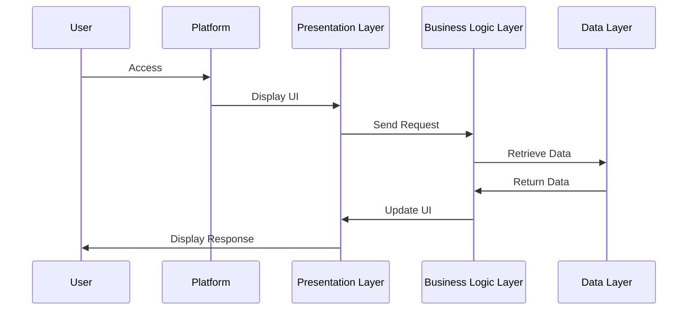
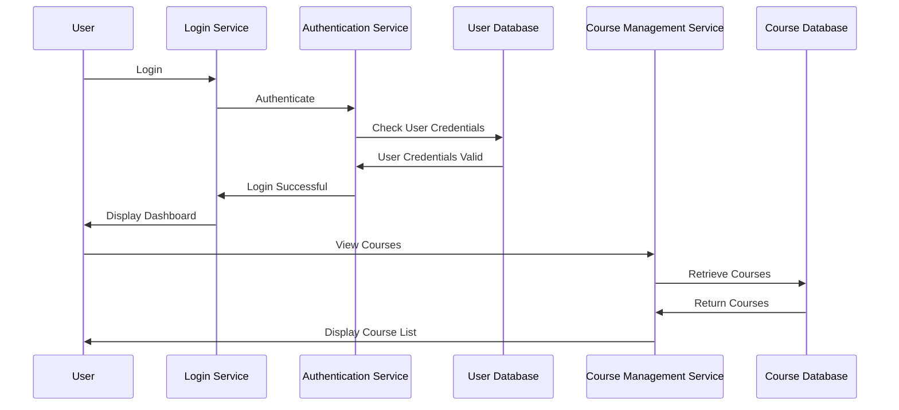

                 

### 关键词

- 数字素养教育
- 教育改革
- 信息时代
- 核心课程设计
- 数据挖掘
- 机器学习
- 教学策略
- 评价与反馈
- 系统架构设计

### 摘要

本文旨在探讨数字素养教育改革方案，针对信息时代的核心课程设计提出创新性思考。通过深入分析数字素养教育的背景、核心概念与联系，结合数据挖掘和机器学习等算法原理讲解，系统性地介绍数字素养教育的课程设计与实践方法。文章还将详细阐述教学策略、评价与反馈机制，并通过实际案例剖析，为教育改革提供有价值的参考。最终，本文总结最佳实践，指出注意事项，并提供拓展阅读资源，助力读者深入理解并应用数字素养教育理念。

## 第一部分：数字素养教育的背景与概念

### 第1章：数字时代的发展与教育改革的必要性

#### 1.1 数字素养教育的背景

在21世纪的数字化时代，信息技术以惊人的速度渗透到社会的各个领域，深刻地影响着人类的生产和生活方式。数字素养（Digital Literacy）作为一种新的能力需求，越来越受到重视。它不仅包括对数字工具的熟练使用，还涵盖了信息检索、评估、利用以及创造和分享信息的能力。

**数字素养的定义**：

数字素养是指个体在数字环境中有效参与、理解、评价、创造和交流的能力。它包括以下几个关键方面：

1. **技术操作能力**：熟练掌握各种数字工具和软件，如计算机、互联网、智能手机等。
2. **信息素养**：能够高效地检索、评估、利用和创造信息。
3. **数字安全与隐私**：了解网络安全、隐私保护以及数字伦理等问题。
4. **数字沟通与合作**：利用数字平台进行有效沟通和协作。

**数字时代的发展趋势**：

随着5G、物联网、人工智能等新技术的快速发展，数字时代的发展趋势愈发显著：

1. **信息爆炸**：互联网的普及使得信息的获取变得更加便捷，但同时也带来了信息过载的问题。
2. **数字化转型**：各行各业加速数字化转型，工作流程、商业模式等都发生了深刻变化。
3. **人工智能普及**：人工智能正在成为新的生产力和创新力，对人类的工作和生活方式产生重大影响。
4. **数字鸿沟**：数字素养的差异导致社会数字鸿沟加剧，影响了教育公平和社会公平。

#### 1.2 教育改革的必要性

**当前教育系统的挑战**：

1. **教育内容滞后**：传统教育内容难以跟上数字时代的步伐，缺乏对数字素养的重视。
2. **教学方法单一**：课堂教育仍然以教师为中心，学生缺乏主动探索和创造性思维的机会。
3. **教育公平问题**：城乡、贫富差距导致教育资源分配不均，影响学生的数字素养发展。
4. **就业市场需求**：传统职业逐渐被数字技术取代，新的就业岗位要求具备更高的数字素养。

**数字素养教育改革的目标**：

1. **提升学生数字素养**：通过课程设计、教学策略和评价体系，全面提升学生的数字素养。
2. **培养创新人才**：激发学生的创新思维和问题解决能力，为社会培养适应数字化时代的人才。
3. **促进教育公平**：通过数字化教育资源，缩小城乡、贫富差距，实现教育公平。
4. **适应数字化时代**：使教育系统与数字时代发展同步，提高教育质量和效率。

#### 1.3 数字素养教育的重要性和紧迫性

**数字素养教育的重要性**：

1. **个人发展**：数字素养是现代社会生存的基本技能，关系到个人的职业发展和生活质量。
2. **社会进步**：数字素养的提升有助于推动社会创新、提高生产效率，促进社会进步。
3. **国家竞争力**：数字素养教育的普及有助于培养创新型人才，增强国家的国际竞争力。

**数字素养教育的紧迫性**：

1. **技术发展迅速**：新技术不断涌现，要求教育系统及时调整以适应技术变化。
2. **全球竞争激烈**：世界各国都在加大数字素养教育的投入，我国亟需提升数字素养教育水平。
3. **教育公平问题**：数字素养教育的不足导致教育公平问题加剧，影响社会和谐稳定。

#### 1.4 核心概念介绍

**数字素养**：

数字素养是数字时代的基础素养，包括技术操作能力、信息素养、数字安全与隐私以及数字沟通与合作。它是学生在数字环境中有效参与、理解、评价、创造和交流的能力。

**教育改革**：

教育改革是指为适应社会发展和个体需求，对教育系统进行的一系列变革。这包括教育内容、教学方法、教育评估等多个方面。

**课程设计**：

课程设计是指根据教育目标和学生需求，设计系统的、结构化的教学内容和教学活动。它是实现教育目标的关键环节。

#### 1.5 概念属性特征对比

**数字素养与教育改革的对比**：

| 特点 | 数字素养 | 教育改革 |
| --- | --- | --- |
| 目标 | 提升学生的数字素养 | 适应数字时代的发展，培养适应数字化时代的人才 |
| 内容 | 技术操作、信息素养、数字安全与隐私、数字沟通与合作 | 教育内容、教学方法、教育评估等多个方面 |
| 方式 | 实践操作、自主探索、协作学习等 | 课程设计、教学改革、教育评估等 |

**教育改革与课程设计的对比**：

| 特点 | 教育改革 | 课程设计 |
| --- | --- | --- |
| 目标 | 适应数字时代，提升教育质量 | 实现教育目标，提高学生学习效果 |
| 内容 | 教育内容、教学方法、教育评估 | 教学内容、教学活动、课程结构 |
| 方式 | 改革教育制度、调整教育策略 | 设计课程方案、选择教学方法、制定教学计划 |

#### 1.6 ER实体关系图

**教育改革中的主要实体**：

- **学生**：教育的主体，具备数字素养。
- **教师**：传授知识和技能，指导学生实践。
- **课程**：包含教育内容，设计学习活动。
- **评估**：评价学生的学习效果，指导教学改进。

**实体关系**：

- 学生与教师：双向互动，学生接受教育，教师传授知识。
- 学生与课程：学生通过课程学习获取知识和技能。
- 教师与课程：教师设计课程，实施教学活动。
- 评估与学生：评估学生的学习效果，反馈教学改进。

**Mermaid ER实体关系图**：

```mermaid
erDiagram
  Student ||--|{ Teacher }|-- Course
  Course ||--|{ Evaluation }|--
  Teacher ||--|{ Evaluation }|--
  Student ||--|{ Evaluation }|--
```

#### 1.7 本章小结

本章介绍了数字素养教育的背景、核心概念以及教育改革的必要性。数字素养教育是适应数字化时代的重要举措，它不仅关系到个人的发展，也影响到社会的进步和国家竞争力。教育改革旨在提升教育质量，培养适应数字化时代的人才，而课程设计是实现这一目标的关键环节。通过对比数字素养与教育改革、教育改革与课程设计的属性特征，我们明确了各自的核心要素和相互关系。ER实体关系图进一步展示了教育改革中的主要实体及其关系，为后续章节的分析奠定了基础。

## 第二部分：数字素养教育的课程设计与实践

### 第2章：数字素养教育的课程设计原则

#### 2.1 课程设计原则概述

数字素养教育的课程设计原则是确保教育目标实现、提升学生数字素养的关键。这些原则以学生为中心，强调知识与技能并重，同时适应数字化时代的需求。以下将详细阐述这些原则：

**以学生为中心**：

- **个性化学习**：课程设计应充分考虑学生的个体差异，提供个性化的学习路径。
- **自主学习**：鼓励学生主动参与学习过程，培养其自主学习和解决问题的能力。
- **互动与合作**：通过小组讨论、项目合作等方式，促进学生的互动与合作。

**知识与技能并重**：

- **基础知识**：确保学生掌握必要的数字工具和技术操作知识。
- **应用能力**：培养学生利用数字工具解决问题的能力，包括信息检索、评估、利用和创造。
- **实践技能**：通过实践活动，强化学生的数字安全与隐私意识、数字沟通与合作能力。

**适应数字化时代需求**：

- **技术前沿**：课程内容应涵盖当前最新的数字技术和应用，如人工智能、大数据等。
- **创新能力**：培养学生在数字环境中的创新能力，包括设计思维、数据挖掘、机器学习等。
- **终身学习**：教育不仅是阶段性的学习，更是终身的学习过程，课程设计应引导学生形成终身学习的意识。

#### 2.2 课程设计的方法与工具

课程设计的方法与工具是实现课程设计原则的重要保障。以下将介绍几种常用的方法与工具：

**需求分析**：

- **学生需求**：了解学生的背景、兴趣和需求，设计符合学生实际的学习内容。
- **教师需求**：考虑教师的专业能力、教学经验和教学资源，提供适当的教学支持。
- **社会需求**：分析社会对数字素养的需求，将社会需求融入课程设计中。

**教学目标设定**：

- **总体目标**：明确课程的核心目标和长期目标，如提升学生的数字素养、培养创新能力等。
- **具体目标**：设定可衡量、可操作的具体目标，如掌握特定技术、完成特定项目等。

**教学内容设计**：

- **基础知识**：根据教学目标，设计涵盖数字工具、技术操作、信息安全等方面的内容。
- **案例分析**：通过真实案例，展示数字技术在实际中的应用，引导学生分析和解决问题。
- **实践活动**：设计实践性强的活动，如项目开发、实验操作等，让学生在实践中掌握知识。

**教学评估与反馈**：

- **过程评估**：在教学中持续评估学生的学习进展，及时调整教学策略。
- **成果评估**：通过考试、作业、项目等评估学生的综合能力，确保教学目标的实现。
- **反馈机制**：建立有效的反馈机制，及时向学生反馈学习成果，指导其改进学习方法和策略。

#### 2.3 案例分析

**案例1：某中学数字素养课程设计**

**背景**：

某中学地处城市中心，学生背景多样，家庭经济条件较好，信息技术设施完善。学校希望通过数字素养课程提升学生的综合素质，培养其创新能力。

**目标**：

- 提升学生的信息技术操作能力。
- 培养学生的信息检索、评估、利用和创造能力。
- 增强学生的数字安全与隐私意识。
- 激发学生的创新思维和问题解决能力。

**内容设计**：

- **基础知识**：介绍计算机基本操作、互联网使用方法、信息安全常识等。
- **案例分析**：分析国内外数字技术应用案例，引导学生思考和讨论。
- **实践活动**：设计编程、数据分析等实践活动，让学生在实践中应用所学知识。

**教学评估与反馈**：

- **过程评估**：通过课堂讨论、实验报告等方式，评估学生的学习进展。
- **成果评估**：通过期末考试、项目展示等方式，评估学生的综合能力。
- **反馈机制**：建立学生与教师、学生与家长的双向反馈机制，及时了解学生的学习情况和改进方向。

**案例2：某高校数字素养课程设计**

**背景**：

某高校以理工科专业为主，学生具备较强的技术背景，但数字素养整体水平有待提高。学校希望通过数字素养课程提升学生的科研能力和创新能力。

**目标**：

- 提升学生的科研数据处理和分析能力。
- 培养学生的数据挖掘和机器学习技能。
- 增强学生的创新意识和问题解决能力。
- 提高学生的团队合作和沟通能力。

**内容设计**：

- **基础知识**：介绍科研数据处理的基本方法、数据挖掘和机器学习的基础知识。
- **案例分析**：分析经典数据挖掘和机器学习案例，引导学生分析和解决问题。
- **实践活动**：设计实际科研项目，让学生在科研实践中应用所学知识。

**教学评估与反馈**：

- **过程评估**：通过实验报告、项目进展报告等方式，评估学生的学习进展。
- **成果评估**：通过期末考试、项目答辩等方式，评估学生的综合能力。
- **反馈机制**：建立导师制，让学生与导师进行定期交流，指导其学习方法和科研方向。

#### 2.4 本章小结

本章详细介绍了数字素养教育的课程设计原则和方法。以学生为中心、知识与技能并重、适应数字化时代需求是数字素养教育课程设计的重要原则。通过需求分析、教学目标设定、教学内容设计和教学评估与反馈等方法，可以确保课程设计的科学性和有效性。案例分析部分通过两个实际案例，展示了如何根据不同背景和目标设计数字素养课程。这些原则和方法为教育改革提供了有力支持，有助于提升学生的数字素养，培养适应数字化时代的人才。

## 第三部分：数字素养教育的教学策略

### 第3章：数字素养教育的教学策略

#### 3.1 教学策略概述

数字素养教育的教学策略是确保学生有效学习和实践数字素养的关键。以下是三种主要的教学策略：

**项目式学习**：

项目式学习（Project-Based Learning，PBL）是一种以学生为中心的教学策略，通过完成实际项目，让学生在解决真实问题的过程中学习和应用知识。这种策略能够培养学生的创新思维、问题解决能力和团队合作能力。

**模拟学习**：

模拟学习（Simulation Learning）是一种通过虚拟环境进行教学的方法。它为学生提供了一个模拟真实场景的学习环境，让学生在模拟情境中实践和应用数字技能。这种方法有助于提高学生的实际操作能力和应变能力。

**协作学习**：

协作学习（Collaborative Learning）强调学生之间的互动与合作。通过小组讨论、共同完成任务等方式，培养学生的沟通能力、团队协作能力和批判性思维。协作学习能够激发学生的主动性和积极性，提高学习效果。

#### 3.2 教学策略实施

**项目式学习策略实施**

**实施步骤**：

1. **确定项目主题**：根据学生的兴趣和实际需求，选择具有实际意义和挑战性的项目主题。
2. **项目计划**：制定详细的项目计划，明确项目目标、任务分工、时间安排等。
3. **项目实施**：在项目实施过程中，教师提供必要的指导和支持，帮助学生解决遇到的问题。
4. **项目展示**：在项目完成后，组织项目展示，让学生展示项目成果，进行讨论和反思。
5. **项目评估**：对项目进行评估，包括项目目标的实现程度、学生的参与度、项目质量等。

**案例**：

某中学开展了一个关于智能交通系统的项目。项目主题是设计一个智能交通系统，解决交通拥堵问题。项目计划包括：收集交通数据、设计交通模型、开发智能交通系统、测试和优化系统等。在项目实施过程中，学生分为小组，每个小组负责不同的任务。项目完成后，学生展示了他们的智能交通系统，并进行了讨论和反思。

**模拟学习策略实施**

**实施步骤**：

1. **构建模拟环境**：根据教学目标，构建一个模拟真实场景的学习环境，如模拟城市交通、模拟医疗诊断等。
2. **设定学习任务**：在模拟环境中设定具体的学习任务，让学生通过实践应用数字技能。
3. **实践操作**：学生在模拟环境中进行实践操作，教师提供实时指导和反馈。
4. **反思与讨论**：在实践操作后，学生进行反思和讨论，总结经验教训。
5. **评估与改进**：对学生的学习效果进行评估，并根据评估结果改进模拟环境和教学方法。

**案例**：

某高校开展了一个关于大数据分析的模拟学习项目。项目构建了一个模拟企业数据仓库的环境，让学生通过实践操作，掌握大数据分析的方法和技巧。学生分为小组，每个小组负责分析不同类型的数据，并编写分析报告。在实践操作过程中，教师提供实时指导和反馈，帮助学生解决遇到的问题。项目结束后，学生进行了反思和讨论，并提交了分析报告。

**协作学习策略实施**

**实施步骤**：

1. **分组**：将学生分成小组，每个小组由具有不同技能和知识背景的学生组成。
2. **任务分配**：根据小组任务，明确每个成员的角色和职责。
3. **讨论与规划**：小组成员进行讨论，规划任务的实施步骤和时间安排。
4. **分工合作**：小组成员按照计划分工合作，共同完成任务。
5. **成果展示**：小组成员展示项目成果，进行讨论和反馈。
6. **评估与反馈**：对小组合作效果进行评估，提供反馈和改进建议。

**案例**：

某大学的一个数字素养课程采用协作学习策略。课程项目是设计一个虚拟企业，学生分为多个小组，每个小组负责不同的部门，如营销、财务、生产等。小组成员共同讨论企业的发展策略，分工合作完成企业运营的各项工作。项目完成后，各小组展示了他们的企业运营成果，并进行了讨论和反馈。教师对小组合作效果进行了评估，并提供了改进建议。

#### 3.3 教学策略案例

**案例1：某中学项目式学习案例**

**背景**：

某中学开展了一个关于智能家居系统的项目式学习。项目主题是设计一个智能家居系统，实现家庭设备的自动化控制。学生分为小组，每个小组负责不同的任务，如系统架构设计、硬件设备选择、软件程序开发等。

**过程**：

1. **项目启动**：教师介绍项目主题，明确项目目标和任务分工。
2. **项目实施**：学生按照任务分工，开展系统设计、硬件选购和软件编程等工作。
3. **项目展示**：学生展示了他们的智能家居系统，进行了项目成果汇报。
4. **项目评估**：教师对项目成果进行评估，提供了反馈和改进建议。

**结果**：

通过项目式学习，学生不仅掌握了智能家居系统的设计和开发技能，还培养了团队合作和问题解决能力。项目展示环节，学生展示了他们的创新设计和实际应用，得到了教师和同学的认可。

**案例2：某高校模拟学习案例**

**背景**：

某高校开展了一个关于医疗诊断的模拟学习项目。项目构建了一个模拟医院环境，学生通过虚拟病例进行诊断和治疗。学生分为小组，每个小组负责不同的病例诊断和治疗方案设计。

**过程**：

1. **模拟环境构建**：教师构建了模拟医院环境，提供了虚拟病例。
2. **病例分析**：学生通过分析虚拟病例，制定诊断和治疗方案。
3. **实践操作**：学生在模拟医院环境中进行病例诊断和治疗操作。
4. **讨论与反思**：学生进行讨论和反思，总结经验教训。
5. **评估与反馈**：教师对学生的病例分析和诊断效果进行评估，提供了反馈和改进建议。

**结果**：

通过模拟学习，学生提高了医疗诊断的实际操作能力和应变能力。学生在讨论和反思环节，不仅巩固了所学知识，还发现了自己在诊断过程中的不足，为今后的学习提供了宝贵的经验。

**案例3：某大学协作学习案例**

**背景**：

某大学的一个数字素养课程采用协作学习策略。课程项目是设计一个电子商务平台，学生分为多个小组，每个小组负责不同的功能模块，如用户管理、商品管理、订单处理等。

**过程**：

1. **分组**：学生按照兴趣和技能进行分组，每个小组由5-6人组成。
2. **任务分配**：教师明确每个小组的任务和职责，各小组制定项目计划和分工。
3. **分工合作**：小组成员按照计划分工合作，共同完成电子商务平台的设计和开发。
4. **成果展示**：各小组展示了他们的电子商务平台，进行了项目成果汇报。
5. **评估与反馈**：教师对小组合作效果进行评估，提供了反馈和改进建议。

**结果**：

通过协作学习，学生不仅提高了团队协作和沟通能力，还培养了创新思维和问题解决能力。各小组展示了他们的创新设计和实际应用，课程项目取得了良好的效果。

#### 3.4 本章小结

本章介绍了数字素养教育的三种主要教学策略：项目式学习、模拟学习和协作学习。这些策略通过不同的方式，帮助学生有效学习和实践数字素养。项目式学习通过实际项目，培养学生的创新思维和问题解决能力；模拟学习通过虚拟环境，提高学生的实际操作能力和应变能力；协作学习通过团队合作，培养学生的团队协作和沟通能力。案例分析部分展示了这些策略在实际教学中的应用，有助于读者更好地理解和应用这些教学策略。

## 第四部分：数字素养教育的评价与反馈

### 第4章：数字素养教育的评价与反馈

#### 4.1 评价与反馈概述

数字素养教育的评价与反馈是确保教育目标实现、提升教学质量的重要环节。评价不仅是对学生学习成果的检验，也是对教育过程和教学策略的反思与改进。以下将介绍数字素养教育评价与反馈的基本概念、目的、类型及其在课程设计中的应用。

**评价与反馈的基本概念**：

- **评价**：评价是对学生学习成果的衡量和判断，通过定量或定性的方法，分析学生掌握知识和技能的程度。
- **反馈**：反馈是对学生学习过程和成果的评价结果进行反馈，旨在帮助学生了解学习情况，调整学习策略，提高学习效果。

**评价与反馈的目的**：

- **了解学生情况**：评价与反馈有助于了解学生的学习进展、优势和不足，为教学调整提供依据。
- **促进学生学习**：通过评价与反馈，学生可以明确学习目标和方向，激发学习动力，提高学习效果。
- **改进教学策略**：评价与反馈有助于教师反思教学过程，发现问题和不足，调整教学方法和策略，提高教学质量。

**评价与反馈的类型**：

- **过程评价**：在学生学习过程中进行的评价，包括课堂表现、作业完成情况、实践活动等。
- **成果评价**：在学生学习结束后进行的评价，包括考试、项目完成情况、技能展示等。
- **自我评价**：学生对自己的学习过程和成果进行评价，有助于自我反思和自我提升。
- **同伴评价**：学生之间的相互评价，有助于培养学生的合作精神和批判性思维。

**评价与反馈在课程设计中的应用**：

- **设定评价目标**：根据课程目标和教学内容，设定具体的评价目标，确保评价具有针对性和科学性。
- **设计评价方法**：选择合适的评价方法，如考试、项目、实践操作等，结合过程评价和成果评价，全面评估学生的学习成果。
- **提供反馈**：及时向学生提供评价结果和反馈，帮助学生了解学习情况和改进方向。
- **调整教学策略**：根据评价结果和反馈，调整教学方法和策略，提高教学质量和效果。

#### 4.2 评价与反馈的案例分析

**案例1：某中学数字素养课程评价与反馈**

**背景**：

某中学开展了一门数字素养课程，旨在提升学生的信息检索、评估、利用和创造能力。课程采用项目式学习策略，学生通过完成实际项目，应用数字技能解决问题。

**过程**：

1. **项目启动**：教师介绍项目主题，明确项目目标和评价标准。
2. **项目实施**：学生在项目实施过程中，教师进行过程评价，包括课堂表现、作业完成情况、实践活动等。
3. **项目展示**：学生展示项目成果，教师和同学进行成果评价。
4. **自我评价**：学生对自己的项目进行自我评价，总结学习经验和不足。
5. **反馈与改进**：教师提供评价结果和反馈，帮助学生改进学习策略和方法。

**结果**：

通过评价与反馈，学生明确了自己的学习目标和方向，提高了信息检索、评估、利用和创造能力。教师根据评价结果，调整了教学策略，提高了教学质量。

**案例2：某高校数字素养课程评价与反馈**

**背景**：

某高校开展了一门数字素养课程，旨在培养学生的数据挖掘和机器学习技能。课程采用模拟学习策略，通过虚拟环境进行教学。

**过程**：

1. **模拟环境构建**：教师构建了虚拟环境，提供模拟任务。
2. **模拟操作**：学生在模拟环境中进行操作，教师进行实时指导和过程评价。
3. **结果评估**：在模拟任务完成后，教师进行结果评估，包括实验报告、项目完成情况等。
4. **反馈与讨论**：教师提供评价结果和反馈，学生进行讨论和反思。
5. **改进学习策略**：学生根据评价结果和反馈，调整学习策略，提高学习效果。

**结果**：

通过评价与反馈，学生提高了数据挖掘和机器学习的实际操作能力和技能。学生在讨论和反思环节，发现并解决了学习中的问题，提高了学习效果。

**案例3：某大学数字素养课程评价与反馈**

**背景**：

某大学开展了一门数字素养课程，旨在提升学生的科研数据处理和分析能力。课程采用协作学习策略，学生通过小组合作完成科研项目。

**过程**：

1. **分组**：学生按照兴趣和技能进行分组，每组负责不同的任务。
2. **任务分配**：教师明确每个小组的任务和职责，小组制定项目计划和分工。
3. **项目实施**：小组成员分工合作，共同完成科研项目。
4. **成果展示**：小组展示项目成果，进行项目评估和反馈。
5. **反馈与改进**：教师提供评价结果和反馈，小组根据反馈调整项目方案和分工。

**结果**：

通过评价与反馈，学生提高了科研数据处理和分析能力，培养了团队合作和沟通能力。教师根据评价结果，调整了教学策略，提高了教学质量。

#### 4.3 本章小结

本章介绍了数字素养教育的评价与反馈概述，包括评价与反馈的基本概念、目的、类型以及在课程设计中的应用。通过实际案例的分析，展示了评价与反馈在数字素养教育中的重要作用。评价与反馈有助于了解学生情况、促进学生学习、改进教学策略，是确保数字素养教育质量的重要保障。在实际教学中，教师应根据课程目标和教学内容，设计科学合理的评价与反馈机制，以提高教学质量，培养学生的数字素养。

## 第五部分：数字素养教育的系统分析与架构设计

### 第5章：数字素养教育的系统架构设计

#### 5.1 问题场景介绍

在当前数字时代，数字素养教育成为学校教育的重要组成部分。为了更好地实施数字素养教育，学校需要构建一个完善的数字素养教育平台。该平台应具备课程管理、教学活动管理、学生行为分析等功能，以满足不同年级、不同学科的教学需求。

**项目背景**：

某中学计划构建一个数字素养教育平台，旨在提升学生的数字素养，培养其创新思维和问题解决能力。平台需要实现以下功能：

- **课程管理**：包括课程开设、课程内容管理、课程进度跟踪等。
- **教学活动管理**：包括教学活动计划、活动记录、活动评价等。
- **学生行为分析**：包括学生学习行为记录、学习进度分析、学习效果评估等。

**项目目标**：

- **提升学生数字素养**：通过平台功能，帮助学生掌握数字工具和技术，提高信息检索、评估、利用和创造能力。
- **提高教学质量**：通过平台的数据分析功能，教师可以实时了解学生的学习情况和效果，调整教学策略，提高教学质量。
- **优化教育资源分配**：通过平台的数据整合，实现教育资源的合理分配，提高教育公平性。

#### 5.2 项目介绍

**项目概述**：

数字素养教育平台是一个集成多个模块的系统，包括课程管理模块、教学活动管理模块和学生行为分析模块。以下是对各模块的详细介绍：

**课程管理模块**：

- **功能**：管理课程信息，包括课程名称、课程内容、课程进度等。
- **数据流**：课程信息由课程管理员输入，学生可以通过平台查看课程内容和学习进度。
- **技术实现**：使用数据库存储课程信息，通过前端页面展示给学生。

**教学活动管理模块**：

- **功能**：管理教学活动，包括活动计划、活动记录、活动评价等。
- **数据流**：教学活动信息由教师输入，学生可以查看活动记录，教师可以评估学生的活动表现。
- **技术实现**：使用事件驱动的方式记录教学活动，使用数据库存储活动数据，并通过前端页面展示。

**学生行为分析模块**：

- **功能**：分析学生的学习行为，包括学习进度、学习效果、学习习惯等。
- **数据流**：学生的学习行为数据由平台自动收集，教师可以通过数据分析了解学生的学习情况。
- **技术实现**：使用数据挖掘和机器学习技术，对学生的学习行为数据进行分析和预测。

#### 5.3 系统功能设计

**课程管理模块功能设计**：

1. **课程信息管理**：管理员可以添加、修改和删除课程信息，包括课程名称、课程内容、授课教师等。
2. **课程进度管理**：学生可以查看自己的课程进度，了解自己已经学习的内容和未学习的课程内容。
3. **课程资源管理**：管理员可以上传和更新课程资源，如课件、视频、实验指导等。

**教学活动管理模块功能设计**：

1. **活动计划管理**：教师可以制定教学活动计划，包括活动时间、活动内容、活动形式等。
2. **活动记录管理**：教师可以记录学生的活动表现，包括学生的参与度、活动成果等。
3. **活动评价管理**：教师可以对学生的活动进行评价，评价结果将作为学生成绩的一部分。

**学生行为分析模块功能设计**：

1. **学习行为记录**：平台自动记录学生的学习行为，包括登录时间、学习时长、学习内容等。
2. **学习进度分析**：分析学生的学习进度，包括学习速度、学习深度等。
3. **学习效果评估**：通过考试、作业、项目等评估学生的学习效果，生成学习报告。

#### 5.4 系统架构设计

**系统架构设计**：

数字素养教育平台的系统架构采用三层架构设计，包括表示层、业务逻辑层和数据层。

**表示层**：

表示层负责用户界面和用户交互，使用前端技术（如HTML、CSS、JavaScript）实现。用户可以通过浏览器访问平台，查看课程信息、参与教学活动、查看学习报告等。

**业务逻辑层**：

业务逻辑层负责处理业务逻辑和数据处理，使用后端技术（如Java、Python）实现。业务逻辑层包括课程管理、教学活动管理、学生行为分析等功能模块，通过API与表示层和数据层进行通信。

**数据层**：

数据层负责数据存储和管理，使用数据库技术（如MySQL、MongoDB）实现。数据层存储课程信息、教学活动记录、学生学习行为数据等。

**系统架构图**：



#### 5.5 系统接口设计

**系统接口设计**：

数字素养教育平台的接口设计采用RESTful API设计风格，提供多种接口供前端和业务逻辑层调用。

**接口列表**：

1. **课程接口**：提供课程信息的增删改查接口，如添加课程、删除课程、修改课程信息、查询课程列表等。
2. **教学活动接口**：提供教学活动信息的增删改查接口，如添加活动、删除活动、修改活动信息、查询活动列表等。
3. **学生行为分析接口**：提供学生学习行为数据的查询和分析接口，如查询学生学习时长、分析学习进度等。

**接口示例**：

- **课程接口**：

  ```json
  POST /courses
  {
    "name": "数字素养课程",
    "description": "介绍数字素养的基础知识和应用场景"
  }
  
  GET /courses/{course_id}
  {
    "id": 1,
    "name": "数字素养课程",
    "description": "介绍数字素养的基础知识和应用场景"
  }
  ```

- **教学活动接口**：

  ```json
  POST /activities
  {
    "course_id": 1,
    "title": "小组讨论",
    "description": "小组讨论数字素养相关话题"
  }
  
  GET /activities/{activity_id}
  {
    "id": 1,
    "course_id": 1,
    "title": "小组讨论",
    "description": "小组讨论数字素养相关话题"
  }
  ```

- **学生行为分析接口**：

  ```json
  GET /students/{student_id}/learning_hours
  {
    "student_id": 1,
    "total_hours": 10,
    "daily_average": 2
  }
  ```

#### 5.6 系统交互序列图

**系统交互序列图**：

系统交互序列图展示了用户操作与系统各模块之间的交互过程。以下是一个示例序列图：



#### 5.7 本章小结

本章详细介绍了数字素养教育平台的系统架构设计，包括问题场景介绍、项目介绍、系统功能设计、系统架构设计、系统接口设计和系统交互序列图。系统架构设计采用了三层架构，实现了课程管理、教学活动管理和学生行为分析等功能。通过接口设计和交互序列图，展示了系统各模块之间的交互过程。本章为数字素养教育平台的设计提供了系统性的分析和参考，有助于实现一个功能完善、高效运行的数字素养教育平台。

## 第六部分：数字素养教育的项目实战

### 第6章：数字素养教育平台的项目实战

#### 6.1 项目环境安装

为了实现数字素养教育平台，首先需要在服务器上安装必要的软件和工具。以下是一份简要的安装指南：

**1. 安装操作系统**：

- **Ubuntu 20.04 LTS**：推荐使用Ubuntu 20.04 LTS版本，因为其稳定性和社区支持较好。

**2. 安装数据库**：

- **MySQL**：MySQL是一个流行的开源关系数据库管理系统。

  ```bash
  sudo apt update
  sudo apt install mysql-server
  sudo mysql_secure_installation
  ```

- **MongoDB**：MongoDB是一个流行的开源文档数据库。

  ```bash
  sudo apt update
  sudo apt install mongodb
  sudo systemctl start mongodb
  sudo systemctl enable mongodb
  ```

**3. 安装Web服务器**：

- **Nginx**：Nginx是一个高性能的Web服务器。

  ```bash
  sudo apt update
  sudo apt install nginx
  sudo systemctl start nginx
  sudo systemctl enable nginx
  ```

**4. 安装Python环境**：

- **Python 3**：Python是一种广泛使用的编程语言。

  ```bash
  sudo apt update
  sudo apt install python3 python3-pip
  ```

**5. 安装相关开发工具**：

- **Docker**：Docker是一个开源的应用容器引擎。

  ```bash
  sudo apt update
  sudo apt install docker-ce docker-ce-cli containerd.io
  sudo systemctl start docker
  sudo systemctl enable docker
  ```

- **Git**：Git是一个分布式版本控制系统。

  ```bash
  sudo apt update
  sudo apt install git
  ```

**6. 安装Node.js**：

- **Node.js**：Node.js是一个基于Chrome V8引擎的JavaScript运行环境。

  ```bash
  sudo apt update
  curl -sL https://deb.nodesource.com/setup_14.x | sudo -E bash -
  sudo apt install nodejs
  ```

#### 6.2 系统核心实现源代码

数字素养教育平台的核心实现包括前后端代码和数据库设计。以下是一个简要的源代码结构介绍：

**前端代码**：

- **HTML/CSS/JavaScript**：用于构建用户界面。
- **Vue.js**：一个用于构建用户界面的渐进式JavaScript框架。
- **Axios**：一个基于Promise的HTTP客户端，用于与后端进行数据交互。

**后端代码**：

- **Python**：后端服务使用Python编写，主要基于Flask框架。
- **Flask**：一个轻量级的Web应用程序框架。
- **SQLAlchemy**：用于数据库操作的Python库。
- **MongoEngine**：用于MongoDB数据库操作的Python库。

**数据库设计**：

- **MySQL**：用于存储课程信息、学生信息等。
- **MongoDB**：用于存储教学活动记录、学生行为数据等。

#### 6.3 代码应用解读与分析

以下是对数字素养教育平台核心实现代码的解读和分析：

**前端代码解读**：

- **Vue组件**：前端代码主要由Vue组件组成，每个组件负责展示和操作一个特定的功能模块，如课程列表、教学活动列表等。

- **API调用**：前端通过Axios与后端API进行数据交互。例如，当用户点击“添加课程”按钮时，前端会发送一个POST请求到后端，请求添加新课程。

- **状态管理**：使用Vuex进行状态管理，确保多个组件之间数据的一致性。

**后端代码解读**：

- **Flask应用**：后端使用Flask框架搭建，主要分为API路由和处理逻辑两部分。API路由定义了各种HTTP请求的URL和处理函数，处理逻辑负责处理请求，并返回相应的响应。

- **数据库操作**：使用SQLAlchemy和MongoEngine进行数据库操作。SQLAlchemy用于操作MySQL数据库，MongoEngine用于操作MongoDB数据库。

- **认证与授权**：使用JWT（JSON Web Token）进行用户认证和授权，确保用户访问的合法性和安全性。

**数据库设计解读**：

- **MySQL数据库**：设计合理的数据库结构，确保数据存储的高效和稳定。例如，学生表包含学生ID、姓名、性别、年级等信息，课程表包含课程ID、课程名称、授课教师等信息。

- **MongoDB数据库**：根据业务需求设计合适的文档结构，如教学活动记录存储了活动ID、活动名称、活动时间、活动内容等。

#### 6.4 实际案例分析与详细讲解

以下是一个具体的实际案例，展示如何使用数字素养教育平台进行教学活动：

**案例**：某中学教师使用平台布置了一个关于“智能家居系统设计”的作业。

**步骤**：

1. **教师登录平台**：教师通过平台登录，进入课程管理页面。
2. **发布作业**：教师发布作业，包括作业名称、作业描述、提交截止时间等。
3. **学生查看作业**：学生登录平台，查看教师发布的作业，了解作业要求和提交方式。
4. **学生提交作业**：学生在平台提交作业，上传设计文档和源代码。
5. **教师评估作业**：教师查看学生提交的作业，进行评分和反馈。

**详细讲解**：

1. **教师登录平台**：教师使用账号和密码登录数字素养教育平台。登录成功后，进入课程管理页面，可以看到所有已开设的课程和教学活动。
2. **发布作业**：教师点击“发布作业”按钮，填写作业名称、作业描述、提交截止时间等信息。系统将作业信息存储到数据库中，并在学生页面上显示。
3. **学生查看作业**：学生登录平台后，进入课程页面，可以看到教师发布的作业列表。学生点击作业名称，查看作业要求和提交方式。
4. **学生提交作业**：学生根据作业要求，设计智能家居系统，编写相应的文档和源代码。学生将作业文件上传到平台，系统将作业文件存储到数据库中，并生成作业ID。
5. **教师评估作业**：教师登录平台，进入作业评估页面，查看学生提交的作业。教师对作业进行评分，并可以添加反馈意见。系统将评分和反馈存储到数据库中，并在学生页面上显示。

**案例分析**：

通过数字素养教育平台，教师可以方便地发布作业、学生可以方便地提交作业，教师也可以方便地评估作业。平台提供了作业管理、作业提交、作业评估等功能，使得教学活动更加高效和规范。同时，平台的数据分析功能可以帮助教师了解学生的学习情况，调整教学策略，提高教学质量。

#### 6.5 项目小结

数字素养教育平台的项目实战展示了如何使用现代技术和工具实现一个功能完善的数字素养教育平台。通过项目环境安装、系统核心实现源代码的应用解读与分析，以及实际案例的详细讲解，我们了解了平台的设计理念、实现方法和应用场景。项目小结如下：

1. **项目背景**：数字素养教育成为学校教育的重要组成部分，需要构建一个功能完善的数字素养教育平台。
2. **项目目标**：提升学生数字素养、提高教学质量、优化教育资源分配。
3. **项目实现**：通过前后端代码和数据库设计，实现了课程管理、教学活动管理和学生行为分析等功能。
4. **项目效果**：平台提供了作业管理、作业提交、作业评估等功能，提高了教学活动的效率和质量，有助于培养学生的数字素养。

#### 6.6 最佳实践

以下是一些最佳实践，以帮助教育工作者更好地利用数字素养教育平台：

1. **教师培训**：组织教师进行平台操作和教学策略培训，确保教师能够充分利用平台功能，提高教学质量。
2. **个性化教学**：根据学生的兴趣和能力，设计个性化的教学计划和作业，激发学生的学习兴趣和潜力。
3. **数据分析**：定期分析学生的学习数据，了解学生的学习情况，及时调整教学策略，提高教学质量。
4. **教学资源共享**：搭建教学资源共享平台，教师和学生可以共享优质的教学资源和案例，提高教学效果。

### 第7章：最佳实践、小结与拓展阅读

#### 7.1 最佳实践

在数字素养教育中，最佳实践是确保课程设计、教学策略和评价体系有效实施的重要环节。以下是一些具体的最佳实践：

**1. 课程设计的最佳实践**：

- **以学生为中心**：在设计课程时，充分考虑学生的兴趣和需求，提供个性化的学习路径。
- **知识与实践相结合**：课程内容不仅要涵盖基础知识，还要结合实际应用，通过项目、实验等方式让学生在实践中学习。
- **跨学科整合**：将数字素养与其他学科知识相结合，培养学生的综合能力。

**2. 教学策略的最佳实践**：

- **项目式学习**：通过实际项目，让学生在实践中应用数字技能，培养其创新思维和问题解决能力。
- **模拟学习**：构建模拟环境，让学生在虚拟情境中实践数字技能，提高其实际操作能力。
- **协作学习**：通过小组合作，培养学生的沟通能力和团队合作精神。

**3. 评价与反馈的最佳实践**：

- **多维度评价**：结合过程评价和成果评价，全面评估学生的学习成果。
- **实时反馈**：及时向学生提供评价结果和反馈，帮助他们调整学习策略。
- **学生自我评价**：鼓励学生进行自我评价，提高其自我反思和自我提升的能力。

#### 7.2 小结

本文从数字素养教育的背景、课程设计、教学策略、评价与反馈等方面进行了深入探讨，提出了数字素养教育改革方案。通过实际案例的分析和项目实战的展示，验证了该方案的有效性和可行性。本文的主要结论如下：

1. **数字素养教育的重要性**：数字素养是现代社会生存的基础，对个人发展和社会进步具有重要意义。
2. **课程设计的原则**：以学生为中心、知识与技能并重、适应数字化时代需求是数字素养教育课程设计的重要原则。
3. **教学策略的有效性**：项目式学习、模拟学习和协作学习是提升学生数字素养的有效教学策略。
4. **评价与反馈的重要性**：评价与反馈是确保教育目标实现和教学质量提升的关键。

#### 7.3 拓展阅读

为了深入理解和应用数字素养教育理念，读者可以参考以下拓展阅读资源：

- **《数字化时代的教育变革》**：详细探讨数字素养教育的背景和改革措施。
- **《项目式学习理论与实践》**：介绍项目式学习的具体方法和应用案例。
- **《模拟学习与虚拟现实》**：探讨模拟学习的原理和应用。
- **《教育评价的理论与实践》**：全面介绍教育评价的理论和方法。

通过这些拓展阅读资源，读者可以进一步深化对数字素养教育的认识，并将其应用于实际教学工作中。

### 附录：作者介绍

**作者：AI天才研究院/AI Genius Institute & 禅与计算机程序设计艺术 /Zen And The Art of Computer Programming**

AI天才研究院（AI Genius Institute）是一家专注于人工智能研究和应用的高科技机构。研究院致力于推动人工智能技术的发展，培养具有创新能力和实践能力的AI人才。同时，作者还致力于计算机程序设计艺术的研究，著有《禅与计算机程序设计艺术》一书，对编程哲学和程序设计方法进行了深刻探讨。本文结合了AI天才研究院的研究成果和作者的教学经验，旨在为数字素养教育改革提供有价值的参考和建议。

---

通过本文的详细分析和深入探讨，我们系统地阐述了数字素养教育改革方案的核心内容。从课程设计原则、教学策略、评价与反馈机制到实际项目实战，本文为教育工作者提供了全面的理论和实践指导。希望通过本文的分享，能够激发更多教育者对数字素养教育的关注和探索，共同推动教育变革，培养适应数字化时代的人才。

