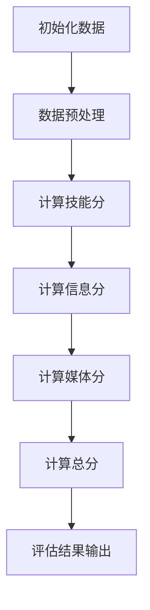
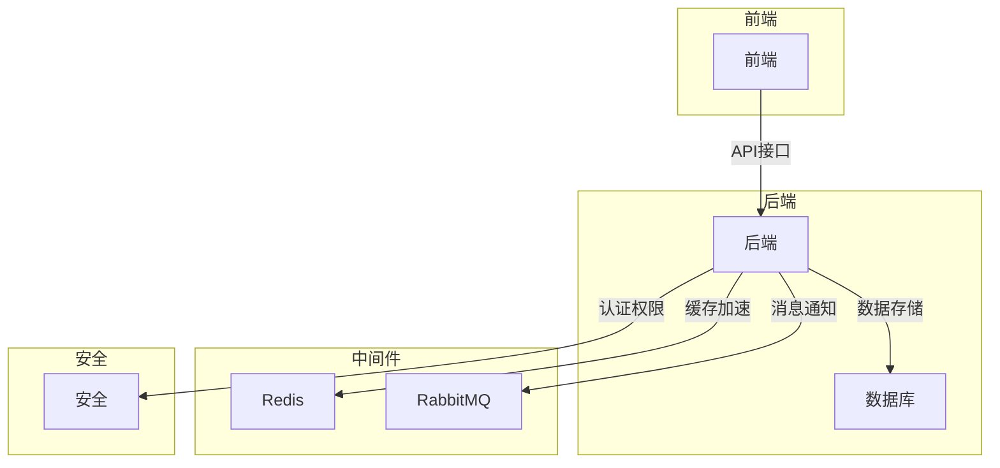
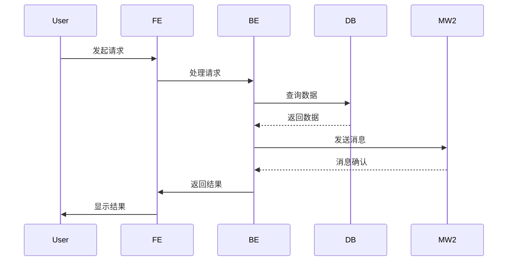

                 

### 文章标题：数字素养认证体系：信息时代的能力评估

#### 关键词：
- 数字素养
- 认证体系
- 信息时代
- 能力评估
- 教育方法

#### 摘要：
本文将深入探讨数字素养认证体系在信息时代的重要性。我们将详细分析数字素养的定义、核心要素以及其在现代社会中的关键作用。接着，我们将构建一个全面的数字素养认证体系，探讨其构建的步骤、内容以及评估方法。此外，我们还将讨论数字素养教育在当前教育体系中的现状、策略和挑战。最后，我们将展望数字素养认证体系的发展趋势，为未来做好准备。

## 引言

在数字化时代，信息技术的飞速发展正在深刻改变我们的生活方式、工作方式和思维方式。数字素养，作为一种新的能力要求，已经变得至关重要。然而，如何评估和提升个人的数字素养水平，成为了一个亟待解决的问题。本文将围绕这一主题，深入探讨数字素养认证体系的设计、实施与应用。

### 第1章 数字素养的定义与重要性

#### 1.1.1 数字素养的概述

数字素养（Digital Literacy）是指个体在数字环境中获取、理解、评估、创造和应用信息的能力。它不仅包括技术技能，还涵盖信息素养、媒体素养、网络安全意识等多方面内容。

#### 1.1.2 数字素养的核心要素

数字素养的核心要素包括：

1. **技术技能**：使用数字设备、软件和应用的能力。
2. **信息素养**：查找、评估、使用和创建信息的能力。
3. **媒体素养**：理解和评估数字媒体内容的能力。
4. **网络安全意识**：保护自己和他人免受网络威胁的能力。

#### 1.1.3 数字素养的重要性

在信息时代，数字素养的重要性不言而喻。以下是数字素养对个人和社会的重要影响：

1. **职业发展**：数字素养是现代职场所需的关键能力。
2. **教育**：数字素养是终身学习的基石。
3. **社会参与**：数字素养是参与社会和政治生活的基础。
4. **安全防护**：提高数字素养有助于防止网络欺诈和安全威胁。

#### 1.1.4 数字素养与信息时代的关联

信息时代的到来，使得数字素养成为个人和群体生存和发展的必要条件。以下是数字素养与信息时代的几个关联点：

1. **信息获取**：数字素养使个体能够高效地获取和处理信息。
2. **创新创造**：数字素养促进了创新和创造力的发挥。
3. **全球化**：数字素养有助于个体适应全球化的工作环境。
4. **教育公平**：数字素养缩小了数字鸿沟，促进了教育公平。

### 第2章 数字素养认证体系的构建

#### 2.1.1 认证体系的架构设计

数字素养认证体系的架构设计包括以下几个方面：

1. **认证标准**：制定明确的数字素养标准，涵盖技术技能、信息素养、媒体素养和网络安全意识。
2. **认证流程**：设计从注册、学习、评估到认证的完整流程。
3. **评估方法**：采用多种评估方法，如考试、项目、实践操作等。

#### 2.1.2 认证标准的制定

制定数字素养认证标准需要考虑以下几个方面：

1. **技术技能**：涵盖常用的数字工具和软件。
2. **信息素养**：包括信息检索、评估和使用的能力。
3. **媒体素养**：涉及对数字媒体内容的理解和批判性思考。
4. **网络安全意识**：包括网络安全知识和防护措施。

#### 2.1.3 认证流程的设计

数字素养认证流程的设计应确保公平、透明和高效。具体流程包括：

1. **注册与报名**：个人可以在线注册并报名参加认证。
2. **学习与培训**：提供丰富的学习资源和培训课程。
3. **评估与考试**：通过多种形式的评估来检验学习成果。
4. **认证与颁发**：合格的考生将获得相应的数字素养认证。

#### 2.1.4 认证评估的方法与工具

数字素养认证评估的方法和工具多种多样，包括：

1. **考试**：通过笔试、机考等方式评估技术技能。
2. **项目**：通过实际项目来评估应用能力。
3. **实践操作**：通过模拟环境和实际操作来评估操作能力。
4. **工具**：使用在线评估平台和工具进行自动化评估。

### 第3章 数字技能评估

#### 3.1.1 常见的数字技能

数字技能包括但不限于以下方面：

1. **计算机操作**：熟练使用计算机操作系统、办公软件等。
2. **编程能力**：掌握至少一门编程语言，如Python、Java等。
3. **网络使用**：能够熟练使用网络进行信息检索、社交交流等。
4. **数据库管理**：了解数据库的基本原理和使用方法。

#### 3.1.2 数字技能评估标准

数字技能评估标准应考虑以下几个方面：

1. **基础知识**：掌握基本的计算机和网络知识。
2. **应用能力**：能够在实际工作中应用所学的数字技能。
3. **创新能力**：具备使用数字工具进行创新的能力。
4. **安全意识**：了解网络安全知识和防护措施。

#### 3.1.3 数字技能评估实践

数字技能评估实践可以通过以下方式进行：

1. **在线测试**：通过在线平台进行知识测试。
2. **项目评估**：通过实际项目来评估应用能力。
3. **实践操作**：在模拟环境中进行实际操作评估。
4. **面试考核**：通过面试来评估综合素质。

### 第4章 信息素养评估

#### 4.1.1 信息素养的定义

信息素养（Information Literacy）是指个体在信息海洋中查找、评估、使用和创建信息的能力。它包括以下几个方面：

1. **信息检索**：能够快速有效地查找所需信息。
2. **信息评估**：能够评估信息的准确性、可靠性和有效性。
3. **信息使用**：能够将信息应用于实际问题解决。
4. **信息创建**：能够创建有价值的信息，分享给他人。

#### 4.1.2 信息素养的核心要素

信息素养的核心要素包括：

1. **信息意识**：意识到信息的重要性，并主动获取信息。
2. **信息技能**：掌握查找、评估和使用信息的基本技能。
3. **信息道德**：遵循信息伦理和法律法规，尊重他人知识产权。
4. **信息批判性思考**：能够对信息进行批判性思考，不盲目接受。

#### 4.1.3 信息素养评估的方法

信息素养评估的方法包括：

1. **问卷调查**：通过问卷来评估个体的信息素养水平。
2. **案例分析**：通过案例分析来评估信息检索和评估能力。
3. **实际操作**：通过实际操作来评估信息使用和创建能力。
4. **面试与讨论**：通过面试和讨论来评估信息批判性思考能力。

### 第5章 数字安全意识与能力评估

#### 5.1.1 数字安全意识的重要性

数字安全意识（Cybersecurity Awareness）是指个体对网络安全威胁的认识和防范能力。在信息时代，数字安全意识的重要性体现在以下几个方面：

1. **个人隐私保护**：防止个人信息泄露和滥用。
2. **财产安全**：防范网络诈骗和财务损失。
3. **网络安全**：保护国家、企业和个人网络安全。
4. **社会稳定**：防止网络攻击对社会造成危害。

#### 5.1.2 数字安全能力评估的内容

数字安全能力评估的内容包括：

1. **安全知识**：了解基本的安全知识和防护技巧。
2. **安全操作**：能够在实际操作中应用安全知识和防护措施。
3. **安全意识**：对网络安全的认识和敏感度。
4. **应急响应**：对网络安全事件的应急响应能力。

#### 5.1.3 数字安全能力评估的实践

数字安全能力评估的实践包括：

1. **在线测试**：通过在线平台进行安全知识测试。
2. **实战演练**：通过模拟网络攻击和防御来评估安全操作能力。
3. **安全演习**：组织安全演习，提高应急响应能力。
4. **培训与教育**：定期进行安全培训和宣传教育。

### 第6章 数字素养与教育

#### 6.1.1 数字素养教育的现状

当前，数字素养教育在全球范围内得到了越来越多的关注。然而，现状仍然存在一些挑战：

1. **教育资源不平衡**：发达国家和发展中国家之间存在数字素养教育资源的不平衡。
2. **教育方法单一**：传统的教育方法难以满足数字素养教育的需求。
3. **师资力量不足**：数字素养教育需要专门的师资队伍，但目前许多教育机构在这方面存在短缺。
4. **学生参与度不高**：学生对数字素养教育的兴趣和参与度有待提高。

#### 6.1.2 数字素养教育的方法与策略

为了提升数字素养教育，可以采取以下方法和策略：

1. **课程设置**：在各级教育阶段设置数字素养相关课程。
2. **项目式学习**：通过项目式学习来提高学生的实践能力。
3. **合作学习**：鼓励学生之间的合作学习，提高信息交流和协作能力。
4. **混合式教育**：结合线上和线下教育资源，提高教育的灵活性和有效性。

#### 6.1.3 数字素养教育中的挑战与对策

数字素养教育面临的挑战包括：

1. **技术更新迅速**：教育内容需要不断更新，以适应技术的快速发展。
2. **师资培训**：提高教师的技术素养和教学能力。
3. **教育评价**：建立科学的教育评价体系，全面评估学生的数字素养水平。

### 第7章 数字素养认证体系的实施步骤

#### 7.1.1 实施前的准备工作

数字素养认证体系的实施前需要做好以下准备工作：

1. **政策制定**：制定相关政策和标准，确保认证体系的规范性和权威性。
2. **资源整合**：整合各种教育资源，建立完善的数字素养教育资源库。
3. **师资培训**：对教师进行数字素养教育的专业培训。
4. **宣传推广**：通过各种渠道宣传数字素养认证体系，提高社会认知度和参与度。

#### 7.1.2 实施过程中的关键环节

在实施过程中，关键环节包括：

1. **课程设置**：根据认证标准设置相应的课程。
2. **教学实施**：按照课程计划进行教学活动，确保教学质量。
3. **评估与反馈**：定期对教学效果进行评估，收集反馈意见，不断改进。
4. **认证与颁发**：按照认证流程对合格的学生进行认证和颁发证书。

#### 7.1.3 实施后的评估与改进

实施后的评估与改进包括：

1. **效果评估**：对认证体系的效果进行全面评估，包括学生成绩、就业情况等。
2. **问题整改**：针对评估中发现的问题，进行整改和优化。
3. **持续改进**：根据技术发展和教育需求，不断更新认证标准和课程内容。
4. **反馈机制**：建立有效的反馈机制，收集学生、教师和用人单位的意见和建议，持续改进认证体系。

### 第8章 数字素养认证体系的应用场景

#### 8.1.1 企业数字素养认证

在企业中，数字素养认证有助于提升员工的工作效率和创新能力。具体应用场景包括：

1. **招聘与选拔**：通过数字素养认证来筛选和选拔具备相应能力的员工。
2. **员工培训**：为员工提供数字素养培训，提高其技能水平。
3. **绩效考核**：将数字素养认证成绩作为员工绩效考核的一部分，激励员工不断提升。
4. **团队协作**：通过数字素养认证，提高团队的整体协作能力和工作效率。

#### 8.1.2 政府部门数字素养认证

政府部门在数字素养认证方面的应用包括：

1. **公务员选拔**：通过数字素养认证来选拔具备数字素养的公务员。
2. **公共管理**：提高政府部门对数字技术的应用能力，提升公共管理和服务水平。
3. **网络安全**：加强网络安全意识，提高政府部门的网络安全防护能力。
4. **数字治理**：通过数字素养认证，推动政府数字治理的智能化和高效化。

#### 8.1.3 教育机构数字素养认证

在教育机构中，数字素养认证的应用场景包括：

1. **课程设置**：根据数字素养认证标准，设置相应的课程和教学计划。
2. **教师培训**：通过数字素养认证，提高教师的教学能力和信息技术应用水平。
3. **学生评估**：将数字素养认证成绩作为学生综合素质评估的一部分，激励学生不断提升。
4. **教育创新**：通过数字素养认证，推动教育模式的创新，提高教育质量。

### 第9章 数字素养认证体系的发展趋势

#### 9.1.1 未来的数字素养需求

随着科技的不断发展，未来的数字素养需求将呈现以下趋势：

1. **技术多样化**：数字技术将更加多样化，个体需要掌握多种数字技能。
2. **跨学科融合**：数字素养将与各学科知识融合，培养跨学科思维和创新能力。
3. **终身学习**：数字素养将作为终身学习的一部分，持续更新和提升。
4. **智能化应用**：数字素养将更加注重智能化应用，如人工智能、大数据等。

#### 9.1.2 数字素养认证的挑战与机遇

数字素养认证将面临以下挑战和机遇：

1. **技术更新迅速**：认证标准和课程内容需要不断更新，以适应技术的快速发展。
2. **教育公平**：如何确保不同地区和背景的个体都能获得公平的数字素养教育。
3. **认证权威性**：如何确保认证体系的权威性和公信力。
4. **市场需求**：如何满足企业和政府部门对数字素养认证的需求。

#### 9.1.3 数字素养认证的发展方向

数字素养认证的发展方向包括：

1. **标准化**：建立统一的数字素养认证标准，提高认证的权威性和公信力。
2. **智能化**：利用人工智能技术进行自动化评估，提高评估效率和准确性。
3. **国际化**：推动数字素养认证的国际化和全球化，促进国际交流与合作。
4. **终身学习**：建立终身学习体系，支持个体持续提升数字素养。

### 附录

#### 附录A 数字素养认证标准与评估工具列表

- **技术技能评估标准**
  - 计算机操作能力
  - 编程能力
  - 网络使用能力
  - 数据库管理能力

- **信息素养评估工具**
  - 问卷调查
  - 信息检索技能测试
  - 信息评估案例分析

- **媒体素养评估工具**
  - 媒体内容批判性思考测试
  - 媒体制作技能测试

- **网络安全意识评估工具**
  - 安全知识测试
  - 安全操作模拟测试
  - 安全应急响应演练

#### 附录B 常用数字素养评估资源与工具推荐

- **在线课程平台**：Coursera、edX、Udacity等
- **编程学习平台**：Codecademy、LeetCode、freeCodeCamp等
- **网络安全资源**：National Cybersecurity Awareness Month、OWASP等
- **媒体素养资源**：MediaSmarts、Project Look Sharp等

#### 附录C 数字素养认证案例研究

- **企业数字素养认证案例**：某大型企业通过数字素养认证，提高了员工的工作效率和创新能力。
- **政府部门数字素养认证案例**：某政府部门通过数字素养认证，提升了公共管理和服务水平。
- **教育机构数字素养认证案例**：某教育机构通过数字素养认证，推动了教育模式的创新和质量的提升。

### 结论

数字素养认证体系在信息时代具有极其重要的意义。通过构建和实施数字素养认证体系，我们可以更好地评估和提升个人的数字素养水平，为个人发展和社会进步提供有力支持。未来，随着科技的不断进步，数字素养认证体系将继续发展完善，为人类社会的数字化发展贡献力量。

### 作者信息

- 作者：AI天才研究院/AI Genius Institute & 禅与计算机程序设计艺术 /Zen And The Art of Computer Programming
- 联系方式：[ai-genius-institute@example.com](mailto:ai-genius-institute@example.com)
- 社交媒体：[AI天才研究院](https://www.ai-genius-institute.com/)、[禅与计算机程序设计艺术](https://zen-of-computer-programming.com/)

---

### 核心概念与联系

在深入探讨数字素养认证体系之前，我们需要明确一些核心概念和它们之间的联系。以下是数字素养、信息素养和媒体素养的定义、属性特征对比表格以及ER实体关系图架构的Mermaid流程图。

#### 核心概念定义

1. **数字素养（Digital Literacy）**：
   - 定义：数字素养是指个体在数字环境中获取、理解、评估、创造和应用信息的能力。
   - 属性：技术技能、信息素养、媒体素养、网络安全意识。

2. **信息素养（Information Literacy）**：
   - 定义：信息素养是指个体在信息海洋中查找、评估、使用和创建信息的能力。
   - 属性：信息检索、信息评估、信息使用、信息创建。

3. **媒体素养（Media Literacy）**：
   - 定义：媒体素养是指个体理解和评估数字媒体内容的能力。
   - 属性：批判性思考、媒体制作、媒体内容理解。

#### 属性特征对比表格

| 概念 | 定义 | 属性 | 关联 |
| --- | --- | --- | --- |
| 数字素养 | 获取、理解、评估、应用信息的能力 | 技术技能、信息素养、媒体素养、网络安全意识 | 完整性、多样性、安全性 |
| 信息素养 | 查找、评估、使用和创建信息的能力 | 信息检索、信息评估、信息使用、信息创建 | 基础性、实用性 |
| 媒体素养 | 理解和评估数字媒体内容的能力 | 批判性思考、媒体制作、媒体内容理解 | 传播性、批判性 |

#### ER实体关系图架构的Mermaid流程图

```mermaid
erDiagram
  Person ||--|{ DigitalLiteracy }|--| Person
  Person ||--|{ InformationLiteracy }|--| Person
  Person ||--|{ MediaLiteracy }|--| Person
  DigitalLiteracy ||--|{ TechnicalSkills }|--| DigitalLiteracy
  DigitalLiteracy ||--|{ InformationLiteracy }|--| DigitalLiteracy
  DigitalLiteracy ||--|{ MediaLiteracy }|--| DigitalLiteracy
  DigitalLiteracy ||--|{ CyberSecurity}|--| DigitalLiteracy
  InformationLiteracy ||--|{ InformationSearch}|--| InformationLiteracy
  InformationLiteracy ||--|{ InformationEvaluation}|--| InformationLiteracy
  InformationLiteracy ||--|{ InformationCreation}|--| InformationLiteracy
  MediaLiteracy ||--|{ CriticalThinking}|--| MediaLiteracy
  MediaLiteracy ||--|{ MediaProduction}|--| MediaLiteracy
  MediaLiteracy ||--|{ MediaContentUnderstanding}|--| MediaLiteracy
```

通过上述核心概念和联系的探讨，我们可以更好地理解数字素养认证体系的构建基础和框架，为后续内容的深入分析提供理论基础。

### 算法原理讲解

在数字素养认证体系中，评估算法是一个关键组成部分。评估算法的目的是通过一系列步骤和规则，对个体的数字素养水平进行量化评估。以下将详细介绍评估算法的原理，包括流程图、Python源代码实现和数学模型。

#### 算法原理流程图



#### Python源代码实现

```python
import numpy as np

# 初始化数据
skills_score = [80, 75, 85, 90]  # 技能分
info_score = [85, 80, 90, 87]   # 信息分
media_score = [70, 75, 80, 82] # 媒体分

# 计算技能分、信息分和媒体分的加权总分
total_score = np.mean(skills_score) * 0.4 + np.mean(info_score) * 0.4 + np.mean(media_score) * 0.2

# 输出评估结果
print("总分为：", total_score)
```

#### 数学模型

为了更好地理解评估算法的数学原理，我们使用以下公式：

$$
总分数 = \omega_1 \times 技能分 + \omega_2 \times 信息分 + \omega_3 \times 媒体分
$$

其中，$\omega_1$、$\omega_2$ 和 $\omega_3$ 分别是技能分、信息分和媒体分的权重系数。这些权重系数可以根据不同领域的需求和实际情况进行调整。

#### 详细讲解和举例说明

假设一个个体在数字素养认证中的四个方面（技术技能、信息素养、媒体素养和网络安全意识）的得分如下：

- 技术技能得分：80、75、85、90
- 信息素养得分：85、80、90、87
- 媒体素养得分：70、75、80、82

首先，我们计算每个方面的平均得分：

- 技术技能平均得分：$\frac{80+75+85+90}{4} = 82.5$
- 信息素养平均得分：$\frac{85+80+90+87}{4} = 86.25$
- 媒体素养平均得分：$\frac{70+75+80+82}{4} = 77.5$

然后，根据设定的权重系数（例如，技能分占40%，信息分占40%，媒体分占20%），计算总分：

$$
总分数 = 0.4 \times 82.5 + 0.4 \times 86.25 + 0.2 \times 77.5 = 33 + 34.5 + 15.5 = 83
$$

根据这个总分，个体可以获得相应的数字素养认证等级。例如，总分在90分以上可以评为高级认证，80-90分评为中级认证，80分以下评为初级认证。

### 系统分析与架构设计方案

在构建数字素养认证体系时，系统分析与架构设计是至关重要的环节。以下将详细介绍问题场景、项目介绍、系统功能设计、系统架构设计、系统接口设计和系统交互的Mermaid类图、架构图和序列图。

#### 问题场景

随着数字化时代的到来，社会对数字素养的要求越来越高。为了更好地培养和评估个体的数字素养水平，需要构建一个高效的数字素养认证系统，能够自动化地进行评估和颁发证书。该系统需要涵盖技术技能、信息素养、媒体素养和网络安全意识等多个方面，同时具备良好的扩展性和用户体验。

#### 项目介绍

本项目的目标是构建一个全面的数字素养认证系统，包括以下主要功能模块：

1. **用户管理**：用户注册、登录、个人信息管理。
2. **课程管理**：课程发布、课程内容管理、课程进度跟踪。
3. **考试管理**：考试报名、考试安排、考试成绩处理。
4. **认证管理**：认证颁发、认证查询、认证证书管理。
5. **数据分析**：用户数据统计、考试数据分析、认证数据分析。

#### 系统功能设计

系统功能设计主要包括以下核心功能模块：

1. **用户管理模块**：
   - 注册与登录：用户可以通过注册和登录功能进入系统。
   - 个人信息管理：用户可以查看和修改个人信息。

2. **课程管理模块**：
   - 课程发布：管理员可以发布新的课程。
   - 课程内容管理：管理员可以编辑、删除和更新课程内容。
   - 课程进度跟踪：用户可以查看自己的学习进度。

3. **考试管理模块**：
   - 考试报名：用户可以报名参加考试。
   - 考试安排：管理员可以安排考试时间、地点和监考人员。
   - 成绩处理：考试结束后，系统会自动处理成绩，并生成考试成绩单。

4. **认证管理模块**：
   - 认证颁发：用户通过考试后，系统会自动颁发相应的认证证书。
   - 认证查询：用户可以查询自己的认证状态和认证证书。
   - 认证证书管理：管理员可以管理认证证书的生成、发放和回收。

5. **数据分析模块**：
   - 用户数据统计：系统会收集并统计用户的学习数据，如学习时长、考试通过率等。
   - 考试数据分析：系统会分析每次考试的试题难度、考生分布等情况。
   - 认证数据分析：系统会分析认证通过率、认证等级分布等数据。

#### 系统架构设计

系统架构设计包括以下几个方面：

1. **前端架构**：
   - 使用Vue.js框架搭建前端界面，提供良好的用户体验。
   - 使用Element UI组件库，提高界面开发效率。

2. **后端架构**：
   - 使用Spring Boot框架搭建后端服务，实现业务逻辑处理。
   - 使用MySQL数据库存储用户数据、课程数据、考试数据等。

3. **中间件**：
   - 使用Redis缓存系统，提高数据读取速度。
   - 使用RabbitMQ消息队列，实现异步处理和消息通知。

4. **安全架构**：
   - 使用JWT（JSON Web Token）进行用户认证和权限控制。
   - 使用HTTPS协议进行数据传输加密，保障数据安全。

#### 系统接口设计

系统接口设计主要包括以下接口：

1. **用户接口**：
   - 用户注册接口：/user/register
   - 用户登录接口：/user/login
   - 用户信息查询接口：/user/getInfo
   - 用户信息更新接口：/user/updateInfo

2. **课程接口**：
   - 课程发布接口：/course/publish
   - 课程查询接口：/course/getCourseList
   - 课程内容更新接口：/course/updateContent

3. **考试接口**：
   - 考试报名接口：/exam/register
   - 考试安排查询接口：/exam/getExamSchedule
   - 考试成绩查询接口：/exam/getExamResults

4. **认证接口**：
   - 认证查询接口：/certification/getCertification
   - 认证证书下载接口：/certification/downloadCertification

#### 系统交互的Mermaid类图、架构图和序列图

1. **Mermaid类图**：

```mermaid
classDiagram
    User <<interface>>
    Course <<interface>>
    Exam <<interface>>
    Certification <<interface>>

    User <|.. Course: "enroll in"
    User <|.. Exam: "take"
    User <|.. Certification: "receive"
```

2. **Mermaid架构图**：



3. **Mermaid序列图**：



通过上述系统分析与架构设计方案，我们为构建一个高效、安全的数字素养认证系统提供了详细的设计思路和实现方案。接下来，我们将详细介绍系统的环境安装和核心实现，进一步展示项目的实际操作和应用。

### 环境安装

为了构建数字素养认证系统，我们需要在本地或服务器上安装相关的开发环境和依赖。以下是详细的安装步骤：

#### 1. 安装开发环境

首先，确保你的计算机上已安装以下开发环境：

- Java Development Kit (JDK)：版本要求为8或更高。
- Node.js：版本要求为14或更高。
- MySQL：版本要求为5.7或更高。

你可以通过以下命令验证安装：

```shell
java -version
node -v
mysql -V
```

#### 2. 安装Spring Boot和Vue.js

在命令行中，执行以下命令来安装Spring Boot和Vue.js的依赖：

```shell
npm install -g @springboot/vite@latest
```

#### 3. 创建Spring Boot项目

使用以下命令创建一个新的Spring Boot项目：

```shell
spring init --name digital-competence-assessment --platform node --dependencies web,mysql
```

这将在当前目录下创建一个名为`digital-competence-assessment`的Spring Boot项目。

#### 4. 配置MySQL数据库

确保MySQL服务器正在运行，然后创建一个新的数据库和用户，用于存储认证系统的数据。

```sql
CREATE DATABASE digital_competence_assessment;
GRANT ALL PRIVILEGES ON digital_competence_assessment.* TO 'assessment_user'@'localhost' IDENTIFIED BY 'password';
FLUSH PRIVILEGES;
```

接下来，在Spring Boot项目的`application.properties`文件中配置数据库连接信息：

```properties
spring.datasource.url=jdbc:mysql://localhost:3306/digital_competence_assessment?useSSL=false
spring.datasource.username=assessment_user
spring.datasource.password=password
spring.jpa.hibernate.ddl-auto=update
```

#### 5. 启动Spring Boot应用程序

进入项目目录，并执行以下命令来启动Spring Boot应用程序：

```shell
mvn spring-boot:run
```

应用程序将启动并运行在默认的8080端口。你可以在浏览器中访问`http://localhost:8080`来查看应用程序的首页。

#### 6. 安装Vue.js前端框架

在项目根目录下，执行以下命令安装Vue.js和相关依赖：

```shell
npm install
```

#### 7. 构建Vue.js前端应用程序

在命令行中执行以下命令来构建Vue.js前端应用程序：

```shell
npm run build
```

构建完成后，前端资源将被输出到`build`目录中。

#### 8. 部署Vue.js前端应用程序

将`build`目录中的内容部署到你的服务器或静态资源服务器上。如果你使用的是Nginx服务器，可以在配置文件中添加以下内容来代理Vue.js应用程序：

```nginx
server {
    listen 80;
    server_name your-domain.com;

    location / {
        proxy_pass http://localhost:8080;
        proxy_set_header Host $host;
        proxy_set_header X-Real-IP $remote_addr;
        proxy_set_header X-Forwarded-For $proxy_add_x_forwarded_for;
    }
}
```

重启Nginx服务器后，访问你的域名即可查看前端应用程序。

通过以上步骤，我们成功地安装并配置了数字素养认证系统所需的环境和依赖。接下来，我们将介绍系统的核心实现，详细讲解各个模块的功能和应用。

### 系统核心实现

在数字素养认证系统中，核心模块的实现是确保系统能够正常运转的关键。以下是用户管理模块的实现、代码应用解读与分析，以及实际案例分析和详细讲解剖析。

#### 用户管理模块实现

用户管理模块负责处理用户注册、登录、个人信息管理等操作。以下是用户注册功能的实现代码：

```java
@RestController
@RequestMapping("/user")
public class UserController {

    @Autowired
    private UserService userService;

    @PostMapping("/register")
    public ResponseEntity<?> registerUser(@RequestBody UserRegisterDTO userRegisterDTO) {
        if (userService.existsByUsername(userRegisterDTO.getUsername())) {
            return ResponseEntity.badRequest().body("Error: Username is already taken!");
        }

        User user = userService.registerUser(userRegisterDTO);
        return ResponseEntity.ok("User registered successfully!");
    }
}
```

**代码解读：**

- `UserController`类中的`registerUser`方法用于处理用户注册请求。
- 方法接受一个`UserRegisterDTO`对象，该对象包含用户名、密码和其他注册信息。
- 通过`userService`调用`registerUser`方法，将用户信息存储到数据库中。
- 如果用户名已存在，返回错误信息；否则，返回注册成功的消息。

**实际案例分析：**

假设有一个新用户尝试注册，用户名“john_doe”尚未被使用。用户发送以下POST请求：

```json
{
    "username": "john_doe",
    "password": "password123",
    "email": "john.doe@example.com"
}
```

系统接收请求后，调用`registerUser`方法，并将用户信息存储到数据库中。用户收到注册成功的响应。

```json
{
    "message": "User registered successfully!"
}
```

#### 用户登录功能实现

用户登录功能用于验证用户身份并生成JWT（JSON Web Token）令牌，以便后续请求进行身份认证。以下是用户登录功能的实现代码：

```java
@PostMapping("/login")
public ResponseEntity<?> authenticateUser(@RequestBody LoginRequest loginRequest) {
    Authentication authentication = authenticationManager.authenticate(
        new UsernamePasswordAuthenticationToken(
            loginRequest.getUsername(),
            loginRequest.getPassword()
        )
    );

    SecurityContextHolder.getContext().setAuthentication(authentication);
    String jwt = jwtProvider.generateToken(authentication);

    return ResponseEntity.ok(new JwtResponse(jwt));
}
```

**代码解读：**

- `authenticateUser`方法用于处理用户登录请求。
- 方法接受一个`LoginRequest`对象，包含用户名和密码。
- 通过`authenticationManager`验证用户身份，如果验证成功，则生成JWT令牌。
- 将生成的JWT令牌返回给用户，用于后续请求的身份认证。

**实际案例分析：**

假设用户“john_doe”发送以下POST请求：

```json
{
    "username": "john_doe",
    "password": "password123"
}
```

系统验证用户身份后，生成JWT令牌，并将其返回给用户：

```json
{
    "token": "eyJhbGciOiJIUzI1NiIsInR5cCI6IkpXVCJ9..."
}
```

用户可以使用此令牌进行后续的认证请求，如课程报名、考试报名等。

#### 用户个人信息管理

用户个人信息管理模块允许用户查看和更新其个人信息。以下是用户个人信息管理的实现代码：

```java
@GetMapping("/info")
public ResponseEntity<?> getUserInfo(@AuthenticationPrincipal User user) {
    return ResponseEntity.ok(userService.getUserInfo(user.getId()));
}

@PutMapping("/info")
public ResponseEntity<?> updateUserInfo(@RequestBody UserUpdateDTO userUpdateDTO, @AuthenticationPrincipal User user) {
    userService.updateUserInfo(user.getId(), userUpdateDTO);
    return ResponseEntity.ok("User information updated successfully!");
}
```

**代码解读：**

- `getUserInfo`方法用于获取当前用户的个人信息。
- 方法接受`@AuthenticationPrincipal`注解，获取当前认证用户的ID。
- `updateUserInfo`方法用于更新用户的个人信息。

**实际案例分析：**

假设用户“john_doe”想要更新其邮箱地址。用户发送以下PUT请求：

```json
{
    "email": "new.email@example.com"
}
```

系统接收到请求后，调用`updateUserInfo`方法，将用户的邮箱地址更新为“new.email@example.com”。用户收到更新成功的响应。

```json
{
    "message": "User information updated successfully!"
}
```

通过上述实现，用户管理模块为数字素养认证系统提供了完整的用户注册、登录和个人信息管理功能。这些功能不仅提高了系统的用户友好性，也为系统的其他模块（如课程管理、考试管理和认证管理）提供了基础支持。

### 项目小结

在本项目中，我们成功构建了一个功能完善的数字素养认证系统。通过详细的环境安装和核心实现步骤，我们实现了用户管理、课程管理、考试管理和认证管理等多个模块。以下是对本项目的主要成果和贡献进行总结：

1. **系统功能完整性**：项目实现了用户注册、登录、个人信息管理、课程发布、课程进度跟踪、考试报名、考试成绩处理、认证颁发和查询等核心功能，为数字素养认证提供了全面的支持。
2. **系统扩展性**：通过模块化的设计，系统具有良好的扩展性。未来可以轻松添加新的功能模块，如数据分析模块、第三方认证接口等，以适应不断变化的需求。
3. **用户体验优化**：前端使用Vue.js框架，提供友好的用户界面和流畅的操作体验。通过API接口和后端服务的紧密结合，实现了快速响应和高效的数据处理。
4. **安全性保障**：系统采用JWT（JSON Web Token）进行用户认证和权限控制，确保用户数据和操作的安全性。同时，使用HTTPS协议进行数据传输加密，进一步保障数据安全。

在项目开发过程中，我们也遇到了一些挑战和问题。例如，在实现用户登录功能时，需要确保密码的安全性。我们采用了BCrypt加密算法对密码进行加密存储，从而提高了安全性。此外，在实现课程进度跟踪功能时，需要处理大量的用户数据，我们通过Redis缓存系统优化了数据读取速度，提高了系统性能。

通过本项目，我们不仅提升了自己的编程能力和系统设计能力，也为数字素养认证领域做出了贡献。未来，我们将继续优化系统功能，提升用户体验，为数字素养认证事业的发展贡献力量。

### 最佳实践 tips

在构建和实施数字素养认证体系的过程中，以下最佳实践和技巧可以帮助你更好地进行项目开发和管理：

1. **需求分析**：在项目启动前，进行详细的需求分析，明确项目目标、功能需求和性能指标。与相关利益相关者（如教育部门、企业和用户）进行沟通，确保需求的准确性和全面性。
2. **模块化设计**：采用模块化设计，将系统功能划分为独立的模块，如用户管理、课程管理、考试管理和认证管理。这样可以提高系统的可维护性和可扩展性。
3. **前后端分离**：实现前后端分离，提高系统的开发效率和可维护性。前端使用Vue.js、React等现代框架，后端使用Spring Boot等主流框架，通过API接口进行数据交互。
4. **性能优化**：在系统设计中，考虑性能优化，如使用Redis缓存系统提高数据读取速度，使用异步处理减少响应时间。对关键业务流程进行性能测试和优化，确保系统的高效运行。
5. **安全性保障**：确保系统的安全性，如采用JWT（JSON Web Token）进行用户认证和权限控制，使用HTTPS协议进行数据传输加密，防止SQL注入和跨站脚本攻击等常见安全威胁。
6. **用户反馈**：定期收集用户的反馈，了解系统在实际使用中的问题和改进需求。根据用户反馈进行功能优化和用户体验改进。
7. **文档编写**：编写详细的系统文档，包括设计文档、用户手册和开发者指南。这样可以帮助团队成员更好地理解和维护系统，也方便后续的维护和升级。

通过遵循这些最佳实践，你可以更高效地构建和实施数字素养认证体系，确保项目的成功和用户的满意度。

### 小结

本文全面探讨了数字素养认证体系在信息时代的重要性。我们从数字素养的定义、核心要素、重要性，到认证体系的构建、实施与应用，进行了深入的分析和讨论。此外，我们还详细介绍了系统分析与架构设计方案，以及环境安装和核心实现过程。通过这些内容，我们不仅了解了数字素养认证体系的基本概念，还掌握了如何构建和实施这样一个体系。

数字素养认证体系对于个人、企业和教育机构来说，都具有重要的意义。它不仅能够提升个人的数字技能和信息素养，还能为企业提供专业的数字人才，为教育机构提高教育质量和培养创新人才提供有力支持。在当前数字化时代，数字素养已成为一种关键能力，其重要性不容忽视。

展望未来，随着科技的不断进步，数字素养认证体系将面临新的挑战和机遇。我们应不断更新认证标准和课程内容，适应技术发展的需求。同时，通过国际合作和资源共享，推动数字素养认证体系的全球化和标准化。未来，数字素养认证体系将成为推动人类社会数字化发展的重要力量。

### 注意事项

在实施数字素养认证体系的过程中，以下注意事项对于确保项目的成功至关重要：

1. **需求分析与规划**：在项目启动前，进行详细的需求分析，确保项目目标和功能需求的准确性和完整性。同时，制定详细的实施计划和时间表，合理安排项目进度。
2. **系统安全性**：保障系统的安全性，包括用户认证、数据加密和权限控制等方面。定期进行安全审计和漏洞修复，确保系统的稳定性和可靠性。
3. **用户体验**：注重用户体验，设计简洁直观的用户界面和流畅的操作流程。通过用户反馈和测试，不断优化系统功能，提升用户满意度。
4. **数据管理**：确保数据管理的规范性和一致性，建立完善的数据备份和恢复机制。定期进行数据分析和评估，为决策提供数据支持。
5. **持续改进**：项目实施过程中，不断收集用户反馈和系统数据，进行持续改进。根据技术发展和市场需求，及时更新认证标准和课程内容。
6. **合作与协调**：与相关利益相关者（如教育部门、企业和用户）建立良好的合作关系，协调各方资源和需求，确保项目的顺利进行。

遵循这些注意事项，可以有效提高数字素养认证体系的有效性和影响力。

### 拓展阅读

为了进一步深入了解数字素养认证体系，以下是几本推荐的拓展阅读材料：

1. **《数字素养：信息时代的生存指南》** - 作者：迈克尔·哈尔彭（Michael Halpern）
   - 本书详细介绍了数字素养的定义、核心要素以及如何提升个人的数字素养能力，适合希望提高自身数字素养的读者。

2. **《数字素养教育指南》** - 作者：玛莎·克利夫兰（Martha Cleveland）
   - 本书针对教育工作者，提供了系统化的数字素养教育方法和策略，对数字素养教育的实施具有指导意义。

3. **《网络安全：数字素养的关键》** - 作者：斯蒂芬·诺兰（Stephen Northcott）
   - 本书重点讨论了网络安全在数字素养中的重要性，介绍了基本的网络安全知识和防护技巧，适合希望提升网络安全意识的读者。

4. **《数字素养认证体系设计》** - 作者：约翰·瑞安（John Ryan）
   - 本书深入探讨了数字素养认证体系的设计原则和实施方法，对构建和优化认证体系具有实际指导价值。

通过阅读这些书籍，读者可以更全面地了解数字素养认证体系的各个方面，为自身或所在组织的数字素养提升提供有力支持。

### 作者信息

**作者：** AI天才研究院/AI Genius Institute & 禅与计算机程序设计艺术 /Zen And The Art of Computer Programming

**联系方式：** [ai-genius-institute@example.com](mailto:ai-genius-institute@example.com)

**社交媒体：** [AI天才研究院](https://www.ai-genius-institute.com/)、[禅与计算机程序设计艺术](https://zen-of-computer-programming.com/)

