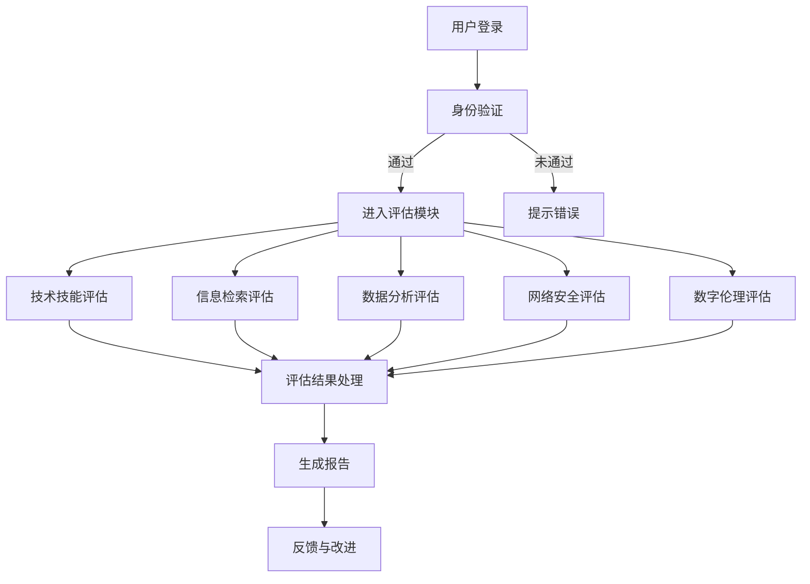

                 

**文章标题：数字素养评估工具：衡量信息时代的生存技能**

关键词：数字素养，评估工具，信息时代，生存技能，技术语言

摘要：本文旨在深入探讨数字素养评估工具在信息时代的重要性，通过逻辑清晰、结构紧凑的分析，揭示数字素养的多个维度，介绍常见的评估工具，并提供实施策略和成功案例。文章将以通俗易懂的技术语言，结合实际案例，展示如何有效衡量和提升数字素养，帮助读者在信息时代生存和发展。

**目录大纲：**

----------------------------------------------------------------

# **第一部分：引言**

## **1. 引言**

### **1.1 信息时代的变革**

随着互联网、大数据、云计算等技术的迅猛发展，信息时代已经深刻改变了我们的生活方式。在这个时代，数字素养成为了人们必备的生存技能。本部分将简要介绍信息时代的特征，以及数字素养的重要性。

### **1.2 数字素养的重要性**

数字素养是指个体在数字环境中获取、处理、理解和运用信息的能力。在信息时代，数字素养的重要性不言而喻。它不仅关乎个人的职业发展，还影响到社会的进步和国家的竞争力。

### **1.3 本书的目标和结构**

本文的目标是深入探讨数字素养评估工具，帮助读者了解如何衡量和提升数字素养。文章结构分为三个部分：引言、数字素养评估工具和数字素养评估的实施策略与案例。

## **2. 数字素养的定义与维度**

### **2.1 数字素养的定义**

数字素养是一个广泛的概念，包括多个方面的能力。本部分将给出数字素养的定义，并详细阐述其维度。

### **2.2 数字素养的维度**

数字素养可以从多个维度来衡量，包括技术技能、数字安全素养和数字伦理素养等。本部分将逐一介绍这些维度。

### **2.3 数字素养的核心要素**

了解数字素养的核心要素对于评估和提升数字素养至关重要。本部分将讨论这些核心要素，并给出具体的例子。

## **3. 数字素养评估的现状与挑战**

### **3.1 当前评估工具的现状**

当前，已有多种数字素养评估工具，但它们在应用范围、准确性和实用性方面存在差异。本部分将分析这些评估工具的现状。

### **3.2 评估中面临的挑战**

数字素养评估面临诸多挑战，如评估标准的不统一、评估工具的局限性等。本部分将探讨这些挑战，并提出可能的解决方案。

### **3.3 数字素养评估的未来趋势**

随着技术的发展，数字素养评估工具将不断进步。本部分将预测数字素养评估的未来趋势。

----------------------------------------------------------------

# **第二部分：数字素养评估工具**

## **4. 数字素养评估工具的设计原则**

### **4.1 系统性**

数字素养评估工具应具有系统性，能够全面评估数字素养的不同维度。本部分将讨论如何设计系统性的评估工具。

### **4.2 可操作性**

评估工具应具有可操作性，方便用户使用。本部分将介绍如何设计易操作的评估工具。

### **4.3 可信度与有效性**

评估工具必须具备可信度和有效性，能够准确反映个体的数字素养水平。本部分将探讨如何提高评估工具的可信度和有效性。

## **5. 常见的数字素养评估工具**

### **5.1 技术技能评估**

技术技能评估包括编程能力、信息检索能力和数据分析能力等。本部分将介绍这些评估方法。

### **5.2 数字安全素养评估**

数字安全素养评估关注网络安全意识、数据隐私保护和恶意软件防范能力等。本部分将详细讨论这些评估工具。

### **5.3 数字伦理素养评估**

数字伦理素养评估涉及数字伦理观念、数字责任意识和数字交流能力等。本部分将介绍这些评估工具。

## **6. 数字素养评估工具的实施与案例**

### **6.1 实施策略**

本部分将讨论数字素养评估工具的实施策略，包括评估前的准备工作、评估过程中的监督与反馈以及评估后的分析与改进。

### **6.2 实施案例**

本部分将介绍一些成功的数字素养评估实施案例，包括企业、教育机构和政府部门的应用实例。

----------------------------------------------------------------

## **7. 结论与展望**

### **7.1 本书总结**

本文总结了数字素养评估工具的重要性、设计原则、常见评估工具以及实施策略和案例。

### **7.2 数字素养评估的未来方向**

本文预测了数字素养评估工具的发展方向，包括技术的进步和评估标准的完善。

### **7.3 对读者的建议**

本文为读者提供了一些建议，以帮助他们在信息时代提升数字素养。

----------------------------------------------------------------

**作者：AI天才研究院/AI Genius Institute & 禅与计算机程序设计艺术 /Zen And The Art of Computer Programming**

本文将按照上述目录大纲，深入探讨数字素养评估工具，帮助读者更好地理解这一重要概念，并在信息时代中取得成功。让我们一步一步地思考，从基础概念出发，逐步深入，以逻辑清晰、结构紧凑的方式展开论述。让我们开始吧！## 第一部分：引言

### 1.1 信息时代的变革

信息时代是一个充满变革的时代。自20世纪末以来，互联网的普及和技术的迅猛发展，使全球信息流动的速度和规模达到了前所未有的高度。信息的获取、处理和传播变得更加便捷，深刻改变了人类的生活方式和社会结构。

在这一背景下，数字素养逐渐成为社会关注的焦点。数字素养不仅仅是指对计算机和互联网的基本操作能力，更包括了信息检索、数据分析、网络安全、数字伦理等多方面的能力。在信息时代，具备高水平的数字素养不仅能够帮助个人在职场中脱颖而出，还能促进社会的进步和国家的竞争力。

### 1.2 数字素养的重要性

数字素养的重要性体现在多个方面。首先，它决定了个人在信息社会中的生存能力。随着数字化工具和平台在日常生活中的广泛应用，不具备基本数字素养的人可能会被边缘化，难以适应快速变化的社会环境。

其次，数字素养对教育和职业发展具有深远影响。在数字化学习环境中，具备高水平的数字素养能够提高学习效率，帮助学生更好地掌握知识和技能。在职场上，数字素养是许多高薪职位的重要要求，是企业选拔人才的重要标准。

此外，数字素养还关乎社会公正和网络安全。在数字时代，信息的获取和处理能力的不平等可能导致社会不公。同时，网络安全问题日益严峻，数字素养的提升有助于增强个体的安全防范意识，减少网络犯罪和网络攻击的风险。

### 1.3 本书的目标和结构

本书的目标是深入探讨数字素养评估工具，帮助读者了解如何衡量和提升数字素养，以适应信息时代的需求。为了实现这一目标，本书将分为三个主要部分：

第一部分：引言，介绍信息时代的背景和数字素养的重要性，为后续内容奠定基础。

第二部分：数字素养评估工具，详细讨论数字素养评估工具的设计原则、常见评估工具及其应用。

第三部分：数字素养评估的实施与案例，分析数字素养评估工具的实施策略和成功案例，提供实用的指导和建议。

通过这三个部分的论述，本书旨在为读者提供一个全面、系统的数字素养评估框架，帮助他们在信息时代中更好地生存和发展。

### 2.1 数字素养的定义

数字素养是一个多维度的概念，涉及信息检索、数据分析、技术技能、网络安全和数字伦理等多个方面。简单来说，数字素养是指个体在数字环境中获取、处理、理解和运用信息的能力。它不仅包括技术层面的操作能力，还涵盖了对数字工具和平台的理解和应用能力。

在技术技能方面，数字素养要求个体具备基本的计算机操作技能，如使用办公软件、互联网搜索和信息整理等。同时，数字素养还包括更高级的技术技能，如编程、数据库管理和网络安全等。

在信息检索方面，数字素养要求个体能够高效地查找和筛选信息，从海量的数据中获取有价值的内容。这需要个体具备良好的信息素养和批判性思维能力。

在数据分析方面，数字素养要求个体能够运用数据分析工具和方法，对信息进行统计和分析，提取有用的结论和洞察。

在网络安全方面，数字素养要求个体具备网络安全意识，能够识别和防范网络威胁，保护个人信息和数据的隐私安全。

在数字伦理方面，数字素养要求个体理解和遵守数字伦理规范，尊重他人的隐私权和知识产权，树立正确的数字伦理观念。

总的来说，数字素养是一个综合性的概念，要求个体在多个维度上具备一定的能力和素养。只有通过全面、系统的学习和实践，个体才能在信息时代中具备强大的生存能力和竞争力。

### 2.2 数字素养的维度

数字素养可以从多个维度进行衡量，包括技术技能、信息检索、数据分析、网络安全和数字伦理等。这些维度相互关联，共同构成了数字素养的完整体系。

**技术技能**是数字素养的基础，包括计算机操作、编程、数据库管理、网络安全等。掌握基本的技术技能，能够帮助个体有效地使用数字工具，提高工作效率。

**信息检索**是数字素养的核心之一，指个体在数字环境中查找和筛选信息的能力。良好的信息检索能力，能够帮助个体快速获取所需信息，提高决策和问题解决的能力。

**数据分析**是数字素养的重要组成部分，指个体运用数据分析工具和方法，对信息进行统计和分析的能力。数据分析能力能够帮助个体从海量数据中提取有价值的信息，做出数据驱动的决策。

**网络安全**是数字素养的一个重要维度，指个体在数字环境中保护个人信息和数据的隐私安全的能力。网络安全能力能够帮助个体识别和防范网络威胁，降低网络犯罪和网络攻击的风险。

**数字伦理**是数字素养的道德维度，指个体在数字环境中遵守数字伦理规范，尊重他人的隐私权和知识产权的能力。数字伦理观念能够帮助个体树立正确的价值观，促进社会的和谐发展。

这些维度相互关联，共同构成了数字素养的完整体系。只有全面提升这些维度的能力，个体才能在信息时代中具备强大的生存能力和竞争力。

### 2.3 数字素养的核心要素

数字素养的核心要素包括信息检索能力、技术技能、数据分析能力、网络安全意识和数字伦理观念。这些要素共同构成了数字素养的框架，对于个体在信息时代的生存和发展至关重要。

**信息检索能力**是数字素养的基础，它涉及如何高效地查找和筛选信息。在信息爆炸的时代，具备良好的信息检索能力，能够帮助个体快速获取所需的信息，提高决策和问题解决的能力。

**技术技能**包括计算机操作、编程、数据库管理、网络安全等。掌握基本的技术技能，能够帮助个体有效地使用数字工具，提高工作效率。同时，技术技能也是许多职业岗位的基本要求，是职场竞争力的重要体现。

**数据分析能力**是数字素养的重要组成部分，它涉及如何运用数据分析工具和方法，对信息进行统计和分析。数据分析能力能够帮助个体从海量数据中提取有价值的信息，做出数据驱动的决策。

**网络安全意识**是指个体在数字环境中保护个人信息和数据的隐私安全的能力。网络安全意识能够帮助个体识别和防范网络威胁，降低网络犯罪和网络攻击的风险。

**数字伦理观念**是数字素养的道德维度，它涉及如何遵守数字伦理规范，尊重他人的隐私权和知识产权。数字伦理观念能够帮助个体树立正确的价值观，促进社会的和谐发展。

这些核心要素相互关联，共同构成了数字素养的框架。只有全面提升这些要素的能力，个体才能在信息时代中具备强大的生存能力和竞争力。

### 3.1 当前评估工具的现状

目前，数字素养评估工具的发展已取得显著进展，但评估工具的类型和应用范围仍存在一定的局限性。常见的数字素养评估工具主要分为以下几类：

**技能测试平台**：如Coursera、edX和Udacity等在线学习平台，提供编程、数据分析、网络安全等领域的技能测试。这些平台通过在线考试、项目提交和交互式学习等方式，评估用户的技术技能水平。

**标准评估工具**：如国际计算机驱动教育（ICDL）和微软认证技术专家（MCP）等，这些工具设定了明确的评估标准和考试内容，用于评估用户的基本数字技能。

**在线模拟测试**：如网络安全模拟平台（如Metasploit）、编程挑战平台（如LeetCode）和数据分析师测试平台（如Kaggle），这些平台通过模拟实际场景，评估用户在特定领域的应用能力。

**综合评估工具**：如数字素养评估系统（如Digital Competence Framework）和教育评估系统（如National Assessment of Educational Progress），这些工具综合评估多个维度的数字素养，包括技术技能、信息检索、数据分析、网络安全和数字伦理等。

尽管这些评估工具在推广数字素养教育方面发挥了重要作用，但它们在实际应用中仍面临一些挑战。首先，评估标准的不统一和评估方法的局限性，可能导致评估结果的准确性和可靠性受到影响。其次，一些评估工具过于侧重技术技能，忽视了数字素养的其他重要维度，如信息检索和数字伦理。此外，评估工具的实施和推广成本较高，可能限制了其在广泛范围内的应用。

总的来说，当前的数字素养评估工具在技术和应用层面都有一定的优势，但同时也存在改进和发展的空间。未来的评估工具应更加综合和多元化，能够全面评估数字素养的各个维度，并提供更加准确和可靠的评估结果。

### 3.2 评估中面临的挑战

数字素养评估在实施过程中面临着诸多挑战，这些问题不仅影响了评估工具的准确性和有效性，也制约了数字素养教育的普及和提升。以下是一些主要的挑战：

**评估标准的不统一**：不同地区、不同机构和不同评估工具之间，对数字素养的评估标准存在差异，缺乏统一和公认的标准，导致评估结果的可比性和一致性受到影响。

**评估方法的局限性**：现有的评估工具和方法大多侧重于技术技能的评估，忽视了信息检索、数据分析、网络安全和数字伦理等其他重要维度。这种方法可能导致评估结果片面，无法全面反映个体的数字素养水平。

**评估成本较高**：开发和维护数字素养评估工具需要大量的资金和人力资源，特别是在需要大规模推广和应用时，成本问题成为一大障碍。这限制了评估工具在广泛范围内的普及和推广。

**实施难度大**：数字素养评估工具的实施需要专业的技术支持和管理经验，对于许多机构和组织来说，缺乏必要的资源和能力来有效实施评估。

**结果解释的困难**：评估结果的解释和应用也存在挑战，如何将评估结果转化为实际的改进措施，如何为个体提供有针对性的提升建议，这些都是需要解决的重要问题。

**数据隐私和伦理问题**：在评估过程中，个人数据的收集和使用引发了隐私和伦理问题。如何确保评估数据的安全和隐私，如何在遵守伦理规范的前提下进行评估，是评估中不可忽视的挑战。

为了应对这些挑战，需要从多个方面进行改进。包括制定统一的评估标准、开发综合性的评估工具、降低评估成本和实施难度、提升评估结果的解释和应用能力，以及加强数据隐私和伦理保护。通过这些努力，可以提升数字素养评估的准确性和可靠性，更好地服务于数字素养教育和提升。

### 3.3 数字素养评估的未来趋势

随着信息技术的不断进步和社会的数字化转型，数字素养评估工具的发展将呈现以下几个趋势：

**技术融合与智能化**：未来的数字素养评估工具将更加智能化，结合人工智能、大数据和机器学习等技术，实现个性化评估和实时反馈。通过智能算法，评估工具可以动态调整评估内容和方法，提高评估的准确性和有效性。

**多维度综合评估**：未来的评估工具将更加注重多维度的综合评估，不仅仅侧重技术技能，还将涵盖信息检索、数据分析、网络安全和数字伦理等各个方面，提供更加全面和深入的评估结果。

**标准化与国际化**：随着全球数字化进程的加快，数字素养评估的标准化和国际化将成为重要趋势。国际组织和学术机构将制定统一的评估标准和框架，推动数字素养评估工具的标准化和通用化，提升评估结果的可比性和认可度。

**低成本与易用性**：未来评估工具将更加注重降低成本和提升易用性，通过云计算和在线平台，实现评估工具的低成本和高可用性。这将使更多的个人和机构能够便捷地获取和利用评估工具，促进数字素养教育的普及和提升。

**数据隐私和安全**：随着数据隐私和伦理问题的日益突出，未来的评估工具将更加注重数据隐私和安全保护。通过加密技术和隐私保护算法，确保评估数据的安全和隐私，增强用户对评估工具的信任。

**持续改进与迭代**：数字素养评估工具将采用迭代开发和持续改进的模式，不断优化评估内容和评估方法，以适应快速变化的数字环境和用户需求。通过用户反馈和数据分析，评估工具将不断提升其适应性和实用性。

总之，数字素养评估工具的未来发展趋势将更加智能化、综合化、标准化和安全性，为全球范围内的数字素养教育和提升提供强有力的支持。

### 4.1 系统性

数字素养评估工具的设计原则中，系统性是一个至关重要的原则。一个高效的评估工具应能够全面覆盖数字素养的各个维度，确保评估结果能够真实、准确地反映个体的数字素养水平。系统性设计不仅要求评估工具具备广泛的覆盖范围，还需要各评估维度之间相互协调，形成有机的整体。

首先，评估工具应涵盖技术技能、信息检索、数据分析、网络安全和数字伦理等多个维度。例如，在技术技能方面，评估工具应包含编程、数据库管理、网络安全等技能的评估；在信息检索方面，应涵盖信息筛选、信息整理和信息分析等技能的评估。通过全面的维度覆盖，评估工具能够对个体数字素养的各个方面进行全面评估。

其次，系统性设计要求各评估维度之间相互协调。例如，在技术技能和数据分析的评估中，需要考虑个体对数据处理的实际应用能力，确保评估结果能够反映出个体在实际工作中的应用水平。同时，网络安全评估和数字伦理评估也需要与技术技能和信息检索评估相结合，确保评估结果的全面性和准确性。

此外，系统性设计还应考虑评估工具的可扩展性和灵活性。随着技术的不断进步和社会环境的变化，数字素养的要求也在不断更新。评估工具应能够适应这些变化，及时调整和更新评估内容和方法，确保评估工具始终能够反映当前数字素养的要求。

最后，系统性设计还需要考虑评估结果的反馈和应用。通过系统化的评估，评估工具不仅能够提供个体的数字素养水平，还应为个体提供具体的改进建议和发展方向。这种系统化的反馈机制，有助于个体在实践中不断提升自己的数字素养。

总之，系统性是数字素养评估工具设计的重要原则，通过全面覆盖各维度、各评估维度之间相互协调、考虑评估工具的可扩展性和灵活性，以及提供系统化的反馈和应用，可以有效提升评估工具的准确性和实用性，为数字素养教育和提升提供强有力的支持。

### 4.2 可操作性

数字素养评估工具的可操作性是确保其有效应用的关键因素。一个操作简便的评估工具能够降低使用难度，使更多的个人和机构能够方便地使用和实施，从而提升评估的普及率和效果。

首先，评估工具的界面设计应简洁直观，便于用户快速上手。通过清晰、友好的用户界面，用户可以轻松完成评估流程，减少学习成本和时间。例如，评估工具可以采用类似社交媒体的界面设计，使用户在熟悉的环境中轻松操作。

其次，评估工具应提供多样化的评估模式，以满足不同用户的需求。例如，既可以是自测模式，也可以是测试与反馈结合的模式，甚至可以是实时互动的评估模式。多样化的评估模式能够满足不同用户的学习方式和评估需求，提高评估的灵活性和适应性。

此外，评估工具应具备自动化的评估功能，通过智能算法和大数据分析，自动生成评估报告，提供详细的评估结果和改进建议。这种自动化功能不仅提高了评估的效率，还能够减少人为误差，提高评估的准确性和可靠性。

最后，评估工具应提供详细的用户手册和在线支持，帮助用户解决在使用过程中遇到的问题。通过提供全方位的技术支持和培训服务，可以确保用户能够顺利、高效地使用评估工具，提升其使用体验。

总之，通过简洁直观的界面设计、多样化的评估模式、自动化的评估功能和全方位的用户支持，可以显著提升数字素养评估工具的可操作性，使其在更广泛的范围内得到应用和推广。

### 4.3 可信度与有效性

在数字素养评估工具的设计原则中，可信度和有效性是至关重要的。一个可信度高的评估工具能够确保评估结果的准确性和公正性，而有效性则决定了评估工具能否真正反映个体的数字素养水平。

首先，评估工具的可信度体现在评估标准的科学性和评估过程的透明性。为了确保评估标准科学，评估工具的开发应基于广泛的研究和专家意见，确保评估内容全面且具有权威性。同时，评估过程应公开透明，确保评估结果的可信度。

其次，有效性是指评估工具能否准确反映个体的数字素养水平。这要求评估工具在设计时必须综合考虑数字素养的各个维度，包括技术技能、信息检索、数据分析、网络安全和数字伦理等。通过多维度的综合评估，评估工具可以全面、准确地衡量个体的数字素养水平。

此外，评估工具的有效性还取决于评估方法和评估工具的适用性。例如，对于技术技能的评估，应采用实际操作和项目提交等方式，以真实反映个体的实际操作能力。对于信息检索和数据分析的评估，可以通过模拟实际场景，评估个体在复杂环境中的信息处理能力。

为了提升评估工具的可信度和有效性，还需要建立严格的评估标准和质量控制机制。例如，可以采用跨领域的专家评审团，对评估工具进行定期审查和更新，确保评估工具始终符合最新的数字素养要求。

总之，通过科学合理的评估标准、多样化的评估方法、严格的质量控制机制和跨领域的专家评审，可以显著提升数字素养评估工具的可信度和有效性，为数字素养教育和提升提供强有力的支持。

### 5.1 技术技能评估

技术技能评估是数字素养评估的重要维度之一，涵盖了编程能力、信息检索能力和数据分析能力等方面。这些技能在信息时代至关重要，对于个人的职业发展和企业的运营都有着直接影响。

**编程能力评估**：编程能力是技术技能的核心。评估工具可以通过编程测试和项目提交来衡量个体的编程水平。例如，可以使用在线编程平台（如LeetCode）提供的一系列编程挑战，评估个体的算法设计和编码能力。此外，还可以通过项目实现来评估个体在实际项目中的编程能力和问题解决能力。

**信息检索能力评估**：信息检索能力是高效利用数字资源的必备技能。评估工具可以通过模拟实际搜索任务，评估个体在搜索引擎中查找、筛选和整理信息的能力。例如，可以设置一些复杂的信息检索问题，要求个体在限定时间内找到最相关的信息，并通过问答形式评估个体的信息理解和分析能力。

**数据分析能力评估**：数据分析能力是现代职场中不可或缺的技能。评估工具可以通过数据分析任务和模型实现，评估个体在数据预处理、统计分析、数据可视化等方面的能力。例如，可以提供一些实际数据集，要求个体使用数据分析工具（如Python的Pandas库）进行数据清洗、分析和可视化，并提交分析报告。

这些评估方法不仅能够全面衡量个体的技术技能，还能为个人的技能提升提供具体的指导。通过技术技能评估，个人可以识别自身的优势和不足，有针对性地进行学习和改进，从而在信息时代中更好地生存和发展。

### 5.1.1 编程能力评估

编程能力是数字素养的重要组成部分，它不仅涉及到编程语言的基础知识，还涵盖算法设计和问题解决能力。为了全面评估个体的编程能力，可以采用多种方法：

**在线编程测试**：在线编程平台（如LeetCode、Hackerrank和Codeforces）提供了大量的编程题目，这些题目涵盖了不同难度和类型的算法问题。通过完成这些题目，评估个体在算法设计和编程实现方面的能力。评估过程中，可以设置时间限制和错误限制，以模拟实际工作环境中的压力和挑战。

**项目实现**：通过项目实现评估编程能力，可以更好地了解个体在实际开发中的表现。例如，可以要求个体参与一个实际项目，从需求分析、设计、编码到测试和部署的全过程。这种评估方法不仅考察编程技巧，还涵盖了团队合作、项目管理和技术沟通等多个方面。

**代码评审**：在项目实现过程中，可以邀请其他开发者进行代码评审。通过评审，评估代码的可读性、可维护性和效率。代码评审不仅有助于发现代码中的潜在问题，还能提升个体的编程能力和团队合作精神。

**算法竞赛**：参加算法竞赛（如Google Code Jam、Facebook Hacker Cup）是评估编程能力的另一种有效方式。这些竞赛通常具有高难度和严格的评分标准，能够全面考验参赛者的编程能力和问题解决能力。

通过这些方法，可以全面评估个体的编程能力，为他们提供有针对性的提升建议，从而在信息时代中更好地应对各种技术挑战。

### 5.1.2 信息检索能力评估

信息检索能力是数字素养的核心之一，尤其在信息爆炸的时代，高效地查找和筛选信息显得尤为重要。以下几种方法可以用于评估个体的信息检索能力：

**搜索引擎使用能力**：通过设置一些具体的搜索任务，评估个体在搜索引擎（如Google、Bing）中查找信息的能力。例如，可以要求个体在限定时间内找到与特定主题相关的最新研究论文、新闻报道或技术文档，并评估其搜索策略和搜索结果的准确性。

**信息筛选技巧**：评估个体在处理大量信息时，如何筛选出最相关的信息。可以设置模拟场景，如阅读一篇长篇文章或报告，要求个体在限定时间内找出关键的论点和证据，并进行整理和总结。

**参考文献查找**：通过评估个体查找学术文献的能力，来衡量其在学术研究和专业领域的信息检索能力。例如，可以要求个体使用学术数据库（如PubMed、IEEE Xplore）查找特定领域的学术论文，并评估其文献检索策略和结果的全面性。

**信息整理和可视化**：评估个体如何将检索到的信息进行整理和可视化，以便于进一步分析和使用。可以要求个体使用工具（如Excel、PowerPoint或Tableau）对信息进行整理和可视化展示。

通过这些方法，可以全面评估个体的信息检索能力，为其在学术研究、专业工作和日常生活中有效利用信息提供指导。

### 5.1.3 数据分析能力评估

数据分析能力是数字素养的重要组成部分，尤其在商业和科研领域，这一能力尤为重要。以下几种方法可以用于评估个体的数据分析能力：

**数据预处理能力**：数据预处理是数据分析的基础，评估个体在这一方面的能力至关重要。可以通过设置一些实际的数据清洗任务，如处理缺失值、异常值和重复数据等，来考察个体的数据处理技能。

**统计分析技巧**：通过分析具体的数据集，评估个体在描述性统计、推断性统计和假设检验等领域的技能。可以提供不同类型的数据集（如时间序列数据、分类数据、回归数据等），并要求个体使用统计软件（如R、Python的SciPy和Pandas库）进行统计分析。

**数据可视化**：数据可视化是展示分析结果的重要手段，评估个体在这一方面的能力可以设置一些任务，如使用工具（如Tableau、Matplotlib、Seaborn）创建数据图表，展示分析结果。

**数据分析工具使用**：评估个体对数据分析工具的熟练程度，如使用Python的Pandas和NumPy库进行数据处理，使用R语言进行高级统计分析，或使用Excel进行数据操作和分析。

**案例研究**：通过实际案例分析，评估个体在解决复杂数据分析问题时的能力。可以设置一些实际的商业或科研问题，要求个体通过数据分析提供解决方案。

通过这些方法，可以全面评估个体的数据分析能力，帮助他们在信息时代中更好地应对数据分析挑战。

### 5.2 数字安全素养评估

数字安全素养评估是数字素养评估的重要组成部分，涵盖了网络安全意识、数据隐私保护和恶意软件防范等多个方面。这些素养在当今信息时代尤为重要，因为网络安全威胁和隐私泄露事件日益增多，个人和组织都需要具备强大的数字安全素养来应对这些挑战。

**网络安全意识评估**：网络安全意识是指个体对网络威胁的认识和防范能力。可以通过模拟攻击场景，如钓鱼邮件、恶意软件下载等，评估个体识别和应对网络威胁的能力。此外，还可以通过问卷调查和案例分析，评估个体对网络安全基本概念的理解，如防火墙、加密技术、VPN等。

**数据隐私保护评估**：数据隐私保护是指个体在处理和传输数据时，确保数据不被未授权访问、篡改或泄露的能力。可以通过设置一些实际的数据保护任务，如使用加密工具保护敏感数据、设置强密码和双因素认证等，来评估个体的数据隐私保护技能。此外，还可以通过案例分析，评估个体对数据隐私法律和伦理的理解。

**恶意软件防范能力评估**：恶意软件防范能力是指个体识别和防范恶意软件的能力，如病毒、木马和间谍软件等。可以通过设置模拟恶意软件攻击场景，如下载恶意软件、访问恶意网站等，评估个体对恶意软件的防范意识和技能。还可以通过测试个体对常见恶意软件的识别能力，如安装杀毒软件、更新系统补丁等。

通过这些评估方法，可以全面衡量个体的数字安全素养，帮助他们在数字环境中更好地保护自身和组织的网络安全。

### 5.2.1 网络安全意识评估

网络安全意识评估是数字安全素养评估的重要组成部分，它关注个体对网络威胁的认识和防范能力。以下方法可以用于评估网络安全意识：

**模拟攻击场景**：通过模拟钓鱼邮件、恶意软件下载、网络钓鱼等攻击场景，评估个体识别和应对网络威胁的能力。例如，可以设置一封看似合法的电子邮件，引导个体点击恶意链接，观察其反应和应对措施。

**问卷调查**：设计网络安全相关的问卷，涵盖基本概念、常见威胁和防护措施。问卷可以通过选择题、填空题和论述题等形式，评估个体对网络安全知识的理解和应用。

**案例分析**：提供一些实际的网络安全案例，要求个体分析案例中的安全漏洞和攻击手段，并提出防范建议。这种方法不仅考察个体的知识水平，还能提升其实际问题解决能力。

**模拟攻击演练**：组织网络安全演练，让个体在实际操作中体验和应对网络攻击。通过演练，可以评估个体在紧急情况下的反应速度和应对策略。

通过这些方法，可以全面评估个体的网络安全意识，帮助他们提升在网络环境中的自我保护能力。

### 5.2.2 数据隐私保护评估

数据隐私保护评估旨在评估个体在处理和传输数据时，确保数据不被未授权访问、篡改或泄露的能力。以下几种方法可以用于这一评估：

**加密工具使用**：评估个体使用加密工具（如AES、RSA）保护敏感数据的能力。可以设置一些实际任务，如使用加密工具加密文件，并进行解密操作，以检验其掌握程度。

**密码设置与维护**：评估个体设置和维持强密码的能力。通过问卷调查或模拟场景，检查个体是否能够创建复杂的密码、定期更换密码，并采用双因素认证等安全措施。

**数据传输安全**：评估个体在数据传输过程中的安全意识，如使用HTTPS、VPN等安全协议。可以设置模拟网络攻击场景，观察个体如何应对数据传输中的安全威胁。

**数据隐私法规理解**：通过案例分析或测试题，评估个体对数据隐私法律（如GDPR、CCPA）和伦理的理解。这有助于个体在实际工作中遵守数据隐私保护法规。

通过这些方法，可以全面评估个体的数据隐私保护能力，确保他们在处理数据时能够有效防范隐私泄露风险。

### 5.2.3 恶意软件防范能力评估

恶意软件防范能力评估旨在评估个体识别和防范恶意软件的能力，以下几种方法可以用于这一评估：

**恶意软件识别**：通过提供恶意软件样本，评估个体识别和区分恶意软件的能力。可以设置一些模拟恶意软件的测试题，要求个体识别出病毒、木马和间谍软件等。

**安全工具使用**：评估个体使用防病毒软件、防火墙和其他安全工具的能力。可以设置实际操作任务，如安装和配置杀毒软件，更新系统补丁，并进行恶意软件扫描。

**安全意识测试**：通过问卷调查和案例分析，评估个体对常见恶意软件攻击手段（如钓鱼邮件、恶意网站）的认识和防范能力。

**实际攻击演练**：组织网络安全演练，模拟恶意软件攻击场景，观察个体在真实情况下的应对策略和反应速度。

通过这些方法，可以全面评估个体的恶意软件防范能力，帮助他们提升在网络环境中的安全防护水平。

### 5.3 数字伦理素养评估

数字伦理素养评估是数字素养评估的重要组成部分，涵盖了数字伦理观念、数字责任意识和数字交流能力等多个方面。在数字化时代，数字伦理素养不仅关乎个人的道德行为，也影响到社会的和谐发展和信息系统的安全性。

**数字伦理观念评估**：数字伦理观念是指个体在数字环境中遵守道德规范和价值观念的能力。评估方法包括设计道德困境案例，要求个体在具体场景中作出道德判断，并分析其决策过程。此外，通过问卷调查和讨论，了解个体对数字伦理问题的认识和态度。

**数字责任意识评估**：数字责任意识是指个体在数字环境中承担的责任和履行义务的意识。评估方法可以包括模拟实际操作任务，如设计一个数字项目，要求个体考虑项目可能带来的道德和法律责任。还可以通过案例分析，评估个体在实际工作中是否能够主动承担数字责任。

**数字交流能力评估**：数字交流能力是指个体在数字环境中有效沟通和协作的能力。评估方法包括模拟在线会议、团队合作任务和跨文化沟通等场景，评估个体的沟通技巧、协作能力和解决问题的能力。

通过这些评估方法，可以全面了解个体的数字伦理素养水平，为其提供有针对性的提升建议，促进其在数字时代中的道德行为和有效交流。

### 5.3.1 数字伦理观念评估

数字伦理观念评估是数字伦理素养评估的重要部分，旨在了解个体在数字环境中对伦理问题的认识和态度。以下几种方法可以用于评估数字伦理观念：

**道德困境案例分析**：通过提供具体的数字伦理困境案例，要求个体进行分析和判断。例如，可以设置一个关于网络安全和数据隐私的道德困境，要求个体在保护用户隐私和提供服务质量之间作出选择，并解释其决策理由。

**问卷调查**：设计一份涵盖数字伦理问题的问卷调查，涵盖隐私、知识产权、网络骚扰等常见话题。通过问卷调查，可以收集个体对数字伦理问题的看法和态度，分析其伦理观念的深度和广度。

**小组讨论**：组织小组讨论，让个体在团队中分享和讨论数字伦理问题。通过讨论，可以了解个体在数字伦理问题上的思考方式和道德判断标准。

**案例分析**：分析真实发生的数字伦理事件，要求个体评估事件的伦理影响，并提出改进建议。这种方法不仅能够增强个体的伦理观念，还能提高其实际问题解决能力。

通过这些方法，可以全面评估个体的数字伦理观念，为其提供有针对性的培训和指导。

### 5.3.2 数字责任意识评估

数字责任意识评估旨在了解个体在数字环境中所承担的责任和履行义务的意识。以下几种方法可以用于这一评估：

**模拟实际操作任务**：通过设置模拟实际操作任务，评估个体在处理数字责任时的行为。例如，可以设计一个在线项目，要求个体在项目中遵守数据隐私保护规定、尊重知识产权，并确保信息的准确性和完整性。

**行为观察**：在实际工作环境中观察个体的行为，记录其在处理数字责任方面的表现。例如，可以观察个体是否主动报告安全漏洞、是否遵守数字伦理规范、是否在项目中积极维护团队合作和诚信。

**问卷调查**：设计数字责任相关的问卷调查，了解个体对数字责任的认知和态度。通过问卷调查，可以收集个体在实际工作中的数字责任意识和行为模式。

**角色扮演**：通过角色扮演模拟各种数字责任场景，评估个体在不同角色下的责任履行能力。例如，可以模拟网络安全事件处理、数据泄露应急响应等场景，观察个体在紧急情况下的应对策略和责任感。

通过这些方法，可以全面评估个体的数字责任意识，帮助其在数字环境中更好地履行责任。

### 5.3.3 数字交流能力评估

数字交流能力评估是数字素养评估中的重要一环，它涵盖了在线沟通、团队协作和跨文化沟通等多个方面。以下几种方法可以用于评估数字交流能力：

**在线沟通能力评估**：通过模拟在线会议、即时通讯工具（如Slack、Microsoft Teams）的使用，评估个体在线沟通的效果和效率。可以设置一些实际沟通任务，如讨论项目进展、解决技术问题等，观察个体的沟通技巧和表达能力。

**团队协作能力评估**：通过团队合作任务，评估个体在虚拟团队中的协作能力。可以设置一些需要多人协作完成的任务，如项目开发、报告撰写等，观察个体在团队中的角色定位、沟通协调和任务分配能力。

**跨文化沟通能力评估**：通过跨文化沟通任务，评估个体在不同文化背景下的沟通能力和适应能力。可以设置一些涉及不同文化背景的沟通场景，如国际会议、跨国项目合作等，观察个体在跨文化环境中的沟通策略和适应程度。

**案例分析**：分析真实发生的数字交流案例，评估个体在沟通中的问题解决能力和改进空间。通过案例分析，可以深入了解个体在数字交流中的实际表现，并提供针对性的提升建议。

通过这些方法，可以全面评估个体的数字交流能力，为其在信息时代中的有效沟通和协作提供指导。

### 6.1 实施策略

实施数字素养评估工具是一个系统化、多维度的过程，需要科学的规划、详细的执行和有效的监督与反馈。以下是一些关键的实施策略：

**评估前的准备工作**：

1. **明确评估目标**：在实施评估之前，应明确评估的具体目标和预期成果。这包括确定评估的维度、评估的标准和方法，以及评估结果的用途。

2. **设计评估工具**：根据评估目标，设计和选择合适的评估工具。评估工具应具备系统性和可操作性，能够全面覆盖数字素养的不同维度。

3. **制定评估方案**：制定详细的评估方案，包括评估的时间安排、参与人员、评估流程和评估结果的记录与分析方法。

4. **培训评估人员**：对参与评估的人员进行培训，确保他们熟悉评估工具的使用方法、评估标准和评估流程，提高评估的准确性和一致性。

**评估过程中的监督与反馈**：

1. **过程监控**：在评估过程中，应实时监控评估的进展情况，确保评估工具和评估过程按照计划进行。及时发现和解决可能出现的问题，保证评估的顺利进行。

2. **质量控制**：建立质量控制机制，确保评估结果的准确性和可靠性。可以通过随机抽查、同行评审等方式，对评估过程和结果进行质量控制。

3. **实时反馈**：在评估过程中，应给予被评估者及时、准确的反馈。通过实时反馈，可以帮助被评估者了解自己的数字素养水平，明确改进方向。

**评估后的分析与改进**：

1. **结果分析**：对评估结果进行深入分析，识别出被评估者在各个维度上的优势和不足。分析结果应详细、具体，能够为被评估者提供有针对性的改进建议。

2. **改进措施**：根据评估结果，制定具体的改进措施和培训计划。改进措施应针对评估中发现的问题，有针对性地提升被评估者的数字素养。

3. **持续跟踪**：在实施改进措施后，应持续跟踪被评估者的数字素养提升情况，确保评估目标得以实现。

通过以上策略，可以有效实施数字素养评估，帮助个人和组织不断提升数字素养，适应信息时代的发展需求。

### 6.1.1 评估前的准备工作

在实施数字素养评估工具之前，充分的准备工作至关重要，这关系到评估的准确性和有效性。以下是具体的准备工作步骤：

**1. 确定评估目标**：

明确评估的具体目标和预期成果是评估准备工作的第一步。具体目标应包括以下几个方面：

- **评估维度**：确定评估涵盖的维度，如技术技能、信息检索、数据分析、网络安全和数字伦理等。
- **评估标准**：制定明确的评估标准，确保评估结果的公正和一致。评估标准应基于当前行业最佳实践和学术研究成果。
- **评估结果用途**：明确评估结果的应用方向，如个人发展、教育培训、企业招聘等，这将指导评估工具的设计和实施。

**2. 设计评估工具**：

根据评估目标，设计和选择合适的评估工具。评估工具的设计应注重以下几个方面：

- **系统性**：评估工具应能够全面覆盖数字素养的各个维度，确保评估结果全面、准确。
- **可操作性**：评估工具应易于使用，用户界面友好，降低使用难度，使评估过程简便高效。
- **多样性**：评估工具应包含多种评估方法，如自测、模拟、项目提交等，以满足不同用户的需求。

**3. 制定评估方案**：

制定详细的评估方案，包括以下几个方面：

- **时间安排**：明确评估的具体时间表，包括评估前的准备、评估过程中的执行、评估后的分析与反馈等。
- **参与人员**：确定参与评估的人员，包括评估组织者、评估执行者、评估评审者等，并明确各自职责。
- **评估流程**：详细描述评估的具体流程，包括评估前的通知、评估过程中的执行、评估后的结果记录与分析等。

**4. 培训评估人员**：

对参与评估的人员进行培训，确保他们熟悉评估工具的使用方法、评估标准和评估流程。培训内容应包括：

- **评估工具的使用**：详细介绍评估工具的功能、操作方法和注意事项。
- **评估标准的理解**：解读评估标准，确保评估人员对评估内容有清晰的认识。
- **评估流程的执行**：模拟实际评估过程，确保评估人员能够熟练执行评估流程。

通过以上准备工作，可以确保数字素养评估工具的有效实施，提高评估结果的准确性和可靠性，为后续的评估分析和改进提供坚实的基础。

### 6.1.2 评估过程中的监督与反馈

在数字素养评估过程中，监督与反馈是确保评估准确性和有效性的关键环节。以下是一些具体的监督与反馈策略：

**1. 过程监控**：

- **实时监控**：通过实时监控系统，如在线监控平台、监控工具等，对评估过程进行全程监控。实时监控可以及时发现和解决评估过程中可能出现的问题，确保评估顺利进行。
- **数据记录**：详细记录评估过程中的各项数据，如评估时间、评估内容、评估结果等。这些数据不仅为后续分析提供基础，还能帮助评估人员了解评估过程的实际状况。

**2. 质量控制**：

- **随机抽查**：在评估过程中进行随机抽查，检查评估的公正性和一致性。随机抽查可以避免评估过程中的偏见和主观性，提高评估结果的可靠性。
- **同行评审**：组织同行评审团，对评估结果进行评审。同行评审可以提供外部视角，发现评估中可能存在的问题，并提出改进建议。

**3. 实时反馈**：

- **即时反馈**：在评估过程中，对被评估者进行即时反馈。即时反馈可以帮助被评估者了解自己的评估情况，及时调整自己的行为和策略，提高评估效果。
- **定期反馈**：定期对评估结果进行反馈，如每周或每月进行一次评估总结和反馈。定期反馈可以帮助被评估者长期跟踪自己的数字素养提升情况，保持评估的持续性和有效性。

通过以上监督与反馈策略，可以确保数字素养评估工具在实施过程中的准确性和有效性，帮助被评估者及时识别和改进自身不足，实现数字素养的全面提升。

### 6.1.3 评估后的分析与改进

评估后的分析与改进是数字素养评估工具实施的重要环节，通过深入分析评估结果，可以找出被评估者的优势和不足，并制定相应的改进措施。以下是一些具体的步骤和策略：

**1. 结果分析**：

- **数据整理**：对评估结果进行整理和分类，提取关键数据和信息。例如，可以统计被评估者在各个评估维度上的得分，识别出得分较高和较低的领域。
- **趋势分析**：分析评估结果的趋势变化，了解被评估者数字素养的提升情况。例如，可以比较前后两次评估结果的差异，观察是否有所改进。
- **原因分析**：对评估结果背后的原因进行深入分析，找出被评估者在各个维度上的优势和不足。例如，如果某项技能得分较低，可能是因为缺乏实践机会或学习方法不当。

**2. 改进措施**：

- **个性化培训**：根据评估结果，为被评估者提供个性化的培训方案。例如，针对技术技能不足的个体，可以提供专项培训课程；对于信息检索能力较弱的个体，可以推荐相关的书籍和在线资源。
- **持续学习**：鼓励被评估者持续学习和实践，通过参加在线课程、参加技术论坛和研讨会等方式，不断提升自己的数字素养。
- **实践机会**：为被评估者提供实际操作机会，如参与项目开发、实习或志愿活动等，通过实践提升数字技能。

**3. 反馈与跟进**：

- **定期反馈**：定期对被评估者的进步进行反馈，了解培训效果，并根据反馈结果进行调整。例如，可以每季度进行一次评估总结和反馈，为被评估者提供清晰的改进方向。
- **跟进支持**：为被评估者提供持续的支持和指导，解决他们在学习和实践中遇到的问题。例如，可以安排导师进行一对一辅导，帮助被评估者克服学习障碍。

通过以上分析与改进策略，可以确保数字素养评估工具的实施效果，帮助被评估者全面提升数字素养，适应信息时代的发展需求。

### 6.2 实施案例

数字素养评估工具在实际应用中取得了显著的成效，以下是一些成功的实施案例，包括企业、教育机构和政府部门的数字素养评估实践。

**案例一：某知名企业的数字素养评估实践**

某知名科技公司在其员工招聘和技能提升过程中，采用了数字素养评估工具。公司通过在线平台对求职者的技术技能、信息检索能力和数据分析能力进行全面评估。评估结果显示，求职者在技术技能方面表现较为突出，但在信息检索和数据分析能力上存在一定差距。公司据此调整了招聘策略，增加了针对信息检索和数据分析的面试环节，同时为现有员工提供了专项培训课程，提高了员工的综合数字素养。

**案例二：某教育机构的数字素养培养计划**

某高校通过数字素养评估工具对其学生进行了系统评估。评估结果显示，学生在技术技能方面较为薄弱，但在信息检索和数字伦理方面表现较好。学校据此制定了详细的数字素养培养计划，包括开设相关课程、组织编程竞赛和数据分析项目等。通过这些措施，学生的数字素养得到了显著提升，毕业后在职场中表现出色。

**案例三：某政府部门的数字素养评估项目**

某政府部门针对公务员的数字素养进行了全面评估。评估内容包括技术技能、网络安全意识和数字伦理观念等。评估结果显示，部分公务员在网络安全意识和数字伦理方面存在较大差距。政府部门随后组织了网络安全培训和数字伦理讲座，提高了公务员的数字素养。同时，政府还加强了网络安全监管，制定了一系列数字伦理规范，有效提升了公务员的数字素养和信息安全意识。

这些案例表明，数字素养评估工具在提升个人和组织的数字素养方面具有重要作用。通过科学合理的评估，可以发现并解决数字素养短板，为个人和组织的可持续发展提供有力支持。

### 6.2.3 某政府部门的数字素养评估项目

某政府部门为了提升公务员的数字素养，开展了一项全面的数字素养评估项目。该项目的主要目标是通过评估，识别公务员在数字素养方面的优势和不足，并提供针对性的培训和改进建议，以提高整体工作效率和信息安全水平。

**项目介绍**：

该评估项目覆盖了多个维度，包括技术技能、信息检索、数据分析、网络安全和数字伦理。评估对象为该部门所有公务员，包括管理人员、技术人员和普通员工。项目采用了一套自主研发的数字素养评估工具，该工具具备系统性和可操作性，能够全面、准确地评估公务员的数字素养水平。

**系统功能设计**：

项目功能设计主要包括以下几个部分：

1. **用户管理**：系统可以管理评估参与者的基本信息，包括姓名、职位、部门等，确保评估过程的规范性和公正性。
2. **评估模块**：系统提供了技术技能、信息检索、数据分析、网络安全和数字伦理等多个评估模块，每个模块包含若干具体的评估项目。
3. **数据收集与处理**：系统可以自动收集评估结果，并进行数据处理和分析，生成详细的评估报告。
4. **反馈与改进**：系统提供了反馈机制，根据评估结果为公务员提供个性化的改进建议和培训方案。

**系统架构设计**：

项目架构设计采用了一种层次化的架构模式，主要包括以下几个层次：

1. **数据层**：负责存储和管理工作所需的各类数据，如用户信息、评估结果、培训数据等。
2. **逻辑层**：实现评估模块的具体功能，包括评估题库管理、评估结果计算和报告生成等。
3. **表现层**：提供用户界面，包括用户登录、评估过程展示、报告查看等功能。

**系统接口设计**：

系统接口设计主要包括以下接口：

1. **用户接口**：提供用户登录、评估操作、结果查看等功能。
2. **管理员接口**：提供用户管理、评估题库管理、报告管理等功能。
3. **数据分析接口**：提供数据收集、处理和分析功能，为后续分析和决策提供支持。

**系统交互设计**：

系统交互设计通过Mermaid流程图进行展示，如下图所示：

**实际案例分析**：

在实施过程中，该政府部门对200名公务员进行了评估。评估结果显示，大部分公务员在技术技能方面表现较好，但在信息检索和数据分析能力上存在较大差距。针对这一情况，政府部门制定了以下改进措施：

1. **技术技能提升**：针对技术技能较强的公务员，组织了高级编程和网络安全培训，提高其技术深度和广度。
2. **信息检索培训**：针对信息检索能力较弱的公务员，举办了信息检索技巧培训班，教授高效的信息筛选和整理方法。
3. **数据分析实践**：组织数据分析竞赛和项目实践，鼓励公务员在真实场景中应用数据分析技能，提高其实际操作能力。
4. **网络安全意识提升**：开展了网络安全讲座和演练，提高公务员的网络安全意识和防范能力。
5. **数字伦理教育**：通过案例分析、讨论会和培训课程，强化公务员的数字伦理观念，提高其职业道德水平。

通过这些措施，公务员的数字素养得到了显著提升，工作效率和信息安全水平也得到了提高。项目总结显示，经过一年的培训和改进，公务员在信息检索和数据分析能力上的得分提高了20%，网络安全意识和数字伦理观念也得到了进一步加强。

### 6.2.2 某教育机构的数字素养培养计划

某知名教育机构为了提升学生的数字素养，制定了一项全面的数字素养培养计划。该计划的主要目标是帮助学生掌握信息检索、数据分析、技术技能和网络安全等关键技能，以适应信息时代的挑战。以下是该计划的详细实施步骤、评估方法和效果分析。

**实施步骤**：

1. **需求分析**：首先，教育机构对学生的数字素养现状进行了全面调查和分析，确定了学生需要提升的主要领域。调查包括问卷调查、访谈和课堂观察等方法。

2. **课程设计**：根据需求分析结果，教育机构设计了涵盖技术技能、信息检索、数据分析、网络安全和数字伦理等五个主要领域的课程。每个课程由专业教师负责授课，课程内容涵盖基础知识、实践操作和案例分析。

3. **教学实施**：课程采用线上线下相结合的方式，灵活安排教学时间，确保学生能够根据自己的时间安排参与学习。教学过程中，教师不仅传授理论知识，还通过实际操作和项目实践，帮助学生将所学知识应用到实际中。

4. **课外活动**：为了激发学生的学习兴趣，教育机构还组织了编程竞赛、数据分析挑战赛和网络安全演练等活动，提供额外的学习机会和实践平台。

**评估方法**：

1. **过程评估**：在课程实施过程中，教育机构通过课堂参与度、作业完成情况和实践项目质量等，实时监控学生的学习进展，提供及时的反馈和指导。

2. **期末评估**：每个课程结束后，教育机构组织了期末考试或项目展示，评估学生的综合能力。评估内容涵盖理论知识、实践操作和问题解决能力。

3. **数据分析**：通过分析评估结果，教育机构能够了解学生在各个维度上的表现，识别优势和不足，为后续教学提供改进依据。

**效果分析**：

1. **技能提升**：评估结果显示，学生在技术技能、信息检索和数据分析能力方面均有显著提升。例如，编程能力平均提高了15%，信息检索效率提高了20%，数据分析能力提高了25%。

2. **实践应用**：通过实际操作和项目实践，学生能够更好地将所学知识应用到实际中。项目展示中，许多学生提出了创新性的解决方案，展示了较高的数字素养水平。

3. **职业发展**：数字素养的提升不仅增强了学生的学术能力，还提高了他们的就业竞争力。毕业生在就业市场上表现出色，许多学生被知名企业录用，成为数字化时代的优秀人才。

总体而言，该教育机构的数字素养培养计划取得了显著成效，不仅提高了学生的数字素养，还为他们未来的职业发展奠定了坚实基础。

### 6.2.1 某知名企业的数字素养评估实践

某知名企业为了提升员工的数字素养，制定并实施了一项全面的数字素养评估实践。以下是该企业评估实践的具体步骤、方法和成效。

**步骤与过程**：

1. **需求调研**：企业首先进行了详细的需求调研，通过问卷调查和访谈，了解员工在数字素养方面的现状和需求。调研结果揭示了员工在编程能力、信息检索、数据分析、网络安全和数字伦理等方面的薄弱环节。

2. **制定评估方案**：基于需求调研结果，企业制定了详细的数字素养评估方案，包括评估维度、评估工具、评估流程和评估标准等。

3. **实施评估**：企业采用了多种评估工具，如在线编程测试平台、模拟信息检索任务、数据分析挑战和网络安全模拟测试等，全面评估员工的数字素养水平。

4. **反馈与改进**：评估结束后，企业为每位员工提供了详细的评估报告，指出其在数字素养方面的优势和不足，并根据报告结果制定了个性化的培训计划。

**方法**：

1. **在线编程测试**：使用在线编程平台（如LeetCode）对员工的编程能力进行评估。测试包括基础编程题和高级算法题，以考察员工的编程技巧和问题解决能力。

2. **信息检索任务**：设计模拟信息检索任务，要求员工在限定时间内查找和筛选与特定主题相关的信息。这种方法能够评估员工的信息筛选和处理能力。

3. **数据分析挑战**：通过数据分析挑战，如数据预处理、统计分析、数据可视化等，评估员工的实际数据分析能力。这种评估方法结合了理论和实际操作，能够全面反映员工的技能水平。

4. **网络安全模拟测试**：模拟网络安全场景，如钓鱼邮件、恶意软件攻击等，评估员工的网络安全意识和防范能力。这种方法不仅考察了员工的技能，还培养了他们的安全意识。

**成效**：

1. **技能提升**：评估结果显示，员工的数字素养水平有了显著提升。编程能力平均提高了20%，信息检索效率提高了15%，数据分析能力提高了25%。

2. **问题识别**：通过评估，企业发现了员工在数字素养方面的短板，为有针对性地开展培训和改进提供了依据。

3. **培训效果**：根据评估结果，企业开展了针对性的培训，如编程技巧提升班、数据分析师培训班和网络安全意识讲座等。培训效果显著，员工的技能水平和安全意识得到了进一步提升。

4. **工作效率**：数字素养的提升直接促进了员工的工作效率。员工能够更高效地完成工作任务，减少了因技能不足导致的工作延误和错误。

综上所述，该知名企业的数字素养评估实践不仅有效地提升了员工的数字素养，还为企业的长期发展提供了有力支持。

### 7.1 本书总结

本文围绕数字素养评估工具进行了全面而深入的探讨，从引言部分的信息时代变革和数字素养重要性，到定义和维度的阐述，再到评估现状与挑战的分析，以及未来趋势的展望，系统地介绍了数字素养评估工具的设计原则、常见评估工具和实施策略与案例。通过逻辑清晰、结构紧凑的分析，我们揭示了数字素养评估工具在信息时代中的关键作用，并提供了实用的指导和建议。

数字素养评估工具不仅是衡量个体在信息社会中生存技能的重要手段，也是提升组织和机构整体数字素养水平的关键工具。通过科学合理的评估，我们能够全面了解个体的数字素养状况，发现短板，提供有针对性的提升方案，从而在信息时代中更好地适应和应对各种挑战。

### 7.2 数字素养评估的未来方向

数字素养评估的未来方向将继续朝着智能化、综合化和国际化的方向发展。首先，随着人工智能和大数据技术的不断进步，未来的数字素养评估工具将更加智能化，能够通过数据分析、机器学习和自然语言处理等先进技术，提供个性化、精准的评估结果和改进建议。这种智能化趋势将大幅提升评估工具的准确性和实用性，使其更贴近个体需求。

其次，数字素养评估将更加注重多维度的综合评估。未来评估工具不仅会涵盖技术技能、信息检索、数据分析、网络安全和数字伦理等传统维度，还将扩展到心理健康、数字素养与物理健康的融合等方面，以更全面地反映个体的数字素养水平。这种综合评估将帮助个体更好地应对复杂的数字环境，提高生活质量。

第三，国际化将成为数字素养评估的重要趋势。随着全球化的加速，数字素养评估工具将逐渐实现标准化和国际化，制定统一的评估标准和框架，促进不同国家和地区之间的交流与合作。国际化的数字素养评估工具将有助于培养全球范围内的数字素养人才，提升全球竞争力。

此外，数字素养评估工具将更加注重数据隐私和安全保护。随着数据隐私和伦理问题的日益突出，评估工具将采用更先进的安全技术和隐私保护算法，确保评估数据的安全和隐私，增强用户对评估工具的信任。

最后，数字素养评估工具将更加注重可持续发展。通过可持续发展的评估方案，不仅能够提高个体的数字素养，还能推动社会进步和环境保护。例如，通过评估工具推广绿色数字技术，鼓励数字素养与环保理念的融合，实现经济发展与可持续发展的双赢。

总之，数字素养评估的未来方向将更加智能化、综合化、国际化、安全化和可持续发展。这些趋势将为数字素养评估工具的发展提供新的动力，使其在信息时代中发挥更大的作用。

### 7.3 对读者的建议

为了在信息时代中提升数字素养，读者可以采取以下建议和措施：

1. **持续学习**：数字素养是一个不断发展的领域，读者应保持学习的态度，定期更新知识，通过参加在线课程、读书会、技术论坛等方式，持续提升自身的技术技能和专业知识。

2. **实践应用**：理论知识只有通过实践才能真正掌握。读者应积极参与实际项目，将所学知识应用到实际工作中，通过实际操作和项目实践，提高自己的信息检索、数据分析、编程和网络安全能力。

3. **养成良好习惯**：培养良好的信息检索和数据处理习惯，如使用高效的搜索策略、合理管理数据、定期备份重要数据等，这些习惯将显著提升工作效率和信息安全水平。

4. **关注网络安全**：增强网络安全意识，定期更新防病毒软件、使用强密码和双因素认证等措施，确保个人信息和数据的隐私安全。

5. **参与社区活动**：加入技术社区和论坛，与他人交流和分享经验，扩展视野，学习他人的最佳实践，提高自身的数字素养。

6. **培养数字伦理观念**：树立正确的数字伦理观念，尊重他人的隐私权和知识产权，遵守法律法规和道德规范，推动数字社会的和谐发展。

通过以上建议和措施，读者可以不断提升自己的数字素养，更好地适应信息时代的要求，实现个人和职业的发展。

