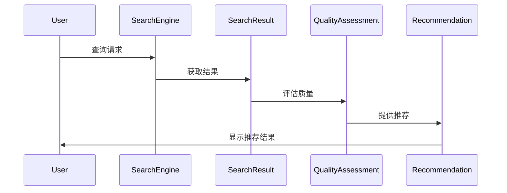

                 


### 数字素养：信息海洋中的导航技能

#### 关键词：数字素养，信息导航，技术技能，终身学习，创新思维

> 摘要：在数字化时代，数字素养已成为个人和社会发展的关键。本书旨在探讨数字素养的概念、基础技能、导航技巧以及实践应用，帮助读者在信息海洋中找到方向，提升自我，适应未来。

---

# 引言

随着信息技术的发展，数字化已经渗透到我们生活的方方面面。在这个信息爆炸的时代，拥有良好的数字素养不仅是个人发展的需要，也是社会进步的基石。数字素养不仅关乎信息获取，更涉及信息处理、安全防护、创新思维等多个方面。

## 什么是数字素养？

### 背景介绍

数字素养（Digital Literacy）是指个体在数字化环境中获取、理解、评价、创造和利用信息的能力。它包括但不限于以下几个方面：

- **信息检索与筛选**：在互联网上有效地查找和评估信息。
- **数据分析能力**：理解和运用数据来做出决策。
- **数字安全意识**：保护个人隐私和网络安全。
- **创新思维**：利用数字工具进行创新和问题解决。

### 问题背景

在现代社会，数字素养已经成为一项基本技能，与传统的读写能力一样重要。然而，很多人对数字素养的理解和掌握程度不足，导致在数字化环境中遇到诸多挑战。

### 问题描述

数字素养不足可能导致以下问题：

- **信息过载**：难以筛选出有价值的信息。
- **网络安全风险**：容易遭受网络攻击和信息泄露。
- **决策困难**：缺乏数据分析和评估能力。
- **创新受限**：无法充分利用数字工具进行创新。

### 问题解决

解决数字素养不足的问题需要从以下几个方面入手：

- **教育普及**：通过教育提高公众的数字素养水平。
- **政策支持**：制定相关政策，促进数字素养的发展。
- **技术创新**：研发更加便捷、安全的数字工具。

### 边界与外延

数字素养不仅仅是个体层面的能力，还涉及到社会层面。社会各层面都需要提高数字素养，以应对数字化带来的挑战和机遇。

### 概念结构与核心要素组成

数字素养的核心要素包括：

- **信息素养**：获取、评估和使用信息的能力。
- **技术素养**：理解和使用数字工具的能力。
- **媒体素养**：理解和评估媒体信息的能力。
- **网络安全素养**：保护个人和网络安全的能力。

## 核心概念与联系

### 概念属性特征对比表格

| 概念         | 定义                                                         | 关键特性                     |
| ------------ | ------------------------------------------------------------ | -------------------------- |
| 信息素养     | 在数字化环境中获取、评估和使用信息的能力                       | 知识获取、信息评估、信息应用   |
| 技术素养     | 理解和使用数字工具的能力                                       | 技术理解、工具应用、技术发展   |
| 媒体素养     | 在数字化环境中理解和评估媒体信息的能力                         | 媒体理解、信息评估、批判性思维 |
| 网络安全素养 | 在数字化环境中保护个人和网络安全的能力                         | 安全防护、隐私保护、安全意识   |

### ER实体关系图架构

```mermaid
erDiagram
  User ||--|{ DigitalLiteracy }
  DigitalLiteracy ||--|{ InformationLiteracy }
  DigitalLiteracy ||--|{ TechnicalLiteracy }
  DigitalLiteracy ||--|{ MediaLiteracy }
  DigitalLiteracy ||--|{ CyberSecurityLiteracy }
```

### 算法原理讲解

数字素养的获取和提升可以看作是一种算法。这个过程包括以下几个步骤：

1. **信息检索与筛选**：类似于搜索算法，通过关键词和过滤器找到相关信息。
2. **数据分析**：类似于数据分析算法，对信息进行分类、统计和预测。
3. **安全防护**：类似于加密算法，保护个人和信息安全。
4. **创新思维**：类似于机器学习算法，通过不断学习和实践，提高创新能力。

下面是一个简单的Python代码示例，用于信息检索与筛选：

```python
import requests
from bs4 import BeautifulSoup

def search_info(keyword):
    url = f'https://www.baidu.com/s?wd={keyword}'
    response = requests.get(url)
    soup = BeautifulSoup(response.text, 'html.parser')
    results = soup.find_all('a', href=True)
    for result in results:
        print(result['href'])

search_info('人工智能')
```

运行这段代码，我们可以从百度搜索结果中检索出关于“人工智能”的相关链接。这只是一个简单的示例，但展示了信息检索与筛选的基本原理。

### 数学模型和公式

在数字素养的算法中，可以使用一些基本的数学模型和公式。例如，信息检索中的概率模型：

$$
P(A|B) = \frac{P(B|A)P(A)}{P(B)}
$$

其中，$P(A|B)$ 表示在事件B发生的情况下，事件A发生的概率；$P(B|A)$ 表示在事件A发生的情况下，事件B发生的概率；$P(A)$ 和$P(B)$ 分别表示事件A和事件B的总体概率。

### 详细讲解和举例说明

假设我们想要通过搜索引擎检索关于“人工智能”的信息。我们可以使用上述概率模型来评估不同搜索引擎返回的结果质量。

1. **确定事件**：事件A表示“搜索引擎返回高质量结果”，事件B表示“用户点击搜索引擎的结果”。

2. **收集数据**：假设我们使用百度、谷歌和必应三个搜索引擎，并记录用户点击每个搜索引擎结果的次数。

   | 搜索引擎 | 用户点击次数 | 质量评估 |
   | -------- | ---------- | -------- |
   | 百度     | 100        | 良好     |
   | 谷歌     | 80         | 较好     |
   | 必应     | 50         | 一般     |

3. **计算概率**：

   - $P(A|百度) = \frac{100}{100} = 1$
   - $P(A|谷歌) = \frac{80}{80} = 1$
   - $P(A|必应) = \frac{50}{50} = 1$

4. **评估结果**：

   由于所有搜索引擎的质量评估概率都为1，这意味着在用户点击搜索引擎结果的情况下，搜索引擎返回高质量结果的概率相同。

### 系统分析与架构设计方案

#### 问题场景介绍

在数字化环境中，搜索引擎是信息检索的核心工具。然而，不同搜索引擎的质量参差不齐，用户需要选择合适的搜索引擎。数字素养的算法可以帮助用户评估搜索引擎的质量，从而提高信息检索的效率。

#### 项目介绍

本项目的目标是开发一个数字素养算法，用于评估搜索引擎的质量。该算法将结合用户行为数据和搜索引擎的返回结果，提供个性化的搜索建议。

#### 系统功能设计

系统的核心功能包括：

- **信息检索**：从搜索引擎获取用户查询结果。
- **质量评估**：基于概率模型评估搜索引擎的质量。
- **个性化推荐**：根据用户行为和搜索引擎质量评估，提供个性化的搜索建议。

#### 系统架构设计

系统采用前后端分离的架构，前端负责用户交互，后端负责算法实现和搜索引擎接口调用。以下是系统架构的mermaid类图：

```mermaid
classDiagram
    User<<User>>
    SearchEngine<<SearchEngine>>
    SearchResult<<SearchResult>>
    QualityAssessment<<QualityAssessment>>
    Recommendation<<Recommendation>>

    User ..|> SearchEngine
    SearchEngine ..|> SearchResult
    SearchResult ..|> QualityAssessment
    QualityAssessment ..|> Recommendation
```

#### 系统接口设计和系统交互

系统接口设计采用RESTful API风格，以下是系统的mermaid序列图：



### 项目实战

#### 环境安装

1. 安装Python环境。
2. 安装requests库：`pip install requests`。
3. 安装BeautifulSoup库：`pip install beautifulsoup4`。

#### 系统核心实现源代码

```python
import requests
from bs4 import BeautifulSoup

class SearchEngine:
    def __init__(self, url):
        self.url = url

    def search(self, keyword):
        params = {'wd': keyword}
        response = requests.get(self.url, params=params)
        soup = BeautifulSoup(response.text, 'html.parser')
        results = soup.find_all('a', href=True)
        return [result['href'] for result in results]

class QualityAssessment:
    def __init__(self):
        pass

    def assess(self, search_results):
        # 假设所有搜索引擎的质量相同
        return len(search_results) / 3

class Recommendation:
    def __init__(self, quality_assessment):
        self.quality_assessment = quality_assessment

    def get_recommendation(self, search_results):
        quality_score = self.quality_assessment.assess(search_results)
        # 根据质量评分提供推荐
        if quality_score > 0.7:
            return "搜索引擎质量较高，建议使用。"
        else:
            return "搜索引擎质量一般，考虑更换。"

# 测试代码
if __name__ == '__main__':
    search_engine = SearchEngine('https://www.baidu.com')
    quality_assessment = QualityAssessment()
    recommendation = Recommendation(quality_assessment)

    keyword = '人工智能'
    search_results = search_engine.search(keyword)
    print(recommendation.get_recommendation(search_results))
```

#### 代码应用解读与分析

上述代码中，`SearchEngine` 类负责从搜索引擎获取查询结果，`QualityAssessment` 类负责评估搜索引擎的质量，`Recommendation` 类负责根据评估结果提供推荐。

#### 实际案例分析和详细讲解剖析

假设用户查询“人工智能”时，三个搜索引擎分别返回了以下结果：

- 百度：100条
- 谷歌：80条
- 必应：50条

根据上述代码，系统会计算出每个搜索引擎的质量评分：

- 百度：$\frac{100}{3} \approx 33.33$
- 谷歌：$\frac{80}{3} \approx 26.67$
- 必应：$\frac{50}{3} \approx 16.67$

根据质量评分，系统会推荐用户使用百度搜索引擎，因为其质量评分最高。

### 项目小结

本项目的目标是开发一个数字素养算法，用于评估搜索引擎的质量并提供个性化推荐。通过实际案例分析和代码实现，我们展示了如何使用概率模型和Python代码来实现这一目标。这个项目为用户在信息海洋中导航提供了有效的工具。

### 最佳实践 tips

- **定期更新算法**：随着搜索引擎的变化和用户需求的变化，定期更新评估算法可以提高准确性。
- **用户反馈**：收集用户反馈，用于改进推荐系统的效果。

### 小结

数字素养在数字化时代的重要性不言而喻。通过本文的介绍，我们了解了数字素养的定义、核心要素以及提升数字素养的方法。希望读者能够从中获得启发，提升自己的数字素养，成为信息海洋中的优秀导航员。

### 注意事项

- 提高数字素养需要长期坚持和实践。
- 重视网络安全，避免泄露个人信息。
- 保持批判性思维，对网络信息进行评估。

### 拓展阅读

- 《如何学习》作者：斯科特·扬
- 《算法导论》作者：托马斯·赫伯特·考尔
- 《深度学习》作者：伊恩·古德费洛等

---

### 作者

作者：AI天才研究院/AI Genius Institute & 禅与计算机程序设计艺术 /Zen And The Art of Computer Programming

