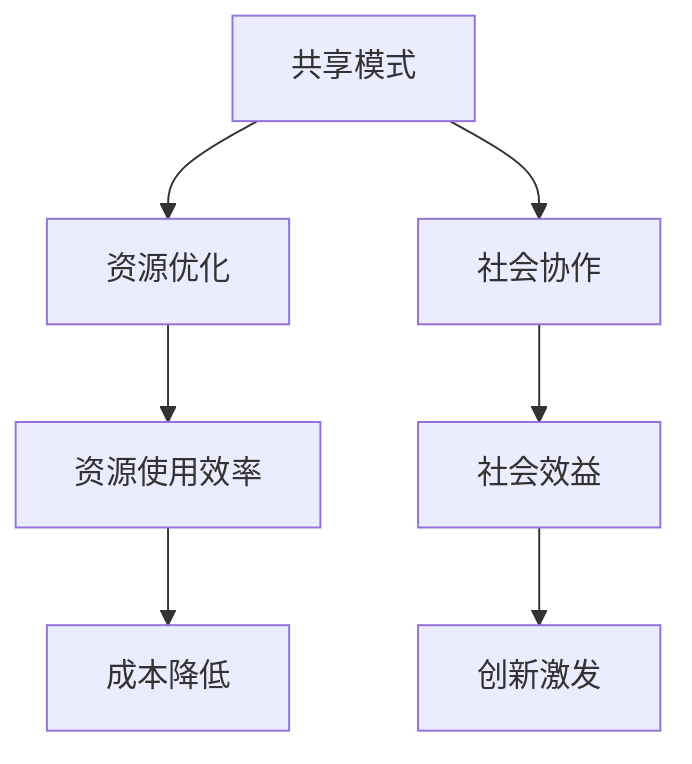
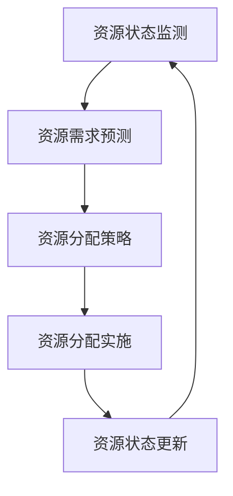

                 

# 数字经济中的共享模式：资源优化与社会协作

> 关键词：数字经济，共享模式，资源优化，社会协作，算法原理

> 摘要：本文深入探讨了数字经济背景下的共享模式，解析了共享模式的概念、类型及其在资源优化和社会协作中的关键作用。通过详细分析资源分配算法和社会协作算法的原理，本文为理解和应用这些算法提供了清晰的思路。最后，本文总结了最佳实践，并对未来共享模式的发展趋势进行了展望。

## 第一步：书名概括与背景介绍

### 1.1 书名解析
《数字经济中的共享模式：资源优化与社会协作》

数字经济是信息时代的一种经济形式，以互联网、大数据、人工智能等数字技术为核心驱动力。其特点是信息流通快、交易成本低、资源配置效率高。共享模式作为数字经济的重要组成部分，通过资源共享、协同合作等方式，实现资源优化和社会协作。

### 1.1.1 数字经济概述
数字经济（Digital Economy）是指以数字化的信息和知识为关键生产要素、以现代信息网络为重要载体、以信息通信技术的有效利用为驱动的新型经济形态。其主要特点如下：

1. **信息流通快**：数字技术使得信息传输速度大幅提高，数据可以在瞬间传播到全球各个角落。
2. **交易成本低**：数字技术的应用降低了交易的成本，包括时间成本和金钱成本。
3. **资源配置效率高**：通过数据分析和人工智能等技术，可以更精确地预测市场需求，优化资源配置。

### 1.1.2 共享模式在数字经济中的重要性
共享模式（Sharing Model）是指多个主体共同使用资源，实现资源的最优配置和最大化利用的一种经济模式。在数字经济中，共享模式具有以下重要性：

1. **促进资源优化**：通过共享模式，可以减少资源的闲置和浪费，提高资源使用效率。
2. **提高社会协作效率**：共享模式鼓励不同个体和组织之间的协作，共同实现目标。

### 1.1.3 资源优化与社会协作的意义
资源优化（Resource Optimization）指的是通过共享模式提高资源使用效率，降低浪费；社会协作（Social Collaboration）则强调通过数字技术实现人与人之间的协作效率，促进社会整体效益的提升。二者相辅相成，共同推动数字经济的发展。

1. **资源优化**：资源优化有助于降低成本、提高生产效率，从而提升企业的竞争力。
2. **社会协作**：社会协作可以激发创新、提高效率，有助于社会的整体发展。

### 1.1.4 书的内容概览
本书将从共享模式的概念出发，详细探讨数字经济中共享模式的多种类型及其应用场景，分析其带来的资源优化和社会协作效应，最后讨论未来共享模式的发展趋势。具体章节如下：

1. **共享模式概述**：介绍共享模式的基本概念、类型和特征。
2. **资源优化算法**：详细讲解资源分配算法的原理和应用。
3. **社会协作算法**：分析社会协作算法的设计和实现。
4. **共享模式案例分析**：通过实际案例，探讨共享模式在不同场景中的应用。
5. **未来共享模式发展趋势**：展望未来共享模式的发展方向。

## 第二步：核心概念与联系

### 2.1 共享模式的核心概念
#### 2.1.1 共享模式的定义
共享模式是指多个主体共同使用资源，实现资源的最优配置和最大化利用的一种经济模式。它基于互联网和数字技术的支持，通过资源共享、协同合作等方式，实现资源的高效利用。

#### 2.1.2 共享模式的类型
共享模式主要分为以下几种类型：

1. **物理共享**
   - **租赁**：如共享单车、共享汽车。
   - **租赁+服务**：如共享办公空间、共享酒店。

2. **数字共享**
   - **信息共享**：如社交媒体、电子商务。
   - **计算资源共享**：如云计算、边缘计算。

#### 2.1.3 社会协作的概念
社会协作是指通过共享模式，实现个体之间的合作，以实现共同目标。它强调多方参与、互利性和协同性。

#### 2.1.4 资源优化与社会协作的联系
资源优化与社会协作是共享模式的核心目标。资源优化是实现共享模式的基础，社会协作则是推动共享模式持续发展的重要力量。二者相辅相成，共同促进数字经济的发展。

### 2.2 概念属性特征对比表格
| 特征                | 共享模式       | 社会协作       |
|-------------------|--------------|--------------|
| 定义                | 资源共同使用    | 多主体合作     |
| 目标                | 资源优化       | 社会效益提升    |
| 形式                | 物理或数字资源   | 人与人之间的合作 |
| 关系                | 多方参与       | 个体协同       |

### 2.3 ER实体关系图

## 第三步：算法原理讲解

### 3.1 共享模式优化的算法原理

#### 3.1.1 算法概述
共享模式优化的核心算法是资源分配算法。它旨在通过合理的资源分配策略，实现资源的最优利用。

##### 3.1.1.1 资源分配算法的定义
资源分配算法是一种通过计算优化资源分配策略的算法。

##### 3.1.1.2 资源分配算法的目标
资源分配算法的目标是最大化资源利用率，最小化资源浪费。

#### 3.1.2 算法原理

##### 3.1.2.1 资源状态监测
资源状态监测是资源分配算法的基础。它通过实时监测资源的利用率，为资源分配提供依据。

##### 3.1.2.2 资源需求预测
资源需求预测是资源分配算法的关键。它通过历史数据分析和算法模型预测未来资源的需求。

##### 3.1.2.3 资源分配策略
资源分配策略是基于资源状态监测和需求预测的结果，制定资源分配的具体方案。

#### 3.1.3 算法流程

### 3.2 社会协作算法原理

#### 3.2.1 算法概述
社会协作算法是支持个体之间协作的算法。它通过优化个体之间的协作关系，提高整体效率。

##### 3.2.1.1 社会协作算法的定义
社会协作算法是一种通过计算优化个体协作关系的算法。

##### 3.2.1.2 社会协作算法的目标
社会协作算法的目标是最大化协作效率，最小化协作成本。

#### 3.2.2 算法原理

##### 3.2.2.1 协作关系监测
协作关系监测是

