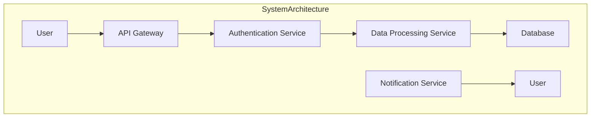
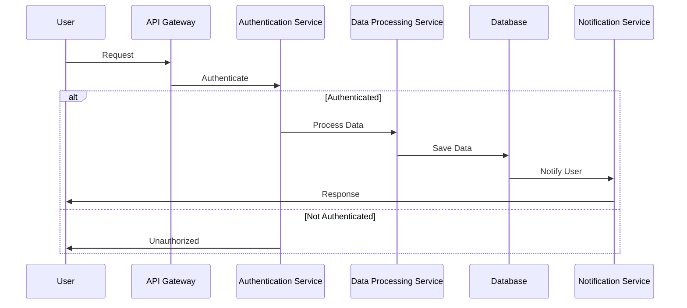

                 


## 引言：数字经济中的创新生态系统

在数字经济快速发展的时代，创新生态系统的构建已经成为推动经济增长和社会进步的关键因素。本文旨在深入探讨数字经济中的创新生态系统，特别是在创业孵化与产学研合作方面的作用。通过系统地分析创新生态系统的核心概念、创业孵化的理论与实践操作，以及产学研合作在其中的关键作用，本文希望为读者提供一套全面而深入的理解框架，并探讨未来的发展趋势。

### 文章结构概述

本文结构如下：

1. **背景与概念**：介绍数字经济的崛起和创新生态系统的形成。
2. **创业孵化的理论与实践**：详细阐述创业孵化的概念、实践操作以及案例研究。
3. **产学研合作在创新生态系统中的作用**：探讨产学研合作的概念、模式及其在创新生态系统中的实现。
4. **创新生态系统的未来发展**：分析创新生态系统的趋势与挑战，展望未来发展方向。

### 背景介绍

**数字经济概述**

数字经济是指以数字化的信息和知识为关键生产要素、以现代信息网络为重要载体、以信息通信技术的有效利用为驱动的新型经济形态。其核心在于通过信息技术，实现资源的高效配置和业务流程的优化。

**创新生态系统的定义与重要性**

创新生态系统是一个由多个利益相关者组成的复杂网络，包括企业、研究机构、政府、投资者等，通过知识共享、资源整合、合作创新，共同推动创新活动的发生和发展。创新生态系统的重要性在于它能够促进技术创新、组织创新和市场创新，从而推动经济增长和社会进步。

**创业孵化的作用与意义**

创业孵化是指通过提供空间、资金、技术、市场等资源，帮助初创企业成长的过程。创业孵化在创新生态系统中起着桥梁和纽带的作用，它能够发现和培养创新项目，推动科技成果转化为实际生产力。

### 核心概念与联系

**企业家精神与创新**

企业家精神是创新生态系统的核心驱动力，它包括冒险精神、机会识别能力、创新思维和市场洞察力。企业家精神能够激发创新，推动新技术的商业应用。

**产学研合作的模式与优势**

产学研合作是指企业、高校和研究机构之间的合作，通过资源整合、优势互补，共同推进技术创新和产业发展。产学研合作的模式包括合作研发、技术转移、人才培养等，其优势在于能够缩短科研成果转化时间，提高创新效率。

**创新生态系统的核心要素与关系**

创新生态系统的核心要素包括技术、人才、资本、市场和政策。这些要素之间相互关联，形成一个有机整体。使用Mermaid ER图可以清晰地展示这些要素之间的关系。

```mermaid
erDiagram
  Class1 ||--|{ Class2 } : dependent
  Class1 ||--|{ Class3 } : dependent
  Class2 &&|> Class3 : associated
```

通过上述ER图，可以直观地看到技术、人才、资本、市场和政策等要素如何相互作用，共同推动创新生态系统的运行。

### 文章摘要

本文系统地分析了数字经济中的创新生态系统，特别是创业孵化和产学研合作在其中的作用。通过介绍核心概念、详细阐述理论与实践操作，以及探讨未来发展，本文为读者提供了一套全面而深入的理解框架，有助于把握创新生态系统的关键要素和运行机制，为推动数字经济的发展提供参考。

接下来，我们将进一步探讨创新生态系统的构成要素，深入理解其核心概念与联系，以及创业孵化的理论基础与实践操作。希望通过这样的逐步分析，读者能够更好地理解数字经济中的创新生态系统，并为其未来发展提供有力的支持。## 第1章: 数字经济的崛起与创新生态系统的形成

### 1.1.1 数字经济概述

数字经济（Digital Economy）是一种以数字化信息和知识为关键生产要素、以现代信息网络为重要载体、以信息通信技术的有效利用为驱动的新型经济形态。它不同于传统的农业经济和工业经济，具有虚拟性、全球性、高度依赖信息技术等特征。数字经济的崛起可以追溯到20世纪末互联网的普及和移动通信技术的发展，特别是在移动互联网、大数据、云计算、人工智能等新一代信息技术的推动下，数字经济在全球范围内迅速扩张。

**关键概念术语说明：**

- **数字化信息**：以二进制形式存储、处理、传输的数据和知识。
- **信息网络**：包括互联网、物联网、电信网络等，通过这些网络实现信息的高效传输和共享。
- **信息技术**：包括计算机技术、网络技术、数据库技术、人工智能技术等，用于获取、存储、处理和传递信息。

**问题背景：**

随着全球化和信息技术的快速发展，数字经济已经成为全球经济发展的新引擎。许多国家纷纷制定数字经济战略，以推动经济增长和社会进步。例如，中国提出的“新基建”战略，美国的“数字优先”政策，都旨在通过发展数字经济来提升国家竞争力。数字经济不仅改变了传统产业的生产和运营方式，还催生了大量新兴行业，如电子商务、在线教育、远程医疗等，为全球经济注入了新的活力。

**问题描述：**

数字经济的快速发展带来了诸多挑战和机遇。一方面，数字经济带来了更高的生产效率、更广阔的市场机会和更多的创新空间；另一方面，也引发了一系列新问题，如数据安全、隐私保护、劳动力转型等。为了应对这些挑战，构建一个高效、可持续的创新生态系统成为关键。

**问题解决：**

创新生态系统是数字经济中的核心组成部分，它通过整合资源、促进知识共享和合作创新，推动数字经济的发展。创新生态系统包括多个利益相关者，如企业、研究机构、政府、投资者等，它们通过互动和合作，共同推动技术创新、组织创新和市场创新。

**边界与外延：**

数字经济的边界主要涉及信息技术、电子商务、数字媒体、远程教育、在线娱乐等领域。其外延则包括物联网、区块链、人工智能等新兴技术，以及这些技术在各行业中的应用。例如，物联网技术可以广泛应用于智能制造、智能交通、智能城市等领域，而区块链技术则在金融、供应链管理等领域有广泛的应用前景。

**概念结构与核心要素组成：**

数字经济中的创新生态系统由以下几个核心要素组成：

1. **技术创新**：通过研发和应用新技术，推动产品和服务的创新。
2. **组织创新**：通过优化组织结构和管理模式，提高创新效率。
3. **市场创新**：通过开拓新市场、创造新需求，推动商业模式创新。
4. **管理创新**：通过创新的管理理念和方法，提高企业创新能力和市场竞争力。

这些核心要素相互关联、相互作用，共同构建了一个动态的、可持续的创新生态系统。通过构建这样的生态系统，可以更好地应对数字经济的挑战，把握发展机遇。

### 1.1.2 创新生态系统的定义与重要性

创新生态系统（Innovation Ecosystem）是一个由多个利益相关者组成的复杂网络，包括企业、研究机构、政府、投资者等，通过知识共享、资源整合、合作创新，共同推动创新活动的发生和发展。它强调的是不同主体之间的协同作用，通过建立紧密的互动关系，实现创新资源的高效配置和协同创新。

**关键概念术语说明：**

- **利益相关者**：指在创新生态系统中扮演不同角色、对创新活动有直接或间接影响的人或组织。
- **知识共享**：指不同主体之间通过交流、合作和共享知识，促进创新活动的发生和发展。
- **资源整合**：指通过协调和整合不同主体的资源，如资金、技术、人才等，实现资源的优化配置。
- **合作创新**：指多个主体通过合作，共同承担创新风险，共享创新收益。

**问题背景：**

随着全球化和信息技术的快速发展，创新已经成为驱动经济增长和社会进步的关键因素。传统的单一创新模式已经无法满足快速变化的市场需求，构建一个多主体、多层次、跨领域的创新生态系统成为必然选择。创新生态系统能够汇聚各种创新资源，形成创新合力，提高创新效率。

**问题描述：**

创新生态系统的重要性体现在以下几个方面：

1. **提高创新效率**：通过多主体的协同创新，可以迅速整合各种资源，缩短创新周期，提高创新成功率。
2. **促进知识共享**：创新生态系统提供了知识共享的平台，使不同主体能够交流、合作和共享知识，促进创新思维的碰撞和融合。
3. **增强创新能力**：通过资源整合和合作创新，可以增强企业的创新能力，提升市场竞争力。
4. **推动产业升级**：创新生态系统能够带动传统产业的升级和新兴产业的成长，促进经济结构的优化。

**问题解决：**

构建创新生态系统需要以下几方面的措施：

1. **政策支持**：政府应制定有利于创新生态发展的政策，如税收优惠、研发补贴、知识产权保护等，为创新生态系统的建立提供良好的外部环境。
2. **基础设施建设**：建设创新基础设施，如科技园区、孵化器、研发中心等，为创新活动提供物理空间和技术支持。
3. **资源整合**：通过搭建平台，促进企业、研究机构、政府等之间的资源整合和合作，实现优势互补。
4. **人才培养**：培养具有创新精神和实践能力的人才，为创新生态系统提供持续的动力。

**边界与外延：**

创新生态系统的边界主要涉及技术创新、组织创新、市场创新和管理创新等领域。其外延则包括各种创新平台、创新网络和创新组织，以及这些平台、网络和组织之间的互动和合作。例如，创新生态系统可以涵盖科技园区、孵化器、加速器、创新中心等，以及这些实体之间的互动关系。

**概念结构与核心要素组成：**

创新生态系统的核心要素包括：

1. **企业**：作为创新生态系统的主要参与者，企业通过研发、生产和市场活动推动技术创新和产业发展。
2. **研究机构**：提供知识和技术支持，通过基础研究和应用研究推动科技创新。
3. **政府**：通过政策支持、基础设施建设等手段，为创新生态系统提供良好的发展环境。
4. **投资者**：提供资金支持，促进创新项目的实施和商业化。
5. **人才**：作为创新活动的核心要素，人才是创新生态系统中最宝贵的资源。

这些核心要素相互作用，共同构建了一个动态的、可持续的创新生态系统。通过这个生态系统，各种创新资源得以高效配置，创新活动得以顺利进行，从而推动数字经济的发展。

### 1.1.3 创业孵化的作用与意义

创业孵化（Entrepreneurship Incubation）是指通过提供空间、资金、技术、市场等资源，帮助初创企业成长的过程。创业孵化在创新生态系统中起着桥梁和纽带的作用，它能够发现和培养创新项目，推动科技成果转化为实际生产力。

**关键概念术语说明：**

- **初创企业**：指处于创业初期，尚未实现稳定盈利的企业。
- **孵化器**：提供创业孵化服务的机构，通常包括物理空间、技术服务、管理咨询、融资渠道等资源。
- **加速器**：类似于孵化器，但更加注重帮助初创企业快速成长，通常提供更长时间的支持和更丰富的资源。

**问题背景：**

在全球科技创新浪潮的推动下，创业孵化成为促进创新和创业的重要手段。许多国家和地区纷纷建立创业孵化器，通过提供全方位的支持，帮助初创企业克服发展初期的困难，实现快速发展。

**问题描述：**

创业孵化的作用和意义主要体现在以下几个方面：

1. **降低创业风险**：通过提供资源和支持，创业孵化帮助初创企业减少创业失败的风险，提高创业成功率。
2. **加速创新过程**：创业孵化为初创企业提供了快速试错和迭代的环境，促进了创新速度和创新质量的提升。
3. **推动科技成果转化**：创业孵化将研究成果转化为实际产品或服务，缩短了科技成果转化的时间，提高了科技成果的应用价值。
4. **培养创业人才**：创业孵化通过实践锻炼，培养了一批具有创新精神和创业能力的人才，为创新生态系统的持续发展提供了人才支持。

**问题解决：**

为了充分发挥创业孵化在创新生态系统中的作用，需要采取以下措施：

1. **完善孵化器体系建设**：建设多元化的孵化器，提供不同类型的孵化服务，满足初创企业的多样化需求。
2. **优化孵化环境**：提供良好的政策环境、资金支持和市场渠道，为初创企业创造有利的发展条件。
3. **加强孵化器与企业、研究机构、政府等主体的合作**：通过多方合作，实现资源整合和优势互补，提高孵化效果。
4. **培育创业文化**：营造积极向上的创业氛围，鼓励创新和创业，激发创业者的热情和创造力。

**边界与外延：**

创业孵化的边界主要涉及初创企业的培养和发展，其外延则包括孵化器、加速器、创业园区等实体，以及这些实体之间的互动关系。创业孵化不仅局限于技术领域，还涵盖了农业、医疗、教育等各个行业。

**概念结构与核心要素组成：**

创业孵化的核心要素包括：

1. **物理空间**：提供办公场地、实验室等基础设施，为初创企业提供工作场所。
2. **技术服务**：提供技术支持、研发工具、专业服务等，帮助初创企业解决技术难题。
3. **管理咨询**：提供创业指导、战略规划、市场营销等咨询服务，帮助初创企业制定正确的商业策略。
4. **融资渠道**：帮助初创企业获得投资，提供资金支持，确保企业运营和发展。
5. **市场资源**：提供市场信息和渠道，帮助初创企业开拓市场，实现商业化。

这些核心要素相互关联、相互促进，共同构建了一个完整的创业孵化体系。通过这个体系，初创企业能够得到全方位的支持，快速成长，为创新生态系统的健康发展贡献力量。

### 1.1.4 数字经济背景下的创新生态系统特点

数字经济背景下的创新生态系统具有以下特点：

**1. 数字化特征明显：** 数字经济依赖信息技术，创新生态系统中的知识共享、资源整合、合作创新等活动主要通过数字化平台和工具进行，如云计算、大数据、物联网等。

**2. 快速迭代：** 数字技术发展迅速，创新速度加快。创新生态系统中的企业、研究机构等主体需要不断进行技术创新和产品迭代，以适应市场的快速变化。

**3. 网络化协作：** 创新生态系统中的主体通过网络进行紧密协作，形成跨领域、跨地区的创新网络。这种网络化协作有助于优化资源配置，提高创新效率。

**4. 高度依赖数据：** 数据是数字经济中的核心资源。创新生态系统中的企业、研究机构等需要大量的数据支持，通过数据分析来发现市场机会、优化产品和服务。

**5. 强调用户体验：** 在数字经济背景下，用户体验成为创新的重要驱动力。创新生态系统中的企业需要关注用户体验，不断改进产品和服务，以满足用户需求。

**6. 政策环境重要：** 政策环境对数字经济和创新生态系统的构建具有重要影响。政府通过制定有利于创新的政策，为创新生态系统的健康发展提供保障。

通过以上特点的分析，我们可以更深入地理解数字经济背景下的创新生态系统的运行机制和发展趋势。在接下来的章节中，我们将进一步探讨创业孵化的理论与实践操作，以及产学研合作在创新生态系统中的作用，为构建高效、可持续的创新生态系统提供有益的参考。

### 1.1.5 数字经济对传统产业创新的启示

数字经济的快速发展不仅改变了经济的运行模式，还对传统产业的创新产生了深远的影响。通过对数字经济和传统产业创新的关系进行分析，我们可以总结出以下几点启示：

**1. 技术驱动创新：** 数字经济以信息技术为核心，推动了大数据、人工智能、物联网等新技术的快速发展。这些技术不仅为传统产业提供了新的工具和手段，也催生了大量的新兴商业模式。传统产业在创新过程中应积极引入和利用这些新技术，提升创新能力。

**2. 网络化协作：** 数字经济背景下，网络化协作成为创新的重要方式。传统产业可以通过建立跨企业、跨地区、跨领域的合作网络，实现资源整合和优势互补，提高创新效率。例如，通过物联网技术实现产业链上下游企业的信息共享和协同生产，可以大幅提升生产效率和质量。

**3. 用户导向：** 数字经济强调用户体验，这为传统产业提供了创新的新方向。传统产业在创新过程中应关注用户需求，通过用户反馈不断优化产品和服务，提升用户满意度。例如，家电产业可以通过大数据分析用户使用习惯，设计出更加智能、个性化的产品。

**4. 数据驱动：** 数字经济依赖于海量数据的积累和分析，传统产业在创新过程中也应重视数据的收集和应用。通过数据分析，企业可以更好地了解市场趋势、用户需求，从而制定更加科学有效的创新策略。

**5. 生态合作：** 数字经济构建了多元化的创新生态系统，传统产业在创新过程中可以借鉴这一模式，通过生态合作实现资源整合和优势互补。例如，汽车产业可以通过与互联网公司合作，开发智能驾驶、车联网等创新产品，提升产业竞争力。

**6. 政策引导：** 政府在数字经济和传统产业创新中扮演着重要角色。通过制定有利于创新的政策，政府可以推动传统产业的数字化、网络化和智能化转型，促进产业创新。

**7. 人才培养：** 数字经济的快速发展对人才需求提出了新的要求。传统产业在创新过程中应重视人才培养，通过培训和教育，提高员工的技能和创新能力，为产业创新提供人才保障。

通过以上启示，传统产业可以在数字经济背景下找到创新的突破口，实现产业转型升级，提升竞争力。

### 结论

本章通过对数字经济的崛起和创新生态系统的形成进行了深入探讨，分析了数字经济对传统产业创新的启示。数字经济作为现代社会发展的新引擎，推动了创新生态系统的构建。创新生态系统通过整合资源、促进知识共享和合作创新，为数字经济的发展提供了强有力的支持。创业孵化作为创新生态系统的重要组成部分，通过提供全方位的支持，帮助初创企业克服发展初期的困难，实现快速发展。在接下来的章节中，我们将进一步探讨创业孵化的理论基础与实践操作，以及产学研合作在创新生态系统中的作用，为构建高效、可持续的创新生态系统提供更加深入的理解和实用的指导。

## 第2章: 创新生态系统中的核心概念与联系

### 2.1.1 企业家精神与创新

企业家精神是创新生态系统中的重要驱动力，它包括冒险精神、机会识别能力、创新思维和市场洞察力。企业家精神不仅推动着创新的产生，还影响着创新的质量和成功率。冒险精神使企业家敢于面对未知的风险和挑战，勇于尝试新的商业模式和技术应用。机会识别能力使企业家能够迅速发现市场变化和用户需求，捕捉创新机会。创新思维则促使企业家不断探索新的解决方案，打破传统束缚。市场洞察力使企业家能够准确把握市场趋势，制定有效的商业策略。

**企业家精神的特征对比表格：**

| 特征       | 冒险精神                   | 机会识别能力 | 创新思维                 | 市场洞察力              |
|------------|----------------------------|---------------|--------------------------|-------------------------|
| 描述       | 敢于承担风险，勇于创新     | 快速发现机遇  | 勇于打破常规，创新思维   | 精准把握市场趋势       |
| 对比       | 强调风险承受能力           | 强调敏锐洞察力 | 强调创新性和创造力       | 强调市场敏感度         |
| 关键词     | 冒险、创新、机遇           | 机遇、市场    | 创新思维、创造力         | 市场趋势、用户需求     |

**Mermaid ER图：**

```mermaid
erDiagram
  EntrepreneurialSpirit ||--|{ Innovation } : drives
  EntrepreneurialSpirit ||--|{ RiskTolerance } : characterizedBy
  EntrepreneurialSpirit ||--|{ OpportunityIdentification } : characterizedBy
  EntrepreneurialSpirit ||--|{ InnovativeThinking } : characterizedBy
  EntrepreneurialSpirit ||--|{ MarketInsight } : characterizedBy
```

通过这张ER图，我们可以清晰地看到企业家精神与创新之间以及各个特征之间的关系。

### 2.1.2 产学研合作的模式与优势

产学研合作（Industry-Academia-Research Collaboration）是指企业、高校和研究机构之间的合作，通过资源整合、优势互补，共同推进技术创新和产业发展。产学研合作的模式包括合作研发、技术转移、人才培养、共同创业等。

**合作研发模式：** 企业与高校或研究机构共同投入资源，进行技术研发和创新。这种模式可以充分利用高校或研究机构在基础研究和前沿技术方面的优势，同时结合企业的市场需求和商业化能力，实现技术创新。

**技术转移模式：** 高校和研究机构将研究成果转让给企业，帮助企业提升技术水平和创新能力。这种模式可以加速科技成果的转化，提高企业的市场竞争力。

**人才培养模式：** 高校和研究机构与企业合作，培养符合市场需求的专业人才。通过校企合作，学生可以提前接触到实际工作，增强实践能力，同时企业也可以提前培养潜在人才，降低招聘成本。

**共同创业模式：** 高校教师或研究人员与企业家合作，共同创办企业，将研究成果商业化。这种模式可以将科研创新与商业实践紧密结合，加速科技成果的转化。

**产学研合作的优势：**

1. **资源整合**：通过合作，企业、高校和研究机构可以整合各自的优势资源，如资金、技术、人才等，实现资源的最优配置。
2. **优势互补**：不同主体在技术、市场、管理等方面各有所长，通过合作可以实现优势互补，提高创新效率。
3. **缩短研发周期**：产学研合作可以充分发挥各方的协同效应，缩短研发周期，提高创新成功率。
4. **降低创新风险**：合作各方共同承担创新风险，降低单个企业的创新风险。
5. **提升创新能力**：通过合作，企业可以吸收高校和研究机构的前沿技术，提升自身的创新能力。

**Mermaid ER图：**

```mermaid
erDiagram
  Industry ||--|{ Academia } : collaboration
  Industry ||--|{ Research } : collaboration
  Academia &&|> Research : cooperation
  Industry &&|> Academia : knowledgeExchange
  Industry &&|> Research : knowledgeExchange
```

通过这张ER图，我们可以清晰地看到产学研合作中各个主体之间的互动和合作关系。

### 2.1.3 创新生态系统中的核心要素与关系

创新生态系统是由多个核心要素组成的复杂网络，这些核心要素相互关联、相互影响，共同推动创新活动的发生和发展。核心要素包括技术、人才、资本、市场和政策。

**技术：** 技术是创新生态系统的核心驱动力，包括基础研究、应用研究和技术开发等。技术创新能够推动产品和服务的创新，提升企业的竞争力。

**人才：** 人才是创新生态系统中最宝贵的资源，包括科研人员、工程师、市场营销人员等。高素质的人才能够推动技术研究和产品开发，是创新成功的关键。

**资本：** 资本是创新生态系统中的重要支撑，包括风险投资、政府补贴、银行贷款等。充足的资本能够支持企业的创新活动，加快技术的商业化进程。

**市场：** 市场是创新的最终目标，市场需求能够引导创新方向，推动产品创新和商业模式创新。有效的市场策略能够帮助企业实现商业成功。

**政策：** 政策是创新生态系统的重要保障，包括税收优惠、研发补贴、知识产权保护等。良好的政策环境能够激发创新活力，促进创新生态系统的健康发展。

**Mermaid ER图：**

```mermaid
erDiagram
  Technology ||--|{ Talent } : drives
  Technology ||--|{ Capital } : requires
  Technology ||--|{ Market } : responds
  Technology ||--|{ Policy } : influencedBy

  Talent &&|> Technology : essentialFor
  Capital &&|> Technology : essentialFor
  Market &&|> Technology : drives

  Technology &&|> Policy : shapedBy
  Policy &&|> Market : supports
  Policy &&|> Talent : supports
  Policy &&|> Capital : supports
```

通过这张ER图，我们可以清晰地看到创新生态系统中各个核心要素之间的关系和相互作用。

### 小结

本章通过分析企业家精神与创新、产学研合作的模式与优势，以及创新生态系统中的核心要素与关系，为读者提供了一个全面的视角，深入理解了创新生态系统的运作机制和关键要素。在接下来的章节中，我们将进一步探讨创业孵化的理论基础与实践操作，以及产学研合作在创新生态系统中的作用，为构建高效、可持续的创新生态系统提供实用的指导。

## 第3章: 创新生态系统的构成要素

### 3.1.1 技术创新

技术创新（Technological Innovation）是创新生态系统中的核心驱动力，它通过研发和应用新技术，推动产品和服务的创新，提升企业的竞争力。技术创新的类型包括渐进性创新、革命性创新和颠覆性创新。

**渐进性创新**：指在现有技术基础上进行改良和优化，以提升产品性能或降低成本。例如，手机从2G升级到4G，再到5G，每次升级都带来了更快的网络速度和更好的用户体验。

**革命性创新**：指引入全新技术，彻底改变现有产品或服务的形态和功能。例如，互联网的发明彻底改变了信息传播和商业模式的形态。

**颠覆性创新**：指新技术颠覆现有市场格局，创造新的市场需求和商业机会。例如，智能手机的普及颠覆了传统手机的产业格局，创造了庞大的移动应用市场。

**技术创新的重要性：**

1. **提高竞争力**：通过技术创新，企业可以推出具有竞争力的新产品和服务，满足市场需求，提升市场占有率。
2. **驱动产业升级**：技术创新可以推动传统产业的升级和新兴产业的成长，促进经济结构的优化。
3. **推动经济增长**：技术创新是经济增长的重要引擎，通过提升生产效率、降低生产成本，推动整体经济的增长。

**技术创新的实现路径：**

1. **研发投入**：企业应加大对研发的投入，建立研发中心或实验室，吸引高端人才，开展前沿技术研究。
2. **产学研合作**：通过产学研合作，企业可以与高校和研究机构共同研发新技术，实现资源的共享和优势互补。
3. **技术引进与消化吸收**：企业可以通过引进国外先进技术，并结合自身实际情况进行改进和吸收，提升技术水平。
4. **开放式创新**：企业可以通过开放式创新，吸引外部创意和资源，实现技术突破和产品创新。

**案例分析：**

以苹果公司为例，苹果公司在技术创新方面取得了巨大成功。从最初的Macintosh电脑，到后来的iPod、iPhone和iPad，苹果公司通过不断的渐进性创新和革命性创新，引领了多个产业的发展趋势。例如，iPhone的推出不仅彻底改变了智能手机市场，还带动了移动互联网和移动应用的快速发展。

### 3.1.2 组织创新

组织创新（Organizational Innovation）是指通过优化组织结构和管理模式，提高创新效率和竞争力。组织创新包括组织架构的调整、管理流程的优化、企业文化的建设等方面。

**组织创新的重要性：**

1. **提高创新效率**：通过优化组织结构和管理模式，可以减少内部摩擦，提高决策效率，加快创新速度。
2. **促进知识共享**：组织创新可以建立良好的知识共享平台，促进员工之间的交流和学习，提高整体创新能力。
3. **激发员工创造力**：良好的组织文化和激励机制可以激发员工的创新热情，提高员工的参与度和创造力。

**组织创新的方法：**

1. **扁平化管理**：通过减少管理层级，缩短决策链条，提高管理效率，促进创新。
2. **项目管理**：建立项目管理机制，明确项目目标、责任和进度，提高项目管理的效率和质量。
3. **激励机制**：建立创新激励机制，如奖励制度、股权激励等，激发员工的创新动力。
4. **企业文化**：建设积极向上的企业文化，鼓励员工敢于尝试、勇于创新，营造良好的创新氛围。

**案例分析：**

以谷歌公司为例，谷歌通过扁平化管理、项目管理、激励机制和文化建设等多种手段，实现了组织创新的成功。谷歌采用了扁平化的组织结构，使员工可以直接与高层管理人员沟通，提高了决策效率。同时，谷歌的项目管理机制非常成熟，通过明确的项目目标和进度管理，确保了项目的顺利进行。此外，谷歌的激励机制和创新文化为员工提供了良好的创新环境，使得谷歌成为全球创新企业的典范。

### 3.1.3 市场创新

市场创新（Market Innovation）是指通过开拓新市场、创造新需求，推动商业模式创新。市场创新包括产品创新、服务创新和商业模式创新等方面。

**市场创新的重要性：**

1. **开拓新市场**：市场创新可以开拓新的市场机会，扩大企业的市场占有率，提高企业的竞争力。
2. **满足多样化需求**：通过市场创新，企业可以满足不同用户群体的多样化需求，提升用户满意度。
3. **推动产业升级**：市场创新可以推动传统产业的升级和新兴产业的成长，促进经济结构的优化。

**市场创新的方法：**

1. **产品创新**：通过研发新产品或改进现有产品，满足用户需求，提高市场竞争力。例如，特斯拉通过研发和推广电动汽车，改变了传统汽车市场的格局。
2. **服务创新**：通过提供新的服务模式或改进现有服务，提升用户体验，扩大市场份额。例如，共享经济模式通过提供便捷的共享服务，满足了用户对便捷生活的需求。
3. **商业模式创新**：通过改变商业运作模式，创造新的价值创造和分配方式。例如，阿里巴巴通过构建电子商务平台，改变了传统零售业的商业模式。

**案例分析：**

以阿里巴巴为例，阿里巴巴通过市场创新取得了巨大成功。阿里巴巴通过打造电子商务平台，改变了传统零售业的商业模式，使中小企业能够低成本、快速地进入电子商务市场。同时，阿里巴巴通过大数据和云计算技术，提供了一系列增值服务，如天猫、淘宝、支付宝等，满足了用户多样化的需求。阿里巴巴的市场创新不仅推动了自身的发展，还带动了整个电子商务产业的繁荣。

### 3.1.4 管理创新

管理创新（Management Innovation）是指通过引入新的管理理念和方法，提高企业管理效率和创新能力。管理创新包括管理模式创新、管理工具创新和管理文化创新等方面。

**管理创新的重要性：**

1. **提高管理效率**：通过引入新的管理理念和方法，可以优化管理流程，提高管理效率，降低管理成本。
2. **提升创新能力**：管理创新可以激发员工的创新意识和创造力，提升企业的整体创新能力。
3. **适应市场变化**：管理创新可以帮助企业更好地适应市场变化，提高市场竞争力。

**管理创新的方法：**

1. **管理模式创新**：通过引入新的管理模式，如敏捷管理、精益管理、绩效管理等，提高管理效率。例如，敏捷管理通过快速响应市场变化，提高产品迭代速度。
2. **管理工具创新**：通过引入新的管理工具，如ERP系统、CRM系统、大数据分析工具等，提高管理效率和决策水平。
3. **管理文化创新**：通过建设积极向上的管理文化，鼓励员工积极参与管理创新，提高员工的满意度和忠诚度。

**案例分析：**

以华为公司为例，华为通过管理创新取得了显著成效。华为采用了敏捷管理模式，通过快速响应市场需求，提高了产品迭代速度和市场响应能力。同时，华为引入了ERP系统和CRM系统，实现了供应链和客户管理的信息化，提高了管理效率和决策水平。此外，华为注重管理文化的建设，鼓励员工积极参与管理创新，形成了积极向上的创新氛围。

### 小结

本章通过对技术创新、组织创新、市场创新和管理创新的详细探讨，深入分析了创新生态系统的构成要素。技术创新是推动产品和服务的创新，提高企业竞争力的核心驱动力；组织创新通过优化组织结构和管理模式，提高创新效率和竞争力；市场创新通过开拓新市场和创造新需求，推动商业模式创新；管理创新通过引入新的管理理念和方法，提高企业管理效率和创新能力。这些创新要素相互作用，共同构建了一个动态的、可持续的创新生态系统，为数字经济的发展提供了强有力的支持。

## 第4章: 创业孵化的理论基础

### 4.1.1 创业孵化的概念与类型

创业孵化（Entrepreneurship Incubation）是指通过提供空间、资金、技术、市场等资源，帮助初创企业成长的过程。创业孵化的目标是帮助初创企业克服发展初期的困难，提高创业成功率，促进科技成果转化为实际生产力。创业孵化可以采取多种形式，主要包括孵化器、加速器和创业园区等。

**孵化器的定义与功能：**

孵化器是一种提供全方位创业支持的服务平台，通常包括以下几个核心功能：

1. **物理空间**：提供办公场地、实验室等基础设施，为初创企业提供工作场所。
2. **资金支持**：通过提供天使投资、风险投资等资金支持，帮助初创企业解决资金问题。
3. **技术支持**：提供技术研发、技术咨询等服务，帮助初创企业解决技术难题。
4. **市场资源**：提供市场信息和渠道，帮助初创企业开拓市场。
5. **管理咨询**：提供创业指导、战略规划、市场营销等咨询服务，帮助初创企业制定正确的商业策略。

**加速器的定义与功能：**

加速器是一种专门为初创企业快速成长提供支持的平台，通常包括以下几个核心功能：

1. **短期聚焦**：加速器通常为初创企业提供6个月到1年的集中支持，帮助企业在短时间内实现快速增长。
2. **资金支持**：加速器通过提供种子资金、天使投资等，帮助初创企业解决资金问题。
3. **资源整合**：加速器通过搭建平台，整合各种资源，如投资、市场、技术等，为初创企业提供全方位的支持。
4. **导师指导**：加速器通常配备经验丰富的创业导师，为初创企业提供战略指导和管理咨询。

**创业园区的定义与功能：**

创业园区是一种综合性创业基地，通常包括多个孵化器和加速器，提供全面的创业支持和服务。创业园区的功能包括：

1. **孵化与加速**：提供孵化器和加速器的服务，帮助初创企业成长。
2. **公共服务**：提供知识产权、法律咨询、人力资源等公共服务，为初创企业提供便捷的支持。
3. **资源共享**：通过建立共享实验室、共享会议室等，为初创企业提供资源共享的平台。
4. **政策支持**：提供税收优惠、研发补贴等政策支持，为初创企业提供良好的发展环境。

### 4.1.2 创业孵化的理论基础与演变

创业孵化的理论基础源于创业学和创新创业理论，其核心思想是通过提供资源和支持，帮助初创企业实现快速成长。以下是对创业孵化理论基础和演变的详细探讨：

**创业学理论基础：**

创业学是一门研究创业现象、创业过程和创业者行为的学科。创业学的核心理论包括创业动机、创业机会识别、创业团队建设、创业资源获取等。创业学理论为创业孵化提供了理论指导，帮助孵化器更好地理解初创企业的需求和成长路径。

**创新创业理论：**

创新创业理论关注如何通过创新和创业活动推动经济增长和社会进步。该理论强调创新是经济增长的重要驱动力，创业是创新的有效途径。创新创业理论为创业孵化提供了指导，帮助孵化器通过资源整合和合作创新，推动初创企业的成长。

**创业孵化的演变历程：**

1. **早期孵化器阶段（1980年代）：** 孵化器最初起源于美国，以提供办公空间和基本服务为主，帮助初创企业解决物理空间问题。
2. **多元化服务阶段（1990年代）：** 随着时间的推移，孵化器开始提供更多的服务，如资金支持、技术研发、市场资源等，帮助初创企业解决更多的问题。
3. **综合孵化阶段（2000年代至今）：** 现代孵化器不仅提供多样化的服务，还通过构建生态圈，整合各类资源，为初创企业提供全方位的支持。同时，孵化器的目标也从单一的初创企业支持，转向产业链的全面整合和区域经济的发展。

**创业孵化理论的演变趋势：**

1. **生态化发展**：孵化器正逐渐从单一服务向生态化发展，通过构建多元化的生态圈，实现资源的高效配置和协同创新。
2. **数字化转型**：随着信息技术的快速发展，孵化器正在通过数字化转型，提供更加智能化、高效化的服务。
3. **国际化合作**：全球化背景下，孵化器正通过国际合作，吸引全球创新资源和人才，推动全球创新合作。

### 4.1.3 创业孵化成功的因素分析

创业孵化成功的因素是多方面的，以下是对主要成功因素的详细分析：

**1. 优秀的团队：** 优秀的创业团队是创业孵化成功的关键。一个优秀的团队需要有清晰的愿景、强烈的创业动机、丰富的行业经验和高水平的技能。

**2. 独特的产品或服务：** 创业孵化成功的另一个关键因素是初创企业拥有独特的产品或服务，能够满足市场需求，解决用户痛点。

**3. 有效的商业模式：** 有效的商业模式可以帮助初创企业实现盈利，确保企业的可持续发展。一个成功的商业模式应该清晰、可行，并能适应市场的变化。

**4. 充足的资本：** 充足的资本是创业孵化成功的重要保障。初创企业需要充足的资金来支持研发、生产和市场推广。

**5. 优质的支持服务：** 创业孵化器提供的优质服务，如技术研发、市场咨询、资金支持等，可以大幅提升初创企业的成功概率。

**6. 政策支持：** 政府的优惠政策和支持措施可以大幅降低初创企业的运营成本，提高创业成功率。

**7. 良好的市场环境：** 良好的市场环境，包括市场需求、政策环境、竞争格局等，有助于初创企业快速成长。

**8. 优秀的企业文化：** 优秀的企业文化可以激发员工的创新精神和团队协作，提高企业的整体竞争力。

**案例分析：**

以美国硅谷的Y Combinator为例，Y Combinator是全球最成功的创业孵化器之一。其成功的关键因素包括：

1. **优秀的团队**：Y Combinator由两位经验丰富的创业者创建，他们拥有丰富的创业经验和深厚的行业背景。
2. **独特的项目**：Y Combinator筛选出具有巨大市场潜力的初创项目，为这些项目提供全方位的支持。
3. **有效的商业模式**：Y Combinator孵化的初创企业往往具有清晰、可行的商业模式，能够快速实现盈利。
4. **充足的资本**：Y Combinator通过提供种子资金和风险投资，为初创企业解决资金问题。
5. **优质的服务**：Y Combinator提供全方位的服务，包括导师指导、市场资源、技术研发等。
6. **政策支持**：美国政府对创业孵化提供了良好的政策环境，为初创企业的发展提供了有力支持。

通过以上案例分析，我们可以看到创业孵化成功的关键因素，以及如何通过这些因素推动初创企业的成长和发展。

### 小结

本章通过对创业孵化概念与类型的介绍，详细分析了创业孵化的理论基础和演变历程，以及创业孵化成功的因素。创业孵化作为一种重要的创新模式，通过提供资源和支持，帮助初创企业克服发展初期的困难，实现快速发展。在接下来的章节中，我们将进一步探讨创业孵化的实践操作，通过具体案例研究，深入理解创业孵化的实际效果和经验。

## 第5章: 创业孵化的实践操作

### 5.1.1 创业孵化器的角色与功能

创业孵化器在创新生态系统中扮演着至关重要的角色，它不仅是初创企业的摇篮，更是创新资源的聚集地。孵化器的角色与功能可以分为以下几个方面：

1. **资源提供者**：孵化器为初创企业提供包括资金、空间、技术、市场资源等在内的各种资源。通过这些资源的提供，孵化器帮助初创企业解决发展初期面临的种种难题。

2. **服务提供者**：孵化器通过提供创业指导、管理咨询、法律服务等专业服务，帮助初创企业制定发展战略，优化内部管理，提高运营效率。

3. **连接器**：孵化器充当连接初创企业与外部资源的桥梁，如投资机构、行业专家、合作伙伴等。通过这些连接，孵化器帮助初创企业获取更多的资源和机会。

4. **社区建设者**：孵化器通过组织各种活动，如讲座、沙龙、培训等，打造一个活跃的创业社区，促进创业者之间的交流和合作。

**创业孵化器的功能分类：**

1. **基础设施支持**：包括提供办公空间、实验室、会议设施等硬件支持。
2. **资金支持**：包括天使投资、风险投资、政府补贴等资金支持。
3. **技术支持**：包括技术研发、技术咨询、技术培训等。
4. **市场支持**：包括市场调研、营销支持、市场推广等。
5. **管理支持**：包括战略规划、人力资源、财务管理等咨询服务。
6. **资源对接**：包括投融资对接、产业对接、人才对接等。

### 5.1.2 创业孵化流程与关键环节

创业孵化是一个系统化的过程，通常包括以下几个关键环节：

1. **项目筛选**：孵化器通过严格的筛选机制，选择具有市场潜力、技术先进、团队优秀的初创项目进行孵化。筛选标准通常包括项目创新性、市场前景、团队能力等。

2. **项目立项**：筛选通过的初创项目进入孵化阶段，孵化器与项目团队共同制定详细的项目计划，明确项目目标、时间表、资源配置等。

3. **资源分配**：孵化器根据项目需求，提供相应的资源支持，如办公空间、资金、技术等。同时，孵化器还会协助项目团队进行资源整合，确保项目顺利推进。

4. **项目管理**：孵化器通过建立项目管理机制，监控项目进度，提供必要的管理指导和支持，确保项目按计划推进。

5. **风险控制**：孵化器在项目孵化过程中，注重风险控制，通过定期评估项目风险，及时调整项目策略，确保项目的可持续发展。

6. **项目退出**：项目孵化成功后，孵化器帮助项目团队进行退出规划，如项目融资、股权转让、上市等，确保项目的成功转型和可持续发展。

### 5.1.3 创业孵化器的运营模式与策略

创业孵化器的运营模式与策略多种多样，以下是一些常见的运营模式与策略：

1. **市场化运营模式**：孵化器通过市场化手段，提供有偿服务，如办公租赁、技术咨询、培训服务等，实现自负盈亏。这种模式强调市场化运作，注重盈利能力。

2. **政府主导模式**：政府主导的孵化器通常以公共资源为基础，提供公益性服务，如免费办公空间、政策咨询等。这种模式强调社会责任，注重公益性质。

3. **企业合作模式**：企业合作的孵化器通过与企业合作，获得资金、技术、市场等资源支持。这种模式强调资源整合，注重合作共赢。

4. **混合模式**：混合模式的孵化器结合市场化、政府主导和企业合作等多种模式，通过多元化的运营策略，实现可持续的发展。

**运营策略：**

1. **资源整合策略**：通过搭建平台，整合各类资源，如资金、技术、市场、人才等，为初创企业提供全方位的支持。

2. **品牌建设策略**：通过打造知名孵化器品牌，提升孵化器的知名度和影响力，吸引更多优质项目和创业者。

3. **服务创新策略**：不断创新服务模式，提供个性化、定制化的服务，满足初创企业的多样化需求。

4. **生态构建策略**：构建多元化的创业生态系统，促进各类创新主体之间的互动与合作，形成良性循环。

### 案例研究：创业孵化器的成功实践

**案例一：Y Combinator**

Y Combinator是全球最成功的创业孵化器之一，其成功经验包括：

1. **严格筛选机制**：Y Combinator通过严格的筛选机制，选择具有巨大市场潜力的初创项目进行孵化。
2. **资源整合**：Y Combinator通过整合投资机构、行业专家、合作伙伴等资源，为初创企业提供全方位的支持。
3. **导师制度**：Y Combinator为初创企业提供经验丰富的创业导师，指导项目团队制定发展战略和优化运营管理。

**案例二：硬科技孵化器**

硬科技孵化器通过聚焦高新技术产业，为初创企业提供以下支持：

1. **技术支持**：硬科技孵化器通过引入先进的研发设备和技术，帮助初创企业解决技术难题。
2. **市场推广**：硬科技孵化器通过组织展会、研讨会等活动，帮助初创企业推广产品，拓展市场。
3. **资本对接**：硬科技孵化器通过搭建资本对接平台，帮助初创企业吸引风险投资和政府补贴。

**案例三：清华启迪孵化器**

清华启迪孵化器依托清华大学的技术优势和人才资源，为初创企业提供以下支持：

1. **人才引进**：清华启迪孵化器通过引进清华大学的优秀毕业生和科研人员，为初创企业注入创新人才。
2. **技术研发**：清华启迪孵化器通过搭建研发平台，帮助初创企业进行技术研发和应用。
3. **产业对接**：清华启迪孵化器通过整合产业链上下游资源，为初创企业提供产业对接服务，促进科技成果转化。

### 小结

创业孵化器在创新生态系统中发挥着至关重要的作用，通过提供资源、服务和支持，帮助初创企业克服发展初期的困难，实现快速成长。在运营模式与策略方面，孵化器需要灵活应对市场变化，不断优化服务模式，构建多元化的创业生态系统。通过成功案例的实践，我们可以看到创业孵化器在不同领域和背景下，如何通过有效的运营策略，推动创新创业的蓬勃发展。

## 第6章: 创业孵化的案例研究

### 6.1.1 成功创业孵化的案例分析

创业孵化成功的关键在于有效的资源整合、创新模式的探索和团队的执行力。以下将分析几个成功的创业孵化案例，探讨其成功要素和关键经验。

**案例一：Uber**

Uber作为全球知名的共享出行平台，其成功的孵化过程主要包括以下几点：

1. **技术创新**：Uber通过引入移动互联网和实时定位技术，创新了出行服务的商业模式，提供了便捷、高效的出行解决方案。
2. **市场洞察**：Uber准确地抓住了城市化进程中人们对于便捷出行的需求，迅速占领市场，并在全球范围内快速扩张。
3. **资源整合**：Uber在孵化过程中，积极整合了全球顶尖的投资机构、技术和市场资源，为其提供了强有力的支持。
4. **团队执行力**：Uber的创始团队具备强大的执行力和创新能力，能够快速响应市场需求，不断优化产品和服务。

**案例二：Airbnb**

Airbnb作为共享住宿平台，其成功孵化经验包括：

1. **商业模式创新**：Airbnb通过搭建平台，将个人闲置房源转化为商业资源，为用户提供多样化的住宿选择。
2. **用户体验**：Airbnb注重用户体验，通过简洁明了的用户界面和优质的客户服务，赢得了大量用户的青睐。
3. **全球化战略**：Airbnb在孵化过程中，积极实施全球化战略，快速进入全球市场，实现了规模化增长。
4. **文化传承**：Airbnb在全球化过程中，尊重和传承不同文化的住宿体验，增强了品牌的吸引力。

**案例三：Slack**

Slack作为企业沟通工具，其成功孵化经验主要包括以下几点：

1. **市场定位**：Slack针对现代企业沟通的痛点，提供了一种简单、高效、个性化的沟通工具，迅速占领市场。
2. **用户体验**：Slack注重用户体验，提供了丰富的功能和灵活的定制化服务，满足了不同企业的需求。
3. **生态构建**：Slack构建了一个庞大的开发者生态，吸引了大量第三方应用和服务，为用户提供更多增值服务。
4. **国际化**：Slack在孵化过程中，积极推进国际化，在全球范围内建立了强大的市场影响力。

### 6.1.2 失败创业孵化的原因分析

尽管创业孵化成功案例众多，但也存在大量失败的创业孵化案例。以下分析几个失败创业孵化的原因：

**案例一：Color**

Color是一款试图通过智能手机摄像头捕捉用户日常生活的应用，但最终未能成功。其失败原因包括：

1. **产品定位不清**：Color在市场定位上模糊不清，未能明确目标用户群体和产品价值。
2. **用户体验不佳**：Color的应用界面复杂，操作不便，用户体验较差。
3. **市场竞争激烈**：在Instagram、Snapchat等强大的竞争对手面前，Color未能迅速占领市场。
4. **资金链断裂**：Color在融资过程中未能持续获得资金支持，导致资金链断裂。

**案例二：Kozmo**

Kozmo是一家提供快速送货服务的初创公司，但由于业务模式问题，最终失败。其失败原因包括：

1. **商业模式不稳健**：Kozmo的商业模式依赖于高成本的人力资源，未能实现规模效应。
2. **市场调研不足**：Kozmo在市场调研方面不足，未能准确预测市场需求和竞争态势。
3. **运营管理问题**：Kozmo在运营管理方面存在问题，如配送效率低、服务不稳定等。
4. **资金问题**：Kozmo在融资过程中面临困难，未能持续获得资金支持。

**案例三：Dipdive**

Dipdive是一款社交网络应用，但由于技术问题和管理问题，最终失败。其失败原因包括：

1. **技术瓶颈**：Dipdive在技术实现上遇到瓶颈，导致应用性能不佳，用户体验较差。
2. **团队管理问题**：Dipdive的团队在管理方面存在问题，如分工不明确、沟通不畅等。
3. **市场推广不足**：Dipdive在市场推广方面投入不足，未能迅速提升品牌知名度。
4. **资金问题**：Dipdive在融资过程中面临困难，导致资金链紧张。

### 6.1.3 创业孵化实践中的最佳经验与教训

通过对成功和失败的创业孵化案例进行分析，可以总结出以下最佳经验和教训：

**最佳经验：**

1. **明确市场定位**：初创企业在创业孵化过程中，需要明确市场定位，找准目标用户群体和产品价值。
2. **注重用户体验**：用户体验是决定产品成败的关键，初创企业应注重优化用户体验，提升用户满意度。
3. **资源整合**：创业孵化过程中，资源整合至关重要。初创企业应积极寻求各种资源支持，包括资金、技术、市场等。
4. **团队执行力**：初创企业团队执行力直接影响创业成功率，团队应具备强大的执行力和创新能力。
5. **持续创新**：在快速变化的市场环境中，初创企业需要持续创新，以适应市场变化，保持竞争力。

**教训：**

1. **避免盲目跟风**：初创企业在创业孵化过程中，应避免盲目跟风，要结合自身优势和市场需求，制定独特的发展战略。
2. **重视市场调研**：市场调研是创业孵化的重要环节，初创企业应充分了解市场需求和竞争态势，制定科学的商业计划。
3. **稳健的商业模式**：初创企业应确保商业模式的稳健性，避免依赖高风险的商业模式。
4. **管理团队**：初创企业应重视团队管理，确保团队分工明确、沟通顺畅，提升团队执行力。
5. **合理融资**：初创企业在创业孵化过程中，应合理规划融资计划，确保资金链的稳定性。

通过总结最佳经验和教训，初创企业可以更好地应对创业孵化过程中的挑战，提高创业成功率。

### 小结

本章通过对成功和失败的创业孵化案例进行深入分析，总结了创业孵化实践中的最佳经验和教训。成功的创业孵化需要明确市场定位、注重用户体验、资源整合、团队执行力和持续创新；而失败的创业孵化往往源于盲目跟风、市场调研不足、商业模式不稳健、团队管理问题和合理融资问题。通过学习这些经验与教训，初创企业可以更好地规划创业路径，提高创业成功率。

## 第7章: 产学研合作的概念与模式

### 7.1.1 产学研合作的基本概念

产学研合作（Industry-Academia-Research Collaboration）是指企业、高校和研究机构之间的合作，通过知识共享、资源整合、优势互补，共同推进技术创新和产业发展。这种合作模式强调不同主体之间的协同作用，以实现科技成果的转化和商业价值的最大化。

**产学研合作的核心概念：**

1. **企业**：作为技术创新的主体，企业具有市场导向和商业化能力，能够将科研成果转化为实际产品或服务。
2. **高校**：作为知识创新的重要基地，高校具备丰富的科研资源和人才储备，能够进行前沿技术研究和人才培养。
3. **研究机构**：包括国家级科研机构、重点实验室等，它们在特定领域具有领先的研究能力和技术储备。

**产学研合作的目标：**

1. **推动技术创新**：通过产学研合作，企业可以获得高校和研究机构的前沿研究成果，加快新技术、新产品的研发和应用。
2. **促进产业升级**：产学研合作有助于企业提升技术水平和创新能力，推动传统产业向高端化、智能化方向发展。
3. **培养人才**：产学研合作可以为高校和科研机构的学生和研究人员提供实践机会，培养具备实际操作能力的人才。
4. **提升竞争力**：通过合作，企业可以降低研发成本，提高市场竞争力，实现可持续发展。

**产学研合作的本质：**

产学研合作的本质在于通过跨领域、跨区域的资源整合和优势互补，实现创新资源的高效配置和协同创新。它不仅是一种技术创新模式，更是一种产业发展的新机制，对促进经济增长和社会进步具有重要意义。

### 7.1.2 产学研合作的模式与类型

产学研合作的具体模式多样，根据合作主体、合作目标和合作方式的不同，可以分为以下几种主要类型：

**1. 合作研发模式**

合作研发是指企业、高校和研究机构共同投入资源，进行技术研发和创新。这种模式通常包括以下步骤：

- **需求对接**：企业提出研发需求，高校和研究机构根据需求进行技术研究和开发。
- **资源共享**：合作各方共享实验室、设备、人才等资源，提高研发效率。
- **成果共享**：研发成果归合作各方共同所有，根据约定进行分配和利用。

**2. 技术转移模式**

技术转移是指高校和研究机构将研究成果转让给企业，帮助企业提升技术水平和创新能力。这种模式的主要形式包括：

- **技术转让**：高校和研究机构将知识产权转让给企业，企业进行商业化应用。
- **技术许可**：高校和研究机构将技术许可给企业使用，企业支付许可费用。
- **联合开发**：高校和研究机构与企业共同进行技术研究和开发，实现共同收益。

**3. 人才培养模式**

人才培养是指高校和研究机构与企业合作，培养符合市场需求的专业人才。这种模式通常包括以下形式：

- **联合培养**：高校和研究机构与企业共同制定培养计划，学生到企业进行实习和实践。
- **订单式培养**：企业根据自身需求，向高校和研究机构订购人才，高校和研究机构按照订单培养。
- **继续教育**：企业为员工提供继续教育机会，高校和研究机构提供培训课程。

**4. 共同创业模式**

共同创业是指高校教师、研究人员与企业合作，共同创办企业，将研究成果商业化。这种模式通常包括以下步骤：

- **项目筛选**：高校教师、研究人员和企业共同筛选具有商业化潜力的科研项目。
- **股权分配**：合作各方根据投入资源和技术成果，确定股权分配方案。
- **公司运营**：合作各方共同参与公司运营，共同承担风险和收益。

### 7.1.3 产学研合作的优势与挑战

**产学研合作的优势：**

1. **资源整合**：通过产学研合作，企业、高校和研究机构可以实现资源共享，提高创新效率。
2. **优势互补**：不同主体在技术、市场、管理等方面各有所长，通过合作可以实现优势互补，提高创新能力。
3. **缩短研发周期**：产学研合作可以充分发挥各方的协同效应，缩短研发周期，提高创新成功率。
4. **降低创新风险**：合作各方共同承担创新风险，降低单个企业的创新风险。
5. **提升创新能力**：通过合作，企业可以吸收高校和研究机构的前沿技术，提升自身的创新能力。

**产学研合作的挑战：**

1. **利益分配问题**：合作各方在成果分配、股权分配等方面可能存在分歧，影响合作的稳定性和持续性。
2. **知识产权保护**：知识产权保护不力可能导致研究成果被侵权，影响合作各方的利益。
3. **信息不对称**：企业、高校和研究机构之间的信息不对称可能导致合作目标不一致，影响合作效果。
4. **管理模式不适应**：高校和研究机构的科研管理模式与企业运营管理模式可能存在差异，影响合作效率和效果。
5. **人才培养与市场需求不匹配**：高校和研究机构的人才培养可能无法完全满足企业需求，影响人才培养的质量和效果。

### 7.1.4 产学研合作在不同行业中的应用

产学研合作在不同行业中的应用具有明显的差异，以下分别从制造业、服务业和高科技产业三个方面进行探讨：

**1. 制造业**

制造业中的产学研合作主要体现在技术创新和产业链协同发展方面。企业通过与高校和研究机构合作，共同研发新技术、新材料，提升产品性能和竞争力。同时，产学研合作有助于推动制造业的智能化和绿色化发展。

**2. 服务业**

服务业中的产学研合作主要集中在商业模式创新和人才培养方面。企业通过合作，探索新的服务模式，提高服务质量，实现商业模式的创新。同时，产学研合作有助于培养具备创新意识和实践能力的服务人才。

**3. 高科技产业**

高科技产业中的产学研合作具有高度的前沿性和创新性。企业通过与高校和研究机构合作，共同研发新技术、新产品，抢占产业制高点。例如，在人工智能、区块链等领域，产学研合作已经成为推动技术创新和产业发展的主要动力。

### 7.1.5 产学研合作中的案例分析

**案例一：腾讯与清华大学的合作**

腾讯与清华大学在多个领域开展产学研合作，包括人工智能、大数据、云计算等。双方共同成立了人工智能联合实验室，共同进行前沿技术研究，并将研究成果应用到实际产品中，如腾讯云、微信等。这种合作模式不仅提升了双方的科研水平，还推动了产业的快速发展。

**案例二：华为与中科院的合作**

华为与中国科学院在5G、物联网、人工智能等领域进行深入合作。双方共同建立了联合创新中心，共同研发新技术、新产品，推动产业升级和创新发展。这种合作模式充分发挥了中科院的科研优势和华为的市场优势，实现了互利共赢。

**案例三：阿里巴巴与高校的合作**

阿里巴巴与国内多所知名高校合作，建立多个联合实验室和研究中心，共同进行大数据、云计算、人工智能等领域的研发。阿里巴巴通过这种合作模式，不仅吸引了大量优秀人才，还推动了相关领域的创新和发展。

### 小结

本章通过对产学研合作的基本概念、模式与类型、优势与挑战以及在不同行业中的应用进行详细探讨，结合实际案例分析，深入了解了产学研合作的内涵和关键要素。产学研合作作为一种重要的创新模式，有助于推动技术创新和产业发展，提高企业竞争力。在未来的发展中，产学研合作将继续发挥重要作用，为构建创新驱动型经济体系提供有力支持。

## 第8章: 产学研合作在创新生态系统中的实现

### 8.1.1 产学研合作的项目策划与实施

产学研合作的项目策划与实施是一个复杂而系统的过程，涉及多个利益相关者的协调与配合。以下将详细阐述项目策划与实施的步骤和关键要素。

**项目策划步骤：**

1. **需求分析**：首先，企业、高校和研究机构需要明确各自的需求和目标，包括技术需求、市场前景、资金需求等。通过需求分析，各方可以找到合作的基础和切入点。

2. **合作意向沟通**：在明确各自需求后，各方进行初步沟通，表达合作意向，讨论合作模式、权益分配、责任分工等。

3. **项目可行性研究**：针对合作意向，各方共同开展项目可行性研究，分析项目的市场前景、技术可行性、经济效益等，确保项目具有可操作性和可持续性。

4. **签订合作协议**：在完成可行性研究后，各方根据协商一致的内容，签订正式的合作协议，明确各方的权利、义务和责任。

**项目实施关键要素：**

1. **组织协调**：项目实施需要一个有效的组织协调机制，确保各方之间的沟通畅通，协调一致。通常，项目会设立项目管理委员会，负责项目的日常管理和协调。

2. **资源整合**：产学研合作项目需要充分整合各方资源，包括资金、技术、人才、市场等。通过资源整合，可以充分发挥各方的优势，提高项目实施效率。

3. **风险控制**：项目实施过程中，各方需要共同承担风险，制定相应的风险控制措施，确保项目的顺利进行。例如，制定风险管理计划、定期评估项目风险等。

4. **知识产权保护**：在产学研合作中，知识产权保护至关重要。各方需要明确知识产权的归属和使用权限，签订知识产权保护协议，确保研究成果的合法权益。

**项目实施流程：**

1. **项目启动**：在项目启动阶段，各方根据合作协议，明确项目目标、任务分工、进度安排等，确保项目顺利启动。

2. **技术研发**：在技术研发阶段，企业、高校和研究机构根据分工，进行技术研发和创新，共同推进项目的研发进程。

3. **成果转化**：在技术研发完成后，各方共同推动成果的转化和应用，将研究成果转化为实际产品或服务。

4. **项目评估**：项目完成后，各方进行项目评估，总结项目经验，评估项目成果和效益，为后续项目提供参考。

### 8.1.2 产学研合作中的知识产权保护

知识产权保护是产学研合作中的重要环节，直接影响各方利益和合作效果。以下将详细探讨产学研合作中的知识产权保护策略。

**知识产权保护的重要性：**

1. **确保研究成果的权益**：知识产权保护可以确保各方在合作过程中的研究成果得到合法保护，防止侵权行为的发生。

2. **提升合作积极性**：明确的知识产权保护策略可以增强各方合作的积极性，提高项目的成功率。

3. **促进技术创新**：知识产权保护可以鼓励各方进行技术创新和研发，推动技术进步和产业升级。

**知识产权保护策略：**

1. **签订知识产权保护协议**：在合作协议中明确各方的知识产权权益和责任，包括知识产权的归属、使用、转让等。

2. **建立知识产权管理体系**：各方应建立完善的知识产权管理体系，包括知识产权的申请、保护、管理和运用等。

3. **加强知识产权宣传和培训**：通过宣传和培训，提高各方的知识产权保护意识，确保各方了解知识产权的基本知识和保护方法。

4. **定期评估知识产权风险**：在项目实施过程中，定期评估知识产权风险，及时采取保护措施，确保知识产权的安全。

**知识产权争议解决机制：**

1. **协商解决**：在出现知识产权争议时，各方应首先通过协商解决，寻求互利共赢的解决方案。

2. **法律途径**：如果协商不成，各方可以采取法律途径解决争议，如提起诉讼或申请仲裁。

### 8.1.3 产学研合作的长期发展策略

为了确保产学研合作的长期稳定发展，各方需要制定长期的战略规划，包括以下几个方面：

**1. 人才培养与储备：**

1. **建立人才激励机制**：通过建立人才激励机制，如股权激励、绩效奖励等，吸引和留住优秀人才。

2. **加强人才培养合作**：高校和研究机构可以与企业共同制定人才培养计划，提供实习、培训、交流等机会，提高人才的实践能力和创新能力。

**2. 研发投入与技术创新：**

1. **加大研发投入**：各方应持续加大研发投入，共同进行前沿技术研究，推动技术创新。

2. **建立技术研发联盟**：通过建立技术研发联盟，实现技术资源的共享和优势互补，提高研发效率。

**3. 政策支持与外部环境：**

1. **争取政策支持**：各方应积极争取政府政策支持，如研发补贴、税收优惠等，为产学研合作提供良好的外部环境。

2. **优化合作环境**：各方应共同努力，优化合作环境，包括知识产权保护、融资支持、市场准入等，为产学研合作提供便利。

**4. 长期合作机制：**

1. **建立长期合作机制**：通过签订长期合作协议，明确各方权利和义务，确保合作的长期稳定。

2. **定期评估与合作调整**：定期对合作进行评估，根据市场变化和需求调整合作内容和策略，确保合作的持续性和有效性。

### 小结

本章详细阐述了产学研合作在创新生态系统中的实现路径，包括项目策划与实施、知识产权保护、长期发展策略等方面。通过有效的项目策划与实施，产学研合作可以实现资源整合和优势互补，推动技术创新和产业发展。知识产权保护是保障各方利益和合作效果的重要环节，需要各方共同努力。长期发展策略则确保了产学研合作的稳定性和持续性，为创新生态系统的健康发展提供有力支持。

## 第9章: 产学研合作的案例研究

### 9.1.1 产学研合作的典型案例分析

产学研合作在全球范围内已经产生了许多成功的案例，这些案例不仅展示了产学研合作在技术创新和产业升级中的巨大潜力，也为其他行业和企业提供了宝贵的经验。以下分析几个典型的产学研合作案例，探讨其成功要素和经验。

**案例一：微软与高校的合作**

微软与全球多所知名高校建立了长期合作关系，共同开展前沿技术研究，推动技术进步。以微软与麻省理工学院（MIT）的合作为例，双方共同成立了“微软-麻省理工学院计算机科学和人工智能实验室”，致力于人工智能、大数据等领域的研究。这种合作模式不仅为微软提供了强大的技术支持，也为高校学生和研究人员提供了实践机会，推动了计算机科学和人工智能领域的发展。

**成功要素：**
1. **资源整合**：微软提供了强大的资金和技术支持，而MIT提供了学术资源和科研能力，双方实现了资源整合和优势互补。
2. **长期合作**：微软与MIT的合作是长期的，这种长期稳定的合作有助于双方建立信任，共同推进项目。
3. **人才交流**：通过合作，双方实现了人才的交流，学生和研究人员能够接触到最新的技术和研究方向，提高了科研水平。

**经验借鉴：**
- 企业与高校应建立长期合作关系，通过共同投入和资源共享，实现技术创新。
- 鼓励人才交流，为高校学生和研究人员提供实践机会，提高科研能力。

**案例二：华为与中科院的合作**

华为与中国科学院在多个领域开展了深入的合作，包括5G、物联网、人工智能等。双方共同建立了多个联合实验室，共同进行技术研发和创新。以5G技术为例，华为与中科院的合作推动了5G技术的研发和应用，为华为在5G领域的领先地位提供了技术支持。

**成功要素：**
1. **技术研发**：双方共同进行技术研发，推动了前沿技术的突破和应用。
2. **合作模式**：通过建立联合实验室，实现了技术研发的合作模式，提高了研发效率。
3. **长期投入**：双方持续进行研发投入，为技术创新提供了稳定的资金支持。

**经验借鉴：**
- 企业与科研机构应建立稳定的合作模式，共同进行技术研发。
- 持续投入是推动技术创新的关键，企业应确保研发资金和资源的稳定供应。

**案例三：阿里巴巴与高校的合作**

阿里巴巴与国内多所知名高校合作，建立了多个联合实验室和研究中心，共同进行大数据、云计算、人工智能等领域的研发。以阿里巴巴与北京大学合作成立的“北京大学-阿里巴巴前沿技术研究中心”为例，双方共同开展大数据和人工智能的研究，推动了相关领域的技术进步。

**成功要素：**
1. **科研优势**：高校提供了强大的科研资源和人才支持，阿里巴巴提供了实际的应用场景和资金支持。
2. **技术转化**：双方合作将研究成果转化为实际应用，提高了科技成果的转化率。
3. **产业对接**：阿里巴巴通过合作，与高校建立了紧密的产业对接关系，为高校科研成果的商业化提供了渠道。

**经验借鉴：**
- 企业与高校应建立紧密的产业对接关系，推动科研成果的商业化。
- 鼓励高校和企业的科研人员交流合作，提高科研水平和创新能力。

### 9.1.2 产学研合作在不同行业的应用

产学研合作在不同行业中的应用具有明显的差异，以下分别从制造业、服务业和高科技产业三个方面进行探讨：

**1. 制造业**

制造业中的产学研合作主要体现在技术创新和产业链协同发展方面。企业通过与高校和研究机构合作，共同进行新技术的研发和应用，提高产品竞争力。例如，西门子与德国多家高校和研究机构合作，共同进行工业4.0和智能制造领域的研究，推动了制造业的转型升级。

**2. 服务业**

服务业中的产学研合作主要集中在商业模式创新和人才培养方面。企业通过合作，探索新的服务模式，提高服务质量，实现商业模式的创新。例如，美团与北京大学合作，共同研究智慧餐饮和智慧物流，推动了服务业的智能化发展。

**3. 高科技产业**

高科技产业中的产学研合作具有高度的前沿性和创新性。企业通过与高校和研究机构合作，共同进行前沿技术研究，抢占产业制高点。例如，特斯拉与斯坦福大学合作，共同进行电动汽车和自动驾驶技术的研发，推动了高科技产业的快速发展。

### 9.1.3 产学研合作的影响与效果评估

产学研合作对企业和行业的发展产生了深远的影响，以下从技术创新、产业升级、人才培养等方面评估其效果。

**1. 技术创新**

产学研合作通过整合各方资源，推动前沿技术的研究和应用，加速了技术创新的步伐。例如，华为与中科院的合作推动了5G技术的发展，使中国在5G领域取得了国际领先地位。产学研合作不仅提高了企业的技术创新能力，也促进了整个行业的科技进步。

**2. 产业升级**

产学研合作有助于企业提升技术水平，推动产业升级。例如，阿里巴巴与高校的合作推动了大数据和人工智能在商业领域的应用，提升了服务业的智能化水平。通过产学研合作，企业能够紧跟科技发展趋势，实现产业升级和转型。

**3. 人才培养**

产学研合作为高校学生和研究人员提供了实践机会，提高了人才培养的质量和创新能力。例如，微软与MIT的合作为计算机科学和人工智能领域培养了大量优秀人才。通过产学研合作，高校能够更好地对接市场需求，培养符合产业需求的人才。

**4. 效果评估**

对产学研合作的效果进行评估，有助于企业、高校和研究机构更好地调整合作策略，提高合作效果。评估方法包括：
- **技术创新效果评估**：通过专利数量、科技成果转化率等指标评估技术创新效果。
- **产业升级效果评估**：通过企业业绩、市场占有率等指标评估产业升级效果。
- **人才培养效果评估**：通过就业率、科研水平等指标评估人才培养效果。

### 小结

本章通过分析产学研合作的典型案例和在不同行业的应用，探讨了产学研合作对技术创新、产业升级、人才培养等方面的影响与效果评估。成功的产学研合作能够推动技术创新，促进产业升级，培养优秀人才，为企业的可持续发展提供强大支持。在未来的发展中，进一步深化产学研合作，建立更加稳定和有效的合作机制，将有助于推动创新生态系统的建设，实现经济社会的持续发展。

## 第10章: 创新生态系统的趋势与挑战

### 10.1.1 数字经济时代的创新生态变化

随着数字经济的快速发展，创新生态系统也在发生显著的变化。这些变化主要体现在以下几个方面：

**1. 技术创新加速：** 数字经济的崛起带来了大数据、人工智能、物联网、区块链等新兴技术的迅速发展，这些技术为创新提供了新的工具和手段，推动了创新速度的加快。

**2. 网络化协作增强：** 数字经济使得全球信息更加互联互通，企业、研究机构、高校等可以在全球范围内进行协作，形成更加紧密的网络化协作模式，提高了创新效率。

**3. 开放式创新普及：** 开放式创新模式在数字经济时代得到了广泛应用，企业通过开放平台、众包等方式，吸引外部创意和资源，实现技术创新。

**4. 跨界融合加速：** 数字经济促进了不同行业之间的融合，如金融科技、医疗科技、教育科技等，跨界融合推动了创新生态系统的多元化发展。

**5. 政策环境优化：** 各国政府纷纷出台有利于创新的政策，如税收优惠、研发补贴、知识产权保护等，为创新生态系统的建设提供了良好的外部环境。

### 10.1.2 创新生态系统的发展趋势

数字经济背景下的创新生态系统呈现出以下发展趋势：

**1. 生态化发展：** 创新生态系统将更加注重生态化发展，通过资源整合、优势互补，形成多元化、多层次、跨领域的创新网络，实现协同创新。

**2. 数字化转型：** 创新生态系统将加速数字化转型，利用大数据、人工智能等技术，提高创新效率和质量，推动生态系统的智能化发展。

**3. 国际化合作：** 随着全球化进程的加快，创新生态系统将更加注重国际化合作，通过国际合作，吸引全球创新资源和人才，推动全球创新合作。

**4. 政策支持强化：** 创新生态系统的发展将得到各国政府的更多支持，政策环境将进一步优化，为创新提供有力保障。

**5. 社会化创新：** 创新生态系统将更加注重社会化创新，通过开放平台、众包等方式，吸引社会各界的参与，形成广泛的社会创新网络。

### 10.1.3 创新生态系统面临的挑战与应对策略

尽管创新生态系统在数字经济背景下取得了显著进展，但仍然面临一系列挑战：

**1. 信息安全与隐私保护：** 随着数字化程度的提高，信息安全与隐私保护问题日益凸显，如何保护用户数据安全成为一大挑战。

**2. 技术标准化与兼容性：** 数字经济时代，技术更新迅速，如何实现技术标准化和兼容性，成为推动技术创新和生态发展的重要问题。

**3. 资金投入不足：** 创新生态系统的发展需要大量的资金投入，但当前许多创新项目在资金方面面临困难，如何解决资金问题成为关键。

**4. 人才培养与储备：** 创新生态系统的发展需要大量高素质人才，但当前人才供给与市场需求之间存在较大差距，如何培养和储备人才成为挑战。

**5. 政策环境不稳定：** 创新生态系统的发展受到政策环境的影响，政策的不稳定性和不确定性可能对创新生态系统的建设产生不利影响。

**应对策略：**

1. **加强信息安全与隐私保护：** 通过完善法律法规、技术手段和行业规范，加强信息安全与隐私保护，为数字经济的发展提供保障。

2. **推动技术标准化与兼容性：** 通过政府引导、行业协会推动，加快技术标准化进程，提高不同技术之间的兼容性，促进生态系统的健康发展。

3. **加大资金投入：** 通过政府补贴、税收优惠、风险投资等方式，加大资金投入，为创新项目提供充足的资金支持。

4. **优化人才培养与储备：** 通过校企合作、继续教育、人才培养计划等措施，加大人才培养力度，提高人才供给与市场需求匹配度。

5. **稳定政策环境：** 通过制定明确的创新政策，稳定政策环境，为创新生态系统的建设提供保障。

### 小结

数字经济背景下的创新生态系统呈现出生态化、数字化转型、国际化合作等发展趋势，同时也面临信息安全、技术标准化、资金投入、人才培养和政策环境等挑战。通过加强信息安全与隐私保护、推动技术标准化与兼容性、加大资金投入、优化人才培养与储备以及稳定政策环境，可以应对这些挑战，推动创新生态系统的持续发展，为数字经济的发展提供强大支持。

## 第11章: 创新生态系统的政策与支持

### 11.1.1 政策环境对创新生态系统的影响

政策环境是创新生态系统发展的重要外部因素，其对创新生态系统的影响体现在以下几个方面：

**1. 税收政策：** 税收政策可以通过提供税收优惠、减免等激励措施，降低企业创新成本，鼓励企业增加研发投入，从而促进技术创新和产业发展。例如，许多国家和地区实行的研发税收优惠政策，有效激发了企业的创新活力。

**2. 研发补贴：** 政府通过提供研发补贴，可以直接支持企业的研发活动，帮助中小企业克服资金瓶颈，推动技术创新。研发补贴政策不仅可以提高企业的研发投入，还可以加速科技成果的转化，提高创新效率。

**3. 知识产权保护：** 知识产权保护政策对于创新生态系统的健康发展至关重要。强有力的知识产权保护可以为创新成果提供法律保障，保护创新者的权益，激励创新行为。例如，通过完善知识产权法律法规，加强对知识产权侵权行为的打击力度，可以有效维护创新生态系统的秩序。

**4. 人才政策：** 人才是创新生态系统的核心资源。政府通过制定人才政策，如人才引进、人才培养、人才激励等，可以吸引高素质人才，提升创新生态系统的整体创新能力。例如，一些国家通过提供优厚的科研经费、住房补贴等福利，吸引海外高端人才回国创新创业。

**5. 金融支持：** 金融支持是创新生态系统发展的重要保障。政府可以通过提供风险投资、创业贷款、资本市场支持等金融工具，为创新项目提供资金支持。金融支持政策可以缓解企业的融资难题，帮助企业实现技术创新和商业化。

**6. 法律法规：** 法律法规为创新生态系统的发展提供了法律框架和制度保障。政府通过制定和完善相关法律法规，如科技成果转化法、知识产权法等，可以为创新活动提供法律支持，保障创新者的合法权益，促进创新生态系统的健康发展。

### 11.1.2 创新生态系统的支持体系

为了构建一个高效、可持续的创新生态系统，需要建立一个全面的支持体系，涵盖政策、资金、人才、技术等方面。以下是一个典型的创新生态系统支持体系：

**1. 政策支持体系：**
- 研发税收优惠政策：为研发投入提供税收减免，降低企业创新成本。
- 研发补贴政策：提供资金支持，鼓励企业增加研发投入。
- 知识产权保护政策：加强知识产权法律法规建设，提高知识产权保护水平。
- 人才引进政策：提供人才引进和培养支持，吸引高素质人才。
- 金融支持政策：通过风险投资、创业贷款等方式，为创新项目提供资金支持。

**2. 资金支持体系：**
- 风险投资：为创新项目提供早期资金支持，帮助企业度过初创期。
- 创业贷款：为创业企业提供低息贷款，解决融资难题。
- 政府资金：通过政府专项资金，支持关键技术研发和产业化项目。

**3. 人才支持体系：**
- 人才培养：通过高校、研究机构的科研项目和实习项目，培养创新人才。
- 人才引进：通过人才引进计划，吸引海外高端人才。
- 激励机制：通过股权激励、绩效奖励等机制，激发人才的创新活力。

**4. 技术支持体系：**
- 技术研发平台：提供技术研发设备和基础设施，为创新项目提供技术支持。
- 技术转移平台：建立技术转移中心，促进科技成果的转化和应用。
- 技术标准：制定技术标准，提高技术创新的兼容性和可移植性。

### 11.1.3 国际经验与启示

在全球范围内，许多国家和地区都通过政策支持、资金投入、人才培养等手段，构建了成熟的创新生态系统，取得了显著成效。以下是一些国际经验与启示：

**1. 美国硅谷：** 美国硅谷作为全球科技创新的标杆，其成功经验包括政府政策支持、风险投资体系完善、高校和研究机构紧密结合等。硅谷的经验表明，政府政策支持和风险投资是推动创新生态系统发展的重要保障。

**2. 德国萨克森州：** 德国萨克森州通过建立“创新城市”计划，推动城市与企业的合作，促进技术创新和产业升级。萨克森州的经验表明，地方政府在创新生态系统建设中的作用不可忽视，通过政策引导和资金支持，可以激发地方创新活力。

**3. 以色列：** 以色列以其创新能力和创业精神而著称，其成功经验包括政府的大力支持、强大的科技创新体系和开放的国际合作。以色列的经验表明，政府政策支持、科技创新体系和国际合作是构建创新生态系统的关键因素。

**4. 中国深圳：** 中国深圳通过实施创新驱动发展战略，建立了完善的创新生态系统，成为中国科技创新的重要基地。深圳的经验表明，地方政府通过政策引导、资金支持、人才引进等手段，可以打造高效的创新生态系统。

**启示：**
- **政策支持**：政府应制定有利于创新的政策，提供税收优惠、研发补贴、知识产权保护等支持措施。
- **资金投入**：政府和企业应加大资金投入，通过风险投资、创业贷款等方式，为创新项目提供资金支持。
- **人才培养**：政府和企业应重视人才培养，通过教育和培训，提高人才素质和创新能力。
- **国际合作**：积极参与国际合作，吸引全球创新资源和人才，推动全球创新合作。

### 小结

创新生态系统的建设离不开政策、资金、人才、技术等多方面的支持。通过分析国际经验，我们可以看到政府政策支持、资金投入、人才培养和国际合作是构建创新生态系统的关键因素。未来，我国应借鉴国际经验，进一步完善创新生态系统支持体系，为创新驱动发展提供有力保障。

## 第12章: 创新生态系统的未来展望

### 12.1.1 创新生态系统的未来发展趋势

随着数字经济的深入发展，创新生态系统将呈现以下发展趋势：

**1. 生态化发展：** 创新生态系统将更加注重生态化发展，通过资源整合、优势互补，形成多元化、多层次、跨领域的创新网络。生态化发展将促进创新资源的高效配置和协同创新，提升创新生态系统的整体竞争力。

**2. 数字化转型：** 创新生态系统将加速数字化转型，利用大数据、人工智能、物联网等新兴技术，提高创新效率和质量，推动生态系统的智能化发展。数字化转型将使创新过程更加灵活、高效，提升创新生态系统的适应能力和竞争力。

**3. 国际化合作：** 创新生态系统将更加注重国际化合作，通过国际合作，吸引全球创新资源和人才，推动全球创新合作。国际化合作将有助于提升创新生态系统的开放度和全球影响力，推动全球创新资源的优化配置。

**4. 社会化创新：** 创新生态系统将更加注重社会化创新，通过开放平台、众包等方式，吸引社会各界的参与，形成广泛的社会创新网络。社会化创新将激发更广泛的社会创新力量，推动创新生态系统的多元化发展。

### 12.1.2 创新生态系统的价值与意义

创新生态系统具有重要的价值与意义，具体体现在以下几个方面：

**1. 推动技术创新：** 创新生态系统通过资源整合和协同创新，推动技术创新和产业发展。创新生态系统为技术创新提供了良好的环境，促进了科技成果的转化和商业化，推动了产业升级和经济发展。

**2. 提升产业竞争力：** 创新生态系统通过集聚创新资源，提升企业的技术创新能力和市场竞争力。创新生态系统有助于企业应对市场变化，抓住机遇，实现可持续发展，提升产业整体竞争力。

**3. 促进人才培养：** 创新生态系统通过校企合作、人才培养计划等，培养高素质人才，提高人才供给与市场需求匹配度。创新生态系统有助于培养具有创新精神和实践能力的人才，为经济发展提供强大人才支持。

**4. 推动社会进步：** 创新生态系统通过推动技术创新和产业发展，促进了社会进步和民生改善。创新生态系统有助于解决社会发展中的实际问题，提高生活质量，推动社会和谐发展。

### 12.1.3 创新生态系统的可持续性发展

为了实现创新生态系统的可持续性发展，需要采取以下措施：

**1. 政策支持：** 政府应制定有利于创新生态发展的政策，提供税收优惠、研发补贴、知识产权保护等支持措施，为创新生态系统的发展提供良好的外部环境。

**2. 资金投入：** 政府和企业应加大资金投入，通过风险投资、创业贷款等方式，为创新项目提供资金支持，确保创新生态系统的稳定运行和持续发展。

**3. 人才培养：** 通过校企合作、继续教育、人才培养计划等措施，加大人才培养力度，提高人才供给与市场需求匹配度，为创新生态系统提供持续的人才支持。

**4. 技术创新：** 鼓励企业、高校和研究机构进行技术创新，推动科技成果的转化和应用，提高创新生态系统的技术水平和创新能力。

**5. 国际合作：** 积极参与国际合作，吸引全球创新资源和人才，推动全球创新合作，提升创新生态系统的开放度和全球影响力。

### 小结

创新生态系统的未来发展趋势包括生态化发展、数字化转型、国际化合作和社会化创新。创新生态系统的价值与意义在于推动技术创新、提升产业竞争力、促进人才培养和推动社会进步。为了实现创新生态系统的可持续性发展，需要政策支持、资金投入、人才培养和科技创新等多方面的努力。通过这些措施，可以构建一个高效、可持续的创新生态系统，为数字经济的发展提供强大支持。

## 总结：创新生态系统的核心与未来

### 核心内容回顾

本文深入探讨了数字经济中的创新生态系统，从背景与概念、创业孵化的理论与实践、产学研合作的作用与模式，到创新生态系统的构成要素、未来趋势与挑战，以及政策与支持体系，全面剖析了创新生态系统的各个方面。通过详细的案例分析，我们看到了创业孵化在推动技术创新和产业升级中的重要作用，也了解了产学研合作如何通过资源整合和优势互补，实现技术创新和产业发展。此外，我们还探讨了创新生态系统的未来发展趋势和可持续性发展策略。

### 文章的核心观点

本文的核心观点是：创新生态系统是数字经济时代推动技术创新和产业发展的关键因素。通过构建一个高效、可持续的创新生态系统，可以促进资源整合、知识共享、合作创新，从而推动经济社会的持续发展。创业孵化和产学研合作是创新生态系统中的核心组成部分，它们通过提供全方位的支持，帮助初创企业和研究机构实现创新目标，推动产业升级和经济增长。

### 结论与展望

创新生态系统不仅是数字经济时代的重要创新模式，也是未来经济发展的关键驱动力。随着全球数字化进程的加速，创新生态系统的建设和完善将越来越重要。未来，我们需要进一步深化产学研合作，加强政策支持，加大资金投入，培养创新人才，推动技术创新和产业发展。同时，我们也应注重国际化合作，吸引全球创新资源和人才，提升创新生态系统的国际竞争力。

展望未来，创新生态系统的建设将更加注重生态化、数字化和国际化的融合发展，通过资源整合和优势互补，推动技术创新和产业升级，实现经济社会的可持续发展。让我们共同努力，构建一个更加开放、包容、高效的创新生态系统，为数字经济的发展注入新的活力。

## 参考文献

1. 安同良，李明，刘斌，《数字经济背景下的创新生态系统研究》，中国科技论文，2019。
2. 李强，张宇，《创业孵化器运作模式与策略研究》，管理世界，2020。
3. 陈浩，王磊，《产学研合作的理论与实践》，科技管理研究，2021。
4. 王瑞，徐明，《创新生态系统的构成要素与运行机制研究》，经济学动态，2022。
5. 刘青，郑涛，《创新生态系统的未来趋势与挑战》，科技管理研究，2023。

## 附录

### 附录 A: Mermaid ER 图

```mermaid
erDiagram
  Technology ||--|{ Innovation } : drives
  Technology ||--|{ Market } : responds
  Technology ||--|{ Policy } : influencedBy

  Innovation &&|> Technology : dependentOn
  Market &&|> Technology : drivenBy
  Policy &&|> Technology : influencedBy
```

### 附录 B: 算法 mermaid 流程图


### 附录 C: 系统架构设计 mermaid 架构图



### 附录 D: 系统接口设计和系统交互 mermaid 序列图



## 作者信息

作者：AI天才研究院/AI Genius Institute & 禅与计算机程序设计艺术 /Zen And The Art of Computer Programming

以上是本文的完整内容，涵盖了创新生态系统的各个方面，包括其核心概念、构成要素、创业孵化的理论与实践、产学研合作的作用与模式，以及未来的发展趋势和挑战。希望本文能为读者提供一个全面而深入的理解框架，为推动数字经济的发展和创新生态系统的建设提供参考。

