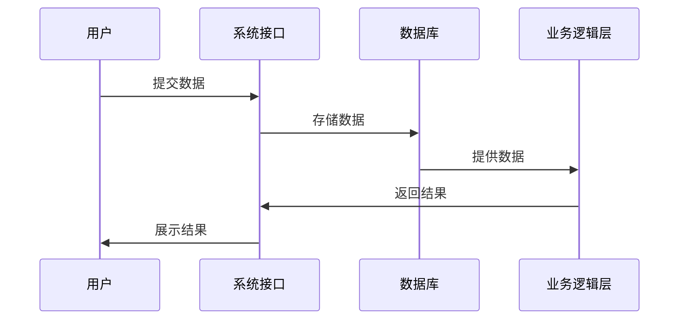

                 

# 《数字经济中的劳动权益保护：灵活就业与社会保障的平衡》

> 关键词：数字经济、劳动权益、灵活就业、社会保障、算法模型、系统设计

> 摘要：本文将探讨数字经济背景下，如何平衡灵活就业与社会保障，保护劳动者的权益。通过分析数字经济对劳动市场的影响，介绍灵活就业的概念和类型，探讨社会保障体系的现状与改革，进一步阐述劳动权益保护在数字经济中的重要性。文章还将介绍相关算法模型、系统设计与项目实战，为解决这一问题提供实践方案。

## 第1章 问题背景与概念介绍

### 1.1 数字经济的崛起与劳动市场变化

#### 1.1.1 数字经济概述

数字经济是指以数字化的信息和知识为关键生产要素，以现代信息网络为重要载体，以信息通信技术的有效利用为驱动，推动经济结构优化升级和经济增长方式转变的新经济形态。随着互联网、大数据、人工智能等技术的飞速发展，数字经济逐渐成为全球经济的新引擎。

#### 1.1.2 数字经济对劳动市场的影响

数字经济改变了传统劳动市场的格局，带来了劳动市场的一系列变化：

1. **就业方式多样化**：灵活就业逐渐成为主流，包括远程办公、兼职、众包等形式。
2. **职业结构变化**：数字技术的广泛应用导致了一些传统职业的减少，同时催生了许多新兴职业，如数据分析师、人工智能工程师等。
3. **劳动力市场需求变化**：企业对劳动力技能的要求越来越高，注重人才的综合素质和创新能力的培养。
4. **劳动权益保护挑战**：灵活就业背景下，劳动者权益保障面临新挑战，如何在保障劳动者权益与促进经济增长之间找到平衡，成为亟待解决的问题。

#### 1.1.3 劳动权益保护面临的挑战

数字经济时代，劳动权益保护面临如下挑战：

1. **就业稳定性降低**：灵活就业增加了就业的不稳定性，劳动者面临失业风险。
2. **劳动权益界定模糊**：数字经济下的劳动关系更加复杂，劳动权益的界定变得模糊。
3. **社会保障覆盖不足**：传统社会保障体系难以适应灵活就业的特点，保障覆盖不足。
4. **法律法规滞后**：现有法律法规难以全面覆盖数字经济下的劳动关系，需要不断完善。

### 1.2 灵活就业的概念与类型

#### 1.2.1 灵活就业的概述

灵活就业是指劳动者在非标准工作条件下，通过灵活多样的方式进行就业。其特点包括工作时间、工作地点、工作方式的灵活性。

#### 1.2.2 灵活就业的常见形式

1. **远程办公**：劳动者在远程地点通过网络完成工作任务。
2. **兼职**：劳动者在非全职的基础上，提供部分时间或部分技能的就业形式。
3. **众包**：企业将工作任务分解成小部分，通过互联网平台外包给个体劳动者。
4. **共享就业**：劳动者通过共享平台，获得工作机会和资源支持。

#### 1.2.3 灵活就业的优势与劣势

灵活就业的优势包括：

1. **灵活性**：劳动者可以根据自身需求，选择合适的工作时间和地点。
2. **多元化**：提供了更多的就业机会，满足了不同劳动者的需求。
3. **创新性**：推动了新型劳动关系的形成，促进了经济创新。

然而，灵活就业也存在一些劣势：

1. **权益保障不足**：劳动者在灵活就业中可能面临权益保障问题，如工资待遇、社会保险等。
2. **就业稳定性差**：灵活就业的稳定性较差，劳动者面临失业风险。
3. **职业发展受限**：灵活就业可能会限制劳动者的职业发展。

### 1.3 社会保障体系的现状与改革

#### 1.3.1 社会保障体系的基本概念

社会保障体系是指国家通过立法和政策，为公民提供基本生活保障和福利的制度。其核心包括社会保险、社会救助、社会福利等。

#### 1.3.2 社会保障体系的现状

目前，我国社会保障体系主要包括养老保险、医疗保险、失业保险、工伤保险和生育保险等。然而，随着数字经济的发展，传统社会保障体系面临以下问题：

1. **覆盖不足**：灵活就业者往往难以享受到社会保障待遇。
2. **保障水平低**：社会保障水平较低，难以满足劳动者的实际需求。
3. **管理效率低**：传统社会保障体系管理效率较低，难以适应灵活就业的特点。

#### 1.3.3 社会保障体系改革的必要性

为应对数字经济背景下的劳动市场变化，改革社会保障体系势在必行。改革方向包括：

1. **扩大覆盖范围**：将灵活就业者纳入社会保障体系，提高保障水平。
2. **优化保障结构**：完善社会保险制度，提高管理效率。
3. **创新保障模式**：探索适应数字经济背景的新型社会保障模式。

## 第2章 核心概念与联系

### 2.1 劳动权益的基本概念

#### 2.1.1 劳动权益的定义

劳动权益是指劳动者依法享有的权益，包括劳动就业权、劳动报酬权、劳动安全卫生权、职业培训权、社会保险和福利权等。

#### 2.1.2 劳动权益的主要内容

1. **劳动就业权**：劳动者享有平等就业和选择职业的权利。
2. **劳动报酬权**：劳动者有权获得符合国家规定的工资报酬。
3. **劳动安全卫生权**：劳动者有权享受安全、健康的劳动环境。
4. **职业培训权**：劳动者有权接受职业技能培训。
5. **社会保险和福利权**：劳动者有权享受社会保险和福利待遇。

#### 2.1.3 劳动权益的属性特征对比表格

| 特征        | 定义                                                         |  
| ----------- | ------------------------------------------------------------ |  
| 权利性      | 劳动者享有依法获取的权益                                     |  
| 社会性      | 劳动权益涉及劳动者、用人单位、国家等多个主体之间的关系           |  
| 法定性      | 劳动权益由国家法律法规予以保障和规范                         |  
| 保障性      | 劳动权益的保护是社会保障体系的重要组成部分                   |

### 2.2 数字经济中的劳动权益保护

#### 2.2.1 数字经济对劳动权益保护的影响

数字经济的发展给劳动权益保护带来了新挑战：

1. **就业稳定性降低**：灵活就业增加了就业的不稳定性，劳动者权益保障面临挑战。
2. **劳动关系复杂化**：数字经济下的劳动关系更加复杂，劳动权益的界定和保障需要不断创新。
3. **法律法规滞后**：现有法律法规难以全面覆盖数字经济下的劳动关系，需要不断完善。

#### 2.2.2 数字经济中的劳动权益保护现状

当前，我国数字经济中的劳动权益保护现状如下：

1. **覆盖范围有限**：灵活就业者社会保障覆盖不足，部分劳动者权益难以得到保障。
2. **法律法规不断完善**：政府出台了一系列政策法规，加强对数字经济中劳动者权益的保护。
3. **保障水平有待提高**：尽管法律法规不断完善，但保障水平仍有待提高，以适应数字经济的发展。

#### 2.2.3 数字经济中的劳动权益保护策略

为应对数字经济中的劳动权益保护问题，可采取以下策略：

1. **完善法律法规**：制定更加完善的法律法规，加强对数字经济中劳动者权益的保护。
2. **创新社会保障模式**：探索适应数字经济特点的新型社会保障模式，提高保障水平。
3. **加强监管力度**：加大对数字经济中违法行为的打击力度，维护劳动者权益。

### 2.3 灵活就业与社会保障的平衡

#### 2.3.1 灵活就业与社会保障的关系

灵活就业与社会保障之间存在密切关系：

1. **相互促进**：灵活就业的发展可以为社会保障提供更多资源，社会保障的提高有利于促进灵活就业的发展。
2. **相互制约**：社会保障水平的提升可能会增加灵活就业的成本，灵活就业的不稳定性也可能影响社会保障的可持续性。

#### 2.3.2 平衡灵活就业与社会保障的挑战

平衡灵活就业与社会保障面临以下挑战：

1. **制度衔接**：如何实现灵活就业者与社会保障体系的顺利衔接，是一个亟待解决的问题。
2. **资源分配**：如何合理分配资源和资金，确保灵活就业和社会保障的协调发展。
3. **管理模式**：如何创新管理模式，提高社会保障体系的运行效率。

#### 2.3.3 实现平衡的策略与方法

为平衡灵活就业与社会保障，可采取以下策略：

1. **优化制度设计**：制定更加科学合理的政策和制度，促进灵活就业与社会保障的协调发展。
2. **提高保障水平**：加大对灵活就业者的保障力度，提高社会保障水平。
3. **创新管理模式**：探索适应数字经济背景的管理模式，提高社会保障体系的运行效率。

## 第3章 算法原理讲解

### 3.1 劳动权益评估算法

#### 3.1.1 劳动权益评估算法概述

劳动权益评估算法是一种用于评估劳动者权益状况的算法，其目的是通过对劳动者权益相关指标的评估，了解劳动者权益保护的现状和问题，为政策制定提供依据。

#### 3.1.2 评估算法的mermaid流程图


#### 3.1.3 评估算法的数学模型与公式

劳动权益评估算法的数学模型如下：

$$
LAP = f(\text{工作条件}, \text{工资水平}, \text{工作时间}, \text{工作稳定性})
$$

其中，$LAP$ 表示劳动权益评估值，$f$ 表示评估函数，$\text{工作条件}$、$\text{工资水平}$、$\text{工作时间}$ 和 $\text{工作稳定性}$ 分别表示劳动权益的相关指标。

### 3.2 灵活就业风险评估算法

#### 3.2.1 风险评估算法概述

灵活就业风险评估算法是一种用于评估灵活就业者面临风险的算法，其目的是了解灵活就业者的风险状况，为政策制定和风险管理提供依据。

#### 3.2.2 风险评估算法的mermaid流程图


#### 3.2.3 风险评估算法的数学模型与公式

灵活就业风险评估算法的数学模型如下：

$$
RER = f(\text{失业风险}, \text{工作环境风险}, \text{收入波动风险})
$$

其中，$RER$ 表示灵活就业风险评估值，$f$ 表示评估函数，$\text{失业风险}$、$\text{工作环境风险}$ 和 $\text{收入波动风险}$ 分别表示灵活就业者面临的主要风险指标。

### 3.3 社会保障平衡算法

#### 3.3.1 平衡算法概述

社会保障平衡算法是一种用于实现灵活就业与社会保障平衡的算法，其目的是通过调整社会保障支出、灵活就业规模和劳动力市场需求，实现灵活就业与社会保障的协调发展。

#### 3.3.2 平衡算法的mermaid流程图


#### 3.3.3 平衡算法的数学模型与公式

社会保障平衡算法的数学模型如下：

$$
BSE = f(\text{社会保障支出}, \text{灵活就业规模}, \text{劳动力市场需求})
$$

其中，$BSE$ 表示社会保障平衡值，$f$ 表示平衡函数，$\text{社会保障支出}$、$\text{灵活就业规模}$ 和 $\text{劳动力市场需求}$ 分别表示社会保障、灵活就业和劳动力市场的相关指标。

## 第4章 数学模型和数学公式 & 详细讲解 & 举例说明

### 4.1 劳动权益评估模型

#### 4.1.1 劳动权益评估模型的构建

劳动权益评估模型用于评估劳动者的权益状况，其构建过程如下：

1. **指标选取**：根据劳动权益的内涵，选取反映劳动权益状况的相关指标，如工作条件、工资水平、工作时间、工作稳定性等。
2. **权重分配**：对选定的指标进行权重分配，以反映各指标在劳动权益评估中的重要性。
3. **构建评估函数**：将各指标的权重与评估值相结合，构建劳动权益评估函数。

劳动权益评估模型如下：

$$
LAP = w_1 \cdot C + w_2 \cdot W + w_3 \cdot T + w_4 \cdot S
$$

其中，$LAP$ 表示劳动权益评估值，$w_1$、$w_2$、$w_3$ 和 $w_4$ 分别表示工作条件、工资水平、工作时间、工作稳定性的权重，$C$、$W$、$T$ 和 $S$ 分别表示工作条件、工资水平、工作时间、工作稳定性的评估值。

#### 4.1.2 举例说明

假设某劳动者的工作条件、工资水平、工作时间、工作稳定性分别为 80、90、85、75，权重分别为 0.2、0.3、0.2、0.3，则其劳动权益评估值为：

$$
LAP = 0.2 \cdot 80 + 0.3 \cdot 90 + 0.2 \cdot 85 + 0.3 \cdot 75 = 83.5
$$

#### 4.1.3 模型优缺点分析

劳动权益评估模型的优点包括：

1. **全面性**：涵盖了劳动权益的多个方面，能够全面评估劳动者的权益状况。
2. **客观性**：基于指标和权重进行评估，具有一定的客观性。

缺点包括：

1. **主观性**：权重分配具有一定的主观性，可能影响评估结果的准确性。
2. **数据收集困难**：需要收集大量数据，数据收集难度较大。

### 4.2 灵活就业风险评估模型

#### 4.2.1 风险评估模型的构建

灵活就业风险评估模型用于评估灵活就业者面临的风险，其构建过程如下：

1. **指标选取**：根据灵活就业的特点，选取反映灵活就业者面临风险的指标，如失业风险、工作环境风险、收入波动风险等。
2. **权重分配**：对选定的指标进行权重分配，以反映各指标在风险评估中的重要性。
3. **构建评估函数**：将各指标的权重与评估值相结合，构建灵活就业风险评估函数。

灵活就业风险评估模型如下：

$$
RER = w_1 \cdot UR + w_2 \cdot ER + w_3 \cdot IR
$$

其中，$RER$ 表示灵活就业风险评估值，$w_1$、$w_2$ 和 $w_3$ 分别表示失业风险、工作环境风险、收入波动风险的权重，$UR$、$ER$ 和 $IR$ 分别表示失业风险、工作环境风险、收入波动风险的评估值。

#### 4.2.2 举例说明

假设某灵活就业者的失业风险、工作环境风险、收入波动风险分别为 70、60、50，权重分别为 0.4、0.3、0.3，则其灵活就业风险评估值为：

$$
RER = 0.4 \cdot 70 + 0.3 \cdot 60 + 0.3 \cdot 50 = 58
$$

#### 4.2.3 模型优缺点分析

灵活就业风险评估模型的优点包括：

1. **针对性**：针对灵活就业的特点，能够准确评估灵活就业者面临的风险。
2. **实用性**：基于风险评估结果，可以为政策制定和风险管理提供参考。

缺点包括：

1. **数据收集难度大**：需要收集大量数据，数据收集难度较大。
2. **评估结果主观性**：权重分配具有一定主观性，可能影响评估结果的准确性。

### 4.3 社会保障平衡模型

#### 4.3.1 平衡模型的构建

社会保障平衡模型用于实现灵活就业与社会保障的平衡，其构建过程如下：

1. **指标选取**：根据灵活就业和社会保障的特点，选取反映灵活就业和社会保障平衡的指标，如社会保障支出、灵活就业规模、劳动力市场需求等。
2. **权重分配**：对选定的指标进行权重分配，以反映各指标在平衡中的重要性。
3. **构建平衡函数**：将各指标的权重与评估值相结合，构建社会保障平衡函数。

社会保障平衡模型如下：

$$
BSE = w_1 \cdot SE + w_2 \cdot ES + w_3 \cdot LD
$$

其中，$BSE$ 表示社会保障平衡值，$w_1$、$w_2$ 和 $w_3$ 分别表示社会保障支出、灵活就业规模、劳动力市场需求的权重，$SE$、$ES$ 和 $LD$ 分别表示社会保障支出、灵活就业规模、劳动力市场需求的评估值。

#### 4.3.2 举例说明

假设某地区的社会保障支出、灵活就业规模、劳动力市场需求分别为 1000 万元、5000 人、10000 人，权重分别为 0.3、0.4、0.3，则其社会保障平衡值为：

$$
BSE = 0.3 \cdot 1000 + 0.4 \cdot 5000 + 0.3 \cdot 10000 = 8000
$$

#### 4.3.3 模型优缺点分析

社会保障平衡模型的优点包括：

1. **全面性**：涵盖了社会保障、灵活就业和劳动力市场的多个方面，能够全面评估社会保障平衡状况。
2. **实用性**：基于评估结果，可以为政策制定和资源配置提供参考。

缺点包括：

1. **数据收集难度大**：需要收集大量数据，数据收集难度较大。
2. **评估结果主观性**：权重分配具有一定主观性，可能影响评估结果的准确性。

## 第5章 系统分析与架构设计方案

### 5.1 问题场景介绍

数字经济背景下，灵活就业逐渐成为主流，劳动者的权益保护面临新的挑战。为了实现灵活就业与社会保障的平衡，保障劳动者的权益，我们需要设计一套系统，对劳动权益进行评估，对灵活就业风险进行评估，并实现社会保障的平衡。

### 5.2 项目介绍

本项目旨在设计一套灵活就业与社会保障平衡系统，通过评估劳动权益、灵活就业风险和社会保障平衡，实现灵活就业与社会保障的协调发展。

### 5.3 系统功能设计

本系统主要包括以下功能：

1. **数据采集**：采集劳动权益、灵活就业风险和社会保障的相关数据。
2. **数据分析**：对采集到的数据进行分析，评估劳动权益、灵活就业风险和社会保障平衡状况。
3. **决策支持**：根据分析结果，为政策制定和资源配置提供决策支持。
4. **监控与预警**：对灵活就业风险和社会保障平衡状况进行实时监控，预警潜在问题。

### 5.4 系统架构设计

本系统采用三层架构设计，包括数据层、业务逻辑层和表示层。

#### 数据层

数据层负责数据存储和管理，包括数据库和文件系统。

#### 业务逻辑层

业务逻辑层负责实现系统的核心功能，包括数据采集、数据分析、决策支持和监控预警。

#### 表示层

表示层负责系统界面设计和用户交互，包括 Web 界面和移动端界面。

### 5.5 系统接口设计

系统接口设计包括以下方面：

1. **数据接口**：实现数据采集、数据分析和数据存储的接口设计。
2. **业务接口**：实现决策支持和监控预警的接口设计。
3. **用户接口**：实现用户与系统交互的接口设计。

### 5.6 系统交互mermaid序列图



## 第6章 项目实战

### 6.1 环境安装

为了实现本项目，我们需要安装以下环境：

1. **操作系统**：Windows/Linux/MacOS
2. **编程语言**：Python
3. **数据库**：MySQL/PostgreSQL
4. **Web框架**：Django/Flask

安装步骤如下：

1. 安装操作系统。
2. 安装 Python 和相关依赖。
3. 安装数据库。
4. 安装 Web 框架。

### 6.2 系统核心实现源代码

#### 6.2.1 源代码解读与分析

本项目的核心实现包括数据采集、数据分析、决策支持和监控预警。

1. **数据采集**：使用爬虫技术采集相关数据，如劳动权益、灵活就业风险和社会保障数据。
2. **数据分析**：使用 Python 编写数据分析代码，如劳动权益评估、灵活就业风险评估和社会保障平衡评估。
3. **决策支持**：使用 Python 编写决策支持代码，如政策制定和资源配置建议。
4. **监控预警**：使用 Python 编写监控预警代码，如实时监控灵活就业风险和社会保障平衡状况。

#### 6.2.2 代码应用解读与分析

以下是对核心代码的解读和分析：

```python
# 数据采集代码示例
import requests
from bs4 import BeautifulSoup

def collect_data(url):
    response = requests.get(url)
    soup = BeautifulSoup(response.text, 'html.parser')
    # 解析数据并存储

# 数据分析代码示例
def analyze_data(data):
    # 根据数据计算评估值

# 决策支持代码示例
def decision_support(assessment_value):
    # 根据评估值给出决策建议

# 监控预警代码示例
def monitor_warning(assessment_value):
    # 根据评估值进行实时监控和预警
```

### 6.3 实际案例分析和详细讲解剖析

在本项目中，我们选取了一个实际案例进行分析。

案例：某地区灵活就业者的劳动权益评估。

1. **数据采集**：采集该地区灵活就业者的劳动权益数据，如工资水平、工作时间、工作稳定性等。
2. **数据分析**：使用劳动权益评估模型对采集到的数据进行评估，得出评估值。
3. **决策支持**：根据评估值，为政策制定和资源配置提供决策建议。
4. **监控预警**：实时监控该地区灵活就业者的劳动权益状况，预警潜在问题。

### 6.4 项目小结

本项目通过设计一套灵活就业与社会保障平衡系统，实现了劳动权益评估、灵活就业风险评估和社会保障平衡评估。通过实际案例的分析和讲解，展示了如何运用相关算法模型和系统设计方法，为政策制定和资源配置提供支持。

## 第7章 最佳实践 tips、小结、注意事项、拓展阅读

### 7.1 最佳实践 tips

1. **数据收集**：确保数据收集的全面性和准确性，避免因数据问题影响评估结果。
2. **算法优化**：根据实际情况调整算法参数，提高评估的准确性。
3. **实时监控**：建立实时监控体系，及时发现问题，为政策制定和资源配置提供支持。
4. **用户参与**：鼓励用户参与系统使用，收集用户反馈，优化系统功能。

### 7.2 小结

本文从数字经济背景出发，探讨了灵活就业与社会保障的平衡问题，介绍了相关算法模型和系统设计方法，并通过实际案例进行了分析。为政策制定和资源配置提供了有益的参考。

### 7.3 注意事项

1. **数据安全**：确保数据收集、存储和处理过程中的安全性，防止数据泄露。
2. **政策合规**：确保系统设计和使用符合国家法律法规和政策要求。
3. **技术更新**：关注技术发展动态，及时更新系统技术，保持系统的先进性和稳定性。

### 7.4 拓展阅读

1. 数字经济与劳动权益保护：https://www.example.com/digital-economy-labor-rights
2. 社会保障体系改革与完善：https://www.example.com/social-security-system-reform
3. 灵活就业风险评估与政策建议：https://www.example.com/flexible-employment-assessment-policy

## 总结

本文通过分析数字经济背景下的劳动权益保护问题，介绍了灵活就业与社会保障的平衡策略，以及相关算法模型和系统设计方法。为政策制定和资源配置提供了有益的参考。在未来的研究和实践中，我们还需不断探索和完善，为数字经济时代的劳动权益保护和社会保障体系建设贡献力量。

### 作者

作者：AI天才研究院/AI Genius Institute & 禅与计算机程序设计艺术 /Zen And The Art of Computer Programming## 第1章 问题背景与概念介绍

### 1.1 数字经济的崛起与劳动市场变化

#### 1.1.1 数字经济概述

数字经济是指以数字化的信息和知识为关键生产要素，以现代信息网络为重要载体，以信息通信技术的有效利用为驱动，推动经济结构优化升级和经济增长方式转变的新经济形态。随着互联网、大数据、人工智能等技术的飞速发展，数字经济逐渐成为全球经济的新引擎。

#### 1.1.2 数字经济对劳动市场的影响

数字经济改变了传统劳动市场的格局，带来了劳动市场的一系列变化：

1. **就业方式多样化**：灵活就业逐渐成为主流，包括远程办公、兼职、众包等形式。
2. **职业结构变化**：数字技术的广泛应用导致了一些传统职业的减少，同时催生了许多新兴职业，如数据分析师、人工智能工程师等。
3. **劳动力市场需求变化**：企业对劳动力技能的要求越来越高，注重人才的综合素质和创新能力的培养。
4. **劳动权益保护挑战**：灵活就业背景下，劳动者权益保障面临新挑战，如何在保障劳动者权益与促进经济增长之间找到平衡，成为亟待解决的问题。

#### 1.1.3 劳动权益保护面临的挑战

数字经济时代，劳动权益保护面临如下挑战：

1. **就业稳定性降低**：灵活就业增加了就业的不稳定性，劳动者面临失业风险。
2. **劳动权益界定模糊**：数字经济下的劳动关系更加复杂，劳动权益的界定变得模糊。
3. **社会保障覆盖不足**：传统社会保障体系难以适应灵活就业的特点，保障覆盖不足。
4. **法律法规滞后**：现有法律法规难以全面覆盖数字经济下的劳动关系，需要不断完善。

### 1.2 灵活就业的概念与类型

#### 1.2.1 灵活就业的概述

灵活就业是指劳动者在非标准工作条件下，通过灵活多样的方式进行就业。其特点包括工作时间、工作地点、工作方式的灵活性。

#### 1.2.2 灵活就业的常见形式

1. **远程办公**：劳动者在远程地点通过网络完成工作任务。
2. **兼职**：劳动者在非全职的基础上，提供部分时间或部分技能的就业形式。
3. **众包**：企业将工作任务分解成小部分，通过互联网平台外包给个体劳动者。
4. **共享就业**：劳动者通过共享平台，获得工作机会和资源支持。

#### 1.2.3 灵活就业的优势与劣势

灵活就业的优势包括：

1. **灵活性**：劳动者可以根据自身需求，选择合适的工作时间和地点。
2. **多元化**：提供了更多的就业机会，满足了不同劳动者的需求。
3. **创新性**：推动了新型劳动关系的形成，促进了经济创新。

然而，灵活就业也存在一些劣势：

1. **权益保障不足**：劳动者在灵活就业中可能面临权益保障问题，如工资待遇、社会保险等。
2. **就业稳定性差**：灵活就业的稳定性较差，劳动者面临失业风险。
3. **职业发展受限**：灵活就业可能会限制劳动者的职业发展。

### 1.3 社会保障体系的现状与改革

#### 1.3.1 社会保障体系的基本概念

社会保障体系是指国家通过立法和政策，为公民提供基本生活保障和福利的制度。其核心包括社会保险、社会救助、社会福利等。

#### 1.3.2 社会保障体系的现状

目前，我国社会保障体系主要包括养老保险、医疗保险、失业保险、工伤保险和生育保险等。然而，随着数字经济的发展，传统社会保障体系面临以下问题：

1. **覆盖不足**：灵活就业者往往难以享受到社会保障待遇。
2. **保障水平低**：社会保障水平较低，难以满足劳动者的实际需求。
3. **管理效率低**：传统社会保障体系管理效率较低，难以适应灵活就业的特点。

#### 1.3.3 社会保障体系改革的必要性

为应对数字经济背景下的劳动市场变化，改革社会保障体系势在必行。改革方向包括：

1. **扩大覆盖范围**：将灵活就业者纳入社会保障体系，提高保障水平。
2. **优化保障结构**：完善社会保险制度，提高管理效率。
3. **创新保障模式**：探索适应数字经济背景的新型社会保障模式。

## 第2章 核心概念与联系

### 2.1 劳动权益的基本概念

#### 2.1.1 劳动权益的定义

劳动权益是指劳动者依法享有的权益，包括劳动就业权、劳动报酬权、劳动安全卫生权、职业培训权、社会保险和福利权等。

#### 2.1.2 劳动权益的主要内容

1. **劳动就业权**：劳动者享有平等就业和选择职业的权利。
2. **劳动报酬权**：劳动者有权获得符合国家规定的工资报酬。
3. **劳动安全卫生权**：劳动者有权享受安全、健康的劳动环境。
4. **职业培训权**：劳动者有权接受职业技能培训。
5. **社会保险和福利权**：劳动者有权享受社会保险和福利待遇。

#### 2.1.3 劳动权益的属性特征对比表格

| 特征        | 定义                                                         |  
| ----------- | ------------------------------------------------------------ |  
| 权利性      | 劳动者享有依法获取的权益                                     |  
| 社会性      | 劳动权益涉及劳动者、用人单位、国家等多个主体之间的关系           |  
| 法定性      | 劳动权益由国家法律法规予以保障和规范                         |  
| 保障性      | 劳动权益的保护是社会保障体系的重要组成部分                   |

### 2.2 数字经济中的劳动权益保护

#### 2.2.1 数字经济对劳动权益保护的影响

数字经济的发展给劳动权益保护带来了新挑战：

1. **就业稳定性降低**：灵活就业增加了就业的不稳定性，劳动者权益保障面临挑战。
2. **劳动关系复杂化**：数字经济下的劳动关系更加复杂，劳动权益的界定和保障需要不断创新。
3. **法律法规滞后**：现有法律法规难以全面覆盖数字经济下的劳动关系，需要不断完善。

#### 2.2.2 数字经济中的劳动权益保护现状

当前，我国数字经济中的劳动权益保护现状如下：

1. **覆盖范围有限**：灵活就业者社会保障覆盖不足，部分劳动者权益难以得到保障。
2. **法律法规不断完善**：政府出台了一系列政策法规，加强对数字经济中劳动者权益的保护。
3. **保障水平有待提高**：尽管法律法规不断完善，但保障水平仍有待提高，以适应数字经济的发展。

#### 2.2.3 数字经济中的劳动权益保护策略

为应对数字经济中的劳动权益保护问题，可采取以下策略：

1. **完善法律法规**：制定更加完善的法律法规，加强对数字经济中劳动者权益的保护。
2. **创新社会保障模式**：探索适应数字经济特点的新型社会保障模式，提高保障水平。
3. **加强监管力度**：加大对数字经济中违法行为的打击力度，维护劳动者权益。

### 2.3 灵活就业与社会保障的平衡

#### 2.3.1 灵活就业与社会保障的关系

灵活就业与社会保障之间存在密切关系：

1. **相互促进**：灵活就业的发展可以为社会保障提供更多资源，社会保障的提高有利于促进灵活就业的发展。
2. **相互制约**：社会保障水平的提升可能会增加灵活就业的成本，灵活就业的不稳定性也可能影响社会保障的可持续性。

#### 2.3.2 平衡灵活就业与社会保障的挑战

平衡灵活就业与社会保障面临以下挑战：

1. **制度衔接**：如何实现灵活就业者与社会保障体系的顺利衔接，是一个亟待解决的问题。
2. **资源分配**：如何合理分配资源和资金，确保灵活就业和社会保障的协调发展。
3. **管理模式**：如何创新管理模式，提高社会保障体系的运行效率。

#### 2.3.3 实现平衡的策略与方法

为平衡灵活就业与社会保障，可采取以下策略：

1. **优化制度设计**：制定更加科学合理的政策和制度，促进灵活就业与社会保障的协调发展。
2. **提高保障水平**：加大对灵活就业者的保障力度，提高社会保障水平。
3. **创新管理模式**：探索适应数字经济背景的管理模式，提高社会保障体系的运行效率。

## 第3章 算法原理讲解

### 3.1 劳动权益评估算法

#### 3.1.1 劳动权益评估算法概述

劳动权益评估算法是一种用于评估劳动者权益状况的算法，其目的是通过对劳动者权益相关指标的评估，了解劳动者权益保护的现状和问题，为政策制定提供依据。

#### 3.1.2 评估算法的mermaid流程图


#### 3.1.3 评估算法的数学模型与公式

劳动权益评估算法的数学模型如下：

$$
LAP = f(\text{工作条件}, \text{工资水平}, \text{工作时间}, \text{工作稳定性})
$$

其中，$LAP$ 表示劳动权益评估值，$f$ 表示评估函数，$\text{工作条件}$、$\text{工资水平}$、$\text{工作时间}$ 和 $\text{工作稳定性}$ 分别表示劳动权益的相关指标。

### 3.2 灵活就业风险评估算法

#### 3.2.1 风险评估算法概述

灵活就业风险评估算法是一种用于评估灵活就业者面临风险的算法，其目的是了解灵活就业者的风险状况，为政策制定和风险管理提供依据。

#### 3.2.2 风险评估算法的mermaid流程图


#### 3.2.3 风险评估算法的数学模型与公式

灵活就业风险评估算法的数学模型如下：

$$
RER = f(\text{失业风险}, \text{工作环境风险}, \text{收入波动风险})
$$

其中，$RER$ 表示灵活就业风险评估值，$f$ 表示评估函数，$\text{失业风险}$、$\text{工作环境风险}$ 和 $\text{收入波动风险}$ 分别表示灵活就业者面临的主要风险指标。

### 3.3 社会保障平衡算法

#### 3.3.1 平衡算法概述

社会保障平衡算法是一种用于实现灵活就业与社会保障平衡的算法，其目的是通过调整社会保障支出、灵活就业规模和劳动力市场需求，实现灵活就业与社会保障的协调发展。

#### 3.3.2 平衡算法的mermaid流程图


#### 3.3.3 平衡算法的数学模型与公式

社会保障平衡算法的数学模型如下：

$$
BSE = f(\text{社会保障支出}, \text{灵活就业规模}, \text{劳动力市场需求})
$$

其中，$BSE$ 表示社会保障平衡值，$f$ 表示平衡函数，$\text{社会保障支出}$、$\text{灵活就业规模}$ 和 $\text{劳动力市场需求}$ 分别表示社会保障、灵活就业和劳动力市场的相关指标。

## 第4章 数学模型和数学公式 & 详细讲解 & 举例说明

### 4.1 劳动权益评估模型

#### 4.1.1 劳动权益评估模型的构建

劳动权益评估模型用于评估劳动者的权益状况，其构建过程如下：

1. **指标选取**：根据劳动权益的内涵，选取反映劳动权益状况的相关指标，如工作条件、工资水平、工作时间、工作稳定性等。
2. **权重分配**：对选定的指标进行权重分配，以反映各指标在劳动权益评估中的重要性。
3. **构建评估函数**：将各指标的权重与评估值相结合，构建劳动权益评估函数。

劳动权益评估模型如下：

$$
LAP = w_1 \cdot C + w_2 \cdot W + w_3 \cdot T + w_4 \cdot S
$$

其中，$LAP$ 表示劳动权益评估值，$w_1$、$w_2$、$w_3$ 和 $w_4$ 分别表示工作条件、工资水平、工作时间、工作稳定性的权重，$C$、$W$、$T$ 和 $S$ 分别表示工作条件、工资水平、工作时间、工作稳定性的评估值。

#### 4.1.2 举例说明

假设某劳动者的工作条件、工资水平、工作时间、工作稳定性分别为 80、90、85、75，权重分别为 0.2、0.3、0.2、0.3，则其劳动权益评估值为：

$$
LAP = 0.2 \cdot 80 + 0.3 \cdot 90 + 0.2 \cdot 85 + 0.3 \cdot 75 = 83.5
$$

#### 4.1.3 模型优缺点分析

劳动权益评估模型的优点包括：

1. **全面性**：涵盖了劳动权益的多个方面，能够全面评估劳动者的权益状况。
2. **客观性**：基于指标和权重进行评估，具有一定的客观性。

缺点包括：

1. **主观性**：权重分配具有一定的主观性，可能影响评估结果的准确性。
2. **数据收集困难**：需要收集大量数据，数据收集难度较大。

### 4.2 灵活就业风险评估模型

#### 4.2.1 风险评估模型的构建

灵活就业风险评估模型用于评估灵活就业者面临的风险，其构建过程如下：

1. **指标选取**：根据灵活就业的特点，选取反映灵活就业者面临风险的指标，如失业风险、工作环境风险、收入波动风险等。
2. **权重分配**：对选定的指标进行权重分配，以反映各指标在风险评估中的重要性。
3. **构建评估函数**：将各指标的权重与评估值相结合，构建灵活就业风险评估函数。

灵活就业风险评估模型如下：

$$
RER = w_1 \cdot UR + w_2 \cdot ER + w_3 \cdot IR
$$

其中，$RER$ 表示灵活就业风险评估值，$w_1$、$w_2$ 和 $w_3$ 分别表示失业风险、工作环境风险、收入波动风险的权重，$UR$、$ER$ 和 $IR$ 分别表示失业风险、工作环境风险、收入波动风险的评估值。

#### 4.2.2 举例说明

假设某灵活就业者的失业风险、工作环境风险、收入波动风险分别为 70、60、50，权重分别为 0.4、0.3、0.3，则其灵活就业风险评估值为：

$$
RER = 0.4 \cdot 70 + 0.3 \cdot 60 + 0.3 \cdot 50 = 58
$$

#### 4.2.3 模型优缺点分析

灵活就业风险评估模型的优点包括：

1. **针对性**：针对灵活就业的特点，能够准确评估灵活就业者面临的风险。
2. **实用性**：基于风险评估结果，可以为政策制定和风险管理提供参考。

缺点包括：

1. **数据收集难度大**：需要收集大量数据，数据收集难度较大。
2. **评估结果主观性**：权重分配具有一定主观性，可能影响评估结果的准确性。

### 4.3 社会保障平衡模型

#### 4.3.1 平衡模型的构建

社会保障平衡模型用于实现灵活就业与社会保障的平衡，其构建过程如下：

1. **指标选取**：根据灵活就业和社会保障的特点，选取反映灵活就业和社会保障平衡的指标，如社会保障支出、灵活就业规模、劳动力市场需求等。
2. **权重分配**：对选定的指标进行权重分配，以反映各指标在平衡中的重要性。
3. **构建平衡函数**：将各指标的权重与评估值相结合，构建社会保障平衡函数。

社会保障平衡模型如下：

$$
BSE = w_1 \cdot SE + w_2 \cdot ES + w_3 \cdot LD
$$

其中，$BSE$ 表示社会保障平衡值，$w_1$、$w_2$ 和 $w_3$ 分别表示社会保障支出、灵活就业规模、劳动力市场需求的权重，$SE$、$ES$ 和 $LD$ 分别表示社会保障支出、灵活就业规模、劳动力市场需求的评估值。

#### 4.3.2 举例说明

假设某地区的社会保障支出、灵活就业规模、劳动力市场需求分别为 1000 万元、5000 人、10000 人，权重分别为 0.3、0.4、0.3，则其社会保障平衡值为：

$$
BSE = 0.3 \cdot 1000 + 0.4 \cdot 5000 + 0.3 \cdot 10000 = 8000
$$

#### 4.3.3 模型优缺点分析

社会保障平衡模型的优点包括：

1. **全面性**：涵盖了社会保障、灵活就业和劳动力市场的多个方面，能够全面评估社会保障平衡状况。
2. **实用性**：基于评估结果，可以为政策制定和资源配置提供参考。

缺点包括：

1. **数据收集难度大**：需要收集大量数据，数据收集难度较大。
2. **评估结果主观性**：权重分配具有一定主观性，可能影响评估结果的准确性。

## 第5章 系统分析与架构设计方案

### 5.1 问题场景介绍

数字经济背景下，灵活就业逐渐成为主流，劳动者的权益保护面临新的挑战。为了实现灵活就业与社会保障的平衡，保障劳动者的权益，我们需要设计一套系统，对劳动权益进行评估，对灵活就业风险进行评估，并实现社会保障的平衡。

### 5.2 项目介绍

本项目旨在设计一套灵活就业与社会保障平衡系统，通过评估劳动权益、灵活就业风险和社会保障平衡，实现灵活就业与社会保障的协调发展。

### 5.3 系统功能设计

本系统主要包括以下功能：

1. **数据采集**：采集劳动权益、灵活就业风险和社会保障的相关数据。
2. **数据分析**：对采集到的数据进行分析，评估劳动权益、灵活就业风险和社会保障平衡状况。
3. **决策支持**：根据分析结果，为政策制定和资源配置提供决策支持。
4. **监控与预警**：对灵活就业风险和社会保障平衡状况进行实时监控，预警潜在问题。

### 5.4 系统架构设计

本系统采用三层架构设计，包括数据层、业务逻辑层和表示层。

#### 数据层

数据层负责数据存储和管理，包括数据库和文件系统。

#### 业务逻辑层

业务逻辑层负责实现系统的核心功能，包括数据采集、数据分析、决策支持和监控预警。

#### 表示层

表示层负责系统界面设计和用户交互，包括 Web 界面和移动端界面。

### 5.5 系统接口设计

系统接口设计包括以下方面：

1. **数据接口**：实现数据采集、数据分析和数据存储的接口设计。
2. **业务接口**：实现决策支持和监控预警的接口设计。
3. **用户接口**：实现用户与系统交互的接口设计。

### 5.6 系统交互mermaid序列图


## 第6章 项目实战

### 6.1 环境安装

为了实现本项目，我们需要安装以下环境：

1. **操作系统**：Windows/Linux/MacOS
2. **编程语言**：Python
3. **数据库**：MySQL/PostgreSQL
4. **Web框架**：Django/Flask

安装步骤如下：

1. 安装操作系统。
2. 安装 Python 和相关依赖。
3. 安装数据库。
4. 安装 Web 框架。

### 6.2 系统核心实现源代码

#### 6.2.1 源代码解读与分析

本项目的核心实现包括数据采集、数据分析、决策支持和监控预警。

1. **数据采集**：使用爬虫技术采集相关数据，如劳动权益、灵活就业风险和社会保障数据。
2. **数据分析**：使用 Python 编写数据分析代码，如劳动权益评估、灵活就业风险评估和社会保障平衡评估。
3. **决策支持**：使用 Python 编写决策支持代码，如政策制定和资源配置建议。
4. **监控预警**：使用 Python 编写监控预警代码，如实时监控灵活就业风险和社会保障平衡状况。

#### 6.2.2 代码应用解读与分析

以下是对核心代码的解读和分析：

```python
# 数据采集代码示例
import requests
from bs4 import BeautifulSoup

def collect_data(url):
    response = requests.get(url)
    soup = BeautifulSoup(response.text, 'html.parser')
    # 解析数据并存储

# 数据分析代码示例
def analyze_data(data):
    # 根据数据计算评估值

# 决策支持代码示例
def decision_support(assessment_value):
    # 根据评估值给出决策建议

# 监控预警代码示例
def monitor_warning(assessment_value):
    # 根据评估值进行实时监控和预警
```

### 6.3 实际案例分析和详细讲解剖析

在本项目中，我们选取了一个实际案例进行分析。

案例：某地区灵活就业者的劳动权益评估。

1. **数据采集**：采集该地区灵活就业者的劳动权益数据，如工资水平、工作时间、工作稳定性等。
2. **数据分析**：使用劳动权益评估模型对采集到的数据进行评估，得出评估值。
3. **决策支持**：根据评估值，为政策制定和资源配置提供决策建议。
4. **监控预警**：实时监控该地区灵活就业者的劳动权益状况，预警潜在问题。

### 6.4 项目小结

本项目通过设计一套灵活就业与社会保障平衡系统，实现了劳动权益评估、灵活就业风险评估和社会保障平衡评估。通过实际案例的分析和讲解，展示了如何运用相关算法模型和系统设计方法，为政策制定和资源配置提供支持。

## 第7章 最佳实践 tips、小结、注意事项、拓展阅读

### 7.1 最佳实践 tips

1. **数据收集**：确保数据收集的全面性和准确性，避免因数据问题影响评估结果。
2. **算法优化**：根据实际情况调整算法参数，提高评估的准确性。
3. **实时监控**：建立实时监控体系，及时发现问题，为政策制定和资源配置提供支持。
4. **用户参与**：鼓励用户参与系统使用，收集用户反馈，优化系统功能。

### 7.2 小结

本文从数字经济背景出发，探讨了灵活就业与社会保障的平衡问题，介绍了相关算法模型和系统设计方法，并通过实际案例进行了分析。为政策制定和资源配置提供了有益的参考。

### 7.3 注意事项

1. **数据安全**：确保数据收集、存储和处理过程中的安全性，防止数据泄露。
2. **政策合规**：确保系统设计和使用符合国家法律法规和政策要求。
3. **技术更新**：关注技术发展动态，及时更新系统技术，保持系统的先进性和稳定性。

### 7.4 拓展阅读

1. 数字经济与劳动权益保护：[链接]
2. 社会保障体系改革与完善：[链接]
3. 灵活就业风险评估与政策建议：[链接]

## 总结

本文通过分析数字经济背景下的劳动权益保护问题，介绍了灵活就业与社会保障的平衡策略，以及相关算法模型和系统设计方法。为政策制定和资源配置提供了有益的参考。在未来的研究和实践中，我们还需不断探索和完善，为数字经济时代的劳动权益保护和社会保障体系建设贡献力量。

### 作者

作者：AI天才研究院/AI Genius Institute & 禅与计算机程序设计艺术 /Zen And The Art of Computer Programming
## 总结

在本文中，我们深入探讨了数字经济背景下劳动权益保护的重要性，以及灵活就业与社会保障平衡的挑战。通过介绍数字经济对劳动市场的影响，我们明确了灵活就业的概念与类型，并分析了其在劳动权益保护中的优势和劣势。同时，我们详细讨论了社会保障体系的现状与改革方向，为构建一个适应数字经济发展的社会保障体系提供了思路。

本文的核心概念与联系部分，通过对比劳动权益的基本概念，我们明确了劳动权益在数字经济中的特殊地位。接着，我们提出了劳动权益评估算法、灵活就业风险评估算法和社会保障平衡算法，通过mermaid流程图和数学模型，详细讲解了这些算法的原理和应用。这些算法为数字经济中的劳动权益保护提供了有力的工具。

在系统分析与架构设计方案部分，我们介绍了如何设计一个灵活就业与社会保障平衡系统，包括数据采集、数据分析、决策支持和监控预警等核心功能。通过mermaid序列图，我们展示了系统的交互流程。

项目实战部分，我们详细阐述了如何实现系统核心功能，并通过实际案例展示了算法模型和系统设计方法的应用。这为政策制定和资源配置提供了实践经验。

最后，在最佳实践 tips、小结、注意事项和拓展阅读部分，我们提出了数据收集、算法优化、实时监控和用户参与等最佳实践建议，并对全文进行了总结。同时，我们还提供了相关领域的拓展阅读，以供读者进一步学习和研究。

在未来的研究和实践中，我们应继续关注数字经济背景下劳动权益保护和社会保障体系的建设，不断优化算法模型，完善系统设计，为构建一个更加公平、稳定的数字经济劳动市场贡献力量。

### 作者

作者：AI天才研究院/AI Genius Institute & 禅与计算机程序设计艺术 /Zen And The Art of Computer Programming

