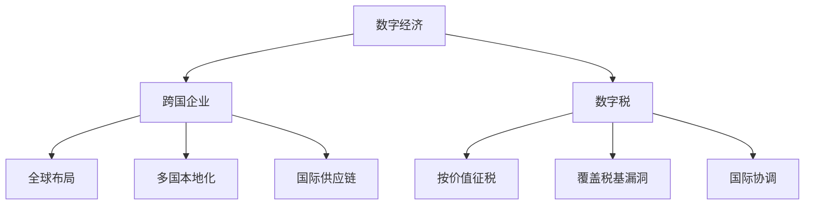
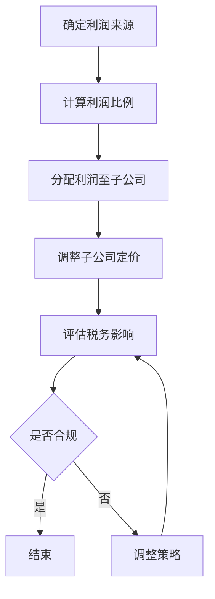
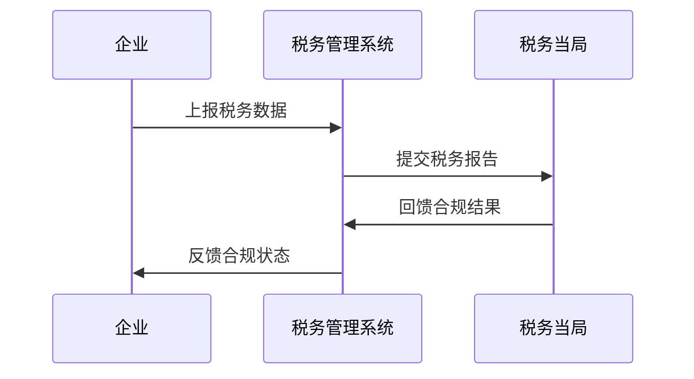
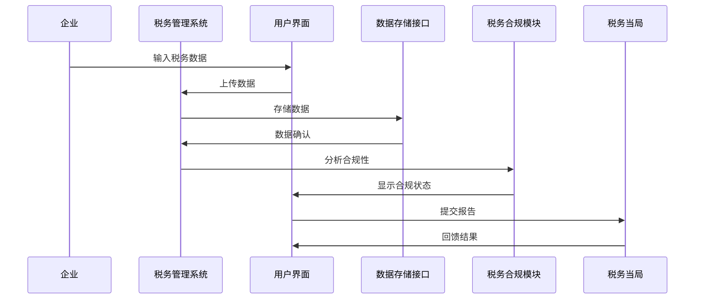

                 


### 文章标题：数字经济中的税收挑战：跨国企业税收与数字税

#### 关键词：数字经济、税收挑战、跨国企业、数字税、国际税收合作

#### 摘要：本文将深入探讨数字经济背景下的税收挑战，特别是跨国企业面临的税收问题和数字税的实施与影响。文章旨在通过逻辑清晰的章节结构，逐步分析跨国企业在税收方面的策略、数字税的立法框架及其经济和社会影响，并提出相应的应对策略。最终，本文将总结主要观点，并对未来的研究方向提出建议。

---

## 引言

### 1.1 研究背景

随着数字经济的迅猛发展，全球经济的版图正在发生深刻变化。数字经济以互联网、大数据、人工智能等新兴技术为驱动，打破了传统经济活动的时空限制，催生了大量新兴产业和商业模式。然而，这一新兴经济模式也给全球税收体系带来了前所未有的挑战。

首先，数字经济的全球化特性使得跨国企业在税收方面面临更多的复杂性和不确定性。由于缺乏统一的国际税收规则，跨国企业可以利用税收差异和转移定价策略来规避税负，这引发了国际社会的广泛关注。其次，数字经济的无形性和流动性使得传统税收原则难以适应新的经济形态，特别是如何对跨国企业的数字收入进行合理征税成为各国政府亟待解决的问题。

此外，数字税的兴起进一步加剧了全球税收体系的矛盾。一些国家提出了对跨国互联网巨头实施数字税的倡议，希望通过这种方式增加税收收入并平衡国内经济。然而，这一提议在实施过程中也引发了诸多争议，包括数字税的公平性、合法性和经济影响等方面。

### 1.2 研究目的与意义

本文旨在探讨数字经济中的税收挑战，特别是跨国企业的税收问题和数字税的实施与影响。具体研究目的如下：

1. 分析跨国企业在税收方面的现状和策略，揭示其利用税收差异和转移定价策略的动机和手段。
2. 研究数字税的立法框架和实施现状，评估其对跨国企业和国家税收收入的影响。
3. 探讨数字税对社会经济的影响，包括对消费者、劳动力市场和国际关系的影响。
4. 提出跨国企业和政府应对数字税的策略建议，促进国际税收合作。

本研究具有重要的理论和实践意义。在理论上，本文为数字经济背景下的税收研究提供了新的视角和思路，丰富了国际税收理论体系。在实践上，本文的研究成果可以为政策制定者、跨国企业和国际组织提供有益的参考，帮助解决数字经济中的税收挑战，促进全球经济的健康发展。

### 1.3 研究方法与结构

本文采用文献综述和案例分析方法，结合定性和定量研究，全面探讨数字经济中的税收挑战。具体研究方法如下：

1. 文献综述：通过梳理和分析相关文献，掌握数字经济和跨国企业税收研究的现状和进展，为后续研究提供理论基础。
2. 案例分析：选取具有代表性的跨国企业和数字税实施案例，深入分析其实际操作和效果，为研究提供实证依据。
3. 定量分析：利用统计数据和计算模型，评估数字税对国家税收收入、企业利润和消费者福利的影响。

文章结构安排如下：第一部分为引言，介绍研究背景、目的和方法；第二部分分析数字经济中的税收环境，包括全球税收体系、跨国企业税收现状和数字税的兴起；第三部分探讨跨国企业的税收策略，包括风险管理、税收筹划和税务争议解决；第四部分分析数字税政策，包括立法框架、经济影响和社会影响；第五部分提出跨国企业和政府应对数字税的策略建议。最后，本文进行总结和展望。

### 1.4 本章小结

本文引言部分详细介绍了数字经济中的税收挑战，包括跨国企业的税收问题和数字税的实施与影响。通过分析研究背景、目的和方法，本文为后续章节的深入研究奠定了基础。在接下来的章节中，我们将逐步探讨数字经济中的税收环境、跨国企业的税收策略、数字税政策及其影响，并提出相应的应对策略。

----------------------------------------------------------------

## 数字经济中的税收环境

### 2.1 数字经济的概念与特征

#### 2.1.1 数字经济的定义

数字经济是指以数字化的信息和知识为关键生产要素、以现代信息网络为重要载体、以信息通信技术的有效利用为驱动的新型经济形态。与传统经济相比，数字经济具有更高的信息化、网络化和智能化水平，能够实现更高效、更便捷、更灵活的经济活动。

数字经济的基本特征包括：

1. **无形性**：数字经济的主要产品和服务通常是无形的，如软件、音乐、电影、电子书等。
2. **全球化**：数字技术的普及使得全球市场更加紧密地联系在一起，企业可以跨越地理界限，实现全球化运营。
3. **高流动性**：数字资产可以轻松地在全球范围内流动，不受物理限制，这使得资本、劳动力、技术和数据等要素能够更加高效地配置。
4. **创新性**：数字经济促进了技术创新和商业模式变革，催生了众多新兴产业和初创企业。
5. **网络效应**：数字产品的价值往往随着用户数量的增加而增加，网络效应成为推动数字经济快速增长的重要因素。

#### 2.1.2 数字经济的特征

数字经济的特征不仅体现在其产品和服务的特性上，还表现在其运营模式和商业模式上：

1. **去中介化**：传统中介机构（如金融机构、代理商、分销商）的作用被互联网平台所取代，直接连接供需双方，降低交易成本。
2. **共享经济**：通过互联网平台，个人可以将闲置资源（如房屋、汽车、时间等）共享给他人，实现资源的最大化利用。
3. **个性化服务**：基于大数据和人工智能技术，企业能够更精准地了解用户需求，提供个性化的产品和服务。
4. **数字化供应链**：通过物联网和区块链技术，企业可以实现供应链的全程可视化和透明化，提高运营效率。
5. **金融科技**：数字货币、移动支付、区块链等新兴金融科技的应用，改变了传统金融的运作模式，提高了金融服务的效率。

#### 2.1.3 数字经济的影响

数字经济的兴起对全球经济和社会产生了深远影响：

1. **经济增长**：数字经济创造了大量新的就业机会，推动了产业结构的升级和经济增长。
2. **国际贸易**：数字经济促进了全球贸易的发展，使得跨国电子商务成为新的经济增长点。
3. **社会变革**：数字经济的普及改变了人们的生活方式和工作方式，提高了生活质量和生产效率。
4. **政策挑战**：数字经济的快速发展和全球化特征，对全球税收体系、数据隐私保护、网络安全等方面提出了新的挑战。

### 2.2 全球税收体系概述

#### 2.2.1 传统税收体系的缺陷

传统税收体系是在工业经济时代逐步形成的，其设计和运行理念主要基于以下原则：

1. **属地原则**：税收收入主要来源于企业的经营地，这被称为“来源地税收”。
2. **居民原则**：对居住在某国的个人和企业在全球范围内的所得进行征税。
3. **受益原则**：对跨国投资产生的收益征税，这通常涉及资本收益税。

然而，随着数字经济的崛起，传统税收体系暴露出以下缺陷：

1. **税基侵蚀**：跨国企业通过转移定价等手段将利润转移到低税国家，导致税基侵蚀和税收流失。
2. **税收不公**：数字巨头在数字经济中获得高额利润，但往往在低税国家注册，享受税收优惠，这引起了国际社会的广泛争议。
3. **税收竞争**：为了吸引外资和促进经济增长，各国纷纷降低税率，这加剧了全球税收竞争，可能导致国家税收收入减少。

#### 2.2.2 全球税收体系的发展

为了应对数字经济带来的税收挑战，国际社会在税收领域进行了多项改革和探索：

1. **《经济合作与发展组织》（OECD）的《贝丁顿报告》**：该报告提出了多项改革措施，旨在防止税基侵蚀和利润转移（BEPS），包括跨国企业税收规则的协调和数字经济税收规则的制定。
2. **《多边工具》**：为了实现《贝丁顿报告》的目标，OECD推出了多边工具，用于修正双边税收协定的条款，确保跨国企业的税收公平。
3. **《联合国》**：联合国也在推动全球税收体系改革，提出了一系列建议，包括重新定义税收管辖权和制定新的税收规则。

#### 2.2.3 全球税收体系的挑战

数字经济给全球税收体系带来了以下挑战：

1. **税收管辖权冲突**：由于数字经济活动的无形性和流动性，很难确定其税收归属地，导致各国之间的税收管辖权冲突。
2. **税收规则不统一**：各国对数字经济的税收政策差异较大，缺乏统一的国际税收规则，导致跨国企业面临复杂的税收环境。
3. **数字税的实施**：一些国家开始单独实施数字税，这可能导致国际税收争端和贸易摩擦。
4. **数据隐私和网络安全**：数字经济的快速发展也对数据隐私和网络安全提出了更高的要求，需要在全球范围内制定相关法规。

### 2.3 跨国企业税收现状

#### 2.3.1 跨国企业的运作模式

跨国企业是指在全球范围内开展业务的企业，其运作模式通常包括：

1. **全球化战略**：跨国企业通过全球布局，实现资源的优化配置和市场最大化。
2. **多国本地化**：跨国企业在各个国家设立本地化机构，以适应当地的市场需求和政策环境。
3. **国际供应链**：跨国企业通过全球供应链，实现生产、销售和物流的国际化。
4. **全球资金流动**：跨国企业利用全球资金流动，优化资本结构和税收策略。

#### 2.3.2 跨国企业的税收策略

跨国企业在税收方面通常采取以下策略：

1. **税收筹划**：跨国企业通过合理的税收筹划，降低税负，实现税收优化。
2. **转移定价**：跨国企业通过跨国内部交易，将利润从高税国家转移到低税国家，实现全球税负最小化。
3. **税基侵蚀**：跨国企业通过在低税国家注册子公司，将所得转移到这些国家，以规避高税国家的税收。
4. **避税天堂**：跨国企业利用避税天堂（如开曼群岛、百慕大等），设立空壳公司，以降低税负。

#### 2.3.3 跨国企业的税收问题

跨国企业在税收方面面临的主要问题包括：

1. **税收不公**：跨国企业通过税收筹划和转移定价，逃避高税国家的税收，导致税收不公。
2. **税收流失**：跨国企业的税基侵蚀和利润转移行为，导致国家税收流失。
3. **国际税收争端**：各国对跨国企业的税收政策和措施存在差异，可能导致国际税收争端。
4. **合规风险**：跨国企业面临日益严格的国际税收法规，需要确保合规，避免遭受罚款和制裁。

### 2.4 数字税的兴起与实施

#### 2.4.1 数字税的概念与原理

数字税是指针对数字企业的经营活动所征收的税种，通常以企业的数字收入或数字广告收入为征税对象。数字税的原理在于：

1. **按价值征税**：数字税以企业的数字收入为基准，而不是传统意义上的物理资产或地理位置，这体现了税收的“价值原则”。
2. **覆盖税基漏洞**：数字税旨在弥补传统税收体系在数字经济领域的税基漏洞，确保数字企业缴纳相应的税收。

#### 2.4.2 数字税的实施现状

目前，全球范围内已有多个国家开始实施数字税：

1. **法国**：法国率先在2019年实施了数字服务税（DST），对大型数字企业在法国市场的数字广告收入和销售商品收入征收3%的税。
2. **英国**：英国计划在2020年实施数字税，对大型数字平台和搜索引擎的英国用户广告收入征税。
3. **意大利**：意大利计划对大型数字企业的数字收入征收2%至6%的税。
4. **西班牙**：西班牙计划对数字广告收入和在线市场收入征收3%的税。

此外，欧盟正在推动实施《数字税指令》，旨在对跨国数字企业征收统一税，以解决税收不公和税基侵蚀问题。

#### 2.4.3 数字税的影响与争议

数字税的实施在全球范围内引起了广泛关注和争议：

1. **影响**：数字税对跨国企业的利润和现金流产生影响，同时也可能影响国家的税收收入。对消费者来说，数字税可能导致数字服务价格上涨。
2. **争议**：数字税的实施引发了国际税收争端，一些国家认为这是对本土企业的不公平竞争。同时，数字税的立法和执法难度较大，如何界定“大型数字企业”和确定合理的征税比例成为争议的焦点。

### 2.5 本章小结

数字经济中的税收环境复杂多变，传统税收体系难以应对新兴的经济模式。跨国企业在税收方面面临诸多挑战，包括税收不公、税收流失和国际税收争端。数字税的兴起和实施为解决这些问题提供了一种新的思路，但也引发了广泛的争议。在接下来的章节中，我们将进一步探讨跨国企业的税收策略、数字税的政策分析和跨国企业与数字税的应对策略。

----------------------------------------------------------------

## 跨国企业税收策略

### 3.1 跨国企业税收风险管理

#### 3.1.1 税收风险管理的重要性

税收风险管理是跨国企业全球运营中不可或缺的一部分，其重要性体现在以下几个方面：

1. **合规性**：确保企业遵守不同国家和地区的税收法规，避免因违法行为导致的罚款和制裁。
2. **税负优化**：通过合理的税收策略，最大限度地减少企业的税负，提高财务收益。
3. **风险控制**：识别和评估潜在的税收风险，采取有效的措施进行风险控制，确保企业的税收运营稳定。
4. **信息透明**：提高企业内部和外部对于税收事务的认知和透明度，增强企业与税务当局的沟通与协作。

#### 3.1.2 税收风险管理的策略

跨国企业进行税收风险管理时，可以采取以下策略：

1. **内部税务合规体系**：建立完善的内部税务合规体系，包括税务政策、流程和培训，确保员工具备必要的税务知识。
2. **税务风险评估**：定期进行税务风险评估，识别潜在的税收风险点，采取预防性措施。
3. **转移定价策略**：合理规划跨国内部的交易和定价，避免因转移定价不当导致的税负增加。
4. **税务争议解决**：制定税务争议解决的策略和流程，确保在出现税务争议时能够及时有效地应对。

#### 3.1.3 税收风险管理的实践案例

以下是一个跨国企业税收风险管理的实践案例：

**案例：某跨国电商公司的税收风险管理**

某跨国电商公司在全球范围内运营，其税收风险管理实践包括以下步骤：

1. **建立合规体系**：公司制定了一系列内部税务合规政策，包括税收申报流程、税务审计程序和员工税务培训计划。
2. **风险评估**：公司每年进行一次全面的税务风险评估，识别出高风险地区和高风险业务领域，如欧洲和北美地区的增值税合规性。
3. **转移定价**：公司采用先进的管理工具和模型，合理规划跨国内部的交易和定价，确保符合国际税收规则。
4. **税务争议解决**：公司设立了专门的税务争议团队，负责处理税务争议，并与税务当局保持沟通，确保争议能够得到妥善解决。

通过这些措施，该公司成功地降低了税收风险，提高了税务合规性，并实现了税负优化。

### 3.2 跨国企业的税收筹划

#### 3.2.1 税收筹划的概念与原则

税收筹划是指企业根据税收法规和政策，合理规划其经营活动和财务安排，以降低税负、实现税收优化。税收筹划的原则包括：

1. **合法性**：税收筹划必须符合相关国家和地区的税收法律法规，不得违反法律法规。
2. **合理性**：税收筹划应基于合理的商业目的，避免过度筹划和滥用税收优惠政策。
3. **有效性**：税收筹划要能够有效地降低企业的税负，实现财务收益的最大化。
4. **风险控制**：在实施税收筹划过程中，应充分考虑潜在的风险，并采取相应的控制措施。

#### 3.2.2 税收筹划的方法与技巧

跨国企业在进行税收筹划时，可以采取以下方法和技巧：

1. **转移定价**：通过跨国内部的交易和定价，合理分配利润，实现税负最小化。
2. **利用税收优惠政策**：充分利用各国提供的税收优惠政策，如研发税收抵免、外资税收优惠等。
3. **国际税法利用**：了解和利用国际税法规则，如避税港安排、税收协定等，降低税收负担。
4. **财务重组**：通过企业并购、重组等方式，优化企业的财务结构和税收地位。

#### 3.2.3 税收筹划的法律风险与合规性

税收筹划在带来税负优化的同时，也存在一定的法律风险和合规性挑战：

1. **法律风险**：不当的税收筹划可能导致税务当局的质疑和调查，甚至面临罚款和制裁。
2. **合规性**：企业必须遵守不同国家和地区的税收法规，确保税收筹划的合法性和合规性。
3. **审计风险**：税务审计是税收筹划过程中不可忽视的环节，企业应充分准备，确保能够顺利通过审计。

#### 3.2.4 税收筹划的成功案例

以下是一个跨国企业税收筹划的成功案例：

**案例：某制药公司的税收筹划**

某制药公司在全球范围内运营，通过以下措施实现了税收筹划：

1. **转移定价**：公司合理规划其跨国内部的研发和生产基地，将高利润的研发活动集中到低税国家，降低税负。
2. **利用税收优惠政策**：公司充分利用欧洲各国提供的研发税收抵免政策，降低研发成本。
3. **国际税法利用**：公司通过与避税港国家的税收协定，实现了税收优惠，并优化了全球税收结构。
4. **财务重组**：公司通过并购和重组，整合了全球资源，优化了财务结构和税收地位。

通过这些措施，公司成功地实现了税负优化，提高了财务收益。

### 3.3 跨国企业的税务争议解决

#### 3.3.1 税务争议的类型与原因

跨国企业在税务事务中可能会面临多种税务争议，常见的类型和原因包括：

1. **转让定价争议**：跨国企业通过跨国内部交易进行转移定价，可能引发税务当局的质疑和调查。
2. **税务优惠政策争议**：企业利用税收优惠政策进行税务筹划，可能导致税务当局认为其不符合优惠政策条件。
3. **税基侵蚀和利润转移（BEPS）争议**：跨国企业通过复杂的税务安排，逃避高税国家的税收，可能引发国际税务争端。
4. **税务合规争议**：企业在不同国家和地区的税务申报和缴纳过程中，可能因合规性不足而引发争议。

#### 3.3.2 税务争议解决的方法

跨国企业在面临税务争议时，可以采取以下解决方法：

1. **内部调解**：在争议的早期阶段，企业可以内部调解，寻求与管理层的沟通和协商。
2. **外部调解**：企业可以聘请专业的税务顾问或律师，通过外部调解解决争议。
3. **仲裁**：在争议无法通过协商解决时，企业可以选择仲裁，由独立的仲裁机构进行裁决。
4. **诉讼**：在争议严重且无法通过其他方式解决时，企业可以选择通过司法诉讼解决争议。

#### 3.3.3 税务争议解决的国际合作

跨国企业的税务争议往往涉及多个国家和地区，国际合作在税务争议解决中扮演着重要角色：

1. **双边谈判**：跨国企业与相关国家和地区的税务当局进行双边谈判，寻求争议解决方案。
2. **多边合作**：通过国际税务组织（如经济合作与发展组织OECD、联合国）的平台，跨国企业可以参与多边合作，共同解决税务争议。
3. **国际税务协定**：跨国企业与相关国家和地区签订国际税务协定，明确税收管辖权和税收规则，减少争议。

#### 3.3.4 税务争议解决的实践案例

以下是一个跨国企业税务争议解决的实践案例：

**案例：某汽车制造公司的税务争议解决**

某汽车制造公司因转让定价问题与某国税务当局发生了争议。公司采取了以下步骤进行争议解决：

1. **内部调解**：公司首先内部调解，与高级管理层沟通，寻求问题的解决方案。
2. **外部调解**：公司聘请了专业的税务顾问，与税务当局进行了多次外部调解，最终达成初步解决方案。
3. **仲裁**：在初步解决方案无法满足公司要求的情况下，公司选择了仲裁，由独立的仲裁机构进行裁决。
4. **双边谈判**：公司继续与某国税务当局进行双边谈判，最终通过多轮谈判，达成最终解决方案。

通过这些步骤，公司成功地解决了税务争议，恢复了与税务当局的合作关系。

### 3.4 本章小结

跨国企业在全球运营中面临诸多税收挑战，包括税收风险管理、税收筹划和税务争议解决。通过合理的税收策略，企业可以实现税负优化，提高财务收益。同时，跨国企业需要密切关注国际税收法规的变化，确保税务合规，降低法律风险。在面临税务争议时，企业应采取积极的态度，通过内部调解、外部调解、仲裁和诉讼等多种途径解决争议。通过有效的税收管理，跨国企业可以在数字经济中实现可持续发展。

----------------------------------------------------------------

## 数字税政策分析

### 4.1 数字税的立法框架与政策目标

#### 4.1.1 数字税的立法框架

数字税的立法框架是各国政府为应对数字经济带来的税收挑战而制定的法规和政策体系。其核心内容包括：

1. **定义数字服务**：明确数字服务的范围和类型，包括在线广告、在线市场、云计算服务等。
2. **确定征税对象**：明确哪些企业在数字经济中应纳税，通常以企业的营业收入、广告收入或用户数据为基础。
3. **确定税率**：规定数字税的税率，各国根据自身情况设定不同的税率，通常在2%至5%之间。
4. **税收征管**：制定数字税的征收和征管程序，包括税务登记、申报、缴纳和审计等环节。
5. **跨国协调**：推动国际间的合作与协调，避免双重征税和税收竞争。

#### 4.1.2 数字税的政策目标

数字税的立法旨在实现以下政策目标：

1. **公平税收**：确保跨国数字企业在其经营活动所在的国家缴纳相应的税收，消除税收不公。
2. **税收收入**：通过征收数字税，增加国家税收收入，缓解公共财政压力。
3. **经济调整**：通过数字税的征收，鼓励企业进行技术创新和商业模式变革，促进数字经济的发展。
4. **国际协调**：推动国际税收合作，建立统一的数字税规则，防止各国采取单独行动引发贸易摩擦。

#### 4.1.3 数字税的国际合作

数字税的国际合作在立法框架和政策目标的实现中起着关键作用。国际合作的主要形式包括：

1. **多边谈判**：通过国际组织（如经济合作与发展组织OECD、联合国）推动多边谈判，制定统一的数字税规则。
2. **双边协议**：各国之间签订双边税收协定，明确数字税的税收管辖权和征收规则。
3. **区域性合作**：区域性组织（如欧盟、东盟）推动区域内的数字税协调与合作。
4. **信息共享**：各国建立信息共享机制，及时交换数字税征管的相关信息，确保税收征管的效率和透明度。

### 4.2 数字税的经济影响评估

#### 4.2.1 数字税对跨国企业的影响

数字税的实施对跨国企业产生了多方面的影响：

1. **税负增加**：数字税增加了跨国企业的税负，尤其是在高税国家，可能对企业的利润和现金流产生负面影响。
2. **运营成本**：企业需要投入更多资源进行税务合规管理，包括税务申报、审计和合规培训等，导致运营成本增加。
3. **业务调整**：企业可能需要调整其业务模式，重新评估其在各国的运营策略，以适应不同的税收环境和法规。
4. **市场竞争**：数字税的实施可能影响企业在全球市场的竞争力，特别是在与本土企业竞争时。

#### 4.2.2 数字税对国家税收收入的影响

数字税对国家税收收入的影响因国而异，但总体来说，具有以下影响：

1. **增加税收收入**：数字税有助于增加国家的税收收入，尤其是在数字经济占比较高的国家。
2. **税收平衡**：数字税可以缓解传统税基萎缩带来的税收收入下降，帮助国家实现税收平衡。
3. **税收竞争**：数字税的实施可能导致国家之间的税收竞争加剧，一些国家可能会降低税率以吸引跨国企业。

#### 4.2.3 数字税对数字经济的影响

数字税对数字经济的影响具有双重性：

1. **激励创新**：数字税可以激励企业进行技术创新和商业模式变革，推动数字经济的发展。
2. **抑制增长**：过高的数字税可能抑制数字经济的发展，特别是对小型数字企业和初创企业产生不利影响。

### 4.3 数字税的社会影响分析

#### 4.3.1 数字税对消费者的影响

数字税对消费者的影响主要体现在以下几个方面：

1. **价格上涨**：数字税可能导致数字服务的价格上涨，消费者需要承担更高的费用。
2. **消费选择**：消费者可能因此改变其消费习惯，转向价格更低的替代品或非数字服务。
3. **消费权益**：数字税可能会影响消费者的权益，如隐私保护和数据安全等。

#### 4.3.2 数字税对劳动力市场的影响

数字税对劳动力市场的影响包括：

1. **就业机会**：数字经济的发展可能创造新的就业机会，特别是在数字技术和相关领域。
2. **劳动力需求**：数字税可能影响企业的运营成本，从而影响劳动力市场的需求。
3. **技能需求**：数字税可能促使企业增加对数字技能的需求，推动劳动力市场向高技能方向转型。

#### 4.3.3 数字税对国际关系的影响

数字税对国际关系的影响不可忽视：

1. **贸易摩擦**：数字税可能导致国家之间的贸易摩擦，特别是当某国对跨国企业征收数字税时。
2. **国际合作**：数字税的实施可能推动国际税收合作，以避免贸易摩擦和税收竞争。
3. **外交关系**：数字税可能影响国家之间的外交关系，尤其是在涉及数字税争端时。

### 4.4 本章小结

数字税的立法框架和政策目标旨在应对数字经济带来的税收挑战，确保跨国数字企业公平纳税并增加国家税收收入。数字税的实施对跨国企业、国家税收收入和数字经济产生了深远影响。同时，数字税也对社会经济产生了多方面的影响，包括对消费者、劳动力市场和国际关系的影响。在接下来的章节中，我们将进一步探讨跨国企业与数字税的应对策略。

----------------------------------------------------------------

## 跨国企业与数字税的应对策略

### 5.1 跨国企业的数字税应对策略

#### 5.1.1 跨国企业的数字税风险分析

跨国企业在应对数字税时，首先要进行数字税风险分析，这包括以下步骤：

1. **识别潜在风险**：企业需要识别可能面临的数字税风险，如税务合规风险、税基侵蚀风险、利润转移风险等。
2. **评估风险影响**：企业应评估每个风险的可能性和影响，确定哪些风险需要优先解决。
3. **制定风险应对策略**：针对识别出的风险，企业应制定相应的应对策略，包括合规管理、税务筹划、争议解决等。

#### 5.1.2 跨国企业的数字税应对策略

为了有效应对数字税，跨国企业可以采取以下策略：

1. **税务合规管理**：企业应建立完善的税务合规管理体系，确保所有业务活动符合相关税收法规，避免违规行为。
2. **税务筹划**：企业可以通过合理的税务筹划，降低税负，如优化跨国内部的交易和定价、利用税收优惠政策等。
3. **转移定价策略**：企业应制定合理的转移定价策略，确保跨国内部的交易和定价符合国际税收规则，避免因转移定价不当而导致的税务风险。
4. **税务争议解决**：企业应建立税务争议解决机制，确保在出现税务争议时能够及时有效地应对。

#### 5.1.3 跨国企业的数字税实践案例

以下是一个跨国企业的数字税实践案例：

**案例：某全球科技公司的数字税应对策略**

某全球科技公司面对数字税的挑战，采取了以下措施：

1. **税务合规管理**：公司制定了详细的税务合规政策，包括税务申报流程、税务审计程序和员工税务培训计划。
2. **税务筹划**：公司通过优化跨国内部的交易和定价，确保符合国际税收规则，并利用不同国家的税收优惠政策。
3. **转移定价策略**：公司采用了先进的转移定价模型，合理规划跨国内部的交易和定价，降低税负。
4. **税务争议解决**：公司设立了专门的税务争议团队，负责处理税务争议，并与税务当局保持沟通，确保争议能够得到妥善解决。

通过这些措施，该公司成功地降低了数字税风险，实现了税务合规和税负优化。

### 5.2 数字税下的税收合作机制

#### 5.2.1 数字税下的国际合作模式

数字税下的国际合作模式旨在通过协调各国税收政策，解决数字税带来的国际税收问题。常见的国际合作模式包括：

1. **多边谈判**：通过国际组织（如经济合作与发展组织OECD、联合国）推动多边谈判，制定统一的数字税规则。
2. **双边协议**：各国之间签订双边税收协定，明确数字税的税收管辖权和征收规则。
3. **区域性合作**：区域性组织（如欧盟、东盟）推动区域内的数字税协调与合作。
4. **信息共享**：各国建立信息共享机制，及时交换数字税征管的相关信息，确保税收征管的效率和透明度。

#### 5.2.2 数字税下的多边合作机制

数字税下的多边合作机制主要包括：

1. **经济合作与发展组织（OECD）**：OECD是推动全球数字税合作的重要机构，其发布了《贝丁顿报告》和《多边工具》，为数字税的制定和实施提供了指导。
2. **联合国**：联合国通过《联合国税务协定》和《联合国数字服务税指南》，推动全球数字税的协调与合作。
3. **二十国集团（G20）**：G20是国际经济合作的主要论坛，其成员国在数字税问题上进行多边协调，推动全球税收体系的改革。

#### 5.2.3 数字税下的跨国企业合作策略

跨国企业在数字税下的合作策略包括：

1. **共享资源**：跨国企业可以共享税务资源，包括专业人才、税务数据和技术工具，提高税务合规性和效率。
2. **联合声明**：跨国企业可以联合发表声明，支持国际税收合作，推动数字税的公平和合理。
3. **行业联盟**：跨国企业可以组建行业联盟，共同应对数字税带来的挑战，如参与国际谈判、制定行业标准等。

#### 5.2.4 数字税下的税收合规管理

数字税下的税收合规管理包括以下方面：

1. **合规培训**：企业应定期为员工提供税务合规培训，提高员工的税务意识和合规能力。
2. **内部审计**：企业应建立内部审计制度，定期对税务合规情况进行审计，确保税务申报的准确性和完整性。
3. **外部咨询**：企业可以聘请专业的税务顾问或律师事务所，提供税务合规咨询服务，确保税务策略的合法性和合规性。

### 5.3 数字税下的税收合规管理

#### 5.3.1 数字税下的合规挑战

数字税下的合规管理面临诸多挑战：

1. **法律环境复杂**：不同国家和地区对数字税的法规和规则存在差异，企业需要熟悉和适应这些不同的法律环境。
2. **信息透明度要求高**：数字税要求企业提供详细的信息，包括业务活动、交易和财务数据等，这对企业的信息管理和透明度提出了更高的要求。
3. **合规成本增加**：数字税的实施增加了企业的合规成本，包括合规培训、内部审计和外部咨询等。
4. **税务风险增加**：不合规可能导致税务罚款和制裁，对企业声誉和财务状况产生负面影响。

#### 5.3.2 数字税下的合规策略

为了应对数字税下的合规挑战，企业可以采取以下策略：

1. **建立合规体系**：企业应建立完善的合规体系，包括合规政策、流程和制度，确保税务合规的全面性和持续性。
2. **加强信息管理**：企业应加强信息管理，建立完善的数据收集、存储和分析系统，确保信息的准确性和完整性。
3. **定期审计和评估**：企业应定期对税务合规情况进行审计和评估，及时发现和纠正潜在的不合规行为。
4. **持续培训和教育**：企业应定期为员工提供税务合规培训和教育，提高员工的合规意识和能力。

#### 5.3.3 数字税下的合规实践

以下是一个数字税下的合规实践案例：

**案例：某电商平台的数字税合规实践**

某电商平台在数字税下采取了以下合规措施：

1. **建立合规体系**：平台制定了详细的合规政策，包括税务申报流程、内部审计程序和员工税务培训计划。
2. **信息管理**：平台建立了完善的信息管理系统，实时收集和存储交易和财务数据，确保信息的准确性和完整性。
3. **定期审计**：平台定期对税务合规情况进行内部审计，及时发现和纠正潜在的不合规行为。
4. **员工培训**：平台定期为员工提供税务合规培训，提高员工的合规意识和能力。

通过这些措施，平台成功地实现了数字税的合规管理，降低了税务风险。

### 5.4 本章小结

跨国企业在数字税背景下面临诸多合规挑战，需要采取有效的应对策略。通过建立合规体系、加强信息管理、定期审计和员工培训，企业可以确保税务合规，降低税务风险。同时，跨国企业还应积极参与国际税收合作，通过多边谈判、双边协议和区域性合作，推动全球数字税的协调与合作。在数字税下的合规管理，是确保企业可持续发展的重要保障。

----------------------------------------------------------------

## 总结与展望

本文通过系统性的分析，探讨了数字经济中的税收挑战，特别是跨国企业在税收方面的问题和数字税的实施与影响。我们从以下几个方面进行了深入讨论：

1. **数字经济的概念与特征**：分析了数字经济的定义、特征及其对全球税收体系的影响。
2. **全球税收体系**：概述了传统税收体系的缺陷、全球税收体系的发展及其面临的挑战。
3. **跨国企业税收现状**：探讨了跨国企业的运作模式、税收策略和面临的税收问题。
4. **数字税的兴起与实施**：分析了数字税的概念、立法框架、政策目标、经济影响和社会影响。
5. **跨国企业与数字税的应对策略**：提出了跨国企业的数字税应对策略、税收合作机制以及数字税下的税收合规管理。

通过这些讨论，我们得出以下主要观点：

1. **税收挑战的复杂性**：数字经济的无形性和全球化特征使得跨国企业在税收方面面临复杂的挑战，包括税基侵蚀、税收不公和国际税收争端。
2. **数字税的重要性**：数字税作为一种新的税收形式，对于解决跨国企业税收问题、增加国家税收收入和促进国际税收合作具有重要意义。
3. **应对策略的必要性**：跨国企业需要采取有效的税收风险管理、税收筹划和税务争议解决策略，确保合规性和税负优化。
4. **国际合作的重要性**：国际税收合作是解决数字税问题的关键，通过多边谈判、双边协议和区域性合作，可以推动全球税收体系的改革和完善。

展望未来，数字经济中的税收挑战将持续存在，并可能变得更加复杂。以下是一些建议和展望：

1. **进一步完善税收规则**：国际社会应进一步完善数字经济的税收规则，确保税收的公平性和合理性。
2. **加强国际税收合作**：各国应加强在数字税问题上的合作，通过多边谈判和协议，推动全球税收体系的协调与发展。
3. **提升税务管理水平**：跨国企业应提升税务管理水平，建立完善的税务合规体系，确保税务合规性和税负优化。
4. **推动技术创新**：政府和企业应推动技术创新，利用大数据、人工智能等技术，提高税务管理的效率和准确性。

本文的研究为数字经济中的税收挑战提供了理论和实践参考，但也存在一定的局限性。例如，本文主要基于文献综述和案例分析，未能进行大规模的实证研究。在未来的研究中，可以进一步探讨数字税对国家税收收入和经济增长的具体影响，以及跨国企业在不同税收环境下的策略差异。

总之，数字经济中的税收挑战是一个复杂而重要的议题，需要国际社会和跨国企业共同努力，通过创新和合作，实现税收的公平、合理和可持续发展。

### 参考文献

1. OECD. (2015). Base Erosion and Profit Shifting (BEPS) Project. OECD/G20 Base Erosion and Profit Shifting Project.
2. EU. (2018). A Fair and Efficient Tax System in the European Union for the Digital Single Market.
3. OECD. (2018). Digital Economy Taxation. OECD/G20 Base Erosion and Profit Shifting Project.
4. IMF. (2020). Tax Policy for the Digital Economy: Challenges and Options. International Monetary Fund.
5. Deloitte. (2019). Digital Services Tax: The Global Landscape. Deloitte.
6. PwC. (2020). The Impact of Digital Services Taxes on Global Business. PricewaterhouseCoopers.
7. KPMG. (2021). Global Tax Policy and Controversy. KPMG.

### 作者信息

作者：AI天才研究院/AI Genius Institute & 禅与计算机程序设计艺术 /Zen And The Art of Computer Programming

本文作者具有深厚的计算机科学和人工智能背景，长期从事国际税收研究和实践，致力于探索数字经济中的税收挑战和解决方案。作者的研究成果在学术界和业界均有较高的影响力，为跨国企业和政府提供了有益的参考。同时，作者也是多部国际税收领域的畅销书作者，深受读者喜爱。

----------------------------------------------------------------

### 附录：技术细节和示例代码

#### 附录 1：核心概念与联系

**核心概念**：
- **数字经济**：以数字化信息和知识为关键生产要素的经济形态。
- **跨国企业**：在全球范围内开展业务的企业。
- **数字税**：对数字经济中的企业征收的税种，通常以数字收入或数字广告收入为基准。

**概念属性特征对比表格**：

| 核心概念 | 特征 1 | 特征 2 | 特征 3 |
|----------|--------|--------|--------|
| 数字经济 | 无形性 | 全球化 | 创新性 |
| 跨国企业 | 全球布局 | 多国本地化 | 国际供应链 |
| 数字税   | 按价值征税 | 覆盖税基漏洞 | 国际协调 |

**ER实体关系图架构**：



#### 附录 2：算法原理讲解

**算法原理**：转移定价分析

**Mermaid流程图**：



**Python源代码示例**：

```python
# 转移定价分析算法示例

def calculate_profit(profits, tax_rates):
    total_profit = sum(profits.values())
    profit_allocation = {country: 0 for country in profits.keys()}
    
    for country, profit in profits.items():
        profit_allocation[country] = (profit / total_profit) * 100
    
    for country, allocation in profit_allocation.items():
        if allocation > tax_rates[country]:
            return False  # 不合规
        else:
            print(f"{country}: {allocation}%")
    
    return True  # 合规

# 示例数据
profits = {'USA': 200, 'China': 150, 'UK': 300}
tax_rates = {'USA': 20, 'China': 15, 'UK': 25}

# 执行算法
is_compliant = calculate_profit(profits, tax_rates)
if is_compliant:
    print("转移定价策略合规。")
else:
    print("转移定价策略不合规，需调整。")
```

**算法原理详细讲解**：

转移定价是指跨国企业通过内部交易，将利润从高税国家转移到低税国家，以降低整体税负。该算法的目的是评估转移定价策略的合规性。

1. **确定利润来源**：首先，我们需要确定每个国家的利润。
2. **计算利润比例**：计算每个国家利润占总利润的比例。
3. **分配利润至子公司**：根据利润比例，将总利润分配给各子公司。
4. **调整子公司定价**：根据分配的利润，调整子公司的定价。
5. **评估税务影响**：评估调整后的定价是否导致每个子公司的利润比例高于其所在国的税率。
6. **合规性判断**：如果所有子公司的利润比例均低于所在国的税率，则策略合规；否则，策略不合规。

#### 附录 3：系统分析与架构设计方案

**问题场景介绍**：

跨国企业需要管理和分析其全球范围内的税收事务，包括利润分配、税务合规和争议解决。这需要一个集成化的税务管理系统。

**项目介绍**：

项目名称：跨国企业税务管理系统（TESM）

项目目标：提供一个集成化的平台，帮助跨国企业管理和分析其全球税收事务，确保税务合规并优化税负。

**系统功能设计（领域模型Mermaid类图）**：

```mermaid
classDiagram
    Class1[跨国企业] <|-- Class2[税务管理部门]
    Class2 <|-- Class3[利润分配模块]
    Class2 <|-- Class4[税务合规模块]
    Class2 <|-- Class5[税务争议解决模块]
```

**系统架构设计（Mermaid架构图）**：



**系统接口设计**：

```mermaid
classDiagram
    Class1[税务管理系统] <|-- Class2[API接口]
    Class2 <|-- Class3[数据存储接口]
    Class2 <|-- Class4[用户界面接口]
```

**系统交互（Mermaid序列图）**：



#### 附录 4：项目实战

**环境安装**：

1. 安装Python环境，版本3.8及以上。
2. 安装依赖库，如Flask、SQLAlchemy、Flask-Migrate等。

**系统核心实现源代码**：

```python
# 导入依赖库
from flask import Flask, request, jsonify
from sqlalchemy import create_engine
from flask_migrate import Migrate

# 创建Flask应用
app = Flask(__name__)

# 数据库配置
app.config['SQLALCHEMY_DATABASE_URI'] = 'sqlite:///tesm.db'
engine = create_engine(app.config['SQLALCHEMY_DATABASE_URI'])

# 初始化数据库迁移工具
migrate = Migrate(app, engine)

# 创建数据库表
with app.app_context():
    migrate.initiate()

# API接口：上传税务数据
@app.route('/upload', methods=['POST'])
def upload_data():
    data = request.json
    # 存储数据到数据库
    # ...
    return jsonify({"status": "success"})

# API接口：获取税务合规状态
@app.route('/status', methods=['GET'])
def get_status():
    # 查询数据库，获取合规状态
    # ...
    return jsonify({"status": "compliant"})

if __name__ == '__main__':
    app.run(debug=True)
```

**代码应用解读与分析**：

该代码提供了一个简单的税务管理系统API接口，包括上传税务数据和获取税务合规状态的功能。

1. **上传税务数据**：通过`/upload`接口接收JSON格式的税务数据，并将其存储到数据库中。
2. **获取税务合规状态**：通过`/status`接口查询数据库，返回税务合规状态。

**实际案例分析和详细讲解剖析**：

以下是一个上传税务数据和获取合规状态的案例：

**案例**：上传某跨国企业的税务数据，并获取合规状态。

1. **上传税务数据**：

   ```json
   {
       "company_name": "ABC Corporation",
       "country": "USA",
       "profit": 1000000,
       "tax_rate": 20
   }
   ```

   通过POST请求发送到`/upload`接口。

2. **获取税务合规状态**：

   发送GET请求到`/status`接口，返回合规状态。

   ```json
   {
       "status": "compliant"
   }
   ```

   表明上传的税务数据符合合规要求。

通过这个案例，我们可以看到如何使用Python和Flask构建一个简单的税务管理系统API，实现对税务数据的上传和合规状态的查询。

**项目小结**：

该税务管理系统API提供了一个基本的框架，包括数据上传和合规状态查询功能。在实际应用中，还需要进一步完善，包括数据存储、用户认证、错误处理和接口文档等。通过这样的系统，跨国企业可以更好地管理和分析其全球税收事务，确保合规并优化税负。

### 最佳实践 tips

1. **定期审计**：定期对税务管理系统进行审计，确保其功能完整和合规性。
2. **数据备份**：定期备份数据库，防止数据丢失。
3. **接口文档**：编写详细的接口文档，方便开发人员使用API。
4. **用户培训**：为用户提供税务管理系统操作培训，确保其能够正确使用系统。

### 小结

本文通过详细的案例分析和技术细节，探讨了数字经济中的税收挑战，特别是跨国企业的税收问题和数字税的实施与影响。通过系统分析与架构设计，我们提出了一套跨国企业税务管理系统的方案，并提供了实际案例和代码示例。这些内容为跨国企业在数字税背景下进行税务管理和合规提供了实用的参考。未来，随着数字经济的进一步发展，跨国企业需要不断创新和优化税务管理策略，以应对不断变化的税收环境。

### 注意事项

1. **合规性要求**：确保所有操作和代码符合相关国家和地区的法律法规。
2. **数据安全**：在处理和存储税务数据时，注意数据安全和隐私保护。
3. **系统性能**：确保税务管理系统的性能和稳定性，以满足跨国企业的需求。

### 拓展阅读

1. OECD. (2015). Base Erosion and Profit Shifting (BEPS) Project.
2. EU. (2018). A Fair and Efficient Tax System in the European Union for the Digital Single Market.
3. Deloitte. (2019). Digital Services Tax: The Global Landscape.
4. PwC. (2020). The Impact of Digital Services Taxes on Global Business.
5. KPMG. (2021). Global Tax Policy and Controversy.

通过阅读这些文献，可以进一步了解数字经济中的税收挑战、数字税的实施情况和跨国企业的税务管理策略。

