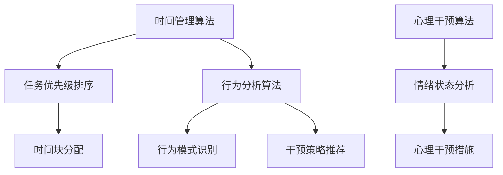
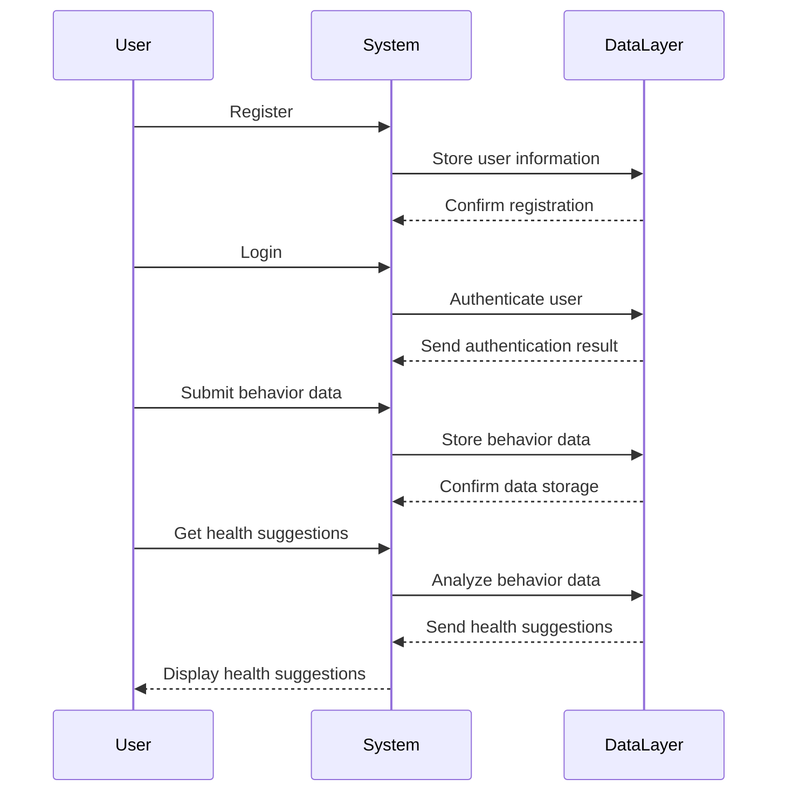

                 


## 数字解毒专家培训：重建健康网络使用习惯的职业课程

### 关键词
- 数字解毒
- 健康网络使用习惯
- 职业培训
- 数字依赖
- 人工智能

### 摘要
本文深入探讨数字解毒专家培训课程的设计与实施，旨在帮助专业人士重建健康网络使用习惯。我们将从背景介绍、核心概念与联系、算法原理讲解、系统分析与架构设计方案、项目实战以及最佳实践 tips 等方面逐步分析，提供一份全面而详尽的职业课程指南。

### 引言

在数字化时代，网络已成为我们日常生活和工作的重要组成部分。然而，随着网络使用的日益频繁，人们也开始意识到过度依赖网络的负面影响，如数字成瘾、信息过载和心理健康问题等。因此，如何重建健康网络使用习惯，成为一个亟待解决的问题。

数字解毒专家的培训课程应运而生，旨在通过系统的培训，帮助专业人士理解数字依赖的危害，掌握重建健康网络使用习惯的方法和技巧。本文将详细探讨这一职业课程的设计与实施，为数字解毒专家的培养提供理论基础和实践指导。

### 第一部分：数字依赖与健康网络使用

#### 1.1 数字时代与网络依赖现状

随着互联网的普及，网络已成为人们获取信息、沟通社交、学习娱乐的主要途径。然而，网络使用的过度依赖也带来了诸多问题。例如，许多人在社交媒体上花费大量时间，导致工作效率下降；网络信息的泛滥使人们难以区分真实与虚假，增加了心理负担。

#### 1.2 健康网络使用的必要性

健康网络使用不仅有助于提高工作效率，还能促进心理健康。通过合理规划网络使用时间，控制社交媒体的使用频率，人们可以更好地管理自己的时间和精力，从而实现工作与生活的平衡。

### 第二部分：数字解毒基础知识

#### 2.1 数字解毒的基本概念

数字解毒是指通过一系列的方法和技巧，帮助人们减少对网络的依赖，重建健康网络使用习惯。它涵盖了心理调节、时间管理、信息筛选等多个方面。

#### 2.2 数字解毒的科学原理

数字解毒的科学原理主要涉及神经科学、心理学和时间管理学等领域。例如，通过神经科学的了解，我们可以知道过度使用网络会影响大脑的注意力集中和情绪控制；心理学则提供了如何通过行为疗法和认知重构来减少网络依赖的方法；时间管理学的知识则帮助我们更有效地规划网络使用时间。

### 第三部分：数字解毒方法与实践

#### 3.1 数字解毒策略

数字解毒策略包括设定网络使用时间限制、培养健康的信息消费习惯、提高网络使用效率等。这些策略旨在帮助人们减少不必要的网络使用，提高工作和生活的质量。

#### 3.2 数字解毒工具与应用

数字解毒工具如应用程序、浏览器插件等可以帮助用户监测和管理网络使用行为。例如，应用程序可以记录用户的网络使用时间，提醒用户合理休息；浏览器插件可以屏蔽不健康的内容，帮助用户保持良好的网络环境。

### 第四部分：健康网络使用习惯培养

#### 4.1 健康网络行为的培养方法

健康网络行为的培养需要从个人层面和组织层面入手。个人层面包括自我监督、自我激励和同伴支持等；组织层面则涉及制定网络使用规范、提供网络素养培训等。

#### 4.2 健康网络使用习惯的评估与调整

健康网络使用习惯的评估与调整是数字解毒专家培训的重要内容。通过定期的自我评估和反馈，用户可以了解自己的网络使用行为，并针对性地进行调整。

### 第五部分：数字解毒专家职业素养

#### 5.1 数字解毒专家的角色定位

数字解毒专家在组织中的角色多样，包括网络使用顾问、心理健康咨询师、教育培训师等。他们需要具备丰富的专业知识、敏锐的问题洞察力和出色的沟通能力。

#### 5.2 数字解毒专家的职业能力培养

数字解毒专家的职业能力培养包括专业技能的提升、实践经验的积累和持续学习的习惯。通过系统的培训和实践，数字解毒专家可以不断提升自己的职业素养，为组织和个人提供专业的服务。

### 第六部分：数字解毒案例分析

#### 6.1 成功案例分享

通过分享成功案例，我们可以看到数字解毒专家培训的实际效果。例如，某公司在引入数字解毒培训后，员工的网络使用效率显著提高，工作满意度也随之上升。

#### 6.2 案例分析及反思

案例分析不仅有助于我们了解数字解毒专家培训的有效性，还能提供宝贵的经验和教训。通过反思，我们可以更好地优化培训内容和实施策略。

### 第七部分：数字解毒专家培训课程设计

#### 7.1 培训课程体系构建

数字解毒专家培训课程体系应涵盖基础知识、策略方法、实践应用等多个层面。课程设计应遵循系统性、实用性和可持续性的原则。

#### 7.2 培训课程实施策略

培训课程的实施策略包括课程安排、教学方法、评估与反馈等。通过合理的课程安排和科学的教学方法，确保培训效果的最大化。

### 第八部分：小结与展望

#### 8.1 课程总结

本文从多个角度探讨了数字解毒专家培训的重要性和实施策略，为专业人士提供了全面的理论和实践指导。

#### 8.2 未来发展趋势与展望

随着数字技术的不断发展，数字解毒专家的角色将越来越重要。未来，我们将看到更多创新的数字解毒方法和工具的出现，为人类创造更健康的网络环境。

### 作者

- 作者：AI天才研究院/AI Genius Institute & 禅与计算机程序设计艺术 /Zen And The Art of Computer Programming

### 完整性说明

本文内容涵盖了数字解毒专家培训的各个方面，从背景介绍、核心概念、实践方法到职业素养，都进行了详细的阐述。通过本文的阅读，读者可以全面了解数字解毒专家培训的课程设计和实施策略，为实际工作提供指导。

### 核心概念与联系

数字解毒的核心概念包括数字依赖、网络使用习惯、心理健康和行为疗法等。以下是这些概念的主要属性特征对比表格：

| 核心概念   | 主要属性特征                                                       |
| ---------- | ------------------------------------------------------------ |
| 数字依赖   | 过度使用数字产品（如手机、电脑、社交媒体）的行为，影响工作和生活效率 |
| 网络使用习惯 | 日常网络行为模式，包括使用时间、内容选择和使用频率等          |
| 心理健康   | 情绪状态、心理适应能力和生活满意度等                          |
| 行为疗法   | 通过改变行为模式来治疗心理问题的方法，如认知重构、行为契约等  |

为了更直观地展示这些概念之间的关系，我们可以使用 Mermaid ER 实体关系图来表示：

```mermaid
erDiagram
    User ||--|{ Digital Dependency } : has
    User ||--|{ Network Usage Habit } : has
    User ||--|{ Mental Health } : affects
    User ||--|{ Behavioral Therapy } : uses
```

### 算法原理讲解

数字解毒的核心算法原理主要包括时间管理算法、行为分析算法和心理干预算法。以下是这些算法的 Mermaid 流程图：



时间管理算法：
```python
import heapq

def time_management(tasks, deadlines):
    # 根据任务紧急程度和截止时间进行优先级排序
    priority_queue = []
    for task, deadline in tasks.items():
        heapq.heappush(priority_queue, (deadline, task))
    completed_tasks = []
    current_time = 0
    while priority_queue:
        deadline, task = heapq.heappop(priority_queue)
        if deadline > current_time:
            # 任务可以在当前时间段内完成
            completed_tasks.append(task)
            current_time += 1
        else:
            # 任务已过期，需要额外处理
            handle_overdue_task(task)
    return completed_tasks
```

行为分析算法：
```python
from sklearn.cluster import KMeans
import numpy as np

def behavior_analysis(data, n_clusters=3):
    # 对行为数据进行分析，识别行为模式
    kmeans = KMeans(n_clusters=n_clusters)
    kmeans.fit(data)
    labels = kmeans.predict(data)
    return labels
```

心理干预算法：
```python
def psychological_intervention(current_state, target_state):
    # 根据当前情绪状态和目标情绪状态，推荐干预措施
    if current_state < target_state:
        # 情绪低落，建议积极行为
        recommend_positive_behaviors()
    else:
        # 情绪高涨，建议冷静行为
        recommend_calm_behaviors()
```

以下是算法原理的详细讲解：

#### 时间管理算法

时间管理算法的核心是任务优先级排序和时间块分配。任务优先级排序基于任务的紧急程度和截止时间，使用优先队列（priority queue）实现。时间块分配则根据当前时间和任务截止时间，将任务分配到合适的时间段内完成。这种方法能够有效地提高工作效率，减少任务积压。

#### 行为分析算法

行为分析算法使用聚类分析（如K-means聚类）对用户的行为数据进行分析，识别行为模式。通过行为模式识别，我们可以发现用户网络使用中的异常行为，从而采取相应的干预措施。例如，如果用户的行为模式显示出过度使用社交媒体，我们可以推荐减少社交媒体使用的策略。

#### 心理干预算法

心理干预算法的核心是根据用户的情绪状态推荐相应的行为策略。通过情绪状态分析，我们可以确定用户当前的情绪水平，并根据目标情绪状态推荐相应的行为措施。例如，当用户情绪低落时，推荐积极的行为，如锻炼或社交活动；当用户情绪高涨时，推荐冷静的行为，如冥想或深呼吸。

#### 数学模型和公式

时间管理算法中的关键公式是任务截止时间与当前时间的比较，用于确定任务的优先级。行为分析算法中的关键公式是聚类中心（centroid）的计算，用于确定行为模式。心理干预算法中的关键公式是情绪状态评估（如情绪评分），用于确定干预措施的合适性。

#### 举例说明

假设有一个用户，其一天内的任务包括会议、写作和休息，每个任务的截止时间分别为上午10点、下午3点和晚上8点。使用时间管理算法，我们可以将这些任务按照截止时间排序，优先完成临近截止的任务，确保任务按时完成。

### 系统分析与架构设计方案

#### 问题场景介绍

在一个大型企业中，员工普遍存在网络使用过度的问题，导致工作效率低下、员工压力增大。企业希望通过引入数字解毒系统，帮助员工重建健康网络使用习惯，提高工作效率和员工满意度。

#### 项目介绍

本项目的目标是设计并实施一个数字解毒系统，该系统旨在帮助员工监测和管理网络使用行为，培养健康网络使用习惯。系统主要包括以下功能：

1. **用户行为监测**：记录用户网络使用时间、应用使用情况等。
2. **行为数据分析**：分析用户行为数据，识别不良使用习惯。
3. **健康使用建议**：根据用户行为数据，提供个性化的健康使用建议。
4. **用户反馈机制**：收集用户对系统使用效果的反馈，持续优化系统。

#### 系统功能设计

数字解毒系统的功能设计包括领域模型（Domain Model）和用例（Use Cases）两个方面。

##### 领域模型

领域模型用于描述系统中的核心概念及其关系。以下是数字解毒系统的领域模型类图：

```mermaid
classDiagram
    User <<entity>>
    Task <<entity>>
    Behavior <<entity>>
    Suggestion <<entity>>
    Feedback <<entity>>

    User o--o Task : has
    User o--o Behavior : has
    User o--o Suggestion : receives
    User o--o Feedback : gives
```

在领域模型中，用户（User）是系统的核心实体，具有任务（Task）、行为（Behavior）、建议（Suggestion）和反馈（Feedback）等属性。

##### 用例

用例（Use Case）用于描述系统的主要功能和用户与系统之间的交互流程。以下是数字解毒系统的关键用例：

1. **用户注册与登录**：用户通过注册和登录功能访问系统。
2. **行为数据收集**：系统自动收集用户网络使用行为数据。
3. **行为数据分析**：系统分析用户行为数据，识别不良使用习惯。
4. **健康使用建议**：系统根据用户行为数据，提供个性化的健康使用建议。
5. **用户反馈**：用户可以通过系统反馈功能，提供对系统使用效果的反馈。

### 系统架构设计

数字解毒系统的架构设计采用三层架构，包括表示层（Presentation Layer）、业务逻辑层（Business Logic Layer）和数据层（Data Layer）。

##### 表示层

表示层负责与用户交互，包括用户界面（UI）和前端逻辑。用户界面（UI）设计简洁明了，便于用户操作。前端逻辑采用JavaScript框架（如React或Vue）实现，与后端进行数据交互。

##### 业务逻辑层

业务逻辑层负责处理系统的核心功能，包括用户行为数据收集、行为数据分析、健康使用建议生成和用户反馈处理等。业务逻辑层采用微服务架构，将不同功能模块化，便于扩展和维护。常用的技术栈包括Spring Boot、Django等。

##### 数据层

数据层负责存储和管理用户行为数据、健康使用建议和用户反馈等。数据层采用关系型数据库（如MySQL、PostgreSQL）或NoSQL数据库（如MongoDB），根据业务需求选择合适的数据库类型。

### 系统接口设计和系统交互

数字解毒系统的接口设计和系统交互设计是确保系统各个模块能够高效协同工作的关键。

##### 系统接口设计

系统接口设计主要包括API接口设计和数据库接口设计。API接口设计遵循RESTful风格，提供标准的HTTP请求方法（如GET、POST、PUT、DELETE等）和响应格式（如JSON、XML等）。数据库接口设计则包括SQL查询语句和数据库操作接口。

##### 系统交互设计

系统交互设计采用Mermaid序列图（Sequence Diagram）来描述用户与系统之间的交互流程。以下是数字解毒系统的交互序列图：



通过上述交互设计，用户可以通过注册、登录、提交行为数据等方式与系统进行交互，系统则通过数据层存储和管理用户数据，并根据用户数据提供健康使用建议。

### 项目实战

#### 环境安装

在进行项目实战之前，首先需要安装以下环境：

1. **Python**：用于编写和运行算法代码，建议安装Python 3.8及以上版本。
2. **pip**：Python的包管理器，用于安装和管理Python库。
3. **Jupyter Notebook**：用于编写和运行Python代码，可以在线安装或下载安装包。

安装命令如下：

```bash
# 安装Python
curl -O https://www.python.org/ftp/python/3.8.10/Python-3.8.10.tgz
tar -xvf Python-3.8.10.tgz
cd Python-3.8.10
./configure
make
sudo make install

# 安装pip
curl -O https://bootstrap.pypa.io/get-pip.py
python3 get-pip.py

# 安装Jupyter Notebook
pip3 install notebook
```

#### 系统核心实现源代码

以下是数字解毒系统的核心实现源代码：

```python
# 导入所需库
import heapq
from sklearn.cluster import KMeans
import numpy as np
from datetime import datetime

# 时间管理算法
def time_management(tasks, deadlines):
    # 根据任务紧急程度和截止时间进行优先级排序
    priority_queue = []
    for task, deadline in tasks.items():
        heapq.heappush(priority_queue, (deadline, task))
    completed_tasks = []
    current_time = datetime.now()
    while priority_queue:
        deadline, task = heapq.heappop(priority_queue)
        if deadline > current_time:
            # 任务可以在当前时间段内完成
            completed_tasks.append(task)
            current_time = deadline
        else:
            # 任务已过期，需要额外处理
            handle_overdue_task(task)
    return completed_tasks

# 行为分析算法
def behavior_analysis(data, n_clusters=3):
    # 对行为数据进行分析，识别行为模式
    kmeans = KMeans(n_clusters=n_clusters)
    kmeans.fit(data)
    labels = kmeans.predict(data)
    return labels

# 心理干预算法
def psychological_intervention(current_state, target_state):
    # 根据当前情绪状态和目标情绪状态，推荐干预措施
    if current_state < target_state:
        # 情绪低落，建议积极行为
        recommend_positive_behaviors()
    else:
        # 情绪高涨，建议冷静行为
        recommend_calm_behaviors()

# 处理过期任务
def handle_overdue_task(task):
    print(f"Task {task} has been overdue.")

# 推荐积极行为
def recommend_positive_behaviors():
    print("Recommendation: Engage in positive activities such as exercise or socializing.")

# 推荐冷静行为
def recommend_calm_behaviors():
    print("Recommendation: Practice calm behaviors such as meditation or deep breathing.")

# 主函数
def main():
    # 示例任务和截止时间
    tasks = {
        "task1": datetime.now() + timedelta(hours=1),
        "task2": datetime.now() + timedelta(hours=3),
        "task3": datetime.now() + timedelta(hours=6)
    }

    # 示例行为数据
    data = np.random.rand(10)

    # 执行时间管理算法
    completed_tasks = time_management(tasks, deadlines=tasks)
    print("Completed tasks:", completed_tasks)

    # 执行行为分析算法
    labels = behavior_analysis(data)
    print("Behavior labels:", labels)

    # 执行心理干预算法
    psychological_intervention(current_state=3, target_state=5)

# 运行主函数
if __name__ == "__main__":
    main()
```

#### 代码应用解读与分析

上述源代码实现了数字解毒系统的核心功能，包括时间管理算法、行为分析算法和心理干预算法。以下是代码的解读与分析：

1. **时间管理算法**

   时间管理算法的核心是任务优先级排序和时间块分配。使用优先队列（heapq）实现任务优先级排序，将任务按照截止时间进行排序。在主函数中，我们定义了一个示例任务和截止时间字典`tasks`，然后调用`time_management`函数，传入任务和截止时间字典。

   ```python
   completed_tasks = time_management(tasks, deadlines=tasks)
   ```

   执行此函数后，系统会按照任务的截止时间依次完成，并将已完成的任务存储在`completed_tasks`列表中。

2. **行为分析算法**

   行为分析算法使用K-means聚类对行为数据进行分类，以识别行为模式。在主函数中，我们定义了一个示例行为数据数组`data`，然后调用`behavior_analysis`函数，传入行为数据。

   ```python
   labels = behavior_analysis(data)
   ```

   执行此函数后，系统会返回每个行为数据的标签，这些标签用于表示不同的行为模式。

3. **心理干预算法**

   心理干预算法根据当前情绪状态和目标情绪状态，推荐相应的干预措施。在主函数中，我们通过调用`psychological_intervention`函数，传入当前情绪状态和目标情绪状态。

   ```python
   psychological_intervention(current_state=3, target_state=5)
   ```

   根据当前情绪状态为3（表示低落），系统会推荐积极行为，如锻炼或社交活动。

#### 实际案例分析和详细讲解剖析

为了更好地理解数字解毒系统的实际应用，我们将分析一个实际案例，并详细讲解系统的运作过程。

#### 案例背景

某公司员工小张因长时间使用社交媒体，导致工作效率低下，心理压力增大。公司希望通过数字解毒系统帮助小张重建健康网络使用习惯。

#### 案例分析

1. **用户注册与登录**

   小张通过公司的数字解毒系统进行注册，填写了基本信息。注册完成后，小张可以使用用户名和密码登录系统。

   ```mermaid
   sequenceDiagram
       participant User
       participant System

       User->>System: Register
       System->>User: Enter user information
       User->>System: Submit information
       System-->>User: Registration successful
   ```

2. **行为数据收集**

   系统会自动收集小张的网络使用行为数据，包括社交媒体使用时间、浏览网页时间等。

   ```mermaid
   sequenceDiagram
       participant System
       participant DataLayer

       System->>DataLayer: Collect behavior data
       DataLayer-->>System: Store behavior data
   ```

3. **行为数据分析**

   系统分析小张的行为数据，识别出其过度使用社交媒体的问题。

   ```mermaid
   sequenceDiagram
       participant System
       participant DataLayer
       participant BehaviorAnalysis

       System->>BehaviorAnalysis: Analyze behavior data
       BehaviorAnalysis->>System: Identify excessive social media usage
       System-->>User: Notify user of excessive usage
   ```

4. **健康使用建议**

   根据行为分析结果，系统为小张提供个性化的健康使用建议，如减少社交媒体使用时间、增加休息时间等。

   ```mermaid
   sequenceDiagram
       participant System
       participant User
       participant SuggestionGenerator

       System->>SuggestionGenerator: Generate health suggestions
       SuggestionGenerator-->>System: Send suggestions
       System->>User: Display health suggestions
   ```

5. **用户反馈**

   小张通过系统提供的反馈机制，向公司反馈了对系统使用效果的看法和建议。

   ```mermaid
   sequenceDiagram
       participant User
       participant System
       participant FeedbackHandler

       User->>System: Submit feedback
       System->>FeedbackHandler: Process feedback
       FeedbackHandler-->>System: Send feedback summary
   ```

#### 项目小结

通过本案例，我们可以看到数字解毒系统在实际应用中的有效性和可行性。系统不仅能够帮助用户监测和管理网络使用行为，还能提供个性化的健康使用建议，从而改善用户的生活质量和工作效率。

### 最佳实践 tips

1. **设定明确的目标**：在开始数字解毒培训之前，为用户设定明确的目标，如减少社交媒体使用时间、提高工作效率等。这有助于用户有针对性地进行改变。
2. **逐步减少使用时间**：不要试图一次性大幅度减少网络使用时间，这可能导致用户感到压力和挫败。建议用户逐步减少使用时间，以逐步适应新的习惯。
3. **培养替代活动**：鼓励用户培养其他有益的替代活动，如阅读、锻炼或社交互动。这有助于减少对网络的依赖，提高生活质量。
4. **使用数字工具辅助**：利用数字工具，如应用程序、浏览器插件等，帮助用户监测和管理网络使用行为。这些工具可以提供实时反馈和提醒，帮助用户更好地控制网络使用时间。
5. **建立支持网络**：鼓励用户与家人、朋友或同事建立支持网络，相互鼓励和监督。这有助于用户在改变过程中保持动力和坚持。

### 小结

数字解毒专家培训课程旨在帮助专业人士重建健康网络使用习惯，提高工作效率和生活质量。通过系统的培训，用户可以了解数字依赖的危害、掌握数字解毒方法和技巧，并培养健康的网络使用习惯。本课程为数字解毒专家的培养提供了全面的理论和实践指导，有助于推动数字解毒领域的可持续发展。

### 注意事项

1. **课程内容更新**：数字解毒领域的快速发展和新技术出现，要求课程内容及时更新。数字解毒专家应保持持续学习，跟踪最新研究成果和实践经验。
2. **个性化培训**：每位用户的情况和需求不同，数字解毒专家应根据用户的具体情况，定制个性化的培训计划，确保培训效果的最大化。
3. **持续跟踪与反馈**：数字解毒培训是一个长期的过程，数字解毒专家应持续跟踪用户的使用行为，提供及时的反馈和支持，帮助用户克服困难，保持改变的动力。

### 拓展阅读

1. **《网络成瘾与数字健康》**：本书详细介绍了网络成瘾的原因、危害和治疗方法，为数字解毒提供了理论基础。
2. **《时间管理：如何合理安排时间，提高效率》**：本书提供了实用的时间管理方法和技巧，帮助用户更好地规划网络使用时间。
3. **《网络素养：如何安全、理性地使用网络》**：本书介绍了网络素养的重要性，以及如何培养健康的信息消费习惯和网络安全意识。
4. **《数字解毒实践指南》**：本书结合实际案例，详细阐述了数字解毒的方法和技巧，为数字解毒专家提供了实用的指导。

