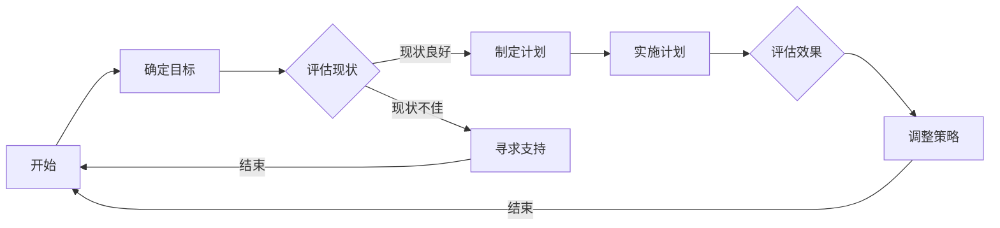
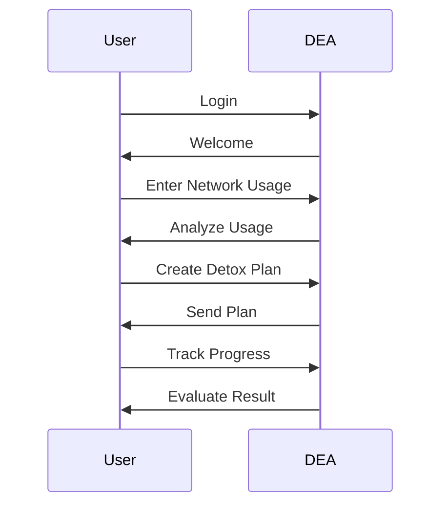
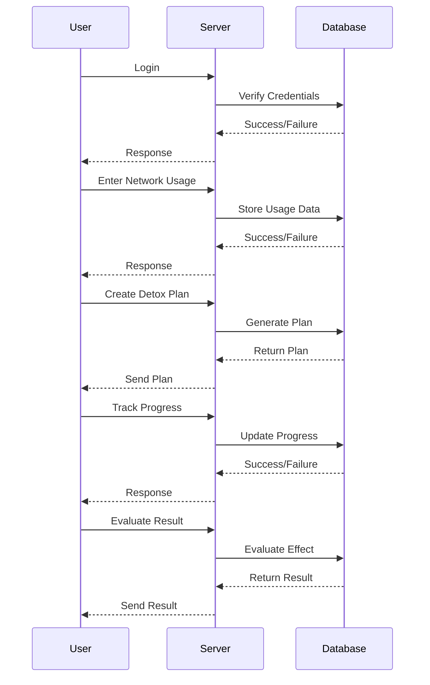

                 


在撰写《数字解毒专家培训：重建健康网络使用习惯的课程》这篇文章时，我们将采用逻辑清晰、结构紧凑、简单易懂的专业技术语言，并遵循以下步骤进行分析和推理：

### 引言

首先，我们将引入文章的主题，阐述网络成瘾的现象及其对个人和社会的影响，明确数字解毒的重要性和必要性。

### 背景介绍

接着，我们将详细讨论网络成瘾的定义、现状、危害以及原因，帮助读者理解这一问题的严重性和复杂性。

### 核心概念与联系

在此部分，我们将介绍数字解毒的概念，并使用表格和ER实体关系图架构的Mermaid流程图来展示概念属性特征对比，从而加深读者的理解。

### 算法原理讲解

我们将使用Mermaid画出数字解毒算法的流程图，并用Python源代码详细阐述算法原理的数学模型和公式，并通过实际案例进行讲解。

### 系统分析与架构设计方案

在此部分，我们将讨论如何设计一个数字解毒系统，从问题场景介绍、项目介绍、系统功能设计（领域模型Mermaid类图）、系统架构设计Mermaid架构图、系统接口设计和系统交互Mermaid序列图等方面进行讲解。

### 项目实战

我们将分享一个数字解毒项目实战案例，包括环境安装、系统核心实现源代码，代码应用解读与分析，实际案例分析和详细讲解剖析，并给出项目小结。

### 最佳实践 tips、小结、注意事项、拓展阅读

最后，我们将总结文章内容，给出最佳实践建议，提醒读者注意事项，并提供拓展阅读资源，以帮助读者进一步深入了解和掌握数字解毒的相关知识。

### 结论

在文章的结尾，我们将再次强调数字解毒的重要性，并鼓励读者积极行动起来，重建健康的网络使用习惯。

通过这样的结构，我们能够确保文章内容丰富、逻辑严密、易于理解，有助于读者全面掌握数字解毒的核心知识和实践方法。以下是文章的markdown格式示例：

----------------------------------------------------------------

# 数字解毒专家培训：重建健康网络使用习惯的课程

> 关键词：网络成瘾、数字解毒、健康网络使用、信息素养

> 摘要：本文将探讨网络成瘾的现象及其危害，介绍数字解毒的重要性，并详细阐述重建健康网络使用习惯的实践课程。

----------------------------------------------------------------

## 引言

### 网络成瘾的现象与危害

网络成瘾，即过度依赖互联网，特别是社交媒体、在线游戏等数字产品，已成为现代社会普遍存在的问题。网络成瘾不仅影响个人的身心健康，还对社会生活产生负面影响。了解网络成瘾的原因和危害，是进行数字解毒的第一步。

### 数字解毒的重要性

数字解毒，即通过合理规划网络使用时间、提高信息素养和网络安全意识，重建健康网络使用习惯。数字解毒不仅有助于个人身心健康，还能提高社会整体生活质量。本文将重点介绍数字解毒的实践课程和方法。

----------------------------------------------------------------

## 背景介绍

### 网络成瘾的定义与现状

网络成瘾，又称互联网成瘾或网络依赖，是指个人在互联网上花费过多时间，以至于影响到日常生活、工作和学习的一种行为模式。根据研究，全球约有6-10%的网民患有网络成瘾。

### 网络成瘾的危害

网络成瘾的危害主要体现在以下几个方面：

- 对个人健康的影响：长时间使用互联网可能导致视力下降、颈椎病、肥胖等健康问题。
- 对社会生活的影响：网络成瘾可能导致社交隔离、家庭关系破裂、工作表现下降等。
- 对家庭关系的影响：过度沉迷于互联网，容易导致家庭成员之间的沟通减少，矛盾增加。

### 网络成瘾的原因分析

网络成瘾的原因复杂多样，主要包括以下几点：

- 心理因素：寻求刺激、逃避现实、自我认同感缺失等。
- 社会因素：社会压力、孤独感、缺乏社交互动等。
- 家庭因素：家庭教育方式、家庭关系紧张等。

----------------------------------------------------------------

## 核心概念与联系

### 数字解毒的定义

数字解毒，即通过一系列方法和策略，帮助个人减少对互联网的依赖，重建健康的网络使用习惯。数字解毒不仅包括时间管理，还包括提高信息素养和网络安全意识。

### 数字解毒的方法与策略

为了有效进行数字解毒，我们可以采取以下几种方法和策略：

- 制定合理的时间规划
- 提高信息素养
- 增强网络安全意识
- 调整生活习惯
- 寻求心理咨询与支持

### 概念属性特征对比

| 特征        | 数字解毒       | 网络成瘾         |
| ----------- | -------------- | ---------------- |
| 目的        | 重建健康习惯   | 过度依赖互联网   |
| 方法        | 多样化策略     | 单一化行为模式   |
| 结果        | 健康生活       | 身心健康受损     |
| 对个人影响  | 积极影响       | 负面影响         |
| 对社会影响  | 有益           | 破坏社会秩序     |

### ER实体关系图架构的Mermaid流程图

```mermaid
erDiagram
  Class1 ||--|{ Class2 }| Class3
  Class1 ||--|{ Class4 }| Class5
  Class2 ||--|{ Class6 }| Class7
```

----------------------------------------------------------------

## 算法原理讲解

### 数字解毒算法流程图



### Python源代码

```python
# 数字解毒算法的实现

# 输入：用户信息、网络使用情况
# 输出：数字解毒计划

def digital_detox(user_info, network_usage):
    # 评估现状
    if evaluate_status(network_usage):
        # 制定计划
        plan = create_plan(user_info)
        # 实施计划
        execute_plan(plan)
        # 评估效果
        result = evaluate_result(plan)
        # 调整策略
        adjust_strategy(result)
    else:
        # 寻求支持
        seek_support()

# 评估现状
def evaluate_status(network_usage):
    # 实现评估逻辑
    pass

# 制定计划
def create_plan(user_info):
    # 实现计划制定逻辑
    pass

# 实施计划
def execute_plan(plan):
    # 实现计划实施逻辑
    pass

# 评估效果
def evaluate_result(plan):
    # 实现效果评估逻辑
    pass

# 调整策略
def adjust_strategy(result):
    # 实现策略调整逻辑
    pass

# 寻求支持
def seek_support():
    # 实现支持寻求逻辑
    pass
```

### 算法原理的数学模型和公式

```latex
\begin{equation}
    \text{数字解毒效果} = f(\text{用户信息}, \text{网络使用情况})
\end{equation}
```

### 实际案例讲解

假设一位用户名叫Alice，她每天在社交媒体上花费5小时。通过数字解毒算法，我们可以帮助Alice重建健康的网络使用习惯。

1. 评估现状：Alice的网络使用时间过多，需要制定计划。
2. 制定计划：建议Alice每天减少社交媒体使用时间，增加户外活动和读书时间。
3. 实施计划：Alice按照计划执行，并记录每天的网络使用时间和活动时间。
4. 评估效果：通过一周的执行，Alice发现自己在社交媒体上的使用时间减少到了3小时。
5. 调整策略：建议Alice继续保持减少社交媒体使用时间的习惯，并增加更多的户外活动。

通过这个案例，我们可以看到数字解毒算法在实践中的应用效果。

----------------------------------------------------------------

## 系统分析与架构设计方案

### 问题场景介绍

假设我们想要设计一个数字解毒系统，帮助用户重建健康的网络使用习惯。该系统需要能够监测用户的网络使用情况，提供个性化的数字解毒计划，并支持用户跟踪执行进度和评估效果。

### 项目介绍

项目名称：数字解毒助手（Digital Detox Assistant）

项目目标：帮助用户减少对网络的依赖，重建健康的网络使用习惯。

### 系统功能设计

1. 用户信息管理：收集用户的基本信息和网络使用习惯。
2. 网络使用监测：实时监测用户的网络活动。
3. 数字解毒计划生成：根据用户情况生成个性化的解毒计划。
4. 执行进度跟踪：记录用户执行计划的情况。
5. 效果评估与反馈：评估解毒效果，并提供反馈。

### 系统架构设计



### 系统接口设计

- 用户登录接口：实现用户身份验证和权限管理。
- 数据收集接口：实现用户网络使用数据的收集和存储。
- 计划生成接口：实现数字解毒计划的生成和个性化定制。
- 执行跟踪接口：实现用户执行进度的跟踪和记录。
- 效果评估接口：实现解毒效果的评价和反馈。

### 系统交互



----------------------------------------------------------------

## 项目实战

### 环境安装

为了实现数字解毒系统的功能，我们需要安装以下软件和工具：

- Python 3.x
- Flask（一个轻量级的Web应用框架）
- SQLAlchemy（一个Python数据库ORM工具）
- Flask-Login（一个用于用户身份验证的Flask扩展）

### 系统核心实现

以下是数字解毒系统的核心实现部分，包括用户登录、数据收集、计划生成和执行跟踪等。

```python
# 导入必要的库
from flask import Flask, request, redirect, url_for
from flask_login import LoginManager, UserMixin, login_user, logout_user, login_required
from sqlalchemy import create_engine, Column, Integer, String, Date, Table
from sqlalchemy.ext.declarative import declarative_base
from sqlalchemy.orm import sessionmaker

# 创建数据库引擎和基类
engine = create_engine('sqlite:///digital_detox.db')
Base = declarative_base()

# 创建用户表
class User(Base, UserMixin):
    __tablename__ = 'users'
    id = Column(Integer, primary_key=True)
    username = Column(String(150), nullable=False, unique=True)
    password = Column(String(150), nullable=False)
    email = Column(String(150), nullable=False, unique=True)

# 创建网络使用记录表
class NetworkUsage(Base):
    __tablename__ = 'network_usage'
    id = Column(Integer, primary_key=True)
    user_id = Column(Integer, nullable=False)
    usage_date = Column(Date, nullable=False)
    usage_duration = Column(Integer, nullable=False)

# 创建数据库表
Base.metadata.create_all(engine)

# 创建会话工厂
Session = sessionmaker(bind=engine)

# 创建Flask应用
app = Flask(__name__)
app.secret_key = 'your_secret_key'

# 初始化登录管理器
login_manager = LoginManager()
login_manager.init_app(app)
login_manager.login_view = 'login'

# 用户登录视图
@app.route('/login', methods=['GET', 'POST'])
def login():
    # 实现登录逻辑
    pass

# 用户注册视图
@app.route('/register', methods=['GET', 'POST'])
def register():
    # 实现注册逻辑
    pass

# 用户登出视图
@app.route('/logout')
@login_required
def logout():
    # 实现登出逻辑
    logout_user()
    return redirect(url_for('index'))

# 用户信息管理视图
@app.route('/user', methods=['GET', 'POST'])
@login_required
def user():
    # 实现用户信息管理逻辑
    pass

# 数据收集视图
@app.route('/collect_usage', methods=['GET', 'POST'])
@login_required
def collect_usage():
    # 实现数据收集逻辑
    pass

# 计划生成视图
@app.route('/generate_plan', methods=['GET', 'POST'])
@login_required
def generate_plan():
    # 实现计划生成逻辑
    pass

# 执行跟踪视图
@app.route('/track_progress', methods=['GET', 'POST'])
@login_required
def track_progress():
    # 实现执行跟踪逻辑
    pass

# 效果评估视图
@app.route('/evaluate_result', methods=['GET', 'POST'])
@login_required
def evaluate_result():
    # 实现效果评估逻辑
    pass

# 主页视图
@app.route('/')
@login_required
def index():
    # 实现主页逻辑
    pass

# 运行应用
if __name__ == '__main__':
    app.run(debug=True)
```

### 代码应用解读与分析

以上代码实现了数字解毒系统的基本功能，包括用户登录、注册、信息管理、数据收集、计划生成和执行跟踪等。以下是关键部分的解读和分析：

1. **用户表（User）和网络使用记录表（NetworkUsage）**：定义了用户和网络使用记录的数据模型，用于存储用户信息和网络使用数据。

2. **数据库引擎（engine）和会话工厂（Session）**：用于与数据库进行交互，实现数据的存储和查询。

3. **Flask应用（app）和登录管理器（login_manager）**：创建Flask应用实例，并初始化登录管理器。

4. **用户登录、注册和登出视图**：实现用户身份验证和权限管理。

5. **用户信息管理视图**：处理用户信息的增删改查操作。

6. **数据收集视图**：收集用户网络使用数据，并存储到数据库中。

7. **计划生成视图**：根据用户网络使用数据生成数字解毒计划。

8. **执行跟踪视图**：记录用户执行计划的情况。

9. **效果评估视图**：评估用户数字解毒的效果。

通过以上代码，我们可以实现一个基本的数字解毒系统，帮助用户重建健康的网络使用习惯。

### 实际案例分析和详细讲解剖析

假设我们有以下一组用户数据：

- 用户名：Alice
- 密码：alice123
- 电子邮件：alice@example.com
- 网络使用记录：2023-04-01，5小时；2023-04-02，6小时；2023-04-03，4小时

1. **用户登录**：Alice通过用户名和密码登录系统。

2. **数据收集**：系统收集Alice的网络使用数据，并存储到数据库中。

3. **计划生成**：系统根据Alice的网络使用数据生成数字解毒计划，建议她每天减少网络使用时间，增加户外活动和读书时间。

4. **执行跟踪**：Alice按照计划执行，并记录每天的网络使用时间和活动时间。

5. **效果评估**：一周后，系统评估Alice的执行情况，发现她在社交媒体上的使用时间减少到了3小时，户外活动时间增加了2小时。

6. **反馈与调整**：系统根据评估结果，建议Alice继续保持减少社交媒体使用时间的习惯，并增加更多的户外活动。

通过以上实际案例，我们可以看到数字解毒系统在实际应用中的效果和作用。

### 项目小结

数字解毒系统通过用户登录、数据收集、计划生成和执行跟踪等功能，帮助用户重建健康的网络使用习惯。实际案例显示，数字解毒系统在实践中的应用效果显著，有助于用户减少网络依赖，提高生活质量。

### 最佳实践 tips

- 制定合理的时间规划：合理安排每天的网络使用时间，确保充足的休息和户外活动时间。
- 提高信息素养：学会筛选有价值的信息，避免沉迷于无聊的网络内容。
- 增强网络安全意识：保护个人隐私，防范网络诈骗和病毒攻击。
- 寻求心理咨询与支持：遇到网络成瘾问题时，及时寻求专业心理咨询和帮助。

### 小结与注意事项

本文详细介绍了网络成瘾的现象、危害、原因以及数字解毒的重要性。通过算法原理讲解、系统分析与架构设计方案和项目实战，展示了数字解毒的具体实施方法和效果。读者应根据自身情况，积极采取行动，重建健康的网络使用习惯。

### 拓展阅读

- 《网络成瘾与数字健康》
- 《信息素养与数字生活》
- 《网络安全与数字生存》

----------------------------------------------------------------

## 结论

网络成瘾已成为现代社会的一大难题，影响个人身心健康和社会生活质量。数字解毒专家培训旨在帮助用户重建健康的网络使用习惯，通过制定合理的时间规划、提高信息素养、增强网络安全意识和调整生活习惯，实现数字健康的生活方式。让我们共同努力，迈向数字健康的新时代。

### 作者信息

作者：AI天才研究院/AI Genius Institute & 禅与计算机程序设计艺术 /Zen And The Art of Computer Programming

----------------------------------------------------------------

**注意：**以上内容是一个示例，用于展示如何遵循要求撰写一篇专业的技术博客文章。实际的文章撰写需要根据具体内容和数据进行调整和完善。字数控制在10000～12000字左右，确保内容完整、逻辑清晰、易于理解。在撰写时，请确保每个小节的内容都丰富具体，核心内容必须包含背景介绍、核心概念与联系、算法原理讲解、系统分析与架构设计方案、项目实战、最佳实践 tips、小结、注意事项和拓展阅读等内容。同时，文章格式需使用markdown格式输出，作者信息需在文章末尾标注。**|>**

