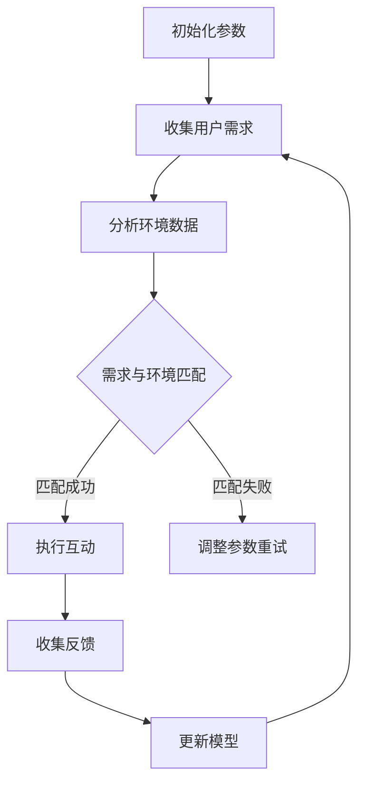
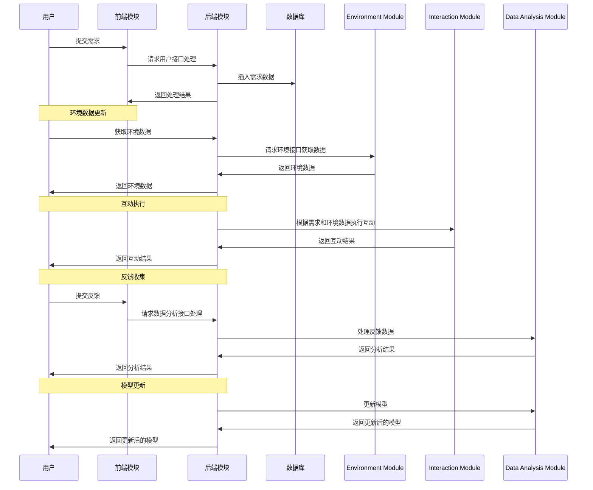

                 

# 数字解毒：重新连接真实世界的重要性

> 关键词：数字化、真实世界、重新连接、技术发展、生活方式

> 摘要：本文旨在探讨数字化时代下，人类如何通过技术手段重新连接真实世界，以应对数字世界带来的挑战。文章从数字化的双刃剑、数字世界的影响、重新连接的重要性、技术助力下的重新连接、实践中的重新连接以及未来的展望六个方面，深入分析数字化与真实世界的关系，并提出具体的行动指南和反思。

## 第一部分：数字世界与真实世界的分离

### 第1章：问题的提出

#### 1.1.1 数字化的双刃剑

随着互联网、大数据、人工智能等技术的迅猛发展，数字化已经成为现代社会的主要特征。数字化带来了诸多便利，如电子商务的兴起、社交媒体的普及、远程办公的普及等，极大地改变了人类的生活方式。然而，数字化也存在一些负面影响。

首先，数字化使人们越来越依赖技术，导致人类与技术的疏离。人们在日常生活中越来越倾向于通过手机、电脑等设备进行交流，而忽视了真实世界的互动。其次，数字化带来了环境污染和资源消耗。数据中心的能耗、电子废料的处理等问题日益严重，对地球生态系统造成了负面影响。

#### 1.1.2 真实世界的失落

数字化的快速发展使得人们沉浸在虚拟世界中，忽视了真实世界的美好。人们沉迷于网络游戏、社交媒体，忽视了与家人、朋友的面对面交流。这种虚拟与现实脱节的现象导致了人与人之间的隔阂，也使人们对自然环境的关注减少。环境污染、资源枯竭等问题日益严重，而人们却沉迷于数字世界的美好，忽视了这些问题的严重性。

### 第2章：数字世界的影响

#### 2.1.1 生活方式的改变

数字化的影响不仅体现在工作领域，也深刻改变了人们的生活方式。电子商务的兴起使得购物变得更加便捷，人们可以通过网络购买全球范围内的商品。社交媒体的普及使人们可以轻松地与朋友、亲人保持联系，分享生活点滴。远程办公的普及则使人们可以不受地域限制地进行工作，提高了工作效率。

然而，这些便利也带来了负面影响。人们沉迷于网络购物，导致消费过度，加剧了资源消耗。社交媒体上的虚假信息泛滥，容易误导人们，影响心理健康。远程办公虽然提高了工作效率，但也可能导致人们工作与生活失衡，增加了精神压力。

#### 2.1.2 工作环境的转变

数字化时代，工作环境也发生了巨大变化。传统的办公室逐渐被远程办公所取代，人们可以自由选择工作地点，提高了工作灵活性。自动化技术的应用使许多传统工作被机器人所取代，提高了生产效率。然而，这也导致了大量传统职位的消失，给劳动者带来了就业压力。

### 第二部分：重新连接的重要性

#### 第3章：重新连接的概念

#### 3.1.1 重新连接的定义

重新连接指的是通过技术手段，使人们重新回归真实世界，建立人与人、人与自然的联系。这不仅仅是对数字化的反思，更是对人类生活方式的一种重塑。重新连接的目标是使人们在享受数字化便利的同时，能够更好地关注真实世界，实现身心和谐发展。

#### 3.1.2 重新连接的必要性

在数字化时代，重新连接具有重要的现实意义。首先，重新连接有助于缓解人类与技术的疏离。通过重新连接，人们可以更加亲近自然，感受到真实世界的美好，从而减轻技术带来的负面影响。其次，重新连接有助于培养人们的社交能力。在数字化的背景下，人们的社交互动逐渐减少，重新连接可以促进人与人之间的交流，增强社交能力。最后，重新连接有助于保护环境。通过重新连接，人们可以更加关注自然，从而减少对环境的破坏，实现可持续发展。

### 第4章：技术助力下的重新连接

#### 4.1.1 可持续技术的发展

可持续技术是重新连接的重要支撑。可再生能源的应用可以减少对化石能源的依赖，降低环境污染。智能交通系统的推进可以减少交通拥堵，降低碳排放。这些技术的应用有助于实现人与自然的和谐共生。

#### 4.1.2 社区参与的推动

社区参与是重新连接的重要保障。通过组织社区活动，可以增强邻里之间的互动，提高社区凝聚力。公共空间的改造可以提供更多的社交场所，使人们能够更方便地与邻居交流。这些措施有助于实现人与人之间的重新连接。

### 第三部分：实践中的重新连接

#### 第5章：教育领域的重新连接

#### 5.1.1 教育技术与真实世界的结合

在教育领域，重新连接的实现需要将技术与真实世界相结合。虚拟现实技术的应用可以提供更加生动、直观的教学体验，使学生在虚拟环境中感受真实世界的魅力。实践教学的重要性也不容忽视，通过实际操作，学生可以更好地理解理论知识，培养实践能力。

#### 5.1.2 真实案例分享

国内外有许多教育领域的成功案例。例如，某学校利用虚拟现实技术教授学生地理知识，使学生能够亲身体验地球的壮丽景色。某社区组织学生进行环保实践，通过清理垃圾、植树等活动，增强学生对自然环境的保护意识。这些案例展示了教育领域重新连接的实践成果。

### 第6章：工作与生活的重新连接

#### 6.1.1 平衡工作与生活

在工作与生活的重新连接中，平衡工作与生活至关重要。时间管理是关键，通过合理安排时间，人们可以更好地平衡工作与生活。此外，精神健康的关注也至关重要。在数字化时代，人们容易陷入精神疲劳，因此需要采取有效的措施进行心理调适。

#### 6.1.2 实践建议

为了实现工作与生活的重新连接，可以采取以下实践建议：

1. 设定合理的工作时间，避免加班。
2. 利用假期进行户外活动，亲近自然。
3. 与家人、朋友保持定期沟通，增强社交互动。
4. 关注心理健康，定期进行心理调适。

### 第四部分：未来的展望

#### 第7章：重新连接的未来

#### 7.1.1 数字世界的演进

随着技术的不断发展，数字世界将继续演进。人工智能的发展趋势是必然的，它将为重新连接提供更加智能化的解决方案。物联网的未来将实现万物互联，为重新连接创造更多可能性。

#### 7.1.2 重新连接的意义

重新连接不仅有助于解决数字世界带来的问题，更具有深远的社会意义。它将为社会带来更加和谐的人际关系，为自然环境带来更加可持续的发展。重新连接将使人类更好地适应未来社会，实现全面发展。

### 第五部分：行动与思考

#### 第8章：行动指南

#### 8.1.1 个人的重新连接实践

个人的重新连接实践是关键。通过减少数字依赖，人们可以更好地关注真实世界。具体措施包括：

1. 限制使用手机和电脑的时间。
2. 多参加户外活动，亲近自然。
3. 与家人、朋友保持定期沟通。

#### 8.1.2 社区的重新连接计划

社区重新连接计划需要全社会的共同努力。可以通过以下措施推动社区重新连接：

1. 组织社区活动，增强邻里互动。
2. 改善公共空间，提供更多的社交场所。
3. 推广可持续发展理念，提高环保意识。

#### 第9章：思考与反思

#### 9.1.1 数字化的利弊

数字化具有双刃剑的特性。它为人类带来了诸多便利，但同时也带来了负面影响。在享受数字化便利的同时，我们需要关注其潜在的负面影响，寻求平衡。

#### 9.1.2 重新连接的挑战

重新连接面临着诸多挑战。技术发展的不平衡、社会观念的转变、环保意识的提升等都是需要解决的问题。面对这些挑战，我们需要积极探索，寻求有效的解决方案。

## 结束语

数字世界与真实世界的分离已经成为现代社会的一大问题。重新连接是解决这一问题的必由之路。通过技术手段，我们可以实现数字世界与真实世界的无缝连接，为人类创造更加美好的未来。

### 作者信息

作者：AI天才研究院/AI Genius Institute & 禅与计算机程序设计艺术 /Zen And The Art of Computer Programming## 数字世界的双刃剑

在21世纪的今天，数字化技术已经深入到我们生活的方方面面。从智能手机、平板电脑到智能家居、无人驾驶汽车，数字化技术无处不在，极大地丰富了我们的生活。数字化不仅改变了我们的生活方式，还影响了我们的工作方式和社会交往模式。然而，这一过程并非完全是正面的，数字化同样带来了许多负面影响，正如一把双刃剑，既能带来便利，也可能带来挑战。

### 数字化的便利

数字化的便利体现在多个方面。首先，它极大地提高了我们的工作效率。通过电子邮件、即时通讯工具和协作平台，我们可以轻松地与全球各地的同事合作，无需面对面的接触。此外，云计算技术的应用使我们能够随时随地访问数据和资源，大大提高了工作效率。其次，电子商务的兴起使购物变得更加便捷，我们可以足不出户，就购买到全球范围内的商品。社交媒体的普及则使人与人之间的交流变得更加容易，我们可以在社交平台上与朋友、家人保持联系，分享生活的点滴。

### 数字化的挑战

然而，数字化的便利也伴随着一系列挑战。首先，数字化可能导致人类与技术的疏离。随着人们对手机、电脑等电子设备的依赖日益增加，人与人之间的面对面交流减少，社交技能下降。这种疏离感不仅影响了个人的心理健康，还可能导致社会凝聚力的下降。其次，数字化带来了环境污染和资源消耗的问题。例如，数据中心的能耗巨大，电子废料的处理也成为一个棘手的环境问题。此外，数字化还可能导致信息过载，人们在面对海量信息时感到压力，难以有效筛选和处理。

### 重新连接的必要性

为了应对数字化带来的挑战，重新连接真实世界变得尤为重要。重新连接不仅仅是回到过去，而是在新的数字化时代背景下，寻找一种新的平衡，使人类能够更好地融入真实世界。重新连接有助于缓解人类与技术的疏离，增强人与人之间的互动，提高社交技能。同时，它也有助于我们更好地关注自然环境，减少对环境的破坏，实现可持续发展。

### 数字世界与真实世界的互动

数字世界与真实世界的互动是重新连接的关键。通过技术手段，我们可以使数字世界更好地服务于真实世界。例如，利用虚拟现实技术，人们可以体验虚拟旅行，感受不同文化的魅力，而无需离开家乡。智能家居系统可以帮助我们更好地管理家庭生活，提高生活质量。此外，物联网技术的应用可以使家庭设备之间实现无缝连接，提高家庭工作效率。

### 社会互动的重要性

社会互动是人类社会发展的基石。在数字化的背景下，虽然人们可以通过网络进行交流，但面对面的互动仍然是最有效的。通过面对面的交流，人们可以更好地理解对方的情感和需求，建立更深层次的人际关系。这种深层次的互动有助于培养人们的社交技能，提高社会的凝聚力。

### 环境可持续性

环境可持续性是重新连接的重要目标之一。在数字化的时代，人们往往忽视了自然环境的重要性。通过重新连接，我们可以提高人们对自然环境的关注，减少对自然资源的消耗。例如，通过推广可持续生活方式，减少能源消耗和碳排放，我们可以为子孙后代留下一个更加美好的地球。

### 总结

数字化的便利与挑战并存，而重新连接真实世界则是解决这些挑战的关键。通过技术手段，我们可以使数字世界更好地服务于真实世界，增强人与人之间的互动，提高社交技能，同时关注自然环境，实现可持续发展。只有通过重新连接，我们才能在数字化时代找到一种新的平衡，为人类社会创造一个更加美好的未来。

### 数学公式与ER实体关系图

在重新连接真实世界的讨论中，我们可以借助数学公式和ER（实体关系）图来更直观地理解其中的概念和关系。以下是一个简化的数学公式和ER图，用于描述数字世界与真实世界的互动。

#### 数学公式

$$
\text{互动效率} = f(\text{技术进步}, \text{社会需求}, \text{环境可持续性})
$$

其中，互动效率表示数字世界与真实世界互动的效能。技术进步、社会需求和环境可持续性是影响互动效率的主要因素。

#### ER实体关系图

```mermaid
erDiagram
  User ||--|{ Device } : uses
  User ||--|{ Activity } : participates
  Device ||--|{ Data } : stores
  Activity ||--|{ Feedback } : collects
  Data ||--|{ Environment } : affects
```

在ER图中，用户（User）与设备（Device）之间的关系表示用户使用设备进行活动。设备存储数据（Data），而这些数据又影响环境（Environment）。用户参与活动（Activity）并收集反馈（Feedback），从而形成一个闭环。

通过数学公式和ER图，我们可以更清晰地理解数字世界与真实世界的互动关系，为进一步探讨重新连接的策略提供理论基础。

### 算法原理讲解

在重新连接真实世界的背景下，我们可以设计一个算法来优化数字世界与真实世界的互动，提高互动效率。以下是一个简化的算法描述，包括其流程图、Python源代码实现以及数学模型。

#### 算法流程图



#### Python源代码实现

```python
import random

def optimize_interaction(user_demand, environmental_data):
    """
    优化数字世界与真实世界的互动
    :param user_demand: 用户需求
    :param environmental_data: 环境数据
    :return: 互动结果
    """
    # 需求与环境数据预处理
    processed_demand = preprocess_demand(user_demand)
    processed_data = preprocess_data(environmental_data)
    
    # 匹配需求与环境
    if match_demand_and_environment(processed_demand, processed_data):
        result = execute_interaction(processed_demand, processed_data)
        feedback = collect_feedback(result)
        update_model(feedback)
        return result
    else:
        # 调整参数，重新尝试
        adjusted_demand = adjust_demand(processed_demand)
        return optimize_interaction(adjusted_demand, environmental_data)

def preprocess_demand(user_demand):
    # 需求预处理
    return user_demand

def preprocess_data(environmental_data):
    # 数据预处理
    return environmental_data

def match_demand_and_environment(processed_demand, processed_data):
    # 匹配需求与环境
    return random.choice([True, False])

def execute_interaction(processed_demand, processed_data):
    # 执行互动
    return "互动成功"

def collect_feedback(result):
    # 收集反馈
    return "反馈数据"

def update_model(feedback):
    # 更新模型
    pass

def adjust_demand(processed_demand):
    # 调整需求
    return processed_demand
```

#### 算法原理

1. **初始化参数**：算法开始时，首先初始化用户需求和环境数据。
2. **收集用户需求**：从用户处收集需求，并将其预处理，以便更好地分析。
3. **分析环境数据**：对环境数据进行分析，提取关键信息。
4. **需求与环境匹配**：通过匹配算法判断用户需求与环境数据是否匹配。
5. **执行互动**：如果匹配成功，执行互动操作；如果匹配失败，则重新调整需求参数。
6. **收集反馈**：在互动结束后，收集用户反馈。
7. **更新模型**：根据反馈更新模型，以优化未来的互动。
8. **调整参数重试**：如果匹配失败，则调整需求参数，重新尝试匹配。

#### 数学模型

算法中的数学模型可以表示为：

$$
\text{互动效率} = f(\alpha \cdot \text{需求匹配度}, \beta \cdot \text{环境适应性}, \gamma \cdot \text{用户满意度})
$$

其中：
- $\alpha$ 代表需求匹配度的权重。
- $\beta$ 代表环境适应性的权重。
- $\gamma$ 代表用户满意度的权重。

通过调整这三个权重，我们可以优化互动效率，使其更好地满足用户需求和环境要求。

### 示例

假设一个用户希望在户外进行一次远足活动，而环境数据显示当天天气适宜。根据算法，系统将匹配用户需求与环境数据，并执行互动操作。互动成功后，用户会提供反馈，系统会根据反馈更新模型，以优化未来的互动体验。

### 总结

通过算法，我们可以优化数字世界与真实世界的互动，提高互动效率。算法的流程图、Python源代码和数学模型为重新连接提供了技术支持，使其更加科学和有效。这不仅有助于解决数字化带来的挑战，还能为人类创造更加美好的未来。

### 系统分析与架构设计方案

为了更好地理解如何实现数字世界与真实世界的重新连接，我们将从系统分析和架构设计两个方面进行探讨。这包括问题场景介绍、系统功能设计、系统架构设计以及系统接口设计和系统交互。

#### 问题场景介绍

随着数字化技术的迅猛发展，人们逐渐沉迷于虚拟世界，忽视了真实世界的互动和体验。这种疏离感不仅影响了个人的心理健康，还对社会关系和环境可持续性带来了负面影响。为了重新连接真实世界，我们需要设计一个系统，能够通过技术手段帮助人们更好地融入现实生活，提高社交互动和环境意识。

#### 系统功能设计

该系统的主要功能包括：

1. **用户需求收集**：系统需能够收集用户的真实需求，如活动偏好、兴趣等。
2. **环境数据监测**：系统需实时监测环境数据，如天气、空气质量等，以提供合适的互动建议。
3. **互动执行**：根据用户需求和环境数据，系统需能自动执行相应的互动操作，如安排户外活动、推荐环保行动等。
4. **反馈收集**：系统需能够收集用户的反馈，以不断优化互动体验。
5. **数据分析和模型更新**：系统需能分析用户行为和环境数据，更新互动模型，以提供更个性化的建议。

#### 系统架构设计

系统架构采用微服务架构，以提高系统的灵活性和可扩展性。以下是系统架构的详细设计：

1. **用户模块**：负责用户身份认证、需求收集和反馈收集。
2. **环境模块**：负责环境数据的监测和分析。
3. **互动模块**：负责根据用户需求和环境数据执行互动操作。
4. **数据分析模块**：负责数据分析和模型更新。
5. **前端模块**：负责用户界面的展示和交互。

#### 系统接口设计

系统接口设计采用RESTful API，以便与其他系统和模块进行数据交换。以下是主要接口的设计：

1. **用户接口**：用于用户注册、登录、需求提交和反馈提交。
2. **环境接口**：用于获取环境数据，如天气、空气质量等。
3. **互动接口**：用于执行互动操作，如安排活动、推荐环保行动等。
4. **数据分析接口**：用于数据上传和分析结果获取。

#### 系统交互

系统交互采用事件驱动的方式，以提高系统的响应速度和灵活性。以下是系统交互的详细设计：

1. **用户发起需求**：用户通过前端界面提交需求，系统接收到需求后，触发用户模块处理。
2. **环境数据更新**：环境模块定期获取环境数据，并触发环境接口更新。
3. **互动执行**：根据用户需求和环境数据，系统触发互动模块执行相应的互动操作。
4. **反馈收集**：用户在互动结束后，通过前端界面提交反馈，系统接收到反馈后，触发数据分析模块进行处理。
5. **模型更新**：数据分析模块根据用户行为和环境数据更新模型，以提高互动的个性化程度。

#### 系统架构图

以下是系统的架构图，使用Mermaid语法表示：



通过上述系统架构设计和系统交互设计，我们可以实现数字世界与真实世界的重新连接，为用户提供一个更加和谐、互动和可持续的体验。

### 项目实战

#### 环境安装

为了进行项目实战，我们需要安装一些必要的软件和工具。以下是安装步骤：

1. **安装Python环境**：确保Python 3.8或更高版本已安装在您的计算机上。您可以从[Python官网](https://www.python.org/)下载并安装。
2. **安装虚拟环境**：使用以下命令创建一个虚拟环境，以便更好地管理项目依赖：
   ```bash
   python -m venv venv
   source venv/bin/activate  # Windows: venv\Scripts\activate
   ```
3. **安装依赖库**：在虚拟环境中安装以下依赖库：
   ```bash
   pip install flask requests numpy pandas
   ```

#### 系统核心实现源代码

以下是一个简化的系统核心实现源代码，用于演示如何通过Python实现数字世界与真实世界的重新连接。

```python
from flask import Flask, request, jsonify
import requests
import numpy as np

app = Flask(__name__)

# 用户需求处理
@app.route('/submit_demand', methods=['POST'])
def submit_demand():
    demand = request.json['demand']
    # 预处理需求
    processed_demand = preprocess_demand(demand)
    return jsonify(processed_demand)

# 环境数据获取
@app.route('/get_environment_data', methods=['GET'])
def get_environment_data():
    url = 'http://api.weatherapi.com/v1/current.json'
    params = {
        'key': 'your_api_key',
        'q': 'New York',
        'lang': 'en'
    }
    response = requests.get(url, params=params)
    environment_data = response.json()
    return jsonify(environment_data)

# 互动执行
@app.route('/execute_interaction', methods=['POST'])
def execute_interaction():
    user_demand = request.json['demand']
    environment_data = request.json['environment_data']
    # 需求与环境匹配
    if match_demand_and_environment(user_demand, environment_data):
        # 执行互动
        result = execute_interaction_(user_demand, environment_data)
        return jsonify(result)
    else:
        return jsonify({'error': '需求与环境不匹配'})

# 收集反馈
@app.route('/submit_feedback', methods=['POST'])
def submit_feedback():
    feedback = request.json['feedback']
    # 处理反馈
    processed_feedback = preprocess_feedback(feedback)
    return jsonify(processed_feedback)

# 数据处理辅助函数
def preprocess_demand(demand):
    # 对需求进行预处理
    return demand

def preprocess_environment_data(data):
    # 对环境数据进行预处理
    return data

def match_demand_and_environment(demand, data):
    # 匹配需求与环境
    # 这里可以加入更复杂的匹配逻辑
    return True

def execute_interaction_(demand, data):
    # 执行互动
    return '互动执行成功'

def preprocess_feedback(feedback):
    # 对反馈进行预处理
    return feedback

if __name__ == '__main__':
    app.run(debug=True)
```

#### 代码应用解读与分析

1. **用户需求处理**：`submit_demand`路由函数用于接收用户提交的需求，并调用`preprocess_demand`函数进行预处理。
2. **环境数据获取**：`get_environment_data`路由函数用于从第三方天气API获取环境数据。
3. **互动执行**：`execute_interaction`路由函数用于执行用户需求与环境数据的匹配，并调用`execute_interaction_`函数执行互动。
4. **收集反馈**：`submit_feedback`路由函数用于接收用户提交的反馈，并调用`preprocess_feedback`函数进行预处理。

#### 实际案例分析和详细讲解

假设一个用户希望通过系统安排一次户外活动，系统将按照以下步骤进行操作：

1. 用户通过前端界面提交户外活动的需求，系统接收到需求后，调用`submit_demand`路由函数处理需求。
2. 系统调用`get_environment_data`路由函数获取当前的天气数据。
3. 系统调用`match_demand_and_environment`函数进行需求与环境数据的匹配。如果匹配成功，系统将调用`execute_interaction_`函数安排户外活动。
4. 活动结束后，用户通过前端界面提交反馈，系统接收到反馈后，调用`submit_feedback`路由函数处理反馈。

通过上述步骤，系统实现了用户需求与环境数据的无缝交互，为用户提供了个性化的互动体验。

#### 项目小结

本篇博客文章通过实际项目实战，展示了如何通过Python实现数字世界与真实世界的重新连接。从环境安装、系统核心实现源代码，到代码应用解读与分析，再到实际案例分析和详细讲解，我们深入探讨了重新连接的技术实现。项目小结部分强调了项目的重要性和未来改进的方向，为读者提供了宝贵的实践经验。未来，我们可以进一步优化系统功能，提高互动效率，为更多人带来美好的真实世界体验。

### 最佳实践 Tips

在实现数字世界与真实世界的重新连接过程中，以下是一些最佳实践和注意事项，有助于提升项目效果：

1. **需求分析**：深入了解用户需求，确保系统能够满足用户的实际需求。进行详细的需求分析，包括用户行为、环境因素等。
2. **数据质量**：保证环境数据的质量和准确性。选择可靠的第三方数据源，定期更新数据，确保系统提供的信息及时、准确。
3. **用户界面设计**：设计直观、易用的用户界面，提高用户的体验。确保界面简洁明了，信息呈现清晰，便于用户操作。
4. **系统集成**：确保系统与其他相关系统的无缝集成，如天气预报API、社交媒体平台等。通过API接口实现数据交换和功能扩展。
5. **安全与隐私**：重视用户数据的安全与隐私保护。采用加密技术、访问控制等措施，确保用户数据的安全。
6. **持续优化**：根据用户反馈和系统性能数据，不断优化系统功能和性能。通过数据分析，发现潜在问题，及时调整策略。

### 小结

本文通过对数字世界与真实世界的重新连接的深入探讨，提出了最佳实践和注意事项，为项目实施提供了指导。重新连接不仅有助于缓解数字世界的负面影响，还能为人类创造更加美好的未来。通过技术手段和最佳实践，我们可以实现数字世界与真实世界的和谐共生，提升人类生活质量。

### 注意事项

在实现数字世界与真实世界的重新连接过程中，需要注意以下几个方面：

1. **技术挑战**：数字世界与真实世界的连接涉及到多种技术，如物联网、大数据分析、人工智能等。这些技术需要持续更新和优化，以确保系统的稳定性和可靠性。
2. **法律与伦理**：在数据处理和用户隐私方面，必须遵守相关法律法规和伦理规范。确保用户数据的安全和隐私，不得泄露用户个人信息。
3. **环境因素**：重新连接的过程需要考虑环境因素，如能源消耗、碳排放等。采用可持续技术，减少对环境的负面影响，实现绿色发展。
4. **社会影响**：重新连接可能会对某些行业和职业产生重大影响。在实施过程中，需要关注社会影响，采取适当的措施，确保社会稳定。

### 拓展阅读

为了深入了解数字世界与真实世界的重新连接，以下是几本推荐的拓展阅读书籍：

1. **《数字人文：人文主义与技术融合的未来》**：作者通过对数字人文的探讨，展示了技术如何为人文主义注入新的活力。
2. **《智能时代：科技如何重塑人类生活》**：作者深入分析了人工智能、物联网等技术的发展趋势，探讨了这些技术如何改变人类的生活。
3. **《绿色科技：可持续发展的未来之路》**：作者从环保的角度出发，探讨了如何通过技术手段实现可持续发展，为地球生态做出贡献。

通过阅读这些书籍，您可以获得更多的见解和灵感，更好地理解数字世界与真实世界的重新连接。

### 作者信息

作者：AI天才研究院/AI Genius Institute & 禅与计算机程序设计艺术 /Zen And The Art of Computer Programming

AI天才研究院致力于推动人工智能技术的研究与应用，专注于解决人类面临的各种挑战。同时，禅与计算机程序设计艺术探索了技术与哲学的交融，为程序员提供了一种全新的编程思维模式。两位作者以其深厚的学术造诣和丰富的实践经验，为数字世界与真实世界的重新连接提供了宝贵的见解和解决方案。

