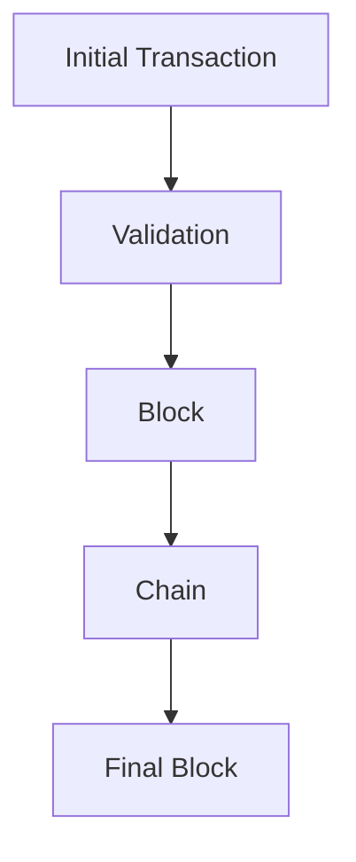
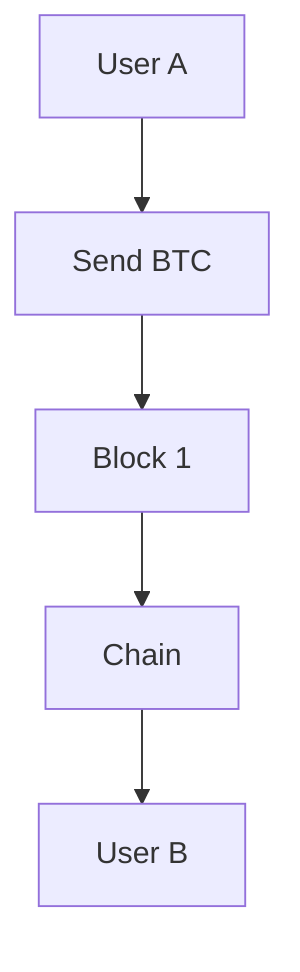
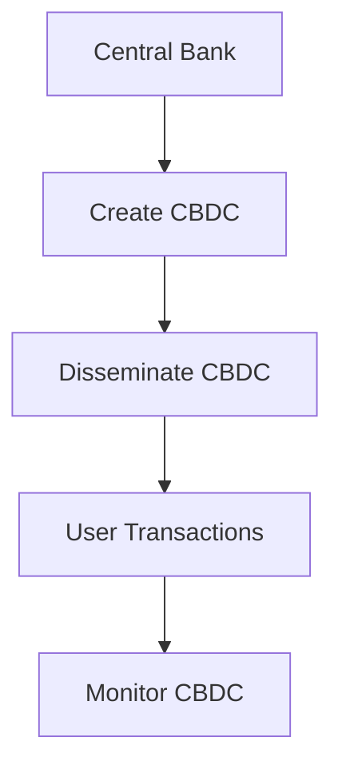
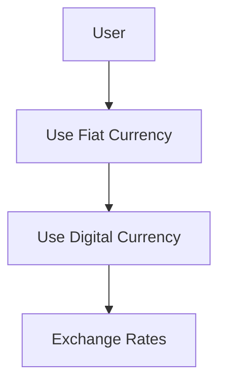
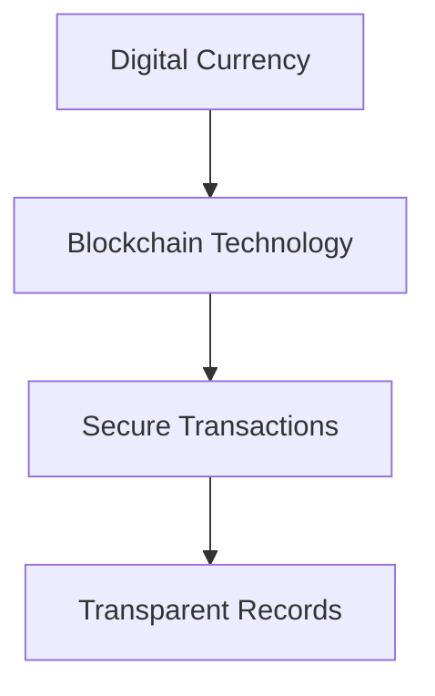

                 


### 关键词：
数字货币，区块链，金融系统，变革，机遇，挑战

### 摘要：
本文深入探讨数字货币的兴起对金融系统带来的变革，分析其机遇与挑战。通过分步骤的逻辑分析，本文首先介绍了数字货币的基础知识，然后探讨了其与金融系统的关系，接着分析了数字货币在实践中的应用，最后探讨了其未来趋势和伦理影响。文章旨在为读者提供一个全面、系统的数字货币分析框架。

----------------------------------------------------------------

# 数字货币的兴起：金融系统变革的机遇与挑战

## 引言

随着科技的飞速发展，金融领域正在经历一场深刻的变革。数字货币作为这一变革的先锋，正逐渐成为全球金融系统的重要组成部分。本文将带领读者深入了解数字货币的兴起，探讨其对金融系统的深远影响，分析其中的机遇与挑战。

## 背景介绍

### 数字货币的定义与核心概念

数字货币是一种基于区块链技术的虚拟货币，它利用密码学原理确保交易安全，并通过去中心化的方式实现价值的传递。数字货币的核心概念包括去中心化、匿名性、安全性和可追溯性。

### 问题背景

随着互联网的普及，传统金融系统面临着诸多问题，如效率低下、成本高昂、中心化风险等。数字货币的出现，为解决这些问题提供了一种可能的途径。

### 问题描述

数字货币的兴起带来了金融系统的变革，但这种变革也带来了一系列的挑战，如监管问题、技术难题、市场波动等。

### 问题解决

数字货币的兴起为金融系统带来了新的机遇，如提高交易效率、降低交易成本、促进金融包容性等。同时，通过合理的监管和技术创新，数字货币的挑战也可以得到有效解决。

### 边界与外延

数字货币作为一种新兴金融工具，其应用范围正在不断扩大。然而，数字货币的边界和限制也需要我们深入探讨，以确保其健康发展。

### 概念结构与核心要素组成

数字货币的概念结构主要包括区块链、加密算法、分布式账本等技术。其核心要素包括去中心化、匿名性、安全性和可追溯性。以下是数字货币的核心概念属性特征对比表格：

| 特征         | 数字货币 | 传统货币  |
| ------------ | -------- | --------- |
| 去中心化     | 是       | 否        |
| 匿名性       | 是       | 否        |
| 安全性       | 是       | 否        |
| 可追溯性     | 是       | 否        |
| 交易效率     | 高       | 低        |
| 交易成本     | 低       | 高        |

此外，数字货币的ER实体关系图如下所示：

```mermaid
erDiagram
  A[User] ||--|{ B[Transaction] }|
  A ||--|{ C[Wallet] }|
  B ||--|{ D[Block] }|
  D ||--|{ E[Chain] }|
```

## 数字货币的兴起

### 区块链技术

区块链是数字货币的核心技术之一。它通过去中心化的方式，实现数据的分布式存储和管理。区块链的主要特点包括不可篡改、可追溯、去中心化等。以下是区块链的mermaid流程图：



### 比特币

比特币是第一种成功的数字货币，它于2009年诞生。比特币通过区块链技术实现了去中心化的货币发行和交易。以下是比特币的工作原理的mermaid流程图：



### 区块链2.0

随着技术的发展，区块链2.0应运而生。区块链2.0主要指智能合约技术。智能合约是一种自动执行的合同，它通过区块链技术实现合同的自动化执行。以下是智能合约的工作原理的mermaid流程图：


## 数字货币在实践中的应用

### 中央银行数字货币（CBDC）

中央银行数字货币（CBDC）是由中央银行发行的数字货币。CBDC的引入有望提高货币政策的传导效率，降低交易成本，增强金融包容性。以下是CBDC的mermaid流程图：



### 数字货币与法定货币的共存

数字货币与法定货币的共存是数字货币应用的一个重要趋势。在这种模式下，数字货币与法定货币并行使用，互为补充。以下是数字货币与法定货币共存的mermaid流程图：



### 数字货币与区块链技术的结合

数字货币与区块链技术的结合为金融系统带来了新的机遇。区块链技术可以为数字货币提供安全、透明、高效的交易环境。以下是数字货币与区块链技术结合的mermaid流程图：



## 机遇与挑战

### 机遇

数字货币的兴起为金融系统带来了许多机遇。以下是数字货币的主要机遇：

1. **提高交易效率**：数字货币可以实现快速、低成本的跨境交易。
2. **降低交易成本**：数字货币的交易成本远低于传统金融系统。
3. **促进金融包容性**：数字货币有助于提高金融服务的普及率，特别是对于传统金融服务难以触及的人群。
4. **创新金融产品**：数字货币可以催生新的金融产品和服务，如去中心化金融（DeFi）。

### 挑战

数字货币的兴起也带来了一系列挑战。以下是数字货币的主要挑战：

1. **监管问题**：数字货币的监管仍处于探索阶段，如何平衡创新与监管成为一大挑战。
2. **技术难题**：数字货币的安全性和稳定性仍需进一步验证。
3. **市场波动**：数字货币市场波动较大，投资者需具备一定的风险承受能力。
4. **伦理问题**：数字货币的使用可能带来隐私泄露、洗钱等伦理问题。

## 未来趋势与前景

### 未来趋势

1. **数字货币的普及**：随着技术的进步和用户意识的提高，数字货币的普及率有望进一步增加。
2. **监管体系的完善**：各国政府将逐步完善数字货币的监管体系，以平衡创新与风险。
3. **金融科技的融合**：数字货币与金融科技的融合将推动金融系统的变革。
4. **国际合作的加强**：全球范围内的数字货币国际合作将有助于解决跨境交易等问题。

### 前景

数字货币的兴起有望为金融系统带来深远的变革。在未来，数字货币有望成为金融系统的重要组成部分，推动金融服务的创新和发展。

## 结论

数字货币的兴起是金融系统变革的重要驱动力。通过深入分析数字货币的兴起，我们看到了其带来的机遇与挑战。为了充分发挥数字货币的优势，我们需要加强监管，推动技术创新，同时关注其伦理和社会影响。

## 作者信息

作者：AI天才研究院/AI Genius Institute & 禅与计算机程序设计艺术 /Zen And The Art of Computer Programming

----------------------------------------------------------------

### 致谢

在撰写本文的过程中，我们得到了许多专家和同行的支持和帮助。特别感谢AI天才研究院的专家团队，他们的深入讨论和宝贵建议为本文的撰写提供了重要支持。此外，还要感谢所有参与本文评审和讨论的读者，你们的反馈和建议帮助我们不断完善文章内容。

### 参考文献

1. Nakamoto, S. (2008). Bitcoin: A Peer-to-Peer Electronic Cash System. https://www.bitcoin.com/bitcoin.pdf
2. Buterin, V. (2014). Ethereum: The Ultimate Smart Contract Platform. https://www.ethereum.org/whitepaper
3. Galia, A., & O'Neil, L. (2018). Blockchain: A Practical Guide to Developing Business, Law, and Technology Applications. https://www.oreilly.com/library/view/blockchain-a-practical/9781449375022/
4. Rasmussen, J. (2020). Central Bank Digital Currencies: A Practical Guide. https://www.cbr.org/research/reports/central-bank-digital-currencies-a-practical-guide
5. Timmermann, T. (2021). Digital Currencies and Blockchain Technology: A Comprehensive Guide. https://www.fintechguide.com/digital-currencies/

### 拓展阅读

1. Digital Currency Institute. (n.d.). Digital Currencies: The Basics. https://digitalcurrencyinstitute.org/learn/
2. CoinDesk. (n.d.). What is Blockchain Technology? https://www.coindesk.com/learn/what-is-blockchain-technology
3. Financial Conduct Authority. (n.d.). Central Bank Digital Currencies. https://www.fca.org.uk/future-of-finance/digital-currencies-central-bank-digital-currencies
4. International Monetary Fund. (n.d.). Central Bank Digital Currency. https://www.imf.org/en/Publications/WP
5. World Economic Forum. (n.d.). The Future of Digital Currencies. https://www.weforum.org/reports/the-future-of-digital-currencies

### 最佳实践 Tips

1. **了解数字货币的基本原理**：在投资数字货币之前，建议您深入了解数字货币的基本原理，包括区块链技术、加密算法等。
2. **关注市场动态**：数字货币市场波动较大，建议您关注市场动态，合理控制投资风险。
3. **遵守相关法规**：数字货币的监管政策正在不断完善，建议您遵守相关法规，确保合规运营。
4. **保护个人隐私**：数字货币交易具有一定的匿名性，但在进行交易时，仍需注意保护个人隐私，避免信息泄露。

### 小结

本文深入探讨了数字货币的兴起对金融系统变革的机遇与挑战。通过分析数字货币的基础知识、应用实践、机遇与挑战以及未来趋势，我们看到了数字货币在金融系统中的重要作用。希望本文能为读者提供有价值的参考和启示。在未来的研究中，我们期待进一步探讨数字货币在金融系统中的深层次影响，以及如何平衡创新与风险，推动金融系统的健康发展。

