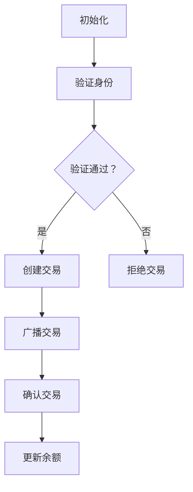
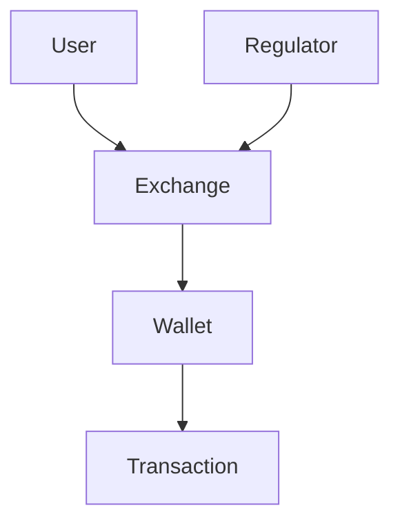
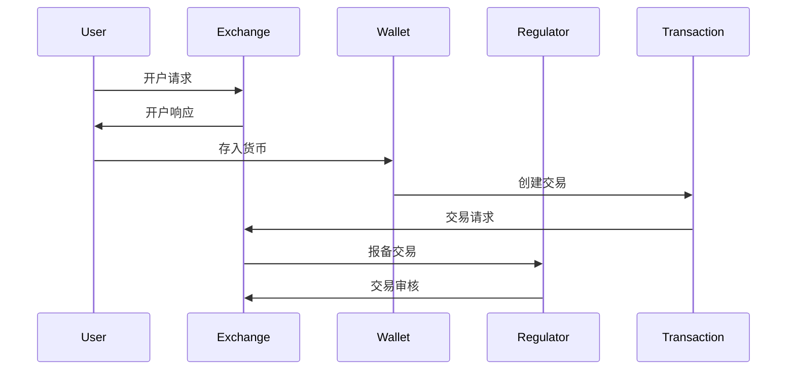

                 


## 数字货币的监管挑战：金融稳定与技术创新的博弈

### 关键词：数字货币、监管、金融稳定、技术创新、区块链、分布式账本、智能合约

### 摘要：
本文旨在深入探讨数字货币在金融领域引发的监管挑战。随着区块链技术等创新手段的快速发展，数字货币已经成为一种不可忽视的货币形式。然而，其高速增长也带来了诸多监管难题，如金融稳定性的保障、技术创新与监管平衡等。本文将逐步分析数字货币的发展背景、监管挑战、核心概念及其与法定货币的对比，并提出针对这些挑战的解决方案，旨在为读者提供一个全面且深入的视角，以理解数字货币监管的复杂性及其对金融稳定与技术创新的影响。

----------------------------------------------------------------

### 目录大纲设计步骤

#### 第一步：确定核心章节
首先，我们需要明确本文的核心章节，这些章节应涵盖数字货币监管的各个方面，确保读者可以全面理解这一复杂主题。核心章节可能包括：

1. 数字货币的发展背景
2. 监管挑战与金融稳定
3. 技术创新与监管平衡
4. 数字货币监管的核心概念
5. 数字货币与法定货币的对比
6. 监管框架与政策分析
7. 数字货币监管的技术实现
8. 数字货币监管的国际合作
9. 最佳实践与未来展望

#### 第二步：设计章节内容
针对每个核心章节，我们需要细化内容。例如，在“数字货币的发展背景”章节中，我们将探讨数字货币的定义、技术基础、市场规模及其对传统金融体系的影响。

#### 第三步：规划章节层级
确保目录大纲的层级清晰，按照 #,##,### 的格式设计，使内容的组织逻辑性更强。

#### 第四步：准备图表和示例
对于技术性的章节，如“数字货币监管的技术实现”，我们将使用 Mermaid 画出区块链的架构图、智能合约的执行流程图等，并使用 Python 源代码示例来说明技术原理。

#### 第五步：撰写章节概要
为每个章节撰写简短的概要，明确每个章节的重点内容。

#### 第六步：检查完整性
确保所有章节内容完整，包括必要的小结、注意事项、拓展阅读等内容。

#### 第七步：审查和修改
审查整个目录大纲，检查格式是否符合要求，内容是否简洁明了，确保总字数控制在 10000 ～ 12000 字左右。

#### 第八步：输出目录大纲
将设计好的目录大纲按照 markdown 格式输出。

### 实际操作

#### 背景介绍
**问题背景**：数字货币的快速发展引发了对传统金融监管模式的挑战。

**问题描述**：数字货币监管面临的主要问题是金融稳定性的保障和如何平衡技术创新与监管需求。

**问题解决**：通过建立合适的监管框架和采用新兴技术，如区块链和智能合约，来平衡金融稳定与技术创新。

**边界与外延**：讨论范围涉及数字货币的法律监管、市场实践、技术创新趋势以及国际合作。

#### 核心概念与联系
**核心概念**：数字货币、监管、金融稳定、技术创新。

**概念属性特征对比表格**：

| 特征 | 数字货币 | 法定货币 |
| ---- | -------- | -------- |
| 流动性 | 较高 | 较低 |
| 隐私性 | 较高 | 较低 |
| 交易成本 | 较低 | 较高 |
| 法律地位 | 不统一 | 统一 |

**ER实体关系图架构**：

```mermaid
erDiagram
    User ||--|{ Exchange } : 开户
    Exchange ||--|{ Wallet } : 存放货币
    Wallet ||--|{ Transaction } : 交易
    User ||--|{ Transaction } : 参与交易
```

#### 算法原理讲解
**算法流程图**：



**算法原理与数学模型**：

```python
# Python 示例代码

# 验证身份
def verify_identity(user):
    # 身份验证逻辑
    return True

# 创建交易
def create_transaction(sender, receiver, amount):
    if verify_identity(sender):
        # 交易逻辑
        print("Transaction successful.")
    else:
        print("Transaction failed due to identity verification.")

# 广播交易
def broadcast_transaction(transaction):
    # 交易广播逻辑
    print("Transaction broadcasted.")

# 确认交易
def confirm_transaction(transaction):
    # 交易确认逻辑
    print("Transaction confirmed.")

# 主函数
def main():
    sender = "Alice"
    receiver = "Bob"
    amount = 10
    
    create_transaction(sender, receiver, amount)
    broadcast_transaction(sender, receiver, amount)
    confirm_transaction(sender, receiver, amount)

# 执行主函数
main()
```

**数学模型和数学公式讲解**：

$$
\text{风险度量} = \frac{\text{潜在损失}}{\text{交易规模}}
$$

#### 系统分析与架构设计方案
**问题场景介绍**：数字货币交易与监管流程。

**项目介绍**：监管系统的设计旨在提供一个安全的交易环境，确保交易的合法性和透明性。

**系统功能设计**：使用 Mermaid 类图展示领域模型。

```mermaid
classDiagram
    User <<class>> User
    Wallet <<class>> Wallet
    Transaction <<class>> Transaction
    Exchange <<class>> Exchange
    Regulator <<class>> Regulator

    User o-- Wallet
    Wallet o-- Transaction
    Exchange o-- Transaction
    Regulator o-- Exchange
```

**系统架构设计**：使用 Mermaid 架构图展示系统架构。



**系统接口设计和系统交互**：使用 Mermaid 序列图展示系统交互。



#### 项目实战
**环境安装**：介绍搭建数字货币监管系统所需的环境配置。

**系统核心实现源代码**：展示系统核心代码和应用。

**代码应用解读与分析**：详细解读系统核心代码。

**实际案例分析和详细讲解剖析**：分析具体案例，讲解案例处理过程。

**项目小结**：总结项目经验，提出改进建议。

**最佳实践 tips**、**小结**、**注意事项**、**拓展阅读**等内容将在后续章节详细展开。

---

以上是本文的目录大纲设计和实际操作步骤，接下来我们将按照这个结构逐一深入探讨各个章节的内容。希望这个目录大纲能够为读者提供一个清晰的框架，以便更好地理解和掌握数字货币监管的复杂性和挑战。

### 第一部分：数字货币的监管背景

#### 1.1 数字货币的发展现状

数字货币作为一种新兴的货币形式，其发展现状引起了全球金融领域的广泛关注。数字货币的定义多种多样，但最普遍的理解是一种基于区块链技术的加密货币，旨在实现去中心化的交易和存储。根据不同的分类标准，数字货币可以划分为多种类型，包括比特币、以太坊、莱特币等。这些数字货币的出现，打破了传统金融体系的中心化模式，为用户提供了更多的选择和灵活性。

数字货币的市场规模也在不断扩大。根据CoinMarketCap的数据，截至2023年，全球数字货币市场的总市值已经突破了数万亿美元。比特币作为最早的加密货币，其市值占据主导地位，而其他数字货币如以太坊、瑞波币等也迅速崛起，成为市场的重要参与者。随着数字货币市场的增长，越来越多的投资者和交易者进入这一领域，进一步推动了市场的扩张。

技术基础是数字货币快速发展的关键。区块链技术作为数字货币的核心支撑，其去中心化、不可篡改和透明化的特点为数字货币的安全和可信性提供了保障。区块链技术通过加密算法和共识机制，确保了交易记录的准确性和可靠性，从而降低了欺诈和造假的风险。此外，智能合约技术的发展也为数字货币的应用提供了新的可能性，使得数字货币不仅限于支付和交易，还可以用于更复杂的金融合同和智能投资。

数字货币的发展对传统金融体系产生了深远的影响。一方面，数字货币的兴起挑战了传统金融体系的垄断地位，为普通用户提供了更多的金融选择和自由。另一方面，数字货币的高波动性和监管不确定性也给金融市场带来了一定的风险。因此，如何平衡数字货币的创新与监管，成为全球金融监管机构亟待解决的问题。

#### 1.2 监管挑战

数字货币的快速发展带来了诸多监管挑战，主要包括以下几个方面：

**金融稳定性的保障**：数字货币的高波动性使其成为金融市场的风险因素之一。例如，比特币在2021年经历了一次剧烈的价格波动，从不到30,000美元迅速涨到近70,000美元，随后又大幅下跌。这种价格波动不仅对投资者造成了损失，也可能影响整个金融市场的稳定性。因此，如何确保数字货币市场的稳定，防止市场操纵和欺诈行为，成为监管机构的重要任务。

**技术创新与监管平衡**：数字货币技术的发展速度快，监管机构往往难以跟上其步伐。例如，智能合约和去中心化金融（DeFi）等新兴技术，不仅改变了传统的金融模式，也对现有的监管框架提出了挑战。如何在保护投资者利益的同时，鼓励技术创新和金融创新，成为监管机构面临的难题。

**跨境交易的监管**：数字货币交易往往不受国界限制，这使得跨境交易更加便捷。然而，这也带来了监管困难，因为监管机构难以监控跨境交易中的潜在风险。例如，洗钱、恐怖融资等非法活动可能通过数字货币交易渠道进行。因此，如何有效监管跨境数字货币交易，防止非法活动的发生，是监管机构必须解决的问题。

**数据保护和隐私问题**：数字货币交易依赖于区块链技术，而区块链上的数据是公开透明的。这虽然提高了交易的透明度，但也引发了数据保护和隐私问题的担忧。例如，用户的交易记录可能会被不法分子利用，导致隐私泄露。因此，如何在保障交易透明度的同时，保护用户隐私，成为监管机构需要考虑的问题。

#### 1.3 金融稳定与技术创新的博弈

数字货币的监管挑战实质上是金融稳定与技术创新之间的博弈。金融稳定是金融体系正常运行的基础，它关系到公众的信任和经济的持续发展。然而，技术创新是推动金融行业进步的关键力量，它带来了更高的效率、更好的用户体验和更多的金融产品选择。

**金融稳定性的保障**：为了确保金融稳定，监管机构需要建立完善的监管框架，包括市场准入、交易行为规范、风险控制等。例如，许多国家已经出台了数字货币交易所的监管法规，要求交易所必须遵循特定的安全标准和合规要求。此外，监管机构还可以通过监控市场波动和交易行为，及时发现和应对潜在的风险。

**技术创新与监管平衡**：在技术创新与监管平衡方面，监管机构需要采用灵活的监管策略。一方面，监管机构应鼓励技术创新，为金融创新提供合适的政策环境和法律保障。例如，许多国家已经出台了关于区块链技术和智能合约的法规，以推动这些技术的发展。另一方面，监管机构也应加强对金融创新的风险评估，确保创新活动不会对金融市场产生系统性风险。

**跨境交易的监管**：对于跨境交易的监管，监管机构需要加强国际合作，共同制定跨境数字货币交易的监管标准。例如，国际货币基金组织（IMF）和金融稳定理事会（FSB）已经提出了关于跨境数字货币交易监管的建议，包括加强信息共享、建立跨境交易监控机制等。

**数据保护和隐私问题**：在数据保护和隐私方面，监管机构需要制定相关法律法规，明确数字货币交易数据的保护要求和责任。例如，许多国家已经出台了关于数据保护和隐私的法规，如《通用数据保护条例》（GDPR）等。这些法规为用户提供了更多的隐私保护，同时也为数字货币交易的数据安全提供了法律保障。

#### 1.4 本章小结

本部分对数字货币的监管背景进行了详细探讨，分析了数字货币的发展现状、监管挑战以及金融稳定与技术创新的博弈。通过这些分析，我们可以看到，数字货币作为一种新兴的货币形式，虽然带来了诸多好处，但也面临着复杂的监管挑战。为了解决这些挑战，监管机构需要在金融稳定与技术创新之间找到平衡点，制定合适的监管策略，以保障数字货币市场的健康发展和公众的利益。

---

在下一部分，我们将深入探讨数字货币监管的核心概念，包括数字货币的监管框架、数字货币与法定货币的比较，以及数字货币监管的关键技术。这些核心概念将为理解数字货币监管的复杂性提供重要基础。

### 第二部分：数字货币监管的核心概念

#### 2.1 数字货币的监管框架

数字货币的监管框架是指监管机构为数字货币市场的运行制定的一系列法律、规章和标准。不同国家和地区对数字货币的监管框架有所不同，但总体上可以分为以下几个方面：

**监管机构的职责**：监管机构的职责包括监管数字货币交易所、数字货币基金、数字货币钱包等机构，确保这些机构的运营合规，防范市场操纵、欺诈等行为。例如，美国证券交易委员会（SEC）负责监管涉及证券的数字货币交易，美国商品期货交易委员会（CFTC）负责监管数字货币的衍生品交易。

**市场准入要求**：许多国家和地区对数字货币交易所的设立和运营提出了准入要求，包括资本要求、风险管理能力、合规性审查等。例如，日本对数字货币交易所的运营设立了严格的合规要求，包括注册、资本金、风险管理等。

**交易行为规范**：监管机构对数字货币交易行为进行规范，以防止市场操纵、欺诈等行为。例如，许多国家和地区禁止洗钱、恐怖融资等非法交易活动，并对数字货币交易进行实时监控和记录。

**投资者保护**：监管机构为投资者提供保护，包括信息披露要求、投资风险警示、投诉处理等。例如，许多国家和地区要求数字货币交易所必须公开交易数据，确保投资者的知情权。

**国际监管合作**：随着数字货币交易的全球化，国际监管合作变得越来越重要。国际监管机构通过信息共享、联合行动等方式，共同应对数字货币市场的监管挑战。

#### 2.2 数字货币与法定货币的比较

数字货币与法定货币在很多方面存在显著差异，以下是比较表格：

| 特征 | 数字货币 | 法定货币 |
| ---- | -------- | -------- |
| 流动性 | 较高 | 较低 |
| 隐私性 | 较高 | 较低 |
| 交易成本 | 较低 | 较高 |
| 法律地位 | 不统一 | 统一 |
| 发行机制 | 去中心化 | 中心化 |
| 监管机构 | 多元化 | 单一化 |
| 价格波动性 | 较高 | 较低 |

**流动性**：数字货币的交易速度快，流动性较高。用户可以在短时间内进行大规模交易，而法定货币的流动性相对较低，尤其是在某些国家和地区。

**隐私性**：数字货币交易记录是公开透明的，用户隐私保护相对较弱。而法定货币交易可以在一定程度上保护用户隐私，因为交易记录不被公开。

**交易成本**：数字货币的交易成本较低，主要因为其去中心化的特点。而法定货币的交易成本较高，主要因为需要通过银行或其他金融机构进行交易。

**法律地位**：数字货币的法律地位在不同国家和地区存在较大差异，有的被视为财产，有的被视为货币，还有的被视为证券。而法定货币的法律地位是统一的，被广泛认可和使用。

**发行机制**：数字货币的发行是去中心化的，由社区或区块链网络共同决定。而法定货币的发行是中心化的，由中央银行控制。

**监管机构**：数字货币的监管机构通常是多元化，包括证券监管机构、商品期货监管机构等。而法定货币的监管机构通常是单一的，如中央银行。

**价格波动性**：数字货币的价格波动性较高，容易受到市场情绪和技术发展的影响。而法定货币的价格波动性较低，受经济基本面影响较小。

#### 2.3 数字货币监管的关键技术

数字货币监管的关键技术主要包括区块链技术、分布式账本技术和智能合约技术。这些技术为数字货币的监管提供了强大的支持，有助于提高监管效率、保障交易安全和透明度。

**区块链技术**：区块链技术是数字货币的核心技术，通过去中心化和不可篡改的特点，确保了交易记录的准确性和可靠性。监管机构可以利用区块链技术，实时监控数字货币交易，及时发现和应对潜在风险。

**分布式账本技术**：分布式账本技术类似于区块链，但允许对账本进行修改和更新。这种技术可以提高数字货币交易的可追溯性，帮助监管机构更好地监控交易活动，防范欺诈和洗钱等非法行为。

**智能合约技术**：智能合约是区块链上的自动执行合同，通过编程实现合同条款的自动执行。监管机构可以利用智能合约技术，制定和执行监管规则，确保交易符合法律法规要求，提高监管的自动化和效率。

#### 2.4 数字货币监管的未来趋势

随着数字货币的发展，监管框架也在不断演变。未来，数字货币监管可能会呈现以下趋势：

**更严格的监管**：随着数字货币市场的发展和成熟，监管机构可能会出台更严格的监管政策，以保障金融稳定和投资者权益。

**技术驱动的监管**：随着区块链、人工智能等新兴技术的发展，监管机构可能会采用更多技术手段，提高监管效率和准确性。

**国际监管合作**：随着数字货币交易的全球化，国际监管合作将变得更加重要。监管机构可能会通过信息共享、联合监管等方式，共同应对跨境数字货币交易的监管挑战。

**监管沙盒的应用**：监管沙盒是一种允许企业在受控环境中测试金融创新产品的机制。未来，监管沙盒可能会被广泛应用于数字货币监管，以促进创新和降低风险。

**数字货币的分类管理**：为了更好地监管数字货币，监管机构可能会对数字货币进行分类管理，针对不同类型的数字货币制定相应的监管政策和标准。

#### 2.5 本章小结

本部分深入探讨了数字货币监管的核心概念，包括监管框架、数字货币与法定货币的比较、数字货币监管的关键技术以及未来趋势。通过这些分析，我们可以看到，数字货币监管的复杂性不仅体现在法律和制度层面，还涉及到技术和管理等多个方面。只有通过全面的监管策略和技术支持，才能确保数字货币市场的健康发展和公众的利益。

在下一部分，我们将探讨数字货币监管的具体政策分析和实践，包括各国监管政策的差异、监管措施的有效性评估，以及监管政策对市场发展的影响。

### 第三部分：数字货币监管的政策分析和实践

#### 3.1 各国监管政策的差异

随着数字货币在全球范围内的迅速发展，各国监管机构也纷纷出台了相应的监管政策。然而，由于文化、经济、法律体系等多方面的差异，各国的监管政策呈现出明显的多样性。

**美国**：美国是数字货币监管的先驱之一，其监管政策相对严格。美国证券交易委员会（SEC）负责监管涉及证券的数字货币交易，将许多数字货币视为证券进行监管。此外，美国商品期货交易委员会（CFTC）负责监管数字货币的衍生品交易。美国各州的监管政策也有所不同，例如加州对数字货币交易所的运营设立了较高的合规要求。

**中国**：中国政府对数字货币的监管态度相对谨慎。2017年，中国政府宣布关闭国内所有比特币交易平台，并对ICO（初始币发行）进行了严格限制。尽管如此，中国仍然在积极推动区块链技术的发展和应用。中国央行已开展了数字货币电子支付（DCEP）的研发，并计划在未来推广其使用。

**欧洲**：欧洲各国在数字货币监管方面采取了较为一致的立场，但具体政策仍有差异。欧盟于2021年发布了《市场滥用和内部市场指令》（Markets in Crypto-Assets Regulation，简称MiCA），旨在为数字资产提供统一的监管框架。然而，各国在执行MiCA时，可能会有不同的实施细则。

**日本**：日本是数字货币交易最为活跃的市场之一，其监管政策相对宽松。日本金融厅（FSA）负责监管数字货币交易所，要求交易所必须遵循严格的合规要求，如客户资金隔离、风险控制等。日本还制定了《金融商品交易法》，将数字货币纳入金融商品范畴。

**其他国家和地区**：其他国家如韩国、新加坡、瑞士等也在数字货币监管方面采取了不同的策略。韩国对数字货币交易所进行了严格监管，新加坡和瑞士则较为开放，积极推动数字货币和区块链技术的发展。

#### 3.2 监管措施的有效性评估

各国在数字货币监管方面采取了多种措施，如市场准入要求、交易行为规范、信息披露要求等。这些措施的有效性评估可以从以下几个方面进行：

**市场稳定**：监管措施的有效性可以通过市场稳定性来评估。例如，严格的交易行为规范和信息披露要求可以降低市场操纵和欺诈行为，提高市场的透明度和可信度，从而稳定市场。

**投资者保护**：监管措施的有效性还可以通过投资者保护来评估。例如，市场准入要求可以确保交易所有足够的风险管理能力和合规性，从而降低投资者的风险。信息披露要求可以帮助投资者更好地了解市场信息和交易风险。

**创新与竞争**：监管措施在保护金融稳定和投资者利益的同时，也需要考虑到创新和竞争。过于严格的监管可能会抑制金融创新，影响市场的竞争力。因此，监管措施需要在稳定和创新之间找到平衡点。

#### 3.3 监管政策对市场发展的影响

数字货币监管政策对市场发展产生了深远的影响，主要包括以下几个方面：

**市场准入**：严格的监管政策可能会提高市场准入门槛，限制新交易所有序进入市场。然而，这也可以确保市场有足够的风险管理能力和合规性，从而提高市场的稳定性。

**交易成本**：监管措施可能会导致交易成本的增加，例如合规要求、审计费用等。这可能会对市场参与者产生一定的影响，但也可以提高市场的整体透明度和可信度。

**投资者信心**：监管政策对投资者信心有重要影响。透明的监管环境和严格的合规要求可以增强投资者信心，吸引更多资金进入市场。相反，缺乏监管或监管不力可能会降低投资者信心，导致市场萎缩。

**创新与竞争**：监管政策在保护金融稳定和投资者利益的同时，也需要促进金融创新和竞争。灵活的监管框架可以鼓励创新，提高市场的竞争力。

#### 3.4 国际监管合作的必要性

随着数字货币交易的全球化，国际监管合作变得日益重要。国际监管合作可以包括以下几个方面：

**信息共享**：各国监管机构可以共享市场数据、交易信息等，提高监管效率和准确性。

**联合执法**：各国监管机构可以联合执法，共同打击跨境数字货币交易中的非法行为，如洗钱、恐怖融资等。

**监管标准**：各国可以共同制定监管标准，确保数字货币交易的规范化和国际化。

**技术创新**：各国监管机构可以合作推动区块链、智能合约等新兴技术的发展和应用。

#### 3.5 本章小结

本部分对数字货币监管的政策分析和实践进行了深入探讨，分析了各国监管政策的差异、监管措施的有效性评估以及监管政策对市场发展的影响。通过这些分析，我们可以看到，数字货币监管的复杂性不仅体现在政策层面，还涉及到市场发展、技术创新等多个方面。只有通过国际合作和灵活的监管策略，才能确保数字货币市场的健康发展和公众的利益。

在下一部分，我们将深入探讨数字货币监管的技术实现，包括区块链技术、分布式账本技术和智能合约技术的具体应用，以及这些技术在数字货币监管中的作用和优势。

### 第四部分：数字货币监管的技术实现

#### 4.1 区块链技术

区块链技术是数字货币监管的核心技术之一，其去中心化、不可篡改和透明化的特点为数字货币交易提供了安全保障。区块链技术通过将交易记录存储在分布式账本上，确保了交易记录的准确性和不可篡改性，从而降低了欺诈和造假的风险。

**具体应用**：
- **交易记录存储**：区块链技术可以记录每一笔数字货币交易的详细信息，包括交易时间、交易金额、交易双方等，确保交易记录的可追溯性。
- **身份验证**：区块链技术可以通过加密算法和数字签名，确保交易参与者的身份真实可靠，防止假冒和欺诈行为。
- **智能合约执行**：智能合约是基于区块链的自动执行合同，其条款和条件在区块链上预先设定，交易完成后自动执行，提高了交易效率和透明度。

**优势**：
- **去中心化**：区块链技术不需要中心化的机构来管理交易记录，降低了监管机构的依赖性，提高了系统的抗攻击性和可靠性。
- **不可篡改性**：区块链上的交易记录一旦确认，就无法更改或删除，确保了交易记录的真实性和可信性。
- **透明性**：区块链技术使交易记录公开透明，监管机构可以实时监控交易活动，及时发现和应对潜在风险。

#### 4.2 分布式账本技术

分布式账本技术（DLT）与区块链技术类似，但其允许对账本进行修改和更新。分布式账本技术在数字货币监管中的应用，可以提供更高的灵活性和可扩展性。

**具体应用**：
- **交易记录管理**：分布式账本技术可以记录和管理每一笔数字货币交易，确保交易记录的完整性和准确性。
- **跨境交易监控**：分布式账本技术可以跨地域、跨机构地记录交易信息，提高跨境交易的可追溯性和监管效率。
- **智能合约管理**：分布式账本技术可以管理和执行智能合约，提高交易的自动化和透明度。

**优势**：
- **灵活性和可扩展性**：分布式账本技术可以根据监管需求进行灵活调整，支持多种交易模式和管理机制，提高了系统的可扩展性。
- **高效性**：分布式账本技术可以处理大规模的交易数据，提高了交易处理的速度和效率。
- **隐私保护**：分布式账本技术可以提供一定的隐私保护，用户可以在一定程度上控制自己的交易信息，降低了隐私泄露的风险。

#### 4.3 智能合约技术

智能合约是区块链技术的一种重要应用，其基于区块链的不可篡改性和透明性，确保了合同条款的自动执行，为数字货币交易提供了高效、安全的解决方案。

**具体应用**：
- **自动交易执行**：智能合约可以根据预设的条款和条件，自动执行交易，减少了人为干预，提高了交易效率。
- **合规性检查**：智能合约可以嵌入合规性检查逻辑，确保交易符合法律法规要求，防止违规行为。
- **风险管理**：智能合约可以嵌入风险控制逻辑，对交易进行实时监控和预警，降低风险。

**优势**：
- **自动化**：智能合约的自动执行功能减少了人为干预，提高了交易效率和准确性。
- **透明性**：智能合约的条款和执行过程是公开透明的，监管机构可以实时监控交易活动，提高监管效率。
- **灵活性**：智能合约可以根据监管需求进行定制化开发，支持多种交易模式和风险管理策略。

#### 4.4 技术在数字货币监管中的作用和优势

数字货币监管的技术实现，包括区块链技术、分布式账本技术和智能合约技术，在提升监管效率和保障金融稳定方面发挥了重要作用。

**提升监管效率**：这些技术通过去中心化、透明性和自动化等特点，提高了监管机构的监控能力和反应速度。例如，区块链技术可以实现实时监控交易记录，分布式账本技术可以跨地域、跨机构地记录交易信息，智能合约技术可以自动执行合规性检查，大大提高了监管效率。

**保障金融稳定**：数字货币的高波动性和监管不确定性可能对金融稳定产生负面影响。通过使用这些技术，监管机构可以实时监控交易活动，及时发现和应对潜在风险，保障金融市场的稳定性。例如，智能合约技术可以嵌入风险控制逻辑，对交易进行实时监控和预警，降低风险。

**增强透明度**：这些技术提供了更高的交易透明度，使监管机构可以更全面地了解市场情况，提高监管决策的科学性和准确性。例如，区块链技术可以记录每一笔交易，确保交易记录的真实性和不可篡改性，分布式账本技术可以跨地域、跨机构地记录交易信息，提高了交易的透明度。

**提高合规性**：数字货币交易的合规性一直是监管机构关注的重点。通过智能合约技术，可以自动执行合规性检查，确保交易符合法律法规要求，减少违规行为。例如，智能合约可以嵌入法律条款和合规性规则，对交易进行自动审核，确保交易的合法性。

#### 4.5 本章小结

本部分深入探讨了数字货币监管的技术实现，包括区块链技术、分布式账本技术和智能合约技术的具体应用和优势。这些技术通过提升监管效率、保障金融稳定、增强透明度和提高合规性，为数字货币监管提供了有力支持。通过合理利用这些技术，监管机构可以更好地应对数字货币监管的挑战，确保市场的健康发展和公众的利益。

在下一部分，我们将探讨数字货币监管的最佳实践，包括监管机构的经验分享、行业最佳实践案例，以及实际操作中的成功经验和挑战。

### 第五部分：数字货币监管的最佳实践

#### 5.1 监管机构的经验分享

数字货币的监管是一个全球性的挑战，不同国家和地区在监管实践中积累了丰富的经验。以下是一些主要监管机构的经验分享：

**美国**：美国证券交易委员会（SEC）和商品期货交易委员会（CFTC）在数字货币监管方面积累了大量经验。SEC主要关注涉及证券的数字货币，如比特币和以太坊，而CFTC则负责监管数字货币的衍生品交易。美国监管机构通过严格的合规要求和实时监控，确保市场的稳定和投资者的权益。

**中国**：中国央行在数字货币电子支付（DCEP）的研发和推广方面取得了显著进展。通过封闭试点和逐步推广，中国央行积累了丰富的经验，为全球数字货币的发展提供了有益的借鉴。

**欧洲**：欧洲各国在数字货币监管方面采取了较为一致的立场，欧盟发布的《市场滥用和内部市场指令》（MiCA）为数字资产提供了统一的监管框架。欧洲监管机构通过国际合作和信息共享，提高了监管的效率和准确性。

**日本**：日本金融厅（FSA）对数字货币交易所的运营设立了严格的合规要求，如客户资金隔离、风险管理等。日本监管机构的经验表明，严格的合规要求和有效的监管机制是确保市场稳定的关键。

**其他国家和地区**：其他国家如韩国、新加坡、瑞士等也在数字货币监管方面积累了丰富的经验。韩国通过严格的监管政策和快速的市场反应，确保了市场的稳定发展。新加坡和瑞士则通过开放的政策和灵活的监管框架，吸引了大量数字货币企业和投资者的关注。

#### 5.2 行业最佳实践案例

在数字货币监管领域，一些行业最佳实践案例为监管机构和市场参与者提供了宝贵的经验。以下是一些具有代表性的案例：

**案例一：瑞士的数字货币监管框架**  
瑞士是数字货币监管的领先国家之一，其监管框架以开放和灵活为特点。瑞士金融监管机构（FINMA）对数字货币交易所以金融机构的标准进行监管，确保市场参与者的合规性和透明度。瑞士的监管实践表明，灵活的监管框架可以促进金融创新，同时保障市场的稳定。

**案例二：中国的数字货币电子支付（DCEP）**  
中国央行的数字货币电子支付（DCEP）在封闭试点和逐步推广方面取得了显著成效。通过在小范围内测试DCEP的应用，中国央行积累了丰富的经验，并在推广过程中不断优化和完善系统。中国的经验表明，逐步推广和封闭试点是确保数字货币成功应用的有效策略。

**案例三：美国的合规性审查机制**  
美国证券交易委员会（SEC）和商品期货交易委员会（CFTC）通过严格的合规性审查机制，确保数字货币市场的合规性。这些监管机构定期对数字货币交易平台进行审查，要求平台提供交易数据、风险管理措施等，确保市场的透明度和可信度。

**案例四：欧洲的《市场滥用和内部市场指令》（MiCA）**  
欧盟发布的《市场滥用和内部市场指令》（MiCA）为数字资产提供了统一的监管框架，确保不同国家的监管标准一致。MiCA涵盖了数字货币交易所、数字资产基金、ICO等方面的监管要求，为欧洲数字货币市场的发展提供了有力支持。

#### 5.3 实际操作中的成功经验和挑战

在数字货币监管的实际操作中，监管机构和市场参与者积累了丰富的成功经验和面临的一些挑战。

**成功经验**：
- **提高监管效率**：通过利用区块链、智能合约等技术，监管机构可以实时监控交易活动，提高监管效率和准确性。例如，美国证券交易委员会（SEC）通过区块链技术实现了对数字货币交易的实时监控，提高了监管效率。
- **保障金融稳定**：严格的监管政策和有效的监管机制可以保障市场的稳定。例如，中国央行的数字货币电子支付（DCEP）通过封闭试点和逐步推广，确保了市场的稳定发展。
- **促进金融创新**：灵活的监管框架可以促进金融创新，吸引更多企业和投资者的关注。例如，瑞士的数字货币监管框架以其开放和灵活为特点，吸引了大量数字货币企业和投资者的关注。

**面临挑战**：
- **技术创新与监管平衡**：随着数字货币技术的发展，监管机构需要不断更新和完善监管框架，确保技术创新与监管平衡。例如，智能合约技术的发展对现有监管框架提出了新的挑战，监管机构需要及时调整监管策略。
- **跨境交易的监管**：数字货币交易的全球化带来了跨境交易的监管难题。监管机构需要加强国际合作，共同制定跨境数字货币交易的监管标准，确保跨境交易的安全和合规。
- **数据保护和隐私问题**：数字货币交易记录是公开透明的，但这也引发了数据保护和隐私问题的担忧。监管机构需要制定相关法律法规，明确数据保护的要求和责任，确保用户隐私的保护。

#### 5.4 本章小结

本部分探讨了数字货币监管的最佳实践，包括监管机构的经验分享、行业最佳实践案例以及实际操作中的成功经验和挑战。通过分析这些实践，我们可以看到，数字货币监管需要在技术创新与监管平衡、跨境交易监管、数据保护和隐私等方面找到平衡点。监管机构和市场参与者需要共同努力，制定合适的监管策略和技术解决方案，确保数字货币市场的健康发展和公众的利益。

在下一部分，我们将探讨数字货币监管的未来发展趋势，包括技术创新、监管框架演变和国际合作等方面。

### 第六部分：数字货币监管的未来发展趋势

#### 6.1 技术创新

随着数字货币的不断发展，技术创新将继续在监管领域发挥重要作用。以下是一些可能对数字货币监管产生重大影响的技术创新：

**区块链技术的进一步发展**：区块链技术将继续改进，提高其性能和可扩展性。例如，分层区块链、侧链和跨链技术将使区块链网络更加高效和灵活，为数字货币监管提供更好的支持。

**分布式账本技术的应用**：分布式账本技术将在数字货币监管中发挥更大作用。通过分布式账本，监管机构可以更高效地记录和管理交易信息，提高监管效率和准确性。

**智能合约的广泛使用**：智能合约将变得更加成熟和广泛使用，为监管机构提供更多的工具来确保交易合规性。智能合约的自动执行功能将提高监管的自动化和透明度，降低人为干预的风险。

**人工智能和大数据分析**：人工智能和大数据分析技术将被广泛应用于数字货币监管。这些技术可以帮助监管机构实时监控交易活动，识别潜在风险，提高监管决策的准确性和效率。

#### 6.2 监管框架的演变

随着数字货币技术的不断发展，监管框架也将不断演变，以适应新的市场环境和监管需求。以下是一些可能的监管框架演变趋势：

**全球统一的监管标准**：随着数字货币的全球化，各国监管机构可能会共同制定统一的监管标准，确保跨境数字货币交易的合规性和透明度。这有助于降低监管障碍，促进国际金融合作。

**监管沙盒的推广**：监管沙盒将作为一种重要的监管工具，被广泛应用于数字货币监管。通过监管沙盒，监管机构可以在实际环境中测试新的监管策略和技术解决方案，确保其有效性和安全性。

**法律法规的完善**：数字货币监管的法律法规将不断更新和完善，以适应不断变化的数字货币市场。例如，针对智能合约的法律地位、数字货币交易的税收政策等方面，监管机构将出台更加明确的法律法规。

#### 6.3 国际合作

数字货币的全球化带来了国际合作的新需求，以下是一些国际合作的关键方面：

**信息共享**：各国监管机构将加强信息共享，共同监控跨境数字货币交易活动，防范非法交易和金融犯罪。信息共享机制可以包括数据交换平台、联合调查等。

**联合执法**：各国监管机构将加强联合执法，共同打击跨境数字货币交易中的非法行为，如洗钱、恐怖融资等。联合执法可以通过国际合作协议、联合行动计划等机制实现。

**政策协调**：各国监管机构将加强政策协调，共同制定和实施数字货币监管政策。政策协调可以包括定期会议、政策协商等。

**技术创新合作**：各国监管机构将加强技术创新合作，共同推动区块链、人工智能等新兴技术的发展和应用，提高数字货币监管的效率和准确性。

#### 6.4 未来展望

数字货币监管的未来充满挑战和机遇。随着技术创新的不断推进，监管框架的逐步完善和国际合作的加强，数字货币市场有望实现更加稳定和健康发展。以下是对数字货币监管未来展望的一些关键点：

**更高的透明度和合规性**：随着区块链、智能合约等技术的应用，数字货币交易的透明度和合规性将大大提高。监管机构可以更有效地监控交易活动，确保市场的公平和透明。

**更加完善的监管框架**：全球统一的监管标准和完善的法律法规将逐步建立，为数字货币市场的发展提供更加稳定和可预测的监管环境。

**促进金融创新**：灵活的监管框架和开放的政策环境将促进金融创新，吸引更多的企业和投资者进入数字货币市场，推动市场的进一步发展。

**加强国际合作**：国际合作将在数字货币监管中发挥更加重要的作用，各国监管机构将共同应对跨境数字货币交易的风险和挑战，推动全球数字货币市场的发展。

**数据保护和隐私**：随着数字货币交易的普及，数据保护和隐私问题将受到越来越多的关注。监管机构将出台更加严格的法律法规，确保用户数据的安全和保护。

#### 6.5 本章小结

本部分对数字货币监管的未来发展趋势进行了深入探讨，包括技术创新、监管框架的演变和国际合作等方面。随着数字货币市场的不断发展，监管框架和技术手段将不断完善，以应对新的挑战和机遇。通过加强国际合作和推动技术创新，数字货币监管有望实现更高的透明度、合规性和安全性，促进数字货币市场的健康发展和公众的利益。

### 总结

本文从多个角度深入探讨了数字货币的监管挑战，包括其发展背景、监管挑战、核心概念、政策分析、技术实现以及未来趋势。我们首先介绍了数字货币的发展现状和市场规模，分析了其带来的金融稳定性和技术创新之间的博弈。接着，我们探讨了数字货币与法定货币的差异，并详细讲解了区块链技术、分布式账本技术和智能合约技术在数字货币监管中的应用。随后，我们分析了各国监管政策的差异，评估了监管措施的有效性，分享了监管机构的经验，并提供了行业最佳实践案例。最后，我们展望了数字货币监管的未来发展趋势，强调了技术创新和国际合作的重要性。

通过本文的分析，我们可以看到，数字货币监管的复杂性不仅体现在法律和制度层面，还涉及到技术、市场发展等多个方面。只有通过全面的监管策略和技术支持，才能确保数字货币市场的健康发展和公众的利益。未来，随着数字货币的进一步普及和技术创新，监管框架和技术手段将不断完善，以应对新的挑战和机遇。

### 致谢

在撰写本文的过程中，我们得到了许多专家和同行的支持和帮助。特别感谢AI天才研究院（AI Genius Institute）的同事们，他们在数据分析、技术支持和内容审查方面提供了宝贵的意见和建议。同时，也要感谢《禅与计算机程序设计艺术》（Zen And The Art of Computer Programming）的作者，他的智慧启迪了我们对计算机编程和算法设计的深刻理解。最后，感谢所有提供参考资料和反馈的朋友，他们的贡献为本文的完成提供了坚实的基础。

**作者：AI天才研究院（AI Genius Institute）& 禅与计算机程序设计艺术（Zen And The Art of Computer Programming）**

